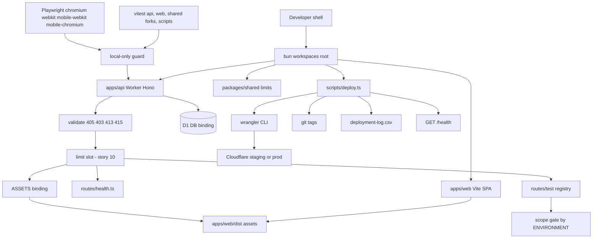
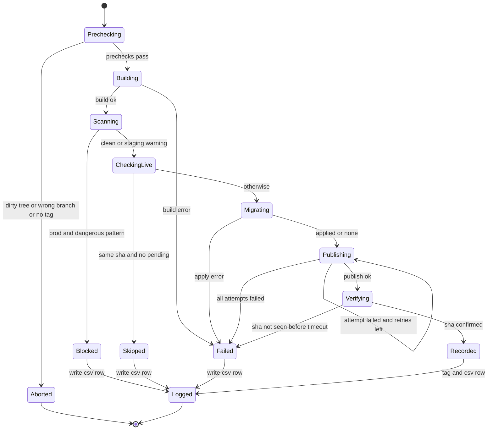
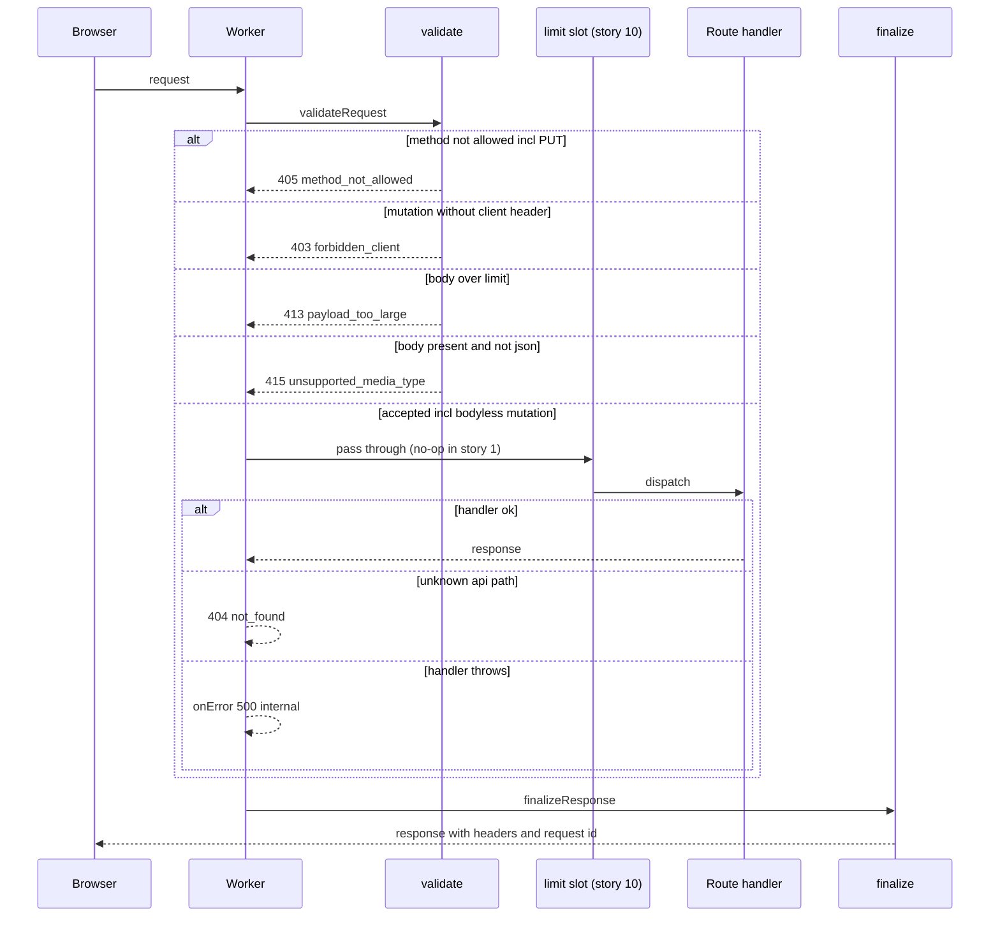
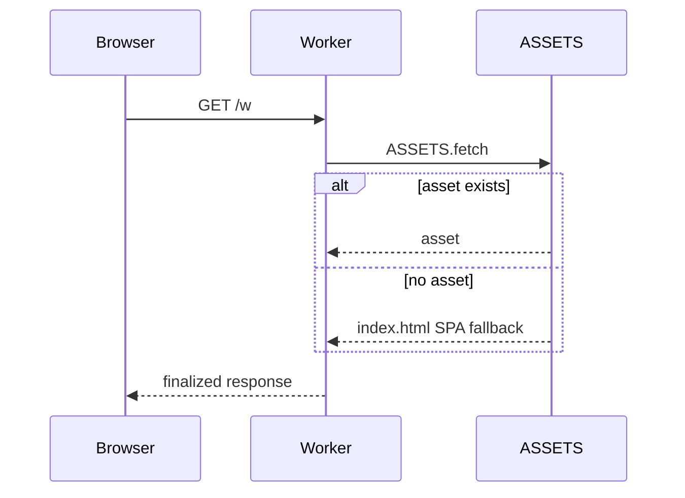
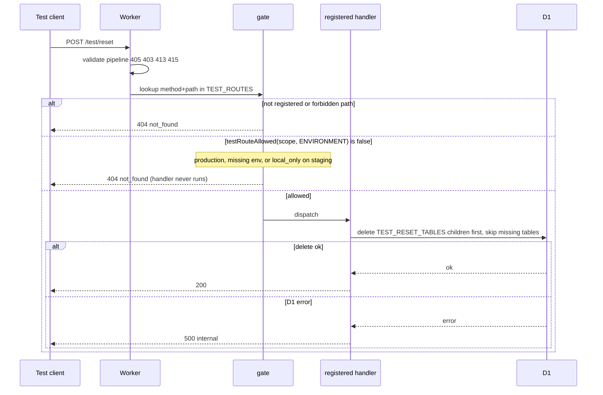
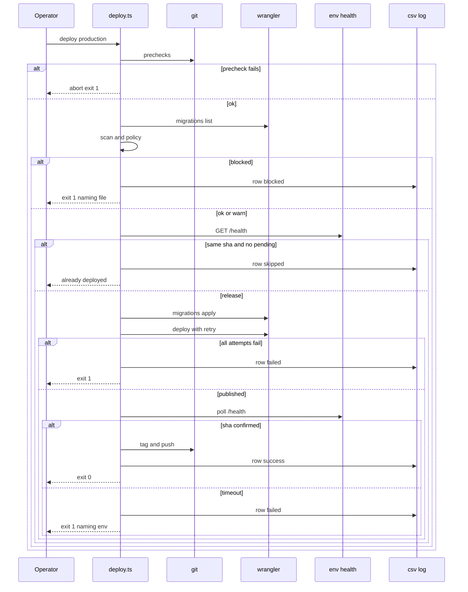

# Technical Design

Bun-workspace monorepo; one Worker (Hono) serving API + SPA assets; request pipeline with security headers; health with version injection; vitest-pool-workers/vitest/Playwright harness guarded to local; bun deploy script with safety scan, idempotency, retry, verification, tags and CSV log.

## Overview

Story 1 creates the deployable skeleton every later story ships through. It implements docs/architecture.md sections 1-3, 6 (pipeline, health, test routes) and 9-10 (constants, test levels), and conforms to the cross-story resolutions D-21 (validate pipeline 405 → 403 → 413 → 415, 415 explicit), D-35 (`/test/*` registry, local-only destructive/fault routes and `TEST_NOW`, no `/test/sql`), D-36 (Playwright and vitest matrix) and D-44 (PUT is 405). It introduces no D1 tables (0001 belongs to story 2) and does NOT declare the WorkspaceRoom Durable Object binding: a DO binding requires an exported class plus a DO migration tag, which is owned by story 4. wrangler.toml carries a commented placeholder only. Shared artefacts owned here and how later stories extend them are listed in "Extension points owned by story 1".

Key decisions:
- Worker runs first for every request (`assets.run_worker_first = true`) so that X-Request-Id and security headers are applied to SPA/asset responses too (PRD: every response). The Worker delegates non-API paths to `env.ASSETS.fetch` and finalizes the result. Cache-Control no-store is applied only to /api, /health and /test paths so hashed assets stay cacheable.
- Version metadata is injected at deploy time via `wrangler deploy --var APP_VERSION:.. --var GIT_SHA:.. --var DEPLOYED_AT:..`; local defaults are `dev`/null.
- Deploy tooling is a bun TypeScript program (`scripts/deploy.ts` + `scripts/deploy/*.ts`) with all side-effecting operations injected (`DeployDeps`) so units are pure and integration tests can substitute only the Cloudflare boundary (a fake `wrangler` executable) while git, filesystem and HTTP health are real.
- Error codes owned here (architecture §6): `method_not_allowed` (405), `forbidden_client` (403), `payload_too_large` (413), `unsupported_media_type` (415), `not_found`, `internal`.
- Test routes are one registry with per-route scope (`non_production` or `local_only`), gated fail-closed on `ENVIRONMENT`; there is no arbitrary-SQL route.
- Browser tests run on desktop Chromium and WebKit for every spec, plus iPhone 13 WebKit and Pixel 7 Chromium for `@mobile` specs.

## Structure



## State

The release pipeline has persisted outcomes (git tags, CSV log rows, D1 migration state, deployed Worker version), so its lifecycle is modelled:



D1 migration files move pending -> applied only via `wrangler d1 migrations apply` inside Migrating; there is no automatic rollback (out of scope).

## Extension points owned by story 1

Per architecture.md §13 and the registry in `specs/general/CROSS-STORY-RESOLUTIONS.md`, story 1 owns the artefacts below and this design states their **final shape**. A later story extends them only through the named points; if it needs something not listed here, it edits this section and the owning capability too, and records a "Delta to story 1" in its own design.

| Artefact (capability) | Extension point | Extenders |
|---|---|---|
| Validate pipeline, 405 → 403 → 413 → 415 (platform.request_pipeline; D-21) | **Limit slot** between validate and routes in `app.ts`. The four checks and their order are fixed; PUT is never an allowed method (D-44). | 10 (rate limiter) |
| `ErrorCode` union + `errorResponse` in `apps/api/src/lib/errors.ts` | Add union members from architecture §6 (e.g. `id_conflict`, `limit_reached`, `batch_mismatch`, `project_not_found`, `upgrade_required`, `rate_limited`, `link_changed`); never rename or remove. | 4, 5, 7, 9, 10 |
| `finalizeResponse` | Header set is fixed. Story 4 adds the 101 WebSocket pass-through (architecture §6) inside it. | 4 |
| `/test/*` registry (testing.test_routes; D-35) | Append a `TestRouteDef` to `TEST_ROUTES` with a `scope`; append new tables to `TEST_RESET_TABLES`. The gate, the fail-closed environment rule and `FORBIDDEN_TEST_PATHS` are not editable by extenders. | 2 (seed-workspace), 3 (remembered-seed), 5 (seed), 6 (tasks raw; seed fields), 7 (fault, local_only; seed fields), 8 (seed fields), 9 (seed-workspace fields), 10 (seed-rate-counter, live force-close) |
| `testNow(env)` local-only clock override | Sole reader of `TEST_NOW`; consumers call it and fall back to real time. | 8 |
| Playwright project matrix (testing.isolation; D-36) | Tag phone-relevant specs `@mobile` (`MOBILE_TAG`); set `timezoneId` / `page.clock` per context. Projects themselves are fixed. | 2–11 (e2e specs) |
| `packages/shared/vitest.config.ts` (forks pool; D-36) | Test files may set `process.env.TZ` per file. | 6, 8, 11 |
| `packages/shared/src/limits.ts` | Add constants; one constant per concept (D-44). | 2–11 |
| `wrangler.toml` | Story 4 replaces the commented WorkspaceRoom placeholder with the DO binding and migration tag; later stories add bindings. Never add `TEST_NOW` to any env. | 4, 10 |

## Test Strategy

## Test Scopes

| Level | Runner / config | Boundary exercised | Why sufficient |
|---|---|---|---|
| unit | vitest (`apps/api/vitest.config.ts` pool-workers for api units; `packages/shared/vitest.config.ts` node, **forks pool**; `scripts/vitest.config.ts` node pool for deploy units) | pure functions: validateRequest, hasBody, isJsonContentType, finalizeResponse, buildHealth, assertLocalTestEnv, testRouteAllowed, buildTestRouter, testNow, Playwright project matrix, wrangler.toml content, scanMigrations, applyScanPolicy, shouldSkipRelease, withRetry, verifyHealth, formatCsvRow | all branching logic lives here; deterministic via injected clock/sleep/fetch |
| integration (api) | vitest-pool-workers `SELF.fetch`; projects `default`, `staging-gate`, `production-gate` | full Worker request handling: Hono routing, middleware, test registry gate, ASSETS, real Miniflare D1 | the structure diagram shows a request-handling boundary, so it is exercised end to end in workerd |
| integration (deploy) | vitest node pool, `scripts/test/*.int.test.ts` | runRelease end to end with real temp git repo, real filesystem, real local HTTP health server; only the Cloudflare boundary (wrangler executable) is faked | proves step ordering, gating and recording without touching Cloudflare |
| e2e | Playwright (`e2e/`), webServer = `bun run dev`; projects `chromium` + `webkit` (desktop, all specs), `mobile-webkit` (iPhone 13) + `mobile-chromium` (Pixel 7) for `@mobile` specs (D-36) | real browser -> wrangler dev -> assets + API | proves the developer golden path, headers on a real document load, and that the browser matrix and per-context timezone/clock work for later stories |
| ui-component | not used in this story: the only UI is a static landing placeholder with no interactive behaviour; covered by e2e TC-C03 | n/a reason stated | n/a reason stated |

Dimensions crossed: (1) path class {api route, api unknown, health, test route, SPA/asset}; (2) request shape {valid GET, JSON mutation with body, JSON with charset parameter, bodyless mutation, oversize, body with non-JSON content type, body without content type, mutation missing client header (with or without body), disallowed method incl. PUT, multi-defect request, handler throws}; (3) environment {local, staging, production, missing/unknown}; (4) test route scope {non_production, local_only, unregistered, forbidden}; (5) release condition {clean, dirty tree, wrong branch, missing tag, dangerous migration, already live, publish flaky, publish down, verify timeout}; (6) browser project {chromium, webkit, mobile-webkit, mobile-chromium}.

## Request pipeline cases (platform.request_pipeline)

Equivalence classes of request shape are exhaustive and non-overlapping: (a) non-mutating allowed method; (b) mutation with client header and no body; (c) mutation with client header, JSON body within limit; (d) mutation with client header, body over limit; (e) mutation with client header, body present with non-JSON or absent content type; (f) mutation without client header (any body state); (g) disallowed method (incl. PUT). Check order is **405 → 403 → 413 → 415** (D-21); multi-defect cases TC-P23..P25 pin the precedence. Boundaries: body exactly MAX_BODY_BYTES (accepted, TC-P02) and MAX_BODY_BYTES+1 (rejected, TC-P03); zero-length body with no Content-Type (accepted, class b, TC-P08). Tests reference `ALLOWED_METHODS` and `MAX_BODY_BYTES`, not literals.

| TC | Level | Path class | Request shape | Env | Expected |
|---|---|---|---|---|---|
| TC-P01 | unit | api route | GET, no body (class a) | local | valid |
| TC-P02 | unit | api route | POST json + client header, 1,048,576 bytes (class c boundary) | local | valid |
| TC-P03 | unit | api route | POST content-length 1,048,577 (class d) | local | 413 payload_too_large |
| TC-P04 | unit | api route | POST chunked body without content-length exceeding limit (class d) | local | 413 payload_too_large, stream read stops at limit+1 |
| TC-P05 | unit | api route | POST with body, text/plain, client header (class e) | local | 415 unsupported_media_type |
| TC-P06 | unit | api route | POST json body without X-Todoodle-Client (class f) | local | 403 forbidden_client |
| TC-P07 | unit | api route | PUT (json body, client header), OPTIONS and TRACE (class g) | local | 405 method_not_allowed for each; PUT is never allowed (D-44) |
| TC-P08 | unit | api route | POST with client header, no Content-Type, and (i) no Content-Length, (ii) `Content-Length: 0` (class b) | local | valid for both (not 415) |
| TC-P09 | unit | any | finalizeResponse on handler response that set its own Referrer-Policy | local | all baseline headers set, handler value overridden, status and body preserved |
| TC-P10 | unit | any | two consecutive requests | local | X-Request-Id is a UUID and differs |
| TC-P18 | unit | api route | DELETE with client header, no body, no Content-Type (class b) | local | valid |
| TC-P19 | unit | api route | DELETE no body without X-Todoodle-Client (class f) | local | 403 forbidden_client |
| TC-P20 | unit | api route | PATCH with body and no Content-Type header (class e) | local | 415 unsupported_media_type |
| TC-P21 | unit | api route | hasBody: Content-Length 0 / absent without Transfer-Encoding / Transfer-Encoding chunked | local | false / false / true |
| TC-P22 | unit | api route | isJsonContentType: `application/json` / `Application/JSON; charset=utf-8` / `application/json-patch+json` / `text/json` / `multipart/form-data` / null | local | true / true / false / false / false / false |
| TC-P23 | unit | api route | PUT, oversize text/plain body, no client header (defects g+f+d+e) | local | 405 method_not_allowed (method wins) |
| TC-P24 | unit | api route | POST text/plain body, no client header (defects f+e) | local | 403 forbidden_client (header before content type) |
| TC-P25 | unit | api route | POST MAX_BODY_BYTES+1 text/plain body with client header (defects d+e) | local | 413 payload_too_large (size before content type) |
| TC-P11 | integration | health | GET /api/health | local | 200; nosniff, DENY, CSP, no-referrer, no-store, X-Request-Id present |
| TC-P12 | integration | api unknown | GET /api/nope | local | 404 {error:not_found}; baseline headers present |
| TC-P13 | integration | test route | GET /test/throw (handler throws, cookie `tdl_ws=SECRETVALUE` sent) | local | 500 {error:internal}; body has no stack; captured console output contains neither SECRETVALUE nor request body |
| TC-P14 | integration | SPA/asset | GET / and GET /w | local | 200 text/html index; no-referrer + X-Request-Id present |
| TC-P15 | integration | api route | POST oversize with client header to /api/health | local | 413 before routing (not 405) |
| TC-P16 | integration | SPA/asset | GET hashed /assets/*.js | local | no `no-store`; X-Request-Id present |
| TC-P26 | integration | api route | POST /test/reset with client header and body `a=1` as `application/x-www-form-urlencoded` (`_test_scratch` 3 rows) | local | 415 `{error:'unsupported_media_type', message}` with baseline headers; handler not invoked; rows 3 before, 3 after |
| TC-P17 | e2e | SPA/asset | browser loads / (chromium and webkit) | local | document response carries baseline headers; meta referrer no-referrer present; every network request is same-origin |

Negative: TC-P03..P07, TC-P19, TC-P20, TC-P23..P26 and TC-P15 assert the handler is NOT invoked (spy route counter stays 0 before/after). TC-P08/TC-P18 assert a bodyless mutation is NOT rejected for missing Content-Type.

## Health cases (health.report)

Classes: vars fully injected (released env) vs vars absent (local). Paths: /health and /api/health must be byte-identical bodies.

| TC | Level | Path | Vars | Expected |
|---|---|---|---|---|
| TC-H01 | unit | n/a (pure builder, path handled by router) | APP_VERSION v1.2.0, GIT_SHA 40-hex, DEPLOYED_AT ISO, ENVIRONMENT staging | {status:ok, environment:staging, version:v1.2.0, git_sha:<40hex>, deployed_at:<iso>} |
| TC-H02 | unit | n/a (pure builder) | none set | {status:ok, environment:local, version:dev, git_sha:dev, deployed_at:null} |
| TC-H03 | integration | /health | local defaults | 200 JSON matching TC-H02 |
| TC-H04 | integration | /api/health | local defaults | body identical to TC-H03 |
| TC-H05 | integration | /health | POST with client header, no body | 405 method_not_allowed |
| TC-H06 | integration | /health | miniflare bindings override vars as staging | reports staging values from TC-H01 |

## Test isolation and matrix cases (testing.isolation)

| TC | Level | Input | Expected |
|---|---|---|---|
| TC-I01 | unit | assertLocalTestEnv({ENVIRONMENT:local}) | passes |
| TC-I02 | unit | ENVIRONMENT staging | throws naming staging |
| TC-I03 | unit | ENVIRONMENT production | throws naming production |
| TC-I04 | unit | ENVIRONMENT missing | throws |
| TC-I05 | unit | Playwright globalSetup with injected fetch returning environment staging | throws, no specs run |
| TC-I06 | integration | test A inserts into scratch table, test B counts rows | B sees 0 (isolated storage per test) |
| TC-I07 | integration | inside pool-workers read env.ENVIRONMENT (default project) | equals local (setup file guard ran) |
| TC-I12 | integration | `staging-gate` project: env.ENVIRONMENT binding; guard input (wrangler.toml base [vars]); insert then read a `_test_scratch` row | binding reads staging; guard saw local and did not throw; the row round-trips in local Miniflare D1 (gating projects never touch a real environment) |
| TC-I08 | unit | import `playwright.config.ts` | projects are exactly chromium (Desktop Chrome), webkit (Desktop Safari), mobile-webkit (iPhone 13), mobile-chromium (Pixel 7); both mobile projects' grep matches a title containing `MOBILE_TAG` and does not match an untagged title; desktop projects have no grep; shared `use` has no `timezoneId` |
| TC-I09 | unit | `packages/shared` two test files in one run: file A sets `process.env.TZ='Pacific/Auckland'`, file B sets `'America/Los_Angeles'`; each reads `new Date('2026-01-15T12:00:00Z').getTimezoneOffset()` | A = -780, B = 480, both pass in the same `bun run test:unit` (proves forks pool isolates TZ per file) |
| TC-I10 | e2e `@mobile` | landing page on mobile-webkit and mobile-chromium | Todoodle heading visible; `document.documentElement.scrollWidth <= window.innerWidth` (no horizontal scroll); test is skipped by neither mobile project and also runs on desktop projects |
| TC-I11 | e2e | new context with `timezoneId:'Pacific/Auckland'`, `page.clock.setFixedTime('2026-03-01T11:30:00Z')`; second context with no timezoneId in the same spec (chromium and webkit) | first page: `Intl.DateTimeFormat().resolvedOptions().timeZone` is Pacific/Auckland and `new Date().getDate()` is 2; second page: timezone differs from Pacific/Auckland and its clock is not fixed (proves per-context scope) |

## Test route registry and gating cases (testing.test_routes)

Test routes are called with `X-Todoodle-Client: web` like any mutation. "404 identical" means status and body byte-identical to `GET /api/nope`. `_test_scratch` is the test-only table from `apps/api/test/migrations/`.

| TC | Level | Env | Route / input | Before | Expected / after |
|---|---|---|---|---|---|
| TC-T01 | integration | local | POST /test/reset (bodyless) | `_test_scratch` has 3 rows | 200; 0 rows |
| TC-T02 | integration | production | POST /test/reset | 3 rows | 404 identical; still 3 rows |
| TC-T03 | integration | staging | POST /test/reset (local_only, D-35) | 3 rows | 404 identical; still 3 rows |
| TC-T04 | integration | production | GET /test/throw | not applicable: read-only route, no state | 404 not 500 |
| TC-T05 | integration | local | POST /test/unknown | not applicable: no state touched | 404 identical |
| TC-T06 | integration | staging | GET /test/throw (non_production) | not applicable: no state | 500 {error:internal} (route served on staging) |
| TC-T07 | integration | local | POST /test/sql with JSON `{"sql":"DELETE FROM _test_scratch"}` | 3 rows | 404 identical; still 3 rows (no arbitrary-SQL route) |
| TC-T08 | unit | n/a | testRouteAllowed for scope {non_production, local_only} × ENVIRONMENT {local, staging, production, undefined, 'Local', 'prod'} | n/a | true only for (non_production, local), (non_production, staging), (local_only, local); false for all 9 others (fail closed, exact match) |
| TC-T09 | unit | n/a | buildTestRouter with: duplicate method+path; path `/api/x`; path `/test/sql`; valid list | n/a | throws naming the duplicate / the bad prefix / the forbidden path; valid list builds |
| TC-T10 | integration | production and staging | every entry in `TEST_ROUTES` (whatever later stories have appended), called with its method and a spy handler | spy count 0 | production: every entry 404 identical, spy count 0 after; staging: every `local_only` entry 404 identical, spy count 0 after |
| TC-T11 | unit | n/a | testNow with {local, TEST_NOW '2026-03-01T00:00:00Z'} / {local, unset} / {local, 'not-a-date'} / {staging, valid} / {production, valid} / {ENVIRONMENT missing, valid} | n/a | that Date / null / throws 'Invalid TEST_NOW' / null / null / null |
| TC-T12 | integration | local | POST /test/reset with the reset table list = [`_test_missing` (no such table), `_test_scratch`] | `_test_scratch` 3 rows | 200; `_test_scratch` 0 rows (missing tables skipped, not an error) |
| TC-T13 | unit | n/a | parse the repository `wrangler.toml` | n/a | `TEST_NOW` is absent from base `[vars]`, `[env.staging.vars]` and `[env.production.vars]` |

## Safety scan cases (deploy.safety_scan)

Patterns (DANGEROUS_MIGRATION_PATTERNS): `CHECK (`, `DROP TABLE`, `TRUNCATE TABLE`, `ALTER TABLE .. MODIFY`, `ALTER TABLE .. CHANGE`, `ADD CONSTRAINT`, `DROP CONSTRAINT`. Exception: DROP TABLE of names ending `_new`, `_old`, `_temp`, `_backup`. Scan is case-insensitive over raw SQL including comments (a false positive blocks, which is the safe failure).

| TC | Level | Env | Pending files | Expected |
|---|---|---|---|---|
| TC-S01 | unit | any | none | findings [] -> ok |
| TC-S02 | unit | any | CREATE TABLE + ALTER ADD COLUMN | ok |
| TC-S03 | unit | any | one file per pattern (7 parameterised) | one finding naming file and pattern each |
| TC-S04 | unit | any | lowercase `drop table tasks` | finding |
| TC-S05 | unit | any | `DROP TABLE tasks_temp` / `DROP TABLE tasks_temporary` | none / finding (boundary on suffix) |
| TC-S06 | unit | any | 2 files, 3 findings | all 3 listed, ordered by file then line |
| TC-S07 | unit | production / staging / either | findings / findings / none | block / warn / ok |
| TC-S08 | integration | production | real temp migrations dir with DROP TABLE | exit 1, output names file, fake wrangler log has no `migrations apply` or `deploy`, CSV row status blocked |
| TC-S09 | integration | staging | same file | warning printed with file name, release continues to success |

## Idempotency cases (deploy.idempotency)

| TC | Level | Deployed sha | Target sha | Pending | Expected |
|---|---|---|---|---|---|
| TC-D01 | unit | A | A | 0 | skip |
| TC-D02 | unit | A | A | 1 | release |
| TC-D03 | unit | A | B | 0 | release |
| TC-D04 | unit | unreachable / non-JSON health | B | 0 | release (unknown treated as not live) |
| TC-D05 | unit | dev | B | 0 | release |

## Retry cases (deploy.retry)

| TC | Level | Outcomes per attempt | Expected |
|---|---|---|---|
| TC-R01 | unit | ok | 1 call, 0 sleeps |
| TC-R02 | unit | fail, fail, ok | 3 calls, sleeps [base, 2*base], onAttempt called 3 times |
| TC-R03 | unit | fail x3 | throws last error, 3 calls, 2 sleeps (none after final) |
| TC-R04 | unit | attempts=1, fail | throws, 0 sleeps (boundary) |

## Verify and record cases (deploy.verify_record)

| TC | Level | Input | Expected |
|---|---|---|---|
| TC-V01 | unit | health returns target sha on first poll | ok after 1 fetch |
| TC-V02 | unit | old sha, then target | ok after 2 fetches, 1 sleep |
| TC-V03 | unit | old sha until timeout | fail, error includes env and last seen sha |
| TC-V04 | unit | fetch throws then 500 then target | ok (transient errors keep polling) |
| TC-V05 | unit | operator name `Doe, "J"` | CSV field quoted and escaped |
| TC-V06 | integration | temp dir without log / with 1 row | header+row created / 2 rows after (before-after count) |
| TC-V07 | integration | real temp git repo | tag `deploy/staging/YYYYMMDD-HHMMSS` exists at HEAD after success |

## Release pipeline cases (deploy.pipeline)

All use a real temp git repo, real fs, a real local HTTP server posing as /health, and a fake `wrangler` script first on PATH that records argv and returns scripted output.

| TC | Level | Env | Condition | Expected |
|---|---|---|---|---|
| TC-L01 | integration | staging | clean, 1 pending migration, health flips to new sha | order: build, migrations list, migrations apply, deploy with --var GIT_SHA/APP_VERSION/DEPLOYED_AT; tag; CSV success |
| TC-L02 | integration | production | dirty tree | exit 1 before any wrangler call; no CSV row; no tag |
| TC-L03 | integration | production | no semver tag at HEAD | exit 1 before any wrangler call |
| TC-L04 | integration | production | branch not main | exit 1 before any wrangler call |
| TC-L05 | integration | production | dangerous migration | see TC-S08 |
| TC-L06 | integration | staging | health already reports HEAD sha, 0 pending | prints already deployed; no deploy call; CSV skipped; exit 0 |
| TC-L07 | integration | staging | deploy fails twice then ok | 3 deploy calls, each attempt printed, success |
| TC-L08 | integration | staging | deploy fails 3 times | exit 1, CSV failed, no deploy tag |
| TC-L09 | integration | staging | health never shows new sha | exit 1, output names staging, CSV failed, no rollback call |

## Scaffold cases (platform.scaffold)

| TC | Level | Input | Expected |
|---|---|---|---|
| TC-C01 | integration | SELF.fetch / | index.html containing Todoodle heading |
| TC-C02 | integration | SELF.fetch /w and /anything/deep | index.html (SPA fallback) |
| TC-C03 | e2e | fresh .wrangler state, Playwright webServer runs `bun run dev`; chromium and webkit projects | page shows Todoodle heading; /health via same origin reports local |

## Negative scenarios summary

Handler not invoked on rejected requests (TC-P03..07, P15, P19, P20, P23..P26); bodyless mutations not wrongly rejected (TC-P08, P18); multi-defect requests always get the first failing check (TC-P23..P25); secrets and bodies never logged (TC-P13); test routes absent in production with no state change (TC-T02, T04, T10); destructive routes absent on staging (TC-T03, T10); no arbitrary-SQL route anywhere (TC-T07, T09); fail-closed gating for missing/unknown environment (TC-T08); TEST_NOW ignored outside local and never configured for staging/production (TC-T11, T13); gating projects never leave local storage (TC-I12); no Cloudflare call when prechecks or scan fail (TC-L02..L05); no deploy when already live (TC-L06); no tag on failure (TC-L08); no automatic rollback (TC-L09).

## Mock vs real boundaries

| Store / service | Unit | Integration | E2E | Reason |
|---|---|---|---|---|
| D1 | not touched by units | real Miniflare D1 | real local D1 | store under test is never mocked |
| ASSETS binding | not touched by units | real (built dist fixture via `bun run build` in globalSetup) | real | SPA fallback behaviour is Cloudflare's; must be exercised for real |
| Test route handlers | n/a | real for reset/throw; spy handlers only in TC-T10, which tests the gate, not the handlers | n/a | gate behaviour is independent of each owner's handler |
| Cloudflare API (wrangler deploy/migrations) | injected fake | fake wrangler executable | not exercised | cannot deploy from tests; PRD forbids tests touching real envs |
| git | injected fake | real temp repo | not exercised | tags/branch checks must behave like real git |
| filesystem (CSV) | injected fake | real temp dir | not exercised | append semantics verified on real fs |
| health endpoint over HTTP | injected fetch | real local HTTP server | real wrangler dev | polling and parsing on real sockets |
| Browser engines, devices, timezone, clock | n/a | n/a | real Chromium and WebKit with Playwright device descriptors; real `timezoneId` and `page.clock` | emulation is Playwright's own; verified by TC-I10, TC-I11 |

## Fixture realism

Migration fixtures are real-shaped SQL copied from the planned 0001-0004 files plus dangerous variants; git fixtures are real repos with commits and annotated semver tags; health fixtures are real JSON produced by buildHealth; fake wrangler outputs are captured from actual `wrangler d1 migrations list` and `wrangler deploy` output formats; bodyless mutation fixtures mirror the real forget/complete/restore requests later stories send (POST/DELETE, client header, no Content-Type); the TZ fixtures use real IANA zones with known January offsets.

## E2E workflows

- W1 Developer golden path (TC-C03): clean checkout -> `bun install` -> `bunx playwright install chromium webkit` -> `bun run db:migrate:local` -> `bun run dev` -> landing page renders and /health reports local. Runs on chromium and webkit.
- W2 Headers on a real document load (TC-P17): browser-level assertion that no request leaves the origin and referrer is suppressed. Runs on chromium and webkit.
- W3 Mobile smoke (TC-I10, tagged `@mobile`): proves the phone projects run tagged specs.
- W4 Per-context timezone and clock (TC-I11): proves the mechanism stories 8 and 11 use.

## Not covered

- Real deploys to staging/production (verified manually on first release; the first staging release is the acceptance check).
- Cloudflare observability/logpush configuration (config only, verified in dashboard).
- README accuracy beyond W1.
- Network-level proof that `bun run test` makes no outbound calls (enforced by config + guard, not by a sandbox).
- Handlers of test routes owned by later stories (each owner tests its own; TC-T10 covers their gating).

## Bun monorepo, single Worker with static assets, local dev

> Anchor: `platform.scaffold`

## Contract

Inputs: developer commands. Outputs:
- `bun install` installs all workspaces.
- `bun run db:migrate:local` -> `wrangler d1 migrations apply DB --local`.
- `bun run dev` -> builds web (vite build --watch) and runs `wrangler dev` on :8787 serving SPA + API.
- `bun run build` -> `apps/web/dist`.
- GET any non-/api, non-/health, non-/test path -> SPA index.html (fallback) or matching asset.
Errors: missing bun -> README states prerequisite; port busy -> wrangler error surfaced unchanged.
Side effects: local D1 state under `.wrangler/state` only.

## Implementation

- `package.json` (workspaces: apps/*, packages/*; scripts dev, build, db:migrate:local, test, test:unit, test:integration, test:ui, test:e2e, deploy:staging, deploy:production), `bunfig.toml`, `tsconfig.base.json`, `.gitignore` (.wrangler, dist, node_modules, .dev.vars).
- `wrangler.toml`: name todoodle, main apps/api/src/index.ts, compatibility_date current, `[assets] directory=apps/web/dist binding=ASSETS not_found_handling=single-page-application run_worker_first=true`, base D1 `todoodle-local`, `[vars] ENVIRONMENT=local`; `[env.staging]` and `[env.production]` with own D1 ids, logpush + observability.logs; commented placeholder for WorkspaceRoom (story 4).
- `apps/api/src/index.ts`, `env.ts` (Env: DB, ASSETS, ENVIRONMENT?, APP_VERSION?, GIT_SHA?, DEPLOYED_AT?), `app.ts`.
- `apps/web`: Vite + React 19 + TS strict + Tailwind v4 + shadcn init; `index.html` with `<meta name="referrer" content="no-referrer">`; `src/routes/Home.tsx` placeholder landing (heading Todoodle, pitch) replaced by story 2.
- `packages/shared/src/limits.ts` with all constants from architecture section 9.
- `migrations/` (empty, .gitkeep).
- `README.md` dev instructions: prerequisites, install, migrate, dev, test, deploy.

## Tests

TC-C01, TC-C02 (integration), TC-C03 (e2e W1).

## Request pipeline: validation, request id, security headers, errors

> Anchor: `platform.request_pipeline`

## Contract

Story 1 **owns** the validate pipeline (registry: "Validate pipeline (405 → 403 → 413 → 415) | 1 | 10 (limits)"; D-21). Its final shape, including story 10's slot, is defined here.

```ts
type ValidateFailure =
  | { ok: false; status: 405; code: 'method_not_allowed' }
  | { ok: false; status: 403; code: 'forbidden_client' }
  | { ok: false; status: 413; code: 'payload_too_large' }
  | { ok: false; status: 415; code: 'unsupported_media_type' }
function validateRequest(req: Request): Promise<{ ok: true } | ValidateFailure>
function hasBody(req: Request): boolean // Content-Length > 0, or Transfer-Encoding present
function isJsonContentType(header: string | null): boolean // media type `application/json`, case-insensitive, parameters (e.g. charset) allowed
function finalizeResponse(res: Response, ctx: { requestId: string; path: string }): Response
function errorResponse(code: ErrorCode, status: number, message?: string): Response
// Extension point: later stories ADD members (architecture §6 list); none are removed or renamed.
type ErrorCode = 'validation'|'not_found'|'forbidden_client'|'gone'|'internal'|'method_not_allowed'|'unsupported_media_type'|'payload_too_large'
```

Inputs: every request. **Allowed methods: GET, HEAD, POST, PATCH, DELETE** (exported constant `ALLOWED_METHODS`). Everything else, explicitly including **PUT**, OPTIONS and TRACE, is 405 `method_not_allowed` (D-44: story 10's mutation limiter therefore never needs to consider PUT).
Mutation rules (POST/PATCH/DELETE), per architecture.md §4 CSRF rule:
- `X-Todoodle-Client: web` is ALWAYS required, with or without a body (else 403 `forbidden_client`).
- `Content-Type` must satisfy `isJsonContentType` ONLY when `hasBody(req)` is true; a body with any other media type, or with no Content-Type header at all, is **415 `unsupported_media_type`** (D-21). Bodyless POST/DELETE (forget, complete, reopen, restore in later stories) are accepted without any Content-Type.
- **Fixed check order: 405 → 403 → 413 → 415.** The first failing check wins, so a request with several defects always gets the same answer: e.g. PUT without the header → 405; POST text/plain without the header → 403; oversize text/plain with the header → 413. A bodyless request can never reach 415.
Body cap `MAX_BODY_BYTES` by Content-Length and by bounded stream read (chunked bodies stop reading at limit + 1).
Outputs: every response gets X-Request-Id (crypto.randomUUID), X-Content-Type-Options nosniff, X-Frame-Options DENY, Content-Security-Policy `default-src 'self'; connect-src 'self' wss:; frame-ancestors 'none'`, Referrer-Policy no-referrer; Cache-Control no-store for /api, /health, /test.
Errors: 405, 403, 413, 415 as above; 404 `not_found` (unknown /api); 500 `internal` (unhandled). Error bodies `{error, message}`; never stack traces. Clients map by `body.error`, never by status alone (D-20).
Side effects: console.error logs error name, message, stack, request id, method and path only; never headers, cookies, bodies or URL fragments.

## Implementation

- `apps/api/src/middleware/request-id.ts`, `validate.ts` (validateRequest, hasBody, isJsonContentType, ALLOWED_METHODS), `security-headers.ts` (finalizeResponse), `apps/api/src/lib/errors.ts` (ErrorCode, errorResponse).
- `apps/api/src/app.ts`: Hono app; order: request-id -> validate -> **limit slot** (empty in story 1; story 10 mounts its limiter here, so requests rejected by 405/403/413/415 never consume a rate budget) -> routes (/health, /api/*, /test/*) -> api 404 -> fallthrough to `c.env.ASSETS.fetch(c.req.raw)` -> finalize; `app.onError` -> errorResponse internal.
- Constants from `packages/shared/src/limits.ts` (MAX_BODY_BYTES); tests reference `ALLOWED_METHODS` and `MAX_BODY_BYTES`, not literals.

## Tests

TC-P01..P10, TC-P18..P25 unit; TC-P11..P16, TC-P26 integration; TC-P17 e2e (W2).

## Sequence: API request



## Sequence: SPA or asset request



## Health reporting with version injection

> Anchor: `health.report`

## Contract

```ts
type Health = { status: 'ok'; environment: string; version: string; git_sha: string; deployed_at: string | null }
function buildHealth(env: Pick<Env,'ENVIRONMENT'|'APP_VERSION'|'GIT_SHA'|'DEPLOYED_AT'>): Health
```

Inputs: GET /health or GET /api/health. Output: 200 JSON Health. Defaults: environment `local`, version `dev`, git_sha `dev`, deployed_at null. Errors: non-GET -> 405 (pipeline). Side effects: none; does not query D1 (health must answer even while migrations run).
Version injection: deploy passes `--var APP_VERSION:<semver or sha> --var GIT_SHA:<40-hex> --var DEPLOYED_AT:<iso>`.

## Implementation

`apps/api/src/routes/health.ts` (route + buildHealth), registered for both paths in `app.ts`.

## Tests

TC-H01, TC-H02 unit; TC-H03..H06 integration. Flow is a branch of the API request sequence above (no separate diagram: no additional branching beyond 200/405).

## Test harness guarded to local-only, with the Playwright and vitest matrix

> Anchor: `testing.isolation`

## Contract

```ts
function assertLocalTestEnv(env: { ENVIRONMENT?: string }): void // throws Error('Refusing to run tests against <env>')
// playwright.config.ts
export const PLAYWRIGHT_PROJECTS: readonly { name: 'chromium'|'webkit'|'mobile-webkit'|'mobile-chromium'; device: string; grep?: RegExp }[]
export const MOBILE_TAG = '@mobile'
```

Inputs: test process startup. Outputs: tests proceed only when the target is local. Errors: throws for staging, production or missing. Side effects: none.

**Guard.** `apps/api/test/setup.ts` calls `assertLocalTestEnv` on the ENVIRONMENT value read from `wrangler.toml`'s **base `[vars]`** (the vitest config parses it before any Miniflare binding override), and the config never passes `--env`. The `staging-gate` and `production-gate` projects override only the `ENVIRONMENT` *binding* seen by the Worker, to exercise gating; they still run against local Miniflare D1, so the guard and the gating tests do not contradict each other (TC-I12).

**Configs:**
- `apps/api/vitest.config.ts`: defineWorkersConfig, wrangler configPath `wrangler.toml` (base env only), miniflare local D1, `isolatedStorage: true`, setupFiles `test/setup.ts` which applies migrations (`applyD1Migrations`, app migrations plus test-only `apps/api/test/migrations/`) and calls assertLocalTestEnv. Projects: `default`, `staging-gate` (binding ENVIRONMENT=staging), `production-gate` (binding ENVIRONMENT=production).
- `apps/web/vitest.config.ts`: happy-dom, Testing Library, MSW setup (for later stories).
- `packages/shared/vitest.config.ts` (D-36): node environment, **`pool: 'forks'`** so each test file runs in its own process and a file may set `process.env.TZ` before importing date code (stories 6 and 8 rely on this for timezone cases). Threads pool is not used because TZ is process-wide.
- `scripts/vitest.config.ts`: node pool for deploy tests.
- `playwright.config.ts` (D-36): baseURL hard-coded `http://127.0.0.1:8787`, webServer `bun run dev`, globalSetup `e2e/global-setup.ts` fetches /health and asserts environment local. **Project matrix:**

| Project | Device | Runs |
|---|---|---|
| `chromium` | Desktop Chrome | all specs |
| `webkit` | Desktop Safari | all specs |
| `mobile-webkit` | iPhone 13 | only tests tagged `@mobile` (`grep: /@mobile/`) |
| `mobile-chromium` | Pixel 7 | only tests tagged `@mobile` |

  The shared `use` block sets **no** `timezoneId` and installs no clock, so specs may set `timezoneId` per context (`test.use({timezoneId})` or `browser.newContext({timezoneId})`) and control time with `page.clock` per context (stories 8 and 11 depend on this). Browsers are installed with `bunx playwright install chromium webkit` (README).

**Extension point:** later stories tag phone-relevant specs `@mobile` (via `MOBILE_TAG`) instead of adding projects; adding or removing a project is a change to this design.

## Implementation

`apps/api/test/setup.ts`, `apps/api/src/lib/test-guard.ts`, the five config files above, `e2e/global-setup.ts`, `e2e/smoke.mobile.spec.ts`, `e2e/timezone.spec.ts`, `packages/shared/test/tz-fork-*.test.ts`, root scripts test:unit (api + shared + scripts units) / test:integration / test:ui / test:e2e (all `bun run` -> vitest/playwright).

## Tests

TC-I01..I05, TC-I08, TC-I09 unit; TC-I06, TC-I07, TC-I12 integration; TC-I10, TC-I11 e2e.

## Test route registry, environment gating and local-only clock override

> Anchor: `testing.test_routes`

## Contract

Story 1 **owns** the `/test/*` registry (D-35; registry row "`/test/*` registry … | 1 | 2, 3, 5–10"). It is a capability with extension points: later stories add routes by appending registry entries, never by mounting their own `/test` sub-apps or editing the gate.

```ts
// apps/api/src/routes/test/types.ts
type TestRouteScope = 'non_production' | 'local_only'
interface TestRouteDef {
  method: 'GET' | 'POST'
  path: `/test/${string}`       // Hono path pattern, e.g. '/test/tasks/:id/raw'
  owner: number                 // story number, for the registry audit
  scope: TestRouteScope
  handler: (c: Context<{ Bindings: Env }>) => Promise<Response> | Response
}
// apps/api/src/routes/test/registry.ts  (the ONE list; later stories append entries)
export const TEST_ROUTES: readonly TestRouteDef[]
export const TEST_RESET_TABLES: readonly string[]   // children-first; each story that adds a table appends it (2 workspaces, 5 tasks, 7 projects, 10 rate_counters)
export const FORBIDDEN_TEST_PATHS = ['/test/sql'] as const
// apps/api/src/routes/test/gate.ts
function testRouteAllowed(scope: TestRouteScope, environment: string | undefined): boolean
function buildTestRouter(defs: readonly TestRouteDef[]): Hono  // throws on duplicate method+path, non-/test path, or FORBIDDEN_TEST_PATHS
// apps/api/src/routes/test/reset.ts
function makeResetHandler(tables: readonly string[]): TestRouteDef['handler'] // registry uses TEST_RESET_TABLES
// apps/api/src/lib/test-clock.ts
function testNow(env: { ENVIRONMENT?: string; TEST_NOW?: string }): Date | null
```

**Gating (fail closed).** Environment is read from `env.ENVIRONMENT`, compared exactly:
| ENVIRONMENT | `non_production` routes | `local_only` routes | `TEST_NOW` |
|---|---|---|---|
| `local` | served | served | honoured |
| `staging` | served | 404 | ignored |
| `production`, missing, or any other value | 404 | 404 | ignored |

A gated route returns 404 `{error:'not_found'}` byte-identical to an unknown API route, **before its handler runs**. An unregistered `/test/*` path is also that 404 in every environment. The validate pipeline (405 → 403 → 413 → 415) runs first as for every path, so test routes are called with `X-Todoodle-Client: web` like any mutation.

**Registry (final shape; owners implement their own handler and tests):**
| Route | Owner | Scope | Notes |
|---|---|---|---|
| `POST /test/reset` | 1 | local_only | deletes every table in `TEST_RESET_TABLES`, children first; tables that do not exist are skipped |
| `GET /test/throw` | 1 | non_production | throws; proves error bodies and logs carry no secrets (TC-P13) |
| `/test/seed-workspace` | 2, extended by 9 | non_production | params `{name?, deleted?, rotatedSecondsAgo?}` |
| `/test/remembered-seed` | 3 | non_production | |
| `/test/seed` | 5, extended by 6, 7, 8 | non_production | schema `{workspaceId, projects?, tasks?}` per D-35; bulk-capable (5,000 rows) |
| `/test/tasks/:id/raw` | 6 | non_production | |
| `/test/fault` | 7 | local_only | named fault injection, e.g. `{abortNextUpdate:'projects'}` |
| `/test/seed-rate-counter` | 10 | non_production | |
| `/test/live/force-close` | 10 | non_production | `{code}` |

Method and body schema for routes owned by later stories are defined in the owner's design. **There is no `/test/sql` and no route that executes caller-supplied SQL**; `buildTestRouter` refuses `FORBIDDEN_TEST_PATHS` so it cannot be re-added by accident.

**Clock override.** `testNow(env)` returns `new Date(TEST_NOW)` only when `ENVIRONMENT === 'local'` and `TEST_NOW` is set; an unparseable value in local throws `Error('Invalid TEST_NOW')` (fail loud). In every other environment it returns `null` even if `TEST_NOW` is set. It is the **only** reader of `TEST_NOW`; story 8's server clock calls it and falls back to real time on `null`. `wrangler.toml` never defines `TEST_NOW` in any environment; developers set it in `.dev.vars` (gitignored).

Errors: 404 for gated, unregistered or forbidden paths; 500 `internal` if a handler throws. Side effects: reset mutates local D1 only.

## Implementation

- `apps/api/src/routes/test/types.ts`, `registry.ts`, `gate.ts`, `reset.ts`, `throw.ts`; `apps/api/src/routes/test.ts` mounts `buildTestRouter(TEST_ROUTES)` at `/test`.
- `apps/api/src/lib/test-clock.ts` (`testNow`). `Env` gains optional `TEST_NOW?: string`.
- Story 1 has no tables of its own, so reset and gating tests use a `_test_scratch` table created by a test-only migration in `apps/api/test/migrations/` (applied only by the vitest setup, never shipped). Tests that need a custom table list build a router with `buildTestRouter` and `makeResetHandler`.

## Tests

TC-T08, TC-T09, TC-T11, TC-T13 unit; TC-T01..T07, TC-T10, TC-T12, TC-P26 integration (staging and production cases via the `staging-gate` and `production-gate` vitest projects that override the `ENVIRONMENT` binding).

## Sequence: test route



## Migration safety scan

> Anchor: `deploy.safety_scan`

## Contract

```ts
type Finding = { file: string; line: number; pattern: string }
function scanMigrations(files: { name: string; sql: string }[]): Finding[]
function applyScanPolicy(env: 'staging'|'production', findings: Finding[]): 'ok'|'warn'|'block'
```

Inputs: pending migrations only (names from `wrangler d1 migrations list DB --env <env> --remote`, SQL read from `migrations/`). Outputs: findings sorted by file then line. Policy: production+findings -> block; staging+findings -> warn; none -> ok.
Errors: unreadable file -> throws (release fails, recorded). Side effects: none.

## Implementation

`scripts/deploy/safety-scan.ts`, `scripts/deploy/constants.ts` (DANGEROUS_MIGRATION_PATTERNS, TEMP_TABLE_SUFFIXES).

## Tests

TC-S01..S07 unit; TC-S08, TC-S09 integration.

## Skip re-release of the live revision

> Anchor: `deploy.idempotency`

## Contract

```ts
function shouldSkipRelease(input: { deployedSha: string | null; targetSha: string; pendingMigrations: number }): boolean
```

deployedSha comes from GET <env base url>/health `git_sha`; null when unreachable or unparsable. Returns true only when deployedSha === targetSha and pendingMigrations === 0. Errors: none (unknown -> release). Side effects: none.

## Implementation

`scripts/deploy/idempotency.ts`; base URLs per env in `scripts/deploy/constants.ts` (ENV_BASE_URLS).

## Tests

TC-D01..D05 unit; pipeline behaviour in TC-L06.

## Retry publish with exponential backoff

> Anchor: `deploy.retry`

## Contract

```ts
function withRetry<T>(fn: () => Promise<T>, opts: { attempts: number; baseDelayMs: number; sleep: (ms: number) => Promise<void>; onAttempt?: (n: number, err?: unknown) => void }): Promise<T>
```

Delay before attempt n+1 = baseDelayMs * 2^(n-1). Defaults DEPLOY_RETRY_ATTEMPTS=3 (shared limits), DEPLOY_RETRY_BASE_DELAY_MS=5000. Errors: rethrows the last error after the final attempt. Side effects: none beyond fn. Applied to `wrangler deploy` only; migrations apply is NOT retried (not known to be idempotent under partial failure).

## Implementation

`scripts/deploy/retry.ts`.

## Tests

TC-R01..R04 unit; TC-L07, TC-L08 integration via pipeline.

## Verify live revision and record the release

> Anchor: `deploy.verify_record`

## Contract

```ts
function verifyHealth(opts: { baseUrl: string; expectedSha: string; env: string; timeoutMs: number; intervalMs: number; fetch: typeof fetch; sleep: (ms: number) => Promise<void>; now: () => number }): Promise<{ ok: true } | { ok: false; lastSeenSha: string | null }>
type LogEntry = { deployId: string; operator: string; environment: string; gitSha: string; timestamp: string; status: 'success'|'failed'|'blocked'|'skipped'; version: string }
function formatCsvRow(e: LogEntry): string
function recordRelease(e: LogEntry, deps: { fs: FsLike; git: GitLike; tag: boolean }): Promise<void>
```

HEALTH_VERIFY_TIMEOUT_MS=30000, HEALTH_VERIFY_INTERVAL_MS=2000. CSV `docs/ops/deployment-log.csv` header `deploy_id,operator,environment,git_sha,timestamp,status,version`, RFC 4180 quoting. Operator = `git config user.name`. On success: tag `deploy/<env>/YYYYMMDD-HHMMSS` and push tags. Errors: timeout -> {ok:false}; fs/git errors propagate. Side effects: CSV append, git tag + push.

## Implementation

`scripts/deploy/verify.ts`, `scripts/deploy/record.ts`, `docs/ops/deployment-log.csv` (header committed).

## Tests

TC-V01..V05 unit; TC-V06, TC-V07 integration.

## Release command orchestration

> Anchor: `deploy.pipeline`

## Contract

```ts
type DeployDeps = { exec: (cmd: string, args: string[]) => Promise<{ code: number; stdout: string; stderr: string }>; fetch: typeof fetch; fs: FsLike; git: GitLike; sleep: (ms: number) => Promise<void>; now: () => number; log: (line: string) => void; isTTY: boolean; confirm: (q: string) => Promise<boolean> }
function runRelease(env: 'staging'|'production', deps: DeployDeps): Promise<'success'|'skipped'|'blocked'|'failed'|'aborted'>
```

CLI: `bun scripts/deploy.ts staging|production` (root scripts deploy:staging / deploy:production); exit 0 for success/skipped, 1 otherwise.
Steps: prechecks (clean tree; production additionally: branch main, semver tag vX.Y.Z at HEAD, interactive TTY confirm) -> `bun run build` -> list pending migrations -> scan + policy -> idempotency -> `wrangler d1 migrations apply DB --env <env> --remote` if pending -> withRetry(`wrangler deploy --env <env> --var ...`) -> verifyHealth -> recordRelease. Precheck failures abort without a CSV row (nothing was attempted); blocked, skipped, failed and success each write one row.
Errors: any step failure -> status failed with the step named. No automatic rollback.

## Implementation

`scripts/deploy.ts` (CLI, real deps), `scripts/deploy/pipeline.ts`, `scripts/deploy/deps.ts` (Bun.spawn-based exec, real git/fs), `scripts/test/fake-wrangler.sh` fixture.

## Tests

TC-L01..L09 integration, TC-S08/S09, TC-V07.

## Sequence: release



Flows without their own diagram: local dev boot and test runs are tooling invocations with no runtime branching beyond tool exit codes; covered by TC-C03 and TC-I01..I07.

