# Technical Design

Secret-link workspaces: 256-bit fragment secret, hash-only storage, HttpOnly remembered-workspaces cookie, cookie-based per-workspace auth, create/open/get/rename API, landing page, save-link dialog, not-found page, no-leak measures. Follows docs/architecture.md sections 4-9.

## Overview

Implements the access core defined in `docs/architecture.md` section 4, the binding frontend conventions in section 12, the story 2 items from `specs/general/UI-IMPROVEMENTS.md`, and the story 2 decisions in `specs/general/CROSS-STORY-RESOLUTIONS.md` (D-10 to D-13, D-17, D-20, D-21, D-33, D-35, D-37, D-42 to D-46). Depends on story 1 for the scaffold: Worker + Hono app, `finalizeResponse`, validate middleware (405 → 403 → 413 → 415), `/test/*` gating in `routes/test.ts`, Vite SPA, vitest/Playwright harness.

**Story 2 is the owner of many shared artefacts** (architecture §13). Each capability states its **final shape including the named extension points** later stories fill; the section 'Extension points owned by story 2' lists them all with their extenders. A later story that needs something not listed edits this design too.

**Summary of the mechanism**
- A workspace secret is 32 random bytes, base64url (43 chars). Only `SHA-256(secret)` is stored (`workspaces.secret_hash`, UNIQUE).
- The link is `https://<host>/w#<secret>`. The fragment is never sent to the server or in `Referer`.
- `POST /api/workspaces` creates a workspace and returns the secret once. `POST /api/workspaces/open {secret}` resolves a secret to a workspace. Both add the workspace to the HttpOnly `tdl_ws` cookie (codec owned by this story; listing and forgetting are story 3).
- All `/api/w/:workspaceId/*` routes go through `workspace-auth`, which finds the cookie entry for that id, hashes its secret and compares it in constant time with `secret_hash`. Any failure returns the same 404 (story 9 adds a 410 branch for a previous secret).
- **Routes** are one table in `App.tsx` (D-12): `/`, `/w`, `/w/:id`, `/w/:id/today` (8), `/w/:id/project/:pid` (7), `*`. `workspacePath(wid, view, {secret?})` builds every workspace URL. `secretFromHash()` works on any `/w…` path, and a session that began from a fragment link keeps the fragment on in-app navigation (D-13). **The open request is started by `main.tsx` in parallel with the Workspace route chunk** (no chunk → request waterfall).
- **One shell** (D-11): `features/shell/AppShell.tsx` renders the header and a main slot. **There is no `<fieldset disabled>` anywhere in the app** (decision 2026-09-27): every control that sends a change gates itself with `useCanEdit()` from `features/live/canEdit.ts`, a stub returning `true` here; story 4 replaces its implementation (D-10).
- **Typed errors and one boundary** (D-20): `apps/web/src/lib/errors.ts` maps failures by `body.error` into typed errors; `ApiErrorBoundary` in the workspace route renders the NotFound state (story 2), LinkChanged (9) and TooManyAttempts (10) through registration points, and everything else as `WorkspaceLoadFailed`. Error pages are boundary states, not routes.
- **Link and Share are one panel** (owner decision 2026-09-25): `SharePanel` opens automatically after creation titled 'Save your link', and from the header's single `ShareButton` titled 'Share'. The access note is the shared constant `SHARE_ACCESS_NOTE` (D-17). Story 4 reuses it and adds no link UI of its own.
- **Unsaved-link reminder**: a per-browser, per-workspace flag (no secret stored) in `features/share/linkSaved.ts` records that the link was copied or emailed; until then a banner reminds the user.
- **Query keys** come from one factory, `apps/web/src/lib/queryKeys.ts`, rooted at `['ws', workspaceId, ...]`, defining every key later stories use (D-37).
- **Theme tokens** (`packages/shared/src/tokens.ts`, generator, contrast checker), `lib/lazyWithRetry.ts` and the icon/barrel import lint are defined once here and extended by entries only (D-42, D-43).
- `/test/seed-workspace` is a real test capability owned here (D-35).

**Structure**

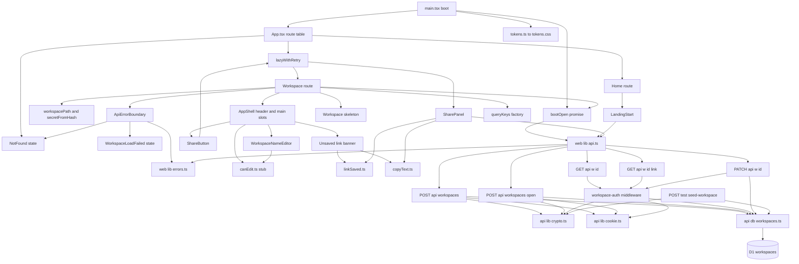
```mermaid
flowchart TD
  Main[main.tsx boot]
  Boot[bootOpen promise]
  App[App.tsx route table]
  Paths[workspacePath and secretFromHash]
  Lazy[lazyWithRetry]
  Home[Home route]
  Start[LandingStart]
  WsRoute[Workspace route]
  Boundary[ApiErrorBoundary]
  Errors[web lib errors.ts]
  NotFound[NotFound state]
  LoadErr[WorkspaceLoadFailed state]
  Shell[AppShell header and main slots]
  CanEdit[canEdit.ts stub]
  Skel[Workspace skeleton]
  NameEd[WorkspaceNameEditor]
  ShareBtn[ShareButton]
  Banner[Unsaved link banner]
  Share[SharePanel]
  SavedStore[linkSaved.ts]
  CopyText[copyText.ts]
  Keys[queryKeys factory]
  Theme[tokens.ts to tokens.css]
  ApiClient[web lib api.ts]
  Create[POST api workspaces]
  Open[POST api workspaces open]
  Auth[workspace-auth middleware]
  GetWs[GET api w id]
  GetLink[GET api w id link]
  Rename[PATCH api w id]
  Seed[POST test seed-workspace]
  Crypto[api lib crypto.ts]
  Cookie[api lib cookie.ts]
  Queries[api db workspaces.ts]
  Db[(D1 workspaces)]
  Main --> Boot
  Main --> App
  Main --> Theme
  Boot --> ApiClient
  App --> Home
  App --> Lazy
  Lazy --> WsRoute
  App --> NotFound
  Home --> Start
  Start --> ApiClient
  WsRoute --> Boundary
  Boundary --> NotFound
  Boundary --> LoadErr
  Boundary --> Errors
  WsRoute --> Boot
  WsRoute --> Skel
  WsRoute --> Shell
  WsRoute --> Paths
  WsRoute --> Keys
  Shell --> CanEdit
  Shell --> NameEd
  Shell --> ShareBtn
  Shell --> Banner
  NameEd --> CanEdit
  ShareBtn --> Lazy
  Lazy --> Share
  Banner --> SavedStore
  Banner --> CopyText
  Share --> SavedStore
  Share --> CopyText
  Share --> ApiClient
  ApiClient --> Errors
  ApiClient --> Create
  ApiClient --> Open
  ApiClient --> GetWs
  ApiClient --> GetLink
  ApiClient --> Rename
  Create --> Crypto
  Create --> Cookie
  Open --> Crypto
  Open --> Cookie
  GetWs --> Auth
  GetLink --> Auth
  Rename --> Auth
  Auth --> Cookie
  Auth --> Crypto
  Create --> Queries
  Open --> Queries
  Auth --> Queries
  Rename --> Queries
  Seed --> Crypto
  Seed --> Queries
  Queries --> Db
```

No structure exists yet (greenfield after story 1), so there is no current-vs-target pair; this is the target.

**State**

Workspace record lifecycle (persisted in D1):

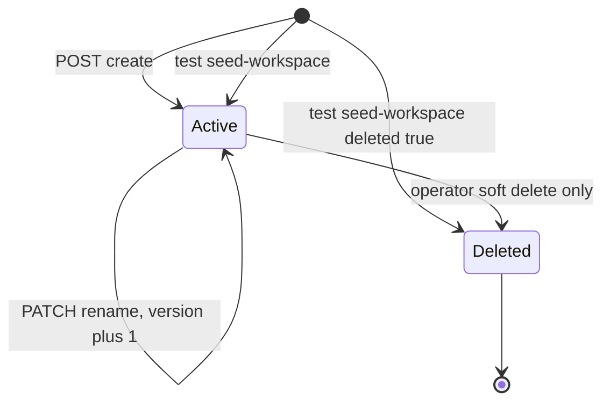
```mermaid
stateDiagram-v2
  [*] --> Active : POST create
  [*] --> Active : test seed-workspace
  [*] --> Deleted : test seed-workspace deleted true
  Active --> Active : PATCH rename, version plus 1
  Active --> Deleted : operator soft delete only
  Deleted --> [*]
```

No user-facing transition to Deleted exists in this story (workspace deletion is out of scope). The state is shown because `deleted` is in the schema and `open`/`auth` must treat it as not found. Story 9 adds `Active --> Active : rotate` (new secret hash, previous kept).

Browser cookie entry lifecycle for one workspace (persisted in the `tdl_ws` cookie):

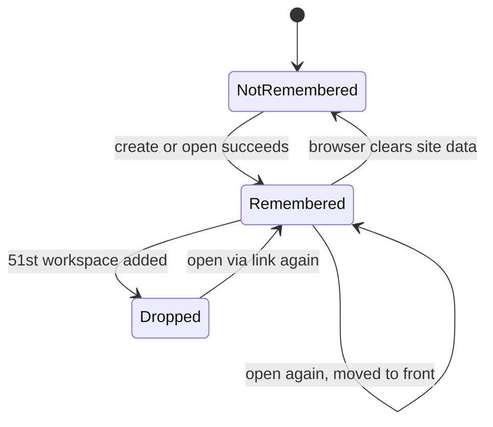
```mermaid
stateDiagram-v2
  [*] --> NotRemembered
  NotRemembered --> Remembered : create or open succeeds
  Remembered --> Remembered : open again, moved to front
  Remembered --> Dropped : 51st workspace added
  Dropped --> Remembered : open via link again
  Remembered --> NotRemembered : browser clears site data
```

Story 3 adds the `Remembered --> NotRemembered : forget` transition.

Link-saved flag lifecycle for one workspace in one browser (persisted in `localStorage` key `tdl:v1:linkSaved:<workspaceId>`; the value is `'1'`, never the secret):

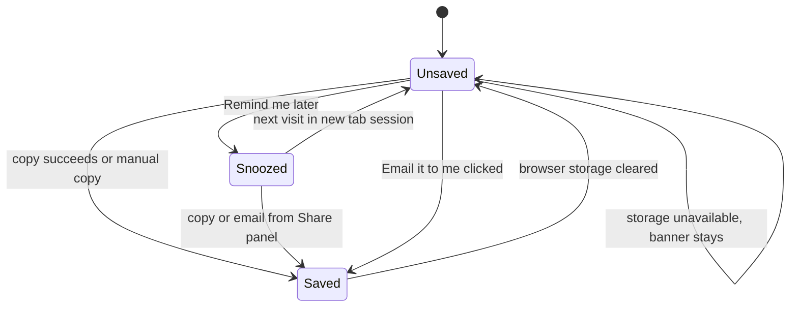
```mermaid
stateDiagram-v2
  [*] --> Unsaved
  Unsaved --> Snoozed : Remind me later
  Snoozed --> Unsaved : next visit in new tab session
  Unsaved --> Saved : copy succeeds or manual copy
  Snoozed --> Saved : copy or email from Share panel
  Unsaved --> Saved : Email it to me clicked
  Saved --> Unsaved : browser storage cleared
  Unsaved --> Unsaved : storage unavailable, banner stays
```

`Snoozed` lives in `sessionStorage` (key `tdl:v1:linkSnoozed:<workspaceId>`), so it ends with the tab session. The banner is visible only in `Unsaved`. Story 9 adds `Saved --> Unsaved : clearLinkSaved after rotation` and `Snoozed --> Unsaved : clearLinkSaved after rotation` (the declared extension `clearLinkSaved` clears both keys).

Workspace view load state (in memory, per route visit; rendered by `ApiErrorBoundary`):

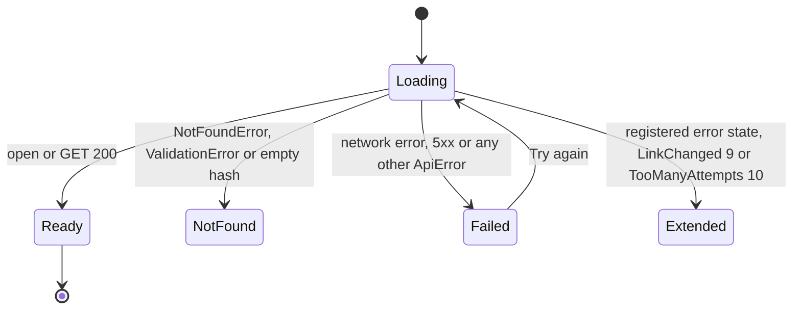
```mermaid
stateDiagram-v2
  [*] --> Loading
  Loading --> Ready : open or GET 200
  Loading --> NotFound : NotFoundError, ValidationError or empty hash
  Loading --> Failed : network error, 5xx or any other ApiError
  Loading --> Extended : registered error state, LinkChanged 9 or TooManyAttempts 10
  Failed --> Loading : Try again
  Ready --> [*]
```

**Sequence: create workspace**

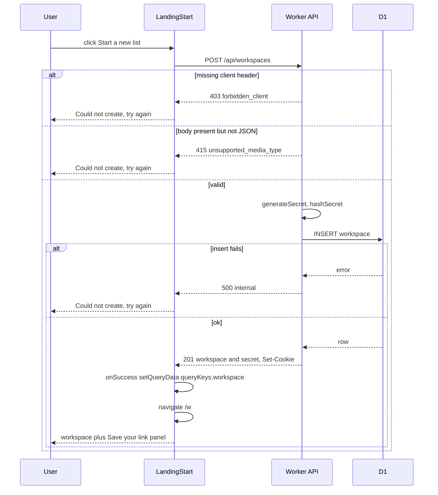
```mermaid
sequenceDiagram
  participant U as User
  participant W as LandingStart
  participant A as Worker API
  participant D as D1
  U->>W: click Start a new list
  W->>A: POST /api/workspaces
  alt missing client header
    A-->>W: 403 forbidden_client
    W-->>U: Could not create, try again
  else body present but not JSON
    A-->>W: 415 unsupported_media_type
    W-->>U: Could not create, try again
  else valid
    A->>A: generateSecret, hashSecret
    A->>D: INSERT workspace
    alt insert fails
      D-->>A: error
      A-->>W: 500 internal
      W-->>U: Could not create, try again
    else ok
      D-->>A: row
      A-->>W: 201 workspace and secret, Set-Cookie
      W->>W: onSuccess setQueryData queryKeys.workspace
      W->>W: navigate /w#secret justCreated
      W-->>U: workspace plus Save your link panel
    end
  end
```

Story 10 adds a `429 rate_limited` branch (scopes `create_burst`, `create_daily`) rendered by `LandingStart` with a countdown.

**Sequence: open workspace from link (boot)**

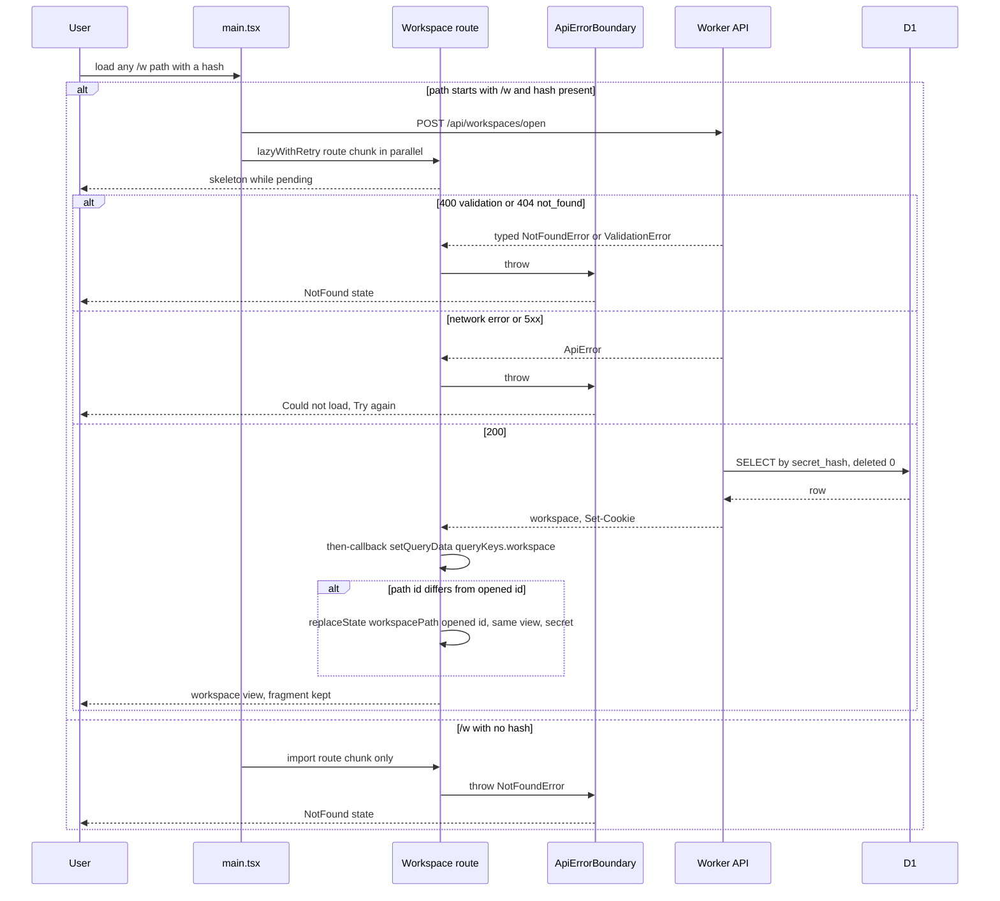
```mermaid
sequenceDiagram
  participant U as User
  participant M as main.tsx
  participant R as Workspace route
  participant B as ApiErrorBoundary
  participant A as Worker API
  participant D as D1
  U->>M: load any /w path with a hash
  alt path starts with /w and hash present
    M->>A: POST /api/workspaces/open
    M->>R: lazyWithRetry route chunk in parallel
    R-->>U: skeleton while pending
    alt 400 validation or 404 not_found
      A-->>R: typed NotFoundError or ValidationError
      R->>B: throw
      B-->>U: NotFound state
    else network error or 5xx
      A-->>R: ApiError
      R->>B: throw
      B-->>U: Could not load, Try again
    else 200
      A->>D: SELECT by secret_hash, deleted 0
      D-->>A: row
      A-->>R: workspace, Set-Cookie
      R->>R: then-callback setQueryData queryKeys.workspace
      alt path id differs from opened id
        R->>R: replaceState workspacePath opened id, same view, secret
      end
      R-->>U: workspace view, fragment kept
    end
  else /w with no hash
    M->>R: import route chunk only
    R->>B: throw NotFoundError
    B-->>U: NotFound state
  end
```

Story 9 adds a `410 link_changed` branch (LinkChangedError → LinkChanged state) and an optional `canonicalLink` in the 200 body; story 10 adds `429 rate_limited` (scope `open_attempts` → TooManyAttempts state).

**Sequence: authenticated workspace request (GET or PATCH)**

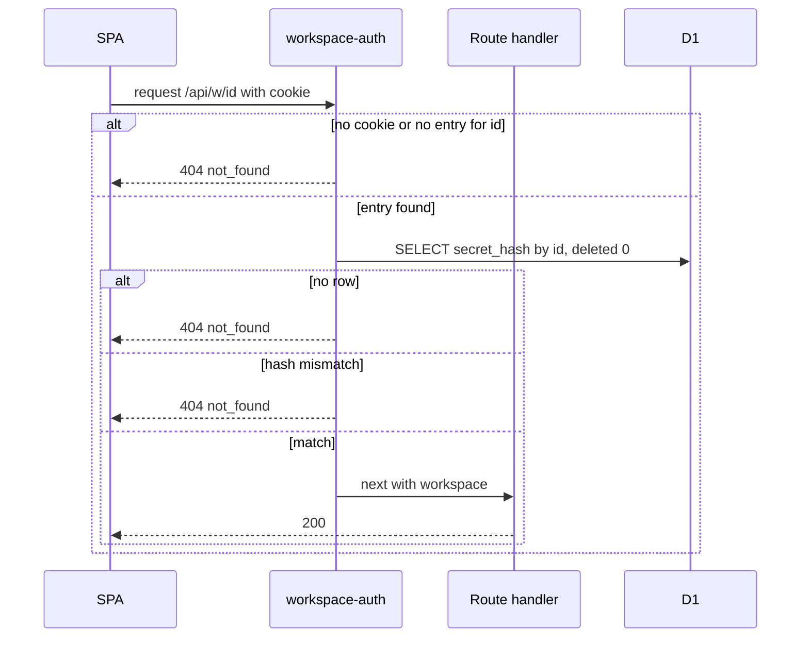
```mermaid
sequenceDiagram
  participant W as SPA
  participant M as workspace-auth
  participant H as Route handler
  participant D as D1
  W->>M: request /api/w/id with cookie
  alt no cookie or no entry for id
    M-->>W: 404 not_found
  else entry found
    M->>D: SELECT secret_hash by id, deleted 0
    alt no row
      M-->>W: 404 not_found
    else hash mismatch
      M-->>W: 404 not_found
    else match
      M->>H: next with workspace
      H-->>W: 200
    end
  end
```

Story 9 inserts a branch before the final 404: hash equals `previous_secret_hash` → 410 `link_changed`.

**Sequence: rename workspace**

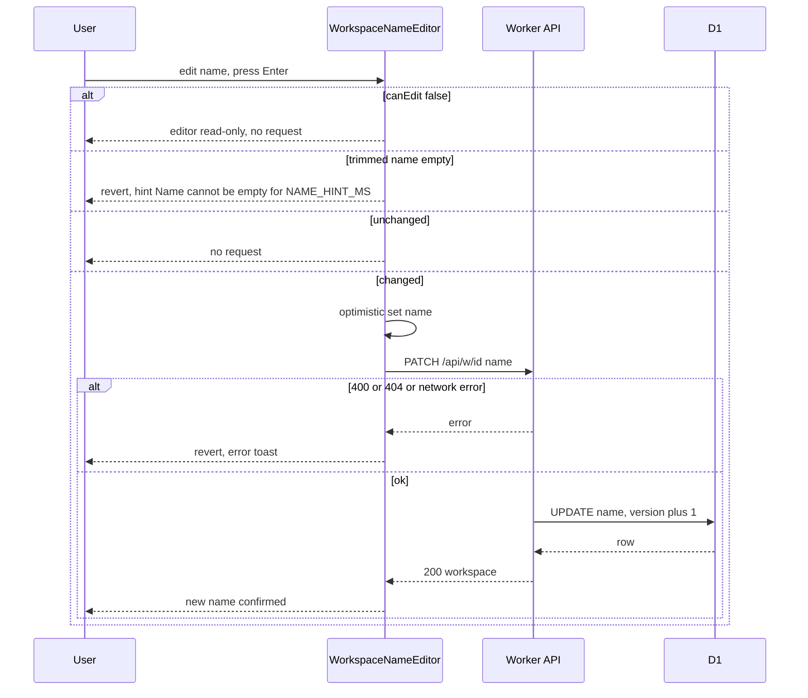
```mermaid
sequenceDiagram
  participant U as User
  participant W as WorkspaceNameEditor
  participant A as Worker API
  participant D as D1
  U->>W: edit name, press Enter
  alt canEdit false
    W-->>U: editor read-only, no request
  else trimmed name empty
    W-->>U: revert, hint Name cannot be empty for NAME_HINT_MS
  else unchanged
    W-->>U: no request
  else changed
    W->>W: optimistic set name
    W->>A: PATCH /api/w/id name
    alt 400 or 404 or network error
      A-->>W: error
      W-->>U: revert, error toast
    else ok
      A->>D: UPDATE name, version plus 1
      D-->>A: row
      A-->>W: 200 workspace
      W-->>U: new name confirmed
    end
  end
```

**Sequence: Save your link and Share panel actions**

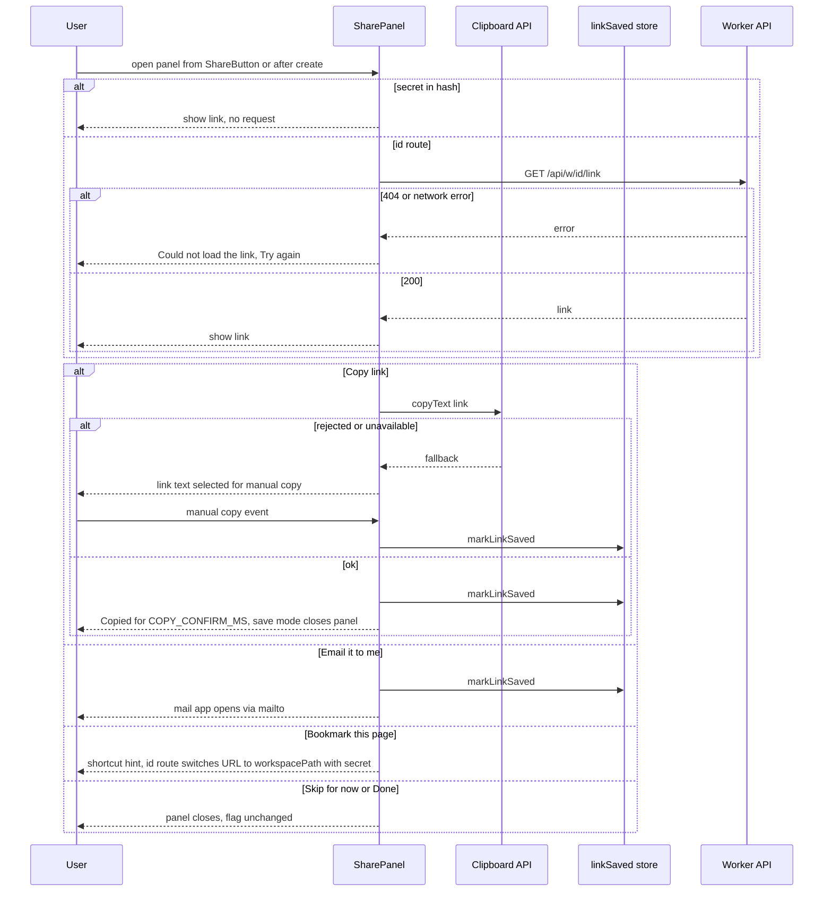
```mermaid
sequenceDiagram
  participant U as User
  participant P as SharePanel
  participant C as Clipboard API
  participant S as linkSaved store
  participant A as Worker API
  U->>P: open panel from ShareButton or after create
  alt secret in hash
    P-->>U: show link, no request
  else id route
    P->>A: GET /api/w/id/link
    alt 404 or network error
      A-->>P: error
      P-->>U: Could not load the link, Try again
    else 200
      A-->>P: link
      P-->>U: show link
    end
  end
  alt Copy link
    P->>C: copyText link
    alt rejected or unavailable
      C-->>P: fallback
      P-->>U: link text selected for manual copy
      U->>P: manual copy event
      P->>S: markLinkSaved
    else ok
      P->>S: markLinkSaved
      P-->>U: Copied for COPY_CONFIRM_MS, save mode closes panel
    end
  else Email it to me
    P->>S: markLinkSaved
    P-->>U: mail app opens via mailto
  else Bookmark this page
    P-->>U: shortcut hint, id route switches URL to workspacePath with secret
  else Skip for now or Done
    P-->>U: panel closes, flag unchanged
  end
```

**Sequence: unsaved-link banner copy**

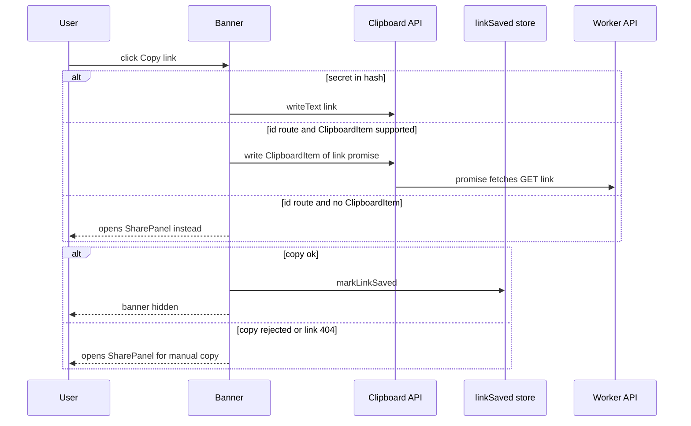
```mermaid
sequenceDiagram
  participant U as User
  participant B as Banner
  participant C as Clipboard API
  participant S as linkSaved store
  participant A as Worker API
  U->>B: click Copy link
  alt secret in hash
    B->>C: writeText link
  else id route and ClipboardItem supported
    B->>C: write ClipboardItem of link promise
    C->>A: promise fetches GET link
  else id route and no ClipboardItem
    B-->>U: opens SharePanel instead
  end
  alt copy ok
    B->>S: markLinkSaved
    B-->>U: banner hidden
  else copy rejected or link 404
    B-->>U: opens SharePanel for manual copy
  end
```

The Home page load and the NotFound state are static renders with no branching server flow beyond the create and open sequences above. The theme has no runtime flow: it is pure CSS keyed on `prefers-color-scheme`. The chunk-retry, error-mapping, seed-route and fragment carry-over flows are drawn in their own capabilities (web.lazy_with_retry, web.api_errors, test.seed_workspace, web.routes).

**Live updates**: broadcasting `workspace.updated` on rename is added by story 4 via `broadcast(c, wid, event)` (D-26) at the marked point in the rename handler. Until then, other people see a rename on their next load or refetch.

## Test Strategy

## Test Scopes
- **unit** (vitest, pool-workers for api/lib): pure crypto and cookie codec functions. Boundary: inner logic only. This is enough because these functions have no I/O.
- **integration** (vitest-pool-workers, `SELF.fetch`): the full request path through Hono middleware, handler, and real Miniflare D1. Boundary: request handling, as shown in the structure diagram. Covers the schema, create, open, auth, get, rename, the test seed route, and response headers.
- **ui-component** (vitest + happy-dom + Testing Library, API mocked with MSW): Home/LandingStart, Workspace route, AppShell, header rename, SharePanel, error boundary states. Boundary: browser rendering without a network.
- **e2e** (Playwright per story 1's matrix: `chromium` + `webkit` desktop, plus `mobile-webkit`/`mobile-chromium` for specs tagged `@mobile`; `wrangler dev`, fresh local D1): cross-surface workflows that need real cookies, a real fragment and real clipboard.

## Dimensions crossed
- D1 entry surface: API direct / SPA
- D2 secret class: valid-active / valid-format-unknown / valid-deleted / malformed / missing
- D3 cookie state: absent / malformed / valid-without-entry / valid-with-entry / at-cap (50)
- D4 operation: create / open / get / rename
- D5 client-header state: present / missing

Equivalence classes for D2 and D3 are exhaustive and non-overlapping: every secret string falls into exactly one D2 class, and every cookie header into exactly one D3 class.

## Boundaries
- Secret length: 42 / 43 / 44 chars; alphabet outside base64url.
- Workspace name: empty, whitespace-only, 1 char, 120 chars (`WORKSPACE_NAME_MAX`), 121 chars.
- Cookie entries: 0, 1, 49, 50 (`MAX_REMEMBERED_WORKSPACES`), 51.
- Encoded cookie at 50 entries is under 4096 bytes.

## Coverage table

| TC | Capability | D4 op | D2 secret | D3 cookie | D5 hdr | Level | Expected (state before -> after) |
|---|---|---|---|---|---|---|---|
| TC-01 | workspace.secret | not an op: pure fn | generated | not used: pure fn | not used: pure fn | unit | generateSecret -> 43 chars base64url, decodes to 32 bytes |
| TC-02 | workspace.secret | not an op: pure fn | generated x1000 | not used: pure fn | not used: pure fn | unit | 1000 secrets all distinct |
| TC-03 | workspace.secret | not an op: pure fn | valid | not used: pure fn | not used: pure fn | unit | hashSecret deterministic, 64 lowercase hex |
| TC-04 | workspace.secret | not an op: pure fn | valid | not used: pure fn | not used: pure fn | unit | hashesEqual true for identical hashes |
| TC-05 | workspace.secret | not an op: pure fn | valid | not used: pure fn | not used: pure fn | unit | hashesEqual false for 1-char diff and for length diff, never throws |
| TC-06 | workspace.secret | not an op: pure fn | 42/43/44 chars, bad chars, empty | not used: pure fn | not used: pure fn | unit | isWellFormedSecret true only for 43 base64url chars |
| TC-07 | workspace.cookie_codec | not an op: pure fn | not used: codec only | 0,1,50 entries | not used: codec only | unit | serializeRememberedCookie then readRemembered round-trips exactly |
| TC-08 | workspace.cookie_codec | not an op: pure fn | not used: codec only | malformed: bad base64, bad JSON, wrong shape, missing fields | not used: codec only | unit | readRemembered returns [] (or drops only the bad elements) and does not throw |
| TC-09 | workspace.cookie_codec | not an op: pure fn | not used: codec only | valid-without-entry | not used: codec only | unit | upsertRemembered(entries, {id, s}, now) puts new entry first with t = now, length +1, dropped 0 |
| TC-10 | workspace.cookie_codec | not an op: pure fn | not used: codec only | valid-with-entry | not used: codec only | unit | upsertRemembered(entries, existing, now) moves entry to front, t = now, no duplicate |
| TC-11 | workspace.cookie_codec | not an op: pure fn | not used: codec only | at-cap 50 | not used: codec only | unit | upsertRemembered with a new id -> 50 entries, oldest removed, dropped = 1 |
| TC-12 | workspace.cookie_codec | not an op: pure fn | not used: codec only | at-cap 50 | not used: codec only | unit | full Set-Cookie string length < 4096 |
| TC-13 | workspace.cookie_codec | not an op: pure fn | not used: codec only | any | not used: codec only | unit | attributes HttpOnly, SameSite=Lax, Path=/api, Max-Age=34560000; Secure present unless ENVIRONMENT=local |
| TC-14 | workspace.schema | not an op: migration | not used: schema | not used: schema | not used: schema | integration | after migrations: table has all columns, UNIQUE on secret_hash (duplicate insert rejected) |
| TC-15 | workspace.create | create | generated | absent | present | integration | rows 0 -> 1; 201 {workspace{id,name=My Todoodle,version=1},secret}; row.secret_hash = sha256(secret); secret not in any column |
| TC-16 | workspace.create | create | generated | absent | present | integration | Set-Cookie tdl_ws decodes to [{id:new,s:secret}] |
| TC-17 | workspace.create | create | generated | at-cap 50 | present | integration | cookie 50 entries, new first, oldest gone; body dropped=1 |
| TC-18 | workspace.create | create | not used: rejected before | absent | missing | integration | 403 forbidden_client; row count unchanged |
| TC-19 | workspace.create | create | not used: rejected before | absent | present, body '{}' with content-type text/plain | integration | 415 unsupported_media_type (D-21); row count unchanged; no Set-Cookie |
| TC-20 | workspace.open | open | valid-active | absent | present | integration | 200 workspace; cookie 0 -> 1 entry; no canonicalLink field |
| TC-21 | workspace.open | open | valid-active | valid-with-entry (not first) | present | integration | entry moved first, t updated, count unchanged |
| TC-22 | workspace.open | open | valid-format-unknown | absent | present | integration | 404 {error:not_found}; no Set-Cookie |
| TC-23 | workspace.open | open | malformed | absent | present | integration | 404 body byte-identical to TC-22; no Set-Cookie |
| TC-24 | workspace.open | open | missing / invalid JSON | absent | present | integration | 400 validation; no Set-Cookie |
| TC-25 | workspace.open | open | valid-deleted (seeded) | absent | present | integration | 404 identical to TC-22 |
| TC-26 | workspace.open | open | valid-active | malformed | present | integration | 200; cookie rebuilt with 1 entry (malformed discarded) |
| TC-27 | workspace.get + workspace.auth | get | valid-active | valid-with-entry | not needed: GET | integration | 200 {id,name,version,createdAt} |
| TC-28 | workspace.auth | get | not used: no cookie | absent | not needed: GET | integration | 404 not_found |
| TC-29 | workspace.auth | get | wrong secret for id | valid-with-entry (tampered s) | not needed: GET | integration | 404 not_found |
| TC-30 | workspace.auth | get | valid for workspace A | valid-without-entry for B | not needed: GET | integration | request B -> 404 |
| TC-31 | workspace.auth | get | not used: id does not exist | valid-with-entry for random id | not needed: GET | integration | 404 identical body to TC-28 |
| TC-32 | workspace.auth | get | valid-deleted (seeded) | valid-with-entry | not needed: GET | integration | 404 |
| TC-33 | workspace.rename | rename | valid-active | valid-with-entry | present | integration | name old -> new; version 1 -> 2; updated_at increases |
| TC-34 | workspace.rename | rename | valid-active | valid-with-entry | present | integration | '  Home  ' stored as 'Home' |
| TC-35 | workspace.rename | rename | valid-active | valid-with-entry | present | integration | '' and '   ' -> 400; name and version unchanged |
| TC-36 | workspace.rename | rename | valid-active | valid-with-entry | present | integration | 120 chars -> 200; 121 chars -> 400 unchanged |
| TC-37 | workspace.rename | rename | not used: no auth | absent | present | integration | 404; row unchanged |
| TC-38 | workspace.rename | rename | valid-active | valid-with-entry | missing | integration | 403; row unchanged |
| TC-39 | security.no_leak | create, open, get, 400, 404 | mixed | mixed | present | integration | every response has Referrer-Policy: no-referrer, X-Request-Id, CSP default-src 'self' |
| TC-40 | security.no_leak | create, open(valid), open(unknown) | mixed | mixed | present | integration | captured console output contains neither the secret nor the cookie value |
| TC-41 | web.landing | create | not used: API mocked | not used: API mocked | not used: API mocked | ui-component | LandingStart calls create once; disabled while pending (double click = 1 call) |
| TC-42 | web.landing | create | not used: API mocked | not used: API mocked | not used: API mocked | ui-component | create 500 and 415 -> 'Couldn't create your list - try again' (role=alert), button enabled, no navigation |
| TC-43 | web.link_dialog | not an op: UI | valid | not used: UI | not used: UI | ui-component | superseded in test-strategy-3 |
| TC-44 | web.link_dialog | not an op: UI | valid | not used: UI | not used: UI | ui-component | superseded in test-strategy-3 |
| TC-45 | web.link_dialog | not an op: UI | valid | not used: UI | not used: UI | ui-component | superseded in test-strategy-3 |
| TC-46 | web.link_dialog | not an op: UI | valid | not used: UI | not used: UI | ui-component | superseded in test-strategy-3 |
| TC-47 | web.workspace_shell | open | valid-active | not used: API mocked | not used: API mocked | ui-component | /w#secret -> open called with secret; header shows name; hash unchanged after load |
| TC-48 | web.workspace_shell | rename | valid-active | not used: API mocked | not used: API mocked | ui-component | edit + Enter -> name shown before PATCH resolves; PATCH called with trimmed name |
| TC-49 | web.workspace_shell | rename | valid-active | not used: API mocked | not used: API mocked | ui-component | superseded in test-strategy-3 |
| TC-50 | web.workspace_shell | rename | valid-active | not used: API mocked | not used: API mocked | ui-component | PATCH 500 -> previous name restored, error toast |
| TC-51 | web.workspace_shell | not an op: UI | valid-active | not used: API mocked | not used: API mocked | ui-component | superseded in test-strategy-3 |
| TC-52 | web.not_found | open | valid-format-unknown | not used: API mocked | not used: API mocked | ui-component | open 404 -> ApiErrorBoundary renders 'Workspace not found' + LINK_CUT_OFF_TIP + Start a new list; no workspace data rendered |
| TC-53 | web.not_found | not an op: UI | missing (no fragment) | not used: API mocked | not used: API mocked | ui-component | /w with empty hash -> NotFound state; open not called |
| TC-54 | WF-1 create | create | generated | absent | present | e2e | superseded in test-strategy-3 |
| TC-55 | WF-2 return by link | open | valid-active | absent (new context) | present | e2e | link from WF-1 in fresh context -> same name; reload keeps URL and workspace |
| TC-56 | WF-3 bad link | open | valid-format-unknown | absent | present | e2e | /w#random43 -> Workspace not found state; Start creates a new one |
| TC-57 | WF-4 rename | rename | valid-active | valid-with-entry | present | e2e | rename -> reload -> new name; second context via link sees new name |
| TC-58 | WF-5 no leak | all | valid-active | mixed | present | e2e | across WF-1..4 no request URL or Referer contains the secret; all requests same-origin; secret appears only in POST open body |

## Error-path traceability
Every error named in a contract has a case: `forbidden_client` (TC-18, TC-38), `unsupported_media_type` (TC-19, TC-62), `validation` (TC-24, TC-35, TC-36, TC-105), `not_found` (TC-22, TC-23, TC-25, TC-28 to TC-32, TC-37), `internal` on create (TC-42 through the UI; the API-level DB failure is not injected, see below), clipboard failure (TC-45). Extension-point errors (`link_changed` 9, `rate_limited` 10, `gone` 4) are tested by their owners; story 2 tests only that unregistered codes fall through to `ApiError` (TC-101).

## Negative scenarios (must NOT happen)
- No row is created on a rejected create (TC-18, TC-19).
- No cookie is set on a failed open (TC-22 to TC-25).
- Responses do not distinguish unknown, malformed and deleted secrets (byte-identical bodies: TC-22, TC-23, TC-25; TC-28, TC-31).
- Rename does not change state when invalid or unauthorised (TC-35 to TC-38).
- The raw secret is never stored (TC-15) and never logged (TC-40).
- The secret never leaves the origin or appears in a URL or Referer (TC-58).
- Double click does not create two workspaces (TC-41).

## Mock vs real
| Store/service | unit | integration | ui-component | e2e |
|---|---|---|---|---|
| D1 | not used: pure functions | real Miniflare D1, migrations applied per test file | mocked via MSW: rendering is under test, not persistence | real local D1 via wrangler dev |
| Cookie jar | not used: codec tested on strings | real Set-Cookie headers, re-sent manually on the next request | not used: HttpOnly, invisible to JS | real browser cookie jar |
| Clipboard | not used | not used: server only | stubbed navigator.clipboard (resolve / reject / undefined) | real clipboard via Playwright permissions (chromium); webkit only asserts the fallback selection |

D1 is never mocked where persistence is under test.

## Fixtures
Integration fixtures create workspaces through the real `POST /api/workspaces`, so secrets and hashes have their real shapes. The at-cap cookie fixture is built from 50 real created workspaces, not hand-made strings. The malformed-cookie fixtures are real base64url of broken JSON. Deleted workspaces are seeded through `POST /test/seed-workspace {deleted:true}` (capability test.seed_workspace, non-production only).

## E2E workflows
WF-1 create (TC-54), WF-2 return by link (TC-55), WF-3 bad link (TC-56), WF-4 rename persists across people (TC-57), WF-5 no leak (TC-58, network capture over WF-1 to WF-4).

## Not covered (deliberately)
- Brute-force or rate limiting of `open`/`create`: owned and tested by story 10 through the extension points in workspace.create and workspace.open.
- Statistical timing side-channel measurement: we rely on a hash-indexed lookup plus constant-time compare, not on measured timing.
- A DB failure injected at the API level (Miniflare cannot fail D1 on demand without test-only code in production paths). The UI handling of a 500 is covered by TC-42 and TC-79.
- Whether Cloudflare invocation logs in staging/production capture Cookie headers: verified manually in task 7, not automated.
- Real mobile browsers: Playwright mobile-webkit and mobile-chromium emulation is a proxy only.

## Test Strategy addendum: link endpoint, id route, relaxed CSRF rule

Added after the cross-story decisions with story 3 (id route `/w/:workspaceId`, `GET /api/w/:id/link`) and story 1 (Content-Type JSON required only when a body is present; X-Todoodle-Client always required on mutations; a non-JSON body is 415, D-21). This addendum uses the same dimensions D1 to D5 as the main strategy, and adds D6, entry route: fragment (`/w#secret` or `/w/:id…#secret`) or id (`/w/:id…` without fragment).

| TC | Capability | D4 op | D2 secret | D3 cookie | D6 route | Level | Expected (state before -> after) |
|---|---|---|---|---|---|---|---|
| TC-59 | workspace.link | get link | valid-active | valid-with-entry | not a UI route: API direct | integration | 200 {link: origin/w#s}, s equals the cookie entry; Cache-Control no-store |
| TC-60 | workspace.link | get link | not used: no cookie | absent | not a UI route: API direct | integration | 404 byte-identical to the other misses |
| TC-61 | workspace.link | get link | tampered entry secret | valid-with-entry (wrong s) | not a UI route: API direct | integration | 404; the link is never returned for an unverified secret |
| TC-62 | workspace.create | create | generated | absent | not a UI route: API direct | integration | POST with X-Todoodle-Client but no body and no Content-Type -> 201 (bodyless mutation allowed); the same with body '{}' and text/plain -> 415 unsupported_media_type (TC-19); with body '{}' and application/json -> 201 |
| TC-63 | WF-6 id route link | get link | valid-active | valid-with-entry | id | e2e | create in context A, navigate to /w/:id, open **Share** -> the link equals the one shown at creation; opening it in fresh context B reaches the same workspace |
| TC-64 | web.workspace_shell | get | not used: id route has no secret | not used: API mocked | id | ui-component | renders from GET /api/w/:id; 404 -> NotFound state via ApiErrorBoundary; document.title has no secret |
| TC-65 | web.link_dialog | get link | valid-active | not used: API mocked | id | ui-component | the link is not requested before the **Share** panel opens; opening it triggers exactly one GET link; the link is shown |
| TC-66 | web.link_dialog | get link | valid-active | not used: API mocked | fragment | ui-component | opening the **Share** panel does NOT call GET link (secret already in the hash) |

**Equivalence classes for D6** are exhaustive: every workspace view is entered through exactly one of the two route classes (with or without a non-empty fragment).

**Negative scenarios added:** no link request on page load or before the Share panel opens (TC-65); no link for an unverified cookie entry (TC-61); no redundant request when the hash has the secret (TC-66).

**Mock vs real:** as in the main strategy. The link endpoint uses real D1 and a real cookie in integration and e2e, and MSW in ui-component.

**Not covered:** bookmarking an id route works only in a browser that holds the cookie. This is by design, and the Share panel's Bookmark action (which switches to the fragment form) is the portable path. No automated test asserts cross-browser behaviour for id-route bookmarks.

## Test Strategy addendum: SharePanel, unsaved-link banner, boot open, loading states, theme

Added after the UX review and React best-practices audit (2026-09-25), aligned with the contracts stories 3 and 4 consume, and updated for the cross-story resolutions (2026-09-27). It uses dimensions D1 to D6 from the earlier strategies and adds:
- **D7 link-saved state**: unsaved / snoozed / saved / storage-unavailable. Exhaustive and non-overlapping: each browser+workspace is in exactly one (storage-unavailable overrides the others because nothing can be read).
- **D8 panel mode**: save (first run) / share (header button).
- **D9 clipboard capability**: writeText ok / writeText rejects / clipboard undefined / ClipboardItem missing.
- **D10 load outcome**: pending / ok / 404 / 5xx-or-network.
- **D11 colour scheme**: light / dark.
- **D12 edit gate**: canEdit true / canEdit false.

Boundaries: `COPY_CONFIRM_MS` (Copied visible at 1,999 ms, gone at 2,001 ms under fake timers); `NAME_HINT_MS` = 3,000 (hint visible at 2,999 ms, gone at 3,001 ms, D-44); contrast thresholds exactly 4.5:1 text and 3:1 UI; storage key for 0 and 1 workspaces.

## Superseded rows
These earlier rows now assert the merged SharePanel behaviour (owner decision 2026-09-25) and the shared-constant rule (architecture §13 rule 3):

| TC | Level | Superseded expectation |
|---|---|---|
| TC-43 | ui-component | after create: panel titled 'Save your link' shows origin/w#secret and the texts **imported from `shareText.ts`** — `SHARE_KEY_NOTE`, `SHARE_ONLY_WAY_NOTE` and `SHARE_ACCESS_NOTE` (the test imports the constants and never contains the literal access-note text, so story 9's change does not break it) — plus Copy link & continue, Email it to me, Bookmark this page, Skip for now |
| TC-44 | ui-component | Share mode Copy link -> writeText(link) once; 'Copied' shown for COPY_CONFIRM_MS; panel stays open |
| TC-45 | ui-component | writeText rejects or is undefined -> field focused and fully selected; no 'Copied'; flag not yet set |
| TC-46 | ui-component | Skip for now closes; focus returns to trigger; header ShareButton reopens titled 'Share'; no element labelled 'Link' exists in the header |
| TC-49 | ui-component | empty edit -> previous name restored; no PATCH; 'Name can't be empty' shown with role=status |
| TC-51 | ui-component | a `<title>` element renders 'Todoodle - <name>'; never contains the secret (panel open and closed) |
| TC-54 | e2e | Home -> Start -> 'My Todoodle' in under 1000 ms locally; AppShell frame with header and Share button; Save your link panel; Copy link & continue closes it; Share reopens it |

## New cases

| TC | Capability | D6 route | D7 saved | D8 mode | D9 clipboard | D10 load | Level | Expected (state before -> after) |
|---|---|---|---|---|---|---|---|---|
| TC-67 | web.link_dialog | fragment | unsaved | save | writeText ok | not a load case: panel only | ui-component | Copy link & continue -> writeText(link) once; flag unsaved -> saved; panel closed |
| TC-68 | web.link_dialog | fragment | unsaved | save | not used: mailto | not a load case: panel only | ui-component | Email it to me href = mailto with URL-encoded link in body and subject; click -> flag saved; no fetch issued |
| TC-69 | web.link_dialog | fragment | unsaved | save | not used: bookmark | not a load case: panel only | ui-component | Bookmark shows 'Press ⌘D' with platform macOS and 'Press Ctrl+D' with platform Win32; flag unchanged |
| TC-70 | web.link_dialog | id | unsaved | share | not used: bookmark | not a load case: panel only | ui-component | Bookmark -> one GET link, then URL becomes workspacePath(wid, current view, {secret}) via replaceState, hint shown; router did not navigate away |
| TC-71 | web.link_dialog | fragment | unsaved | save | not used: skip | not a load case: panel only | ui-component | Skip for now -> closed; flag still unsaved; banner visible |
| TC-72 | web.link_dialog | fragment | saved | share | writeText ok | not a load case: panel only | ui-component | header ShareButton opens mode share: title Share, primary 'Copy link', secondary 'Done', no 'Skip for now' |
| TC-73 | web.link_dialog | fragment | unsaved | share | writeText rejects | not a load case: panel only | ui-component | after fallback selection, a native copy event on the field -> flag saved |
| TC-74 | web.unsaved_link_banner | both | unsaved | not a panel case: banner | ok / ClipboardItem missing / rejects | not a load case: banner only | ui-component | fragment route: writeText, banner hides; id route + ClipboardItem: write() with a promise, banner hides; ClipboardItem missing or rejects -> SharePanel opens in share mode, banner stays |
| TC-75 | web.unsaved_link_banner | fragment | unsaved -> snoozed | not a panel case: banner | not used: snooze | not a load case: banner only | ui-component | Remind me later hides it; new sessionStorage (simulated new tab) shows it again |
| TC-76 | web.unsaved_link_banner | fragment | storage-unavailable | not a panel case: banner | writeText ok | not a load case: banner only | ui-component | localStorage and sessionStorage throw on access -> banner visible, copy works, no error thrown, no console error |
| TC-77 | web.unsaved_link_banner | fragment | unsaved -> saved | not a panel case: banner | not used: other tab | not a load case: banner only | ui-component | dispatch a storage event setting the key from another tab -> banner hides without reload |
| TC-78 | web.workspace_shell | both | not relevant: loading only | not relevant: no panel | not relevant: no copy | pending | ui-component | while open/GET pending: skeleton with aria-busy=true; no NotFound; with primed cache the name renders immediately |
| TC-79 | web.api_errors | both | not relevant: loading only | not relevant: no panel | not relevant: no copy | 5xx and network | ui-component | ApiErrorBoundary renders WorkspaceLoadFailed: 'Couldn't load this workspace.' + Try again (role=alert); Try again issues exactly one new request; 404 still renders the NotFound state, not this one |
| TC-80 | web.workspace_shell | fragment | not relevant: rename | not relevant: no panel | not relevant: no copy | ok | ui-component | unchanged name -> no PATCH; empty-name hint disappears after NAME_HINT_MS (fake timers, 2,999 visible / 3,001 gone) |
| TC-81 | web.workspace_shell | both | not relevant: title | not relevant: no panel | not relevant: no copy | ok | ui-component | no code writes document.title directly (spy on setter never called) |
| TC-82 | web.not_found | fragment unknown | not relevant: not found | not relevant: no panel | not relevant: no copy | 404 | ui-component | tip equals LINK_CUT_OFF_TIP; `<ApiErrorBoundary>` without `recovery` renders nothing between tip and button; with `recovery={<span>x</span>}` that node renders there (the slot story 3 fills with RememberedRecovery); the `*` route receives the same node; Start a new list (LandingStart) present |
| TC-83 | web.workspace_shell | not a route: pure fn | not relevant: keys | not relevant: keys | not relevant: keys | not relevant: keys | unit | every workspace-scoped queryKeys.* output (workspace, link, tasksAll, tasks, counts, projects, today, search) starts with root(wid); tasks(wid, p) starts with tasksAll(wid); counts(wid) has exactly 3 elements (no date); tasks params keep includeCompleted; remembered() and rememberedTouch(id) are the only keys not under root and are not matched by it |
| TC-84 | web.workspace_shell | fragment | not relevant: boot | not relevant: boot | not relevant: boot | pending | unit | startBootOpen fires one open for /w#s, /w/<id>#s, /w/<id>/today#s and /w/<id>/project/<p>#s; none for /w or /w/<id> without hash or for non-/w paths (/, /wx#s); takeBootOpen returns the same promise for the same secret and null for a different secret; the promise's then writes queryKeys.workspace(id) |
| TC-85 | web.theme | not a route: tokens | not relevant: theme | not relevant: theme | not relevant: theme | not relevant: theme | unit | for light and dark, every TEXT_PAIRS entry >= 4.5:1 and every UI_PAIRS entry >= 3:1 (checkTokenPairs() returns []); a synthetic pair at 4.49 fails the checker |
| TC-86 | web.workspace_shell | fragment | not relevant: boot | not relevant: boot | not relevant: boot | ok | e2e | network log: POST /api/workspaces/open starts before the Workspace route chunk response finishes |
| TC-87 | web.theme | fragment | not relevant: theme | not relevant: theme | not relevant: theme | ok | e2e | Playwright colorScheme dark -> body background equals the dark --background token; light -> the light token |
| TC-88 | web.unsaved_link_banner | fragment | unsaved -> saved | save | writeText ok | ok | e2e | create -> banner absent after Copy link & continue; reload -> still absent; a fresh context opening the link -> banner present |
| TC-89 | security.no_leak | fragment | saved | save | not used: mailto | ok | e2e | clicking Email it to me issues no network request; no localStorage or sessionStorage value contains the secret |
| TC-90 | web.unsaved_link_banner | not a route: store | all four | not relevant: store | not relevant: store | not relevant: store | unit | key format tdl:v1:linkSaved:<id> via exported savedKey/snoozeKey; hasSavedLink/markLinkSaved/subscribe; storage exceptions swallowed and reported as unsaved; cached read invalidated on storage event; the module exports no clearLinkSaved in story 2 |
| TC-91 | web.theme | not a route: lint | not relevant: lint | not relevant: lint | not relevant: lint | not relevant: lint | unit | lint fixtures fail for: 'lucide-react' root import, a local icon barrel '@/components/icons', '@/features/share' directory import, date-fns outside features/dates/picker, `import { lazy } from 'react'` outside lib/lazyWithRetry.ts; a per-icon subpath allowed by the installed lucide-react exports map and file imports pass |
| TC-92 | web.unsaved_link_banner | not a route: helper | not relevant: helper | not relevant: helper | all four D9 values plus a rejecting promise | not relevant: helper | unit | copyText(string) uses writeText -> 'copied'; copyText(promise) uses write(ClipboardItem) -> 'copied'; rejection, undefined clipboard, missing ClipboardItem or rejecting promise -> 'fallback', field focused+selected when given, never throws |
| TC-93 | web.workspace_shell | id | not relevant: query | not relevant: no panel | not relevant: no copy | pending | ui-component | workspaceQuery(id, {placeholderData:{name:'Home'}}) -> 'Home' renders before GET resolves, no skeleton; GET result then replaces it |
| TC-94 | web.app_shell | fragment | saved | share | writeText ok | ok | ui-component | D12 canEdit true (stub) -> name editor editable; `__setCanEditForTests(false)` -> the WorkspaceNameEditor is read-only via its own useCanEdit() gate and sends no PATCH on Enter, while ShareButton, SharePanel copy/email/bookmark and banner Copy still work |

## Error-path traceability (additions)
Link fetch 404/network in the panel (TC-65 and the TC-74 fallback), clipboard rejection (TC-45, TC-73, TC-74, TC-92), load failure 5xx/network (TC-79), storage unavailable (TC-76, TC-90), editing disabled while offline (TC-94).

## Negative scenarios (additions)
- Skip, Done and Bookmark do not mark the link saved (TC-69, TC-71).
- The banner cannot be permanently dismissed without saving (TC-75).
- A 5xx never shows NotFound, and a 404 never shows the retry state (TC-79).
- No 'Link' button exists anywhere (TC-46).
- Email issues no request and no secret lands in web storage (TC-89).
- Boot open is not fired for non-/w paths or empty hashes (TC-84).
- copyText never throws (TC-92).
- Disabling edits never disables Share or copying (TC-94).

## Mock vs real (additions)
| Store/service | unit | ui-component | e2e |
|---|---|---|---|
| localStorage / sessionStorage | real happy-dom storage; a throwing stub for TC-76/TC-90 because unavailability is the case under test | real happy-dom storage | real browser storage |
| Clipboard / ClipboardItem | stubbed per D9 (TC-92) because the OS clipboard is unavailable | stubbed per D9 | real in chromium; webkit asserts the fallback |
| canEdit store (`features/live/canEdit.ts`) | not used | the story 2 stub, overridden with `__setCanEditForTests(false)` for TC-94 because story 4's real store is not built yet | stub (always true) |
| Timers | fake timers for COPY_CONFIRM_MS and NAME_HINT_MS boundaries | fake timers | real |

## E2E workflows (additions)
WF-7 save-and-reload (TC-88), WF-8 email path makes no request (TC-89), WF-9 boot parallelism (TC-86), WF-10 dark appearance (TC-87).

## Fixtures
Workspace data comes from real `POST /api/workspaces` responses in e2e and from the shared zod schemas in MSW handlers. Token contrast uses the real token values from `packages/shared/src/tokens.ts`, not copies.

## Not covered (deliberately)
- Actually creating a browser bookmark: browsers expose no API; we assert the hint and the URL swap only.
- The mail app opening: `mailto:` handling is OS-specific; we assert the href and that no request is made.
- Visual appearance beyond token values (no screenshot diffing).
- Real offline behaviour of the edit gate: story 4 owns the offline store and its e2e tests; story 2 only proves the gate's wiring (TC-94).

## Test Strategy addendum: routes and fragment carry-over, AppShell slots, typed errors and boundary, lazyWithRetry, seed-workspace (cross-story resolutions 2026-09-27)

Covers the capabilities added by the cross-story resolutions: web.routes (D-12, D-13), web.app_shell (D-10, D-11), web.api_errors (D-20), web.lazy_with_retry (D-42), test.seed_workspace (D-35), the non-responding access check in workspace.auth (required by story 4's `/live`), and the ShareButton/footer slot and token generator additions. New dimensions:
- **D13 path class**: `/w` / `/w/:id` / `/w/:id/today` / `/w/:id/project/:pid` / non-workspace path. Crossed with D6 (fragment present or not). Exhaustive: every pathname is in exactly one class.
- **D14 error class**: fetch rejected / non-JSON body / `body.error` registered (`not_found`, `validation`, test-registered code) / `body.error` unregistered (incl. `project_not_found` with status 404). Exhaustive for any failed request.
- **D15 chunk load outcome**: first try ok / ok after retry / all retries fail with reload flag unset / flag set / storage unavailable.
- **D16 seed params**: `{}` / `{name}` / `{deleted:true}` / `{rotatedSecondsAgo}` / invalid; crossed with environment (local, production).
- **D17 shell slots**: none / all given.
- **D18 access outcome**: ok / not_found (each D3 cookie class that fails) — `link_changed` is story 9's.

Boundaries: `LAZY_RETRY_ATTEMPTS` (fails on the last attempt → reload; succeeds on the last attempt → no reload); seed `name` at 120 and 121 chars.

| TC | Capability | Dimension values | Level | Expected (state before -> after) |
|---|---|---|---|---|
| TC-95 | web.link_dialog | D8 save and share; footer slot empty / test node | ui-component | with no footer content, nothing renders below the secondary action in either mode; a test node given to `SharePanelFooter` renders in share mode only; ShareButton pointerenter and focus each call the panel's `preload()` (factory loaded once total) |
| TC-96 | web.routes | D13 all four workspace classes × secret given / not | unit | workspacePath returns /w/<id>, /w/<id>/today, /w/<id>/project/<pid> (pid URL-encoded), with '#<secret>' appended only when opts.secret is given |
| TC-97 | web.routes | D13 × D6 | unit | secretFromHash returns the secret for '/w#s', '/w/<id>#s', '/w/<id>/today#s', '/w/<id>/project/<p>#s'; null for empty hash, '#' alone, '/', '/wx#s', '/home#s' |
| TC-98 | web.routes | D6 fragment vs id session | ui-component | fragment session: a link built with useWorkspaceHref({kind:'today'}) has href '/w/<id>/today#<s>'; id session: '/w/<id>/today'; on '/w/<otherId>#<s>' where open returns <id>, the URL is replaced with '/w/<id>#<s>' and history length is unchanged |
| TC-99 | web.routes | D13 /w/:id with fragment, fresh context | e2e | in a fresh context with no cookie, loading '/w/<id>#<secret>' opens the workspace (boot open fires), reload keeps the URL and the workspace; loading '/w/<wrongId>#<secret>' ends on '/w/<id>#<secret>' |
| TC-100 | web.app_shell | D17 none / all; D12 true / false | ui-component | with no slots: header has name editor and ShareButton, no empty nav/aside landmarks; with sidebar, searchSlot, headerActionsSlot, switcherTrigger, viewHeaderSlot and quickAddSlot given, each renders in its named region (switcherTrigger directly after the name editor); the document contains no `<fieldset>`; with `__setCanEditForTests(false)` the shell disables nothing itself: a plain text input and button passed in `children` and a text input passed in `quickAddSlot` all stay enabled (the input stays typeable and keeps its value), while a test control that self-gates with `useCanEdit()` in any slot is disabled — offline disables only self-gated controls |
| TC-101 | web.api_errors | D14 all classes | unit | toApiError: 404 {error:'not_found'} -> NotFoundError; 400 {error:'validation',issues} -> ValidationError with issues; 404 {error:'project_not_found'} -> ApiError (not NotFoundError); 500 non-JSON -> ApiError code null; registerApiErrorType('x_test', make) -> 409 {error:'x_test'} returns the made type (the path stories 4, 9 and 10 use for gone, link_changed and rate_limited); registering 'x_test' twice throws; fetch rejection -> NetworkError; no error object's message or fields contain the request body |
| TC-102 | web.api_errors | D14 via boundary; registered state present / absent | ui-component | NotFoundError and ValidationError -> NotFound state; NetworkError and ApiError -> WorkspaceLoadFailed; a state registered with registerErrorState for a test subclass renders instead of both and receives `recovery` and `reset`; a renderer returning undefined falls through to the default; mutation errors are not caught by the boundary |
| TC-103 | web.theme | not a route: generator | unit | running build-tokens on tokens.ts produces output byte-identical to the committed tokens.css; every TOKENS name appears once under :root and once under the dark media query |
| TC-104 | web.lazy_with_retry | D15 all five | unit | ok -> component, no retry; fails once then ok -> one retry after LAZY_RETRY_DELAY_MS, flag cleared; fails every attempt with flag unset -> exactly one location.reload and flag set to '1'; flag already set -> no reload, flag cleared, promise rejects; storage throws -> no reload, rejects; preload() twice -> factory called once |
| TC-105 | test.seed_workspace | D16 × environment | integration | local: {} -> 201 {workspace{name: My Todoodle}, secret}, no Set-Cookie, open(secret) -> 200; {name:'X'} -> name 'X'; 120-char name ok, 121 -> 400; {deleted:true} -> row deleted=1, open -> 404 byte-identical to TC-22; {rotatedSecondsAgo: 60} -> 400 validation, no row created; unknown field -> 400; ENVIRONMENT=production -> 404 and row count unchanged |
| TC-106 | workspace.auth | D18 × D3 | integration | via a test-only Hono app mounting a probe route that calls checkWorkspaceAccess and returns its value as JSON: valid-with-entry -> 'ok' and c.var.workspace.id equals wid; absent, valid-without-entry, tampered secret, deleted (seeded) and unknown id -> 'not_found'; in every case the function itself wrote no response, no Set-Cookie, and never returned 'link_changed' |

## Error-path traceability (additions)
`validation` on the seed route (TC-105); unregistered and non-JSON errors (TC-101); boundary fallthrough (TC-102); chunk load exhaustion (TC-104); access failures without a response (TC-106).

## Negative scenarios (additions)
- The seed route never exists in production (TC-105) and never silently ignores `rotatedSecondsAgo` (TC-105).
- Status alone never decides the error type (TC-101: 404 `project_not_found`).
- No reload loop on chunk failure (TC-104: flag set / storage unavailable).
- The shell never disables a slot wholesale; only self-gated controls go read-only, and quick add stays typeable when editing is off (TC-100).
- The fragment is never dropped by in-app navigation in a fragment session, and never added in an id session (TC-98).
- `checkWorkspaceAccess` never responds on its own (TC-106), so `/live` can accept-then-close.

## Mock vs real (additions)
| Store/service | unit | ui-component | integration | e2e |
|---|---|---|---|---|
| Router | not used: pure path functions | MemoryRouter with real routes from App.tsx | not used | real browser history |
| Dynamic import | a stub factory that rejects/resolves per D15, because chunk failure cannot be produced on demand | not used | not used | real chunks |
| location.reload / sessionStorage | spied reload; real happy-dom storage, throwing stub for the unavailable case | not used | not used | not used |
| D1 | not used | not used | real Miniflare D1 for the seed route and access check | not used |

## E2E workflows (additions)
WF-11 fragment on an id path (TC-99).

## Not covered (deliberately)
- The Today and project views themselves (stories 8 and 7); story 2 tests only the paths and the fragment rule.
- Registered LinkChanged / TooManyAttempts / Gone states, the `link_changed` access outcome, `/live` close codes and `canonicalLink`: tested by stories 4, 9 and 10 against these extension points.

## Workspace storage

> Anchor: `workspace.schema`

## Contract
Migration `migrations/0001_workspaces.sql` creates:
- `workspaces(id TEXT PK DEFAULT hex(randomblob(16)), secret_hash TEXT NOT NULL UNIQUE, name TEXT NOT NULL, version INTEGER NOT NULL DEFAULT 1, created_at TEXT DEFAULT datetime('now'), updated_at TEXT DEFAULT datetime('now'), deleted INTEGER NOT NULL DEFAULT 0, deleted_at TEXT)`
- No CHECK constraints; the name length is validated in the app.

Query module `apps/api/src/db/workspaces.ts`:
```ts
insertWorkspace(db: D1Database, secretHash: string, name: string): Promise<WorkspaceRow>
findActiveBySecretHash(db: D1Database, secretHash: string): Promise<WorkspaceRow | null>
findActiveById(db: D1Database, id: string): Promise<WorkspaceRow | null>
renameWorkspace(db: D1Database, id: string, name: string): Promise<WorkspaceRow | null>
```
`renameWorkspace` sets name, `version = version + 1` and `updated_at`, and uses RETURNING. It returns null if the row is missing or deleted.
Errors: a UNIQUE violation on `secret_hash` propagates (practically impossible at 256 bits; surfaced as 500).

## Implementation
- `migrations/0001_workspaces.sql`
- `apps/api/src/db/workspaces.ts` (prepared statements, `WorkspaceRow` type)
- `packages/shared/src/schemas.ts`: `Workspace` public shape `{id, name, version, createdAt}` (never includes secret_hash).

## Tests
TC-14 (integration).

## Secret generation, hashing and comparison

> Anchor: `workspace.secret`

## Contract
`apps/api/src/lib/crypto.ts`:
```ts
generateSecret(): string                 // 32 bytes (WORKSPACE_SECRET_BYTES) from crypto.getRandomValues, base64url, no padding, 43 chars
hashSecret(secret: string): Promise<string>   // SHA-256 via crypto.subtle, lowercase hex, 64 chars
hashesEqual(a: string, b: string): boolean    // constant-time over equal length; returns false on length mismatch without early char exit
isWellFormedSecret(s: unknown): s is string   // /^[A-Za-z0-9_-]{43}$/ (hoisted RegExp)
```
There are no errors: every function is total over its inputs.
Side effects: none.

## Implementation
- `apps/api/src/lib/crypto.ts`; the constant comes from `packages/shared/src/limits.ts`.
- `hashesEqual` uses `crypto.subtle.timingSafeEqual` when available in workerd, falling back to an XOR-accumulate loop.

## Tests
TC-01 to TC-06 (unit).

## Remembered-workspaces cookie codec

> Anchor: `workspace.cookie_codec`

## Contract
`apps/api/src/lib/cookie.ts` — the one cookie codec (D-45). Story 3 reuses it for listing and forgetting; story 9 reads it for `canonicalLink`. These are the only names; story 3's former `decode…`/`encode…` names do not exist.
```ts
type RememberedEntry = { id: string; s: string; t: number }   // t = epoch seconds of last open
readRemembered(cookieHeader: string | null): RememberedEntry[]      // never throws; malformed -> []
upsertRemembered(entries: RememberedEntry[], entry: { id: string; s: string }, now: number): { entries: RememberedEntry[]; dropped: number }
serializeRememberedCookie(entries: RememberedEntry[], env: Pick<Env,'ENVIRONMENT'>): string  // full Set-Cookie value
findEntry(entries: RememberedEntry[], id: string): RememberedEntry | undefined
```
- `upsertRemembered` puts `{...entry, t: now}` first, removes any older entry with the same id, and trims to `MAX_REMEMBERED_WORKSPACES` (50), returning how many oldest entries were dropped. `now` is passed in (epoch seconds) so the function is pure and testable; callers pass `Math.floor(Date.now() / MS_PER_SECOND)`.
- Encoding: base64url(JSON.stringify(entries)), most recent first.
- Attributes: `tdl_ws=<v>; HttpOnly; SameSite=Lax; Path=/api; Max-Age=REMEMBERED_COOKIE_MAX_AGE_S`, plus `Secure` unless `ENVIRONMENT === 'local'`.
- Validation on read: a zod array of `{id: 32 hex, s: well-formed secret, t: int}`. Invalid elements are dropped individually; if the whole value is unparseable, the result is [].

**Extension points:** story 3 adds `removeRemembered(entries, id)` in this module. No other story defines cookie helpers.

## Implementation
- `apps/api/src/lib/cookie.ts`, with constants from `packages/shared/src/limits.ts`.

## Tests
TC-07 to TC-13 (unit).

## Create workspace API

> Anchor: `workspace.create`

## Contract
`POST /api/workspaces`
- Request: header `X-Todoodle-Client: web` (always required on mutations). `Content-Type: application/json` is required only when a body is present (story 1's validate pipeline). The body is empty or `{}`; the name defaults to `DEFAULT_WORKSPACE_NAME`.
- 201 response: `{ workspace: Workspace, secret: string, dropped: number }` plus `Set-Cookie: tdl_ws=...` with the new entry first. `dropped` is the count of oldest entries evicted by the `MAX_REMEMBERED_WORKSPACES` cap. This story owns computing it; story 3 renders the notice.
- Errors (story 1's pipeline order 405 → 403 → 413 → 415, D-21):
  - 403 `forbidden_client`: `X-Todoodle-Client` missing;
  - 413 `payload_too_large`: over `MAX_BODY_BYTES`;
  - 415 `unsupported_media_type`: a body is present with a non-JSON content type;
  - 500 `internal`.
- **Extension point (story 10):** 429 `rate_limited` `{scope: 'create_burst'|'create_daily', retryAfterSeconds}` with `Retry-After`, applied by story 10's limiter before the handler. Story 2 adds nothing for it.
- Side effects: one workspace row. There is no Inbox row, because the Inbox is implicit (`project_id IS NULL`, architecture section 5).

## Implementation
- `apps/api/src/routes/workspaces.ts` registers `POST /api/workspaces`.
- The client-header and content-type rules live in story 1's `apps/api/src/middleware/validate.ts`. This story consumes them and does not redefine them.
- Flow: `generateSecret` -> `hashSecret` -> `insertWorkspace` -> `upsertRemembered(readRemembered(cookie), {id, s}, nowSeconds)` -> `serializeRememberedCookie`.

## Tests
TC-15 to TC-19 and TC-62 (integration), TC-54 (e2e).

## Open workspace by secret API

> Anchor: `workspace.open`

## Contract
`POST /api/workspaces/open`
- Request: `{ secret: string }` plus the client headers.
- 200 response: `{ workspace: Workspace, dropped: number, canonicalLink?: string }` plus a `Set-Cookie` that upserts the entry (moved to front, `t` updated). `canonicalLink` is declared in the shared `OpenWorkspaceResponse` schema as optional and is **never set by story 2** (extension point for story 9).
- Errors: 400 `validation` (body not JSON or `secret` missing/not a string); 404 `not_found` with the fixed body `{error:'not_found',message:'Workspace not found'}` for a malformed, unknown or deleted secret; 403 `forbidden_client`; 415 `unsupported_media_type`.
- Side effects: cookie update only; the DB is not written.
- **Idempotent, which makes bookmarking work (prd.bookmarkable_link).** The address bar keeps the `#<secret>` fragment unchanged (see web.routes). A bookmark, reload or re-visit of that URL therefore calls `open` again with the same secret, and `open` returns the same workspace every time with one cookie entry. This works in any browser, with or without a prior cookie. Nothing about open is one-shot: there is no nonce, no expiry and no consumption of the secret.

**Extension points**
- **Story 9 (410 branch, `canonicalLink`):** after the current-hash miss, the handler calls a single named hook `classifyMiss(db, hash, cookieEntries)`; story 2's implementation always returns `'unknown'` (→ constant 404). Story 9 replaces it with the `previous_secret_hash` lookup: previous + cookie holds current → 200 with `canonicalLink`; previous otherwise → 410 `link_changed`, cookie untouched.
- **Story 10 (limits):** 429 `rate_limited` scope `open_attempts` from story 10's limiter; a 404 and a story 9 410 count as failed attempts (D-34). Story 2's handler exposes the outcome on `c.var.openOutcome: 'ok'|'not_found'|'link_changed'` so the limiter can count failures without re-deriving them.
- Client side: `useOpenWorkspace` (web.workspace_shell) is the one hook that consumes this endpoint; story 9 handles `canonicalLink` there.

## Implementation
- `apps/api/src/routes/workspaces.ts` registers `POST /api/workspaces/open`.
- A malformed secret short-circuits to the same 404 (no DB call). A well-formed secret is hashed and passed to `findActiveBySecretHash`.
- The handler never logs the request body. The 404 body is a module-level constant so all misses are byte-identical.

## Tests
TC-20 to TC-26 (integration, TC-21 proves repeat-open idempotency), TC-55 (e2e, reload of the bookmarked URL), TC-56 (e2e).

## Workspace auth middleware

> Anchor: `workspace.auth`

## Contract
**Access check (non-responding)** — `apps/api/src/lib/workspaceAccess.ts`:
```ts
export type WorkspaceAccess = 'ok' | 'not_found' | 'link_changed';
export function checkWorkspaceAccess(c: Context<AppEnv>, wid: string): Promise<WorkspaceAccess>;
```
- Reads the `tdl_ws` cookie, `findEntry(wid)` → `findActiveById(wid)` → `hashSecret(entry.s)` → `hashesEqual(row.secret_hash, hash)`.
- Returns `'ok'` and sets `c.var.workspace: WorkspaceRow` and `c.var.rememberedEntry: RememberedEntry`; otherwise returns `'not_found'` (no cookie, no entry for the id, id missing or deleted, hash mismatch). **It never builds a response**, so callers choose how to report the outcome.
- `'link_changed'` is part of the type from story 2 but **never returned by story 2**. **Story 9** fills that branch: on hash mismatch, if the presented hash equals `previous_secret_hash`, return `'link_changed'`.
- Side effects: none on the cookie or the DB. It does not refresh the cookie; only open refreshes it.

**Middleware** — `workspaceAuth` mounted on `/api/w/:workspaceId/*` and `/api/w/:workspaceId`, **except** `/api/w/:workspaceId/live`:
- Calls `checkWorkspaceAccess(c, wid)`:
  - `'ok'` → next;
  - `'not_found'` → 404 `not_found` with the same constant body as open;
  - `'link_changed'` → 410 `{error:'link_changed'}` (reachable only once story 9 fills the branch).

**Extension points**
- **Story 4 (`/live`):** the WebSocket route calls `checkWorkspaceAccess` directly instead of going through the middleware, because it must **accept, then close** (D-22): `'not_found'` → close 4404, `'link_changed'` → close 4410 (story 9). It never sends an HTTP 404 once an Upgrade header is present.
- **Story 9 (410 branch):** fills `'link_changed'` inside `checkWorkspaceAccess`; the middleware and `/live` need no change.
- **Story 10 (limits):** the `mutations` limiter is mounted after this middleware (it keys on the verified workspace id); story 2 documents the order `workspaceAuth → (story 10 limiter) → routes` in `app.ts`.
- Stories 5 to 8 reuse the middleware unchanged.

**Sequence: access check outcomes**
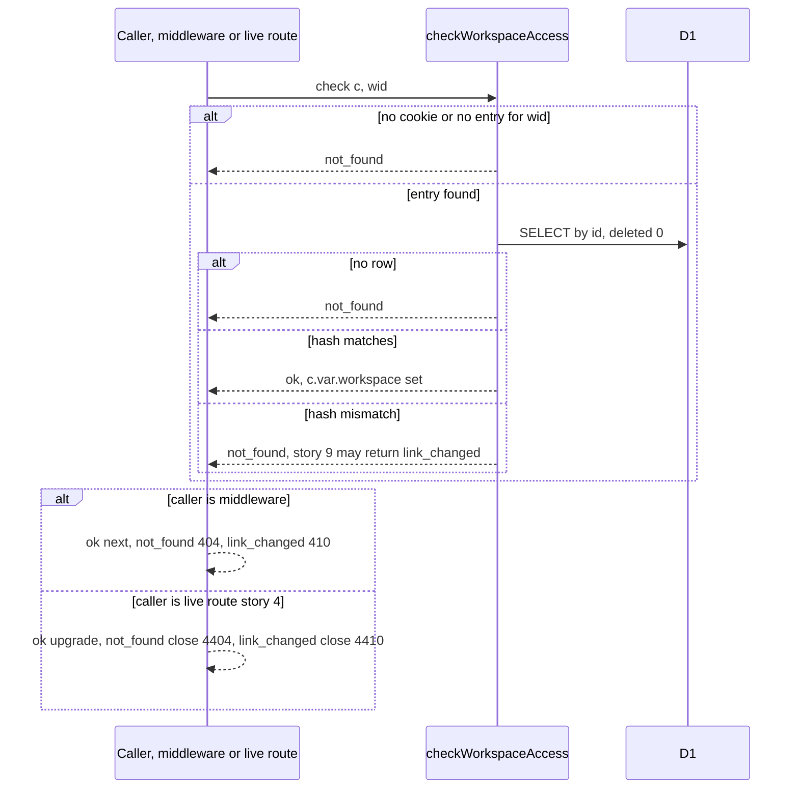
```mermaid
sequenceDiagram
  participant R as Caller, middleware or live route
  participant X as checkWorkspaceAccess
  participant D as D1
  R->>X: check c, wid
  alt no cookie or no entry for wid
    X-->>R: not_found
  else entry found
    X->>D: SELECT by id, deleted 0
    alt no row
      X-->>R: not_found
    else hash matches
      X-->>R: ok, c.var.workspace set
    else hash mismatch
      X-->>R: not_found, story 9 may return link_changed
    end
  end
  alt caller is middleware
    R-->>R: ok next, not_found 404, link_changed 410
  else caller is live route story 4
    R-->>R: ok upgrade, not_found close 4404, link_changed close 4410
  end
```

## Implementation
- `apps/api/src/lib/workspaceAccess.ts` (`checkWorkspaceAccess`).
- `apps/api/src/middleware/workspace-auth.ts` (maps the outcome to a response).
- Registered in `apps/api/src/app.ts` before all `/api/w/*` routes except `/live`; `env.ts` types `workspace` and `rememberedEntry` in Hono Variables.

## Tests
TC-27 to TC-32 (integration), TC-106 (integration, the check itself returns outcomes without writing a response).

## Get workspace API

> Anchor: `workspace.get`

## Contract
`GET /api/w/:workspaceId` returns 200 `{ workspace: Workspace }` with the current name and version.
Errors: 404 from auth (story 9 adds 410 `link_changed` through the auth hook).
Side effects: none.

Role in the PRD requirements:
- **prd.rename_workspace, "display the new name to everyone using that workspace":** GET is how any person other than the renamer reads the saved name. TanStack Query refetches `queryKeys.workspace(id)` on window focus and on mount, so a collaborator in another browser sees the renamed workspace on their next focus or load. Story 4 adds push. TC-57 opens the workspace in a second context after a rename and asserts the new name comes from this endpoint.
- **prd.create_workspace, "take the visitor into it":** after creation the SPA primes the cache from the create response. On any later load of the new workspace (reload, other tab, return from story 3's list), GET supplies the workspace the visitor is taken into, including the default name 'My Todoodle' and version 1. The Inbox is implicit (architecture section 5), so GET needs no Inbox data; the empty Inbox view renders from the workspace alone until story 5.

## Implementation
- `apps/api/src/routes/workspaces.ts`; returns `c.var.workspace` mapped to the public shape (the secret_hash is stripped).
- Web: `apps/web/src/features/workspace/useWorkspace.ts` uses `useQuery(workspaceQuery(id))` (key `queryKeys.workspace(id)`) with `refetchOnWindowFocus: true`. Errors reach the component as typed errors from `lib/errors.ts`.

## Tests
TC-27 (integration), TC-55 and TC-57 (e2e, the second context reads the name through GET).

## Rename workspace API

> Anchor: `workspace.rename`

## Contract
`PATCH /api/w/:workspaceId`
- Body: `{ name: string }`. It is trimmed, then must be 1..`WORKSPACE_NAME_MAX` (120) characters. Schema `RenameWorkspaceBody` lives in `packages/shared/src/schemas.ts`.
- 200 response: `{ workspace: Workspace }` with version incremented.
- Errors: 400 `validation`, 403 `forbidden_client`, 404 `not_found`, 415 `unsupported_media_type` (non-JSON body).
- Side effects: the row's name, version and updated_at change. Last write wins (architecture section 7).

**Extension points:** story 4 inserts `broadcast(c, wid, {type:'workspace.updated', ...})` after the commit at the marked point in the handler (D-26; no separate `waitUntil`, no `broadcastEvent`). Story 10's `mutations` limiter applies via middleware.

## Implementation
- `apps/api/src/routes/workspaces.ts` calls `renameWorkspace`.

## Tests
TC-33 to TC-38 (integration), TC-57 (e2e).

## Get workspace link API

> Anchor: `workspace.link`

## Contract
`GET /api/w/:workspaceId/link` (behind workspace-auth) returns 200 `{ link: string }`, where `link = <request origin> + '/w#' + entry.s`.
- The secret comes from this browser's own `tdl_ws` cookie entry, which the middleware has just verified against `secret_hash` (`c.var.rememberedEntry`). The server stores no raw secret, so this is the only way to rebuild the link, and it only works for a browser that already holds it.
- The response carries `Cache-Control: no-store` (already applied to all of `/api` by finalizeResponse; asserted explicitly here).
- Errors: 404 `not_found` from auth (story 9: 410 `link_changed` via the auth hook).
- Side effects: none. The handler never logs the link.
- **When it is called:** only on an explicit user action — opening the SharePanel, choosing Bookmark on an id route, or pressing Copy in the unsaved-link banner — while the secret is not already in memory from `secretFromHash()`. That happens when the workspace was entered via `/w/:workspaceId…` without a fragment (story 3's remembered list or switcher). It is never called on page load.

Why: story 3 routes remembered workspaces to `/w/:workspaceId`, so no secret reaches page scripts unless the user asks for the link (architecture section 4). This endpoint also satisfies prd.bookmarkable_link for id-routed sessions: the Share panel's Bookmark action swaps the URL to `workspacePath(wid, currentView, {secret})`, which starts fragment carry-over for the rest of the session (web.routes).

**Sequence: fetch link for the Share panel or banner**

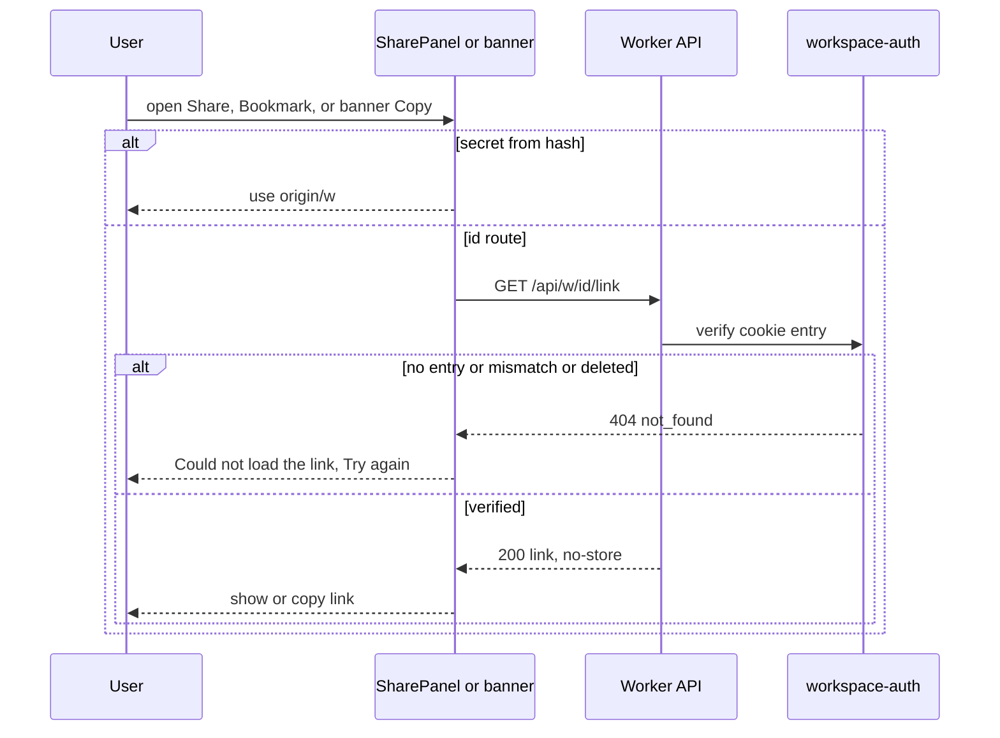
```mermaid
sequenceDiagram
  participant U as User
  participant L as SharePanel or banner
  participant A as Worker API
  participant M as workspace-auth
  U->>L: open Share, Bookmark, or banner Copy
  alt secret from hash
    L-->>U: use origin/w#secret, no request
  else id route
    L->>A: GET /api/w/id/link
    A->>M: verify cookie entry
    alt no entry or mismatch or deleted
      M-->>L: 404 not_found
      L-->>U: Could not load the link, Try again
    else verified
      A-->>L: 200 link, no-store
      L-->>U: show or copy link
    end
  end
```

## Implementation
- `apps/api/src/routes/workspaces.ts` registers `GET /api/w/:workspaceId/link`. workspace-auth exposes the matched entry as `c.var.rememberedEntry`.
- Web: `apps/web/src/features/share/useWorkspaceLink.ts` returns the link from `secretFromHash()` if present; otherwise `useQuery({ queryKey: queryKeys.link(id), queryFn: getWorkspaceLink, enabled, staleTime: 0, gcTime: 0 })`. The banner uses `queryClient.fetchQuery` with the same key inside its click handler.

## Tests
TC-59, TC-60, TC-61 (integration), TC-63 (e2e), TC-65, TC-66, TC-70, TC-74 (ui-component).

## Test route: POST /test/seed-workspace

> Anchor: `test.seed_workspace`

A real capability owned by story 2 in story 1's test-route registry (D-35). It exists so tests can create workspaces in states the public API cannot produce (deleted; later, rotated) without arbitrary SQL (`/test/sql` does not exist).

**Role in prd.unguessable_link ("grant access only to requests presenting that link"):** access must be granted only for a live workspace's current link. A deleted workspace's secret, and (story 9) a rotated-away secret, must not grant access. Those states cannot be reached through the public API, so this route is what lets TC-25 and TC-32 prove that open and auth refuse them with the same constant 404 as an unknown secret. It is itself unreachable in production, so it cannot become a way in.

## Contract
`POST /test/seed-workspace`, registered in story 1's `apps/api/src/routes/test.ts`:
- Gating: 404 in production (story 1's `/test/*` gate). Allowed in local and staging, because it only creates new rows.
- Body (zod `SeedWorkspaceBody`, `.strict()`): `{ name?: string; deleted?: boolean; rotatedSecondsAgo?: number }`.
  - `name`: 1..`WORKSPACE_NAME_MAX` after trim; default `DEFAULT_WORKSPACE_NAME`.
  - `deleted`: when true, the row is inserted with `deleted = 1` and `deleted_at` set.
  - `rotatedSecondsAgo`: **extension point for story 9.** Story 2's schema declares it but the handler returns 400 `validation` with issue `'rotatedSecondsAgo requires story 9'` if present (never silently ignored). Story 9 implements it: sets `previous_secret_hash` and `secret_rotated_at = now - rotatedSecondsAgo`, and adds `previousSecret` to the response.
- 201 response: `{ workspace: Workspace, secret: string }` (story 9 adds `previousSecret?`). It does **not** set a cookie: tests open the workspace through the real `open` endpoint or `/w#secret`, so auth is exercised for real.
- Errors: 400 `validation`; 403/415 from story 1's validate pipeline (the route is a mutation like any other).
- Uses the real `generateSecret`, `hashSecret` and `insertWorkspace` (plus a `markDeleted` query for `deleted`), so seeded secrets and hashes have their real shapes.

**Sequence**
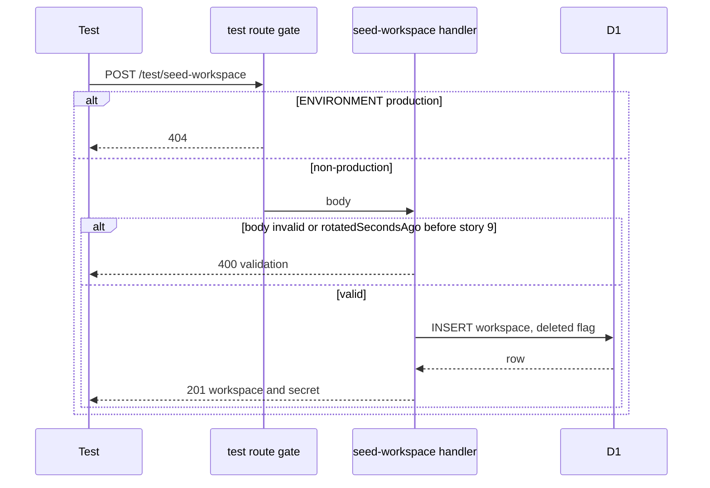
```mermaid
sequenceDiagram
  participant T as Test
  participant G as test route gate
  participant H as seed-workspace handler
  participant D as D1
  T->>G: POST /test/seed-workspace
  alt ENVIRONMENT production
    G-->>T: 404
  else non-production
    G->>H: body
    alt body invalid or rotatedSecondsAgo before story 9
      H-->>T: 400 validation
    else valid
      H->>D: INSERT workspace, deleted flag
      D-->>H: row
      H-->>T: 201 workspace and secret
    end
  end
```

## Implementation
- `apps/api/src/routes/test.ts` (story 1's file; this story adds the handler), `apps/api/src/db/workspaces.ts` (`markDeleted`), `packages/shared/src/schemas.ts` (`SeedWorkspaceBody`).

## Tests
TC-105 (integration). Consumers: TC-25, TC-32 (deleted fixtures, proving refused access), story 3's unavailable-entry fixtures, story 9's rotated fixtures.

## No link leakage

> Anchor: `security.no_leak`

## Contract
- Every response carries `Referrer-Policy: no-referrer` and the CSP from architecture section 6. Story 1 owns `finalizeResponse`; this story asserts it for workspace routes.
- `apps/web/index.html` includes `<meta name="referrer" content="no-referrer">`. It loads no third-party script, font or analytics; fonts are self-hosted.
- API logging (`apps/api/src/lib/errors.ts` — the **server** logger, distinct from the web client's `apps/web/src/lib/errors.ts`) logs only `{requestId, method, pathname, status, errorName}`, never bodies, cookies, query strings or headers.
- The SPA never puts the secret in the document title, query strings, `history.state`, `localStorage`, `sessionStorage`, typed error objects or error messages, and never sends it over the network except in the `POST /api/workspaces/open` body. The fragment carried over by `workspacePath` (web.routes) stays in the fragment; it is never moved into the path or query.
- **Email it to me** is a `mailto:` navigation handled by the user's own mail app. It makes no HTTP request and involves no third party; putting the secret in the mail body is the user's explicit choice.
- The link-saved and snooze flags store only the workspace id (non-secret) and the value `'1'`.

## Implementation
- `apps/web/index.html` (meta tag).
- `apps/api/src/lib/errors.ts` (sanitised server logger).
- `apps/web/src/lib/api.ts` and `apps/web/src/lib/errors.ts` (typed client errors carry only `status`, `code` and parsed server fields; never request bodies).
- `apps/web/src/features/share/linkSaved.ts` (keys contain only the id).
- A manual verification step during implementation: inspect staging Workers Logs for a create/open request and confirm Cookie headers are not recorded. If they are, set `invocation_logs = false` in `wrangler.toml` for staging and production, and record the finding in the task feedback.

## Tests
TC-39, TC-40 (integration), TC-58, TC-89 (e2e).

## Landing page with one-click start (LandingStart)

> Anchor: `web.landing`

## Contract
Route `/` (`apps/web/src/routes/Home.tsx`) renders the product name, a one-line pitch and **`LandingStart`**.

**`LandingStart`** — `apps/web/src/features/landing/LandingStart.tsx` (D-33: the named start component; story 10 references it by this name). It is also rendered by the NotFound state (web.api_errors) for 'Start a new list'.
```ts
export function LandingStart(props: { label?: string /* default 'Start a new list' */ }): JSX.Element;
export function describeCreateError(err: unknown): { message: string; retryAfterSeconds?: number }; // features/landing/createErrorText.ts
```
- Click: `useMutation(createWorkspace)` via `useCreateWorkspace`. The button is disabled while pending, so a double click makes one call.
- On success (in the mutation's `onSuccess`, never in render or an effect): `queryClient.setQueryData(queryKeys.workspace(id), workspace)` primes the cache, so the Workspace route renders the name immediately with no second fetch. Then `navigate(workspacePath(id, {kind:'inbox'}, {secret}) … )` — concretely `/w#<secret>` — with `{ state: { justCreated: true } }`.
- On error: inline message from `describeCreateError(err)` with `role=alert`; the button re-enables. Story 2's mapping returns 'Couldn't create your list - try again' for every error.
- **Extension point (story 10):** `describeCreateError` gains a `RateLimitedError` branch (scopes `create_burst`, `create_daily`) returning a wait message and `retryAfterSeconds`; `LandingStart` keeps the button disabled and shows story 10's `useCountdown`/`formatWait` while it is set. Story 10 edits only `createErrorText.ts` and the countdown slot in `LandingStart`; there is no `StartButton.tsx`.
- Buttons meet `MIN_TOUCH_TARGET_PX` (44) on touch devices and use theme tokens (web.theme).
- **Extension point (story 3):** `Home.tsx` renders `<HomeRememberedSlot/>` above `LandingStart`; story 2's slot renders nothing, story 3 fills it with the remembered-workspaces list.

## Implementation
- `apps/web/src/routes/Home.tsx`, `apps/web/src/features/landing/LandingStart.tsx`, `apps/web/src/features/landing/createErrorText.ts`, `apps/web/src/features/workspace/useCreateWorkspace.ts`, `apps/web/src/lib/api.ts` (`createWorkspace`), `apps/web/src/lib/queryKeys.ts` (factory, see web.workspace_shell).
- vercel-react-best-practices applied:
  - `bundle-dynamic-imports`: the Workspace route is lazy via `lazyWithRetry` (web.lazy_with_retry).
  - `bundle-preload`: the Start button's `onPointerEnter`/`onFocus` calls the route's `preload()` to warm the chunk.
  - `rendering-hoist-jsx`: static hero markup is hoisted to module scope.
  - `rerender-move-effect-to-event`: create happens in the click handler, never in an effect.
  - `bundle-barrel-imports`: shadcn Button and lucide icons are imported by direct per-icon path; enforced by the lint rule in web.theme.

## Tests
TC-41, TC-42 (ui-component), TC-54 (e2e), TC-83 (unit, key factory used for priming).

## Workspace view: query keys, boot open, useOpenWorkspace, loading states, title and header rename

> Anchor: `web.workspace_shell`

The shell frame itself (AppShell, `canEdit`) is web.app_shell. The route table, `workspacePath` and fragment carry-over are web.routes. Error mapping and error states are web.api_errors. This capability is the workspace view that runs inside them.

**Role in prd.create_workspace:** one click on 'Start a new list' creates the workspace (web.landing → workspace.create) and navigates to `/w#<secret>` with `state.justCreated`. This view then takes the visitor straight into the new, empty workspace with its Inbox: the create mutation's `onSuccess` has already primed `queryKeys.workspace(id)`, so `useOpenWorkspace` returns immediately and the name 'My Todoodle' and the empty Inbox render without a skeleton or a second request, with the Save your link panel opening over it (web.link_dialog).

## Contract
**Query key factory** — `apps/web/src/lib/queryKeys.ts` (D-37, architecture §12).
- This file is owned here and **complete**. Stories 3, 5, 6, 7, 8 and 11 use these keys and do not add their own.
- A story that needs a new key edits this design first (architecture §13 rule 2).
- Every parameter that changes the server response is part of its key. That is why `today` and `search` take a params object that includes `includeCompleted`.
```ts
export type TaskListParams = { list: 'inbox' | 'project'; projectId?: string; includeCompleted: boolean };
export type TodayParams = { date: string; includeCompleted: boolean };   // date = viewer's local YYYY-MM-DD (story 8)
export type SearchParams = { q: string; includeCompleted: boolean };     // q = debounced, normalised query (story 11)
export const queryKeys: {
  root(wid: string): readonly ['ws', string];
  workspace(wid: string): readonly ['ws', string, 'workspace'];
  link(wid: string): readonly ['ws', string, 'link'];
  tasksAll(wid: string): readonly ['ws', string, 'tasks'];                               // prefix for setQueriesData / invalidation (5, 6)
  tasks(wid: string, p: TaskListParams): readonly ['ws', string, 'tasks', TaskListParams]; // 5, 6, 7
  counts(wid: string): readonly ['ws', string, 'counts'];                                 // no date (D-31, D-37); 5-8
  projects(wid: string): readonly ['ws', string, 'projects'];                             // 7
  todayAll(wid: string): readonly ['ws', string, 'today'];                                // prefix for invalidation (8)
  today(wid: string, p: TodayParams): readonly ['ws', string, 'today', TodayParams];      // 8
  searchAll(wid: string): readonly ['ws', string, 'search'];                              // prefix for invalidation (11)
  search(wid: string, p: SearchParams): readonly ['ws', string, 'search', SearchParams];  // 11
  // browser-scoped keys, defined ONCE here for story 3; the ONLY keys outside the ['ws', wid] root:
  remembered(): readonly ['remembered'];
  rememberedTouch(id: string): readonly ['remembered-touch', string];
};
```
- Every workspace-scoped key starts with `root(wid)`, so story 4's reconnect heal `invalidateQueries({ queryKey: queryKeys.root(wid) })` reaches all of them.
- Params objects always carry every field, including `includeCompleted` as a boolean, so keys are stable. `projectId` is present only when `list === 'project'`.
- Optimistic writes and invalidations that span every variant use the prefix keys: `setQueriesData({ queryKey: queryKeys.tasksAll(wid) })`, `invalidateQueries({ queryKey: queryKeys.todayAll(wid) })` and `invalidateQueries({ queryKey: queryKeys.searchAll(wid) })`.
- The counts key carries no date. Its `queryFn` reads the viewer's local date from story 8's clock store and sends `date` as a request parameter.

**Query options factory** — `apps/web/src/features/workspace/workspaceQuery.ts`:
```ts
export function workspaceQuery(id: string, opts?: { placeholderData?: Workspace }): UseQueryOptions<Workspace>;
// { queryKey: queryKeys.workspace(id), queryFn: () => getWorkspace(id), placeholderData: opts?.placeholderData }
```
Used by `useWorkspace(id)` and by story 3. Story 3 passes `placeholderData` built from the remembered list entry, so the name renders immediately on `/w/:id` before the GET returns.

**Boot open** — `apps/web/src/features/workspace/bootOpen.ts`:
```ts
export function startBootOpen(location: Location): Promise<OpenResult> | null; // called once from main.tsx before render
export function takeBootOpen(secret: string): Promise<OpenResult> | null;      // consumed by useOpenWorkspace (same secret only)
```
- `main.tsx` calls `startBootOpen(window.location)` before `createRoot`. When `secretFromHash(location)` (web.routes) returns a secret, it fires `POST /api/workspaces/open` immediately, in parallel with the lazy Workspace chunk download (async-parallel). That is any `/w…` path with a non-empty fragment (D-13).
- The promise's `.then` writes `queryClient.setQueryData(queryKeys.workspace(ws.id), ws)`. The cache write happens in the fetch continuation, never in render or an effect. Failures reject with the typed errors from `lib/errors.ts`.
- The open call deliberately has **no query key**. It runs before the id is known, and a key would put the secret into the query cache and devtools. It is a single module-level promise, so StrictMode double renders reuse it.

**Open-workspace hook** — `apps/web/src/features/workspace/useOpenWorkspace.ts` (D-43, exported for stories 3 and 9):
```ts
export function useOpenWorkspace(secret: string): OpenResult; // suspends; throws typed errors to ApiErrorBoundary
```
- If the cache is already primed for this secret's workspace (just created), it returns immediately.
- Otherwise it calls `use(takeBootOpen(secret) ?? openWorkspace(secret))` inside `<Suspense fallback={<WorkspaceSkeleton/>}>`, with one module-cached promise per secret.
- If the route has a `:workspaceId` that differs from the opened id, it replaces the URL with `workspacePath(opened.id, sameView, {secret})`. The secret wins; the id is only a handle.
- **Extension point (story 9):** after a 200 it calls `applyOpenResult(result)`.
  - Story 2's implementation does nothing with `canonicalLink`.
  - Story 9 makes it replace the fragment with the canonical link's secret (`history.replaceState`), so the session and bookmarks carry the current link.
  - A 410 `link_changed` arrives as `LinkChangedError` through the boundary.

**Workspace view** — `apps/web/src/routes/Workspace.tsx`, inside `ApiErrorBoundary` and `AppShell`:
1. **Fragment entry** (`/w#<secret>` or `/w/:id…#<secret>`): `useOpenWorkspace(secretFromHash())`. An empty hash on `/w` throws `NotFoundError` without sending a request. The fragment is never removed.
2. **Id entry** (`/w/:workspaceId…` with no fragment, from story 3's list or switcher): `useQuery(workspaceQuery(id, { placeholderData }))`.
   - Pending with no placeholder shows the skeleton; with a placeholder, the name shows immediately.
   - Errors are thrown to `ApiErrorBoundary` (`throwOnError: true`).
   - No secret reaches JS unless the user opens the Share panel (workspace.link).
- Both entries provide `WorkspaceContext { workspaceId, secretFromHash?: string }`, consumed by stories 3 to 11.

**Loading state** — `<WorkspaceSkeleton>` renders the header bar, a sidebar with 3 grey rows and a list with 5 grey rows, in their final positions.
- The static JSX is hoisted, with `aria-busy="true"`.
- Reduced motion disables the shimmer.
- There is no full-page spinner.

**Title** — React 19 `<title>Todoodle - {name}</title>` rendered in the view, with no `document.title` side effect. The secret is never in the title.

**Header rename** — `apps/web/src/features/shell/WorkspaceNameEditor.tsx` (D-43). This is the only name editor; story 3's switcher chevron sits beside it and does not replace it. It renders in AppShell's header and, like every control that sends a change (web.app_shell), gates itself: when `useCanEdit()` is false it is read-only and never commits.
- Enter or blur commits; Escape cancels; the value is trimmed.
- An empty name reverts without a request and shows 'Name can't be empty' under the field (`role=status`) for `NAME_HINT_MS` (**3,000 ms**, in `packages/shared/src/limits.ts`, D-44). Story 7 reuses this constant.
- An unchanged name sends no request.
- Otherwise the rename is an optimistic `useMutation(renameWorkspace)`: `onMutate` snapshots `queryKeys.workspace(id)`, and `onError` rolls back and shows a sonner toast.

**Imports** are direct paths only (no `index.ts` barrels in `features/*`).

## Implementation
- `apps/web/src/main.tsx` (calls `startBootOpen` before render)
- `apps/web/src/lib/queryKeys.ts`
- `apps/web/src/features/workspace/workspaceQuery.ts`, `bootOpen.ts`, `useOpenWorkspace.ts`
- `apps/web/src/routes/Workspace.tsx`
- `apps/web/src/features/workspace/WorkspaceSkeleton.tsx`
- `apps/web/src/features/shell/WorkspaceNameEditor.tsx`
- `apps/web/src/features/workspace/WorkspaceContext.tsx`, `useWorkspace.ts`, `useRenameWorkspace.ts`
- `packages/shared/src/limits.ts` adds `NAME_HINT_MS = 3_000`
- vercel-react-best-practices applied:
  - `async-parallel`: boot open runs alongside the route chunk.
  - `rerender-derived-state-no-effect`: the secret is derived from location.
  - `client-swr-dedup`: one module-level boot promise; TanStack Query dedups the id-route GET.
  - `rerender-no-inline-components`: `WorkspaceNameEditor` is a separate memo component.
  - `rerender-functional-setstate`: functional setState in the editor.
  - `rendering-hoist-jsx`: the skeleton's static markup is hoisted.
  - `async-suspense-boundaries`: Suspense around the view shows the skeleton while open resolves.

## Tests
TC-47 to TC-50, TC-64, TC-78, TC-80, TC-81, TC-93, TC-94 (ui-component); TC-83, TC-84 (unit); TC-54, TC-55, TC-57, TC-63, TC-86 (e2e). TC-83 also asserts that `today` and `search` keys differ when only `includeCompleted` differs, and that `todayAll` / `searchAll` are prefixes of every variant.

## Route table, workspacePath and fragment carry-over

> Anchor: `web.routes`

Owner of the route table (D-12) and fragment carry-over (D-13). Story 3 does not register `/w/:id` again; story 11 uses `workspacePath` and defines no `listRoute()`; story 7's `useWorkspaceNavigate` is a thin wrapper over `workspacePath`.

## Contract
**Route table** — `apps/web/src/App.tsx` (the only place routes are declared). This is the final shape; stories 7 and 8 add their child entries at the marked positions, nothing else:

| Path | Renders | Registered by |
|---|---|---|
| `/` | `Home` | 2 |
| `/w` | `Workspace` (boots from the fragment; Inbox view) | 2 |
| `/w/:workspaceId` | `Workspace`, Inbox view (index child) | 2 |
| `/w/:workspaceId/today` | `Workspace`, Today view (child) | 8 |
| `/w/:workspaceId/project/:projectId` | `Workspace`, project view (child) | 7 |
| `*` | `NotFound` state (with the `recovery` slot) | 2 |

Until stories 7 and 8 register their children, those paths fall to `*` and show the NotFound state. The workspace routes share one `Workspace` element wrapped in `ApiErrorBoundary` + `AppShell`; the view is a child outlet. Error pages (not found, link changed, too many attempts) are **boundary states, not routes** (web.api_errors). The `Workspace` element is lazy via `lazyWithRetry`.

**Paths** — `apps/web/src/lib/workspacePath.ts`:
```ts
export type WorkspaceView = { kind: 'inbox' } | { kind: 'today' } | { kind: 'project'; projectId: string };
export function workspacePath(wid: string, view: WorkspaceView, opts?: { secret?: string }): string;
// inbox -> /w/<wid>, today -> /w/<wid>/today, project -> /w/<wid>/project/<pid>; opts.secret appends '#<secret>'
export function secretFromHash(loc: Pick<Location, 'pathname' | 'hash'>): string | null;
// non-empty fragment on '/w' or any '/w/…' path -> the secret; otherwise null
export function useWorkspaceHref(view: WorkspaceView): string; // workspacePath(ctx.workspaceId, view, { secret: ctx.secretFromHash })
```
- `projectId` and `wid` are URL-encoded; the secret is appended verbatim (base64url is fragment-safe).

**Fragment carry-over** (D-13):
- A session that **began from a fragment link** keeps the fragment on every in-app navigation within `/w/:id/*`: every workspace link and `navigate` call builds its URL with `useWorkspaceHref` / `workspacePath(..., {secret: secretFromHash})`. So prd.bookmarkable_link holds in every view: reloading or bookmarking `/w/<id>/today#<secret>` boots from the fragment exactly like `/w#<secret>`.
- Sessions opened by id (story 3's list or switcher) have no fragment and add none, until the user chooses Bookmark in the Share panel, which replaces the URL with the fragment form and so starts carry-over.
- On a fragment route whose `:workspaceId` differs from the workspace the secret opens, the URL is replaced with the opened id (web.workspace_shell, `useOpenWorkspace`). The secret is authoritative; the id is only a handle.
- Navigating to `/` or to another workspace drops the fragment (it belongs to one workspace).

**Sequence: navigate between views keeping the fragment**
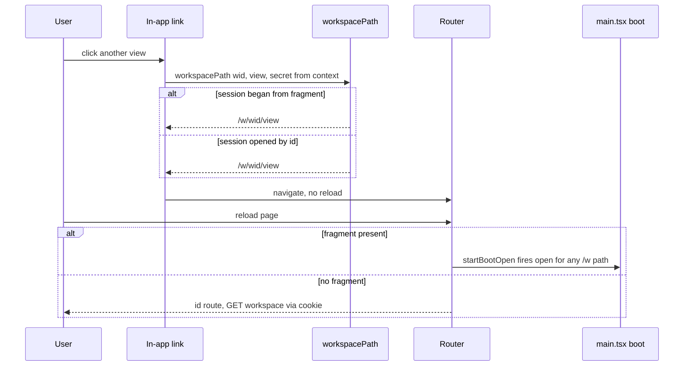
```mermaid
sequenceDiagram
  participant U as User
  participant L as In-app link
  participant P as workspacePath
  participant R as Router
  participant B as main.tsx boot
  U->>L: click another view
  L->>P: workspacePath wid, view, secret from context
  alt session began from fragment
    P-->>L: /w/wid/view#secret
  else session opened by id
    P-->>L: /w/wid/view
  end
  L->>R: navigate, no reload
  U->>R: reload page
  alt fragment present
    R->>B: startBootOpen fires open for any /w path
  else no fragment
    R-->>U: id route, GET workspace via cookie
  end
```

## Implementation
- `apps/web/src/App.tsx` (route table), `apps/web/src/lib/workspacePath.ts`.
- `bootOpen.ts` and `useOpenWorkspace.ts` use `secretFromHash` (web.workspace_shell).

## Tests
TC-96, TC-97 (unit), TC-98 (ui-component), TC-99 (e2e).

## AppShell: header, main slot, canEdit stub and named extension slots (no fieldset; controls self-gate)

> Anchor: `web.app_shell`

The one shell (D-11). It replaces the earlier names "Workspace route shell", `WorkspaceShell`, `WorkspaceHeader` and "AppShell in story 5": there is exactly one component, owned here, and later stories fill its named props.

## Contract
**Edit gate store** — `apps/web/src/features/live/canEdit.ts` (D-10; there is no `canEditStore.ts`):
```ts
export function useCanEdit(): boolean;              // useSyncExternalStore; the snapshot is the boolean itself
export function subscribeCanEdit(fn: () => void): () => void;
export function getCanEdit(): boolean;
```
Story 2 ships a stub whose snapshot is always `true`. **Story 4 replaces the implementation behind the same exports** with the offline-driven store; no caller changes. A test-only `__setCanEditForTests(value)` is exported from the stub module for ui-component tests.

**Shell** — `apps/web/src/features/shell/AppShell.tsx`:
```tsx
type AppShellProps = {
  workspaceId: string;
  children: React.ReactNode;              // main region: the view's task grids (stories 5-8); cells self-gate (story 5 TaskRow)
  quickAddSlot?: React.ReactNode;         // story 5: quick add (inline on desktop, FAB below MOBILE_BREAKPOINT_PX); input typeable offline, submit self-gated
  viewHeaderSlot?: React.ReactNode;       // stories 5/6/7/8: view title and 'Show completed' toggle (not gated; works offline)
  sidebar?: React.ReactNode;              // story 5: sidebar (desktop) / drawer (below MOBILE_BREAKPOINT_PX)
  searchSlot?: React.ReactNode;           // story 11 via story 5: sidebar search field / mobile header search button
  headerActionsSlot?: React.ReactNode;    // story 5 (drawer trigger), story 11 (Finder trigger)
  switcherTrigger?: React.ReactNode;      // story 3: chevron 'Switch workspace' button beside the name (D-28)
};
```
Layout:
```
<header>  [WorkspaceNameEditor] [switcherTrigger] ……… [headerActionsSlot] [ShareButton]
<UnsavedLinkBanner/>
<div class="body"> [sidebar]
  <main> [viewHeaderSlot] [quickAddSlot] {children} </main>
```
- **There is no `<fieldset disabled>` anywhere in the app** (decision 2026-09-27, supersedes the D-10/D-11 fieldset text and §12's "fieldset, not a hook per control" rule). A disabled fieldset also disables text inputs (breaking the offline-typeable quick add) and every button inside it (breaking the task-name button that must open the detail sheet read-only offline, and the Discard button on failed rows that must work offline).
- **Every control that sends a change gates itself with `useCanEdit()`** (or `getCanEdit()` in key handlers). Story 4 owns the contract; this stub ships it. To keep this cheap and consistent, the shared row/cell components do the gating once (story 5 TaskRow cells, QuickAdd); overlays, sheets, pickers, dialogs, the sidebar and header controls self-gate. In story 2 the only mutating control is `WorkspaceNameEditor` (read-only when false).
- **Not gated (works offline):** navigation, the sidebar's navigation entries, the switcher, the Share button and panel (copy/email/bookmark), the banner, the header actions triggers, the view header's 'Show completed' toggle, the quick-add text input, the task-name button (opens detail read-only), and Discard on failed rows (local only). The D-10 offline-works / offline-disabled lists are unchanged.
- Absent slots render nothing and leave no empty landmark (no empty `<nav>` for a missing sidebar). In story 2 the sidebar area shows the skeleton's placeholder rows only while loading, then an 'Inbox' label; story 5 supplies the real sidebar.
- Loading: while the workspace is pending, `Workspace.tsx` renders `WorkspaceSkeleton` in the same regions (web.workspace_shell), so the frame does not jump.

**State: edit gate (story 2 stub; story 4 adds the transitions)**
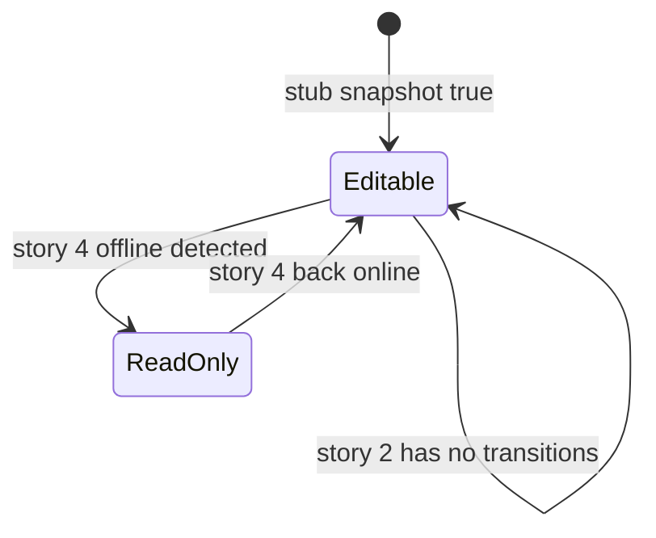
```mermaid
stateDiagram-v2
  [*] --> Editable : stub snapshot true
  Editable --> Editable : story 2 has no transitions
  Editable --> ReadOnly : story 4 offline detected
  ReadOnly --> Editable : story 4 back online
```

## Implementation
- `apps/web/src/features/shell/AppShell.tsx`, `apps/web/src/features/live/canEdit.ts` (stub).
- `Workspace.tsx` renders `<AppShell workspaceId … >{view}</AppShell>` with no slots in story 2.
- vercel-react-best-practices: `rerender-derived-state` (`useSyncExternalStore` with a boolean snapshot, so gated controls re-render only when the boolean flips), slots are elements passed as props (no inline component definitions).

## Tests
TC-94, TC-100 (ui-component); TC-54 (e2e, the shell frame renders after create).

## Typed client errors (lib/errors.ts) and ApiErrorBoundary with registered error states

> Anchor: `web.api_errors`

Owner of the client error model and the one error boundary (D-20). Every story's API calls reject with these types; no component inspects `status` to decide what happened.

## Contract
**Typed errors** — `apps/web/src/lib/errors.ts`. `api.ts` parses every non-2xx response and calls `toApiError(status, body, headers)`. Mapping is **by `body.error`, never by status alone**:

| `body.error` | Error type | Registered by |
|---|---|---|
| `not_found` | `NotFoundError` | 2 |
| `validation` | `ValidationError { issues }` | 2 |
| `gone` | `GoneError { entity }` | 4 |
| `link_changed` | `LinkChangedError` | 9 |
| `rate_limited` | `RateLimitedError { scope, retryAfterSeconds }` | 10 |
| anything else, non-JSON body, or no body | `ApiError` | 2 |

```ts
export class ApiError extends Error { readonly status: number; readonly code: string | null; }
export class NotFoundError extends ApiError {}
export class ValidationError extends ApiError { readonly issues: unknown[]; }
export class NetworkError extends ApiError {}   // fetch rejected (offline, DNS); status 0, code null
export function registerApiErrorType(code: string, make: (status: number, body: Record<string, unknown>, headers: Headers) => ApiError): void;
export function toApiError(status: number, body: unknown, headers: Headers): ApiError;
```
- `registerApiErrorType` is the extension point for stories 4, 9 and 10; each registers its code once at module load of its own `errors` module (imported from `main.tsx`). Registering the same code twice throws in development.
- Error objects carry only `status`, `code` and parsed server fields — never the request body or the secret (security.no_leak).
- `project_not_found` (7), `id_conflict` (5) and other codes stay plain `ApiError` with `code` set unless their owner registers a type; a 404 with `code:'project_not_found'` is **not** a `NotFoundError`.

**Boundary** — `apps/web/src/features/errors/ApiErrorBoundary.tsx`, wrapping the workspace routes in `App.tsx`:
```ts
type ErrorStateRenderer = (error: ApiError, ctx: { reset(): void; recovery?: React.ReactNode }) => React.ReactNode;
export function registerErrorState(errorClass: new (...a: any[]) => ApiError, render: ErrorStateRenderer): void;
function ApiErrorBoundary(props: { children: React.ReactNode; recovery?: React.ReactNode }): JSX.Element;
```
Rendering order for a caught error:
1. A registered state whose class matches (most specific class wins): **LinkChanged** (story 9 registers for `LinkChangedError`), **TooManyAttempts** (story 10 registers for `RateLimitedError` with scope `open_attempts`; other scopes return `undefined` to fall through).
2. `NotFoundError` or `ValidationError` → `<NotFound recovery={recovery}/>` (web.not_found; tip `LINK_CUT_OFF_TIP`).
3. Anything else (including `NetworkError`, 5xx, unknown codes, non-`ApiError` throws) → **`WorkspaceLoadFailed`**: 'Couldn't load this workspace.' + **Try again** (`role=alert`). Try again calls `reset()`, which resets the boundary and invalidates `queryKeys.root(wid)` (or clears the module-cached open promise for a fragment route), producing exactly one new request.
- **Recovery slot:** `App.tsx` passes `recovery` once to both `ApiErrorBoundary` and the `*` route. The component that fills it is named **`RememberedRecovery`** and is provided by story 3; story 2 passes nothing. Registered states receive the same `recovery` node (story 9's LinkChanged may render it).
- Errors from mutations are **not** thrown to the boundary; they are handled by their owners (toasts, rollbacks). Only view loads (`useOpenWorkspace`, `useQuery` with `throwOnError`) reach it.

**Sequence: a load error reaches the boundary**
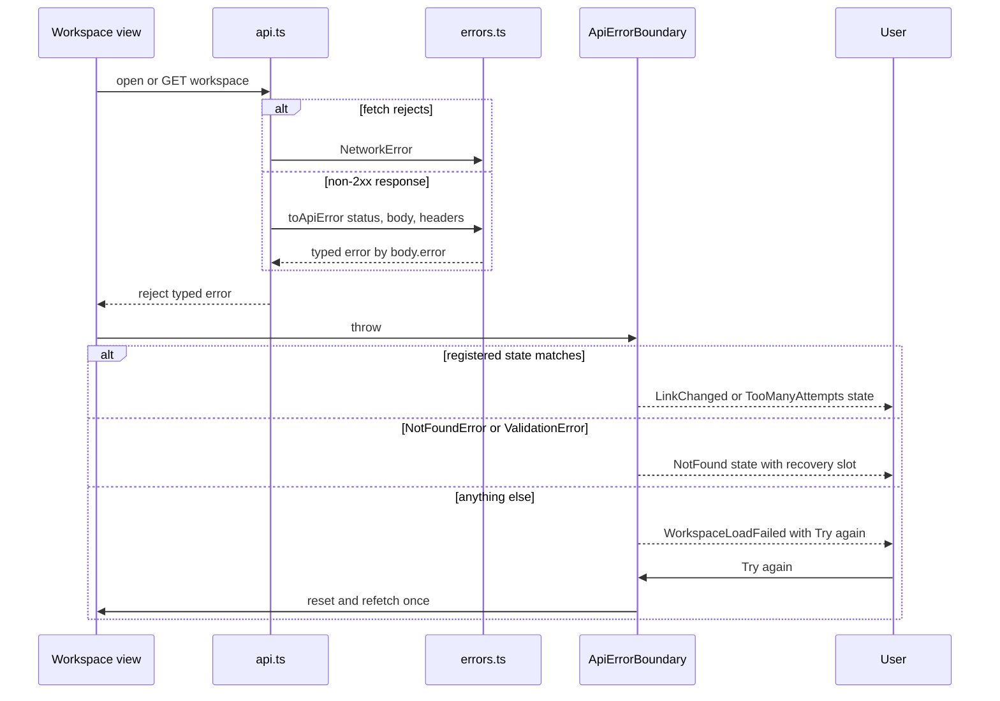
```mermaid
sequenceDiagram
  participant V as Workspace view
  participant A as api.ts
  participant E as errors.ts
  participant B as ApiErrorBoundary
  participant U as User
  V->>A: open or GET workspace
  alt fetch rejects
    A->>E: NetworkError
  else non-2xx response
    A->>E: toApiError status, body, headers
    E-->>A: typed error by body.error
  end
  A-->>V: reject typed error
  V->>B: throw
  alt registered state matches
    B-->>U: LinkChanged or TooManyAttempts state
  else NotFoundError or ValidationError
    B-->>U: NotFound state with recovery slot
  else anything else
    B-->>U: WorkspaceLoadFailed with Try again
    U->>B: Try again
    B->>V: reset and refetch once
  end
```

## Implementation
- `apps/web/src/lib/errors.ts`, `apps/web/src/lib/api.ts` (calls `toApiError`), `apps/web/src/features/errors/ApiErrorBoundary.tsx`, `apps/web/src/features/errors/WorkspaceLoadFailed.tsx`, `apps/web/src/features/errors/errorStates.ts` (registry).

## Tests
TC-101 (unit), TC-79, TC-102 (ui-component), TC-56 (e2e, bad link reaches the NotFound state).

## lazyWithRetry for every lazy chunk

> Anchor: `web.lazy_with_retry`

Moved to story 2 as the earliest user (D-42). **Every lazy chunk in the app uses it** — story 2's Workspace route and SharePanel, and later the shortcuts panel (5), task detail sheet and dialogs (6), project dialogs and Move picker (7), date picker (8), Get a new link dialog and LinkChanged (9), Finder (11). No story calls `React.lazy` directly; the lint rule in web.theme bans importing `lazy` from `react` outside this module.

## Contract
`apps/web/src/lib/lazyWithRetry.ts`:
```ts
export function lazyWithRetry<T extends React.ComponentType<any>>(
  factory: () => Promise<{ default: T }>,
): React.LazyExoticComponent<T> & { preload(): Promise<void> };
```
- `preload()` starts the import once and shares the promise with the render path (used by hover/focus preloads).
- A failed import (typically a stale chunk after a deploy) is retried up to `LAZY_RETRY_ATTEMPTS` (2) times, `LAZY_RETRY_DELAY_MS` (500 ms) apart.
- If every retry fails, it performs **one** full page reload, guarded by the `sessionStorage` key `tdl:v1:chunkReload` (value `'1'`, never a secret; the fragment survives the reload so the session is kept). If the flag is already set, it clears it and rethrows, and the nearest boundary shows `WorkspaceLoadFailed` ('Couldn't load this workspace.' + Try again). The flag is cleared after any successful chunk load.
- Storage access is wrapped in try/catch; with storage unavailable it skips the reload and rethrows (no reload loop).
- Constants live in `packages/shared/src/limits.ts`.

**State**
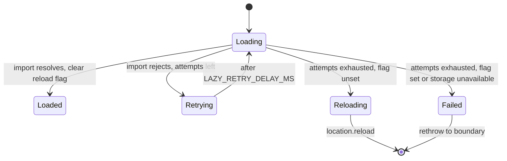
```mermaid
stateDiagram-v2
  [*] --> Loading
  Loading --> Loaded : import resolves, clear reload flag
  Loading --> Retrying : import rejects, attempts left
  Retrying --> Loading : after LAZY_RETRY_DELAY_MS
  Loading --> Reloading : attempts exhausted, flag unset
  Reloading --> [*] : location.reload
  Loading --> Failed : attempts exhausted, flag set or storage unavailable
  Failed --> [*] : rethrow to boundary
```

## Implementation
- `apps/web/src/lib/lazyWithRetry.ts`; `limits.ts` adds `LAZY_RETRY_ATTEMPTS = 2`, `LAZY_RETRY_DELAY_MS = 500`.

## Tests
TC-104 (unit).

## SharePanel: save-your-link on first run, the single ShareButton, and SHARE_ACCESS_NOTE

> Anchor: `web.link_dialog`

Anchor kept as `web.link_dialog` for task traceability; the component is `SharePanel` (architecture §12, owner decision 2026-09-25: Link and Share are one panel). Story 4 reuses this component for prd.share_panel and adds no link UI. Story 3 reuses `useWorkspaceLink`, `copyText` and `linkSaved.ts` in its forget dialog. Story 9 adds 'Get a new link' through the footer slot below.

## Contract
```ts
type SharePanelMode = 'save' | 'share';
function SharePanel(props: { open: boolean; mode: SharePanelMode; onOpenChange(open: boolean): void }): JSX.Element;
function ShareButton(): JSX.Element;   // features/share/ShareButton.tsx — the header's single Share trigger
export function useWorkspaceLink(workspaceId: string, opts: { enabled: boolean }): { link?: string; status: 'ready' | 'loading' | 'error'; retry(): void };
function useCopyLink(workspaceId: string): { copy(link: string, field?: HTMLInputElement | null): Promise<'copied' | 'fallback'>; copied: boolean };
```

**Shared copy** — `apps/web/src/features/share/shareText.ts` (D-17):
```ts
export const SHARE_KEY_NOTE = 'This link is the key to this workspace — for you and anyone you send it to.';
export const SHARE_ONLY_WAY_NOTE = "It's the only way back in: if you lose it, you lose access.";
export const SHARE_ACCESS_NOTE = "Anyone with it can see and change everything. Access can't be removed yet.";
```
Story 9 replaces the value of `SHARE_ACCESS_NOTE` with "Anyone with it can see and change everything. To cut off access, get a new link." Tests (story 2 TC-43, story 4 TC-S06) assert the constant, never the literal (architecture §13 rule 3).

Content (shadcn Dialog on desktop; full-width bottom sheet below `MOBILE_BREAKPOINT_PX`, full-width buttons, each at least `MIN_TOUCH_TARGET_PX` tall):
- Title: 'Save your link' (`mode='save'`) or 'Share' (`mode='share'`).
- Read-only link field.
- Text: `SHARE_KEY_NOTE`, then `SHARE_ACCESS_NOTE`. In `save` mode, additionally `SHARE_ONLY_WAY_NOTE`.
- Primary: `save` → **Copy link & continue** (copies, marks saved, closes). `share` → **Copy link** (copies, marks saved, shows 'Copied' for `COPY_CONFIRM_MS` = 2,000 ms, panel stays open).
- **Email it to me**: an `<a href="mailto:?subject=Your%20Todoodle%20link&body=<encoded link>">`. Clicking marks saved. It is a navigation to the local mail handler: no fetch, no third party (security.no_leak).
- **Bookmark this page**: shows 'Press ⌘D' when `navigator.userAgentData?.platform` or `navigator.platform` indicates macOS/iOS, else 'Press Ctrl+D'. On an id route (no fragment) it first replaces the URL with `workspacePath(wid, currentView, {secret})` (`history.replaceState`, keeps router state) so the bookmark is portable, then shows the hint.
- Secondary: `save` → **Skip for now**; `share` → **Done**. Neither marks saved.
- **Footer slot** `<SharePanelFooter mode>`: renders nothing in story 2. **Story 9** renders `RotateLinkButton` here in `share` mode. After a new link, story 9 re-opens this panel in `save` mode, which keeps **Skip for now** (D-17).
- Copy, email and bookmark stay usable offline (D-10); the panel reads `useCanEdit()` only to pass it to footer content that mutates (story 9's button self-gates with it).

Link source (`useWorkspaceLink(workspaceId, { enabled })`, exported for story 3):
- `WorkspaceContext.secretFromHash` set for that workspace → `${location.origin}/w#${secret}`, no request.
- Otherwise `useQuery({ queryKey: queryKeys.link(id), queryFn: getWorkspaceLink, enabled, staleTime: 0, gcTime: 0 })` (workspace.link). Loading shows a skeleton line; failure shows 'Couldn't load the link' + **Try again**.

Copy behaviour (`useCopyLink`, in event handlers only): delegates to `copyText(link, field)` from `features/share/copyText.ts` (web.unsaved_link_banner; there is no `copy.ts`). `'copied'` → `markLinkSaved(workspaceId)`. `'fallback'` → the field is focused and selected; a one-shot native `copy` listener on the field then calls `markLinkSaved`.

Opening:
- Auto-opens in `save` mode when `location.state?.justCreated`; on close, `navigate('.', { replace: true, state: {} })` keeps the hash so reload does not re-show it.
- `ShareButton` (rendered by AppShell's header; not gated, works offline) opens `share` mode; it preloads the panel chunk on `onPointerEnter`/`onFocus`. There is no 'Link' button. Radix returns focus to the trigger on close.
- The link is never put in persistent storage or long-lived cache (`gcTime: 0`).

## Implementation
- `apps/web/src/features/share/SharePanel.tsx` (lazy chunk via `lazyWithRetry`, which also exposes `preload()`; preloaded by `ShareButton` and immediately after create)
- `apps/web/src/features/share/ShareButton.tsx`, `SharePanelFooter.tsx`, `shareText.ts`
- `apps/web/src/features/share/useWorkspaceLink.ts`, `useCopyLink.ts`, `platformShortcut.ts`
- `apps/web/src/features/share/linkSaved.ts`, `copyText.ts` (see web.unsaved_link_banner)
- `packages/shared/src/limits.ts` adds `COPY_CONFIRM_MS = 2_000` (defined here; story 4's table references it; `COPIED_FEEDBACK_MS` is retired)
- vercel-react-best-practices applied:
  - `bundle-dynamic-imports` + `bundle-preload`: panel is lazy and preloaded on hover/focus.
  - `rerender-move-effect-to-event`: clipboard, mailto marking and bookmark URL swap run in handlers.
  - `async-defer-await`: the link fetch is gated on `enabled`.
  - `rendering-conditional-render`: ternaries for mode-specific content.

## Tests
TC-43 to TC-45 (as superseded in test-strategy-3; TC-43 asserts `SHARE_ACCESS_NOTE`), TC-65, TC-66, TC-67 to TC-73, TC-95 (ui-component); TC-54, TC-63, TC-88, TC-89 (e2e).

## Unsaved-link reminder banner and link-saved store

> Anchor: `web.unsaved_link_banner`

**Role in the PRD requirements**
- **prd.unsaved_link_reminder:** the banner and the link-saved store below.
- **prd.save_link_actions:** this capability supplies the primitives behind the one-click save actions in the SharePanel (web.link_dialog): `copyText` is what **Copy link & continue** calls, so copying and closing is a single click with a manual-copy fallback; `markLinkSaved` is what **Copy link & continue** and **Email it to me** (the `mailto:` link to the user's own mail app) call to record the save. **Bookmark this page** (shortcut hint, and the switch to the fragment URL on id routes) and **Skip for now** deliberately do not mark the link saved, so the reminder stays until the link has actually left the browser.

## Contract
**Store** — `apps/web/src/features/share/linkSaved.ts` (D-43; the one link-saved module, client-localstorage-schema: versioned keys, minimal data). Story 3 consumes `hasSavedLink` and `markLinkSaved` (forget dialog warning):
```ts
export function savedKey(workspaceId: string): string;          // 'tdl:v1:linkSaved:<id>'   (localStorage)
export function snoozeKey(workspaceId: string): string;         // 'tdl:v1:linkSnoozed:<id>' (sessionStorage)
export function hasSavedLink(workspaceId: string): boolean;    // localStorage savedKey(id) === '1'
export function markLinkSaved(workspaceId: string): void;       // sets '1', notifies subscribers
export function isSnoozed(workspaceId: string): boolean;        // sessionStorage snoozeKey(id) === '1'
export function snooze(workspaceId: string): void;
export function subscribe(listener: () => void): () => void;    // also listens to window 'storage' for other tabs
export function useLinkReminderVisible(workspaceId: string): boolean; // useSyncExternalStore; snapshot is the boolean itself
// Declared extension (story 9), not implemented in story 2:
// export function clearLinkSaved(workspaceId: string): void;  // removes BOTH keys (saved flag and snooze), notifies subscribers; called after rotation
```
- Every storage read/write is wrapped in try/catch. If storage is unavailable (private mode, blocked site data), `hasSavedLink` returns `false` and `isSnoozed` returns `false`: the banner stays visible (fail safe towards reminding) and nothing throws. Reads are cached in a module-level `Map` and invalidated on write or `storage` event (js-cache-storage). Story 9's `clearLinkSaved` reuses `savedKey`/`snoozeKey` instead of re-spelling keys.
- Values are only `'1'`; keys contain only the non-secret workspace id.

**Clipboard helper** — `apps/web/src/features/share/copyText.ts` (D-17; the one clipboard helper, shared by SharePanel, the banner, story 3 and story 4):
```ts
export function copyText(text: string | Promise<string>, fallbackField?: HTMLInputElement | null): Promise<'copied' | 'fallback'>;
```
- String: `navigator.clipboard.writeText`. Promise: `navigator.clipboard.write([new ClipboardItem({'text/plain': promise-as-blob})])` when `ClipboardItem` exists (keeps Safari's user-gesture requirement satisfied while the link is fetched).
- Rejection, missing API, or a promise that rejects: if `fallbackField` is given, focus and select it and resolve `'fallback'`; otherwise resolve `'fallback'` without side effects. Never throws. Called only from event handlers.

**Banner** — `<UnsavedLinkBanner />` rendered by AppShell directly under the header (not gated; works offline) while `useLinkReminderVisible(id)` is true:
- Text: 'Your link isn't saved yet — you'll lose access if you clear this browser.' (`role=status`, not an alert, so it doesn't interrupt).
- **Copy link**: `copyText(link)` when `secretFromHash` is set; `copyText(queryClient.fetchQuery({ queryKey: queryKeys.link(id), queryFn: getWorkspaceLink }))` on an id route. `'copied'` → `markLinkSaved(id)`, banner disappears. `'fallback'` (no ClipboardItem, rejection, or link fetch failure) → open `SharePanel` in `share` mode for manual copy.
- **Remind me later** → `snooze(id)`; hidden for this tab session only.
- Layout: single line on desktop; wraps with full-width buttons below `MOBILE_BREAKPOINT_PX`; buttons at least `MIN_TOUCH_TARGET_PX` tall.
- There is no way to permanently dismiss it without copying or emailing.

## Implementation
- `apps/web/src/features/share/linkSaved.ts`
- `apps/web/src/features/share/copyText.ts`
- `apps/web/src/features/share/UnsavedLinkBanner.tsx` (small, eager; imported directly by `features/shell/AppShell.tsx`)
- vercel-react-best-practices applied: `rerender-derived-state` (snapshot is the boolean), `client-event-listeners` (one `storage` listener shared by all subscribers), `js-cache-storage`, `client-localstorage-schema`, `rerender-move-effect-to-event`.

## Tests
TC-74 to TC-77, TC-90, TC-92 (unit + ui-component), TC-88 (e2e).

## Workspace not found state

> Anchor: `web.not_found`

Not-found is a **state rendered by `ApiErrorBoundary`** (web.api_errors) and by the `*` catch-all route, not a route of its own (D-12, D-20).

## Contract
```ts
// apps/web/src/features/errors/NotFound.tsx
export const LINK_CUT_OFF_TIP = "Links are long — check it wasn't cut off when it was copied.";
function NotFound(props: { recovery?: React.ReactNode }): JSX.Element;
```
`<NotFound />` shows:
- the heading 'Workspace not found';
- the tip `LINK_CUT_OFF_TIP` (exact text above, D-20);
- the `recovery` slot, rendered between the tip and the button when provided. The slot is filled by the component named **`RememberedRecovery`** (story 3), which `ApiErrorBoundary` and the `*` route receive through the single `recovery` prop set in `App.tsx` (web.api_errors). Story 2 passes nothing;
- `LandingStart` (web.landing) labelled 'Start a new list'.

It displays nothing from the failed request and renders identically for malformed, unknown and deleted secrets, for an empty hash, for an unknown `/w/:id`, and for any unmatched path. It is never shown for network errors or 5xx; those render `WorkspaceLoadFailed` (web.api_errors). React 19 `<title>Workspace not found · Todoodle</title>`.

## Implementation
- `apps/web/src/features/errors/NotFound.tsx`; rendered by `ApiErrorBoundary` for `NotFoundError`/`ValidationError` and by the `*` route in `App.tsx`.

## Tests
TC-52, TC-53, TC-82 (ui-component), TC-56 (e2e).

## Theme tokens, generator and contrast checker (light and dark), and direct-import lint

> Anchor: `web.theme`

Owned here for every story (D-42, D-43). Stories 5, 7 and 8 **add entries** to `tokens.ts`; they do not create token files, generators or contrast checkers (story 7's `contrast.ts` does not exist).

## Contract
**Tokens (source of truth)** — `packages/shared/src/tokens.ts`:
```ts
export type ThemeValue = { light: string; dark: string };           // hex colours
export const TOKENS: Record<TokenName, ThemeValue>;                  // semantic tokens, story 2
export const TEXT_PAIRS: ReadonlyArray<[fg: TokenName, bg: TokenName]>;  // must be >= 4.5:1 in both themes
export const UI_PAIRS: ReadonlyArray<[fg: TokenName, bg: TokenName]>;    // must be >= 3:1 in both themes
```
- Story 2 entries: `background`, `foreground`, `muted`, `muted-foreground`, `primary`, `primary-foreground`, `destructive`, `border`, `ring`, `warning`, `success`, with their text and UI pairs.
- **Entry extension points** (each extender adds token entries **and** the pairs they are used in, so the checker covers them automatically):
  - story 5: row/grid states (e.g. focused row, failed row);
  - story 7: the 12 `PROJECT_COLORS` light/dark values;
  - story 8: date chip states (overdue, today).
- `color-scheme: light dark` on `:root` so native controls (scrollbars, date inputs) match.
- `@media (prefers-reduced-motion: reduce)` disables shimmer and transitions globally.

**Generator** — `apps/web/scripts/build-tokens.ts` (bun) writes `apps/web/src/styles/tokens.css`: every `TOKENS` entry as a CSS variable under `:root` (light) and `@media (prefers-color-scheme: dark)` (dark), wired into the shadcn/Tailwind v4 theme. The CSS file is generated and committed; `bun run tokens` regenerates it and `bun run lint` fails if the committed file is stale.

**Contrast checker** — `packages/shared/src/contrast.ts`:
```ts
export function contrastRatio(fgHex: string, bgHex: string): number;          // WCAG 2.2 relative luminance
export function checkTokenPairs(): Array<{ pair: [string, string]; theme: 'light'|'dark'; ratio: number; min: number }>; // failures only
```
Every `TEXT_PAIRS` entry must be at least 4.5:1 and every `UI_PAIRS` entry at least 3:1, in both themes (WCAG 2.2 AA 1.4.3 and 1.4.11). The constants `MIN_TEXT_CONTRAST = 4.5` and `MIN_UI_CONTRAST = 3` live in `limits.ts`.

**Direct-import lint** — `apps/web/eslint.config.js` `no-restricted-imports` (D-43):
- **Icons:** per-icon deep imports only, using whichever per-icon subpath the **installed lucide-react's `exports` map allows** (verified at implementation and recorded in the lint rule's message). The package root `lucide-react` is banned, and so is any **local icon barrel** (e.g. `@/components/icons`; story 5's `components/icons.ts` does not exist).
- Any `@/features/*/index` or `@/features/*` directory import is banned.
- `date-fns` is banned outside `src/features/dates/picker/**` (story 8's picker is the only allowed importer).
- Importing `lazy` from `react` is banned outside `src/lib/lazyWithRetry.ts` (every chunk goes through web.lazy_with_retry).
- Runs in `bun run lint`, which `bun run test` invokes.

No runtime state: the theme follows the device setting with no in-app toggle (out of scope), so there is no state diagram or sequence for it beyond the note in the overview.

## Implementation
- `packages/shared/src/tokens.ts`, `packages/shared/src/contrast.ts`, `apps/web/scripts/build-tokens.ts`, `apps/web/src/styles/tokens.css` (generated, committed), `apps/web/src/index.css` imports it.
- `apps/web/eslint.config.js` (restricted imports), `package.json` scripts `lint` and `tokens`.

## Tests
TC-85 (unit, contrast of every pair in both themes), TC-87 (e2e, dark emulation), TC-91 (unit, lint rule rejects root, local-barrel and directory imports and direct `React.lazy`), TC-103 (unit, generated CSS matches tokens.ts).

## Extension points owned by story 2 (architecture §13)

## Extension points owned by story 2 (architecture §13)

Per architecture §13 and `specs/general/CROSS-STORY-RESOLUTIONS.md`, story 2 owns the artefacts below. Each row gives the **final shape** and the named extension points that later stories fill.
- An extender that needs something not listed here edits this design first, and records a "Delta to story 2" in its own design.
- Tests that pin copy or shapes other stories change assert the shared constant or schema, not literal text.

| Artefact (path) | Final shape owned here | Extended by |
|---|---|---|
| Route table (`apps/web/src/App.tsx`), `workspacePath`, `secretFromHash`, `useWorkspaceHref` (`lib/workspacePath.ts`) — web.routes | Routes `/`, `/w`, `/w/:id`, `/w/:id/today`, `/w/:id/project/:pid`, `*`. `WorkspaceView` union `inbox / today / project`. Fragment carry-over (D-12, D-13). | **7** registers the project child route; its `useWorkspaceNavigate` wraps `workspacePath`. **8** registers the Today child route. **3** uses `/w/:id` but does not register it. **11** uses `workspacePath` (no `listRoute()`). |
| `AppShell` (`features/shell/AppShell.tsx`) — web.app_shell | Header and main slots. **There is no `<fieldset disabled>`**: the shell disables nothing; every control that sends a change self-gates with `useCanEdit()`. Props: `children`, `quickAddSlot`, `viewHeaderSlot`, `sidebar`, `searchSlot`, `headerActionsSlot`, `switcherTrigger`. **Quick add always renders in `quickAddSlot`** (input typeable offline, submit self-gated). | **3**: `switcherTrigger` (chevron, D-28). **5**: `sidebar`/drawer; `quickAddSlot` (submit gated by `useCanEdit()`; the input stays typeable offline); `viewHeaderSlot`; `headerActionsSlot`; task grids as `children` (TaskRow cells gate once: checkbox, `…` mutating items, Retry and mutating grid keys off offline; name button and Discard always on). **6, 7, 8**: render inside `children`/`viewHeaderSlot`; views that show quick add (Inbox, project, Today) pass it through `quickAddSlot`. **11**: `searchSlot`, and the Finder trigger in `headerActionsSlot`. |
| `canEdit` (`features/live/canEdit.ts`: `useCanEdit`, `getCanEdit`, `subscribeCanEdit`) — web.app_shell | A stub that is always `true` (D-10). | **4** replaces the implementation behind the same exports. **5–9, 11** self-gate every control that sends a change with `useCanEdit()` / `getCanEdit()` (shared row/cell components and QuickAdd gate once; overlays, sheets, pickers, dialogs, sidebar and header controls gate themselves). |
| Access check (`apps/api/src/lib/workspaceAccess.ts`, `checkWorkspaceAccess(c, wid) → 'ok'|'not_found'|'link_changed'`) and the `workspaceAuth` middleware — workspace.auth | The check never sends a response. The middleware maps ok → next, not_found → 404, link_changed → 410. | **4**: `/live` calls the check directly, then accepts and closes (4404 / 4410). **9** fills the `'link_changed'` branch (previous secret hash). **10** mounts the `mutations` limiter after the middleware. **5–8** reuse it unchanged. |
| Open (`POST /api/workspaces/open`) — workspace.open | 200 `{workspace, dropped, canonicalLink?}`. `classifyMiss` hook (in story 2 always unknown → 404). `c.var.openOutcome`. | **9**: 410 `link_changed` branch and `canonicalLink` via `classifyMiss`. **10**: `open_attempts` limit; 404 and 410 both count as failed (D-34). |
| Create (`POST /api/workspaces`) — workspace.create | 201 `{workspace, secret, dropped}`. 403/413/415 come from story 1's pipeline (D-21). | **10**: `create_burst` / `create_daily` 429. |
| Cookie codec (`apps/api/src/lib/cookie.ts`) — workspace.cookie_codec | `readRemembered`, `serializeRememberedCookie`, `upsertRemembered(entries, entry, now)`, `findEntry` (D-45). | **3** adds `removeRemembered`, list and forget. **9** reads entries for `canonicalLink`. |
| Rename handler — workspace.rename | A marked post-commit point. | **4**: `broadcast(c, wid, {type:'workspace.updated'})` (D-26). **10**: `mutations` limiter. |
| `/test/seed-workspace` (`routes/test.ts`) — test.seed_workspace | `{name?, deleted?, rotatedSecondsAgo?}` → `{workspace, secret}` (D-35). | **9** implements `rotatedSecondsAgo` by performing a real rotation. **3** uses the `deleted` fixtures. |
| Typed errors (`apps/web/src/lib/errors.ts`: `ApiError`, `NotFoundError`, `ValidationError`, `NetworkError`, `registerApiErrorType`, `toApiError`) — web.api_errors | Errors are mapped by `body.error`, never by status alone (D-20). | **4** registers `gone` → `GoneError{entity}`. **9** registers `link_changed` → `LinkChangedError`. **9 creates**, and **10 extends**, `rate_limited` → `RateLimitedError{scope, retryAfterSeconds}` (earliest user creates, §13 rule 4). **5–8, 11** consume. |
| `ApiErrorBoundary` (`features/errors/ApiErrorBoundary.tsx`, `registerErrorState`, `recovery` prop), `NotFound` with `LINK_CUT_OFF_TIP`, `WorkspaceLoadFailed` — web.api_errors, web.not_found | NotFound and WorkspaceLoadFailed states. Error pages are states, not routes. | **3** provides `RememberedRecovery` for the `recovery` slot, passed once in `App.tsx`. **9** registers the LinkChanged state. **10** registers the TooManyAttempts state (scope `open_attempts`). |
| `queryKeys` (`lib/queryKeys.ts`) — web.workspace_shell | The complete key set (D-37): `root`, `workspace`, `link`, `tasksAll`, `tasks(wid,{list,projectId?,includeCompleted})`, `counts(wid)` (no date), `projects`, `todayAll`, `today(wid,{date,includeCompleted})`, `searchAll`, `search(wid,{q,includeCompleted})`, `remembered()`, `rememberedTouch(id)`. Every response-changing parameter is part of its key. | **3, 5, 6, 7, 8, 11** use only. **4** invalidates `root(wid)` on reconnect. **8** invalidates `todayAll(wid)`. **11** invalidates `searchAll(wid)`. |
| `useOpenWorkspace`, `bootOpen`, `workspaceQuery`, `WorkspaceContext {workspaceId, secretFromHash?}` — web.workspace_shell | Fragment and id entry. `applyOpenResult` hook (no-op in story 2). | **3**: `workspaceQuery(id, {placeholderData})`. **9**: `applyOpenResult` handles `canonicalLink`. **3–11** read `WorkspaceContext`. |
| `WorkspaceNameEditor` (`features/shell/WorkspaceNameEditor.tsx`), `NAME_HINT_MS = 3_000` — web.workspace_shell | Inline rename that gates itself. | **3**: the switcher chevron sits beside it and does not replace it. **7** reuses `NAME_HINT_MS` (replacing `HINT_VISIBLE_MS`). |
| `LandingStart` (`features/landing/LandingStart.tsx`), `describeCreateError`, `HomeRememberedSlot` — web.landing | Start button with typed error text (D-33). | **3** fills `HomeRememberedSlot`. **10** adds the `RateLimitedError` branch and countdown (no `StartButton.tsx`). |
| `SharePanel`, `ShareButton`, `SharePanelFooter`, `shareText.ts` (`SHARE_ACCESS_NOTE`, `SHARE_KEY_NOTE`, `SHARE_ONLY_WAY_NOTE`), `useWorkspaceLink`, `COPY_CONFIRM_MS = 2_000` — web.link_dialog | One panel with modes `save`/`share` (D-17). | **4** reuses the panel as its Share surface and references `COPY_CONFIRM_MS` (verification only, no new UI). **9** renders `RotateLinkButton` in `SharePanelFooter`, replaces the `SHARE_ACCESS_NOTE` value, and reopens the panel in `save` mode (keeping "Skip for now"). **3** uses `useWorkspaceLink`. |
| `copyText.ts`, `linkSaved.ts` — web.unsaved_link_banner | `copyText(text or promise, field?)`; `hasSavedLink`, `markLinkSaved`, `isSnoozed`, `snooze`, `subscribe`, `useLinkReminderVisible`, `savedKey`, `snoozeKey` (D-43). | **9** adds `clearLinkSaved`, which clears the saved flag **and** the snooze. **3, 4** use `copyText` (no `copy.ts`). |
| Tokens (`packages/shared/src/tokens.ts`), generator (`apps/web/scripts/build-tokens.ts`), contrast checker (`packages/shared/src/contrast.ts`) — web.theme | `TOKENS`, `TEXT_PAIRS`, `UI_PAIRS`; generated `tokens.css` (D-42). | **5**: row/grid state entries. **7**: 12 `PROJECT_COLORS` entries (no own `contrast.ts`). **8**: date chip entries. |
| Import lint (`apps/web/eslint.config.js`) — web.theme | Rules (D-43): per-icon deep imports per the installed lucide-react exports map; no local icon barrel; no feature barrels; `date-fns` only in `features/dates/picker/**`; `React.lazy` only via `lazyWithRetry`. | **5** does not create `components/icons.ts`. **8**: the picker is the date-fns exception. |
| `lazyWithRetry` (`lib/lazyWithRetry.ts`) — web.lazy_with_retry | Lazy + `preload()` + retry + one guarded reload (D-42). | **5, 6, 7, 8, 9, 11** wrap every lazy chunk with it. |
| Constants (`packages/shared/src/limits.ts`) | `NAME_HINT_MS = 3_000`, `COPY_CONFIRM_MS = 2_000`, `LAZY_RETRY_ATTEMPTS = 2`, `LAZY_RETRY_DELAY_MS = 500`, `MIN_TEXT_CONTRAST = 4.5`, `MIN_UI_CONTRAST = 3` (D-44). | **4** references `COPY_CONFIRM_MS`. **7** references `NAME_HINT_MS`. |

