# Technical Design

Per-browser memory of workspaces via the HttpOnly tdl_ws cookie (story 2 codec): list, touch, forget endpoints that never expose secrets; Home list, empty state, in-workspace switcher with prefetch, forget dialog, cap notice.

## Overview

## Scope
Story 3 turns the `tdl_ws` cookie into a list of workspaces this browser remembers, visible to the user. The cookie is defined in docs/architecture.md section 4; its codec and Set-Cookie on create/open are owned by story 2. Frontend conventions follow docs/architecture.md section 12, which is binding. Cross-story ownership follows docs/architecture.md section 13 and `specs/general/CROSS-STORY-RESOLUTIONS.md` (D-10, D-12, D-19, D-20, D-27, D-28, D-35, D-37, D-42, D-45). UX rationale is in specs/general/UI-IMPROVEMENTS.md.

Story 3 **owns** (registry): the remembered API, the remembered item schema, the Home list, the switcher, Forget, and `RememberedRecovery`. Story 9 extends them (status `link_changed`, its label and recovery page).

Adds:
- `GET /api/remembered` -> `{workspaces: RememberedItem[]}` where `RememberedItem = {id, name, lastOpenedAt, status: 'ok'|'unavailable'|'link_changed'}` (D-27). Never returns secrets. The `available` boolean is gone.
- `POST /api/remembered/:id/touch` -> 204 (moved to front), 404 `not_found`, or 410 `link_changed` for a previous secret (410 branch implemented by story 9).
- `DELETE /api/remembered/:id` -> forgets an entry on this browser only.
- `useTouchRemembered(id)`, called by story 2's `/w/:workspaceId` view. **Story 3 does not register any route** (D-12): `/`, `/w`, `/w/:id` and `*` are story 2's.
- Home:
  - a "Continue to <most recent>" primary button, with no auto-redirect;
  - the remembered list (a list of links, each with a separate Remove button) with loading skeleton and error states;
  - the empty state;
  - status-labelled rows for `unavailable` and `link_changed`.
- Workspace switcher: a separate chevron **Switch workspace** button beside story 2's name editor, opening a menu of `ok` workspaces, then a standalone **Forget this workspace on this browser…** item (current workspace, opens the Forget dialog), then a final **All workspaces…** item (D-28). Prefetch and chunk preload on hover/focus.
- Forget dialog: lazy-loaded via `lazyWithRetry` (D-42) with preload, opened from Home Remove buttons and from the switcher. It includes an unsaved-link warning with Copy link. Focus fallback: the workspace list heading (D-19).
- `RememberedRecovery`: the recovery-slot component rendered by story 2's `ApiErrorBoundary` states (D-20).
- Instant workspace name when opening from the list.
- Dropped-at-cap toast.
- Touch-friendly rows and menus.
- Offline: nothing in this story reads `useCanEdit()`; the switcher, Home list and Forget stay usable offline (D-10).

## Dependencies
- Story 1: Worker skeleton, Hono app, finalizeResponse, CSRF middleware (`X-Todoodle-Client`; no Content-Type needed for bodyless requests), test harness, the `/test/*` registry in `apps/api/src/routes/test.ts` (D-35).
- Story 2:
  - `apps/api/src/lib/cookie.ts` codec (D-45): `readRemembered`, `serializeRememberedCookie`, `upsertRemembered(entries, entry, now)` with cap + `dropped`, `findEntry`
  - `apps/api/src/lib/crypto.ts`
  - `POST /api/workspaces/open`
  - `workspaces` table
  - `apps/web/src/lib/queryKeys.ts`, which **already defines** `queryKeys.remembered()` and `queryKeys.rememberedTouch(id)` (D-37); story 3 only uses them
  - `workspaceQuery(id, {placeholderData})` keyed `queryKeys.workspace(id)`
  - `apps/web/src/App.tsx` route table and `workspacePath(wid, view)` (D-12)
  - `features/shell/AppShell.tsx` header and `features/shell/WorkspaceNameEditor.tsx` (D-11, D-43)
  - `lib/errors.ts` typed errors and `ApiErrorBoundary` with its NotFound state and recovery slot (D-20)
  - `lib/lazyWithRetry.ts` (D-42)
  - `useWorkspaceLink(id)` over `GET /api/w/:id/link`
  - the link-saved flag helper `apps/web/src/features/share/linkSaved.ts` (`hasSavedLink(id)`, `markLinkSaved(id)`; localStorage, try/catch, per workspace; set by the Share panel's Copy/Email)
  - the shared `copyText` clipboard helper (`features/share/copyText.ts`) with pre-selected fallback
- Story 9 (extender): produces `status: 'link_changed'` in the list and the 410 touch branch; renders the LinkChanged state.

## Key decisions
- **Status is verified, not assumed.** An entry is `ok` only if a non-deleted workspace row exists with that id AND `sha256(entry.s)` equals `secret_hash` (constant-time compare). Anything else story 3 can see is `unavailable` with `name: null`, so the response never confirms whether an id exists. Story 9 adds the `link_changed` classification (entry secret equals the row's previous secret).
- **Schema declares the extension.** `RememberedStatus = z.enum(['ok','unavailable','link_changed'])` is defined by story 3 in `packages/shared/src/schemas.ts`; `link_changed` is documented as produced only by story 9. Client code switches exhaustively over the enum, so story 9 adds behaviour without changing the type.
- **One D1 round-trip** for the list. Hashes are computed in parallel (`Promise.all`).
- **Strict response schema.** `RememberedListResponse.strict()` means any accidental extra key fails tests.
- **Malformed cookie is healed.** The response is an empty list plus a clearing Set-Cookie, never a 500.
- **Forget is idempotent** and never touches D1.
- **Query keys** come from story 2's factory (D-37): `queryKeys.remembered()` = `['remembered']` (browser-scoped, the documented exception to the `['ws', id]` root) and `queryKeys.rememberedTouch(id)` = `['remembered-touch', id]`, so invalidating `['remembered']` never re-fires touch and invalidating `['ws', id]` never refetches the list. Story 3 adds no keys.
- **Instant name:** the workspace query is given `placeholderData` from the cached remembered list (`{id, name}` of an `ok` entry). The header renders immediately; the rest shows skeletons until real data arrives. Nothing is written into the cache during render or in effects.
- **Unsaved-link warning:** the flag is local and non-secret, so the dialog knows without a request. The link itself is only fetched when the user presses Copy link (`useWorkspaceLink` with `enabled: false` plus `refetch()`). It is fetched before the forget, while the cookie entry still exists to authorise it.
- **Continue** never auto-navigates. It targets the first `status === 'ok'` entry (`pickContinueTarget`).
- **No nested interactives (D-28).** Home items are `<li>` containing a link and a sibling Remove `<button>`; non-`ok` items contain a label and a Remove button, no link. Switcher menu items (workspaces, Forget this workspace…, All workspaces…) are each a standalone `menuitem`/`menuitemradio` with no child controls; D-28 forbids nesting, not standalone action items.
- **Errors map by `body.error` (D-20).** Touch 404 surfaces as `NotFoundError` to story 2's `ApiErrorBoundary`; 410 `link_changed` becomes `LinkChangedError` once story 9 registers it. Story 3 does not render error pages itself.
- **Bundles:**
  - ForgetDialog is created with `lazyWithRetry` (story 2), preloaded on Remove button pointerenter/focus and on switcher open.
  - Icons are imported per icon.
  - There are no barrel files in `features/remembered`.
  - Relative time uses cached `Intl.RelativeTimeFormat` rather than date-fns.

## Structure
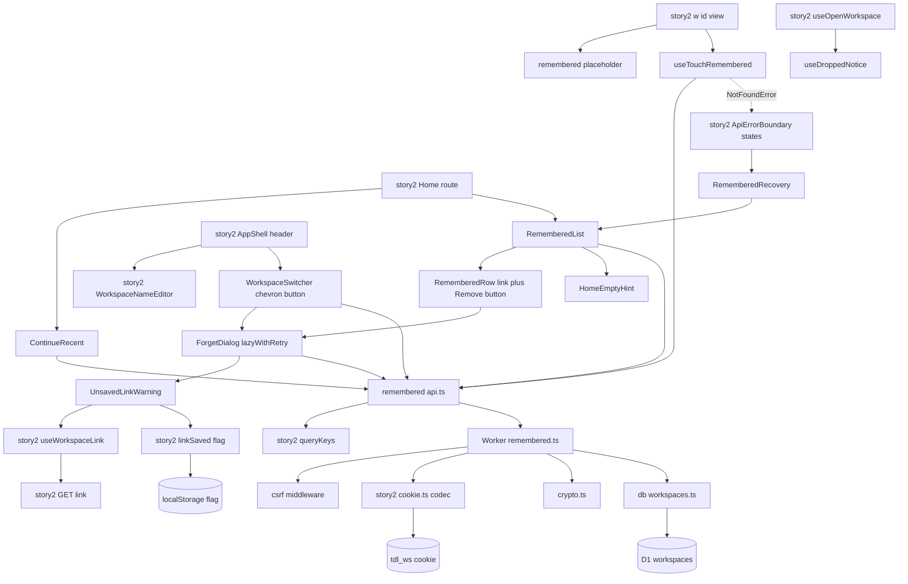

## State
Two pieces of long-lived state are involved. D1 is read-only here.

1. A remembered entry in this browser's `tdl_ws` cookie, and its derived `status`:
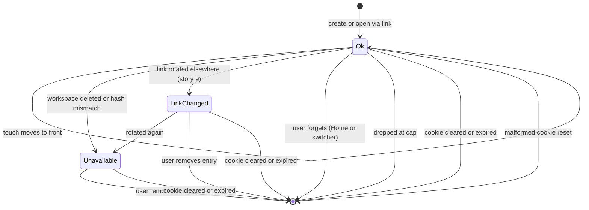
`status` is derived at read time, not stored.

2. The per-workspace link-saved flag in localStorage. Story 2 owns it; story 3 reads it and sets it from the forget dialog:
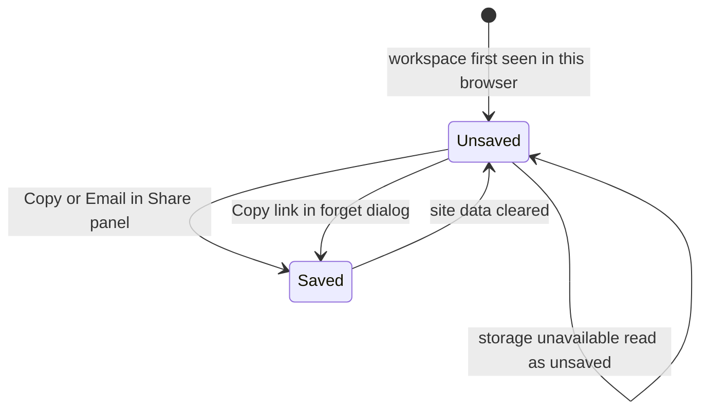

## Flows changed
1. List remembered (Home, switcher, RememberedRecovery): sequence in remembered.list_api.
2. Touch on open by id: sequence in remembered.touch.
3. Forget: sequence in remembered.forget_api; forgetting the current workspace from the switcher: sequence in switcher.menu.
4. Dropped-at-cap notice on create/open: sequence in remembered.cap_notice.
5. Forget with unsaved link, copy first: sequence in forget.unsaved_warning.
6. Open from list with instant name: sequence in workspace.instant_name.

Flows that need no diagram of their own:
- **Continue** is flow 6 started from a different button.
- **NotFound recovery** is flow 1 rendered inside story 2's error boundary; no new server call.
- **Switcher navigation** is flows 2 and 6 plus a prefetch.

## Deltas to other stories / extension points used

Per docs/architecture.md §13. Each item names the owner, the extension point, and what story 3 puts there. Owners' designs must list these points; if a name differs there, story 3 conforms to the owner.

**Story 1 (owner of `/test/*` registry, CSRF pipeline)**
- `apps/api/src/routes/test.ts`: registers `POST /test/remembered-seed {count}` (registry row "3", D-35). Returns 404 in production like every `/test/*` route.
- CSRF: relies on the existing rule that bodyless DELETE/POST need only `X-Todoodle-Client` (no Content-Type). No change to story 1 code.

**Story 2 (owner of routes, AppShell, codec, queryKeys, errors, lazyWithRetry)**
- Routes (D-12): story 3 registers **no** route. Story 2's `/w/:workspaceId` view calls story 3's `useTouchRemembered(id)` and passes `placeholderData: rememberedPlaceholder(queryClient, id)` to `workspaceQuery`.
- AppShell header (D-11, registry "3 (switcher trigger)"): story 3 supplies `<WorkspaceSwitcher currentId />` for AppShell's switcher-trigger slot (`switcherSlot`), rendered **beside** `WorkspaceNameEditor`; not gated (works offline). The name editor is unchanged and never opens the switcher.
- Cookie codec (D-45): uses `readRemembered`, `serializeRememberedCookie`, `upsertRemembered(entries, entry, now)`, `findEntry`. Adds to `apps/api/src/lib/cookie.ts`: `removeRemembered(entries, id)`, `touchRemembered(entries, id, now)`, and `clearRememberedCookieHeader(env)`, which reuses the same attribute builder as `serializeRememberedCookie`. No `decode…`/`encode…` names.
- `queryKeys` (D-37): uses `queryKeys.remembered()`, `queryKeys.rememberedTouch(id)`, `queryKeys.workspace(id)`. Adds nothing.
- `ApiErrorBoundary` (D-20): story 3 provides `RememberedRecovery` (`features/remembered/RememberedRecovery.tsx`) for the boundary's recovery slot. The NotFound state renders it; the LinkChanged (9) and TooManyAttempts (10) states may render it too.
- `useOpenWorkspace` and the create mutation: `onSuccess` invalidates `queryKeys.remembered()` and calls `notifyDropped(dropped)`.
- `lazyWithRetry` (D-42): the ForgetDialog chunk uses it; the Workspace chunk preload uses story 2's exported loader.

**Story 4 (owner of `useCanEdit`)**
- None used (D-10). The switcher, Home list and Forget are deliberately not gated; ForgetDialog does not call `useCanEdit()`.

**Extension points story 3 exposes (for story 9)**
- `RememberedStatus` enum value `link_changed` in `packages/shared/src/schemas.ts` (already declared; story 9 produces it in `listRemembered` via its classifier).
- Touch 410 `link_changed` branch in `POST /api/remembered/:id/touch` (contract declared here; story 9 implements the previous-secret check).
- `REMEMBERED_STATUS_LABEL` in `features/remembered/statusLabels.ts`: `{unavailable: 'Unavailable', link_changed: 'Link changed'}`; story 9 owns the `link_changed` copy and may change it in place. Tests assert the constant.
- `RememberedRow` renders every non-`ok` status as a label + Remove button (no link). Remove for non-`ok` forgets without a dialog. There is **no `SwitcherItem.tsx`** and no Remove inside menu items (D-28); the switcher omits non-`ok` entries.

## Test Strategy

## Test scopes
- **unit** (vitest; api helpers in pool-workers, web helpers in happy-dom): pure functions only, which is sufficient because none of them does I/O. Covers ordering/cap/remove policy, public projection, cookie attribute builder, relative time, `pickContinueTarget` and `rememberedPlaceholder`.
- **integration** (vitest-pool-workers, `SELF.fetch`): full request handling through Hono, CSRF middleware, the cookie codec and real Miniflare D1. This is the Worker boundary in the structure diagram, and where secrets could leak.
- **ui-component** (vitest + happy-dom + Testing Library, MSW for `/api`): rendering, dialogs, optimistic removal and rollback, prefetch/preload triggers, lazy loading, the unsaved-link warning, the placeholder name, touch styling, offline behaviour, focus fallback, ARIA structure and query keys. The boundary is browser rendering; the network is mocked because it is covered at integration level.
- **e2e** (Playwright vs wrangler dev; story 1's matrix: chromium and webkit desktop, plus `mobile-webkit`/`mobile-chromium` for specs tagged `@mobile`): real cookie behaviour across browser contexts, `document.cookie` invisibility, recency ordering, clipboard, offline, and real touch layout.

## Dimensions crossed
- **D1 entry surface:** GET list, POST touch, DELETE forget, open (story 2) at cap, Home UI, Switcher UI, RememberedRecovery UI, ForgetDialog UI (opened from Home Remove and from the switcher).
- **D2 cookie prior state:** absent, empty list, 1 entry, N entries (3), 49 entries, 50 entries (cap), malformed.
- **D3 entry validity → status:** valid (`ok`), hash mismatch, soft-deleted workspace, unknown id (all `unavailable`). The previous-secret class (`link_changed`, 410 touch) is produced and integration-tested by story 9; story 3 covers the client rendering of that status via MSW (TC-52, TC-60, TC-57).
- **D4 target:** id present in cookie, id absent, current workspace.
- **D5 link-saved flag:** saved, unsaved, storage throws.
- **D6 input modality:** mouse (hover), keyboard, touch (`hover: none`).
- **D7 cache state on navigation:** list cached with the entry, list not cached (cold load).
- **D8 connectivity:** `canEdit` true, `canEdit` false (offline).

**Equivalence classes:**
- D2 is exhaustive and non-overlapping. Every cookie is absent, decodes to a list of length 0, 1, 2..49 or 50, or fails to decode. The value 3 represents 2..48.
- D3 is exhaustive for an entry: it resolves to a live matching row, matches the previous secret (story 9), or fails for exactly one of the three reasons.
- D4: the current-workspace target is reached only through the switcher's Forget item (TC-58); other targets through Home.
- D5 is exhaustive: the flag reads true, reads false (or is missing), or reading throws. Throwing is treated as unsaved.
- D6: every interactive element is exercised under each modality it supports.
- D7 is exhaustive: the cache either holds the list with the entry or does not.
- D8 is exhaustive: the store snapshot is a boolean.

**Boundaries:**
- list length 0, 1, 49, 50, 51 (via upsert);
- name length 1 and WORKSPACE_NAME_MAX (120);
- relative time 59 s / 60 s;
- Continue target at index 0 vs index >0 (preceded by non-`ok` entries), and all non-`ok`;
- touch target exactly 44 px.

## Unit cases
| ID | Level | Capability | Input / prior state | Expected (before -> after) |
|---|---|---|---|---|
| TC-01 | unit | remembered.touch | empty list, `upsertRemembered([], A, now)` | [] -> [A], A.t = now, dropped 0 |
| TC-02 | unit | remembered.touch | [B, A], upsert A | [B, A] -> [A, B], A.t updated, no duplicate |
| TC-03 | unit | remembered.cap_notice | 49 entries, upsert new | length 49 -> 50, dropped 0 |
| TC-04 | unit | remembered.cap_notice | 50 entries, upsert new | length stays 50, oldest removed, dropped 1 |
| TC-05 | unit | remembered.cap_notice | 50 entries, upsert existing | length 50, order changed, dropped 0 |
| TC-06 | unit | remembered.forget_api | [A, B, C], remove B | -> [A, C], order preserved |
| TC-07 | unit | remembered.forget_api | [A], remove Z | unchanged, returns changed=false |
| TC-08 | unit | remembered.list_api | entry {id,s,t} + row ; entry with no row | projection has exactly id, name, lastOpenedAt, status; `status:'ok'` with name ; `status:'unavailable'`, name null; both parse with `RememberedItem.strict()` |
| TC-09 | unit | remembered.cookie_attributes | ENVIRONMENT local / staging / production | `serializeRememberedCookie` and `clearRememberedCookieHeader` both carry HttpOnly, SameSite=Lax, Path=/api; Max-Age=REMEMBERED_COOKIE_MAX_AGE_S on serialize; Secure only for staging and production |
| TC-10 | unit | remembered.cookie_attributes | clear builder | Max-Age=0, same Path and name |
| TC-11 | unit | home.remembered_list | relative time for 30s, 59s, 60s, 1 day, 400 days | just now, just now, 1 minute ago, yesterday, over a year ago |
| TC-12 | unit | home.continue_recent | [] ; [ok A] ; [unavailable X, link_changed L, ok A, ok B] ; [unavailable X, link_changed L] | null ; A ; A (first `ok`, not index 0) ; null |
| TC-13 | unit | workspace.instant_name | cache holds [ok A, unavailable B, link_changed C]; ask A ; ask B ; ask C ; ask Z ; cache empty | {id A, name A} ; undefined ; undefined ; undefined ; undefined; cache contents unchanged after every call |

## Integration cases (real D1, real cookie codec)
| ID | Level | Surface | Cookie prior state | Validity | Expected |
|---|---|---|---|---|---|
| TC-20 | integration | GET | absent | no entries to validate, class empty | 200 {workspaces:[]}, no Set-Cookie |
| TC-21 | integration | GET | 3 entries | valid | 200, names match rows, stored order, every `status === 'ok'`, keys exactly {id,name,lastOpenedAt,status}; no `available` key; body parses with `RememberedListResponse`; raw body contains none of the 3 secrets |
| TC-22 | integration | GET | 1 entry | hash mismatch | status 'unavailable', name null |
| TC-23 | integration | GET | 1 entry | soft-deleted workspace | status 'unavailable', name null |
| TC-24 | integration | GET | 1 entry | unknown id | status 'unavailable', name null; body identical in shape to TC-22 |
| TC-25 | integration | GET | malformed (bad base64, bad JSON, schema fail: 3 sub-cases) | not evaluated because nothing decodes | 200 [], Set-Cookie clears tdl_ws (Max-Age=0) |
| TC-26 | integration | GET | 50 entries | valid | 50 returned in order, all status 'ok' |
| TC-27 | integration | DELETE | 3 entries | valid, id present | 204; Set-Cookie lacks id; follow-up GET excludes it; D1 row before == after (name, version, deleted=0) |
| TC-28 | integration | DELETE | 3 entries | id absent | 204, no Set-Cookie |
| TC-29 | integration | DELETE | 3 entries | valid, missing X-Todoodle-Client | 403 forbidden_client, no Set-Cookie |
| TC-30 | integration | DELETE | 1 entry | valid, last one | 204, Set-Cookie holds empty list; GET returns [] |
| TC-31 | integration | POST touch | [B, A] | valid, A | 204; cookie order [A, B]; A.t > previous |
| TC-32 | integration | POST touch | [B] | id absent | 404 `{error:'not_found'}`, no Set-Cookie, entry not added |
| TC-33 | integration | POST touch | [A] | hash mismatch | 404 `{error:'not_found'}`, cookie unchanged |
| TC-34 | integration | POST touch | [A] | valid, missing X-Todoodle-Client | 403 forbidden_client |
| TC-35 | integration | open (story 2) | 50 entries | new valid workspace | 200 with dropped 1; cookie has 50, oldest gone |
| TC-36 | integration | DELETE then GET with other cookie | cookie X and cookie Y both contain A | valid | forgetting in X leaves A `ok` in Y |
| TC-37 | integration | all Set-Cookie paths | 50 entries with max-length ids | valid | serialized Set-Cookie value under 4096 bytes; HttpOnly, SameSite=Lax, Path=/api present |
| TC-38 | integration | POST /test/remembered-seed | ENVIRONMENT local ; production | n/a | 200 + Set-Cookie with `count` entries ; 404 (story 1 registry rule) |

Touch 410 `link_changed` (previous secret) is story 9's integration case; it needs migration 0005.

## UI component cases (MSW mocks /api)
| ID | Level | Component | Prior state / modality | Expected |
|---|---|---|---|---|
| TC-50 | ui-component | Home | 0 entries | no list heading, no Continue; Start a new list is primary; hint about opening a link |
| TC-51 | ui-component | Home | 3 ok entries | `<ul>` of items in response order; each has a name link and relative time |
| TC-52 | ui-component | Home | 1 unavailable, 1 link_changed entry | each item greyed, shows `REMEMBERED_STATUS_LABEL[status]` as text (plus icon, not colour alone), has a Remove button, contains no link |
| TC-53 | ui-component | Home | loading then 500 | 3 skeleton rows, then error text with Retry; Retry refetches; Start enabled throughout |
| TC-54 | ui-component | Home | 1 ok entry | click on the name link navigates to `workspacePath(id)` |
| TC-55 | ui-component | ForgetDialog from Home Remove | 2 ok entries, flag saved | exact copy text, no warning; Cancel sends no request and focus returns to that item's Remove button; Confirm sends DELETE and the item disappears before the response |
| TC-56 | ui-component | ForgetDialog | DELETE returns 500 | item restored, error toast with role=alert |
| TC-57 | ui-component | Switcher | [ok A, ok B (current), unavailable X, link_changed L, ok C]; mouse and keyboard | trigger is a separate button named "Switch workspace" beside the name editor; menu order is A, B (checked), C, separator, "Forget this workspace on this browser…", "All workspaces…" (last); X and L absent; no per-workspace Remove; pointerenter or focus on A requests `queryKeys.workspace(A)` once per open, and again after reopening |
| TC-58 | ui-component | Switcher Forget + All workspaces + name editor | current = B (flag saved) ; DELETE 500 ; Cancel | selecting "Forget this workspace on this browser…" closes the menu and opens ForgetDialog titled "Forget B on this browser?"; Forget sends DELETE for B, then navigates to `/` and focuses the list heading ; on 500 stays on B's route with role=alert toast ; Cancel sends nothing and focus returns to the chevron. Also: "All workspaces…" navigates to `/`; clicking the workspace name enters rename mode and does not open the menu; the chevron does not enter rename mode |
| TC-59 | ui-component | useDroppedNotice | open result dropped 1 / 0 | toast shown / not shown |
| TC-60 | ui-component | Home | unavailable entry ; link_changed entry | Remove sends DELETE without a dialog in both cases |
| TC-61 | ui-component | Home + ContinueRecent | [ok A, ok B] | "Continue to A" is primary; Start a new list rendered as secondary; hover/focus on Continue prefetches `queryKeys.workspace(A)` |
| TC-62 | ui-component | ContinueRecent | [unavailable X, link_changed L] ; loading ; error | renders nothing in each case; Start is primary |
| TC-63 | ui-component | Home | [ok A] cached, rendered for 1 s with fake timers | location stays "/", no navigation without a click |
| TC-64 | ui-component | ForgetDialog | flag unsaved | warning text and Copy link visible; no GET link request on open; click Copy -> exactly one GET link, clipboard.writeText called with link, markLinkSaved(id) called, warning replaced by "Link copied" (role=status); Forget disabled while request pending, enabled after |
| TC-65 | ui-component | ForgetDialog | flag saved | no warning, no Copy link button, zero GET link requests |
| TC-66 | ui-component | ForgetDialog | flag unsaved, clipboard.writeText rejects / is undefined | read-only link field shown and pre-selected, "Copy it manually"; markLinkSaved NOT called |
| TC-67 | ui-component | ForgetDialog | flag unsaved, GET link returns 500 | "Couldn't get the link" + Retry; Retry issues a second request; Forget remains enabled; markLinkSaved not called |
| TC-68 | ui-component | ForgetDialog | localStorage.getItem throws | treated as unsaved (warning shown), no crash, no console error |
| TC-69 | ui-component | RememberedRecovery inside story 2's ApiErrorBoundary NotFound state | 2 entries ; 0 entries ; loading ; error | list with heading above Start ; nothing rendered ; skeleton ; nothing rendered; story 2's not-found text always present |
| TC-70 | ui-component | Workspace `/w/:id` view | list cached with ok A; GET workspace deferred ; then resolves ; separate run resolves 404 `not_found` ; separate run touch 404 ; separate run with empty cache | header shows "A" before GET resolves (isPlaceholderData true) and body skeleton ; real data replaces it ; boundary renders NotFound (with RememberedRecovery) and no "A" in header ; same NotFound state ; header skeleton only |
| TC-71 | ui-component | RememberedRow, Switcher items and trigger, ForgetDialog buttons | matchMedia hover:none true ; false | Remove button visible without hover and has touch-target class (min 44 px), switcher items (including Forget this workspace… and All workspaces…) and chevron have it too ; Remove hidden until hover or focus-within, still reachable by Tab |
| TC-72 | ui-component | ForgetDialog loader | Home rendered, no interaction ; pointerenter a Remove button ; pointerenter twice ; switcher opened ; first dynamic import rejects then resolves | ForgetDialog module not imported ; import requested once ; still one import (memoised promise) ; no second import ; dialog still opens (loader built with story 2's `lazyWithRetry`) |
| TC-73 | ui-component | query keys | Home + Switcher mounted; invalidate `queryKeys.root(A)` ; invalidate `queryKeys.remembered()` | list uses story 2's `queryKeys.remembered()`; touch uses `queryKeys.rememberedTouch(A)`; invalidating the workspace root does not refetch the list; invalidating remembered refetches the list but does not re-fire touch |
| TC-74 | ui-component | Switcher, Home list, ForgetDialog | `useCanEdit()` stub returns false | chevron enabled and menu opens; workspace items, "Forget this workspace…" and "All workspaces…" enabled; Remove and Forget enabled; Forget with DELETE network error restores the item and shows the role=alert toast |
| TC-75 | ui-component | ForgetDialog focus fallback | Home [ok A, ok B], forget A ; Home [ok A], forget A (last) | focus moves to the "Your workspaces on this browser" heading (tabIndex -1) ; heading gone, focus moves to the Home page `h1` |
| TC-76 | ui-component | ARIA structure | Home with ok, unavailable and link_changed items; switcher menu open | axe passes including `nested-interactive`; every menu child is a standalone `menuitem`/`menuitemradio` or separator, and none contains a button or link; each Home `li` has at most one link and one button, siblings not nested |

## E2E workflows (Playwright, real stack)
| ID | Level | Workflow | Asserts |
|---|---|---|---|
| TC-80 | e2e | create workspace, go Home | it is listed first |
| TC-81 | e2e | create A, create B, Home, open A, Home | order B,A then A,B |
| TC-82 | e2e | Remove A on Home with confirm, then open A saved link | A gone from Home; link still opens A and A reappears |
| TC-83 | e2e | context 1 forgets A; context 2 opened A earlier | context 2 still lists and opens A |
| TC-84 | e2e | after creating two workspaces | document.cookie lacks tdl_ws; /api/remembered response contains no secret |
| TC-85 | e2e | fresh context Home | empty-state hint visible, no list, no Continue |
| TC-86 | e2e | in B, press the "Switch workspace" chevron -> A; then in A, chevron -> "Forget this workspace on this browser…" -> Forget | lands in A, Home order A,B; after forgetting A lands on Home with only B listed; "All workspaces…" returns to Home |
| TC-87 | e2e | seed 50 via `/test/remembered-seed`, create one more | toast says link still works; 50 listed; oldest missing |
| TC-88 | e2e | create A then B, go Home | "Continue to B" shown, URL stays / for 2 s; click -> lands in B |
| TC-89 | e2e | create A, choose Skip for now (never copy), Home, Remove A | warning visible; Copy link -> clipboard (chromium, permission granted) equals A's link; warning becomes Link copied; Forget; A gone; opening copied link reopens A |
| TC-90 | e2e | with A remembered, open /w# + random 43-char secret | Workspace not found state lists A above Start; click A -> lands in A |
| TC-91 | e2e @mobile | mobile projects (iPhone 13, Pixel 7) Home with A | Remove button visible without hover; tap -> dialog -> Forget works; bounding boxes of Remove, switcher chevron, switcher menu items and dialog buttons at least 44x44 |
| TC-92 | e2e | Home with A cached, route GET /api/w/A delayed 1 s | after click, header shows A's name within 200 ms, before the delayed response completes |
| TC-93 | e2e | A and B remembered, in B, `context.setOffline(true)` | switcher chevron enabled, menu lists A and Forget this workspace…; Home list (from cache) renders; Remove on A shows the dialog, Forget fails and A is restored with an error toast |

## Error-path coverage
| Contract error | Case |
|---|---|
| GET malformed cookie | TC-25 |
| touch not_found (absent) | TC-32, TC-70 |
| touch not_found (mismatch) | TC-33 |
| touch link_changed (410) | story 9 (declared here) |
| forbidden_client on DELETE | TC-29 |
| forbidden_client on touch | TC-34 |
| forget network failure (client) | TC-56, TC-58, TC-74, TC-93 |
| list network failure (client) | TC-53, TC-62, TC-69 |
| link fetch failure in forget dialog | TC-67 |
| clipboard rejected / unavailable | TC-66 |
| localStorage unavailable | TC-68 |
| lazy chunk load failure | TC-72 |
| workspace 404 after placeholder | TC-70 |
| workspace network error after placeholder | TC-70 (error branch asserted with MSW network error: boundary renders story 2's WorkspaceLoadFailed) |
| test route in production | TC-38 |

## Negative scenarios
- **Secrets never leave the cookie:** TC-08, TC-21, TC-84. The link is fetched only on an explicit Copy click, never on dialog open: TC-64, TC-65.
- **Forget never mutates D1 or other browsers:** TC-27, TC-36, TC-83.
- **No-ops:**
  - Forgetting an absent id is a no-op without Set-Cookie: TC-28.
  - Touching an unknown or mismatched id never adds an entry: TC-32, TC-33.
  - Unknown id and hash mismatch are indistinguishable: TC-22 vs TC-24.
  - A malformed cookie never causes a 500: TC-25.
- **Nothing happens without a user action:**
  - Cancel sends nothing: TC-55, TC-58.
  - Non-`ok` items are not links and are absent from the switcher: TC-52, TC-57.
  - Home never auto-navigates: TC-63, TC-88.
  - Continue never targets a non-`ok` workspace: TC-12, TC-62.
  - Clicking the workspace name never opens the switcher: TC-58.
  - A failed forget of the current workspace never navigates away: TC-58.
- **No nested interactives:** TC-76.
- **Not gated offline:** TC-74, TC-93.
- **Flag and placeholder are never falsely set or kept:**
  - The flag is not set when the copy was not confirmed: TC-66, TC-67.
  - A placeholder name is never shown for a 404 workspace once the response arrives: TC-70.
- **Loading and cache behaviour:**
  - ForgetDialog code is not loaded until needed: TC-72.
  - Workspace invalidation does not refetch the browser-scoped list: TC-73.

## Mock vs real
| Store / service | unit | integration | ui-component | e2e |
|---|---|---|---|---|
| D1 workspaces | not used: pure functions | real Miniflare D1, seeded via story 2 createWorkspace | mocked via MSW because boundary is rendering, not data | real local D1 |
| tdl_ws cookie | built in memory | real headers through SELF.fetch | not visible to JS by design, API mocked | real browser cookie jar |
| localStorage link-saved flag | not used by these pure functions | not used: server never sees it | real happy-dom localStorage; spied to throw for TC-68 | real browser storage |
| Clipboard | not used | not used | navigator.clipboard stubbed (resolve / reject / undefined) because happy-dom has none | real clipboard in chromium with permission; webkit asserts pre-selected fallback |
| `useCanEdit` | not used | not used | story 2 stub, overridden to false for TC-74 | real store via `context.setOffline` |
| Web Crypto | real | real | not used by UI | real |
| Query cache | real QueryClient for TC-13 | not used on server | real QueryClient per test | real |
Nothing mocks the store under test at integration level.

## Fixture realism
- Workspaces and secrets are created with story 2's real `generateSecret` and `createWorkspace`.
- Cookies are produced by the real codec (`serializeRememberedCookie`), never hand-written strings, except the deliberately malformed cases.
- Names include unicode, emoji and a 120-character name. 50-entry fixtures use real 32-byte hex ids.
- MSW handlers return bodies parsed through the shared `RememberedListResponse` schema; `link_changed` items are valid schema values even before story 9 produces them.
- Link responses use the real `/w#<43-char base64url>` shape.

## Edge cases
- **Two tabs writing the cookie concurrently:** the last Set-Cookie wins, so a forget may be undone by a concurrent touch from a tab holding an older cookie. Accepted; not tested.
- **Private windows:** the cookie ends with the session and the flag with it; no special handling.
- **Flag set in one browser, forgotten in another:** the flag is per browser, so the other browser still warns. This is intended.

## Not covered
- Browser-specific cookie eviction (Safari ITP policies) is not verified. Our cookie is first-party and server-set, which avoids the 7-day cap on cookies set by scripts, but that is not asserted.
- Cookie behaviour on real staging/production TLS: the Secure flag is only checked in unit TC-09.
- Performance beyond the 50-entry functional case.
- Screen-reader output beyond role and label assertions; there is no automated screen-reader run.
- Whether the user actually stored the copied link: the flag records the copy only.
- The `link_changed` server classification and touch 410 (story 9's tests).

## List remembered workspaces API

> Anchor: `remembered.list_api`

## Contract
`GET /api/remembered`
- Inputs: `tdl_ws` cookie (optional).
- Output 200: `{ workspaces: RememberedItem[] }` in cookie order (most recent first), validated by `RememberedListResponse` (zod `.strict()`):
```ts
// packages/shared/src/schemas.ts (owner: story 3; extended by story 9 — D-27)
export const RememberedStatus = z.enum([
  'ok',           // story 3: live row, secret verifies
  'unavailable',  // story 3: missing, deleted, or hash mismatch
  'link_changed', // story 9: entry secret equals the row's previous secret
]);
export const RememberedItem = z.object({
  id: z.string(),
  name: z.string().nullable(),   // null unless status === 'ok'
  lastOpenedAt: z.string(),      // ISO
  status: RememberedStatus,
}).strict();
export const RememberedListResponse = z.object({ workspaces: z.array(RememberedItem) }).strict();
```
  There is no `available` field.
- Errors: none surfaced for cookie problems. Malformed cookie (a `tdl_ws` value is present but `readRemembered` yields `[]`) -> 200 `{workspaces: []}` plus clearing Set-Cookie. D1 failure -> 500 `internal`.
- Side effects: only the clearing Set-Cookie on malformed input. No D1 writes.
- **Extension point (story 9):** `classifyEntry(row, entryHash)` inside `listRemembered` returns the status. Story 3's implementation returns `ok` or `unavailable`; story 9 replaces it with its `classifyPresentedHash` mapping (`current`→`ok`, `previous`→`link_changed`, `unknown`→`unavailable`). The response type does not change.

```ts
export async function listRemembered(db: D1Database, entries: RememberedEntry[]): Promise<RememberedItem[]>
```

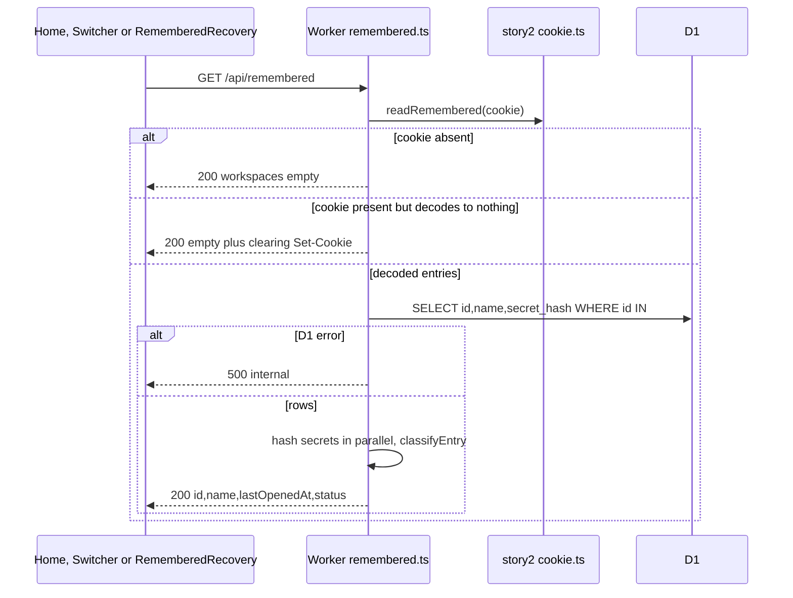

## Implementation
- `apps/api/src/routes/remembered.ts`: Hono sub-app mounted at `/api/remembered`; GET handler.
- `apps/api/src/db/workspaces.ts`: add `getWorkspacesByIds(db, ids)` (single prepared statement, `deleted = 0`).
- `apps/api/src/lib/remembered.ts`: `listRemembered` (Promise.all over `hashSecret`), `classifyEntry` (constant-time compare), `toPublic`.
- `packages/shared/src/schemas.ts`: `RememberedStatus`, `RememberedItem`, `RememberedListResponse` (strict).
- `apps/api/src/app.ts`: mount the `/api/remembered` sub-app (API routes only; no SPA routes).
- Logging never includes the cookie value.

## Tests
Unit TC-08. Integration TC-20..TC-26, TC-37. E2E TC-84 (no secret in response or document.cookie), TC-80/81 for ordering.

## Remember on open and recency touch

> Anchor: `remembered.touch`

## Contract
- **Remember on create/open:** create and open-by-link remember the workspace via story 2's `upsertRemembered(entries, entry, now)` (D-45). This capability owns the recency policy tests and the open-by-id touch.
- **`upsertRemembered(entries, {id, s}, now) -> {entries, dropped}`** (story 2 codec):
  1. removes any existing entry with the same id;
  2. prepends `{id, s, t: now}`;
  3. truncates to `MAX_REMEMBERED_WORKSPACES`.

  `dropped` is the count removed by truncation.
- **`POST /api/remembered/:id/touch`** (requires `X-Todoodle-Client: web`; bodyless). Responses (D-27):
  - **204** + Set-Cookie with the entry moved to the front and `t` = now.
  - **404** `{error:'not_found'}` if the id is not in the cookie, or its secret does not verify against a live row. The cookie is left unchanged.
  - **410** `{error:'link_changed'}` if the entry's secret is the workspace's previous secret. Declared here; implemented by story 9 via its classifier. Cookie unchanged.
  - 403 `forbidden_client` if the CSRF header is missing.
- **Web:** story 2's `/w/:workspaceId` view (D-12; story 3 registers no route) calls `useTouchRemembered(id)` once per mount. Errors are typed by story 2's `lib/errors.ts` by `body.error` (D-20) and thrown to story 2's `ApiErrorBoundary`: `NotFoundError` → NotFound state (with `RememberedRecovery`); `LinkChangedError` (registered by story 9) → LinkChanged state; anything else → `WorkspaceLoadFailed`. After create, open or touch succeeds, the web app invalidates `queryKeys.remembered()`.

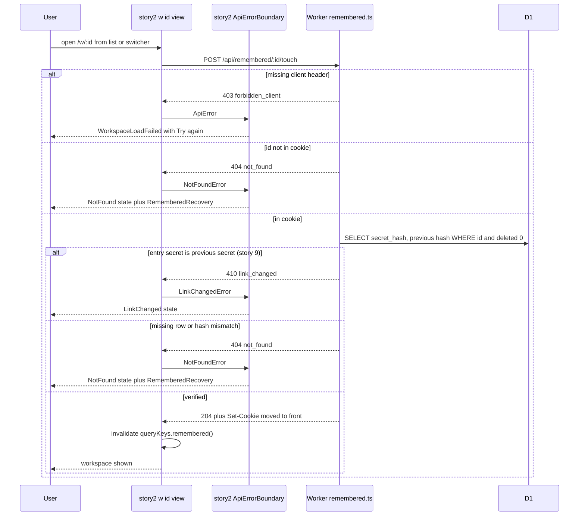

## Implementation
- `apps/api/src/lib/cookie.ts` (story 2 file; delta): add `touchRemembered(entries, id, now)`, which reuses `upsertRemembered` with the existing secret.
- `apps/api/src/routes/remembered.ts`: POST `/:id/touch`, writing the cookie with `serializeRememberedCookie`.
- `apps/web/src/features/remembered/useTouchRemembered.ts`:
  - Runs as a `useQuery` keyed `queryKeys.rememberedTouch(id)` (story 2 key, D-37), with `staleTime: Infinity`, `retry: false`, `gcTime: Infinity` and `throwOnError: true` so the boundary handles failures. There is no effect-driven fetching.
  - The key is outside the `['remembered']` prefix, so invalidating the list never re-fires touch.
  - The `queryFn` invalidates `queryKeys.remembered()` on success.
- Story 2 edits (see Deltas): the `/w/:workspaceId` view calls `useTouchRemembered(id)`; `useOpenWorkspace` and the create mutation invalidate `queryKeys.remembered()` in `onSuccess`.
- No change to `App.tsx` and no change to `queryKeys.ts`.

## Tests
Unit TC-01, TC-02. UI TC-70, TC-73. Integration TC-31..TC-34. E2E TC-80, TC-81, TC-86. (410 branch: story 9.)

## Forget on this browser API

> Anchor: `remembered.forget_api`

## Contract
`DELETE /api/remembered/:id` (requires `X-Todoodle-Client: web`; no body, so no Content-Type requirement)
- 204 always when the header is present. If the id was in the cookie, Set-Cookie (via `serializeRememberedCookie`) with it removed; otherwise no Set-Cookie (idempotent, reveals nothing).
- 403 `forbidden_client` if header missing.
- Never reads or writes D1; never affects other browsers.
- Works for every status (`ok`, `unavailable`, `link_changed`); the client decides whether to confirm first.
- Not gated by `useCanEdit()` (D-10): offline, the request fails and the optimistic removal is rolled back.

`removeRemembered(entries, id) -> {entries, changed}`.

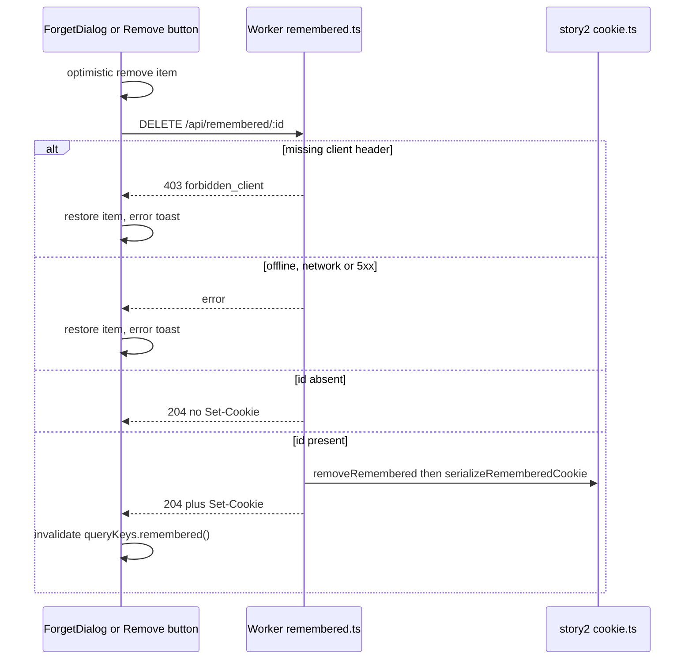

## Implementation
- `apps/api/src/lib/cookie.ts` (story 2 file; delta): add `removeRemembered`.
- `apps/api/src/routes/remembered.ts`: DELETE `/:id`.
- `apps/api/src/middleware/csrf.ts` (story 1): relies on the existing rule that bodyless DELETE needs only `X-Todoodle-Client`; no change expected, verified by TC-27/TC-29.
- `apps/web/src/features/remembered/api.ts`: `useForgetRemembered` with `onMutate` snapshot + filter of `queryKeys.remembered()`, `onError` rollback + toast, `onSettled` invalidate.

## Tests
Unit TC-06, TC-07. Integration TC-27..TC-30, TC-36. UI TC-74. E2E TC-82, TC-83, TC-93.

## Remembered cookie protection

> Anchor: `remembered.cookie_attributes`

## Contract
Every Set-Cookie for `tdl_ws` written by any story-3 route uses story 2's codec (D-45):
```ts
// story 2 (owner)
serializeRememberedCookie(entries: RememberedEntry[], env: Pick<Env,'ENVIRONMENT'>): string
// story 3 (delta to story 2's cookie.ts), sharing the same private attribute builder
export function clearRememberedCookieHeader(env: Pick<Env,'ENVIRONMENT'>): string
```
Attributes: `HttpOnly; SameSite=Lax; Path=/api; Max-Age=REMEMBERED_COOKIE_MAX_AGE_S`, plus `Secure` unless `ENVIRONMENT === 'local'`. Clear variant uses `Max-Age=0` with the same name, Path and flags. Serialized value for 50 entries stays under 4096 bytes. No error cases: pure functions.

No flow of its own; it is used inside the touch, forget and list flows above.

## Implementation
- `apps/api/src/lib/cookie.ts` (story 2 file): add `clearRememberedCookieHeader`, factoring the attribute string into one private builder used by both it and `serializeRememberedCookie`. No other attribute strings exist anywhere.
- Constants from `packages/shared/src/limits.ts` only.

## Tests
Unit TC-09, TC-10. Integration TC-37. E2E TC-84 (`document.cookie` never shows `tdl_ws`).

## Cap and dropped notice

> Anchor: `remembered.cap_notice`

## Contract
- Server: `POST /api/workspaces/open` and workspace create (story 2) return `dropped: number` computed by `upsertRemembered(entries, entry, now)` against `MAX_REMEMBERED_WORKSPACES` (50).
- Client: `notifyDropped(dropped)` (in `useDroppedNotice.ts`) shows the toast "Your least recently opened workspace was removed from this browser's list. Its link still works." only when `dropped > 0`.
- Test route (D-35): `POST /test/remembered-seed {count}` is registered in story 1's `/test/*` registry (`apps/api/src/routes/test.ts`, registry owner row "3"). It creates `count` workspaces and returns a Set-Cookie holding them (via `serializeRememberedCookie`). It returns 404 in production like every `/test/*` route.

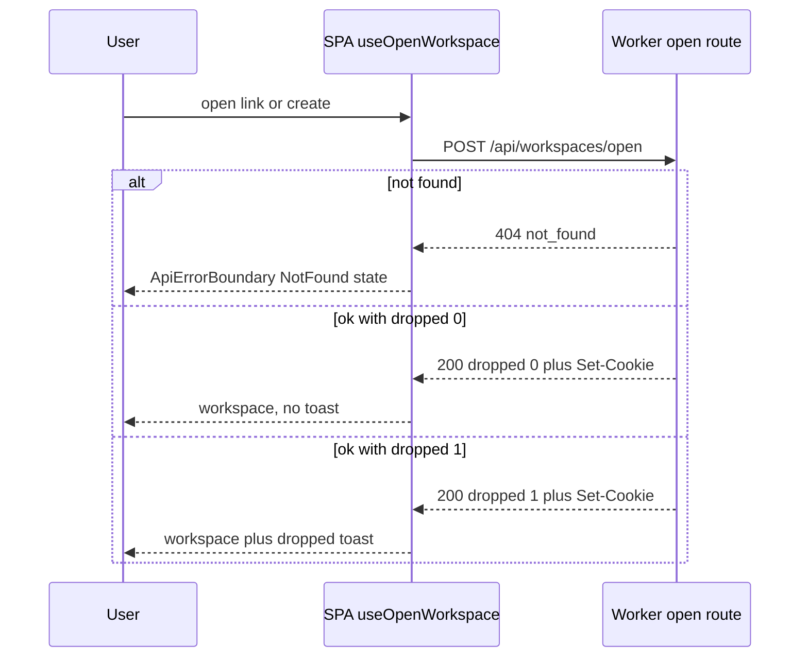

## Implementation
- `apps/api/src/lib/cookie.ts`: `upsertRemembered` cap is story 2's; this story owns its boundary tests and the notice.
- `apps/web/src/features/remembered/useDroppedNotice.ts`; `notifyDropped` is called from `useOpenWorkspace` / create mutation `onSuccess` (event handler, not effect).
- `apps/api/src/routes/test.ts` (story 1 registry): `/test/remembered-seed`.

## Tests
Unit TC-03..TC-05. Integration TC-35, TC-38. UI TC-59. E2E TC-87.

## Home remembered list and empty state

> Anchor: `home.remembered_list`

## Contract
`<RememberedList variant="home" | "recovery" />` renders on Home, under ContinueRecent and above the secondary Start a new list button. (The `recovery` variant is used by `RememberedRecovery`, see notfound.remembered.)
- **Loading:** 3 skeleton rows. Start a new list stays enabled.
- **Error:** "Couldn't load your workspaces" with a Retry button. Start stays enabled.
- **0 entries:** renders `<HomeEmptyHint />`: "Have a link? Open it to get back in." On Home only; the recovery variant renders nothing.
- **Entries (D-28): a list of links with separate Remove buttons.**
  - Heading `<h2 tabIndex={-1}>` "Your workspaces on this browser" (the Forget focus fallback target, D-19).
  - `<ul>`; each item is an `<li>` with two **sibling** controls, never nested:
    - `status === 'ok'`: a link to `workspacePath(id)` (story 2) showing the name and relative last-opened time, then a **Remove** button (accessible name "Remove <name> from this browser") that opens ForgetDialog.
    - `status !== 'ok'`: no link. The item is greyed and shows the text label `REMEMBERED_STATUS_LABEL[status]` ("Unavailable"; "Link changed" for story 9's status) with an icon, so colour never carries meaning alone; then a **Remove** button that forgets immediately with no dialog, since nothing openable is lost.
  - Rendering switches exhaustively over `RememberedStatus`, so a new status fails type-checking until handled.
- **Offline (D-10):** nothing in the list reads `useCanEdit()`; links and Remove stay enabled. The list lives on Home and is not gated (works offline).
- **Touch:**
  - Under `@media (hover: none)` the Remove button is always visible. With a mouse it appears on item hover or focus-within, and is always reachable by Tab.
  - Link and Remove hit areas are at least `MIN_TOUCH_TARGET_PX` (44) tall and wide on touch.
  - Keyboard: Tab to the item link, then to its Remove button.

## Implementation
- Query keys come from story 2's `apps/web/src/lib/queryKeys.ts` (`queryKeys.remembered()`); story 3 adds no keys (D-37).
- `apps/web/src/features/remembered/api.ts`: `rememberedQuery = queryOptions({queryKey: queryKeys.remembered(), queryFn})`, parsing with `RememberedListResponse`.
- `apps/web/src/main.tsx`: when `location.pathname === '/'`, call `queryClient.prefetchQuery(rememberedQuery)` before `createRoot().render`. The fetch then runs in parallel with the Home chunk load (async-parallel).
- Components (direct file imports, no `index.ts`):
  - `features/remembered/RememberedList.tsx`
  - `RememberedRow.tsx`: `memo`, module-level, primitive props `{id, name, lastOpenedAt, status}`
  - `statusLabels.ts`: `REMEMBERED_STATUS_LABEL: Record<Exclude<RememberedStatus,'ok'>, string>` (extension point for story 9's copy)
  - `RememberedSkeleton.tsx` and `HomeEmptyHint.tsx`: static JSX hoisted
- Remove button on `ok` items: on `onPointerEnter` or `onFocus`, call `preloadForgetDialog()` (see forget.confirm_dialog). No DropdownMenu in rows.
- Styling:
  - The `touch-target` utility (`min-h-11 min-w-11`) applies under `[@media(hover:none)]`.
  - Remove is `opacity-0 group-hover:opacity-100 group-focus-within:opacity-100 [@media(hover:none)]:opacity-100`.
- Conditionals use ternaries (rendering-conditional-render).
- `features/remembered/relativeTime.ts`: a module-level cached `Intl.RelativeTimeFormat`.
- `routes/Home.tsx` (story 2's Home route) composes ContinueRecent, RememberedList and the Start button. Start is the primary button only when ContinueRecent renders nothing.

## Tests
Unit TC-11. UI TC-50..TC-54, TC-60, TC-71, TC-73, TC-74, TC-76. E2E TC-80, TC-81, TC-85, TC-91.

## In-workspace switcher

> Anchor: `switcher.menu`

## Contract
`<WorkspaceSwitcher currentId currentName />` is rendered in story 2's `AppShell` header through its switcher-trigger slot (`switcherSlot`, D-11), **beside** story 2's `WorkspaceNameEditor` (D-28). The name stays the inline rename field; it never opens the switcher.
- **Trigger:** a separate icon button (chevron-down icon, per-icon import) with accessible name "Switch workspace", `aria-haspopup="menu"`, `aria-expanded`. It is not gated (works offline).
- **Menu (shadcn DropdownMenu, `role=menu`), in this order:**
  1. One item per remembered workspace with `status === 'ok'`, in list order, from the shared `rememberedQuery` (deduplicated). The current one is marked with a check (`menuitemradio`, `aria-checked`). Entries with any other status (`unavailable`, `link_changed`) are omitted.
  2. A separator, then **"Forget this workspace on this browser…"**: a standalone `menuitem` acting on the **currently open** workspace. Selecting it closes the menu and opens the existing ForgetDialog (forget.confirm_dialog) for `{id: currentId, name: currentName}`, including the unsaved-link warning.
  3. The final item **"All workspaces…"**, which navigates to `/` (Home).
  - Every item is a single standalone `menuitem`/`menuitemradio` with text only: nothing interactive is nested inside a menu item (D-28). There is no per-workspace Remove in the menu and no `SwitcherItem.tsx`.
- **After forgetting the current workspace:** `onForgotten` navigates to `/` only after the DELETE succeeds; the Home list heading then receives focus (D-19 fallback, since the trigger's menu item no longer exists). On failure the user stays in the workspace and the `role=alert` toast shows.
- **Prefetch:** on pointerenter or focus of a workspace item, call `queryClient.prefetchQuery(workspaceQuery(id))` (key `queryKeys.workspace(id)`) and preload the Workspace route chunk via story 2's loader (bundle-preload). This fires once per item per menu open. `onOpenChange(true)` calls `preloadForgetDialog()`.
- **Selecting** a workspace navigates to `workspacePath(id)`, which runs the touch flow and the instant-name flow.
- **Error loading the list:** the menu shows only the current workspace, "Forget this workspace on this browser…" and "All workspaces…".
- **Offline (D-10):** the switcher does not read `useCanEdit()`; trigger and all items stay enabled.
- **Touch:** trigger and menu items are at least 44 px under `hover: none`.

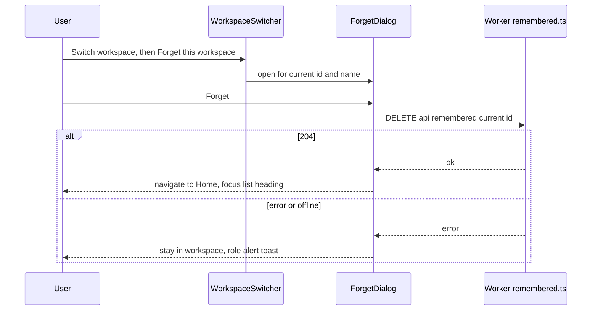

## Implementation
- `apps/web/src/features/remembered/WorkspaceSwitcher.tsx`: handlers are stable `useCallback`s with primitive deps. The ForgetDialog is rendered as a sibling of the menu (not inside `DropdownMenuContent`), opened via state set in the menu item's `onSelect`, so closing the menu does not unmount it.
- A per-open `Set<string>` in a ref records which ids have been prefetched (js-set-map-lookups, rerender-use-ref-transient-values). It is reset in `onOpenChange(false)`.
- Menu content is rendered by Radix only when open.
- Mounting: passed to story 2's `AppShell` `switcherSlot` from the `/w/:workspaceId` and `/w` views (delta to story 2). No edit to `WorkspaceNameEditor`.

## Tests
UI TC-57, TC-58, TC-71, TC-73, TC-74, TC-76. E2E TC-86, TC-91, TC-93.

## Forget confirmation dialog

> Anchor: `forget.confirm_dialog`

## Contract
`<ForgetDialog workspace={{id, name}} open onOpenChange onForgotten />` is a shadcn AlertDialog. It is opened from two places:
- the Remove button of an `ok` item on the Home list or in `RememberedRecovery`;
- the switcher's standalone "Forget this workspace on this browser…" menu item, for the currently open workspace (switcher.menu).

Content and behaviour:
- **Title:** "Forget <name> on this browser?"
- **Body:** "This only removes it from this browser. Anyone with the link can still open it."
- **Unsaved link:** when `hasSavedLink(id)` is false, `<UnsavedLinkWarning />` renders above the actions (see forget.unsaved_warning).
- **Actions:** Cancel and Forget.
  - Cancel closes and sends no request.
  - Forget runs `useForgetRemembered` optimistically, closes, and calls `onForgotten` after success. On failure the item returns and a toast shows "Couldn't forget this workspace — try again" (`role=alert`).
  - From the switcher, `onForgotten` navigates to Home.
- **Offline (D-10):** the dialog does not call `useCanEdit()`; Forget stays enabled. Offline, the DELETE fails and the failure path above applies.
- **Focus (D-19):**
  - On Cancel, focus returns to the element that opened the dialog: the Remove button, or the switcher's chevron trigger (the menu item itself is gone once the menu closes).
  - On Forget from Home, that Remove button is removed with its item, so focus goes to the nearest surviving container heading: the list heading "Your workspaces on this browser" (`h2`, `tabIndex=-1`). If the forgotten item was the last one, the heading is gone too, and focus goes to the page's `h1`.
  - On Forget from the switcher, the app navigates to Home and the same fallback applies.
  - Implemented with `onCloseAutoFocus` checking `trigger.isConnected`, plus `focusListHeadingOrPage()` after navigation.
- Buttons are at least 44 px on touch.
- **Loading:** the module is lazy via story 2's `lazyWithRetry` (D-42). `preloadForgetDialog(): Promise<unknown>` is idempotent, because it memoises its import promise.

## Implementation
- `apps/web/src/features/remembered/ForgetDialog.tsx` (default export).
- `apps/web/src/features/remembered/forgetDialogLoader.ts` defines:
  - `const load = memoise(() => import('./ForgetDialog'))`
  - `export const LazyForgetDialog = lazyWithRetry(load)` (from `apps/web/src/lib/lazyWithRetry.ts`, story 2)
  - `export function preloadForgetDialog()`, which returns the same promise every time.
- The dialog is mounted only after the first open, inside `<Suspense fallback={null}>`. Preloading on Remove pointerenter/focus and on switcher open means the chunk is normally ready before the click.
- `apps/web/src/features/remembered/focusFallback.ts`: `focusListHeadingOrPage()`.

## Tests
UI TC-55, TC-56, TC-58, TC-72, TC-74, TC-75. E2E TC-82, TC-86, TC-93.

## Unsaved-link warning in forget dialog

> Anchor: `forget.unsaved_warning`

## Contract
`<UnsavedLinkWarning workspaceId />` renders inside ForgetDialog only when `hasSavedLink(workspaceId)` is false. `hasSavedLink` is story 2's helper; it returns false whenever localStorage throws.
- **Text:** "You haven't saved this link. If you forget it here, you may lose access." with a **Copy link** button.
- **Copy link:**
  1. Calls `refetch()` on `useWorkspaceLink(workspaceId, {enabled: false})` (story 2; `GET /api/w/:id/link`, cookie-authenticated). The link is therefore fetched only on this click, never on render.
  2. On success, calls `copyText(link)` (story 2, `features/share/copyText.ts`).
  3. When the clipboard write succeeds, calls `markLinkSaved(workspaceId)` and replaces the warning with "Link copied — you can forget it safely." (`role=status`).
- **Errors:**
  - Link fetch fails (including offline): "Couldn't get the link" with Retry. The Forget button stays enabled; the user may still choose to forget.
  - Clipboard write rejected or unavailable: the link is shown in a read-only field, pre-selected, with "Copy it manually". The flag is not set, because we cannot know it was saved.
- **Side effects:** only the localStorage flag write. No cookie or D1 change. Forget itself is unchanged.
- **Order guarantee:** the link fetch always happens before the DELETE. The dialog disables Forget while the link request is in flight, so the cookie entry that authorises the request still exists.

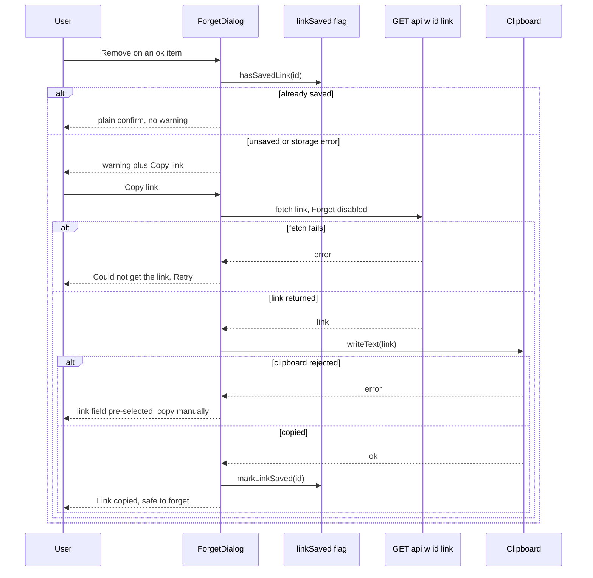

## Implementation
- `apps/web/src/features/remembered/UnsavedLinkWarning.tsx`, part of the lazy ForgetDialog chunk.
- `hasSavedLink` is read once per dialog open with lazy `useState(() => hasSavedLink(id))` (rerender-lazy-state-init). Local state flips to saved after a successful copy; derived UI, no effects.
- Imports come straight from `features/share/linkSaved.ts`, `features/share/copyText.ts` and `features/share/useWorkspaceLink.ts`, with no barrels.

## Tests
UI TC-64..TC-68. E2E TC-89.

## Continue to most recent workspace

> Anchor: `home.continue_recent`

## Contract
- **`pickContinueTarget(list: RememberedItem[]): {id, name} | null`** is pure. It returns the first entry with `status === 'ok'`, or null when the list is empty or no entry is `ok` (every entry is `unavailable` or `link_changed`).
- **`<ContinueRecent />`** on Home:
  - Renders a large primary button "Continue to <name>" linking to `workspacePath(id)` when the target is non-null.
  - Renders nothing while loading, on error, or when the target is null.
  - Never navigates on its own: there is no redirect and no effect-driven navigation.
- **Hover/focus** preloads the Workspace chunk and prefetches `workspaceQuery(id)`, the same as the switcher.
- **Button style:** when ContinueRecent renders, Home shows Start a new list as a secondary button. Otherwise Start is primary.
- Not gated offline (D-10).

No new server flow: it reads the flow-1 list. Clicking it runs flows 2 and 6.

## Implementation
- `apps/web/src/features/remembered/pickContinueTarget.ts`: pure; early exit on the first `ok` entry (js-early-exit).
- `apps/web/src/features/remembered/ContinueRecent.tsx`:
  - Uses `useQuery({...rememberedQuery, select: pickContinueTarget})`, so the component only re-renders when the target changes (rerender-derived-state).
  - The `select` function is module-level, so its reference is stable.
- `apps/web/src/routes/Home.tsx` reads the same selector to decide whether Start is primary. The query is shared, so there is no extra request.

## Tests
Unit TC-12. UI TC-61..TC-63. E2E TC-88.

## Remembered list on the not-found page

> Anchor: `notfound.remembered`

## Contract
Error pages are **states of story 2's `ApiErrorBoundary`**, not routes (D-12, D-20). The boundary's recovery slot takes the component story 3 provides:
```ts
// apps/web/src/features/remembered/RememberedRecovery.tsx (owner: story 3; D-20)
export function RememberedRecovery(): JSX.Element | null  // renders <RememberedList variant="recovery" />
```
- **Where it renders:** in the NotFound state (both from the `*` catch-all and from `NotFoundError` inside the workspace route), above story 2's "Start a new list". The LinkChanged (story 9) and TooManyAttempts (story 10) states may render it in the same slot.
- **Heading:** "Your workspaces on this browser". Items behave exactly as on Home: `ok` items are links with a Remove button; non-`ok` items show their status label and can be removed.
- **When empty or on error:** renders nothing. The page keeps story 2's text and its tip "Links are long — check it wasn't cut off when it was copied."
- **Loading:** skeleton rows.
- **No information leak:** the list comes only from this browser's cookie (`GET /api/remembered`). The page still says nothing about whether the bad link matches anything.

No new flow; it reuses flow 1.

## Implementation
- `apps/web/src/features/remembered/RememberedRecovery.tsx`: thin wrapper; story 2's boundary imports it for the slot (delta to story 2 — the boundary depends on the component, not on story 3 internals).
- No edit to story 2's `NotFound`/boundary files beyond passing `<RememberedRecovery />` into the recovery slot; story 3 registers no route.
- The remembered query is not prefetched for recovery. The state is reached after a failed open, and by then the query code is already loaded.

## Tests
UI TC-69, TC-70. E2E TC-90.

## Instant workspace name from the remembered list

> Anchor: `workspace.instant_name`

## Contract
- **`rememberedPlaceholder(queryClient, id): {id, name} | undefined`** reads `queryKeys.remembered()` from the cache without fetching. It returns the entry's `{id, name}` when present with `status === 'ok'`, otherwise `undefined`.
- **Placeholder:** story 2's `/w/:workspaceId` view calls `workspaceQuery(id, { placeholderData: rememberedPlaceholder(queryClient, id) })` (story 2's documented option).
  - While `isPlaceholderData` is true, the header renders the name and the body shows skeleton rows.
  - When the real data arrives it replaces the placeholder.
  - If the real query fails with `NotFoundError`, story 2's `ApiErrorBoundary` renders its NotFound state (with `RememberedRecovery`). The placeholder name is discarded and never persisted.
- **Cold load:** a direct URL load with no cached list has no placeholder. The header shows a skeleton until the query resolves (this is story 2's normal loading behaviour).
- **No cache writes** happen in render or effects: `placeholderData` is read-only.

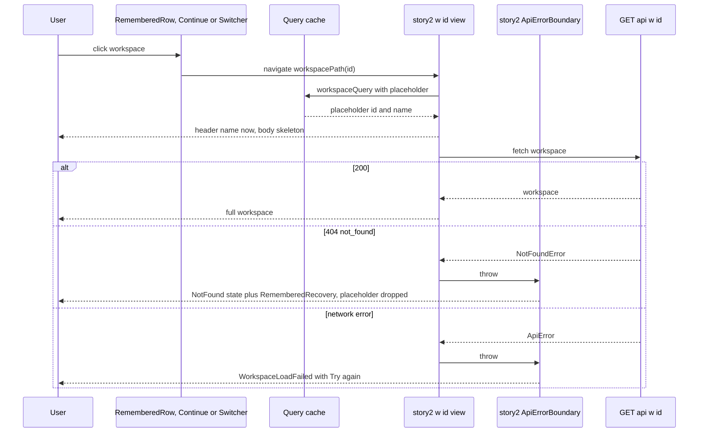

## Implementation
- `apps/web/src/features/remembered/rememberedPlaceholder.ts`: builds a `Map` by id from the cached list once per list version (js-index-maps). Memoised on the list's array identity (WeakMap).
- Story 2's `/w/:workspaceId` view passes the placeholder into `workspaceQuery` (delta to story 2; the option already exists in story 2's contract).
- Story 2's header renders the name from `data`, whether it is placeholder or real; no story-3 edit to `WorkspaceNameEditor`.

## Tests
Unit TC-13. UI TC-70. E2E TC-92.

## Switcher, Home list and Forget stay usable offline

> Anchor: `remembered.offline_usable`

## Contract
D-10 lists "navigation, the sidebar, the switcher and the Home list" as working offline. Story 3's rule:
- No story-3 component reads `useCanEdit()` (story 4's store, stubbed by story 2).
- `WorkspaceSwitcher` is rendered in AppShell's header slot and is **not gated** (works offline). AppShell disables nothing itself; only controls that send a change self-gate with `useCanEdit()` (D-10, D-11), and the switcher sends none.
- Home and `RememberedRecovery` are not gated either.
- ForgetDialog is portalled and does not gate itself (unlike editing overlays), because forgetting is a per-browser action, not a workspace edit.
- Offline behaviour of requests is the normal failure path: navigation shows cached data or story 2's load states; a Forget DELETE fails, the optimistic removal rolls back, and the `role=alert` toast shows.

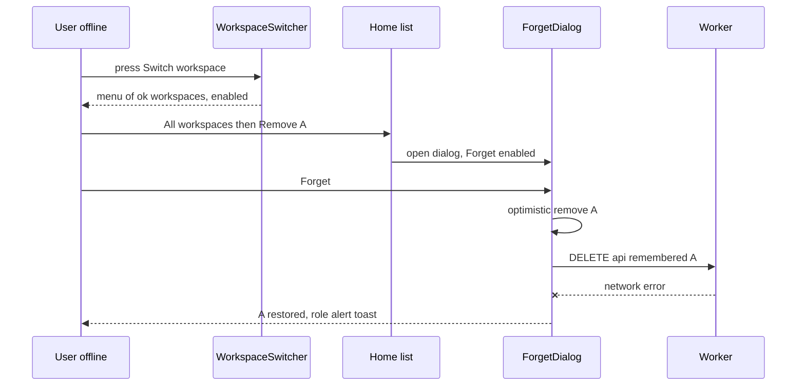

## Implementation
- No new files. Enforced by: switcher mount point (story 2 `switcherSlot`, not gated); an ESLint `no-restricted-imports` entry forbidding `features/live/canEdit` inside `apps/web/src/features/remembered/**`.

## Tests
UI TC-74. E2E TC-93.

