# Technical Design

Share panel + join-by-link on top of story 2's open flow; WorkspaceRoom Durable Object (hibernating WebSockets) fans out versioned change events; one client live connection per workspace applies events into TanStack Query caches, drives an offline gate, and powers a reusable conflict/gone notice mechanism that stories 5-8 plug into.

## Overview

## Scope
Story 4 makes a workspace collaborative. It follows `docs/architecture.md` §4 (access, including the `/w/:workspaceId` route and story 2's link endpoint), §6 (API), §7 (live updates), **§12 (binding frontend conventions)** and **§13 (ownership and extension rule)**, plus `specs/general/CROSS-STORY-RESOLUTIONS.md`.

Story 4 is the **owner** of: the live handler registry, the `LiveEvent` union, the live close codes, `broadcast`, the `canEdit` implementation and `useEditGuard`. Their final shapes and extension points are in the section "Extension points owned by story 4".

**Change log (2026-09-27, cross-story resolutions)**
- **D-10 canEdit contract.** The store is `features/live/canEdit.ts` (story 2 ships an always-`true` stub at that path; story 4 replaces the implementation, same exports). **Superseded 2026-09-27: there is no `<fieldset disabled>` anywhere in the app** (a disabled fieldset would also disable the quick-add input, the task-name button and Discard). Every control that sends a change gates itself with `useCanEdit()`; story 5's shared TaskRow cells and QuickAdd gate once for every grid, and overlays, sheets, pickers, dialogs, the sidebar and header controls self-gate. Explicit offline-works / offline-disabled lists added. The names `canEditStore` and `WorkspaceShell` are retired.
- **D-22 `/live` rejections.** Only a missing Upgrade header gets an HTTP error (426 `upgrade_required`). With Upgrade present the server always accepts, then closes with 4403 / 4404 / 4410 (story 9) / 4429 (story 10). The pre-upgrade HTTP 403/404 rejections are removed. The client state machine handles all four codes.
- **D-25 event payloads.** `tasks.bulk` entity is `{ids, deleted?}` with refetch semantics; `project.deleted` carries `batchId`.
- **D-26** `broadcast(c, wid, event)` is the single signature and calls `waitUntil` itself.
- **D-18** conflict wording is `Someone else changed this <entityLabel> just now.`, from `useEditGuard({key, fields, entityLabel, save})`.
- **D-20** `GoneError` is registered in story 2's `lib/errors.ts` map by `body.error === 'gone'`; status alone never decides (410 is also `link_changed`).
- **D-17** Share panel verification uses "Copy link", the `SHARE_ACCESS_NOTE` constant, story 2's `ShareButton.tsx` and `features/share/copyText.ts` (there is no `copy.ts`).
- **D-43** live connection path is `features/live/LiveConnection.ts`. **D-44** `COPY_CONFIRM_MS` is referenced from story 2, not defined here. **D-46** link revocation is provided by story 9.

**Change log (2026-09-25, React audit + UX review)**
- **Link and Share are one panel.** Story 2 owns `features/share/SharePanel.tsx` and the header Share button. Story 4 builds no share UI; `share.panel` verifies that story 2's panel meets `prd.share_panel`.
- **Two separate states: live paused vs offline.** Losing the live socket only shows "Reconnecting…" and editing stays on. Editing is disabled only when HTTP saves cannot reach the server.
- **Conflict notice lets the user choose** ("Use my version" / "Keep theirs").
- **Screen-reader announcements of remote changes**, throttled.
- **Live event registry** is `registerLiveHandler(type, fn)` over `Map<type, Set<fn>>`, and incoming frames are batched per animation frame.
- **Query keys** are rooted at `['ws', id, ...]`, and reconnect heals with `invalidateQueries({queryKey:['ws', id]})`.
- **Corrected join claim:** the open request precedes the workspace-data queries (the id comes from open).

## Dependencies
- **Story 1:** Worker skeleton, `finalizeResponse`, test harness, `wrangler.toml` environments, and `GET /api/health`, which is used as the offline probe.
- **Story 2:** `workspaces` table, `POST /api/workspaces/open`, `workspace-auth`, `PATCH /api/w/:id` (rename), `GET /api/w/:id/link`, `useWorkspaceLink`, `SharePanel`, `ShareButton.tsx`, `features/share/copyText.ts`, `SHARE_ACCESS_NOTE`, `COPY_CONFIRM_MS`, `queryKeys.ts`, the early open request in `main.tsx`, `features/shell/AppShell.tsx` (no fieldset; controls self-gate), `features/shell/WorkspaceNameEditor.tsx`, the `features/live/canEdit.ts` stub, and `lib/errors.ts` + `ApiErrorBoundary` (maps by `body.error`).
- **Story 3:** the remembered cookie codec and the `/w/:workspaceId` route.

## Constants
Constants live in `packages/shared/src/limits.ts`.

| Constant | Value | Purpose |
|---|---|---|
| `LIVE_RECONNECT_BASE_MS` | `1_000` | Reconnect backoff base |
| `LIVE_RECONNECT_JITTER` | `0.2` | Backoff jitter |
| `CONFLICT_RECENT_EDIT_WINDOW_MS` | `10_000` | Recent-edit window for conflicts |
| `LIVE_MAX_EVENT_BYTES` | `16_384` | Maximum event size |
| `LIVE_CLOSE_BAD_ORIGIN` | `4403` | Close code: Origin mismatch (story 4) |
| `LIVE_CLOSE_NOT_FOUND` | `4404` | Close code: not found or unauthorised (story 4) |
| `LIVE_CLOSE_LINK_CHANGED` | `4410` | Close code: link rotated. Declared here as an extension point; **emitted by story 9** |
| `LIVE_CLOSE_RATE_LIMITED` | `4429` | Close code: rate limited, close reason = whole seconds to wait. Declared here; **emitted by story 10** |
| `LIVE_ANNOUNCE_THROTTLE_MS` | `10_000` | Architecture §12 |
| `LIVE_PAUSED_AFTER_MS` | `5_000` | Delay before the Reconnecting pill shows. Replaces the retired `LIVE_OFFLINE_AFTER_MS`. |
| `COPY_CONFIRM_MS` | story 2's value | **Referenced, not defined here** (D-44). Story 2 defines it in `limits.ts`. |

WebSocket upgrades cannot carry `X-Todoodle-Client`, so `/live` uses an exact `Origin` match for CSRF protection (architecture §7).

## Structure
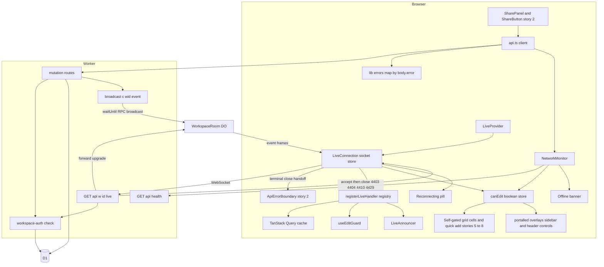

## Persistent and long-lived state
- **No new D1 tables or migrations.**
- **The Durable Object holds no data of record**, only hibernatable sockets. It is registered by the wrangler DO migration `tag = "v1"`, `new_sqlite_classes = ["WorkspaceRoom"]`.
- **Long-lived client state** is diagrammed in the capability sections:
  - socket lifecycle (now including `rate_limited`, `link_changed`, `stopped`)
  - network (offline) lifecycle
  - edit-guard lifecycle, including `Conflicted`

## Changed flows
| Flow | Capability | Diagram |
|---|---|---|
| F1 Open share panel and copy | share.panel | **Owned by story 2** (its SharePanel sequence). Story 4 only verifies it, so it has no diagram here. |
| F2 Join via shared link | share.join | Yes |
| F3 Live connect, accept-then-close rejections | live.room | Yes |
| F4 Mutation broadcast | live.broadcast | Yes |
| F5 Apply incoming events (batch, handlers, announce) | live.client_sync | Yes |
| F6 Socket drop, pause, reconnect, refetch | live.connection_status | Yes |
| F9 Close-code handling (4403/4404/4410/4429) | live.connection_status | Yes |
| F8 Offline detection and recovery | live.connection_status | Yes |
| F7 Conflict choice and gone notice | live.conflict_notice | Yes |

## Share panel requirements verified against story 2's single SharePanel

> Anchor: `share.panel`

## Contract
Owner decision (2026-09-25): **Link and Share are one panel.** Story 2 builds `features/share/SharePanel.tsx`, `features/share/ShareButton.tsx` (the single header **Share** button) and `features/share/copyText.ts`. The first-run "Save your link" dialog is the same panel, opened automatically. **Story 4 builds no share UI and adds no endpoint.** This capability pins the behaviour `prd.share_panel` needs from that shared component, and the link endpoint behind it (registry: SharePanel owner 2, story 4 = verify).

Behaviour required of story 2's panel (the story 2 design must match; any mismatch is a story 2 bug):
- Opening Share (`mode='share'`) shows the full link, a primary button labelled **Copy link** (D-17), the line `This link is the key to this workspace — for you and anyone you send it to.`, and the access note **equal to story 2's `SHARE_ACCESS_NOTE` constant**. Story 4 never pins the note's literal text, because story 9 replaces its value (§13 rule 3).
  - Story 2 value: "Anyone with it can see and change everything. Access can't be removed yet."
  - Story 9 value: "Anyone with it can see and change everything. To cut off access, get a new link."
- After Copy link, the "Copied" confirmation shows for `COPY_CONFIRM_MS` (story 2's constant; referenced, not defined here — D-44).
- The link comes from story 2's `useWorkspaceLink(workspaceId)`:
  - When the secret is in memory (opened via `/w#<secret>`), it is built synchronously and no request is made.
  - Otherwise (opened via `/w/:workspaceId`), it is fetched from `GET /api/w/:id/link`.
- **Offline (D-10):** the Share button lives in the AppShell header and SharePanel is portalled; neither is gated. Copy link, Email and Bookmark are in the offline-works list, so they must **not** be gated by `useCanEdit()`. (Story 9's "Get a new link" inside the same panel *is* gated by `useCanEdit()`.)

**Reused API (owned by story 2)** `GET /api/w/:id/link`:
- 200 `{link}`, with `Cache-Control: no-store`.
- 404 `not_found` for a missing cookie entry, a hash mismatch, or a soft-deleted workspace. The body is identical in each case.

## Implementation
- **No new files in story 4.** Story 2's `apps/web/src/features/share/SharePanel.tsx`, `ShareButton.tsx` and `copyText.ts` are consumed as-is. (Earlier references to `features/share/copy.ts` were wrong; that file does not exist.)
- The story 4 UI-component test imports `SHARE_ACCESS_NOTE` from story 2's export, so a wording change by story 2 or 9 does not break story 4's test, but a panel that stops rendering the constant does.
- Clipboard, email and bookmark behaviour is tested by story 2. Story 4 only pins the button label, the access note constant, the link source and offline availability.

## Tests
- Integration: TC-S01 to TC-S05 pin story 2's link endpoint.
- UI-component: TC-S06, TC-S07, TC-S08.
- E2E: W1 and W7.

## Join a workspace via shared link

> Anchor: `share.join`

## Contract
Joining reuses story 2's open flow unchanged; there is no invite concept.
- The browser loads `/w#<secret>`. Story 2's `main.tsx` starts `POST /api/workspaces/open {secret}` **in parallel with loading the Workspace route chunk**. There are no prompts or confirmation dialogs.
- **200** returns `{workspace:{id,name,version}}` plus `Set-Cookie tdl_ws`: the entry is added or refreshed and moved to the front, using the story 2/3 codec. Only then is the workspace id known. The workspace data queries (`prefetchWorkspaceData`, keys `['ws', id, ...]`) then run in parallel with each other, and the live connection (live.room) starts.
- **This step is sequential by necessity:** the id comes from the open response. The only parallelism is the open request against the route chunk load, and the data queries against each other and the socket.
- **404** `not_found` renders story 2's `ApiErrorBoundary` NotFound state (D-12/D-20: error pages are boundary states, not routes), and no live connection is attempted.
- **Network or 5xx** renders `WorkspaceLoadFailed` (retryable), with no live connection.
- **Repeat opens are idempotent:** opening the same link again in a browser that already remembers it leaves one entry, moved to the front.

**F2 Join via shared link**
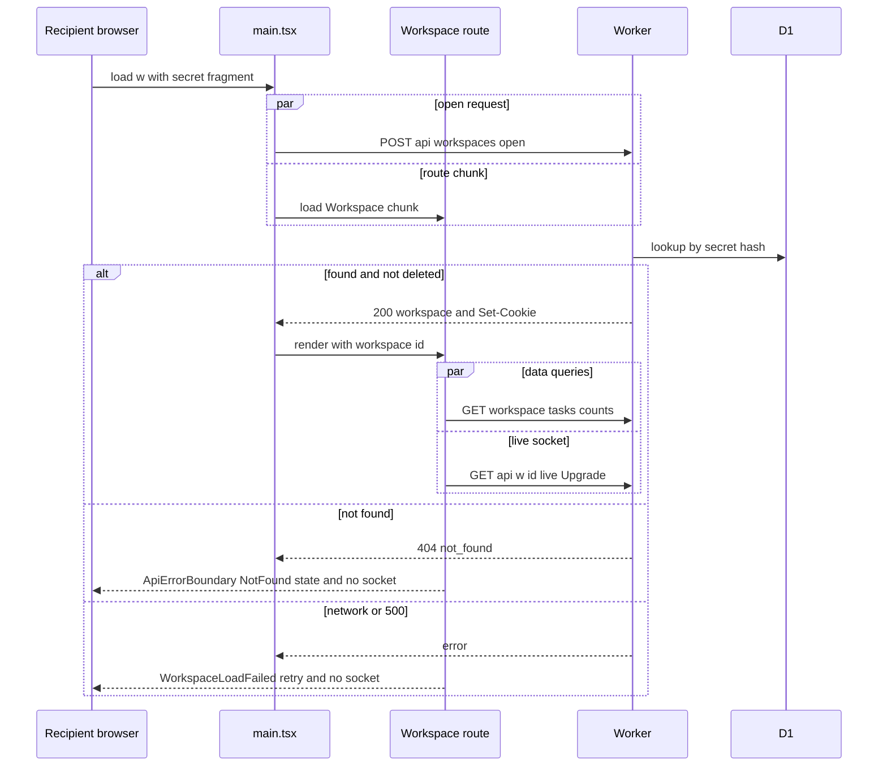

## Implementation
- **No new server code.** Integration tests pin the contract in `apps/api/test/share-join.test.ts`.
- `apps/web/src/routes/Workspace.tsx`: once story 2's open promise resolves, render `<LiveProvider workspaceId>` inside the `ApiErrorBoundary` and around story 2's `AppShell`. On an open error, the boundary renders its state and `LiveProvider` is never mounted, so there is no 4404 race.

## Tests
- Integration: TC-J01 to TC-J04.
- E2E: W1 and W2.

## Live event contract and broadcast helper

> Anchor: `live.broadcast`

## Contract
`packages/shared/src/events.ts` exports a zod discriminated union `LiveEvent` on `type`. This is the **final shape** (story 4 owns it; D-25). Extension points are listed in "Extension points owned by story 4".
```ts
type Origin = { version: number; originClientId: string | null };
type LiveEvent =
 | { type: 'workspace.updated'; entity: WorkspaceDTO } & Origin
 | { type: 'project.upserted' | 'project.restored'; entity: ProjectDTO } & Origin
 | { type: 'project.deleted'; entity: { id: string; batchId: string } } & Origin        // batchId: story 7's delete batch (D-25)
 | { type: 'task.upserted' | 'task.restored'; entity: TaskDTO } & Origin
 | { type: 'task.deleted'; entity: { id: string } } & Origin
 | { type: 'tasks.bulk'; entity: { ids: string[]; deleted?: boolean } } & Origin;    // refetch semantics (D-25)
```
- `ProjectDTO` and `TaskDTO` are placeholder schemas here, **extended by field** by stories 5 (task), 7 (project, `task.projectId`) and 8 (`task.dueDate`). The set of `type` literals is closed: a story needing a new type edits this section (§13 rule 2).
- **`tasks.bulk` has refetch semantics.** `ids` are the affected task ids; `deleted: true` means they were removed (e.g. story 7's project delete cascade), absent/false means changed (e.g. story 8's reschedule, which sends ids only). Handlers **invalidate and never patch** from a bulk event; `version` on a bulk event is the workspace-level ordering hint only and is not compared with any cached entity.
- Frames larger than `LIVE_MAX_EVENT_BYTES` are rejected by `broadcast` and logged.

`apps/api/src/live/broadcast.ts` — **the single signature** (D-26):
```ts
function broadcast(c: AppContext, workspaceId: string, event: Omit<LiveEvent,'originClientId'>): void
```
- Reads `X-Todoodle-Client-Id` (must be a UUID, otherwise `null`) as `originClientId`.
- Validates with `LiveEvent.parse`, checks size, then **calls `c.executionCtx.waitUntil(...)` itself** around `env.WORKSPACE_ROOM.get(env.WORKSPACE_ROOM.idFromName(workspaceId)).broadcast(event)`.
- Returns `void`. Never throws into the caller. A failing DO call is caught and logged with the request id; the mutation response is unaffected.
- **There is no `broadcastEvent(env, ctx, …)`, no caller-side `waitUntil` wrapper, and no direct `room.broadcast` from routes.** Stories 5, 6, 7 and 8 call `broadcast(c, wid, event)` exactly like this.

**Rule for stories 5 to 8:** every successful D1 write calls `broadcast` exactly once, after the write commits, with the post-write entity and version. Validation failures and no-op writes never broadcast.

Wired in this story: story 2's `PATCH /api/w/:id` rename broadcasts `workspace.updated`.

**F4 Mutation broadcast**
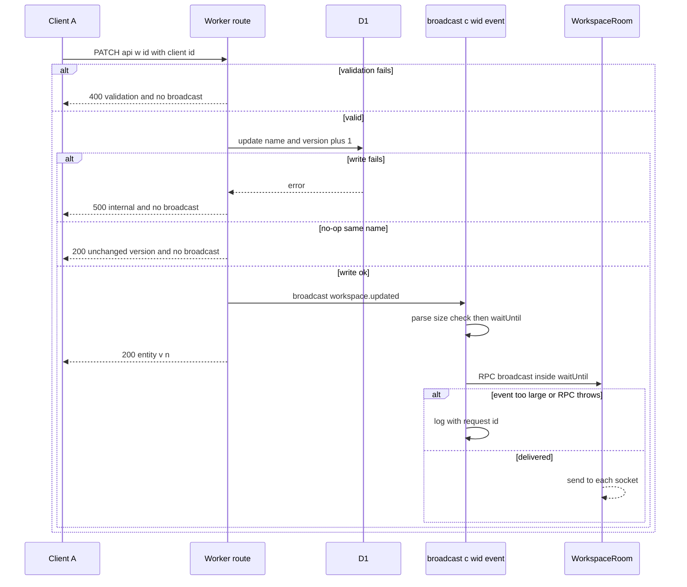

## Implementation
- `packages/shared/src/events.ts`: schemas and types. `packages/shared/src/limits.ts`: new constants from the overview.
- `apps/api/src/live/broadcast.ts`: the helper.
- `apps/api/src/routes/workspaces.ts`: add the `broadcast` call to rename.
- `apps/api/src/env.ts`: add `WORKSPACE_ROOM: DurableObjectNamespace<WorkspaceRoom>`.

## Tests
Unit: TC-E01 to TC-E09. Integration: TC-B01 to TC-B06.

## WorkspaceRoom Durable Object and authenticated live endpoint

> Anchor: `live.room`

## Contract
**Endpoint** `GET /api/w/:id/live` — accept-then-close (D-22). A browser cannot read the HTTP status of a failed WebSocket upgrade, so every rejection after the Upgrade check is delivered as a readable close code.
1. **No `Upgrade: websocket` header** → HTTP 426 `{error:'upgrade_required'}`. This is the only HTTP rejection (architecture §6).
2. **Upgrade present:** from here the server **always returns 101**. Rejections are made by `acceptAndClose(code, reason)` (`apps/api/src/live/acceptAndClose.ts`): the Worker creates a `WebSocketPair`, calls `server.accept()`, then `server.close(code, reason)`, and returns `101` with the client end. The DO is never reached on a rejection.
   - **Origin check first:** `Origin` must equal the request URL's origin; otherwise close **4403** (`LIVE_CLOSE_BAD_ORIGIN`), reason `bad_origin`. It runs before auth, so a hostile origin learns nothing about existence.
   - **[extension point, story 10]** live-connect rate limit (`live_connect` scope) → close **4429** (`LIVE_CLOSE_RATE_LIMITED`), reason = whole seconds to wait.
   - **Auth:** story 2's workspace-auth check, called in non-responding form (returns a result instead of writing HTTP 404; if story 2 only exposes middleware, this is a delta to story 2). Cookie entry missing, hash mismatch, deleted or unknown id → close **4404** (`LIVE_CLOSE_NOT_FOUND`), reason `not_found`, identical in every case.
   - **[extension point, story 9]** cookie secret equals the workspace's previous secret → close **4410** (`LIVE_CLOSE_LINK_CHANGED`), reason `link_changed`.
   - **Authorised:** the request is forwarded to `WORKSPACE_ROOM.get(idFromName(id)).fetch(request)`, which returns 101 with a live socket.
- The previous pre-upgrade HTTP 403 `forbidden_client` and HTTP 404 `not_found` rejections are **removed**.

**Durable Object `WorkspaceRoom`** (`apps/api/src/live/WorkspaceRoom.ts`, extends `DurableObject`):
- `fetch(req)`: creates a `WebSocketPair` and calls `this.ctx.acceptWebSocket(server)` (Hibernation API). Returns 101.
- Constructor: `this.ctx.setWebSocketAutoResponse(new WebSocketRequestResponsePair('ping','pong'))`, so heartbeats never wake the object.
- `broadcast(event: LiveEvent): Promise<{delivered:number, failed:number}>` (RPC): serialises once and `send`s to each `this.ctx.getWebSockets()`. A socket that throws is closed with 1011 and counted as failed.
- **[extension point, stories 9 and 10]** `closeAll(code, reason)` (RPC): closes every socket with the given close code. Story 9 uses it with 4410 after rotation; story 10's `/test/live/force-close {code}` uses it in tests.
- `webSocketMessage`: any non-ping client message is ignored, because clients never write through the socket.
- `webSocketClose` / `webSocketError`: close the socket. There is no other state to clean.
- Capacity target: at least 10 concurrent sockets per room.

**Socket lifecycle (DO side)**
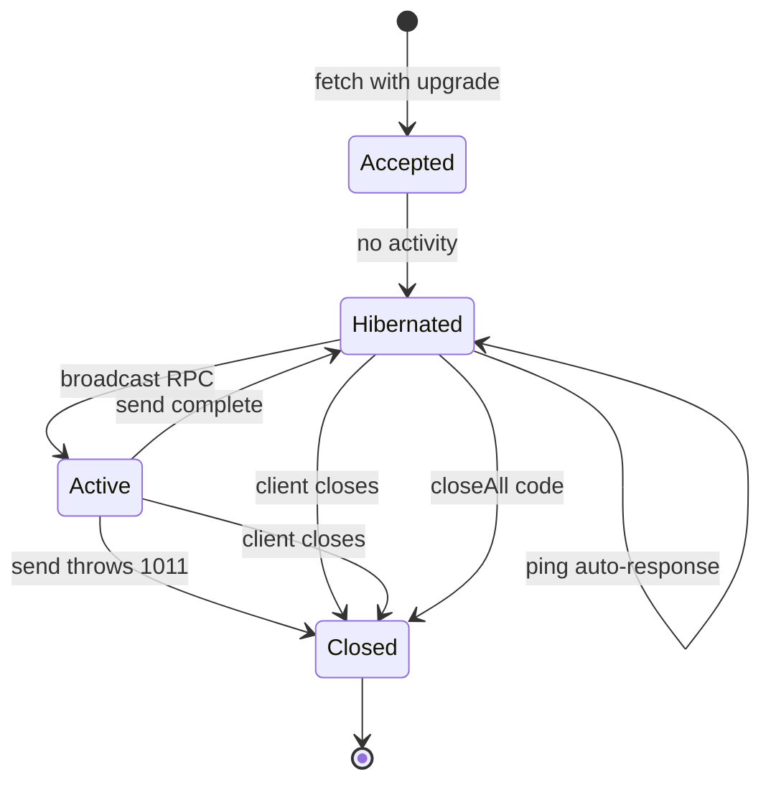

**F3 Live connect (accept-then-close)**
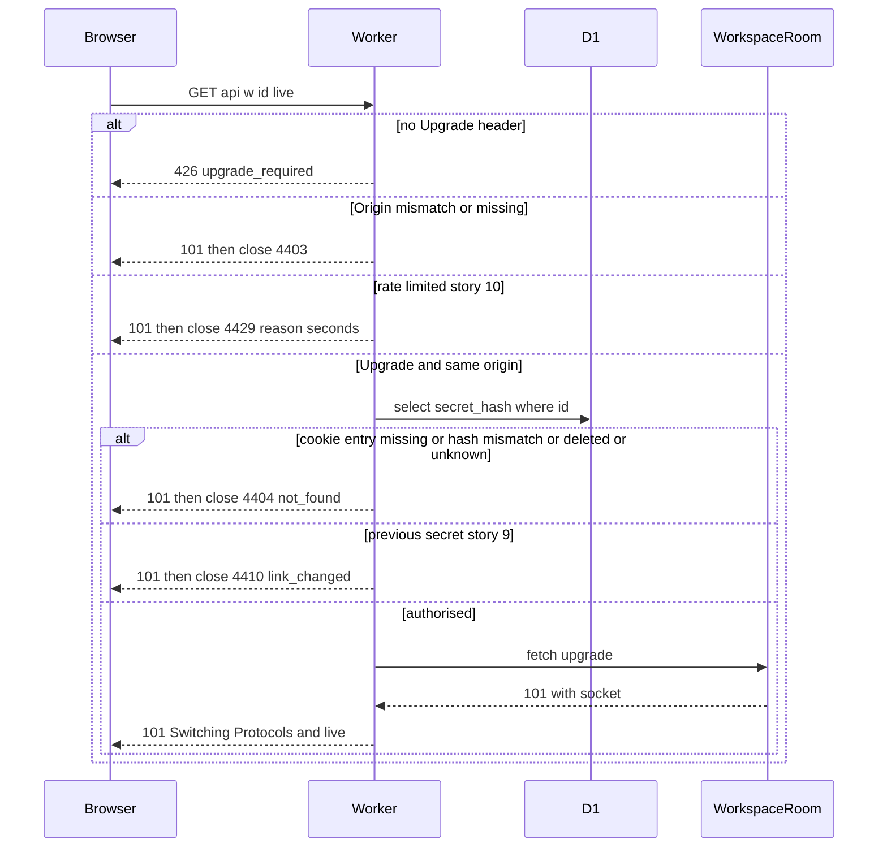

## Implementation
- `apps/api/src/live/WorkspaceRoom.ts`: the class. It is exported from `apps/api/src/index.ts` so wrangler binds it.
- `apps/api/src/live/acceptAndClose.ts`: the accept-then-close helper, exported for stories 9 and 10.
- `apps/api/src/routes/live.ts`: Upgrade check (426), then Origin (4403), then the story-10 slot, then auth (4404), then the story-9 slot, then forward.
- `apps/api/src/middleware/security-headers.ts`: `finalizeResponse` must not rebuild the body or headers of 101 responses, because that would drop `webSocket`. It passes 101 through untouched — this now covers the reject-by-close responses too.
- `wrangler.toml`: `[[durable_objects.bindings]] name = "WORKSPACE_ROOM" class_name = "WorkspaceRoom"` in base, `env.staging` and `env.production`, plus `[[migrations]] tag = "v1" new_sqlite_classes = ["WorkspaceRoom"]`.
- `scripts/deploy.ts`: no change. DO migrations deploy with the Worker.

## Tests
Unit: TC-R01, TC-R02 and TC-R07. Integration: TC-L01 to TC-L11 and TC-R03 to TC-R06.

## Client live sync into query caches

> Anchor: `live.client_sync`

## Contract
**Client identity and connection**
- **`clientId`**: `crypto.randomUUID()`, generated once per tab at module load (advanced-init-once). `api.ts` sends it as `X-Todoodle-Client-Id` on every request.
- **One connection per workspace:** `<LiveProvider workspaceId>` owns exactly one `LiveConnection` (`apps/web/src/features/live/LiveConnection.ts`, D-43) for that workspace. Remounting its children never opens a second socket.

**Registry** (`features/live/registry.ts`, the single extension point for handlers from stories 5–11; architecture §12)
```ts
function registerLiveHandler<T extends LiveEvent['type']>(type: T, fn: (ctx: HandlerCtx, e: Extract<LiveEvent,{type:T}>) => 'applied' | 'stale'): () => void
```
- It is backed by `Map<type, Set<fn>>`, so several handlers per type all run. Registering the same function twice has no extra effect.
- It returns an unregister function that removes only that handler.
- Stories 5–11 register their handlers; nobody edits the dispatcher.
- `HandlerCtx = { queryClient, workspaceId }`.

**Dispatch** `dispatchEvent(ctx, event)`, per event:
1. Frames that fail `LiveEvent.safeParse` are ignored and trigger a `console.warn`.
2. If `event.originClientId === clientId`, the event is ignored as our own echo (the optimistic update already applied it).
3. If the type has no handlers, `invalidateQueries({queryKey:['ws', workspaceId]})` runs.
4. Otherwise every handler runs. Entity handlers drop the event if the cached entity version is at least `event.version`, and return `'applied'` or `'stale'`. `tasks.bulk` handlers always invalidate and return `'applied'` (refetch semantics, D-25).
5. If any handler applied it, `editGuard.notify(event)` (live.conflict_notice) and `announcer.record(event)` run.

**Batching**
- `LiveConnection` queues incoming frames and flushes the queue once per animation frame. The flush runs every dispatch inside `notifyManager.batch(...)`, and `queryClient.ts` sets `notifyManager.setScheduler(requestAnimationFrame-or-timeout)`. A burst of N events notifies each observer once.
- **Background tabs:** while `document.visibilityState === 'hidden'` the scheduler falls back to `setTimeout(0)`, so caches, counts and the title stay current without a focused tab.
- **Large views:** keeping large views responsive during bursts is the view's job, via `useDeferredValue` (stories 5, 7 and 8).

**Handlers registered in this story**
- `workspace.updated` → `setQueryData(['ws', id, 'workspace'])` if the event is newer.
- `tasks.bulk` → `invalidateQueries(['ws', id, 'tasks'])` and `invalidateQueries(['ws', id, 'counts'])`. **Never `setQueryData`**, whatever `deleted` says. Stories 8 and 11 add their own invalidating handlers (`today`, search) via the registry.

**Announcer** (`features/live/announcer.ts`, pure, with an injectable clock; `prd.announce_remote`)
- `record(event)` counts other-origin events that were applied.
- **Leading edge:** if the last announcement was at least `LIVE_ANNOUNCE_THROTTLE_MS` ago, it announces immediately.
- **Otherwise** it schedules one flush at `lastAnnouncedAt + LIVE_ANNOUNCE_THROTTLE_MS`.
- The message is `1 change made by someone else` or `N changes made by someone else`, and the count resets after each announcement.
- `<LiveAnnouncer>` renders a visually hidden `role="status" aria-live="polite"` region, subscribed through `useSyncExternalStore`.

**Latency target:** changes appear in other clients within `LIVE_UPDATE_TARGET_MS`.

**F5 Apply incoming events**
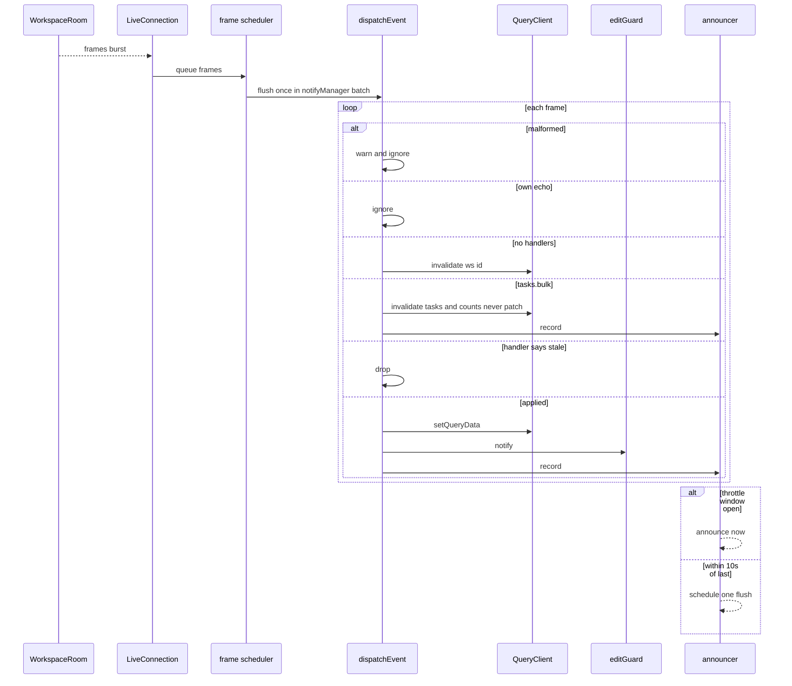

## Implementation
- `apps/web/src/features/live/clientId.ts`
- `apps/web/src/features/live/LiveConnection.ts`: a plain TS class outside React. It owns the socket, the frame queue and the visibility-aware scheduler, and exposes `subscribe`/`getSnapshot` for socket status. (Story 9 conforms to this path; there is no other live-connection module.)
- `apps/web/src/features/live/registry.ts` (`registerLiveHandler`) and `dispatch.ts` (`dispatchEvent`). There is no `registerEventApplier` or `applyEvent.ts`.
- `apps/web/src/features/live/announcer.ts` and `LiveAnnouncer.tsx`. The latter is mounted once in story 2's `features/shell/AppShell.tsx` header area, with a static hoisted wrapper.
- `apps/web/src/features/live/LiveProvider.tsx`:
  - creates the connection with a lazy `useState` initialiser;
  - connects in an effect keyed on the primitive `workspaceId`;
  - registers this story's handlers once per workspace.
- `apps/web/src/lib/queryClient.ts`: `notifyManager.setScheduler` as above.
- `apps/web/src/lib/queryKeys.ts` (story 2): story 4 uses only `root(id)`, `workspace(id)` and the `tasks`/`counts` prefixes.
- `apps/web/src/lib/api.ts`: adds the client-id header.

## Tests
- Unit: TC-C01 to TC-C08, TC-C11 to TC-C16 and TC-C18.
- UI-component: TC-C09, TC-C10 and TC-C17.
- E2E: W2 and W3.

## Live paused vs offline, reconnect, and edit gating

> Anchor: `live.connection_status`

## Contract
There are two independent sources of state, following architecture §12.

**1. Socket status** (`LiveConnection`): `'connecting' | 'open' | 'reconnecting' | 'rate_limited' | 'stopped' | 'not_found' | 'link_changed'`
- **Backoff:** attempt n (counting from 0) waits `min(LIVE_RECONNECT_BASE_MS * 2^n, LIVE_RECONNECT_MAX_MS)` ±`LIVE_RECONNECT_JITTER`. The attempt count resets on `open`.
- **Heartbeat:** a `ping` goes out every `LIVE_PING_INTERVAL_MS`. If no `pong` arrives within one interval, the socket is closed and the state moves to `reconnecting`.
- **`pausedLong`:** true when the state has been anything other than `open` (and not terminal-handoff) continuously for at least `LIVE_PAUSED_AFTER_MS`.
- **Heal:** a transition to `open` from `reconnecting` or `rate_limited` calls `invalidateQueries({queryKey:['ws', id]})` exactly once.
- **Close codes (D-22)** — the browser only sees close codes, never the HTTP status of a failed upgrade, so the machine decides on `CloseEvent.code` alone:

| Code | Constant | Next state | Retry | Hand-off |
|---|---|---|---|---|
| 4404 | `LIVE_CLOSE_NOT_FOUND` | `not_found` (terminal) | never | `ApiErrorBoundary` gets the error story 2's `lib/errors.ts` maps from `{error:'not_found'}` → NotFound state |
| 4410 | `LIVE_CLOSE_LINK_CHANGED` | `link_changed` (terminal) | never | `ApiErrorBoundary` gets the error mapped from `{error:'link_changed'}` → LinkChanged state once story 9 registers `LinkChangedError`; before that it falls through to `WorkspaceLoadFailed` |
| 4429 | `LIVE_CLOSE_RATE_LIMITED` | `rate_limited` | once, after exactly `reason` seconds (a positive integer); if the reason is missing or invalid, the normal backoff schedule | none: live paused, editing stays on |
| 4403 | `LIVE_CLOSE_BAD_ORIGIN` | `stopped` (terminal) | never | none: logged with `console.error`; editing stays on; pill shows (live updates will not arrive) |
| any other code, error, or failed upgrade | — | `reconnecting` | backoff | none |

The close-code table lives in `features/live/closeCodes.ts` as `LIVE_CLOSE_HANDLING` (code → `{state, retry, errorCode?}`), keyed by the shared constants, so stories 9 and 10 add no client logic. Hand-off uses story 2's body-keyed error mapper (D-20), so there is one mapping rule for HTTP and live.

**2. Network status** (`NetworkMonitor`, `features/live/network.ts`): `'online' | 'offline'`
- **Initial state:** `navigator.onLine`. If that is false, it starts `offline` and probes.
- **→ offline:** a window `offline` event, or `api.ts` reporting a network-level failure (a fetch rejection or `TypeError`) on any request. HTTP error statuses (4xx or 5xx) do **not** mean offline.
- **Probing while offline:** `GET /api/health` with `cache: 'no-store'`. It runs immediately on the window `online` event, and otherwise on the backoff schedule above. A failed probe stays offline.
- **→ online:** a successful probe, which also calls `invalidateQueries(['ws', id])` exactly once.

**Derived UI** (`deriveLiveUi(socket, pausedLong, network)`, pure)
- `banner = network === 'offline'`
- `pill = !banner && pausedLong` (covers `connecting`, `reconnecting`, `rate_limited` and `stopped`)
- `canEdit = network === 'online' && socket ∉ {'not_found', 'link_changed'}`
- **Losing only the socket — including a 4429 wait or a 4403 stop — never disables editing** (`prd.live_paused`).

**canEdit store** (`features/live/canEdit.ts`, D-10)
- Story 2 ships this file as a stub whose snapshot is always `true`; story 4 **replaces the implementation behind the same exports** (`useCanEdit()`, `subscribe`, `getSnapshot`). The name `canEditStore` is retired.
- `subscribe`/`getSnapshot` return the **boolean** `canEdit`, so `useCanEdit()` subscribers re-render only when it flips.
- **There is no `<fieldset disabled>` anywhere in the app** (decision 2026-09-27, supersedes the D-10/D-11 fieldset text and §12's "fieldset, not a hook per control" rule). A disabled fieldset also disables text inputs (breaking the offline-typeable quick add) and every button inside it (breaking the task-name button that opens the detail sheet read-only offline, and Discard on failed rows).
- **Every control that sends a change gates itself** with `useCanEdit()` (render) or `getCanEdit()` (key handlers). To keep this cheap and consistent, the shared row/cell components gate once:
  - **Story 5 TaskRow cells:** checkbox cell (6) disabled offline; name button **always enabled** (opens detail, read-only offline); cell-3 `…` menu trigger enabled, its mutating items (6/7/8) disabled offline; Retry disabled offline; **Discard enabled offline** (local only).
  - **Grid keys:** mutating keys (Space, Delete, E-commit, M, D) no-op offline via `getCanEdit()`; navigation keys always work.
  - **QuickAdd** (story 5, AppShell `quickAddSlot`): input typeable, submit and Enter-to-submit gated.
  - **Overlays, sheets, pickers, dialogs, sidebar and header controls self-gate:** the detail sheet's edit controls (6), pickers (7, 8), dialogs (6, 7), sidebar project controls (7), the Finder action bar (11), "Get a new link" (9), Undo buttons in toasts (6), the conflict notice's **Use my version** (this story), and the header workspace name editor (`features/shell/WorkspaceNameEditor.tsx`, 2).
- `useCanEdit()` is a `useSyncExternalStore` over a boolean snapshot, so each gated control re-renders only when the boolean flips; the cost is one subscription per gated control.
- **Still works offline (never gated):** navigation, the sidebar, the switcher and the Home list; Share panel Copy link, Email and Bookmark; Finder list matches; the "Show completed" toggle (view header); opening the detail sheet read-only; Discard on failed/rejected local rows; the `?` panel; Keep theirs (local only).
- **Disabled offline:** every change — create, edit, complete/reopen, delete/restore, move, reschedule, Undo, rename, rotation — and the quick-add submit (its input stays typeable and its text is kept).
- **Row shortcuts** (story 5's `shortcuts.ts`) check `canEdit` before any mutating key.
- **Typed text is kept:** disabling does not unmount inputs.
- **Guard for missed controls:** while `!canEdit`, `api.ts` mutating calls reject with `OfflineError` and send nothing.
- **Mid-flight failures:** a mutation already in flight that fails at network level rejects with `NetworkError`, flips the network to offline, and the caller rolls back.

**Indicators**
- `<ReconnectingPill>`: a small `role="status"` pill reading "Reconnecting…", shown when `pill` is true.
- `<OfflineBanner>`: a top bar with `role="status" aria-live="polite"` reading "You're offline — changes can't be saved right now", shown when `banner` is true.
- Both render in the AppShell header with a ternary. The socket and timers are not tied to focus or visibility.

**Socket lifecycle**
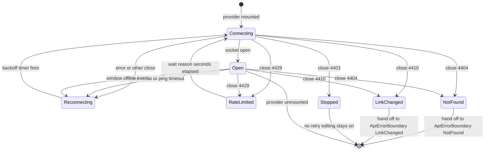
`pausedLong` is a timer overlay on `Connecting`, `Reconnecting`, `RateLimited` and `Stopped`, not a separate state. It is set after `LIVE_PAUSED_AFTER_MS` and cleared on `Open`.

**Network lifecycle**
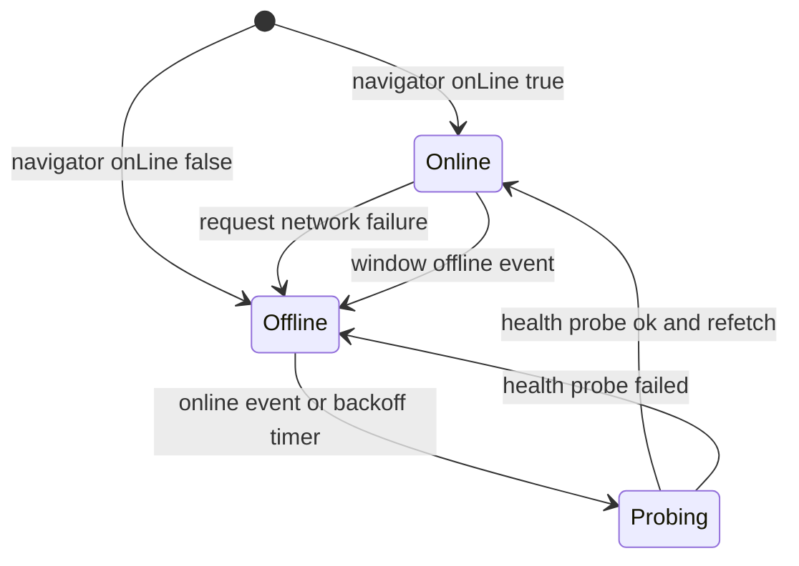

**F6 Socket drop, pause, reconnect**
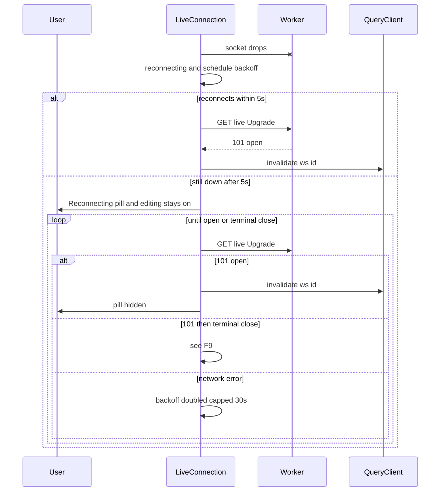

**F9 Close-code handling**
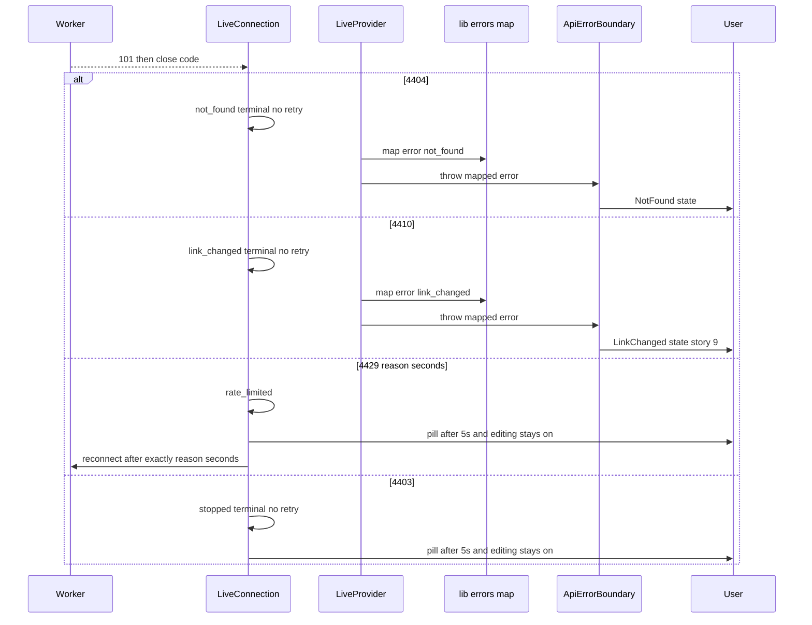

**F8 Offline detection and recovery**
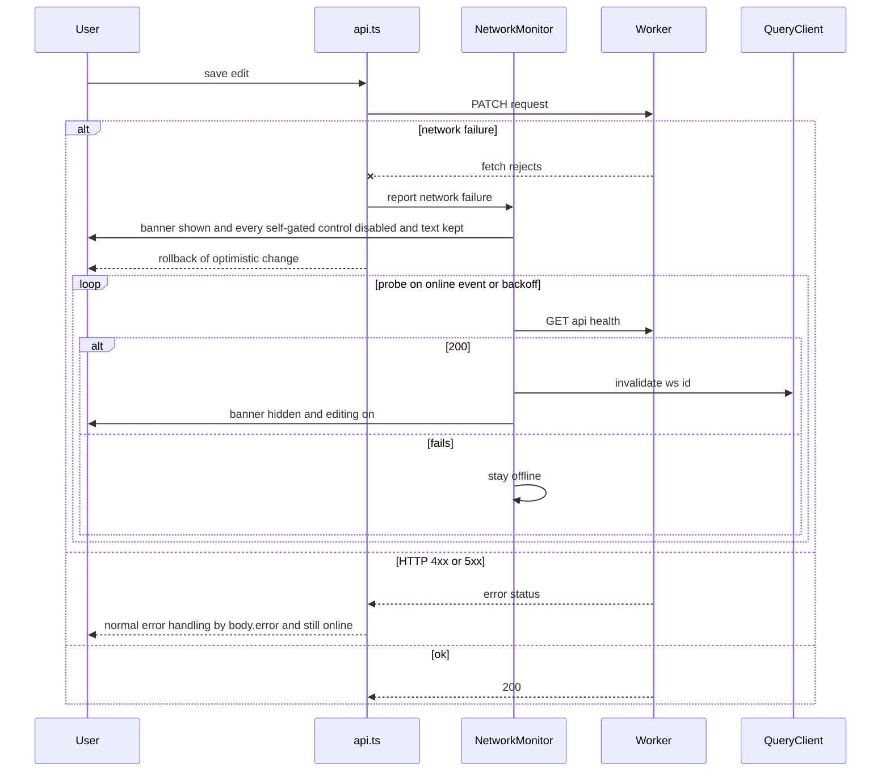

## Implementation
- `apps/web/src/features/live/LiveConnection.ts`: the socket state machine, heartbeat, close-code handling and `pausedLong` timer. `backoff.ts` is pure.
- `apps/web/src/features/live/closeCodes.ts`: `LIVE_CLOSE_HANDLING` table (pure).
- `apps/web/src/features/live/LiveProvider.tsx`: on a terminal hand-off state, throws the error produced by story 2's `lib/errors.ts` mapper during render, so the enclosing `ApiErrorBoundary` renders the state.
- `apps/web/src/features/live/network.ts`: `NetworkMonitor`, with window listeners registered once per app and probing through `api.health()`.
- `apps/web/src/features/live/deriveLiveUi.ts`: pure.
- `apps/web/src/features/live/canEdit.ts`: replaces story 2's stub implementation (same exports).
- `apps/web/src/features/live/ReconnectingPill.tsx` and `OfflineBanner.tsx`, rendered in story 2's AppShell header slot.
- `apps/web/src/features/shell/WorkspaceNameEditor.tsx` (story 2): reads `useCanEdit()` (every control that sends a change self-gates).
- `apps/web/src/lib/api.ts`: classifies `TypeError` as `NetworkError` and notifies `NetworkMonitor`, and adds the `OfflineError` guard.
- `apps/web/src/lib/errors.ts` (story 2): story 4 adds `OfflineError` and `NetworkError` (client-side, not body-keyed).

## Tests
- Unit: TC-O01, TC-O02, TC-O05 to TC-O08, TC-O13 to TC-O17, TC-O20 to TC-O23, and TC-M01 to TC-M14.
- UI-component: TC-O09 to TC-O12, TC-O18, TC-O19, TC-O24 to TC-O26.
- E2E: W4, W8 and W9.

## Conflict choice and deleted-while-editing notices

> Anchor: `live.conflict_notice`

## Contract
The server policy is last write wins (architecture §7). This capability is the reusable client mechanism that story 6 uses for tasks and story 7 for projects. The hook is `useEditGuard`, and this signature is final (D-18):

```ts
function useEditGuard<F extends Record<string,string|null>>(opts: {
  key: string                 // 'workspace:<id>' | 'task:<id>' | 'project:<id>'
  fields: F                   // current draft (Editing) or last saved values
  entityLabel: EntityLabel    // 'workspace' | 'task' | 'project' — the noun in every message
  save: (patch: Partial<F>) => Promise<void>   // consumer's normal save
}): {
  arm(): void; disarm(): void; markSaved(saved: F): void
  conflict: null | { mine: Partial<F>; theirs: Partial<F> }   // only changed fields
  useMine(): Promise<void>; keepTheirs(): void
}
```
**Copy** (`features/live/conflictCopy.ts`, the shared constants tests assert against — §13 rule 3):
- `conflictMessage(label) = \`Someone else changed this ${label} just now.\`` → e.g. "Someone else changed this task just now."
- `goneMessage(label) = \`This ${label} was deleted\``
- Button labels `USE_MINE_LABEL = 'Use my version'`, `KEEP_THEIRS_LABEL = 'Keep theirs'`.

**Guard states** are Idle, Editing, RecentlySaved and Conflicted. The guard reacts only to events for its `key` whose `originClientId !== clientId`.
- **Idle** ignores every event.
- **Editing** (edit UI open), or **RecentlySaved** (within `CONFLICT_RECENT_EDIT_WINDOW_MS` of our own successful save), then:
  - **an upsert with changed watched fields** moves to **Conflicted**. `mine` holds the draft or saved values of the changed fields, and `theirs` holds the event's values.
  - **an upsert with no field change** stays in the current state.
  - **a deletion** fires the gone path: close the editor, toast `goneMessage(label)`, and go to Idle.
  - **`tasks.bulk` with `deleted: true` whose `ids` contain the key's id** fires the gone path. A `tasks.bulk` without `deleted` never creates a conflict; it only triggers the refetch (D-25).
- **Conflicted:**
  - **a newer upsert** updates `theirs` and leaves `mine` unchanged.
  - **a deletion** (single or bulk) fires the gone path, discards `mine`, and goes to Idle.
  - **`useMine()`** calls `save(mine)`:
    - **success** moves to RecentlySaved;
    - **`GoneError`** fires the gone path;
    - **network or other error** stays Conflicted, keeping `mine`, and the consumer shows the error.
  - **`keepTheirs()`**, or closing the editor, moves to Idle.

**Presentation**, via `apps/web/src/features/live/ConflictNotice.tsx`:
- **Editor open:** an inline notice with `role="alert"` reading `conflictMessage(entityLabel)`. It shows the other person's value, with buttons **Use my version** and **Keep theirs**. The field displays `theirs`, and `mine` is never discarded until the user chooses. The notice persists until a choice is made or the editor closes.
- **Editor closed (RecentlySaved):** a persistent sonner toast (`duration: Infinity`, `id = key`, so a later conflict on the same key replaces it) with the same text and both actions.
- **Offline (D-10):** like every control that sends a change, **Use my version** reads `useCanEdit()` and is disabled while `!canEdit`; **Keep theirs** stays enabled (local only). `mine` is kept while offline.

**Errors (D-20)**
- Story 4 **registers** `gone → GoneError{entity}` in story 2's `lib/errors.ts` map. The map is keyed by `body.error`, **never by status**: a 410 whose body is `{error:'link_changed'}` is story 9's `LinkChangedError`, not `GoneError`, and a `{error:'gone'}` body is `GoneError` whatever the status.
- `handleMutationError(err, {key, entityLabel})` rolls back the optimistic update, removes the entity from `['ws', id, ...]` caches, and toasts `goneMessage(entityLabel)`. The edit is never applied.

**Edit guard lifecycle**
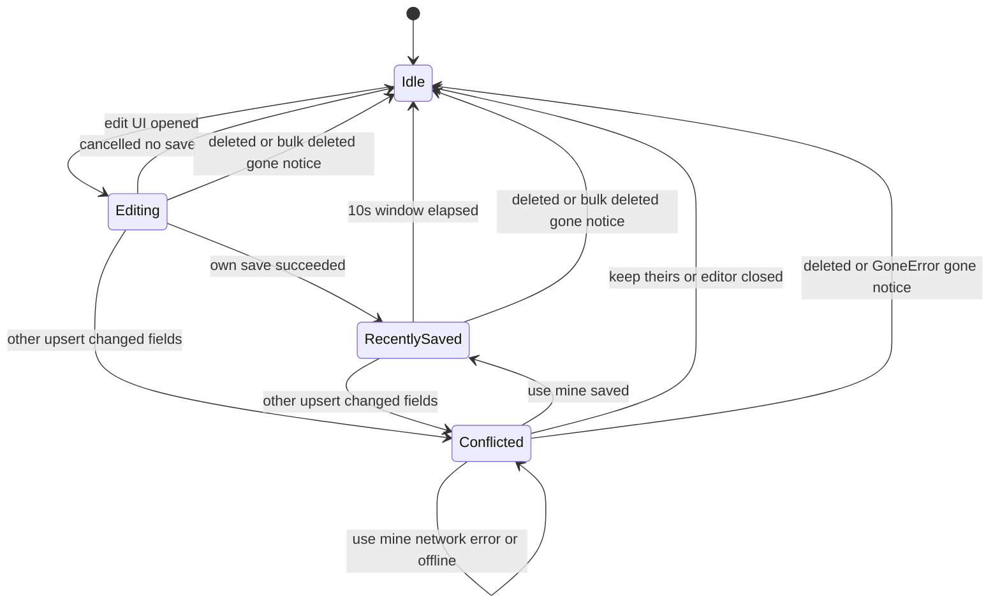

**F7 Conflict choice and gone**
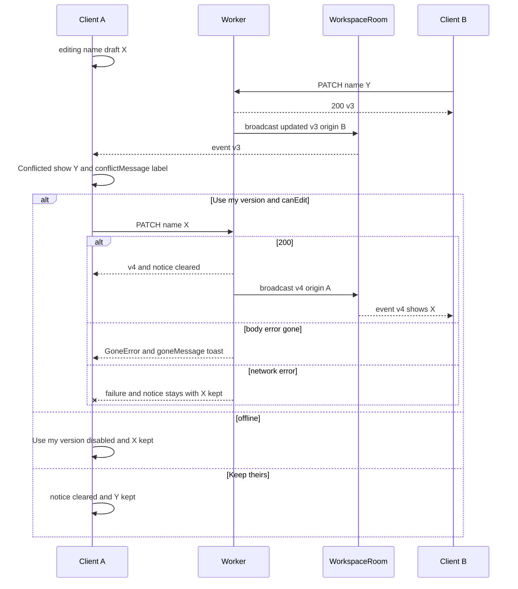
In this story the guard is wired to the workspace rename only, where the gone path is unreachable because workspaces cannot be deleted in the MVP. The gone paths are exercised with a synthetic `task` key in unit and component tests, and end to end by story 6.

## Implementation
- `apps/web/src/features/live/editGuard.ts`: a pure state machine per key, plus a `Map<key, guard>` registry. `notify(event)` is called from `dispatchEvent`.
- `apps/web/src/features/live/useEditGuard.ts`: holds `save` and the current `fields` in refs, and exposes `conflict` through `useSyncExternalStore` per key.
- `apps/web/src/features/live/conflictCopy.ts`: the copy constants above.
- `apps/web/src/features/live/ConflictNotice.tsx`: inline notice. `showConflictToast.ts` for the editor-closed case.
- `apps/web/src/lib/errors.ts` (story 2): story 4 adds the `gone` entry, `GoneError{entity}` and `handleMutationError`.
- `apps/web/src/features/shell/WorkspaceNameEditor.tsx` (story 2): adopts `useEditGuard({key:'workspace:'+id, fields:{name}, entityLabel:'workspace', save})`.

## Tests
- Unit: TC-G01 to TC-G21, TC-G28, TC-G29, TC-G31.
- UI-component: TC-G22 to TC-G27, TC-G30.
- E2E: W5.

## Extension points owned by story 4

Per architecture §13 and the registry in `CROSS-STORY-RESOLUTIONS.md`, story 4 owns the artefacts below. Each lists its **final shape**, its **named extension points**, and **which later stories extend it**. An extender that needs something not listed here must edit this section (and the relevant capability) and record a "Delta to story 4" in its own design. Tests in extending stories assert against the exported constants and schemas, not literal text.

| Artefact | Final shape (where) | Extension points | Extenders |
|---|---|---|---|
| **Live handler registry** | `registerLiveHandler(type, fn) → unregister`, `Map<type, Set<fn>>`; `dispatchEvent` is closed to edits (`features/live/registry.ts`, `dispatch.ts`) | New handlers per event type. Handlers return `'applied' \| 'stale'`; `tasks.bulk` handlers invalidate only. | 5 (`task.*` list and counts, D-38), 6 (`task.*` completed/deleted, detail sheet), 7 (`project.*`, `batchId`), 8 (`today` key on `task.*` and `tasks.bulk`), 10 (none; `waiting` rows unaffected), 11 (search query invalidation on `task.*` and `tasks.bulk`, TC-88) |
| **Events union** `LiveEvent` | 8 type literals, `{type, entity, version, originClientId}` (`packages/shared/src/events.ts`) | Field extension of `TaskDTO` (5; `projectId` 7; `dueDate` 8) and `ProjectDTO` (7). `project.deleted.entity.batchId` (7). `tasks.bulk.entity = {ids, deleted?}` with refetch semantics (emitted by 7 with `deleted: true` for project cascades; by 8 with ids only for reschedule). The type set is closed. | 5, 6, 7, 8 (emit and handle), 11 (handle) |
| **Close codes** | `LIVE_CLOSE_BAD_ORIGIN 4403`, `LIVE_CLOSE_NOT_FOUND 4404`, `LIVE_CLOSE_LINK_CHANGED 4410`, `LIVE_CLOSE_RATE_LIMITED 4429` (`limits.ts`); client handling table `LIVE_CLOSE_HANDLING` (`features/live/closeCodes.ts`); server helper `acceptAndClose(code, reason)` (`apps/api/src/live/acceptAndClose.ts`); route slots in `routes/live.ts`; DO RPC `closeAll(code, reason)` | Story 9 fills the post-auth slot (previous secret → 4410) and calls `closeAll(4410, 'link_changed')` after rotation. Story 10 fills the pre-auth slot (`live_connect` limit → 4429, reason = whole seconds) and adds `/test/live/force-close {code}` using `closeAll`. Client handling for all four codes ships in story 4; extenders add **no** client logic. | 9 (4410), 10 (4429) |
| **`broadcast(c, wid, event)`** | Returns `void`; parses, size-checks, derives `originClientId`, and **calls `waitUntil` itself** (`apps/api/src/live/broadcast.ts`) | None beyond the union. Callers pass post-commit entity and version; one call per committed, non-no-op write. No `broadcastEvent`, no caller `waitUntil`, no direct `room.broadcast`. | 5, 6, 7, 8 (callers) |
| **`canEdit`** | `features/live/canEdit.ts`: `useCanEdit(): boolean`, `subscribe`, `getSnapshot` (stub by 2, implementation by 4); there is no `<fieldset disabled>` anywhere — AppShell disables nothing | Every control that sends a change self-gates via `useCanEdit()` (or `getCanEdit()` in key handlers); story 5's TaskRow cells and QuickAdd gate once for all grids (checkbox, `…` mutating items, Retry and mutating keys off offline; name button and Discard always on; quick-add input typeable). Offline-works / offline-disabled lists in live.connection_status are binding. Row shortcuts check `canEdit`. | 2 (stub, AppShell, name editor), 5 (TaskRow cells, quick-add submit, grid keys, sidebar controls), 6 (detail sheet, dialogs, Undo), 7 (pickers, project dialogs), 8 (date picker, reschedule), 9 (Get a new link), 11 (Finder action bar) |
| **`useEditGuard`** | `useEditGuard({key, fields, entityLabel, save})` → `{arm, disarm, markSaved, conflict, useMine, keepTheirs}`; copy from `conflictCopy.ts` (`conflictMessage(label)` = "Someone else changed this <label> just now.", `goneMessage(label)`) | New `key` namespaces (`task:<id>` 6, `project:<id>` 7) and `entityLabel` values; `GoneError{entity}` registered in story 2's `lib/errors.ts` by `body.error === 'gone'`. | 6 (task editor), 7 (project rename) |

**Deltas this story expects in other owners' designs** (recorded here; the owners apply them): story 2's `lib/errors.ts` map gains the `gone` entry; story 2's workspace-auth exposes a non-responding check for `/live`; story 2's AppShell disables nothing and story 5 gates its TaskRow cells and QuickAdd submit itself (applied 2026-09-27).

## Test Strategy

## Test scopes and boundaries
| Capability | Unit | Integration | UI-component | E2E | Boundary justification |
|---|---|---|---|---|---|
| share.panel | Not required: story 4 adds no logic. The panel is story 2's, and its string and clipboard logic is unit-tested there. | Required: pins story 2's link endpoint behind auth, which the panel depends on | Required: pins the Copy link label, the `SHARE_ACCESS_NOTE` constant, both link sources and offline availability on the shared component | Required | The route boundary proves nothing leaks without a valid cookie. The browser proves the real panel shows the right link in both entry routes. |
| share.join | Not required: no new logic. The open flow is unit-tested in story 2. | Required: pins the open contract | Not required: no new component. The route render is covered by e2e. | Required | Joining is a cross-browser flow. Only e2e shows two independent cookie jars. |
| live.broadcast | Required | Required | Not applicable: no UI | Not applicable as its own case: exercised through W2, W3 and W5 | Contract errors are request-handling behaviour |
| live.room | Required | Required | Not applicable: server only | Not applicable as its own case: exercised through W2, W6 and W9 | Upgrade, accept-then-close, auth and the Durable Object live at the Worker boundary (`SELF.fetch`) |
| live.client_sync | Required | Not applicable: client only | Required | Required | Dispatch, batching and throttling are pure logic. Propagation needs real sockets. |
| live.connection_status | Required | Not applicable: client only. The health probe endpoint is story 1's and integration-tested there. | Required | Required | State machines and close-code handling use fake timers and fake sockets. Real outages use Playwright offline emulation and WebSocket routing. |
| live.conflict_notice | Required | Not applicable: client only | Required | Required | The guard state machine and error mapping are pure. The notice, the buttons, offline gating and field replacement need a DOM. |

## Dimensions crossed
- **D1 Auth state:** valid cookie entry / no cookie / cookie for another workspace / tampered secret / workspace soft-deleted / unknown id.
- **D2 Request shape:** WebSocket upgrade vs plain GET, crossed with Origin same / cross / missing.
- **D3 Event relation:** origin self / other / null, crossed with version older / equal / newer than the cache.
- **D4 Socket state:** connecting / open / reconnecting / rate_limited / stopped, each with `pausedLong` false or true, plus terminal not_found and link_changed.
- **D5 Network state:** online / offline.
- **D6 Guard state × event kind:** {Idle, Editing, RecentlySaved, Conflicted} × {other upsert changed, other upsert same, other deleted, own echo}; plus bulk deleted / bulk changed.
- **D7 Link source:** secret in memory (`/w#secret`) / no secret (`/w/:workspaceId`).
- **D8 Announcement timing:** first event / event within the throttle window / event after the window.
- **D9 Close code received by the client:** 4403 / 4404 / 4410 / 4429 (valid reason, invalid reason) / other.
- **D10 Gate location:** main-region control (self-gated) / shell control (header, sidebar, view header) / portalled overlay.

## Equivalence classes
Each dimension's classes are exhaustive and non-overlapping.
- **D1 × D2 at `/live`:** plain GET (TC-L02); upgrade with bad or missing Origin (TC-L03, TC-L04); upgrade, good Origin, each unauthorised D1 class (TC-L05 to TC-L09); authorised (TC-L01). D1 at `/link`: TC-S02 to TC-S05.
- **D3:** 3 origins × 3 version relations = 9 combinations (TC-C01 to TC-C06).
- **D4 × D5:** the base socket classes {connecting-short, open, reconnecting-short, paused-long, not_found} × {online, offline} = 10 rows (TC-M01 to TC-M10). The added socket states are partitioned onto them and pinned: rate_limited-long and stopped-long behave as paused-long (TC-M11, TC-M12); link_changed behaves as not_found (TC-M13, TC-M14).
- **D6:** 16 combinations (TC-G01 to TC-G16); actions on Conflicted TC-G17 to TC-G21; bulk classes TC-G31.
- **D7:** the two entry routes (TC-S06/TC-S07, W1/W7).
- **D8:** three timing classes (TC-C14, TC-C15).
- **D9:** 4404 (TC-O07), 4410 (TC-O20), 4429 valid (TC-O21), 4429 invalid (TC-O22), 4403 (TC-O23), other (TC-O05/TC-O06).
- **D10:** main region (TC-O11, TC-O25), shell (TC-O11 name editor, TC-O25), portalled (TC-O24, TC-G30), quick-add pattern (TC-O26).

## Boundary values
- **Backoff:** attempt 0 → 1 s; 4 → 16 s; 5 → 30 s (the cap); 50 → 30 s; jitter at both ±20% bounds.
- **Paused pill:** 4,999 ms → hidden; 5,000 ms → shown.
- **4429 wait:** reason "45" → no attempt at 44,999 ms, attempt at 45,000 ms.
- **Recent-edit window:** 9,999 ms → armed; 10,000 ms → Idle.
- **Announce throttle:** event at 9,999 ms after the last announcement → deferred; at 10,000 ms → immediate.
- **Event size:** exactly `LIVE_MAX_EVENT_BYTES` → accepted; one byte more → rejected.
- **Concurrency:** 0, 1 and 10 sockets.
- **Batch:** 1 frame and 50 frames in one animation frame.

## Case table
| Ref | Level | Capability | Given (state before) | When | Then (state after / result) |
|---|---|---|---|---|---|
| TC-S01 | integration | share.panel | Valid cookie for W | GET /api/w/W/link | 200, link `origin/w#<secret>` equals the created secret, Cache-Control no-store |
| TC-S02 | integration | share.panel | No cookie | GET link | 404 not_found, body identical to TC-S03 |
| TC-S03 | integration | share.panel | Cookie for V only | GET W link | 404 not_found |
| TC-S04 | integration | share.panel | W entry with tampered secret | GET link | 404 not_found |
| TC-S05 | integration | share.panel | W soft-deleted via /test/seed-workspace `{deleted:true}` | GET link | 404 not_found |
| TC-S06 | ui-component | share.panel | Story 2 SharePanel (via `ShareButton.tsx`), secret in memory | Open via Share | Link `origin/w#secret`. Primary button accessible name "Copy link". Rendered access note equals the imported `SHARE_ACCESS_NOTE` constant (no literal text asserted). Zero requests. |
| TC-S07 | ui-component | share.panel | No secret (`/w/:id`), MSW returns link | Open | Loading, then the link is shown |
| TC-S08 | ui-component | share.panel | canEdit false (offline) | Render AppShell header and open Share | Share, Copy link, Email and Bookmark enabled; clicking Copy link calls `copyText` |
| TC-J01 | integration | share.join | B has no cookie, W exists | POST open W secret | 200, Set-Cookie has the W entry first |
| TC-J02 | integration | share.join | B cookie holds V then W | POST open W | Exactly one W entry, now first. V retained. |
| TC-J03 | integration | share.join | Unknown secret | POST open | 404, no Set-Cookie |
| TC-J04 | integration | share.join | B has joined W | PATCH rename with B's cookie | 200, D1 name changed |
| TC-E01 | unit | live.broadcast | None | Parse a valid instance of every variant (8 type literals; `tasks.bulk` with and without `deleted`) | All succeed |
| TC-E02 | unit | live.broadcast | None | Parse an unknown type | Fails |
| TC-E03 | unit | live.broadcast | None | Parse without version | Fails |
| TC-E04 | unit | live.broadcast | Header not a UUID | Derive originClientId | null |
| TC-E05 | unit | live.broadcast | Event exactly at max bytes | Size check | Accepted |
| TC-E06 | unit | live.broadcast | Event at max bytes + 1 | Size check | Rejected and logged, no RPC |
| TC-E07 | unit | live.broadcast | None | Parse `tasks.bulk` with `{ids:[]}` missing ids, `{ids:['a'], deleted:'yes'}` | Missing ids fails; non-boolean deleted fails |
| TC-E08 | unit | live.broadcast | None | Parse `project.deleted` with `{id}` and with `{id, batchId}` | Without batchId fails; with batchId succeeds |
| TC-E09 | unit | live.broadcast | Fake context with spy `executionCtx.waitUntil` and a pending DO stub | `broadcast(c, wid, event)` | Returns `undefined` synchronously; `waitUntil` called exactly once with the RPC promise; caller code has no `await` |
| TC-B01 | integration | live.broadcast | Two sockets on W | Rename with client-id X | Both receive workspace.updated with the new version and origin X |
| TC-B02 | integration | live.broadcast | Sockets on W and V | Rename W | V receives nothing |
| TC-B03 | integration | live.broadcast | Socket on W | Rename with empty name | 400, no frame within 500 ms |
| TC-B04 | integration | live.broadcast | DO stub throws | Rename | 200, D1 updated, error logged with request id |
| TC-B05 | integration | live.broadcast | Zero sockets | Rename | 200, no error |
| TC-B06 | integration | live.broadcast | Socket open, name already X | Rename to X | 200, version unchanged, no frame |
| TC-R01 | unit | live.room | 3 fake sockets, one throws | broadcast | delivered 2, failed 1, thrower closed with 1011 |
| TC-R02 | unit | live.room | Socket open | webSocketMessage with arbitrary text | No broadcast, no state change |
| TC-R07 | unit | live.room | 3 fake sockets | `closeAll(4410, 'link_changed')` | All 3 closed with code 4410 and reason `link_changed` |
| TC-L01 | integration | live.room | Valid cookie, same origin | Upgrade | 101, socket stays open, receives a subsequent rename |
| TC-L02 | integration | live.room | Valid cookie | Plain GET (no Upgrade) | HTTP 426 `{error:'upgrade_required'}` |
| TC-L03 | integration | live.room | Valid cookie, Origin evil.example | Upgrade | 101, then close 4403 reason `bad_origin`; no HTTP 403 |
| TC-L04 | integration | live.room | Valid cookie, no Origin | Upgrade | 101, then close 4403 |
| TC-L05 | integration | live.room | No cookie | Upgrade | 101, then close 4404 reason `not_found`, identical code and reason to TC-L06 |
| TC-L06 | integration | live.room | Cookie for V only | Upgrade W | 101, then close 4404 |
| TC-L07 | integration | live.room | Tampered secret | Upgrade | 101, then close 4404 |
| TC-L08 | integration | live.room | W soft-deleted | Upgrade | 101, then close 4404 |
| TC-L09 | integration | live.room | Nonexistent id | Upgrade | 101, then close 4404, same code and reason as TC-L05 |
| TC-L10 | integration | live.room | 101 response (accepted and rejected) | Inspect | `webSocket` present; finalizeResponse passed it through untouched |
| TC-L11 | integration | live.room | A socket rejected with 4404 or 4403 | Valid-cookie rename of W | Rejected socket received no event frame before its close; room delivery count excludes it |
| TC-R03 | integration | live.room | 10 sockets | Rename | All 10 receive |
| TC-R04 | integration | live.room | Socket open | Send `ping` | Receives `pong` |
| TC-R05 | integration | live.room | Socket A closed | Rename | Others receive, no error |
| TC-R06 | integration | live.room | Socket on W | Client sends a JSON frame | No echo to others |
| TC-C01 | unit | live.client_sync | Cache `['ws',id,'workspace']` v2 | Other-origin event v3 | Cache v3 with the new name |
| TC-C02 | unit | live.client_sync | Cache v3 | Other-origin v3 | Unchanged |
| TC-C03 | unit | live.client_sync | Cache v3 | Other-origin v2 | Unchanged (stale) |
| TC-C04 | unit | live.client_sync | Cache v2 | Self-origin v1, v2 and v3 | Unchanged, guard and announcer not called |
| TC-C05 | unit | live.client_sync | Cache v2 | Null-origin v3 / v2 / v1 | Applied / ignored / ignored |
| TC-C06 | unit | live.client_sync | Empty cache | Other-origin v1 | Cache set |
| TC-C07 | unit | live.client_sync | No handler for type | Dispatch | `invalidateQueries({queryKey:['ws',id]})` called once |
| TC-C08 | unit | live.client_sync | None | Malformed frame | Ignored, warning, no throw |
| TC-C11 | unit | live.client_sync | Handlers h1 and h2 on task.upserted; h1 registered twice | Dispatch one event, then unregister h1 and dispatch again | First dispatch: h1 once, h2 once. Second: only h2. |
| TC-C12 | unit | live.client_sync | Fake rAF, one cache observer | 50 frames arrive before the frame fires | One `notifyManager.batch` flush; observer notified once; all 50 applied |
| TC-C13 | unit | live.client_sync | `visibilityState` hidden | 3 frames arrive | Applied via the setTimeout path without any rAF tick |
| TC-C14 | unit | live.client_sync | Announcer idle for 10,000 ms or more | One applied other-origin event | Immediately announces `1 change made by someone else` |
| TC-C15 | unit | live.client_sync | Last announcement at t=0 | Events at 1 s, 2 s, 3 s | Nothing at 9,999 ms; `3 changes made by someone else` at 10,000 ms; count reset |
| TC-C16 | unit | live.client_sync | Announcer idle | Own-echo, stale and malformed events | Nothing recorded or announced |
| TC-C18 | unit | live.client_sync | Caches for tasks and counts populated | Other-origin `tasks.bulk {ids:[a,b], deleted:true}`, then `{ids:[a]}` | Each: `['ws',id,'tasks']` and `['ws',id,'counts']` invalidated; zero `setQueryData` calls (refetch semantics); announcer records |
| TC-C09 | ui-component | live.client_sync | Provider mounted, children re-render 5 times | Count sockets | Exactly one constructed |
| TC-C10 | ui-component | live.client_sync | Mock socket emits workspace.updated | Render header | New name displayed |
| TC-C17 | ui-component | live.client_sync | Provider mounted | Announcer emits a message | Visually hidden region has `role=status` and `aria-live=polite` with the message text |
| TC-O01 | unit | live.connection_status | None | backoff(0), (4), (5), (50) | 1 s, 16 s, 30 s, 30 s |
| TC-O02 | unit | live.connection_status | Random at min and max | backoff(2) | 3.2 s and 4.8 s |
| TC-O05 | unit | live.connection_status | Open | No pong within the interval | Socket closed, reconnecting |
| TC-O06 | unit | live.connection_status | Reconnecting, pausedLong | Socket opens | open; `invalidateQueries(['ws',id])` exactly once; attempt count 0; pausedLong false |
| TC-O07 | unit | live.connection_status | Connecting | Close 4404 | not_found; zero attempts over 60 s of fake time; LiveProvider hand-off error is story 2's mapping of `{error:'not_found'}` (NotFoundError) |
| TC-O08 | unit | live.connection_status | Open, online | Window offline event | Network offline and socket reconnecting |
| TC-O13 | unit | live.connection_status | Online | api fetch rejects with TypeError / returns 500 | Offline / stays online |
| TC-O14 | unit | live.connection_status | Offline | Backoff probes: fail, fail, ok | Offline, offline, then online; invalidate once; probe count 3 |
| TC-O15 | unit | live.connection_status | Offline | Window online event | Probe issued immediately; online on 200 |
| TC-O16 | unit | live.connection_status | `navigator.onLine` false at start | Monitor constructed | Offline, one probe scheduled |
| TC-O17 | unit | live.connection_status | Online, canEdit subscriber | Socket open → reconnecting → rate_limited → open | Subscriber notified zero times (boolean unchanged) |
| TC-O20 | unit | live.connection_status | Open | Close 4410 | link_changed; zero attempts over 60 s; hand-off error is story 2's mapping of `{error:'link_changed'}` (LinkChangedError once story 9 registers it, else ApiError with code `link_changed`) |
| TC-O21 | unit | live.connection_status | Connecting | Close 4429 reason `45` | rate_limited; no attempt at 44,999 ms; exactly one attempt at 45,000 ms; pausedLong true from 5,000 ms; canEdit true; no hand-off |
| TC-O22 | unit | live.connection_status | Connecting | Close 4429 with reason `''`, `abc`, `-3` | rate_limited; next attempt on the normal backoff schedule (attempt 0 → 1 s ±20%) |
| TC-O23 | unit | live.connection_status | Connecting | Close 4403 | stopped; zero attempts over 60 s; no hand-off; canEdit true; pausedLong true from 5,000 ms; `console.error` once |
| TC-M01 | unit | live.connection_status | connecting-short, online | deriveLiveUi | pill no, banner no, canEdit yes |
| TC-M02 | unit | live.connection_status | open, online | deriveLiveUi | pill no, banner no, canEdit yes |
| TC-M03 | unit | live.connection_status | reconnecting-short, online | deriveLiveUi | pill no, banner no, canEdit yes |
| TC-M04 | unit | live.connection_status | paused-long, online | deriveLiveUi | pill yes, banner no, canEdit yes |
| TC-M05 | unit | live.connection_status | not_found, online | deriveLiveUi | pill no, banner no, canEdit no |
| TC-M06 | unit | live.connection_status | connecting-short, offline | deriveLiveUi | pill no, banner yes, canEdit no |
| TC-M07 | unit | live.connection_status | open, offline | deriveLiveUi | pill no, banner yes, canEdit no |
| TC-M08 | unit | live.connection_status | reconnecting-short, offline | deriveLiveUi | pill no, banner yes, canEdit no |
| TC-M09 | unit | live.connection_status | paused-long, offline | deriveLiveUi | pill no (banner takes precedence), banner yes, canEdit no |
| TC-M10 | unit | live.connection_status | not_found, offline | deriveLiveUi | pill no, banner yes, canEdit no |
| TC-M11 | unit | live.connection_status | rate_limited-long, online | deriveLiveUi | pill yes, banner no, canEdit yes |
| TC-M12 | unit | live.connection_status | stopped-long, online | deriveLiveUi | pill yes, banner no, canEdit yes |
| TC-M13 | unit | live.connection_status | link_changed, online | deriveLiveUi | pill no, banner no, canEdit no |
| TC-M14 | unit | live.connection_status | link_changed, offline | deriveLiveUi | pill no, banner yes, canEdit no |
| TC-O09 | ui-component | live.connection_status | Open, online | Render AppShell | No pill, no banner, self-gated controls enabled |
| TC-O10 | ui-component | live.connection_status | Socket paused for 5,000 ms, online | Render; edit rename; save | Pill `Reconnecting…` with role=status; rename editable; PATCH sent (MSW sees 1 request) |
| TC-O11 | ui-component | live.connection_status | Network offline | Render AppShell | Banner exact text with role=status; no `<fieldset>` in the document; a main-region button gated by `useCanEdit()` disabled while a plain main-region text input stays enabled; header `WorkspaceNameEditor` input disabled via `useCanEdit()`; Share enabled |
| TC-O12 | ui-component | live.connection_status | Rename input holds draft `Groceries 2` | Go offline, then back online | Input value `Groceries 2` retained throughout; input never remounted (same DOM node) |
| TC-O18 | ui-component | live.connection_status | Offline | Call api mutate | Rejects with OfflineError; MSW saw zero requests |
| TC-O19 | ui-component | live.connection_status | Online; a `useCanEdit` consumer | Socket status flips 5 times | Consumer render count unchanged |
| TC-O24 | ui-component | live.connection_status | Offline; a synthetic portalled Radix dialog with a mutating button gated by `useCanEdit()`, read-only text, and a sonner toast with an Undo action gated the same way | Open the dialog and show the toast | Its mutating button and the toast's Undo are disabled; read-only text visible; Escape closes the dialog. Back online: both enabled. |
| TC-O25 | ui-component | live.connection_status | Offline; AppShell with a sidebar nav link, a view-header "Show completed" toggle and a main-region button gated by `useCanEdit()` | Interact | Nav link navigates; toggle toggles; `?`-style panel trigger in the header opens; main-region self-gated button disabled |
| TC-O26 | ui-component | live.connection_status | Offline; synthetic quick-add pattern (input + submit gated by `useCanEdit()`) | Type `Buy milk`; press Enter; go online | While offline the input accepts typing, submit is disabled, Enter sends zero requests; text `Buy milk` retained; online → submit enabled |
| TC-G01 | unit | live.conflict_notice | Idle | Other upsert changed | No change, no callback |
| TC-G02 | unit | live.conflict_notice | Idle | Other upsert same | No change |
| TC-G03 | unit | live.conflict_notice | Idle | Other deleted | No change |
| TC-G04 | unit | live.conflict_notice | Idle | Own echo | No change |
| TC-G05 | unit | live.conflict_notice | Editing, draft X | Other upsert name Y | Conflicted `{mine:{name:X}, theirs:{name:Y}}` |
| TC-G06 | unit | live.conflict_notice | Editing | Other upsert same values | Stays Editing |
| TC-G07 | unit | live.conflict_notice | Editing | Other deleted | Gone callback; Idle |
| TC-G08 | unit | live.conflict_notice | Editing | Own echo | Stays Editing |
| TC-G09 | unit | live.conflict_notice | RecentlySaved at 9,999 ms, saved X | Other upsert Y | Conflicted with mine X |
| TC-G10 | unit | live.conflict_notice | RecentlySaved at 10,000 ms | Other upsert Y | Idle (window elapsed); no conflict |
| TC-G11 | unit | live.conflict_notice | RecentlySaved | Other deleted | Gone; Idle |
| TC-G12 | unit | live.conflict_notice | RecentlySaved | Own echo | Stays RecentlySaved |
| TC-G13 | unit | live.conflict_notice | Conflicted mine X, theirs Y | Other upsert Z | Conflicted mine X, theirs Z |
| TC-G14 | unit | live.conflict_notice | Conflicted | Other upsert with the same values as theirs | Unchanged |
| TC-G15 | unit | live.conflict_notice | Conflicted | Other deleted | Gone; Idle; mine discarded |
| TC-G16 | unit | live.conflict_notice | Conflicted | Own echo | Unchanged |
| TC-G17 | unit | live.conflict_notice | Conflicted mine `{name:X}` (description unchanged) | useMine, save resolves | save called once with `{name:X}` only; RecentlySaved |
| TC-G18 | unit | live.conflict_notice | Conflicted | keepTheirs | Idle; save not called |
| TC-G19 | unit | live.conflict_notice | Conflicted | useMine, save rejects GoneError | Gone; Idle |
| TC-G20 | unit | live.conflict_notice | Conflicted mine X | useMine, save rejects NetworkError | Stays Conflicted; mine X kept; error returned |
| TC-G21 | unit | live.conflict_notice | Conflicted | disarm (editor closed) | Idle (keep theirs) |
| TC-G28 | unit | live.conflict_notice | None | `conflictMessage('task')`, `conflictMessage('project')`, `goneMessage('task')` | "Someone else changed this task just now.", "Someone else changed this project just now.", "This task was deleted" (the only literal pin, in the owner story) |
| TC-G29 | unit | live.conflict_notice | Story 2's `lib/errors.ts` with story 4's registration | Map (410, `{error:'gone', entity:'task'}`), (410, `{error:'link_changed'}`), (404, `{error:'gone', entity:'project'}`), (410, non-JSON body) | GoneError{entity:'task'}; not GoneError; GoneError{entity:'project'}; ApiError |
| TC-G31 | unit | live.conflict_notice | Editing `task:a` | Other-origin `tasks.bulk {ids:['a','b'], deleted:true}`; separately `tasks.bulk {ids:['a']}` | First: gone callback, Idle. Second: stays Editing, no conflict |
| TC-G22 | ui-component | live.conflict_notice | Editing workspace name, draft X | Other event name Y | Input shows Y; inline notice with role=alert whose text equals `conflictMessage('workspace')`, showing Y, with Use my version and Keep theirs |
| TC-G23 | ui-component | live.conflict_notice | State as TC-G22 | Click Use my version | PATCH body `{name:X}`; notice removed; input X |
| TC-G24 | ui-component | live.conflict_notice | State as TC-G22 | Press Tab to the buttons, then Enter on Keep theirs | Both buttons are in tab order; notice removed; no PATCH |
| TC-G25 | ui-component | live.conflict_notice | RecentlySaved (editor closed) | Two conflicts on the same key, then 60 s of fake time | One toast (the second replaced the first), still visible, both actions present |
| TC-G26 | ui-component | live.conflict_notice | Synthetic task editor; MSW returns 410 `{error:'gone', entity:'task'}` | Save | Rollback; entity removed from `['ws',id,...]` caches; toast text equals `goneMessage('task')` |
| TC-G27 | ui-component | live.conflict_notice | Editing | Own-echo event | No notice |
| TC-G30 | ui-component | live.conflict_notice | State as TC-G22, then network offline | Inspect; go online; click Use my version | Offline: Use my version disabled, Keep theirs enabled, draft X kept. Online: enabled; PATCH `{name:X}` |

## Negative scenarios (explicit)
The system must NOT do the following:
- **Leak a link or socket without valid access:** TC-S02–S05, TC-L03–L09, TC-L11.
- **Reject a `/live` upgrade with an HTTP status the browser cannot read:** TC-L03–L09 (all 101 + close).
- **Propagate to another workspace:** TC-B02.
- **Broadcast on a failed or no-op write:** TC-B03, TC-B06.
- **Fail the write when broadcast fails, or require callers to wrap waitUntil:** TC-B04, TC-E09.
- **Patch caches from a bulk event:** TC-C18.
- **Apply stale or echoed events:** TC-C02–C04.
- **Announce echo, stale or malformed events:** TC-C16.
- **Retry after 4404, 4410 or 4403, or retry early after 4429:** TC-O07, TC-O20, TC-O23, TC-O21.
- **Treat HTTP errors as offline:** TC-O13.
- **Disable editing when only the socket is down (incl. 4429 / 4403):** TC-M01–M04, TC-M11, TC-M12, TC-O10, TC-O21, TC-O23.
- **Send requests while offline:** TC-O18, TC-O26.
- **Discard typed text on going offline:** TC-O12, TC-O26.
- **Disable offline-safe controls (share, navigation, toggle, Keep theirs):** TC-S08, TC-O25, TC-G30.
- **Leave portalled mutating controls enabled offline:** TC-O24, TC-G30.
- **Re-render gate consumers on unrelated status changes:** TC-O17, TC-O19.
- **Map errors by status instead of body.error:** TC-G29.
- **Show spurious conflict notices:** TC-G01–G04, TC-G06, TC-G08, TC-G12, TC-G14, TC-G16, TC-G27, TC-G31.
- **Discard the user's version without their choice:** TC-G13, TC-G20, TC-G30.
- **Save when Keep theirs is chosen:** TC-G18, TC-G24.
- **Deliver events without access:** W6.

## Mock vs real
| Store or service | Integration | Unit | UI-component | E2E | Why |
|---|---|---|---|---|---|
| D1 | Real Miniflare D1 with migrations | Not used: pure logic | Not used: HTTP mocked by MSW | Real local D1 | Source of truth for auth and version; never mocked where it is under test |
| WorkspaceRoom DO | Real via binding. TC-B04 overrides it with a throwing stub. | Class with a fake `ctx` | Not used: client tests use mock-socket | Real | Only TC-B04 mocks it, because that failure cannot otherwise be induced |
| WebSocket | Real (`SELF.fetch` upgrade; close codes read from the client end) | Fake socket object that can emit any close code and reason | `mock-socket` server | Real. W8 uses `page.routeWebSocket` to drop only the socket. | Unit and component levels test logic, not transport |
| HTTP incl. /api/health probe | Real | Not used: `api.health` injected as a stub returning scripted results | MSW | Real. W4 uses `context.setOffline`. | Probe outcomes must be scripted at unit level to hit each branch |
| `lib/errors.ts` map (story 2) | Not used | Real (TC-G29, TC-O07, TC-O20) | Real | Real | The body-keyed mapping is the contract under test |
| Clipboard | Not used: server-side | Not used: no clipboard logic | `copyText` spied (story 2 owns its behaviour) | Real, with permission granted | Story 4 only verifies that the link shown and copied is right |
| Timers, rAF, visibility | Real | Fake timers, fake rAF, stubbed `visibilityState` | Fake timers | Real | Thresholds and batching need exact control |

## E2E workflows (Playwright; independent browser contexts, so separate cookie jars; projects per story 1's matrix, D-36)
| Ref | Workflow | Asserts |
|---|---|---|
| W1 | A creates a workspace, opens Share and clicks Copy link. B opens the link. | B sees the same workspace with no prompts. B's home page lists it. The clipboard equals A's link. Panel note equals `SHARE_ACCESS_NOTE`. |
| W2 | A and B are in the same workspace. A renames it. | B shows the new name within 5 s without reloading. B's polite live region contains `1 change made by someone else`. |
| W3 | 10 contexts join. One renames. | All 10 update within 5 s |
| W4 | B is `setOffline(true)` for 8 s with a draft typed into rename, while A renames. B comes back online. | During the outage: banner shown, rename disabled, draft retained, Share → Copy link still works. After recovery: banner gone, editing on, and B's cache shows A's rename (healed by refetch). |
| W5 | A is editing the name (draft X). B renames to Y. A clicks Use my version. | A sees the notice (text equals `conflictMessage('workspace')`) showing Y. After the click, both A and B show X. |
| W6 | Context C has no cookie and opens `/api/w/<id>/live` from a page script | Socket closes with code 4404; no event frames received |
| W7 | B returns via the remembered list (`/w/:workspaceId`) and opens Share | Same link as A's copy (fetched); Copy link works |
| W8 | B's WebSocket is dropped via `routeWebSocket` while HTTP still works | After 5 s the pill `Reconnecting…` shows. B renames successfully, and A sees it. When the socket is restored, the pill disappears and the rename A made during the outage appears in B. |
| W9 | B has the workspace open; the test clears B's cookies and drops B's socket so it reconnects | Reconnect receives close 4404; B shows the NotFound state from `ApiErrorBoundary`; no further `/live` connection attempts within 10 s |

## Fixture realism
- Workspaces are created with the real `POST /api/workspaces`, so secrets and cookies are real 256-bit values.
- The only seeding is story 1/2's `/test/seed-workspace` soft delete (TC-S05, TC-L08). No `/test/sql`.
- Event fixtures come from the zod types, with 16-byte hex ids and UUID client ids.
- Names include unicode and a 120-character boundary name.
- Drafts are realistic strings, such as `Groceries 2`.

## Not covered (deliberately)
- **Scale and production behaviour:** more than 10 concurrent clients, and Durable Object behaviour across regions or evictions. Miniflare doesn't model these.
- **Captive portals:** a portal that returns 200 HTML for `/api/health` would count as online. The probe checks only the status.
- **Handlers and gone paths owned by stories 5–11:** their task and project handlers, and the gone path end to end (story 6).
- **Server emission of 4410 and 4429:** story 4 ships and tests the client handling and the `acceptAndClose`/`closeAll` helpers; stories 9 and 10 test their emission end to end.
- **Share panel internals owned by story 2:** clipboard fallback, email and bookmark actions.
- **Link revocation:** provided by story 9.

