# Technical Design

Tasks table + idempotent create API + Inbox list/count API, app shell with sidebar, task list, inline quick add with Q shortcut, optimistic create with failed/retry/discard. Follows docs/architecture.md.

## Overview

## Scope
Story 5 introduces tasks. It adds:
- **Worker:** migration `0002_tasks.sql`, an idempotent create endpoint, an Inbox list endpoint, a counts endpoint, and the `/test/seed` route (owner per D-35).
- **SPA:**
  - story 5's extensions to story 2's `AppShell`: sidebar, phone drawer, floating add button and the search slots, passed through named props (D-11); light/dark token **entries** added to story 2's `tokens.ts` (D-42);
  - the app-wide keyboard shortcut registry `lib/shortcuts.ts` with scopes and an overlay scope stack, and the `?` shortcuts panel (D-14);
  - the Inbox view and the task list as an **APG layout grid**: `TaskGrid`, `TaskRow`, `TaskSummary`, the `useTaskGrid` focus API, loading skeletons and a failed-load retry (D-01, D-02, D-04, D-06, D-07);
  - `prefetchWorkspaceData(wid)` (D-39);
  - the inline quick-add box with the `Q` shortcut, non-truncating length counters and a destination chip (D-40), rendered in AppShell's `quickAddSlot` with its input typeable offline and its submit self-gated;
  - optimistic creation with failed/retry/discard handling, and counts invalidation on task events (D-38).

Everything follows `docs/architecture.md` §4–§10, the binding frontend conventions in §12, and the ownership rule in §13. **The cross-story resolutions D-01…D-46 (`specs/general/CROSS-STORY-RESOLUTIONS.md`, revision 2026-09-27) override any earlier text in this design.** The listbox/option task list of the 2026-09-25 revision is withdrawn everywhere: rows contain buttons, so the list is a grid (D-01).

## Dependencies (consumed, not built here)
| From | Interface used | Path |
|---|---|---|
| Story 1 | Hono app, `finalizeResponse`, validate pipeline (405 → 403 → 413 → 415), `/test/*` production gate and route registry file, vitest + Playwright matrix (D-36) | `apps/api/src/app.ts`, `apps/api/src/middleware/*`, `apps/api/src/routes/test.ts`, `e2e/` |
| Story 2 | `workspace-auth` middleware; `App.tsx` routes and `workspacePath(wid, view)` (D-12); boot open (`startBootOpen`/`takeBootOpen`); `AppShell` with header, main slot and named slots, and no fieldset (D-11; controls self-gate); `useCanEdit()` stub (D-10); `lib/queryKeys.ts` `queryKeys.*` (D-37); `lib/errors.ts` + `ApiErrorBoundary` (D-20); `lib/lazyWithRetry.ts`; `packages/shared/src/tokens.ts`, the `styles/tokens.css` generator and the contrast checker (D-42); the import lint rule (per-icon lucide imports, no barrels, D-43); `api.ts`; `/test/seed-workspace` for fixtures | `apps/api/src/middleware/workspace-auth.ts`, `apps/web/src/App.tsx`, `apps/web/src/features/shell/AppShell.tsx`, `apps/web/src/features/live/canEdit.ts`, `apps/web/src/lib/*` |
| Story 4 | `broadcast(c, wid, event)`, which calls `waitUntil` itself (D-26); client `registerLiveHandler(type, fn)` (a `Map<type, Set<fn>>` registry that delivers events coalesced per animation frame); `clientId` context; real `useCanEdit()` implementation | `apps/api/src/live/broadcast.ts`, `apps/web/src/features/live/registry.ts`, `apps/web/src/features/live/canEdit.ts` |

Story 5 creates **no shell file of its own** (D-11). The earlier `features/workspace/AppShell.tsx` and the "Workspace route shell" name are withdrawn; story 5 composes story 2's `AppShell` from `features/workspace/WorkspaceLayout.tsx`.

## Owned for other stories
See the section **Extension points owned by story 5** (§13 rule): `TaskGrid`/`TaskRow`/`TaskSummary` cells and slots, `lib/shortcuts.ts`, `useTaskGrid`, `taskCache`, `prefetchWorkspaceData`, the `QuickAdd` target, `styles/rows.css`, `lib/useIsNarrow.ts`, `CLIENT_ID_BYTES` and `/test/seed`.

## Forward compatibility (D-31)
- **`CreateTaskInput`** gains an optional `projectId` in story 7 and `dueDate` in story 8. Today the schema strips unknown keys; a missing `projectId` always means Inbox, so old clients keep working.
- **`GET /tasks`** takes `list=inbox|project` and, for `project`, a `projectId` query parameter. Story 5 accepts `list=inbox` only; story 7 adds the `project` enum member and the `projectId` parameter. There is **no** `project:<id>` form and **no** `list=today`: Today is `GET /today?date=` (story 8). `include_completed=true|false` is added by story 6 (D-31).
- **`GET /counts`** response has the final shape `{inbox, projects: {[id]: {open, total}}, today?}`. Story 5 returns `{inbox, projects: {}}` (no projects exist yet); story 7 fills `projects`; story 8 adds `today`. The request accepts an optional `date=YYYY-MM-DD`, which story 5 validates and ignores and story 8 uses for `today`. The counts query key carries **no date** (`queryKeys.counts(wid)`); story 8's `queryFn` reads the clock store. The project delete count is `counts.projects[id].total` (story 7).
- **The `Task` type** gains `projectId` (story 7) and `dueDate` (story 8) as nullable fields.
- **Sidebar** exposes `todaySlot` and `projectsSlot` render props for stories 8 and 7. Until then they render nothing.
- **QuickAdd target** is `{kind:'inbox'} | {kind:'project', projectId}` plus an optional `defaultDueDate` (story 8). There is no `today` kind (D-40).
- **TaskRow cells:** cell 1 renders an inert glyph until story 6 renders the checkbox; story 8 fills the chip and project slots of `TaskSummary`; story 6 adds the `…` menu to cell 3.

## Key decision: client-generated task ids (idempotent create)
The client generates each task id (`CLIENT_ID_BYTES` = 16 random bytes in lowercase hex, the same format as server ids; D-44) before sending. `POST` is idempotent on that id: a replay in the same workspace returns the existing task with 200 and does not insert or broadcast again.

Why: the failure that matters is "the request reached the server but the response was lost" (mobile networks, timeouts). With server-generated ids, a Retry would create a duplicate and break prd.retry_no_duplicate. A stable id also lets the optimistic row, the server response and the live echo reconcile on one key without swapping temporary ids, which avoids the row re-mounting and flickering. The same property makes creates safe for story 10's scheduled retry after a rate-limit wait (D-24).

Cost: the server must validate the id format and reject an id that already exists in another workspace (409 `id_conflict`, architecture §6). Guessing another workspace's task id gains nothing, because task ids are not credentials.

## Key decision: the task list is an APG layout grid (D-01)
A listbox's options may not contain interactive children, yet rows carry the checkbox (6), Retry/Discard (5) and the `…` menu (6). A grid is the only ARIA composite that may contain controls; it passes axe's nested-interactive rule, and NVDA/JAWS switch to focus mode inside it, so the app's keys reach the app. The price is one extra axis of navigation (←/→ between cells), which the keyboard contract (D-02) defines.

## Key decision: no fieldset; every change-sending control gates itself (D-10, decision 2026-09-27)
**There is no `<fieldset disabled>` anywhere in the app.** A disabled fieldset disables every descendant input, textarea and button, which would break three D-10 offline-works behaviours: the quick-add input must stay typeable, the task-name button must open the detail sheet read-only, and Discard on failed rows must work. Therefore every control that sends a change gates itself with `useCanEdit()` (story 4 owns the contract; story 2 ships the stub), and story 5's shared components do it once:
- **QuickAdd** renders in AppShell's `quickAddSlot` (inline, below the grid) or in the FAB's docked sheet (portalled). It **gates only its submit** with `useCanEdit()`: the Add button is disabled, and Enter and ⌘/Ctrl+Enter do nothing, while `canEdit` is false. Its fields stay typeable, and typed text is kept across disconnect and reconnect. The `FloatingAddButton` is not gated, so quick add can be opened offline.
- **TaskRow cells** gate once for every grid: checkbox disabled offline; name button always enabled; `…` trigger enabled with its mutating items disabled; Retry disabled; Discard enabled. Grid mutating keys (Space, Delete, E-commit, M, D) no-op offline via `getCanEdit()`; navigation keys always work (tasks.list_view).

## Structure
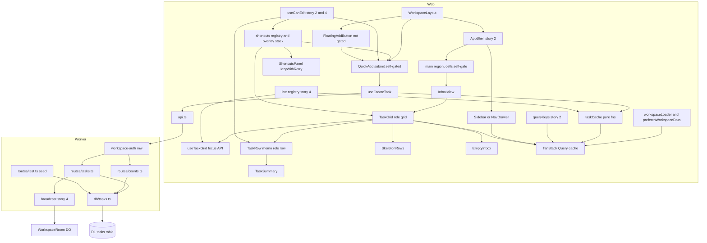
```mermaid
flowchart TD
  subgraph Web
    WL[workspaceLoader and prefetchWorkspaceData]
    Layout[WorkspaceLayout]
    Shell[AppShell story 2]
    FS[main region, cells self-gate]
    Side[Sidebar or NavDrawer]
    Fab[FloatingAddButton not gated]
    Inbox[InboxView]
    Grid[TaskGrid role grid]
    TG[useTaskGrid focus API]
    Row[TaskRow memo role row]
    Sum[TaskSummary]
    Skel[SkeletonRows]
    Empty[EmptyInbox]
    QA[QuickAdd submit self-gated]
    Reg[shortcuts registry and overlay stack]
    Help[ShortcutsPanel lazyWithRetry]
    Hook[useCreateTask]
    Cache[taskCache pure fns]
    Keys[queryKeys story 2]
    QC[TanStack Query cache]
    Live[live registry story 4]
    CE[useCanEdit story 2 and 4]
    Api[api.ts]
  end
  subgraph Worker
    Auth[workspace-auth mw]
    RT[routes/tasks.ts]
    CT[routes/counts.ts]
    TS[routes/test.ts seed]
    DBM[db/tasks.ts]
    BC[broadcast story 4]
  end
  D1[(D1 tasks table)]
  DO[WorkspaceRoom DO]
  WL --> QC
  Layout --> Shell
  Shell --> Side
  Shell --> FS
  FS --> Inbox
  Layout --> Fab
  Layout --> QA
  Inbox --> Grid
  Grid --> TG
  Grid --> Row
  Row --> Sum
  Grid --> Skel
  Grid --> Empty
  Reg --> Grid
  Reg --> QA
  Reg --> Help
  CE --> Reg
  CE --> QA
  CE --> Row
  Fab --> QA
  QA --> Hook
  Hook --> Cache
  Cache --> QC
  Keys --> QC
  Live --> Cache
  Live --> TG
  Hook --> Api
  Side --> QC
  Grid --> QC
  Api --> Auth
  Auth --> RT
  Auth --> CT
  RT --> DBM
  CT --> DBM
  TS --> DBM
  DBM --> D1
  RT --> BC
  BC --> DO
```

## Persisted state
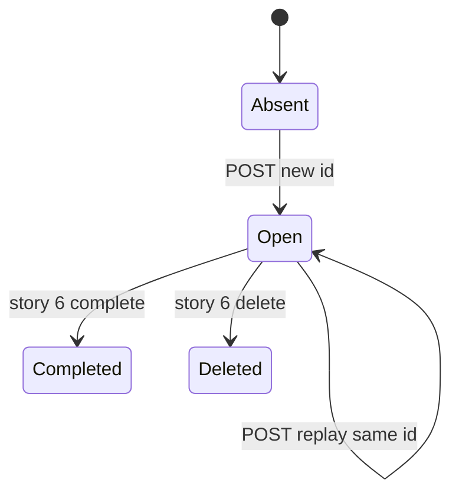
```mermaid
stateDiagram-v2
  [*] --> Absent
  Absent --> Open: POST new id
  Open --> Open: POST replay same id
  Open --> Completed: story 6 complete
  Open --> Deleted: story 6 delete
```
Story 5 only creates the `Absent -> Open` and replay transitions. `Completed` and `Deleted` are shown for context and belong to story 6. A task is Open when `completed_at IS NULL AND deleted = 0`.

## Client optimistic state (per new task; `localStatus`, D-06)
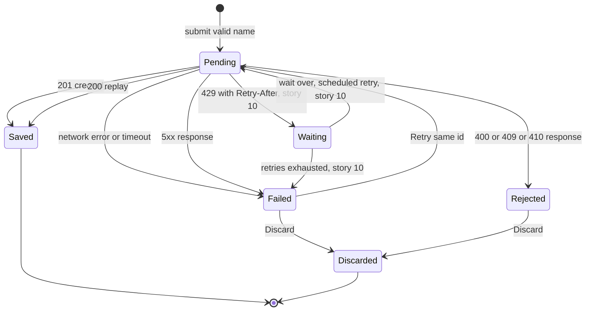
```mermaid
stateDiagram-v2
  [*] --> Pending: submit valid name
  Pending --> Saved: 201 created
  Pending --> Saved: 200 replay
  Pending --> Failed: network error or timeout
  Pending --> Failed: 5xx response
  Pending --> Rejected: 400 or 409 or 410 response
  Pending --> Waiting: 429 with Retry-After, story 10
  Waiting --> Pending: wait over, scheduled retry, story 10
  Waiting --> Failed: retries exhausted, story 10
  Failed --> Pending: Retry same id
  Failed --> Discarded: Discard
  Rejected --> Discarded: Discard
  Saved --> [*]
  Discarded --> [*]
```
- `localStatus` is `pending | failed | rejected | waiting`. Story 5 implements the first three; story 10 adds `waiting` and its transitions (D-06, D-33) using the same union, which story 5 declares now.
- **Pending** rows carry `aria-busy=true`.
- **Failed** offers Retry and Discard in the actions cell, announced with `role=alert`.
- **Rejected** means the server refused the content, so a retry can't succeed. The text stays visible and selectable, and only Discard is offered.
- **Retry rule (amended, D-24):** "No automatic retry after failures; scheduled retry after a rate-limit wait is the only exception." The exception is owned by story 10.
- **Offline (D-10):** Retry is disabled via `useCanEdit()`; Discard stays enabled (a local cache removal with no request).
- **404** (workspace access lost) is handled by story 2's `ApiErrorBoundary` (D-20). The pending row becomes Failed first, so the text is never silently dropped.

## List view state (per list query)
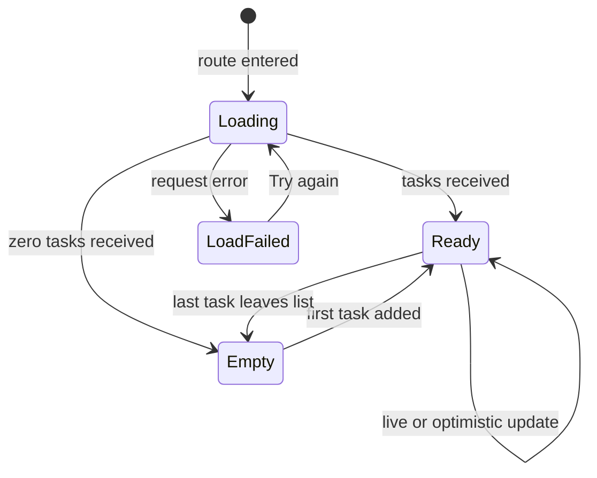
```mermaid
stateDiagram-v2
  [*] --> Loading: route entered
  Loading --> Ready: tasks received
  Loading --> Empty: zero tasks received
  Loading --> LoadFailed: request error
  LoadFailed --> Loading: Try again
  Empty --> Ready: first task added
  Ready --> Empty: last task leaves list
  Ready --> Ready: live or optimistic update
```
- **Loading:** skeleton rows.
- **LoadFailed:** "Couldn't load your tasks." with Try again, which calls `refetch`.
- The sidebar is independent of these states and is always interactive.

## Grid focus state (per TaskGrid)
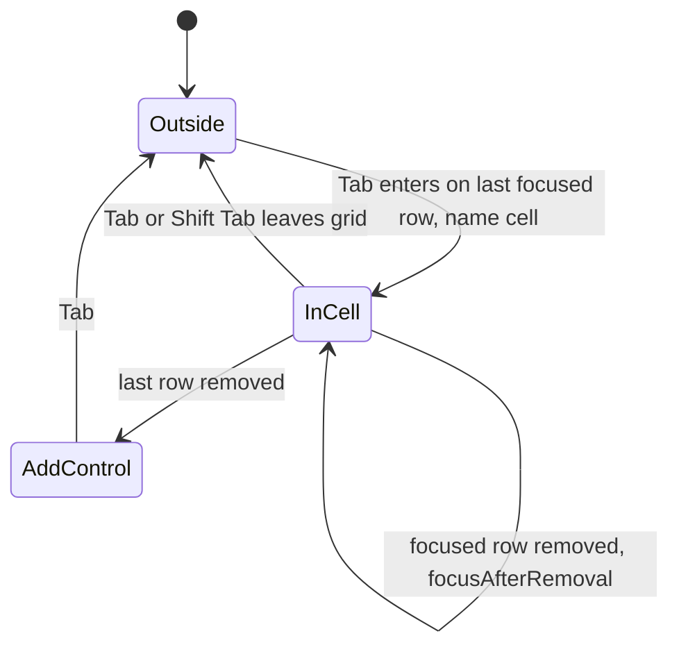
```mermaid
stateDiagram-v2
  [*] --> Outside
  Outside --> InCell: Tab enters on last focused row, name cell
  InCell --> InCell: arrows, j k, Home End move row or cell
  InCell --> InCell: focused row removed, focusAfterRemoval
  InCell --> AddControl: last row removed
  InCell --> Outside: Tab or Shift Tab leaves grid
  AddControl --> Outside: Tab
```

## Quick-add input state (per field)
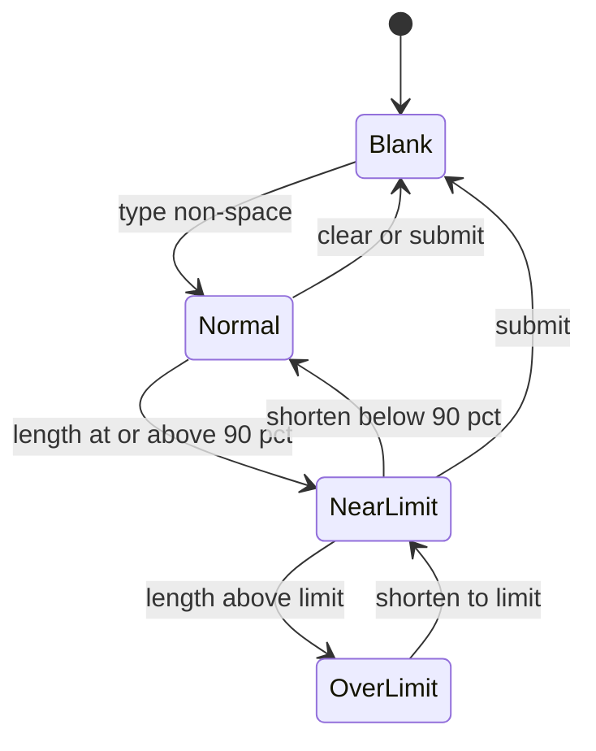
```mermaid
stateDiagram-v2
  [*] --> Blank
  Blank --> Normal: type non-space
  Normal --> NearLimit: length at or above 90 pct
  NearLimit --> Normal: shorten below 90 pct
  NearLimit --> OverLimit: length above limit
  OverLimit --> NearLimit: shorten to limit
  Normal --> Blank: clear or submit
  NearLimit --> Blank: submit
```
Add is enabled only when the name is non-blank, neither field is OverLimit, and `canEdit` is true. Text is never truncated in any state (prd.no_truncation), and going offline never clears it (D-10). Typing is possible in every state, online or offline, because QuickAdd gates only its submit and nothing disables its fields.

## Resolved cross-story issue: Discard works offline (2026-09-27)
The earlier open issue (Discard in cell 3 was disabled by story 2's fieldset, contradicting D-10) is resolved: **there is no fieldset anywhere in the app** (stories 2 and 4 updated). Every control that sends a change gates itself with `useCanEdit()`, and story 5's `TaskRow` cells do the gating once (tasks.list_view). Discard is never gated, so it works offline; Retry is disabled offline. TC-135 is now **expected to pass**.

## Test Strategy

## Test scopes and boundaries
| Capability | unit | integration | ui-component | e2e | Boundary exercised and why it is enough |
|---|---|---|---|---|---|
| tasks.store | yes | yes | not applicable: no UI | covered through tasks.create_api e2e | SQL runs only against real D1 in Miniflare. The idempotent upsert and MAX+1 ordering are SQL behaviour that mocks cannot prove |
| tasks.create_api | yes (schema) | yes | not applicable: no UI | yes | Integration drives `SELF.fetch` through the real Hono stack, including auth and CSRF middleware, D1 and the DO |
| tasks.list_api | yes (query parse) | yes | not applicable: no UI | yes | Same request-handling boundary as create |
| tasks.test_seed | not applicable: the schema is exercised through the route | yes | not applicable: no UI | used as fixture by TC-114 | Bulk insert and the production gate are only provable against real D1 and the real route gate |
| shell.sidebar | not applicable: loader and selectors are covered through rendering | not applicable: no server code | yes | yes | Rendering boundary plus loader timing with MSW; e2e proves it against real counts |
| shell.mobile | yes (keyboard inset maths) | not applicable: no server code | yes | yes | Layout switching in the DOM at the breakpoint boundary; real touch emulation in the browser for hit-area sizes and dark-mode contrast |
| shell.shortcuts | yes (registry, dispatcher, overlay stack, canEdit gate) | not applicable: no server code | yes | yes | Registry logic is pure. Real key events in the DOM and the browser prove the single listener and the guard rules |
| tasks.list_view | yes (grid navigation maths) | not applicable: no server code | yes | yes | Rendering boundary with MSW-mocked network; a real keyboard and axe in the browser prove the grid semantics |
| tasks.quick_add | yes (lengthStatus, canSubmit, destinationLabel) | not applicable: no server code | yes | yes | Pure validation in unit tests; component behaviour (including self-gated submit inside the real AppShell) in the DOM; real keyboard, paste and offline emulation in the browser |
| tasks.client_cache | yes (cache fns, writeTaskLists) | not applicable: no server code | yes | yes | Pure cache transforms in unit tests; hook plus MSW failure injection in the DOM; a real lost response in the browser |

## Dimensions crossed
Each dimension's classes are exhaustive and don't overlap. Every input falls into exactly one class; for D5, every keydown matches the first applicable context in the order listed.

| Dimension | Classes |
|---|---|
| D1 input | name length `{empty, whitespace-only, 1 char, 449, 450, 500, 501, 600 pasted, emoji/astral}`; description `{absent, empty, 4499, 4500, 5000, 5001, multi-line}` |
| D2 prior state of id | `{new, exists same workspace open, exists same workspace soft-deleted, exists other workspace}` |
| D3 caller | `{valid cookie + CSRF header, no cookie, cookie for other workspace, missing CSRF header, body with non-JSON content type}` |
| D4 network outcome (client) | `{success 201, replay 200, 400, 409, 5xx, network error, timeout, response lost after server commit}` (429 belongs to story 10) |
| D5 key-event context | `{IME composing, modifier mismatch, single-key shortcut in a typing field, mod shortcut in a typing field, overlay open, grid-scope key outside a grid, mutating key while offline, free focus, quick add already open}` |
| D6 viewport and pointer | `{width 767 fine pointer, width 768 fine pointer, width 1280 fine pointer, width 390 coarse pointer (touch), width 1024 coarse pointer (tablet)}` |
| D7 list load state | `{loading, error, ready empty, ready with rows}` |
| D8 colour scheme | `{light, dark}` |
| D9 grid focus position | `{outside grid, cell 1, cell 2 (name), cell 3 button, first row, last row, only row}` |
| D10 edit gate | `{canEdit true, canEdit false (offline), canEdit false then true (reconnect)}` |
| D11 row removal source | `{own action, collaborator live event, invalidation refetch}` × `{focus in grid on removed row, focus elsewhere}` |

## API cases (tasks.store, tasks.create_api, tasks.list_api)
| TC | Level | D1 input | D2 id state | D3 caller | Expected result | State before -> after |
|---|---|---|---|---|---|---|
| TC-01 | integration | name 'Buy milk', no description | new | valid | 201 `{task}` with name, description '', sortOrder 1, version 1, completedAt null | 0 rows -> 1 row |
| TC-02 | integration | name '  Buy milk  ' | new | valid | 201, stored name 'Buy milk' (trimmed) | 0 -> 1 row, name trimmed |
| TC-03 | integration | name '' | new | valid | 400 `validation`, issue path name | 0 -> 0 rows |
| TC-04 | integration | name of spaces and a tab | new | valid | 400 `validation` | 0 -> 0 rows |
| TC-05 | integration | name 1 char 'x' | new | valid | 201 | 0 -> 1 |
| TC-06 | integration | name exactly 500 chars | new | valid | 201, stored length 500 | 0 -> 1 |
| TC-07 | integration | name 501 chars | new | valid | 400 `validation` | 0 -> 0 |
| TC-08 | integration | description exactly 5000 chars | new | valid | 201 | 0 -> 1 |
| TC-09 | integration | description 5001 chars | new | valid | 400 `validation` | 0 -> 0 |
| TC-10 | integration | name with emoji 'Call Mum 📞' and multi-line description | new | valid | 201, round-trips byte-identical | 0 -> 1 |
| TC-11 | integration | valid | exists same workspace open | valid | 200 existing task, unchanged version | 1 row -> 1 row, version unchanged |
| TC-12 | integration | different name, same id | exists same workspace open | valid | 200 existing task with ORIGINAL name (replay never overwrites) | 1 -> 1, name unchanged |
| TC-13 | integration | valid | exists same workspace soft-deleted | valid | 410 `gone` | row stays deleted |
| TC-14 | integration | valid | exists other workspace | valid | 409 `id_conflict`; other workspace row untouched | other ws 1 -> 1 unchanged; this ws 0 -> 0 |
| TC-15 | integration | id 'ABC' (not 2×`CLIENT_ID_BYTES` lowercase hex) | not applicable: a malformed id is rejected before lookup | valid | 400 `validation` | 0 -> 0 |
| TC-16 | integration | valid | new | no cookie | 404 `not_found` | 0 -> 0 |
| TC-17 | integration | valid | new | cookie for other workspace | 404 `not_found` | 0 -> 0 in both workspaces |
| TC-18 | integration | valid | new | missing X-Todoodle-Client header | 403 `forbidden_client` | 0 -> 0 |
| TC-19 | integration | valid body sent as Content-Type text/plain | new | CSRF header present | 415 `unsupported_media_type` (story 1 rule, D-21) | 0 -> 0 |
| TC-20 | integration | three sequential creates A,B,C | new each | valid | sortOrder 1,2,3; GET list returns A,B,C | 0 -> 3 rows |
| TC-21 | integration | 10 concurrent creates via Promise.all | new each | valid | 10 rows, 10 distinct sortOrder values | 0 -> 10 |
| TC-22 | integration | valid | new | valid, WebSocket client connected to room | exactly one `task.upserted` event with originClientId echoed (sent via `broadcast(c, wid, event)`) | DO receives 1 message |
| TC-23 | integration | valid replay | exists same workspace | valid, WS connected | NO event broadcast on replay | DO receives 0 messages |
| TC-24 | integration | invalid (TC-03 input) | new | valid, WS connected | NO event broadcast | DO receives 0 messages |
| TC-25 | integration | GET list=inbox with open, completed, soft-deleted tasks and tasks of another workspace (seeded via `/test/seed`) | not applicable: read-only request | valid | only this workspace's open non-deleted tasks, ordered by sortOrder | no change |
| TC-26 | integration | GET list=bogus | not applicable: read-only request | valid | 400 `validation` | no change |
| TC-27 | integration | GET list=inbox, empty workspace | not applicable: read-only request | valid | 200 `{tasks: []}` | no change |
| TC-28 | integration | GET counts with 3 open, 1 completed, 1 deleted; then GET counts?date=2026-09-27; then GET counts?date=27/09 | not applicable: read-only request | valid | body parses with `CountsSchema`; `inbox` = 3 and `projects` = `{}` for both valid requests; malformed date → 400 `validation` | no change |
| TC-29 | integration | GET list and counts | not applicable: read-only request | no cookie | 404 `not_found` for both | no change |
| TC-30 | unit | CreateTaskInput schema on each D1 class | not applicable: pure schema | not applicable: pure schema | accept/reject exactly as TC-01..TC-10; unknown key `foo` stripped | not applicable: no state |
| TC-31 | unit | TaskListQuery schema: inbox, missing, bogus, `project:abc`, `today`; CountsQuery schema: no date, valid date, malformed date | not applicable: pure schema | not applicable: pure schema | inbox ok; missing defaults to inbox; bogus, `project:abc` and `today` rejected (D-31); counts date optional and format-checked | not applicable: no state |
| TC-32 | integration | migration 0002 applied on top of 0001 | not applicable: schema only | not applicable: no request | tasks table + index exist; `PRAGMA foreign_key_list` references workspaces; no CHECK constraint in SQL text | 0001 schema -> 0001+0002 schema |

## Test-route cases (tasks.test_seed)
| TC | Level | Input | Expected | State before -> after |
|---|---|---|---|---|
| TC-144 | integration | seed 3 tasks: one default order, one `sortOrder: 0.5`, one `completedAt`, one `deleted` | 201 with ids in input order; rows hold those values; GET list returns only open rows in sortOrder order | 0 -> seeded rows |
| TC-145 | integration | 5,000 tasks in one call; then 5,001 | first: 201 and `COUNT(*)` = 5,000; second: 400 `validation` | 0 -> 5,000; then unchanged |
| TC-146 | integration | story 5 body with `dueDate`; with `projects`; unknown workspaceId; `ENVIRONMENT=production` | 400 naming the field; 400 naming the field; 404; 404 | no rows in every case |

## UI cases: shell (shell.sidebar, shell.mobile, shell.shortcuts)
| TC | Level | Context (dimension class) | Action | Expected |
|---|---|---|---|---|
| TC-40 | ui-component | counts `{inbox: 3, projects: {}}` | render Sidebar | Inbox item accessible name 'Inbox, 3 open tasks'; no rename/delete menu on Inbox |
| TC-41 | ui-component | counts `{inbox: 0, projects: {}}` | render Sidebar | count hidden, name 'Inbox' |
| TC-42 | ui-component | counts loading | render Sidebar | Inbox visible immediately, count skeleton; no layout shift after load |
| TC-91 | ui-component | MSW holds both responses open | run workspaceLoader then render | both GET tasks and GET counts requests recorded before either resolves; loader returns without awaiting |
| TC-92 | ui-component | counts cached | read key; invalidate `['ws', wid]` | key equals `queryKeys.counts(wid)` (no date); counts refetched once |
| TC-140 | ui-component | spy on `prefetchWorkspaceData` | run the `/w/:id` loader; resolve a boot open for `/w#secret` | called once from each entry with the workspace id; no other module issues the initial tasks/counts requests |
| TC-93 | unit | stubbed visualViewport height 500, innerHeight 800, offsetTop 0; then API absent | compute inset | 300; absent API gives 0 |
| TC-94 | ui-component | D6 width 767 fine pointer vs 768 fine pointer | render WorkspaceLayout in story 2's AppShell | 767: menu button present, inline sidebar absent; 768: inline sidebar present, menu button absent |
| TC-95 | ui-component | D6 width 390 | open drawer, choose Inbox | drawer closes; route Inbox; focus returns to menu button |
| TC-96 | ui-component | D6 width 390 coarse | tap FAB | QuickAdd opens docked with name focused; FAB hidden while open; visible again after Escape |
| TC-97 | e2e | D6 width 390 coarse (iPhone profile, hasTouch) and width 1024 coarse | measure bounding boxes of every button, link and checkbox in shell, grid and quick add | every box at least 44 by 44 |
| TC-98 | e2e | D8 light and dark via `colorScheme` emulation | load Inbox with tasks and quick add open; run axe colour-contrast | background token differs between schemes; zero contrast violations in both |
| TC-46 | unit | isTypingTarget for body, input[type=text], textarea, select, contenteditable, button | call guard | true for input/textarea/select/contenteditable; false for body and button |
| TC-99 | unit | fresh registry | register 5 shortcuts from 5 hooks | `document.addEventListener('keydown')` called exactly once |
| TC-100 | unit | entries A then B for same key | dispatch; unmount B; dispatch | B runs first time; A runs second time |
| TC-101 | unit | entries `{key:'?'}`, `{key:'q'}`, `{key:'k', modifiers:['mod']}` | dispatch Shift+'?'; Ctrl+q, Meta+q, Alt+q; platform-mod+k; Alt+k | '?' handler runs; q never runs; k runs only with the platform mod |
| TC-102 | unit | handler replaced on rerender | dispatch | new handler runs; register/unregister count unchanged |
| TC-136 | unit | D5 overlay open: `pushOverlayScope()`; entries global `q`, grid `e`, global `x` with `allowInOverlay` | dispatch q, e (focus in grid), x; pop scope; dispatch q | q and e do not run while the stack is non-empty; x runs; q runs after pop |
| TC-138 | unit | D5 mod shortcut in a typing field: entries `{key:'z', modifiers:['mod']}` and `{key:'k', modifiers:['mod']}` | ⌘/Ctrl+Z in a text input; ⌘/Ctrl+Z on a grid cell; ⌘/Ctrl+K in a text input | Z not dispatched in the input (browser undo, no preventDefault); Z dispatched from the cell; K dispatched in the input |
| TC-133 | unit | D10 canEdit false; entries grid `e` with `requiresEdit` and global `q` without | dispatch e (focus in grid), q | e does not run; q runs; with canEdit true both run |
| TC-47 | ui-component | D5 free focus | press q | QuickAdd opens, name focused |
| TC-48 | ui-component | D5 single-key shortcut in a typing field | press q in unrelated input | QuickAdd does NOT open; 'q' typed into that input |
| TC-49 | ui-component | D5 modifier mismatch | press Ctrl+q, Meta+q, Alt+q | QuickAdd does NOT open |
| TC-50 | ui-component | D5 IME composing | keydown q with isComposing | QuickAdd does NOT open |
| TC-103 | ui-component | D5 free focus | press ? then Escape | panel lists 'Add task' (Q), 'Show keyboard shortcuts' (?), the grid keys (↑/↓ j/k, Home/End with the note 'Differs from Ctrl+Home/End used in most grids', ←/→); Escape closes; focus back on previously focused element |
| TC-104 | ui-component | D5 single-key in a typing field (quick add name) | type ? | '?' inserted in the field; panel not opened |
| TC-137 | ui-component | quick add open; focus moved to a grid row; press ? | press Escape once | the panel closes; quick add is still open with its text; a second Escape (focus back in quick add) closes quick add |
| TC-105 | e2e | real browser, free focus | press ? | panel visible with grouped shortcuts; axe no serious/critical violations |

## UI cases: grid and quick add (tasks.list_view, tasks.quick_add)
| TC | Level | Context (dimension class) | Action | Expected |
|---|---|---|---|---|
| TC-43 | ui-component | D7 ready, list [A,B,C] | render TaskGrid | rows in order A,B,C; description preview in `TaskSummary` only on rows with description |
| TC-44 | ui-component | D7 ready empty | render InboxView | text 'Your Inbox is clear. Press Q to add a task.' |
| TC-45 | ui-component | list [A] then cache update adds B | rerender | row A not re-rendered (memo render counter); B appended |
| TC-106 | unit | `gridNav` maths on 3 rows × 3 cells | down from last row, up from first, Home/End from cell 3, right from cell 3, left from cell 1, `focusAfterRemoval` of middle, last and only row | rows clamp keeping the column; cells clamp; next row; previous row; add control |
| TC-107 | ui-component | D7 loading | render | 5 skeleton rows inside region with aria-busy=true and label 'Loading tasks' |
| TC-108 | ui-component | D7 error | click Try again with MSW now succeeding | message 'Couldn't load your tasks.' in role=alert; after click rows render; exactly one refetch |
| TC-109 | ui-component | D7 ready, 5 rows | Tab, ArrowDown, ArrowDown, Tab | first Tab focuses row 1's name button; arrows focus row 3's name button; Tab leaves the grid to the next control |
| TC-110 | ui-component | D7 ready, 5 rows | ArrowDown x3, ArrowRight | memo render counters of all rows unchanged |
| TC-111 | ui-component | D9 focus row 2 name, Tab away, Shift+Tab back | keyboard | focus returns to row 2's name cell |
| TC-112 | ui-component | 5 rows | j, k, End, Home | same targets as ArrowDown, ArrowUp, last, first |
| TC-113 | ui-component | 3 rows, row 2 failed (Retry/Discard present) | inspect roles | container `role=grid` labelled by the view title; one `role=rowgroup`; 3 `role=row` each with `data-task-id` and exactly 3 `role=gridcell`; the name is a `button` in cell 2; Retry/Discard are buttons in cell 3 of row 2; **no element has `role=listbox` or `role=option`**; exactly one element in the grid has `tabIndex=0` |
| TC-127 | ui-component | D9 outside grid, 3 rows, row 2 failed | Tab from the control before the grid repeatedly until focus leaves it; record every focused element | exactly one element inside the grid received focus (row 1's name button); the next Tab lands outside the grid |
| TC-128 | ui-component | D9 row 2, cell 2, row failed | ArrowRight, ArrowRight, ArrowRight, ArrowLeft ×4 | Retry, Discard, stays on Discard (no wrap); then Retry, name, cell 1, stays on cell 1 (no wrap) |
| TC-129 | ui-component | D9 row 1, cell 1 | ArrowDown, End, Home | row 2 cell 1, last row cell 1, first row cell 1 (column kept) |
| TC-130 | ui-component | a grid-scoped Space spy registered with `requiresEdit`; row 2 failed | Space on cell 1; Space on the name; Space on Retry; Delete on Retry | spy called with `{taskId, cell:1}` then `{cell:2}`; Space on Retry runs Retry (native) and not the spy; Delete on Retry does not call a Delete spy |
| TC-131 | ui-component | `rowActions.open` spy supplied through `TaskRowSlotsContext` | Enter on row 2's name | spy called once with row 2's id; nothing else happens in story 5 without the spy |
| TC-132 | ui-component | D11: focus on row B's name; B removed by (a) a `task.deleted` live batch that invalidates, (b) a refetch without B; then focus on the quick-add input and C removed remotely | apply each | (a) and (b): focus moves to the next row, same column (or previous; or the add control when none); last case: focus stays in the quick-add input |
| TC-114 | e2e | 20 tasks seeded via `/test/seed`, keyboard only | Tab into the grid, End, Home, ArrowRight | activeElement is row 20's name, then row 1's name, then row 1's cell 3 |
| TC-51 | ui-component | QuickAdd open | name empty | Add disabled; Enter creates nothing (no request recorded by MSW) |
| TC-52 | ui-component | QuickAdd open | name of spaces | Add disabled; Enter creates nothing |
| TC-53 | ui-component | QuickAdd open | type 'Buy milk', Enter | one POST; row appears; fields cleared; name focused; box still open |
| TC-54 | ui-component | QuickAdd open via button | Escape with text typed | box closes; no POST; text discarded; focus returns to '+ Add task' button |
| TC-55 | ui-component | D1 name 449 chars | render | no counter shown |
| TC-56 | ui-component | D1 name 450 chars | render | counter '50 characters left' with aria-live polite |
| TC-57 | ui-component | D1 name 500 chars | type one more char | value is 501 chars (nothing blocked); counter '1 character over' with warning icon; Add disabled; Enter creates nothing |
| TC-58 | ui-component | D1 paste 600 chars | paste | value is the full 600 chars (not truncated); counter '100 characters over'; Add disabled |
| TC-59 | ui-component | description focused | Ctrl/Meta+Enter; plain Enter | modifier Enter submits; plain Enter inserts newline and does not submit |
| TC-115 | unit | D1 boundaries, D10 | lengthStatus and canSubmit | name 449 normal, 450 near, 500 near, 501 over; description 4499 normal, 4500 near, 5000 near, 5001 over; canSubmit false for blank, 501-name, 5001-description and canEdit false |
| TC-141 | unit | targets | destinationLabel | `{kind:'inbox'}` → '→ Inbox'; `{kind:'inbox', defaultDueDate}` → '→ Inbox · Today'; `{kind:'project', projectId}` with name 'Work' → '→ Work' |
| TC-116 | ui-component | name 'Buy', isComposing true | Enter | no POST |
| TC-117 | ui-component | name focused | Tab; Shift+Tab | focus on description; back on name |
| TC-118 | ui-component | target inbox | render QuickAdd | chip text '→ Inbox'; form accessible description contains 'Inbox' |
| TC-119 | ui-component | description 5001 chars | render | textarea aria-invalid=true, aria-describedby points to counter containing warning icon |
| TC-120 | ui-component | opened from FAB (docked) | Escape | focus returns to FAB |
| TC-134 | ui-component | D10 offline then reconnect: real `WorkspaceLayout` in story 2's `AppShell`, `useCanEdit` stubbed false; QuickAdd open inline, and separately docked from the FAB | assert the document contains no `fieldset`; type 'Buy milk' in name and description; press Enter; press ⌘/Ctrl+Enter; click Add; switch `useCanEdit` to true | the name and description inputs are enabled and hold exactly the typed text; Add disabled with the offline reason; no POST recorded; after reconnect the text is still 'Buy milk' and Add is enabled; one Enter then sends exactly one POST |
| TC-142 | ui-component | targets `{kind:'project', projectId:'p1'}` and `{kind:'inbox', defaultDueDate:'2026-09-27'}` | submit 'Buy milk' in each | POST bodies contain `projectId:'p1'` and `dueDate:'2026-09-27'` respectively; neither contains a `today` kind |

## UI cases: client cache (tasks.client_cache)
| TC | Level | Context | Action | Expected |
|---|---|---|---|---|
| TC-60 | unit | list [A] | appendOptimistic P | [A, P pending]; input list not mutated |
| TC-61 | unit | P pending | markStatus failed | P failed, name/description preserved |
| TC-62 | unit | P pending | replaceWithServer | P replaced in place by server task, no local status |
| TC-63 | unit | [A,P] | removeLocal P | P removed; A same reference |
| TC-64 | unit | cached id at version 2 | applyTaskEvents with version 3, then 2, then new id | replaced; lower/equal ignored; new id inserted at sortOrder position |
| TC-121 | unit | 1,000 cached tasks | applyTaskEvents with update, stale, new | 2 applied, 1 ignored; untouched items keep references |
| TC-122 | unit | cached list | applyTaskEvents with only stale events | identical array reference returned |
| TC-143 | unit | QueryClient holding `queryKeys.tasks(wid,{list:'inbox',includeCompleted:false})`, the same with `includeCompleted:true`, and a list for another workspace | `writeTaskLists` with an Inbox target | both Inbox lists updated via `setQueriesData` on `['ws', wid, 'tasks']`; the other workspace's list untouched (same reference) |
| TC-65 | ui-component | MSW network error | submit | row failed; 'Couldn't save this task.' inside role=alert; Retry and Discard in cell 3 |
| TC-66 | ui-component | MSW 500 then 201 | submit, Retry | second request has SAME id; row saved; exactly one row |
| TC-67 | ui-component | failed row | Discard | row removed; count back to prior value; no request |
| TC-68 | ui-component | MSW 400 | submit | row rejected: text visible, Discard shown, Retry NOT shown |
| TC-69 | ui-component | MSW delays 2s | submit | row visible before response (optimistic); count incremented immediately |
| TC-70 | ui-component | MSW never resolves | submit, advance fake timers past CREATE_TASK_TIMEOUT_MS | row becomes failed; no further request is sent automatically (no automatic retry) |
| TC-71 | ui-component | pending row, count 3 | request fails; then Retry succeeds | count 3 after failure; 4 after success |
| TC-123 | ui-component | MSW delays then fails | submit | pending row aria-busy=true; after failure message inside role=alert |
| TC-124 | ui-component | another test handler registered for task.upserted | mount tasks live handlers; emit event | both handlers called |
| TC-135 | ui-component | D10 canEdit false; one failed row rendered in the real AppShell | click Discard; inspect Retry | row removed with no request; Retry is disabled with the offline reason; the name button stays enabled. **Expected to pass** (resolved 2026-09-27: there is no fieldset; cells self-gate with `useCanEdit()`) |
| TC-139 | ui-component | counts cached; tasks live handlers mounted | emit `task.upserted`, `task.deleted`, `task.restored`, `tasks.bulk` in separate frames; then 3 events in one frame | counts invalidated once per event type; once for the single-frame burst |

## E2E workflows (Playwright, real wrangler dev, fresh local D1)
| TC | Level | Workflow | Asserts |
|---|---|---|---|
| TC-80 | e2e | W1 golden path: create workspace via home page, press Q, type 'Buy milk', Enter | row at bottom, input cleared and focused, box open; reload shows the task; sidebar Inbox count 1 |
| TC-81 | e2e | W2 rapid capture: add 'One','Two','Three' with Enter only | order One,Two,Three before and after reload |
| TC-82 | e2e | W3 lost response: `page.route` forwards first POST via `route.fetch()` then aborts the response; click Retry | exactly ONE 'Buy milk' after reload |
| TC-83 | e2e | W4 discard: first POST aborted before reaching server; click Discard | row gone; still absent after reload; count 0 |
| TC-84 | e2e | W5 shortcut guard: focus workspace rename field (story 2), type 'quiet' | rename field contains 'quiet'; quick add not opened |
| TC-85 | e2e | W6 empty state: new workspace shows empty state; add a task | empty state disappears |
| TC-86 | e2e | W7 limits: paste 600 chars into name | field holds all 600; '100 characters over' shown; Add disabled; delete 100 chars; Add enabled; saved task has 500 chars |
| TC-87 | e2e | W8 escape: open, type, press Escape | closed; reload shows no task |
| TC-88 | e2e | W9 keyboard-only + a11y: complete W1 keyboard only; force one failed row (route abort) so Retry/Discard are inside a row; axe on Inbox with quick add open | zero serious/critical axe violations, including `nested-interactive` and `aria-required-children` — **expected to pass** now that the list is a grid (it failed with the withdrawn listbox) |
| TC-89 | e2e | W10 API bypass: `request.post` with 501-char name using the page's cookie and headers | 400; list unchanged (server-side limit) |
| TC-90 | e2e | W11 optimistic latency: delay POST 1.5 s via route | row visible while request pending |
| TC-97 | e2e | W12 touch targets (see shell table) | all hit areas at least 44 by 44 |
| TC-98 | e2e | W13 dark mode contrast (see shell table) | zero contrast violations in light and dark |
| TC-105 | e2e | W14 shortcuts panel (see shell table) | panel lists shortcuts; axe clean |
| TC-114 | e2e | W15 grid navigation (see grid table) | End, Home and ArrowRight move focus correctly |
| TC-125 | e2e | W16 phone capture: iPhone profile; tap FAB; type 'Milk'; Enter; open drawer; tap Inbox | task added; drawer closes on selection; quick add docked at bottom of viewport |
| TC-147 | e2e | W17 offline typing: open quick add; `context.setOffline(true)` and wait for story 4's offline state; type 'Buy milk'; press Enter; `context.setOffline(false)` and wait for editing to return; press Enter | while offline the input accepts typing and holds 'Buy milk', Add is disabled and no POST is sent; after reconnect the text is unchanged and Enter saves exactly one 'Buy milk' (present after reload) |

## Negative scenarios (must NOT happen)
| TC | Level | Must not happen |
|---|---|---|
| TC-03, TC-04, TC-07, TC-09 | integration | no row created on invalid input |
| TC-12 | integration | replay never overwrites |
| TC-14 | integration | no cross-workspace write |
| TC-16, TC-17, TC-18, TC-19 | integration | no write without auth, CSRF header, or a JSON body |
| TC-23, TC-24 | integration | no broadcast on replay or rejection |
| TC-25 | integration | no leakage of completed, deleted or foreign tasks |
| TC-146 | integration | `/test/seed` never works in production and never accepts fields its columns don't support |
| TC-48, TC-49, TC-50, TC-104, TC-138 | unit, ui-component | shortcut never hijacks typing or the browser's text undo |
| TC-136, TC-137 | unit, ui-component | shortcuts never fire through an open overlay; an overlay's Escape never closes what is underneath |
| TC-133 | unit | a mutating shortcut never runs offline |
| TC-51, TC-52, TC-57, TC-58, TC-116, TC-134, TC-147 | ui-component, e2e | no request for blank, over-limit, composing or offline input |
| TC-57, TC-58, TC-86, TC-134, TC-147 | ui-component, e2e | text never truncated, blocked from typing, or cleared by going offline and back |
| TC-54, TC-87 | ui-component, e2e | Escape never creates a task |
| TC-66, TC-82 | ui-component, e2e | retry never duplicates |
| TC-70 | ui-component | a failure never triggers an automatic retry |
| TC-67, TC-83, TC-135 | ui-component, e2e | discard never sends a request |
| TC-99 | unit | never more than one global keydown listener |
| TC-110 | ui-component | grid navigation never re-renders rows |
| TC-113, TC-127 | ui-component | no listbox/option role; never more than one Tab stop in the grid |
| TC-130 | ui-component | Space on a cell-3 button never triggers a row action |
| TC-132 | ui-component | a remote removal never steals focus from outside the grid |
| TC-122 | unit | stale events never change the cache |
| TC-124 | ui-component | registering a handler never removes another |

## Mock vs real
| Store/service | unit | integration | ui-component | e2e | Why |
|---|---|---|---|---|---|
| D1 | not used: pure functions only | real Miniflare D1 with migrations applied per test file | not used: network is mocked | real local D1, seeded via `/test/seed` | Ordering and idempotency are SQL behaviour; mocking the store under test is forbidden (architecture §10) |
| WorkspaceRoom DO | not used: no I/O | real Miniflare DO; the test opens a WebSocket to count broadcasts | not used: live registry is exercised directly | real local DO | Broadcast-count assertions need the real fan-out path |
| HTTP between SPA and Worker | not used: no I/O | not applicable: tests call the Worker directly | MSW handlers in `apps/web/test/msw/tasks.ts` | real; `page.route` only for fault injection (TC-82, TC-83, TC-88, TC-90); `context.setOffline` for TC-147 | Fault injection at the browser boundary is the only deterministic way to lose a response after commit or go offline |
| `canEdit` store | stubbed snapshot (TC-133) | not applicable | stubbed `useCanEdit` with the **real** story 2 `AppShell` (TC-134, TC-135), so self-gating is proven in the real shell, not assumed | real story 4 store driven by real offline emulation (TC-147) | Offline detection is story 4's; story 5 proves its controls obey the boolean |
| matchMedia and visualViewport | stubbed (TC-93) | not applicable: no browser APIs server-side | stubbed via happy-dom `matchMedia` mock and viewport size | real Chromium/WebKit with device profiles (D-36 matrix) | happy-dom has no layout engine; real sizes are asserted only in e2e |
| Clock/timers | fake timers where timeouts matter | real | vitest fake timers (TC-70, counter throttle) | real | Keeps timeout cases fast and deterministic |

## Fixture realism
- **Workspaces** are created through the real `POST /api/workspaces` (story 2) or `/test/seed-workspace` (story 2), and tasks through the real create endpoint or `/test/seed` (D-35), never by raw SQL with invented columns.
- **Task names** come from `apps/api/test/fixtures/tasks.ts`: realistic strings ('Buy milk', 'Email Sam re: invoice #4411', 'Call Mum 📞', 'Book dentist — ask about Tuesday') plus a multi-line description.
- **Length-boundary strings** are built from `TASK_NAME_MAX`, `TASK_DESCRIPTION_MAX` and `LENGTH_WARNING_RATIO` in `packages/shared/src/limits.ts`, so fixtures follow the constants.
- **MSW responses** are produced by the shared zod `TaskSchema.parse` / `CountsSchema.parse` on fixture objects, so mocked shapes can't drift from the real contract; tests assert counts by schema, not literal objects (§13 rule 3).
- **Device profiles** are Playwright's built-in iPhone 13 and Pixel 7 profiles (D-36), plus an iPad profile for TC-97.

## Edge cases
- **Astral characters:** limits count UTF-16 code units on both client and server, so an emoji counts as 2 (TC-10, TC-86).
- **Double Enter within one frame:** the submit handler reads and clears state synchronously and generates a new id per submit.
- **Rotating a phone while quick add is docked:** the `visualViewport` resize recomputes `--kb-inset`.
- **Window resized across 768 px with the drawer open:** the drawer unmounts and the inline sidebar renders; focus moves to the main heading.
- **Row with no actions:** cell 3 is still present and focusable, so ←/→ positions are stable across rows (TC-128, TC-129).
- **Removed row was the active roving target but focus was elsewhere:** the grid re-targets `tabIndex=0` to the next row without moving focus (TC-132).
- **Going offline mid-typing:** QuickAdd is never unmounted by a `canEdit` change, so the caret and text survive (TC-134, TC-147).

## Not covered (deliberately)
- **Cross-tab or cross-person propagation of new tasks:** story 4's live-update tests cover it. Only the broadcast count is asserted here.
- **The sub-100 ms constraint:** proved structurally (row visible while the request is pending), not by a wall-clock benchmark.
- **Real screen readers (VoiceOver, NVDA, JAWS):** only automated axe checks and role, accessible-name and aria-live assertions. The grid choice (D-01) is what makes NVDA/JAWS focus mode apply; that is not machine-verified here.
- **Very large lists (5,000 tasks):** rendering performance belongs to story 8's constraint; story 5 only proves `/test/seed` can create them (TC-145).
- **Rate-limit waiting state and scheduled retry:** story 10 (D-24, D-33).
- **Real on-screen keyboards on physical phones:** the inset maths is unit-tested (TC-93) and docked placement is checked in device emulation (TC-125), but no test runs on a physical iOS or Android keyboard.

## Tasks table and query module

> Anchor: `tasks.store`

## Contract
- Migration `migrations/0002_tasks.sql` creates `tasks(id TEXT PRIMARY KEY, workspace_id TEXT NOT NULL REFERENCES workspaces(id), name TEXT NOT NULL, description TEXT NOT NULL DEFAULT '', sort_order REAL NOT NULL, completed_at TEXT, version INTEGER NOT NULL DEFAULT 1, created_at TEXT DEFAULT (datetime('now')), updated_at TEXT DEFAULT (datetime('now')), deleted INTEGER NOT NULL DEFAULT 0, deleted_at TEXT)` and index `idx_tasks_ws_open ON tasks(workspace_id, deleted, completed_at, sort_order)`. No CHECK constraints. `id` has no DEFAULT because ids are client-generated (see Overview decision).
- The Inbox is not a row: it is the set of tasks with no project (story 7 adds `project_id`; until then all tasks are Inbox). It therefore cannot be renamed or deleted.
- `insertTaskIdempotent(db, {id, workspaceId, name, description}) -> {status: 'created'|'replayed'|'gone'|'conflict', task?: TaskRow}`
- `listOpenTasks(db, workspaceId, {list: 'inbox'}) -> TaskRow[]` ordered by `sort_order, created_at, id`. The option object is the extension point for story 7 (`{list:'project', projectId}`) and story 6 (`includeCompleted`).
- `countOpenTasks(db, workspaceId) -> {inbox: number, projects: {}}` — the final counts shape of D-31, with `projects` empty until story 7.
- `seedTasks(db, workspaceId, rows[])` — bulk insert used only by `/test/seed` (tasks.test_seed); batched through `db.batch` so 5,000 rows insert in one call.
- Errors: D1 failures propagate as thrown errors (mapped to 500 `internal` by the app error handler).
- Side effects: one INSERT when status is `created`; none otherwise.

## Implementation
- `migrations/0002_tasks.sql` as above.
- `apps/api/src/db/tasks.ts`:
  - Insert uses a single statement so ordering is atomic under D1's serialised writes: `INSERT INTO tasks (id, workspace_id, name, description, sort_order) SELECT ?1, ?2, ?3, ?4, COALESCE(MAX(sort_order), 0) + ?5 FROM tasks WHERE workspace_id = ?2 ON CONFLICT(id) DO NOTHING RETURNING *` with `?5 = TASK_SORT_STEP`. Note: SQLite needs a `WHERE` clause before `ON CONFLICT` in `INSERT ... SELECT` to avoid a parse ambiguity; the workspace filter provides it. MAX spans all of the workspace's tasks (incl. completed/deleted) so a reopened task (story 6) keeps its original position without collisions.
  - If RETURNING yields no row, `SELECT * FROM tasks WHERE id = ?`; map: same workspace + deleted=0 -> `replayed`; same workspace + deleted=1 -> `gone`; other workspace -> `conflict`.
  - `rowToTask()` maps snake_case to the shared `Task` type.
- `packages/shared/src/limits.ts`: add `TASK_SORT_STEP = 1` and **`CLIENT_ID_BYTES = 16`** (D-44), the one constant for client-generated task and project ids. `TASK_ID_BYTES` and `PROJECT_ID_BYTES` must not exist.
- `packages/shared/src/schemas.ts`: `TaskSchema` (id, workspaceId, name, description, sortOrder, completedAt, version, createdAt, updatedAt); `TaskIdSchema` derives its regex length from `CLIENT_ID_BYTES` (2 hex chars per byte).

## Tests
- integration: TC-01, TC-11, TC-12, TC-13, TC-14, TC-20, TC-21, TC-25, TC-27, TC-28, TC-32 (`apps/api/test/db/tasks.test.ts`, real Miniflare D1).
- unit: `rowToTask` mapping incl. null completed_at (`apps/api/test/db/rowToTask.test.ts`).

## Create task endpoint (idempotent)

> Anchor: `tasks.create_api`

## Contract
`POST /api/w/:workspaceId/tasks`

- **Headers:** cookie `tdl_ws` (workspace-auth), `Content-Type: application/json`, `X-Todoodle-Client: web`, `X-Todoodle-Client-Id: <tab id>`.
- **Body** (`CreateTaskInputSchema`):
  - `id` must match `/^[0-9a-f]{32}$/` (2 × `CLIENT_ID_BYTES` hex chars).
  - `name`: string, trimmed, 1..TASK_NAME_MAX.
  - `description`: optional string, trimmed, 0..TASK_DESCRIPTION_MAX, default ''.
  - Unknown keys are stripped (story 7 adds `projectId`, story 8 `dueDate`). Length is `String.length` after trimming.
  - The server is the final guard for length. The client never truncates; it blocks submission while over the limit, so an over-limit body arriving here comes from a bypass (TC-89).
- **Responses:**

  | Status | Code | When |
  |---|---|---|
  | 201 | `{task}` | created |
  | 200 | `{task}` | id already exists in this workspace (replay; stored values win, request values ignored) |
  | 400 | `validation` | bad id, blank name, or too long |
  | 404 | `not_found` | auth failure (middleware) |
  | 403 | `forbidden_client` | missing CSRF header (middleware) |
  | 415 | `unsupported_media_type` | body present but not JSON (story 1 validate pipeline, D-21) |
  | 409 | `id_conflict` | id exists in another workspace |
  | 410 | `gone` | id exists here but is soft-deleted |
  | 429 | `rate_limited` | story 10's limiter (D-23); the create is idempotent, so story 10 may schedule a retry (D-24) |
  | 500 | `internal` | unexpected error |

- **Side effects:** on 201 only, `broadcast(c, wid, {type: 'task.upserted', entity: task, version: task.version, originClientId})`. Story 4's `broadcast` calls `waitUntil` itself (D-26): the handler adds no `waitUntil` wrapper and never calls `room.broadcast` directly. A broadcast failure is logged (without the body) and never changes the response. Replays, which don't change anything, never broadcast (architecture §7).

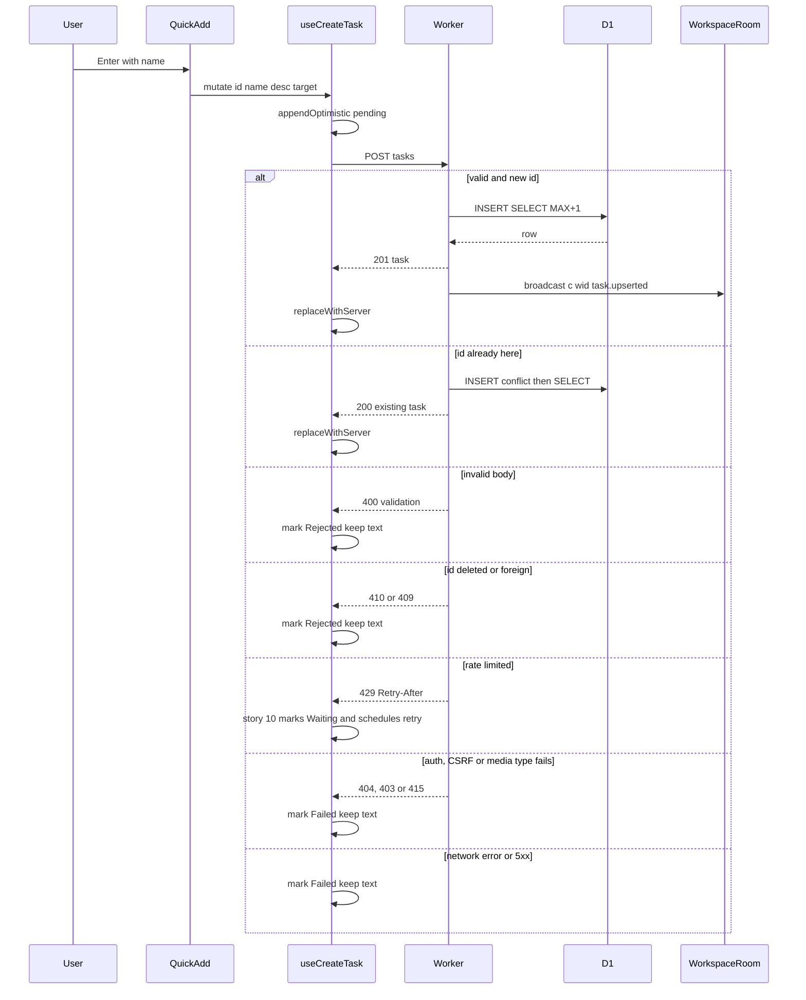
```mermaid
sequenceDiagram
  participant U as User
  participant QA as QuickAdd
  participant H as useCreateTask
  participant W as Worker
  participant D as D1
  participant R as WorkspaceRoom
  U->>QA: Enter with name
  QA->>H: mutate id name desc target
  H->>H: appendOptimistic pending
  H->>W: POST tasks
  alt valid and new id
    W->>D: INSERT SELECT MAX+1
    D-->>W: row
    W-->>H: 201 task
    W->>R: broadcast c wid task.upserted
    H->>H: replaceWithServer
  else id already here
    W->>D: INSERT conflict then SELECT
    W-->>H: 200 existing task
    H->>H: replaceWithServer
  else invalid body
    W-->>H: 400 validation
    H->>H: mark Rejected keep text
  else id deleted or foreign
    W-->>H: 410 or 409
    H->>H: mark Rejected keep text
  else rate limited
    W-->>H: 429 Retry-After
    H->>H: story 10 marks Waiting and schedules retry
  else auth, CSRF or media type fails
    W-->>H: 404, 403 or 415
    H->>H: mark Failed keep text
  else network error or 5xx
    H->>H: mark Failed keep text
  end
```

## Implementation
- `packages/shared/src/schemas.ts`: `CreateTaskInputSchema`, `TaskIdSchema`.
- `apps/api/src/routes/tasks.ts`: a Hono sub-router mounted at `/api/w/:workspaceId/tasks`, behind `workspace-auth`. The handler:
  1. parses with the shared schema (400 via the common validation error helper);
  2. calls `insertTaskIdempotent`;
  3. maps the result to 201, 200, 410 or 409;
  4. on `created`, calls `broadcast(c, wid, event)`.

  It reads `X-Todoodle-Client-Id` (optional; if absent the origin is null).
- `apps/api/src/lib/errors.ts`: `id_conflict` is part of the error-code union (already listed in architecture §6).
- Register the router in `apps/api/src/app.ts`.

## Tests
- **unit:** TC-30 (`packages/shared/test/schemas.test.ts`).
- **integration:** TC-01..TC-19 and TC-22..TC-24 (`apps/api/test/routes/tasks.create.test.ts`, via `SELF.fetch`, real D1 and DO; a WebSocket opened to the room counts broadcasts).
- **e2e:** TC-80, TC-82, TC-86, TC-89.

## Inbox list and counts endpoints

> Anchor: `tasks.list_api`

## Contract
- `GET /api/w/:workspaceId/tasks?list=inbox` -> 200 `{tasks: Task[]}`: open (completed_at null), non-deleted tasks of this workspace ordered by sortOrder, createdAt, id. `list` defaults to `inbox`; any other value -> 400 `validation`.
  - Final parameter shape (D-31): `list=inbox|project` with `projectId` when `list=project` (added by story 7), and `include_completed=true|false` (added by story 6). There is no `project:<id>` form and no `list=today`; Today is `GET /today?date=` (story 8).
- `GET /api/w/:workspaceId/counts[?date=YYYY-MM-DD]` -> 200 `{inbox: number, projects: {[projectId]: {open: number, total: number}}, today?: number}` (D-31).
  - Story 5 returns `{inbox, projects: {}}`. `inbox` counts open, non-deleted tasks with no project.
  - `date` is optional; story 5 validates its format (400 `validation` when malformed) and otherwise ignores it. Story 8 uses it to fill `today`. Story 7 fills `projects`.
- 404 `not_found` from workspace-auth. 500 `internal` on D1 failure.
- Side effects: none. Responses carry `Cache-Control: no-store` (architecture §6).

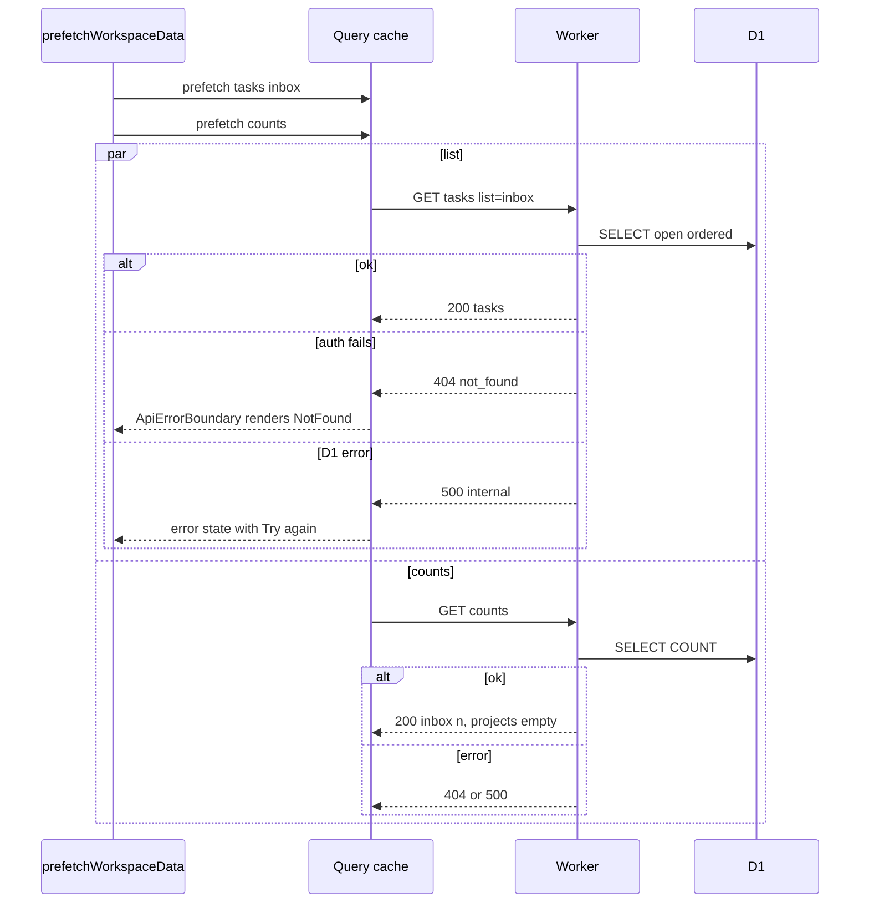
```mermaid
sequenceDiagram
  participant WR as prefetchWorkspaceData
  participant Q as Query cache
  participant W as Worker
  participant D as D1
  WR->>Q: prefetch tasks inbox
  WR->>Q: prefetch counts
  par list
    Q->>W: GET tasks list=inbox
    W->>D: SELECT open ordered
    alt ok
      W-->>Q: 200 tasks
    else auth fails
      W-->>Q: 404 not_found
      Q-->>WR: ApiErrorBoundary renders NotFound
    else D1 error
      W-->>Q: 500 internal
      Q-->>WR: error state with Try again
    end
  and counts
    Q->>W: GET counts
    W->>D: SELECT COUNT
    alt ok
      W-->>Q: 200 inbox n, projects empty
    else error
      W-->>Q: 404 or 500
    end
  end
```

## Implementation
- `packages/shared/src/schemas.ts`:
  - `TaskListQuerySchema = z.object({ list: z.enum(['inbox']).default('inbox') })` — story 7 adds `'project'` plus a refined `projectId`, story 6 adds `include_completed`.
  - `CountsQuerySchema = z.object({ date: IsoDateSchema.optional() })`.
  - `CountsSchema = z.object({ inbox: nonNegInt, projects: z.record(TaskIdSchema, z.object({open: nonNegInt, total: nonNegInt})), today: nonNegInt.optional() })`. Tests assert responses by parsing with `CountsSchema`, not by literal object equality, so stories 7 and 8 do not have to rewrite them (§13 rule 3).
- `apps/api/src/routes/tasks.ts`: `GET /` handler using `listOpenTasks`; `apps/api/src/routes/counts.ts`: `GET /api/w/:workspaceId/counts` using `countOpenTasks`. The two queries run independently (no server-side waterfall; each endpoint is one statement).
- The client issues both requests in parallel through `prefetchWorkspaceData` (shell.sidebar).

## Tests
- unit: TC-31.
- integration: TC-25..TC-29 (`apps/api/test/routes/tasks.list.test.ts`).
- e2e: TC-80, TC-81 (order persists across reload).

## /test/seed: bulk task and project fixtures for tests (D-35)

> Anchor: `tasks.test_seed`

## Contract
`POST /test/seed` — owner: story 5; extended by stories 6, 7 and 8 (D-35). Registered in story 1's `apps/api/src/routes/test.ts` registry, so it returns **404 in production** like every `/test/*` route. It exists so e2e and performance tests can build realistic lists (20 tasks for keyboard navigation, 5,000 tasks for story 8's performance case) without driving the UI or inventing SQL; `/test/sql` does not exist.

- **Body** (`TestSeedSchema` in `packages/shared/src/testSeed.ts`, the final shape):
  ```ts
  {
    workspaceId: string,
    projects?: Array<{ ref: string, name: string, color: string, deleted?: boolean }>,           // story 7
    tasks?: Array<{
      name: string, description?: string,
      projectRef?: string,            // story 7: refers to projects[].ref
      dueDate?: string,               // story 8: YYYY-MM-DD
      completedAt?: string,           // ISO; used by story 6 fixtures
      deleted?: boolean,              // soft-deleted rows; used by story 6 fixtures
      sortOrder?: number              // default: appended in array order with TASK_SORT_STEP
    }>
  }
  ```
  - At most `TEST_SEED_MAX_TASKS = 5_000` tasks per call.
  - Fields whose column does not exist yet (story 5: `projects`, `projectRef`, `dueDate`) are rejected with 400 `validation` naming the field, until the owning story enables them. Tests never receive silently wrong data.
- **Responses:**

  | Status | Body | When |
  |---|---|---|
  | 201 | `{taskIds: string[], projectIds: {[ref]: string}}` (ids in input order) | seeded |
  | 400 | `validation` | schema failure, more than `TEST_SEED_MAX_TASKS`, or a field not yet supported |
  | 404 | `not_found` | production, or `workspaceId` does not exist |

- **Side effects:** inserts rows with ids from `CLIENT_ID_BYTES` random bytes; **no broadcast** (fixtures are set up before the page loads). Bulk inserts go through `db.batch` in chunks of `TEST_SEED_BATCH_SIZE = 100` statements, so 5,000 rows insert in one request.

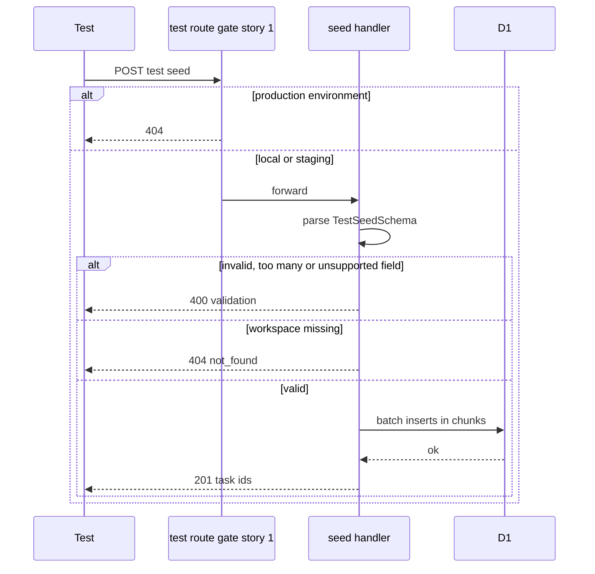
```mermaid
sequenceDiagram
  participant T as Test
  participant G as test route gate story 1
  participant S as seed handler
  participant D as D1
  T->>G: POST test seed
  alt production environment
    G-->>T: 404
  else local or staging
    G->>S: forward
    S->>S: parse TestSeedSchema
    alt invalid, too many or unsupported field
      S-->>T: 400 validation
    else workspace missing
      S-->>T: 404 not_found
    else valid
      S->>D: batch inserts in chunks
      D-->>S: ok
      S-->>T: 201 task ids
    end
  end
```

## Implementation
- `packages/shared/src/testSeed.ts`: `TestSeedSchema`; `packages/shared/src/limits.ts`: `TEST_SEED_MAX_TASKS = 5_000`, `TEST_SEED_BATCH_SIZE = 100`.
- `apps/api/src/routes/test.ts` (story 1's registry file): add the `/test/seed` entry pointing to `apps/api/src/routes/testSeed.ts`.
- `apps/api/src/db/tasks.ts`: `seedTasks(db, workspaceId, rows)` (tasks.store).
- `e2e/fixtures/seed.ts`: `seedTasks(request, workspaceId, tasks)` helper used by TC-114 and later stories' specs.

## Tests
- **integration** (`apps/api/test/routes/testSeed.test.ts`): TC-144 (seed 3 tasks with explicit and default `sortOrder`, one `completedAt`, one `deleted`: rows exist with those values; GET list returns only the open ones in order), TC-145 (5,000 tasks in one call succeed and `COUNT(*)` is 5,000; 5,001 → 400), TC-146 (`dueDate` or `projects` in story 5 → 400 naming the field; unknown workspace → 404; with `ENVIRONMENT=production` → 404 and no rows).

## Workspace layout, sidebar, queries and prefetchWorkspaceData

> Anchor: `shell.sidebar`

## Contract
- **Story 2 owns `AppShell`** (`features/shell/AppShell.tsx`: header, main slot and named slots, no fieldset; D-11). Story 5 creates no shell file. It extends the shell **only through AppShell's named props**:
  - `sidebar` — story 5's `<ResponsiveNav>`: the inline `<Sidebar>` at or above `MOBILE_BREAKPOINT_PX`, or the `NavDrawer` below it (shell.mobile);
  - `searchSlot` — forwarded by story 5 into `SidebarContent` (story 11 fills it; see "Extension points owned by story 5");
  - `headerActionsSlot` — story 5 composes the ☰ trigger (narrow only) followed by whatever story 11 passes;
  - `quickAddSlot` — rendered by AppShell directly after the main region. Story 5 puts the inline QuickAdd, the "+ Add task" button and the `FloatingAddButton` here; QuickAdd's input stays typeable offline and only its submit self-gates with `useCanEdit()` (D-10). The prop is part of story 2's AppShell design.
  - The main slot (AppShell's children; the grid's cells self-gate) receives the active view: heading and `TaskGrid`.
  - `features/workspace/WorkspaceLayout.tsx` is the one place that composes these props; routes render views inside it. It also provides `QuickAddContext` (open state, return-focus ref), so the view's Q shortcut and the slot's QuickAdd share state.
- **`<Sidebar searchSlot? todaySlot? projectsSlot?>`** lists `searchSlot`, Inbox (icon, label, open count when > 0), then `todaySlot` and `projectsSlot` (render props, empty in story 5). Inbox has no rename or delete controls.
  - Accessible name of the Inbox link: "Inbox, N open tasks" when N > 0, otherwise "Inbox". The current view has `aria-current=page`. Links are built with story 2's `workspacePath(wid, 'inbox')` (D-12).
- **Query keys** come from story 2's `apps/web/src/lib/queryKeys.ts`; story 5 **uses** `queryKeys.*` and defines no keys of its own (D-37):
  - `queryKeys.tasks(wid, {list: 'inbox', includeCompleted: false})` (a `projectId` is added for project lists by story 7);
  - `queryKeys.counts(wid)` with no date in the key.
  - Story 4's reconnect invalidation of `['ws', wid]` therefore refreshes both.
- **`prefetchWorkspaceData(wid)`** (D-39), in `apps/web/src/routes/workspaceLoader.ts`:
  - Starts `queryClient.prefetchQuery(tasksQuery(wid, {list:'inbox'}))` and `queryClient.prefetchQuery(countsQuery(wid))` together and **does not await them**. Returns `void`.
  - Called from two places: the `/w/:id` route `loader` (`workspaceLoader`, returns `null` immediately), and story 2's boot-open continuation for `/w#secret`, as soon as the open promise resolves with the workspace id.
  - It is the single extension point for route-entry data: stories 7 (projects) and 8 (today) add their prefetches **inside** it. There is no `Promise.all` in `Workspace.tsx`.
- **Errors:**
  - A failed counts request hides the count; it never blocks navigation.
  - While counts load, the badge shows a fixed-width skeleton, so there is no layout shift.
  - A tasks request that fails with `not_found` is thrown to story 2's `ApiErrorBoundary` (D-20); other failures stay in the list's LoadFailed state.

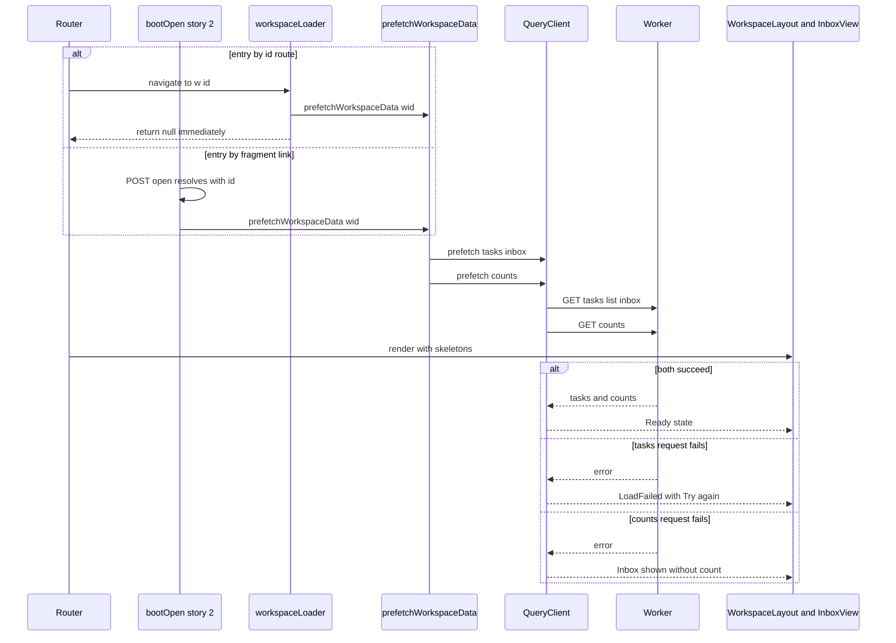
```mermaid
sequenceDiagram
  participant R as Router
  participant B as bootOpen story 2
  participant L as workspaceLoader
  participant P as prefetchWorkspaceData
  participant Q as QueryClient
  participant W as Worker
  participant V as WorkspaceLayout and InboxView
  alt entry by id route
    R->>L: navigate to w id
    L->>P: prefetchWorkspaceData wid
    L-->>R: return null immediately
  else entry by fragment link
    B->>B: POST open resolves with id
    B->>P: prefetchWorkspaceData wid
  end
  P->>Q: prefetch tasks inbox
  P->>Q: prefetch counts
  Q->>W: GET tasks list inbox
  Q->>W: GET counts
  R->>V: render with skeletons
  alt both succeed
    W-->>Q: tasks and counts
    Q-->>V: Ready state
  else tasks request fails
    W-->>Q: error
    Q-->>V: LoadFailed with Try again
  else counts request fails
    W-->>Q: error
    Q-->>V: Inbox shown without count
  end
```

## Implementation
- `apps/web/src/features/workspace/WorkspaceLayout.tsx` (composes story 2's `AppShell` props), `Sidebar.tsx`, `SidebarContent.tsx`, `SidebarNavItem.tsx`, `ResponsiveNav.tsx`. The nav item is memoised and its props are primitives.
- `apps/web/src/features/tasks/queries.ts`: `tasksQuery(wid, {list, projectId?})` and `countsQuery(wid)` build their query options from `queryKeys`. `tasksQuery` sets `placeholderData: keepPreviousData`.
- `apps/web/src/routes/workspaceLoader.ts`: exports `prefetchWorkspaceData(wid)` and `workspaceLoader({params})`, registered as the `loader` of `/w/:id` in story 2's `App.tsx` route table. Story 2's `bootOpen` continuation imports `prefetchWorkspaceData`.
- The Sidebar reads the count with `useQuery({...countsQuery(wid), select: selectInboxCount})`. `selectInboxCount` is hoisted to module level, so the reference is stable and the sidebar re-renders only when the number changes (`rerender-derived-state`).
- **Imports are direct only** (§12, D-43): shadcn components by file; lucide icons by per-icon deep import as allowed by the installed `lucide-react` exports map, enforced by story 2's lint rule. There is **no** `components/icons.ts` barrel. No feature `index.ts` barrels.
- The count badge reserves its width to avoid layout shift (TC-42).

## Tests
- **ui-component** (`apps/web/test/features/workspace/Sidebar.test.tsx`, `apps/web/test/routes/workspaceLoader.test.ts`): TC-40, TC-41, TC-42, TC-91 (the loader starts both requests before either resolves), TC-92 (counts key has no date; invalidating `['ws', wid]` refetches it), TC-126 (slots), TC-140 (`prefetchWorkspaceData` is called from the id-route loader and from the boot-open continuation, once each), TC-134 (QuickAdd in `quickAddSlot` stays typeable offline with only its submit gated).
- **e2e:** TC-80 (count is 1 after the first add), TC-88 (axe).

## Keyboard shortcut registry and ? panel

> Anchor: `shell.shortcuts`

## Contract
`apps/web/src/lib/shortcuts.ts` (owner: story 5, D-14) is the **only** global keydown listener in the app (architecture §12, `client-event-listeners`). It is attached once, lazily, to `document` when the first shortcut registers.

- **`useGlobalShortcut(spec, handler)`** where
  ```ts
  type ShortcutSpec = {
    key: string;                                  // normalised, e.g. 'q', '?', 'z', '/'
    modifiers?: ('mod' | 'shift' | 'alt')[];      // default []; 'mod' = Meta on macOS, Ctrl elsewhere
    scope?: 'global' | 'grid';                    // default 'global'
    allowInOverlay?: boolean;                     // default false
    requiresEdit?: boolean;                       // default false; true for every mutating shortcut (D-10)
    description: string;
    group?: 'Tasks' | 'Navigation' | 'General';
    enabled?: boolean;
  };
  type ShortcutHandler = (e: KeyboardEvent, ctx: { taskId?: string; cell?: 1 | 2 | 3 }) => void;
  ```
  - It registers into a module-level `Map<string, Set<Entry>>` keyed by the normalised key and removes the entry on unmount.
  - The handler is kept in a ref that updates each render, so the registration never churns (`advanced-event-handler-refs`).
- **Scopes:**
  - `global` shortcuts fire wherever focus is (subject to the rules below).
  - `grid` shortcuts fire only when focus is inside a `TaskGrid`. The dispatcher passes `{taskId, cell}` of the focused cell, read from `data-task-id` on the enclosing `role=row` and `data-cell` on the enclosing `role=gridcell`.
- **Overlay scope stack:** `pushOverlayScope(): () => void` and the hook `useOverlayScope(open: boolean)`. Every overlay (the `?` panel here; the detail sheet, pickers, dialogs and the Finder in later stories) calls `useOverlayScope`. While the stack is non-empty, `global` and `grid` shortcuts are suppressed unless their spec sets `allowInOverlay`.
- **Escape:** overlays handle their own keys and call `stopPropagation` on Escape (Radix does this for dialogs; custom overlays must do it), so an Escape that closes an overlay never reaches quick add or the sheet underneath.
- **Dispatcher rules**, in order; the first failing rule ends dispatch:
  1. `event.isComposing` is false;
  2. modifiers match exactly: every listed modifier is held and no other of Ctrl/Meta/Alt is held. Shift is also accepted, without being listed, when the key is itself a shifted character such as `?`;
  3. if `isTypingTarget(event.target)`: a spec with no modifiers (a single-key shortcut) never fires; `{key:'z', modifiers:['mod']}` (and its `shift` redo variant) never fires inside text inputs, where the browser's own text undo applies; other `mod` shortcuts (e.g. ⌘K) fire;
  4. the overlay stack is empty, or the spec has `allowInOverlay`;
  5. the scope matches (`grid` requires focus inside a grid);
  6. `requiresEdit` is false, or `getCanEditSnapshot()` from `features/live/canEdit.ts` is true (D-10: row shortcuts check `canEdit`).

  When more than one entry matches, the most recently registered enabled entry wins, which lets a view override a global one. `preventDefault` is called only when a handler runs.
- **`isTypingTarget(el): boolean`:** true for `input` of text-like types, `textarea`, `select`, and `isContentEditable` elements. It is the single implementation in the app.
- **`listShortcuts(): Array<{keys, description, group, note?}>`:** a snapshot of the registered, enabled entries plus the static grid navigation entries from `describeShortcut()`, used by the help panel.
- **`?` help panel:** `useGlobalShortcut({key:'?', description:'Show keyboard shortcuts', group:'General'}, openHelp)`.
  - It opens `<ShortcutsPanel>`, a shadcn Dialog loaded with story 2's `lazyWithRetry` (D-42). A preload is scheduled with `requestIdleCallback` after first paint, so the first `?` opens instantly (`bundle-dynamic-imports`, `bundle-preload`). It calls `useOverlayScope(true)` while open.
  - It lists the entries grouped, showing keys as `<kbd>`. Escape closes it (propagation stopped) and focus returns to the element that had it.
  - Story 5 registers `Q` (Add task, `global`, not `requiresEdit`: quick add opens offline and stays typeable) and `?`. Grid navigation is handled by `TaskGrid`'s own `onKeyDown` (tasks.list_view) and shown through static `describeShortcut()` entries: ↑/↓ and j/k (Move between tasks), Home/End (First/last task, with the note "Differs from Ctrl+Home/End used in most grids", D-02), ←/→ (Move within a task).
  - Later stories register through the same API: story 6 `E`, `Space`, `Delete`/`Backspace` as `scope:'grid', requiresEdit:true` and `{key:'z', modifiers:['mod'], requiresEdit:true}`; story 7 `M`; story 8 `D`; story 11 `/` and `{key:'k', modifiers:['mod']}`.
- **Errors:** none. An unknown key simply matches nothing.

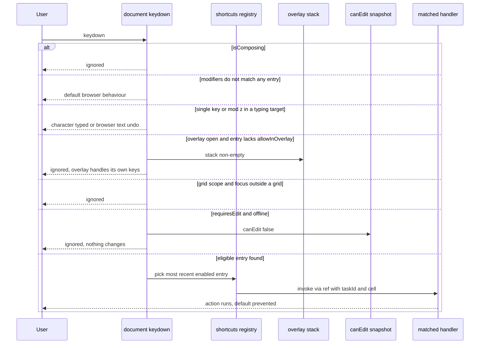
```mermaid
sequenceDiagram
  participant U as User
  participant D as document keydown
  participant R as shortcuts registry
  participant S as overlay stack
  participant C as canEdit snapshot
  participant H as matched handler
  U->>D: keydown
  alt isComposing
    D-->>U: ignored
  else modifiers do not match any entry
    D-->>U: default browser behaviour
  else single key or mod z in a typing target
    D-->>U: character typed or browser text undo
  else overlay open and entry lacks allowInOverlay
    D->>S: stack non-empty
    D-->>U: ignored, overlay handles its own keys
  else grid scope and focus outside a grid
    D-->>U: ignored
  else requiresEdit and offline
    D->>C: canEdit false
    D-->>U: ignored, nothing changes
  else eligible entry found
    D->>R: pick most recent enabled entry
    R->>H: invoke via ref with taskId and cell
    H-->>U: action runs, default prevented
  end
```

## Implementation
- `apps/web/src/lib/shortcuts.ts`: registry, dispatcher, overlay scope stack (`pushOverlayScope`, `useOverlayScope`), `useGlobalShortcut`, `isTypingTarget`, `listShortcuts`, `describeShortcut`.
- `apps/web/src/features/shortcuts/ShortcutsPanel.tsx` (lazy via `lazyWithRetry`), plus `apps/web/src/features/shortcuts/useShortcutsPanel.ts`, which registers `?` and handles the idle preload.
- There is one module and one listener; no separate `useGlobalShortcut.ts` or `isTypingTarget.ts` files.
- `packages/shared/src/limits.ts`: `QUICK_ADD_KEY = 'q'`, `SHORTCUT_HELP_KEY = '?'`.

## Tests
- **unit** (`apps/web/test/lib/shortcuts.test.ts`): TC-46 (isTypingTarget classes), TC-99 (exactly one `document` keydown listener after registering 5 shortcuts), TC-100 (last registered wins; unregister restores the previous one), TC-101 (modifier-array matching: `?` fires with Shift; `q` does not fire with Ctrl, Meta or Alt; `{key:'k', modifiers:['mod']}` fires only with the platform mod key), TC-102 (a handler replaced between renders is called without re-registering), TC-136 (overlay scope stack suppresses global and grid shortcuts; `allowInOverlay` fires), TC-138 (⌘Z not dispatched inside a text input, dispatched from a grid cell; ⌘K dispatched inside a text input), TC-133 (a `requiresEdit` shortcut does not run while `canEdit` is false; a non-edit one does).
- **ui-component:** TC-47..TC-50 (Q guard cases), TC-103 (`?` opens the panel listing Q, ?, the grid keys and the Home/End note; Escape closes it and restores focus), TC-104 (`?` typed inside the quick-add name field inserts '?' and does not open the panel), TC-137 (Escape closing the `?` panel does not close quick add underneath).
- **e2e:** TC-105 (press `?` in a real browser; the panel lists shortcuts; axe passes).

## Phone layout, touch targets and light/dark tokens

> Anchor: `shell.mobile`

## Contract
- **Layout mode** comes from `useIsNarrow()` in **`apps/web/src/lib/useIsNarrow.ts`** (owner: story 5, D-43), backed by `matchMedia('(max-width: 767.98px)')`, where 767.98 = `MOBILE_BREAKPOINT_PX` − 0.02. It is a `useSyncExternalStore` subscription that returns a boolean, so components re-render only when the mode flips. Later stories (the detail sheet, pickers, Finder) import it from this path.
  - Touch capability is CSS-only: `@media (hover: none)`. JS never reads it.
- **Narrow mode** (rendered through story 2's `AppShell` props, D-11):
  - `headerActionsSlot` receives a `☰` button (`aria-label="Open navigation"`, `aria-expanded`, `aria-controls=nav-drawer`).
  - The `sidebar` prop receives the `NavDrawer`: the sidebar content inside a shadcn `Sheet` (side=left, `id=nav-drawer`), which is a Radix Dialog: focus trap, Escape closes (propagation stopped), focus returns to `☰`. It calls `useOverlayScope(open)` (shell.shortcuts).
  - Choosing any nav item closes the drawer and navigates.
  - At or above the breakpoint the drawer is not rendered and the sidebar is inline.
- **`<FloatingAddButton onPress>`:** rendered by `WorkspaceLayout` in AppShell's `quickAddSlot` (not gated, so quick add opens offline; see tasks.quick_add), when narrow **or** under `(hover: none)`. It is fixed to the bottom-right with the safe-area inset, and `aria-label="Add task"`.
  - It opens QuickAdd in **docked mode**: a panel fixed to the bottom, portalled to `document.body`, whose `bottom` offset is `--kb-inset`.
  - `useKeyboardInset()` sets `--kb-inset` = `max(0, innerHeight − visualViewport.height − visualViewport.offsetTop)` on `visualViewport` `resize` and `scroll` events, using passive listeners and a single rAF-throttled write. The panel therefore sits directly above the on-screen keyboard.
  - The button is hidden while QuickAdd is docked open. It stays enabled offline, because quick add opens and stays typeable offline; only its submit is gated (D-10).
- **Touch targets:** under `(hover: none)` every interactive element in the shell, grid cells (checkbox slot, name button, Retry/Discard), quick add, FAB and drawer items has a minimum hit area of `MIN_TOUCH_TARGET_PX` (44) in both dimensions. Smaller visuals use a transparent `::before` hit-area expansion.
- **Theme tokens (D-42):** story 2 owns `packages/shared/src/tokens.ts`, the generator for `styles/tokens.css` and the contrast checker. Story 5 **adds entries only** to `tokens.ts`: sidebar background and active item, row focus ring, row hover, FAB, skeleton, counter warning, failed-row message. The generator emits both light and dark values; story 2's contrast checker verifies every pair story 5 adds (4.5:1 for text, 3:1 for UI boundaries and the focus ring). `prefers-reduced-motion` disables the drawer slide animation.
- **Errors:** none. If `visualViewport` is missing (old browsers), `--kb-inset` stays 0 and the docked panel sits at the bottom edge.

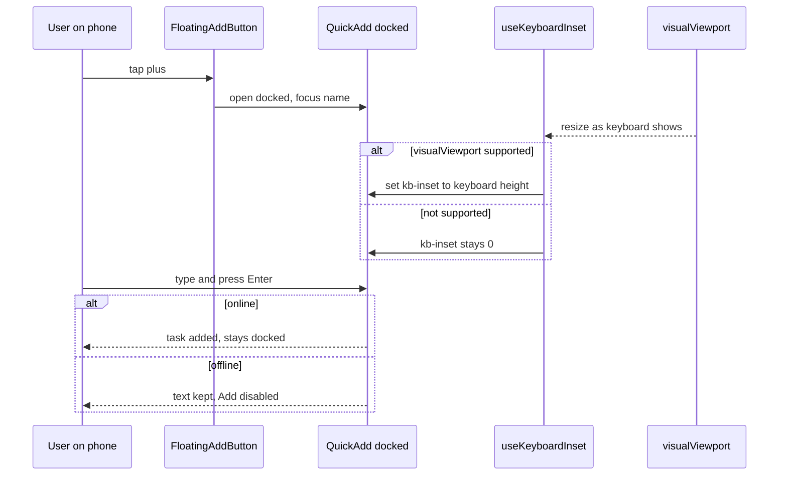
```mermaid
sequenceDiagram
  participant U as User on phone
  participant F as FloatingAddButton
  participant Q as QuickAdd docked
  participant K as useKeyboardInset
  participant VV as visualViewport
  U->>F: tap plus
  F->>Q: open docked, focus name
  VV-->>K: resize as keyboard shows
  alt visualViewport supported
    K->>Q: set kb-inset to keyboard height
  else not supported
    K->>Q: kb-inset stays 0
  end
  U->>Q: type and press Enter
  alt online
    Q-->>U: task added, stays docked
  else offline
    Q-->>U: text kept, Add disabled
  end
```

## Implementation
- `apps/web/src/lib/useIsNarrow.ts`, `apps/web/src/features/workspace/NavDrawer.tsx` (shadcn `Sheet`, imported by direct path), `apps/web/src/features/workspace/FloatingAddButton.tsx`, `apps/web/src/lib/useKeyboardInset.ts`, `apps/web/src/styles/touch.css`; token entries in `packages/shared/src/tokens.ts` (story 2's file; no new colour file, and story 5 does not edit the generated `tokens.css` by hand).
- `packages/shared/src/limits.ts`: `MOBILE_BREAKPOINT_PX = 768`, `MIN_TOUCH_TARGET_PX = 44`. They are also exported to CSS as custom properties by `apps/web/src/styles/constants.css`, generated from `limits.ts` at build time, so there are no duplicated magic numbers.
- `ResponsiveNav` renders `Sidebar` inline or inside `NavDrawer` from the same `SidebarContent` component. There is no duplicate nav markup, and the component is not defined inline (`rerender-no-inline-components`).
- The `visualViewport` listener is registered once per docked open and removed on close (`client-passive-event-listeners`).

## Tests
- **unit:** TC-93 (`useKeyboardInset` computes the inset from a stubbed `visualViewport`; absent API gives 0).
- **ui-component** (`apps/web/test/features/workspace/MobileShell.test.tsx`): TC-94 (width 767 shows `☰` and no inline sidebar; 768 shows inline sidebar and no `☰`), TC-95 (drawer closes on nav selection and focus returns to `☰`), TC-96 (FAB opens docked QuickAdd and FAB hides while open), TC-134 (docked variant: offline, the FAB and the docked fields stay usable, submit disabled).
- **e2e:** TC-97 (iPhone-sized viewport with touch emulation: every button/link/checkbox in shell, grid and quick add has a bounding box of at least 44×44), TC-98 (`colorScheme: 'dark'` renders dark tokens; axe colour-contrast passes in light and dark).

## Extension slots for search (story 11)

Story 11 (Finder search) mounts into the shell. Story 5 only provides the slots and **renders nothing into them**. No search behaviour belongs to story 5.

- `searchSlot?: ReactNode` — story 2's `AppShell` prop (D-11); `WorkspaceLayout` forwards it to `<Sidebar searchSlot>`, which renders it as the first child of `SidebarContent`, above the Inbox entry. That means it appears in both the inline sidebar and the phone `NavDrawer`.
- `headerActionsSlot?: ReactNode` — story 2's `AppShell` prop. `WorkspaceLayout` composes it as the ☰ trigger (narrow only) followed by story 11's node, rendered in the header's trailing action area at every width. Story 11 places its 🔍 button there.
- Shortcuts: story 11 registers `{key:'/'}` and `{key:'k', modifiers:['mod']}` through `useGlobalShortcut` (D-14), so the `?` panel lists them automatically. The Finder calls `useOverlayScope(open)`. No registry change is needed.
- Story 11 reuses `TaskSummary` for result rows (registry, D-01) and `useIsNarrow` from `lib/useIsNarrow.ts`.

Both slots are optional props that default to `null`, so they have no effect in this story. The existing sidebar and mobile tests cover the rendering path with the slots empty. TC-126 (ui-component) asserts that a node passed to each slot renders in the documented position, in both inline and drawer modes.

## Extension points owned by story 5

Per architecture §13 and the registry in `specs/general/CROSS-STORY-RESOLUTIONS.md`, story 5 owns the artefacts below and this section states their **final shape**, including every named extension point used by later stories. An extender that needs something not listed here must edit this section and record a "Delta to story 5" in its own design. Extenders never add primitive props to `TaskRow`, never create a second grid, shortcut listener, focus helper or loader, and never define their own query keys.

## TaskGrid, TaskRow and TaskSummary (D-01, D-06)
| Part | Final shape | Filled by |
|---|---|---|
| `TaskGrid` | `role=grid`, `aria-labelledby` = the view title, one Tab stop, `aria-rowcount` when virtualised; one per view | 5 |
| Rowgroups | `role=rowgroup`, each with a header row (`role=row` > `role=columnheader`, visually hidden where not shown). Prop `groups: Array<{id, label, rows: TaskRowModel[]}>`; story 5 renders one unlabelled group | 8 (Overdue, Today), 6 (Completed) |
| `TaskRow` | `<TaskRow task localStatus?>`, `role=row`, `data-task-id`, `aria-busy` when pending; `React.memo`; `task` keeps its identity (TC-45) | 5 |
| Cell 1 | `role=gridcell data-cell=1`; `checkboxSlot` from row-slot context; story 5 renders an inert glyph | 6 (native checkbox, D-03) |
| Cell 2 (primary) | `role=gridcell data-cell=2`; the name `<button>` (Enter calls `rowActions.open(taskId)`), then `<TaskSummary>` | 5 |
| `TaskSummary` | description preview, `chipSlot` (date chip), `projectSlot` (project tag), status text (pending, failed, rejected, waiting) | 8 (chip, project), 10 (waiting text), 11 (reuses the component in Finder results) |
| Cell 3 (actions) | `role=gridcell data-cell=3`; Retry and Discard when `localStatus ∈ {failed, rejected}` (Retry only for failed); `actionsSlot` | 5 (Retry/Discard), 6 (`…` menu) |
| Offline gating (D-10) | Done once in the cells via `canEdit` in `TaskRowSlotsContext` (read once with `useCanEdit()` in `TaskGrid`): checkbox disabled; name button always enabled (opens detail read-only); `…` trigger enabled, its mutating items disabled; Retry disabled; Discard enabled. There is no fieldset. | 5 (cells, Retry/Discard), 6 (checkbox, `…` items), 7/8 (`…` items) |
| `localStatus` | `'pending' \| 'failed' \| 'rejected' \| 'waiting'` | 10 (`waiting`) |

Slots are supplied once per grid through `TaskRowSlotsContext` (`{checkboxSlot?, chipSlot?, projectSlot?, actionsSlot?, open?, canEdit}`; each slot a stable component taking `{task}`, and `canEdit` the boolean from one `useCanEdit()` read in `TaskGrid`), so rows stay memoised and later stories add cells' contents without new row props.

## Keyboard contract and shortcuts (D-02, D-14)
- `TaskGrid` owns ↑/↓, j/k, Home/End (rows, keeping the column; documented deviation from APG's Ctrl+Home/End), ←/→ (cells, no wrap), and Enter on the name (`rowActions.open`, which story 6 wires to `openTaskDetail(id, {returnFocusTo})`).
- Space and Delete/Backspace act on the row only when focus is in cell 1 or 2; in cell 3 Space presses the focused button. E, M and D work from any cell. Q, ?, / and ⌘K are global.
- `lib/shortcuts.ts`: `useGlobalShortcut({key, modifiers?, scope?, allowInOverlay?, requiresEdit?, description, group?, enabled?}, handler)`, `useOverlayScope`, `isTypingTarget`, `listShortcuts`. Stories 6 (E, Space, Delete, ⌘Z), 7 (M), 8 (D; picker-local keys are overlay-scoped) and 11 (`/`, ⌘K) register through it. Every mutating shortcut sets `requiresEdit` (D-10): Space, Delete, E-commit, M and D no-op offline via `getCanEdit()`; navigation keys always work.

## useTaskGrid (D-04)
`apps/web/src/features/tasks/useTaskGrid.ts` exports `focusTaskRow(id, cell?)`, `getFocusedTaskId()` and `focusAfterRemoval(id)` (next row, else previous, else the add-task control). `TaskGrid` calls `focusAfterRemoval` itself when the focused row disappears from its data for any reason: the user's own action, a collaborator's live event, or an invalidation refetch. Stories 6, 7, 8 and 11 import from here; there is no `focusAfterAction.ts`, `setActiveRow` or list-ref accessor.

## taskCache (D-37, D-38)
`features/tasks/taskCache.ts` pure helpers (`appendOptimistic`, `markStatus`, `replaceWithServer`, `removeLocal`, `applyTaskEvents`, `adjustCount`) and `writeTaskLists(qc, wid, updater, match?)`, which applies an updater through `setQueriesData({queryKey: ['ws', wid, 'tasks']})` to every cached task list whose filters match. Stories 6, 7, 8 and 10 write task lists only through these helpers. Story 5 registers counts invalidation for every `task.*` live event.

## prefetchWorkspaceData (D-39)
`routes/workspaceLoader.ts` `prefetchWorkspaceData(wid)`; called from the `/w/:id` loader and after boot open resolves. Stories 7 (projects) and 8 (today) add their prefetches inside it.

## QuickAdd target and placement (D-40, D-10)
- `target: {kind:'inbox'} | {kind:'project', projectId}` plus `defaultDueDate?: string` (YYYY-MM-DD). Story 7 passes project targets; story 8 passes `{kind:'inbox'}` with `defaultDueDate` from Today, and the chip reads "→ Inbox · Today". `useCreateTask` sends `projectId`/`dueDate` only when present.
- QuickAdd (inline and the FAB's docked sheet) lives in AppShell's `quickAddSlot` / a body portal; its input stays typeable offline and it gates only its submit with `useCanEdit()`. Views in stories 7 and 8 set the target through `QuickAddContext`; they do not render their own QuickAdd.

## Rows CSS (D-07)
`apps/web/src/styles/rows.css`: per-row `content-visibility: auto; contain-intrinsic-size: auto var(--task-row-intrinsic-height)`, on each `role=row`, never on the grid. Story 8 uses it and does not create it.

## Other owned artefacts
- `lib/useIsNarrow.ts` (D-43).
- `CLIENT_ID_BYTES = 16` in `packages/shared/src/limits.ts` (D-44), used by task ids here and project ids in story 7; `lib/ids.ts` `newClientId()`.
- `/test/seed` (D-35; capability tasks.test_seed): schema `{workspaceId, projects?:[{ref,name,color,deleted?}], tasks?:[{name,description?,projectRef?,dueDate?,completedAt?,deleted?,sortOrder?}]}`, bulk-capable for 5,000 tasks. Story 5 implements `name`, `description`, `completedAt`, `deleted`, `sortOrder`; the extension points are `projects[]` and `projectRef` (7), `dueDate` (8) and `completedAt`/`deleted` semantics reused by 6. Unimplemented fields are rejected with 400 `validation` until their story adds them, so tests never silently get the wrong data.

## AppShell props used (owned by story 2)
`sidebar`, `searchSlot`, `headerActionsSlot` (D-11), plus **`quickAddSlot`** — carried by story 2's AppShell design (applied 2026-09-27). AppShell disables nothing; story 5's cells and QuickAdd self-gate.

## Inbox view, task grid, keyboard contract and empty state

> Anchor: `tasks.list_view`

## Contract
- **`<InboxView workspaceId>`:** heading "Inbox" (`id=view-title`), then `<TaskGrid>` of cached tasks in cache order, then the "+ Add task" button or `<QuickAdd target={{kind:'inbox'}}>` at the bottom. On narrow/touch the inline button is replaced by the floating add button (shell.mobile).
- **`<TaskGrid labelledBy groups status onRetry>`** (D-01), where `status` is `'loading' | 'error' | 'ready'`:
  - **`loading`:** `SKELETON_ROW_COUNT` (5) `<SkeletonRow>` elements in an `aria-busy=true` region labelled "Loading tasks" (not a grid). Shown only on first load; background refetches keep the old rows (`placeholderData: keepPreviousData`).
  - **`error`:** "Couldn't load your tasks." with a **Try again** button that calls `refetch()`, in `role=alert`.
  - **`ready` + empty** (and no pending rows): `<EmptyInbox>` with "Your Inbox is clear. Press Q to add a task.", or "Tap + to add a task." under `(hover: none)`, switched with CSS.
  - **`ready`:** `<div role=grid aria-labelledby=view-title>` containing, per group, a `role=rowgroup` with a header row (`role=row` > `role=columnheader`, visually hidden in the Inbox's single group), then `<TaskRow>`s. Story 5 renders one group; stories 8 (Overdue, Today) and 6 (Completed) add groups (see "Extension points owned by story 5"). `aria-rowcount` is set only if the list is ever virtualised.
  - **No `listbox` or `option` role is used anywhere** in the task list, its rows or its tests (D-01).
- **`<TaskRow task localStatus?>`** (D-06): `role=row`, `data-task-id`, `aria-busy=true` when `localStatus==='pending'`. Three cells, each `role=gridcell` with `data-cell`:
  1. **Checkbox cell:** renders `checkboxSlot` from `TaskRowSlotsContext`; in story 5 an inert, `aria-hidden` round glyph inside a focusable cell (`tabIndex=-1`, `aria-label` "Not completed") so ←/→ can land on it. Story 6 replaces the glyph with a native checkbox (D-03).
  2. **Primary cell:** the name as a `<button>` (the accessible name is the task name), then `<TaskSummary task localStatus>`: a one-line muted description preview when non-empty, `chipSlot` and `projectSlot` (story 8), and status text ("Saving…", "Couldn't save this task.", "This task can't be saved.", and story 10's waiting text). Failed/rejected text sits in a `role=alert` element.
  3. **Actions cell:** Retry (only `failed`) and Discard (`failed` or `rejected`) buttons, then `actionsSlot` (story 6's `…` menu). When there are no actions the cell is still present and focusable, so column positions are stable.
- **Offline gating, done once in the cells (D-10; decision 2026-09-27: there is no `<fieldset disabled>` anywhere in the app).** Every control that sends a change gates itself with `useCanEdit()`, and the shared `TaskRow` cells do it once for every grid (Inbox, project, Today, Completed group):
  - **Cell 1 checkbox** (`checkboxSlot`, story 6): disabled while `canEdit` is false.
  - **Cell 2 name button:** **always enabled**; Enter/click opens the detail sheet, which is read-only offline (story 6).
  - **Cell 3 `…` menu trigger** (`actionsSlot`, story 6): enabled; its mutating items (stories 6/7/8) are disabled offline.
  - **Retry:** disabled offline, with the reason in `aria-describedby`.
  - **Discard:** **enabled offline** (local cache removal, no request).
  - **Grid keys:** mutating keys (Space, Delete/Backspace, E-commit, M, D) are registered with `requiresEdit` and no-op offline via `getCanEdit()`; navigation keys (arrows, j/k, Home/End, Tab, Enter to open) always work.
  - A single `useCanEdit()` read in `TaskGrid` is passed down through the stable `TaskRowSlotsContext` value (a boolean, so rows re-render only when it flips); slot components read the same context.
- **Keyboard contract (D-02)**, implemented by `TaskGrid`'s single `onKeyDown` and `useTaskGrid`:

  | Key | Where | Effect |
  |---|---|---|
  | Tab / Shift+Tab | into the grid | lands on the last-focused row, in its name cell (cell 2); the grid is exactly **one** Tab stop; the next Tab leaves the grid |
  | ↑/↓, k/j | any cell | previous/next row, same column; no wrap |
  | Home/End | any cell | first/last row, same column (deliberate deviation from APG's Ctrl+Home/End, listed in the `?` panel) |
  | ←/→ | any cell | previous/next cell in the row; no wrap; inside cell 3, moves between its buttons before leaving the cell |
  | Enter | name button | `rowActions.open(taskId)` — story 6 wires `openTaskDetail(id, {returnFocusTo})`; a no-op in story 5 |
  | Space, Delete/Backspace | cells 1–2 | dispatched to `grid`-scoped shortcuts (story 6); nothing registered in story 5 |
  | Space / Enter | a button in cell 3 | native button press (Retry/Discard/`…`); never a row action |
  | E, M, D | any cell | `grid`-scoped shortcuts of stories 6, 7, 8 |
  | Q, ?, /, ⌘K | anywhere | global shortcuts |

  Every mutating key (Space, Delete/Backspace, E-commit, M, D) is registered with `requiresEdit` and no-ops while `getCanEdit()` is false (D-10); navigation keys always work. Retry is disabled offline; Discard stays enabled; the name button stays enabled (see the offline gating bullet above).
- **`useTaskGrid`** (D-04), `apps/web/src/features/tasks/useTaskGrid.ts`:
  - `focusTaskRow(id, cell = 2)`, `getFocusedTaskId(): string | null`, `focusAfterRemoval(id)`.
  - Roving tabindex across the whole grid: exactly one focusable element has `tabIndex=0` (the active cell's focus target); every other cell and in-cell control has `-1`.
  - The active `{taskId, cell}` lives in a **ref**. Moving focus rewrites `tabIndex` on only the old and new DOM nodes and calls `.focus()`. **No row re-renders on navigation**, and there is no `isFocused` prop.
  - `focusAfterRemoval(id)` focuses the same column in the next row, else the previous row, else the "+ Add task" control (or the FAB when narrow).
  - **Remote removals:** `TaskGrid` compares the rendered row ids with the previous render in a layout effect; if the active row's id vanished (a collaborator's live event, an invalidation refetch, or the user's own action in another story), it calls `focusAfterRemoval` with the vanished id's previous index — but only if focus was inside the grid, so a remote change never steals focus from elsewhere.
  - The focused cell shows a visible focus ring meeting 3:1 contrast (token from shell.mobile).
- **Errors:** the load error is handled as above. Empty `tasks` together with `status=error` shows the error, not the empty state.

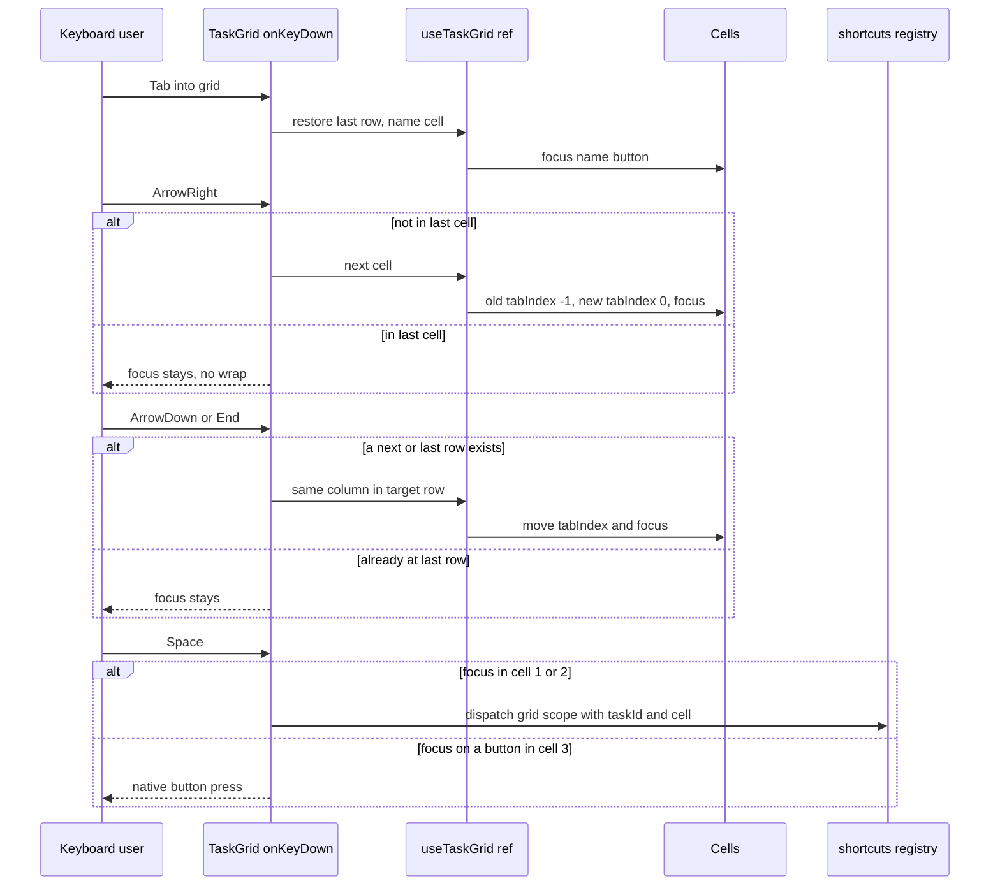
```mermaid
sequenceDiagram
  participant U as Keyboard user
  participant G as TaskGrid onKeyDown
  participant T as useTaskGrid ref
  participant DOM as Cells
  participant S as shortcuts registry
  U->>G: Tab into grid
  G->>T: restore last row, name cell
  T->>DOM: focus name button
  U->>G: ArrowRight
  alt not in last cell
    G->>T: next cell
    T->>DOM: old tabIndex -1, new tabIndex 0, focus
  else in last cell
    G-->>U: focus stays, no wrap
  end
  U->>G: ArrowDown or End
  alt a next or last row exists
    G->>T: same column in target row
    T->>DOM: move tabIndex and focus
  else already at last row
    G-->>U: focus stays
  end
  U->>G: Space
  alt focus in cell 1 or 2
    G->>S: dispatch grid scope with taskId and cell
  else focus on a button in cell 3
    G-->>U: native button press
  end
```

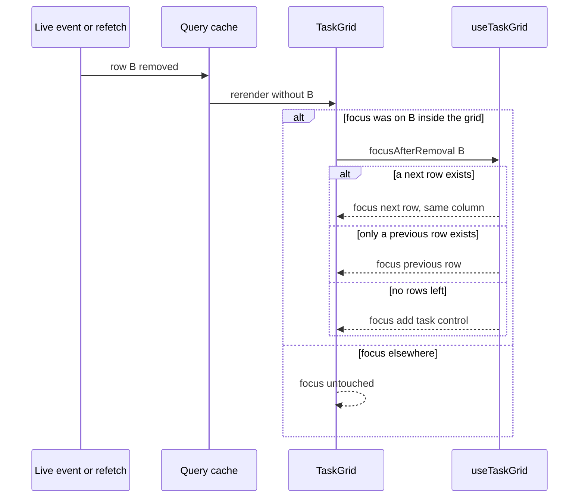
```mermaid
sequenceDiagram
  participant L as Live event or refetch
  participant C as Query cache
  participant G as TaskGrid
  participant T as useTaskGrid
  L->>C: row B removed
  C->>G: rerender without B
  alt focus was on B inside the grid
    G->>T: focusAfterRemoval B
    alt a next row exists
      T-->>G: focus next row, same column
    else only a previous row exists
      T-->>G: focus previous row
    else no rows left
      T-->>G: focus add task control
    end
  else focus elsewhere
    G-->>G: focus untouched
  end
```

## Implementation
- `apps/web/src/features/tasks/InboxView.tsx`, `TaskGrid.tsx`, `TaskRow.tsx`, `TaskSummary.tsx`, `TaskRowSlotsContext.ts`, `SkeletonRow.tsx`, `EmptyInbox.tsx`, `useTaskGrid.ts`, `gridNav.ts` (pure next-position maths).
- `apps/web/src/styles/rows.css` (owner: story 5, D-07): per-row `content-visibility: auto; contain-intrinsic-size: auto var(--task-row-intrinsic-height)` on each `role=row`, never on the grid (§12). Off-screen rows skip layout and paint.
- `packages/shared/src/limits.ts`: `SKELETON_ROW_COUNT = 5`, `TASK_ROW_INTRINSIC_HEIGHT_PX = 44`, `GRID_PRIMARY_CELL = 2`.
- **Memoisation:**
  - `TaskRow` is wrapped in `React.memo`; its props are the task object (whose identity is preserved by taskCache) and the `localStatus` primitive.
  - Row callbacks (`retry`, `discard`, `open`) come from a stable context value built once with `useMemo` over stable mutation functions, not inline lambdas (`rerender-memo`, TC-45). Slot components come from `TaskRowSlotsContext`, also stable.
- The grid renders from `useDeferredValue(tasks)`, so bursts of live or optimistic updates don't block typing in quick add (§12).
- The `EmptyInbox` illustration SVG is a module-level constant (`rendering-hoist-jsx`). Conditionals use ternaries (`rendering-conditional-render`).
- `key={task.id}` is stable because ids are client-generated, so an optimistic row does not re-mount when the server response arrives.
- Replaces the withdrawn `TaskList.tsx` and `useRovingList.ts`.

## Tests
- **unit** (`apps/web/test/features/tasks/gridNav.test.ts`): TC-106 (next-position maths: rows clamp at both ends keeping the column; cells clamp at both ends; `focusAfterRemoval` picks next, else previous, else the add control).
- **ui-component** (`apps/web/test/features/tasks/TaskGrid.test.tsx`, `TaskGridKeyboard.test.tsx`): TC-43, TC-44, TC-45, TC-107, TC-108, TC-109, TC-110, TC-111, TC-112, TC-113 (grid roles), TC-127 (Tab visits exactly one element in the grid), TC-128 (←/→ between cells, no wrap), TC-129 (↑/↓/Home/End keep the column), TC-130 (Space/Delete dispatched only from cells 1–2; Space on Retry presses Retry), TC-131 (Enter on the name calls `rowActions.open`), TC-132 (remote removal of the focused row moves focus; removal while focus is elsewhere leaves focus alone), TC-135 (offline cell gating: Discard works, Retry disabled, name button enabled).
- **e2e:** TC-80, TC-81, TC-85, TC-88 (axe on a grid with a failed row now expected to pass), TC-114.

## Inline quick add and Q shortcut

> Anchor: `tasks.quick_add`

## Contract
- **Opening:**
  - `InboxView` registers `useGlobalShortcut({key: QUICK_ADD_KEY, description:'Add task', group:'Tasks'}, open)` through shell.shortcuts (scope `global`, not `requiresEdit`: quick add opens offline so the user can type). There is no per-component `document` listener.
  - The "+ Add task" button (desktop) and the FloatingAddButton (phone, shell.mobile) open the same component. Neither is gated, so quick add opens offline.
- **Placement and gating (D-10; decision 2026-09-27: there is no `<fieldset disabled>` anywhere in the app):** QuickAdd's fields are never disabled; it gates only its submit with `useCanEdit()`.
  - **Inline mode:** `WorkspaceLayout` passes QuickAdd (with the "+ Add task" button) to AppShell's `quickAddSlot`, which AppShell renders directly after the main region, so it appears below the grid. `quickAddSlot` is an AppShell prop owned by story 2.
  - **Docked mode:** the FAB's bottom sheet is portalled to `document.body`.
  - The open/closed state still lives in `InboxView`'s context provider (lifted to `WorkspaceLayout`), so Q, the button and the FAB share it.
- **`<QuickAdd target mode>`** (owner: story 5, D-40):
  - `target` is `{kind:'inbox'} | {kind:'project', projectId: string}`, plus optional `defaultDueDate?: string` (YYYY-MM-DD) on either kind. Story 7 passes project targets; story 8 passes `{kind:'inbox', defaultDueDate: today}` from the Today view. **There is no `today` kind.**
  - `mode` is `'inline' | 'docked'`.
  - It is a form with `aria-label="Add task"` containing, in DOM and Tab order:
    1. a name `<input>` with a visually hidden label "Task name" and placeholder "Task name";
    2. a description `<textarea>` with the label "Description", auto-growing up to 6 lines;
    3. the destination chip;
    4. the Add button and the Cancel button.
  - **No `maxLength` attribute** on either field; nothing is ever truncated (prd.no_truncation).
- **Destination chip**: a non-focusable `<span>` whose label is computed by the pure `destinationLabel(target, projectName?)`:
  - `{kind:'inbox'}` → "→ Inbox";
  - `{kind:'inbox', defaultDueDate}` (from Today) → "→ Inbox · Today";
  - `{kind:'project'}` → "→ {project name}" with its colour dot; the project name is looked up by story 7 and passed in.

  The form's `aria-describedby` includes the chip, so screen readers hear "Adding to Inbox".
- **Length feedback**, per field. The limit is `TASK_NAME_MAX` for the name and `TASK_DESCRIPTION_MAX` for the description; the warning threshold is `ceil(limit * LENGTH_WARNING_RATIO)`, which is 450 for the name and 4,500 for the description.
  - **Below the threshold:** no counter.
  - **From the threshold up to the limit:** counter "N characters left", with `aria-live=polite`, throttled to announce at most once per second.
  - **Above the limit:**
    - The counter reads "N characters over" in the destructive colour, with a warning icon (colour is never the only signal).
    - The field gets `aria-invalid=true` and `aria-describedby` pointing to the counter.
    - Add is disabled.
  - Length is measured with `String.length` (UTF-16 code units), matching the server's zod check.
- **Keys:**
  - **Name field:** Enter submits when submission is allowed, otherwise it does nothing. Tab moves to Description.
  - **Description field:** plain Enter inserts a newline. Shift+Tab returns to Name.
  - **Either field:**
    - ⌘+Enter or Ctrl+Enter submits when allowed.
    - Enter while `isComposing` is always ignored (IME).
    - Escape closes the box, discards the typed text, and returns focus to the element that opened it (the "+ Add task" button, the FAB, or via `useTaskGrid.focusTaskRow` the previously focused row). An Escape that an overlay above has already handled never arrives here (overlays stop propagation, D-14).
- **Submission is allowed only when:**
  - `name.trim()` is non-empty; **and**
  - neither field is over its limit; **and**
  - `useCanEdit()` is true.
- **Offline (D-10):** QuickAdd gates **only its submit**. While `canEdit` is false, the fields stay enabled and typeable and keep their text; the Add button is disabled and shows the reason via `aria-describedby` ("You're offline. Your text is kept."); Enter and ⌘/Ctrl+Enter do nothing. When `canEdit` returns to true, Add re-enables with the text intact.
- **On submit:**
  1. Call `createTask({id: newClientId(), name: name.trim(), description, target})`. `useCreateTask` sends `projectId` when `target.kind==='project'` and `dueDate` when `defaultDueDate` is set.
  2. Clear both fields synchronously.
  3. Refocus the name field. The box stays open (prd.quick_add_stays_open).
- **Docked mode** (phone) renders the same form in a fixed bottom panel above the keyboard, using `--kb-inset` from shell.mobile. All behaviour is identical, including offline gating.
- **Errors:** none are raised by the component; save errors are handled by tasks.client_cache.

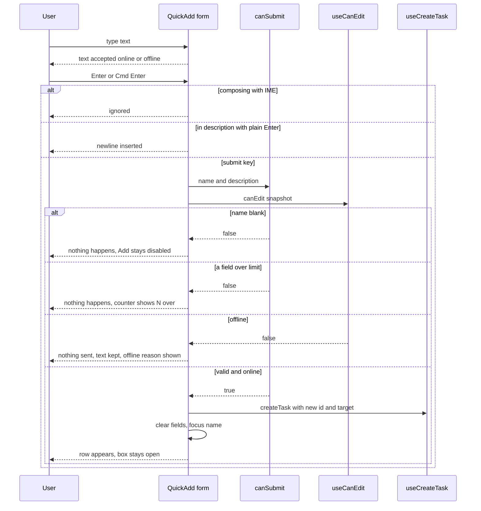
```mermaid
sequenceDiagram
  participant U as User
  participant F as QuickAdd form
  participant V as canSubmit
  participant E as useCanEdit
  participant H as useCreateTask
  U->>F: type text
  F-->>U: text accepted online or offline
  U->>F: Enter or Cmd Enter
  alt composing with IME
    F-->>U: ignored
  else in description with plain Enter
    F-->>U: newline inserted
  else submit key
    F->>V: name and description
    F->>E: canEdit snapshot
    alt name blank
      V-->>F: false
      F-->>U: nothing happens, Add stays disabled
    else a field over limit
      V-->>F: false
      F-->>U: nothing happens, counter shows N over
    else offline
      E-->>F: false
      F-->>U: nothing sent, text kept, offline reason shown
    else valid and online
      V-->>F: true
      F->>H: createTask with new id and target
      F->>F: clear fields, focus name
      F-->>U: row appears, box stays open
    end
  end
```

## Implementation
- `apps/web/src/features/tasks/QuickAdd.tsx`, `QuickAddContext.tsx` (open state and return-focus ref, provided by `WorkspaceLayout`), `LengthCounter.tsx`, `DestinationChip.tsx`, `destinationLabel.ts` (pure), `canSubmit.ts` (pure).
- `apps/web/src/lib/ids.ts`: `newClientId()` returns `CLIENT_ID_BYTES` (16) bytes from `crypto.getRandomValues` as lowercase hex (D-44). Story 7 uses it for project ids.
- `packages/shared/src/limits.ts`: `LENGTH_WARNING_RATIO = 0.9`, `COUNTER_ANNOUNCE_THROTTLE_MS = 1_000`, `QUICK_ADD_MAX_DESCRIPTION_ROWS = 6`.
- `lengthStatus(len, limit) -> 'normal'|'near'|'over'` and `canSubmit(name, description, canEdit)` are pure functions in `canSubmit.ts`. They are derived during render, never synced through an effect (`rerender-derived-state-no-effect`).
- Submit, clear and refocus all happen in the event handler, not an effect (`rerender-move-effect-to-event`). The field updates use functional setState, and focus goes through a ref.
- The fields' values live in QuickAdd's own state; it is not unmounted when `canEdit` changes, so reconnecting never resets them.

## Tests
- **unit** (`apps/web/test/features/tasks/canSubmit.test.ts`, `destinationLabel.test.ts`): TC-115 (`lengthStatus` boundaries; `canSubmit` false for a blank name, a 501-char name, a 5,001-char description, or `canEdit=false`), TC-141 (`destinationLabel`: inbox → "→ Inbox"; inbox with `defaultDueDate` → "→ Inbox · Today"; project → "→ Work").
- **ui-component** (`apps/web/test/features/tasks/QuickAdd.test.tsx`): TC-51..TC-54, TC-55..TC-59, TC-116, TC-117, TC-118, TC-119, TC-120, TC-134 (offline inside the real AppShell: the input accepts typing, submit is disabled, and the text is preserved after reconnect; the document contains no fieldset), TC-142 (project target and `defaultDueDate` are sent as `projectId`/`dueDate` in the POST body).
- **e2e:** TC-80, TC-84, TC-86, TC-87, TC-88, TC-147 (offline in a real browser: `context.setOffline(true)`, type, Add disabled, `setOffline(false)`, Add enabled with the text intact, submit saves it).

## Optimistic create, failure recovery and cache updates

> Anchor: `tasks.client_cache`

## Contract
- **`useCreateTask(workspaceId)`** returns `createTask(input)`, `retry(id)` and `discard(id)`.
  - **`createTask`:**
    - In `onMutate`, synchronously appends a local task `{...fields, localStatus: 'pending'}` to every cached task list the new task belongs to, through `writeTaskLists(qc, wid, l => appendOptimistic(l, task), matchesTarget(target))`, which uses **`setQueriesData` on the prefix `['ws', wid, 'tasks']`** (D-37). A list matches when its key's `list`/`projectId` equals the target (Inbox target → `list:'inbox'` keys, whatever their `includeCompleted`). It also increments `inbox` in `queryKeys.counts(wid)` through `setQueriesData`.
    - POSTs with `AbortSignal.timeout(CREATE_TASK_TIMEOUT_MS)`.
    - Cache writes happen only in `onMutate`, `onSuccess` and `onError`, never in render or an effect (§12).
  - **Outcomes of the POST:**

    | Response | Row becomes | Count | Text |
    |---|---|---|---|
    | 201 or 200 | replaced in place by the server task (no `localStatus`) | unchanged | n/a |
    | network error, timeout, 5xx, 403, 404 | `localStatus: 'failed'` | decremented | kept |
    | 400, 409, 410 | `localStatus: 'rejected'` | decremented | kept |
    | 429 `rate_limited` | story 10: `localStatus: 'waiting'`, scheduled retry, then `failed` if retries run out (D-24, D-33) | story 10 | kept |

  - **`retry(id)`:** only for `failed` rows and only while `canEdit` is true. Sets `pending`, increments the count, and re-POSTs the **same** id and body.
  - **`discard(id)`:** removes the local row from every matching list. No request, so it works offline (D-10).
- **`localStatus`** is `'pending' | 'failed' | 'rejected' | 'waiting'` (D-06). Story 5 declares the whole union; story 10 produces `waiting`.
- **Row accessibility** (rendered in `TaskRow`'s primary and actions cells, tasks.list_view):
  - A pending row has `aria-busy=true`.
  - A failed row shows "Couldn't save this task." in an element with `role=alert` (announced immediately), plus Retry and Discard buttons in the actions cell.
  - A rejected row shows "This task can't be saved." with `role=alert`, and Discard only.
  - Offline: Retry is disabled with the reason in `aria-describedby`; Discard stays enabled.
- **Live integration** (story 4's `registerLiveHandler`, a `Map<type, Set<fn>>` registry; one handler among several, never replacing another):
  - `task.upserted` → `writeTaskLists(qc, wid, l => applyTaskEvents(l, batch))`. Story 4 delivers events **batched per animation frame**, so `applyTaskEvents(list, events[])` receives the whole batch. It builds **one** `Map<id, index>` over the cached list (O(n + k), `js-index-maps`). Then, per event: replace in place when `event.version > cached.version`; ignore when the version is lower or equal; insert new ids in `sortOrder` position. It returns the same array reference when nothing changed.
  - **Counts freshness (D-38):** story 5 registers `invalidateQueries({queryKey: queryKeys.counts(wid)})` for **every** `task.*` event type (`task.upserted`, `task.deleted`, `task.restored`) and for `tasks.bulk`, coalesced to one invalidation per animation-frame batch. Story 6 adds optimistic count changes for its own mutations.
  - Events with `originClientId === clientId` are already dropped by story 4's dispatcher.
  - Rows that disappear from a list for any reason are handled by `TaskGrid`'s remote-removal focus rule (tasks.list_view, D-04).
- **Retry rule (amended, D-24):** "No automatic retry after failures; scheduled retry after a rate-limit wait is the only exception." The user decides after any failure, so a flaky network cannot silently multiply requests. The exception is owned and implemented by story 10, only for 429 responses with `Retry-After`, and relies on this story's idempotent create.

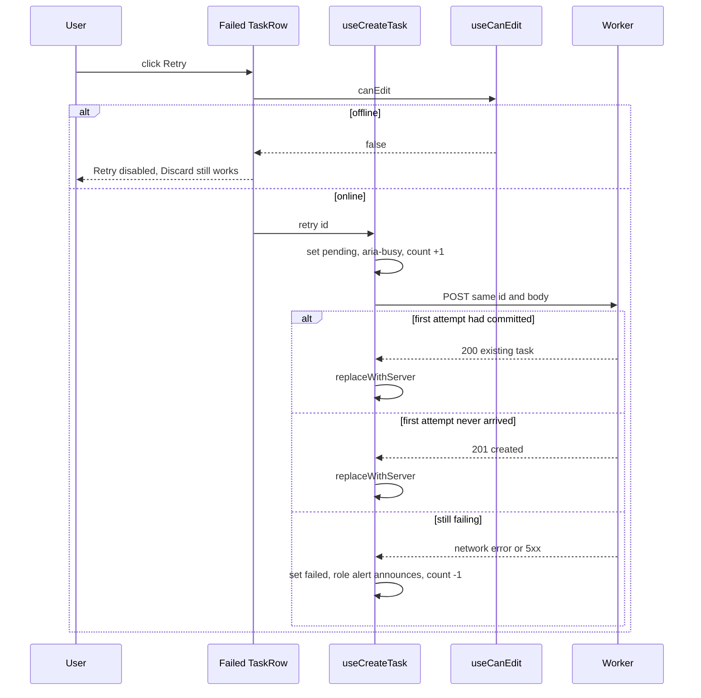
```mermaid
sequenceDiagram
  participant U as User
  participant Row as Failed TaskRow
  participant H as useCreateTask
  participant E as useCanEdit
  participant W as Worker
  U->>Row: click Retry
  Row->>E: canEdit
  alt offline
    E-->>Row: false
    Row-->>U: Retry disabled, Discard still works
  else online
    Row->>H: retry id
    H->>H: set pending, aria-busy, count +1
    H->>W: POST same id and body
    alt first attempt had committed
      W-->>H: 200 existing task
      H->>H: replaceWithServer
    else first attempt never arrived
      W-->>H: 201 created
      H->>H: replaceWithServer
    else still failing
      W-->>H: network error or 5xx
      H->>H: set failed, role alert announces, count -1
    end
  end
```

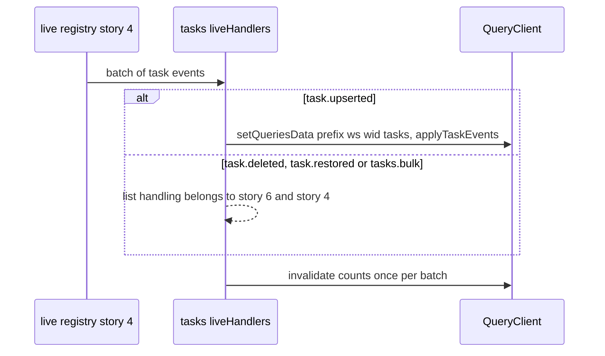
```mermaid
sequenceDiagram
  participant R as live registry story 4
  participant LH as tasks liveHandlers
  participant QC as QueryClient
  R->>LH: batch of task events
  alt task.upserted
    LH->>QC: setQueriesData prefix ws wid tasks, applyTaskEvents
  else task.deleted, task.restored or tasks.bulk
    LH-->>LH: list handling belongs to story 6 and story 4
  end
  LH->>QC: invalidate counts once per batch
```
Discard needs no sequence diagram: it is a local cache removal with no network call and no branch (TC-63, TC-67, TC-135).

## Implementation
- **`apps/web/src/features/tasks/taskCache.ts`:** pure, immutable helpers `appendOptimistic`, `markStatus`, `replaceWithServer`, `removeLocal`, `applyTaskEvents` and `adjustCount`, plus `writeTaskLists(qc, wid, updater, match?)` (the single `setQueriesData` entry point on `['ws', wid, 'tasks']`). They return new arrays while keeping the references of untouched items, which the TaskRow memo relies on.
- **`apps/web/src/features/tasks/useCreateTask.ts`:**
  - Uses TanStack `useMutation`, with `onMutate`, `onError` and `onSuccess` calling the helpers.
  - Updates counts through `setQueriesData({queryKey: queryKeys.counts(wid)})`.
  - The mutation's `mutationKey` includes the task id, so retries of different tasks don't interfere.
  - Exposes the per-id request body so story 10's scheduler can re-send it unchanged.
- **`apps/web/src/features/tasks/liveHandlers.ts`:** registers the `task.upserted` handler and the counts invalidation for all `task.*` and `tasks.bulk` events once, at workspace mount.
- **`packages/shared/src/limits.ts`:** `CREATE_TASK_TIMEOUT_MS = 10_000`.
- **`apps/web/src/features/tasks/TaskRow.tsx` / `TaskSummary.tsx`:** render the pending, failed and rejected UI from `localStatus`.
- **`apps/web/test/msw/tasks.ts`:** MSW handlers built from the shared schemas.

## Tests
- **unit** (`apps/web/test/features/tasks/taskCache.test.ts`): TC-60..TC-64, TC-121, TC-122, TC-143 (`writeTaskLists` updates every matching `['ws', wid, 'tasks', …]` key — `includeCompleted` true and false — and leaves non-matching lists untouched).
- **ui-component** (`apps/web/test/features/tasks/useCreateTask.test.tsx`, `liveHandlers.test.tsx`): TC-65..TC-71, TC-123, TC-124, TC-135 (offline: Discard removes a failed row with no request; Retry disabled), TC-139 (`task.upserted`, `task.deleted`, `task.restored` and `tasks.bulk` each invalidate counts; a burst in one frame invalidates once).
- **e2e:** TC-82, TC-83, TC-90.

