# Technical Design

Complete/reopen/edit/delete/restore task endpoints (soft delete, idempotent no-ops, live broadcasts) plus a React task row, lazy detail sheet, confirmation-free delete with a 10 s pausable undo toast and Cmd/Ctrl+Z, focus management, remembered show-completed toggle, mobile/touch layout and announcements, following architecture.md sections 4-12.

## Overview

## Scope
Story 6 adds the full post-creation lifecycle of a task: complete, reopen, edit name/description, soft delete, restore (undo), viewing completed tasks, and the keyboard, focus, touch, offline and announcement behaviour around them. It builds on:
- Story 1: Worker skeleton, `finalizeResponse`, request validation (JSON Content-Type only when a body is present; `X-Todoodle-Client` always required on mutations; 415 for a non-JSON body), the `/test/*` registry in `apps/api/src/routes/test.ts` (story 6 registers `/test/tasks/:id/raw` there, D-35), test runners and the Playwright matrix (D-36).
- Story 2: `workspaces` table, `workspace-auth` middleware (cookie `tdl_ws`, 404 on miss), `lib/queryKeys.ts` (`queryKeys.tasks(wid, {list, projectId?, includeCompleted})`, `queryKeys.counts(wid)`, D-37), `lib/errors.ts` (`GoneError{entity}` registered by story 4, D-20), `features/shell/AppShell.tsx` with header, main and named slots and no fieldset (D-11; every control that sends a change self-gates with `useCanEdit()`), `NAME_HINT_MS` in `limits.ts` (D-44), `lazyWithRetry` (D-42).
- Story 4: `WorkspaceRoom` DO, `broadcast(c, wid, event)` which calls `waitUntil` itself (D-26), live registry `registerLiveHandler(type, fn)`, `useEditGuard({key, fields, entityLabel, save})` (D-18), `features/live/canEdit.ts` `useCanEdit()` (D-10).
- Story 5: `tasks` table (`0002_tasks.sql` already has `completed_at`, `version`, `deleted`, `deleted_at`, `sort_order`), `GET /api/w/:workspaceId/tasks`, the **APG layout grid** `TaskGrid`/`TaskRow task localStatus?`/`TaskSummary` with cell slots (D-01, D-06), `features/tasks/useTaskGrid.ts` (`focusTaskRow`, `getFocusedTaskId`, `focusAfterRemoval`, D-04), `lib/shortcuts.ts` (`useGlobalShortcut({key, modifiers?, scope?, allowInOverlay?, description})`, overlay scope stack, `isTypingTarget`, `?` panel, D-14), counts invalidation on every `task.*` event (D-38), `/test/seed` (D-35), quick add.

All decisions follow `docs/architecture.md` sections 4-13; sections 12 and 13 are binding, and `specs/general/CROSS-STORY-RESOLUTIONS.md` (D-01..D-46) overrides older text. **No new migration.**

## Owner decisions applied (2026-09-25)
- **Single-task delete has no confirmation dialog.** Undo is the safeguard. The former `DeleteTaskDialog` is removed from this story.
- **`UNDO_WINDOW_MS = 10_000`**, paused while the toast is hovered or focused; Cmd/Ctrl+Z triggers the most recent visible undo.

## Cross-story resolutions applied (2026-09-27)
| Decision | Effect on this story |
|---|---|
| D-01, D-06 | Story 6 renders into story 5's grid cells: `TaskCheckbox` in cell 1, `TaskActionsMenu` in cell 3 (beside story 5's Retry/Discard), and adds the **Completed** `role=rowgroup`. `TaskRow` keeps story 5's props `<TaskRow task localStatus?>`; no primitive props are added. |
| D-02 | Space and Delete/Backspace act only when focus is in cell 1 or 2; on a cell-3 button Space presses the button. E works from any cell. Enter on the name button opens the detail sheet. |
| D-03 | The checkbox is a native `<input type=checkbox>`, accessible name = task name, "Complete"/"Reopen" via `aria-describedby`. No `role=button` + `aria-checked`. |
| D-04 | `focusAfterAction.ts` and `setActiveRow` are deleted. Focus uses story 5's `useTaskGrid`; the next/previous/add-task selection test belongs to story 5 (TC-U13 re-scoped, see test strategy). |
| D-05 | `openTaskDetail(id, {returnFocusTo})` is exported and callable without an anchored row (Finder, story 11). |
| D-10 | "Show completed" toggle sits in the view header, is not gated and works offline. The detail sheet (portalled) opens read-only offline with fields disabled via `useCanEdit()`. Row shortcuts and Undo check `canEdit`. |
| D-14 | ⌘/Ctrl+Z registers as `useGlobalShortcut({key:'z', modifiers:['mod'], scope:'global', description:'Undo'})`; row keys use `scope:'grid'`; none set `allowInOverlay`. |
| D-18 | Detail sheet calls `useEditGuard({key, fields, entityLabel:'task', save})`. |
| D-26 | Routes call `broadcast(c, wid, event)`; no extra `waitUntil`. |
| D-29 | Story 6's no-op/deleted rules are the pattern (confirmed in cap-delete/cap-restore). |
| D-31 | Story 6 owns `include_completed=true|false`. |
| D-38 | Optimistic count deltas on complete, reopen, delete, restore. |
| D-41 | `showUndoToast({message, onUndo})` (renamed from `inverse`). |
| D-43 | File names: `features/tasks/TaskActionsMenu.tsx`, `features/tasks/TaskDetailSheet.tsx`, `features/tasks/mutations.ts`; story 6 owns `packages/shared/src/dates.ts`. |
| D-44 | `NAME_HINT_MS` is imported from story 2; story 6 no longer defines it. |
| D-35 | `/test/tasks/:id/raw` is registered in story 1's registry. |

## Key decisions
1. **Completion does not touch `sort_order`**, so reopen returns the task to its original position (prd.reopen).
2. **Idempotent no-ops (D-29 pattern owner).** Completing a completed task, reopening an open task, deleting a deleted task (204), and restoring a non-deleted task (200) succeed without bumping `version` or broadcasting. There is no `not_deleted` error.
3. **Deleted is terminal for mutations except restore**: complete/reopen/PATCH on a soft-deleted task return 410 `{error:'gone', entity:'task'}`.
4. **Undo is a server inverse, not a delayed commit.** The server applies the change immediately (collaborators see it live); Undo calls `reopen` or `restore`. The 10 s window is UI only; the server accepts `restore` any time.
5. **Blank name keeps the previous name** on server and client; the client also shows a transient hint for story 2's `NAME_HINT_MS`.
6. **Retention:** no hard delete path; `docs/ops/recover-deleted-task.md` documents operator recovery.
7. **Frontend conventions (architecture 12):** query keys from `queryKeys.ts`; live handlers via `registerLiveHandler`; shortcuts via story 5's `useGlobalShortcut` with scopes (no second listener, no second `isTypingTarget`); focus via story 5's `useTaskGrid` (no own focus module, no `isFocused` prop); dates by cached `Intl` formatters in `packages/shared/src/dates.ts` (no `date-fns`); detail sheet lazy via `lazyWithRetry` with preload; per-row `content-visibility` stays in story 5's `styles/rows.css`.
8. **Completion feedback:** checkbox ticks instantly (optimistic), row removal is delayed by `COMPLETE_ANIMATION_MS = 250` unless `prefers-reduced-motion: reduce`, in which case removal is immediate.
9. **Offline gating (D-10; there is no fieldset anywhere in the app):** every control that sends a change gates itself. Story 5's TaskRow cells gate once: the cell-1 checkbox is disabled offline, the name button stays enabled (opens the sheet read-only), the cell-3 `…` trigger stays enabled while its mutating items (Delete) are disabled. Portalled surfaces (detail sheet, undo toast, actions-menu content) and keyboard handlers read `useCanEdit()` / `getCanEdit()` themselves.

## New constants (`packages/shared/src/limits.ts`)
`UNDO_WINDOW_MS = 10_000` (changed), `COMPLETE_ANIMATION_MS = 250`. `NAME_HINT_MS` is story 2's (D-44). `MOBILE_BREAKPOINT_PX` and `MIN_TOUCH_TARGET_PX` come from architecture 12.

## Structure: current (after stories 4 and 5)
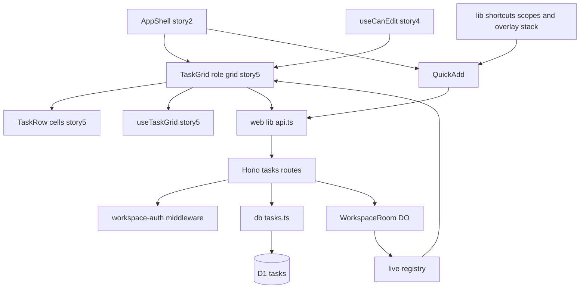
```mermaid
flowchart TD
  Shell[AppShell story2]
  Grid[TaskGrid role grid story5]
  TaskRow[TaskRow cells story5]
  GridFocus[useTaskGrid story5]
  QuickAdd[QuickAdd]
  Shortcuts[lib shortcuts scopes and overlay stack]
  CanEdit[useCanEdit story4]
  Registry[live registry]
  Api[web lib api.ts]
  Router[Hono tasks routes]
  Auth[workspace-auth middleware]
  DbTasks[db tasks.ts]
  D1[(D1 tasks)]
  Room[WorkspaceRoom DO]
  Shell --> Grid
  Shell --> QuickAdd
  Grid --> TaskRow
  Grid --> GridFocus
  Shortcuts --> QuickAdd
  CanEdit --> Grid
  QuickAdd --> Api
  Grid --> Api
  Registry --> Grid
  Api --> Router
  Router --> Auth
  Router --> DbTasks
  DbTasks --> D1
  Router --> Room
  Room --> Registry
```

## Structure: target (after story 6)
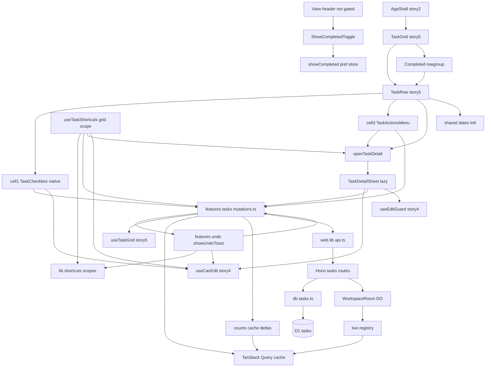
```mermaid
flowchart TD
  Header[View header not gated]
  Toggle[ShowCompletedToggle]
  Pref[showCompleted pref store]
  Shell[AppShell story2]
  Grid[TaskGrid story5]
  Completed[Completed rowgroup]
  TaskRow[TaskRow story5]
  Cell1[cell1 TaskCheckbox native]
  Cell3[cell3 TaskActionsMenu]
  Open[openTaskDetail]
  Detail[TaskDetailSheet lazy]
  GridFocus[useTaskGrid story5]
  Shortcuts[lib shortcuts scopes]
  RowKeys[useTaskShortcuts grid scope]
  Undo[features undo showUndoToast]
  Mut[features tasks mutations.ts]
  Counts[counts cache deltas]
  Cache[TanStack Query cache]
  CanEdit[useCanEdit story4]
  Registry[live registry]
  Guard[useEditGuard story4]
  Dates[shared dates Intl]
  Api[web lib api.ts]
  Router[Hono tasks routes]
  DbTasks[db tasks.ts]
  D1[(D1 tasks)]
  Room[WorkspaceRoom DO]
  Header --> Toggle
  Toggle --> Pref
  Shell --> Grid
  Grid --> TaskRow
  Grid --> Completed
  Completed --> TaskRow
  TaskRow --> Cell1
  TaskRow --> Cell3
  TaskRow --> Open
  Cell3 --> Open
  Open --> Detail
  Cell1 --> Mut
  Cell3 --> Mut
  TaskRow --> Dates
  RowKeys --> Shortcuts
  RowKeys --> Mut
  RowKeys --> Open
  RowKeys --> CanEdit
  Undo --> Shortcuts
  Undo --> CanEdit
  Detail --> CanEdit
  Cell1 --> CanEdit
  Detail --> Mut
  Detail --> Guard
  Mut --> Undo
  Mut --> GridFocus
  Undo --> Mut
  Mut --> Cache
  Mut --> Counts
  Counts --> Cache
  Mut --> Api
  Registry --> Cache
  Api --> Router
  Router --> DbTasks
  DbTasks --> D1
  Router --> Room
  Room --> Registry
```
Delta: `DeleteTaskDialog`, `focusAfterAction.ts`, `setActiveRow` and primitive `TaskRow` props do not exist; story 6 renders into story 5's cell slots and completed rowgroup; row shortcuts register through the shared registry with `scope:'grid'`; undo helper lives in `features/undo`; conflict handling uses `useEditGuard`; the toggle lives in the view header and is not gated.

## Task lifecycle state (persisted)
`completed_at` and `deleted` are independent columns, so a deleted task remembers whether it was completed and restore returns it to that state.
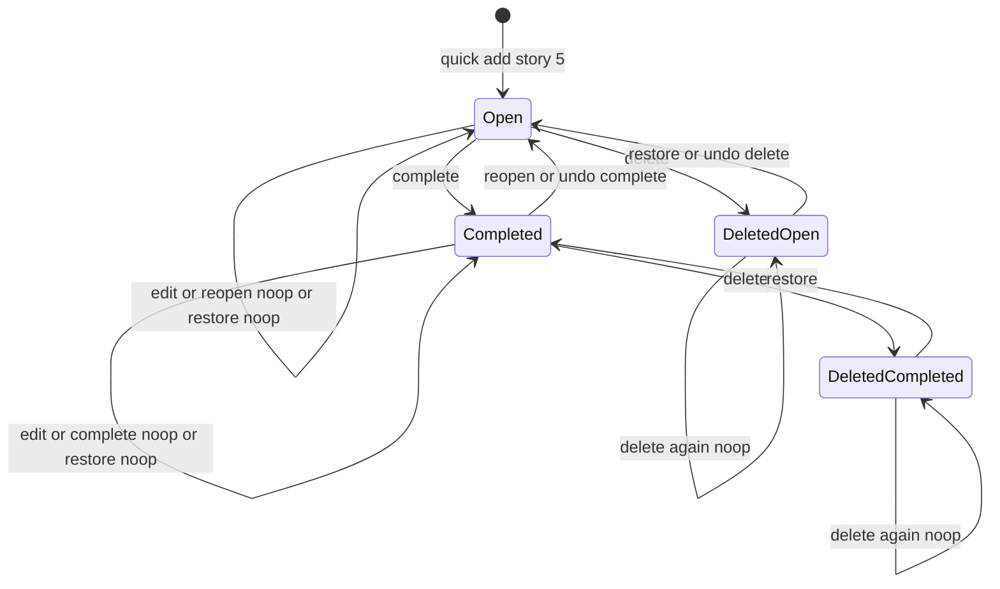
```mermaid
stateDiagram-v2
  [*] --> Open : quick add story 5
  Open --> Completed : complete
  Completed --> Open : reopen or undo complete
  Open --> Open : edit or reopen noop or restore noop
  Completed --> Completed : edit or complete noop or restore noop
  Open --> DeletedOpen : delete
  Completed --> DeletedCompleted : delete
  DeletedOpen --> Open : restore or undo delete
  DeletedCompleted --> Completed : restore
  DeletedOpen --> DeletedOpen : delete again noop
  DeletedCompleted --> DeletedCompleted : delete again noop
```
Transitions not drawn are rejected: complete, reopen and edit on DeletedOpen/DeletedCompleted return 410 `gone {entity:'task'}` and change nothing. Story 7 adds one more rejection on restore (see Extension points).

## Undo toast state (client, per action, not persisted)
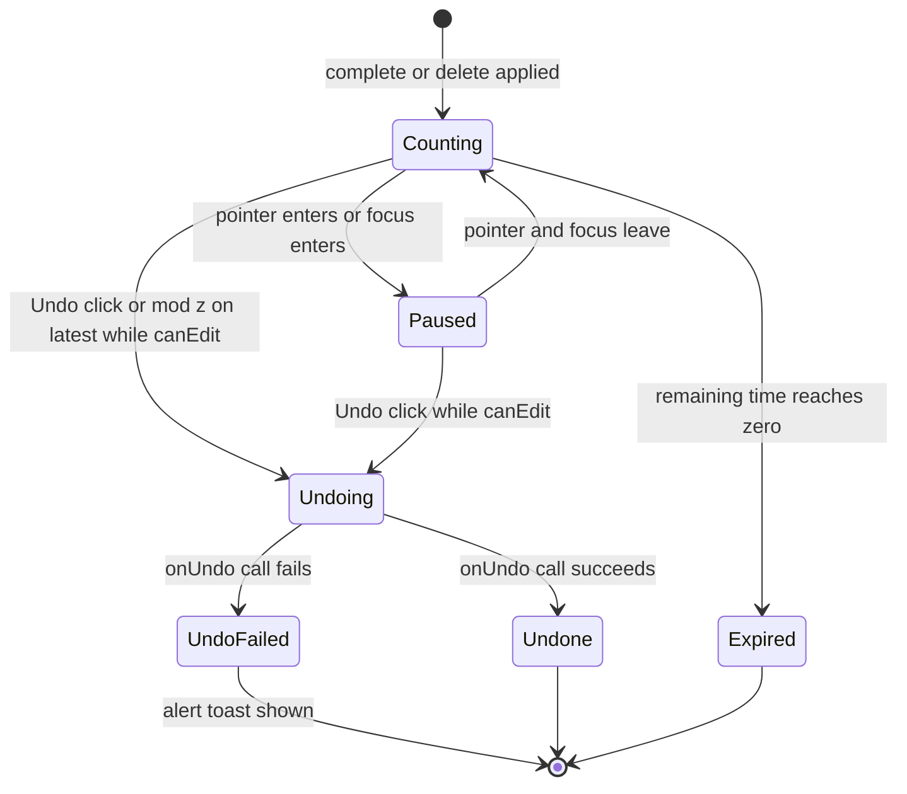
```mermaid
stateDiagram-v2
  [*] --> Counting : complete or delete applied
  Counting --> Paused : pointer enters or focus enters
  Paused --> Counting : pointer and focus leave
  Counting --> Expired : remaining time reaches zero
  Counting --> Undoing : Undo click or mod z on latest while canEdit
  Paused --> Undoing : Undo click while canEdit
  Undoing --> Undone : onUndo call succeeds
  Undoing --> UndoFailed : onUndo call fails
  UndoFailed --> [*] : alert toast shown
  Undone --> [*]
  Expired --> [*]
```
Paused time does not count against `UNDO_WINDOW_MS`. Only the most recent toast in Counting or Paused state responds to Cmd/Ctrl+Z. While `canEdit` is false the Undo button is disabled and Cmd/Ctrl+Z does nothing; the window keeps counting.

## Row presentation state (client)
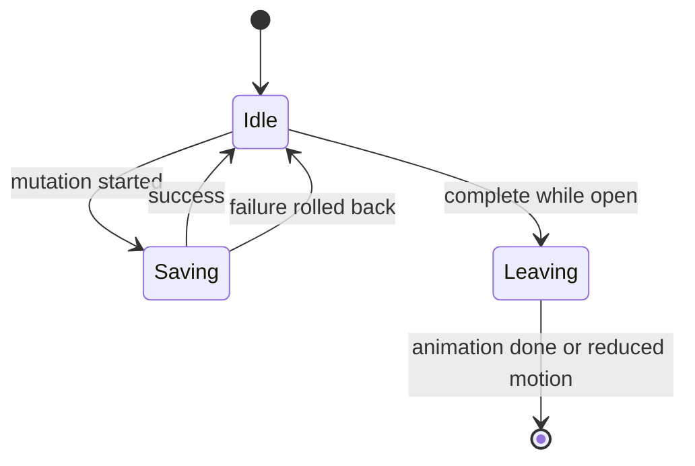
```mermaid
stateDiagram-v2
  [*] --> Idle
  Idle --> Saving : mutation started
  Saving --> Idle : success
  Saving --> Idle : failure rolled back
  Idle --> Leaving : complete while open
  Leaving --> [*] : animation done or reduced motion
```
`Saving` sets `aria-busy=true` on the row (story 5's attribute). `Leaving` lasts `COMPLETE_ANIMATION_MS` (0 under reduced motion) with the checkbox already ticked. Story 10 adds `waiting` via `localStatus` (see Extension points).

## Flows changed
Six flows change, each with a sequence diagram including error branches: complete + undo (tasks.complete), reopen (tasks.reopen), edit (tasks.edit), delete + undo (tasks.delete; its undo block is the restore flow of tasks.restore), list with completed (tasks.list_completed), keyboard undo (ui.undo). ui.task_actions, ui.task_detail and ui.focus_management are client surfaces of those flows; their extra behaviour (row keys and offline gating, openTaskDetail, focus movement) is shown in their own sequences.

## Extension points owned by story 6

Per architecture §13, story 6 is the **owner** of the artefacts below and states their final shape, including the named extension points later stories use. An extender that needs something not listed here edits this section too and records a "Delta to story 6" in its own design.

## Owned artefacts and final shapes
| Artefact | Path | Final shape (owner: 6) | Extenders |
|---|---|---|---|
| Task lifecycle routes | `apps/api/src/routes/tasks.ts` (`/complete`, `/reopen`, `/restore`, `DELETE`, `PATCH`) | `lifecycleRoute(fn, eventType)` maps `MutationResult` to 200/204/404/410; **`restoreGuards: RestoreGuard[]`** extension list evaluated before the restore UPDATE | 7 (project check), 8 (PATCH `dueDate` field) |
| No-op and deleted rules | `apps/api/src/db/tasks.ts` | delete-deleted 204; restore-active 200 no broadcast; mutate-deleted 410 `gone {entity}` (D-29 pattern) | 7 adopts for projects |
| `include_completed` param | `packages/shared/src/schemas.ts` `ListTasksQuerySchema` | `include_completed=true|false` (default false) | 8, 11 conform (D-31) |
| Mutations | `apps/web/src/features/tasks/mutations.ts` | `useCompleteTask`, `useReopenTask`, `useUpdateTask`, `useDeleteTask`, `useRestoreTask`, built on **`runTaskMutation(spec)`** with extension hooks below | 7 (move), 8 (due date), 10 (waiting and retry) |
| Undo helper | `apps/web/src/features/undo/showUndoToast.ts` | `showUndoToast({message, onUndo}): UndoHandle` (D-41) | 7, 8, 11 conform |
| Detail sheet | `features/tasks/TaskDetailSheet.tsx`, `features/tasks/openTaskDetail.ts` | `openTaskDetail(id, {returnFocusTo})`; sheet has a **`fieldsSlot`** region below description | 8 (due-date field), 11 (opens from Finder) |
| Task actions menu | `features/tasks/TaskActionsMenu.tsx` | Radix `DropdownMenu` with ordered **`menuItems`** registry `{id, label, shortcutHint, onSelect, requiresCanEdit}`; story 6 registers Edit and Delete | 7 (Move to… · M), 8 (Set date… · D) |
| Date helpers | `packages/shared/src/dates.ts` | cached `Intl.DateTimeFormat` per locale+options; `formatCompletedDate` | 8 adds due-date formatters |
| Test route | `/test/tasks/:id/raw` in story 1's `routes/test.ts` registry | returns the raw D1 row incl. `deleted`, `deleted_at`; 404 in production (D-35) | — |

## Named extension points
1. **Restore of a task in a deleted project (story 7, D-30).** `restoreTask` runs every `RestoreGuard` in `restoreGuards` before its guarded UPDATE. A guard returns `{kind:'gone', entity}` to reject. Story 7 registers a guard returning `{kind:'gone', entity:'project'}` when the task's `project_id` references a soft-deleted project, so the route responds 410 `{error:'gone', entity:'project'}` and the UI shows "Its project was deleted". Story 6 ships `restoreGuards = []`, and its client already maps `GoneError{entity}` generically so the undo failure branch shows the entity-specific message supplied by the extender.
2. **Rate-limit waiting and scheduled retry (story 10, D-24/D-33).** `runTaskMutation(spec)` exposes `spec.retryPolicy?: (err) => {retryAfterMs} | null` (default: none, so story 6 never retries) and `spec.onWaiting?: (taskId) => void`. Story 10 supplies the predicate (only 429 with `Retry-After`, only idempotent ops: complete, reopen, delete, restore, PATCH, move) and sets `localStatus: 'waiting'` on the row plus the "Waiting to save…" toast. Rollback runs only after retries run out.
3. **Cell-3 menu items (stories 7, 8).** Registered through `TaskActionsMenu` `menuItems`; items with `requiresCanEdit` are disabled offline by the menu itself (portalled content, self-gated via `useCanEdit()`). The `…` trigger itself stays enabled offline (story 5's cell gating), so Edit can open the sheet read-only.
4. **Detail sheet fields (story 8).** `fieldsSlot` renders extender fields; they must read `useCanEdit()` and use the same `useEditGuard` call (`fields` list extended with `dueDate`).
5. **Undo from other surfaces (stories 7, 8, 11).** `showUndoToast` returns `UndoHandle {undo(): Promise<void>; readonly state}` so the Finder's inline "Completed 'X' · Undo" status line (D-15) calls the same handle as the global toast.
6. **`openTaskDetail` callers (story 11).** Callable with no anchored row; `returnFocusTo` may be any element; if it is gone on close, the D-19 fallback applies.

## Uses (not owned)
Story 5 `TaskGrid`/`TaskRow`/`useTaskGrid`/`shortcuts.ts`/`/test/seed` (including its cell-level offline gating via `canEdit` in `TaskRowSlotsContext`); story 4 `broadcast`, `useEditGuard`, `useCanEdit`, `GoneError`; story 2 `AppShell` (no fieldset; controls self-gate), `queryKeys`, `NAME_HINT_MS`, `lazyWithRetry`; story 1 `/test/*` registry.

## Test Strategy

## Test scopes and boundaries
| Level | Boundary exercised | Why sufficient | Stores |
|---|---|---|---|
| unit | pure functions in `packages/shared` (schemas, blank-name rule, ordering, Intl date helpers) and web pure logic (cache reducers, count deltas, undo scheduler with pause, undo stack, focus timing, row-key decision table, show-completed preference codec) | these hold the branching logic; no I/O needed | none; localStorage stubbed as a plain object because persistence semantics (not the browser) are under test |
| integration | full Worker request handling via `SELF.fetch` through Hono, auth and validation middleware, db module, real Miniflare D1, real WorkspaceRoom DO (WebSocket client in test) | the structure diagram shows a request-handling boundary; every contract status code, error body, persisted state and broadcast is asserted here | D1 real (store under test, mocking forbidden by architecture 10); DO real so broadcasts are proven end to end |
| ui-component | React components with Testing Library in happy-dom; network mocked with MSW; fake timers; `matchMedia` stubbed for reduced motion, narrow viewport and hover:none; story 4's `canEdit` store driven to true/false | proves optimistic render, rollback, counts, toasts, pause, focus, keyboard cell rules, offline gating, announcements and responsive variants deterministically; server behaviour already proven at integration | network mocked (API not under test here); TanStack Query real; `useTaskGrid`, `shortcuts.ts` and `canEdit` real (story 5/4 modules); localStorage real happy-dom implementation plus a throwing stub for the failure case |
| e2e | Playwright per story 1's matrix (D-36): `chromium` and `webkit` desktop for all specs; `mobile-webkit` (iPhone 13) and `mobile-chromium` (Pixel 7) for specs tagged `@mobile`; against `wrangler dev` with local D1 and DO | proves cross-surface workflows (browser to D1 to second browser, real focus, real touch layout, real offline) no lower level can | everything real, local only, seeded via story 5's `/test/seed`; retention read via `/test/tasks/:id/raw` (story 1 registry, D-35) |

## Dimensions crossed
- **Operation**: complete, reopen, edit, delete, restore, list.
- **Prior state**: Open, Completed, DeletedOpen, DeletedCompleted, Missing (no such id or other workspace).
- **Entry surface**: API direct, UI pointer, UI keyboard (per grid cell 1, 2, 3), UI touch (narrow viewport), non-row opener (Finder-style `openTaskDetail`).
- **Client environment**: default, reduced motion, narrow viewport, hover:none, storage unavailable, offline (`canEdit=false`), overlay open.

Prior-state classes are exhaustive and non-overlapping: every row is exactly one of Open (deleted=0, completed_at null), Completed (deleted=0, completed_at set), DeletedOpen (deleted=1, completed_at null), DeletedCompleted (deleted=1, completed_at set); any id not in the authenticated workspace is Missing. Removed-row position classes for focus are exhaustive and non-overlapping: only row, first of many, middle, last of many. Focused-cell classes are exhaustive: cell 1 (checkbox), cell 2 (name), cell 3 (actions).

## Matrix A: operation x prior state (integration, API surface)
Every row asserts the response AND the D1 row before/after AND whether a live event was received. Every 410 asserts the body `{error:'gone', entity:'task'}`; no-op rows follow D-29.
| TC | Operation | Prior state | Level | Expected response | State after | version | Broadcast |
|---|---|---|---|---|---|---|---|
| TC-I01 | complete | Open | integration | 200 task with completedAt | Completed, sort_order unchanged | +1 | task.upserted |
| TC-I02 | complete | Completed | integration | 200 unchanged task | Completed, completed_at unchanged | unchanged | none |
| TC-I03 | complete | DeletedOpen | integration | 410 gone entity task | DeletedOpen | unchanged | none |
| TC-I04 | complete | DeletedCompleted | integration | 410 gone entity task | DeletedCompleted | unchanged | none |
| TC-I05 | complete | Missing | integration | 404 not_found | no row affected | not applicable because no row exists | none |
| TC-I06 | reopen | Open | integration | 200 unchanged task | Open | unchanged | none |
| TC-I07 | reopen | Completed | integration | 200 task completedAt null | Open, sort_order unchanged | +1 | task.upserted |
| TC-I08 | reopen | DeletedOpen | integration | 410 gone entity task | DeletedOpen | unchanged | none |
| TC-I09 | reopen | DeletedCompleted | integration | 410 gone entity task | DeletedCompleted | unchanged | none |
| TC-I10 | reopen | Missing | integration | 404 not_found | no row affected | not applicable because no row exists | none |
| TC-I11 | edit name | Open | integration | 200 trimmed name | Open, name updated | +1 | task.upserted |
| TC-I12 | edit name | Completed | integration | 200 trimmed name | Completed, name updated | +1 | task.upserted |
| TC-I13 | edit name | DeletedOpen | integration | 410 gone entity task | unchanged | unchanged | none |
| TC-I14 | edit name | DeletedCompleted | integration | 410 gone entity task | unchanged | unchanged | none |
| TC-I15 | edit name | Missing | integration | 404 not_found | no row affected | not applicable because no row exists | none |
| TC-I16 | delete | Open | integration | 204 | DeletedOpen, deleted_at set, other columns unchanged | +1 | task.deleted |
| TC-I17 | delete | Completed | integration | 204 | DeletedCompleted, completed_at kept | +1 | task.deleted |
| TC-I18 | delete | DeletedOpen | integration | 204 no-op | DeletedOpen, deleted_at unchanged | unchanged | none |
| TC-I19 | delete | DeletedCompleted | integration | 204 no-op | DeletedCompleted, deleted_at unchanged | unchanged | none |
| TC-I20 | delete | Missing | integration | 404 not_found | no row affected | not applicable because no row exists | none |
| TC-I21 | restore | Open | integration | 200 no-op unchanged task (no `not_deleted` error) | Open | unchanged | none |
| TC-I22 | restore | Completed | integration | 200 no-op unchanged task | Completed | unchanged | none |
| TC-I23 | restore | DeletedOpen | integration | 200 task | Open, deleted_at null, same sort_order | +1 | task.restored |
| TC-I24 | restore | DeletedCompleted | integration | 200 task | Completed, completed_at kept | +1 | task.restored |
| TC-I25 | restore | Missing | integration | 404 not_found | no row affected | not applicable because no row exists | none |
| TC-I26 | list default | mix of all four states | integration | 200 only Open, sort_order asc | read only | not applicable because read only | none |
| TC-I27 | list include_completed=true | mix of all four states | integration | 200 Open by sort_order then Completed by completed_at desc, no deleted | read only | not applicable because read only | none |

## Matrix B: input boundaries and validation
| TC | Case | Level | Expected |
|---|---|---|---|
| TC-I28 | name length 1 | integration | 200 saved |
| TC-I29 | name length TASK_NAME_MAX | integration | 200 saved exactly |
| TC-I30 | name length TASK_NAME_MAX + 1 | integration | 400 validation, row unchanged, no broadcast |
| TC-I31 | name empty string only | integration | 200, name unchanged, version unchanged, no broadcast |
| TC-I32 | name whitespace only | integration | same as TC-I31 |
| TC-I33 | blank name plus valid description | integration | 200, description updated, name unchanged, version +1 |
| TC-I34 | description empty string | integration | 200, description cleared |
| TC-I35 | description length TASK_DESCRIPTION_MAX | integration | 200 saved |
| TC-I36 | description length TASK_DESCRIPTION_MAX + 1 | integration | 400 validation, row unchanged |
| TC-I37 | empty JSON object body | integration | 400 validation |
| TC-I38 | unknown field completedAt in PATCH | integration | 400 validation, lifecycle cannot be tampered with via PATCH |
| TC-I39 | include_completed=yes | integration | 400 validation |
| TC-I40 | name with emoji and RTL text | integration | 200 stored byte-exact |
| TC-I52 | include_completed=false explicitly | integration | 200 identical to default (only Open) |

## Matrix C: access and cross-cutting
| TC | Case | Level | Expected |
|---|---|---|---|
| TC-I41 | task id from workspace B while authenticated for A, each mutating operation | integration | 404 for all five operations, B row unchanged |
| TC-I42 | no `tdl_ws` cookie | integration | 404, nothing changed |
| TC-I43 | mutation without X-Todoodle-Client header | integration | 403 forbidden_client, nothing changed |
| TC-I44 | PATCH with a text/plain body | integration | 415 unsupported_media_type, nothing changed |
| TC-I45 | broadcast carries originClientId from X-Todoodle-Client-Id and new version; exactly one event per change (route calls `broadcast(c, wid, event)` once, no extra waitUntil wrapper) | integration | event payload matches; one event |
| TC-I46 | reopen position: tasks A,B,C; complete B; reopen B | integration | list order A,B,C |
| TC-I47 | last write wins: client X then client Y PATCH name | integration | final name from Y, version +2, two events in order |
| TC-I48 | retention: delete then read `/test/tasks/:id/raw` and the D1 row | integration | row exists with deleted=1, deleted_at set, fields intact |
| TC-I49 | undo race: restore called twice concurrently | integration | both 200, version +1 once, one task.restored |
| TC-I50 | bodyless POST complete, reopen, restore and bodyless DELETE with only the client header | integration | accepted (200/204) per Matrix A |
| TC-I51 | restore with a registered test `RestoreGuard` returning gone entity project | integration | 410 `{error:'gone', entity:'project'}`, row unchanged, no broadcast (proves story 7's extension point) |
| TC-I53 | `/test/tasks/:id/raw` with ENVIRONMENT=production binding | integration | 404 |

## Matrix D: unit
| TC | Unit | Case | Level | Expected |
|---|---|---|---|---|
| TC-U01 | TaskPatchSchema | name only, description only, both | unit | parse ok |
| TC-U02 | TaskPatchSchema | empty object | unit | refine error, at least one field |
| TC-U03 | TaskPatchSchema | unknown key | unit | strict error |
| TC-U04 | TaskPatchSchema | name TASK_NAME_MAX and +1 | unit | ok and error |
| TC-U05 | resolvePatchedName | blank, whitespace, padded, normal | unit | keep previous, keep previous, trimmed, value |
| TC-U06 | parseIncludeCompleted | absent, true, false, yes | unit | false, true, false, error |
| TC-U07 | orderTasks | open by sort_order then completed by completed_at desc, ties by id | unit | stable order |
| TC-U08 | cache ops complete, reopen, remove, insertBySortOrder with Map index, and rollback | unit | cache deep-equals snapshot after rollback; insert lands at sort_order index |
| TC-U09 | task.restored handler registered via registerLiveHandler | event version lower, equal, higher | unit | ignore, ignore, insert at sort_order |
| TC-U10 | createUndo scheduler, fake timers | undo at 0 ms, UNDO_WINDOW_MS - 1, UNDO_WINDOW_MS | unit | onUndo called, called, not called |
| TC-U11 | createUndo pause | pause at 9000 ms, advance 60000 ms, resume, undo at +500 ms; then let 1000 ms pass without pause | unit | first onUndo called; a fresh toast paused and resumed expires exactly at 10000 ms of unpaused time |
| TC-U12 | undoStack latest | push A then B; B expires; A expires | unit | latest is B, then A, then none |
| TC-U13 | removalFocusTiming(kind, reducedMotion) (re-scoped by D-04; next/previous/add-task selection is tested once by story 5's `useTaskGrid` unit test) | delete; complete default; complete reduced motion; rollback | unit | before removal (0 ms); after COMPLETE_ANIMATION_MS; 0 ms; refocus restored row id |
| TC-U14 | showCompleted preference codec | absent key, stored 1, stored 0, getItem throws, setItem throws, two lists | unit | false, true, false, false without throwing, write ignored without throwing, keys isolated per workspace and list |
| TC-U15 | formatCompletedDate | same year, different year, invalid ISO | unit | short weekday date, date with year, empty string; formatter instance cached (constructed once per locale) |
| TC-U16 | row shortcut table | registered entries | unit | `{key:'e', scope:'grid'}` Edit; `{key:'Delete'}` and `{key:'Backspace'}` Delete task, scope grid; `{key:' '}` Complete, scope grid; `{key:'z', modifiers:['mod'], scope:'global'}` Undo; none sets allowInOverlay; all descriptions non-empty for the ? panel |
| TC-U17 | applyCountDelta | complete open task, reopen, delete open, delete completed, restore open, restore completed, rollback | unit | inbox/project `open` -1, +1, -1 (total -1), total -1 only, open +1 total +1, total +1; rollback deep-equals snapshot; counts never below 0 |
| TC-U18 | rowKeyAction(key, cell, canEdit) decision table | Space, Delete, Backspace, E, Enter crossed with cell 1, 2, 3 and canEdit true/false | unit | Space/Delete/Backspace act in cells 1-2 only, null in cell 3; E opens from any cell; Enter opens only in cell 2; with canEdit false only E and Enter (open read-only) return an action |

## Matrix E: ui-component (MSW network, fake timers)
| TC | Surface | Environment | Case | Level | Expected |
|---|---|---|---|---|---|
| TC-C01 | pointer | default | click checkbox | ui-component | native checkbox `checked` true at once; row present until COMPLETE_ANIMATION_MS then removed; status toast Task completed with Undo |
| TC-C02 | pointer | default | complete returns 500 | ui-component | row returns at same index, alert toast Couldn't save |
| TC-C03 | pointer | default | click Undo within window | ui-component | POST reopen sent, row back at index |
| TC-C04 | pointer | default | advance UNDO_WINDOW_MS | ui-component | toast gone, no reopen request |
| TC-C05 | pointer and keyboard | default | click task name; press Enter on the name cell | ui-component | detail sheet opens, name focused, description shown |
| TC-C06 | keyboard | default | edit name then Enter | ui-component | PATCH trimmed name, row shows new name immediately |
| TC-C07 | pointer | default | edit description then blur | ui-component | PATCH description |
| TC-C08 | keyboard | default | Escape during edit | ui-component | no PATCH, field reverts; second Escape closes sheet; Escape does not reach quick add underneath |
| TC-C09 | keyboard | default | clear name then Enter | ui-component | no PATCH for name, previous name shown, hint Name can't be empty visible then gone after story 2's NAME_HINT_MS |
| TC-C10 | keyboard | default | type past TASK_NAME_MAX in sheet | ui-component | text kept, over-limit count shown, Enter sends no PATCH |
| TC-C11 | pointer | default | PATCH returns 410 gone entity task | ui-component | useEditGuard deleted notice, sheet closes, row removed |
| TC-C12 | pointer | default | menu Delete | ui-component | no dialog rendered, DELETE sent, row removed at once, status toast Task deleted with Undo |
| TC-C13 | pointer | default | Delete then Undo | ui-component | POST restore, row back at index |
| TC-C14 | pointer | default | DELETE returns 500 | ui-component | row returns, alert toast |
| TC-C15 | pointer | default | toggle show completed | ui-component | Completed `role=rowgroup` with header row appears below open rows; rows struck through with Intl-formatted date; checkbox reopens |
| TC-C16 | keyboard | default | focus in cell 1 and in cell 2: press Space, then Delete; from cell 3 press E | ui-component | Space completes; Delete deletes with toast and no dialog; E opens detail |
| TC-C17 | keyboard | default | press E or Delete while typing in quick add | ui-component | ignored by shared isTypingTarget, character typed |
| TC-C18 | pointer | default | accessible names and hints | ui-component | checkbox is `input[type=checkbox]` with accessible name = task name and description Complete (open) or Reopen (completed) via aria-describedby; no role=button or aria-checked; menu items show E and Del hints; menu trigger hit area at least MIN_TOUCH_TARGET_PX |
| TC-C19 | live | default | remote task.upserted changes name of task open in sheet | ui-component | useEditGuard called as `{key, fields:['name','description'], entityLabel:'task', save}`; notice "Someone else changed this task just now." with Use my version and Keep theirs |
| TC-C20 | pointer | default | show completed with zero completed tasks | ui-component | text No completed tasks |
| TC-C21 | pointer | default | reopen returns 500 from completed group | ui-component | row returns to completed group, alert toast |
| TC-C22 | pointer | default | Undo call returns 500 | ui-component | alert toast Couldn't undo, task stays completed or deleted on screen |
| TC-C23 | pointer | reduced motion | click checkbox | ui-component | row removed immediately, no animation class |
| TC-C24 | pointer and keyboard | default | hover toast for 20000 ms, then leave; separately focus Undo for 20000 ms, then blur | ui-component | toast still visible while hovered or focused; disappears UNDO_WINDOW_MS of unpaused time after leaving |
| TC-C25 | keyboard | default and overlay open | mod+z with toast visible and focus on a row; mod+z with focus in quick add input; mod+z while the ? panel (an overlay) is open | ui-component | first sends onUndo request; second and third send nothing and do not prevent default |
| TC-C26 | keyboard | default | complete A, delete B, mod+z | ui-component | only B restored; A toast still counting |
| TC-C27 | keyboard | default | complete focused row at positions only, first, middle, last | ui-component | story 5's `focusAfterRemoval` called with the id at the timing from TC-U13; focus lands on add-task control, next row, next row, previous row |
| TC-C28 | keyboard | default | close sheet by Escape; delete from sheet | ui-component | focus returns to originating row; sheet closes and focus moves to next row |
| TC-C29 | pointer | default and storage throws | toggle on, remount list; slow completed response | ui-component | toggle restored on after remount; previous rows stay rendered while loading (keepPreviousData, no empty state flash); with throwing storage toggle still works, defaults off, no crash |
| TC-C30 | touch | narrow viewport and hover none | open task; inspect row | ui-component | sheet has full-screen layout; menu trigger visible without hover |
| TC-C31 | pointer | default | pending complete; failing edit | ui-component | row aria-busy true while pending, false after; failure toast has role alert; success toast role status |
| TC-C32 | pointer | default | initial render of list | ui-component | TaskDetailSheet chunk not loaded until row hover or focus triggers preload |
| TC-C33 | pointer and keyboard | offline (canEdit false) | open a task by click, Enter and E; toggle Show completed | ui-component | sheet opens read-only: name, description and Delete disabled, draft text not cleared; toggle is not gated, still enabled and refetches with include_completed=true |
| TC-C34 | pointer and keyboard | offline (canEdit false) | Space and Delete on a focused row; click checkbox; open menu; Undo on a visible toast; mod+z | ui-component | no request sent for any; checkbox disabled by story 5's cell gating (`useCanEdit()`), `…` trigger enabled; menu Edit enabled (opens read-only) and Delete disabled; Undo button disabled; mod+z no-op; toast keeps counting |
| TC-C35 | keyboard | default | `openTaskDetail(id, {returnFocusTo: button})` from a button outside the grid; close; repeat with the button removed before close | ui-component | sheet opens without an anchored row; focus returns to the button; when gone, focus falls back per D-19 to the task row if present, else the view heading |
| TC-C36 | pointer | default | complete, reopen, delete, restore; then complete returning 500 | ui-component | `queryKeys.counts(wid)` cache changes in the same render as the row (no refetch awaited); failing complete restores counts |
| TC-C37 | keyboard | default | focus the cell-3 menu button and press Space; press Delete there | ui-component | Space opens the menu, task not completed; Delete does nothing |

## E2E workflows (Playwright, local)
| TC | Workflow | Level | Asserted outcome |
|---|---|---|---|
| TC-E01 | complete then Undo then reload | e2e | task back at original index and still open after reload |
| TC-E02 | complete, wait past UNDO_WINDOW_MS, reload, show completed, reopen, reload again | e2e | completed shown in Completed group struck through with date; after reopen it sits at original index; show completed still on after reload |
| TC-E03 | open detail, edit name and description, reload | e2e | both persisted |
| TC-E04 | delete then Undo; delete and let expire, then reload | e2e | no confirmation shown; first restored; second gone from UI while `/test/tasks/:id/raw` shows deleted=1 |
| TC-E05 | two contexts A and B on one workspace; A completes; B edits a task A deletes | e2e | B sees completion within LIVE_UPDATE_TARGET_MS; B sees the deleted notice |
| TC-E06 | keyboard only: Tab to grid (lands in name cell), Down, Enter, edit, Enter, Escape twice, ← to checkbox, Delete, mod+z | e2e | name saved; focus returns to row; after delete focus on next row; mod+z restores the task |
| TC-E07 | `@mobile` (mobile-webkit, mobile-chromium): tap row menu, Delete, Undo; tap name | e2e | menu visible without hover; delete and undo work; detail fills the viewport |
| TC-E08 | hover the undo toast for 15 s then move away | e2e | toast survives while hovered and disappears about 10 s after leaving |
| TC-E09 | `context.setOffline(true)` after load: toggle show completed, open a task, press Space and Delete on a row | e2e | toggle works from cache/refetch on reconnect; sheet read-only; no task changes; after `setOffline(false)` the same actions work |
| TC-E10 | axe scan of a list with open and completed rows and an open actions menu | e2e | no violations (incl. nested-interactive); checkbox exposed as checkbox named by the task |

## Negative scenarios (what must NOT happen)
| TC | Must not | Level |
|---|---|---|
| TC-I02, TC-I06, TC-I18, TC-I19, TC-I21, TC-I22, TC-I31 | no-op operations bump version or broadcast | integration |
| TC-I03, TC-I04, TC-I08, TC-I09, TC-I13, TC-I14 | deleted tasks get completed, reopened or edited | integration |
| TC-I30, TC-I36, TC-I37, TC-I38, TC-I39, TC-I44 | invalid input changes anything | integration |
| TC-I41, TC-I42 | any cross-workspace effect | integration |
| TC-I43 | a mutation without the client header succeeds | integration |
| TC-I45 | a change broadcasts twice | integration |
| TC-I53 | the raw test route is reachable in production | integration |
| TC-C08, TC-C09, TC-C10 | Escape, blank or over-limit input sends a request | ui-component |
| TC-C12, TC-C16, TC-E04 | a confirmation dialog appears for single-task delete | ui-component and e2e |
| TC-C04, TC-U10 | an expired undo sends a request | ui-component and unit |
| TC-C17, TC-C25 | shortcuts hijack typing, native text undo or an open overlay | ui-component |
| TC-C26 | mod+z undoes anything other than the most recent action | ui-component |
| TC-C37, TC-U18 | Space or Delete on a cell-3 button completes or deletes the task | ui-component and unit |
| TC-C33, TC-C34, TC-E09, TC-U18 | any task change or undo is sent while offline, or typed text is cleared | ui-component, e2e, unit |
| TC-U14, TC-C29 | unavailable storage crashes the list | unit and ui-component |
| TC-I48 | delete hard-deletes | integration |

## Error path coverage (every contract error has a case)
| Error | Cases | Level |
|---|---|---|
| 400 validation | TC-I30, TC-I36, TC-I37, TC-I38, TC-I39 | integration |
| 403 forbidden_client | TC-I43 | integration |
| 415 unsupported_media_type | TC-I44 | integration |
| 404 not_found | TC-I05, TC-I10, TC-I15, TC-I20, TC-I25, TC-I41, TC-I42, TC-I53 | integration |
| 410 gone {entity} | TC-I03, TC-I04, TC-I08, TC-I09, TC-I13, TC-I14, TC-I51, TC-C11, TC-E05 | integration, ui-component, e2e |
| network or 500 rollback | TC-C02, TC-C14, TC-C21, TC-C22, TC-C36 | ui-component |
| storage unavailable | TC-U14, TC-C29 | unit, ui-component |
| offline (canEdit false) | TC-C33, TC-C34, TC-E09 | ui-component, e2e |

## Boundary values
- Undo window: 0, UNDO_WINDOW_MS - 1, UNDO_WINDOW_MS, and paused beyond the window (TC-U10, TC-U11, TC-C24, TC-E08).
- Animation: COMPLETE_ANIMATION_MS and 0 under reduced motion (TC-U13, TC-C01, TC-C23).
- Name length: 0, 1, TASK_NAME_MAX, TASK_NAME_MAX + 1 (TC-I28..TC-I31, TC-C10); description TASK_DESCRIPTION_MAX and +1 (TC-I35, TC-I36).
- List position of removed row: only, first, middle, last (TC-C27; selection logic unit-tested once in story 5).
- Grid cell: 1, 2, 3 (TC-U18, TC-C16, TC-C37).
- Counts: decrement to 0 never negative (TC-U17).
- Viewport: below and at MOBILE_BREAKPOINT_PX (TC-C30, TC-E07).

## Fixture realism
Integration and e2e seed via story 5's `/test/seed` schema (`{workspaceId, tasks:[{name, description?, completedAt?, deleted?, sortOrder?}]}`) a workspace resembling real use: 12 tasks with real fractional `sort_order`, a name at exactly TASK_NAME_MAX, an emoji and RTL name, multi-line descriptions, 3 completed with distinct `completed_at`, 2 soft-deleted (one per deleted state), plus a second workspace with 3 tasks. Unit and ui-component fixtures are typed with the shared `Task` type so they cannot drift from the API shape; MSW handlers return bodies parsed through the shared zod schemas. Copy that other stories change (conflict wording, gone messages) is asserted through the shared constants, not literals (§13 rule 3).

## Not covered (deliberately)
- Performance at the 5,000-task scale (story 8 owns that case; per-row `content-visibility` is story 5's `rows.css`).
- The next/previous/add-task selection inside `focusAfterRemoval` (story 5's `useTaskGrid` unit test owns it; D-04).
- Grid arrow-key navigation between rows and cells (story 5, D-02).
- Screen-reader output itself (we assert roles, names, descriptions and live-region attributes, not what a specific reader speaks).
- The operator recovery runbook (manual).
- Swipe gestures (removed product-wide, D-09).
- Live transport reliability (reconnect, heartbeat) and the offline detection itself are owned and tested by story 4; here only event emission, application and `canEdit` consumption are tested.
- Rate-limit waiting/retry (story 10 via the `mutations.ts` extension point) and project restore rejection copy (story 7).

## Complete a task

> Anchor: `tasks.complete`

## Contract
`POST /api/w/:workspaceId/tasks/:taskId/complete`
- Headers: `X-Todoodle-Client: web`, `X-Todoodle-Client-Id: <uuid>`; cookie `tdl_ws`. Body optional; if present it must be JSON `{}`.
- 200 `{ task: Task }`. If Open: sets `completed_at = now`, `version += 1`, `updated_at = now`; broadcasts `task.upserted` with `originClientId`. If already Completed: returns current task unchanged, no broadcast (D-29).
- Errors: 404 `not_found` (no cookie, wrong workspace, unknown task); 410 `{error:'gone', entity:'task'}` (soft-deleted); 403 `forbidden_client` (missing client header); 415 `unsupported_media_type` (non-JSON body). Story 10 may add 429 `rate_limited` (D-23), handled through the `mutations.ts` extension point.
- Side effects: one guarded D1 UPDATE (`WHERE id=? AND workspace_id=? AND deleted=0 AND completed_at IS NULL`); `sort_order` untouched.
- Client: requires `canEdit` (D-10); optimistic counts delta (D-38): the task's list `open` count -1.

```ts
export function completeTask(db: D1Database, workspaceId: string, taskId: string, now: string): Promise<MutationResult<Task>>
type MutationResult<T> = { kind: 'changed'; entity: T } | { kind: 'noop'; entity: T } | { kind: 'gone'; entity: 'task' | 'project' } | { kind: 'missing' }
```

## Sequence: complete and undo
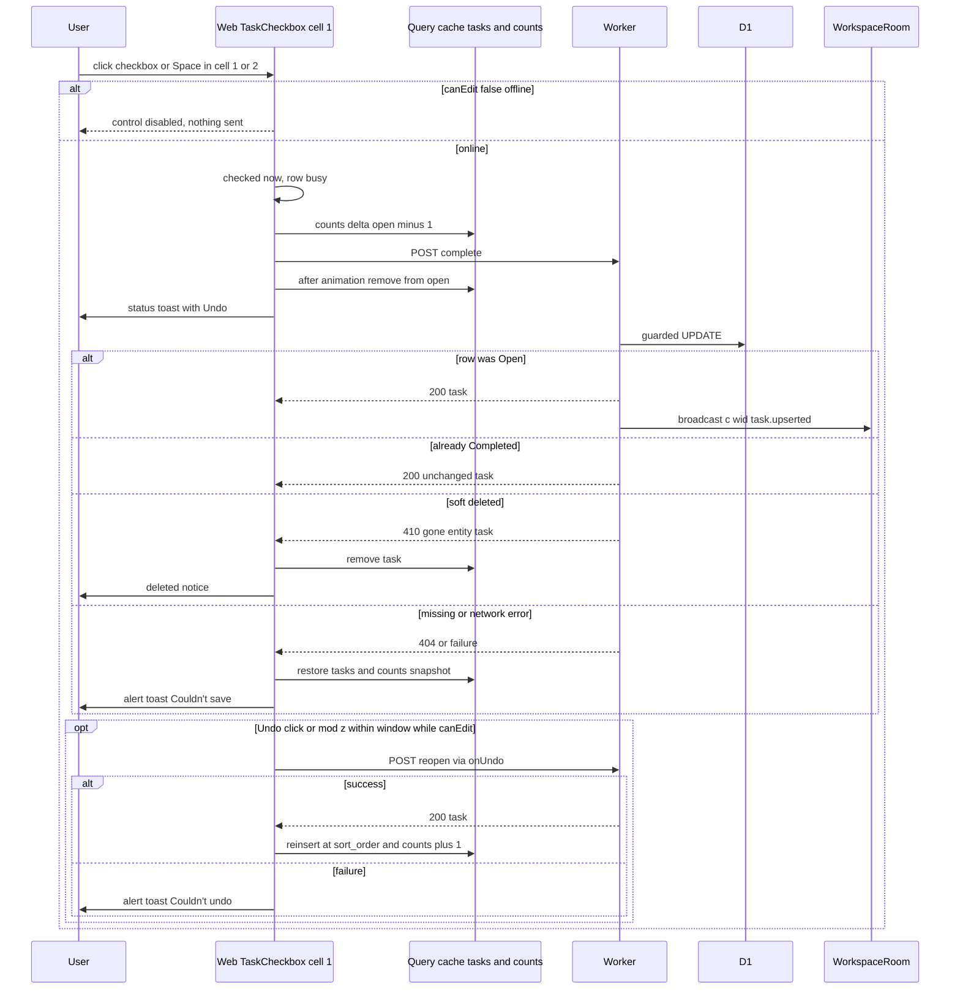
```mermaid
sequenceDiagram
  participant U as User
  participant W as Web TaskCheckbox cell 1
  participant Q as Query cache tasks and counts
  participant A as Worker
  participant D as D1
  participant R as WorkspaceRoom
  U->>W: click checkbox or Space in cell 1 or 2
  alt canEdit false offline
    W-->>U: control disabled, nothing sent
  else online
    W->>W: checked now, row busy
    W->>Q: counts delta open minus 1
    W->>A: POST complete
    W->>Q: after animation remove from open
    W->>U: status toast with Undo
    A->>D: guarded UPDATE
    alt row was Open
      A-->>W: 200 task
      A->>R: broadcast c wid task.upserted
    else already Completed
      A-->>W: 200 unchanged task
    else soft deleted
      A-->>W: 410 gone entity task
      W->>Q: remove task
      W->>U: deleted notice
    else missing or network error
      A-->>W: 404 or failure
      W->>Q: restore tasks and counts snapshot
      W->>U: alert toast Couldn't save
    end
    opt Undo click or mod z within window while canEdit
      W->>A: POST reopen via onUndo
      alt success
        A-->>W: 200 task
        W->>Q: reinsert at sort_order and counts plus 1
      else failure
        W->>U: alert toast Couldn't undo
      end
    end
  end
```

## Implementation
- `packages/shared/src/schemas.ts`: `TaskSchema.completedAt: string | null` (if not already from story 5); optional `EmptyBodySchema`; `GoneBodySchema {error:'gone', entity}`.
- `apps/api/src/db/tasks.ts`: `completeTask` via single `UPDATE ... RETURNING *`; if 0 rows, `SELECT` to classify noop/gone/missing.
- `apps/api/src/routes/tasks.ts`: `lifecycleRoute(fn, eventType)` factory maps `MutationResult` to 200/404/410 `{error:'gone', entity}`; on `changed` calls story 4's `broadcast(c, workspaceId, event)` exactly once — the helper calls `waitUntil` itself, so there is no extra `waitUntil` wrapper (D-26).
- `apps/web/src/features/tasks/mutations.ts` (D-43): `useCompleteTask` built on `runTaskMutation`: `onMutate` cancels `['ws', wid, 'tasks']` queries, snapshots tasks and `queryKeys.counts(wid)`, applies `completeInCache` via `setQueriesData` on the tasks prefix (D-37) and `applyCountDelta` to counts (D-38); `onError` rollback both + alert toast; `onSuccess` writes the server entity and calls `showUndoToast({message:'Task completed', onUndo: () => reopen(id)})` (D-41). Story 5's counts invalidation on `task.*` events reconciles afterwards.
- `apps/web/src/features/tasks/cacheOps.ts`: pure `completeInCache`, `reopenInCache`, `removeFromCache`, `insertBySortOrder` (Map index per `js-index-maps`, `toSorted` per `js-tosorted-immutable`), `applyCountDelta(counts, task, op)`.

## Tests
Integration TC-I01..TC-I05, TC-I41..TC-I45, TC-I50; unit TC-U08, TC-U17; ui-component TC-C01, TC-C02, TC-C23, TC-C31, TC-C34, TC-C36; e2e TC-E01, TC-E02, TC-E05, TC-E09.

## Reopen a completed task

> Anchor: `tasks.reopen`

## Contract
`POST /api/w/:workspaceId/tasks/:taskId/reopen` (same headers and optional body rule as complete).
- 200 `{ task }`. If Completed: `completed_at = NULL`, `version += 1`, broadcast `task.upserted` via `broadcast(c, wid, event)` (D-26). If already Open: unchanged, no broadcast (D-29).
- Errors: 404 `not_found`, 410 `{error:'gone', entity:'task'}`, 403 `forbidden_client`, 415 `unsupported_media_type`.
- Position guarantee: `sort_order` is never modified by complete or reopen, so the task reappears in its original relative position (prd.reopen).
- Client: requires `canEdit`; optimistic counts delta: list `open` +1 (D-38).

```ts
export function reopenTask(db: D1Database, workspaceId: string, taskId: string, now: string): Promise<MutationResult<Task>>
```

## Sequence: reopen from the Completed rowgroup
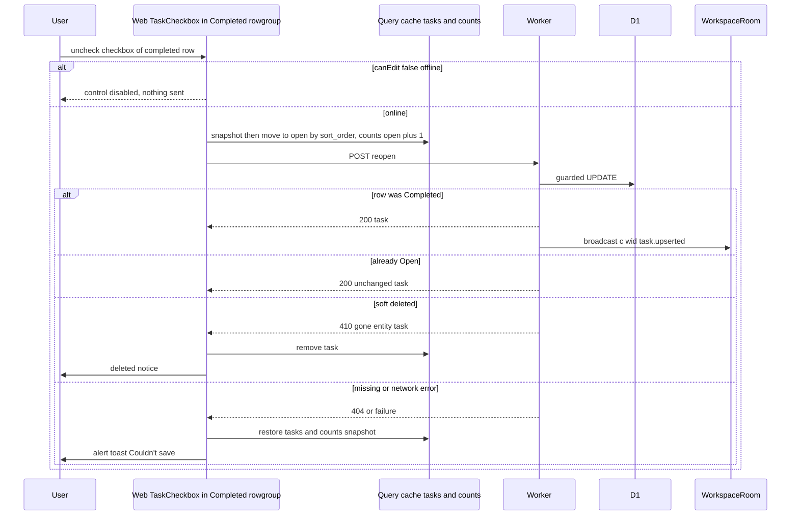
```mermaid
sequenceDiagram
  participant U as User
  participant W as Web TaskCheckbox in Completed rowgroup
  participant Q as Query cache tasks and counts
  participant A as Worker
  participant D as D1
  participant R as WorkspaceRoom
  U->>W: uncheck checkbox of completed row
  alt canEdit false offline
    W-->>U: control disabled, nothing sent
  else online
    W->>Q: snapshot then move to open by sort_order, counts open plus 1
    W->>A: POST reopen
    A->>D: guarded UPDATE
    alt row was Completed
      A-->>W: 200 task
      A->>R: broadcast c wid task.upserted
    else already Open
      A-->>W: 200 unchanged task
    else soft deleted
      A-->>W: 410 gone entity task
      W->>Q: remove task
      W->>U: deleted notice
    else missing or network error
      A-->>W: 404 or failure
      W->>Q: restore tasks and counts snapshot
      W->>U: alert toast Couldn't save
    end
  end
```

## Implementation
- `apps/api/src/db/tasks.ts`: `reopenTask` guarded by `deleted=0 AND completed_at IS NOT NULL`.
- `apps/api/src/routes/tasks.ts`: via `lifecycleRoute`.
- `apps/web/src/features/tasks/mutations.ts`: `useReopenTask` (optimistic tasks + counts, rollback), also the `onUndo` for undo of complete.

## Tests
Integration TC-I06..TC-I10, TC-I46, TC-I50; unit TC-U07, TC-U08, TC-U17; ui-component TC-C03, TC-C15, TC-C21, TC-C36; e2e TC-E01, TC-E02.

## List tasks including completed, with a remembered toggle

> Anchor: `tasks.list_completed`

## Contract
Extends story 5's `GET /api/w/:workspaceId/tasks` with **`include_completed=true|false`** (default false). Story 6 owns this parameter name and values (D-31); stories 8 and 11 conform. Composes with `list=inbox|project` and `projectId` (story 7); there is no `project:<id>` form and no `list=today`.
- 200 `{ tasks: Task[] }`: open tasks by `sort_order` asc, then (if include_completed) completed tasks by `completed_at` desc; ties by `id`. Soft-deleted tasks never returned.
- Errors: 400 `validation` for any other value; 404 `not_found` for auth miss. No side effects.
- Query key: `queryKeys.tasks(wid, {list, projectId?, includeCompleted})` (D-37).

Client preference contract:
```ts
// apps/web/src/features/tasks/showCompletedPref.ts
export function readShowCompleted(storage: Storage | undefined, workspaceId: string, listKey: string): boolean
export function writeShowCompleted(storage: Storage | undefined, workspaceId: string, listKey: string, on: boolean): void
// key: `tdl:showCompleted:${workspaceId}:${listKey}`; every access wrapped in try/catch; failures read as false and writes are dropped
```

Placement and offline (D-10): `ShowCompletedToggle` renders in the **view header**, beside the view title; it is **not gated** by `useCanEdit()`, so it stays usable offline (viewing is not a change). Completed tasks render in story 5's `TaskGrid` as a **Completed `role=rowgroup`** with its own header row ("Completed"), below the open rowgroup(s) (D-01).

## Sequence: toggle show completed
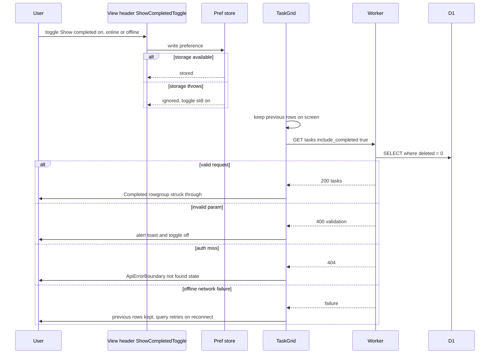
```mermaid
sequenceDiagram
  participant U as User
  participant H as View header ShowCompletedToggle
  participant P as Pref store
  participant G as TaskGrid
  participant A as Worker
  participant D as D1
  U->>H: toggle Show completed on, online or offline
  H->>P: write preference
  alt storage available
    P-->>H: stored
  else storage throws
    P-->>H: ignored, toggle still on
  end
  G->>G: keep previous rows on screen
  G->>A: GET tasks include_completed true
  A->>D: SELECT where deleted = 0
  alt valid request
    A-->>G: 200 tasks
    G->>U: Completed rowgroup struck through
  else invalid param
    A-->>G: 400 validation
    G->>U: alert toast and toggle off
  else auth miss
    A-->>G: 404
    G->>U: ApiErrorBoundary not found state
  else offline network failure
    A-->>G: failure
    G->>U: previous rows kept, query retries on reconnect
  end
```

## Implementation
- `packages/shared/src/schemas.ts`: `ListTasksQuerySchema` (`include_completed` as `z.enum(['true','false']).optional()`), `parseIncludeCompleted`.
- `packages/shared/src/dates.ts` (**owner: story 6**, created here, extended by story 8, D-43): `formatCompletedDate(iso, locale)` using `Intl.DateTimeFormat` instances cached in a module-level `Map` keyed by locale and options (`js-cache-function-results`); no `date-fns` in this story.
- `apps/api/src/db/tasks.ts`: `listTasks(db, workspaceId, { includeCompleted })` using index `(workspace_id, deleted, completed_at, sort_order)`; filter object param so story 7's project scope composes.
- `apps/web/src/features/tasks/showCompletedPref.ts`: codec above.
- `apps/web/src/features/tasks/ShowCompletedToggle.tsx`: state initialised lazily from `readShowCompleted` (`rerender-lazy-state-init`); writes happen in the click handler (`rerender-move-effect-to-event`), not an effect. Rendered through the view header slot; not gated (does not read `canEdit`).
- `apps/web/src/features/tasks/CompletedRowGroup.tsx`: renders the Completed `role=rowgroup` inside story 5's `TaskGrid` using story 5's `TaskRow`; completed rows are included in `aria-rowcount`. Empty group text: No completed tasks.
- Story 5's grid query uses `queryKeys.tasks(wid, {list, projectId?, includeCompleted})` with `placeholderData: keepPreviousData` so toggling never flashes an empty or loading state; completed group rendered with a ternary (`rendering-conditional-render`). Per-row `content-visibility` comes from story 5's `styles/rows.css` (D-07).

## Tests
Integration TC-I26, TC-I27, TC-I39, TC-I52; unit TC-U06, TC-U07, TC-U14, TC-U15; ui-component TC-C15, TC-C20, TC-C29, TC-C33; e2e TC-E02, TC-E09.

## Edit task name and description

> Anchor: `tasks.edit`

## Contract
`PATCH /api/w/:workspaceId/tasks/:taskId` body `TaskPatch = { name?: string; description?: string }` (strict; at least one key). Story 8 extends the schema with `dueDate` (extension point, see "Extension points owned by story 6").
- `name`: trimmed; if trimmed is empty the field is ignored (previous name kept). Max `TASK_NAME_MAX`.
- `description`: max `TASK_DESCRIPTION_MAX`; empty string clears it.
- 200 `{ task }`. Effective change: `version += 1`, `updated_at = now`, `broadcast(c, wid, {type:'task.upserted', ...})` (D-26). No effective change: unchanged, no broadcast.
- Works on Open and Completed tasks.
- Errors: 400 `validation`, 404 `not_found`, 410 `{error:'gone', entity:'task'}`, 403 `forbidden_client`, 415 `unsupported_media_type`.
- Conflict policy: last write wins (architecture 7); editors learn of other changes via story 4's `useEditGuard({key, fields, entityLabel, save})` (D-18).
- Client: requires `canEdit`; the detail sheet is read-only offline.

```ts
export const TaskPatchSchema: z.ZodType<TaskPatch>
export function resolvePatchedName(input: string | undefined, previous: string): string
export function updateTask(db: D1Database, workspaceId: string, taskId: string, patch: TaskPatch, now: string): Promise<MutationResult<Task>>
```

## Sequence: edit
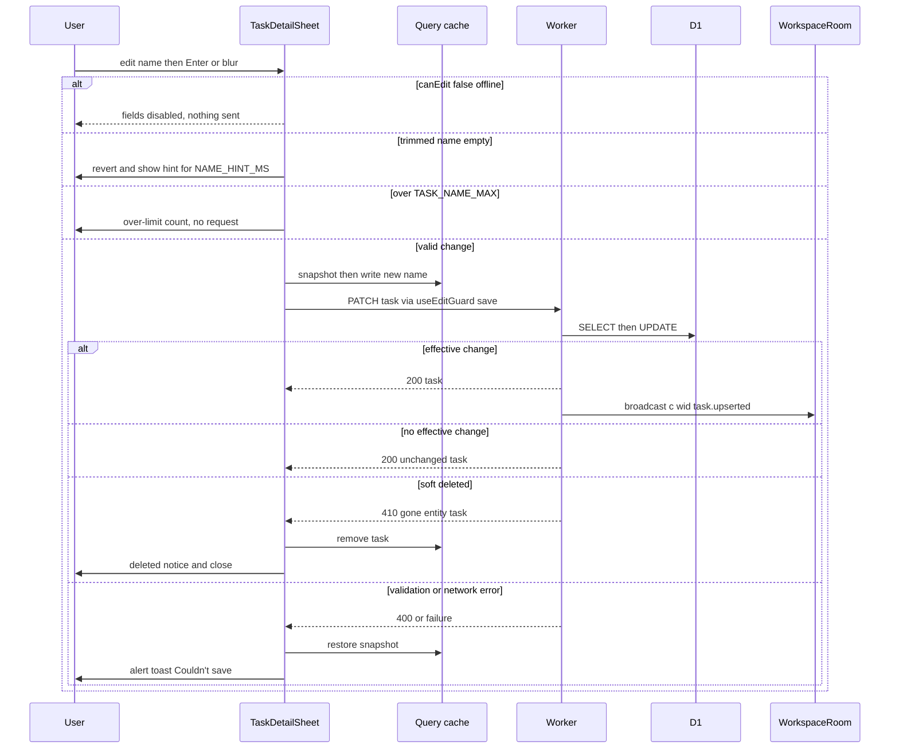
```mermaid
sequenceDiagram
  participant U as User
  participant S as TaskDetailSheet
  participant Q as Query cache
  participant A as Worker
  participant D as D1
  participant R as WorkspaceRoom
  U->>S: edit name then Enter or blur
  alt canEdit false offline
    S-->>U: fields disabled, nothing sent
  else trimmed name empty
    S->>U: revert and show hint for NAME_HINT_MS
  else over TASK_NAME_MAX
    S->>U: over-limit count, no request
  else valid change
    S->>Q: snapshot then write new name
    S->>A: PATCH task via useEditGuard save
    A->>D: SELECT then UPDATE
    alt effective change
      A-->>S: 200 task
      A->>R: broadcast c wid task.upserted
    else no effective change
      A-->>S: 200 unchanged task
    else soft deleted
      A-->>S: 410 gone entity task
      S->>Q: remove task
      S->>U: deleted notice and close
    else validation or network error
      A-->>S: 400 or failure
      S->>Q: restore snapshot
      S->>U: alert toast Couldn't save
    end
  end
```

## Implementation
- `packages/shared/src/schemas.ts`: `TaskPatchSchema` (`.strict()`, `.refine` at least one key), `resolvePatchedName`.
- `apps/api/src/db/tasks.ts`: `updateTask` computes the effective patch; `UPDATE ... SET version = version + 1 ... RETURNING *` only if changed.
- `apps/api/src/routes/tasks.ts`: PATCH handler with zod validation; broadcast once via `broadcast(c, wid, event)`.
- `apps/web/src/features/tasks/mutations.ts`: `useUpdateTask` optimistic with rollback; passed as the `save` of `useEditGuard`.
- Client editing surface is `ui.task_detail`.

## Tests
Integration TC-I11..TC-I15, TC-I28..TC-I38, TC-I40, TC-I47; unit TC-U01..TC-U05; ui-component TC-C06..TC-C11, TC-C19, TC-C33; e2e TC-E03, TC-E05, TC-E06.

## Delete a task immediately and retain it

> Anchor: `tasks.delete`

## Contract
`DELETE /api/w/:workspaceId/tasks/:taskId` (headers `X-Todoodle-Client`, `X-Todoodle-Client-Id`; no body).
- 204. If not deleted: `deleted = 1`, `deleted_at = now`, `version += 1`, `broadcast(c, wid, {type:'task.deleted', ...})` (D-26); other columns untouched. If already deleted: 204 no-op, no change, no broadcast.
- Errors: 404 `not_found`, 403 `forbidden_client`.
- **No confirmation step in any client surface** (owner decision 2026-09-25). Undo via `tasks.restore`.
- Retention: no endpoint, job or migration hard-deletes tasks. Every read filters `deleted = 0`; rows stay in D1. Operator recovery: `docs/ops/recover-deleted-task.md`.
- Client: requires `canEdit`; optimistic counts delta (D-38): `total` -1, and `open` -1 when the task was open.

### No-op and deleted rules — pattern owner (D-29)
Story 6's rules are the pattern that story 7 adopts; confirmed against the D-29 table:
| Request | Story 6 response | D-29 |
|---|---|---|
| Delete an already-deleted task | 204 no-op (TC-I18, TC-I19) | matches |
| Restore an active task | 200 no-op, no broadcast; no `not_deleted` error (TC-I21, TC-I22) | matches |
| Complete, reopen or PATCH a deleted task | 410 `{error:'gone', entity:'task'}` (TC-I03, TC-I04, TC-I08, TC-I09, TC-I13, TC-I14) | matches |
| Create/move with bad `projectId`; `list=project` of deleted project | not in story 6 (story 7) | n/a |

### Test route (D-35)
`GET /test/tasks/:id/raw` is **registered in story 1's `/test/*` registry** in `apps/api/src/routes/test.ts` (route owner: 6). Returns the raw D1 row including `deleted` and `deleted_at`; 404 in production like every `/test/*` route.

```ts
export function softDeleteTask(db: D1Database, workspaceId: string, taskId: string, now: string): Promise<MutationResult<Task>>
```

## Sequence: delete and undo
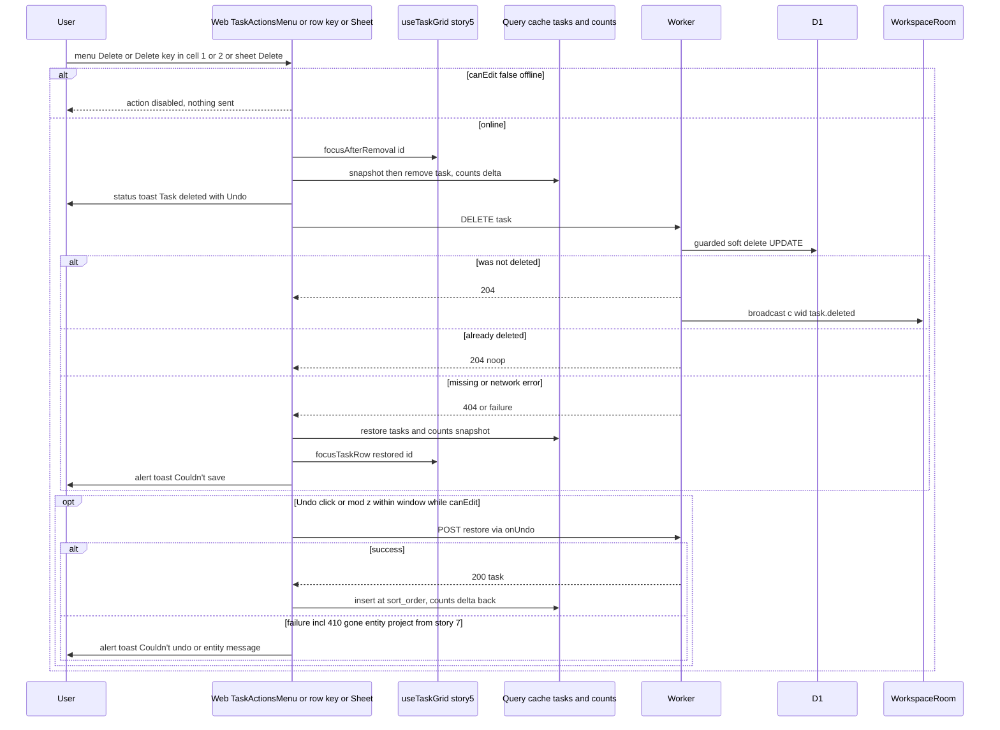
```mermaid
sequenceDiagram
  participant U as User
  participant W as Web TaskActionsMenu or row key or Sheet
  participant G as useTaskGrid story5
  participant Q as Query cache tasks and counts
  participant A as Worker
  participant D as D1
  participant R as WorkspaceRoom
  U->>W: menu Delete or Delete key in cell 1 or 2 or sheet Delete
  alt canEdit false offline
    W-->>U: action disabled, nothing sent
  else online
    W->>G: focusAfterRemoval id
    W->>Q: snapshot then remove task, counts delta
    W->>U: status toast Task deleted with Undo
    W->>A: DELETE task
    A->>D: guarded soft delete UPDATE
    alt was not deleted
      A-->>W: 204
      A->>R: broadcast c wid task.deleted
    else already deleted
      A-->>W: 204 noop
    else missing or network error
      A-->>W: 404 or failure
      W->>Q: restore tasks and counts snapshot
      W->>G: focusTaskRow restored id
      W->>U: alert toast Couldn't save
    end
    opt Undo click or mod z within window while canEdit
      W->>A: POST restore via onUndo
      alt success
        A-->>W: 200 task
        W->>Q: insert at sort_order, counts delta back
      else failure incl 410 gone entity project from story 7
        W->>U: alert toast Couldn't undo or entity message
      end
    end
  end
```

## Implementation
- `apps/api/src/db/tasks.ts`: `softDeleteTask` guarded UPDATE; audit that every query includes `deleted = 0` except `restoreTask` and the test raw read.
- `apps/api/src/routes/tasks.ts`: DELETE handler; broadcast once via `broadcast(c, wid, event)`.
- `apps/api/src/routes/test.ts` (story 1's registry): register `GET /test/tasks/:id/raw`.
- `apps/web/src/features/tasks/mutations.ts`: `useDeleteTask` optimistic tasks + counts; calls story 5's `focusAfterRemoval(id)` from `useTaskGrid` before removal (D-04); opens `showUndoToast({message:'Task deleted', onUndo: () => restore(id)})`.
- `docs/ops/recover-deleted-task.md`: runbook.

## Tests
Integration TC-I16..TC-I20, TC-I41, TC-I48, TC-I50, TC-I53; unit TC-U08, TC-U17; ui-component TC-C12..TC-C14, TC-C16, TC-C34, TC-C36; e2e TC-E04, TC-E06, TC-E07.

## Restore a deleted task

> Anchor: `tasks.restore`

## Contract
`POST /api/w/:workspaceId/tasks/:taskId/restore` (optional JSON `{}` body).
- 200 `{ task }`. If deleted: `deleted = 0`, `deleted_at = NULL`, `version += 1`, `broadcast(c, wid, {type:'task.restored', ...})` (D-26); `completed_at` and `sort_order` preserved. If not deleted: **200 no-op**, unchanged, no broadcast; there is no `not_deleted` error (D-29).
- Errors: 404 `not_found`, 403 `forbidden_client`, 415 `unsupported_media_type`; 410 `{error:'gone', entity}` when a `RestoreGuard` rejects (none in story 6).
- Not time-limited on the server; the 10 s limit is the UI undo window only.
- Concurrency: guarded `UPDATE ... WHERE deleted = 1`, so concurrent restores yield one change (TC-I49).
- Client: requires `canEdit`; optimistic counts delta: `total` +1, `open` +1 when the task is open.

### Extension point: restore guards (story 7, D-30)
```ts
export type RestoreGuard = (db: D1Database, workspaceId: string, row: TaskRow) => Promise<null | { kind: 'gone'; entity: 'project' }>
export const restoreGuards: RestoreGuard[] = [] // story 6 ships empty
```
`restoreTask` runs each guard, in order, after loading the deleted row and before its guarded UPDATE; the first non-null result is returned as `MutationResult {kind:'gone', entity}` and the route responds 410 `{error:'gone', entity:'project'}`. Story 7 registers the "task's project is deleted" guard and supplies the UI copy "Its project was deleted"; story 6's undo failure branch surfaces `GoneError.entity`-specific copy from the shared message map, falling back to "Couldn't undo — try again".

```ts
export function restoreTask(db: D1Database, workspaceId: string, taskId: string, now: string): Promise<MutationResult<Task>>
```

## Sequence
Restore is invoked only via undo in this story; its flow is the `opt Undo click or mod z` block of the tasks.delete sequence, including the failure branch. The server side, including the guard hook:
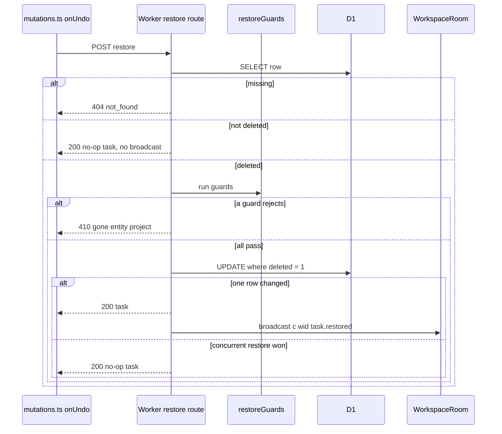
```mermaid
sequenceDiagram
  participant M as mutations.ts onUndo
  participant A as Worker restore route
  participant G as restoreGuards
  participant D as D1
  participant R as WorkspaceRoom
  M->>A: POST restore
  A->>D: SELECT row
  alt missing
    A-->>M: 404 not_found
  else not deleted
    A-->>M: 200 no-op task, no broadcast
  else deleted
    A->>G: run guards
    alt a guard rejects
      A-->>M: 410 gone entity project
    else all pass
      A->>D: UPDATE where deleted = 1
      alt one row changed
        A-->>M: 200 task
        A->>R: broadcast c wid task.restored
      else concurrent restore won
        A-->>M: 200 no-op task
      end
    end
  end
```
Remote clients receive `task.restored` through the live registry.

## Implementation
- `apps/api/src/db/tasks.ts`: `restoreTask`, `restoreGuards`.
- `apps/api/src/routes/tasks.ts`: via `lifecycleRoute`.
- `apps/web/src/features/tasks/mutations.ts`: `useRestoreTask` inserting by `sort_order` on success, counts delta.
- `apps/web/src/features/tasks/liveHandlers.ts`: `registerLiveHandler('task.restored', ...)` inserting by `sort_order` with the version guard; story 6 never edits story 4's dispatcher.

## Tests
Integration TC-I21..TC-I25, TC-I49, TC-I50, TC-I51; unit TC-U09, TC-U17; ui-component TC-C13, TC-C22, TC-C36; e2e TC-E04.

## Undo toast with pause and keyboard undo

> Anchor: `ui.undo`

## Contract
```ts
// apps/web/src/features/undo/showUndoToast.ts  (owner: 6, D-41; stories 7, 8, 11 conform)
export function showUndoToast(opts: { message: string; onUndo: () => Promise<unknown> }): UndoHandle
export type UndoHandle = { undo(): Promise<void>; readonly state: UndoState }
// apps/web/src/features/undo/createUndo.ts (pure, timer-injectable)
export function createUndo(onUndo: () => Promise<unknown>, clock: Clock): UndoHandle & { pause(): void; resume(): void }
// apps/web/src/features/undo/undoStack.ts
export function latestActiveUndo(): UndoHandle | undefined
```
- Shows a toast with an Undo button for `UNDO_WINDOW_MS` of **unpaused** time. Pointer enter or focus within pauses; leaving both resumes with the remaining time.
- Undo (click, or Cmd/Ctrl+Z on the latest active toast) calls `onUndo` once; button disabled while pending; failure shows `role=alert` toast Couldn't undo, try again (or the entity-specific `GoneError` message an extender supplies, e.g. story 7's "Its project was deleted").
- After expiry `onUndo` is never called. Multiple toasts are independent; only the most recent active one answers Cmd/Ctrl+Z.
- The returned `UndoHandle` lets another surface (story 11's Finder inline status line, D-15) trigger the same undo as the global toast.
- Toast container is `role=status` (polite). Messages: Task completed, Task deleted, Task restored (after a successful undo).
- **Offline (D-10):** the toast is portalled, so it gates itself with `useCanEdit()`: while `canEdit` is false the Undo button is `disabled` and Cmd/Ctrl+Z does nothing; the window keeps counting (no pause).
- **Shortcut (D-14):** registered via story 5's `useGlobalShortcut({key:'z', modifiers:['mod'], scope:'global', description:'Undo'})` with the handler as story 5's signature takes it; `allowInOverlay` is not set, so the overlay scope stack suppresses it while any overlay (detail sheet, picker, dialog, Finder, `?` panel) is open. `isTypingTarget` suppresses it inside text inputs, where native text undo applies; it does not `preventDefault` when it does nothing.

## Sequence: keyboard undo
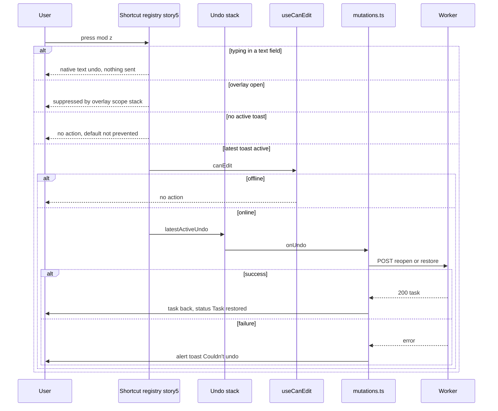
```mermaid
sequenceDiagram
  participant U as User
  participant K as Shortcut registry story5
  participant S as Undo stack
  participant C as useCanEdit
  participant M as mutations.ts
  participant A as Worker
  U->>K: press mod z
  alt typing in a text field
    K-->>U: native text undo, nothing sent
  else overlay open
    K-->>U: suppressed by overlay scope stack
  else no active toast
    K-->>U: no action, default not prevented
  else latest toast active
    K->>C: canEdit
    alt offline
      C-->>U: no action
    else online
      K->>S: latestActiveUndo
      S->>M: onUndo
      M->>A: POST reopen or restore
      alt success
        A-->>M: 200 task
        M->>U: task back, status Task restored
      else failure
        A-->>M: error
        M->>U: alert toast Couldn't undo
      end
    end
  end
```

## Implementation
- `apps/web/src/features/undo/showUndoToast.ts`: wraps `sonner` `toast()` with a custom action element; hover and focus handlers call `pause`/`resume` on the `createUndo` handle; `duration: Infinity` on sonner with our own scheduler governing dismissal so pause semantics are exact; the Undo button reads `useCanEdit()`.
- `apps/web/src/features/undo/createUndo.ts`: pure scheduler (`Clock` injected) tracking remaining time.
- `apps/web/src/features/undo/undoStack.ts`: module-level array of active handles (pushed on show, removed on expiry or undo).
- `apps/web/src/features/undo/useUndoShortcut.ts`: registers the `{key:'z', modifiers:['mod'], scope:'global'}` shortcut once at shell level; handler checks `canEdit` (read from the store snapshot at event time) and `latestActiveUndo()`.
- `onUndo` callbacks are captured from stable refs (`advanced-event-handler-refs`) so toasts never hold stale closures.
- `packages/shared/src/limits.ts`: `UNDO_WINDOW_MS = 10_000`.

## Tests
Unit TC-U10, TC-U11, TC-U12, TC-U16; ui-component TC-C03, TC-C04, TC-C13, TC-C22, TC-C24..TC-C26, TC-C31, TC-C34; e2e TC-E01, TC-E04, TC-E06, TC-E08, TC-E09.

## Task row actions, completion feedback, touch and keyboard

> Anchor: `ui.task_actions`

## Contract
Story 6 renders into story 5's grid cell slots (D-01, D-06). `TaskRow` keeps story 5's props `<TaskRow task localStatus?>`; story 6 adds **no primitive props** and no `isFocused` prop.

| Cell | Story 6 content |
|---|---|
| 1 | `<TaskCheckbox task>`: native `<input type="checkbox">` (D-03). Accessible name = task name (`aria-labelledby` the name button); `aria-describedby` points to a visually hidden "Complete" (open) or "Reopen" (completed). `checked` flips immediately on change. Hit area ≥ `MIN_TOUCH_TARGET_PX` via its label box. No `role=button`, no `aria-checked`. |
| 2 (story 5) | Name button + `TaskSummary`. Story 6 wires the name button's activation (click/Enter) to `openTaskDetail(task.id, {returnFocusTo: nameButton})`; completed rows add strike-through, muted style and the completion date via `formatCompletedDate`. |
| 3 | `<TaskActionsMenu task>` (`features/tasks/TaskActionsMenu.tsx`, D-43): `…` trigger + Radix `DropdownMenu` with the `menuItems` registry; story 6 registers Edit (hint E) and Delete (hint Del, acts immediately, no dialog). Rendered beside story 5's Retry/Discard, which show only for `localStatus ∈ {failed, rejected}`. |

- Completed tasks render in the **Completed `role=rowgroup`** (see tasks.list_completed).
- Completion: row enters `Leaving` for `COMPLETE_ANIMATION_MS`, or 0 under `prefers-reduced-motion: reduce`, then is removed.
- Menu trigger always visible under `@media (hover: none)`; otherwise visible on row hover or focus-within.
- Row `aria-busy` (story 5's attribute) while any mutation for it is pending.
- **Row keyboard contract (D-02, story 5 owns navigation):**
  - Space and Delete/Backspace act only when focus is in cell 1 or cell 2. On a button in cell 3, Space presses that button (native behaviour; the grid handler returns without acting).
  - E opens the detail sheet from any cell.
  - Enter on the name button opens the detail sheet.
  - Every mutating key requires `canEdit`; E and Enter open the sheet read-only offline.
- **Offline (D-10; there is no fieldset anywhere in the app):** story 5's TaskRow cells gate once via `canEdit` from `TaskRowSlotsContext`: the cell-1 `TaskCheckbox` is disabled offline; the cell-3 `…` trigger stays **enabled**; the portalled menu content reads `useCanEdit()` and disables items with `requiresCanEdit` (Delete). Edit stays enabled (opens read-only). Row keys Space/Delete no-op offline via `getCanEdit()`.

```ts
// apps/web/src/features/tasks/rowKeys.ts (pure)
export type Cell = 1 | 2 | 3
export type RowKeyAction = 'complete' | 'delete' | 'open' | null
export function rowKeyAction(key: string, cell: Cell, canEdit: boolean): RowKeyAction
```

## Sequence: row keys and offline gating
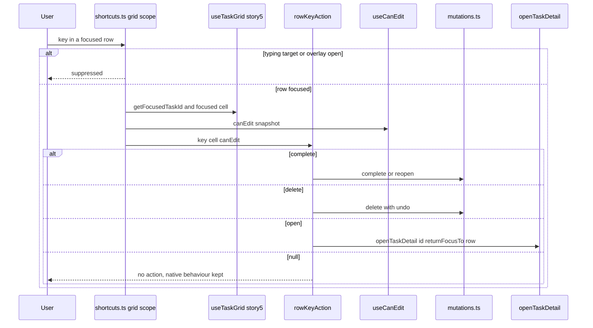
```mermaid
sequenceDiagram
  participant U as User
  participant K as shortcuts.ts grid scope
  participant G as useTaskGrid story5
  participant P as rowKeyAction
  participant C as useCanEdit
  participant M as mutations.ts
  participant O as openTaskDetail
  U->>K: key in a focused row
  alt typing target or overlay open
    K-->>U: suppressed
  else row focused
    K->>G: getFocusedTaskId and focused cell
    K->>C: canEdit snapshot
    K->>P: key cell canEdit
    alt complete
      P->>M: complete or reopen
    else delete
      P->>M: delete with undo
    else open
      P->>O: openTaskDetail id returnFocusTo row
    else null
      P-->>U: no action, native behaviour kept
    end
  end
```

## Implementation
- `apps/web/src/features/tasks/TaskCheckbox.tsx`: native checkbox, `onChange` → `useCompleteTask`/`useReopenTask`; hidden description ids; `disabled` when `canEdit` from story 5's `TaskRowSlotsContext` is false.
- `apps/web/src/features/tasks/TaskActionsMenu.tsx`: `DropdownMenu`, `menuItems` registry (extension point for stories 7 and 8), `useCanEdit()` gating of portalled items (the trigger is never disabled); per-icon lucide imports (D-43); `onPointerEnter`/`onFocus` on the row call `preloadTaskDetail()` (`bundle-preload`).
- `apps/web/src/features/tasks/rowKeys.ts`: pure `rowKeyAction` decision table.
- `apps/web/src/features/tasks/useTaskShortcuts.ts`: registers the row shortcuts once per grid with `useGlobalShortcut({key, scope:'grid', description})` (no own listener, no own `isTypingTarget`); handlers read `getFocusedTaskId()` from `useTaskGrid` and the focused cell from `document.activeElement.closest('[role=gridcell]')` inside the event (`rerender-move-effect-to-event`), and `canEdit` from the store snapshot, so focus changes never re-render rows.
- `apps/web/src/features/tasks/rowShortcuts.ts`: static shortcut table (key, modifiers, scope, description) consumed by the registry and the `?` panel.
- Leaving transition uses `motion-safe:` classes; per-row `content-visibility` stays in story 5's `styles/rows.css` (D-07).
- Toasts: success `role=status`, failures `role=alert` (via sonner options).
- `apps/web/src/features/tasks/ShowCompletedToggle.tsx`: see tasks.list_completed.
- Removed: primitive-prop `TaskRow` wrapper, round `role=button` checkbox with `aria-checked`, `document.activeElement.closest('[data-task-id]')` row lookup (replaced by `getFocusedTaskId`).

## Tests
Unit TC-U16, TC-U18; ui-component TC-C01, TC-C12, TC-C15..TC-C18, TC-C20, TC-C23, TC-C30, TC-C31, TC-C34, TC-C37; e2e TC-E06, TC-E07, TC-E09, TC-E10.

## Task detail panel

> Anchor: `ui.task_detail`

## Contract
```ts
// apps/web/src/features/tasks/openTaskDetail.ts  (owner: 6, D-05)
export function openTaskDetail(id: string, opts: { returnFocusTo?: HTMLElement | null }): void
// apps/web/src/features/tasks/TaskDetailSheet.tsx (D-43), mounted once by <TaskDetailHost/> in the workspace route
```
- **Callable without an anchored row**: from grid rows (name button, E key, menu Edit) and from story 11's Finder. `openTaskDetail` writes `{taskId, returnFocusTo}` into a tiny module store read by the single `TaskDetailHost`, which renders the lazy sheet.
- Right-side shadcn `Sheet`; at widths below `MOBILE_BREAKPOINT_PX` it is full-screen. Contains editable name (single line), description (multi-line), a `fieldsSlot` (story 8's due-date field), Delete button, close button.
- Name saves on Enter or blur; description on blur; Escape cancels the in-progress edit (first press) and closes (second press). The sheet is an overlay: it pushes onto story 5's overlay scope stack (D-14) and stops Escape propagation, so Escape never reaches quick add or the grid underneath.
- Blank name reverts without a request and shows Name can't be empty for story 2's `NAME_HINT_MS` (imported from `limits.ts`, not defined here; D-44).
- Over `TASK_NAME_MAX`: text kept, over-limit count shown in red, no save (architecture 12 length rule).
- Delete button deletes immediately (no dialog), closes the sheet and focus goes via story 5's `focusAfterRemoval(id)`.
- **Edit guard (D-18):** `useEditGuard({key: queryKeys.tasks(wid, …) entry for taskId, fields: ['name', 'description'], entityLabel: 'task', save: (draft) => updateTask(id, draft)})` renders story 4's notices: "Someone else changed this task just now." with Use my version / Keep theirs, and the deleted notice.
- **Offline (D-10):** the sheet is portalled, so it gates itself with `useCanEdit()`. It still opens offline, **read-only**: name, description, `fieldsSlot` fields and Delete are `disabled`; drafts already typed are kept, not cleared; nothing is saved. When `canEdit` returns to true the fields re-enable with the kept draft.
- Focus: name focused on open (the close button when read-only); on close, focus returns to `returnFocusTo` if it is still connected; else, if the task's row still exists, `focusTaskRow(id)`; else the nearest surviving container heading (D-19; for task views the view title).

## Sequence: open from a row or the Finder, offline and focus return
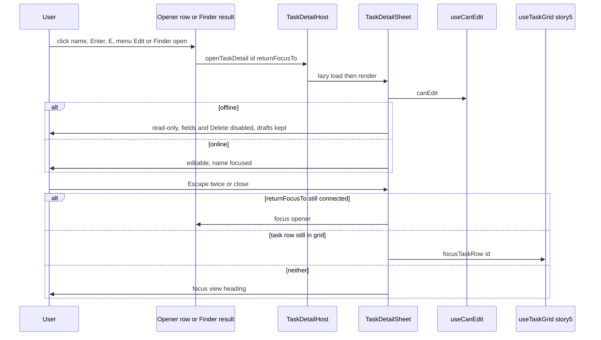
```mermaid
sequenceDiagram
  participant U as User
  participant O as Opener row or Finder result
  participant H as TaskDetailHost
  participant S as TaskDetailSheet
  participant C as useCanEdit
  participant G as useTaskGrid story5
  U->>O: click name, Enter, E, menu Edit or Finder open
  O->>H: openTaskDetail id returnFocusTo
  H->>S: lazy load then render
  S->>C: canEdit
  alt offline
    S->>U: read-only, fields and Delete disabled, drafts kept
  else online
    S->>U: editable, name focused
  end
  U->>S: Escape twice or close
  alt returnFocusTo still connected
    S->>O: focus opener
  else task row still in grid
    S->>G: focusTaskRow id
  else neither
    S->>U: focus view heading
  end
```

## Implementation
- `apps/web/src/features/tasks/openTaskDetail.ts`: module store (`useSyncExternalStore`) + `openTaskDetail`/`closeTaskDetail`.
- `apps/web/src/features/tasks/TaskDetailHost.tsx`: single mount point in the workspace route; renders `LazyTaskDetailSheet` when a task id is set.
- `apps/web/src/features/tasks/TaskDetailSheet.tsx` (lazy chunk via story 2's `lazyWithRetry`) and `TaskDetailSheet.lazy.ts` exporting the lazy component and `preloadTaskDetail()` (`bundle-dynamic-imports`, `bundle-preload`).
- Reads the task with `useQuery({ ...queryKeys.tasks(wid, listOpts), select })` where `select` comes from a module-level `selectTaskById(id)` factory memoised per id, so the reference is stable and the sheet re-renders only when that task changes (`rerender-derived-state`). If the task is not in any cached list (Finder open from another view), it falls back to the cached search result entity passed by story 11 through the store.
- Draft state initialised lazily from the task; component keyed by `task.id` so switching tasks resets drafts without an effect (`rerender-lazy-state-init`, `rerender-derived-state-no-effect`).
- Responsive variant chosen by CSS media query classes, not JS width state.

## Tests
ui-component TC-C05..TC-C11, TC-C19, TC-C28, TC-C30, TC-C32, TC-C33, TC-C35; e2e TC-E03, TC-E06, TC-E07, TC-E09.

## Focus management after actions

> Anchor: `ui.focus_management`

## Contract
Story 6 owns **when** focus moves after its actions; story 5 owns **where** (D-04). Story 6 does not create `focusAfterAction.ts` and does not use `setActiveRow` — both are deleted.

```ts
// story 5: apps/web/src/features/tasks/useTaskGrid.ts (used, not owned)
focusTaskRow(id: string): void
getFocusedTaskId(): string | undefined
focusAfterRemoval(id: string): void // next row, else previous, else the add-task control; also used for remote removals
// story 6: apps/web/src/features/tasks/removalFocusTiming.ts (pure)
export function removalFocusTiming(kind: 'delete' | 'complete', reducedMotion: boolean): { delayMs: number }
```
- Delete (row key, menu, sheet): `focusAfterRemoval(id)` in `onMutate`, before the row leaves (`delayMs = 0`).
- Complete: after the leaving animation (`delayMs = COMPLETE_ANIMATION_MS`, 0 under reduced motion).
- Rollback after a failed complete/delete: `focusTaskRow(restoredId)`, only if focus is still on the target chosen by `focusAfterRemoval` (the user hasn't moved on).
- Closing the detail sheet without removal returns focus to `returnFocusTo` (see ui.task_detail), else `focusTaskRow(id)`, else the D-19 heading fallback.
- Rows removed by collaborators or by invalidation are handled by story 5's grid calling `focusAfterRemoval` itself; story 6 adds nothing there.

## Sequence: focus after removal
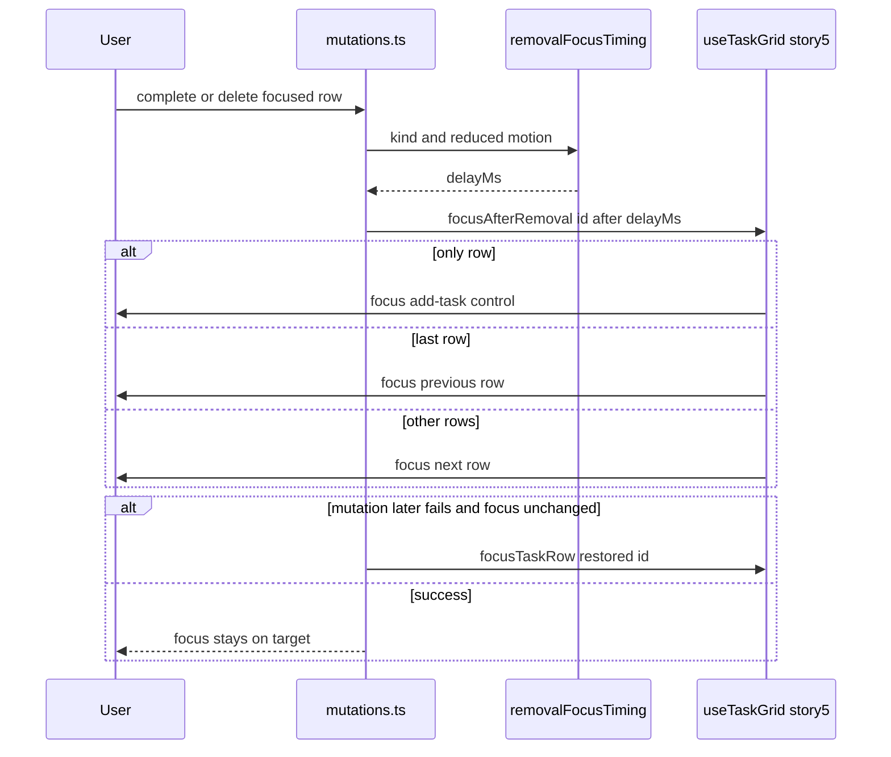
```mermaid
sequenceDiagram
  participant U as User
  participant M as mutations.ts
  participant T as removalFocusTiming
  participant G as useTaskGrid story5
  U->>M: complete or delete focused row
  M->>T: kind and reduced motion
  T-->>M: delayMs
  M->>G: focusAfterRemoval id after delayMs
  alt only row
    G->>U: focus add-task control
  else last row
    G->>U: focus previous row
  else other rows
    G->>U: focus next row
  end
  alt mutation later fails and focus unchanged
    M->>G: focusTaskRow restored id
  else success
    M-->>U: focus stays on target
  end
```

## Implementation
- `apps/web/src/features/tasks/removalFocusTiming.ts`: pure timing rule.
- `apps/web/src/features/tasks/mutations.ts`: calls story 5's `focusAfterRemoval`/`focusTaskRow` via `useTaskGrid()` per the rules above.
- Deleted from the plan: `features/tasks/focusAfterAction.ts` (`nextFocusTarget`, DOM helper) and any use of `setActiveRow`.
- The next/previous/add-task selection unit test is story 5's; story 6's former TC-U13 is re-scoped to `removalFocusTiming` so the rule is tested once (D-04 dedupe).

## Tests
Unit TC-U13 (re-scoped); ui-component TC-C27, TC-C28, TC-C35; e2e TC-E06.

