# Technical Design

Projects: migration 0003, project CRUD + atomic batch delete/restore, scoped task create/list/move, live project events, sidebar/project view/delete-undo/move UI. Follows docs/architecture.md.

## Overview

Adds projects to a workspace. Follows `docs/architecture.md` (single Worker + SPA, cookie workspace auth, D1 source of truth, WorkspaceRoom Durable Object fan-out, TanStack Query optimistic mutations, constants in `packages/shared/src/limits.ts`) including the binding frontend conventions in §12 and the ownership/extension rule in §13. Cross-story decisions are in `specs/general/CROSS-STORY-RESOLUTIONS.md` (D-nn below); what this story owns and what it extends is listed in the section 'Deltas to other stories / extension points used and owned'.

**Depends on:** story 1 (skeleton, middleware, `/test/*` registry, Playwright matrix), story 2 (workspaces, `workspace-auth`, open flow, `App.tsx` route table + `workspacePath`, fragment carry-over rule, `lib/queryKeys.ts`, `lib/lazyWithRetry.ts`, `packages/shared/src/tokens.ts` + contrast checker, `NAME_HINT_MS`, `features/live/canEdit.ts` stub), story 4 (WorkspaceRoom, `broadcast(c, wid, event)`, events union, `registerLiveHandler`, `useEditGuard`, real `useCanEdit()`, `GoneError{entity}`), story 5 (tasks table, idempotent create with client ids and `CLIENT_ID_BYTES`, `list=` query, `/counts`, `AppShell` sidebar slot + drawer, QuickAdd target union, `TaskGrid`/`useTaskGrid` focus API, `lib/shortcuts.ts` with scopes and the overlay scope stack, `lib/useIsNarrow.ts`, `prefetchWorkspaceData`, `/test/seed`), story 6 (task PATCH, delete/restore and its no-op rules, `features/tasks/mutations.ts`, `TaskActionsMenu`, `showUndoToast({message, onUndo})`, `include_completed`, `packages/shared/src/dates.ts`).

**Adds / changes**
- Migration `migrations/0003_projects.sql` (owned here per architecture §5).
- API: `GET/POST /api/w/:wid/projects`, `PATCH/DELETE /api/w/:wid/projects/:pid`, `POST /api/w/:wid/projects/:pid/restore`.
- Extends story 5's `GET /api/w/:wid/counts` from `{inbox}` to `{inbox, projects:{[id]:{open,total}}}` (story 8 adds `today?`), rather than adding a second counts source.
- Extends story 5/6 task contracts: `POST /tasks` accepts optional `projectId`; `GET /tasks?list=project&projectId=<id>&include_completed=` (D-31); `PATCH /tasks/:tid` accepts `projectId` (move); story 6's single-task restore gains a project check returning 410 `gone {entity:'project'}` (D-30).
- Error codes in architecture §6: `limit_reached`, `batch_mismatch`, `project_not_found`. `not_deleted` is **retired** (D-29): restoring an active project is a 200 no-op.
- Live events: `project.upserted`, `project.deleted` (carries `batchId`), `project.restored`, `tasks.bulk {ids, deleted?}` (refetch semantics), `task.upserted` (D-25).
- Test support (D-35): project fields in story 5's `/test/seed` schema; new local-only `/test/fault` named fault injection. `/test/sql` is not built.
- SPA: sidebar Projects section; create/rename/delete/undo; project child route; `openMovePicker(taskId, {returnFocusTo})`; the shared combobox (`components/combobox/*`) and `normaliseForSearch`; M shortcut.

**Deliberate decisions**
- Project ids are client-generated (`CLIENT_ID_BYTES`, D-44) and project create is idempotent, the same pattern as story 5 tasks, so optimistic rows keep their id and retries are safe.
- Project deletion and restore are single D1 `batch()` calls (atomic), keyed by a fresh `delete_batch_id` so undo restores exactly the rows that deletion removed and nothing that was deleted separately before.
- No-op and deleted rules follow story 6's pattern (D-29): delete of a deleted project → 204; restore of an active project → 200 no-op, no broadcast; changing a deleted project → 410 `gone {entity:'project'}`; create/move targeting a missing, deleted or foreign project → 404 `project_not_found`; batch restore with a stale batch id stays 409 `batch_mismatch`.
- Counts are computed server-side in one GROUP BY on the counts endpoint; the client never holds every task of every project.
- Project ordering is creation order (`sort_order = max + 1`); no reordering in MVP.
- Task moves follow story 5's workspace-wide `sort_order` rule (`MAX + TASK_SORT_STEP`), placing the task at the end of its new list.
- Deleted projects do not count toward `MAX_PROJECTS_PER_WORKSPACE`. Duplicate names allowed.
- Moving never changes due date, completion, or name.
- Project-with-tasks delete keeps its confirmation dialog (product-owner decision 2026-09-25); undo uses the shared toast for `UNDO_WINDOW_MS` (10 s) that pauses on hover/focus.

**Revision 2026-09-25 (React best-practices audit + UX review, `specs/general/UI-IMPROVEMENTS.md`)**
- All query keys come from `queryKeys.ts` under `['ws', wid, ...]`; the counts key carries no date.
- Live handlers register through `registerLiveHandler` (a Set per type), never replacing other stories' handlers.
- `content-visibility:auto` on each `ProjectRow`, never the list container.
- `ProjectRow` has exactly one count source: a per-row `select` using a module-level selector.
- Row hover/focus preloads the ProjectView route chunk and prefetches its task list.
- 'Move to…' is a searchable picker (cmdk `Command`) opened from the task menu or M; it replaces the flat submenu.
- Touch and accessibility: '…' always visible under `@media (hover: none)`, 44 px hit areas, drawer closes on project selection, palette contrast ≥ 3:1 in light and dark, blank-name hint, no silent truncation.

**Revision 2026-09-27 (cross-story resolutions)**
- D-05 `openMovePicker(taskId, {returnFocusTo})` works without an anchored row (Finder): centred dialog on desktop, bottom sheet on phones.
- D-08 focus moves optimistically via story 5's `focusAfterRemoval(id)` when the task leaves the list, not on server success.
- D-10 the picker, project dialogs, sidebar project controls and the Move menu item gate themselves with `useCanEdit()` (there is no fieldset anywhere in the app; every control that sends a change is self-gated).
- D-12/D-13 child route registered in story 2's `App.tsx`; `useWorkspaceNavigate` keeps the fragment only when the session began from one.
- D-14 M is registered with scope `grid` through story 5's registry; D-16 Escape closes without clearing, ✕ clears.
- D-19 project delete returns focus to the Projects heading when the row is gone.
- D-25/D-26 `tasks.bulk` handlers invalidate (never patch); every broadcast is `broadcast(c, wid, event)`.
- D-29/D-30/D-31 contract alignment above; delete-dialog count from `counts.projects[id].total`.
- D-35 `/test/fault` replaces `/test/sql`; D-37/D-38 counts writes via `setQueriesData`; D-39 project queries inside `prefetchWorkspaceData`; D-42 palette values in story 2's `tokens.ts`, own `contrast.ts` deleted, lazy chunks via `lazyWithRetry`; D-43 `lib/useIsNarrow.ts`; D-44 `NAME_HINT_MS`, `CLIENT_ID_BYTES`.

## Structure

Current (after stories 1-6): tasks belong only to the Inbox.

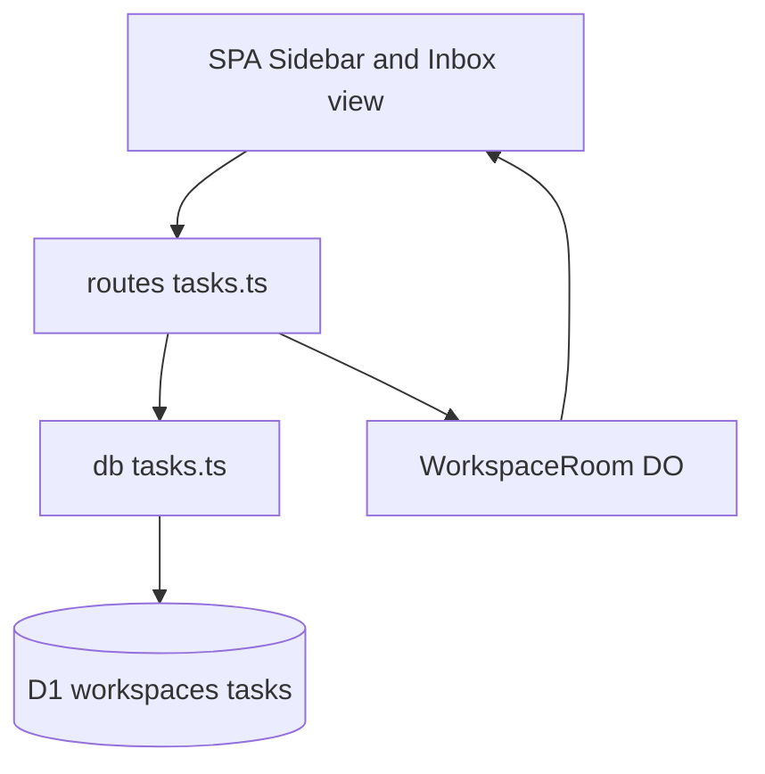
```mermaid
flowchart TD
  SPA[SPA Sidebar and Inbox view]
  TaskRoutes[routes tasks.ts]
  TasksDb[db tasks.ts]
  D1[(D1 workspaces tasks)]
  Room[WorkspaceRoom DO]
  SPA --> TaskRoutes
  TaskRoutes --> TasksDb
  TasksDb --> D1
  TaskRoutes --> Room
  Room --> SPA
```

Target (this story): new project routes and db module, tasks gain project scope, SPA gains project features that plug into shared registries and extension points owned by stories 2, 4, 5 and 6. The shared combobox built here is later reused by story 11's Finder, which also calls `openMovePicker`.

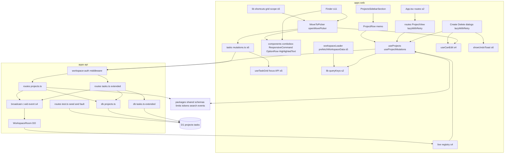
```mermaid
flowchart TD
  subgraph Web[apps web]
    Loader[workspaceLoader prefetchWorkspaceData s5]
    AppRoutes[App.tsx routes s2]
    Sidebar[ProjectsSidebarSection]
    Row[ProjectRow memo]
    ProjectView[routes ProjectView lazyWithRetry]
    Dialogs[Create Delete dialogs lazyWithRetry]
    Picker[MoveToPicker openMovePicker]
    Combo[components combobox ResponsiveCommand OptionRow HighlightedText]
    Hooks[useProjects useProjectMutations]
    TaskMut[tasks mutations.ts s6]
    Grid[useTaskGrid focus API s5]
    CanEdit[useCanEdit s4]
    Keys[lib queryKeys s2]
    Shortcuts[lib shortcuts grid scope s5]
    LiveReg[live registry s4]
    Undo[showUndoToast s6]
    Finder[Finder s11]
  end
  subgraph Api[apps api]
    Auth[workspace-auth middleware]
    ProjRoutes[routes projects.ts]
    TaskRoutes[routes tasks.ts extended]
    TestRoutes[routes test.ts seed and fault]
    ProjDb[db projects.ts]
    TasksDb[db tasks.ts extended]
    Bcast[broadcast c wid event s4]
    Room[WorkspaceRoom DO]
  end
  Shared[packages shared schemas limits tokens search events]
  D1[(D1 projects tasks)]
  AppRoutes --> ProjectView
  Loader --> Keys
  Sidebar --> Row
  Row --> Hooks
  ProjectView --> Hooks
  Dialogs --> Hooks
  Dialogs --> Undo
  Dialogs --> CanEdit
  Picker --> Combo
  Picker --> TaskMut
  Picker --> CanEdit
  TaskMut --> Grid
  Shortcuts --> Picker
  Finder --> Picker
  Finder --> Combo
  Hooks --> Keys
  Hooks --> Auth
  TaskMut --> Auth
  Auth --> ProjRoutes
  Auth --> TaskRoutes
  ProjRoutes --> ProjDb
  TaskRoutes --> TasksDb
  TaskRoutes --> ProjDb
  TestRoutes --> D1
  ProjDb --> D1
  TasksDb --> D1
  ProjRoutes --> Bcast
  TaskRoutes --> Bcast
  Bcast --> Room
  Room --> LiveReg
  LiveReg --> Hooks
  Hooks --> Shared
  ProjRoutes --> Shared
```

## Persisted State

This story adds persisted lifecycle state for projects and a new deletion cause for tasks.

**Project lifecycle** (`projects.deleted`, `projects.delete_batch_id`). No-op and deleted rules follow D-29.

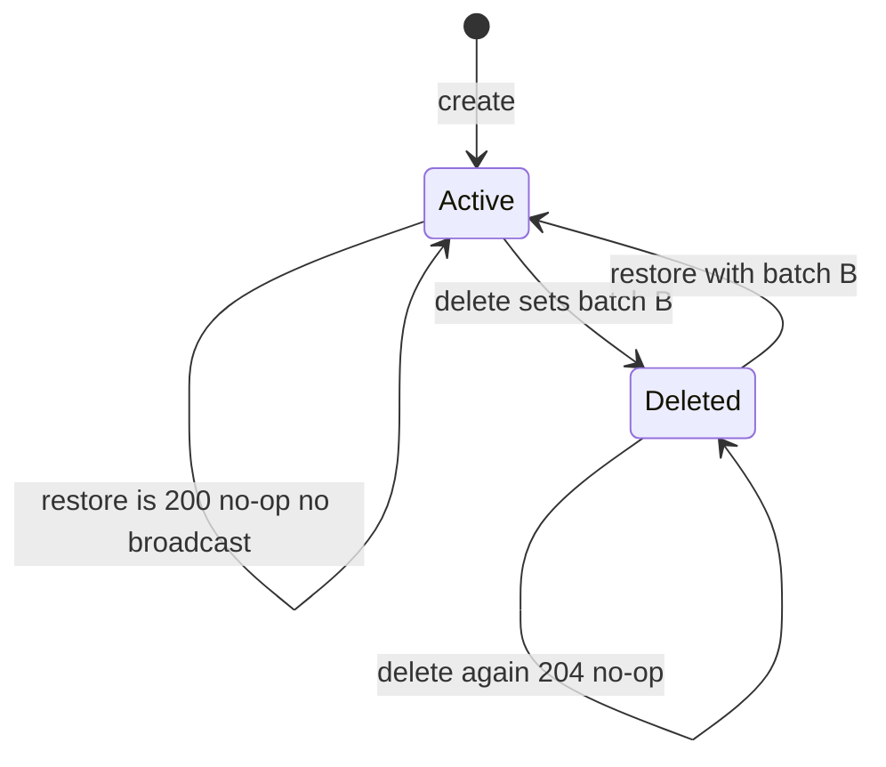
```mermaid
stateDiagram-v2
  [*] --> Active : create
  Active --> Active : rename or recolor
  Active --> Active : restore is 200 no-op no broadcast
  Active --> Deleted : delete sets batch B
  Deleted --> Active : restore with batch B
  Deleted --> Deleted : restore wrong batch 409 batch_mismatch
  Deleted --> Deleted : update 410 gone entity project
  Deleted --> Deleted : delete again 204 no-op
```

**Task lifecycle as affected by this story** (`tasks.deleted`, `tasks.delete_batch_id`, `tasks.completed_at`, `tasks.project_id`):

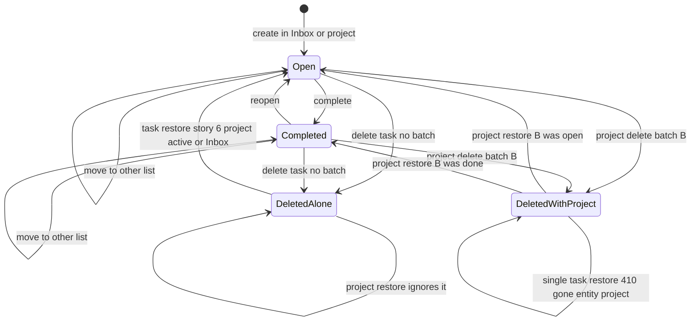
```mermaid
stateDiagram-v2
  [*] --> Open : create in Inbox or project
  Open --> Open : move to other list
  Open --> Completed : complete
  Completed --> Open : reopen
  Completed --> Completed : move to other list
  Open --> DeletedAlone : delete task no batch
  Completed --> DeletedAlone : delete task no batch
  DeletedAlone --> Open : task restore story 6 project active or Inbox
  DeletedAlone --> DeletedAlone : task restore while project deleted 410 gone entity project
  Open --> DeletedWithProject : project delete batch B
  Completed --> DeletedWithProject : project delete batch B
  DeletedWithProject --> Open : project restore B was open
  DeletedWithProject --> Completed : project restore B was done
  DeletedWithProject --> DeletedWithProject : single task restore 410 gone entity project
  DeletedAlone --> DeletedAlone : project restore ignores it
```

Restoring a task to Open vs Completed simply leaves `completed_at` untouched: deletion never clears it. `DeletedAlone` rows have `delete_batch_id IS NULL` and are excluded from the batch update both at delete time (`WHERE deleted = 0`) and at restore time (`WHERE delete_batch_id = ?B`). A single-task restore (story 6's route, extended here per D-30) is refused with 410 `gone {entity:'project'}` whenever the task's `project_id` points at a deleted project, so a task can never be active inside a deleted project.

## SPA Routing Decision

Architecture §4 (as updated by story 2): links open via `/w#<secret>`; remembered workspaces open via the SPA route `/w/:workspaceId` with no secret (cookie auth). Story 2 owns the route table in `apps/web/src/App.tsx` and `workspacePath(wid, view)` (D-12); this story registers one child route there and builds its paths with `workspacePath`:

| Route | View | Owner |
|---|---|---|
| `/w/:workspaceId` | Inbox | story 2/5 |
| `/w/:workspaceId/today` | Today | story 8 |
| `/w/:workspaceId/project/:projectId` | Project | this story (child registered in story 2's `App.tsx`) |

- All in-app navigation uses `useWorkspaceNavigate()` (`apps/web/src/features/workspace/useWorkspaceNavigate.ts`, created here as the earliest user). It conforms to story 2's fragment carry-over rule (D-13): it keeps the fragment on `/w/:id/*` paths **only when the session began from a fragment link** (story 2's session-origin state), so a link-opened session stays bookmarkable in every view; a session opened by id from the remembered list navigates path-only and never gains a fragment.
- Reloading `/w/:workspaceId/project/:projectId` works in the browser that remembers the workspace (cookie). In a browser without the cookie, the path alone grants nothing (story 2's `ApiErrorBoundary` NotFound state), which is the intended security property.
- Project ids are non-secret handles; knowing one grants nothing.
- Unknown or deleted `:projectId` on load (404 `project_not_found` or 410 `gone {entity:'project'}` from `list=project`, mapped by `body.error` per D-20, or absent from the projects cache after load): redirect to Inbox with toast 'Project not found'.
- Task creation with `projectId` uses story 5's client-generated task id; retries remain idempotent and `id_conflict` is unchanged.

## Test Strategy

## Test Scopes

| Level | Applies | Why |
|---|---|---|
| unit | yes | zod schemas (name/colour boundaries), pure decision functions, live-event cache reducer, optimistic count adjustment, migration safety scan, destination filtering, name-field state, palette contrast via story 2's checker, live registry coexistence, search normaliser |
| integration | yes | every route via `SELF.fetch` through real Hono + workspace-auth + real Miniflare D1 + real WorkspaceRoom; persisted state asserted before/after with direct SQL; test-route environment gating |
| ui-component | yes | sidebar, dialogs, project view, Move to picker, M shortcut, `openMovePicker` without anchor, offline gating, touch visibility, live handlers with MSW-mocked network |
| e2e | yes | cross-surface flows (create, delete/undo, collaboration across two browser contexts, reload and cookie-less access, keyboard-only, phone viewport, task undo after project deletion) |

## Dimensions crossed

- **D1 Operation**: list projects, counts, create, update, delete, restore, move task, create task in project, list tasks by project, restore single task (story 6 route, D-30)
- **D2 Target prior state**: active, soft-deleted, nonexistent, other workspace
- **D3 Project contents**: 0 tasks; N open; N open plus completed; includes a task deleted on its own earlier
- **D4 Input class**: name empty / whitespace / 1 / 107 / 108 / 120 / 121 / padded; colour key in palette / not; client id new / replay / deleted / foreign; projectId null / active / deleted / other-workspace / nonexistent; batchId matching / stale / wrong; picker query empty / case-different / accented / no-match / whitespace
- **D5 Active project count**: 0 / 299 / 300 / 300 with one deleted
- **D6 Surface**: API, component, browser
- **D7 Input modality and viewport**: mouse + wide; keyboard only + wide; touch (`hover: none`) + narrow (390 px)
- **D8 Edit capability**: `canEdit` true / false (D-10)
- **D9 Picker entry**: from a grid row (anchored) / from outside a grid without anchor (Finder, D-05)

The cross of D1 x D2 is covered for every mutating operation (rows per op below). D3 is crossed with counts, delete and restore. D4 with create/update/move/restore and with the picker. D5 with create (new and replay) and with the picker (0 and 300). D7 is crossed with the sidebar, the picker and delete/undo (see the D7 table). D8 is crossed with every UI mutation entry point (TC-97, TC-98). D9 with focus return (TC-60, TC-99).

## Equivalence classes (exhaustive, non-overlapping)

- Project name after trim: {length 0} invalid; {1..PROJECT_NAME_MAX} valid; {> PROJECT_NAME_MAX} invalid. Client-side display state (untrimmed length L, max 120, warn ratio 0.9 -> threshold 108): {L = 0 or only spaces} empty; {1..107} ok; {108..120} near; {> 120} over.
- Colour: {key of PROJECT_COLORS} valid; {anything else incl. missing on create} invalid (missing on update = unchanged).
- Client project id on create: {unused}, {used here, active}, {used here, deleted}, {used in another workspace}, {malformed}.
- Target project: {active in this workspace}, {soft-deleted in this workspace}, {id in another workspace}, {id that exists nowhere}.
- Move destination projectId: {null = Inbox}, {active same workspace}, {deleted same workspace}, {other workspace}, {nonexistent}, {equal to current list}.
- Project restore: batchId {equals project.delete_batch_id}, {any other string}; project state {deleted}, {active → 200 no-op}.
- Project delete: project state {active → 200 batch}, {deleted → 204 no-op}.
- Single-task restore (D-30): task's project {none (Inbox)}, {active}, {deleted}.
- Active project count before create: {< MAX}, {= MAX}.
- Browser access to project route: {cookie remembers workspace}, {no cookie}.
- Session origin (D-13): {began from fragment link}, {opened by id}.
- Picker query after trim: {empty} all options; {matches >= 1 name ignoring case/accents} subset; {matches none} empty state.
- Picker dismissal: {Escape with empty query}, {Escape with non-empty query}, {✕ with non-empty query}.
- M key press context: {task focused, not typing, no overlay, canEdit}, {typing in an input/textarea/contenteditable}, {no task focused}, {overlay open}, {canEdit false}.
- Pointer capability: {hover: hover}, {hover: none}.

## Cases

| TC | Capability | D1 op / D2 prior / D4 input | Expected: response and state before -> after | Level |
|---|---|---|---|---|
| TC-01 | projects.schema | migrate 0001-0003 on DB with 2 Inbox tasks | projects table, tasks.project_id, tasks.delete_batch_id, indexes exist; existing tasks project_id NULL (stay Inbox) | integration |
| TC-02 | projects.schema | safety scan of 0003 file | no CHECK, DROP TABLE, MODIFY, ADD CONSTRAINT patterns | unit |
| TC-03 | projects.api_crud | list projects and counts / workspace with 0 projects, 0 tasks | 200 {projects:[]}; 200 {inbox:0, projects:{}} | integration |
| TC-04 | projects.api_crud | counts (no `date` param) / P1 has 3 open, 2 completed, 1 deleted-alone; P3 active empty; P2 deleted; Inbox 4 open | projects.P1 {open 3, total 5}; P3 {open 0, total 0}; P2 absent; inbox 4 (project tasks excluded) | integration |
| TC-05 | projects.api_crud | list projects and counts / cookie lacks this workspace | 404 not_found for both, body identical to unknown workspace | integration |
| TC-06 | projects.api_crud | create / unused id, name 'A', colour PROJECT_COLORS[0].key | 201; rows 0 -> 1; sort_order = 1; version 1; stored colour = the key; project.upserted broadcast | integration |
| TC-07 | projects.api_crud | create / name of exactly 120 chars | 201; stored unchanged | integration |
| TC-08 | projects.api_crud | create / name of 121 chars | 400 validation; row count unchanged | integration |
| TC-09 | projects.api_crud | create / name '' | 400 validation; row count unchanged | integration |
| TC-10 | projects.api_crud | create / name of 3 spaces | 400 validation; row count unchanged | integration |
| TC-11 | projects.api_crud | create / name '  Work  ' | 201; stored 'Work' | integration |
| TC-12 | projects.api_crud | create / colour '#ff0000' not a palette key; malformed id 'xyz' | 400 validation for each; unchanged | integration |
| TC-13 | projects.api_crud | create / 299 active projects | 201; count 299 -> 300 | integration |
| TC-14 | projects.api_crud | create / 300 active projects, unused id | 409 limit_reached; count stays 300 | integration |
| TC-15 | projects.api_crud | create / 300 projects of which 1 deleted | 201; active 299 -> 300 | integration |
| TC-16 | projects.api_crud | create / missing X-Todoodle-Client header | 403 forbidden_client; no row | integration |
| TC-17 | projects.api_crud | create / duplicate name 'Work' with two different ids | 201 both; 2 rows | integration |
| TC-18 | projects.api_crud | update / active / new valid name; then the same name again | 200; name changed; version 1 -> 2; updated_at advanced; one project.upserted; the repeat is 200 with version still 2 and no broadcast | integration |
| TC-19 | projects.api_crud | update / active / name '' | 400; name and version unchanged | integration |
| TC-20 | projects.api_crud | update / active / colour only | 200; colour changed; name unchanged | integration |
| TC-21 | projects.api_crud | update / soft-deleted | 410 `{error:'gone', entity:'project'}`; row unchanged | integration |
| TC-22 | projects.api_crud | update / nonexistent | 404 not_found | integration |
| TC-23 | projects.api_crud | update / id from workspace B via workspace A path | 404 not_found; B row unchanged | integration |
| TC-76 | projects.api_crud | create / same id sent twice (retry), second with different name | 1st 201; 2nd 200 with stored name; 1 row; exactly 1 broadcast | integration |
| TC-77 | projects.api_crud | create / id of a soft-deleted project in this workspace | 410 `gone {entity:'project'}`; row stays deleted | integration |
| TC-78 | projects.api_crud | create / id already used in workspace B | 409 id_conflict; B row unchanged; no row in A | integration |
| TC-79 | projects.api_crud | create / replay of existing id while at 300 | 200 existing project (limit not applied to replay); count 300 | integration |
| TC-24 | projects.api_delete_restore | delete / active / 0 tasks | 200 {batchId, deletedTaskCount:0}; project deleted=1, delete_batch_id=batchId | integration |
| TC-25 | projects.api_delete_restore | delete / active / 3 open + 2 completed | 200 deletedTaskCount 5; all 5 tasks deleted=1 with same batchId, version +1; Inbox tasks untouched; project.deleted {id, batchId, version} and tasks.bulk {ids, deleted:true} broadcast; counts entry removed | integration |
| TC-26 | projects.api_delete_restore | delete / contains task T deleted-alone earlier | T keeps delete_batch_id NULL and original deleted_at | integration |
| TC-27 | projects.api_delete_restore | delete / soft-deleted | **204 no body**; delete_batch_id, deleted_at and version unchanged; no broadcast (D-29) | integration |
| TC-28 | projects.api_delete_restore | delete / nonexistent and other workspace | 404 not_found; nothing changed in either workspace | integration |
| TC-29 | projects.api_delete_restore | delete / 3 tasks / `POST /test/fault {abortNextUpdate:'projects'}` armed first | 500 internal; all 3 tasks still deleted=0 and project still active (batch atomic); a second DELETE (fault disarmed) succeeds | integration |
| TC-30 | projects.api_delete_restore | restore / deleted / matching batchId | 200 restoredTaskCount 5; project and 5 tasks deleted=0, deleted_at NULL, delete_batch_id NULL, version +1; completed_at preserved; counts restored; project.restored and tasks.bulk {deleted:false} | integration |
| TC-31 | projects.api_delete_restore | restore / deleted / contains T deleted-alone | T remains deleted=1 | integration |
| TC-32 | projects.api_delete_restore | restore / deleted / wrong batchId | 409 batch_mismatch; nothing changed | integration |
| TC-33 | projects.api_delete_restore | restore / active | **200 {project, restoredTaskCount:0} no-op**; version unchanged; no broadcast (D-29; `not_deleted` retired) | integration |
| TC-34 | projects.api_delete_restore | restore / nonexistent and other workspace | 404 not_found | integration |
| TC-35 | projects.api_delete_restore | delete B1, restore B1, delete B2, restore with B1 then B2 | B1 -> 409 batch_mismatch; B2 -> 200 | integration |
| TC-96 | projects.api_delete_restore | `POST /test/fault` and `/test/seed` with projects / ENVIRONMENT local vs staging vs production; fault body with a table name outside the enum or SQL text | local: 200 and the fault fires once; staging and production: 404 for `/test/fault`, production: 404 for `/test/seed`; non-enum value → 400 validation | integration |
| TC-36 | tasks.project_scope_api | move / Inbox task to active P | 200; project_id P; sort_order = workspace MAX + TASK_SORT_STEP; version +1; task.upserted; counts inbox -1, P open +1 | integration |
| TC-37 | tasks.project_scope_api | move / P task to Inbox (null) | 200; project_id NULL | integration |
| TC-38 | tasks.project_scope_api | move / to its current list | 200; version unchanged; no event broadcast | integration |
| TC-39 | tasks.project_scope_api | move / to soft-deleted project | 404 project_not_found; task unchanged | integration |
| TC-40 | tasks.project_scope_api | move / to other-workspace project | 404 project_not_found; task unchanged | integration |
| TC-41 | tasks.project_scope_api | move / to nonexistent project | 404 project_not_found; task unchanged | integration |
| TC-42 | tasks.project_scope_api | move / task is soft-deleted | 410 `gone {entity:'task'}` | integration |
| TC-43 | tasks.project_scope_api | move / completed task | 200; completed_at unchanged | integration |
| TC-44 | tasks.project_scope_api | create task (client id) / projectId active P | 201; task in P at end; counts P open +1 | integration |
| TC-45 | tasks.project_scope_api | create task / projectId deleted P | 404 project_not_found; task count unchanged | integration |
| TC-46 | tasks.project_scope_api | list / `list=project&projectId=P&include_completed=false` vs `list=inbox&include_completed=false`; then `include_completed=true` for P | only P open tasks vs only project_id NULL open tasks; with true, P's completed tasks included | integration |
| TC-47 | tasks.project_scope_api | list / list=project for deleted P; for other-workspace P; without projectId | 410 `{error:'gone', entity:'project'}`; 404 project_not_found; 400 validation | integration |
| TC-94 | tasks.project_scope_api | single-task restore (story 6 route) / T deleted alone in P, then P deleted; T deleted with P's batch; T deleted alone in active P; T deleted alone in Inbox | 410 `gone {entity:'project'}`, T unchanged, no broadcast; same; 200 restored + task.restored; 200 restored (story 6 behaviour unchanged) | integration |
| TC-48 | projects.api_crud | zod schema / names 0,1,120,121, whitespace, colour key, id pattern | accepts exactly the valid classes | unit |
| TC-49 | projects.live_events | reducer / event version <= cached, >, deleted, restored | stale ignored; newer replaces; deleted removes; restored inserts in sort order | unit |
| TC-50 | projects.live_events | adjustCounts helper / move, delete, restore | counts adjusted, never negative | unit |
| TC-51 | projects.ui_sidebar | render / 0 projects | hint 'Group tasks by area'; only '+' | ui-component |
| TC-52 | projects.ui_sidebar | render / 2 projects counts 0 and 12; inbox 4 | dot and name for each, count hidden for 0, 12 shown, Inbox 4 | ui-component |
| TC-53 | projects.ui_accessible_controls | create dialog / name '', spaces, 1 char, 108 chars, 120 chars, paste 130 chars | Add disabled + 'Name can't be empty' after touch; same; enabled, no counter; enabled, '12 characters left'; enabled, '0 characters left'; all 130 chars kept, '10 characters over' with icon, Add disabled; 12 swatches with labels, first selected, arrow keys move selection | ui-component |
| TC-54 | projects.ui_sidebar | create / server 500 | optimistic row appears then removed; error toast role=alert | ui-component |
| TC-55 | projects.ui_sidebar | create / 300 in cache; or server 409 limit_reached | limit message shown, Add disabled | ui-component |
| TC-56 | projects.ui_accessible_controls | rename inline / Enter with 'Job'; Escape; Enter with ''; blur with spaces; server 500 | saves; cancels; no request, old name back, 'Name can't be empty' announced (role=status) and hidden after `NAME_HINT_MS`; same; rolls back plus toast | ui-component |
| TC-57 | projects.ui_delete_undo | delete dialog / total 0, 1, 12 from `counts.projects[id].total`; Cancel; Confirm; collaborator removes the row while the dialog is open, then Cancel | 'Delete "Work"?'; 'and its 1 task?'; 'and its 12 tasks?'; initial focus on Cancel; Cancel → focus on the row's '...' trigger; Confirm → focus on the 'Projects' heading; removed-row Cancel → focus on the 'Projects' heading (D-19) | ui-component |
| TC-58 | projects.ui_delete_undo | delete confirm then Undo; timer expiry; hover over toast at 9 s then leave | row removed; `showUndoToast` called with `{message, onUndo}`; Undo calls restore with batchId; row back; toast gone at UNDO_WINDOW_MS (fake timers); while hovered past UNDO_WINDOW_MS the toast stays, then expires after the remaining time | ui-component |
| TC-59 | projects.ui_delete_undo | delete the viewed project / session began from a fragment link; session opened by id | navigates to Inbox with the fragment kept; navigates to Inbox path-only, no fragment added (D-13) | ui-component |
| TC-60 | tasks.ui_move_picker | open via task menu from a grid / current list Inbox; type 'wo'; Enter on 'Work' with the PATCH held pending by MSW; then the PATCH fails 500; reopen, Escape | Inbox first and disabled with check; only 'Work','Woodwork' shown; task leaves the grid and focus is on the next row **before** the PATCH resolves (D-08); PATCH {projectId: Work}; on 500 the row reappears plus role=alert toast and focus is not moved again; Escape closes and focus returns to the task row | ui-component |
| TC-61 | projects.ui_project_view | project view / empty; quick add | empty text 'No tasks yet. Press Q to add one.'; QuickAdd receives target `{kind:'project', projectId}`; POST body contains projectId; target chip '→ Work' | ui-component |
| TC-62 | projects.live_events | live project.deleted for viewed project | navigate to Inbox, toast 'This project was deleted' | ui-component |
| TC-63 | projects.live_events | live project.upserted from other client | sidebar row and header name update | ui-component |
| TC-64 | projects.ui_sidebar | count change on P1 | P2 row does not re-render (Profiler commit count); parent passes no count prop | ui-component |
| TC-80 | tasks.ui_move_picker | `filterDestinations` / query '', 'WORK', 'cafe' vs 'Café', 'inb', 'zzz', '  wo  ' | all (Inbox first); Work; Café; Inbox; []; Work+Woodwork | unit |
| TC-81 | tasks.ui_move_picker | `filterDestinations` / 0 projects; 300 projects; current list = P7; current list unknown (undefined) | [Inbox]; 301 options in sort order; P7 disabled, all others enabled; none disabled | unit |
| TC-82 | projects.ui_accessible_controls | row '...' visibility / matchMedia hover:none; hover:hover idle; hover:hover focus-within | visible; hidden; visible. Hit area of row, '+', '...' >= 44 x 44 (computed box) | ui-component |
| TC-83 | projects.ui_accessible_controls | `PROJECT_COLORS` entries in story 2's `tokens.ts`, checked with story 2's contrast checker / each light vs light sidebar and dialog backgrounds; each dark vs dark backgrounds | every ratio >= 3.0; 12 unique keys and labels | unit |
| TC-84 | projects.ui_sidebar | pointerenter then focus on a row | `preloadProjectView` called once; `prefetchQuery` called with `queryKeys.tasks(wid,{list:'project',projectId,includeCompleted:false})` | ui-component |
| TC-85 | projects.live_events | optimistic create then live `tasks.bulk {ids, deleted:true}` | counts written only via `setQueriesData` under `queryKeys.counts(wid)` (no key with a date exists in the cache); the `tasks.bulk` handler invalidates (no `setQueriesData` on task lists) and triggers exactly one counts refetch and one refetch per active task-list query | ui-component |
| TC-86 | projects.ui_accessible_controls | W9 phone viewport | see E2E workflows | e2e |
| TC-87 | tasks.ui_move_picker | W10 keyboard move | see E2E workflows | e2e |
| TC-88 | projects.live_events | registry / story 5 handler and project handler both registered for task.upserted; then unregister project handler | both called once per event; after unregister only story 5 handler called | unit |
| TC-89 | projects.ui_sidebar | render 50 projects | every ProjectRow element has content-visibility:auto and contain-intrinsic-size; the list container has neither | ui-component |
| TC-90 | projects.ui_accessible_controls | `nameFieldState` / L = 0, spaces only, 1, 107, 108, 120, 121 | empty; empty; ok; ok; near (12 left); near (0 left); over (1 over) | unit |
| TC-91 | tasks.ui_move_picker | M key (registered `{key:'m', scope:'grid'}`) / task focused in any cell; focus in quick-add input; no task focused; task detail sheet (overlay) open | picker opens for that task; nothing opens and 'm' is typed; nothing opens; nothing opens (overlay scope stack) | ui-component |
| TC-92 | tasks.ui_move_picker | matchMedia narrow (< MOBILE_BREAKPOINT_PX) | picker renders inside the bottom Drawer; each option >= 44 px tall | ui-component |
| TC-95 | projects.ui_delete_undo | story 6 single-task Undo / restore returns 410 `gone {entity:'project'}` | toast 'Its project was deleted' (role=alert); task absent from every list cache; counts invalidated; no 'Couldn't undo' toast | ui-component |
| TC-97 | projects.ui_sidebar | `useCanEdit()` stubbed false / sidebar and dialogs; then true | '+' disabled; Rename and Delete items disabled; Add, Save and delete Confirm disabled; text already typed in the create dialog kept; clicking a project row still navigates; after true all enabled | ui-component |
| TC-98 | tasks.ui_move_picker | `useCanEdit()` stubbed false / task menu, M, open picker | 'Move to…' item disabled; M does nothing; an already-open picker shows 'Moving is paused while offline', options aria-disabled, Enter sends no PATCH | ui-component |
| TC-99 | tasks.ui_move_picker | `openMovePicker(taskId, {returnFocusTo: finderInput})` with no anchor / wide; narrow; Escape; Enter on 'Work' | centred Dialog (no Popover); Drawer; Escape → focus on finderInput; after the move focus on finderInput (task not in the focused grid) and PATCH sent | ui-component |
| TC-101 | tasks.ui_move_picker | picker dismissal / type 'wo' then Escape; reopen, type 'wo', click ✕; empty query; inspect options | one Escape closes (query not cleared first, Escape does not reach quick add underneath); ✕ clears to '' and the picker stays open with focus in the input; ✕ not rendered; no focusable descendant inside any role=option | ui-component |
| TC-102 | projects.ui_delete_undo | DELETE returns 204 (already deleted elsewhere) | project stays removed; `showUndoToast` not called; no error toast | ui-component |
| TC-65 | projects.ui_project_view | W1 create, add, move | see E2E workflows | e2e |
| TC-66 | projects.ui_delete_undo | W2 delete and undo | see E2E workflows | e2e |
| TC-67 | projects.ui_delete_undo | W3 exact-set undo | see E2E workflows | e2e |
| TC-68 | projects.ui_sidebar | W4 rename persists | see E2E workflows | e2e |
| TC-69 | projects.live_events | W5 two collaborators | see E2E workflows | e2e |
| TC-70 | projects.ui_project_view | W6 reload project route | see E2E workflows | e2e |
| TC-71 | projects.ui_sidebar | W7 keyboard only sidebar | see E2E workflows | e2e |
| TC-72 | projects.ui_project_view | W8 project route without cookie | see E2E workflows | e2e |
| TC-100 | projects.ui_delete_undo | W11 task undo after project deletion | see E2E workflows | e2e |

## D7 modality x viewport coverage

| TC | Surface | Mouse + wide | Keyboard + wide | Touch + narrow | Level |
|---|---|---|---|---|---|
| TC-D7-1 | Sidebar create/rename/delete | TC-65, TC-66, TC-68 | TC-71 | TC-86 | e2e |
| TC-D7-2 | Move to picker | TC-65 | TC-87 | TC-86 | e2e |
| TC-D7-3 | '...' visibility | TC-82 (hover:hover) | TC-82 (focus-within) | TC-82 (hover:none) | ui-component |
| TC-D7-4 | Undo toast pause | TC-58 (hover) | TC-58 (focus) | not applicable: touch has no hover; the UNDO_WINDOW_MS window alone applies, covered by TC-58 expiry | ui-component |

## Contract errors -> cases

| Response | Operation | TC |
|---|---|---|
| 400 validation | create, update, move, list, /test/fault body | TC-08, TC-09, TC-10, TC-12, TC-19, TC-47, TC-96 |
| 403 forbidden_client | any mutation | TC-16 |
| 404 not_found | list, counts, update, delete, restore; test routes outside their environment | TC-05, TC-22, TC-23, TC-28, TC-34, TC-72, TC-96 |
| 404 project_not_found | move, create task, list tasks (missing/foreign project) | TC-39, TC-40, TC-41, TC-45, TC-47 |
| 409 limit_reached | create | TC-14, TC-55 |
| 409 id_conflict | create | TC-78 |
| 409 batch_mismatch | restore | TC-32, TC-35 |
| 410 gone {entity:'project'} | update deleted project, create replay of deleted id, list=project for deleted project, single-task restore in deleted project | TC-21, TC-77, TC-47, TC-94, TC-95 |
| 410 gone {entity:'task'} | move deleted task | TC-42 |
| 204 no-op | delete of deleted project | TC-27, TC-102 |
| 200 no-op | restore of active project; same-list move; unchanged PATCH | TC-33, TC-38, TC-18 |
| 500 internal | delete batch failure; UI rollback | TC-29, TC-54, TC-56, TC-60 |

`not_deleted` is retired (D-29) and has no case.

## Negative scenarios (must NOT happen)

| TC | Must not |
|---|---|
| TC-26, TC-31, TC-67 | Undo must not resurrect a task deleted on its own before the project deletion |
| TC-94, TC-95, TC-100 | A single-task Undo must not make a task active inside a deleted project |
| TC-29 | A failed delete must not leave tasks deleted while the project remains |
| TC-25 | Deleting a project must not touch Inbox tasks or other projects' tasks |
| TC-23, TC-28, TC-34, TC-40, TC-78 | No operation may read or change another workspace's projects |
| TC-72 | A project path without the workspace cookie must not reveal any project data |
| TC-76 | A retried create must not create a second row or broadcast twice |
| TC-27, TC-33, TC-38, TC-18 | No-op requests must not bump version or broadcast |
| TC-43 | Moving must not change completion, name, or due date |
| TC-08..TC-12, TC-19 | Invalid input must not change any row |
| TC-32, TC-33 | Rejected or no-op restores must not change any row |
| TC-14 | Must not exceed MAX_PROJECTS_PER_WORKSPACE |
| TC-53, TC-90 | Over-long names must not be truncated |
| TC-56 | A blank rename must not send a request |
| TC-60, TC-81 | The picker must not allow choosing the task's current list |
| TC-91 | M must not open the picker while the user is typing or while another overlay is open |
| TC-97, TC-98 | No project change or move may be sent while `canEdit` is false |
| TC-101 | Escape in the picker must not reach quick add or a sheet underneath; options must not contain focusable children |
| TC-96 | `/test/fault` must not exist outside local; it must not accept SQL text |
| TC-88 | Registering project live handlers must not displace other stories' handlers |
| TC-85 | A `tasks.bulk` handler must not patch task lists; no counts cache entry keyed by date may exist |
| TC-64 | A count change must not re-render unrelated project rows |
| TC-102 | No Undo may be offered when the delete was a no-op |

## Mock vs real boundaries

| Dependency | Integration | ui-component | e2e | Reason |
|---|---|---|---|---|
| D1 | real (Miniflare) | not reached: network mocked with MSW, components under test do not touch storage | real local D1 | D1 behaviour (batch atomicity, soft delete filters, idempotent insert) is what is under test; mocking it is forbidden |
| Failure injection | `/test/fault` named fault through the real route and real D1 batch | MSW error responses | not used | atomicity needs a real failing statement inside the real batch; no arbitrary SQL |
| WorkspaceRoom DO | real (Miniflare), test WebSocket client asserts broadcasts | replaced by a fake emitter that dispatches through the REAL live registry | real | broadcast wiring verified at integration; component tests only need event inputs, but the registry itself stays real so coexistence is exercised |
| Network / API | real `SELF.fetch` | MSW handlers returning realistic fixtures (incl. held-pending responses for optimistic focus) | real | components tested in isolation from server |
| `useCanEdit()` | not applicable | stubbed true/false through story 4's store | real (online) | offline detection is story 4's; this story tests that its controls obey the snapshot |
| Clock | real | vitest fake timers for UNDO_WINDOW_MS and NAME_HINT_MS | real | deterministic undo expiry and hint timing |
| matchMedia / pointer capability | not applicable: no UI at API level | stubbed per test (hover:none, narrow width) because happy-dom has no layout engine | real Playwright device emulation | the breakpoint logic is ours; real layout is verified in e2e |
| Route chunk loading | not applicable: no UI at API level | `preloadProjectView` / `preloadMoveToPicker` spied | real Vite chunks via `lazyWithRetry` | proves the preload is triggered; real loading proven in e2e |

## E2E workflows

Playwright matrix per story 1 (D-36): all specs on desktop `chromium` and `webkit`; W9 is tagged `@mobile` and also runs on `mobile-webkit` (iPhone 13) and `mobile-chromium` (Pixel 7). Seeding via `/test/seed` with the project fields (D-35).

| W | Steps | Asserts |
|---|---|---|
| W1 (TC-65) | create 'Work' via '+', add 2 tasks with Q, move one to Inbox via the task menu picker | project opens empty; sidebar Work 2 then 1; Inbox +1 |
| W2 (TC-66) | seed project with 2 open + 1 completed, delete, Undo | dialog says '3 tasks'; project gone; focus on 'Projects' heading; after Undo project and 3 tasks back with completion preserved |
| W3 (TC-67) | delete a task alone, then delete project, Undo | the separately deleted task stays gone |
| W4 (TC-68) | rename 'Work' to 'Job', reload | 'Job' persists |
| W5 (TC-69) | context A views P; context B deletes P; B creates Q | A lands on Inbox with notice within LIVE_UPDATE_TARGET_MS; Q appears in A sidebar |
| W6 (TC-70) | in a context that remembers the workspace, reload /w/:id/project/:pid | project view shown directly with its tasks |
| W7 (TC-71) | keyboard only: Tab to '+', type, Enter; menu Rename; menu Delete | all succeed without mouse; focus returns to trigger, or to the 'Projects' heading after a delete |
| W8 (TC-72) | fresh context with no cookie opens /w/:id/project/:pid | story 2's NotFound state; no project name or task text anywhere in the DOM |
| W9 (TC-86) `@mobile` | phone context: open ☰ drawer, tap '...' on a project (visible without hover), rename by tap, tap project (drawer closes), tap task menu > Move to…, bottom sheet opens, tap Inbox | all controls reachable by tap; '...' visible; bounding boxes >= 44x44; drawer closed after selection; task moved |
| W10 (TC-87) | keyboard only: ↓ to second task, press M, type 'jo', Enter; then M, type 'x', Escape | task moved to 'Job'; focus on the next row; second picker closes on one Escape and focus stays on the row |
| W11 (TC-100) | contexts A and B on the same workspace; A deletes task T in project P (Undo toast visible); B deletes P; A presses Undo within UNDO_WINDOW_MS | A sees 'Its project was deleted'; T appears in no list in A or B; after B undoes P's deletion, T is still deleted (it was deleted alone) |

## Fixture realism

Fixtures are seeded through `/test/seed` using real shapes: `CLIENT_ID_BYTES` hex client-generated ids for tasks and projects (projects referenced by `ref`), ISO UTC timestamps, names with unicode and emoji ('Café ☕ plans'), accented names for filter cases ('Café', 'Woodwork', 'Work'), names at exactly 108, 120 and 130 chars, real `PROJECT_COLORS` keys, a mix of open/completed/deleted-alone tasks, and a second workspace to prove isolation. The 300-project cases seed 300 rows via one batch insert, not a mocked count.

## Not covered (deliberately)

- Performance at scale (300 projects x thousands of tasks) beyond functional limits; render cost only checked by TC-64 and TC-89, picker responsiveness not timed.
- Simultaneous delete and move race between two clients: behaviour is last-write-wins per architecture section 7 and not asserted.
- Staging/production Cloudflare behaviour (D1 replication, DO placement).
- Firefox and real devices are not exercised (the story 1 matrix covers Chromium and WebKit, desktop and mobile emulation).
- Visual regression of colours beyond the computed contrast ratios in TC-83.
- Screen-reader output itself (only ARIA roles/attributes are asserted).
- Story 11's Finder itself: TC-99 proves `openMovePicker` works without an anchor; the Finder action bar is tested by story 11.

## Test Strategy: cases required by derived test levels

The impact dimensions of each capability derive these required levels: projects.schema {unit, integration}; projects.api_crud, projects.api_delete_restore, tasks.project_scope_api {unit, integration, e2e}; projects.live_events {integration, e2e}; UI capabilities (projects.ui_sidebar, projects.ui_project_view, projects.ui_delete_undo, tasks.ui_move_menu, tasks.ui_move_picker, projects.ui_accessible_controls) {ui-component, e2e}. The main table covers all of them except the gaps below, which are added here. Each pure function named is extracted from its route handler so the decision logic is testable without I/O; the integration cases above still exercise it through request handling.

| TC | Capability | Input classes | Expected | Level |
|---|---|---|---|---|
| TC-73 | projects.api_delete_restore | `decideRestore(project, batchId)` for {active, any batch}, {deleted, matching}, {deleted, other}, {deleted, empty string}; `decideDelete(project)` for {active}, {deleted} | `noop`; `ok`; `batch_mismatch`; `batch_mismatch` (empty never matches); `delete`; `noop` (D-29; there is no `not_deleted` outcome) | unit |
| TC-74 | tasks.project_scope_api | `classifyMove(currentProjectId, destProjectId, destProject)` for {null->null}, {P->P}, {null->P active}, {P->null}, {null->P deleted}, {null->P other workspace}, {null->missing}; `restoreBlockedByProject(state)` for {no project}, {active}, {deleted} | `same_list`; `same_list`; `move`; `move`; `project_not_found` x3; `allowed`; `allowed`; `blocked` | unit |
| TC-75 | projects.live_events | test WebSocket client A (clientId a) and B (clientId b) connected to WorkspaceRoom; B deletes project with 2 tasks, then restores it, then deletes it again (already deleted → 204) | A receives `project.deleted` {id, batchId, version} and `tasks.bulk` {ids: 2 ids, deleted:true}, then `project.restored` and `tasks.bulk` {deleted:false}; every event has originClientId b; the 204 delete produces no event; a socket for another workspace receives nothing | integration |

Required-level map (revised 2026-09-27):

| Capability | unit | integration | ui-component | e2e |
|---|---|---|---|---|
| projects.schema | TC-02 | TC-01 | — | not required |
| projects.api_crud | TC-48 | TC-03..TC-23, TC-76..TC-79 | — | TC-65, TC-68 |
| projects.api_delete_restore | TC-73 | TC-24..TC-35, TC-96 | — | TC-66, TC-67 |
| tasks.project_scope_api | TC-74 | TC-36..TC-47, TC-94 | — | TC-65, TC-100 |
| projects.live_events | TC-49, TC-50, TC-88 | TC-75 | TC-62, TC-63, TC-85 | TC-69 |
| projects.ui_sidebar | not required: its logic lives in the capabilities above | — | TC-51..TC-55, TC-64, TC-84, TC-89, TC-97 | TC-68, TC-71, TC-86 |
| projects.ui_project_view | — | — | TC-61 | TC-65, TC-70, TC-72 |
| projects.ui_delete_undo | — | — | TC-57, TC-58, TC-59, TC-95, TC-102 | TC-66, TC-67, TC-100 |
| tasks.ui_move_menu | TC-74 (classifyMove) | — | TC-60, TC-98 | TC-65, TC-87 |
| tasks.ui_move_picker | TC-80, TC-81, TC-93 | — | TC-60, TC-91, TC-92, TC-98, TC-99, TC-101 | TC-86, TC-87 |
| projects.ui_accessible_controls | TC-83, TC-90 | — | TC-53, TC-56, TC-82 | TC-86 |

Negative in TC-75: events must not be delivered to other workspaces' rooms, and no-op responses must not broadcast. The e2e level for the API capabilities is satisfied by W1 (create, move: TC-65), W2/W3 (delete, restore: TC-66, TC-67), W4 (rename: TC-68) and W11 (single-task restore in a deleted project: TC-100), which drive those endpoints through the real browser.

## Projects schema migration

> Anchor: `projects.schema`

## Contract
Inputs: D1 with migrations 0001-0002 applied.
Outputs: `projects` table; `tasks.project_id` (NULL = Inbox), `tasks.delete_batch_id`; indexes.
Errors: migration must fail the deploy safety scan if it contains CHECK/DROP TABLE/MODIFY/ADD CONSTRAINT.
Side effects: none on existing rows (all tasks remain Inbox).

```sql
projects(id TEXT PRIMARY KEY /* client-generated, CLIENT_ID_BYTES hex, no DEFAULT */, workspace_id TEXT NOT NULL REFERENCES workspaces(id), name TEXT NOT NULL, color TEXT NOT NULL /* PROJECT_COLORS key */, sort_order REAL NOT NULL, version INTEGER NOT NULL DEFAULT 1, created_at, updated_at, deleted INTEGER NOT NULL DEFAULT 0, deleted_at TEXT, delete_batch_id TEXT)
```

**Test seed extension (D-35, delta to story 5's `/test/seed`).** Story 5 owns `POST /test/seed` in `apps/api/src/routes/test.ts` (404 in production). This story adds its project fields to that one schema, as named in the registry: `{workspaceId, projects?: [{ref, name, color, deleted?}], tasks?: [{…story 5 fields, projectRef?, deleted?}]}`. `ref` is a fixture-local handle; the route generates real `CLIENT_ID_BYTES` ids, inserts projects first in one batch (so 300 projects is one insert), resolves each task's `projectRef` to that id, and returns `{projects: {[ref]: id}, tasks: [...ids]}`. A deleted seeded project gets a fresh `delete_batch_id` shared with any of its seeded tasks marked `deleted`, matching a real project deletion. No second seed route is added.

## Implementation
- `migrations/0003_projects.sql`: create table; `ALTER TABLE tasks ADD COLUMN project_id TEXT REFERENCES projects(id)`; `ALTER TABLE tasks ADD COLUMN delete_batch_id TEXT`; indexes `idx_projects_ws (workspace_id, deleted, sort_order)`, `idx_tasks_project (workspace_id, project_id, deleted, completed_at, sort_order)`, `idx_tasks_batch (delete_batch_id)`.
- No CHECK on colour: validated by zod against the `PROJECT_COLORS` keys (entries live in story 2's `packages/shared/src/tokens.ts`, D-42).
- `apps/api/src/routes/test.ts` (story 1 registry; story 5 `/test/seed`): extend the seed zod schema and handler with `projects` and `projectRef` as above.

## Tests
TC-01 (integration: applies cleanly on seeded 0001-0002 DB, existing tasks stay Inbox), TC-02 (unit: safety scan). The seed extension is exercised by every integration and e2e case that seeds projects (TC-04, TC-13..TC-15, TC-25, TC-26, W2, W3) and by TC-96 (production 404). Boundary exercised: migration runner in Miniflare, which is the same runner used by deploy.

## Project list, create, update API

> Anchor: `projects.api_crud`

## Contract
- `GET /api/w/:wid/projects` -> 200 `{projects:[{id,name,color,sortOrder,version,createdAt,updatedAt}]}` (non-deleted, ordered by sort_order, created_at, id).
- `GET /api/w/:wid/counts` (**owned by story 5**, returns `{inbox}`) is EXTENDED to `{inbox, projects: {[projectId]: {open, total}}}`; story 8 later adds `today?` and an optional `date` request parameter (D-31). `open` = non-deleted, not completed; `total` = non-deleted (open + completed) = exactly the set a project delete removes, and the source of the delete-dialog count. Projects with no tasks appear with `{open:0,total:0}`; deleted projects are absent. `inbox` now counts only `project_id IS NULL`. This story sends no `date`.
- `POST /api/w/:wid/projects` body `{id, name, color}`: `id` client-generated (`/^[0-9a-f]{32}$/`, `CLIENT_ID_BYTES` = 16, the same constant as story 5 tasks, D-44); name trimmed 1..PROJECT_NAME_MAX; colour is a `PROJECT_COLORS` key. 201 `{project}` created (sort_order = max+1 within workspace); 200 `{project}` replay (id already in this workspace and active; stored values win).
- `PATCH /api/w/:wid/projects/:pid` body `{name?, color?}` (at least one) -> 200 `{project}`; version+1. Same values → 200, no version bump, no broadcast (architecture §7).
Errors: 400 validation; 403 forbidden_client; 404 not_found (unknown workspace/project or other workspace); 409 limit_reached (active count = MAX_PROJECTS_PER_WORKSPACE, not raised on replay); 409 id_conflict (id exists in another workspace); 410 `gone {entity:'project'}` (project soft-deleted, incl. create replay of a deleted id — D-29 "change a deleted entity").
Side effects: `broadcast(c, wid, {type:'project.upserted', …})` (story 4, D-26; it calls `waitUntil` itself) on 201 and on a changing PATCH only.

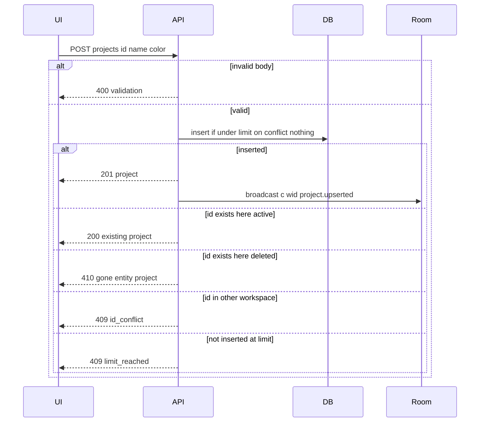
```mermaid
sequenceDiagram
  participant UI
  participant API
  participant DB
  participant Room
  UI->>API: POST projects id name color
  alt invalid body
    API-->>UI: 400 validation
  else valid
    API->>DB: insert if under limit on conflict nothing
    alt inserted
      API-->>UI: 201 project
      API->>Room: broadcast c wid project.upserted
    else id exists here active
      API-->>UI: 200 existing project
    else id exists here deleted
      API-->>UI: 410 gone entity project
    else id in other workspace
      API-->>UI: 409 id_conflict
    else not inserted at limit
      API-->>UI: 409 limit_reached
    end
  end
```

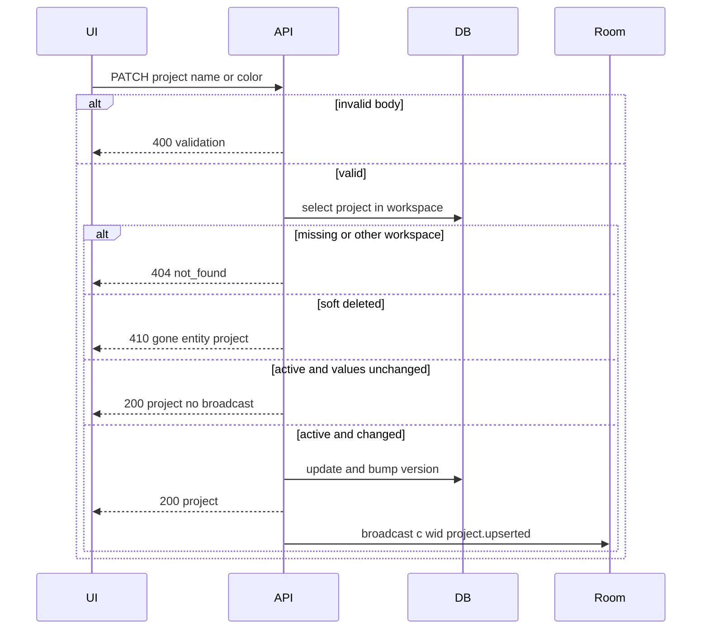
```mermaid
sequenceDiagram
  participant UI
  participant API
  participant DB
  participant Room
  UI->>API: PATCH project name or color
  alt invalid body
    API-->>UI: 400 validation
  else valid
    API->>DB: select project in workspace
    alt missing or other workspace
      API-->>UI: 404 not_found
    else soft deleted
      API-->>UI: 410 gone entity project
    else active and values unchanged
      API-->>UI: 200 project no broadcast
    else active and changed
      API->>DB: update and bump version
      API-->>UI: 200 project
      API->>Room: broadcast c wid project.upserted
    end
  end
```

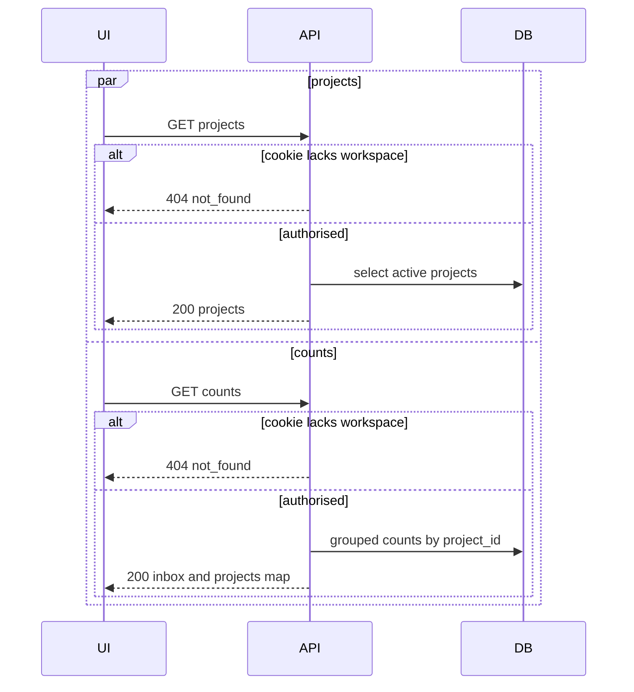
```mermaid
sequenceDiagram
  participant UI
  participant API
  participant DB
  par projects
    UI->>API: GET projects
    alt cookie lacks workspace
      API-->>UI: 404 not_found
    else authorised
      API->>DB: select active projects
      API-->>UI: 200 projects
    end
  and counts
    UI->>API: GET counts
    alt cookie lacks workspace
      API-->>UI: 404 not_found
    else authorised
      API->>DB: grouped counts by project_id
      API-->>UI: 200 inbox and projects map
    end
  end
```

## Implementation
- `packages/shared/src/limits.ts`: confirm `PROJECT_NAME_MAX`, `MAX_PROJECTS_PER_WORKSPACE`; project ids use story 5's `CLIENT_ID_BYTES` (no `PROJECT_ID_BYTES`, no `TASK_ID_BYTES`).
- `packages/shared/src/schemas.ts`: `CreateProjectInputSchema`, `UpdateProjectInputSchema`, `ProjectSchema`, `ProjectListResponseSchema`; widen story 5's `CountsSchema` with `projects: z.record(z.object({open, total}))`.
- `apps/api/src/db/projects.ts`: `listProjects`, `insertProjectIdempotent(db, {id, workspaceId, name, color})` -> `created|replayed|gone|conflict|limit` using one statement `INSERT ... SELECT ... WHERE (SELECT COUNT(*) FROM projects WHERE workspace_id=?2 AND deleted=0) < ?max ON CONFLICT(id) DO NOTHING RETURNING *`, then a follow-up SELECT by id to classify (same approach as story 5 `insertTaskIdempotent`); `getProject`, `updateProject`.
- `apps/api/src/db/tasks.ts`: `countOpenTasks` becomes one `GROUP BY project_id` query returning inbox + per-project open/total.
- `apps/api/src/routes/projects.ts`: Hono sub-router under workspace-auth; `apps/api/src/routes/counts.ts` (story 5) returns the widened shape. Every broadcast is `broadcast(c, wid, event)`; no `broadcastEvent(env, ctx, …)`, no extra `waitUntil`, no direct `room.broadcast`.
- `apps/api/src/lib/errors.ts`: add `limit_reached`; `gone` responses carry `{entity:'project'}`.
- `apps/api/src/app.ts`: register router.

## Tests
TC-03..TC-23, TC-48, TC-76..TC-79. Boundary: request handling via `SELF.fetch` (auth, validation, SQL, broadcast), sufficient because this capability is server-side; UI consumption in projects.ui_sidebar.

## Project delete and batch restore API

> Anchor: `projects.api_delete_restore`

## Contract
- `DELETE /api/w/:wid/projects/:pid`:
  - active → 200 `{batchId, deletedTaskCount}`. Generates batchId (`CLIENT_ID_BYTES` hex). In ONE `db.batch`: `UPDATE tasks SET deleted=1, deleted_at=now, delete_batch_id=?B, version=version+1 WHERE workspace_id=? AND project_id=? AND deleted=0`; `UPDATE projects SET deleted=1, deleted_at=now, delete_batch_id=?B, version=version+1 WHERE id=? AND workspace_id=? AND deleted=0`.
  - already deleted → **204 no body, no write, no broadcast** (D-29).
- `POST /api/w/:wid/projects/:pid/restore` body `{batchId}`:
  - deleted with matching batch → 200 `{project, restoredTaskCount}`. In ONE `db.batch`: restore tasks `WHERE delete_batch_id=?B AND project_id=?`; restore project `WHERE id=? AND delete_batch_id=?B`; clears `deleted_at`, `delete_batch_id`; version+1.
  - active → **200 `{project, restoredTaskCount: 0}` no-op, no write, no broadcast** (D-29; the `not_deleted` error is retired). This covers an Undo that races a collaborator's restore.
  - deleted with a different batch → 409 `batch_mismatch` (stays, D-29).
- The confirm dialog count comes from `counts.projects[id].total` (D-31), whose predicate equals the delete UPDATE's, so warning and effect agree. There is no `taskCount` field on the project list.
Errors: 400 validation (batchId missing/not hex); 403 forbidden_client; 404 not_found (missing or other workspace); 409 batch_mismatch; 500 internal if the batch fails (nothing applied).
Side effects: via `broadcast(c, wid, event)` (D-26): on delete `project.deleted {id, batchId, version}` + `tasks.bulk {ids, deleted:true}`; on restore `project.restored {project}` + `tasks.bulk {ids, deleted:false}` (D-25). No broadcast on 204 or on the 200 no-op.
The server does not enforce `UNDO_WINDOW_MS`: restore stays valid indefinitely so operators can recover (story 6 `prd.retain_deleted`); the `UNDO_WINDOW_MS` (10 s) window is a UI affordance only.

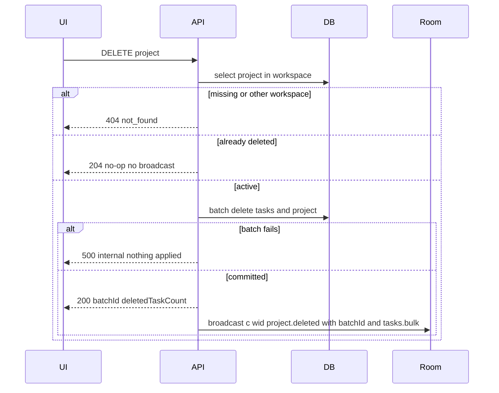
```mermaid
sequenceDiagram
  participant UI
  participant API
  participant DB
  participant Room
  UI->>API: DELETE project
  API->>DB: select project in workspace
  alt missing or other workspace
    API-->>UI: 404 not_found
  else already deleted
    API-->>UI: 204 no-op no broadcast
  else active
    API->>DB: batch delete tasks and project
    alt batch fails
      API-->>UI: 500 internal nothing applied
    else committed
      API-->>UI: 200 batchId deletedTaskCount
      API->>Room: broadcast c wid project.deleted with batchId and tasks.bulk
    end
  end
```

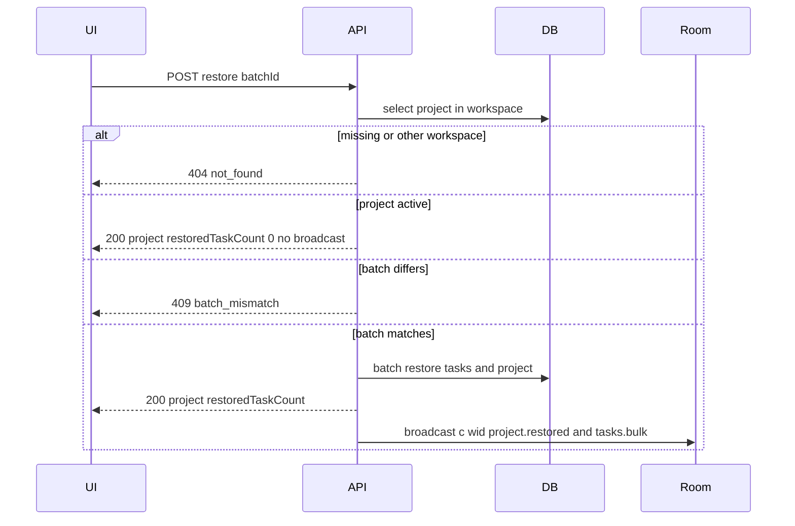
```mermaid
sequenceDiagram
  participant UI
  participant API
  participant DB
  participant Room
  UI->>API: POST restore batchId
  API->>DB: select project in workspace
  alt missing or other workspace
    API-->>UI: 404 not_found
  else project active
    API-->>UI: 200 project restoredTaskCount 0 no broadcast
  else batch differs
    API-->>UI: 409 batch_mismatch
  else batch matches
    API->>DB: batch restore tasks and project
    API-->>UI: 200 project restoredTaskCount
    API->>Room: broadcast c wid project.restored and tasks.bulk
  end
```

**Fault injection for atomicity (D-35).** `POST /test/fault` in `apps/api/src/routes/test.ts` (story 1 registry; owned by this story) is **local only**: it returns 404 unless `ENVIRONMENT === 'local'` (so also 404 on staging and production). Body is a named fault, e.g. `{abortNextUpdate: 'projects'}`: the route stores the fault in a module-scoped test registry, and `db/projects.ts` passes its batch through `applyTestFault(env, batch)`, which (only when a fault is armed and the environment is local) replaces the named table's UPDATE with a statement that raises, then disarms the fault. The fault fires once. The allowed table names are a closed zod enum (`projects`, `tasks`); no SQL text is ever accepted. `/test/sql` is not built (removed, because it ran arbitrary SQL).

## Implementation
- `apps/api/src/db/projects.ts`: `deleteProjectBatch(db, wid, pid, batchId)`, `restoreProjectBatch(db, wid, pid, batchId)` returning affected ids via `RETURNING id`.
- `apps/api/src/lib/restoreRules.ts`: pure `decideRestore(project, batchId)` → `ok | noop | batch_mismatch`; pure `decideDelete(project)` → `delete | noop`.
- `apps/api/src/routes/projects.ts`: DELETE and restore handlers; `broadcast(c, wid, event)` only.
- `apps/api/src/lib/crypto.ts`: reuse `randomHexId()`.
- `apps/api/src/routes/test.ts` + `apps/api/src/lib/testFaults.ts`: `/test/fault` and `applyTestFault` as above.

## Tests
TC-24..TC-35, TC-73, TC-96. Boundary: request handling with real D1, required because atomicity and the exact-set predicate are D1 behaviours.

## Project-scoped task create, list and move

> Anchor: `tasks.project_scope_api`

## Contract
Extends story 5/6 task routes without changing existing behaviour when no project is involved.
- `GET /api/w/:wid/tasks?list=inbox|project&projectId=<id>&include_completed=true|false` (D-31): story 5's `list` enum is widened with `project`; there is no `project:<id>` form and no `list=today` (Today is story 8's `GET /today`). `list=project` requires `projectId`; `list=inbox` now returns only `project_id IS NULL`. `include_completed` (story 6) applies unchanged to both lists.
- `POST /api/w/:wid/tasks` (story 5 `CreateTaskInputSchema`, client-generated id, idempotent) gains optional `projectId`. Validated only when a new row would be inserted; replays return the stored task unchanged.
- `PATCH /api/w/:wid/tasks/:tid` (story 6) gains `projectId: string | null` (move). A move sets `sort_order = MAX(sort_order over the workspace) + TASK_SORT_STEP` (story 5's workspace-wide ordering rule, so the task lands at the end of any list) and version+1. If destination equals the current list: 200, no write, no broadcast.
- **Delta to story 6's single-task restore (D-30).** `POST /api/w/:wid/tasks/:tid/restore` gains a project check before story 6's existing logic: if the task's `project_id` references a project with `deleted = 1`, respond 410 `gone {entity:'project'}`, write nothing and broadcast nothing. This applies whether the task was deleted alone or with the project batch. Tasks in the Inbox or in an active project follow story 6's rules unchanged (200 restore; 200 no-op for an active task).
Errors (D-29): 400 validation (incl. `list=project` without projectId); 404 not_found (task); 404 `project_not_found` (create or move `projectId` missing, deleted or in another workspace; `list=project` for a missing or other-workspace project); 410 `gone {entity:'task'}` (task soft-deleted, on move); 410 `gone {entity:'project'}` (`list=project` for a soft-deleted project, so the viewer is redirected; single-task restore inside a deleted project); story 5 create errors (409 id_conflict, 410 gone replay) unchanged.
Side effects: `broadcast(c, wid, {type:'task.upserted', …})` (D-26) on create 201 and on an actual move.

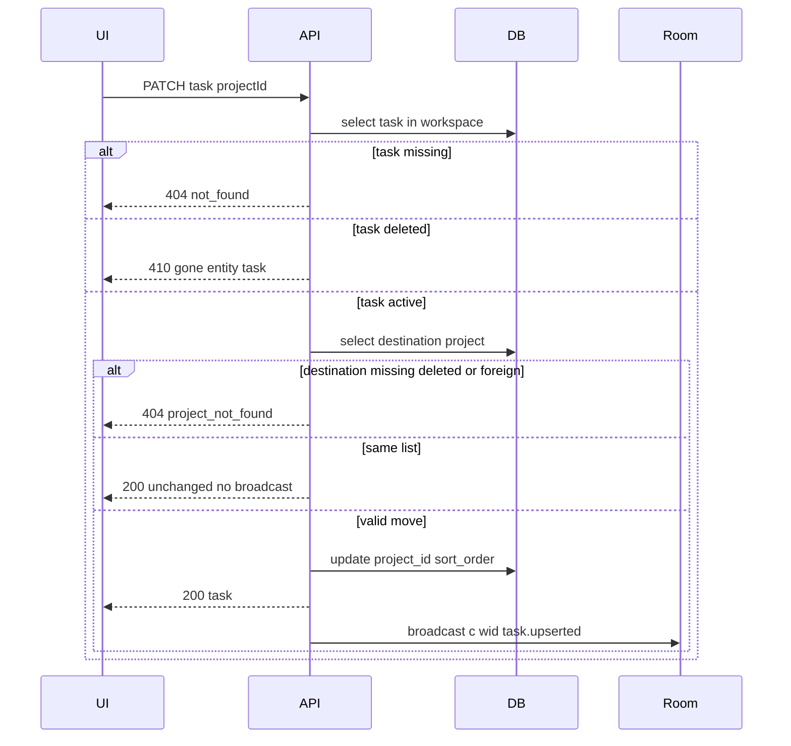
```mermaid
sequenceDiagram
  participant UI
  participant API
  participant DB
  participant Room
  UI->>API: PATCH task projectId
  API->>DB: select task in workspace
  alt task missing
    API-->>UI: 404 not_found
  else task deleted
    API-->>UI: 410 gone entity task
  else task active
    API->>DB: select destination project
    alt destination missing deleted or foreign
      API-->>UI: 404 project_not_found
    else same list
      API-->>UI: 200 unchanged no broadcast
    else valid move
      API->>DB: update project_id sort_order
      API-->>UI: 200 task
      API->>Room: broadcast c wid task.upserted
    end
  end
```

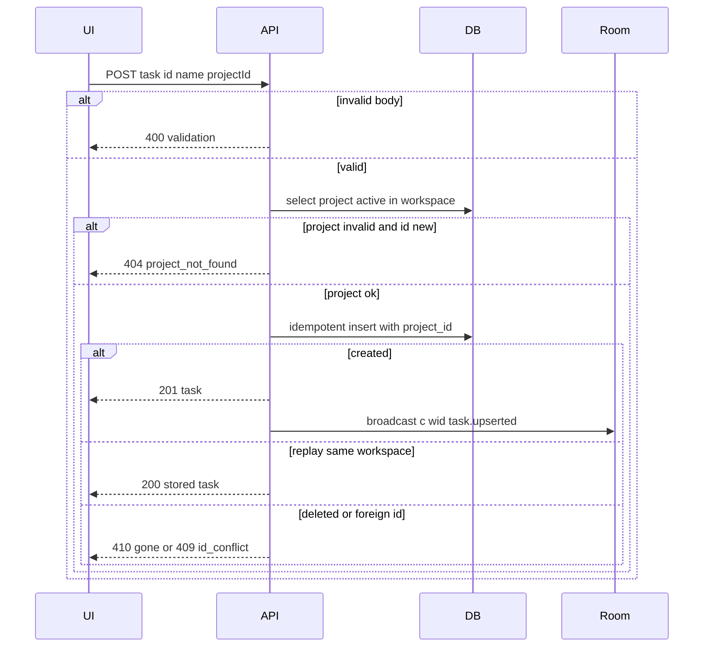
```mermaid
sequenceDiagram
  participant UI
  participant API
  participant DB
  participant Room
  UI->>API: POST task id name projectId
  alt invalid body
    API-->>UI: 400 validation
  else valid
    API->>DB: select project active in workspace
    alt project invalid and id new
      API-->>UI: 404 project_not_found
    else project ok
      API->>DB: idempotent insert with project_id
      alt created
        API-->>UI: 201 task
        API->>Room: broadcast c wid task.upserted
      else replay same workspace
        API-->>UI: 200 stored task
      else deleted or foreign id
        API-->>UI: 410 gone or 409 id_conflict
      end
    end
  end
```

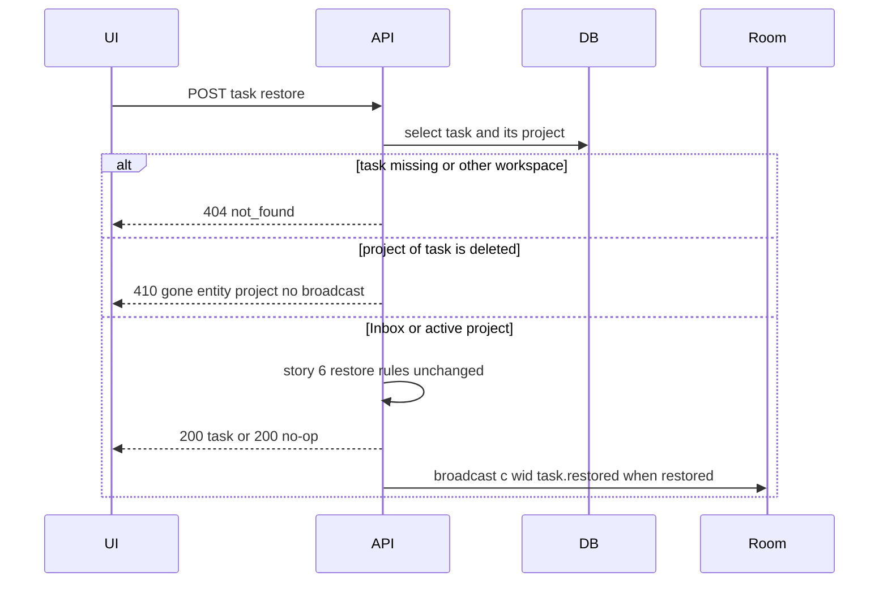
```mermaid
sequenceDiagram
  participant UI
  participant API
  participant DB
  participant Room
  UI->>API: POST task restore
  API->>DB: select task and its project
  alt task missing or other workspace
    API-->>UI: 404 not_found
  else project of task is deleted
    API-->>UI: 410 gone entity project no broadcast
  else Inbox or active project
    API->>API: story 6 restore rules unchanged
    API-->>UI: 200 task or 200 no-op
    API->>Room: broadcast c wid task.restored when restored
  end
```

## Implementation
- `packages/shared/src/schemas.ts`: widen `TaskListQuerySchema` (discriminated on `list`, with `include_completed`), add `projectId` to `CreateTaskInputSchema` and the story 6 update schema.
- `apps/api/src/db/projects.ts`: `getActiveProjectForWorkspace(db, wid, pid)` → `active | deleted | missing`.
- `apps/api/src/db/tasks.ts`: `listTasks(db, wid, {list, projectId, includeCompleted})`, `insertTaskIdempotent` accepts `projectId`, new `moveTask`.
- `apps/api/src/lib/moveRules.ts`: pure `classifyMove(currentProjectId, destProjectId, destProject)` → `same_list | move | project_not_found`; pure `restoreBlockedByProject(taskProjectState)` → `blocked | allowed`.
- `apps/api/src/routes/tasks.ts`: validate destination, map errors; add the project check to story 6's restore handler.

## Tests
TC-36..TC-47, TC-74, TC-94. Boundary: request handling with real D1; UI path in tasks.ui_move_menu, projects.ui_project_view and projects.ui_delete_undo (TC-95, TC-100).

## Project live events

> Anchor: `projects.live_events`

## Contract
Inputs: events from WorkspaceRoom (`packages/shared/src/events.ts`, union owned by story 4; this story adds its members): `project.upserted {project}`, `project.deleted {id, batchId, version}` (D-25: carries `batchId`), `project.restored {project}`, `tasks.bulk {ids: string[], deleted?: boolean}` (**refetch semantics**: handlers invalidate and never patch), `task.upserted {task}`.
Outputs: TanStack Query caches updated, keys only from `apps/web/src/lib/queryKeys.ts` (story 2, D-37): `queryKeys.projects(wid)` = `['ws', wid, 'projects']`, `queryKeys.counts(wid)` = `['ws', wid, 'counts']` (no date), `queryKeys.tasks(wid, {list, projectId?, includeCompleted})` under the prefix `['ws', wid, 'tasks']`.
Rules:
- Ignore events whose `originClientId` equals own clientId; ignore `version <= cached.version`.
- `project.upserted` / `project.restored`: apply to `queryKeys.projects(wid)` with `applyProjectEvent`.
- `project.deleted`: remove from the projects cache; if it is the routed project → `useWorkspaceNavigate` to Inbox (fragment per D-13) and toast 'This project was deleted'. Rows removed from the visible grid move focus through story 5's `focusAfterRemoval` (D-04), which also covers remote removals.
- `tasks.bulk` (either value of `deleted`): `invalidateQueries({queryKey: ['ws', wid, 'tasks']})` and `invalidateQueries({queryKey: queryKeys.counts(wid)})`. No `setQueriesData` patching of task lists from this event (D-25).
- `project.*`: invalidate `queryKeys.counts(wid)`.
- `task.upserted`: this story's handler only fixes project-list membership when `task.projectId` differs from the list the cached copy sits in (a move by another client): it invalidates the source and destination `list=project`/`list=inbox` queries. Counts invalidation for every `task.*` event is registered once by story 5 (D-38); this story does not register a second one.
- Handlers are ADDED to story 4's registry and coexist with story 5/6/8/11 handlers for the same event types.
Errors: malformed event → dropped and logged to console (dev only); reconnect gap → handled by story 4 (`invalidateQueries({queryKey: ['ws', wid]})`, which covers every key above).

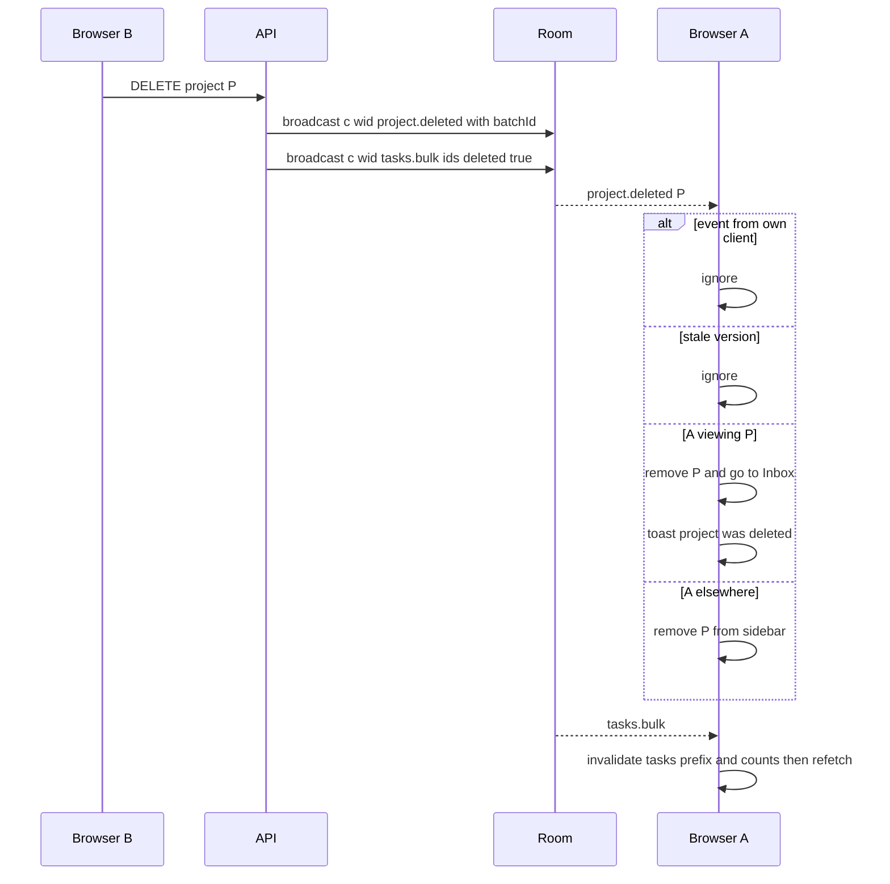
```mermaid
sequenceDiagram
  participant B as Browser B
  participant API
  participant Room
  participant A as Browser A
  B->>API: DELETE project P
  API->>Room: broadcast c wid project.deleted with batchId
  API->>Room: broadcast c wid tasks.bulk ids deleted true
  Room-->>A: project.deleted P
  alt event from own client
    A->>A: ignore
  else stale version
    A->>A: ignore
  else A viewing P
    A->>A: remove P and go to Inbox
    A->>A: toast project was deleted
  else A elsewhere
    A->>A: remove P from sidebar
  end
  Room-->>A: tasks.bulk
  A->>A: invalidate tasks prefix and counts then refetch
```

No persisted state is changed by this capability (it is client cache only), hence no additional state diagram.

## Implementation
- `apps/web/src/features/projects/projectCache.ts`: pure `applyProjectEvent(cache, event)` and `adjustCounts(counts, delta)` (used by optimistic mutations); the project cache is kept as an array plus a `Map` by id for O(1) lookups (js-index-maps).
- `apps/web/src/features/projects/registerProjectLiveHandlers.ts`: called once per workspace from the workspace route; uses `registerLiveHandler(type, fn)` from `apps/web/src/features/live/registry.ts` (story 4, `Map<type, Set<fn>>`) for each type above and returns the unregister functions. No edits to story 4's dispatcher.
- Bursts are already coalesced per animation frame by story 4's `notifyManager` batching; this story adds no `startTransition` around cache writes.
- Server: `apps/api/src/routes/projects.ts` and `tasks.ts` call story 4's `broadcast(c, wid, event)` (D-26), which calls `waitUntil` itself.
- `packages/shared/src/events.ts` (story 4 owns the union): add the `project.*` members with `batchId` on `project.deleted`, and `tasks.bulk {ids, deleted?}` if story 4 has not already declared it.

## Tests
TC-49, TC-50, TC-88 (unit), TC-62, TC-63, TC-85 (ui-component with fake emitter through the real registry), TC-75 (integration, real DO sockets), TC-69 (e2e two contexts through real DO). Broadcast-on-mutation assertions also in TC-06, TC-18, TC-25, TC-30, TC-36.

## Sidebar projects section, create and rename

> Anchor: `projects.ui_sidebar`

## Contract
- Fills story 5's AppShell `sidebar` slot (inside story 5's mobile drawer below `MOBILE_BREAKPOINT_PX`): 'Projects' heading (`tabIndex=-1`, the D-19 focus fallback target) with '+' and rows in sort order; each row: colour dot, name (truncate, title attr), open count (hidden when 0), '...' menu (Rename, Delete). Inbox count keeps coming from `counts.inbox` (story 5), which now excludes project tasks.
- `ProjectRow` props are primitives `{wid, id, name, colorKey, isActive}`; the open count is read inside the row from exactly one source: `useQuery({...countsQuery(wid), select})` where `select` is a module-level function bound per id with `useCallback` - the parent never passes a count, so a count change re-renders only the affected row.
- Create dialog: name input (autofocus), 12-swatch radio group (first preselected, arrow-key navigation, aria-labels with colour names), Add disabled while trimmed name empty, over `PROJECT_NAME_MAX`, at the project limit, or while `!canEdit`; generates the project id client-side (`crypto.getRandomValues`, story 5's `CLIENT_ID_BYTES` helper); on success navigates to the new project.
- Rename: inline input replaces name; Enter saves, Escape cancels; blank/over-limit behaviour is specified in `projects.ui_accessible_controls`.
- Selecting a project on a narrow screen closes story 5's drawer.
- **Edit gating (D-10).** Like every control that sends a change (the sidebar and the portalled dialogs alike), each project control is self-gated via `useCanEdit()` from `features/live/canEdit.ts`: '+' disabled, menu items Rename and Delete disabled, Add/Save disabled, inline rename not enterable. Row navigation, the drawer and the '...' menu itself stay usable offline. Text already typed in an open name field is kept when `canEdit` flips to false.
- All mutations optimistic with rollback + toast 'Couldn't save - try again'.
Errors surfaced (mapped by `body.error`, D-20): `limit_reached` → limit message; `validation` → field message; `id_conflict` → regenerate id and retry once; 5xx/network → rollback toast.

## Implementation
Files (direct imports, no barrel `index.ts`; icons as per-icon deep imports allowed by the installed lucide-react exports map, enforced by story 2's lint rule, D-43):
- `apps/web/src/features/projects/queries.ts`: `projectsQuery(wid)` with key `queryKeys.projects(wid)`; reuses story 5's `countsQuery(wid)` with key `queryKeys.counts(wid)` (no date). Optimistic count writes use `queryClient.setQueriesData({queryKey: queryKeys.counts(wid)}, updater)` (D-37/D-38), never a hand-built key.
- `apps/web/src/routes/workspaceLoader.ts` (story 5, D-39): add `projectsQuery(wid)` inside story 5's `prefetchWorkspaceData(wid)` so projects, counts and the list load in parallel from the `/w/:id` loader and after boot open resolves. `Workspace.tsx` is not edited for prefetching.
- `apps/web/src/features/projects/useProjects.ts`: `useQuery` with a module-level `select` building `{list, byId: Map, searchKey per project}` once per data change (js-index-maps).
- `apps/web/src/features/projects/useProjectMutations.ts`: create/update/delete/restore with `onMutate` (cancelQueries, snapshot, `setQueryData(queryKeys.projects(wid))` and `setQueriesData` on counts), `onError` rollback, `onSettled` invalidate counts.
- `apps/web/src/features/projects/ProjectsSidebarSection.tsx`: plain list container (no `content-visibility` on the container); ternary for empty vs list; static hint JSX hoisted.
- `apps/web/src/features/projects/ProjectRow.tsx`: module-level `memo` component; row element carries `content-visibility:auto; contain-intrinsic-size:auto 44px`; `selectOpenCount` hoisted at module level; `onPointerEnter`/`onFocus` call `preloadProjectView()` and `queryClient.prefetchQuery(tasksQuery(wid, {list:'project', projectId:id, includeCompleted:false}))`.
- `apps/web/src/features/projects/CreateProjectDialog.tsx` + `ColorPalette.tsx`: loaded with story 2's `lazyWithRetry` (`lib/lazyWithRetry.ts`, D-42); the '+' button preloads the chunk on hover/focus.
- `apps/web/src/features/projects/RenameProjectInline.tsx`.
- Limit derived during render from `projects.length >= MAX_PROJECTS_PER_WORKSPACE`; no effect syncing.
- Navigation to a project through `useWorkspaceNavigate` with the path from story 2's `workspacePath(wid, view)` for the project view; router navigations are already transitions, no extra wrapper.

## Tests
TC-51..TC-55, TC-64, TC-84, TC-89, TC-97 (ui-component, MSW), TC-68, TC-71, TC-86 (e2e). Boundary: browser rendering in happy-dom with network mocked, sufficient for rendering/interaction logic; server behaviour is covered by integration.

## Project view route and quick add target

> Anchor: `projects.ui_project_view`

## Contract
- Route `/w/:workspaceId/project/:projectId`, registered as a child in story 2's `App.tsx` (D-12), renders header (dot + name) and the task list from `queryKeys.tasks(wid, {list:'project', projectId, includeCompleted})` using story 5's `TaskGrid` (APG layout grid, one tab stop, per-row `content-visibility`, skeleton rows while loading; D-01). `includeCompleted` follows story 6's 'Show completed' toggle; the request sends `include_completed=true|false` (D-31).
- Empty state: 'No tasks yet. Press Q to add one.'
- Quick add (story 5 component) receives the target `{kind:'project', projectId}` from the route (story 5's QuickAdd target union, D-40) and includes `projectId` in the POST body (client-generated task id unchanged); its target chip reads '→ <project name>'.
- Unknown/deleted project id (`project_not_found` or `gone {entity:'project'}` from the list request, mapped by `body.error` per D-20, or absent from the projects cache after load) → Inbox + toast 'Project not found'.

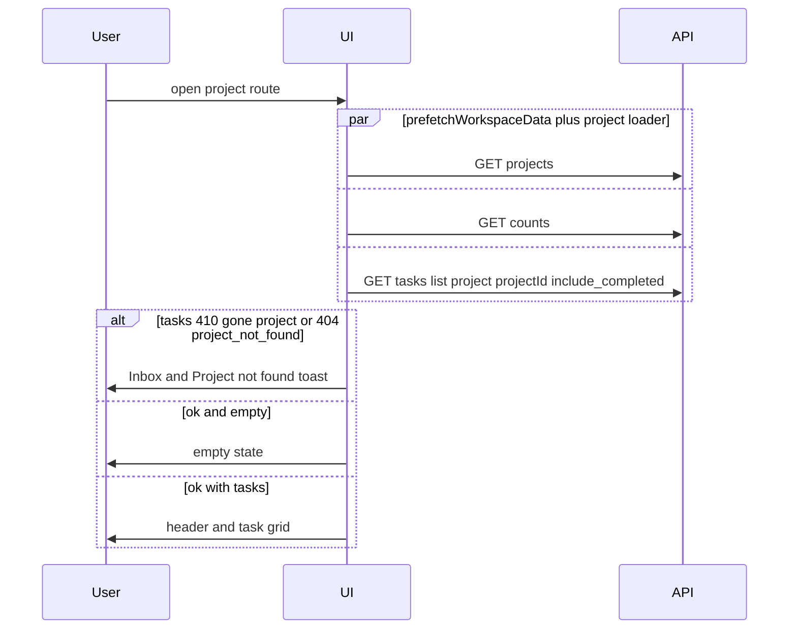
```mermaid
sequenceDiagram
  participant User
  participant UI
  participant API
  User->>UI: open project route
  par prefetchWorkspaceData plus project loader
    UI->>API: GET projects
  and
    UI->>API: GET counts
  and
    UI->>API: GET tasks list project projectId include_completed
  end
  alt tasks 410 gone project or 404 project_not_found
    UI->>User: Inbox and Project not found toast
  else ok and empty
    UI->>User: empty state
  else ok with tasks
    UI->>User: header and task grid
  end
```

## Implementation
- `apps/web/src/routes/ProjectView.tsx`: route chunk loaded with story 2's `lazyWithRetry` and exported with a `preloadProjectView()` thunk used by sidebar rows. Its route loader calls story 5's `prefetchWorkspaceData(wid)` (which already includes projects and counts, D-39) and, in the same `Promise.all`, `prefetchQuery(tasksQuery(wid, {list:'project', projectId, includeCompleted}))` — the tasks request is NOT gated on the projects response (no waterfall).
- `apps/web/src/App.tsx` (story 2 owns the table): add the child route `project/:projectId` under `/w/:workspaceId`; links are built with story 2's `workspacePath(wid, view)` for the project view.
- `apps/web/src/features/tasks/queries.ts` (story 5): `tasksQuery` accepts `{list, projectId?, includeCompleted}` and builds its key via `queryKeys.tasks`.
- `apps/web/src/features/workspace/useWorkspaceNavigate.ts`: created here; fragment carried only when the session began from one (D-13, see SPA Routing Decision).
- `apps/web/src/features/tasks/QuickAdd.tsx` (story 5): use the `{kind:'project', projectId}` target; optimistic insert via `setQueriesData` on the prefix `['ws', wid, 'tasks']` (matching the project list keys) and `counts.projects[projectId].open + 1` via `setQueriesData({queryKey: queryKeys.counts(wid)})`.
- Document title via React 19 `<title>` in `ProjectView`: '<project name> · <workspace name>'.

## Tests
TC-61 (ui-component), TC-65, TC-70, TC-72 (e2e). Boundary: browser rendering; the project-scoped API contract is proven in tasks.project_scope_api.

## Delete confirmation and undo

> Anchor: `projects.ui_delete_undo`

## Contract
- '...' > Delete opens AlertDialog (kept for projects by product-owner decision 2026-09-25, because one confirm can remove many tasks; single-task delete in story 6 has no confirm). Text: 0 tasks → 'Delete "<name>"?'; 1 → 'Delete "<name>" and its 1 task?'; N → 'and its N tasks?' using `counts.projects[id].total` from `queryKeys.counts(wid)` (D-31; same predicate as the server delete, so warning and effect agree).
- Focus: starts on Cancel. On Cancel/Escape focus returns to the row's '...' trigger. If that trigger no longer exists when the dialog closes (the row was removed by this confirm, or by a collaborator while the dialog was open), focus goes to the 'Projects' heading (`tabIndex=-1`), per the §12 fallback rule (D-19).
- Gating (D-10): the dialog is portalled, so Confirm is disabled via `useCanEdit()` while offline; Cancel stays enabled. The Undo action is disabled offline by story 6's toast (it checks `canEdit`).
- Confirm: optimistic removal of project row, its count entry (`setQueriesData` on `queryKeys.counts(wid)`) and its task list caches; if routed to it, navigate to Inbox; then `showUndoToast({message: 'Project deleted', onUndo})` (story 6, D-41): visible for `UNDO_WINDOW_MS` (10 s), paused while hovered or focused, announced via `role=status`, ⌘/Ctrl+Z triggers it while visible (story 6 owns the key binding).
- DELETE returns 204 (someone else already deleted it, D-29): the optimistic removal stands, **no Undo toast** is shown (there is no batch to restore), and no error is shown.
- Undo: POST restore with the batchId from the DELETE response; projects, counts and list caches invalidated; project reappears. A 200 no-op restore (someone already restored it) is treated as success.
- If Undo is pressed before the DELETE response arrives, the restore call is chained after it.
- **Delta to story 6's single-task Undo (D-30).** Story 6's `restoreTask` in `features/tasks/mutations.ts` gains one error branch: `GoneError{entity:'project'}` → toast 'Its project was deleted' (`role=alert`), the task stays out of every cache (no rollback into a list), and counts are invalidated. Other restore errors keep story 6's handling.
Errors: DELETE failure → rollback + toast (`role=alert`); restore failure (`batch_mismatch`/5xx) → toast 'Couldn't undo'.

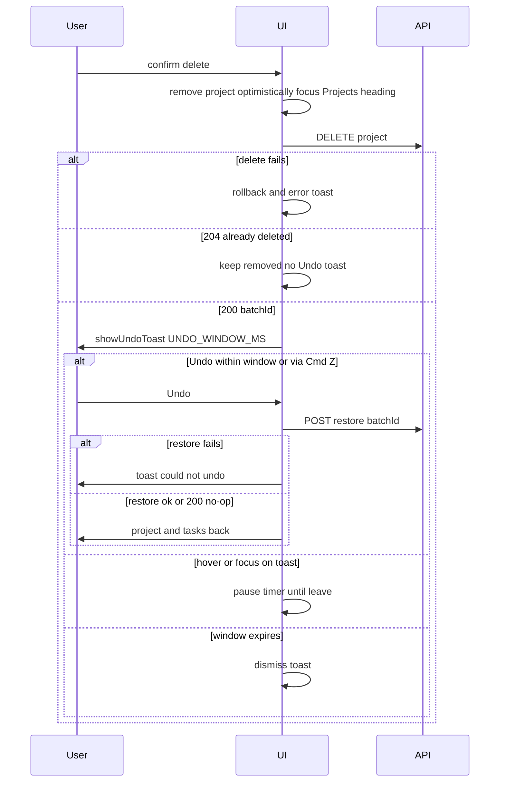
```mermaid
sequenceDiagram
  participant User
  participant UI
  participant API
  User->>UI: confirm delete
  UI->>UI: remove project optimistically focus Projects heading
  UI->>API: DELETE project
  alt delete fails
    UI->>UI: rollback and error toast
  else 204 already deleted
    UI->>UI: keep removed no Undo toast
  else 200 batchId
    UI->>User: showUndoToast UNDO_WINDOW_MS
    alt Undo within window or via Cmd Z
      User->>UI: Undo
      UI->>API: POST restore batchId
      alt restore fails
        UI->>User: toast could not undo
      else restore ok or 200 no-op
        UI->>User: project and tasks back
      end
    else hover or focus on toast
      UI->>UI: pause timer until leave
    else window expires
      UI->>UI: dismiss toast
    end
  end
```

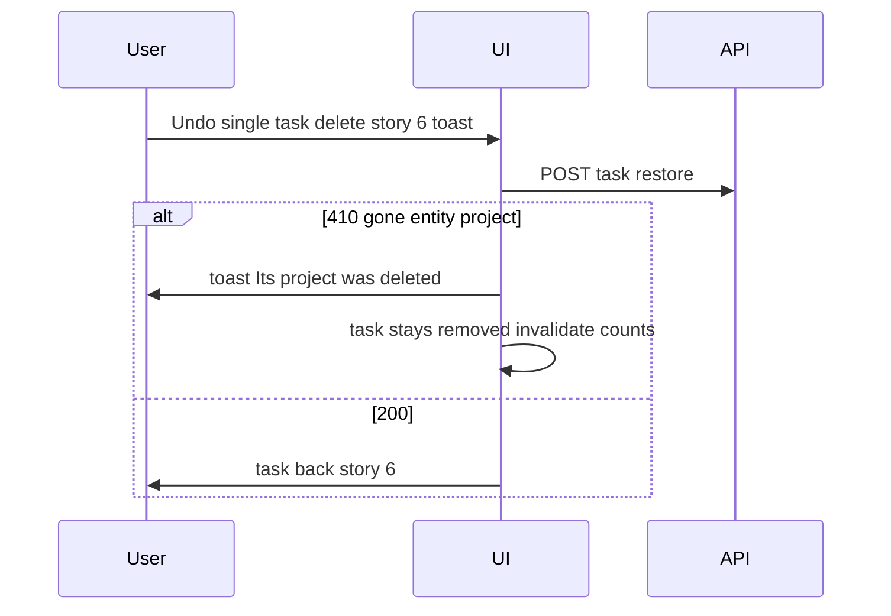
```mermaid
sequenceDiagram
  participant User
  participant UI
  participant API
  User->>UI: Undo single task delete story 6 toast
  UI->>API: POST task restore
  alt 410 gone entity project
    UI->>User: toast Its project was deleted
    UI->>UI: task stays removed invalidate counts
  else 200
    UI->>User: task back story 6
  end
```

## Implementation
- `apps/web/src/features/projects/DeleteProjectDialog.tsx` (loaded with `lazyWithRetry`, preloaded when the row '...' menu opens).
- `apps/web/src/features/projects/useProjectMutations.ts`: `deleteProject` returns `batchId | null` (null on 204); `restoreProject(batchId)`.
- `apps/web/src/features/undo/showUndoToast.ts` (story 6 helper) reused; no project-specific timer.
- `apps/web/src/features/tasks/mutations.ts` (story 6): the `GoneError{entity:'project'}` branch in `restoreTask`.
- Pluralisation via a module-level cached `Intl.PluralRules`.

## Tests
TC-57..TC-59, TC-95, TC-97, TC-102 (ui-component, fake timers incl. pause on hover), TC-66, TC-67, TC-100 (e2e). Server-side exact-set behaviour proven in TC-26, TC-31; restore-in-deleted-project in TC-94.

## Move to menu

> Anchor: `tasks.ui_move_menu`

## Contract
- Entry points: task '...' menu item 'Move to…  M' (story 6's `TaskActionsMenu`, cell 3 of the row per D-01), the M shortcut (see `tasks.ui_move_picker`), and story 11's Finder action bar; all call `openMovePicker(taskId, {returnFocusTo})`. The flat Radix submenu is removed (it does not scale to `MAX_PROJECTS_PER_WORKSPACE`).
- The menu item is disabled while `!canEdit` (the menu is portalled, D-10).
- `moveTask(taskId, destProjectId | null)`, added to story 6's `features/tasks/mutations.ts`:
  1. optimistic removal from every loaded source list (`setQueriesData` on the prefix `['ws', wid, 'tasks']`, D-37), insertion at end of destination caches if loaded, counts adjusted with `adjustCounts` via `setQueriesData({queryKey: queryKeys.counts(wid)})`;
  2. **focus moves optimistically (D-08):** in the same tick as the optimistic removal, story 5's `focusAfterRemoval(taskId)` (D-04) moves focus to the next row, else the previous row, else the add-task control — it does not wait for the server;
  3. PATCH `{projectId}`.
- Moving to the current list is not offered (disabled in the picker) and, if forced via API, is a no-op (TC-38).
Errors (by `body.error`, D-20): `project_not_found` / 5xx → rollback (the row reappears in its list) + toast `role=alert`; focus is not moved again, so a user who already moved on is not yanked back. `gone {entity:'task'}` → story 4's `useEditGuard` 'This task was deleted' notice.

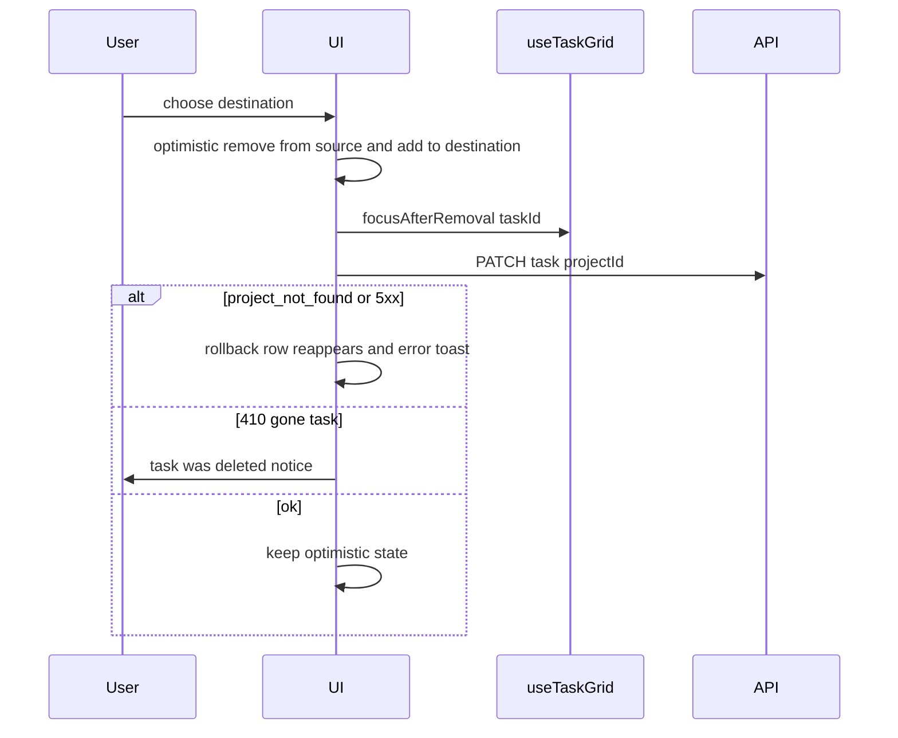
```mermaid
sequenceDiagram
  participant User
  participant UI
  participant Grid as useTaskGrid
  participant API
  User->>UI: choose destination
  UI->>UI: optimistic remove from source and add to destination
  UI->>Grid: focusAfterRemoval taskId
  UI->>API: PATCH task projectId
  alt project_not_found or 5xx
    UI->>UI: rollback row reappears and error toast
  else 410 gone task
    UI->>User: task was deleted notice
  else ok
    UI->>UI: keep optimistic state
  end
```

## Implementation
- `apps/web/src/features/tasks/mutations.ts` (story 6, D-43 name): add `moveTask` using `adjustCounts` from `projectCache.ts` and `focusAfterRemoval` from `features/tasks/useTaskGrid.ts` (story 5). No `focusAfterAction.ts`, no list ref accessor.
- `apps/web/src/features/tasks/TaskActionsMenu.tsx` (story 6): add 'Move to…' item showing its shortcut hint; selecting it calls `openMovePicker(taskId, {returnFocusTo: <the row's name cell>})` (preloaded when the menu opens).

## Tests
TC-60 (ui-component, incl. focus before the PATCH resolves), TC-98 (offline gating), TC-65 (e2e); server contract in TC-36..TC-43.

## Searchable Move to picker and M shortcut

> Anchor: `tasks.ui_move_picker`

## Contract
- **Open helper (D-05, owned here):** `openMovePicker(taskId: string, opts: {returnFocusTo: HTMLElement | null, anchor?: HTMLElement})`, exported from `apps/web/src/features/tasks/openMovePicker.ts`. It is callable from a task grid and from story 11's Finder, **without an anchored row**: with `anchor` it opens as a popover next to it (desktop); without `anchor` it opens as a centred dialog on desktop; below `MOBILE_BREAKPOINT_PX` it is always a bottom sheet. It needs only the task id: the task's name and current list are read from any cached copy of the task (list caches under `['ws', wid, 'tasks']`, or story 11's search results cache). If no copy is cached, no option is marked current, and a redundant choice is harmless because the server treats a same-list move as a no-op (TC-38).
- The picker is a combobox dialog titled 'Move to…' with a search input (autofocus, placeholder 'Type a project name', visible ✕ clear button) and a listbox: 'Inbox' first, then active projects in sort order, each option = colour dot + name (+ check mark and `aria-disabled="true"` for the task's current list). Options contain **no interactive children** (shared-combobox rule).
- Filtering: case- and accent-insensitive substring match on `normaliseForSearch(name)` (precomputed once per project in the `useProjects` select); 'Inbox' is matched like any other name; leading/trailing whitespace in the query is ignored. Empty result → 'No matching projects'. The option list renders from `useDeferredValue(query)`.
- Keyboard (D-16): ↑/↓ moves the active option (skipping disabled), Enter selects. **Escape closes the picker in one press, without clearing the query first** (matching the Finder); the Escape event is stopped (`stopPropagation`) so it never reaches quick add or a sheet underneath (D-14). The **✕ button** clears the query, keeps the picker open and returns focus to the input; it is rendered only while the query is non-empty. Each `openMovePicker` call starts with an empty query, because the picker is opened for one task at a time.
- Focus on close: after a move from a grid, focus has already moved via `focusAfterRemoval` (D-08, `tasks.ui_move_menu`); the picker does not move it again. After a move where the task was not in the focused grid (Finder), or on close without a move, focus goes to `returnFocusTo`; if that element is no longer connected, focus goes to the current view's heading (§12 fallback, D-19).
- **M shortcut (D-14):** `useGlobalShortcut({key:'m', scope:'grid', description:'Move task to…'})` via story 5's `lib/shortcuts.ts`. The handler reads `getFocusedTaskId()` from story 5's `useTaskGrid` (D-04) and calls `openMovePicker(id, {returnFocusTo: <focused row cell>, anchor: <row>})`. M works from any cell of the row (D-02). It does nothing when `isTypingTarget` is true, when no task is focused, when any overlay is open (overlay scope stack), or when `!canEdit` (D-02/D-10).
- The picker pushes an overlay scope while open, so global and grid shortcuts are suppressed underneath it.
- Layout: via `ResponsiveCommand` (shared-combobox): popover with anchor, centred dialog without, `Drawer` below `MOBILE_BREAKPOINT_PX` using story 5's `lib/useIsNarrow.ts` (D-43); options at least `MIN_TOUCH_TARGET_PX` tall.
- **Gating (D-10):** the picker is self-gated via `useCanEdit()`: while `!canEdit` the list stays browsable, every option is `aria-disabled`, Enter/click do nothing, and a one-line note 'Moving is paused while offline' is shown.
Errors: none of its own; move errors per `tasks.ui_move_menu`.

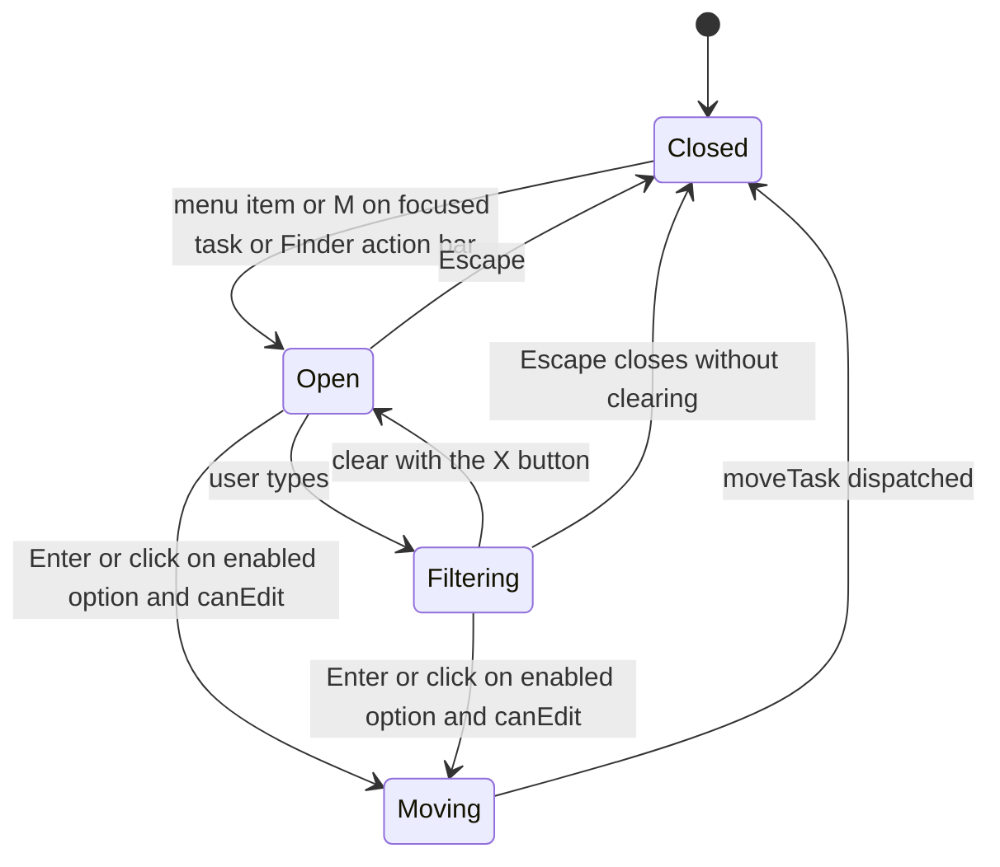
```mermaid
stateDiagram-v2
  [*] --> Closed
  Closed --> Open: menu item or M on focused task or Finder action bar
  Open --> Filtering: user types
  Filtering --> Open: clear with the X button
  Filtering --> Closed: Escape closes without clearing
  Open --> Closed: Escape
  Open --> Moving: Enter or click on enabled option and canEdit
  Filtering --> Moving: Enter or click on enabled option and canEdit
  Moving --> Closed: moveTask dispatched
```
The picker state is ephemeral UI state (not persisted); the diagram documents its lifecycle because focus return depends on it.

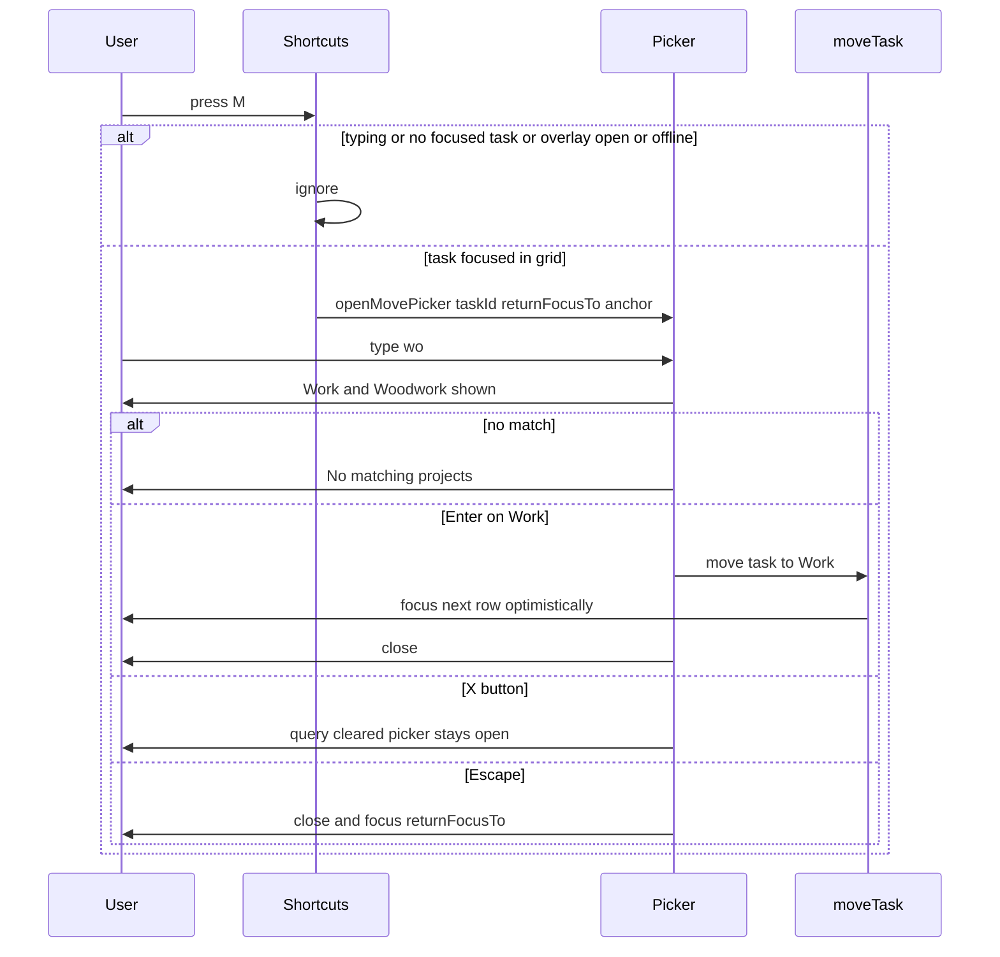
```mermaid
sequenceDiagram
  participant User
  participant Shortcuts
  participant Picker
  participant Mut as moveTask
  User->>Shortcuts: press M
  alt typing or no focused task or overlay open or offline
    Shortcuts->>Shortcuts: ignore
  else task focused in grid
    Shortcuts->>Picker: openMovePicker taskId returnFocusTo anchor
    User->>Picker: type wo
    Picker->>User: Work and Woodwork shown
    alt no match
      Picker->>User: No matching projects
    else Enter on Work
      Picker->>Mut: move task to Work
      Mut->>User: focus next row optimistically
      Picker->>User: close
    else X button
      Picker->>User: query cleared picker stays open
    else Escape
      Picker->>User: close and focus returnFocusTo
    end
  end
```

## Implementation
- `apps/web/src/features/tasks/openMovePicker.ts`: the imperative helper; a small module-level store (`useSyncExternalStore`) holding `{taskId, returnFocusTo, anchor} | null`; `MoveToPickerHost` mounted once in story 5's AppShell reads it.
- `apps/web/src/features/tasks/MoveToPicker.tsx`: loaded with story 2's `lazyWithRetry` and an exported `preloadMoveToPicker()` (called when the task '...' menu opens and on first M press); uses shadcn `Command` (cmdk) with `shouldFilter={false}` and our own deferred filter; built on `components/combobox/*`; direct imports only.
- `apps/web/src/features/tasks/filterDestinations.ts`: pure `filterDestinations(options, query, currentListId)` returning `[{id|null, name, colorKey, disabled}]`, Inbox first; `currentListId` may be `undefined` (unknown) and then nothing is disabled.
- `apps/web/src/features/projects/useProjects.ts`: select adds `searchKey = normaliseForSearch(name)` per project.
- `apps/web/src/features/tasks/useMoveShortcut.ts`: registers M as above; mounted once in the workspace route.
- `apps/web/src/lib/useIsNarrow.ts` (story 5) chooses Drawer vs Popover/Dialog.

## Tests
TC-80, TC-81, TC-93 (unit), TC-60, TC-91, TC-92, TC-98, TC-99, TC-101 (ui-component), TC-87 (e2e keyboard move), TC-86 (e2e mobile). Boundary: pure filtering logic is unit-tested; focus, keyboard and layout need rendered DOM (ui-component) and a real browser (e2e).

## Shared combobox and search normaliser (reused by story 11)

The Move to picker is the first combobox in the app. Per the earliest-user rule (architecture §13 rule 4) this story **owns** the generic parts; story 11's Finder and its switcher migration **extend** them rather than duplicating them (registry: "Projects API, shared combobox, `search.ts`, `openMovePicker` — owner 7, extender 11").

- **`apps/web/src/components/combobox/ResponsiveCommand.tsx`:** the container that `MoveToPicker` uses.
  - Props: `{open, onOpenChange, title, anchor?, query, onQueryChange, placeholder, footer?, children}`.
  - Renders a shadcn `Popover` when `anchor` is given, a centred `Dialog` when it is not (both at or above `MOBILE_BREAKPOINT_PX`), and a `Drawer` below it (via story 5's `lib/useIsNarrow.ts`).
  - Content is `Command` with `shouldFilter={false}`.
  - **Search input with a visible ✕ clear button** (shown while `query` is non-empty; `aria-label="Clear search"`; clears and refocuses the input). **Escape closes** in one press without clearing, and calls `stopPropagation` (D-16, D-14). The container pushes an overlay scope onto story 5's shortcut stack while open.
  - Returns focus to the caller-supplied target on close (fallback per D-19).
  - **Extension point `footer?`:** a region rendered **outside the listbox**, below the options. Story 11 renders the Finder's `role=toolbar` action bar there (D-15).
- **`apps/web/src/components/combobox/OptionRow.tsx`:** a memoised option row with a minimum height of `MIN_TOUCH_TARGET_PX`, an optional leading adornment (colour dot or checkbox glyph — a glyph, never a control), and `aria-disabled` support.
- **`apps/web/src/components/combobox/HighlightedText.tsx`:** wraps the matched ranges in `<mark>`, which gives bold weight plus a background token, so the match never relies on colour alone.
- **Binding rule: options contain no interactive children** — no buttons, links, checkboxes or inputs inside an `OptionRow`, on any viewport (D-15, D-43). Any per-result action lives in the `footer` slot outside the options. Story 11 must conform; `OptionRow` accepts adornments as non-focusable nodes only (`aria-hidden` glyphs).
- **`packages/shared/src/search.ts` `normaliseForSearch(s: string): string`** (owned here, D-43): NFKD, strips combining marks, lower-cases with `toLocaleLowerCase('und')`, and collapses whitespace.
  - `useProjects`' `searchKey` and `filterDestinations` call it.
  - Story 11 adds `buildSearchText` to the same module and uses `normaliseForSearch` on the server, so client and server matching agree.

`MoveToPicker` exercises these shared pieces; its tests (TC-60, TC-80, TC-81, TC-86, TC-87, TC-91, TC-92, TC-99, TC-101) cover them through the picker. TC-93 (unit) covers `normaliseForSearch`: 'Café' becomes 'cafe'; 'ÅNGSTRÖM' becomes 'angstrom'; internal runs of whitespace collapse to one space; the empty string returns the empty string. TC-101 also asserts the no-interactive-children rule (no focusable descendant inside any `role=option`).

## Deltas to other stories / extension points used and owned

Per architecture §13 and `specs/general/CROSS-STORY-RESOLUTIONS.md`. Build order is 1 → 11; this story may only extend artefacts through the owner's named extension points, and records each use here.

**Owned by story 7 (final shape, with extension points for later stories)**

| Artefact | Final shape | Extension point / extender |
|---|---|---|
| Projects API (`routes/projects.ts`, `db/projects.ts`) | list/create/update/delete/restore as in `projects.api_crud`, `projects.api_delete_restore`; D-29 no-op rules | story 10 wraps creates/delete/restore with its limiter and the 429 retry predicate (D-24) without changing responses |
| Migration `0003_projects.sql` | as in `projects.schema` | none |
| `openMovePicker(taskId, {returnFocusTo, anchor?})` | `features/tasks/openMovePicker.ts` (D-05) | story 11's Finder action bar calls it without `anchor` |
| Shared combobox `components/combobox/ResponsiveCommand.tsx`, `OptionRow.tsx`, `HighlightedText.tsx` | as in 'Shared combobox'; ✕ clears, Escape closes (D-16); options contain no interactive children | `footer?` slot outside the listbox for story 11's action bar (D-15); story 11 extends, never forks |
| `packages/shared/src/search.ts` `normaliseForSearch` | NFKD, strip marks, `toLocaleLowerCase('und')`, collapse whitespace | story 11 adds `buildSearchText` (D-43) |
| `/test/fault` | local-only named faults `{abortNextUpdate: 'projects' \| 'tasks'}` (D-35) | other stories may add named faults to the closed enum |
| Restore-in-deleted-project rule (D-30) | 410 `gone {entity:'project'}`; UI 'Its project was deleted' | — |
| Event members `project.upserted`, `project.deleted {id, batchId, version}`, `project.restored` | in story 4's union (D-25) | story 11 invalidates search on them |
| `useWorkspaceNavigate` | `features/workspace/useWorkspaceNavigate.ts`, conforming to D-13 | stories 8 and 11 use it |

**Deltas to other stories (extension points this story uses)**

| Owner | Artefact | What story 7 adds | Decision |
|---|---|---|---|
| 1 | `/test/*` registry in `routes/test.ts` | `/test/fault` (local only); no `/test/sql` | D-35 |
| 2 | `App.tsx` route table, `workspacePath` | child route `/w/:id/project/:pid`; links via `workspacePath` | D-12 |
| 2 | Fragment carry-over rule | `useWorkspaceNavigate` keeps the fragment only when the session began from one | D-13 |
| 2 | `lib/queryKeys.ts` | use only: `projects(wid)`, `counts(wid)`, `tasks(wid, {list:'project', projectId, includeCompleted})` | D-37 |
| 2 | `packages/shared/src/tokens.ts` + contrast checker | 12 `PROJECT_COLORS` entries; own `contrast.ts` deleted | D-42 |
| 2 | `lib/lazyWithRetry.ts` | every lazy chunk here (ProjectView, dialogs, MoveToPicker) | D-42 |
| 2 | `NAME_HINT_MS` in `limits.ts` | replaces `HINT_VISIBLE_MS` | D-44 |
| 2 | `lib/errors.ts` | maps `project_not_found`, `batch_mismatch`, `limit_reached` by `body.error`; `GoneError{entity}` from story 4 | D-20 |
| 2/4 | `useCanEdit()` in `features/live/canEdit.ts` | self-gating of picker, dialogs, sidebar project controls, Move menu item | D-10 |
| 4 | `broadcast(c, wid, event)` | all project/task broadcasts | D-26 |
| 4 | Events union, live registry | `project.*` members with `batchId`; `tasks.bulk {ids, deleted?}` refetch handler; handlers added via `registerLiveHandler` | D-25 |
| 5 | `/test/seed` schema | `projects?:[{ref,name,color,deleted?}]`, task `projectRef?` | D-35 |
| 5 | `GET /tasks` `list` enum, `/counts` response | `list=project&projectId`; `counts.projects[id] {open,total}` | D-31 |
| 5 | `prefetchWorkspaceData(wid)` in `routes/workspaceLoader.ts` | adds `projectsQuery(wid)` | D-39 |
| 5 | Counts cache writes | `setQueriesData` on `queryKeys.counts(wid)`; story 5 keeps the `task.*` counts invalidation | D-37, D-38 |
| 5 | `useTaskGrid` (`focusAfterRemoval`, `getFocusedTaskId`) | move focus and the M handler; no list ref accessor | D-04, D-08 |
| 5 | `lib/shortcuts.ts` | M with `scope:'grid'`; picker pushes an overlay scope | D-14 |
| 5 | QuickAdd target union | `{kind:'project', projectId}` | D-40 |
| 5 | `lib/useIsNarrow.ts` | picker layout | D-43 |
| 5 | `CLIENT_ID_BYTES` | project ids and batch ids | D-44 |
| 5 | AppShell `sidebar` slot | Projects section | D-11 |
| 6 | `features/tasks/mutations.ts` | `moveTask`; `GoneError{entity:'project'}` branch in `restoreTask` | D-30, D-43 |
| 6 | Single-task restore route | project check → 410 `gone {entity:'project'}` | D-30 |
| 6 | `TaskActionsMenu` | 'Move to…  M' item | D-43 |
| 6 | `showUndoToast({message, onUndo})` | project delete Undo | D-41 |
| 6 | No-op rules pattern | adopted for projects (204 / 200 no-op) | D-29 |

**Retired by this revision:** `not_deleted` error code; `/test/sql`; `packages/shared/src/contrast.ts`; `HINT_VISIBLE_MS`; `PROJECT_ID_BYTES`; `broadcastEvent(env, ctx, …)`; any 'list ref accessor' or `focusAfterAction` helper; `hooks/useIsNarrow.ts` path; the two-step Escape (clear, then close) in the picker.

## Touch, colour legibility and name-entry feedback for projects

> Anchor: `projects.ui_accessible_controls`

## Contract
- **Touch**: under `@media (hover: none)` the row '...' button is always visible (opacity 1); otherwise visible on row `:hover` / `:focus-within`. Rows, '+', '...', colour swatches and picker options have a hit area of at least `MIN_TOUCH_TARGET_PX` (44) in both dimensions, achieved with padding/pseudo-element hit areas where the visible glyph is smaller.
- **Colour legibility**: the 12 `PROJECT_COLORS` entries `{key, label, light, dark}` are **added to story 2's `packages/shared/src/tokens.ts`** (D-42), which generates `styles/tokens.css` (`--project-<key>` for each theme) and runs story 2's contrast checker. Story 7 adds entries only; it owns no contrast code. The dot uses the `light` or `dark` token according to the active theme (`prefers-color-scheme`). Every value has contrast ≥ 3:1 against the theme's sidebar and dialog backgrounds (WCAG 1.4.11), asserted by story 2's checker over the new entries. Dots are `aria-hidden`; the name text is always rendered beside the dot; swatches in the create dialog have `aria-label` = label (e.g. 'Berry red'). The server validates the `key` only.
- **Blank name**: create dialog → Add disabled with helper text 'Name can't be empty' once the field has been touched; inline rename → on Enter/blur with trimmed-empty value, no request is sent, previous name restored, helper 'Name can't be empty' shown for `NAME_HINT_MS` (story 2's constant, 3 s; D-44) via `role=status` and `aria-describedby`.
- **Over limit**: no `maxLength` attribute; counter appears when length ≥ `LENGTH_WARNING_RATIO * PROJECT_NAME_MAX` ('12 characters left'), turns to '3 characters over' (red text + icon, not colour alone) above the limit; Add/Save disabled while over; pasted text is kept intact.
Errors: none (client-only validation mirrors the server zod schema; server 400 still handled by `projects.ui_sidebar`).

No persisted state: this capability is presentation and client-side validation only, so no state diagram is needed. It changes no request flow (it only prevents invalid requests from being sent), so no sequence diagram beyond those of `projects.ui_sidebar`.

## Implementation
- `packages/shared/src/tokens.ts` (story 2): add the 12 `PROJECT_COLORS` entries and export the key list used by the zod colour enum. No `HINT_VISIBLE_MS` and no `packages/shared/src/contrast.ts` (deleted; D-42/D-44).
- `apps/web/src/features/projects/ProjectRow.tsx` / `ProjectsSidebarSection.tsx`: Tailwind `[@media(hover:none)]:opacity-100`, `min-h-11 min-w-11` hit areas.
- `apps/web/src/components/NameField.tsx` (shared with story 5/6 if they already created it; else created here): counter + hint logic via pure `nameFieldState(value, max)` → `{status: 'empty'|'ok'|'near'|'over', remaining}`; hint timing from `NAME_HINT_MS`.
- `apps/web/src/features/projects/ColorPalette.tsx`: radiogroup reads `label` for aria.

## Tests
TC-83 (unit: story 2's contrast checker run over the `PROJECT_COLORS` token entries in both themes; unique keys and labels), TC-90 (unit `nameFieldState` boundaries), TC-82 (ui-component touch visibility with `matchMedia` stubbed), TC-56 and TC-53 (ui-component blank/over-limit), TC-86 (e2e mobile viewport). Boundary: contrast and state logic are pure (unit); visibility and focus rules need the DOM (ui-component); real touch layout needs a real browser (e2e).

