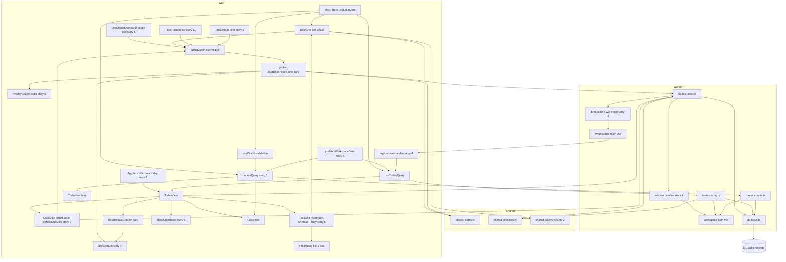
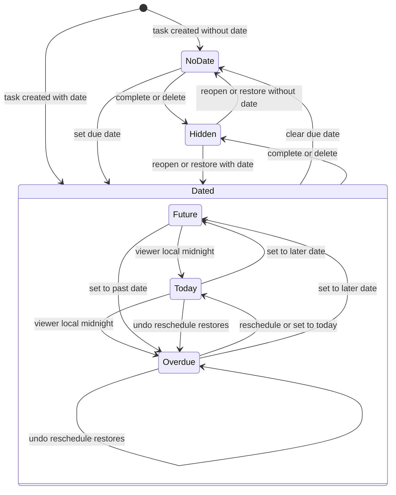
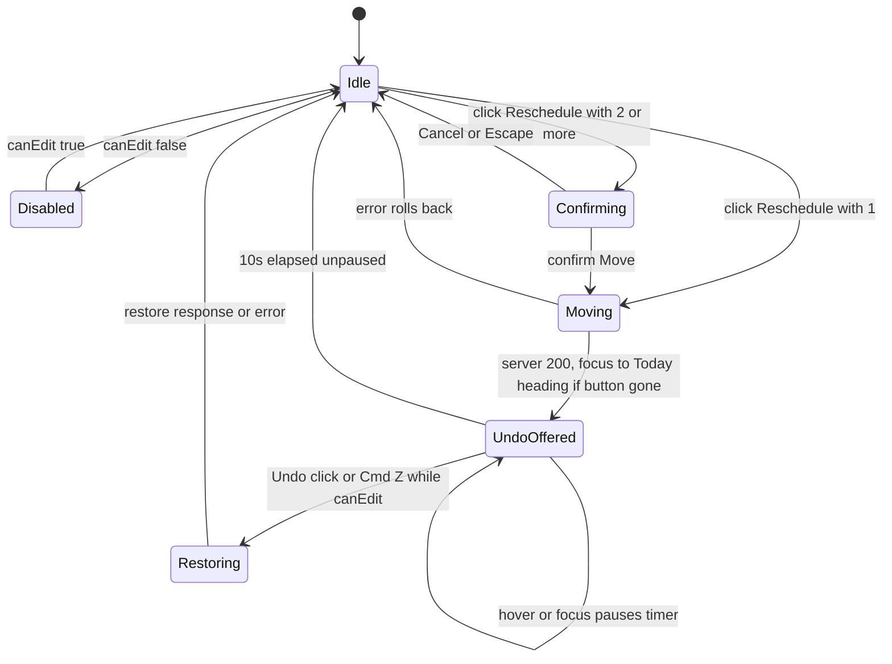
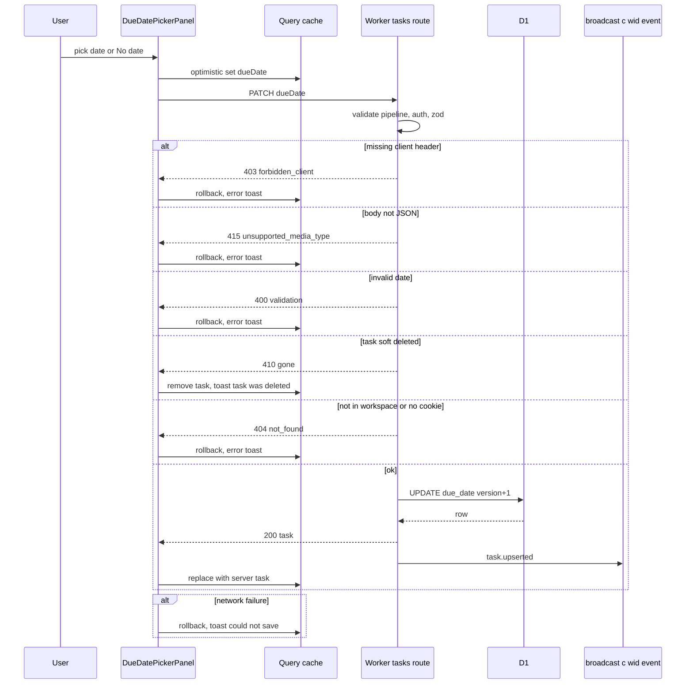
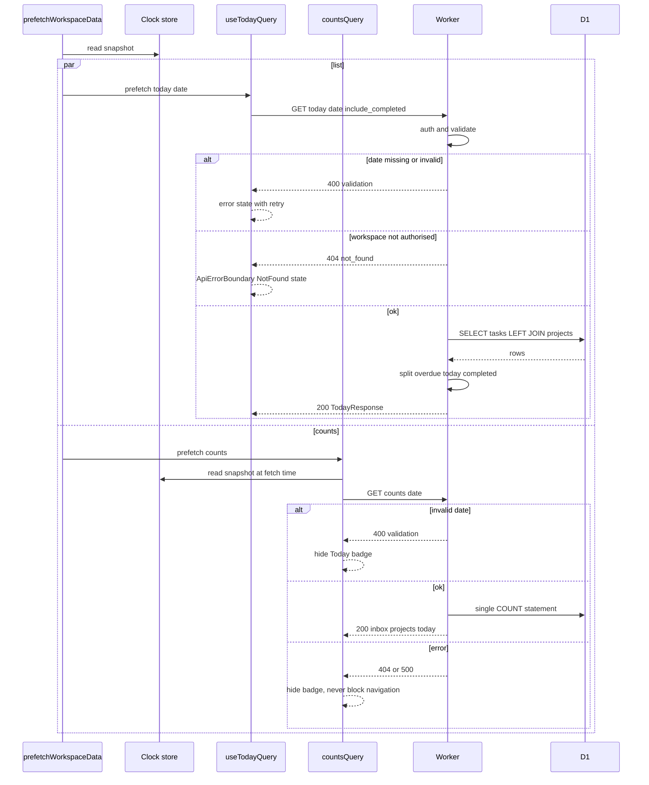
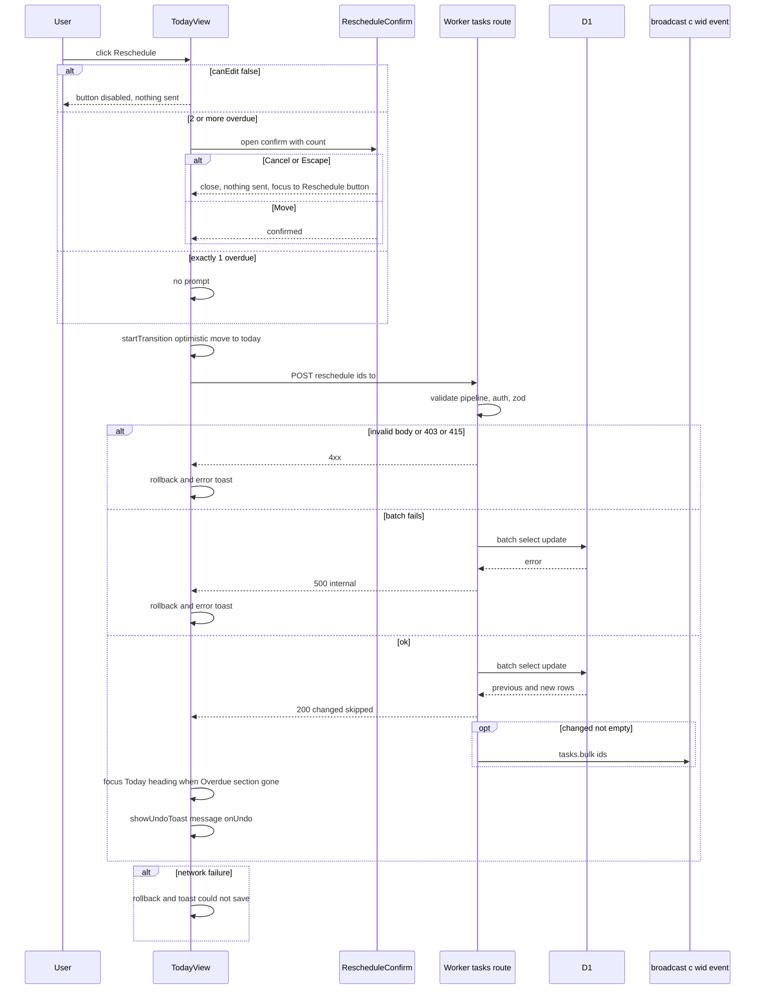
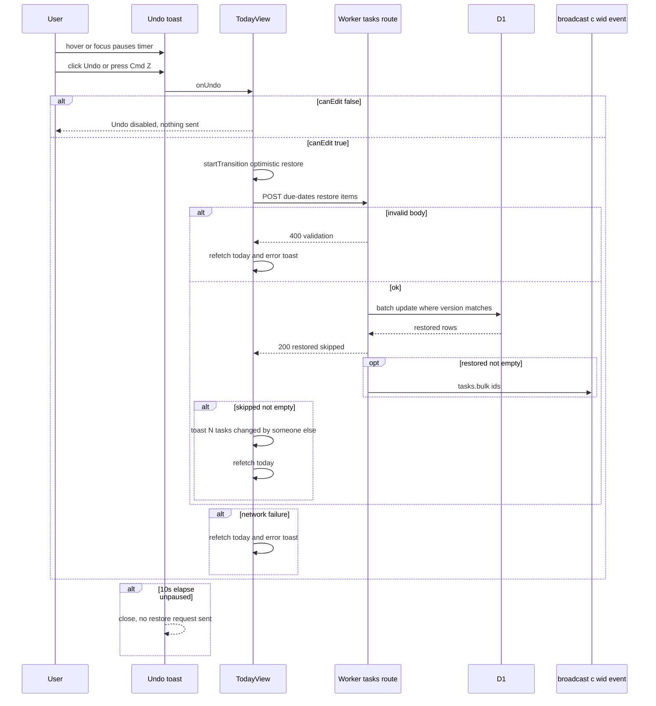
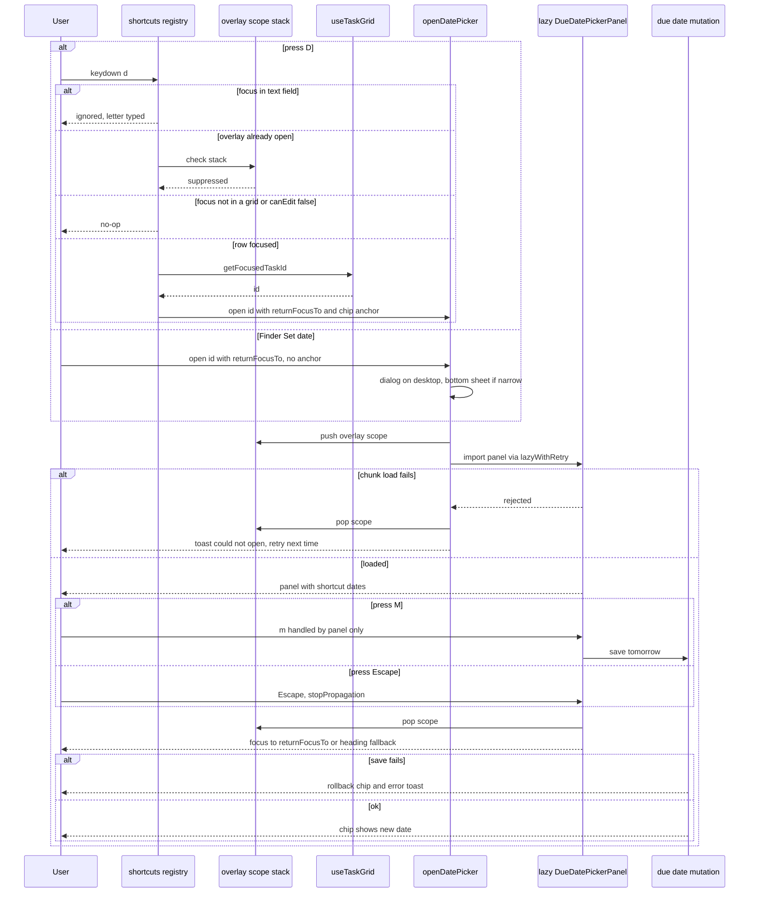
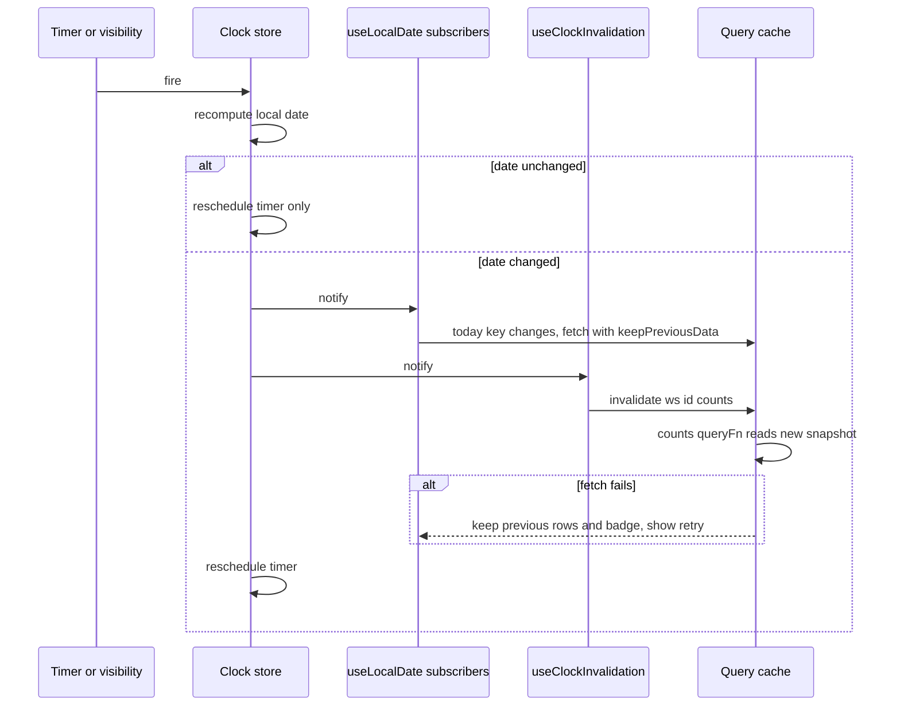

# Technical Design

Calendar-date due dates on tasks (no time, no zone), a client-dated Today query, an id-scoped Reschedule with version-guarded undo, a lazy date picker and relative chips, and a local-midnight clock store. Follows docs/architecture.md.

## Overview

## Scope
Adds due dates to tasks and a Today view (Overdue + Today groups) across the Inbox and all projects. It builds on (owner stories per the registry in `specs/general/CROSS-STORY-RESOLUTIONS.md`; see "Deltas / extension points used and owned" below):
- story 1: Worker, validate pipeline (405 → 403 → 413 → 415), `/test/*` registry (incl. the local-only `TEST_NOW` clock override, D-35), Playwright/vitest matrix
- story 2: workspace auth, `App.tsx` route table and `workspacePath`, `queryKeys.ts`, `lib/lazyWithRetry.ts`, `packages/shared/src/tokens.ts` + contrast checker, AppShell `quickAddSlot` (no fieldset; controls self-gate)
- story 4: live registry `registerLiveHandler`, `broadcast(c, wid, event)`, `tasks.bulk` refetch semantics, `useCanEdit()`
- story 5: tasks table, `TaskGrid`/`TaskRow`/`TaskSummary` (APG layout grid), `useTaskGrid`, `lib/shortcuts.ts` (scopes + overlay stack), QuickAdd (`target` + `defaultDueDate?`), `prefetchWorkspaceData`, `styles/rows.css`, `/test/seed`, `lib/useIsNarrow.ts`, sidebar, mobile "+" button
- story 6: complete, show completed (`include_completed`), `showUndoToast({message, onUndo})`, `TaskDetailSheet.tsx`, `packages/shared/src/dates.ts`
- story 7: projects, sidebar, `openMovePicker` (the M key this story must not trigger while its picker is open)

It follows `docs/architecture.md`; **§12 (frontend conventions) and §13 (ownership and extension rule) are binding**. The UX changes come from `specs/general/UI-IMPROVEMENTS.md` (date-shortcut, overdue-colour and reschedule items; owner decisions of 2026-09-25) and the cross-story resolutions of 2026-09-27 (D-01, D-05, D-07, D-10, D-12, D-14, D-19, D-21, D-25, D-26, D-31, D-35, D-39 to D-43).

## Key decisions
1. **A due date is a calendar date, not an instant.** It is stored as `TEXT 'YYYY-MM-DD'` in `tasks.due_date` (migration `0004_task_due_date.sql`), with no time and no zone. Each viewer works out today or overdue from their own clock (prd.local_dates).
2. **The server never decides what 'today' is.** Every date-relative request carries the viewer's local date: `?date=` on Today and counts, `to` on reschedule. The server only validates it.
3. **Reschedule is scoped to ids.** The client sends the ids it displayed in Overdue, and the server re-checks each one's eligibility (prd.reschedule_scope). With more than one id, the client asks for confirmation first (prd.reschedule_confirm).
4. **Undo is version-guarded.** It restores only rows whose version is unchanged and reports the rest (prd.undo_reschedule). The toast is story 6's `showUndoToast({message, onUndo})` (D-41): `UNDO_WINDOW_MS = 10_000`, pausing while hovered or focused.
5. **Local date is one external store** (`useSyncExternalStore`). It schedules a timeout at the next local midnight and re-reads on `visibilitychange`/`focus`.
   - The **Today query key contains the date**, so it refetches on rollover.
   - The **counts key `['ws', id, 'counts']` carries no date** (architecture §12, D-31). The counts request takes an optional `date`; its `queryFn` reads the clock-store snapshot, and a workspace-scoped clock subscription invalidates it at rollover. Stories 5 and 7 call `countsQuery(id)` unchanged.
6. **Keeping the view fast at 5,000 tasks** (prd.today_responsive):
   - `content-visibility: auto` with `contain-intrinsic-size` goes on **each row**, never on a section. The rule lives in story 5's `styles/rows.css` (D-07); this story uses it and does not create it.
   - TodayView renders from `useDeferredValue(data)`.
   - Reschedule's bulk optimistic update runs inside `startTransition`.
   - Virtualization (`@tanstack/react-virtual`, via story 5's `aria-rowcount` support) is a contingency, adopted only if TC-94 or TC-118 fails.
7. **Picker shortcuts are resolved by pure functions** (`shortcutDates`) in `packages/shared/src/dates.ts`:
   - Next week = the next Monday.
   - This weekend = the coming Saturday, or **today** on Saturday or Sunday, because the weekend is already underway.
   - Only the lazy picker chunk under `features/dates/picker/*` imports `date-fns` (the lint allowance, D-43). Everything else formats with cached `Intl` formatters in `dates.ts`, which story 6 creates.
8. **Overdue is never shown by colour alone.** The chip text reads 'Yesterday' or 'N days overdue', with an icon and a screen-reader label. Chip tones are entries added to story 2's `packages/shared/src/tokens.ts` (D-42), generated into `styles/tokens.css` and checked by story 2's contrast checker (AA in light and dark).
9. **Today is a child route**, `/w/:workspaceId/today`, registered in story 2's `App.tsx` route table (D-12) and lazy-loaded with story 2's `lazyWithRetry`. Its tab title uses the React 19 `<title>`.
10. **Live refresh is registered through `registerLiveHandler`** (story 4 registry, one set of handlers per event type), never by editing the dispatcher. Server broadcasts go through `broadcast(c, wid, event)` only (D-26); reschedule and restore send `tasks.bulk {ids}` with refetch semantics (D-25).
11. **Today is one story-5 `TaskGrid`** (D-01): `role=grid` labelled by the Today heading, with two `role=rowgroup` sections, **Overdue** and **Today**, each introduced by a header row. `DateChip` and `ProjectTag` render into the `TaskSummary` slots of cell 2; the date-chip trigger is a sibling of the name button, never nested in another control. Row focus uses story 5's `useTaskGrid` (D-04).
12. **One open helper for the picker** (D-05): `openDatePicker(taskId, {returnFocusTo, anchor?})`. With an anchor it is a popover; without one (the Finder, story 11) it opens centred as a dialog on desktop and a bottom sheet on phones.
13. **Picker keys are overlay-scoped** (D-14): T/M/W/N/0 and arrows are handled by the panel itself; while the picker is open the overlay scope stack suppresses global and grid shortcuts (so M never opens Move to…), and Escape calls `stopPropagation`. D is registered in story 5's registry with `scope: 'grid'`.
14. **Every control that sends a change gates itself** (D-10; there is no fieldset anywhere in the app): the picker, the Reschedule button, the Reschedule confirm and Undo read `useCanEdit()`; the Today grid's rows are gated by story 5's TaskRow cells, and quick add (in AppShell's `quickAddSlot`) keeps its input typeable and self-gates its submit.

## Structure

**Before this story**, the structure is the same minus: Clock, ClockSub, Chip, Open, Panel, the D shortcut, the Today child route, TodayView, ProjectTag, RescheduleConfirm, Title, TodayNavItem, useTodayQuery, `routes/today.ts`, the `due_date` column, the chip token entries and the date functions in `dates.ts`. `TaskGrid`, the overlay scope stack, `useCanEdit`, `prefetchWorkspaceData`, `countsQuery`, counts.ts, the Registry, `broadcast`, `showUndoToast`, QuickAdd, TaskDetailSheet and the Finder exist already (or, for the Finder, arrive in story 11) and are extended only through their named extension points. The diagram above is the target.

## Task date classification state
The only new persisted state is `tasks.due_date`. Its user-visible *classification* is derived per viewer:

`Hidden` means excluded from Today (completed or soft-deleted, stories 6 and 7). Classification is computed and never stored, because a stored value would go stale at every viewer's midnight.

## Reschedule UI state

This UI state is transient: it lives in component and toast state and is never persisted.

## Flows changed (one sequence diagram each, in capability sections)
| Flow | Diagram in |
|---|---|
| Set or clear due date (detail and quick add) | dates.due_date_field |
| Open picker by D key, chip, or Finder (unanchored); choose with keys; chunk-load failure | ui.date_picker |
| Load Today and sidebar count | today.query |
| Reschedule overdue (with confirm branch) | today.reschedule |
| Undo reschedule | today.reschedule |
| Midnight rollover (today key change and counts invalidation) | ui.midnight_rollover |
| Collaborator change reaches Today | ui.today_view |

No other flows change. Task create, complete and delete (stories 5 and 6) are reused unchanged, apart from the optional `dueDate` field and QuickAdd's `defaultDueDate`.

## Deltas / extension points used and owned

Per architecture §13 and `specs/general/CROSS-STORY-RESOLUTIONS.md`. This story changes other stories' artefacts **only through the named extension points below**; the owner's design defines the final shape.

## Extension points used (Delta to story N)
| Owner | Artefact | What story 8 adds or uses | Decision |
|---|---|---|---|
| 1 | Validate pipeline | Uses it unchanged: non-JSON body on create/PATCH/reschedule/restore → 415 `unsupported_media_type`; missing client header → 403 `forbidden_client` | D-21 |
| 1 | `/test/*` registry (`routes/test.ts`) | Registers the **local-only** `TEST_NOW` clock override (used by TC-95; ignored outside `ENVIRONMENT=local`, TC-133) | D-35 |
| 2 | `App.tsx` route table, `workspacePath` | Adds child route `/w/:id/today` (`workspacePath(wid, 'today')`) | D-12 |
| 2 | `lib/lazyWithRetry.ts` | Uses it for `DueDatePickerPanel`, `RescheduleConfirm` and the TodayView route chunk; **does not create it** | D-42 |
| 2 | `packages/shared/src/tokens.ts` + contrast checker | Adds entries `chipOverdue`, `chipToday`, `chipTomorrow`, `chipNeutral` (light and dark); `styles/tokens.css` is generated by story 2's generator | D-42 |
| 2 | `queryKeys.ts` | Adds `today(wid, {date, includeCompleted})`; `counts(wid)` stays dateless | D-31, D-37 |
| 4 | `broadcast(c, wid, event)` | Calls it exactly so for `task.upserted` and `tasks.bulk {ids}`; no direct `room.broadcast`, no extra `waitUntil` | D-25, D-26 |
| 4 | `registerLiveHandler` | Registers Today invalidation handlers (refetch, never patch) | D-25 |
| 4 | `features/live/canEdit.ts` `useCanEdit()` | Picker, Reschedule confirm and Undo gate themselves | D-10 |
| 5 | `TaskGrid` / `TaskRow` / `TaskSummary` | Adds the **Overdue** and **Today** rowgroups (header rows) and fills the `TaskSummary` **date-chip** and **project-tag** slots of cell 2; no new `TaskRow` props | D-01, D-06 |
| 5 | `useTaskGrid` | Uses `getFocusedTaskId()` for D and `focusTaskRow(id)` for focus return | D-04 |
| 5 | `lib/shortcuts.ts` | Registers `{key:'d', scope:'grid', description:'Set due date'}`; the picker pushes onto the overlay scope stack | D-14 |
| 5 | QuickAdd `target` | Uses `{kind:'inbox'}` + `defaultDueDate` (today) on the Today route; destination chip reads '→ Inbox · Today'. Story 5's `today` target kind is removed | D-40 |
| 5 | `prefetchWorkspaceData(wid)` in `routes/workspaceLoader.ts` | Adds the today and counts-with-date queries inside it | D-39 |
| 5 | `styles/rows.css` | Uses the per-row `content-visibility` rule; **does not create it** | D-07 |
| 5 | `/test/seed` schema | Uses the `tasks[].dueDate` field (declared in story 5's schema as story 8's extension) | D-35 |
| 5 | `lib/useIsNarrow.ts` | Chooses dialog vs bottom sheet for the unanchored picker | D-05, D-43 |
| 6 | `showUndoToast({message, onUndo})` | Reschedule undo | D-41 |
| 6 | `features/tasks/TaskDetailSheet.tsx` | Adds the due-date field (picker trigger) | D-43 |
| 6 | `include_completed=true\|false` | Today query parameter | D-31 |
| 6 | `packages/shared/src/dates.ts` | Adds the local-date functions | registry |
| 7 | `openMovePicker` / M key | Must **not** fire while the date picker is open (overlay scope) | D-14 |

## Extension points owned by story 8 (final shape)
| Artefact | Final shape | Extenders |
|---|---|---|
| `openDatePicker(taskId, {returnFocusTo, anchor?})` in `features/dates/openDatePicker.ts` | With `anchor`: popover beside it. Without: centred dialog on desktop, bottom sheet below `MOBILE_BREAKPOINT_PX`. Focus returns to `returnFocusTo`, else (if gone) the nearest surviving container heading (§12 rule) | 11 (Finder action bar 'Set date') |
| `DateChip` (`features/dates/DateChip.tsx`) | Props `{due, taskId?}`; with `taskId` it is the picker trigger | 11 (reuse in result rows, display-only: no `taskId`, because Finder options have no interactive children) |
| `/today?date=&include_completed=` | Response `{date, overdue, today, completed}` | — |
| Counts `today?` field | Request `date` optional; key has no date | — |
| `POST /tasks/reschedule`, `POST /tasks/due-dates/restore` | As in today.reschedule | — (never auto-retried by story 10, D-24) |
| Clock store | `useLocalDate`, `getLocalDateSnapshot`, `subscribe` | 11 (chip in results) |
| Picker keys T/M/W/N/0 | Overlay-scoped, listed in the `?` panel | — |

## Removed from this story's earlier design
- Creating `lib/lazyWithRetry.ts` (now story 2) and `styles/rows.css` (now story 5).
- Writing chip tokens directly into `styles/tokens.css` (now entries in story 2's `tokens.ts`).
- Anchoring the D picker to a listbox option / roving-focus ref (replaced by the grid and `useTaskGrid`).
- `room.broadcast` via `ctx.waitUntil`, and `tasks.bulk` carrying entities.
- QuickAdd's `{kind:'today'}` target; `includeCompleted=1`; `TaskDetail.tsx`.

## Test Strategy

## Test scopes and boundaries
| Capability | Unit | Integration | UI-component | E2E | Boundary exercised and why sufficient |
|---|---|---|---|---|---|
| dates.local_date_logic | yes | no: pure functions, no I/O to integrate | no: rendered via DateChip and picker tests in ui.date_picker | no: covered through ui flows | inner logic; all date branching (classification, chip labels, shortcuts) lives here |
| dates.due_date_field | yes (zod) | yes | no: no component of its own; picker covers UI | yes | request handling via SELF.fetch against real D1 (incl. story 1's 403/415 pipeline); browser for full round trip |
| today.query (list + counts extension) | yes (row grouping) | yes | yes (counts key and rollover TC-120; prefetch TC-136) | yes (via TodayView) | request handling + real D1 query plan; client key contract in component tests |
| today.reschedule | yes | yes | yes (confirm, undo, canEdit, focus fallback, refetch handler) | yes | request handling + D1 batch atomicity + broadcast payload; confirm/undo UI in browser rendering |
| ui.date_picker | yes (contrast of token entries TC-110) | no: no server of its own | yes | yes | browser rendering with mocked api; overlay-scope key routing; axe in e2e |
| ui.today_view | no: grouping is in today.query unit | no: server tested in today.* | yes | yes | browser rendering (grid roles and cell slots); e2e for real data, route, performance, axe |
| ui.midnight_rollover | yes (clock store; TEST_NOW guard TC-133) | no: client-only | yes | yes | fake timers inner; real browser clock in e2e |

## Dimensions crossed
- **D1 viewer timezone:** UTC; Pacific/Kiritimati (UTC+14); Etc/GMT+12 (UTC-12); America/New_York (DST); Europe/London (DST).
- **D2 due position relative to viewer local date:** none; before yesterday; yesterday; today; tomorrow; +2..+6; +7 or more; different year.
- **D3 task state:** open; completed; soft-deleted; in soft-deleted project.
- **D4 location:** Inbox; project.
- **D5 weekday of today (for shortcuts):** Mon; Tue; Wed; Thu; Fri; Sat; Sun.
- **D6 overdue count at Reschedule:** 1; 2 (the `RESCHEDULE_CONFIRM_MIN` threshold); many (up to `RESCHEDULE_MAX_IDS`).
- **D7 input focus when a shortcut key is pressed:** text field; task row focused in the grid; nothing focused; **date picker open** (overlay scope, D-14).
- **D8 editing gate (D-10):** `canEdit` true; `canEdit` false.
- **D9 picker opening (D-05):** anchored (chip, D key, detail, quick add); unanchored desktop; unanchored phone.

**Equivalence classes**
- D2 is exhaustive and non-overlapping over all integer day offsets plus 'none'.
- D3 is exhaustive over the task lifecycle of stories 5 to 7.
- D5 is exhaustive over the week.
- D6 covers below, at and above the threshold.
- D7 is exhaustive over focus targets, including an open overlay.
- D8 and D9 are exhaustive over their values.

## Case table: classification and Today membership (D1 x D2 x D3)
| TC | Level | Viewer TZ | Instant (UTC) | due_date | State | Expected class | In Today? | Chip (text, icon) |
|---|---|---|---|---|---|---|---|---|
| TC-01 | unit | UTC | 2026-09-25T12:00Z | none | open | NoDate | no | no chip: undated |
| TC-02 | unit | UTC | 2026-09-25T12:00Z | 2026-09-20 | open | Overdue | yes, Overdue | '5 days overdue', overdue tone, warning icon |
| TC-03 | unit | UTC | 2026-09-25T12:00Z | 2026-09-24 | open | Overdue | yes, Overdue | 'Yesterday', overdue tone, warning icon |
| TC-04 | unit | UTC | 2026-09-25T12:00Z | 2026-09-25 | open | Today | yes, Today | 'Today', today tone, no icon |
| TC-05 | unit | UTC | 2026-09-25T12:00Z | 2026-09-26 | open | Future | no | 'Tomorrow', tomorrow tone, no icon |
| TC-06 | unit | UTC | 2026-09-25T12:00Z | 2026-09-27 | open | Future | no | 'Sunday', neutral |
| TC-07 | unit | UTC | 2026-09-25T12:00Z | 2026-10-01 | open | Future | no | 'Thursday' (+6 boundary) |
| TC-08 | unit | UTC | 2026-09-25T12:00Z | 2026-10-02 | open | Future | no | '2 Oct' (+7 boundary) |
| TC-09 | unit | UTC | 2026-09-25T12:00Z | 2027-01-04 | open | Future | no | '4 Jan 2027' (year shown) |
| TC-10 | unit | Pacific/Kiritimati | 2026-09-25T10:30Z (= 26th 00:30 local) | 2026-09-25 | open | Overdue | yes, Overdue | 'Yesterday', warning icon |
| TC-11 | unit | Etc/GMT+12 | 2026-09-25T11:30Z (= 24th 23:30 local) | 2026-09-25 | open | Future | no | 'Tomorrow' |
| TC-12 | integration | n/a: server takes date param; zone applied by client | date=2026-09-26 | 2026-09-25 | open | Overdue | yes, overdue[] | not rendered at this level: API only |
| TC-13 | integration | same reason as TC-12 | date=2026-09-24 | 2026-09-25 | open | Future | no | not rendered at this level: API only |
| TC-14 | integration | same reason as TC-12 | date=2026-09-25 (include_completed omitted, default false) | 2026-09-25 | completed | Hidden | no (default) | not rendered at this level: API only |
| TC-15 | integration | same reason as TC-12 | date=2026-09-25&include_completed=true | 2026-09-25 | completed | Hidden | yes, completed[] only | not rendered at this level: API only |
| TC-16 | integration | same reason as TC-12 | date=2026-09-25 | 2026-09-25 | soft-deleted | Hidden | no | not rendered at this level: API only |
| TC-17 | integration | same reason as TC-12 | date=2026-09-25 | 2026-09-20 | in deleted project | Hidden | no | not rendered at this level: API only |
| TC-18 | integration | same reason as TC-12 | date=2026-09-25 | 2026-09-25 | open, project Work/red | Today | yes, projectName=Work, projectColor=red | not rendered at this level: API only |
| TC-19 | integration | same reason as TC-12 | date=2026-09-25 | 2026-09-25 | open, Inbox | Today | yes, projectId null | not rendered at this level: API only |
| TC-20 | integration | same reason as TC-12 | date=2026-09-25, other workspace has due task | 2026-09-25 | open, other workspace | Hidden to caller | no (isolation) | not rendered at this level: API only |

## Case table: date validation and boundaries (dates.local_date_logic, dates.due_date_field)
| TC | Level | Input | Expected |
|---|---|---|---|
| TC-21 | unit | isCalendarDate('2028-02-29') | true (leap day) |
| TC-22 | unit | isCalendarDate('2027-02-29') | false |
| TC-23 | unit | isCalendarDate('2026-13-01') | false |
| TC-24 | unit | isCalendarDate('2026-09-31') | false |
| TC-25 | unit | isCalendarDate('2026-9-5') | false (not zero padded) |
| TC-26 | unit | isCalendarDate('2026-09-25T00:00') | false |
| TC-27 | unit | isCalendarDate('') | false (empty) |
| TC-28 | unit | isCalendarDate('1969-12-31') and ('10000-01-01') | false, outside DUE_DATE_MIN_YEAR/MAX_YEAR |
| TC-29 | unit | isCalendarDate('1970-01-01') and ('9999-12-31') | true (min and max bounds) |
| TC-30 | unit | addDays('2026-12-31', 1) | 2027-01-01 (year boundary) |
| TC-31 | unit | addDays('2028-02-28', 1) | 2028-02-29 |
| TC-32 | unit | nextWeek from Fri 2026-09-25 / Mon 2026-09-28 / Sun 2026-09-27 | 2026-09-28 / 2026-10-05 / 2026-09-28 |
| TC-33 | unit | localDateOf(2026-03-08T07:30Z, America/New_York spring forward) | 2026-03-08 |
| TC-34 | unit | msUntilNextLocalMidnight at 2026-03-07T23:00 NY (day before 23h day) | 3,600,000 |
| TC-35 | unit | msUntilNextLocalMidnight at 2026-11-01T00:30 NY (25h day) | 24.5 h in ms |
| TC-36 | integration | PATCH dueDate '2026-10-01' | 200; row before null, after '2026-10-01'; version +1; one task.upserted broadcast via `broadcast(c, wid, event)` |
| TC-37 | integration | PATCH dueDate null on dated task | 200; row after null; version +1 |
| TC-38 | integration | PATCH dueDate '2027-02-29' | 400 validation; row unchanged; version unchanged; no broadcast |
| TC-39 | integration | PATCH dueDate 20260925 (number) | 400 validation; row unchanged |
| TC-40 | integration | PATCH on soft-deleted task | 410 gone {entity:'task'}; row unchanged |
| TC-41 | integration | PATCH on task id from another workspace | 404 not_found; other row unchanged |
| TC-42 | integration | PATCH without workspace cookie | 404 not_found (architecture section 4) |
| TC-43 | integration | POST task with client-generated id and dueDate '2026-09-25' | 201; row due_date set; id equals client id |
| TC-44 | integration | POST task with dueDate 'tomorrow' | 400; no row inserted |
| TC-45 | integration | GET today without date / date=2026-02-30 / include_completed=1 | 400 validation each (D-31: only `true|false` accepted) |
| TC-46 | integration | migration 0004 applied on DB containing story-5 tasks | existing rows due_date null; no data loss |
| TC-100 | integration | POST same client id and same body including dueDate twice (retry) | second call returns existing task; one row; due_date unchanged; story-5 id_conflict rule unaffected |
| TC-130 | integration | PATCH dueDate, POST create with dueDate, POST reschedule, POST restore — each (a) with `Content-Type: text/plain` JSON-looking body and the client header, (b) with JSON body and no `X-Todoodle-Client` | (a) 415 `unsupported_media_type` (not 403, D-21); (b) 403 `forbidden_client`; rows unchanged before = after; no broadcast |

## Case table: shortcut dates by weekday (D5; dates.local_date_logic)
The week used is Mon 2026-09-21 to Sun 2026-09-27.
| TC | Level | Today | thisWeekend | nextWeek | Tomorrow | Note |
|---|---|---|---|---|---|---|
| TC-101 | unit | Mon 2026-09-21 | Sat 2026-09-26 | Mon 2026-09-28 | Tue 2026-09-22 | Monday: next week is +7 |
| TC-102 | unit | Tue 2026-09-22 | Sat 2026-09-26 | Mon 2026-09-28 | Wed 2026-09-23 | mid-week |
| TC-103 | unit | Wed 2026-09-23 | Sat 2026-09-26 | Mon 2026-09-28 | Thu 2026-09-24 | mid-week |
| TC-104 | unit | Thu 2026-09-24 | Sat 2026-09-26 | Mon 2026-09-28 | Fri 2026-09-25 | mid-week |
| TC-105 | unit | Fri 2026-09-25 | Sat 2026-09-26 | Mon 2026-09-28 | Sat 2026-09-26 | weekend equals tomorrow |
| TC-106 | unit | Sat 2026-09-26 | Sat 2026-09-26 (today) | Mon 2026-09-28 | Sun 2026-09-27 | Saturday: weekend is today |
| TC-107 | unit | Sun 2026-09-27 | Sun 2026-09-27 (today) | Mon 2026-09-28 | Mon 2026-09-28 | Sunday: weekend is today; next week equals tomorrow |
| TC-108 | unit | Fri 2026-12-25 (en-GB) | Sat 2026-12-26 | Mon 2026-12-28 | Sat 2026-12-26 | labels 'Sat 26 Dec', 'Mon 28 Dec' via formatShortcutDate; year boundary not crossed. Also Thu 2026-12-31: tomorrow 2027-01-01 |

## Case table: overdue labelling and contrast (prd.overdue_accessible)
| TC | Level | Input | Expected |
|---|---|---|---|
| TC-109 | unit | chipLabel offsets -1, -2, -30 at 2026-09-25, en-GB | 'Yesterday' / '2 days overdue' / '30 days overdue'; tone overdue; showWarningIcon true; srLabel 'Overdue: due Thursday 24 September' etc. Offset 0 has srLabel 'Due Today' and no icon |
| TC-110 | unit | the chip entries this story adds to story 2's `packages/shared/src/tokens.ts`, run through story 2's contrast checker against the light and dark row backgrounds | every ratio >= 4.5; the generated `styles/tokens.css` contains the four `--chip-*` variables (not hand-edited) |
| TC-115 | ui-component | render DateChip for offset -3 | text '3 days overdue'; icon present and aria-hidden; accessible name 'Overdue: due Tuesday 22 September'; removing colour classes still leaves the text (colour not sole signal) |

## Case table: counts extension (today.query)
| TC | Level | Setup | Request | Expected |
|---|---|---|---|---|
| TC-97 | integration | 2 overdue + 3 due today open; 1 completed today; 1 deleted today; 1 in deleted project overdue; 2 future; 2 undated | GET counts?date=2026-09-25 | today = 5; `inbox` and `projects[id].{open,total}` unchanged from story 5/7 semantics |
| TC-98 | integration | same | GET counts (no date) | response has no today field; inbox/project counts present (server clock never used) |
| TC-99 | integration | same | GET counts?date=2026-02-30 | 400 validation |
| TC-120 | ui-component | counts query mounted; fake clock 2026-09-25 23:59:59; advance 2 s | cache key is exactly ['ws', id, 'counts'] (no date); first request has date=2026-09-25; after rollover exactly one new counts request with date=2026-09-26; story-5 setQueryData on ['ws', id, 'counts'] still lands in the same entry |
| TC-136 | ui-component | story 5's `prefetchWorkspaceData('w1')` called with target path `/w/w1/today`, MSW recording request start times | call once | exactly one GET today?date=2026-09-25&include_completed=false and one GET counts?date=2026-09-25, both started before either resolves (parallel), alongside story 5's own prefetches; no other Promise.all issues duplicates when TodayView then mounts (0 extra requests) |

## Case table: reschedule and undo (today.reschedule)
Dimensions: id eligibility (eligible; completed since; deleted since; no longer overdue; never overdue; other workspace), crossed with undo outcome (unchanged; changed by other; deleted by other), D6 and D8.
| TC | Level | Setup (before) | Action | Expected after |
|---|---|---|---|---|
| TC-47 | integration | A due 09-20, B due 09-24, both open | reschedule ids [A,B] to 09-25 | both 09-25; versions +1; changed[] has previousDueDate 09-20/09-24; one tasks.bulk broadcast |
| TC-48 | integration | A due 09-20; C due 09-19 created by collaborator, not in ids | reschedule [A] to 09-25 | A 09-25; C still 09-19 (scope) |
| TC-49 | integration | A completed after load | reschedule [A] | A unchanged; skipped [A]; no broadcast when changed empty |
| TC-50 | integration | A soft-deleted after load | reschedule [A] | A unchanged; skipped [A] |
| TC-51 | integration | A due 09-30 (future) | reschedule [A] to 09-25 | A unchanged; skipped [A] |
| TC-52 | integration | A due 09-25 (already today) | reschedule [A] to 09-25 | A unchanged (not before to); skipped |
| TC-53 | integration | A in workspace W2 | reschedule from W1 [A] | A unchanged; skipped; no leak of existence |
| TC-54 | integration | ids [] | reschedule | 400 validation |
| TC-55 | integration | ids length RESCHEDULE_MAX_IDS + 1 | reschedule | 400 validation |
| TC-56 | integration | ids length RESCHEDULE_MAX_IDS, all eligible | reschedule | 200; all moved in one atomic batch |
| TC-57 | integration | to = '2026-02-30' | reschedule | 400; nothing changed |
| TC-58 | integration | after TC-47 | restore items with returned versions | A 09-20, B 09-24; versions +1; restored [A,B]; also first proof that json_each works in D1 (fallback path otherwise) |
| TC-59 | integration | after TC-47, collaborator PATCHes B | restore | A restored; B unchanged; skipped [{B, changed}] |
| TC-60 | integration | after TC-47, collaborator deletes A | restore | A unchanged; skipped [{A, gone}] |
| TC-61 | integration | restore items [] or > RESCHEDULE_MAX_IDS | restore | 400 |
| TC-62 | unit | rescheduleResultToUndoItems(changed[]) | maps to {id, dueDate: previousDueDate, expectedVersion: version} |
| TC-63 | integration | D1 batch failure injected via invalid statement in test-only variant | reschedule | 500 internal; no task changed (atomicity) |
| TC-131 | integration | as TC-47 and TC-58, test WebSocket client connected | reschedule [A,B]; then restore | each emits exactly one message whose payload is `{type:'tasks.bulk', ids:[A,B], originClientId}` with **no entity fields** and no `deleted` (D-25); emitted through story 4's `broadcast` (spy on the helper; zero direct `room.broadcast` calls, D-26) |

## Case table: UI components (mocked api via MSW, real components)
| TC | Level | Component | Scenario | Expected |
|---|---|---|---|---|
| TC-64 | ui-component | DueDatePickerPanel via openDatePicker with anchor | open, click 'Tomorrow · Sat 26 Sep' at fake now Fri 2026-09-25 | onChange('2026-09-26'); popover closes; focus returns to `returnFocusTo` |
| TC-65 | ui-component | DueDatePickerPanel | choose No date | onChange(null) |
| TC-66 | ui-component | DueDatePickerPanel | keyboard: arrow to 30th, Enter | onChange('2026-09-30'); all shortcuts reachable by Tab; buttons labelled |
| TC-67 | ui-component | DateChip | offsets -3,-1,0,1,3,7, next year | text, tone class and icon per prd.date_chip ('3 days overdue' with icon, 'Yesterday' with icon, 'Today', 'Tomorrow', 'Monday', '2 Oct', '4 Jan 2027') |
| TC-68 | ui-component | TaskDetailSheet (story 6) with picker | PATCH returns 500 | chip reverts to previous date; error toast shown |
| TC-69 | ui-component | TaskDetailSheet (story 6) with picker | PATCH returns 410 | 'This task was deleted' toast; sheet closes |
| TC-70 | ui-component | TodayView | overdue 2, today 3 | Overdue header row with icon above the Today header row; counts correct; each row's cell 2 shows project name/colour or Inbox |
| TC-71 | ui-component | TodayView | none due | 'All clear for today' empty state; no Overdue rowgroup; no Reschedule button |
| TC-72 | ui-component | TodayView | only today tasks | no Overdue rowgroup; no Reschedule |
| TC-73 | ui-component | TodayView Reschedule, 2 overdue | click Reschedule, confirm Move | optimistic: overdue rows move to the Today rowgroup immediately; request body ids = displayed overdue ids, to = local date; `showUndoToast` called once with `{message:'2 tasks rescheduled to today', onUndo}` (D-41) |
| TC-74 | ui-component | TodayView Reschedule | server 500 | rows return to Overdue; error toast |
| TC-75 | ui-component | TodayView Undo | skipped 1 of 3 | toast '1 task was changed by someone else and was not restored' |
| TC-76 | ui-component | TodayView Undo | fake timers advance UNDO_WINDOW_MS (10,000 ms) with no hover or focus | toast gone; no restore request |
| TC-77 | ui-component | QuickAdd in Today | submit 'Pay rent' | QuickAdd received `target={kind:'inbox'}` and `defaultDueDate='2026-09-25'` (no `today` target kind, D-40); POST body has client-generated id, dueDate = local date, projectId null; row appears in the Today rowgroup |
| TC-78 | ui-component | QuickAdd in Today with picker set to Tomorrow | submit | dueDate tomorrow; row not shown in Today; toast 'Added to Inbox' |
| TC-79 | ui-component | TodayNavItem in Sidebar todaySlot | counts response today=5, then today=0, then counts request fails | badge 5; hidden at 0; hidden on failure without blocking navigation; exactly one counts request (no separate Today count request) |
| TC-80 | ui-component | TodayView | live task.upserted from other client moves task to future | row disappears after debounce; badge decrements after counts refetch |
| TC-111 | ui-component | DueDatePickerPanel at Fri 2026-09-25 | open | five shortcut buttons in order with labels 'Today · Fri 25 Sep', 'Tomorrow · Sat 26 Sep', 'This weekend · Sat 26 Sep', 'Next week · Mon 28 Sep', 'No date'; accessible names include full dates |
| TC-112 | ui-component | DueDatePickerPanel open | press t, m, w, n, 0 (separate renders) | onChange 2026-09-25 / 2026-09-26 / 2026-09-26 / 2026-09-28 / null; each closes the picker once; unrelated key 'x' does nothing |
| TC-113 | ui-component | Today TaskGrid with row B focused via story 5's `useTaskGrid` (D7) | press d; then focus quick-add input and press d; then with focus outside the grid (nothing focused) press d | first: `openDatePicker(B, {returnFocusTo: B's cell, anchor: B's date-chip slot})` opens anchored to B; second: letter 'd' typed, no picker; third: nothing happens (D is `scope:'grid'`). '?' panel lists 'D  Set due date' |
| TC-114 | ui-component | picker via story 2's `lazyWithRetry` | lazy import rejects once, then resolves | first open: toast 'Couldn't open the date picker — try again', no crash; second open: panel renders (retry not cached) |
| TC-116 | ui-component | TodayView with exactly 1 overdue (D6 = 1) | click Reschedule | no dialog; request sent immediately; undo toast |
| TC-117 | ui-component | TodayView with 7 overdue (D6 = many) | click Reschedule; Cancel; click again; press Escape; click again; Move | dialog text 'Move 7 overdue tasks to today?'; after Cancel and Escape: zero requests, rows unchanged (state before = after), focus back on Reschedule; after Move: one request with 7 ids |
| TC-119 | ui-component | Undo toast after reschedule | hover toast for 15 s of fake time, then unhover 10 s; separately press Cmd+Z while toast shown | toast still open after 15 s hovered; closes 10 s after unhover; Cmd+Z sends exactly one restore request; toast has role=status |
| TC-121 | ui-component | TodayView with 50 rows | inspect DOM | every `role=row` task element carries story 5's per-row content-visibility class from `styles/rows.css`; rowgroup and grid containers do not; story 8 ships no rows.css of its own |
| TC-122 | ui-component | TodayView, workspace 'My Todoodle', counts today=5, then 0 | render | document.title '(5) Today · My Todoodle', then 'Today · My Todoodle'; title never contains the fragment secret seeded in location.hash |
| TC-124 | ui-component | live registry with story-5 counts handler already registered | Today module registers its handlers; dispatch task.upserted from other client | both the story-5 handler and the today handler run (neither overwritten); own-echo event invokes no invalidation |
| TC-127 | ui-component | Today grid, row B focused; story 7's `openMovePicker` registered on M (spy); quick add open underneath in a second render | open picker with D; press m; reopen; press Escape | m: onChange('2026-09-26') and picker closes; `openMovePicker` spy **not called**; no global or grid handler invoked while the picker was open (overlay scope stack, D-14). Escape: picker closes, event `stopPropagation`ed — the quick add underneath stays open with its text, and focus returns to row B |
| TC-128 | ui-component | `openDatePicker(A, {returnFocusTo: btn})` with **no anchor** (D9) | (a) `useIsNarrow` false; (b) `useIsNarrow` true; each: press n, then separately press Escape | (a) renders a centred `role=dialog` (not a popover), labelled 'Set due date'; (b) renders the bottom-sheet variant; n → PATCH dueDate 2026-09-28 for A; on close focus is on `btn`; if `btn` was removed before close, focus goes to the nearest surviving container heading |
| TC-129 | ui-component | TodayView with 7 overdue; Reschedule confirmed | Move succeeds and the Overdue rowgroup (with its Reschedule button) unmounts | `document.activeElement` is the Today heading (D-19), never `body` |
| TC-132 | ui-component | Today query cached; spy on `queryClient.setQueryData`/`setQueriesData` | dispatch `tasks.bulk {ids:[A,B]}` from another client through the real registry | today query invalidated (one refetch after `TODAY_INVALIDATE_DEBOUNCE_MS`); no cache patch from the event payload (refetch semantics, D-25) |
| TC-134 | ui-component | `useCanEdit()` false (story 4 store set offline) (D8) | focus a row and press d; click a chip; open the picker while online then go offline; click Reschedule; open confirm while online then go offline; press Cmd+Z with an Undo toast shown | D and chip do not open the picker; the already-open picker's options are disabled and choosing sends nothing; Reschedule disabled (self-gated via `useCanEdit()`); confirm Move disabled; Cmd+Z sends no restore; chips and rows still render (read-only works) |
| TC-135 | ui-component | TodayView with 2 overdue and 3 today | inspect roles; keyboard ←/→ on a row | exactly one `role=grid` with `aria-labelledby` = the Today view heading; two `role=rowgroup` elements each starting with a header row ('Overdue', 'Today · Fri 25 Sep'); no `listbox`/`option` roles; in each task row the DateChip trigger and ProjectTag are inside cell 2 (`gridcell`) beside the name button, and the chip trigger has **no interactive ancestor** (not nested in the name button or another control); → from the name reaches the chip trigger |
| TC-137 | ui-component | QuickAdd opened from the Today route | render | destination chip reads '→ Inbox · Today' and the form's accessible description includes it (D-40) |
| TC-81 | unit | clock store | fake time 23:59:59.000 then advance 1,000 ms | subscribers notified once; date string rolls to next day |
| TC-82 | unit | clock store | tab hidden past midnight (timer never fired), then visibilitychange visible | date re-read and subscribers notified |
| TC-83 | unit | clock store | two subscribers | one timeout and one visibilitychange listener registered (dedupe) |
| TC-84 | unit | clock store | last subscriber unsubscribes | timeout cleared; listeners removed |
| TC-85 | ui-component | TodayView across midnight (fake timers) | task due tomorrow | moves into Today; previous-today task moves to Overdue; new today request with new date key; counts invalidated and refetched once (key unchanged) |

## E2E workflows (Playwright, local wrangler dev, seeded via story 5's /test/seed with `tasks[].dueDate`)
Projects per D-36: `chromium` and `webkit` desktop for every spec; specs tagged `@mobile` also run on `mobile-webkit` and `mobile-chromium`.
| TC | Level | Workflow | Asserts |
|---|---|---|---|
| TC-86 | e2e | Set date from the task detail sheet then open Today (timezoneId Europe/London, clock 2026-09-25T09:00) | chip Today; task listed in Today with project name; sidebar badge 1 |
| TC-87 | e2e @mobile | Quick add from Today (FAB on phones) | chip reads '→ Inbox · Today'; new task in Today, in Inbox with Today chip after navigating to Inbox |
| TC-88 | e2e | Reschedule 3 overdue: confirm dialog, Move, then Undo | confirm shows count 3; three overdue move to Today; focus on Today heading; Undo returns original dates (checked in project view) |
| TC-89 | e2e | Two browser contexts: London and Pacific/Kiritimati, same workspace, instant 2026-09-25T11:00Z, task due 09-25 | London sees it in Today; Kiritimati sees it in Overdue with 'Yesterday' and icon (per-viewer local) |
| TC-90 | e2e | Midnight rollover (page.clock installed at 23:59:30 local, then runFor 60s) | task due tomorrow now in Today without reload; badge and tab title update |
| TC-91 | e2e | Collaborator clears date in context B | disappears from A's Today within LIVE_UPDATE_TARGET_MS |
| TC-92 | e2e | Clear date via No date | chip removed; task leaves Today |
| TC-123 | e2e | Click Today in sidebar; reload; go to Inbox; browser back | URL is `workspacePath(id,'today')` = /w/<id>/today; after reload still Today; back returns to Today |
| TC-125 | e2e | axe-core scan of Today view with overdue rows, and with the date picker open | **no serious or critical violations, with no rule exclusions** — including `nested-interactive`, `aria-required-children` and `aria-required-parent`, which are now expected to pass because Today is a grid whose chip trigger is a sibling of the name button (D-01) |
| TC-126 | e2e | Keyboard only: Tab into the Today grid, arrow to a task, press D, press N | picker opens on that row; chip shows 'Monday' (2026-09-28 at Fri 2026-09-25); focus back on the row's cell |

## Performance
| TC | Level | Scenario | Expected |
|---|---|---|---|
| TC-93 | integration | seed 5,000 open tasks (2,000 due <= date across 50 projects, rest future/undated) via story 5's bulk-capable /test/seed; GET today and GET counts?date | server p95 over 20 runs < 300 ms each in Miniflare; EXPLAIN QUERY PLAN uses idx_tasks_ws_due |
| TC-94 | e2e | same seed; navigate to Today | Today list interactive < 500 ms after navigation (performance.mark around route render and data) |
| TC-118 | e2e | same seed, 2,000 rows in Today; type 30 characters into quick add while a Reschedule of 500 overdue and a live tasks.bulk from context B are applied | every keystroke's event-timing duration < 100 ms (PerformanceObserver 'event'); failure triggers the virtualization contingency in ui.today_view |

## Negative scenarios (what must NOT happen)
| TC | Level | Must not |
|---|---|---|
| TC-14, TC-16, TC-17, TC-97 | integration | completed, deleted, or deleted-project tasks must not appear in Today or its count |
| TC-48 to TC-53 | integration | reschedule must not touch unseen, completed, deleted, future, already-today, or other-workspace tasks |
| TC-38, TC-44, TC-57, TC-130 | integration | invalid dates, non-JSON bodies or missing client headers must not mutate rows or broadcast; non-JSON must not be reported as 403 |
| TC-49 | integration | a no-op reschedule must not broadcast |
| TC-131 | integration | bulk broadcasts must not carry entities or bypass `broadcast(c, wid, event)` |
| TC-59, TC-60 | integration | undo must not overwrite a collaborator's newer change or resurrect deleted tasks |
| TC-95, TC-98 | integration | neither Today nor counts may fall back to the server clock: omitting date is 400 for Today and omits the field for counts |
| TC-133 | unit | the `TEST_NOW` clock override must not take effect outside `ENVIRONMENT=local` |
| TC-79, TC-120 | ui-component | the sidebar must not issue a separate Today count request; the counts key must not contain a date |
| TC-100 | integration | a create retry must not duplicate a dated task |
| TC-96, TC-113 | ui-component | the date picker must not open or steal keys when D or shortcut letters are typed inside inputs |
| TC-127 | ui-component | picker keys must not reach global or grid shortcuts (M must not open Move to…); Escape must not close the surface underneath |
| TC-132 | ui-component | live handlers must not patch caches from `tasks.bulk` |
| TC-134 | ui-component | no date change, reschedule or restore may be sent while `canEdit` is false |
| TC-117 | ui-component | cancelling the confirm must not send a request or change any row |
| TC-76, TC-119 | ui-component | no restore request after the undo window expires; the window must not expire while hovered or focused |
| TC-115 | ui-component | overdue must not be conveyed by colour alone |
| TC-122 | ui-component | the tab title must not contain the secret |
| TC-124 | ui-component | registering Today handlers must not replace other stories' handlers |
| TC-129 | ui-component | focus must not fall to `body` when the Reschedule button disappears |
| TC-125, TC-135 | e2e, ui-component | the Today list must not use listbox/option roles or nest the chip trigger inside another control |

## Mock vs real
| Dependency | Unit | Integration | UI-component | E2E | Why |
|---|---|---|---|---|---|
| D1 | not used: pure | real Miniflare D1 with migrations 0001-0004 | mocked via MSW: component behaviour is under test, server covered by integration | real local D1 | architecture section 10 forbids mocking the store under test |
| WorkspaceRoom DO | not used | real Miniflare DO; test WebSocket client asserts broadcasts; spy on story 4's `broadcast` helper | mocked event injection through the real live registry | real | broadcast is part of the contract |
| Clock | vi.useFakeTimers + vi.setSystemTime; TZ set via process.env.TZ per test file (story 1's forks pool, D-36) | server takes the date as input; TC-95 sets the local-only `TEST_NOW` override from story 1's registry | fake timers | Playwright page.clock + timezoneId | midnight and zones must be deterministic |
| Timezone | tests set TZ env for node | not applicable: server is zone-agnostic by design | happy-dom inherits TZ env | Playwright timezoneId per context | proves per-viewer behaviour |
| `canEdit` | not used | not used | real story 4 store, driven offline/online | real (context.setOffline) where needed | gating is part of the contract |
| Lazy chunks | not used | not used | vi.mock of the dynamic import to reject once (TC-114) | real Vite chunks | failure path cannot be produced reliably in a real browser |
| axe-core | not used | not used | not used: happy-dom lacks layout for contrast | real Chromium and WebKit | contrast needs real rendering |

## Fixture realism
Seed fixtures mirror real data:
- task names such as 'Renew passport' and 'Pay council tax', with descriptions up to TASK_DESCRIPTION_MAX;
- client-generated ids as story 5 produces them;
- a mix of Inbox tasks and 50 coloured projects;
- due dates spread over the past 60 days, today and the next 90 days;
- a share of tasks completed and soft-deleted;
- one project soft-deleted with its tasks (delete_batch_id set), exactly as story 7 produces it.

Fixtures are created through the real API, or through story 5's `/test/seed` (schema `{workspaceId, projects?, tasks?:[{…, dueDate?, …}]}`, D-35), which calls the same db modules. They are not hand-written SQL rows that could drift from the production shape; there is no `/test/sql`. Weekday tests use the real calendar week of 2026-09-21, not synthetic offsets.

## Not covered (deliberately)
- Visual regression of chip colours beyond class names and contrast ratios (no screenshot diffing in MVP).
- Firefox; e2e runs Chromium and WebKit per D-36 (plus mobile projects for `@mobile` specs).
- Zones with historical offset changes other than New York and London DST.
- Load beyond 5,000 open tasks, or concurrency beyond two browser contexts.
- Locales other than en-GB and en-US for shortcut labels, and week-start preferences (Next week is fixed to Monday by decision).
- Recurring dates, times and reminders: out of scope per the PRD.
- The Finder's own 'Set date' action bar flow end to end: owned and tested by story 11; this story tests the unanchored `openDatePicker` contract it calls (TC-128).

## Test Strategy: server-clock independence and typing guard

These cases are cited in the capability sections and in the negative-scenario table of the main Test Strategy.

| TC | Level | Capability | Setup | Action | Expected (state before and after) |
|---|---|---|---|---|---|
| TC-95 | integration | today.query | Worker clock faked to 2030-01-01 via the **local-only `TEST_NOW` env override**, registered in story 1's `/test/*` registry (D-35); 3 tasks due 2026-09-25 | GET today?date=2026-09-25; then GET today with no date | first: those 3 tasks in today[], proving the server clock is ignored; second: 400 validation; no rows changed by either request |
| TC-96 | ui-component | ui.date_picker | quick-add name input focused, empty; picker closed | type 'Do taxes', including the letters d, t, m, w, n, then '0' | input value is exactly 'Do taxes0'; picker never opens; no onChange; the global shortcut handler is never invoked (the isTypingTarget guard) |
| TC-133 | unit | ui.midnight_rollover (the server-side test clock that TC-95 relies on) | `serverNow(env)` from story 8's `apps/api/src/lib/testClock.ts`, with `TEST_NOW='2030-01-01T00:00:00Z'` | call with `ENVIRONMENT='local'`, then `'staging'`, then `'production'` | local: returns 2030-01-01; staging and production: returns the real `Date.now()` (override ignored); no other module reads `TEST_NOW` directly |

**Level justification:** TC-95 must run at request-handling level against real D1, because the claim is about server behaviour. TC-96 is browser rendering, because the claim is about keyboard focus routing. TC-133 is a pure function of `env`, so a unit test proves the local-only guard without needing a non-local Worker (integration tests only ever run locally, architecture §10).

## Local date logic (shared)

> Anchor: `dates.local_date_logic`

## Contract
Module `packages/shared/src/dates.ts` is pure, with no I/O, and is used by both api and web. Story 6 creates the file with the cached `Intl` formatter helpers; story 8 extends it.
```ts
type LocalDate = string // 'YYYY-MM-DD'
function isCalendarDate(s: unknown): s is LocalDate
function localDateOf(instant: Date): LocalDate // uses runtime local zone
function addDays(d: LocalDate, n: number): LocalDate
function weekdayOf(d: LocalDate): 0 | 1 | 2 | 3 | 4 | 5 | 6 // 0 = Sunday
function nextWeek(today: LocalDate): LocalDate // next Monday; Monday -> +7
function thisWeekend(today: LocalDate): LocalDate // Mon-Fri -> coming Saturday; Sat or Sun -> today
type ShortcutId = 'today' | 'tomorrow' | 'weekend' | 'nextWeek' | 'none'
function shortcutDates(today: LocalDate): Record<Exclude<ShortcutId, 'none'>, LocalDate>
const SHORTCUT_KEYS: Readonly<Record<string, ShortcutId>> // { t, m, w, n, '0' }
function dayOffset(due: LocalDate, today: LocalDate): number
type DateClass = 'none' | 'overdue' | 'today' | 'future'
function classify(due: LocalDate | null, today: LocalDate): DateClass
type ChipTone = 'overdue' | 'today' | 'tomorrow' | 'neutral'
function chipLabel(due: LocalDate, today: LocalDate, locale: string): { text: string; tone: ChipTone; srLabel: string; showWarningIcon: boolean }
function formatShortcutDate(d: LocalDate, locale: string): string // 'Sat 26 Sep'
function msUntilNextLocalMidnight(now: Date): number
const localDateSchema: z.ZodType<LocalDate>
```
- **Inputs:** strings and `Date` instances.
- **Outputs:** as typed.
- **Errors:** none thrown. `isCalendarDate` returns false for invalid input. Every other function requires a `LocalDate` already validated by `localDateSchema` at the boundary.
- **Side effects:** none.

### Rules
**`isCalendarDate`**
- Accepts only strings matching `^\d{4}-\d{2}-\d{2}$` (RegExp hoisted to module level).
- The components must round-trip through `Date.UTC`.
- The year must be within `DUE_DATE_MIN_YEAR`..`DUE_DATE_MAX_YEAR`.

**Arithmetic** runs on the calendar date in UTC, never on local instants, so a DST change can never shift a day.

**`nextWeek`** (Todoist behaviour): returns the next Monday.
- Monday to Saturday: the coming Monday.
- Sunday: tomorrow.
- Monday itself: Monday + 7.

**`thisWeekend`**:
- Monday to Friday: the coming Saturday.
- Saturday: today.
- Sunday: **today**, because the weekend is still underway. Tomorrow is a weekday, so the next Saturday would be six days away, which is not "this" weekend. This matches the PRD.

**`chipLabel`** (prd.date_chip and prd.overdue_accessible), by day offset from today:

| Offset | text | tone | Warning icon |
|---|---|---|---|
| 0 | 'Today' | today | no |
| 1 | 'Tomorrow' | tomorrow | no |
| -1 | 'Yesterday' | overdue | yes |
| < -1 | '`n` days overdue' (n = abs offset) | overdue | yes |
| 2..`CHIP_WEEKDAY_MAX_OFFSET` | weekday name | neutral | no |
| anything else | short date, year added when it differs from today's year | neutral | no |

`srLabel`:
- Overdue: 'Overdue: due `<weekday d month>`'.
- Otherwise: 'Due `<text>`'.

**Formatting:** `Intl.DateTimeFormat` instances are cached per locale and options in a module-level `Map` (js-cache-function-results). No date library is used here.

**`msUntilNextLocalMidnight`** builds `new Date(y, m, d + 1)` in local time, which is correct across DST. In zones where midnight is skipped this yields 01:00, the first instant of the next day.

## Implementation
- `packages/shared/src/dates.ts`: extend story 6's file with the functions above. `SHORTCUT_KEYS` is a frozen module-level object.
- `packages/shared/src/limits.ts`, add:
  - `DUE_DATE_MIN_YEAR = 1970`
  - `DUE_DATE_MAX_YEAR = 9999`
  - `CHIP_WEEKDAY_MAX_OFFSET = 6`
  - `RESCHEDULE_MAX_IDS = 5_000`
  - `TODAY_INVALIDATE_DEBOUNCE_MS = 250`
  - `RESCHEDULE_CONFIRM_MIN = 2`
  - `WEEKDAY_SATURDAY = 6`
  - `WEEKDAY_SUNDAY = 0`
  - `WEEKDAY_MONDAY = 1`
  - `DAYS_PER_WEEK = 7`
- `packages/shared/src/schemas.ts`: export `localDateSchema = z.string().refine(isCalendarDate)`.
- No date library on the server. On the web, `date-fns` is imported by direct subpath **only inside the lazy picker chunk** (architecture section 12).

## Tests
Unit tests (vitest, node pool) in `packages/shared/test/dates.test.ts`:
- TC-01 to TC-11, TC-21 to TC-35, TC-101 to TC-109.
- Each timezone case runs in its own file with `process.env.TZ` set before import, because V8 reads TZ once per process.

The boundary exercised is inner logic, where all date branching lives.

## Due date on tasks (storage, create, update)

> Anchor: `dates.due_date_field`

## Contract
**Migration** `migrations/0004_task_due_date.sql`: `ALTER TABLE tasks ADD COLUMN due_date TEXT;` and `CREATE INDEX idx_tasks_ws_due ON tasks(workspace_id, deleted, completed_at, due_date);`. No CHECK constraint (architecture section 5). Additive only; passes the story-1 migration safety scan.

**Create** `POST /api/w/:workspaceId/tasks` (story 5; body carries the client-generated task `id`, create is idempotent on retry) gains optional `dueDate: LocalDate | null` (default null). A retry with the same id and same body returns the existing task; the story-5 409 `id_conflict` rule is unchanged and `dueDate` does not alter it.
**Update** `PATCH /api/w/:workspaceId/tasks/:taskId` (story 6) gains optional `dueDate: LocalDate | null`; `null` clears.

Outputs: 201/200 `{ task }` where `task.dueDate: LocalDate | null` and `task.version` incremented on update.
Errors (story 1 validate pipeline order 405 → 403 → 413 → 415, then zod):
- 403 `forbidden_client`: missing `X-Todoodle-Client`.
- 415 `unsupported_media_type`: body present but not `application/json` (D-21; previously mis-stated here as 403).
- 400 `validation`: not a real calendar date, wrong type, out of year bounds.
- 404 `not_found`: no/invalid workspace cookie, or task not in workspace.
- 409 `id_conflict`: create only, story-5 rule.
- 410 `gone {entity:'task'}`: task soft-deleted (D-29).
Side effects: row `due_date`, `version`, `updated_at` updated; then story 4's `broadcast(c, workspaceId, {type:'task.upserted', entity, version, originClientId})`, which calls `waitUntil` itself (D-26). No direct `room.broadcast`, no extra `waitUntil`. No-op updates (same `dueDate`) do not bump version or broadcast (architecture §7).


Create-with-date reuses the story-5 create sequence unchanged (including its id_conflict and retry branches); only the body gains `dueDate`, so no separate diagram is drawn.

## Implementation
- `migrations/0004_task_due_date.sql` (new).
- `packages/shared/src/schemas.ts`: extend story-5 `createTaskSchema` (which already requires the client id) and story-6 `updateTaskSchema` with `dueDate: localDateSchema.nullable().optional()`; extend `taskSchema` response with `dueDate`.
- `apps/api/src/db/tasks.ts`: include `due_date` in column list, row mapper (`due_date -> dueDate`), insert and update statements; idempotent-create comparison (story 5) includes `due_date`.
- `apps/api/src/routes/tasks.ts`: no new route; validation flows through existing handlers; broadcasts via `broadcast(c, wid, event)`.
- `apps/api/src/routes/test.ts` (story 1 registry, story 5's `/test/seed`): story 5's seed schema already declares `tasks[].dueDate` as story 8's extension (D-35); this story makes the insert honour it. No new seed route.
- Depends on stories 1, 2, 4, 5, 6 being merged (validate pipeline, tasks table, PATCH route, broadcast helper).

## Tests
Unit: zod schema accepts/rejects per TC-21 to TC-29 through `createTaskSchema`/`updateTaskSchema` (`packages/shared/test/schemas.test.ts`).
Integration (`apps/api/test/tasks.due-date.test.ts`, SELF.fetch, real D1 and DO): TC-36 to TC-44, TC-46, TC-100, TC-130, each asserting row state before and after and broadcast presence/absence via a test WebSocket client.
E2E: TC-86, TC-92.

## Today query

> Anchor: `today.query`

## Contract
### Today list
`GET /api/w/:workspaceId/today?date=YYYY-MM-DD[&include_completed=true|false]`

**Inputs**
- `date` (required): the viewer's local date. The server never substitutes its own clock.
- `include_completed` (optional, `true|false`, default `false`): story 6's Show completed, using story 6's parameter name and values (D-31). Any other value is 400 `validation`.

**Output 200**
```ts
type TodayTask = Task & { projectName: string | null; projectColor: string | null }
type TodayResponse = { date: LocalDate; overdue: TodayTask[]; today: TodayTask[]; completed: TodayTask[] }
```
- `overdue`: open, not deleted, `due_date < date`, ordered `due_date ASC, sort_order ASC`.
- `today`: open, not deleted, `due_date = date`, ordered `sort_order ASC`.
- `completed`: completed, not deleted, `due_date = date`, only when `include_completed=true`; otherwise `[]`.
- Inbox tasks have `projectId`, `projectName` and `projectColor` set to null.
- Tasks in a soft-deleted project are excluded.

Today is its own endpoint; there is no `list=today` on `GET /tasks` (D-31).

**Errors:** 400 `validation` (date missing or invalid, bad `include_completed`); 404 `not_found` (workspace auth).
**Side effects:** none (read-only).

### Sidebar count (prd.today_count)
This extends story 5's counts endpoint rather than adding a request: `GET /api/w/:workspaceId/counts[?date=YYYY-MM-DD]`. Response `{inbox, projects: {[id]: {open, total}}, today?}` (D-31).
- The request's `date` is **optional**. When present, the response gains `today: number`: open, not deleted, `due_date <= date`, excluding tasks in soft-deleted projects.
- When `date` is absent, `today` is omitted. It is never computed from the server clock.
- An invalid `date` returns 400 `validation`.
- The count is computed in the same single statement as the existing counts.

### Client query keys (architecture section 12, binding)
- Today: `queryKeys.today(wsId, { date, includeCompleted })` → `['ws', wsId, 'today', { date, includeCompleted }]`. The client serialises `includeCompleted` to `include_completed=true|false`.
- Counts: `queryKeys.counts(wsId)` → `['ws', wsId, 'counts']`, with **no date in the key** (D-31, D-37). Story 8 changes only the `queryFn`: it appends `?date=${getLocalDateSnapshot()}`, read from the clock store at fetch time. Callers in stories 5 and 7 (`countsQuery(wsId)`, their `setQueryData` writes and prefix invalidations) are unchanged.
- At rollover, `useClockInvalidation` (ui.midnight_rollover) invalidates `['ws', wsId, 'counts']`.

### Prefetch (D-39)
Story 5 owns `prefetchWorkspaceData(wid)` in `apps/web/src/routes/workspaceLoader.ts`, called from the `/w/:id` loader and after boot open resolves. Story 8 adds, **inside that function's existing parallel set**, the counts query (which now carries the date via its `queryFn`) and — when the target path is the Today child route — `useTodayQuery`'s options for `getLocalDateSnapshot()`. There is no separate Promise.all in `Workspace.tsx` or in the Today route.



## Implementation
- **`apps/api/src/routes/today.ts`** (new): registered in `apps/api/src/app.ts` under the workspace-auth group.
- **`apps/api/src/routes/counts.ts`** (story 5): accept an optional `date` via `countsQuerySchema`. When `date` is given, add `today` to the single statement in `apps/api/src/db/tasks.ts` `countOpenTasks`.
- **`apps/api/src/db/tasks.ts`**: `listDueOnOrBefore(db, workspaceId, date, includeCompleted)`, a single `SELECT ... LEFT JOIN projects p ON p.id = t.project_id AND p.deleted = 0` filtered on workspace, `deleted = 0` and `due_date <= ?`, excluding tasks in deleted projects. It uses `idx_tasks_ws_due`. Comparing dates as strings is valid because they are zero-padded ISO dates.
- **`apps/api/src/today/split.ts`**: pure `splitToday(rows, date)`, a single pass that splits rows into the three arrays.
- **`packages/shared/src/schemas.ts`**:
  - add `todayQuerySchema` (`date: localDateSchema`, `include_completed: z.enum(['true','false']).optional()`) and `todayResponseSchema`;
  - add `today: z.number().int().nonnegative().optional()` to `CountsSchema`;
  - add `countsQuerySchema = z.object({ date: localDateSchema.optional() })`.
- **`apps/web/src/lib/queryKeys.ts`** (story 2 factory): add `today(wsId, params)`.
- **`apps/web/src/features/today/useTodayQuery.ts`**: exports `todayQueryOptions(wsId, date, includeCompleted)` (shared by the hook and the prefetch) with `placeholderData: keepPreviousData`, so a date change never flashes empty.
- **`apps/web/src/features/tasks/queries.ts`** (story 5): the `countsQuery(wsId)` `queryFn` reads `getLocalDateSnapshot()` from `apps/web/src/features/dates/clockStore.ts`. It stays dateless before story 8 ships (the field is omitted).
- **`apps/web/src/routes/workspaceLoader.ts`** (story 5's `prefetchWorkspaceData`): add the today prefetch inside it (D-39).

## Tests
- **Unit:** `splitToday` equivalence classes (overdue, today, completed, excluded) and ordering, in `apps/api/test/unit/split.test.ts`.
- **Integration** (`apps/api/test/today.test.ts`, `apps/api/test/counts.today.test.ts`): TC-12 to TC-20, TC-45, TC-93, TC-95, TC-97 to TC-99.
- **UI-component:** TC-120 (counts key and rollover), TC-136 (prefetch inside `prefetchWorkspaceData`).
- **E2E:** TC-86, TC-89, TC-94, through TodayView.

The boundary exercised is request handling via `SELF.fetch` against real D1. That is sufficient because all filtering happens in the one query.

## Reschedule overdue and undo

> Anchor: `today.reschedule`

## Contract
### Reschedule
`POST /api/w/:workspaceId/tasks/reschedule`

**Input:** `{ ids: string[] (1..RESCHEDULE_MAX_IDS, unique), to: LocalDate }`, where `to` is the viewer's local date.

The server updates only rows with `id IN ids AND workspace_id = :ws AND deleted = 0 AND completed_at IS NULL AND due_date IS NOT NULL AND due_date < to`.

**Output 200:** `{ changed: { id, previousDueDate, dueDate, version }[], skipped: string[] }`. `skipped` lists ids that weren't eligible, including ids from other workspaces, with no distinction between them so existence isn't leaked.

### Undo
`POST /api/w/:workspaceId/tasks/due-dates/restore`

**Input:** `{ items: { id, dueDate: LocalDate | null, expectedVersion: number }[] (1..RESCHEDULE_MAX_IDS) }`.

The server updates only rows with a matching `id`, the same workspace, `deleted = 0` and `version = expectedVersion`.

**Output 200:** `{ restored: { id, dueDate, version }[], skipped: { id, reason: 'changed' | 'gone' }[] }`.

### Errors (both endpoints)
- 403 `forbidden_client`: missing `X-Todoodle-Client` (story 1 pipeline).
- 415 `unsupported_media_type`: body not JSON (D-21).
- 400 `validation`: empty list, too many, duplicate ids, invalid date, non-integer version.
- 404 `not_found`: workspace auth.
- 500 `internal`: batch failure, with no partial writes.
- 429 `rate_limited` (story 10's mutation limiter): surfaced as an error toast; reschedule and restore are **never auto-retried** (D-24), because they are not idempotent against a moving "today".

### Side effects
Rows' `due_date`, `version` and `updated_at` change. When at least one row changed, the handler calls story 4's `broadcast(c, workspaceId, {type:'tasks.bulk', ids, originClientId})` exactly once (D-26: no direct `room.broadcast`, no extra `waitUntil`). The payload carries **ids only**, no entities (D-25). Receivers apply **refetch semantics**: their handlers invalidate the affected queries and never patch caches from the event.

### Client gates
- **Confirmation** (prd.reschedule_confirm), owned by ui.today_view: 1 overdue id → request goes immediately; `RESCHEDULE_CONFIRM_MIN` (2) or more → nothing is sent until the user confirms.
- **Editing gate** (D-10): the Reschedule button, the portalled `RescheduleConfirm` Move button and the Undo action each read `useCanEdit()` (self-gated) and are disabled while offline. Undo invoked by ⌘Z while `canEdit` is false does nothing.

### Atomicity
Each endpoint runs one `db.batch([...])`, which is a single D1 transaction.
- **Reschedule:** `SELECT id, due_date, version ... WHERE <eligible>`, then `UPDATE ... WHERE <same eligible predicate> RETURNING id, due_date, version`. Both statements see the same snapshot, so the previous dates are exact.
- **Restore:** one `UPDATE ... FROM json_each(?)` joining the items on id and version, with `RETURNING`, then a `SELECT` over the item ids to classify skipped rows as `changed` or `gone`.
- **Unverified assumption:** D1 support for `json_each`. The first integration test (TC-58) confirms it. If it isn't supported, fall back to chunked `IN (...)` batches of `D1_MAX_BOUND_PARAMS` inside the same `db.batch`.





## Implementation
- **`apps/api/src/routes/tasks.ts`**: add the two handlers. The literal `reschedule` and `due-dates/restore` paths are registered before `/:taskId`. Both call `broadcast(c, wid, {type:'tasks.bulk', ids})`.
- **`apps/api/src/db/tasks.ts`**: `rescheduleOverdue(db, ws, ids, to)` and `restoreDueDates(db, ws, items)`.
- **`packages/shared/src/schemas.ts`**: `rescheduleRequestSchema`, `rescheduleResponseSchema`, `restoreDueDatesRequestSchema`, `restoreDueDatesResponseSchema`, with unique ids enforced via `refine`.
- **`packages/shared/src/limits.ts`**: `D1_MAX_BOUND_PARAMS = 100`, used only by the fallback.
- **`packages/shared/src/events.ts`**: reuse story 4's `tasks.bulk {ids, deleted?}` (architecture section 7); this story never sets `deleted`.
- **`apps/web/src/features/today/useReschedule.ts`**:
  - a mutation whose `onMutate` snapshots the today and counts caches for rollback;
  - the optimistic cache write wrapped in `startTransition` (architecture section 12);
  - the pure helper `rescheduleResultToUndoItems`;
  - undo through story 6's `showUndoToast({message, onUndo})` from `features/undo/showUndoToast.ts` (D-41; `UNDO_WINDOW_MS = 10_000`, pausing, ⌘/Ctrl+Z);
  - `onUndo` checks `useCanEdit()`'s current snapshot before sending.
- Depends on story 1 (validate pipeline), story 4 (`broadcast`, `useCanEdit`) and story 6 (`showUndoToast`).

## Tests
- **Unit:** TC-62. Schemas reject duplicate, empty and oversize lists (`packages/shared/test/schemas.test.ts`).
- **Integration** (`apps/api/test/reschedule.test.ts`): TC-47 to TC-61, TC-63, TC-130, TC-131. Each asserts every row before and after, and the broadcast count and payload.
- **UI-component:** TC-73 to TC-76, TC-116, TC-117, TC-119, TC-129, TC-132, TC-134.
- **E2E:** TC-88.

The server boundary is request handling against real D1, which is needed to prove the batch is atomic. The confirmation and undo UI boundary is browser rendering.

## Date picker and date chip

> Anchor: `ui.date_picker`

## Contract
```tsx
// features/dates/openDatePicker.ts — the one open helper (D-05); callable from lists, the detail sheet, quick add and the Finder
function openDatePicker(taskId: string, opts: { returnFocusTo: HTMLElement | null; anchor?: HTMLElement }): void
// features/dates/DueDateField.tsx — form variant for quick add and the detail sheet (value held by the form, no task yet in quick add)
function DueDateField(props: { value: LocalDate | null; onChange(v: LocalDate | null): void }): JSX.Element
// features/dates/DateChip.tsx (D-43)
function DateChip(props: { due: LocalDate; taskId?: string }): JSX.Element // reads today from useLocalDate; with taskId it is the picker trigger
// features/dates/useDateShortcut.ts
function useDateShortcut(): void // registers D via story 5's useGlobalShortcut, scope 'grid'
```
`DatePickerHost` (mounted once in the workspace route) renders the single open picker from a small module-level store that `openDatePicker` writes to, so any caller — including story 11's Finder action bar — can open it without owning a React tree.

### Presentation (D-05)
- **With `anchor`** (chip, D key, detail sheet, quick add): a shadcn `Popover` beside the anchor.
- **Without `anchor`** (the Finder): centred `Dialog` on desktop; a bottom sheet when story 5's `useIsNarrow()` is true (below `MOBILE_BREAKPOINT_PX`). Title 'Set due date'.
- Both render the same lazy `DueDatePickerPanel`.

### Panel
Five shortcuts from `shortcutDates(today)`, in this order:

| Shortcut | Example label | Accessible name |
|---|---|---|
| Today | 'Today · Fri 25 Sep' | 'Today, Friday 25 September' |
| Tomorrow | 'Tomorrow · Sat 26 Sep' | full date form, as above |
| This weekend | 'This weekend · Sat 26 Sep' | full date form |
| Next week | 'Next week · Mon 28 Sep' | full date form |
| No date | 'No date' | 'No date' |

Below the shortcuts is a shadcn `Calendar` month grid.

### Keyboard (prd.picker_keyboard, D-14)
- The picker is an **overlay**: on open it pushes a scope onto story 5's overlay scope stack (`lib/shortcuts.ts`), and pops it on close. While it is on the stack, story 5's dispatcher suppresses every global and grid shortcut that does not set `allowInOverlay` — so M never reaches story 7's Move to…, Q never opens quick add, and D/E/Space do nothing to the row underneath.
- The panel's own `onKeyDown` handles its keys; they are **not** registered in the global registry (they appear in the `?` panel as static `describeShortcut()` entries, 'While the date picker is open'):
  - T, M, W, N and 0 (via `SHORTCUT_KEYS`) choose the matching shortcut.
  - Arrow keys, PageUp/PageDown and Home/End move within the grid (react-day-picker behaviour).
  - Enter picks.
  - Escape closes without change and calls `stopPropagation()` (and `preventDefault()`), so it never reaches quick add, the detail sheet or the Finder underneath.
- Choosing any option calls the save once and closes the picker.
- **Focus on close:** to `returnFocusTo`; if that element is no longer in the document, to the nearest surviving container heading (architecture §12 rule, D-19).

### D key (prd.date_shortcut_key)
- `useDateShortcut` registers `useGlobalShortcut({key:'d', scope:'grid', description:'Set due date'})` in story 5's registry (D-14), so it appears in the `?` panel, is ignored while typing (`isTypingTarget`), is suppressed while any overlay is open, and fires only when focus is inside a `TaskGrid`.
- The handler reads `getFocusedTaskId()` from story 5's `useTaskGrid` (D-04). With a focused row it calls `openDatePicker(id, {returnFocusTo: <focused cell>, anchor: <that row's date-chip slot>})`; with none it does nothing.
- It checks `canEdit` (D-02, D-10); while offline it does nothing.
- In quick add and the detail sheet, the picker trigger is reached with Tab, because D inside a text field types a letter.

### Chip (prd.date_chip, prd.overdue_accessible)
- Renders `chipLabel(due, today, navigator.language)`, with the `srLabel` as its accessible name.
- Overdue chips add a warning icon (`lucide-react` per-icon deep import per story 2's rule, `aria-hidden`).
- Rendered into the **date-chip slot of story 5's `TaskSummary` in cell 2** (D-01). With `taskId`, the chip is a `<button>` that calls `openDatePicker(taskId, {returnFocusTo: itself, anchor: itself})`; it is a sibling of the name button and is **never nested inside another interactive element**. Without `taskId` (story 11 result rows, which may not contain interactive children) it is a plain `<span>`.
- Tone classes use `--chip-overdue`, `--chip-today`, `--chip-tomorrow` and `--chip-neutral`, generated from the entries this story adds to story 2's `packages/shared/src/tokens.ts` (D-42), light and dark, verified ≥ 4.5:1 by story 2's contrast checker (TC-110).

### Where the picker appears
- **Task rows** in every `TaskGrid` (Inbox, project, Today): the chip trigger, or the D key.
- **Quick add** (story 5 component, including the mobile "+" button): `DueDateField`. Story 5's QuickAdd target is `{kind:'inbox'} | {kind:'project', projectId}` plus `defaultDueDate?` (D-40); on the Today route the Today view passes `target={kind:'inbox'}` and `defaultDueDate = useLocalDate()`, and the destination chip reads '→ Inbox · Today'. If the chosen date is not today, the task is created and a toast says 'Added to Inbox'.
- **Task detail sheet** (story 6's `features/tasks/TaskDetailSheet.tsx`, D-43): `DueDateField`, saving through story 6's PATCH mutation.
- **Finder** (story 11): the action bar's 'Set date' calls `openDatePicker(taskId, {returnFocusTo})` with no anchor.

### Editing gate (D-10)
The picker is portalled, so it gates itself: `useCanEdit()` false → the chip trigger and `DueDateField` trigger are disabled, `openDatePicker` is a no-op, and an already-open panel disables its options and sends nothing. Chips still render (read-only).

### Errors
- **Picker chunk fails to load:** nothing opens; a toast says 'Couldn't open the date picker — try again'. The next open retries the import: story 2's `lazyWithRetry` clears the cached rejected promise.
- **Save errors** are handled by the owning mutation: rollback plus a toast, and a 410 closes the detail sheet with 'This task was deleted'.

**Side effects:** none beyond the save (`PATCH dueDate`, dates.due_date_field) or the form `onChange`.



## Implementation
All new files live under `apps/web/src/features/dates/` (D-43); only `features/dates/picker/*` may import `date-fns` (story 2's lint allowance).
- **`openDatePicker.ts`** + **`DatePickerHost.tsx`** (new): module-level open-state store; the host mounts once in the workspace route, chooses Popover / Dialog / bottom sheet (story 5's `lib/useIsNarrow.ts`), pushes/pops the overlay scope, and restores focus with the heading fallback.
- **`picker/DueDatePickerPanel.tsx`** (new): the lazy chunk, loaded via story 2's `lib/lazyWithRetry.ts` (not created here). Uses react-day-picker and `date-fns` subpath imports. Trigger `onPointerEnter`/`onFocus` preload it (bundle-preload). Shortcut labels come from `shortcutDates` + `formatShortcutDate`, derived during render.
- **`DueDateField.tsx`** (new): form trigger + panel for quick add and the detail sheet.
- **`useDateShortcut.ts`** (new): mounted once in the workspace route.
- **`DateChip.tsx`** (new): `memo` with primitive props (rerender-memo); icon hoisted as static JSX; ternary conditionals.
- **`apps/web/src/components/ui/calendar.tsx`, `popover.tsx`** (and `dialog`/`sheet` if story 2 has not added them): added with the shadcn CLI, imported directly (no barrels).
- **`packages/shared/src/tokens.ts`** (story 2): add the four chip entries; do not hand-edit `styles/tokens.css`.
- **Story 5 extension points** (no new props on `TaskRow`, D-06): fill `TaskSummary`'s date-chip slot with `<DateChip due taskId>` when `task.dueDate` is set; pass `defaultDueDate` to QuickAdd on Today.
- **Story 6 extension point:** add `DueDateField` to `features/tasks/TaskDetailSheet.tsx`.

## Tests
UI-component tests in `apps/web/test/dates/*.test.tsx` (happy-dom, MSW, fake timers at Fri 2026-09-25):
- TC-64 to TC-69, TC-77, TC-78, TC-96, TC-111 to TC-115, TC-127, TC-128, TC-134, TC-137.

Unit (`apps/web/test/dates/tokens.test.ts`): TC-110.

E2E: TC-86, TC-87, TC-92, TC-125, TC-126.

The boundary is browser rendering with a mocked API. That is sufficient because the date logic is proven by unit tests and persistence by integration tests.

## Today view, sidebar count, live refresh

> Anchor: `ui.today_view`

## Contract
**Route** (prd.today_address): child route `/w/:workspaceId/today`, registered in story 2's `App.tsx` route table (D-12) and reached via `workspacePath(wid, 'today')`. The route component is lazy-loaded with story 2's `lazyWithRetry`. Its data is started by story 5's `prefetchWorkspaceData` (D-39, see today.query). Errors such as not-found render through story 2's `ApiErrorBoundary` (D-20), not a route. The sidebar's Today item is a `<Link>`, so reload and back/forward return to Today.

**Rendering (D-01):** `TodayView` renders the heading `<h1 id="today-title">Today</h1>`, then **one story-5 `TaskGrid`** labelled by that heading (`aria-labelledby="today-title"`), rendering `useDeferredValue(useTodayQuery(localDate).data)`. The grid is one Tab stop and uses story 5's keyboard contract (D-02) and `useTaskGrid` focus API (D-04). It contains two `role=rowgroup` sections, supplied through `TaskGrid`'s rowgroup extension point:
- **Overdue rowgroup**, only when non-empty. Its header row holds:
  - the text 'Overdue' with the same warning icon as overdue chips, so colour isn't the only signal;
  - the count;
  - the **Reschedule** button.
  Rows follow in the order returned.
- **Today rowgroup.** Header row 'Today · `<weekday> <d> <month>`', then its rows.
- Quick add sits **after the grid** (not inside it), in AppShell's `quickAddSlot` (input typeable offline, submit self-gated): story 5's QuickAdd with `target={kind:'inbox'}` and `defaultDueDate = useLocalDate()` (D-40); the destination chip reads '→ Inbox · Today'. It creates with story 5's client-generated id.
- **Each row:** story 5's memoised `TaskRow` (props `task`, `localStatus?` only, D-06). Cell 2's `TaskSummary` receives `DateChip` in its date-chip slot and `ProjectTag` (colour dot and name, or 'Inbox'; display-only) in its project-tag slot. The chip trigger is a sibling of the name button, never nested in another control. Cells 1 and 3 are stories 6's and 5's (checkbox, actions, Retry/Discard).
- The per-row `content-visibility: auto; contain-intrinsic-size` rule comes from story 5's `styles/rows.css` (D-07), applied by `TaskRow` to each row, never to a rowgroup or the grid. This story does not create or modify `rows.css`.
- **Empty** (both sections empty): 'All clear for today' (outside the grid; no empty grid rendered).
- **Loading:** story 5's skeleton rows. **Error:** inline retry.
- **Completing or deleting a row** reuses story 6's mutations. Their optimistic updates patch the today cache, and the counts cache via `setQueriesData`. Focus after removal is story 5's `focusAfterRemoval` (D-04).

**Tab title** (prd.today_tab_title): React 19 `<title>` rendered inside TodayView.
- `(${n}) Today · ${workspaceName}` when n > 0, otherwise `Today · ${workspaceName}`.
- n comes from the counts query's `select: c => c.today`, and the name from `queryKeys.workspace`.
- The secret is never read here.

**Reschedule and Undo UI** (server contract in today.reschedule):
1. On click, it takes the ids currently rendered in the Overdue rowgroup.
2. If the count is `RESCHEDULE_CONFIRM_MIN` or more, it opens `RescheduleConfirm`: 'Move `n` overdue tasks to today?' with Move / Cancel. The dialog is a lazy shadcn `AlertDialog` (story 2's `lazyWithRetry`), preloaded when the Reschedule button is hovered or focused. Cancel or Escape sends nothing, changes nothing, and returns focus to the Reschedule button. Its Escape handler calls `stopPropagation` (D-14); it pushes an overlay scope while open.
3. It sends `{ids, to: useLocalDate()}` and moves the rows into the Today rowgroup optimistically, inside `startTransition`. On error it rolls back and shows an error toast.
4. **Focus fallback (D-19):** on success the Overdue rowgroup — and the Reschedule button that opened the dialog — unmounts. Focus then goes to the **Today heading** (`#today-title`, `tabIndex=-1`), never to `body`.
5. On success it calls story 6's `showUndoToast({message: '${n} tasks rescheduled to today', onUndo})` (D-41). That toast lasts 10 s, pauses on hover or focus, supports ⌘/Ctrl+Z and uses `role=status`.
6. `onUndo` posts the restore items from `rescheduleResultToUndoItems` and optimistically moves the rows back.
7. If some items were skipped, the toast says '`n` task(s) were changed by someone else and were not restored', and Today is refetched.
8. After the window elapses, no restore request is ever sent.

**Editing gate (D-10):** there is no fieldset anywhere in the app; every control that sends a change self-gates. The grid's rows are gated by story 5's TaskRow cells (checkbox and `…` mutating items off, name button and Discard on); the Reschedule button, the portalled `RescheduleConfirm` and the date picker gate themselves with `useCanEdit()`; quick add keeps its input typeable and self-gates its submit; `onUndo` checks it before sending. Reading Today, chips and navigation keep working offline.

**Sidebar:** `TodayNavItem` renders into story 5's `Sidebar` `todaySlot`, and into the mobile drawer, which is the same component.
- Its badge comes from the shared counts query, `countsQuery(wsId)` with `select: c => c.today`.
- The badge is hidden when the count is 0, or when the field is absent or failed.
- There is no separate request.

**Live updates:** via `registerLiveHandler` from story 4's registry, for `task.upserted`, `task.deleted`, `task.restored`, `tasks.bulk`, `project.deleted` and `project.restored`.
- Each handler ignores its own echoes and invalidates `['ws', wsId, 'today']`, debounced by `TODAY_INVALIDATE_DEBOUNCE_MS`.
- `tasks.bulk` carries `{ids}` only, with **refetch semantics** (D-25): the handler invalidates and never patches the cache from the payload.
- Counts are invalidated by the story 5 and 7 handlers, which the registry keeps because it holds a set of handlers per event type rather than one.
- On reconnect, `['ws', wsId]` is invalidated (story 4).
- Registration happens once, when the Today module loads (advanced-init-once). Handlers check whether a today query is active before invalidating.
- A remote removal of the focused row uses story 5's `focusAfterRemoval` (D-04).

**Errors:** a 404 from the query renders the NotFound state of story 2's `ApiErrorBoundary`. Other errors show an inline retry. Reschedule and undo errors roll back with a toast.

```mermaid
sequenceDiagram
  participant B as Other client
  participant W as Worker
  participant X as broadcast c wid event
  participant G as live registry
  participant Q as Query cache
  participant V as TodayView TaskGrid deferred
  B->>W: PATCH task dueDate or reschedule
  W->>X: task.upserted or tasks.bulk ids
  X-->>G: event via WorkspaceRoom
  G->>G: call every registered handler
  alt originClientId is self
    G-->>G: handlers ignore echo
  else other client
    G->>Q: debounced invalidate today, never patch; counts by story 5 handler
    Q->>W: GET today date and GET counts date
    alt ok
      W-->>Q: 200
      Q-->>V: deferred rerender rowgroups, badge and title
      opt focused row removed
        V->>V: focusAfterRemoval
      end
    else error
      W-->>Q: error
      Q-->>V: keep previous data and show retry
    end
  end
  alt socket disconnected
    G->>Q: invalidate ws id on reconnect
  end
```
The reschedule and undo sequences are drawn in today.reschedule; this section owns their client-side half. The state of the confirmation, move and undo steps is shown in the overview's Reschedule UI state diagram.

## Implementation
- **`apps/web/src/features/today/TodayView.tsx`** (new): route component; registered as a child route in story 2's `apps/web/src/App.tsx` with `lazyWithRetry` (D-12, D-42).
  - Rowgroups are derived in render from the deferred data, with no state synced through effects (rerender-derived-state-no-effect).
  - Rows use story 5's memoised `TaskRow` inside `TaskGrid`, with stable ids as keys; cell-2 slot content (`DateChip`, `ProjectTag`) gets primitive props.
  - Conditionals are ternaries.
- **`OverdueHeaderRow.tsx`, `TodayHeaderRow.tsx`, `RescheduleButton.tsx`, `RescheduleConfirm.tsx` (lazy), `ProjectTag.tsx`, `TodayTitle.tsx`**: all in `apps/web/src/features/today/`, all defined at module level (rerender-no-inline-components), all imported directly with no barrel.
- **`apps/web/src/features/today/useReschedule.ts`**: the reschedule and undo mutations, cache snapshots, `startTransition`, focus fallback and `showUndoToast({message, onUndo})` wiring.
- **`apps/web/src/features/today/registerTodayHandlers.ts`**: the `registerLiveHandler` calls.
- **`apps/web/src/features/today/TodayNavItem.tsx`**: a React Router `<Link>` to `workspacePath(wid, 'today')`. Hover or focus preloads the TodayView chunk and calls `prefetchWorkspaceData`-registered today/counts prefetches (bundle-preload, async-parallel).
- **Not created here:** `styles/rows.css` (story 5, D-07), `lib/lazyWithRetry.ts` (story 2, D-42).
- **Virtualization contingency:** if TC-94 or TC-118 fails, `@tanstack/react-virtual` replaces the row mapping inside both rowgroups using story 5's `TaskGrid` `aria-rowcount` support, keeping focus via `useTaskGrid` + `scrollToIndex`. It is not added up front, because it complicates find-in-page and focus.

## Tests
- **UI-component** (`apps/web/test/today/*.test.tsx`): TC-70 to TC-80, TC-85, TC-116, TC-117, TC-119, TC-121, TC-122, TC-124, TC-129, TC-132, TC-134, TC-135.
- **E2E:** TC-86 to TC-91, TC-94, TC-118, TC-123, TC-125.

The boundary is browser rendering. E2E proves the real route, clock, data and accessibility (axe TC-125 now expected to pass without exclusions).

## Local date clock and midnight rollover

> Anchor: `ui.midnight_rollover`

## Contract
```ts
function useLocalDate(): LocalDate
function getLocalDateSnapshot(): LocalDate // for queryFns, outside React
function subscribe(listener: () => void): () => void
function useClockInvalidation(workspaceId: string): void // invalidates ['ws', id, 'counts'] on change
// server, test support only
function serverNow(env: Env): Date // TEST_NOW honoured only when env.ENVIRONMENT === 'local'
```
- **`useLocalDate`** returns the viewer's current local date, and re-renders its subscribers exactly when that date changes.
- **Change detection** has three triggers:
  - a timeout scheduled for `msUntilNextLocalMidnight(now) + MIDNIGHT_SLACK_MS`;
  - `visibilitychange` to visible;
  - window `focus`.

  On each trigger the store recomputes `localDateOf(new Date())`, notifies subscribers only if the date changed, and reschedules the timeout.
- **`useClockInvalidation`** is mounted once in the workspace route. It subscribes to the store and, when the date changes, calls `queryClient.invalidateQueries({ queryKey: queryKeys.counts(workspaceId) })`. The counts key carries no date (architecture §12, D-31), so this invalidation is the only thing that refreshes the badge and title at midnight. The today key contains the date, so Today refetches by itself.
- **Server test clock (D-35):** the Worker never uses its clock to decide "today", but TC-95 must prove that under a skewed server clock. `serverNow(env)` returns `new Date(env.TEST_NOW)` **only when `ENVIRONMENT === 'local'`** and `TEST_NOW` is set; otherwise real time. The override is registered in story 1's `/test/*` registry as local-only; it is not a route and has no effect in staging or production.

**Errors:** none.

**Side effects:** while at least one subscriber exists, there is at most one timeout and one listener pair. All are removed when the last subscriber unsubscribes.



## Implementation
- **`apps/web/src/features/dates/clockStore.ts`** (new): a module-level store for `useSyncExternalStore`.
  - One deduplicated timeout and one set of listeners (client-event-listeners).
  - The snapshot is a primitive string, so consumers can compare it cheaply (rerender-dependencies).
  - `getLocalDateSnapshot` is exported for `queryFn`s and for `prefetchWorkspaceData`.
- **`apps/web/src/features/dates/useLocalDate.ts`** (new): `useSyncExternalStore(subscribe, getSnapshot)`.
- **`apps/web/src/features/dates/useClockInvalidation.ts`** (new): an effect whose only job is to set up and tear down the external subscription. It depends on the primitive `workspaceId`.
- **`apps/api/src/lib/testClock.ts`** (new): `serverNow(env)`; the only reader of `TEST_NOW`. Entry added to story 1's test registry documentation as local-only (D-35). `TEST_NOW` is declared in `env.ts` as optional and set only in the local wrangler/vitest config.
- **`packages/shared/src/limits.ts`**: `MIDNIGHT_SLACK_MS = 1_000`, which guards against timers firing a few milliseconds early.
- **Consumers:** `DateChip`, `useTodayQuery`, the counts `queryFn`, `prefetchWorkspaceData`, the QuickAdd `defaultDueDate`, `RescheduleButton` (`to`), and the picker's shortcut labels.

## Tests
- **Unit** (`apps/web/test/dates/clockStore.test.ts`, fake timers): TC-81 to TC-84, plus TC-34 and TC-35 through the shared function. (`apps/api/test/unit/testClock.test.ts`): TC-133.
- **UI-component:** TC-85, TC-120.
- **E2E:** TC-90.

The boundary is inner logic with fake timers, plus the real browser clock in e2e (Playwright `page.clock`).

