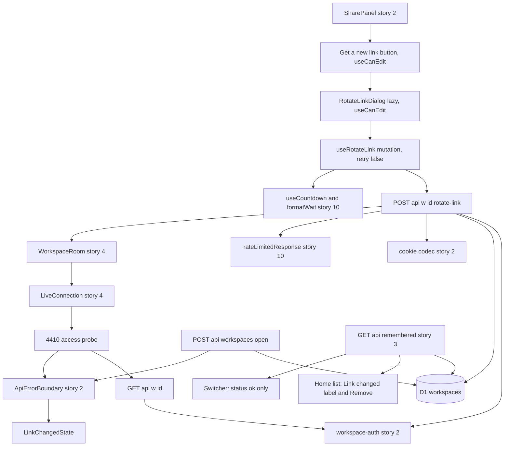
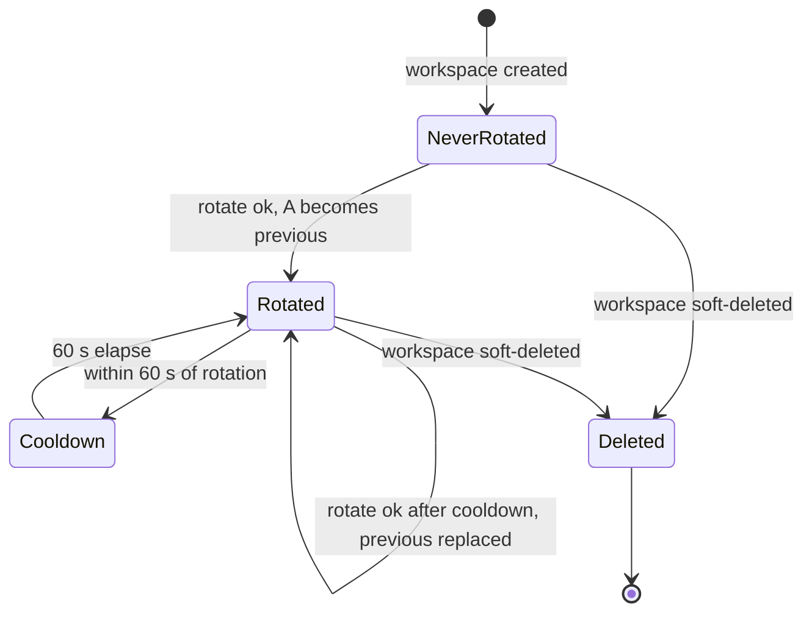
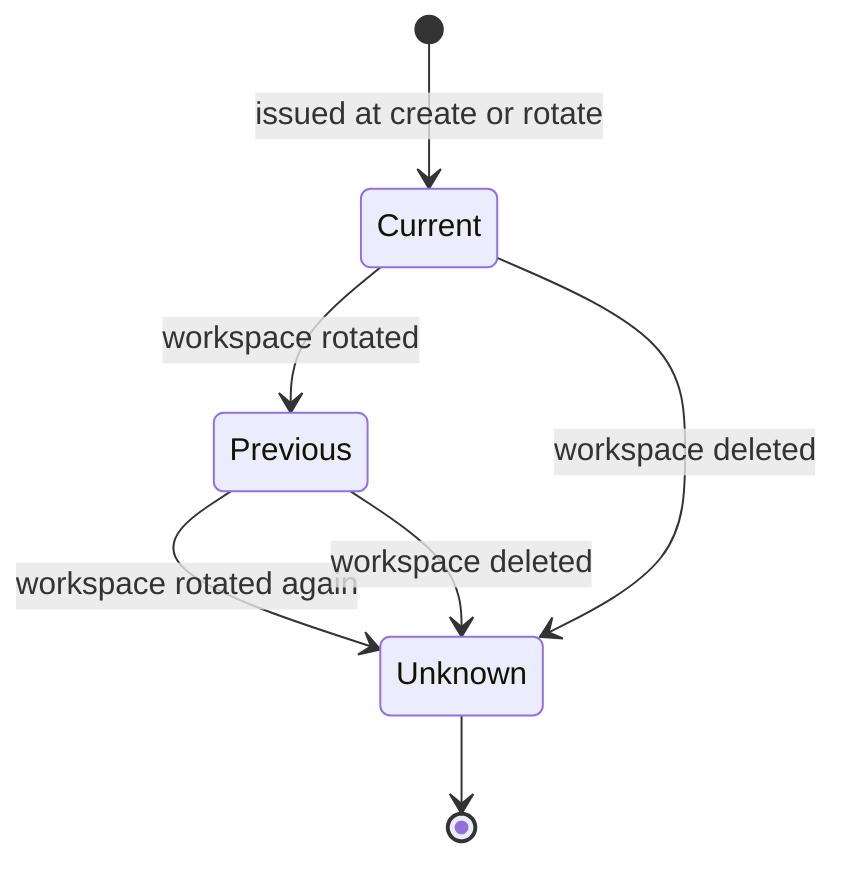
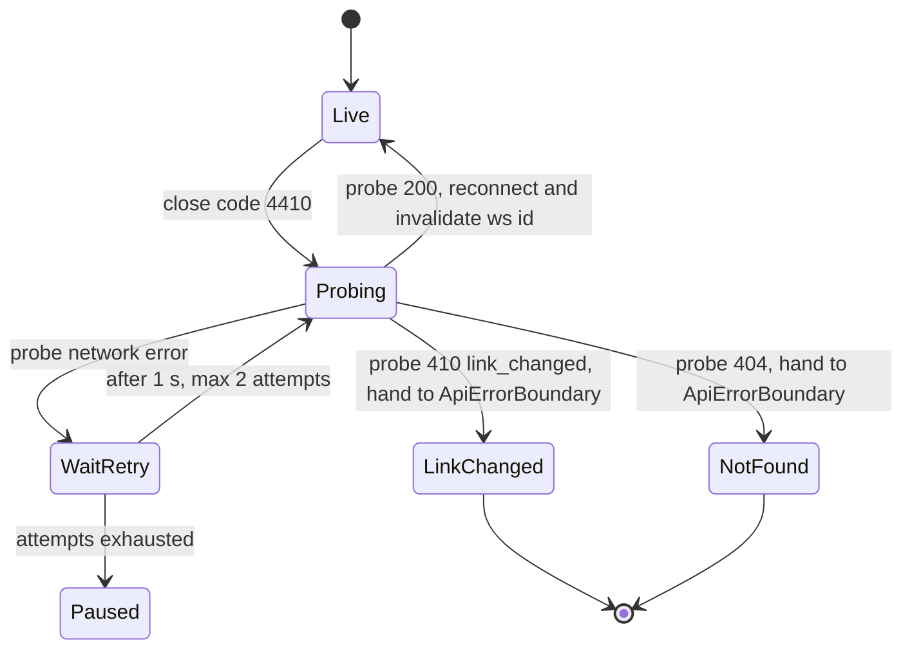
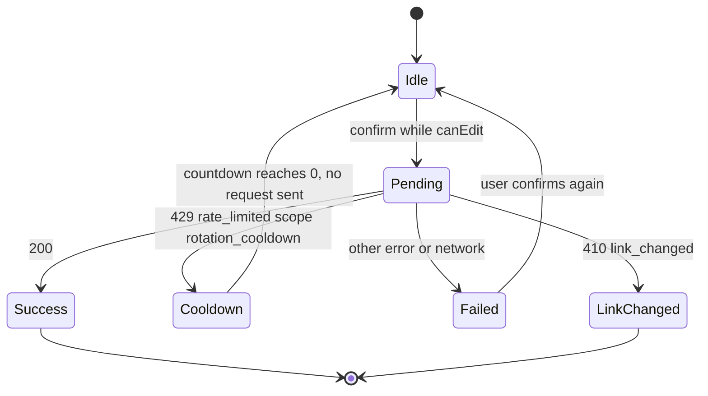
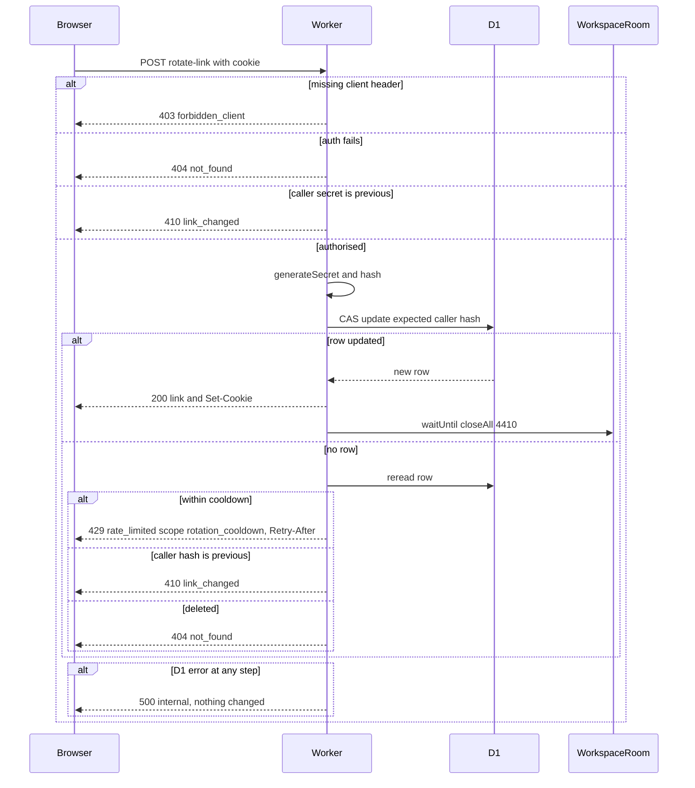
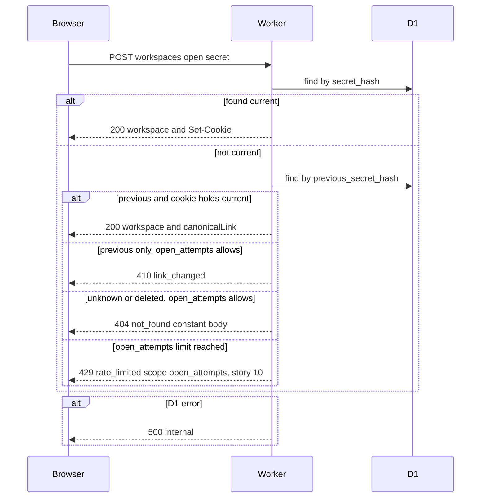
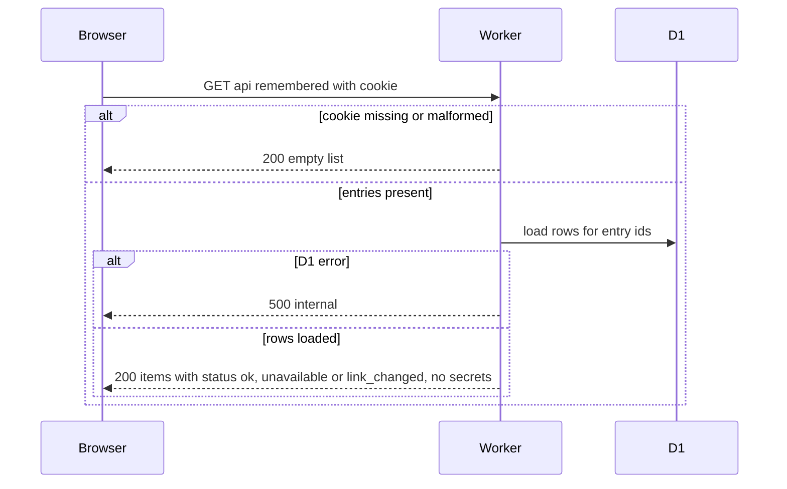
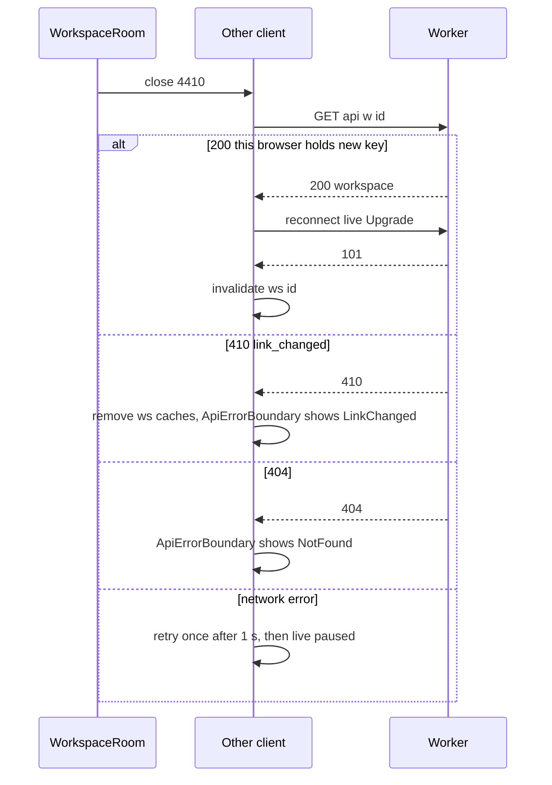
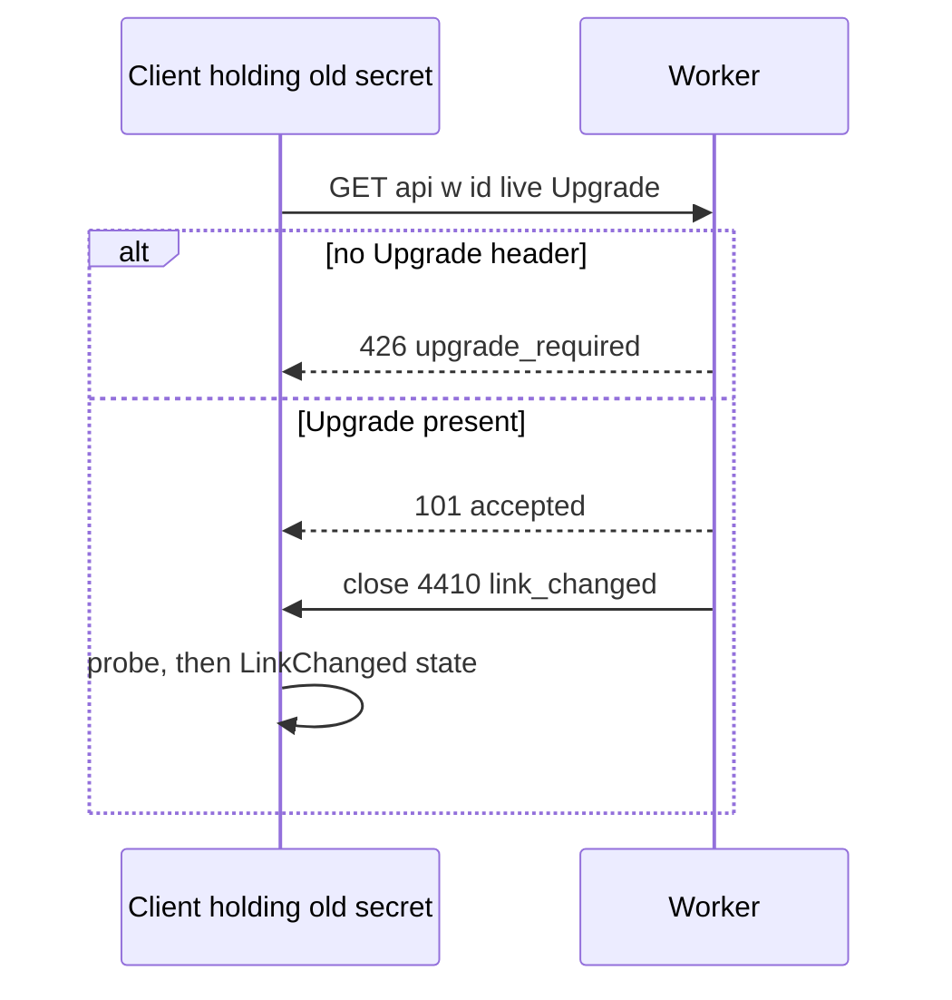

# Technical Design

Atomic compare-and-swap secret rotation with one-generation previous_secret_hash for an honest 'link changed' notice, cooldown, post-commit live revocation via WorkspaceRoom close code 4410, and UI in story 2's SharePanel.

## Overview

Builds on docs/architecture.md §4 (access model), §5 (migrations), §6 (API), §7 (live), §12 (frontend conventions), §13 (ownership and extension rule) and `specs/general/CROSS-STORY-RESOLUTIONS.md` (D-10, D-17, D-20, D-22, D-23, D-24, D-27, D-28, D-32, D-34, D-35, D-43). It extends artefacts owned by stories 1, 2, 3, 4 and 10; every such change is listed in "Deltas to stories 2/3/4 and extension points used". Migration **0005** belongs to this story (D-32: migrations are numbered in build order).

## Key decisions

1. **Keep exactly one previous hash** (`previous_secret_hash`, `secret_rotated_at`). A presenter of the most recent old link gets 410 `link_changed` and an honest message; anything older is 404 like a never-existing link. Existence leak: only to people who already held a valid link to this workspace, so they learn nothing new. Keeping more generations would widen that set for no user benefit.
2. **Compare-and-swap on the caller's current hash.** The UPDATE only succeeds if `secret_hash` still equals the hash of the caller's cookie secret and the cooldown has elapsed. Concurrent rotations resolve to exactly one winner without locks, and only a current key-holder can rotate.
3. **Cooldown `LINK_ROTATION_COOLDOWN_S = 60`**, enforced in the same UPDATE. Refusal uses **story 10's single 429 contract** (D-23): `rateLimitedResponse('rotation_cooldown', retryAfterSeconds)` → 429, `Retry-After` header, body `{error:'rate_limited', scope:'rotation_cooldown', retryAfterSeconds}`. There is no `rotation_cooldown` error code and no `retryAfterS` field.
4. **Rotation is never retried automatically** (D-24). It is not idempotent (each call mints a new secret), so it is excluded from story 10's scheduled-retry predicate and the mutation sets `retry: false`. After a 429 the countdown ends by re-enabling the confirm button; the user decides.
5. **Revoke live sessions after commit.** The route commits, builds the response with the rotator's updated cookie, then `ctx.waitUntil(room.closeAll(LIVE_CLOSE_LINK_CHANGED, 'link_changed'))`. Sockets carry no record of which secret opened them, so the room closes all of them; clients react to 4410 by probing `GET /api/w/:id`. The rotating browser (cookie updated) probes OK and silently reconnects; everyone else gets 410 and `ApiErrorBoundary` renders the LinkChanged state.
6. **`/live` never rejects before upgrade** (D-22). A WebSocket upgrade presented with a previous secret is accepted, then closed with 4410, because browsers cannot read the HTTP status of a failed upgrade.
7. **Rotator tabs with the old fragment keep working.** `POST /api/workspaces/open` with a secret matching `previous_secret_hash` succeeds if this browser's cookie already holds the current secret for that workspace; the response carries `canonicalLink`, and the SPA replaces the address with the new fragment.
8. **LinkChanged is an error-boundary state, not a route** (D-12, D-20). `LinkChangedError` is registered in story 2's `lib/errors.ts` map by `body.error === 'link_changed'`; story 2's `ApiErrorBoundary` renders `LinkChangedState` at the same URL.
9. **UI lives in story 2's SharePanel.** A separated 'Get a new link' action opens a lazily loaded alert dialog (preloaded on hover/focus). Like every control that sends a change, both are self-gated via `useCanEdit()` (D-10). On success the panel switches to save mode (keeping 'Skip for now'), and `clearLinkSaved` clears both the saved flag and the reminder snooze so story 2's banner returns (D-43).
10. **Share access note** (D-17): story 9 changes the value of story 2's constant `SHARE_ACCESS_NOTE` to 'Anyone with it can see and change everything. To cut off access, get a new link.' Tests assert the constant.
11. **Opens with the previous secret count as failed open attempts** for story 10's limiter (D-34). Story 10 owns that counting; this story's 410 branch in open calls story 10's miss hook exactly as the 404 branch does.

## Build-order dependency on story 10
Story 9 precedes story 10 in build order, yet D-23 makes story 10 the owner of `rateLimitedResponse`, `RateLimitedError`, `useCountdown` and `formatWait`. Story 9's tasks 9.2 and 9.5 therefore depend on story 10's `ratelimit.response` and `web.throttle_core` work. Whoever lands first creates those artefacts at story 10's paths with story 10's exact contract (§13 rule 4); the other story only imports. Story 9 never defines its own countdown or 429 body.

## New constants (`packages/shared/src/limits.ts`)
`LINK_ROTATION_COOLDOWN_S = 60`, `LIVE_CLOSE_LINK_CHANGED = 4410` (close code in story 4's registry), `LINK_CHANGED_PROBE_RETRY_MS = 1_000`, `LINK_CHANGED_PROBE_ATTEMPTS = 2`.

## New error code (architecture §6)
`link_changed` (410, the presented secret is the workspace's most recent previous secret). Cooldown refusals use story 10's `rate_limited` code with scope `rotation_cooldown`.

## Structure


## Link generation state (persisted per workspace)


## Status of any one presented secret

Current grants access; Previous yields 410 link_changed over HTTP and close 4410 over `/live`; Unknown yields 404 not_found (close 4404 over `/live`).

## Client connection reaction to 4410


## Rotate mutation (client)


## Flows changed
F1 rotate, F2 open with a presented secret, F3 live revocation and probe, F4 remembered list status. Each has a sequence diagram in its capability section with error branches.

## Deltas to stories 2/3/4 and extension points used

Per architecture §13 and the registry in `specs/general/CROSS-STORY-RESOLUTIONS.md`, story 9 owns only rotation. Every change it makes to an artefact owned by another story is listed here. Items marked **declared** are extension points the owner's design already names for story 9; items marked **delta** must also appear in the owner's design.

## Delta to story 2 (owner of errors, boundary, SharePanel, linkSaved, cookie codec, workspace-auth, open)
| Artefact (owner 2) | Change by story 9 | Kind | Decision |
|---|---|---|---|
| `apps/web/src/lib/errors.ts` map | Add `link_changed` → `LinkChangedError` (mapped by `body.error`, never status) | declared | D-20 |
| `ApiErrorBoundary` | Render `LinkChangedState` for `LinkChangedError`; not a route | declared | D-12, D-20 |
| `SHARE_ACCESS_NOTE` | Value becomes 'Anyone with it can see and change everything. To cut off access, get a new link.' | declared | D-17 |
| `SharePanel` | 'Get a new link' in the footer slot; save mode after rotation keeps 'Skip for now' | declared | D-17 |
| `features/share/linkSaved.ts` | Add `clearLinkSaved(id)`: clears saved flag and reminder snooze | declared | D-43 |
| `apps/api/src/db/workspaces.ts` | `rotateSecret`, `findActiveByPreviousSecretHash`; `WorkspaceRow` gains two columns | delta | — |
| `workspace-auth` middleware | `previous` → 410 `link_changed`; exposes classification to `/live` | declared | D-20 registry "410 branch" |
| `POST /api/workspaces/open` | Fallback lookup by previous hash; `canonicalLink`; 410 branch | declared | registry "`canonicalLink`" |
| Boot open in `main.tsx` | Replace address with `canonicalLink` when present | delta | — |
| `/test/seed-workspace` (story 1 registry) | `rotatedSecondsAgo?` param, `previousSecret` in response | declared | D-35 |
| `apps/api/src/lib/errors.ts` (server codes) | Add `link_changed` (410) | delta | architecture §6 |

## Delta to story 3 (owner of remembered API, Home list, switcher, forget)
| Artefact (owner 3) | Change by story 9 | Kind | Decision |
|---|---|---|---|
| `RememberedItem.status` schema | Uses the declared value `link_changed` (schema `'ok' \| 'unavailable' \| 'link_changed'`) | declared | D-27 |
| `GET /api/remembered` | Sets `status: 'link_changed'` for a stored previous secret | declared | D-27 |
| Remembered touch | Returns 410 for a previous secret | declared | D-27 |
| `RememberedRow` (Home and not-found recovery list) | 'Link changed' label + separate Remove button | declared | D-28 |
| `WorkspaceSwitcher` | Lists `status === 'ok'` only; story 9 adds no switcher UI, no Remove in menu items, no `SwitcherItem.tsx` | declared | D-28 |

## Delta to story 4 (owner of live registry, close codes, `LiveConnection`, `canEdit`)
| Artefact (owner 4) | Change by story 9 | Kind | Decision |
|---|---|---|---|
| Close codes | `4410` (`LIVE_CLOSE_LINK_CHANGED`) | declared | D-22 |
| `/api/w/:id/live` | Upgrade with previous secret → accept then close 4410 (never HTTP 410 before upgrade) | declared | D-22 |
| `WorkspaceRoom` | `closeAll(code, reason)` RPC | delta | — |
| `features/live/LiveConnection.ts` | 4410 branch → `handleLinkChangedClose` probe; status union gains terminal `link_changed`; hand-off to `ApiErrorBoundary` | declared (4410 handling), delta (probe, status member) | D-22, D-43 |
| `deriveLiveUi` | `link_changed` treated like `not_found` (`canEdit` false) | delta | — |
| `useCanEdit()` | Used by 'Get a new link' and its confirm button (portalled, self-gated via `useCanEdit()`) | use only | D-10 |

## Uses of story 10 (owner of the 429 contract) — use only, no change
- `rateLimitedResponse('rotation_cooldown', retryAfterSeconds)`; `rotation_cooldown` is a declared member of story 10's scope union (D-23).
- `RateLimitedError{scope, retryAfterSeconds}` from story 2's errors map (registered by 10).
- `useCountdown` and `formatWait` (D-23).
- Retry predicate: rotation is **not** listed; never auto-retried (D-24).
- Open with a previous secret counts as a failed open attempt (D-34); story 10 owns the limiter call on the 410 branch.
- Build-order note: story 9 precedes 10; see Overview "Build-order dependency on story 10".

## Uses of story 1
- Migration numbering: this story's file is `0005_workspace_secret_rotation.sql` (D-32).
- `/test/*` registry and 404-in-production rule (D-35); Playwright matrix (D-36).

## Rotation storage

> Anchor: `rotation.schema`

## Contract
Migration `migrations/0005_workspace_secret_rotation.sql` (D-32; additive only, passes the story 1 safety scan; applies after story 8's `0004_task_due_date.sql` and before story 10's `0006_rate_counters.sql`):
- `ALTER TABLE workspaces ADD COLUMN previous_secret_hash TEXT`
- `ALTER TABLE workspaces ADD COLUMN secret_rotated_at TEXT`
- `CREATE INDEX idx_workspaces_previous_secret_hash ON workspaces(previous_secret_hash)`

Query additions in `apps/api/src/db/workspaces.ts` (story 2's module; delta listed below):
```ts
rotateSecret(db: D1Database, id: string, expectedHash: string, newHash: string, cooldownS: number): Promise<WorkspaceRow | null>
findActiveByPreviousSecretHash(db: D1Database, hash: string): Promise<WorkspaceRow | null>
```
- `rotateSecret` is one `UPDATE ... SET previous_secret_hash = secret_hash, secret_hash = ?newHash, secret_rotated_at = datetime('now'), version = version + 1, updated_at = datetime('now') WHERE id = ? AND deleted = 0 AND secret_hash = ?expectedHash AND (secret_rotated_at IS NULL OR secret_rotated_at <= datetime('now', '-' || ?cooldownS || ' seconds')) RETURNING *`. Null means no row changed (caller classifies why).
- `findActiveByPreviousSecretHash` returns the non-deleted row whose `previous_secret_hash` equals the hash, else null.
- Errors: UNIQUE violation on `secret_hash` propagates as 500 (not reachable at 256 bits).

## Implementation
- `migrations/0005_workspace_secret_rotation.sql`
- `apps/api/src/db/workspaces.ts` (two new prepared statements; `WorkspaceRow` gains `previous_secret_hash`, `secret_rotated_at`, never exposed by the public `Workspace` schema).

## Tests
TC-I01, TC-I05, TC-I06, TC-I07, TC-I17 (integration); TC-U01 to TC-U04 (unit, cooldown arithmetic used for the `retryAfterSeconds` value).

## Rotate link API

> Anchor: `rotation.api`

## Contract
`POST /api/w/:workspaceId/rotate-link`, bodyless, requires `X-Todoodle-Client: web` (story 1 rule), behind `workspace-auth`.
- 200 `{ link: string, workspace: Workspace }` (`RotateLinkResponse` in `packages/shared/src/schemas.ts`), `Cache-Control: no-store`, `Set-Cookie` with this workspace's entry replaced by `{id, s: newSecret, t: now}` (other entries untouched, order via `upsertRemembered(entries, entry, now)`).
- 429 via story 10's `rateLimitedResponse('rotation_cooldown', cooldownRemainingS(...))` when rotated less than `LINK_ROTATION_COOLDOWN_S` ago: header `Retry-After: <seconds>`, body `{error:'rate_limited', scope:'rotation_cooldown', retryAfterSeconds}` validated by story 10's `rateLimitedSchema`. `retryAfterSeconds` is between 1 and `LINK_ROTATION_COOLDOWN_S`. DB unchanged. (D-23: no `rotation_cooldown` error code, no `retryAfterS`.)
- 410 `{error:'link_changed'}` when the caller's secret is now the previous secret (lost a concurrent race or was rotated by someone else). DB unchanged. Cookie unchanged.
- 404 `not_found` (constant body) from `workspace-auth` for no cookie, unknown, deleted, or older-than-previous secrets.
- 403 `forbidden_client` without the client header; 405 for other methods.
- **Not idempotent, never auto-retried** (D-24): every successful call mints a new secret. Story 10's retry predicate does not list rotation; the client mutation sets `retry: false`. A 429 here is a user-facing wait, not a scheduled retry.
- Side effects on 200: after the D1 update has returned, `ctx.waitUntil(room.closeAll(LIVE_CLOSE_LINK_CHANGED, 'link_changed'))`. No `workspace.updated` event is broadcast (the reconnect heal refetches everything). A single structured log line `{event:'link_rotated', workspaceId, requestId}` with no secret or hash.

```ts
// apps/api/src/routes/workspaces.ts
rotateLinkHandler(c: Context<AppEnv>): Promise<Response>
// apps/api/src/lib/rotation.ts
classifyRotationMiss(row: WorkspaceRow | null, callerHash: string, nowMs: number, cooldownS: number): 'cooldown' | 'link_changed' | 'not_found'
cooldownRemainingS(rotatedAtIso: string | null, nowMs: number, cooldownS: number): number
```

**F1 Rotate**


## Implementation
- `apps/api/src/routes/workspaces.ts`: registers the route after `workspaceAuth`; uses `generateSecret`, `hashSecret` (story 2 `apps/api/src/lib/crypto.ts`), `rotateSecret`, `upsertRemembered` and `serializeRememberedCookie` (story 2 `apps/api/src/lib/cookie.ts`, D-45 names), and `rateLimitedResponse` (story 10, `apps/api/src/lib/errors.ts`).
- `apps/api/src/lib/rotation.ts`: pure classification and cooldown helpers.
- `apps/api/src/lib/errors.ts`: add the `link_changed` code only. The `rotation_cooldown` scope is a member of story 10's `RateLimitScope` union (declared by story 10 per D-23).
- Link built as `origin + '/w#' + newSecret` with the same helper as story 2's `GET /link`.
- Error handler and request logging already redact bodies and cookies (story 2 `security.no_leak`); this route adds no fields that could carry a secret. Story 10's `rate_limited` log line carries only scope and key prefix.

## Tests
Unit TC-U01 to TC-U06. Integration TC-I01, TC-I06 to TC-I10, TC-I14, TC-I16. UI component TC-C04, TC-C11 (no automatic retry). E2E TC-E01, TC-E04, TC-E06.

## Access classification for presented secrets

> Anchor: `rotation.access_status`

## Contract
One pure classifier used by every entry point that accepts a secret:
```ts
// apps/api/src/lib/rotation.ts
classifyPresentedHash(row: WorkspaceRow | null, presentedHash: string): 'current' | 'previous' | 'unknown'
```
Constant-time comparisons for both hashes (story 2 `hashesEqual`).

1. **`workspace-auth` middleware (story 2) extended**: `current` passes; `previous` returns 410 `{error:'link_changed'}`; `unknown`, missing or deleted return the constant 404. Applies to every HTTP `/api/w/:id/*` route.
2. **`/api/w/:id/live` (story 4, D-22)**: auth never rejects an upgrade over HTTP. With an `Upgrade` header present, the Worker accepts the socket and immediately closes it with `LIVE_CLOSE_LINK_CHANGED` (4410, reason `link_changed`) when the cookie secret classifies as `previous`, and with story 4's 4404 when `unknown`. Without `Upgrade`, story 4's 426 `upgrade_required` applies first. Story 4's route consumes the classification through `workspace-auth`'s result, not a second lookup.
3. **`POST /api/workspaces/open` (story 2) extended**: lookup by `secret_hash`; if none, lookup by `previous_secret_hash`.
   - current: unchanged story 2 behaviour.
   - previous AND this request's cookie holds an entry for that workspace whose secret is current: 200 `{workspace, canonicalLink}` (link built from the cookie's current secret); cookie `t` refreshed; no new entry.
   - previous otherwise: 410 `link_changed`; cookie not modified; never adds an entry. **Counts as a failed open attempt** for story 10's `open_attempts` limiter (D-34): this branch calls story 10's open-miss hook exactly as the 404 branch does, so a refused attempt returns story 10's 429 instead.
   - unknown: constant 404.
4. **`GET /api/remembered` (story 3) extended**: each item's `status` (story 3's field, D-27: `'ok' | 'unavailable' | 'link_changed'`) is `link_changed` when the stored secret classifies as `previous`, `ok` when `current`, `unavailable` otherwise. Secrets and hashes never in the response.
5. **Remembered touch (story 3) extended** (D-27): touching an entry whose stored secret is `previous` returns 410 `link_changed` (story 3's 204 and 404 unchanged).

**F2 Open with a presented secret**


**F4 Remembered list status**


## Implementation
- `apps/api/src/lib/rotation.ts`: `classifyPresentedHash`.
- `apps/api/src/middleware/workspace-auth.ts`: previous branch; exposes the classification to the `/live` route.
- `apps/api/src/routes/live.ts` (story 4): accept then close 4410 for `previous`.
- `apps/api/src/routes/workspaces.ts`: open branches, `canonicalLink`, story 10 miss hook on the 410 branch.
- `apps/api/src/routes/remembered.ts`: `status` value `link_changed` and touch 410. `packages/shared/src/schemas.ts` `RememberedItem.status` already declares `link_changed` (story 3 owns the schema, D-27).
- Depends on stories 2, 3 and 4 being implemented first; this story edits those modules rather than duplicating them.

## Tests
Unit TC-U07 to TC-U10. Integration TC-I02 to TC-I05, TC-I11, TC-I12, TC-I15, TC-I18. E2E TC-E01, TC-E03, TC-E05.

## Revoke live sessions after rotation

> Anchor: `rotation.live_revoke`

## Contract
**Server (story 4 WorkspaceRoom extended)**
```ts
// apps/api/src/live/WorkspaceRoom.ts
closeAll(code: number, reason: string): Promise<{ closed: number }>   // RPC
```
Closes every socket from `this.ctx.getWebSockets()` with the given code. Called only after the rotation UPDATE has committed, so any reconnect is authenticated against the new state. Sockets that throw on close are counted and ignored. A reconnect presenting the old secret is **accepted and then closed with 4410** (D-22, see `rotation.access_status`), never refused with an HTTP status.

**Client (story 4 `LiveConnection` extended)**
```ts
// apps/web/src/features/live/linkChangedProbe.ts
handleLinkChangedClose(ctx: { workspaceId: string; queryClient: QueryClient }): Promise<'reconnected' | 'link_changed' | 'not_found' | 'paused'>
```
On close code `LIVE_CLOSE_LINK_CHANGED` (one of the four close codes story 4's state machine handles, D-22): probe `GET /api/w/:id`.
- 200: this browser holds the new key; reconnect and `invalidateQueries({queryKey:['ws', id]})`.
- 410 `link_changed`: `LiveConnection` enters the terminal `link_changed` status, removes all `['ws', id]` queries, and hands `LinkChangedError` to story 2's `ApiErrorBoundary` through the same hand-off story 4 uses for 4404 → NotFound. No navigation: the boundary renders the LinkChanged state at the current URL.
- 404: story 4's terminal `not_found` → boundary NotFound.
- Network error: retry after `LINK_CHANGED_PROBE_RETRY_MS`, up to `LINK_CHANGED_PROBE_ATTEMPTS`, then story 4's live-paused state.
- While a rotate mutation from this tab is in flight, the probe waits for it to settle first (removes the race between the close frame and the Set-Cookie).

**F3 Live revocation**


**F3b Reconnect with the previous secret**


## Implementation
- `apps/api/src/live/WorkspaceRoom.ts`: `closeAll` RPC.
- `apps/api/src/routes/workspaces.ts`: calls it via `ctx.waitUntil` after commit.
- `apps/web/src/features/live/linkChangedProbe.ts` and a 4410 branch in story 4's `apps/web/src/features/live/LiveConnection.ts` (D-43; there is no `connection.ts`). The socket status union gains `link_changed`; `deriveLiveUi` treats it like `not_found` (`canEdit` false).
- On `link_changed` the client removes all `['ws', id]` queries so no content remains in memory for a revoked viewer, and preloads the LinkChanged state chunk.

## Tests
Unit TC-U11, TC-U12. Integration TC-I12, TC-I13. E2E TC-E01, TC-E02.

## Get a new link action and confirmation

> Anchor: `rotation.ui_confirm`

## Contract
- **Share access note (D-17).** Story 2's shared constant `SHARE_ACCESS_NOTE` (in story 2's Share feature, `apps/web/src/features/share/`) takes story 9's value: 'Anyone with it can see and change everything. To cut off access, get a new link.' SharePanel renders the constant in both modes; tests (here, story 2 TC-43 and story 4 TC-S06) assert the constant, and exactly one unit test (TC-U13) pins its value.
- `RotateLinkButton` rendered in story 2's `SharePanel` footer extension slot: text button 'Get a new link' with warning icon, visually separated from everyday actions, min 44 by 44 px hit area. `onPointerEnter` and `onFocus` call `preloadRotateLinkDialog()`.
- `RotateLinkDialog` (lazy, `lazyWithRetry` from story 2 `lib/lazyWithRetry.ts` + exported `preload`): shadcn AlertDialog (bottom sheet below `MOBILE_BREAKPOINT_PX`), `role=alertdialog`, `aria-labelledby` the title, `aria-describedby` the body. Exact copy (constants in `apps/web/src/features/share/rotateCopy.ts`, asserted via the constants by TC-C02):
  - Title: 'Get a new link?'
  - Body: 'Everyone using the current link, including you on other browsers and devices, will lose access until you send them the new link. This can't be undone.'
  - Buttons: 'Cancel' (initial focus) and 'Get new link' (destructive style).
- Escape and Cancel close with no request; focus returns to the button (else the Share panel heading, §12 fallback).
- **Edit gating (D-10).** Every control that sends a change gates itself with `useCanEdit()`. `RotateLinkButton` and the dialog's 'Get new link' button each read `useCanEdit()` (story 4 `features/live/canEdit.ts`; story 2 stub before story 4) and are disabled with the hint 'You're offline' (`aria-describedby`) while it is false. If `canEdit` flips to false while the dialog is open, the confirm button disables; Cancel still works. Copy, email and bookmark in the panel are not gated (they work offline).
- `useRotateLink(workspaceId)` TanStack mutation, `retry: false`, `mutationKey: ['ws', id, 'rotate-link']`: POST rotate-link. Errors are typed by story 2's `lib/errors.ts` map (by `body.error`, D-20). States:
  - idle;
  - pending (confirm disabled, `aria-busy`);
  - success (hand over to `rotation.ui_new_link`);
  - `RateLimitedError` with `scope === 'rotation_cooldown'` (D-23): message `ROTATE_COOLDOWN_MESSAGE(formatWait(secondsLeft))` → 'You just changed the link. Try again in 45 seconds' (story 10's `formatWait` yields '45 seconds' or '2 minutes'); `secondsLeft` from story 10's `useCountdown` started from `retryAfterSeconds`; confirm disabled until 0. **At 0 the confirm button re-enables and nothing is sent** (D-24: rotation is never auto-retried and is not in story 10's retry predicate);
  - `LinkChangedError` (410): rethrown to story 2's `ApiErrorBoundary`, which renders the LinkChanged state (this browser now holds the old link). No navigation;
  - any other error or network failure: 'Couldn't change the link, nothing was changed. Try again.' with `role=alert`, current link still shown, no automatic retry.
- The server is the only cooldown authority: the public Workspace shape is unchanged and the countdown appears only after a 429.

## Implementation
- `apps/web/src/features/share/RotateLinkButton.tsx`
- `apps/web/src/features/share/RotateLinkDialog.tsx` (lazy chunk) and `apps/web/src/features/share/preloadRotateLinkDialog.ts`
- `apps/web/src/features/share/rotateCopy.ts` (title, body, buttons, `ROTATE_COOLDOWN_MESSAGE`, failure text)
- `apps/web/src/features/share/useRotateLink.ts`
- Story 2's `SHARE_ACCESS_NOTE`: value change only
- Reuses story 10's `apps/web/src/lib/useCountdown.ts` and `formatWait` (story 10's throttle messages module); story 9 adds no timer of its own.
- Direct imports only; icon via per-icon lucide import. No state synced in effects.

## Tests
Unit TC-U13. UI component TC-C01 to TC-C06, TC-C10, TC-C11, TC-C13 (TC-C02 also asserts title and body via the constants). E2E TC-E01, TC-E04.

## Show and save the new link

> Anchor: `rotation.ui_new_link`

## Contract
On rotate success (`{link, workspace}`):
1. `queryClient.setQueryData(queryKeys.link(id), {link})` inside the mutation's `onSuccess`, and `setQueryData(queryKeys.workspace(id), workspace)` (story 2 `lib/queryKeys.ts`, use only).
2. `clearLinkSaved(id)` — story 9's declared extension of story 2's `apps/web/src/features/share/linkSaved.ts` (D-43). It removes the saved flag (`tdl:v1:linkSaved:<id>`, localStorage) **and** the reminder snooze (`tdl:v1:linkSnoozed:<id>`, sessionStorage), then notifies subscribers, so story 2's unsaved-link banner reappears even if 'Remind me later' was chosen earlier. Each storage call is wrapped in try/catch; with storage unavailable it is a no-op and never throws (the banner already fails safe to visible).
3. `SharePanel` switches to save mode (story 2 `mode='save'`) showing the new link with Copy link & continue, Email it to me, Bookmark this page, and **Skip for now** (D-17: save mode after a new link keeps 'Skip for now', which closes without marking saved).
4. If `location.hash` holds a secret, `history.replaceState(null, '', '/w#' + newSecret)`; on the `/w/:id` route the address is left as is (D-13: sessions opened by id have no fragment).
5. On open (F2) returning `canonicalLink`, story 2's boot open replaces the address with that link before the workspace renders.
Nothing reloads; the live connection is closed by the server (4410) and reconnects via the probe. Other tabs of this browser receive the `storage` event from `clearLinkSaved`, so their banners reappear too.

## Implementation
- `apps/web/src/features/share/useRotateLink.ts` (onSuccess steps 1 to 4)
- `apps/web/src/features/share/linkSaved.ts` (story 2): add `clearLinkSaved`
- `apps/web/src/main.tsx` boot open (story 2): honour `canonicalLink`

## Tests
Unit TC-U14. UI component TC-C03, TC-C07, TC-C09. E2E TC-E01, TC-E02, TC-E03.

## Link changed state and remembered label

> Anchor: `rotation.ui_link_changed`

## Contract
- **Typed error (D-20).** `LinkChangedError` is registered in story 2's `apps/web/src/lib/errors.ts` map under `body.error === 'link_changed'` (never by status: a 410 `gone` stays `GoneError`). It is thrown by any workspace query, by the open call and by the live probe.
- **LinkChanged is an `ApiErrorBoundary` state, not a route (D-12, D-20).** Story 2's boundary in the workspace route renders `<LinkChangedState workspaceId />` for `LinkChangedError`, at the current URL:
  - heading "This workspace's link was changed.", body 'Ask whoever shares it with you for the new one.';
  - 'Remove from this browser' (story 3 forget API, no confirmation because the entry is already useless; toast confirms; then goes Home) and 'Go to my workspaces' (Home);
  - renders no workspace name or content; all `['ws', id]` queries removed on mount;
  - React 19 `<title>` 'Link changed · Todoodle';
  - heading receives focus on mount (§12 focus rule) and is announced.
- **Home list (story 3's `RememberedList`, D-27/D-28).** `RememberedRow` branches on story 3's `status` field: when `status === 'link_changed'` the row is not a link, shows the label 'Link changed' (text plus icon, not colour alone), and a **separate Remove button** (44 px, same as story 3's 'Unavailable' rows; forgets immediately, no dialog). The same rows appear in the not-found page's recovery list (story 3 `RememberedRecovery`).
- **Switcher (story 3, D-28).** The switcher menu lists only entries with `status === 'ok'` plus 'All workspaces…'. `link_changed` entries are omitted; there is no Remove inside a menu item and no `SwitcherItem.tsx`.

## Implementation
- `apps/web/src/features/share/LinkChangedState.tsx` (lazy via `lazyWithRetry`, preloaded when a 4410 close arrives)
- `apps/web/src/lib/errors.ts` (story 2): `link_changed` → `LinkChangedError` map entry
- `apps/web/src/routes/ApiErrorBoundary.tsx` (story 2's boundary, wherever story 2 places it): `LinkChangedError` case renders `LinkChangedState`
- `apps/web/src/features/remembered/RememberedRow.tsx` (story 3): `link_changed` branch
- `apps/web/src/features/remembered/WorkspaceSwitcher.tsx` (story 3): filter to `status === 'ok'` (story 3's rule; verified here for `link_changed`)

## Tests
UI component TC-C05, TC-C07, TC-C08, TC-C12. E2E TC-E01, TC-E05.

## Seed a rotated workspace (test route extension)

> Anchor: `rotation.test_seed`

## Contract
Extends story 2's `POST /test/seed-workspace` in story 1's `apps/api/src/routes/test.ts` registry (D-35: params `{name?, deleted?, rotatedSecondsAgo?}`). Returns 404 in production like every `/test/*` route.
- `rotatedSecondsAgo?: number` (non-negative integer). When present, the seeded workspace is created as already rotated once: a real `generateSecret` pair (previous A, current B), `previous_secret_hash = hash(A)`, `secret_hash = hash(B)`, `secret_rotated_at = now - rotatedSecondsAgo`.
- Response gains `previousSecret` (A) alongside story 2's fields when the param is used. The route never logs either secret.
- Invalid value (negative, non-integer) → 400 `validation`.

Uses:
- `rotatedSecondsAgo < LINK_ROTATION_COOLDOWN_S` → cooldown fixtures (TC-I06, TC-E04 variant) without sleeping.
- `rotatedSecondsAgo > LINK_ROTATION_COOLDOWN_S`, then one real rotate → A becomes older-than-previous (TC-I05, TC-E05).

## Implementation
- `apps/api/src/routes/test.ts` (story 1 registry, story 2's handler): parse `rotatedSecondsAgo` with zod; write the two hashes and timestamp in the same INSERT.
- No new route; the registry row for `/test/seed-workspace` already lists this param (owner 2, extended by 9).

## Tests
Integration TC-I19 (seeded state and production 404), used as a fixture by TC-I05, TC-I06 and TC-E05.

## Test Strategy

## Scopes and boundaries
| Capability | Unit | Integration | UI component | E2E | Boundary exercised and why sufficient |
|---|---|---|---|---|---|
| rotation.schema | cooldown arithmetic | real D1 CAS update, migration 0005 | not UI: storage only | covered through rotation.api E2E | CAS correctness only observable against real SQLite |
| rotation.api | classification helpers | Hono request handling via SELF.fetch + D1 + DO; 429 contract shape | countdown and no-retry (via ui_confirm) | golden rotate, cooldown | request boundary is where auth, cookie, CAS and story 10's 429 contract meet |
| rotation.access_status | classifier | auth, open, touch, remembered, live accept-then-close | not UI: server logic | old link, reload old fragment, double rotation | every entry point that accepts a secret is exercised |
| rotation.live_revoke | probe decision | real DO sockets in Miniflare | not UI: connection logic | cross-browser revocation | close ordering and accept-then-close need a real DO and real sockets |
| rotation.ui_confirm | SHARE_ACCESS_NOTE value | not integration: UI only | dialog, states, gating, no auto-retry | cooldown, golden, no auto-retry | browser rendering |
| rotation.ui_new_link | clearLinkSaved storage behaviour | not integration: UI only | panel mode, banner, address | golden, second tab, reload | browser rendering |
| rotation.ui_link_changed | not unit: presentational | not integration: UI only | boundary state, Home label, switcher filter | old link, list | browser rendering |
| rotation.test_seed | not unit: thin route | seeded row state, production 404 | not UI | fixture for TC-E05, TC-E07 | only observable against real D1 |

## Dimensions crossed
Presenter (P1 rotator this tab, P2 rotator other tab same browser, P3 former holder other browser, P4 new-link holder other browser, P5 stranger) x Secret status (current, previous, older, never) x Entry surface (open POST, cookie API call, remembered touch, live socket, remembered list). Equivalence classes for secret status are exhaustive and non-overlapping: every presented secret is exactly one of current, previous, older-than-previous, never issued. Workspace prior state classes: never rotated, rotated outside cooldown, rotated inside cooldown, deleted. Client edit state: canEdit true, false, flips while dialog open.

## Unit (vitest)
| ID | Case | Level | Expected |
|---|---|---|---|
| TC-U01 | cooldownRemainingS with rotatedAt null | unit | 0 |
| TC-U02 | rotatedAt 59 s ago | unit | 1 |
| TC-U03 | rotatedAt exactly 60 s ago (boundary) | unit | 0 |
| TC-U04 | rotatedAt 61 s ago | unit | 0 |
| TC-U05 | classifyRotationMiss: row inside cooldown with caller hash current | unit | cooldown |
| TC-U06 | classifyRotationMiss: caller hash equals previous; row null (deleted) | unit | link_changed; not_found |
| TC-U07 | classifyPresentedHash current | unit | current |
| TC-U08 | previous | unit | previous |
| TC-U09 | neither (older or never) | unit | unknown |
| TC-U10 | row null; hashes of different length | unit | unknown; no throw |
| TC-U11 | probe decision table: 200, 410, 404, network error first and second attempt | unit | reconnected, link_changed (LiveConnection status link_changed, LinkChangedError handed to boundary), not_found, retry, paused |
| TC-U12 | probe waits while local rotate mutation pending | unit | no request until settled |
| TC-U13 | `SHARE_ACCESS_NOTE` value (the one test that pins the literal, §13 rule 3) | unit | equals 'Anyone with it can see and change everything. To cut off access, get a new link.' |
| TC-U14 | `clearLinkSaved` with saved flag and snooze set; with storage throwing | unit | both keys removed and subscribers notified; no throw when storage unavailable |

## Integration (vitest-pool-workers, SELF.fetch, real Miniflare D1 and DO)
| ID | Presenter | Prior state | Surface | Level | Expected (state before and after) |
|---|---|---|---|---|---|
| TC-I01 | P1 | never rotated | rotate | integration | before hash=A prev=null; after hash=B prev=A rotated_at set version+1; 200 link contains B; Set-Cookie entry s=B, other entries unchanged |
| TC-I02 | P3 | rotated | open with A | integration | 410 `{error:'link_changed'}`; no Set-Cookie; DB unchanged |
| TC-I03 | P3 | rotated | GET workspace with cookie A | integration | 410 `{error:'link_changed'}` |
| TC-I04 | P4 | rotated | open with B | integration | 200; entry added |
| TC-I05 | P3 | rotated twice (seed rotatedSecondsAgo 61, then rotate) | open with A | integration | 404 body byte-identical to never-issued secret |
| TC-I06 | P1 | inside cooldown (seed rotatedSecondsAgo 10) | rotate | integration | 429; `Retry-After` header equals body `retryAfterSeconds`; body `{error:'rate_limited', scope:'rotation_cooldown', retryAfterSeconds}` validates against story 10's `rateLimitedSchema`, `retryAfterSeconds` between 1 and 60; body has no `retryAfterS`; hash, prev, version unchanged |
| TC-I07 | P1 and P2 concurrently | never rotated | rotate x2 via Promise.all | integration | exactly one 200; other 410 `link_changed` or 429 `rate_limited` scope `rotation_cooldown`; exactly one new hash; prev=A |
| TC-I08 | P1 | never rotated | rotate without client header | integration | 403; unchanged |
| TC-I09 | P5 | never rotated | rotate no cookie | integration | 404; unchanged |
| TC-I10 | P1 | deleted | rotate | integration | 404; unchanged |
| TC-I11 | P2 | rotated | open with A while cookie holds B | integration | 200 with canonicalLink containing B; cookie secret stays B |
| TC-I12 | P1 and P3 sockets | never rotated | live | integration | after rotate both receive close 4410 within 5 s; reconnect with cookie B gets 101 and stays open; reconnect **with Upgrade** and cookie A gets 101 then close 4410 reason `link_changed` (D-22, no HTTP 410 before upgrade); request with cookie A and no Upgrade header gets 426 `upgrade_required` |
| TC-I13 | P3 socket | never rotated | live ordering | integration | a reconnect attempted from the close handler already sees hash=B (close happens after commit) |
| TC-I14 | P1 | never rotated | rotate, logging | integration | captured console output contains neither secret A, B nor their hashes; contains link_rotated with workspace id; the cooldown 429's log line carries no secret |
| TC-I15 | P3 browser | rotated | GET remembered | integration | status `link_changed` for that entry; unknown id is `unavailable`; current is `ok`; no `available` field; no secret fields |
| TC-I16 | P1 | never rotated | GET rotate-link | integration | 405; unchanged |
| TC-I17 | migration | fresh D1 | 0001 to 0005 applied (0005 = `0005_workspace_secret_rotation.sql`) | integration | columns and index exist; existing rows have null prev and rotated_at; file sorts after 0004 and before any 0006 |
| TC-I18 | P3 browser | rotated | remembered touch with cookie A | integration | 410 `link_changed`; cookie unchanged; current-secret touch still 204 |
| TC-I19 | test route | none | POST /test/seed-workspace `{rotatedSecondsAgo: 30}`; same with production env | integration | row has prev=hash(previousSecret), hash=hash(secret), rotated_at 30 s ago; negative value 400; production 404 |

## UI component (vitest, happy-dom, Testing Library, MSW with real schema shapes)
| ID | Case | Level | Expected |
|---|---|---|---|
| TC-C01 | hover and focus on Get a new link | ui-component | dialog chunk preload called once |
| TC-C02 | open then Cancel and Escape | ui-component | no request; focus back on button; title and body equal `rotateCopy` constants |
| TC-C03 | confirm, success | ui-component | pending aria-busy; then panel in save mode with new link and Copy link & continue, Email it to me, Bookmark this page and Skip for now; clearLinkSaved called; banner visible even though snooze was set |
| TC-C04 | confirm, 429 `rate_limited` scope `rotation_cooldown` retryAfterSeconds 45 (fake timers) | ui-component | text built from `ROTATE_COOLDOWN_MESSAGE(formatWait(45))` ('… Try again in 45 seconds'); counts down via `useCountdown`; retryAfterSeconds 120 renders '2 minutes'; confirm disabled until 0 |
| TC-C05 | confirm, 410 `link_changed` | ui-component | `ApiErrorBoundary` renders LinkChanged state at the same URL; no navigation occurred |
| TC-C06 | canEdit false (useCanEdit mocked), and canEdit flips false while dialog open | ui-component | Get a new link disabled with 'You're offline' hint; dialog cannot open; open dialog's confirm disables, Cancel works; Copy link, email and bookmark stay enabled |
| TC-C07 | LinkChangedState | ui-component | message, two actions, no workspace name rendered; ws queries removed; heading focused |
| TC-C08 | Home remembered row status `link_changed` | ui-component | label with icon, not a link, separate Remove button (not inside a menu) present and 44 px; clicking Remove forgets without a dialog |
| TC-C09 | success with hash in URL vs on id route | ui-component | replaceState called with new fragment; not called on id route |
| TC-C10 | axe on dialog and LinkChanged state, light and dark | ui-component | no violations; alertdialog labelled |
| TC-C11 | 429 then countdown reaches 0 (fake timers advanced past Retry-After plus 10 s) | ui-component | exactly one rotate-link request in total (D-24: never auto-retried); confirm re-enabled; a second request only after the user confirms again; mutation has `retry: false`; a 500 is also not retried |
| TC-C12 | switcher with entries ok, unavailable, link_changed | ui-component | menu lists only the ok entry plus 'All workspaces…'; no Remove inside any menu item |
| TC-C13 | SharePanel in share and save modes | ui-component | access note text equals `SHARE_ACCESS_NOTE` (asserted via the constant) |

## E2E workflows (Playwright, chromium and webkit desktop; wrangler dev, fresh local D1)
| ID | Workflow | Level | Outcome asserted |
|---|---|---|---|
| TC-E01 | Context A creates, context B joins via link; A rotates; A copies new link; context C opens it; B reopens old link | e2e | B shows the link-changed state within 5 s with no tasks visible and URL unchanged; A keeps editing without reload; C opens workspace; B old link shows link-changed state |
| TC-E02 | A has two tabs; rotates in tab 1 | e2e | tab 2 keeps working, its Share panel shows the new link, its reminder banner reappears |
| TC-E03 | A reloads a tab whose address holds the old fragment | e2e | workspace opens, address now holds new fragment |
| TC-E04 | A rotates twice immediately | e2e | second attempt shows 'You just changed the link. Try again in N seconds'; link unchanged |
| TC-E05 | Seed rotated workspace (rotatedSecondsAgo 61), rotate once in UI; open oldest link | e2e | Workspace not found page; Home list of that browser shows 'Link changed' with a Remove button only for the most recent old link; switcher does not list it |
| TC-E06 | Capture all requests during TC-E01 | e2e | no secret appears in any URL path, query or Referer |
| TC-E07 | Seed rotated workspace (rotatedSecondsAgo 57); open Share, confirm | e2e | countdown shown; after it reaches 0 and 5 s more, zero further rotate-link requests were sent and the link is unchanged; confirming again rotates |

## Negative scenarios
| ID | Must not happen | Level |
|---|---|---|
| TC-I06 | rotation inside cooldown changes anything, or returns a non-standard 429 body | integration |
| TC-I07 | two concurrent rotations both succeed | integration |
| TC-I02, TC-I03, TC-I18 | old secret grants any data | integration |
| TC-I12 | old secret keeps a live socket open, or `/live` rejects with an HTTP status after Upgrade | integration |
| TC-I05 | older secret reveals the workspace existed | integration |
| TC-I08, TC-I09, TC-I10 | unauthorised rotation changes state | integration |
| TC-I14, TC-E06 | secrets appear in logs, URLs or Referer | integration and e2e |
| TC-C02 | Cancel sends a request | ui-component |
| TC-C06 | rotation possible while offline | ui-component |
| TC-C07 | revoked viewer still sees content | ui-component |
| TC-C11, TC-E07 | rotation retried automatically | ui-component and e2e |
| TC-C12 | link_changed entry openable from the switcher | ui-component |

## Mock vs real
| Store or service | Treatment | Why |
|---|---|---|
| D1 | real (Miniflare) in integration and e2e | CAS and cooldown are the behaviour under test |
| WorkspaceRoom DO | real (Miniflare) | close ordering, accept-then-close and 4410 delivery need real sockets |
| Clock for cooldown | seeded `secret_rotated_at` via `/test/seed-workspace` `rotatedSecondsAgo`; fake timers only for the UI countdown | avoids sleeping 60 s while keeping SQL real |
| Network in UI component tests | MSW with bodies built from shared schemas (`RotateLinkResponse`, story 10 `rateLimitedSchema`) | component boundary only |
| canEdit in UI component tests | story 4 store set directly | gate is the behaviour under test |

## Fixtures
Secrets from story 2's real `generateSecret`; workspace ids 32-hex; cookies built with the real codec (`serializeRememberedCookie`); `/test/seed-workspace` with story 9's `rotatedSecondsAgo` (D-35), non-production only.

## Not covered
- Counting 410 opens towards `open_attempts` (D-34): asserted by story 10's open-policy tests; story 9 only guarantees the 410 branch calls the same miss hook.
- Behaviour when a DO is evicted mid-close (platform guarantee; clients also re-probe on any reconnect failure).
- More than one generation of history (by design).
- Link delivery to collaborators outside the app.
- Load beyond 10 concurrent sockets per room (story 4 covers capacity).

