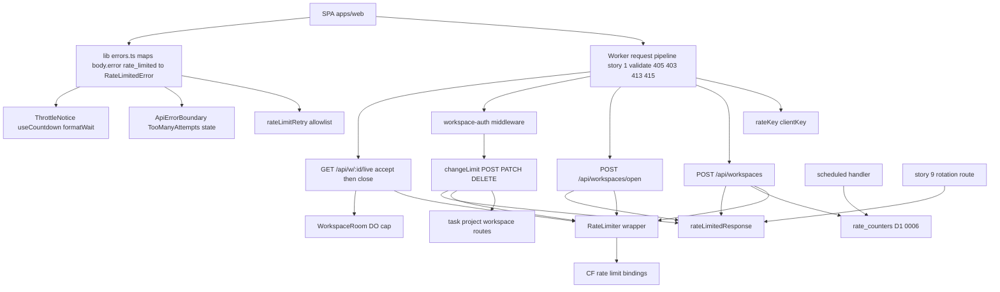
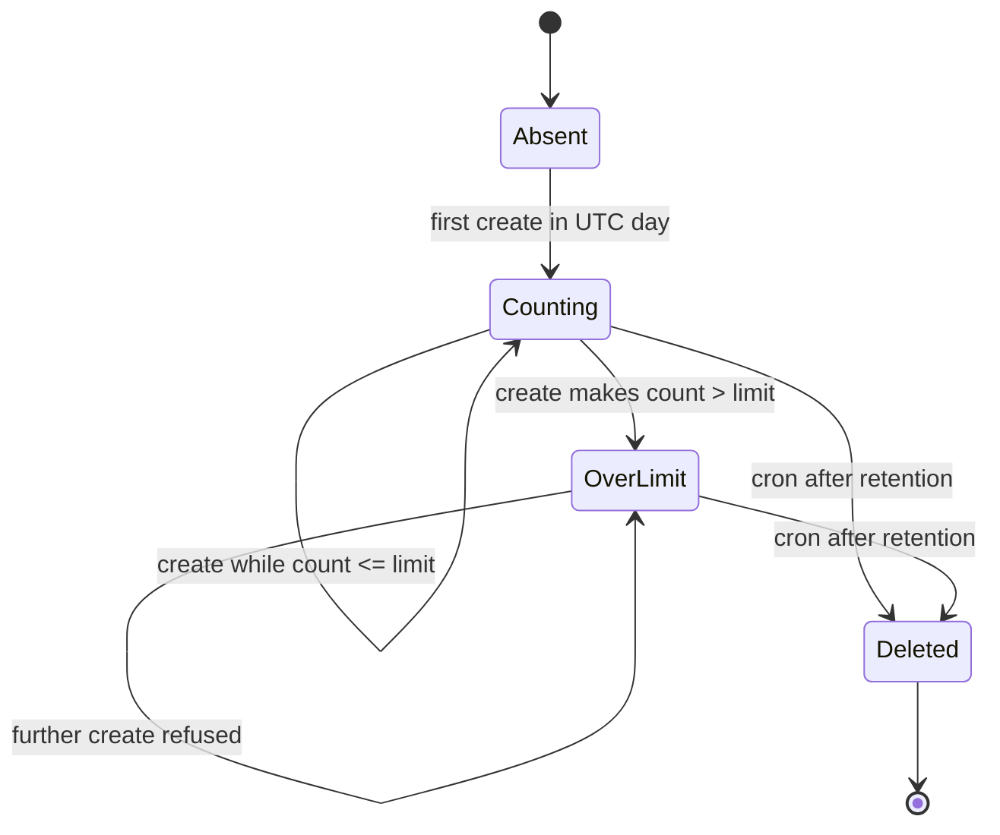
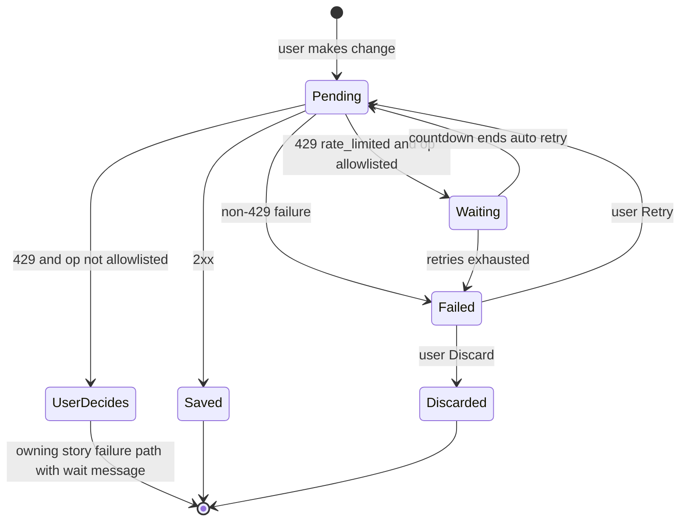
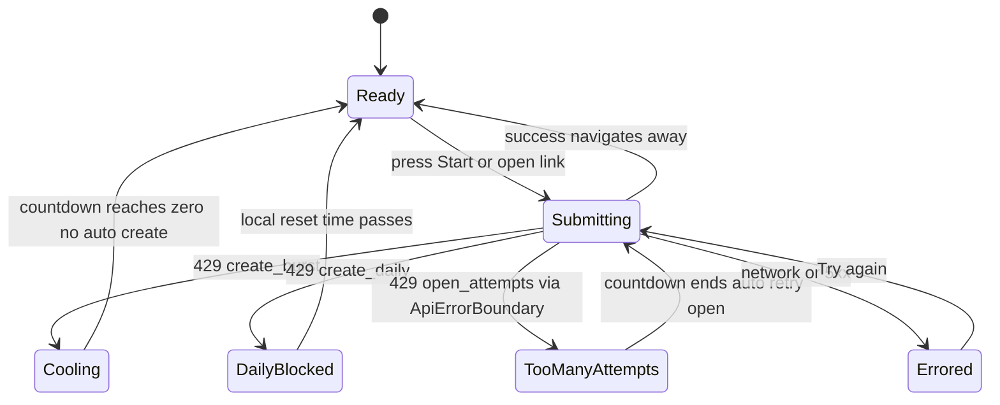
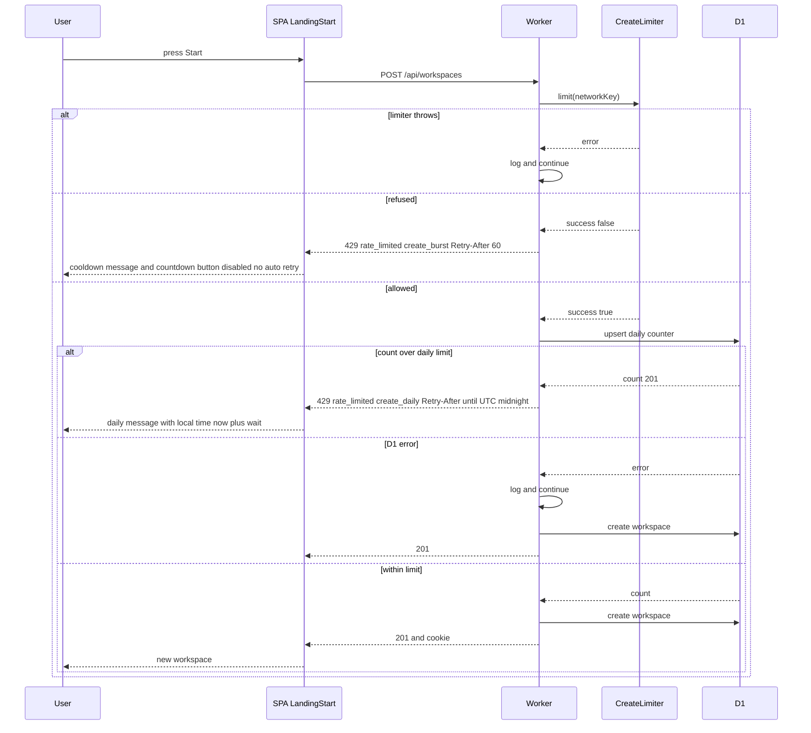
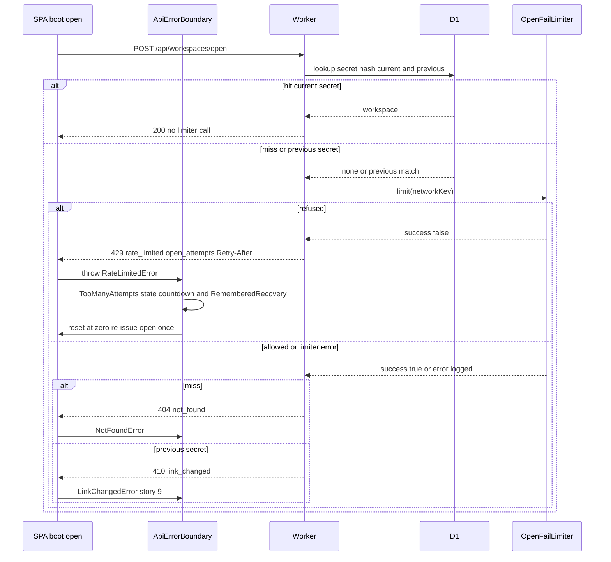
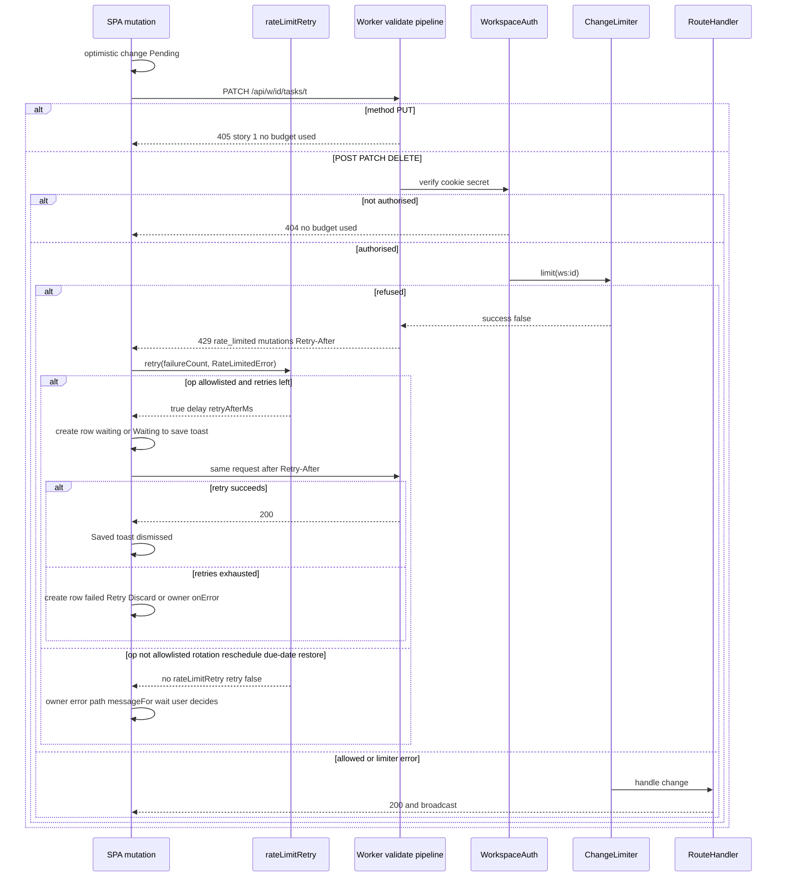
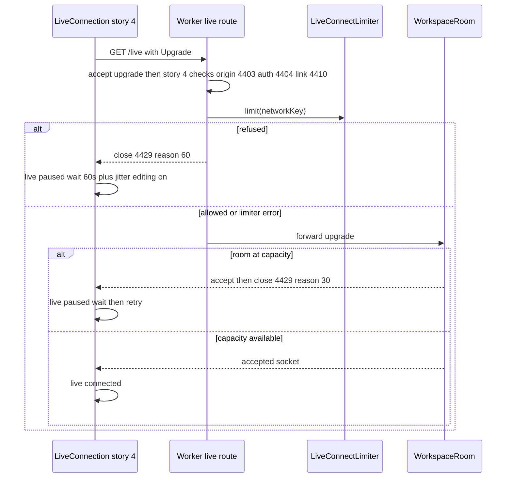
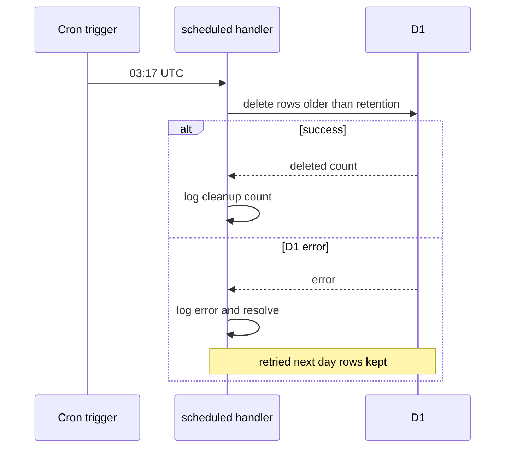

# Technical Design

Abuse protection built into the Worker: hashed, daily-rotating network keys; Workers Rate Limiting binding for 60 s bursts (create, failed opens, per-workspace mutations, live connects); a D1 daily counter for workspace creation with cron cleanup; a Durable Object connection cap; one 429 contract (Retry-After + JSON) and a self-resolving SPA experience that never loses work.

## Overview

## Purpose
Implements story 10's PRD within the architecture baseline (`docs/architecture.md` §4–§7, §12, §13) and the cross-story resolutions (`specs/general/CROSS-STORY-RESOLUTIONS.md`, D-20, D-22, D-23, D-24, D-32–D-35, D-44). No accounts exist, so limits are keyed on a **network key** (hashed client network) or on the **workspace id** (for changes, after authentication).

**Story 10 owns (registry, §13):** the one 429 contract (`rateLimitedResponse`, `rateLimitedSchema`, `RateLimitScope`), the limiter, `useCountdown`, `formatWait`, and the client retry predicate (`rateLimitRetry`). Story 9 extends the contract with the `rotation_cooldown` scope. See "Deltas to stories 1/2/4/5/6/9 and extension points owned".

## Verified platform facts (Cloudflare docs, fetched 2026-09-25)
- Workers Rate Limiting binding: config `[[ratelimits]]` with `name`, `namespace_id` (string of a positive integer), `simple.limit`, `simple.period`; **period must be 10 or 60 seconds**; API `const { success } = await env.X.limit({ key })`; counters are **per Cloudflare location** and "permissive, eventually consistent"; bindings sharing a `namespace_id` share counters **across Workers on the same account**; requires Wrangler ≥ 4.36.0; docs advise against keying solely on IP for user-facing limits (shared NAT) — addressed below by generous limits and by keying changes on workspace id.
- WAF rate limiting rules: Free plan = 1 rule, fixed 10 s period and 10 s mitigation, IP-only characteristics. Usable later as an outer shield on the custom domain; not part of this codebase.
- Durable Objects hibernation API exposes `ctx.getWebSockets()`; no documented hard cap on connections per object, so our cap is an application policy.
- **Not documented (unverified):** whether Miniflare / `wrangler dev` / vitest-pool-workers simulate the rate-limit binding. Task 10.1 verifies this first; the design isolates the binding behind an interface so tests stay meaningful either way (see Test Strategy, mock vs real).

## Decisions
| Concern | Mechanism | Why |
|---|---|---|
| Burst limits (60 s) | Workers Rate Limiting binding | Sub-millisecond, no storage writes, per-location is fine for burst control |
| Daily creation cap | D1 `rate_counters` upsert (migration `0006`, D-32) | Binding cannot express periods > 60 s; creation is rare so one D1 write per creation is cheap and exact |
| Live connection cap | `WorkspaceRoom` counts `getWebSockets()` | Only the DO knows its live sockets |
| Changes per workspace | Binding keyed by workspace id, applied **after** workspace-auth, on POST/PATCH/DELETE only (PUT never reaches it: story 1 returns 405, D-44) | Only link holders can spend a workspace's budget; shared-NAT users are not penalised |
| Failed opens | Binding keyed by network key, called **only on a miss or a previous-secret open (410 `link_changed`, D-34)** | Valid current links never count (PRD); a 429 only replaces what would have been a 404 or 410, so no existence leak |
| `/live` refusals | Always accept, then close 4429 (D-22) | Browsers cannot read the HTTP status of a failed upgrade; the server never answers `/live` with HTTP 429 |
| One 429 contract | `Retry-After` header + `{error:'rate_limited', scope, retryAfterSeconds}` (D-23) | One client mapping (`body.error === 'rate_limited'`, D-20) for every limit, including story 9's rotation cooldown |
| Automatic retry | Only after a `rate_limited` 429 and only for an idempotent allowlist (D-24) | Retrying a non-idempotent action (rotation, reschedule, due-date restore, workspace create) could repeat a side effect; non-429 failures stay the user's decision (story 5) |
| Human verification | None by default | Turnstile would add a third-party script (violates §4 no-third-party rule). Documented escalation: enable Turnstile on the create button only, accepting the privacy/third-party trade-off, if abuse persists |
| Limiter unavailable | **Fail open** + structured error log | PRD constraint: counting failures must not take Todoodle down |

## Constants (`packages/shared/src/limits.ts`)
`RATE_BURST_PERIOD_S = 60`, `WORKSPACE_CREATE_BURST_LIMIT = 20`, `WORKSPACE_CREATE_DAILY_LIMIT = 200`, `OPEN_FAIL_BURST_LIMIT = 20`, `WORKSPACE_CHANGE_BURST_LIMIT = 600`, `LIVE_CONNECT_BURST_LIMIT = 60`, `LIVE_MAX_CONNECTIONS_PER_WORKSPACE = 100`, `LIVE_ROOM_FULL_RETRY_S = 30`, `RATE_COUNTER_RETENTION_DAYS = 2`, `IPV6_KEY_PREFIX_HEXTETS = 4` (a /64), `RATE_KEY_LENGTH = 22`, `THROTTLED_SAVE_MAX_RETRIES = 3`, `SECONDS_PER_MINUTE = 60` (used by `formatWait`). Binding limits in `wrangler.toml` must equal these constants (enforced by TC-U14).
`LIVE_CLOSE_RATE_LIMITED = 4429` is one of story 4's live close-code constants (D-22); story 10 uses it and does not redefine it.

## Namespace ids per environment
Because counters are shared across all Workers with the same `namespace_id` on the account, each environment uses its own ids: local 1001–1004, staging 2001–2004, production 3001–3004 (create, open-fail, change, live-connect).

## Structure


## State: daily counter row

A new UTC day uses a new row (new window value), so the previous day's row simply ages out; there is no reset transition on an existing row.

## State: client-side throttled change (extends story 5's localStatus and story 6's mutations)
Applies only to allowlisted, idempotent mutations (D-24). Creates carry `localStatus` on the row; other mutations keep their optimistic value and show the shared "Waiting to save…" toast.

`Failed` with Retry/Discard is the create path (story 5). For non-create mutations `Failed` is the owning story's normal save-failure handling (stories 6–8).

## State: create / open throttle UI

Open is a read of an existing workspace, so re-issuing it is safe (PRD auto_resume). Create is never re-issued automatically (D-24).

## Flows changed and their sequence diagrams
F1 create workspace, F2 open link, F3 change within a workspace, F4 live connect, F5 daily cleanup. The SPA side of F1–F4 is shown inside each sequence. No other flow changes.

## Test Strategy

## Test scopes and boundaries
| Scope | Boundary exercised | Why sufficient |
|---|---|---|
| unit | pure logic: key derivation, IPv6 prefixing, retry-after maths, policy decision functions with an injected limiter, constant/config parity, 429 schema, `body.error` mapping, retry predicate, `formatWait`, countdown | deterministic, covers every equivalence class cheaply |
| integration | full Worker request handling via `SELF.fetch` with real Miniflare D1 and real WorkspaceRoom DO | the structure diagram's request pipeline boundary must be exercised; D1 upsert atomicity and DO socket counting only behave truly against real stores |
| ui-component | React components and real mutation option factories with a real QueryClient, MSW returning real 429 shapes | countdown, disabled states, 'Waiting to save…' rendering, request counts proving what is and is not retried |
| e2e | real browser → wrangler dev → local D1/DO | end-to-end UX that people see, incl. auto-resume |

## Dimensions crossed
- **Limit scope**: create_burst, create_daily, open_attempts (miss and previous secret), mutations, live_connect, live room cap, rotation_cooldown (story 9, client side only)
- **Prior state**: under limit, exactly at limit, one over, limiter unavailable
- **Environment**: production, non-production (test key header and test routes honoured or 404)
- **Operation kind (client)**: allowlisted idempotent (create with client id, PATCH, complete/reopen, delete/restore, move) vs never-retried (workspace create, rotation, reschedule, due-date restore)
- **Failure kind (client)**: `rate_limited` 429, 429 without a `rate_limited` body, non-429 (5xx, network, validation, gone)
- **Surface**: API response, SPA reaction

## Equivalence classes (exhaustive, non-overlapping per scope)
- Count relative to limit: `< limit`, `= limit` (last allowed), `> limit` (refused).
- Limiter health: returns success, returns failure, throws.
- Client address: IPv4, IPv6, IPv4-mapped IPv6, absent header.
- Environment: `production`, `staging`, `local`.
- Open outcome: hit current secret, miss, previous secret (410).
- Error body on 429: valid `rate_limited`, other `error`, empty/non-JSON.
- Retry decision: allowlisted + `RateLimitedError` + retries left; allowlisted + exhausted; allowlisted + non-rate-limit error; not allowlisted + any error.

## Mock vs real
| Store / service | Unit | Integration | E2E | Reason |
|---|---|---|---|---|
| D1 `rate_counters` | not used (pure functions only) | **real** Miniflare D1 | real local D1 | atomic upsert is the behaviour under test |
| WorkspaceRoom DO | not used | **real** | real | socket counting is under test |
| CF rate-limit binding | fake `RateLimiter` (in-memory, same interface) | real Miniflare simulation if task 10.1 confirms support; otherwise the in-memory fake injected via `env` override — justified because the binding is platform code, not our code; our policy and wiring stay real | same as integration | we test our use of the binding, not Cloudflare's counter |
| Clock | fake timers | fixed `now` injected into policy | Playwright `clock` | midnight and countdown boundaries |
| HTTP (ui-component) | — | — | — | MSW with bodies built from the real `rateLimitedSchema`; the QueryClient and mutation option factories are the real ones |

## Fixture realism
Real shapes only: IPs from documentation ranges (203.0.113.7, 2001:db8:abcd:12::1, ::ffff:198.51.100.4), workspace ids from `generateId()`, 429 bodies produced by the real `rateLimitedResponse()` (shared schema), D1 rows created through the real migrations, rotated workspaces seeded through story 2/9's `/test/seed-workspace {rotatedSecondsAgo}`, counters through `/test/seed-rate-counter`.

## Test cases
| ID | Level | Capability | Case | Expected |
|---|---|---|---|---|
| TC-U01 | unit | ratelimit.client_key | IPv4 203.0.113.7, scope create | 22-char base64url key, stable for same day |
| TC-U02 | unit | ratelimit.client_key | two IPv6 in same /64 | identical key |
| TC-U03 | unit | ratelimit.client_key | two IPv6 in different /64 | different keys |
| TC-U04 | unit | ratelimit.client_key | IPv4-mapped IPv6 | same key as plain IPv4 |
| TC-U05 | unit | ratelimit.client_key | same IP, dates D and D+1 | different keys (daily rotation) |
| TC-U06 | unit | ratelimit.client_key | same IP, different scopes | different keys |
| TC-U07 | unit | ratelimit.client_key | header absent (local) | key derived from literal 'unknown', no throw |
| TC-U08 | unit | ratelimit.client_key | env local + X-Test-Rate-Key 'abc' | key 'test:abc' |
| TC-U09 | unit | ratelimit.client_key | env production + X-Test-Rate-Key | header ignored, hashed network key used |
| TC-U10 | unit | ratelimit.client_key | output never contains raw IP substring | assertion over 50 generated IPs |
| TC-U11 | unit | ratelimit.limiter | fake returns success | `{allowed:true}` |
| TC-U12 | unit | ratelimit.limiter | fake returns failure | `{allowed:false, retryAfterSeconds: RATE_BURST_PERIOD_S}` |
| TC-U13 | unit | ratelimit.limiter | binding throws | `{allowed:true, degraded:true}` and one `ratelimit_unavailable` log line |
| TC-U14 | unit | ratelimit.limiter | parse wrangler.toml for all three envs | each binding limit/period equals the shared constant; namespace ids unique across envs |
| TC-U15 | unit | ratelimit.response | burst refusal for each HTTP scope | status 429, `Retry-After` equals body `retryAfterSeconds`, body passes `rateLimitedSchema`, `scope` set; `RATE_LIMIT_SCOPES` is exactly create_burst, create_daily, open_attempts, mutations, live_connect, rotation_cooldown |
| TC-U16 | unit | ratelimit.response | daily refusal at 23:59:30 UTC | `Retry-After: 30`, body `retryAfterSeconds: 30`, no `resetAt` field |
| TC-U17 | unit | ratelimit.response | daily refusal at 00:00:00 UTC | Retry-After 86400 |
| TC-U18 | unit | ratelimit.response | log line content | contains scope, 6-char key prefix, request id; never IP, secret, cookie or query text |
| TC-U19 | unit | web.throttle_core | api receives 429 with valid `rate_limited` body | throws `RateLimitedError` with scope, retryAfterSeconds, retryAfterMs |
| TC-U20 | unit | web.throttle_core | `rate_limited` body, Retry-After header absent; header present and different | uses body value; header wins when present |
| TC-U21 | unit | web.throttle_core | `useCountdown` 60 s, advance 59 s / 60 s | 1 then 0 and `done` true |
| TC-U22 | unit | web.throttle_core | `RateLimitedError` is not classified as offline | story 4's offline store and `useCanEdit()` unchanged |
| TC-U23 | unit | web.throttle_core | 429 with body `{error:'internal'}`, empty body, non-JSON body | plain `ApiError`, **not** `RateLimitedError` (D-20: map by `body.error` only) |
| TC-U24 | unit | web.throttle_core | `formatWait` 1, 45, 59, 60, 61, 120 | "1 second", "45 seconds", "59 seconds", "1 minute", "2 minutes", "2 minutes" |
| TC-U25 | unit | web.throttle_core | `rateLimitRetry(op)` for every op in `RATE_LIMIT_RETRYABLE_OPS` with `RateLimitedError`, failureCount 0..max | `retry` true for failureCount < `THROTTLED_SAVE_MAX_RETRIES`, false at the max; `retryDelay` = `retryAfterMs` |
| TC-U26 | unit | web.throttle_core | allowlisted op with non-rate-limit errors: ApiError 500, network TypeError, ValidationError, GoneError, NotFoundError, 429 `ApiError` without `rate_limited` body | `retry` false for every one |
| TC-U27 | unit | web.throttle_core | never-retried operations: real mutation option factories for workspace create (story 2), link rotation (story 9), reschedule and due-date restore (story 8) | none spreads `rateLimitRetry`; `retry` is false/undefined; `RATE_LIMIT_RETRYABLE_OPS` contains none of them |
| TC-I01 | integration | ratelimit.create_policy | 20 creates same test key | all 201 |
| TC-I02 | integration | ratelimit.create_policy | 21st create same key within 60 s | 429 scope create_burst; D1 workspaces count unchanged by refused call |
| TC-I03 | integration | ratelimit.create_policy | 21st create with different test key | 201 (isolation) |
| TC-I04 | integration | ratelimit.daily_counter | seed counter to 200 via `/test/seed-rate-counter`, create | 429 scope create_daily; counter row = 201; no workspace row added |
| TC-I05 | integration | ratelimit.daily_counter | seed 199 (plus a -1 day row of 500), create | 201; counter 200 |
| TC-I06 | integration | ratelimit.daily_counter | 25 parallel creates on empty counter | final counter 25 (atomic upsert, no lost updates) |
| TC-I07 | integration | ratelimit.daily_counter | D1 counter query forced to fail (test hook) | create succeeds, `ratelimit_unavailable` logged |
| TC-I08 | integration | ratelimit.daily_counter | rows before and after scheduled() with windows today, -1, -2, -3 days | before: 4 rows; after: today and -1 remain |
| TC-I09 | integration | ratelimit.daily_counter | migration `0006_rate_counters.sql` applied to a DB with 0001–0005 (D-32) | table and index exist; safety scan passes (no CHECK/DROP); story 11's 0007 still applies after it |
| TC-I10 | integration | ratelimit.daily_counter | inspect every stored key_hash | none equals or contains the client IP |
| TC-I11 | integration | ratelimit.open_policy | 25 opens with valid current secret, same key | all 200 |
| TC-I12 | integration | ratelimit.open_policy | 20 misses then 21st miss | first 20 → 404 identical body; 21st → 429 scope open_attempts |
| TC-I13 | integration | ratelimit.open_policy | after 21 misses, valid current secret | 200 (valid never slowed) |
| TC-I14 | integration | ratelimit.open_policy | 429 body for miss | only `error`, `scope`, `retryAfterSeconds`, `message`; no workspace id, name or hint of existence |
| TC-I15 | integration | ratelimit.mutation_policy | 600 changes to workspace A | all succeed |
| TC-I16 | integration | ratelimit.mutation_policy | 601st change to A | 429 scope mutations; DB row and version unchanged; no broadcast event |
| TC-I17 | integration | ratelimit.mutation_policy | after A throttled, change to workspace B | succeeds (per-workspace key) |
| TC-I18 | integration | ratelimit.mutation_policy | unauthenticated request to /api/w/A/tasks | 404 from auth; A's budget not consumed (A's next change succeeds) |
| TC-I19 | integration | ratelimit.mutation_policy | GET requests to A beyond 600 | never 429 (reads not counted) |
| TC-I20 | integration | ratelimit.live_policy | 100 sockets to one workspace | all open |
| TC-I21 | integration | ratelimit.live_policy | 101st socket | upgrade accepted (101), then closed 4429 with reason "30"; never an HTTP 429; existing 100 untouched |
| TC-I22 | integration | ratelimit.live_policy | one of 100 closes, new connect | open succeeds |
| TC-I23 | integration | ratelimit.live_policy | 61 connects in 60 s same test key | 61st accepted (101) then closed 4429 reason "60" before reaching the DO (DO socket count unchanged); never an HTTP 429 |
| TC-I24 | integration | ratelimit.limiter | env production + X-Test-Rate-Key over limit | header ignored; limit applies on network key |
| TC-I25 | integration | ratelimit.response | every HTTP 429 path (I02, I04, I12, I16, I26) | `Retry-After` header equals body `retryAfterSeconds`; body passes `rateLimitedSchema`; security headers and X-Request-Id present (story 1 finalize) |
| TC-I26 | integration | ratelimit.open_policy | rotated workspace (seeded `rotatedSecondsAgo`); 10 misses + 10 previous-secret opens, then a 21st previous-secret open; then the current secret | misses 404, previous-secret opens 410 `link_changed`; 21st → 429 open_attempts (D-34: one shared budget); current secret → 200 |
| TC-I27 | integration | ratelimit.live_policy | test routes (D-35): `/test/seed-rate-counter` writes the row for the test key; `/test/live/force-close {code:4429}` with 2 open sockets; code 1000; same routes with `ENVIRONMENT=production` | row present with seeded count; both sockets closed 4429 reason "60"; code 1000 → 400 validation; production → 404 for both routes |
| TC-I28 | integration | ratelimit.mutation_policy | PUT /api/w/A/tasks/x, including after A's budget is exhausted (D-44) | 405 `method_not_allowed` from story 1, never 429; 5 PUTs followed by 600 PATCHes → all 600 succeed (PUT spends no budget) |
| TC-C01 | ui-component | web.throttle_feedback | Start pressed, MSW 429 create_burst 45 s | `THROTTLE_COPY` create-burst message with "45 seconds", button disabled |
| TC-C02 | ui-component | web.throttle_feedback | advance 45 s | button enabled, message gone |
| TC-C03 | ui-component | web.throttle_feedback | 429 create_daily with `retryAfterSeconds` | message shows viewer-local reset time (`now + retryAfterSeconds`) for Europe/London and America/Los_Angeles, no ticking seconds |
| TC-C04 | ui-component | web.throttle_feedback | remembered list during cooldown | still clickable |
| TC-C05 | ui-component | web.throttle_feedback | boot open 429 open_attempts inside `ApiErrorBoundary` | TooManyAttempts state with countdown and `RememberedRecovery`; exactly one re-issued open at zero |
| TC-C06 | ui-component | web.throttle_feedback | task create 429 mutations | `TaskRow` `localStatus` `waiting`: cell 2 shows `THROTTLE_COPY.waitingToSave`, `aria-busy="true"`, no Retry/Discard, text intact; toast shown once |
| TC-C07 | ui-component | web.throttle_feedback | three rows throttled together | one toast (id `throttle:<ws>`), three waiting rows |
| TC-C08 | ui-component | web.throttle_feedback | retries exhausted on create | row moves to story 5's `failed` with Retry/Discard, text intact; request count = 1 + `THROTTLED_SAVE_MAX_RETRIES` |
| TC-C09 | ui-component | web.throttle_feedback | messages exposed to screen readers | countdown message in role=status, updated at most every `LIVE_ANNOUNCE_THROTTLE_MS` (not every second) |
| TC-C10 | ui-component | web.throttle_feedback | complete (non-create allowlisted) → 429 mutations, then 200 | task stays completed on screen (no rollback), waiting toast shown; second request after Retry-After; toast dismissed; request count 2 |
| TC-C11 | ui-component | web.throttle_feedback | story 9's rotation mutation → 429 rotation_cooldown 120 s; advance 3× the wait | **exactly 1 request** (never retried); no waiting toast; error exposes `RateLimitedError` so story 9 shows "2 minutes" via `formatWait` |
| TC-C12 | ui-component | web.throttle_feedback | story 8's reschedule mutation → 429 mutations; advance 3× the wait | **exactly 1 request** (never retried); no `waiting` rows; no waiting toast |
| TC-C13 | ui-component | web.throttle_feedback | PATCH → 500; PATCH → network error; create → 429 with `{error:'internal'}` | exactly 1 request each; no waiting state; owning story's failure path (non-429 stays the user's decision) |
| TC-C14 | ui-component | web.throttle_feedback | boot open → 429 with `{error:'internal'}` | `WorkspaceLoadFailed`, **not** TooManyAttempts (D-20) |
| TC-C15 | ui-component | web.throttle_feedback | workspace create 429 create_burst; countdown ends | exactly 1 create request (never auto-retried); button re-enabled |
| TC-E01 | e2e | web.throttle_feedback | 21 creates via page with X-Test-Rate-Key set by test fixture | 21st shows cooldown message; Playwright clock +60 s; Start works again |
| TC-E02 | e2e | web.throttle_feedback | daily limit seeded via `/test/seed-rate-counter` | daily message with local time; remembered workspace opens normally |
| TC-E03 | e2e | web.throttle_feedback | 21 random bad links then a valid link | TooManyAttempts state for bad link; valid link opens immediately |
| TC-E04 | e2e | web.throttle_feedback | change throttling (server 429 with a real `rate_limited` body and Retry-After forced through Playwright route interception on the tasks endpoint, since reaching 600 real changes in a browser is slow; the real limit is covered by TC-I15/16) | 'Waiting to save…' then saved after countdown; reload shows task persisted |
| TC-E05 | e2e | ratelimit.live_policy | second context whose live socket is closed 4429 via `/test/live/force-close {code:4429}` | 'Reconnecting…' pill, editing still possible, live resumes after the wait |

## Error paths → cases
- `create_burst` → TC-I02, TC-C01, TC-C15; `create_daily` → TC-I04, TC-C03; `open_attempts` → TC-I12, TC-I26, TC-C05; `mutations` → TC-I16, TC-C06, TC-C10; `rotation_cooldown` (story 9) → TC-C11; live room cap 4429 → TC-I21; live connect rate 4429 → TC-I23; limiter throws → TC-U13; D1 counter fails → TC-I07; cleanup failure → TC-I08b below; 429 without `rate_limited` body → TC-U23, TC-C13, TC-C14; PUT → TC-I28.
| ID | Level | Capability | Case | Expected |
|---|---|---|---|---|
| TC-I08b | integration | ratelimit.daily_counter | scheduled() with D1 delete forced to throw | error logged, handler resolves (no unhandled rejection), rows untouched |

## Negative scenarios (must NOT happen)
| ID | Level | Case | Must not |
|---|---|---|---|
| TC-N01 | integration | valid open after many misses | must not be 429 (TC-I13) |
| TC-N02 | integration | refused create | must not create a workspace row or set a cookie |
| TC-N03 | integration | refused change | must not bump version or broadcast |
| TC-N04 | integration | reads (GET) | must not consume change budget (TC-I19) |
| TC-N05 | unit | production with test header | must not honour test key (TC-U09, TC-I24) |
| TC-N06 | ui-component | throttled save | must not roll back or discard typed text while waiting (TC-C06/C08/C10) |
| TC-N07 | integration | stored data | must not contain raw IP (TC-I10) |
| TC-N08 | unit | 429 handling | must not mark app offline (TC-U22) |
| TC-N09 | ui-component | rotation, reschedule, workspace create refused with 429 | must not be retried automatically (TC-C11, TC-C12, TC-C15, TC-U27) |
| TC-N10 | unit + ui-component | non-429 failure or 429 without `rate_limited` body | must not be retried automatically or shown as a countdown (TC-U23, TC-U26, TC-C13, TC-C14) |
| TC-N11 | integration | `/live` refusal | must not answer with HTTP 429; always accept then close 4429 (TC-I21, TC-I23) |

## Edge cases
IPv4-mapped IPv6 (TC-U04); midnight boundary (TC-U16/17); parallel creation race (TC-I06); counter row for the previous day not affecting today (TC-I05 fixture); misses and previous-secret opens sharing one budget (TC-I26); Retry-After header and body disagreeing (TC-U20).

## Deliberately not covered
- Cloudflare's own per-location counting accuracy and cross-location behaviour (platform-owned; the docs state it is approximate).
- Real distributed attacks and load at production scale; no load test is part of this story.
- Latency cost of `limit()` in production (not measurable in Miniflare).
- WAF rules and Turnstile (outside the codebase / escalation only).
- Story 9's rotation cooldown server logic (owned and tested by story 9; story 10 tests only that the client never retries it).

## Network key derivation

> Anchor: `ratelimit.client_key`

## Contract
```ts
clientKey(req: Request, env: Env, scope: RateScope, now: Date): Promise<string>
type RateScope = 'create' | 'open_fail' | 'live_connect'
```
- Input: `CF-Connecting-IP` header (absent locally → literal `unknown`).
- IPv6 reduced to its first `IPV6_KEY_PREFIX_HEXTETS` hextets (/64); IPv4-mapped IPv6 converted to IPv4.
- Daily salt = HMAC-SHA256(`RATE_LIMIT_SECRET`, UTC `YYYY-MM-DD`); key = base64url(HMAC-SHA256(dailySalt, `${scope}:${prefix}`)) truncated to `RATE_KEY_LENGTH`.
- Non-production only: header `X-Test-Rate-Key: <v>` → returns `test:<v>`. In production the header is ignored.
- Outputs: opaque string; never contains the IP.
- Errors: none thrown. If `RATE_LIMIT_SECRET` is missing in production, derivation uses the environment name as key material and logs `rate_secret_missing` once per isolate (deploy precheck prevents this; see task 10.2).
- Side effects: none.

## Implementation
- `apps/api/src/lib/rateKey.ts` (new), using Web Crypto `crypto.subtle` HMAC.
- `apps/api/src/env.ts`: add `RATE_LIMIT_SECRET?: string` (secret via `wrangler secret put`, never `[vars]`).
- Story 1's `scripts/deploy.ts` precheck verifies the secret exists for staging/production.

## Tests
TC-U01–TC-U10 (unit): address families, rotation, scope separation, test header honoured/ignored, no raw IP in output.

## Rate limiter wrapper and binding configuration

> Anchor: `ratelimit.limiter`

## Contract
```ts
interface RateLimiter { limit(key: string): Promise<LimitResult> }
type LimitResult = { allowed: true; degraded?: true } | { allowed: false; retryAfterSeconds: number }
limiterFor(env: Env, name: 'CREATE' | 'OPEN_FAIL' | 'CHANGE' | 'LIVE_CONNECT'): RateLimiter
```
- Wraps the Cloudflare binding `env.<NAME>_LIMITER.limit({ key })`.
- `success:false` → `{allowed:false, retryAfterSeconds: RATE_BURST_PERIOD_S}` (the binding reports no remaining time; 60 s is the documented period and an upper bound).
- Binding missing or throwing → `{allowed:true, degraded:true}` plus log `ratelimit_unavailable` (fail open, PRD constraint).
- Production always uses real bindings; there is no configuration that disables them (PRD always_enforced). Non-production isolation is achieved only through test keys (see ratelimit.client_key), not by relaxing limits.

## Implementation
- `apps/api/src/lib/rateLimiter.ts` (new).
- `wrangler.toml`: four `[[ratelimits]]` per environment, e.g. base env:
  - `CREATE_LIMITER` namespace `1001`, limit 20, period 60
  - `OPEN_FAIL_LIMITER` `1002`, 20/60
  - `CHANGE_LIMITER` `1003`, 600/60
  - `LIVE_CONNECT_LIMITER` `1004`, 60/60
  - staging `2001`–`2004`, production `3001`–`3004` (distinct ids because counters are shared across Workers on the account).
- `package.json`: wrangler devDependency pinned ≥ 4.36.0.
- Task 10.1 first verifies whether Miniflare/vitest-pool-workers simulate `ratelimits`; if not, `apps/api/test/helpers/fakeRateLimiter.ts` implements the binding interface and is injected through the vitest `miniflare.bindings` override for integration tests only.

## Tests
TC-U11–TC-U14 (unit), TC-I24 (integration), and every integration case in the policy capabilities exercises this wrapper through real request handling.

## Daily creation counter and cleanup

> Anchor: `ratelimit.daily_counter`

## Contract
```ts
incrementDaily(db: D1Database, scope: 'create', key: string, now: Date): Promise<{ count: number } | { degraded: true }>
cleanupRateCounters(db: D1Database, now: Date): Promise<{ deleted: number }>
```
- Migration `migrations/0006_rate_counters.sql` (numbered by build order, D-32: 0005 is story 9's rotation, 0007 is story 11's search text): table `rate_counters(scope TEXT NOT NULL, key_hash TEXT NOT NULL, window TEXT NOT NULL, count INTEGER NOT NULL DEFAULT 0, created_at TEXT DEFAULT (datetime('now')), PRIMARY KEY (scope, key_hash, window))`, index on `window`. No CHECK constraints (§5).
- `incrementDaily`: single atomic statement `INSERT … ON CONFLICT(scope,key_hash,window) DO UPDATE SET count = count + 1 RETURNING count`; `window` = UTC date. D1 error → `{degraded:true}` + log.
- `cleanupRateCounters`: deletes rows with `window` older than `RATE_COUNTER_RETENTION_DAYS` days; errors are logged and swallowed.
- Scheduled trigger: `[triggers] crons = ["17 3 * * *"]` in every environment; `apps/api/src/index.ts` exports `scheduled(event, env, ctx)` calling cleanup via `ctx.waitUntil`.
- Side effects: one row per (scope, key, day); rows contain only the hashed key.
- Known behaviour: a refused create still increments the counter (count > limit stays refused); a create that fails after counting is not decremented (documented, harmless at these limits).

## Test route (D-35)
`POST /test/seed-rate-counter {scope, testKey, count, window?}` is registered in **story 1's** `/test/*` registry (`apps/api/src/routes/test.ts`), owner story 10. Like every test route it returns 404 in production (story 1 gating). It writes the row for the key that `clientKey` derives from `X-Test-Rate-Key: <testKey>`, so seeding and the request under test share one key.

## Implementation
- `migrations/0006_rate_counters.sql`, `apps/api/src/db/rateCounters.ts`, `apps/api/src/scheduled.ts`, `apps/api/src/index.ts`, `wrangler.toml` triggers.
- `apps/api/src/routes/test.ts` (story 1's registry): add the `seed-rate-counter` handler.
- Architecture §5 migration table already lists `0006_rate_counters.sql` (story 10).

## Tests
TC-I04–TC-I10, TC-I08b, TC-I27 (integration, real D1); date-window helper covered by TC-U16/U17 inputs.

## Workspace creation limits

> Anchor: `ratelimit.create_policy`

## Contract
`POST /api/workspaces` (story 2) gains, after story 1's validate pipeline and before creating anything:
1. `CREATE` burst limiter on `clientKey(create)` → refused: 429 `scope: 'create_burst'`, `retryAfterSeconds = RATE_BURST_PERIOD_S`.
2. `incrementDaily('create')` → `count > WORKSPACE_CREATE_DAILY_LIMIT`: 429 `scope: 'create_daily'`, `retryAfterSeconds` = seconds until the next UTC midnight. The client derives the local reset time as `now + retryAfterSeconds`; there is no `resetAt` field (one contract, D-23).
3. Otherwise story 2's create proceeds unchanged.
- Errors: 429 as above (always via `rateLimitedResponse`); limiter/D1 failure → proceed (fail open, logged).
- Side effects of a refusal: none besides the counter increment; no workspace row, no cookie.
- Workspace create is **never** retried automatically by the client (D-24); the Home button re-enables when the countdown ends.

## Implementation
- `apps/api/src/routes/workspaces.ts` (story 2 file): call `enforceCreateLimits(c)` from `apps/api/src/middleware/rate-limit.ts`.

## Tests
TC-I01–TC-I06, TC-N02 (integration); TC-C01–TC-C04 (ui-component); TC-E01, TC-E02 (e2e).

## Failed link attempt limits

> Anchor: `ratelimit.open_policy`

## Contract
`POST /api/workspaces/open` (story 2, with story 9's 410 branch):
- Hit on the **current** secret → unchanged 200; **the limiter is not called**.
- Miss → call `OPEN_FAIL` limiter on `clientKey(open_fail)`: allowed → unchanged 404 `{error:'not_found'}`; refused → 429 `scope:'open_attempts'`.
- Hit on the workspace's **previous** secret (story 9: 410 `{error:'link_changed'}`) → counts as a failed attempt (D-34): the same `OPEN_FAIL` limiter call on the same key; allowed → unchanged 410; refused → 429 `scope:'open_attempts'`. Misses and previous-secret opens share one budget.
- The 429 body carries no workspace information (`{error:'rate_limited', scope:'open_attempts', retryAfterSeconds}` only). It can only replace a response that would have been 404 or 410, so it reveals nothing new about existence.

## Client
The boot open (story 2's `bootOpen.ts`) throws `RateLimitedError` (D-20), which story 2's `ApiErrorBoundary` renders as the **TooManyAttempts** state registered by story 10, with story 3's `RememberedRecovery` in its recovery slot. When the countdown ends the state resets the boundary, which re-issues the open once (a read, so safe to repeat). See web.throttle_feedback.

## Implementation
- `apps/api/src/routes/workspaces.ts` open handler: `onOpenFailure(c, outcome: 'miss' | 'previous_secret')` from `apps/api/src/middleware/rate-limit.ts`, called on the 404 path and on story 9's 410 path.

## Tests
TC-I11–TC-I14, TC-I26, TC-N01 (integration); TC-C05, TC-C14 (ui-component); TC-E03 (e2e).

## Change rate per workspace

> Anchor: `ratelimit.mutation_policy`

## Contract
- Middleware `changeLimit` mounted on `/api/w/:workspaceId/*` **after** workspace-auth, applied to **POST, PATCH and DELETE** only. PUT is not listed: story 1's validate pipeline rejects it with 405 before auth (D-44), so it never reaches this middleware.
- Key: `ws:<workspaceId>` (not a network key: only link holders can spend a workspace's budget; a shared NAT is not penalised).
- Refused → 429 `scope:'mutations'` (D-23) before the route handler runs, so no DB write, no version bump, no broadcast.
- Bulk operations (e.g. story 8 reschedule) count as one change.
- GET and the live upgrade are not counted.
- Story 9's rotation is also a POST under `/api/w/:id/*` and counts toward this budget; its own cooldown is a separate 429 with `scope:'rotation_cooldown'` produced by story 9 through `rateLimitedResponse`.

## Implementation
- `apps/api/src/middleware/rate-limit.ts` (`changeLimit`), registered in `apps/api/src/app.ts` next to workspace-auth. Stories 5–9 need no route changes; their routes inherit it.

## Tests
TC-I15–TC-I19, TC-I28, TC-N03, TC-N04 (integration); TC-E04 (e2e).

## Live connection limits

> Anchor: `ratelimit.live_policy`

## Contract (conforms to story 4's `/live` rejection contract, D-22)
- `/live` never answers with HTTP 429. Without an Upgrade header story 4 returns 426 `upgrade_required`. Once Upgrade is present the server **always accepts, then closes** with a code the browser can read. Story 4's order is kept: origin (4403), not found/unauthorised (4404), link changed (4410, story 9), then story 10's checks below. No story-10 check runs before the upgrade is accepted, and story 10 claims no pre-upgrade status.
- **Connect rate (per network):** after story 4's origin and auth checks, the Worker's live route calls the `LIVE_CONNECT` limiter on `clientKey(live_connect)`. Refused → accept the server side of a `WebSocketPair` and immediately close it with `LIVE_CLOSE_RATE_LIMITED` (4429) and reason `String(RATE_BURST_PERIOD_S)` ("60"); the upgrade is never forwarded to the Durable Object.
- **Room capacity (per workspace):** `WorkspaceRoom.fetch` (story 4): if `ctx.getWebSockets().length >= LIVE_MAX_CONNECTIONS_PER_WORKSPACE`, accept then close 4429 with reason `String(LIVE_ROOM_FULL_RETRY_S)` ("30"); existing sockets untouched.
- **Close reason format:** a base-10 integer number of seconds to wait. This is the extension point story 4's client reads.
- **Client:** story 4's `features/live/LiveConnection.ts` state machine owns the 4429 branch (D-22): stay in *live paused* ("Reconnecting…"), wait at least the reason's seconds plus story 4's jitter, then reconnect; editing stays on (§12). Story 10 does not edit that file; it verifies the behaviour end to end (TC-E05).

## Test route (D-35)
`POST /test/live/force-close {workspaceId, code}` is registered in **story 1's** `/test/*` registry (`apps/api/src/routes/test.ts`), owner story 10; 404 in production (story 1 gating). It asks the workspace's `WorkspaceRoom` to close every open socket with `code` (must be in the 4000–4999 application range; otherwise 400 `validation`) and reason `String(RATE_BURST_PERIOD_S)` when `code` is 4429. Used by TC-E05 so the e2e test does not need 61 real connects.

## Implementation
- `apps/api/src/routes/live.ts`, `apps/api/src/live/WorkspaceRoom.ts` (story 4 files): the two checks above.
- `apps/api/src/routes/test.ts` (story 1's registry): `live/force-close` handler, plus a test-only `forceClose(code, reason)` method on `WorkspaceRoom`.
- Constants: `LIVE_ROOM_FULL_RETRY_S` in `packages/shared/src/limits.ts`; `LIVE_CLOSE_RATE_LIMITED` is story 4's.

## Tests
TC-I20–TC-I23, TC-I27 (integration, real DO); TC-E05 (e2e).

## Rate-limited response contract and logging

> Anchor: `ratelimit.response`

## Contract (the one 429 contract, D-23; owner story 10)
```ts
// packages/shared/src/schemas.ts
export const RATE_LIMIT_SCOPES = ['create_burst', 'create_daily', 'open_attempts', 'mutations', 'live_connect', 'rotation_cooldown'] as const;
export type RateLimitScope = typeof RATE_LIMIT_SCOPES[number];
export const rateLimitedSchema = z.object({
  error: z.literal('rate_limited'),
  scope: z.enum(RATE_LIMIT_SCOPES),
  retryAfterSeconds: z.number().int().positive(),
  message: z.string(),            // §6 error envelope field; not used for display
});

// apps/api/src/lib/errors.ts
rateLimitedResponse(c: Context, scope: RateLimitScope, retryAfterSeconds: number, logKey?: string): Response
```
- Status 429; header `Retry-After: <retryAfterSeconds>` (whole seconds, same value as the body); body validated by `rateLimitedSchema`. **Every 429 in Todoodle is built by this function** — there is no other 429 shape.
- Scopes:
  | Scope | Produced by | Transport |
  |---|---|---|
  | `create_burst`, `create_daily` | ratelimit.create_policy | HTTP 429 |
  | `open_attempts` | ratelimit.open_policy | HTTP 429 |
  | `mutations` | ratelimit.mutation_policy | HTTP 429 |
  | `live_connect` | ratelimit.live_policy | close code 4429 (reason = seconds); listed so logs and client messages share one vocabulary, never an HTTP 429 |
  | `rotation_cooldown` | story 9's rotation route (extension point) | HTTP 429 |
- Story 9 calls `rateLimitedResponse(c, 'rotation_cooldown', seconds)` and drops its own `retryAfterS` field and its `rotation_cooldown` error code (D-23).
- `resetAt` is not part of the contract; the client derives any clock time as `now + retryAfterSeconds`.
- Passes through story 1's `finalizeResponse` (security headers, request id).
- Logs one structured line `{event:'rate_limited', scope, keyPrefix, requestId}`; `keyPrefix` = first 6 chars of the hashed key when one is given. Never logs IP, secret, cookie, body or search text.
- Architecture §6 already lists `rate_limited` (429) with these scopes.

## Implementation
- `apps/api/src/lib/errors.ts` (add `rateLimitedResponse`), `packages/shared/src/schemas.ts` (`RATE_LIMIT_SCOPES`, `rateLimitedSchema`), `packages/shared/src/limits.ts`.
- `apps/api/src/lib/rateWindow.ts`: pure helpers `utcWindow(now)` (shared with ratelimit.daily_counter) and `secondsUntilNextUtcMidnight(now)` for `create_daily`.

## Tests
TC-U15–TC-U18 (unit), TC-I25 (integration).

## SPA rate-limit error and countdown primitives

> Anchor: `web.throttle_core`

## Contract
```ts
// apps/web/src/lib/errors.ts (story 2's map, D-20) — story 10 registers one entry
class RateLimitedError extends ApiError { scope: RateLimitScope; retryAfterSeconds: number; retryAfterMs: number }

// apps/web/src/lib/useCountdown.ts
useCountdown(untilMs: number | null): { secondsLeft: number; done: boolean }

// apps/web/src/lib/formatWait.ts
formatWait(seconds: number): string   // "1 second", "45 seconds", "1 minute", "2 minutes"

// apps/web/src/lib/rateLimitRetry.ts — the retry predicate (D-24)
type RetryableOp = 'task.create' | 'project.create' | 'task.update' | 'task.complete' | 'task.reopen'
                 | 'task.delete' | 'task.restore' | 'task.move';
export const RATE_LIMIT_RETRYABLE_OPS: ReadonlySet<RetryableOp>;
export function rateLimitRetry(op: RetryableOp): {
  retry: (failureCount: number, error: unknown) => boolean;   // error instanceof RateLimitedError && failureCount < THROTTLED_SAVE_MAX_RETRIES
  retryDelay: (failureCount: number, error: unknown) => number; // (error as RateLimitedError).retryAfterMs
};
export function isWaitingOnRateLimit(m: { status: string; failureReason: unknown }): boolean; // pending && failureReason instanceof RateLimitedError
```

### Error mapping (D-20)
- `RateLimitedError` is registered in story 2's `lib/errors.ts` map **by `body.error === 'rate_limited'` only** — never by status 429 alone. The body is parsed with the shared `rateLimitedSchema`; a 429 whose body is not a valid `rate_limited` body (missing, non-JSON, other `error`) maps to plain `ApiError` like any other unknown failure, and is therefore never retried and never shown as a countdown.
- `retryAfterSeconds` = the `Retry-After` header when it is a positive integer, else the body's `retryAfterSeconds`; `retryAfterMs = retryAfterSeconds * MS_PER_SECOND`.
- `RateLimitedError` is **not** a network error, so story 4's offline detection (and `useCanEdit()`) is unaffected.

### Retry predicate (D-24; amends story 5's "no automatic retry")
- Only mutations whose operation is in `RATE_LIMIT_RETRYABLE_OPS` spread `...rateLimitRetry(op)` into their `useMutation` options. The type `RetryableOp` makes it impossible to opt in any other operation.
- Allowlist (idempotent: client ids, absolute PATCH values, idempotent state transitions): task and project creates with client ids, task PATCH, complete, reopen, delete, restore, move.
- **Never retried** (no `rateLimitRetry`, `retry` stays at the QueryClient default `false`): workspace create, link rotation (story 9), reschedule and due-date restore (story 8). Any non-`rate_limited` failure is never retried, whatever the operation.
- The QueryClient default for mutations stays `retry: false` (story 5); story 10 does **not** install a global retry predicate.
- `waiting` is **derived**, not stored: `isWaitingOnRateLimit(mutation)` is true while TanStack's retryer is sleeping after a `RateLimitedError` (`status === 'pending'` and `failureReason instanceof RateLimitedError`).

### Countdown and wording
- `useCountdown` uses one `setTimeout` chain aligned to whole seconds; no interval per component; cleans up on unmount.
- `formatWait(seconds)`: under `SECONDS_PER_MINUTE` → "N second(s)"; otherwise minutes rounded **up** → "N minute(s)". Story 9 reuses `useCountdown` and `formatWait` for its rotation cooldown (D-23).
- Copy strings live in `apps/web/src/features/throttle/messages.ts` as the constant `THROTTLE_COPY` (plain words, no blame), including `THROTTLE_COPY.waitingToSave = 'Waiting to save…'`; tests assert the constant, not literal text (§13 rule 3). `messageFor(error: RateLimitedError, now: Date)` returns the scope's sentence with `formatWait` applied, for use by any story whose non-retried action is refused.

## Implementation
- `apps/web/src/lib/errors.ts` (story 2 file: add the `rate_limited` entry and `RateLimitedError`), `apps/web/src/lib/useCountdown.ts`, `apps/web/src/lib/formatWait.ts`, `apps/web/src/lib/rateLimitRetry.ts`, `apps/web/src/features/throttle/messages.ts`. Direct imports only (§12). `MS_PER_SECOND` and `SECONDS_PER_MINUTE` from `packages/shared/src/limits.ts`.

## Tests
TC-U19–TC-U27 (unit); countdown rendering in TC-C01/C02 (ui-component).

## SPA throttling experience

> Anchor: `web.throttle_feedback`

## Contract
- **Create (Home, story 2's landing start component `features/workspace/LandingStart.tsx`, D-33 — story 2 names it):** workspace create is never retried (D-24). On `create_burst` show inline `ThrottleNotice` with `useCountdown` + `formatWait`, disable the button until `done`; on `create_daily` show the local reset time (`now + retryAfterSeconds`, formatted with the cached `Intl` time formatter in `packages/shared/src/dates.ts`), no ticking. Remembered list stays enabled.
- **Open (story 2 boot open):** the `RateLimitedError` propagates to story 2's `ApiErrorBoundary`, which renders the **TooManyAttempts** state (story 10's `features/throttle/TooManyAttempts.tsx`, registered as the boundary's `RateLimitedError` branch, D-20) with countdown and story 3's `RememberedRecovery` in the recovery slot. When `done`, it calls the boundary's reset, which re-issues the open once per countdown. A 429 without a `rate_limited` body is a plain `ApiError` and falls through to `WorkspaceLoadFailed`.
- **Changes (idempotent allowlist only, D-24):** mutations in story 6's `features/tasks/mutations.ts` (task create, PATCH, complete/reopen, delete/restore; story 7's move lives in the same file) and story 7's project create spread `...rateLimitRetry(op)`.
  - **Optimistic creates:** the row's `localStatus` becomes `waiting` (story 5's `TaskRow` union, D-06/D-33), derived with `isWaitingOnRateLimit`. Cell 2's status text shows `THROTTLE_COPY.waitingToSave`; the row has `aria-busy="true"`; cell 3 shows no Retry/Discard while waiting (those are only for `failed | rejected`). Text is never rolled back. Retries exhausted → the create's `onError` puts the row in story 5's `failed` state with Retry/Discard, text intact. Project creates have no row status slot; they rely on the toast below.
  - **Other allowlisted mutations:** the optimistic value stays on screen (no `onError` rollback runs while the retryer waits, because `onError` fires only after the last attempt). A sonner toast with id `throttle:<workspaceId>` shows `THROTTLE_COPY.waitingToSave` + "Lots of changes happening in this workspace — saving again in {formatWait}". One toast per workspace per wait, however many mutations are waiting; it is dismissed when no mutation in the workspace is waiting. Exhausted → the owning story's normal `onError` (story 6).
  - **Never-retried operations** (workspace create, rotation, reschedule, due-date restore) and every non-`rate_limited` failure: no retry; the owning story's error path shows `messageFor(error)` when the error is a `RateLimitedError` (story 9 renders its own rotation cooldown with `useCountdown`/`formatWait`).
- **Live:** handled by story 4's paused state (see ratelimit.live_policy).
- **Offline gating:** throttle UI never disables editing; `useCanEdit()` is unaffected by 429s.
- Accessibility: messages in `role=status`, screen-reader text updated at most every `LIVE_ANNOUNCE_THROTTLE_MS`, visual countdown every second.

## Implementation
- `apps/web/src/features/throttle/ThrottleNotice.tsx`, `apps/web/src/features/throttle/TooManyAttempts.tsx`, `apps/web/src/features/throttle/waitingToast.ts`.
- Story 2 files (extension points): `apps/web/src/features/workspace/LandingStart.tsx` (throttle notice), `ApiErrorBoundary` (`RateLimitedError` → `TooManyAttempts` branch).
- Story 5 file: `TaskRow`/`TaskSummary` status text for `waiting`.
- Story 6 file: `apps/web/src/features/tasks/mutations.ts` (opt allowlisted mutations into `rateLimitRetry`, derive `waiting`).

## Tests
TC-C01–TC-C15 (ui-component); TC-E01–TC-E04 (e2e).

## Sequence F1: create workspace



## Sequence F2: open a link


A previous-secret open (410) counts as a failed attempt (D-34); both kinds share one budget.

## Sequence F3: change within a workspace


Non-429 failures never reach the retry predicate's true branch: `retry` returns false for anything that is not a `RateLimitedError`.

## Sequence F4: live connect


No HTTP 429 is ever returned on `/live`; a request without Upgrade gets story 4's 426 (D-22).

## Sequence F5: daily cleanup



## Deltas to stories 1/2/4/5/6/9 and extension points owned

Per `docs/architecture.md` §13 and `specs/general/CROSS-STORY-RESOLUTIONS.md`. Each owner's design must show these as named extension points; story 10 implements into them and does not reshape them.

## Extension points story 10 owns (final shape)
| Artefact | Final shape | Extended by |
|---|---|---|
| 429 contract (D-23) | `rateLimitedResponse(c, scope, retryAfterSeconds, logKey?)`; `Retry-After` + `{error:'rate_limited', scope, retryAfterSeconds, message}`; `rateLimitedSchema`, `RATE_LIMIT_SCOPES = create_burst, create_daily, open_attempts, mutations, live_connect, rotation_cooldown` | 9: produces `rotation_cooldown` via `rateLimitedResponse`; drops `retryAfterS` and the `rotation_cooldown` error code |
| Limiter (`limiterFor`, `clientKey`, `changeLimit`) | as in ratelimit.limiter / client_key / mutation_policy | — (routes of 5–9 inherit `changeLimit` with no change) |
| `useCountdown(untilMs)`, `formatWait(seconds)` | `apps/web/src/lib/useCountdown.ts`, `apps/web/src/lib/formatWait.ts` | 9: rotation cooldown copy ("45 seconds", "2 minutes") |
| Retry predicate (D-24) | `rateLimitRetry(op: RetryableOp)`, `RATE_LIMIT_RETRYABLE_OPS`, `isWaitingOnRateLimit` in `apps/web/src/lib/rateLimitRetry.ts` | 5/6/7 mutations opt in; 2/8/9 must not |
| Throttle copy | `THROTTLE_COPY`, `messageFor(error, now)` in `features/throttle/messages.ts` | 5 (status text), 8/9 (error paths) |

## Delta to story 1 (validate pipeline and `/test/*` registry)
- Registry (D-35) gains two routes, owner 10, both 404 in production: `/test/seed-rate-counter {scope, testKey, count, window?}` and `/test/live/force-close {workspaceId, code}`. Handlers live in story 1's `apps/api/src/routes/test.ts`.
- The validate pipeline stays 405 → 403 → 413 → 415 and runs **before** any story-10 limiter; PUT is rejected with 405 there, so `changeLimit` never lists PUT (D-44).
- `scripts/deploy.ts` precheck gains the `RATE_LIMIT_SECRET` check (task 10.2); migration `0006_rate_counters.sql` must pass the migration safety scan.

## Delta to story 2 (errors, boundary, landing, create/open routes)
- `apps/web/src/lib/errors.ts`: register `rate_limited` → `RateLimitedError{scope, retryAfterSeconds, retryAfterMs}` **by `body.error` only**; a 429 without that body stays `ApiError` (D-20).
- `ApiErrorBoundary`: a `RateLimitedError` branch renders story 10's **TooManyAttempts** state with story 3's `RememberedRecovery` in the recovery slot; the state resets the boundary when its countdown ends. No route is added (D-12).
- Landing start component: D-33 requires story 2 to name it; this design uses `features/workspace/LandingStart.tsx` (replacing the stale `StartButton.tsx`). It exposes a slot beneath the button for `ThrottleNotice` and a `disabledUntil` input. Workspace create's mutation options must **not** use `rateLimitRetry`.
- `apps/api/src/routes/workspaces.ts`: `enforceCreateLimits(c)` before create; `onOpenFailure(c, 'miss' | 'previous_secret')` on the 404 and 410 paths.

## Delta to story 4 (live)
- `/live` rejection contract (D-22): story 10 adds only post-accept closes with `LIVE_CLOSE_RATE_LIMITED` (4429, story 4's constant); close reason = whole seconds to wait. No pre-upgrade status is claimed.
- `LiveConnection.ts` state machine owns the 4429 branch: live paused, wait ≥ reason seconds plus jitter, reconnect; editing stays on.
- `WorkspaceRoom` gains the connection cap check and a test-only `forceClose(code, reason)` used by `/test/live/force-close`.
- `useCanEdit()` must ignore `RateLimitedError` (a 429 is not offline).

## Delta to story 5 (TaskRow, localStatus, "no automatic retry")
- `TaskRow` `localStatus` union becomes `pending | failed | rejected | waiting` (D-06, D-33). For `waiting`: cell 2 status text `THROTTLE_COPY.waitingToSave`, `aria-busy="true"`, cell 3 shows no Retry/Discard.
- Story 5's rule is amended to: "No automatic retry after failures; scheduled retry after a rate-limit wait is the only exception." (D-24). The QueryClient default for mutations stays `retry: false`.
- Task create with a client id is in the allowlist (`task.create`).

## Delta to story 6 (mutations)
- `features/tasks/mutations.ts` (replaces the stale `taskMutations.ts`): task create, PATCH, complete, reopen, delete, restore (and story 7's move in the same file) spread `...rateLimitRetry(op)`; the create path derives `localStatus: 'waiting'` via `isWaitingOnRateLimit`; the waiting toast (`throttle:<workspaceId>`) is raised through story 10's `waitingToast.ts`. `onError` rollbacks run only after the last attempt, so nothing rolls back while waiting.
- Story 7 opts `project.create` in the same way (noted for story 7; no shape change).

## Delta to story 9 (rotation)
- Rotation cooldown response: `rateLimitedResponse(c, 'rotation_cooldown', seconds)`; the `retryAfterS` field and the `rotation_cooldown` error code are dropped (D-23).
- Client: story 9 reuses `useCountdown` and `formatWait`; its rotation mutation must **not** use `rateLimitRetry` (TC-C11, TC-U27).
- Open: a previous-secret open (410 `link_changed`) calls `onOpenFailure(c, 'previous_secret')` and counts toward `open_attempts` (D-34, TC-I26).
- Story 8's reschedule and due-date restore are likewise never retried (TC-C12, TC-U27).

