# Technical Design

Finder overlay (find + go-to) on the shared story 7 combobox; server search over a normalised search_text column (migration 0005) with ranking, exclusions and log redaction; live result maintenance via registerLiveHandler with stable selection; entry points in story 5's slots; mobile sheet; a11y.

## Overview

Implements `specs/general/SEARCH-UX.md` (§3.7 revised: action bar) under `docs/architecture.md` (§5 migration 0007, §12 conventions, §13 ownership rule) and `specs/general/CROSS-STORY-RESOLUTIONS.md` (D-01…D-46). Search is a second navigation axis: one **Finder** overlay returns matching lists (client-side, instant) and matching tasks (server, debounced), keeps results live while collaborators edit, and lets users act on the highlighted task through an **action bar** rendered outside the result options (D-15).

**Dependencies (must exist first; owners per the registry, story 11 only uses them — see 'Deltas / extension points used'):**
- story 1: request pipeline (logging + error handler that `redactQuery` hooks into), `scripts/deploy.ts`, migration safety scan, `/test/seed` + `/test/tasks/:id/raw` registry (D-35), Playwright matrix incl. `mobile-webkit`/`mobile-chromium` for `@mobile` specs (D-36).
- story 2: `lib/queryKeys.ts` — `queryKeys.search(wid, {q, includeCompleted})` used only (D-37); `workspacePath(wid, view)` in `App.tsx` routes (D-12; no `listRoute()`); `lib/errors.ts` typed errors + `ApiErrorBoundary` (D-20); `lib/lazyWithRetry.ts` (D-42); workspace-auth; per-icon import lint (D-43).
- story 4: `registerLiveHandler`, notifyManager batching, reconnect invalidation, `tasks.bulk` = `{ids, deleted?}` with refetch semantics (D-25); `features/live/canEdit.ts` `useCanEdit()` + offline store (D-10).
- story 5: `lib/shortcuts.ts` `useGlobalShortcut({key, modifiers?, scope?, allowInOverlay?, description})` and the **overlay scope stack** (D-14); AppShell `searchSlot`/`headerActionsSlot` (D-11); `features/tasks/useTaskGrid.ts` `focusTaskRow(id)` (D-04); `TaskSummary` (D-01, reused as non-interactive option content, D-43); `useCreateTask` + QuickAdd target `{kind:'inbox'}|{kind:'project', projectId}` (D-40); `lib/useIsNarrow.ts`.
- story 6: `features/tasks/mutations.ts` complete/reopen, `features/undo/showUndoToast.ts` `showUndoToast({message, onUndo})` (D-41), `openTaskDetail(id, {returnFocusTo})` (D-05), `include_completed=true|false` convention (D-31).
- story 7: `components/combobox/*` (`ResponsiveCommand`, `OptionRow`, `HighlightedText`), `packages/shared/src/search.ts` `normaliseForSearch` (D-43; story 11 adds `buildSearchText` only), `useProjects`, `openMovePicker(taskId, {returnFocusTo})` (D-05), fragment-preserving `useWorkspaceNavigate` (D-13).
- story 8: `features/dates/DateChip.tsx` (D-43, rendered through `TaskSummary`), `openDatePicker(taskId, {returnFocusTo, anchor?})` in **unanchored** mode (centred dialog on desktop, bottom sheet on phones; D-05), `due_date` column.

### Structure
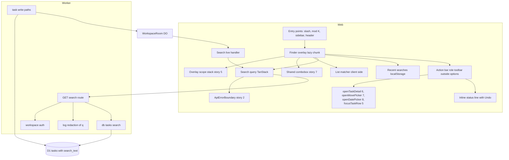

### Persisted and long-lived state
Two pieces: (1) the `tasks.search_text` column, whose lifecycle is shown below; (2) per-browser `localStorage` recents and the include-completed preference (non-authoritative, versioned, try/catch).
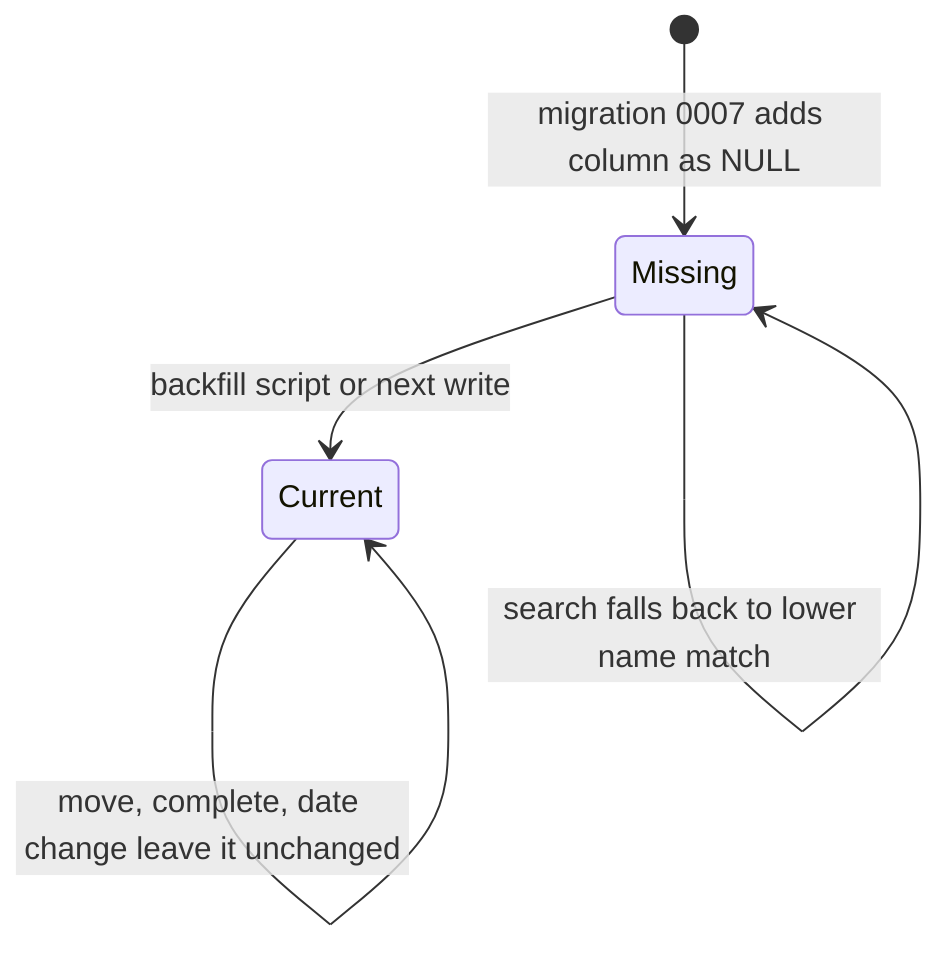

Finder UI state (ephemeral, but drives focus and live behaviour). `InputFocus` and `BarFocus` are sub-states of the open Finder: focus is either in the search input or in the action bar; a sub-picker opened from the bar sits on top of the Finder on the overlay scope stack.
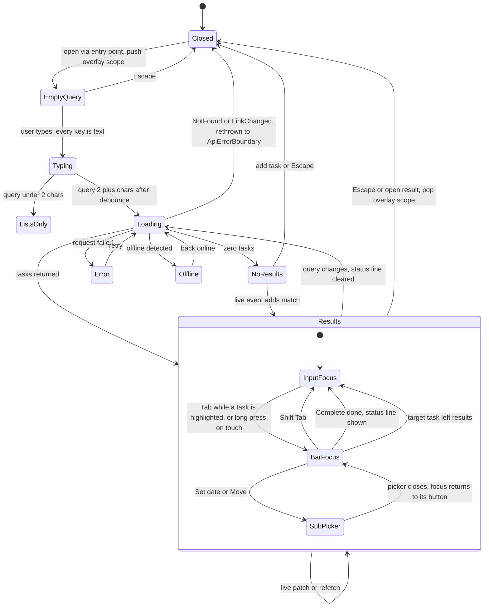
Selection is tracked by **task id** (not index) across Results transitions; if the selected id leaves the result set, selection moves to the item that followed it, else the new last item. The action bar is bound to the id it was opened for, not to the moving selection, so a live change can never redirect an action to a different task.

### Flows changed
F1 type-and-search, F2 live update while open, F3 open result in context, F4 act from the action bar (Complete + inline Undo, Set date, Move), F5 no results then add task, F6 offline/error (incl. typed-error hand-off), F7 entry and preload, F8 write path maintains search_text, F9 touch long-press shows the action bar. Sequence diagrams are in the owning capability sections; every flow shows its error branch.

## Deltas / extension points used

Per `docs/architecture.md` §13: every shared artefact below is **owned** by another story, which defines its final shape. Story 11 only consumes the named extension point. Where story 11 needs something the owner may not yet list, it is recorded here as a "Delta to story N" and must be present in the owner's design; story 11 never redefines or duplicates it. Build order is 1 → 11, so every artefact below exists before story 11 starts.

| Artefact | Owner (created by) | Extension point story 11 uses | Delta to owner (must appear in owner's design) |
|---|---|---|---|
| Request logging + error handler | 1 | Hook that passes every logged URL through `redactQuery` | Delta to story 1: URL-redaction hook in `middleware/request-id.ts` and `lib/errors.ts` |
| `scripts/deploy.ts` | 1 | Post-migration hook running `scripts/backfill-search-text.ts` when 0007 was applied or NULL `search_text` rows exist | Delta to story 1: post-migration hook list |
| `/test/seed`, `/test/tasks/:id/raw`, Playwright `@mobile` projects | 1 registry (seed: 5, raw: 6) | Seed schema from D-35 (`tasks[].completedAt`, `deleted`, `projectRef`, `dueDate`); raw row read to assert DB state | none |
| `App.tsx` routes, `workspacePath(wid, view)` | 2 | Navigate to a task's list (Inbox or `project/:pid`) | none (D-12: story 11 does **not** define `listRoute()`) |
| `lib/queryKeys.ts` | 2 | `queryKeys.search(wid, {q, includeCompleted})` → `['ws', wid, 'search', {q, includeCompleted}]` | Delta to story 2: `search` key in the factory (D-37: story 11 uses only; no local key arrays) |
| `lib/errors.ts`, `ApiErrorBoundary` | 2 (`NotFoundError`, `ValidationError`, `ApiError`); `GoneError` registered by 4; `LinkChangedError` by 9 | `NotFoundError` / `LinkChangedError` rethrown to the boundary; `GoneError{entity:'task'}` from bar actions → row removed (D-20) | none |
| `RateLimitedError` mapping (`body.error==='rate_limited'`) | contract owned by 10; **created by story 9** (earliest user, §13 rule 4), extended by 10 | Treated as any other `ApiError` by the Finder: Error state with Try again (TC-98). Story 11 adds no rate-limit handling of its own. | none |
| `lib/lazyWithRetry.ts` | 2 | Wraps the Finder chunk (D-42) | none |
| `packages/shared/src/tokens.ts` + generator + contrast checker | 2 | Adds `--mark-bg` / `--mark-fg` entries only | Delta to story 2: story 11 listed among token-entry contributors (registry lists 5, 7, 8) |
| AppShell slots | 2, extended by 5 | `searchSlot`, `headerActionsSlot` | none (registry lists 11 as search-slot user) |
| `registerLiveHandler`, `tasks.bulk` shape | 4 | Handlers for `task.*`, `tasks.bulk` (invalidate only, D-25), `project.deleted`/`restored` | none |
| `features/live/canEdit.ts` `useCanEdit()` | 4 (stub 2) | Action bar and status-line Undo gate themselves (portalled, D-10) | none |
| `lib/shortcuts.ts` + overlay scope stack | 5 | `/` and `{key:'k', modifiers:['mod']}` global shortcuts; Finder pushes an overlay scope while open (D-14) | none |
| `useTaskGrid.focusTaskRow(id)` | 5 | Focus the opened task's row (D-04) | none |
| `TaskSummary` | 5 (chips 8) | Rendered as **non-interactive** option content (D-43) | Delta to story 5: `TaskSummary` must render no focusable descendants (already implied by D-01 cell 2 content) |
| `useCreateTask`, QuickAdd target | 5 | Add-from-search to `{kind:'inbox'}` or `{kind:'project', projectId}` (D-40) | none |
| `lib/useIsNarrow.ts` | 5 | Narrow layout switch | none |
| `features/tasks/mutations.ts` complete/reopen | 6 | Complete / Reopen from the bar | none |
| `showUndoToast({message, onUndo})` | 6 | Global toast; the same `onUndo` also drives the inline status line (D-41) | none |
| `openTaskDetail(id, {returnFocusTo})` | 6 | Open in context (D-05) | none |
| `ResponsiveCommand`, `OptionRow`, `HighlightedText` | 7 | Finder rendering (options with no interactive children) | none |
| `normaliseForSearch` in `packages/shared/src/search.ts` | 7 | Used on client and server; story 11 **adds `buildSearchText` and `rankKey`** in the same file | Delta to story 7: `search.ts` hosts story 11's `buildSearchText` + `rankKey` |
| `openMovePicker(taskId, {returnFocusTo})` | 7 | Move from the bar (D-05) | none |
| `useWorkspaceNavigate` (fragment carry-over) | 7, conforming to D-13 (owner 2) | Finder navigation keeps the fragment | none |
| `openDatePicker(taskId, {returnFocusTo, anchor?})` | 8 | Unanchored mode from the bar (D-05) | none |
| `features/dates/DateChip.tsx` | 8 | Via `TaskSummary` | none |
| Migration numbering | architecture §5 | `0007_task_search_text.sql` (D-32) | none |

**Removed by cross-story decisions (not reduced scope):** Space/D/M keys inside the Finder input (D-15), swipe-to-complete and `useSwipeToComplete` (D-09), in-option Complete button (D-09/D-15), `listRoute()` (D-12), locally added query key arrays (D-37), `completed=0|1` (D-31), story 8 as `lazyWithRetry` owner (D-42), `features/today/DateChip` path (D-43), "roving list ref accessor" (D-04).

## Test Strategy

## Test scopes and boundaries
| Level | Boundary exercised | Why sufficient |
|---|---|---|
| unit | Pure functions: `buildSearchText` (and story 7's `normaliseForSearch` as used here), `buildSearchSql`/`escapeLike`, `rankKey`, `matchLists`, `applySearchEvent`, `nextSelection`, `recentStore`, `searchParamsSchema`, `redactQuery`, `highlightRanges`. | Deterministic logic with no I/O. |
| integration | `SELF.fetch` through the real Hono pipeline, against real Miniflare D1 (migrations 0001–0007 applied, D-32) and the real WorkspaceRoom DO. | The route, auth, SQL and log redaction are the behaviour under test. D1 is never mocked. |
| ui-component | Finder, results, action bar, status line and entry points rendered in happy-dom, with MSW for HTTP, a fake live registry, and story 5's real `lib/shortcuts.ts` (overlay scope stack) with story 4's `useCanEdit` store driven directly. | Focus, keyboard handling (incl. typed text vs actions), grouping and states need a DOM. The network is mocked with fixtures parsed by the shared schemas. |
| e2e | Playwright (chromium + webkit desktop; `@mobile` specs also on mobile-webkit and mobile-chromium, D-36) against wrangler dev, with two browser contexts for the live cases. | Real rendering, real keyboard input, real sockets, a real mobile viewport and touch long-press. |

**Mock vs real:**
- D1 is real in integration tests; mocking the store under test is forbidden (§10). The DO is also real in integration.
- HTTP is mocked only in ui-component tests, by MSW with fixtures parsed by the shared zod response schema, so the shapes stay real. Error fixtures use the real `{error, message}` bodies (`not_found`, `link_changed`, `rate_limited`, `internal`) so story 2's typed-error mapping is exercised (D-20).
- The owner helpers `openTaskDetail`, `openMovePicker`, `openDatePicker`, `focusTaskRow` and `showUndoToast` are spied (they belong to stories 5–8 and are tested there); the story 6 complete/reopen mutation runs for real against MSW.
- The clock is faked only for debounce, skeleton, announcer, long-press, undo-window and refetch timings in ui-component tests.
- localStorage is the real happy-dom storage, plus a throwing stub for the unavailable case.
- Copy assertions use `features/search/finderCopy.ts` constants, not literal text (§13 rule 3).

**Fixture realism:**
- A workspace seeded via `/test/seed` (D-35 schema) with 40 realistic tasks across Inbox and 3 projects, for example:
  - in Home: 'Book boiler service', 'Ask landlord about boiler', 'Boiler manual PDF';
  - in Health: 'Book dentist', 'Move mum's appointment';
  - in Work: 'Café receipts';
  - elsewhere: 'Pay 50% deposit', 'rename file_v2'.
- Completed and deleted variants, one task in a deleted project, and a second workspace with its own 'boiler' task.
- Performance fixture: 5,000 tasks with realistic name lengths (5–80 characters), 30% with descriptions.

## Dimensions crossed
- **D1 query class:** empty, 1 char, 2 chars, 200, 201, whitespace-only, accented, % and _, multi-word, mixed case, containing space/'d'/'m'.
- **D2 task state:** open, completed, deleted, in a deleted project, in another workspace.
- **D3 include_completed:** false (default), true, invalid.
- **D4 connectivity / edit gate:** online, live paused, offline (`useCanEdit()` false), HTTP 500, 404 not_found, 410 link_changed.
- **D5 surface:** keyboard desktop, mouse desktop, touch phone.
- **D6 live event while open:** none, upsert still matching, upsert no longer matching, delete, complete, project deleted, tasks.bulk.
- **D7 focus location:** input, action bar, sub-picker over the Finder, status line Undo.

Equivalence classes for each capability are listed in that capability's Tests section. Within each dimension above, the classes are exhaustive and don't overlap.

## Server cases (search.api, search.ranking, search.normalise, search.migration, search.privacy)
| TC | Case | Input / prior state | Expected (state before -> after where stateful) | Level |
|---|---|---|---|---|
| TC-01 | normalise accents | 'Café' | 'cafe' | unit |
| TC-02 | normalise case and whitespace | '  BOILER   Service ' | 'boiler service' | unit |
| TC-03 | normalise keeps non-Latin text | '日本 مرحبا' | same letters, lower-cased where applicable, single space | unit |
| TC-04 | buildSearchText / normalise empty | ('', null) and '' | '
' and '' | unit |
| TC-05 | escapeLike | 'a%b_c\\' | 'a\\%b\\_c\\\\' with ESCAPE '\\' | unit |
| TC-06 | params: q of 1 char | q='b' | schema valid; route returns 200 {tasks: [], truncated: false} without querying D1 (tasks need 2 chars) | unit |
| TC-07 | params: q of 2 chars | q='bo' | accepted | unit |
| TC-08 | params: q of 200 chars | 200-char q | accepted | unit |
| TC-09 | params: q of 201 chars | 201-char q | 400 validation | unit |
| TC-10 | params: whitespace-only | q='   ' | 200 {tasks: []} | unit |
| TC-11 | params: include_completed (D-31) | absent, 'true', 'false', '1', 'x' | false, true, false, 400, 400 | unit |
| TC-12 | rankKey order | open vs completed, name vs body, due null vs date, updatedAt | open before completed; name before body; earlier due first; no due last; newer update first | unit |
| TC-13 | redactQuery | URL '/api/w/x/search?q=divorce+lawyer&include_completed=false' | '...q=[redacted]&include_completed=false' | unit |
| TC-14 | migration safety scan | `0007_task_search_text.sql` | no CHECK / DROP / MODIFY / ADD CONSTRAINT; file number is 0007 (D-32) | unit |
| TC-15 | single match | seed; q='manual' | 1 task, 'Boiler manual PDF', in Home, matchedIn name | integration |
| TC-16 | multi-word AND, any order | q='service boiler' | only 'Book boiler service' | integration |
| TC-17 | accent-insensitive | q='cafe' | 'Café receipts' | integration |
| TC-18 | case-insensitive | q='BOILER' | the 3 open boiler tasks | integration |
| TC-19 | literal percent | q='50%' | only 'Pay 50% deposit', not every task containing '50' | integration |
| TC-20 | literal underscore | q='file_v' | only 'rename file_v2'; the 'fileXv' fixture is not returned | integration |
| TC-21 | description-only match ranks after name match | q='landlord', matching one name and one description | name match first; matchedIn values correct | integration |
| TC-22 | completed excluded by default | a completed 'boiler' task | absent with include_completed absent and =false | integration |
| TC-23 | completed included on request | same, include_completed=true | present, after the open tasks | integration |
| TC-24 | deleted excluded | a soft-deleted 'boiler' task | absent for both include_completed values | integration |
| TC-25 | deleted project excluded | an open task in a deleted project | absent | integration |
| TC-26 | other workspace isolated | the other workspace has 'boiler' | never returned | integration |
| TC-27 | zero results | q='zzzz' | 200 {tasks: [], truncated: false} | integration |
| TC-28 | exactly 50 | 50 matching tasks | 50, truncated false | integration |
| TC-29 | 51 | 51 matching tasks | 50, truncated true | integration |
| TC-30 | no cookie / wrong workspace | no tdl_ws entry | 404 `{error:'not_found'}`, identical body to other misses | integration |
| TC-31 | response headers | response headers | Cache-Control no-store, X-Request-Id, security headers | integration |
| TC-32 | log redaction | console.* spied during TC-15 and a forced 500 | captured output never contains the query text | integration |
| TC-33 | create maintains search_text | POST task 'Café plan', no description | before: no row; after: search_text = 'cafe plan' + '
' | integration |
| TC-34 | PATCH maintains search_text | PATCH description 'Naïve' | before: old text; after: part after '
' = 'naive' | integration |
| TC-35 | non-text writes leave it alone | complete, move, due date | search_text unchanged, byte for byte | integration |
| TC-36 | NULL fallback | row with NULL search_text named 'Boiler X' | q='boiler' still finds it (lower(name) fallback) | integration |
| TC-37 | backfill script idempotent | 3 NULL rows incl. 'Café old', migrations 0001–0007, script run twice | after the first run all are set and q='cafe' finds 'Café old'; the second run updates 0 rows | integration |
| TC-38 | performance | 5,000 tasks; 50 queries of 2–12 chars | p95 server time <= 300 ms locally | integration |

## Client cases (finder.*, search.live_refresh)
| TC | Case | Input / prior state | Expected | Level |
|---|---|---|---|---|
| TC-40 | matchLists is instant | projects cached; 'ho' | Home listed; Today/Inbox only if they match; under 50 ms (performance.now) | unit |
| TC-41 | matchLists ignores accents | project 'Résumés'; 'resu' | matched | unit |
| TC-42 | applySearchEvent: upsert still matching | cached results plus an upsert | row replaced in place; order recomputed by rankKey | unit |
| TC-43 | applySearchEvent: upsert no longer matching | name changed so it no longer matches | row removed | unit |
| TC-44 | applySearchEvent: delete, completed while hidden, project deleted | each event | affected row(s) removed | unit |
| TC-45 | applySearchEvent: stale version | version <= cached | ignored | unit |
| TC-46 | applySearchEvent: task not in cache | upsert of an unknown id | returns needsRefetch=true; cache unchanged | unit |
| TC-47 | nextSelection: still present | selected id at a new index | same id | unit |
| TC-48 | nextSelection: removed | selected id removed | the following item, else the last, else none | unit |
| TC-49 | recentStore | add 6 queries, a duplicate, clear, storage throws | max 5; duplicate moves to front; clear empties; throw gives [] without an error | unit |
| TC-97 | applySearchEvent: tasks.bulk (D-25) | `{ids:[a,b,c]}` where a, b are cached | returns needsRefetch=true; cache object returned unchanged (same reference, no re-sort, no patch) | unit |
| TC-50 | open via '/' | focus on body | Finder opens with the input focused; overlay scope pushed | ui-component |
| TC-51 | '/' inside a field | focus in quick add | '/' is typed; Finder stays closed | ui-component |
| TC-52 | open via mod+K | Ctrl+K (non-Mac UA) and Meta+K (Mac UA) | opens; plain 'k' does not | ui-component |
| TC-53 | sidebar field and header icon | click each (wide / narrow) | opens; placeholder names the workspace | ui-component |
| TC-54 | preload | hover the sidebar field / first '/' | Finder chunk import called once, through `lazyWithRetry` | ui-component |
| TC-55 | empty query view | 2 recent searches stored | recents, then Today, Inbox and 3 recent projects; Clear recent empties the list | ui-component |
| TC-56 | debounce | type 'boi' quickly (fake timers) | one request after 150 ms; previous request aborted (AbortSignal aborted) | ui-component |
| TC-57 | under 2 chars | type 'b' | lists only, no request | ui-component |
| TC-58 | grouping and row content | MSW returns 3 | Lists and Tasks groups; each option has the name with <mark> and story 5's `TaskSummary` (list chip + `DateChip`); count reads '3 results' | ui-component |
| TC-59 | no flicker | the second query is slow | previous results stay; skeleton appears only after 300 ms | ui-component |
| TC-60 | no results, then add | MSW returns []; Enter | create called with name 'xyz' and the current QuickAdd target; Finder closes; `focusTaskRow` called with the new id | ui-component |
| TC-61 | include-completed toggle | toggle on; reopen the Finder | request has `include_completed=true`; setting persisted; key = `queryKeys.search(wid, {q, includeCompleted:true})` | ui-component |
| TC-62 | truncated | truncated true | truncation message constant shown | ui-component |
| TC-63 | error, then retry | MSW 500, then 200 | error with Try again; text kept; retry shows results | ui-component |
| TC-64 | offline | `useCanEdit()` false / offline store true | lists still match and open; 'Can't search tasks while offline'; no request | ui-component |
| TC-65 | open task in context | Enter on a task in project Home | navigates to `workspacePath(wid, project Home)` via `useWorkspaceNavigate`; `focusTaskRow(id)`; `openTaskDetail(id, {returnFocusTo})` with the row; Finder closed | ui-component |
| TC-66 | open list | Enter on the 'Home' list | navigates to `workspacePath`; Finder closed | ui-component |
| TC-67 | Complete from the action bar (D-15) | 'Book boiler service' highlighted; Tab; Enter on Complete | focus moved to the Complete button inside a `role=toolbar` that is **not** a descendant of the listbox; story 6 complete mutation sent; `showUndoToast({message, onUndo})` called; status line reads 'Completed "Book boiler service" · Undo'; Finder stays open; row removed (completed hidden); focus back in the input | ui-component |
| TC-68 | Set date / Move from the action bar | task highlighted; Tab; → Enter (Set date); close picker; → Enter (Move) | `openDatePicker(id, {returnFocusTo: SetDateButton})` with **no anchor**; `openMovePicker(id, {returnFocusTo: MoveButton})`; Finder stays open throughout; focus returns to each button when its picker closes | ui-component |
| TC-69 | live patch keeps the selection | row 2 selected; a live upsert reorders | the same task is still selected | ui-component |
| TC-70 | live update removes the selected row | the selected task is deleted | selection moves to the following row | ui-component |
| TC-71 | live new match triggers a refetch | upserts for an unknown task | one refetch after 500 ms, coalesced across 3 events | ui-component |
| TC-72 | Escape and focus return | opened from the sidebar field; also Escape from the action bar | Escape closes; focus returns to the field; overlay scope popped | ui-component |
| TC-73 | announcer throttle | 5 result updates in 400 ms | one polite announcement with the final count | ui-component |
| TC-74 | mobile sheet | width 375, hover:none | full-height sheet, back arrow, enterKeyHint=search, options >= 56 px with **no buttons inside**, no swipe handler registered; key footer hidden; press-and-hold 500 ms (fake timers) shows the action bar docked at the bottom; a 200 ms tap opens the task instead; moving 20 px during hold cancels | ui-component |
| TC-87 | live paused still searches | live status 'paused', HTTP fine | task request still sent and results shown; action bar enabled | ui-component |
| TC-88 | tasks.bulk event (D-25) | bulk reschedule event `{ids}` covering 2 cached results and 1 unknown task | exactly one invalidation of the `queryKeys.search(wid)` prefix after 500 ms; the cached rows are **not** re-sorted or patched from event data before the refetch; after refetch the rows appear in the server's order | ui-component |
| TC-89 | typing 'boiler service' is text (D-15) | a task highlighted; user types 'boiler service' character by character | input value is 'boiler service'; no complete/reopen mutation sent; `showUndoToast` not called; no status line; Finder still open | ui-component |
| TC-90 | typing 'dentist' and 'move mum' is text (D-15) | a task highlighted; type 'dentist', clear, type 'move mum' | input values match exactly; `openDatePicker` and `openMovePicker` never called | ui-component |
| TC-91 | action bar keyboard contract | 3 results, task highlighted; then a list option highlighted | Tab enters the bar (first button focused, one tab stop); → → reaches Move, → again stays (no wrap); Home/End jump; Shift+Tab returns to the input with the same option highlighted; with a list or 'Add task' highlighted there is no bar and Tab follows normal dialog order; bar `aria-label` = 'Actions for "{name}"' | ui-component |
| TC-92 | bar target leaves results | focus on Complete for task A; a live delete removes A | focus returns to the input; bar now labels the newly highlighted task; no mutation sent for any task | ui-component |
| TC-93 | offline gating of the bar (D-10) | `useCanEdit()` false with results cached from before | bar buttons and status-line Undo are aria-disabled; 'Offline — actions unavailable' shown; activating sends nothing; list matches and open still work | ui-component |
| TC-94 | overlay scope (D-14) | Finder open over a TaskGrid; press q, e, j, ?, ⌘K, ⌘Z; then open Set date and press Escape | no grid/global shortcut fires (spies not called); Escape in the date picker closes only the picker (Finder still open, focus on Set date) | ui-component |
| TC-95 | options have no interactive children | results rendered at 1280 px and at 375 px | `querySelectorAll('[role=option] button, [role=option] a, [role=option] input, [role=option] [tabindex]')` is empty in both | ui-component |
| TC-96 | status line Undo | after TC-67 | Undo in the status line calls the same `onUndo` passed to `showUndoToast`; reopen mutation sent; line clears; line also clears after `UNDO_WINDOW_MS` and when the query changes | ui-component |
| TC-98 | typed errors (D-20) | MSW returns 404 `not_found`, then (fresh) 410 `link_changed`, then 429 `rate_limited` | 404/410: Finder closes and `ApiErrorBoundary` renders NotFound / LinkChanged; 429: Finder Error state with Try again, text kept | ui-component |
| TC-75 | e2e: find and open | seed; press '/', type 'manual', Enter | lands in Home with the row focused and the detail open | e2e |
| TC-76 | e2e: live while open | context A searches 'boiler'; context B adds 'Boiler flue check' then deletes 'Boiler manual PDF' | within 5 s and without typing, A shows the new row and loses the deleted one; A's selection preserved | e2e |
| TC-77 | e2e: no results, then add | search 'descale kettle', Enter | task created in the current list and visible | e2e |
| TC-78 | e2e: phone (`@mobile`) | mobile-webkit and mobile-chromium; tap the header icon, search 'boiler', long-press 'Book boiler service', tap Complete, tap Undo in the status line | sheet UI shown; no buttons inside options; task completed then reopened (DB state checked via `/test/tasks/:id/raw` before -> after -> after Undo) | e2e |
| TC-79 | e2e: accessibility | Finder open with results **and the action bar visible** (Tab pressed), then with the status line shown | axe passes (incl. `nested-interactive`, `aria-allowed-role`) in light and dark; combobox/listbox/toolbar/status roles present; toolbar is not inside the listbox | e2e |
| TC-80 | e2e: privacy | all requests captured during TC-75 | q appears only in the same-origin GET to /api/w/:id/search; wrangler dev log output contains no query text | e2e |
| TC-99 | e2e: real keyboard typing is text | chromium and webkit; '/', type 'boiler service' with the first result highlighted, then clear and type 'dentist' | input shows exactly the typed text; results filter to 'Book boiler service' then 'Book dentist'; no task changed (`/test/tasks/:id/raw` unchanged); no date picker or Move dialog present | e2e |
| TC-100 | e2e: keyboard action bar end to end | '/', 'boiler', Tab, Enter; then Tab to the status line Undo, Enter | task completed then reopened in D1; status line visible and reachable while the Finder is open; Finder never closed | e2e |

## Negative scenarios (must NOT happen)
| TC | Must not | Level |
|---|---|---|
| TC-81 | Return tasks from another workspace, deleted tasks, or tasks in deleted projects. TC-24 to TC-26 assert their absence explicitly. | integration |
| TC-82 | Send a task request for queries under 2 chars, or while offline (request counter = 0). | ui-component |
| TC-83 | Open the Finder when '/' or 'k' is typed in a field, when another overlay is open, or when Ctrl/Meta+K is pressed during an IME composition. | ui-component |
| TC-84 | Write recent searches anywhere except this browser's localStorage key for this workspace. No network call carries them. | ui-component |
| TC-85 | Change search_text on complete, move or due-date writes (see TC-35), or broadcast any extra live event because of search_text maintenance. | integration |
| TC-86 | Jump the selection to the top on a live update when the selected task is still present (see TC-69). | ui-component |
| TC-89/TC-90/TC-99 | Treat any character typed in the Finder input as an action. | ui-component, e2e |
| TC-92 | Apply an action to a different task than the one named in the action bar. | ui-component |
| TC-95 | Render any interactive element inside a result option, on any screen size. | ui-component |

## Coverage deliberately NOT claimed
- Relevance quality beyond the stated rank order. There is no fuzzy or typo-tolerant matching.
- Scripts where lower-casing depends on locale (for example Turkish dotted and dotless i), beyond the 'und' behaviour.
- FTS5 availability on D1. It isn't used here; it is only the migration path.
- Production p95. Only local measurement is asserted.
- Screen-reader behaviour beyond the roles and announcements checked by axe and DOM assertions. There is no run with real assistive technology.
- Internal behaviour of the owner helpers (`openTaskDetail`, `openMovePicker`, `openDatePicker`, `focusTaskRow`, `showUndoToast`) — tested by stories 5–8; here only their call contracts are asserted.

## Search text maintenance on every task write

> Anchor: `search.normalise`

## Contract
- `normaliseForSearch(s: string): string` is **owned by story 7** in `packages/shared/src/search.ts` (D-43): NFKD, strip combining marks, `toLocaleLowerCase('und')`, collapse whitespace, trim. Used identically on client and server. Story 11 does not redefine it.
- Story 11 **adds only** `buildSearchText(name: string, description: string | null): string` = `normaliseForSearch(name) + '
' + normaliseForSearch(description ?? '')` to the same file (newline separator never occurs inside the parts, so name vs description matching stays distinguishable).
- Every write that sets `name` or `description` also sets `search_text` in the **same statement**. Writes that change neither (complete, reopen, move, due date, delete, restore, reschedule) leave it untouched.
- Errors: none added; a failure is the enclosing write's failure.

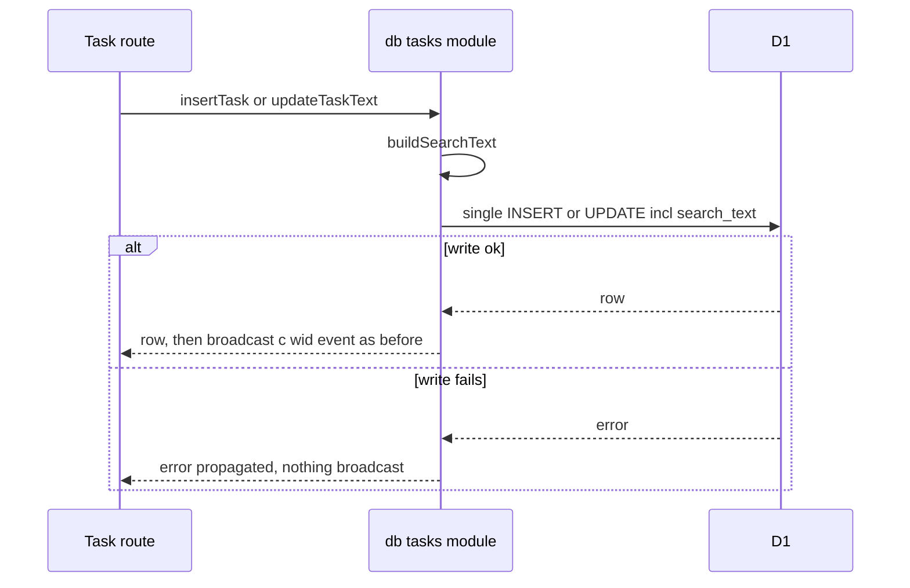

## Implementation
- `packages/shared/src/search.ts`: add `buildSearchText` next to story 7's `normaliseForSearch` (Delta to story 7 recorded in 'Deltas / extension points used').
- `apps/api/src/db/tasks.ts`: `insertTask` (story 5; story 7 projectId and story 8 dueDate variants go through it) and `updateTaskText` (story 6 PATCH name/description) compute and bind `search_text`. This is the single choke point; routes do not touch the column.
- No new live event; existing `task.upserted` and story 4's `broadcast(c, wid, event)` (D-26) are unchanged.

## Tests
Unit TC-01..TC-04. Integration TC-33..TC-35, TC-85. Boundary: request handling through the real route + D1, because the invariant is 'every write path'.

## Migration 0007 and backfill

> Anchor: `search.migration`

## Purpose
The `search_text` column holds each task's name and description already case-folded and accent-stripped by `buildSearchText`, so search.api can find tasks whose name or description contains every typed word, in any order (prd.task_matches), regardless of case and accents (prd.forgiving_match), with one `LIKE` per term on one column. This capability adds the column and fills it for existing rows.

## Contract
- `migrations/0007_task_search_text.sql` (numbered by build order, D-32: 0005 = story 9 rotation, 0006 = story 10 rate counters): `ALTER TABLE tasks ADD COLUMN search_text TEXT;` only (no CHECK, no DROP; passes story 1's safety scan). Existing index `(workspace_id, deleted, completed_at, sort_order)` bounds the scan to one workspace.
- `scripts/backfill-search-text.ts` (bun): `--env local|staging|production`; pages through `SELECT id, name, description FROM tasks WHERE search_text IS NULL LIMIT SEARCH_BACKFILL_BATCH` (`SEARCH_BACKFILL_BATCH = 500` in `limits.ts`), computes `buildSearchText` (the same accent- and case-folding the write paths use), writes `UPDATE tasks SET search_text=? WHERE id=? AND search_text IS NULL` in batches via `wrangler d1 execute --json`; loops until 0 rows; prints counts. Idempotent. Invoked by story 1's `scripts/deploy.ts` post-migration hook (Delta to story 1) **after migration 0007 has been applied** — or whenever NULL rows exist — so the backfill always runs against a schema that already contains 0005 and 0006.
- **Backfill note (D-32 renumbering):** the earlier draft number `0005_task_search_text.sql` was never shipped, so no renumbering migration is needed; the column is added exactly once by 0007. Only rows that existed before 0007 are NULL; story 11's write paths ship in the same deploy and never write NULL. Backfill is therefore a one-off per environment, and re-running is a no-op.
- Until backfilled, the search SQL matches `COALESCE(search_text, lower(name) || char(10) || lower(coalesce(description,'')))` so NULL rows are still found — every term, any order — but only ASCII case-insensitively; accent-insensitive matching for those rows starts once the backfill has run.
- Errors: backfill exits non-zero on any wrangler failure; deploy log records it; re-running resumes.

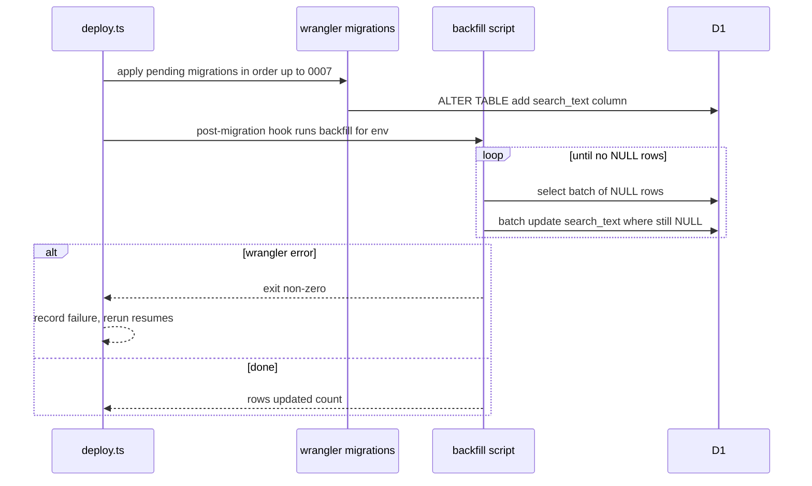

## Implementation
`migrations/0007_task_search_text.sql`, `scripts/backfill-search-text.ts`, hook registration in `scripts/deploy.ts` (story 1's post-migration hook list), fallback expression in `apps/api/src/db/search.ts`, `SEARCH_BACKFILL_BATCH` in `packages/shared/src/limits.ts`.

## Tests
Unit TC-14 (safety scan of the 0007 file). Integration TC-36 (NULL fallback), TC-37 (idempotent backfill, run against Miniflare D1 with migrations 0001–0007 through the script's D1 adapter; after backfill q='cafe' finds a pre-existing 'Café' row).

## Search endpoint

> Anchor: `search.api`

## Contract
`GET /api/w/:workspaceId/search?q=<string>&include_completed=true|false` (workspace-auth middleware; cookie-authenticated; same 404 for any access miss). Parameter name and values follow story 6's convention (D-31); there is no `completed=0|1` form.
- Params (`searchParamsSchema` in `packages/shared/src/schemas.ts`): `q` 1..`SEARCH_QUERY_MAX` (200) chars raw; `include_completed` `'true' | 'false'` (default `'false'`), parsed to boolean `includeCompleted`.
- Terms: `normaliseForSearch(q).split(' ')`, empty removed, deduped. If the joined normalised query is shorter than `SEARCH_MIN_CHARS` (2) -> `200 {tasks: [], truncated: false}` without touching D1.
- SQL (`buildSearchSql(terms, includeCompleted)`): `WHERE t.workspace_id=? AND t.deleted=0 AND (t.project_id IS NULL OR p.deleted=0)` + `[AND t.completed_at IS NULL]` when `!includeCompleted` + for each term `AND <text> LIKE ? ESCAPE '\\'` with `%` + `escapeLike(term)` + `%`; `LEFT JOIN projects p`; `LIMIT SEARCH_RESULT_LIMIT + 1`.
- 200 `{tasks: SearchHit[], truncated: boolean}`; `SearchHit = {id, name, projectId: string|null, dueDate: string|null, completedAt: string|null, matchedIn: 'name'|'description', version}`. Descriptions are not returned (keeps payload small; detail opens on demand).
- Errors (all `{error, message}`, mapped by the client by `body.error`, D-20): 400 `validation` (q missing/over 200, bad `include_completed`), 404 `not_found`, 410 `link_changed` (story 9's auth branch, cookie holds the previous secret), 405 `method_not_allowed` for non-GET. Headers: `Cache-Control: no-store` + story 1 security headers.

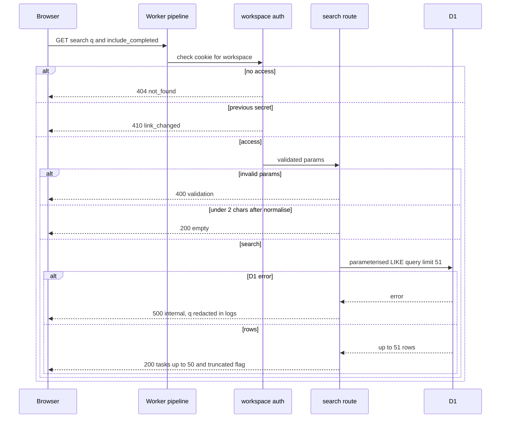

## Implementation
`apps/api/src/routes/search.ts` (Hono GET, registered in `app.ts` under the workspace router), `apps/api/src/db/search.ts` (`buildSearchSql`, `escapeLike`), schemas in `packages/shared/src/schemas.ts`, constants `SEARCH_QUERY_MAX`, `SEARCH_MIN_CHARS`, `SEARCH_RESULT_LIMIT` in `packages/shared/src/limits.ts`. All values bound as parameters; no string interpolation of user input.

## Tests
Equivalence classes for q: empty-after-normalise, 1 char, 2..200, >200, containing LIKE metacharacters, multi-term. Equivalence classes for `include_completed`: absent, 'true', 'false', invalid ('1', 'x'). Unit TC-05..TC-11. Integration TC-15..TC-31, TC-81. E2E TC-75. Boundary: request handling against real D1 because correctness is the SQL.

## Result ranking

> Anchor: `search.ranking`

## Contract
Order, applied in SQL and mirrored by the pure `rankKey(hit, terms)` used when live events re-sort the client cache:
1. open before completed (`completed_at IS NOT NULL`),
2. `matchedIn='name'` (every term found in the name part, i.e. before the '
') before description-only,
3. due date ascending with no date last,
4. `updated_at` descending,
5. `id` ascending (total order; stable across refetches).
Errors: none.

No flow of its own beyond search.api's sequence (ranking is part of the same query); it is listed separately because the client re-sorts on live patches and both implementations must agree.

## Implementation
SQL `ORDER BY` in `apps/api/src/db/search.ts`; `rankKey` in `packages/shared/src/search.ts` (shared so client and server agree); `matchedIn` computed in SQL with `instr(substr(text, 1, instr(text, char(10)) - 1), term) > 0` per term.

## Tests
Unit TC-12 (every tie-breaker level). Integration TC-21, TC-23 (DB ordering matches rankKey on the seeded fixture).

## Query privacy

> Anchor: `search.privacy`

## Contract
- `redactQuery(url: string): string` replaces the value of `q` with `[redacted]` for any path matching `/api/w/*/search`; other params (e.g. `include_completed`) and other paths are untouched.
- Story 1's request logging and error handler call `redactQuery` before emitting any URL (Delta to story 1: URL-redaction hook); the search route never logs params. Error reports never include the request URL unredacted.
- The search request is same-origin with `Cache-Control: no-store`; no third party receives it (story 2 no-leak rules).
- Recents never leave the browser (see finder.recent).
Errors: none.

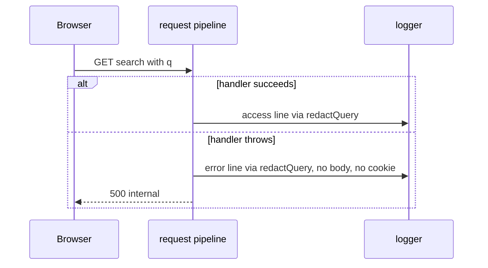

## Implementation
`apps/api/src/lib/redact.ts` (`redactQuery`), wired into `apps/api/src/middleware/request-id.ts` logging and `apps/api/src/lib/errors.ts` (story 1 files, via the hook recorded as a delta). Document in `docs/ops` runbook that Workers Logs must be checked for query strings after the first staging deploy (story 2 task 2.7 already inspects logs).

## Tests
Unit TC-13. Integration TC-32 (console spy across success and forced 500). E2E TC-80 (network capture + wrangler dev log scan).

## Live results while the Finder is open

> Anchor: `search.live_refresh`

## Contract
- `useSearchLiveSync(workspaceId)` mounted by the Finder while open registers via story 4 `registerLiveHandler` for `task.upserted`, `task.deleted`, `task.restored`, `tasks.bulk`, `project.deleted`, `project.restored`; unregisters on close.
- For each **single-task or project** event, `applySearchEvent(cache, event, {terms, includeCompleted})` (pure) patches every cached search entry under the prefix `queryKeys.search(wid)` (story 2 factory, D-37) via `setQueriesData`:
  - known task still matching -> replace (ignore if `event.version <= cached.version`), re-sort by `rankKey`;
  - known task no longer matching / deleted / completed while hidden / project deleted -> remove;
  - unknown task or restore -> `needsRefetch`.
- **`tasks.bulk` (`{ids, deleted?}`, D-25) has refetch semantics:** `applySearchEvent` returns `needsRefetch` and leaves the cache untouched; the handler never re-sorts or patches rows from bulk event data. The coalesced invalidation below refetches the search query, and the server's ordering replaces the cached order.
- `needsRefetch` schedules one `invalidateQueries({queryKey: queryKeys.search(wid)})` after `SEARCH_LIVE_REFRESH_MS` (500), coalescing bursts. Story 4's reconnect invalidation of `['ws', id]` also refreshes search.
- Selection: `nextSelection(prevItems, nextItems, selectedId)` keeps the id, else the item that followed it, else the last item. The action bar target is **not** moved by `nextSelection`: if the bar's task leaves the results, finder.results_actions returns focus to the input (TC-92).
Errors: a failed refetch leaves the patched cache and shows the Finder error state only if the user's own query fails.

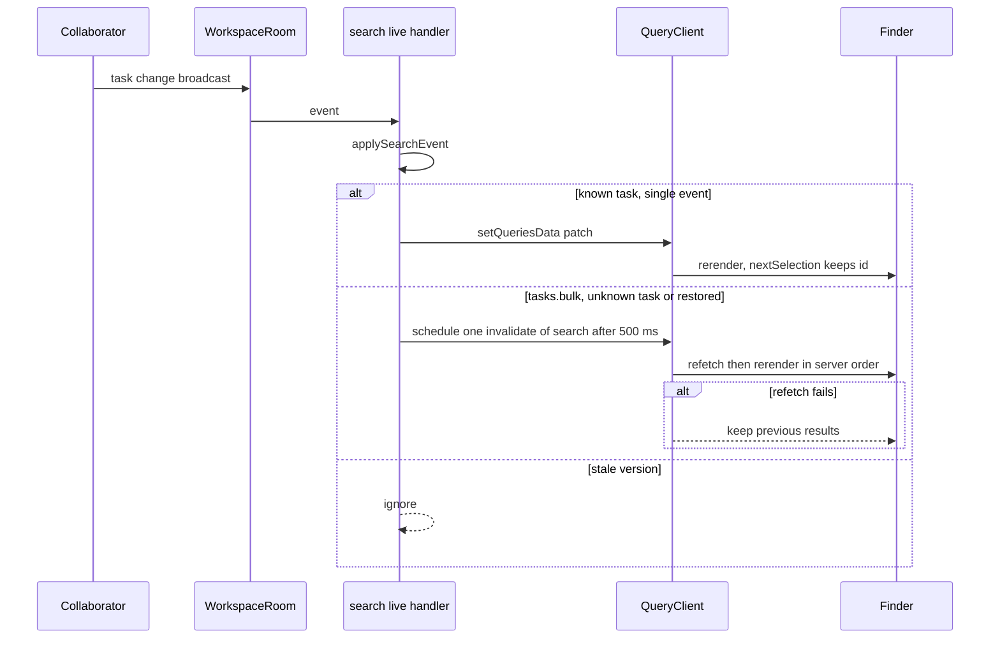

## Implementation
`apps/web/src/features/search/useSearchLiveSync.ts`, `apps/web/src/features/search/applySearchEvent.ts`, `apps/web/src/features/search/nextSelection.ts`. Batching per animation frame comes from story 4's notifyManager scheduler; results render from `useDeferredValue` so bursts never block typing. Keys only through `queryKeys.*`.

## Tests
Unit TC-42..TC-48, TC-97. UI TC-69..TC-71, TC-86, TC-88. E2E TC-76 (two contexts).

## Finder results view on the shared combobox

> Anchor: `finder.component`

## Contract
- `<FinderResults lists tasks query selectedId truncated />` renders inside story 7's `ResponsiveCommand` (Dialog, no anchor, on wide screens; Drawer below `MOBILE_BREAKPOINT_PX`, switched by story 5's `lib/useIsNarrow.ts`).
- Groups: 'Lists' (Today, Inbox, projects matched) then 'Tasks · N results'.
- Task option = story 7 `OptionRow` containing, in order: an inert checkbox glyph (`aria-hidden`, not a control), the `HighlightedText` name (terms located on the normalised string and mapped back to original indices), then story 5's **`TaskSummary`** as the summary line (D-01/D-43), which renders the list chip (project colour dot + name, or 'Inbox') and story 8's `features/dates/DateChip.tsx` through its own slots. The Finder builds `TaskSummary`'s input from `SearchHit`; there is no Finder-local chip or summary component. Completed tasks struck through with a 'Completed' text label (TaskSummary's status text).
- **Options contain no interactive children, on every screen size** (D-15): no buttons, links, checkboxes or `tabindex` inside `[role=option]`. The action bar lives outside the listbox (finder.results_actions).
- `truncated` -> footer 'Showing the first 50 — add another word to narrow it down.'
- Key-hint footer on hover-capable devices: '↑↓ move · Enter open · Tab actions · Esc close' (strings in `features/search/finderCopy.ts` so tests assert the constant).
- Rows are `React.memo` with primitive props; highlight ranges computed in a memoised selector keyed by `(id, name, q)`.
Errors: none of its own.

No sequence diagram: this capability is presentational and introduces no flow; its behaviour is exercised within F1 (finder.overlay).

## Implementation
`apps/web/src/features/search/FinderResults.tsx`, `apps/web/src/features/search/highlightRanges.ts` (maps normalised matches to original string indices), `apps/web/src/features/search/finderCopy.ts`; direct imports of `components/combobox/*`, story 5's `TaskSummary`, and (transitively) `features/dates/DateChip.tsx`.

## Tests
UI TC-58, TC-62, TC-95. E2E TC-75, TC-79.

## Finder overlay, querying and states

> Anchor: `finder.overlay`

## Contract
- `Finder` (lazy chunk `features/search/Finder.tsx` loaded through story 2's `lazyWithRetry`, D-42; exported `preloadFinder()`), opened through `useFinderStore` (`open(trigger)`, `close()`; stores the trigger element for focus return).
- **Overlay scope (D-14):** while open, the Finder pushes an entry on story 5's overlay scope stack, so global and grid shortcuts (Q, E, Space/Delete on rows, j/k, arrows, `?`, `/`, ⌘K, ⌘Z) are suppressed; it pops the entry on close. The Finder handles its own keys and calls `stopPropagation` on Escape so it never reaches quick add or a sheet underneath. Sub-pickers opened from the action bar push their own scope on top, so their Escape closes only themselves.
- **All typed keys are text.** The input's key handler only intercepts ↑/↓/Home/End/Enter (cmdk), Tab (finder.results_actions), and Escape. Space, letters (incl. 'd', 'm') and digits are never intercepted.
- Input placeholder `Search {workspaceName}…`; `maxLength` `SEARCH_QUERY_MAX`.
- **Lists** via `matchLists(query, {projects, includeToday:true})` from cached `useProjects` data + Today + Inbox (all normalised with story 7's `normaliseForSearch`), computed synchronously each keystroke. Works offline (D-10) because it reads cached data only.
- **Tasks** via `useQuery({queryKey: queryKeys.search(wid, {q: debouncedQ, includeCompleted}), queryFn: ({signal}) => api.search(wid, debouncedQ, includeCompleted, {signal}), enabled: debouncedQ normalised length >= SEARCH_MIN_CHARS && !offline, placeholderData: keepPreviousData, staleTime: 0})`. `api.search` sends `include_completed=true|false` (D-31). `debouncedQ` = query debounced `SEARCH_DEBOUNCE_MS` (150). Previous in-flight request is aborted through the Query signal. The key comes from story 2's factory (D-37); story 11 writes no key arrays.
- Rendering from `useDeferredValue(results)`; skeleton rows only when `isFetching && !data` for more than `SEARCH_SKELETON_DELAY_MS` (300).
- States: EmptyQuery (recents + Today, Inbox, `FINDER_RECENT_PROJECTS` projects), ListsOnly, Loading, Results, NoResults (first option 'Add task "{q}" → {current list}' using story 5 `useCreateTask` with the QuickAdd target `{kind:'inbox'} | {kind:'project', projectId}` of the current view, D-40; then 'Try including completed tasks' when off), Error ('Search failed. Try again', keeps text and previous results), Offline (from story 4's offline store; lists still work; 'Can't search tasks while offline').
- 'Include completed' checkbox persisted per browser under `tdl:v1:search:completed` (try/catch).
- Escape: clears nothing, closes; focus returns to the stored trigger (fallback `#view-title`).
- **Errors (typed, D-20):** `api.search` throws story 2's typed errors mapped by `body.error`. `NotFoundError` and `LinkChangedError` → Finder closes and the error is rethrown (`throwOnError` predicate) to `ApiErrorBoundary`, which renders NotFound / LinkChanged. Any other `ApiError` (incl. `RateLimitedError`, 500, network) → the Finder's Error state with Try again; text and previous results kept.

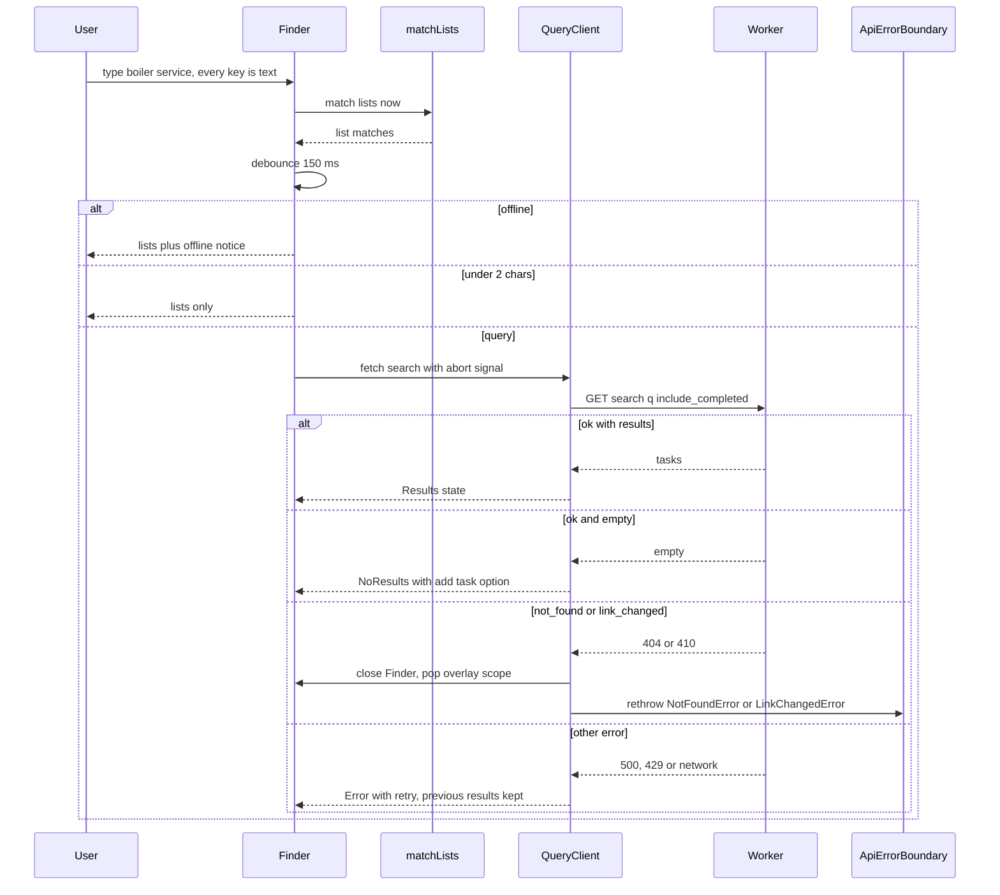

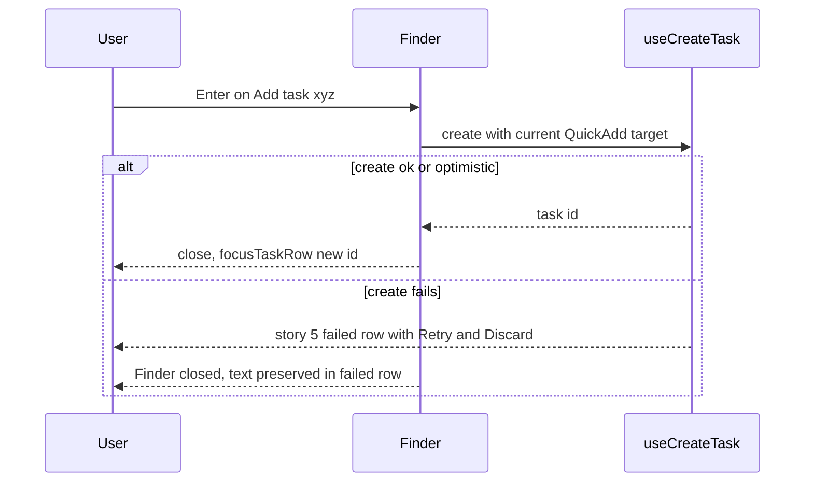

## Implementation
`apps/web/src/features/search/Finder.tsx` (lazy via `lazyWithRetry`), `useFinderStore.ts` (tiny external store, `useSyncExternalStore`, boolean snapshot for `isOpen`), `matchLists.ts`, `searchQuery.ts` (query options, `throwOnError` predicate for NotFound/LinkChanged), `api.ts` addition `search()`. Constants in `limits.ts`: `SEARCH_DEBOUNCE_MS`, `SEARCH_SKELETON_DELAY_MS`, `FINDER_RECENT_PROJECTS`, `SEARCH_QUERY_MAX`, `SEARCH_MIN_CHARS`. No edits to `queryKeys.ts` (story 2 defines `search`).

## Tests
Equivalence classes for Finder state as in the state diagram (exhaustive). Unit TC-40, TC-41. UI TC-55..TC-64, TC-72, TC-82, TC-87, TC-89, TC-90, TC-94, TC-98. E2E TC-75, TC-77, TC-99.

## Open in context and act from the action bar

> Anchor: `finder.results_actions`

## Contract
**Open (F3).**
- Enter/tap on a **task**: navigate with story 7's fragment-preserving `useWorkspaceNavigate` (D-13) to `workspacePath(wid, view)` (story 2, D-12) where `view` is the task's list (Inbox when `projectId` is null, else `project/:projectId`); after the route commits, story 5's `focusTaskRow(task.id)` (D-04) and story 6's `openTaskDetail(task.id, {returnFocusTo: <the focused row>})` (D-05); Finder closes. If the task is completed, the list opens with 'Show completed' enabled for that list. There is no `listRoute()`.
- Enter/tap on a **list**: navigate to `workspacePath(wid, view)`; close.

**Action bar (F4, D-15).** `<FinderActionBar taskId taskName completed />` is rendered **below the listbox, outside every option**, whenever a **task** option is highlighted (hidden when a list or 'Add task' option is highlighted).
- `role=toolbar`, `aria-label='Actions for "{taskName}"'`, `aria-controls` = the listbox id. Buttons: **Complete** (**Reopen** when `completed`), **Set date**, **Move**. Single Tab stop with roving `tabindex`.
- Keys: **Tab** in the input with a task highlighted → focus the bar's first enabled button (the input handler `preventDefault`s only in that case; otherwise Tab follows the dialog's normal focus order). **←/→** move between buttons, no wrap; **Home/End** first/last; **Enter/Space** activate; **Shift+Tab** → back to the input with the same option highlighted; **Escape** closes the Finder (same rule as the input).
- The bar is **bound to the task id it was focused for**. If that id leaves the results (live delete, completed while hidden, moved out of the query), focus returns to the input, the bar re-renders for the new highlight, and no pending action is applied (TC-92).
- **Complete / Reopen:** story 6's `features/tasks/mutations.ts` complete (or reopen) mutation, then `showUndoToast({message, onUndo})` (D-41) with `message = 'Completed "{name}"'`. The Finder also renders `<FinderStatusLine message onUndo />` — `role=status`, outside the listbox, text 'Completed "{name}" · Undo' with an **Undo** button calling the **same** `onUndo` — because the modal Finder makes the global toast unreachable. The line clears after `UNDO_WINDOW_MS`, on Undo, or when the query changes. After Complete focus returns to the input and the highlight follows `nextSelection`.
- **Set date:** story 8's `openDatePicker(taskId, {returnFocusTo: <Set date button>})` with **no anchor** (centred dialog on desktop, bottom sheet on phones, D-05). The Finder stays open underneath; the picker pushes its own overlay scope.
- **Move:** story 7's `openMovePicker(taskId, {returnFocusTo: <Move button>})` (D-05). Same stacking.
- When a picker closes, focus returns to its button if the bar still targets that task, else to the input (D-19 fallback).
- **Gating (D-10):** the bar and the status line are portalled with the Finder, outside the shell fieldset, so they gate themselves with `useCanEdit()`: while `!canEdit` the three buttons and Undo are `aria-disabled` and the bar shows 'Offline — actions unavailable'. Opening results still works.
- The mouse can click bar buttons directly. Touch: see finder.mobile (long-press shows the bar).
- Results update through search.live_refresh and the mutation's own cache updates.

Errors: mutation failures use story 6's rollback + toast; `GoneError{entity:'task'}` (D-20) → row removed, 'This task was deleted' toast, status line not shown; `GoneError{entity:'project'}` from Move → story 7's handling. Errors raised by the pickers stay inside the pickers.

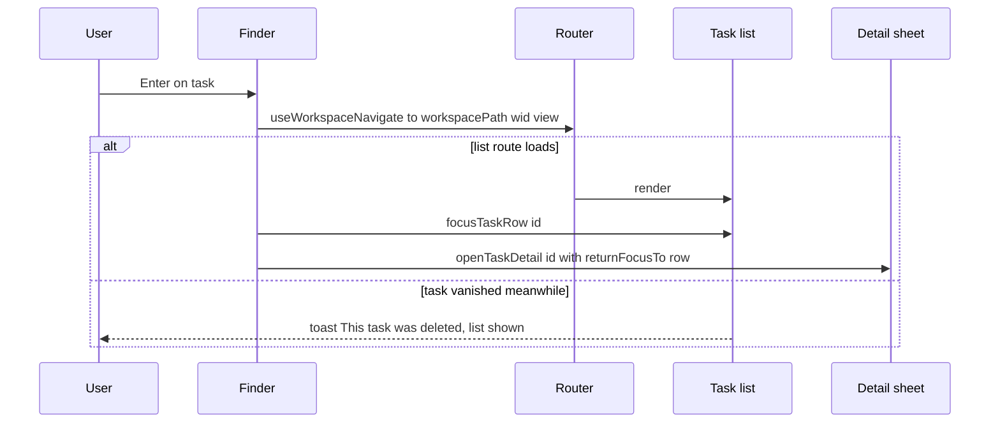

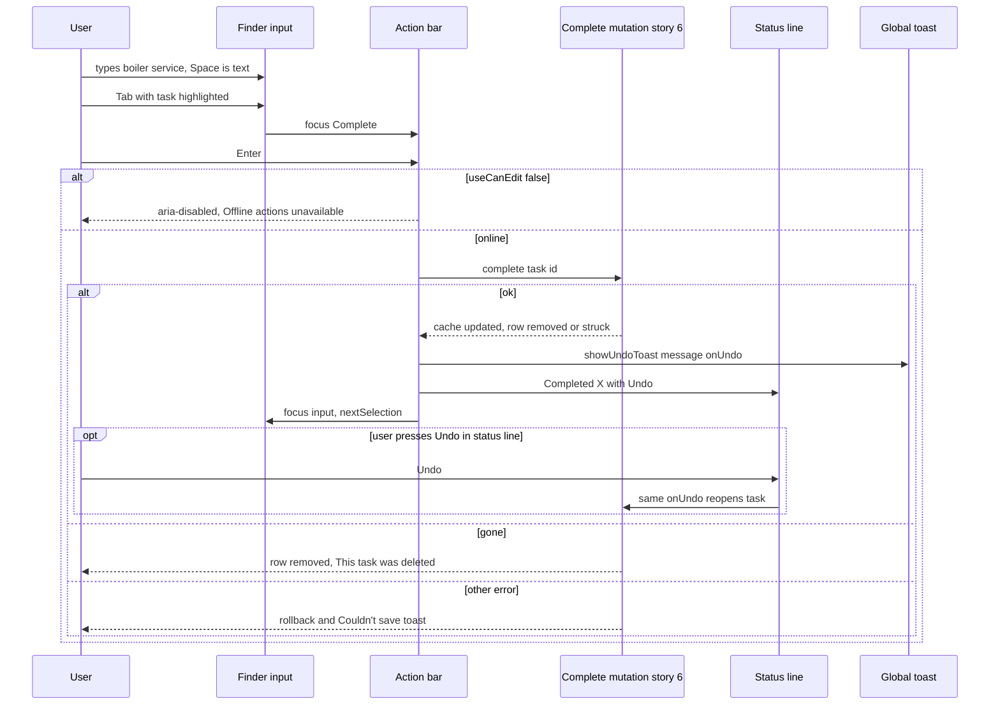

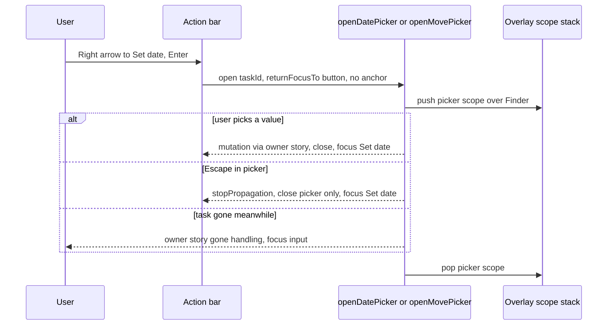

## Implementation
`apps/web/src/features/search/useFinderActions.ts` (open task / open list), `apps/web/src/features/search/FinderActionBar.tsx`, `apps/web/src/features/search/FinderStatusLine.tsx`, `apps/web/src/features/search/finderCopy.ts` (status, hint and label strings). Imports by direct path: story 2 `workspacePath`, story 7 `useWorkspaceNavigate`/`openMovePicker`, story 5 `useTaskGrid`, story 6 `mutations.ts`/`showUndoToast`/`openTaskDetail`, story 8 `openDatePicker`, story 4 `useCanEdit`. `UNDO_WINDOW_MS` from `limits.ts`.

## Tests
UI TC-65..TC-68, TC-89..TC-94, TC-96. E2E TC-75, TC-78, TC-99, TC-100.

## Recent searches (browser-local)

> Anchor: `finder.recent`

## Contract
- `recentStore` over `localStorage` key `tdl:v1:recent:{workspaceId}` holding `string[]` (normalised display text as typed, trimmed).
- `add(q)`: on opening a result or adding from search (not per keystroke); dedupe (case-insensitive), move to front, cap `SEARCH_RECENT_MAX` (5). `list()`, `clear()`.
- Storage unavailable or corrupt -> behaves as empty, never throws; corrupt value is overwritten on next add.
- Never sent over the network.
Errors: none surfaced.

No sequence diagram: local synchronous store with no flow beyond read/write; its UI use is inside finder.overlay's EmptyQuery state.

## Implementation
`apps/web/src/features/search/recentStore.ts` (reads cached in a module-level variable per workspace, `js-cache-storage`), 'Clear recent' button in the EmptyQuery view.

## Tests
Unit TC-49. UI TC-55, TC-84.

## Entry points and preloading

> Anchor: `finder.entry_points`

## Contract
- `useFinderShortcuts()` mounted once in the workspace shell registers through story 5's registry with its final signature (D-14): `useGlobalShortcut({key:'/', scope:'global', description:'Search'})` and `useGlobalShortcut({key:'k', modifiers:['mod'], scope:'global', description:'Search'})`, both bound to the open handler. Neither sets `allowInOverlay`, so both are suppressed while any overlay (including the Finder itself) is open. `isTypingTarget` suppresses `/` in fields; IME composition is ignored. Both are listed in the '?' panel automatically.
- `<SidebarSearchField />` passed as story 5's `searchSlot` (AppShell named prop, D-11): a button styled as a field ('Search…' + platform hint ⌘K / Ctrl K), label 'Search {workspace}'. Preloads the Finder chunk on pointerenter/focus.
- `<HeaderSearchButton />` passed as story 5's `headerActionsSlot`, rendered only when `useIsNarrow()` (`lib/useIsNarrow.ts`), `aria-label='Search'`, 44 px target, per-icon deep lucide import (no barrel, D-43).
- The first `/` or mod+K press calls `preloadFinder()` before opening (chunk usually already preloaded by idle callback after first paint).
Errors: chunk load failure -> story 2's `lazyWithRetry` (D-42) retries, then toast 'Couldn't open search — try again'.

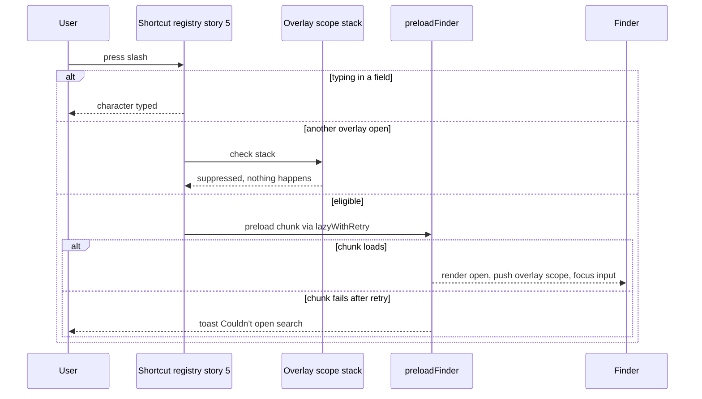

## Implementation
`apps/web/src/features/search/useFinderShortcuts.ts`, `SidebarSearchField.tsx`, `HeaderSearchButton.tsx`, mounted from `apps/web/src/routes/Workspace.tsx` into story 5's slots; idle preload via `requestIdleCallback` after first paint.

## Tests
UI TC-50..TC-54, TC-83, TC-94. E2E TC-75, TC-78.

## Phone layout

> Anchor: `finder.mobile`

## Contract
- Entry on narrow screens: the sidebar field is inside the closed navigation drawer, so the always-visible entry point is `<HeaderSearchButton />`. It is a 🔍 icon button, at least 44 px, `aria-label='Search'`, placed in story 5's `headerActionsSlot` beside ☰ (see finder.entry_points). Tapping it opens this sheet with the input focused.
- Below `MOBILE_BREAKPOINT_PX` (via `lib/useIsNarrow.ts`), `ResponsiveCommand` renders a full-height `Drawer`. Its header row holds a back arrow (closes), the input with `enterKeyHint='search'`, and a clear ×.
- Task options are at least `FINDER_MOBILE_ROW_PX` (56) tall and contain **no interactive children** (D-15): no Complete button inside the row, and **no swipe** (D-09; `useSwipeToComplete` and `SWIPE_COMPLETE_PX` do not exist).
- **Tap** on a result opens it (finder.results_actions F3).
- **Press and hold** a task result for `FINDER_LONG_PRESS_MS` (500, `limits.ts`) highlights it and shows the same `FinderActionBar` (Complete, Set date, Move) docked at the bottom of the sheet above the on-screen keyboard, buttons ≥ `MIN_TOUCH_TARGET_PX` (44). Movement beyond `FINDER_LONG_PRESS_SLOP_PX` (10) or scrolling cancels the hold; releasing after a hold does not open the task. `contextmenu` is prevented and `-webkit-touch-callout: none` set on options so the OS menu does not appear. Tapping outside the bar or on another result hides it.
- Actions from the bar use exactly the path in finder.results_actions, including the inline status line with Undo and `useCanEdit()` gating; pickers open unanchored as bottom sheets.
- The key-hint footer is hidden under `@media (hover: none)`.
- The on-screen keyboard never covers the input: the sheet is top-aligned and the results scroll.

Errors: as finder.results_actions.

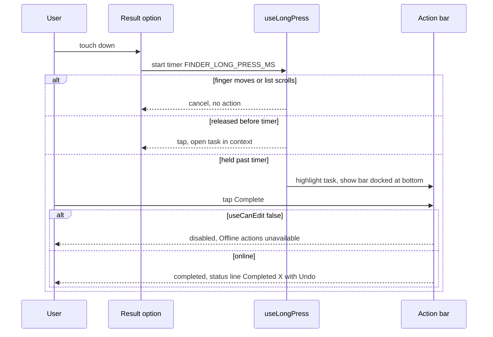

## Implementation
`apps/web/src/features/search/FinderMobileHeader.tsx`, `apps/web/src/features/search/useLongPress.ts` (pointer events, passive listeners, one timer, cancels on move/scroll/pointercancel), docking styles for `FinderActionBar` in narrow mode. The header button is `HeaderSearchButton.tsx` (shared with finder.entry_points). Constants `FINDER_MOBILE_ROW_PX`, `FINDER_LONG_PRESS_MS`, `FINDER_LONG_PRESS_SLOP_PX` live in `limits.ts`.

## Tests
- UI TC-53: in narrow mode, the header icon opens the Finder.
- UI TC-74: the sheet layout, long-press shows the bar, no buttons inside options, no swipe handler.
- UI TC-95: no interactive descendants in options at 375 px.
- E2E TC-78 (`@mobile`, mobile-webkit and mobile-chromium): tap the header icon, search, long-press a result, tap Complete, status line Undo works.

## Accessibility

> Anchor: `finder.a11y`

## Contract
- cmdk provides `role=combobox` on the input with `aria-controls`/`aria-activedescendant` and `role=listbox`/`option` for results; groups have `role=group` + `aria-label`. **Options have no interactive descendants** (axe `nested-interactive` passes, D-15).
- Action bar: `role=toolbar`, `aria-label='Actions for "{task name}"'`, `aria-orientation=horizontal`, roving tabindex, rendered as a sibling after the listbox (never inside it). Disabled offline via `aria-disabled` plus visible text, so it stays discoverable.
- Status line: `FinderStatusLine` is its own `role=status` (polite) region, outside the listbox, containing text and an Undo button.
- Visible label: visually hidden `<label>` 'Search {workspace}' plus placeholder.
- Result count announcer: one `role=status` polite region updated at most every `SEARCH_ANNOUNCE_THROTTLE_MS` (500) with 'N results' / 'No tasks match'; individual live changes are not announced.
- Focus trapped in the overlay (Radix); Tab order inside the dialog: input → action bar (only when a task is highlighted) → status line Undo (when shown) → Include completed → close. Escape closes; focus returns to trigger (finder.overlay). Sub-pickers return focus to the bar button that opened them.
- `<mark>` styling: bold + background token meeting 3:1 against row background in light and dark; text 4.5:1. Tokens are entries in story 2's `packages/shared/src/tokens.ts` (D-42), generated into `styles/tokens.css`.
Errors: none.

No sequence diagram: no flow of its own; it constrains F1-F9 rendering.

## Implementation
`apps/web/src/features/search/ResultAnnouncer.tsx` (throttled via a ref timestamp, `rerender-use-ref-transient-values`), `--mark-bg`/`--mark-fg` entries added to `packages/shared/src/tokens.ts` (story 2 generator emits `tokens.css`; story 2's contrast checker verifies them).

## Tests
UI TC-72, TC-73, TC-91, TC-95. E2E TC-79 (axe light+dark with results **and the action bar visible**, roles).

