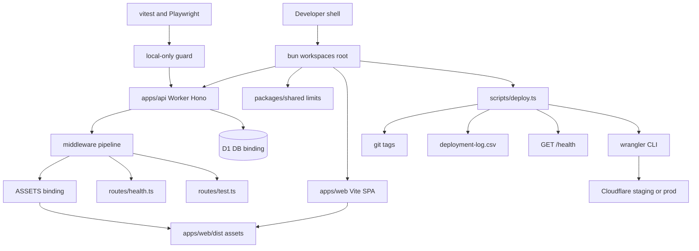
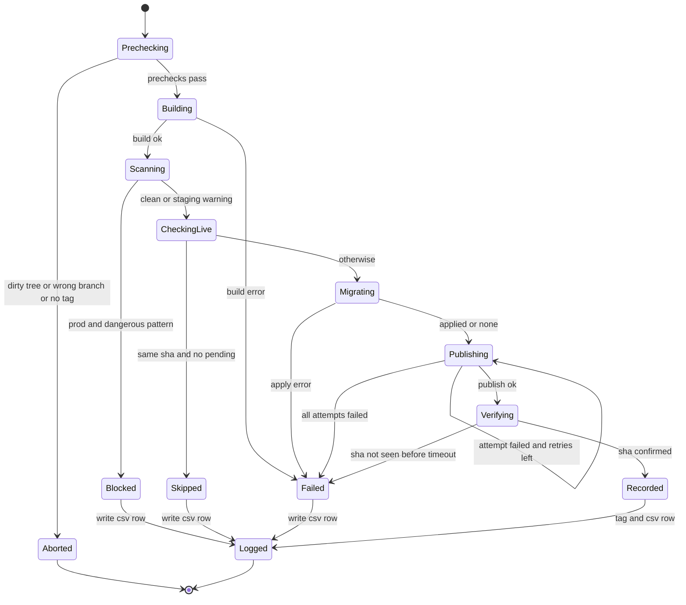
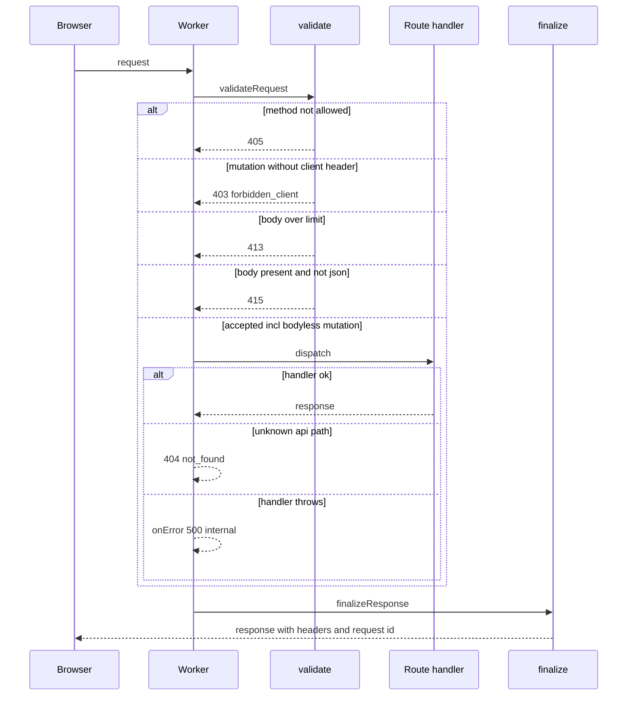
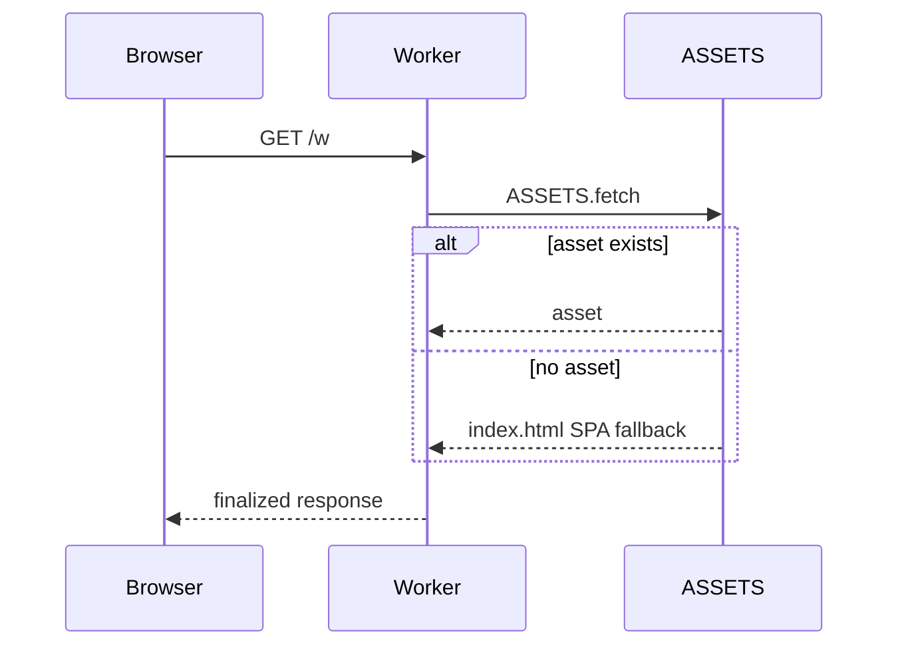
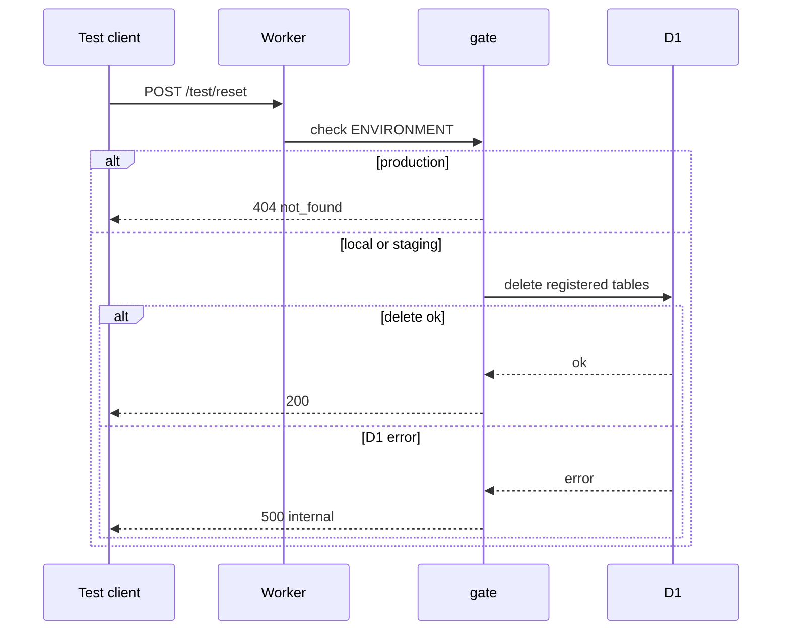
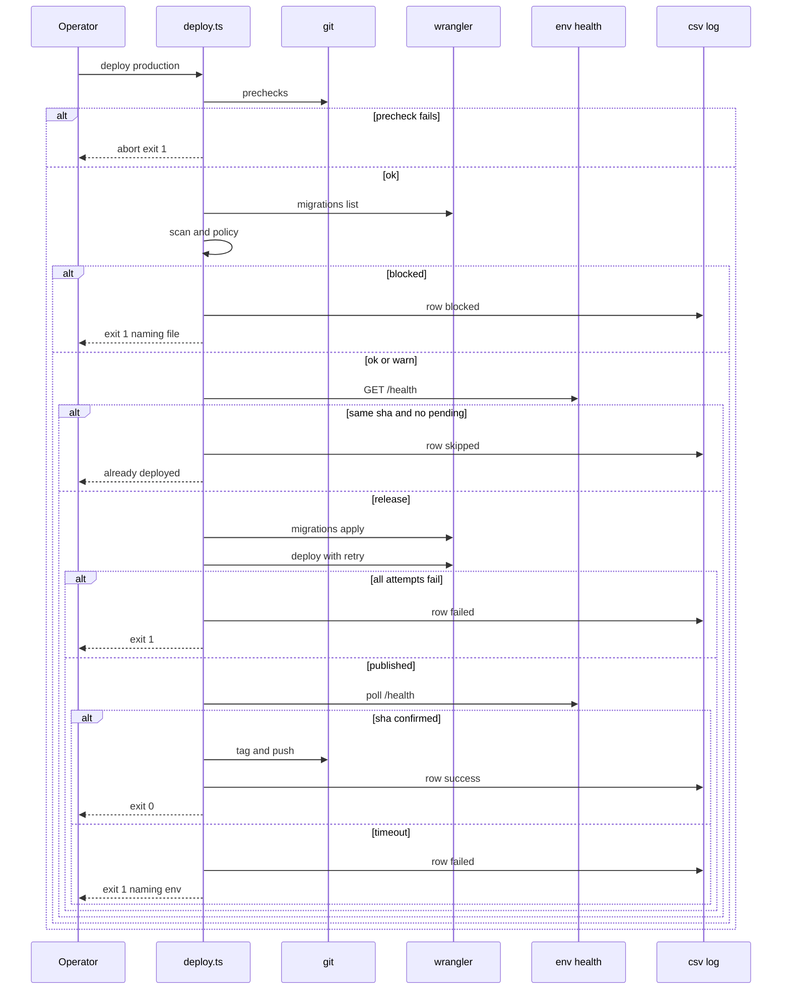

# Technical Design

Bun-workspace monorepo; one Worker (Hono) serving API + SPA assets; request pipeline with security headers; health with version injection; vitest-pool-workers/vitest/Playwright harness guarded to local; bun deploy script with safety scan, idempotency, retry, verification, tags and CSV log.

## Overview

Story 1 creates the deployable skeleton every later story ships through. It implements docs/architecture.md sections 1-3, 6 (pipeline, health, test routes) and 9-10 (constants, test levels). It introduces no D1 tables (0001 belongs to story 2) and does NOT declare the WorkspaceRoom Durable Object binding: a DO binding requires an exported class plus a DO migration tag, which is owned by story 4. wrangler.toml carries a commented placeholder only.

Key decisions:
- Worker runs first for every request (`assets.run_worker_first = true`) so that X-Request-Id and security headers are applied to SPA/asset responses too (PRD: every response). The Worker delegates non-API paths to `env.ASSETS.fetch` and finalizes the result. Cache-Control no-store is applied only to /api, /health and /test paths so hashed assets stay cacheable.
- Version metadata is injected at deploy time via `wrangler deploy --var APP_VERSION:.. --var GIT_SHA:.. --var DEPLOYED_AT:..`; local defaults are `dev`/null.
- Deploy tooling is a bun TypeScript program (`scripts/deploy.ts` + `scripts/deploy/*.ts`) with all side-effecting operations injected (`DeployDeps`) so units are pure and integration tests can substitute only the Cloudflare boundary (a fake `wrangler` executable) while git, filesystem and HTTP health are real.
- Error codes added to the architecture list (extension, not change): `method_not_allowed` (405), `unsupported_media_type` (415), `payload_too_large` (413).

## Structure



## State

The release pipeline has persisted outcomes (git tags, CSV log rows, D1 migration state, deployed Worker version), so its lifecycle is modelled:



D1 migration files move pending -> applied only via `wrangler d1 migrations apply` inside Migrating; there is no automatic rollback (out of scope).

## Test Strategy

## Test Scopes

| Level | Runner / config | Boundary exercised | Why sufficient |
|---|---|---|---|
| unit | vitest (`apps/api/vitest.config.ts` pool-workers for api units; `scripts/vitest.config.ts` node pool for deploy units) | pure functions: validateRequest, hasBody, finalizeResponse, buildHealth, assertLocalTestEnv, scanMigrations, applyScanPolicy, shouldSkipRelease, withRetry, verifyHealth, formatCsvRow | all branching logic lives here; deterministic via injected clock/sleep/fetch |
| integration (api) | vitest-pool-workers `SELF.fetch` | full Worker request handling: Hono routing, middleware, ASSETS, real Miniflare D1 | the structure diagram shows a request-handling boundary, so it is exercised end to end in workerd |
| integration (deploy) | vitest node pool, `scripts/test/*.int.test.ts` | runRelease end to end with real temp git repo, real filesystem, real local HTTP health server; only the Cloudflare boundary (wrangler executable) is faked | proves step ordering, gating and recording without touching Cloudflare |
| e2e | Playwright (`e2e/`), webServer = `bun run dev` | real browser -> wrangler dev -> assets + API | proves the developer golden path and headers on a real document load |
| ui-component | not used in this story: the only UI is a static landing placeholder with no interactive behaviour; covered by e2e TC-C03 | n/a reason stated | n/a reason stated |

Dimensions crossed: (1) path class {api route, api unknown, health, test route, SPA/asset}; (2) request shape {valid GET, JSON mutation with body, bodyless mutation, oversize, body with non-JSON content type, mutation missing client header (with or without body), disallowed method, handler throws}; (3) environment {local, staging, production}; (4) release condition {clean, dirty tree, wrong branch, missing tag, dangerous migration, already live, publish flaky, publish down, verify timeout}.

## Request pipeline cases (platform.request_pipeline)

Equivalence classes of request shape are exhaustive and non-overlapping: (a) non-mutating allowed method; (b) mutation with client header and no body; (c) mutation with client header, JSON body within limit; (d) mutation with client header, body over limit; (e) mutation with client header, body present with non-JSON content type; (f) mutation without client header (any body state); (g) disallowed method. Check order is method -> client header -> size -> content type. Boundaries: body exactly MAX_BODY_BYTES (accepted) and MAX_BODY_BYTES+1 (rejected); zero-length body with no Content-Type (accepted, class b).

| TC | Level | Path class | Request shape | Env | Expected |
|---|---|---|---|---|---|
| TC-P01 | unit | api route | GET, no body (class a) | local | valid |
| TC-P02 | unit | api route | POST json + client header, 1,048,576 bytes (class c boundary) | local | valid |
| TC-P03 | unit | api route | POST content-length 1,048,577 (class d) | local | 413 payload_too_large |
| TC-P04 | unit | api route | POST chunked body without content-length exceeding limit (class d) | local | 413 payload_too_large, stream read stops at limit+1 |
| TC-P05 | unit | api route | POST with body, text/plain, client header (class e) | local | 415 unsupported_media_type |
| TC-P06 | unit | api route | POST json body without X-Todoodle-Client (class f) | local | 403 forbidden_client |
| TC-P07 | unit | api route | PUT and TRACE (class g) | local | 405 method_not_allowed |
| TC-P08 | unit | api route | POST with client header, no body, no Content-Type (class b) | local | valid (not 415) |
| TC-P09 | unit | any | finalizeResponse on handler response that set its own Referrer-Policy | local | all baseline headers set, handler value overridden, status and body preserved |
| TC-P10 | unit | any | two consecutive requests | local | X-Request-Id is a UUID and differs |
| TC-P18 | unit | api route | DELETE with client header, no body, no Content-Type (class b) | local | valid |
| TC-P19 | unit | api route | DELETE no body without X-Todoodle-Client (class f) | local | 403 forbidden_client |
| TC-P20 | unit | api route | PATCH with body and no Content-Type header (class e) | local | 415 unsupported_media_type |
| TC-P21 | unit | api route | hasBody: Content-Length 0 / absent without Transfer-Encoding / Transfer-Encoding chunked | local | false / false / true |
| TC-P11 | integration | health | GET /api/health | local | 200; nosniff, DENY, CSP, no-referrer, no-store, X-Request-Id present |
| TC-P12 | integration | api unknown | GET /api/nope | local | 404 {error:not_found}; baseline headers present |
| TC-P13 | integration | test route | GET /test/throw (handler throws, cookie `tdl_ws=SECRETVALUE` sent) | local | 500 {error:internal}; body has no stack; captured console output contains neither SECRETVALUE nor request body |
| TC-P14 | integration | SPA/asset | GET / and GET /w | local | 200 text/html index; no-referrer + X-Request-Id present |
| TC-P15 | integration | api route | POST oversize with client header to /api/health | local | 413 before routing (not 405) |
| TC-P16 | integration | SPA/asset | GET hashed /assets/*.js | local | no `no-store`; X-Request-Id present |
| TC-P17 | e2e | SPA/asset | browser loads / | local | document response carries baseline headers; meta referrer no-referrer present; every network request is same-origin |

Negative: TC-P03..P07, TC-P19, TC-P20 and TC-P15 assert the handler is NOT invoked (spy route counter stays 0 before/after). TC-P08/TC-P18 assert a bodyless mutation is NOT rejected for missing Content-Type.

## Health cases (health.report)

Classes: vars fully injected (released env) vs vars absent (local). Paths: /health and /api/health must be byte-identical bodies.

| TC | Level | Path | Vars | Expected |
|---|---|---|---|---|
| TC-H01 | unit | n/a (pure builder, path handled by router) | APP_VERSION v1.2.0, GIT_SHA 40-hex, DEPLOYED_AT ISO, ENVIRONMENT staging | {status:ok, environment:staging, version:v1.2.0, git_sha:<40hex>, deployed_at:<iso>} |
| TC-H02 | unit | n/a (pure builder) | none set | {status:ok, environment:local, version:dev, git_sha:dev, deployed_at:null} |
| TC-H03 | integration | /health | local defaults | 200 JSON matching TC-H02 |
| TC-H04 | integration | /api/health | local defaults | body identical to TC-H03 |
| TC-H05 | integration | /health | POST with client header, no body | 405 method_not_allowed |
| TC-H06 | integration | /health | miniflare bindings override vars as staging | reports staging values from TC-H01 |

## Test isolation cases (testing.isolation)

| TC | Level | Input | Expected |
|---|---|---|---|
| TC-I01 | unit | assertLocalTestEnv({ENVIRONMENT:local}) | passes |
| TC-I02 | unit | ENVIRONMENT staging | throws naming staging |
| TC-I03 | unit | ENVIRONMENT production | throws naming production |
| TC-I04 | unit | ENVIRONMENT missing | throws |
| TC-I05 | unit | Playwright globalSetup with injected fetch returning environment staging | throws, no specs run |
| TC-I06 | integration | test A inserts into scratch table, test B counts rows | B sees 0 (isolated storage per test) |
| TC-I07 | integration | inside pool-workers read env.ENVIRONMENT | equals local (setup file guard ran) |

## Test route gating cases (testing.test_routes)

Test routes are called with `X-Todoodle-Client: web` like any mutation.

| TC | Level | Env | Route | Before | Expected / after |
|---|---|---|---|---|---|
| TC-T01 | integration | local | POST /test/reset (bodyless) | scratch table has 3 rows | 200; 0 rows |
| TC-T02 | integration | production | POST /test/reset | 3 rows | 404 body identical to unknown-route 404; still 3 rows |
| TC-T03 | integration | staging | POST /test/reset | 3 rows | 200; 0 rows |
| TC-T04 | integration | production | GET /test/throw | not applicable: read-only route, no state | 404 not 500 |
| TC-T05 | integration | local | POST /test/unknown | not applicable: no state touched | 404 not_found |

## Safety scan cases (deploy.safety_scan)

Patterns (DANGEROUS_MIGRATION_PATTERNS): `CHECK (`, `DROP TABLE`, `TRUNCATE TABLE`, `ALTER TABLE .. MODIFY`, `ALTER TABLE .. CHANGE`, `ADD CONSTRAINT`, `DROP CONSTRAINT`. Exception: DROP TABLE of names ending `_new`, `_old`, `_temp`, `_backup`. Scan is case-insensitive over raw SQL including comments (a false positive blocks, which is the safe failure).

| TC | Level | Env | Pending files | Expected |
|---|---|---|---|---|
| TC-S01 | unit | any | none | findings [] -> ok |
| TC-S02 | unit | any | CREATE TABLE + ALTER ADD COLUMN | ok |
| TC-S03 | unit | any | one file per pattern (7 parameterised) | one finding naming file and pattern each |
| TC-S04 | unit | any | lowercase `drop table tasks` | finding |
| TC-S05 | unit | any | `DROP TABLE tasks_temp` / `DROP TABLE tasks_temporary` | none / finding (boundary on suffix) |
| TC-S06 | unit | any | 2 files, 3 findings | all 3 listed, ordered by file then line |
| TC-S07 | unit | production / staging / either | findings / findings / none | block / warn / ok |
| TC-S08 | integration | production | real temp migrations dir with DROP TABLE | exit 1, output names file, fake wrangler log has no `migrations apply` or `deploy`, CSV row status blocked |
| TC-S09 | integration | staging | same file | warning printed with file name, release continues to success |

## Idempotency cases (deploy.idempotency)

| TC | Level | Deployed sha | Target sha | Pending | Expected |
|---|---|---|---|---|---|
| TC-D01 | unit | A | A | 0 | skip |
| TC-D02 | unit | A | A | 1 | release |
| TC-D03 | unit | A | B | 0 | release |
| TC-D04 | unit | unreachable / non-JSON health | B | 0 | release (unknown treated as not live) |
| TC-D05 | unit | dev | B | 0 | release |

## Retry cases (deploy.retry)

| TC | Level | Outcomes per attempt | Expected |
|---|---|---|---|
| TC-R01 | unit | ok | 1 call, 0 sleeps |
| TC-R02 | unit | fail, fail, ok | 3 calls, sleeps [base, 2*base], onAttempt called 3 times |
| TC-R03 | unit | fail x3 | throws last error, 3 calls, 2 sleeps (none after final) |
| TC-R04 | unit | attempts=1, fail | throws, 0 sleeps (boundary) |

## Verify and record cases (deploy.verify_record)

| TC | Level | Input | Expected |
|---|---|---|---|
| TC-V01 | unit | health returns target sha on first poll | ok after 1 fetch |
| TC-V02 | unit | old sha, then target | ok after 2 fetches, 1 sleep |
| TC-V03 | unit | old sha until timeout | fail, error includes env and last seen sha |
| TC-V04 | unit | fetch throws then 500 then target | ok (transient errors keep polling) |
| TC-V05 | unit | operator name `Doe, "J"` | CSV field quoted and escaped |
| TC-V06 | integration | temp dir without log / with 1 row | header+row created / 2 rows after (before-after count) |
| TC-V07 | integration | real temp git repo | tag `deploy/staging/YYYYMMDD-HHMMSS` exists at HEAD after success |

## Release pipeline cases (deploy.pipeline)

All use a real temp git repo, real fs, a real local HTTP server posing as /health, and a fake `wrangler` script first on PATH that records argv and returns scripted output.

| TC | Level | Env | Condition | Expected |
|---|---|---|---|---|
| TC-L01 | integration | staging | clean, 1 pending migration, health flips to new sha | order: build, migrations list, migrations apply, deploy with --var GIT_SHA/APP_VERSION/DEPLOYED_AT; tag; CSV success |
| TC-L02 | integration | production | dirty tree | exit 1 before any wrangler call; no CSV row; no tag |
| TC-L03 | integration | production | no semver tag at HEAD | exit 1 before any wrangler call |
| TC-L04 | integration | production | branch not main | exit 1 before any wrangler call |
| TC-L05 | integration | production | dangerous migration | see TC-S08 |
| TC-L06 | integration | staging | health already reports HEAD sha, 0 pending | prints already deployed; no deploy call; CSV skipped; exit 0 |
| TC-L07 | integration | staging | deploy fails twice then ok | 3 deploy calls, each attempt printed, success |
| TC-L08 | integration | staging | deploy fails 3 times | exit 1, CSV failed, no deploy tag |
| TC-L09 | integration | staging | health never shows new sha | exit 1, output names staging, CSV failed, no rollback call |

## Scaffold cases (platform.scaffold)

| TC | Level | Input | Expected |
|---|---|---|---|
| TC-C01 | integration | SELF.fetch / | index.html containing Todoodle heading |
| TC-C02 | integration | SELF.fetch /w and /anything/deep | index.html (SPA fallback) |
| TC-C03 | e2e | fresh .wrangler state, Playwright webServer runs `bun run dev` | page shows Todoodle heading; /health via same origin reports local |

## Negative scenarios summary

Handler not invoked on rejected requests (TC-P03..07, P15, P19, P20); bodyless mutations not wrongly rejected (TC-P08, P18); secrets and bodies never logged (TC-P13); test routes absent in production with no state change (TC-T02, T04); no Cloudflare call when prechecks or scan fail (TC-L02..L05); no deploy when already live (TC-L06); no tag on failure (TC-L08); no automatic rollback (TC-L09).

## Mock vs real boundaries

| Store / service | Unit | Integration | E2E | Reason |
|---|---|---|---|---|
| D1 | not touched by units | real Miniflare D1 | real local D1 | store under test is never mocked |
| ASSETS binding | not touched by units | real (built dist fixture via `bun run build` in globalSetup) | real | SPA fallback behaviour is Cloudflare's; must be exercised for real |
| Cloudflare API (wrangler deploy/migrations) | injected fake | fake wrangler executable | not exercised | cannot deploy from tests; PRD forbids tests touching real envs |
| git | injected fake | real temp repo | not exercised | tags/branch checks must behave like real git |
| filesystem (CSV) | injected fake | real temp dir | not exercised | append semantics verified on real fs |
| health endpoint over HTTP | injected fetch | real local HTTP server | real wrangler dev | polling and parsing on real sockets |

## Fixture realism

Migration fixtures are real-shaped SQL copied from the planned 0001-0004 files plus dangerous variants; git fixtures are real repos with commits and annotated semver tags; health fixtures are real JSON produced by buildHealth; fake wrangler outputs are captured from actual `wrangler d1 migrations list` and `wrangler deploy` output formats; bodyless mutation fixtures mirror the real forget/complete/restore requests later stories send (POST/DELETE, client header, no Content-Type).

## E2E workflows

- W1 Developer golden path (TC-C03): clean checkout -> `bun install` -> `bun run db:migrate:local` -> `bun run dev` -> landing page renders and /health reports local.
- W2 Headers on a real document load (TC-P17): browser-level assertion that no request leaves the origin and referrer is suppressed.

## Not covered

- Real deploys to staging/production (verified manually on first release; the first staging release is the acceptance check).
- Cloudflare observability/logpush configuration (config only, verified in dashboard).
- README accuracy beyond W1.
- Network-level proof that `bun run test` makes no outbound calls (enforced by config + guard, not by a sandbox).

## Bun monorepo, single Worker with static assets, local dev

> Anchor: `platform.scaffold`

## Contract

Inputs: developer commands. Outputs:
- `bun install` installs all workspaces.
- `bun run db:migrate:local` -> `wrangler d1 migrations apply DB --local`.
- `bun run dev` -> builds web (vite build --watch) and runs `wrangler dev` on :8787 serving SPA + API.
- `bun run build` -> `apps/web/dist`.
- GET any non-/api, non-/health, non-/test path -> SPA index.html (fallback) or matching asset.
Errors: missing bun -> README states prerequisite; port busy -> wrangler error surfaced unchanged.
Side effects: local D1 state under `.wrangler/state` only.

## Implementation

- `package.json` (workspaces: apps/*, packages/*; scripts dev, build, db:migrate:local, test, test:unit, test:integration, test:ui, test:e2e, deploy:staging, deploy:production), `bunfig.toml`, `tsconfig.base.json`, `.gitignore` (.wrangler, dist, node_modules, .dev.vars).
- `wrangler.toml`: name todoodle, main apps/api/src/index.ts, compatibility_date current, `[assets] directory=apps/web/dist binding=ASSETS not_found_handling=single-page-application run_worker_first=true`, base D1 `todoodle-local`, `[vars] ENVIRONMENT=local`; `[env.staging]` and `[env.production]` with own D1 ids, logpush + observability.logs; commented placeholder for WorkspaceRoom (story 4).
- `apps/api/src/index.ts`, `env.ts` (Env: DB, ASSETS, ENVIRONMENT?, APP_VERSION?, GIT_SHA?, DEPLOYED_AT?), `app.ts`.
- `apps/web`: Vite + React 19 + TS strict + Tailwind v4 + shadcn init; `index.html` with `<meta name="referrer" content="no-referrer">`; `src/routes/Home.tsx` placeholder landing (heading Todoodle, pitch) replaced by story 2.
- `packages/shared/src/limits.ts` with all constants from architecture section 9.
- `migrations/` (empty, .gitkeep).
- `README.md` dev instructions: prerequisites, install, migrate, dev, test, deploy.

## Tests

TC-C01, TC-C02 (integration), TC-C03 (e2e W1).

## Request pipeline: validation, request id, security headers, errors

> Anchor: `platform.request_pipeline`

## Contract

```ts
function validateRequest(req: Request): Promise<{ ok: true } | { ok: false; status: 403|405|413|415; code: ErrorCode }>
function hasBody(req: Request): boolean // Content-Length > 0 or Transfer-Encoding present
function finalizeResponse(res: Response, ctx: { requestId: string; path: string }): Response
function errorResponse(code: ErrorCode, status: number, message?: string): Response
type ErrorCode = 'validation'|'not_found'|'forbidden_client'|'gone'|'internal'|'method_not_allowed'|'unsupported_media_type'|'payload_too_large'
```

Inputs: every request. Allowed methods GET, HEAD, POST, PATCH, DELETE.
Mutation rules (POST/PATCH/DELETE), per architecture.md section 4 CSRF rule:
- `X-Todoodle-Client: web` is ALWAYS required, with or without a body (else 403 forbidden_client).
- `Content-Type: application/json` is required ONLY when hasBody(req) is true (else 415 unsupported_media_type). Bodyless POST/DELETE (e.g. forget, complete, reopen, restore in later stories) are accepted without any Content-Type.
- Check order: method -> client header -> size -> content type, so a bodyless request is never rejected for content type.
Body cap MAX_BODY_BYTES by Content-Length and by bounded stream read (chunked bodies).
Outputs: every response gets X-Request-Id (crypto.randomUUID), X-Content-Type-Options nosniff, X-Frame-Options DENY, Content-Security-Policy `default-src 'self'; connect-src 'self' wss:; frame-ancestors 'none'`, Referrer-Policy no-referrer; Cache-Control no-store for /api, /health, /test.
Errors: 405 method_not_allowed, 403 forbidden_client, 413 payload_too_large, 415 unsupported_media_type, 404 not_found (unknown /api), 500 internal (unhandled). Error bodies `{error, message}`; never stack traces.
Side effects: console.error logs error name, message, stack, request id, method and path only; never headers, cookies, bodies or URL fragments.

## Implementation

- `apps/api/src/middleware/request-id.ts`, `validate.ts` (validateRequest, hasBody), `security-headers.ts` (finalizeResponse), `apps/api/src/lib/errors.ts`.
- `apps/api/src/app.ts`: Hono app; order: request-id -> validate -> routes (/health, /api/*, /test/*) -> api 404 -> fallthrough to `c.env.ASSETS.fetch(c.req.raw)` -> finalize; `app.onError` -> errorResponse internal.
- Constants from `packages/shared/src/limits.ts` (MAX_BODY_BYTES).

## Tests

TC-P01..P10 and TC-P18..P21 unit; TC-P11..P16 integration; TC-P17 e2e (W2).

## Sequence: API request



## Sequence: SPA or asset request



## Health reporting with version injection

> Anchor: `health.report`

## Contract

```ts
type Health = { status: 'ok'; environment: string; version: string; git_sha: string; deployed_at: string | null }
function buildHealth(env: Pick<Env,'ENVIRONMENT'|'APP_VERSION'|'GIT_SHA'|'DEPLOYED_AT'>): Health
```

Inputs: GET /health or GET /api/health. Output: 200 JSON Health. Defaults: environment `local`, version `dev`, git_sha `dev`, deployed_at null. Errors: non-GET -> 405 (pipeline). Side effects: none; does not query D1 (health must answer even while migrations run).
Version injection: deploy passes `--var APP_VERSION:<semver or sha> --var GIT_SHA:<40-hex> --var DEPLOYED_AT:<iso>`.

## Implementation

`apps/api/src/routes/health.ts` (route + buildHealth), registered for both paths in `app.ts`.

## Tests

TC-H01, TC-H02 unit; TC-H03..H06 integration. Flow is a branch of the API request sequence above (no separate diagram: no additional branching beyond 200/405).

## Test harness guarded to local-only

> Anchor: `testing.isolation`

## Contract

```ts
function assertLocalTestEnv(env: { ENVIRONMENT?: string }): void // throws Error('Refusing to run tests against <env>')
```

Inputs: test process startup. Outputs: tests proceed only when ENVIRONMENT is `local`. Errors: throws for staging, production or missing. Side effects: none.
Configs:
- `apps/api/vitest.config.ts`: defineWorkersConfig, wrangler configPath `wrangler.toml` (base env only, never `--env`), miniflare local D1, `isolatedStorage: true`, setupFiles `test/setup.ts` which applies migrations (`applyD1Migrations`) and calls assertLocalTestEnv.
- `apps/web/vitest.config.ts`: happy-dom, Testing Library, MSW setup (for later stories).
- `scripts/vitest.config.ts`: node pool for deploy tests.
- `playwright.config.ts`: baseURL hard-coded `http://127.0.0.1:8787`, webServer `bun run dev`, globalSetup `e2e/global-setup.ts` fetches /health and asserts environment local.

## Implementation

`apps/api/test/setup.ts`, `apps/api/src/lib/test-guard.ts`, the four config files above, `e2e/global-setup.ts`, root scripts test:unit/test:integration/test:ui/test:e2e (all `bun run` -> vitest/playwright).

## Tests

TC-I01..I05 unit; TC-I06, TC-I07 integration.

## Test-only routes gated off in production

> Anchor: `testing.test_routes`

## Contract

Routes under `/test/*`: `POST /test/reset` (deletes all rows from tables registered in `TEST_RESET_TABLES`, a list later stories append to, in FK-safe order), `GET /test/throw` (throws, for TC-P13). Later stories add seed routes here.
IF ENVIRONMENT === 'production' THEN any /test/* -> 404 `{error:not_found}` identical to an unknown API route, before any handler runs.
Errors: 404 in production or unknown test route. Side effects: reset mutates local/staging D1 only.

## Implementation

`apps/api/src/routes/test.ts` (Hono sub-app mounted at /test with a gate middleware), `TEST_RESET_TABLES` exported for later stories.

## Tests

TC-T01..T05 integration (production case via a second vitest project with miniflare binding ENVIRONMENT=production).

## Sequence: test route



## Migration safety scan

> Anchor: `deploy.safety_scan`

## Contract

```ts
type Finding = { file: string; line: number; pattern: string }
function scanMigrations(files: { name: string; sql: string }[]): Finding[]
function applyScanPolicy(env: 'staging'|'production', findings: Finding[]): 'ok'|'warn'|'block'
```

Inputs: pending migrations only (names from `wrangler d1 migrations list DB --env <env> --remote`, SQL read from `migrations/`). Outputs: findings sorted by file then line. Policy: production+findings -> block; staging+findings -> warn; none -> ok.
Errors: unreadable file -> throws (release fails, recorded). Side effects: none.

## Implementation

`scripts/deploy/safety-scan.ts`, `scripts/deploy/constants.ts` (DANGEROUS_MIGRATION_PATTERNS, TEMP_TABLE_SUFFIXES).

## Tests

TC-S01..S07 unit; TC-S08, TC-S09 integration.

## Skip re-release of the live revision

> Anchor: `deploy.idempotency`

## Contract

```ts
function shouldSkipRelease(input: { deployedSha: string | null; targetSha: string; pendingMigrations: number }): boolean
```

deployedSha comes from GET <env base url>/health `git_sha`; null when unreachable or unparsable. Returns true only when deployedSha === targetSha and pendingMigrations === 0. Errors: none (unknown -> release). Side effects: none.

## Implementation

`scripts/deploy/idempotency.ts`; base URLs per env in `scripts/deploy/constants.ts` (ENV_BASE_URLS).

## Tests

TC-D01..D05 unit; pipeline behaviour in TC-L06.

## Retry publish with exponential backoff

> Anchor: `deploy.retry`

## Contract

```ts
function withRetry<T>(fn: () => Promise<T>, opts: { attempts: number; baseDelayMs: number; sleep: (ms: number) => Promise<void>; onAttempt?: (n: number, err?: unknown) => void }): Promise<T>
```

Delay before attempt n+1 = baseDelayMs * 2^(n-1). Defaults DEPLOY_RETRY_ATTEMPTS=3 (shared limits), DEPLOY_RETRY_BASE_DELAY_MS=5000. Errors: rethrows the last error after the final attempt. Side effects: none beyond fn. Applied to `wrangler deploy` only; migrations apply is NOT retried (not known to be idempotent under partial failure).

## Implementation

`scripts/deploy/retry.ts`.

## Tests

TC-R01..R04 unit; TC-L07, TC-L08 integration via pipeline.

## Verify live revision and record the release

> Anchor: `deploy.verify_record`

## Contract

```ts
function verifyHealth(opts: { baseUrl: string; expectedSha: string; env: string; timeoutMs: number; intervalMs: number; fetch: typeof fetch; sleep: (ms: number) => Promise<void>; now: () => number }): Promise<{ ok: true } | { ok: false; lastSeenSha: string | null }>
type LogEntry = { deployId: string; operator: string; environment: string; gitSha: string; timestamp: string; status: 'success'|'failed'|'blocked'|'skipped'; version: string }
function formatCsvRow(e: LogEntry): string
function recordRelease(e: LogEntry, deps: { fs: FsLike; git: GitLike; tag: boolean }): Promise<void>
```

HEALTH_VERIFY_TIMEOUT_MS=30000, HEALTH_VERIFY_INTERVAL_MS=2000. CSV `docs/ops/deployment-log.csv` header `deploy_id,operator,environment,git_sha,timestamp,status,version`, RFC 4180 quoting. Operator = `git config user.name`. On success: tag `deploy/<env>/YYYYMMDD-HHMMSS` and push tags. Errors: timeout -> {ok:false}; fs/git errors propagate. Side effects: CSV append, git tag + push.

## Implementation

`scripts/deploy/verify.ts`, `scripts/deploy/record.ts`, `docs/ops/deployment-log.csv` (header committed).

## Tests

TC-V01..V05 unit; TC-V06, TC-V07 integration.

## Release command orchestration

> Anchor: `deploy.pipeline`

## Contract

```ts
type DeployDeps = { exec: (cmd: string, args: string[]) => Promise<{ code: number; stdout: string; stderr: string }>; fetch: typeof fetch; fs: FsLike; git: GitLike; sleep: (ms: number) => Promise<void>; now: () => number; log: (line: string) => void; isTTY: boolean; confirm: (q: string) => Promise<boolean> }
function runRelease(env: 'staging'|'production', deps: DeployDeps): Promise<'success'|'skipped'|'blocked'|'failed'|'aborted'>
```

CLI: `bun scripts/deploy.ts staging|production` (root scripts deploy:staging / deploy:production); exit 0 for success/skipped, 1 otherwise.
Steps: prechecks (clean tree; production additionally: branch main, semver tag vX.Y.Z at HEAD, interactive TTY confirm) -> `bun run build` -> list pending migrations -> scan + policy -> idempotency -> `wrangler d1 migrations apply DB --env <env> --remote` if pending -> withRetry(`wrangler deploy --env <env> --var ...`) -> verifyHealth -> recordRelease. Precheck failures abort without a CSV row (nothing was attempted); blocked, skipped, failed and success each write one row.
Errors: any step failure -> status failed with the step named. No automatic rollback.

## Implementation

`scripts/deploy.ts` (CLI, real deps), `scripts/deploy/pipeline.ts`, `scripts/deploy/deps.ts` (Bun.spawn-based exec, real git/fs), `scripts/test/fake-wrangler.sh` fixture.

## Tests

TC-L01..L09 integration, TC-S08/S09, TC-V07.

## Sequence: release



Flows without their own diagram: local dev boot and test runs are tooling invocations with no runtime branching beyond tool exit codes; covered by TC-C03 and TC-I01..I07.

