# Technical Design

Secret-link workspaces: 256-bit fragment secret, hash-only storage, HttpOnly remembered-workspaces cookie, cookie-based per-workspace auth, create/open/get/rename API, landing page, save-link dialog, not-found page, no-leak measures. Follows docs/architecture.md sections 4-9.

## Overview

Implements the access core defined in `docs/architecture.md` section 4 and the binding frontend conventions in section 12, plus the story 2 items from `specs/general/UI-IMPROVEMENTS.md`. Depends on story 1 for the scaffold: Worker + Hono app, `finalizeResponse`, validate middleware, `/test/*` gating, Vite SPA, vitest/Playwright harness.

**Summary of the mechanism**
- A workspace secret is 32 random bytes, base64url (43 chars). Only `SHA-256(secret)` is stored (`workspaces.secret_hash`, UNIQUE).
- The link is `https://<host>/w#<secret>`. The fragment is never sent to the server or in `Referer`.
- `POST /api/workspaces` creates a workspace and returns the secret once. `POST /api/workspaces/open {secret}` resolves a secret to a workspace. Both add the workspace to the HttpOnly `tdl_ws` cookie (codec owned by this story; listing and forgetting are story 3).
- All `/api/w/:workspaceId/*` routes go through `workspace-auth`, which finds the cookie entry for that id, hashes its secret and compares it in constant time with `secret_hash`. Any failure returns the same 404.
- The SPA route `/w` reads `location.hash`, opens the workspace, and keeps the fragment in the address bar so it can be bookmarked. **The open request is started by `main.tsx` in parallel with the Workspace route chunk** (no chunk → request waterfall).
- **Link and Share are one panel** (owner decision 2026-09-25): `SharePanel` opens automatically after creation titled 'Save your link', and from the header's single **Share** button titled 'Share'. Story 4 reuses it and adds no link UI of its own.
- **Unsaved-link reminder**: a per-browser, per-workspace flag (no secret stored) records that the link was copied or emailed; until then a banner reminds the user.
- **Query keys** come from one factory, `apps/web/src/lib/queryKeys.ts`, rooted at `['ws', workspaceId, ...]` (owned by this story; later stories extend it).
- **Theme tokens** for light and dark (follow `prefers-color-scheme`) are defined once here and used by every later story.

**Structure**

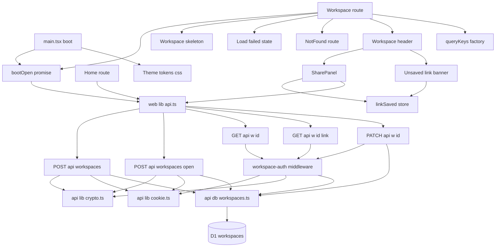

No structure exists yet (greenfield after story 1), so there is no current-vs-target pair; this is the target.

**State**

Workspace record lifecycle (persisted in D1):

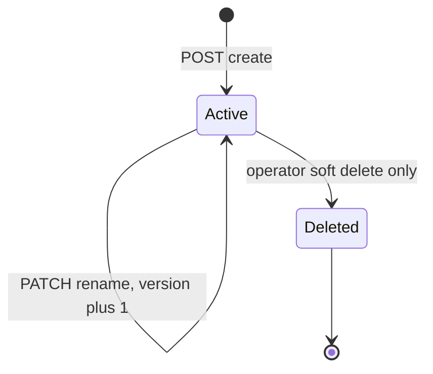

No user-facing transition to Deleted exists in this story (workspace deletion is out of scope). The state is shown because `deleted` is in the schema and `open`/`auth` must treat it as not found.

Browser cookie entry lifecycle for one workspace (persisted in the `tdl_ws` cookie):

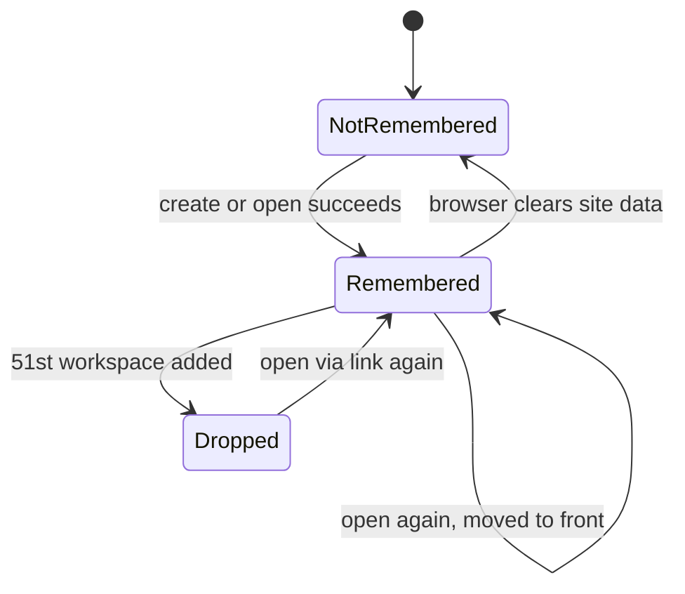

Story 3 adds the `Remembered --> NotRemembered : forget` transition.

Link-saved flag lifecycle for one workspace in one browser (persisted in `localStorage` key `tdl:v1:linkSaved:<workspaceId>`; the value is `'1'`, never the secret):

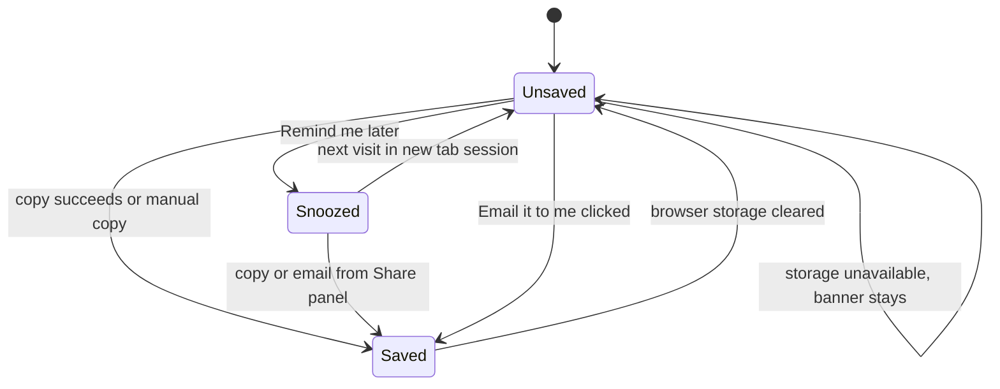

`Snoozed` lives in `sessionStorage` (key `tdl:v1:linkSnoozed:<workspaceId>`), so it ends with the tab session. The banner is visible only in `Unsaved`.

Workspace view load state (in memory, per route visit):

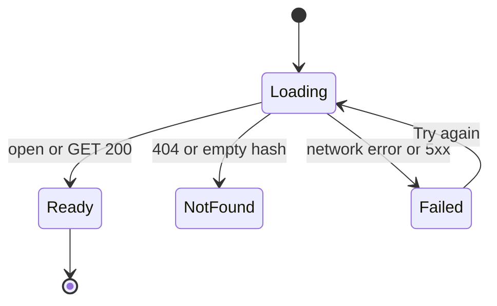

**Sequence: create workspace**

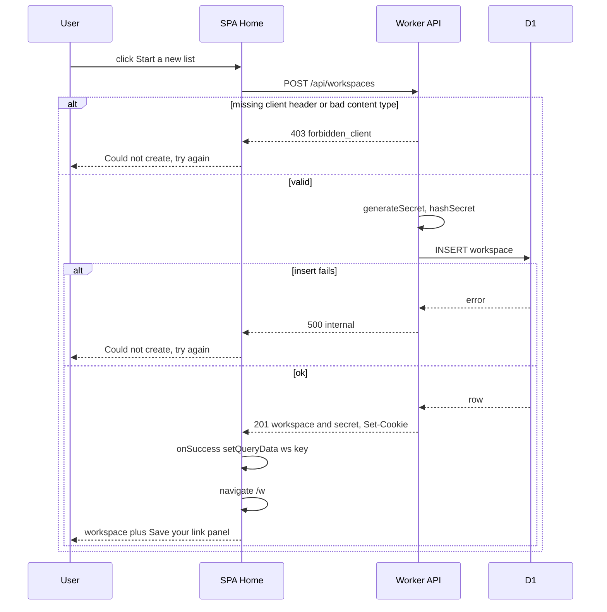

**Sequence: open workspace from link (boot)**

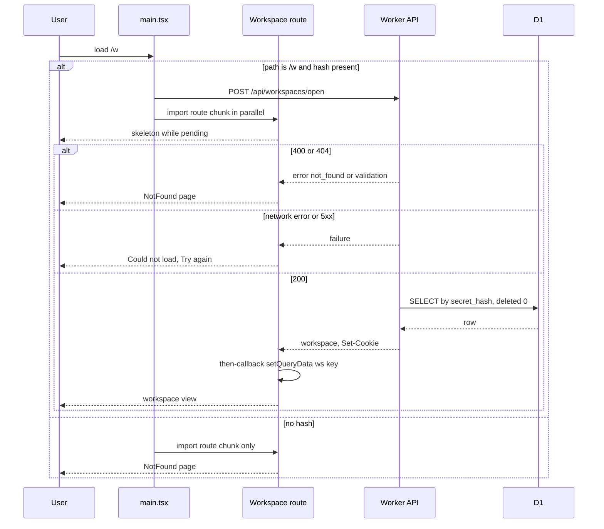

**Sequence: authenticated workspace request (GET or PATCH)**

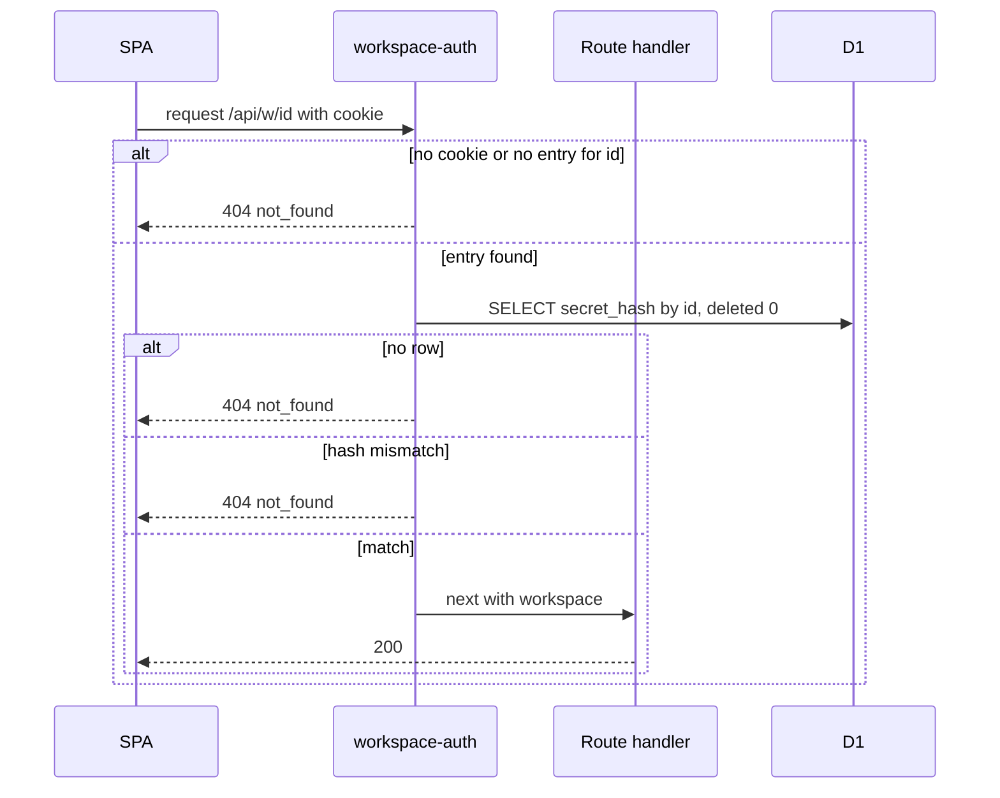

**Sequence: rename workspace**

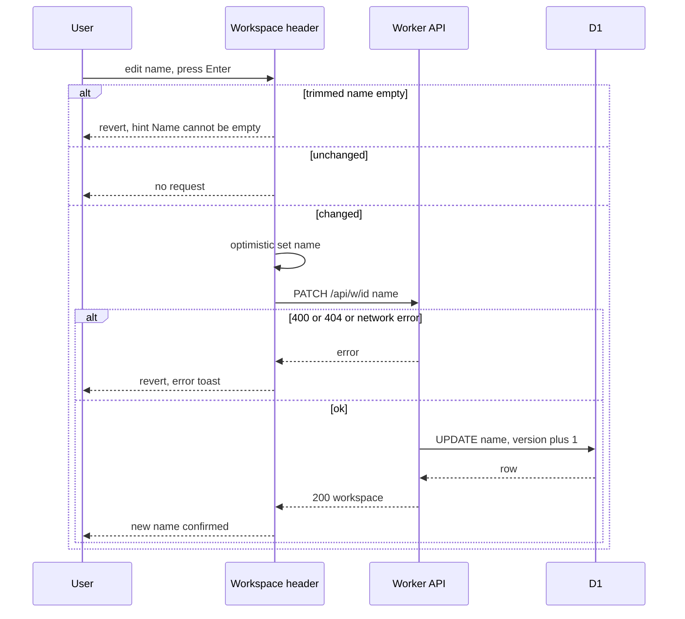

**Sequence: Save your link and Share panel actions**

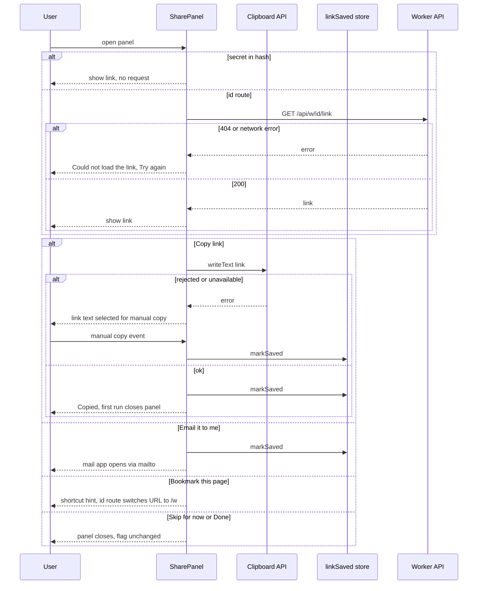

**Sequence: unsaved-link banner copy**

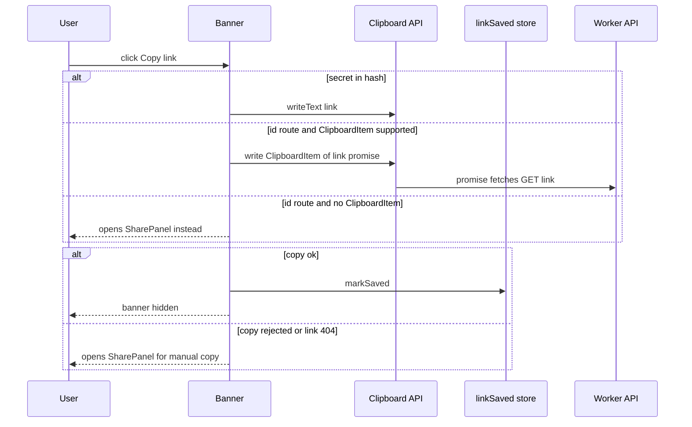

The Home page load and NotFound page are static renders with no branching server flow beyond the create and open sequences above, so they have no separate sequence diagram. The theme has no runtime flow: it is pure CSS keyed on `prefers-color-scheme`.

**Live updates**: broadcasting `workspace.updated` on rename is added by story 4, which retrofits broadcasting onto all existing mutations. Until then, other people see a rename on their next load or refetch.

## Test Strategy

## Test Scopes
- **unit** (vitest, pool-workers for api/lib): pure crypto and cookie codec functions. Boundary: inner logic only. This is enough because these functions have no I/O.
- **integration** (vitest-pool-workers, `SELF.fetch`): the full request path through Hono middleware, handler, and real Miniflare D1. Boundary: request handling, as shown in the structure diagram. Covers the schema, create, open, auth, get, rename, and response headers.
- **ui-component** (vitest + happy-dom + Testing Library, API mocked with MSW): Home, Workspace route, header rename, Link dialog, NotFound. Boundary: browser rendering without a network.
- **e2e** (Playwright, chromium + webkit, `wrangler dev`, fresh local D1): cross-surface workflows that need real cookies, a real fragment and real clipboard.

## Dimensions crossed
- D1 entry surface: API direct / SPA
- D2 secret class: valid-active / valid-format-unknown / valid-deleted / malformed / missing
- D3 cookie state: absent / malformed / valid-without-entry / valid-with-entry / at-cap (50)
- D4 operation: create / open / get / rename
- D5 client-header state: present / missing

Equivalence classes for D2 and D3 are exhaustive and non-overlapping: every secret string falls into exactly one D2 class, and every cookie header into exactly one D3 class.

## Boundaries
- Secret length: 42 / 43 / 44 chars; alphabet outside base64url.
- Workspace name: empty, whitespace-only, 1 char, 120 chars (`WORKSPACE_NAME_MAX`), 121 chars.
- Cookie entries: 0, 1, 49, 50 (`MAX_REMEMBERED_WORKSPACES`), 51.
- Encoded cookie at 50 entries is under 4096 bytes.

## Coverage table

| TC | Capability | D4 op | D2 secret | D3 cookie | D5 hdr | Level | Expected (state before -> after) |
|---|---|---|---|---|---|---|---|
| TC-01 | workspace.secret | not an op: pure fn | generated | not used: pure fn | not used: pure fn | unit | generateSecret -> 43 chars base64url, decodes to 32 bytes |
| TC-02 | workspace.secret | not an op: pure fn | generated x1000 | not used: pure fn | not used: pure fn | unit | 1000 secrets all distinct |
| TC-03 | workspace.secret | not an op: pure fn | valid | not used: pure fn | not used: pure fn | unit | hashSecret deterministic, 64 lowercase hex |
| TC-04 | workspace.secret | not an op: pure fn | valid | not used: pure fn | not used: pure fn | unit | hashesEqual true for identical hashes |
| TC-05 | workspace.secret | not an op: pure fn | valid | not used: pure fn | not used: pure fn | unit | hashesEqual false for 1-char diff and for length diff, never throws |
| TC-06 | workspace.secret | not an op: pure fn | 42/43/44 chars, bad chars, empty | not used: pure fn | not used: pure fn | unit | isWellFormedSecret true only for 43 base64url chars |
| TC-07 | workspace.cookie_codec | not an op: pure fn | not used: codec only | 0,1,50 entries | not used: codec only | unit | encode then decode round-trips exactly |
| TC-08 | workspace.cookie_codec | not an op: pure fn | not used: codec only | malformed: bad base64, bad JSON, wrong shape, missing fields | not used: codec only | unit | decode returns [] and does not throw |
| TC-09 | workspace.cookie_codec | not an op: pure fn | not used: codec only | valid-without-entry | not used: codec only | unit | upsert puts new entry first with t, length +1 |
| TC-10 | workspace.cookie_codec | not an op: pure fn | not used: codec only | valid-with-entry | not used: codec only | unit | upsert moves entry to front, updates t, no duplicate |
| TC-11 | workspace.cookie_codec | not an op: pure fn | not used: codec only | at-cap 50 | not used: codec only | unit | upsert new -> 50 entries, oldest removed, dropped=1 |
| TC-12 | workspace.cookie_codec | not an op: pure fn | not used: codec only | at-cap 50 | not used: codec only | unit | full Set-Cookie string length < 4096 |
| TC-13 | workspace.cookie_codec | not an op: pure fn | not used: codec only | any | not used: codec only | unit | attributes HttpOnly, SameSite=Lax, Path=/api, Max-Age=34560000; Secure present unless ENVIRONMENT=local |
| TC-14 | workspace.schema | not an op: migration | not used: schema | not used: schema | not used: schema | integration | after migrations: table has all columns, UNIQUE on secret_hash (duplicate insert rejected) |
| TC-15 | workspace.create | create | generated | absent | present | integration | rows 0 -> 1; 201 {workspace{id,name=My Todoodle,version=1},secret}; row.secret_hash = sha256(secret); secret not in any column |
| TC-16 | workspace.create | create | generated | absent | present | integration | Set-Cookie tdl_ws decodes to [{id:new,s:secret}] |
| TC-17 | workspace.create | create | generated | at-cap 50 | present | integration | cookie 50 entries, new first, oldest gone; body dropped=1 |
| TC-18 | workspace.create | create | not used: rejected before | absent | missing | integration | 403 forbidden_client; row count unchanged |
| TC-19 | workspace.create | create | not used: rejected before | absent | present, content-type text/plain | integration | 403 forbidden_client; row count unchanged |
| TC-20 | workspace.open | open | valid-active | absent | present | integration | 200 workspace; cookie 0 -> 1 entry |
| TC-21 | workspace.open | open | valid-active | valid-with-entry (not first) | present | integration | entry moved first, t updated, count unchanged |
| TC-22 | workspace.open | open | valid-format-unknown | absent | present | integration | 404 {error:not_found}; no Set-Cookie |
| TC-23 | workspace.open | open | malformed | absent | present | integration | 404 body byte-identical to TC-22; no Set-Cookie |
| TC-24 | workspace.open | open | missing / invalid JSON | absent | present | integration | 400 validation; no Set-Cookie |
| TC-25 | workspace.open | open | valid-deleted | absent | present | integration | 404 identical to TC-22 |
| TC-26 | workspace.open | open | valid-active | malformed | present | integration | 200; cookie rebuilt with 1 entry (malformed discarded) |
| TC-27 | workspace.get + workspace.auth | get | valid-active | valid-with-entry | not needed: GET | integration | 200 {id,name,version,createdAt} |
| TC-28 | workspace.auth | get | not used: no cookie | absent | not needed: GET | integration | 404 not_found |
| TC-29 | workspace.auth | get | wrong secret for id | valid-with-entry (tampered s) | not needed: GET | integration | 404 not_found |
| TC-30 | workspace.auth | get | valid for workspace A | valid-without-entry for B | not needed: GET | integration | request B -> 404 |
| TC-31 | workspace.auth | get | not used: id does not exist | valid-with-entry for random id | not needed: GET | integration | 404 identical body to TC-28 |
| TC-32 | workspace.auth | get | valid-deleted | valid-with-entry | not needed: GET | integration | 404 |
| TC-33 | workspace.rename | rename | valid-active | valid-with-entry | present | integration | name old -> new; version 1 -> 2; updated_at increases |
| TC-34 | workspace.rename | rename | valid-active | valid-with-entry | present | integration | '  Home  ' stored as 'Home' |
| TC-35 | workspace.rename | rename | valid-active | valid-with-entry | present | integration | '' and '   ' -> 400; name and version unchanged |
| TC-36 | workspace.rename | rename | valid-active | valid-with-entry | present | integration | 120 chars -> 200; 121 chars -> 400 unchanged |
| TC-37 | workspace.rename | rename | not used: no auth | absent | present | integration | 404; row unchanged |
| TC-38 | workspace.rename | rename | valid-active | valid-with-entry | missing | integration | 403; row unchanged |
| TC-39 | security.no_leak | create, open, get, 400, 404 | mixed | mixed | present | integration | every response has Referrer-Policy: no-referrer, X-Request-Id, CSP default-src 'self' |
| TC-40 | security.no_leak | create, open(valid), open(unknown) | mixed | mixed | present | integration | captured console output contains neither the secret nor the cookie value |
| TC-41 | web.landing | create | not used: API mocked | not used: API mocked | not used: API mocked | ui-component | Start button calls create once; disabled while pending (double click = 1 call) |
| TC-42 | web.landing | create | not used: API mocked | not used: API mocked | not used: API mocked | ui-component | create 500 -> 'Couldn't create your list - try again', button enabled, no navigation |
| TC-43 | web.link_dialog | not an op: UI | valid | not used: UI | not used: UI | ui-component | after create: dialog shows origin/w#secret, warning copy, Copy and I've saved it |
| TC-44 | web.link_dialog | not an op: UI | valid | not used: UI | not used: UI | ui-component | Copy -> clipboard.writeText(link) once; 'Copied' shown |
| TC-45 | web.link_dialog | not an op: UI | valid | not used: UI | not used: UI | ui-component | writeText rejects or is undefined -> input fully selected, no 'Copied' |
| TC-46 | web.link_dialog | not an op: UI | valid | not used: UI | not used: UI | ui-component | I've saved it closes; focus returns to trigger; Link button reopens same content |
| TC-47 | web.workspace_shell | open | valid-active | not used: API mocked | not used: API mocked | ui-component | /w#secret -> open called with secret; header shows name; hash unchanged after load |
| TC-48 | web.workspace_shell | rename | valid-active | not used: API mocked | not used: API mocked | ui-component | edit + Enter -> name shown before PATCH resolves; PATCH called with trimmed name |
| TC-49 | web.workspace_shell | rename | valid-active | not used: API mocked | not used: API mocked | ui-component | empty edit -> previous name restored; no PATCH |
| TC-50 | web.workspace_shell | rename | valid-active | not used: API mocked | not used: API mocked | ui-component | PATCH 500 -> previous name restored, error toast |
| TC-51 | web.workspace_shell | not an op: UI | valid-active | not used: API mocked | not used: API mocked | ui-component | document.title = 'Todoodle - <name>', never contains secret (dialog open and closed) |
| TC-52 | web.not_found | open | valid-format-unknown | not used: API mocked | not used: API mocked | ui-component | open 404 -> 'Workspace not found' + Start a new list; no workspace data rendered |
| TC-53 | web.not_found | not an op: UI | missing (no fragment) | not used: API mocked | not used: API mocked | ui-component | /w with empty hash -> NotFound; open not called |
| TC-54 | WF-1 create | create | generated | absent | present | e2e | Home -> Start -> 'My Todoodle' empty Inbox in under 1000 ms locally; dialog; Copy -> Copied; close; Link reopens |
| TC-55 | WF-2 return by link | open | valid-active | absent (new context) | present | e2e | link from WF-1 in fresh context -> same name; reload keeps URL and workspace |
| TC-56 | WF-3 bad link | open | valid-format-unknown | absent | present | e2e | /w#random43 -> Workspace not found; Start creates a new one |
| TC-57 | WF-4 rename | rename | valid-active | valid-with-entry | present | e2e | rename -> reload -> new name; second context via link sees new name |
| TC-58 | WF-5 no leak | all | valid-active | mixed | present | e2e | across WF-1..4 no request URL or Referer contains the secret; all requests same-origin; secret appears only in POST open body |

## Error-path traceability
Every error named in a contract has a case: `forbidden_client` (TC-18, TC-19, TC-38), `validation` (TC-24, TC-35, TC-36), `not_found` (TC-22, TC-23, TC-25, TC-28 to TC-32, TC-37), `internal` on create (TC-42 through the UI; the API-level DB failure is not injected, see below), clipboard failure (TC-45).

## Negative scenarios (must NOT happen)
- No row is created on a rejected create (TC-18, TC-19).
- No cookie is set on a failed open (TC-22 to TC-25).
- Responses do not distinguish unknown, malformed and deleted secrets (byte-identical bodies: TC-22, TC-23, TC-25; TC-28, TC-31).
- Rename does not change state when invalid or unauthorised (TC-35 to TC-38).
- The raw secret is never stored (TC-15) and never logged (TC-40).
- The secret never leaves the origin or appears in a URL or Referer (TC-58).
- Double click does not create two workspaces (TC-41).

## Mock vs real
| Store/service | unit | integration | ui-component | e2e |
|---|---|---|---|---|
| D1 | not used: pure functions | real Miniflare D1, migrations applied per test file | mocked via MSW: rendering is under test, not persistence | real local D1 via wrangler dev |
| Cookie jar | not used: codec tested on strings | real Set-Cookie headers, re-sent manually on the next request | not used: HttpOnly, invisible to JS | real browser cookie jar |
| Clipboard | not used | not used: server only | stubbed navigator.clipboard (resolve / reject / undefined) | real clipboard via Playwright permissions (chromium); webkit only asserts the fallback selection |

D1 is never mocked where persistence is under test.

## Fixtures
Integration fixtures create workspaces through the real `POST /api/workspaces`, so secrets and hashes have their real shapes. The at-cap cookie fixture is built from 50 real created workspaces, not hand-made strings. The malformed-cookie fixtures are real base64url of broken JSON. Deleted workspaces are seeded through `/test/seed-workspace {deleted:true}` (non-production only).

## E2E workflows
WF-1 create (TC-54), WF-2 return by link (TC-55), WF-3 bad link (TC-56), WF-4 rename persists across people (TC-57), WF-5 no leak (TC-58, network capture over WF-1 to WF-4).

## Not covered (deliberately)
- Brute-force or rate limiting of `open`/`create`: out of scope in the PRD.
- Statistical timing side-channel measurement: we rely on a hash-indexed lookup plus constant-time compare, not on measured timing.
- A DB failure injected at the API level (Miniflare cannot fail D1 on demand without test-only code in production paths). The UI handling of a 500 is covered by TC-42.
- Whether Cloudflare invocation logs in staging/production capture Cookie headers: verified manually in task 7, not automated.
- Real mobile browsers: Playwright webkit is a proxy only.

## Test Strategy addendum: link endpoint, id route, relaxed CSRF rule

Added after the cross-story decisions with story 3 (id route `/w/:workspaceId`, `GET /api/w/:id/link`) and story 1 (Content-Type JSON required only when a body is present; X-Todoodle-Client always required on mutations). This addendum uses the same dimensions D1 to D5 as the main strategy, and adds D6, entry route: `/w#secret` or `/w/:id`.

| TC | Capability | D4 op | D2 secret | D3 cookie | D6 route | Level | Expected (state before -> after) |
|---|---|---|---|---|---|---|---|
| TC-59 | workspace.link | get link | valid-active | valid-with-entry | not a UI route: API direct | integration | 200 {link: origin/w#s}, s equals the cookie entry; Cache-Control no-store |
| TC-60 | workspace.link | get link | not used: no cookie | absent | not a UI route: API direct | integration | 404 byte-identical to the other misses |
| TC-61 | workspace.link | get link | tampered entry secret | valid-with-entry (wrong s) | not a UI route: API direct | integration | 404; the link is never returned for an unverified secret |
| TC-62 | workspace.create | create | generated | absent | not a UI route: API direct | integration | POST with X-Todoodle-Client but no body and no Content-Type -> 201 (relaxed rule); the same with body '{}' and text/plain stays 403 (TC-19) |
| TC-63 | WF-6 id route link | get link | valid-active | valid-with-entry | /w/:id | e2e | create in context A, navigate to /w/:id, open Link -> the link equals the one shown at creation; opening it in fresh context B reaches the same workspace |
| TC-64 | web.workspace_shell | get | not used: id route has no secret | not used: API mocked | /w/:id | ui-component | renders from GET /api/w/:id; 404 -> NotFound; document.title has no secret |
| TC-65 | web.link_dialog | get link | valid-active | not used: API mocked | /w/:id | ui-component | the link is not requested before the dialog opens; opening triggers exactly one GET link; the link is shown |
| TC-66 | web.link_dialog | get link | valid-active | not used: API mocked | /w#secret | ui-component | opening the dialog does NOT call GET link (secret already in the hash) |

**Equivalence classes for D6** are exhaustive: every workspace view is entered through exactly one of the two routes. Boundary: both routes present at once is impossible because the patterns do not overlap.

**Negative scenarios added:** no link request on page load or before the dialog opens (TC-65); no link for an unverified cookie entry (TC-61); no redundant request when the hash has the secret (TC-66).

**Mock vs real:** as in the main strategy. The link endpoint uses real D1 and a real cookie in integration and e2e, and MSW in ui-component.

**Not covered:** bookmarking `/w/:id` works only in a browser that holds the cookie. This is by design, and the Link panel is the portable path. No automated test asserts cross-browser behaviour for `/w/:id` bookmarks.

## Test Strategy addendum: SharePanel, unsaved-link banner, boot open, loading states, theme

Added after the UX review and React best-practices audit (2026-09-25), and aligned with the contracts stories 3 and 4 consume. It uses dimensions D1 to D6 from the earlier strategies and adds:
- **D7 link-saved state**: unsaved / snoozed / saved / storage-unavailable. Exhaustive and non-overlapping: each browser+workspace is in exactly one (storage-unavailable overrides the others because nothing can be read).
- **D8 panel mode**: save (first run) / share (header button).
- **D9 clipboard capability**: writeText ok / writeText rejects / clipboard undefined / ClipboardItem missing.
- **D10 load outcome**: pending / ok / 404 / 5xx-or-network.
- **D11 colour scheme**: light / dark.
- **D12 edit gate**: canEdit true / canEdit false.

Boundaries: `COPY_CONFIRM_MS` (Copied visible at 1,999 ms, gone at 2,001 ms under fake timers); `NAME_HINT_MS` (hint visible at 2,499 ms, gone at 2,501 ms); contrast thresholds exactly 4.5:1 text and 3:1 UI; storage key for 0 and 1 workspaces.

## Superseded rows
These earlier rows now assert the merged SharePanel behaviour (owner decision 2026-09-25):

| TC | Level | Superseded expectation |
|---|---|---|
| TC-43 | ui-component | after create: panel titled 'Save your link' shows origin/w#secret, the exact texts 'This link is the key to this workspace — for you and anyone you send it to.' and 'Anyone with it can see and change everything. Access can't be removed yet.', plus Copy link & continue, Email it to me, Bookmark this page, Skip for now |
| TC-44 | ui-component | Share mode Copy link -> writeText(link) once; 'Copied' shown for COPY_CONFIRM_MS; panel stays open |
| TC-45 | ui-component | writeText rejects or is undefined -> field focused and fully selected; no 'Copied'; flag not yet set |
| TC-46 | ui-component | Skip for now closes; focus returns to trigger; header Share button reopens titled 'Share'; no element labelled 'Link' exists in the header |
| TC-49 | ui-component | empty edit -> previous name restored; no PATCH; 'Name can't be empty' shown with role=status |
| TC-51 | ui-component | a `<title>` element renders 'Todoodle - <name>'; never contains the secret (panel open and closed) |
| TC-54 | e2e | Home -> Start -> 'My Todoodle' in under 1000 ms locally; Save your link panel; Copy link & continue closes it; Share reopens it |

## New cases

| TC | Capability | D6 route | D7 saved | D8 mode | D9 clipboard | D10 load | Level | Expected (state before -> after) |
|---|---|---|---|---|---|---|---|---|
| TC-67 | web.link_dialog | /w#secret | unsaved | save | writeText ok | not a load case: panel only | ui-component | Copy link & continue -> writeText(link) once; flag unsaved -> saved; panel closed |
| TC-68 | web.link_dialog | /w#secret | unsaved | save | not used: mailto | not a load case: panel only | ui-component | Email it to me href = mailto with URL-encoded link in body and subject; click -> flag saved; no fetch issued |
| TC-69 | web.link_dialog | /w#secret | unsaved | save | not used: bookmark | not a load case: panel only | ui-component | Bookmark shows 'Press ⌘D' with platform macOS and 'Press Ctrl+D' with platform Win32; flag unchanged |
| TC-70 | web.link_dialog | /w/:id | unsaved | share | not used: bookmark | not a load case: panel only | ui-component | Bookmark -> one GET link, then URL becomes /w#secret via replaceState, hint shown; router did not navigate away |
| TC-71 | web.link_dialog | /w#secret | unsaved | save | not used: skip | not a load case: panel only | ui-component | Skip for now -> closed; flag still unsaved; banner visible |
| TC-72 | web.link_dialog | /w#secret | saved | share | writeText ok | not a load case: panel only | ui-component | header Share opens mode share: title Share, primary 'Copy link', secondary 'Done', no 'Skip for now' |
| TC-73 | web.link_dialog | /w#secret | unsaved | share | writeText rejects | not a load case: panel only | ui-component | after fallback selection, a native copy event on the field -> flag saved |
| TC-74 | web.unsaved_link_banner | both | unsaved | not a panel case: banner | ok / ClipboardItem missing / rejects | not a load case: banner only | ui-component | hash route: writeText, banner hides; id route + ClipboardItem: write() with a promise, banner hides; ClipboardItem missing or rejects -> SharePanel opens in share mode, banner stays |
| TC-75 | web.unsaved_link_banner | /w#secret | unsaved -> snoozed | not a panel case: banner | not used: snooze | not a load case: banner only | ui-component | Remind me later hides it; new sessionStorage (simulated new tab) shows it again |
| TC-76 | web.unsaved_link_banner | /w#secret | storage-unavailable | not a panel case: banner | writeText ok | not a load case: banner only | ui-component | localStorage and sessionStorage throw on access -> banner visible, copy works, no error thrown, no console error |
| TC-77 | web.unsaved_link_banner | /w#secret | unsaved -> saved | not a panel case: banner | not used: other tab | not a load case: banner only | ui-component | dispatch a storage event setting the key from another tab -> banner hides without reload |
| TC-78 | web.workspace_shell | both | not relevant: loading only | not relevant: no panel | not relevant: no copy | pending | ui-component | while open/GET pending: skeleton with aria-busy=true; no NotFound; with primed cache the name renders immediately |
| TC-79 | web.workspace_shell | both | not relevant: loading only | not relevant: no panel | not relevant: no copy | 5xx and network | ui-component | 'Couldn't load this workspace.' + Try again (role=alert); Try again issues exactly one new request; 404 still renders NotFound, not this state |
| TC-80 | web.workspace_shell | /w#secret | not relevant: rename | not relevant: no panel | not relevant: no copy | ok | ui-component | unchanged name -> no PATCH; hint disappears after NAME_HINT_MS (fake timers, 2,499 visible / 2,501 gone) |
| TC-81 | web.workspace_shell | both | not relevant: title | not relevant: no panel | not relevant: no copy | ok | ui-component | no code writes document.title directly (spy on setter never called) |
| TC-82 | web.not_found | /w#unknown | not relevant: not found | not relevant: no panel | not relevant: no copy | 404 | ui-component | tip about cut-off links shown; without `recovery` nothing renders between tip and button; with `recovery={<span>x</span>}` that node renders there; Start a new list present |
| TC-83 | web.workspace_shell | not a route: pure fn | not relevant: keys | not relevant: keys | not relevant: keys | not relevant: keys | unit | every workspace-scoped queryKeys.* output starts with root(id); root is a prefix match for invalidateQueries; remembered() and rememberedTouch(id) are the only keys not under root and are not matched by it |
| TC-84 | web.workspace_shell | /w#secret | not relevant: boot | not relevant: boot | not relevant: boot | pending | unit | startBootOpen fires one open for /w with hash, none for /w without hash or other paths; takeBootOpen returns the same promise for the same secret and null for a different secret; the promise's then writes queryKeys.workspace(id) |
| TC-85 | web.theme | not a route: tokens | not relevant: theme | not relevant: theme | not relevant: theme | not relevant: theme | unit | for light and dark, every text pair >= 4.5:1 and every UI pair >= 3:1; a synthetic pair at 4.49 fails the checker |
| TC-86 | web.workspace_shell | /w#secret | not relevant: boot | not relevant: boot | not relevant: boot | ok | e2e | network log: POST /api/workspaces/open starts before the Workspace route chunk response finishes |
| TC-87 | web.theme | /w#secret | not relevant: theme | not relevant: theme | not relevant: theme | ok | e2e | Playwright colorScheme dark -> body background equals the dark --background token; light -> the light token |
| TC-88 | web.unsaved_link_banner | /w#secret | unsaved -> saved | save | writeText ok | ok | e2e | create -> banner absent after Copy link & continue; reload -> still absent; a fresh context opening the link -> banner present |
| TC-89 | security.no_leak | /w#secret | saved | save | not used: mailto | ok | e2e | clicking Email it to me issues no network request; no localStorage or sessionStorage value contains the secret |
| TC-90 | web.unsaved_link_banner | not a route: store | all four | not relevant: store | not relevant: store | not relevant: store | unit | key format tdl:v1:linkSaved:<id>; hasSavedLink/markLinkSaved/subscribe; storage exceptions swallowed and reported as unsaved; cached read invalidated on storage event |
| TC-91 | web.theme | not a route: lint | not relevant: lint | not relevant: lint | not relevant: lint | not relevant: lint | unit | lint fixture importing 'lucide-react' root or '@/features/share' directory fails; per-icon and file imports pass |
| TC-92 | web.unsaved_link_banner | not a route: helper | not relevant: helper | not relevant: helper | all four D9 values plus a rejecting promise | not relevant: helper | unit | copyText(string) uses writeText -> 'copied'; copyText(promise) uses write(ClipboardItem) -> 'copied'; rejection, undefined clipboard, missing ClipboardItem or rejecting promise -> 'fallback', field focused+selected when given, never throws |
| TC-93 | web.workspace_shell | /w/:id | not relevant: query | not relevant: no panel | not relevant: no copy | pending | ui-component | workspaceQuery(id, {placeholderData:{name:'Home'}}) -> 'Home' renders before GET resolves, no skeleton; GET result then replaces it |
| TC-94 | web.workspace_shell | /w#secret | saved | share | writeText ok | ok | ui-component | D12 canEdit true (stub) -> name editor enabled; canEdit forced false -> name editor disabled via the fieldset, while the Share button, SharePanel copy and banner Copy still work |

## Error-path traceability (additions)
Link fetch 404/network in the panel (TC-65 and the TC-74 fallback), clipboard rejection (TC-45, TC-73, TC-74, TC-92), load failure 5xx/network (TC-79), storage unavailable (TC-76, TC-90), editing disabled while offline (TC-94).

## Negative scenarios (additions)
- Skip, Done and Bookmark do not mark the link saved (TC-69, TC-71).
- The banner cannot be permanently dismissed without saving (TC-75).
- A 5xx never shows NotFound, and a 404 never shows the retry state (TC-79).
- No 'Link' button exists anywhere (TC-46).
- Email issues no request and no secret lands in web storage (TC-89).
- Boot open is not fired for non-/w paths or empty hashes (TC-84).
- copyText never throws (TC-92).
- Disabling edits never disables Share or copying (TC-94).

## Mock vs real (additions)
| Store/service | unit | ui-component | e2e |
|---|---|---|---|
| localStorage / sessionStorage | real happy-dom storage; a throwing stub for TC-76/TC-90 because unavailability is the case under test | real happy-dom storage | real browser storage |
| Clipboard / ClipboardItem | stubbed per D9 (TC-92) because the OS clipboard is unavailable | stubbed per D9 | real in chromium; webkit asserts the fallback |
| canEdit store | not used | the story 2 stub, overridden to false for TC-94 because story 4's real store is not built yet | stub (always true) |
| Timers | fake timers for COPY_CONFIRM_MS and NAME_HINT_MS boundaries | fake timers | real |

## E2E workflows (additions)
WF-7 save-and-reload (TC-88), WF-8 email path makes no request (TC-89), WF-9 boot parallelism (TC-86), WF-10 dark appearance (TC-87).

## Fixtures
Workspace data comes from real `POST /api/workspaces` responses in e2e and from the shared zod schemas in MSW handlers. Token contrast uses the real token values from `packages/shared/src/tokens.ts`, not copies.

## Not covered (deliberately)
- Actually creating a browser bookmark: browsers expose no API; we assert the hint and the URL swap only.
- The mail app opening: `mailto:` handling is OS-specific; we assert the href and that no request is made.
- Visual appearance beyond token values (no screenshot diffing).
- Real offline behaviour of the edit gate: story 4 owns the offline store and its e2e tests; story 2 only proves the gate's wiring (TC-94).

## Workspace storage

> Anchor: `workspace.schema`

## Contract
Migration `migrations/0001_workspaces.sql` creates:
- `workspaces(id TEXT PK DEFAULT hex(randomblob(16)), secret_hash TEXT NOT NULL UNIQUE, name TEXT NOT NULL, version INTEGER NOT NULL DEFAULT 1, created_at TEXT DEFAULT datetime('now'), updated_at TEXT DEFAULT datetime('now'), deleted INTEGER NOT NULL DEFAULT 0, deleted_at TEXT)`
- No CHECK constraints; the name length is validated in the app.

Query module `apps/api/src/db/workspaces.ts`:
```ts
insertWorkspace(db: D1Database, secretHash: string, name: string): Promise<WorkspaceRow>
findActiveBySecretHash(db: D1Database, secretHash: string): Promise<WorkspaceRow | null>
findActiveById(db: D1Database, id: string): Promise<WorkspaceRow | null>
renameWorkspace(db: D1Database, id: string, name: string): Promise<WorkspaceRow | null>
```
`renameWorkspace` sets name, `version = version + 1` and `updated_at`, and uses RETURNING. It returns null if the row is missing or deleted.
Errors: a UNIQUE violation on `secret_hash` propagates (practically impossible at 256 bits; surfaced as 500).

## Implementation
- `migrations/0001_workspaces.sql`
- `apps/api/src/db/workspaces.ts` (prepared statements, `WorkspaceRow` type)
- `packages/shared/src/schemas.ts`: `Workspace` public shape `{id, name, version, createdAt}` (never includes secret_hash).

## Tests
TC-14 (integration).

## Secret generation, hashing and comparison

> Anchor: `workspace.secret`

## Contract
`apps/api/src/lib/crypto.ts`:
```ts
generateSecret(): string                 // 32 bytes (WORKSPACE_SECRET_BYTES) from crypto.getRandomValues, base64url, no padding, 43 chars
hashSecret(secret: string): Promise<string>   // SHA-256 via crypto.subtle, lowercase hex, 64 chars
hashesEqual(a: string, b: string): boolean    // constant-time over equal length; returns false on length mismatch without early char exit
isWellFormedSecret(s: unknown): s is string   // /^[A-Za-z0-9_-]{43}$/ (hoisted RegExp)
```
There are no errors: every function is total over its inputs.
Side effects: none.

## Implementation
- `apps/api/src/lib/crypto.ts`; the constant comes from `packages/shared/src/limits.ts`.
- `hashesEqual` uses `crypto.subtle.timingSafeEqual` when available in workerd, falling back to an XOR-accumulate loop.

## Tests
TC-01 to TC-06 (unit).

## Remembered-workspaces cookie codec

> Anchor: `workspace.cookie_codec`

## Contract
`apps/api/src/lib/cookie.ts` (story 3 reuses it for listing and forgetting):
```ts
type RememberedEntry = { id: string; s: string; t: number }
readRemembered(cookieHeader: string | null): RememberedEntry[]      // never throws; malformed -> []
upsertRemembered(entries: RememberedEntry[], entry: RememberedEntry, max = MAX_REMEMBERED_WORKSPACES): { entries: RememberedEntry[]; dropped: number }
serializeRememberedCookie(entries: RememberedEntry[], env: Pick<Env,'ENVIRONMENT'>): string  // full Set-Cookie value
findEntry(entries: RememberedEntry[], id: string): RememberedEntry | undefined
```
- Encoding: base64url(JSON.stringify(entries)), most recent first.
- Attributes: `tdl_ws=<v>; HttpOnly; SameSite=Lax; Path=/api; Max-Age=REMEMBERED_COOKIE_MAX_AGE_S`, plus `Secure` unless `ENVIRONMENT === 'local'`.
- Validation on read: a zod array of `{id: 32 hex, s: well-formed secret, t: int}`. Invalid elements are dropped individually; if the whole value is unparseable, the result is [].

## Implementation
- `apps/api/src/lib/cookie.ts`, with constants from `packages/shared/src/limits.ts`.

## Tests
TC-07 to TC-13 (unit).

## Create workspace API

> Anchor: `workspace.create`

## Contract
`POST /api/workspaces`
- Request: header `X-Todoodle-Client: web` (always required on mutations). `Content-Type: application/json` is required only when a body is present (the rule was relaxed in story 1). The body is empty or `{}`; the name defaults to `DEFAULT_WORKSPACE_NAME`.
- 201 response: `{ workspace: Workspace, secret: string, dropped: number }` plus `Set-Cookie: tdl_ws=...` with the new entry first. `dropped` is the count of oldest entries evicted by the `MAX_REMEMBERED_WORKSPACES` cap. This story owns computing it; story 3 renders the notice.
- Errors: 403 `forbidden_client` (missing header, or a body with a non-JSON content type), 413 over `MAX_BODY_BYTES` (story 1 validate middleware), 500 `internal`.
- Side effects: one workspace row. There is no Inbox row, because the Inbox is implicit (`project_id IS NULL`, architecture section 5).

## Implementation
- `apps/api/src/routes/workspaces.ts` registers `POST /api/workspaces`.
- The client-header and content-type rule lives in story 1's `apps/api/src/middleware/validate.ts`. This story consumes it and adds it only if it is absent.
- Flow: `generateSecret` -> `hashSecret` -> `insertWorkspace` -> `upsertRemembered(readRemembered(cookie), {id, s, t: nowSeconds})` -> `serializeRememberedCookie`.

## Tests
TC-15 to TC-19 and TC-62 (integration), TC-54 (e2e).

## Open workspace by secret API

> Anchor: `workspace.open`

## Contract
`POST /api/workspaces/open`
- Request: `{ secret: string }` plus the client headers.
- 200 response: `{ workspace: Workspace, dropped: number }` plus a `Set-Cookie` that upserts the entry (moved to front, `t` updated).
- Errors: 400 `validation` (body not JSON or `secret` missing/not a string); 404 `not_found` with the fixed body `{error:'not_found',message:'Workspace not found'}` for a malformed, unknown or deleted secret; 403 `forbidden_client`.
- Side effects: cookie update only; the DB is not written.
- **Idempotent, which makes bookmarking work (prd.bookmarkable_link).** The address bar keeps `/w#<secret>` unchanged (see web.workspace_shell). A bookmark, reload or re-visit of that URL therefore calls `open` again with the same secret, and `open` returns the same workspace every time with one cookie entry. This works in any browser, with or without a prior cookie. Nothing about open is one-shot: there is no nonce, no expiry and no consumption of the secret.

## Implementation
- `apps/api/src/routes/workspaces.ts` registers `POST /api/workspaces/open`.
- A malformed secret short-circuits to the same 404 (no DB call). A well-formed secret is hashed and passed to `findActiveBySecretHash`.
- The handler never logs the request body. The 404 body is a module-level constant so all misses are byte-identical.

## Tests
TC-20 to TC-26 (integration, TC-21 proves repeat-open idempotency), TC-55 (e2e, reload of the bookmarked URL), TC-56 (e2e).

## Workspace auth middleware

> Anchor: `workspace.auth`

## Contract
`workspaceAuth` Hono middleware mounted on `/api/w/:workspaceId/*` and `/api/w/:workspaceId`:
- Input: the `:workspaceId` path param and the `tdl_ws` cookie.
- On success: sets `c.var.workspace: WorkspaceRow` and calls next.
- On failure (no cookie, no entry for the id, id not found or deleted, hash mismatch): 404 `not_found` with the same constant body as open.
- Side effects: none. It does not refresh the cookie; only open refreshes it.

## Implementation
- `apps/api/src/middleware/workspace-auth.ts`: `findEntry` -> `findActiveById` -> `hashSecret(entry.s)` -> `hashesEqual(row.secret_hash, hash)`.
- Registered in `apps/api/src/app.ts` before all `/api/w/*` routes. Stories 4 to 8 reuse it unchanged.

## Tests
TC-27 to TC-32 (integration).

## Get workspace API

> Anchor: `workspace.get`

## Contract
`GET /api/w/:workspaceId` returns 200 `{ workspace: Workspace }` with the current name and version.
Errors: 404 from auth.
Side effects: none.

Role in the PRD requirements:
- **prd.rename_workspace, "display the new name to everyone using that workspace":** GET is how any person other than the renamer reads the saved name. TanStack Query refetches `['workspace', id]` on window focus and on mount, so a collaborator in another browser sees the renamed workspace on their next focus or load. Story 4 adds push. TC-57 opens the workspace in a second context after a rename and asserts the new name comes from this endpoint.
- **prd.create_workspace, "take the visitor into it":** after creation the SPA primes the cache from the create response. On any later load of the new workspace (reload, other tab, Link-button return), GET supplies the workspace the visitor is taken into, including the default name 'My Todoodle' and version 1. The Inbox is implicit (architecture section 5), so GET needs no Inbox data; the empty Inbox view renders from the workspace alone until story 5.

## Implementation
- `apps/api/src/routes/workspaces.ts`; returns `c.var.workspace` mapped to the public shape (the secret_hash is stripped).
- Web: `apps/web/src/features/workspace/useWorkspace.ts` uses `useQuery(['workspace', id], getWorkspace)` with `refetchOnWindowFocus: true`.

## Tests
TC-27 (integration), TC-55 and TC-57 (e2e, the second context reads the name through GET).

## Rename workspace API

> Anchor: `workspace.rename`

## Contract
`PATCH /api/w/:workspaceId`
- Body: `{ name: string }`. It is trimmed, then must be 1..`WORKSPACE_NAME_MAX` (120) characters. Schema `RenameWorkspaceBody` lives in `packages/shared/src/schemas.ts`.
- 200 response: `{ workspace: Workspace }` with version incremented.
- Errors: 400 `validation`, 403 `forbidden_client`, 404 `not_found`.
- Side effects: the row's name, version and updated_at change. Last write wins (architecture section 7). Story 4 adds the `workspace.updated` broadcast.

## Implementation
- `apps/api/src/routes/workspaces.ts` calls `renameWorkspace`.

## Tests
TC-33 to TC-38 (integration), TC-57 (e2e).

## Get workspace link API

> Anchor: `workspace.link`

## Contract
`GET /api/w/:workspaceId/link` (behind workspace-auth) returns 200 `{ link: string }`, where `link = <request origin> + '/w#' + entry.s`.
- The secret comes from this browser's own `tdl_ws` cookie entry, which the middleware has just verified against `secret_hash`. The server stores no raw secret, so this is the only way to rebuild the link, and it only works for a browser that already holds it.
- The response carries `Cache-Control: no-store` (already applied to all of `/api` by finalizeResponse; asserted explicitly here).
- Errors: 404 `not_found` from auth.
- Side effects: none. The handler never logs the link.
- **When it is called:** only on an explicit user action — opening the SharePanel, choosing Bookmark on the id route, or pressing Copy in the unsaved-link banner — while the secret is not already in memory from `location.hash`. That happens when the workspace was entered via `/w/:workspaceId` from story 3's remembered list or switcher. It is never called on page load.

Why: story 3 routes remembered workspaces to `/w/:workspaceId`, so no secret reaches page scripts unless the user asks for the link (architecture section 4). This endpoint also satisfies prd.bookmarkable_link for id-routed sessions: the Share panel's Bookmark action swaps the URL to the portable `/w#secret` form.

**Sequence: fetch link for the Share panel or banner**

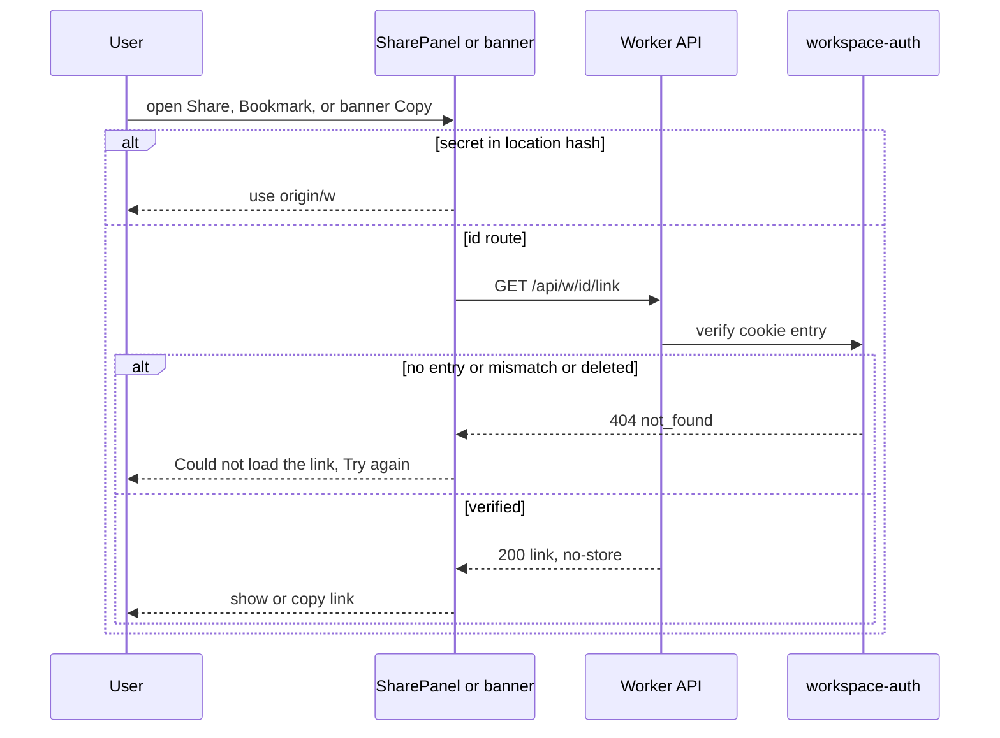

## Implementation
- `apps/api/src/routes/workspaces.ts` registers `GET /api/w/:workspaceId/link`. workspace-auth additionally exposes the matched entry as `c.var.rememberedEntry`.
- Web: `apps/web/src/features/share/useWorkspaceLink.ts` returns the link from the hash if present; otherwise `useQuery({ queryKey: queryKeys.link(id), queryFn: getWorkspaceLink, enabled, staleTime: 0, gcTime: 0 })`. The banner uses `queryClient.fetchQuery` with the same key inside its click handler.

## Tests
TC-59, TC-60, TC-61 (integration), TC-63 (e2e), TC-65, TC-66, TC-70, TC-74 (ui-component).

## No link leakage

> Anchor: `security.no_leak`

## Contract
- Every response carries `Referrer-Policy: no-referrer` and the CSP from architecture section 6. Story 1 owns `finalizeResponse`; this story asserts it for workspace routes.
- `apps/web/index.html` includes `<meta name="referrer" content="no-referrer">`. It loads no third-party script, font or analytics; fonts are self-hosted.
- API logging (`apps/api/src/lib/errors.ts` and the error handler) logs only `{requestId, method, pathname, status, errorName}`, never bodies, cookies, query strings or headers.
- The SPA never puts the secret in the document title, query strings, `history.state`, `localStorage`, `sessionStorage` or error messages, and never sends it over the network except in the `POST /api/workspaces/open` body.
- **Email it to me** is a `mailto:` navigation handled by the user's own mail app. It makes no HTTP request and involves no third party; putting the secret in the mail body is the user's explicit choice.
- The link-saved and snooze flags store only the workspace id (non-secret) and the value `'1'`.

## Implementation
- `apps/web/index.html` (meta tag).
- `apps/api/src/lib/errors.ts` (sanitised logger).
- `apps/web/src/lib/api.ts` (client-side error messages exclude request bodies).
- `apps/web/src/features/share/linkSavedStore.ts` (keys contain only the id).
- A manual verification step during implementation: inspect staging Workers Logs for a create/open request and confirm Cookie headers are not recorded. If they are, set `invocation_logs = false` in `wrangler.toml` for staging and production, and record the finding in the task feedback.

## Tests
TC-39, TC-40 (integration), TC-58, TC-89 (e2e).

## Landing page with one-click start

> Anchor: `web.landing`

## Contract
Route `/` renders the product name, a one-line pitch and a primary button, 'Start a new list'.
- Click: `useMutation(createWorkspace)`. The button is disabled while pending, so a double click makes one call.
- On success (in the mutation's `onSuccess`, never in render or an effect): `queryClient.setQueryData(queryKeys.workspace(id), workspace)` primes the cache, so the Workspace route renders the name immediately with no second fetch. Then `navigate('/w#' + secret, { state: { justCreated: true } })`.
- On error: inline message 'Couldn't create your list - try again' (`role=alert`); the button re-enables.
- Buttons meet `MIN_TOUCH_TARGET_PX` (44) on touch devices and use theme tokens (web.theme).
Story 3 adds the remembered-workspaces list above the button.

## Implementation
- `apps/web/src/routes/Home.tsx`, `apps/web/src/features/workspace/useCreateWorkspace.ts`, `apps/web/src/lib/api.ts` (`createWorkspace`), `apps/web/src/lib/queryKeys.ts` (factory, see web.workspace_shell).
- vercel-react-best-practices applied:
  - `bundle-dynamic-imports`: the Workspace route is `React.lazy`.
  - `bundle-preload`: the Start button's `onPointerEnter`/`onFocus` calls `import('./Workspace')` to warm the chunk.
  - `rendering-hoist-jsx`: static hero markup is hoisted to module scope.
  - `rerender-move-effect-to-event`: create happens in the click handler, never in an effect.
  - `bundle-barrel-imports`: shadcn Button and lucide icons are imported by direct path (`@/components/ui/button`, `lucide-react/icons/plus`); enforced by the lint rule in web.theme.

## Tests
TC-41, TC-42 (ui-component), TC-54 (e2e), TC-83 (unit, key factory used for priming).

## Workspace route shell, boot open, query keys, loading states and header rename

> Anchor: `web.workspace_shell`

## Contract
**Query key factory** — `apps/web/src/lib/queryKeys.ts` (architecture §12), owned here, extended by later stories:
```ts
export const queryKeys: {
  root(id: string): readonly ['ws', string];
  workspace(id: string): readonly ['ws', string, 'workspace'];
  link(id: string): readonly ['ws', string, 'link'];
  // browser-scoped (not workspace-scoped) keys, used by story 3; the ONLY keys outside the ['ws', id] root:
  remembered(): readonly ['remembered'];
  rememberedTouch(id: string): readonly ['remembered-touch', string];
};
```
Every workspace-scoped key starts with `root(id)`, so story 4's reconnect heal `invalidateQueries({ queryKey: queryKeys.root(id) })` reaches all of them. The two browser-scoped keys are deliberately outside it: they describe this browser's cookie, not one workspace.

**Query options factory** — `apps/web/src/features/workspace/workspaceQuery.ts`:
```ts
export function workspaceQuery(id: string, opts?: { placeholderData?: Workspace }): UseQueryOptions<Workspace>;
// { queryKey: queryKeys.workspace(id), queryFn: () => getWorkspace(id), placeholderData: opts?.placeholderData }
```
Used by `useWorkspace(id)` and by story 3, which passes `placeholderData` built from the remembered list entry so the name renders immediately on `/w/:id` before GET returns.

**Boot open** — `apps/web/src/features/workspace/bootOpen.ts`:
```ts
export function startBootOpen(location: Location): Promise<OpenResult> | null; // called once from main.tsx before render
export function takeBootOpen(secret: string): Promise<OpenResult> | null;      // route consumes it (same secret only)
```
- `main.tsx` calls `startBootOpen(window.location)` before `createRoot`. When the path is `/w` and the hash is non-empty, it fires `POST /api/workspaces/open` immediately, in parallel with the lazy Workspace chunk download (async-parallel; removes the chunk → request waterfall).
- The promise's `.then` writes `queryClient.setQueryData(queryKeys.workspace(ws.id), ws)` (cache write in the fetch continuation, never in render or an effect).
- The open call deliberately has **no query key**: it happens before the id is known, and a key would put the secret into the query cache and devtools. It is a single module-level promise, so StrictMode double renders reuse it.

**Routes** render the same `<Workspace>` view:
1. **`/w#<secret>`** (link entry):
   - Secret derived from `location.hash` during render (rerender-derived-state-no-effect).
   - Empty hash -> NotFound (no request).
   - Cache already primed for this secret's workspace (just created) -> render immediately.
   - Otherwise consume `takeBootOpen(secret)` (or start a fresh open if the user navigated client-side) with React 19 `use()` inside a `<Suspense fallback={<WorkspaceSkeleton/>}>`.
   - 404/400 -> NotFound. Network error or 5xx -> `<WorkspaceLoadFailed onRetry>` ('Couldn't load this workspace.' + **Try again**, `role=alert`); retry starts a new open.
   - The fragment is never removed or rewritten, so reload and bookmark work anywhere (prd.bookmarkable_link).
2. **`/w/:workspaceId`** (entry from story 3's remembered list or switcher):
   - `useQuery(workspaceQuery(id, { placeholderData }))`; pending with no placeholder -> skeleton; with placeholder -> name shown immediately; 404 -> NotFound; other errors -> `<WorkspaceLoadFailed>` with `refetch`.
   - No secret reaches JS unless the user opens the Share panel (workspace.link).

**Loading state** — `<WorkspaceSkeleton>` renders the header bar, a sidebar with 3 grey rows and a list with 5 grey rows in their final positions (hoisted static JSX, `aria-busy="true"`, reduced-motion disables the shimmer). No full-page spinner.

**Edit gate** (architecture §12, required by story 4):
```tsx
<fieldset disabled={!canEdit} className="contents">{editableContent}</fieldset>
```
- `canEdit` comes from `useCanEdit()` in `apps/web/src/features/live/canEditStore.ts`. Story 2 creates that module as a stub whose snapshot is always `true`; story 4 replaces its implementation (same export) with the real offline-driven store. Nothing else in story 2 reads connection state.
- Inside the fieldset: the workspace name editor and the main content region (stories 5 to 8 render their editable controls there).
- Outside the fieldset, so they stay usable offline: the **Share** button, `SharePanel`, and `UnsavedLinkBanner`. Copying or emailing a link needs no network on the hash route; on the id route an uncached link fetch fails offline and shows the panel's 'Couldn't load the link' state.
- `className="contents"` keeps the fieldset out of layout; `min-width: 0` and `border: 0` reset in tokens.css.

**Common**
- Renders the header (workspace name, single **Share** button, unsaved-link banner) and an empty Inbox. Story 5 fills the Inbox and owns the mobile drawer.
- Document title via React 19 `<title>Todoodle - {name}</title>` rendered in the view (no `document.title` side effect). The secret is never in the title.
- Header rename: inline editable name. Enter or blur commits; Escape cancels; value trimmed.
  - Empty -> revert without a request and show 'Name can't be empty' under the field (`role=status`) for `NAME_HINT_MS` (2,500 ms, `packages/shared/src/limits.ts`).
  - Unchanged -> no request.
  - Otherwise optimistic `useMutation(renameWorkspace)`: `onMutate` snapshots `queryKeys.workspace(id)`, `onError` rolls back and shows a sonner toast.
- `WorkspaceContext` provides `{ workspaceId, secretFromHash?: string }`, consumed by stories 3 to 8.
- Imports are direct paths only (no `index.ts` barrels in `features/*`).

## Implementation
- `apps/web/src/main.tsx` (calls `startBootOpen` before render)
- `apps/web/src/lib/queryKeys.ts`
- `apps/web/src/features/workspace/workspaceQuery.ts`
- `apps/web/src/features/workspace/bootOpen.ts`
- `apps/web/src/features/live/canEditStore.ts` (stub: `useCanEdit()` returns `true`; replaced by story 4)
- `apps/web/src/routes/Workspace.tsx`; routes `/w` and `/w/:workspaceId` registered in `apps/web/src/App.tsx`
- `apps/web/src/features/workspace/WorkspaceSkeleton.tsx`, `apps/web/src/features/workspace/WorkspaceLoadFailed.tsx`
- `apps/web/src/features/workspace/WorkspaceHeader.tsx`, `apps/web/src/features/workspace/WorkspaceNameEditor.tsx`
- `apps/web/src/features/workspace/WorkspaceContext.tsx`, `useWorkspace.ts`, `useRenameWorkspace.ts`
- `packages/shared/src/limits.ts` adds `NAME_HINT_MS = 2_500`
- vercel-react-best-practices applied:
  - `async-parallel`: boot open runs alongside the route chunk.
  - `rerender-derived-state-no-effect`: the secret is derived from location.
  - `client-swr-dedup`: one module-level boot promise; TanStack Query dedups the id-route GET.
  - `rerender-no-inline-components`: `WorkspaceNameEditor` is a separate memo component.
  - `rerender-functional-setstate`: functional setState in the editor.
  - `rendering-hoist-jsx`: the skeleton's static markup is hoisted.
  - `async-suspense-boundaries`: Suspense around the view shows the skeleton while open resolves.
  - `rerender-derived-state`: one fieldset reads the `canEdit` boolean; no per-control subscription.

## Tests
TC-47 to TC-50, TC-64, TC-78, TC-79, TC-80, TC-81, TC-93, TC-94 (ui-component); TC-83, TC-84 (unit); TC-54, TC-55, TC-57, TC-63, TC-86 (e2e).

## SharePanel: save-your-link on first run and the single Share button

> Anchor: `web.link_dialog`

Anchor kept as `web.link_dialog` for task traceability; the component is now `SharePanel` (architecture §12, owner decision 2026-09-25: Link and Share are one panel). Story 4 reuses this component for prd.share_panel and adds no link UI. Story 3 reuses `useWorkspaceLink`, `copyText` and `linkSaved.ts` in its forget dialog.

## Contract
```ts
type SharePanelMode = 'save' | 'share';
function SharePanel(props: { open: boolean; mode: SharePanelMode; onOpenChange(open: boolean): void }): JSX.Element;
export function useWorkspaceLink(workspaceId: string, opts: { enabled: boolean }): { link?: string; status: 'ready' | 'loading' | 'error'; retry(): void };
function useCopyLink(workspaceId: string): { copy(link: string, field?: HTMLInputElement | null): Promise<'copied' | 'fallback'>; copied: boolean };
```
Content (shadcn Dialog on desktop; full-width bottom sheet below `MOBILE_BREAKPOINT_PX`, full-width buttons, each at least `MIN_TOUCH_TARGET_PX` tall):
- Title: 'Save your link' (`mode='save'`) or 'Share' (`mode='share'`).
- Read-only link field.
- Text: 'This link is the key to this workspace — for you and anyone you send it to.' / 'Anyone with it can see and change everything. Access can't be removed yet.' In `save` mode, additionally: 'It's the only way back in: if you lose it, you lose access.'
- Primary: `save` -> **Copy link & continue** (copies, marks saved, closes). `share` -> **Copy link** (copies, marks saved, shows 'Copied' for `COPY_CONFIRM_MS` = 2,000 ms, panel stays open).
- **Email it to me**: an `<a href="mailto:?subject=Your%20Todoodle%20link&body=<encoded link>">`. Clicking marks saved. It is a navigation to the local mail handler: no fetch, no third party (security.no_leak).
- **Bookmark this page**: shows 'Press ⌘D' when `navigator.userAgentData?.platform` or `navigator.platform` indicates macOS/iOS, else 'Press Ctrl+D'. On the `/w/:id` route it first replaces the URL with `/w#<secret>` (`history.replaceState`, keeps router state) so the bookmark is portable, then shows the hint.
- Secondary: `save` -> **Skip for now**; `share` -> **Done**. Neither marks saved.

Link source (`useWorkspaceLink(workspaceId, { enabled })`, exported for story 3):
- `WorkspaceContext.secretFromHash` set for that workspace -> `${location.origin}/w#${secret}`, no request.
- Otherwise `useQuery({ queryKey: queryKeys.link(id), queryFn: getWorkspaceLink, enabled, staleTime: 0, gcTime: 0 })` (workspace.link). Loading shows a skeleton line; failure shows 'Couldn't load the link' + **Try again**.

Copy behaviour (`useCopyLink`, in event handlers only): delegates to `copyText(link, field)` (web.unsaved_link_banner). `'copied'` -> `markLinkSaved(workspaceId)`. `'fallback'` -> the field is focused and selected; a one-shot native `copy` listener on the field then calls `markLinkSaved`.

Opening:
- Auto-opens in `save` mode when `location.state?.justCreated`; on close, `navigate('.', { replace: true, state: {} })` keeps the hash so reload does not re-show it.
- The header's single **Share** button opens `share` mode. There is no 'Link' button. Radix returns focus to the trigger on close.
- The link is never put in persistent storage or long-lived cache (`gcTime: 0`).

## Implementation
- `apps/web/src/features/share/SharePanel.tsx` (lazy chunk; `SharePanelLazy` wrapper preloads on Share button `onPointerEnter`/`onFocus` and immediately after create)
- `apps/web/src/features/share/useWorkspaceLink.ts`, `useCopyLink.ts`, `platformShortcut.ts`
- `apps/web/src/features/share/linkSaved.ts`, `copyText.ts` (see web.unsaved_link_banner)
- `packages/shared/src/limits.ts` adds `COPY_CONFIRM_MS = 2_000` (story 4 reuses it; `COPIED_FEEDBACK_MS` is retired)
- vercel-react-best-practices applied:
  - `bundle-dynamic-imports` + `bundle-preload`: panel is lazy and preloaded on hover/focus.
  - `rerender-move-effect-to-event`: clipboard, mailto marking and bookmark URL swap run in handlers.
  - `async-defer-await`: the link fetch is gated on `enabled`.
  - `rendering-conditional-render`: ternaries for mode-specific content.

## Tests
TC-43 to TC-45 (as superseded in test-strategy-3), TC-65, TC-66, TC-67 to TC-73 (ui-component); TC-54, TC-63, TC-88, TC-89 (e2e).

## Unsaved-link reminder banner and link-saved store

> Anchor: `web.unsaved_link_banner`

## Contract
**Store** — `apps/web/src/features/share/linkSaved.ts` (client-localstorage-schema: versioned keys, minimal data). Story 3 consumes `hasSavedLink` and `markLinkSaved` (forget dialog warning):
```ts
export function hasSavedLink(workspaceId: string): boolean;    // localStorage 'tdl:v1:linkSaved:<id>' === '1'
export function markLinkSaved(workspaceId: string): void;       // sets '1', notifies subscribers
export function isSnoozed(workspaceId: string): boolean;        // sessionStorage 'tdl:v1:linkSnoozed:<id>' === '1'
export function snooze(workspaceId: string): void;
export function subscribe(listener: () => void): () => void;    // also listens to window 'storage' for other tabs
export function useLinkReminderVisible(workspaceId: string): boolean; // useSyncExternalStore; snapshot is the boolean itself
```
- Every storage read/write is wrapped in try/catch. If storage is unavailable (private mode, blocked site data), `hasSavedLink` returns `false` and `isSnoozed` returns `false`: the banner stays visible (fail safe towards reminding) and nothing throws. Reads are cached in a module-level `Map` and invalidated on write or `storage` event (js-cache-storage).
- Values are only `'1'`; keys contain only the non-secret workspace id.

**Clipboard helper** — `apps/web/src/features/share/copyText.ts`, shared by SharePanel, the banner and story 3:
```ts
export function copyText(text: string | Promise<string>, fallbackField?: HTMLInputElement | null): Promise<'copied' | 'fallback'>;
```
- String: `navigator.clipboard.writeText`. Promise: `navigator.clipboard.write([new ClipboardItem({'text/plain': promise-as-blob})])` when `ClipboardItem` exists (keeps Safari's user-gesture requirement satisfied while the link is fetched).
- Rejection, missing API, or a promise that rejects: if `fallbackField` is given, focus and select it and resolve `'fallback'`; otherwise resolve `'fallback'` without side effects. Never throws. Called only from event handlers.

**Banner** — `<UnsavedLinkBanner />` rendered under the workspace header while `useLinkReminderVisible(id)` is true:
- Text: 'Your link isn't saved yet — you'll lose access if you clear this browser.' (`role=status`, not an alert, so it doesn't interrupt).
- **Copy link**: `copyText(link)` on the hash route; `copyText(queryClient.fetchQuery({ queryKey: queryKeys.link(id), queryFn: getWorkspaceLink }))` on the id route. `'copied'` -> `markLinkSaved(id)`, banner disappears. `'fallback'` (no ClipboardItem, rejection, or link fetch failure) -> open `SharePanel` in `share` mode for manual copy.
- **Remind me later** -> `snooze(id)`; hidden for this tab session only.
- Layout: single line on desktop; wraps with full-width buttons below `MOBILE_BREAKPOINT_PX`; buttons at least `MIN_TOUCH_TARGET_PX` tall.
- There is no way to permanently dismiss it without copying or emailing.

## Implementation
- `apps/web/src/features/share/linkSaved.ts`
- `apps/web/src/features/share/copyText.ts`
- `apps/web/src/features/share/UnsavedLinkBanner.tsx` (small, eager; imported directly by `WorkspaceHeader.tsx`)
- vercel-react-best-practices applied: `rerender-derived-state` (snapshot is the boolean), `client-event-listeners` (one `storage` listener shared by all subscribers), `js-cache-storage`, `client-localstorage-schema`, `rerender-move-effect-to-event`.

## Tests
TC-74 to TC-77, TC-90, TC-92 (unit + ui-component), TC-88 (e2e).

## Workspace not found page

> Anchor: `web.not_found`

## Contract
```ts
function NotFound(props: { recovery?: React.ReactNode }): JSX.Element;
```
`<NotFound />` shows:
- the heading 'Workspace not found';
- the tip 'Links are long — check it wasn't cut off when it was copied.';
- the `recovery` slot, rendered between the tip and the button when provided. Story 2 passes nothing. **Story 3 supplies it** (this browser's remembered workspaces) by rendering `<NotFound recovery={<RememberedRecovery/>} />` from the catch-all and the Workspace route;
- a 'Start a new list' button reusing `useCreateWorkspace`.

It displays nothing from the failed request and renders identically for malformed, unknown and deleted secrets and for an empty hash. It is never shown for network errors or 5xx; those render `<WorkspaceLoadFailed>` (web.workspace_shell).

## Implementation
- `apps/web/src/routes/NotFound.tsx`; also used as the router catch-all.

## Tests
TC-52, TC-53, TC-82 (ui-component), TC-56 (e2e).

## Theme tokens (light and dark) and direct-import enforcement

> Anchor: `web.theme`

## Contract
**Tokens** — `apps/web/src/styles/tokens.css`, the single source of colour for every story:
- shadcn/Tailwind v4 semantic CSS variables (`--background`, `--foreground`, `--muted`, `--muted-foreground`, `--primary`, `--primary-foreground`, `--destructive`, `--border`, `--ring`, `--warning`, `--success`) defined under `:root` (light) and `@media (prefers-color-scheme: dark)` (dark).
- The 12 `PROJECT_COLORS` (story 7) get a light and dark value each here, so story 7 only references tokens.
- `color-scheme: light dark` on `:root` so native controls (scrollbars, date inputs) match.
- `@media (prefers-reduced-motion: reduce)` disables shimmer and transitions globally.
- Contrast: every foreground/background token pair used for text is at least 4.5:1, and every UI-boundary pair (border, ring, focus outline) at least 3:1, in both themes (WCAG 2.2 AA 1.4.3 and 1.4.11).
- A shared `packages/shared/src/tokens.ts` exports the same values for tests (single source of truth; the CSS is generated from it at build time by `apps/web/scripts/build-tokens.ts`).

**Direct imports** — `apps/web/eslint.config.js` adds `no-restricted-imports` banning: the `lucide-react` package root (per-icon paths required), any `@/features/*/index` or `@/features/*` directory import, and `date-fns` outside `features/dates/picker/*` (architecture §12). Runs in `bun run lint`, which `bun run test` invokes.

No runtime state: the theme follows the device setting with no in-app toggle (out of scope), so there is no state diagram or sequence for it beyond the note in the overview.

## Implementation
- `packages/shared/src/tokens.ts`, `apps/web/scripts/build-tokens.ts`, `apps/web/src/styles/tokens.css` (generated, committed), `apps/web/src/index.css` imports it.
- `apps/web/eslint.config.js` (restricted imports), `package.json` script `lint`.

## Tests
TC-85 (unit, contrast of every token pair in both themes), TC-87 (e2e, dark emulation), TC-91 (unit, lint rule rejects barrel imports).

