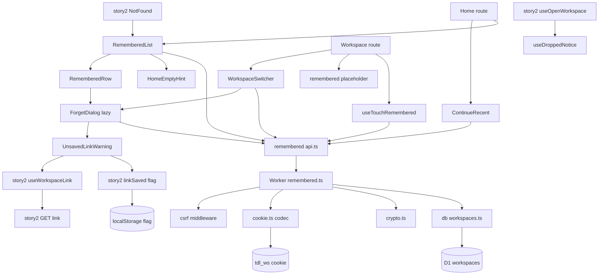
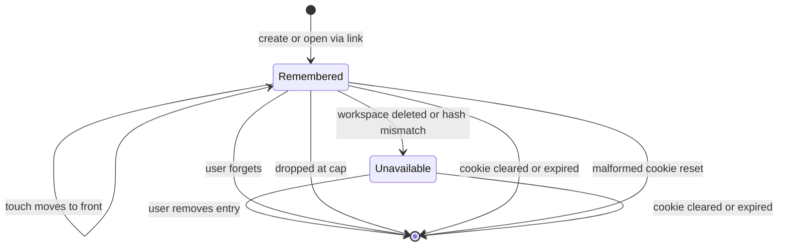
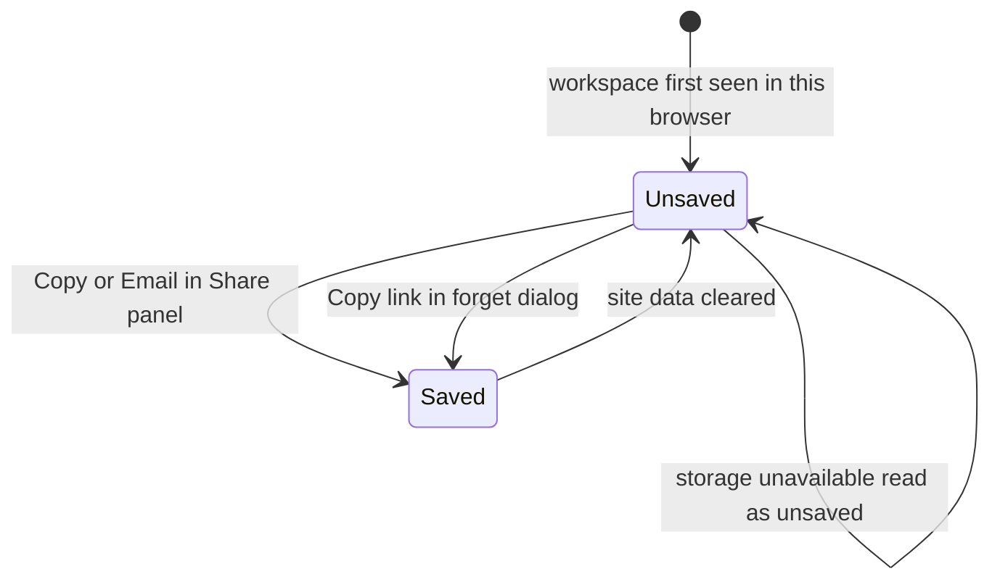
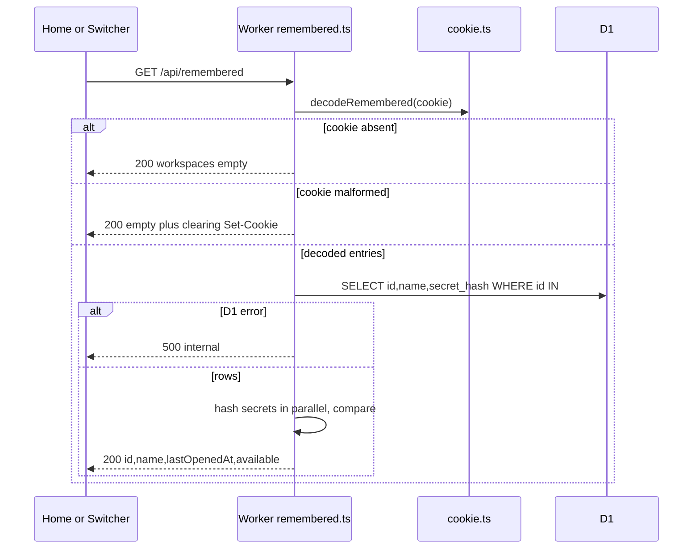
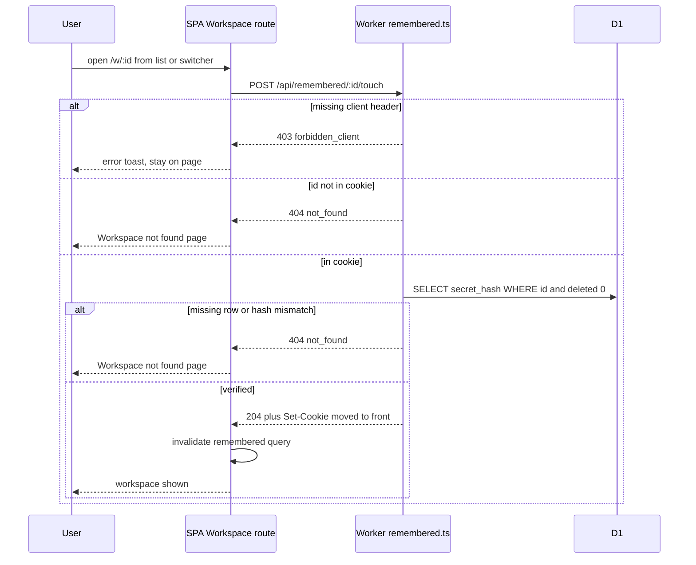
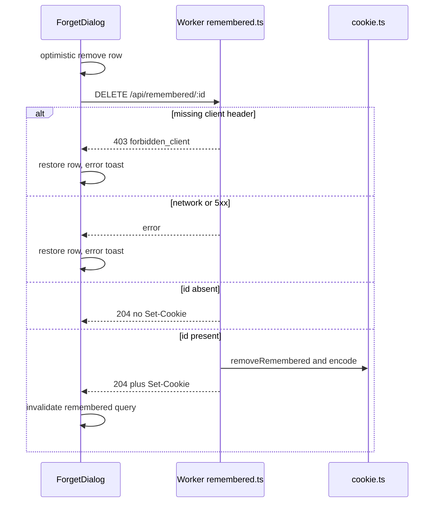
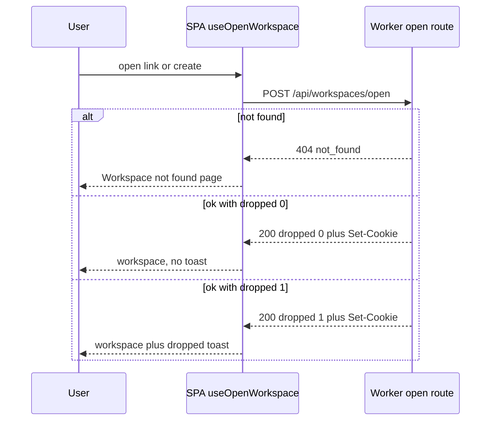
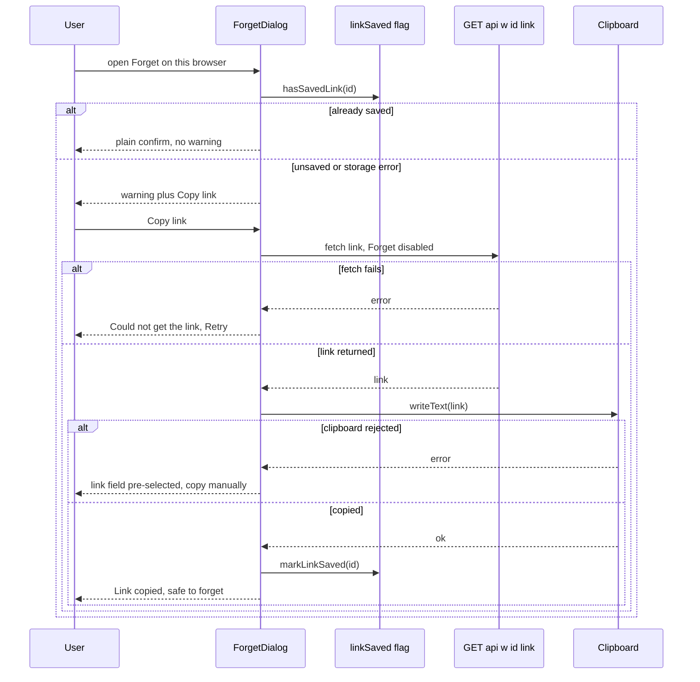
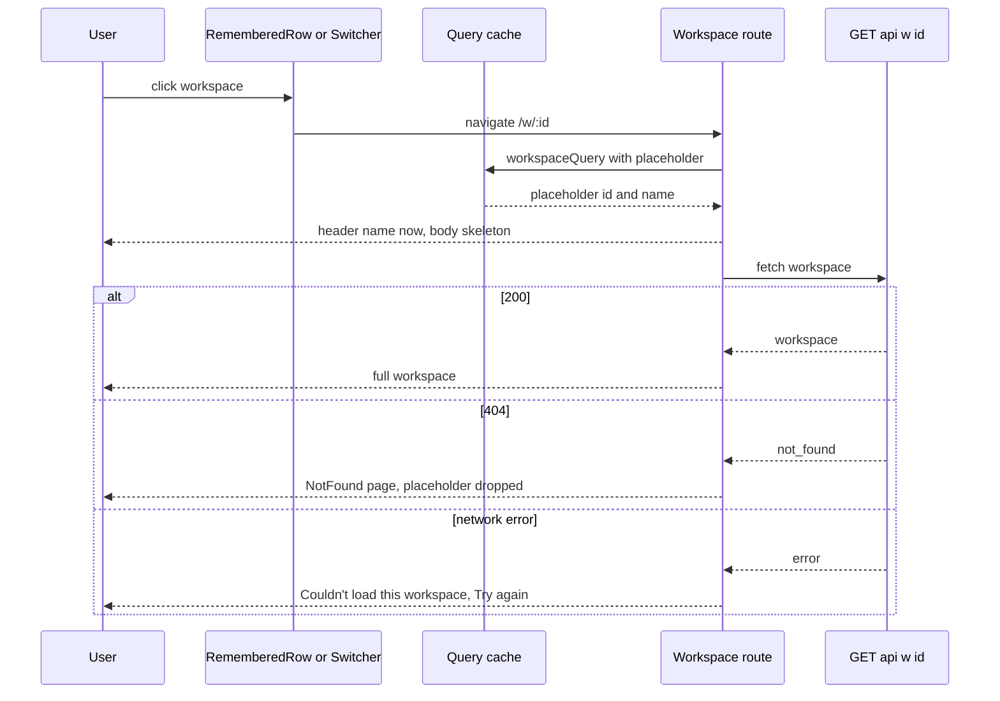

# Technical Design

Per-browser memory of workspaces via the HttpOnly tdl_ws cookie (story 2 codec): list, touch, forget endpoints that never expose secrets; Home list, empty state, in-workspace switcher with prefetch, forget dialog, cap notice.

## Overview

## Scope
Story 3 turns the `tdl_ws` cookie into a list of workspaces this browser remembers, visible to the user. The cookie is defined in docs/architecture.md section 4; its codec and Set-Cookie on create/open are owned by story 2. Frontend conventions follow docs/architecture.md section 12, which is binding. UX rationale is in specs/general/UI-IMPROVEMENTS.md.

Adds:
- `GET /api/remembered` -> `{workspaces: [{id, name, lastOpenedAt, available}]}`. Never returns secrets.
- `POST /api/remembered/:id/touch` -> moves an entry to the front and refreshes its last-opened time.
- `DELETE /api/remembered/:id` -> forgets an entry on this browser only.
- SPA route `/w/:workspaceId`: open by id, cookie-authenticated, alongside story 2's `/w#<secret>`.
- Home:
  - a "Continue to <most recent>" primary button, with no auto-redirect;
  - the remembered list with loading skeleton and error states;
  - the empty state;
  - unavailable rows.
- Workspace switcher, with prefetch and chunk preload on hover/focus.
- Forget dialog: lazy-loaded with preload. It includes an unsaved-link warning with Copy link.
- Remembered list on story 2's NotFound page.
- Instant workspace name when opening from the list.
- Dropped-at-cap toast.
- Touch-friendly rows and menus.

## Dependencies
- Story 1: Worker skeleton, Hono app, finalizeResponse, CSRF middleware (`X-Todoodle-Client`; no Content-Type needed for bodyless requests), test harness.
- Story 2:
  - `apps/api/src/lib/cookie.ts` (`decodeRemembered`, `encodeRemembered`, `upsertRemembered` with cap + `dropped`)
  - `apps/api/src/lib/crypto.ts`
  - `POST /api/workspaces/open`
  - `workspaces` table
  - `apps/web/src/lib/queryKeys.ts` factory, which story 3 extends with `remembered()` and `rememberedTouch(id)`
  - `workspaceQuery(id)` keyed `['ws', id, 'workspace']`
  - `useWorkspaceLink(id)` over `GET /api/w/:id/link`
  - the link-saved flag helper `apps/web/src/features/share/linkSaved.ts` (`hasSavedLink(id)`, `markLinkSaved(id)`; localStorage, try/catch, per workspace; set by the Share panel's Copy/Email)
  - the `NotFound` route, which story 3 fills with a slot
  - the shared `copyText` clipboard helper with pre-selected fallback

## Key decisions
- **Availability is verified, not assumed.** An entry is `available` only if a non-deleted workspace row exists with that id AND `sha256(entry.s)` equals `secret_hash` (constant-time compare). Anything else returns `available:false, name:null`, so the response never confirms whether an id exists.
- **One D1 round-trip** for the list. Hashes are computed in parallel (`Promise.all`).
- **Strict response schema.** `RememberedListResponse.strict()` means any accidental extra key fails tests.
- **Malformed cookie is healed.** The response is an empty list plus a clearing Set-Cookie, never a 500.
- **Forget is idempotent** and never touches D1.
- **Query keys:** `remembered` is browser-scoped, not workspace-scoped. It is therefore the one documented exception to the `['ws', id, ...]` root, keyed `['remembered']` via `queryKeys.remembered()`. Invalidating a workspace (`['ws', id]`) never refetches it. The touch query uses `['remembered-touch', id]` so invalidating `['remembered']` never re-fires touch.
- **Instant name:** the workspace query is given `placeholderData` from the cached remembered list (`{id, name}`). The header renders immediately; the rest shows skeletons until real data arrives. Nothing is written into the cache during render or in effects.
- **Unsaved-link warning:** the flag is local and non-secret, so the dialog knows without a request. The link itself is only fetched when the user presses Copy link (`useWorkspaceLink` with `enabled: false` plus `refetch()`). It is fetched before the forget, while the cookie entry still exists to authorise it.
- **Continue** never auto-navigates. It targets the first *available* entry (`pickContinueTarget`).
- **Bundles:**
  - ForgetDialog is `React.lazy`, preloaded on row-menu open/pointerenter/focus.
  - Icons are imported per icon.
  - There are no barrel files in `features/remembered`.
  - Relative time uses cached `Intl.RelativeTimeFormat` rather than date-fns.

## Structure


## State
Two pieces of long-lived state are involved. D1 is read-only here.

1. A remembered entry in this browser's `tdl_ws` cookie:

`Unavailable` is derived at read time, not stored.

2. The per-workspace link-saved flag in localStorage. Story 2 owns it; story 3 reads it and sets it from the forget dialog:


## Flows changed
1. List remembered (Home, switcher, NotFound): sequence in remembered.list_api.
2. Touch on open by id: sequence in remembered.touch.
3. Forget: sequence in remembered.forget_api.
4. Dropped-at-cap notice on create/open: sequence in remembered.cap_notice.
5. Forget with unsaved link, copy first: sequence in forget.unsaved_warning.
6. Open from list with instant name: sequence in workspace.instant_name.

Flows that need no diagram of their own:
- **Continue** is flow 6 started from a different button.
- **NotFound recovery** is flow 1 rendered on another page; no new server call.
- **Switcher navigation** is flows 2 and 6 plus a prefetch.

## Test Strategy

## Test scopes
- **unit** (vitest; api helpers in pool-workers, web helpers in happy-dom): pure functions only, which is sufficient because none of them does I/O. Covers ordering/cap/remove policy, public projection, cookie attribute builder, relative time, `pickContinueTarget` and `rememberedPlaceholder`.
- **integration** (vitest-pool-workers, `SELF.fetch`): full request handling through Hono, CSRF middleware, the cookie codec and real Miniflare D1. This is the Worker boundary in the structure diagram, and where secrets could leak.
- **ui-component** (vitest + happy-dom + Testing Library, MSW for `/api`): rendering, dialogs, optimistic removal and rollback, prefetch/preload triggers, lazy loading, the unsaved-link warning, the placeholder name, touch styling and query keys. The boundary is browser rendering; the network is mocked because it is covered at integration level.
- **e2e** (Playwright vs wrangler dev; chromium and webkit, plus a mobile touch profile): real cookie behaviour across browser contexts, `document.cookie` invisibility, recency ordering, clipboard, and real touch layout.

## Dimensions crossed
- **D1 entry surface:** GET list, POST touch, DELETE forget, open (story 2) at cap, Home UI, Switcher UI, NotFound UI, ForgetDialog UI.
- **D2 cookie prior state:** absent, empty list, 1 entry, N entries (3), 49 entries, 50 entries (cap), malformed.
- **D3 entry validity:** valid, hash mismatch, soft-deleted workspace, unknown id.
- **D4 target:** id present in cookie, id absent, current workspace.
- **D5 link-saved flag:** saved, unsaved, storage throws.
- **D6 input modality:** mouse (hover), keyboard, touch (`hover: none`).
- **D7 cache state on navigation:** list cached with the entry, list not cached (cold load).

**Equivalence classes:**
- D2 is exhaustive and non-overlapping. Every cookie is absent, decodes to a list of length 0, 1, 2..49 or 50, or fails to decode. The value 3 represents 2..48.
- D3 is exhaustive for an entry: it resolves to a live matching row, or fails for exactly one of the three reasons.
- D5 is exhaustive: the flag reads true, reads false (or is missing), or reading throws. Throwing is treated as unsaved.
- D6: every interactive element is exercised under each modality it supports.
- D7 is exhaustive: the cache either holds the list with the entry or does not.

**Boundaries:**
- list length 0, 1, 49, 50, 51 (via upsert);
- name length 1 and WORKSPACE_NAME_MAX (120);
- relative time 59 s / 60 s;
- Continue target at index 0 vs index >0 (preceded by unavailable entries), and all-unavailable;
- touch target exactly 44 px.

## Unit cases
| ID | Level | Capability | Input / prior state | Expected (before -> after) |
|---|---|---|---|---|
| TC-01 | unit | remembered.touch | empty list, upsert A | [] -> [A], A.t = now, dropped 0 |
| TC-02 | unit | remembered.touch | [B, A], upsert A | [B, A] -> [A, B], A.t updated, no duplicate |
| TC-03 | unit | remembered.cap_notice | 49 entries, upsert new | length 49 -> 50, dropped 0 |
| TC-04 | unit | remembered.cap_notice | 50 entries, upsert new | length stays 50, oldest removed, dropped 1 |
| TC-05 | unit | remembered.cap_notice | 50 entries, upsert existing | length 50, order changed, dropped 0 |
| TC-06 | unit | remembered.forget_api | [A, B, C], remove B | -> [A, C], order preserved |
| TC-07 | unit | remembered.forget_api | [A], remove Z | unchanged, returns changed=false |
| TC-08 | unit | remembered.list_api | entry {id,s,t} + row | projection has exactly id, name, lastOpenedAt, available |
| TC-09 | unit | remembered.cookie_attributes | ENVIRONMENT local / staging / production | HttpOnly, SameSite=Lax, Path=/api, Max-Age=REMEMBERED_COOKIE_MAX_AGE_S always; Secure only for staging and production |
| TC-10 | unit | remembered.cookie_attributes | clear builder | Max-Age=0, same Path and name |
| TC-11 | unit | home.remembered_list | relative time for 30s, 59s, 60s, 1 day, 400 days | just now, just now, 1 minute ago, yesterday, over a year ago |
| TC-12 | unit | home.continue_recent | [] ; [A] ; [unavailable X, A, B] ; [unavailable X, unavailable Y] | null ; A ; A (first available, not index 0) ; null |
| TC-13 | unit | workspace.instant_name | cache holds [A, unavailable B]; ask A ; ask B ; ask Z ; cache empty | {id A, name A} ; undefined ; undefined ; undefined; cache contents unchanged after every call |

## Integration cases (real D1, real cookie codec)
| ID | Level | Surface | Cookie prior state | Validity | Expected |
|---|---|---|---|---|---|
| TC-20 | integration | GET | absent | no entries to validate, class empty | 200 {workspaces:[]}, no Set-Cookie |
| TC-21 | integration | GET | 3 entries | valid | 200, names match rows, stored order, available true, keys exactly {id,name,lastOpenedAt,available}; raw body contains none of the 3 secrets |
| TC-22 | integration | GET | 1 entry | hash mismatch | available false, name null |
| TC-23 | integration | GET | 1 entry | soft-deleted workspace | available false, name null |
| TC-24 | integration | GET | 1 entry | unknown id | available false, name null; body identical in shape to TC-22 |
| TC-25 | integration | GET | malformed (bad base64, bad JSON, schema fail: 3 sub-cases) | not evaluated because nothing decodes | 200 [], Set-Cookie clears tdl_ws (Max-Age=0) |
| TC-26 | integration | GET | 50 entries | valid | 50 returned in order |
| TC-27 | integration | DELETE | 3 entries | valid, id present | 204; Set-Cookie lacks id; follow-up GET excludes it; D1 row before == after (name, version, deleted=0) |
| TC-28 | integration | DELETE | 3 entries | id absent | 204, no Set-Cookie |
| TC-29 | integration | DELETE | 3 entries | valid, missing X-Todoodle-Client | 403 forbidden_client, no Set-Cookie |
| TC-30 | integration | DELETE | 1 entry | valid, last one | 204, Set-Cookie holds empty list; GET returns [] |
| TC-31 | integration | POST touch | [B, A] | valid, A | 204; cookie order [A, B]; A.t > previous |
| TC-32 | integration | POST touch | [B] | id absent | 404 not_found, no Set-Cookie, entry not added |
| TC-33 | integration | POST touch | [A] | hash mismatch | 404 not_found, cookie unchanged |
| TC-34 | integration | POST touch | [A] | valid, missing X-Todoodle-Client | 403 forbidden_client |
| TC-35 | integration | open (story 2) | 50 entries | new valid workspace | 200 with dropped 1; cookie has 50, oldest gone |
| TC-36 | integration | DELETE then GET with other cookie | cookie X and cookie Y both contain A | valid | forgetting in X leaves A available in Y |
| TC-37 | integration | all Set-Cookie paths | 50 entries with max-length ids | valid | serialized Set-Cookie value under 4096 bytes; HttpOnly, SameSite=Lax, Path=/api present |

## UI component cases (MSW mocks /api)
| ID | Level | Component | Prior state / modality | Expected |
|---|---|---|---|---|
| TC-50 | ui-component | Home | 0 entries | no list heading, no Continue; Start a new list is primary; hint about opening a link |
| TC-51 | ui-component | Home | 3 entries | rows in response order with relative times |
| TC-52 | ui-component | Home | 1 unavailable entry | row greyed, labelled Unavailable, Remove button, not a link |
| TC-53 | ui-component | Home | loading then 500 | 3 skeleton rows, then error text with Retry; Retry refetches; Start enabled throughout |
| TC-54 | ui-component | Home | 1 entry | click navigates to /w/:id |
| TC-55 | ui-component | ForgetDialog | 2 entries, flag saved | exact copy text, no warning; Cancel sends no request; Confirm sends DELETE and row disappears before response |
| TC-56 | ui-component | ForgetDialog | DELETE returns 500 | row restored, error toast with role=alert |
| TC-57 | ui-component | Switcher | 3 entries, current = B, mouse and keyboard | B marked current; pointerenter or focus on A requests ['ws', A, 'workspace'] once per open, and again after reopening |
| TC-58 | ui-component | Switcher | current = B | forgetting B navigates to Home |
| TC-59 | ui-component | useDroppedNotice | open result dropped 1 / 0 | toast shown / not shown |
| TC-60 | ui-component | Home | unavailable entry | Remove sends DELETE without a dialog |
| TC-61 | ui-component | Home + ContinueRecent | [A, B] available | "Continue to A" is primary; Start a new list rendered as secondary; hover/focus on Continue prefetches ['ws', A, 'workspace'] |
| TC-62 | ui-component | ContinueRecent | [unavailable X, unavailable Y] ; loading ; error | renders nothing in each case; Start is primary |
| TC-63 | ui-component | Home | [A] cached, rendered for 1 s with fake timers | location stays "/", no navigation without a click |
| TC-64 | ui-component | ForgetDialog | flag unsaved | warning text and Copy link visible; no GET link request on open; click Copy -> exactly one GET link, clipboard.writeText called with link, markLinkSaved(id) called, warning replaced by "Link copied" (role=status); Forget disabled while request pending, enabled after |
| TC-65 | ui-component | ForgetDialog | flag saved | no warning, no Copy link button, zero GET link requests |
| TC-66 | ui-component | ForgetDialog | flag unsaved, clipboard.writeText rejects / is undefined | read-only link field shown and pre-selected, "Copy it manually"; markLinkSaved NOT called |
| TC-67 | ui-component | ForgetDialog | flag unsaved, GET link returns 500 | "Couldn't get the link" + Retry; Retry issues a second request; Forget remains enabled; markLinkSaved not called |
| TC-68 | ui-component | ForgetDialog | localStorage.getItem throws | treated as unsaved (warning shown), no crash, no console error |
| TC-69 | ui-component | NotFound recovery slot | 2 entries ; 0 entries ; loading ; error | list with heading above Start ; nothing rendered ; skeleton ; nothing rendered; story 2 not-found text always present |
| TC-70 | ui-component | Workspace route | list cached with A; GET workspace deferred ; then resolves ; separate run resolves 404 ; separate run with empty cache | header shows "A" before GET resolves (isPlaceholderData true) and body skeleton ; real data replaces it ; NotFound rendered and no "A" in header ; header skeleton only |
| TC-71 | ui-component | RememberedRow, Switcher items, ForgetDialog buttons | matchMedia hover:none true ; false | row menu trigger visible without hover and has touch-target class (min 44 px) ; trigger hidden until hover or focus-within, still reachable by Tab |
| TC-72 | ui-component | ForgetDialog loader | Home rendered, menu closed ; menu opened ; pointerenter trigger twice | ForgetDialog module not imported ; import requested once ; still one import (memoised promise) |
| TC-73 | ui-component | query keys | Home + Switcher mounted; invalidate ['ws', A] ; invalidate ['remembered'] | remembered list uses ['remembered']; touch uses ['remembered-touch', A]; invalidating ['ws', A] does not refetch the list; invalidating ['remembered'] refetches the list but does not re-fire touch |

## E2E workflows (Playwright, real stack)
| ID | Level | Workflow | Asserts |
|---|---|---|---|
| TC-80 | e2e | create workspace, go Home | it is listed first |
| TC-81 | e2e | create A, create B, Home, open A, Home | order B,A then A,B |
| TC-82 | e2e | forget A with confirm, then open A saved link | A gone from Home; link still opens A and A reappears |
| TC-83 | e2e | context 1 forgets A; context 2 opened A earlier | context 2 still lists and opens A |
| TC-84 | e2e | after creating two workspaces | document.cookie lacks tdl_ws; /api/remembered response contains no secret |
| TC-85 | e2e | fresh context Home | empty-state hint visible, no list, no Continue |
| TC-86 | e2e | in B, switcher -> A | lands in A, Home order A,B |
| TC-87 | e2e | seed 50 via /test route, create one more | toast says link still works; 50 listed; oldest missing |
| TC-88 | e2e | create A then B, go Home | "Continue to B" shown, URL stays / for 2 s; click -> lands in B |
| TC-89 | e2e | create A, choose Skip for now (never copy), Home, Forget A | warning visible; Copy link -> clipboard (chromium, permission granted) equals A's link; warning becomes Link copied; Forget; A gone; opening copied link reopens A |
| TC-90 | e2e | with A remembered, open /w# + random 43-char secret | Workspace not found page lists A above Start; click A -> lands in A |
| TC-91 | e2e | mobile profile (iPhone 13, hasTouch) Home with A | row menu trigger visible without hover; tap -> Forget on this browser -> dialog -> Forget works; bounding boxes of trigger and dialog buttons at least 44x44 |
| TC-92 | e2e | Home with A cached, route GET /api/w/A delayed 1 s | after click, header shows A's name within 200 ms, before the delayed response completes |

## Error-path coverage
| Contract error | Case |
|---|---|
| GET malformed cookie | TC-25 |
| touch not_found (absent) | TC-32 |
| touch not_found (mismatch) | TC-33 |
| forbidden_client on DELETE | TC-29 |
| forbidden_client on touch | TC-34 |
| forget network failure (client) | TC-56 |
| list network failure (client) | TC-53, TC-62, TC-69 |
| link fetch failure in forget dialog | TC-67 |
| clipboard rejected / unavailable | TC-66 |
| localStorage unavailable | TC-68 |
| workspace 404 after placeholder | TC-70 |
| workspace network error after placeholder | TC-70 (error branch asserted with MSW network error) |

## Negative scenarios
- **Secrets never leave the cookie:** TC-08, TC-21, TC-84. The link is fetched only on an explicit Copy click, never on dialog open: TC-64, TC-65.
- **Forget never mutates D1 or other browsers:** TC-27, TC-36, TC-83.
- **No-ops:**
  - Forgetting an absent id is a no-op without Set-Cookie: TC-28.
  - Touching an unknown or mismatched id never adds an entry: TC-32, TC-33.
  - Unknown id and hash mismatch are indistinguishable: TC-22 vs TC-24.
  - A malformed cookie never causes a 500: TC-25.
- **Nothing happens without a user action:**
  - Cancel sends nothing: TC-55.
  - Unavailable rows are not links: TC-52.
  - Home never auto-navigates: TC-63, TC-88.
  - Continue never targets an unavailable workspace: TC-12, TC-62.
- **Flag and placeholder are never falsely set or kept:**
  - The flag is not set when the copy was not confirmed: TC-66, TC-67.
  - A placeholder name is never shown for a 404 workspace once the response arrives: TC-70.
- **Loading and cache behaviour:**
  - ForgetDialog code is not loaded until needed: TC-72.
  - Workspace invalidation does not refetch the browser-scoped list: TC-73.

## Mock vs real
| Store / service | unit | integration | ui-component | e2e |
|---|---|---|---|---|
| D1 workspaces | not used: pure functions | real Miniflare D1, seeded via story 2 createWorkspace | mocked via MSW because boundary is rendering, not data | real local D1 |
| tdl_ws cookie | built in memory | real headers through SELF.fetch | not visible to JS by design, API mocked | real browser cookie jar |
| localStorage link-saved flag | not used by these pure functions | not used: server never sees it | real happy-dom localStorage; spied to throw for TC-68 | real browser storage |
| Clipboard | not used | not used | navigator.clipboard stubbed (resolve / reject / undefined) because happy-dom has none | real clipboard in chromium with permission; webkit asserts pre-selected fallback |
| Web Crypto | real | real | not used by UI | real |
| Query cache | real QueryClient for TC-13 | not used on server | real QueryClient per test | real |
Nothing mocks the store under test at integration level.

## Fixture realism
- Workspaces and secrets are created with story 2's real `generateSecret` and `createWorkspace`.
- Cookies are produced by the real codec, never hand-written strings, except the deliberately malformed cases.
- Names include unicode, emoji and a 120-character name. 50-entry fixtures use real 32-byte hex ids.
- MSW handlers return bodies parsed through the shared `RememberedListResponse` schema.
- Link responses use the real `/w#<43-char base64url>` shape.

## Edge cases
- **Two tabs writing the cookie concurrently:** the last Set-Cookie wins, so a forget may be undone by a concurrent touch from a tab holding an older cookie. Accepted; not tested.
- **Private windows:** the cookie ends with the session and the flag with it; no special handling.
- **Flag set in one browser, forgotten in another:** the flag is per browser, so the other browser still warns. This is intended.

## Not covered
- Browser-specific cookie eviction (Safari ITP policies) is not verified. Our cookie is first-party and server-set, which avoids the 7-day cap on cookies set by scripts, but that is not asserted.
- Cookie behaviour on real staging/production TLS: the Secure flag is only checked in unit TC-09.
- Performance beyond the 50-entry functional case.
- Screen-reader output beyond role and label assertions; there is no automated screen-reader run.
- Whether the user actually stored the copied link: the flag records the copy only.

## List remembered workspaces API

> Anchor: `remembered.list_api`

## Contract
`GET /api/remembered`
- Inputs: `tdl_ws` cookie (optional).
- Output 200: `{ workspaces: Array<{ id: string; name: string | null; lastOpenedAt: string /* ISO */; available: boolean }> }` in cookie order (most recent first). Validated by `RememberedListResponse` (zod `.strict()`).
- Errors: none surfaced for cookie problems. Malformed cookie -> 200 `{workspaces: []}` plus clearing Set-Cookie. D1 failure -> 500 `internal`.
- Side effects: only the clearing Set-Cookie on malformed input. No D1 writes.

```ts
export async function listRemembered(db: D1Database, entries: RememberedEntry[]): Promise<RememberedPublic[]>
```



## Implementation
- `apps/api/src/routes/remembered.ts`: Hono sub-app mounted at `/api/remembered`; GET handler.
- `apps/api/src/db/workspaces.ts`: add `getWorkspacesByIds(db, ids)` (single prepared statement, `deleted = 0`).
- `apps/api/src/lib/remembered.ts`: `listRemembered` (Promise.all over `hashSecret`, `constantTimeEqual`), `toPublic`.
- `packages/shared/src/schemas.ts`: `RememberedPublic`, `RememberedListResponse` (strict).
- `apps/api/src/app.ts`: register route.
- Logging never includes the cookie value.

## Tests
Unit TC-08. Integration TC-20..TC-26, TC-37. E2E TC-84 (no secret in response or document.cookie), TC-80/81 for ordering.

## Remember on open and recency touch

> Anchor: `remembered.touch`

## Contract
- **Remember on create/open:** create and open-by-link remember the workspace via story 2's `upsertRemembered`. This capability owns the recency policy and the open-by-id touch.
- **`upsertRemembered(entries, {id, s}, nowSec) -> {entries, dropped}`:**
  1. removes any existing entry with the same id;
  2. prepends `{id, s, t: nowSec}`;
  3. truncates to `MAX_REMEMBERED_WORKSPACES`.

  `dropped` is the count removed by truncation.
- **`POST /api/remembered/:id/touch`** (requires `X-Todoodle-Client: web`; bodyless):
  - 204 + Set-Cookie with the entry moved to the front and `t` = now.
  - 404 `not_found` if the id is not in the cookie, or its secret does not verify against a live row. The cookie is left unchanged.
  - 403 `forbidden_client` if the CSRF header is missing.
- **SPA route `/w/:workspaceId`:** calls touch once per mount and renders NotFound on 404. After create, open or touch succeeds, the web app invalidates `queryKeys.remembered()`.



## Implementation
- `apps/api/src/lib/cookie.ts` (story 2 file): confirm or add `upsertRemembered`, and `touchRemembered`, which reuses upsert with the existing secret.
- `apps/api/src/routes/remembered.ts`: POST `/:id/touch`.
- `apps/web/src/App.tsx`: route `/w/:workspaceId` -> the lazy `Workspace` route (the same chunk as story 2's `/w`).
- `apps/web/src/features/remembered/useTouchRemembered.ts`:
  - Runs as a `useQuery` keyed `queryKeys.rememberedTouch(id)` = `['remembered-touch', id]`, with `staleTime: Infinity`, `retry: false` and `gcTime: Infinity`. There is no effect-driven fetching.
  - The key is outside the `['remembered']` prefix, so invalidating the list never re-fires touch.
  - The `queryFn` invalidates `queryKeys.remembered()` on success.
- `apps/web/src/features/workspace/useOpenWorkspace.ts` (story 2): add `onSuccess` invalidation of `queryKeys.remembered()`.

## Tests
Unit TC-01, TC-02. UI TC-73. Integration TC-31..TC-34. E2E TC-80, TC-81, TC-86.

## Forget on this browser API

> Anchor: `remembered.forget_api`

## Contract
`DELETE /api/remembered/:id` (requires `X-Todoodle-Client: web`; no body, so no Content-Type requirement)
- 204 always when the header is present. If the id was in the cookie, Set-Cookie with it removed; otherwise no Set-Cookie (idempotent, reveals nothing).
- 403 `forbidden_client` if header missing.
- Never reads or writes D1; never affects other browsers.

`removeRemembered(entries, id) -> {entries, changed}`.



## Implementation
- `apps/api/src/lib/cookie.ts`: add `removeRemembered`.
- `apps/api/src/routes/remembered.ts`: DELETE `/:id`.
- `apps/api/src/middleware/csrf.ts` (story 1): ensure DELETE without body is accepted when `X-Todoodle-Client` is present.
- `apps/web/src/features/remembered/api.ts`: `useForgetRemembered` with `onMutate` snapshot + filter, `onError` rollback + toast, `onSettled` invalidate.

## Tests
Unit TC-06, TC-07. Integration TC-27..TC-30, TC-36. E2E TC-82, TC-83.

## Remembered cookie protection

> Anchor: `remembered.cookie_attributes`

## Contract
Every Set-Cookie for `tdl_ws` written by any story-3 route uses one builder:
```ts
export function rememberedCookieHeader(value: string, env: Env): string
export function clearRememberedCookieHeader(env: Env): string
```
Attributes: `HttpOnly; SameSite=Lax; Path=/api; Max-Age=REMEMBERED_COOKIE_MAX_AGE_S`, plus `Secure` when `ENVIRONMENT` is `staging` or `production`. Clear variant uses `Max-Age=0`. Serialized value for 50 entries stays under 4096 bytes. No error cases: pure function.

No flow of its own; it is used inside the touch, forget and list flows above.

## Implementation
- `apps/api/src/lib/cookie.ts`: if story 2 already exports an attribute builder, reuse it and add `clearRememberedCookieHeader`; otherwise introduce both and switch story 2 call sites to them.
- Constants from `packages/shared/src/limits.ts` only.

## Tests
Unit TC-09, TC-10. Integration TC-37. E2E TC-84 (`document.cookie` never shows `tdl_ws`).

## Cap and dropped notice

> Anchor: `remembered.cap_notice`

## Contract
- Server: `POST /api/workspaces/open` and workspace create (story 2) return `dropped: number` computed by `upsertRemembered` against `MAX_REMEMBERED_WORKSPACES` (50).
- Client: `useDroppedNotice(dropped)` shows toast: "Your least recently opened workspace was removed from this browser's list. Its link still works." only when `dropped > 0`.



## Implementation
- `apps/api/src/lib/cookie.ts`: `upsertRemembered` cap (story 2 may land it; this story owns its tests and the notice).
- `apps/web/src/features/remembered/useDroppedNotice.ts`; call from `useOpenWorkspace` / create mutation `onSuccess` (event handler, not effect).
- `apps/api/src/routes/test.ts`: `POST /test/remembered-seed {count}` (non-production) that creates N workspaces and returns a cookie, for TC-87.

## Tests
Unit TC-03..TC-05. Integration TC-35. UI TC-59. E2E TC-87.

## Home remembered list and empty state

> Anchor: `home.remembered_list`

## Contract
`<RememberedList variant="home" | "notfound" />` renders on Home, under ContinueRecent and above the secondary Start a new list button.
- **Loading:** 3 skeleton rows. Start a new list stays enabled.
- **Error:** "Couldn't load your workspaces" with a Retry button. Start stays enabled.
- **0 entries:** renders `<HomeEmptyHint />`: "Have a link? Open it to get back in." On Home only; the NotFound variant renders nothing.
- **Entries:**
  - Heading "Your workspaces on this browser".
  - Each available row is a link to `/w/:id` showing the name and relative last-opened time, plus a "..." menu with "Forget on this browser", which opens ForgetDialog.
  - Each unavailable row is greyed, labelled "Unavailable", with a Remove button. Remove forgets immediately with no dialog, since nothing openable is lost. The row is not a link.
- **Touch:**
  - Under `@media (hover: none)` the "..." trigger is always visible. With a mouse it appears on row hover or focus-within.
  - Row, menu trigger and Remove hit areas are at least `MIN_TOUCH_TARGET_PX` (44) tall and wide on touch.
  - Every action is reachable by keyboard: Tab to the row link, then to its menu trigger.

## Implementation
- `apps/web/src/lib/queryKeys.ts` (story 2 file): add `remembered: () => ['remembered'] as const` and `rememberedTouch: (id) => ['remembered-touch', id] as const`.
- `apps/web/src/features/remembered/api.ts`: `rememberedQuery = queryOptions({queryKey: queryKeys.remembered(), queryFn})`.
- `apps/web/src/main.tsx`: when `location.pathname === '/'`, call `queryClient.prefetchQuery(rememberedQuery)` before `createRoot().render`. The fetch then runs in parallel with the Home chunk load (async-parallel).
- Components (direct file imports, no `index.ts`):
  - `features/remembered/RememberedList.tsx`
  - `RememberedRow.tsx`: `memo`, module-level, primitive props `{id, name, lastOpenedAt, available}`
  - `RememberedSkeleton.tsx` and `HomeEmptyHint.tsx`: static JSX hoisted
- Row menu: shadcn DropdownMenu. On `onOpenChange(true)`, `onPointerEnter` or `onFocus` of the trigger, call `preloadForgetDialog()` (see forget.confirm_dialog).
- Styling:
  - The `touch-target` utility (`min-h-11 min-w-11`) applies under `[@media(hover:none)]`.
  - The trigger is `opacity-0 group-hover:opacity-100 group-focus-within:opacity-100 [@media(hover:none)]:opacity-100`.
- Conditionals use ternaries (rendering-conditional-render).
- `features/remembered/relativeTime.ts`: a module-level cached `Intl.RelativeTimeFormat`.
- `routes/Home.tsx` composes ContinueRecent, RememberedList and the Start button. Start is the primary button only when ContinueRecent renders nothing.

## Tests
Unit TC-11. UI TC-50..TC-54, TC-60, TC-71, TC-73. E2E TC-80, TC-81, TC-85, TC-91.

## In-workspace switcher

> Anchor: `switcher.menu`

## Contract
`<WorkspaceSwitcher currentId />` sits in the workspace header: a shadcn DropdownMenu triggered by the workspace name.
- **Items:**
  - Remembered available workspaces, from the same `queryKeys.remembered()` query (deduplicated).
  - The current one is marked with a check.
  - Unavailable entries are omitted.
  - Footer items: "Forget this workspace on this browser" and "All workspaces" (Home).
- **Prefetch:** on pointerenter or focus of an item, call `queryClient.prefetchQuery(workspaceQuery(id))` (key `['ws', id, 'workspace']`) and preload the Workspace route chunk (bundle-preload). This fires once per item per menu open.
- **Selecting** navigates to `/w/:id`, which runs the touch flow and the instant-name flow.
- **Forgetting the current workspace** navigates to Home after success. The dialog is preloaded when the menu opens.
- **Error loading the list:** the menu shows only the current workspace and "All workspaces".
- **Touch:** menu items are at least 44 px tall under `hover: none`. The trigger is always visible because it is the workspace name.

## Implementation
- `apps/web/src/features/remembered/WorkspaceSwitcher.tsx`: handlers are stable `useCallback`s with primitive deps.
- A per-open `Set<string>` in a ref records which ids have been prefetched (js-set-map-lookups, rerender-use-ref-transient-values). It is reset in `onOpenChange(false)`.
- Menu content is rendered by Radix only when open.
- `onOpenChange(true)` calls `preloadForgetDialog()`.
- `apps/web/src/features/workspace/WorkspaceHeader.tsx` (story 2) mounts the switcher.

## Tests
UI TC-57, TC-58, TC-71, TC-73. E2E TC-86.

## Forget confirmation dialog

> Anchor: `forget.confirm_dialog`

## Contract
`<ForgetDialog workspace={{id, name}} open onOpenChange onForgotten />` is a shadcn AlertDialog.
- **Title:** "Forget <name> on this browser?"
- **Body:** "This only removes it from this browser. Anyone with the link can still open it."
- **Unsaved link:** when `hasSavedLink(id)` is false, `<UnsavedLinkWarning />` renders above the actions (see forget.unsaved_warning).
- **Actions:** Cancel and Forget.
  - Cancel closes and sends no request.
  - Forget runs `useForgetRemembered` optimistically, closes, and calls `onForgotten`. On failure the row returns and a toast shows "Couldn't forget this workspace — try again" (`role=alert`).
- **Focus** returns to the trigger on close. Buttons are at least 44 px on touch.
- **Loading:** the module is lazy. `preloadForgetDialog(): Promise<unknown>` is idempotent, because it memoises its import promise.

## Implementation
- `apps/web/src/features/remembered/ForgetDialog.tsx` (default export).
- `apps/web/src/features/remembered/forgetDialogLoader.ts` defines:
  - `const load = () => import('./ForgetDialog')`
  - `export const LazyForgetDialog = React.lazy(load)`
  - `export function preloadForgetDialog()`, which returns the same promise every time.
- The dialog is mounted only after the first open, inside `<Suspense fallback={null}>`. Preloading on menu open and pointerenter means the chunk is normally ready before the click.
- This replaces the previous "no dynamic import needed" decision (architecture §12).

## Tests
UI TC-55, TC-56, TC-58, TC-72. E2E TC-82.

## Unsaved-link warning in forget dialog

> Anchor: `forget.unsaved_warning`

## Contract
`<UnsavedLinkWarning workspaceId />` renders inside ForgetDialog only when `hasSavedLink(workspaceId)` is false. `hasSavedLink` is story 2's helper; it returns false whenever localStorage throws.
- **Text:** "You haven't saved this link. If you forget it here, you may lose access." with a **Copy link** button.
- **Copy link:**
  1. Calls `refetch()` on `useWorkspaceLink(workspaceId, {enabled: false})` (story 2; `GET /api/w/:id/link`, cookie-authenticated). The link is therefore fetched only on this click, never on render.
  2. On success, calls `copyText(link)` (story 2 helper).
  3. When the clipboard write succeeds, calls `markLinkSaved(workspaceId)` and replaces the warning with "Link copied — you can forget it safely." (`role=status`).
- **Errors:**
  - Link fetch fails: "Couldn't get the link" with Retry. The Forget button stays enabled; the user may still choose to forget.
  - Clipboard write rejected or unavailable: the link is shown in a read-only field, pre-selected, with "Copy it manually". The flag is not set, because we cannot know it was saved.
- **Side effects:** only the localStorage flag write. No cookie or D1 change. Forget itself is unchanged.
- **Order guarantee:** the link fetch always happens before the DELETE. The dialog disables Forget while the link request is in flight, so the cookie entry that authorises the request still exists.



## Implementation
- `apps/web/src/features/remembered/UnsavedLinkWarning.tsx`, part of the lazy ForgetDialog chunk.
- `hasSavedLink` is read once per dialog open with lazy `useState(() => hasSavedLink(id))` (rerender-lazy-state-init). Local state flips to saved after a successful copy; derived UI, no effects.
- Imports come straight from `features/share/linkSaved.ts` and `features/share/useWorkspaceLink.ts`, with no barrels.

## Tests
UI TC-64..TC-68. E2E TC-89.

## Continue to most recent workspace

> Anchor: `home.continue_recent`

## Contract
- **`pickContinueTarget(list: RememberedPublic[]): {id, name} | null`** is pure. It returns the first entry with `available === true`, or null when the list is empty or every entry is unavailable.
- **`<ContinueRecent />`** on Home:
  - Renders a large primary button "Continue to <name>" linking to `/w/:id` when the target is non-null.
  - Renders nothing while loading, on error, or when the target is null.
  - Never navigates on its own: there is no redirect and no effect-driven navigation.
- **Hover/focus** preloads the Workspace chunk and prefetches `workspaceQuery(id)`, the same as the switcher.
- **Button style:** when ContinueRecent renders, Home shows Start a new list as a secondary button. Otherwise Start is primary.

No new server flow: it reads the flow-1 list. Clicking it runs flows 2 and 6.

## Implementation
- `apps/web/src/features/remembered/pickContinueTarget.ts`: pure; early exit on the first available entry (js-early-exit).
- `apps/web/src/features/remembered/ContinueRecent.tsx`:
  - Uses `useQuery({...rememberedQuery, select: pickContinueTarget})`, so the component only re-renders when the target changes (rerender-derived-state).
  - The `select` function is module-level, so its reference is stable.
- `apps/web/src/routes/Home.tsx` reads the same selector to decide whether Start is primary. The query is shared, so there is no extra request.

## Tests
Unit TC-12. UI TC-61..TC-63. E2E TC-88.

## Remembered list on the not-found page

> Anchor: `notfound.remembered`

## Contract
Story 2's `NotFound` route exposes a `recovery` slot above its "Start a new list" button. Story 3 fills it with `<RememberedList variant="notfound" />`.
- **Heading:** "Your workspaces on this browser". Rows behave exactly as on Home: available rows are links; unavailable rows can be removed.
- **When empty or on error:** the slot renders nothing. The page keeps story 2's text and its "Links are long — check it wasn't cut off when copied" tip.
- **Loading:** skeleton rows.
- **No information leak:** the list comes only from this browser's cookie (`GET /api/remembered`). The page still says nothing about whether the bad link matches anything.

No new flow; it reuses flow 1.

## Implementation
- `apps/web/src/routes/NotFound.tsx` (story 2): render `{recovery}`. The App route wires `recovery={<RememberedList variant="notfound" />}`, so story 2's file has no import dependency on story 3 internals.
- The remembered query is not prefetched for NotFound. The page is reached after a failed open, and by then the Home chunk and the query code are already loaded.

## Tests
UI TC-69. E2E TC-90.

## Instant workspace name from the remembered list

> Anchor: `workspace.instant_name`

## Contract
- **`rememberedPlaceholder(queryClient, id): {id, name} | undefined`** reads `queryKeys.remembered()` from the cache without fetching. It returns the entry's `{id, name}` when present and available, otherwise `undefined`.
- **Placeholder:** story 2's `workspaceQuery(id)` passes `placeholderData: () => rememberedPlaceholder(queryClient, id)`.
  - While `isPlaceholderData` is true, the header renders the name and the body shows skeleton rows.
  - When the real data arrives it replaces the placeholder.
  - If the real query returns 404, the route renders NotFound. The placeholder name is discarded and never persisted.
- **Cold load:** a direct URL load with no cached list has no placeholder. The header shows a skeleton until the query resolves (this is story 2's normal loading behaviour).
- **No cache writes** happen in render or effects: `placeholderData` is read-only.



## Implementation
- `apps/web/src/features/remembered/rememberedPlaceholder.ts`: builds a `Map` by id from the cached list once per list version (js-index-maps). Memoised on the list's array identity.
- `apps/web/src/features/workspace/workspaceQuery.ts` (story 2): add the `placeholderData` option. This is a documented cross-story edit.
- `apps/web/src/features/workspace/WorkspaceHeader.tsx` (story 2): render the name from `data`, whether it is placeholder or real.

## Tests
Unit TC-13. UI TC-70. E2E TC-92.

