# Technical Design

Share panel + join-by-link on top of story 2's open flow; WorkspaceRoom Durable Object (hibernating WebSockets) fans out versioned change events; one client live connection per workspace applies events into TanStack Query caches, drives an offline gate, and powers a reusable conflict/gone notice mechanism that stories 5-8 plug into.

## Overview

## Scope
Story 4 makes a workspace collaborative. It follows `docs/architecture.md` §4 (access, including the `/w/:workspaceId` route and story 2's link endpoint), §6 (API), §7 (live updates) and **§12 (binding frontend conventions)**.

**Change log (2026-09-25, React audit + UX review)**
- **Link and Share are one panel.** Story 2 owns `features/share/SharePanel.tsx` and the header Share button. Story 4 builds no share UI; `share.panel` now verifies that story 2's panel meets `prd.share_panel`. This moves build work to story 2; no requirement is dropped.
- **Two separate states: live paused vs offline.** Losing the live socket only shows "Reconnecting…" and editing stays on. Editing is disabled only when HTTP saves cannot reach the server.
- **Conflict notice lets the user choose.** It offers "Use my version" and "Keep theirs" instead of discarding the user's text.
- **Screen-reader announcements of remote changes**, throttled.
- **Live event registry** is `registerLiveHandler(type, fn)` over `Map<type, Set<fn>>`, and incoming frames are batched per animation frame. The earlier `startTransition` text is removed: it had no effect on TanStack Query updates.
- **Query keys** are rooted at `['ws', id, ...]`, and reconnect heals with `invalidateQueries({queryKey:['ws', id]})`.
- **`canEdit` is a boolean store snapshot**, applied by one shell-level `<fieldset disabled>`.
- **Corrected join claim:** the open request precedes the workspace-data queries (the id comes from open). `main.tsx` starts the open request early, per story 2.

## Dependencies
- **Story 1:** Worker skeleton, `finalizeResponse`, test harness, `wrangler.toml` environments, and `GET /api/health`, which is used as the offline probe.
- **Story 2:** `workspaces` table, `POST /api/workspaces/open`, `workspace-auth`, `PATCH /api/w/:id` (rename), `GET /api/w/:id/link`, `useWorkspaceLink`, `SharePanel`/`ShareButton`, `queryKeys.ts`, the early open request in `main.tsx`, and the `WorkspaceShell` layout (story 4 adds the fieldset gate to it).
- **Story 3:** the remembered cookie codec and the `/w/:workspaceId` route.

## Constants
Constants live in `packages/shared/src/limits.ts`.

| Constant | Value | Purpose |
|---|---|---|
| `LIVE_RECONNECT_BASE_MS` | `1_000` | Reconnect backoff base |
| `LIVE_RECONNECT_JITTER` | `0.2` | Backoff jitter |
| `CONFLICT_RECENT_EDIT_WINDOW_MS` | `10_000` | Recent-edit window for conflicts |
| `LIVE_MAX_EVENT_BYTES` | `16_384` | Maximum event size |
| `LIVE_CLOSE_NOT_FOUND` | `4404` | Close code: workspace not found |
| `LIVE_CLOSE_BAD_ORIGIN` | `4403` | Close code: bad origin |
| `COPY_CONFIRM_MS` | `2_000` | Copy-confirmation display time |
| `LIVE_ANNOUNCE_THROTTLE_MS` | `10_000` | Architecture §12 |
| `LIVE_PAUSED_AFTER_MS` | `5_000` | New. Delay before the Reconnecting pill shows. Replaces the old meaning of `LIVE_OFFLINE_AFTER_MS`: socket loss no longer means offline, so that constant is retired. |

WebSocket upgrades cannot carry `X-Todoodle-Client`, so `/live` uses an exact `Origin` match for CSRF protection (architecture §7).

## Structure
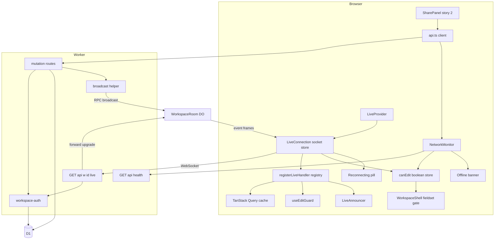

## Persistent and long-lived state
- **No new D1 tables or migrations.**
- **The Durable Object holds no data of record**, only hibernatable sockets. It is registered by the wrangler DO migration `tag = "v1"`, `new_sqlite_classes = ["WorkspaceRoom"]`.
- **Long-lived client state** is diagrammed in the capability sections:
  - socket lifecycle
  - network (offline) lifecycle
  - edit-guard lifecycle, now including `Conflicted`

## Changed flows
| Flow | Capability | Diagram |
|---|---|---|
| F1 Open share panel and copy | share.panel | **Owned by story 2** (its SharePanel sequence). Story 4 changes nothing in the flow and only verifies it, so it has no diagram here. |
| F2 Join via shared link | share.join | Yes |
| F3 Live connect and authenticate | live.room | Yes |
| F4 Mutation broadcast | live.broadcast | Yes |
| F5 Apply incoming events (batch, handlers, announce) | live.client_sync | Yes |
| F6 Socket drop, pause, reconnect, refetch | live.connection_status | Yes |
| F8 Offline detection and recovery | live.connection_status | Yes |
| F7 Conflict choice and gone notice | live.conflict_notice | Yes |

## Share panel requirements verified against story 2's single SharePanel

> Anchor: `share.panel`

## Contract
Owner decision (2026-09-25): **Link and Share are one panel.** Story 2 builds `features/share/SharePanel.tsx` and the single header **Share** button. The first-run "Save your link" dialog is the same panel, opened automatically. **Story 4 builds no share UI and adds no endpoint.** This capability pins the behaviour `prd.share_panel` needs from that shared component, and the link endpoint behind it.

Behaviour required of story 2's panel (the story 2 design must match; any mismatch is a story 2 bug):
- Opening Share shows the full link, a **Copy** action, and the exact statement text: `This link is the key to this workspace — for you and anyone you send it to. Anyone with it can see and change everything. Access can't be removed yet.`
- The link comes from story 2's `useWorkspaceLink(workspaceId)`:
  - When the secret is in memory (opened via `/w#<secret>`), it is built synchronously and no request is made.
  - Otherwise (opened via `/w/:workspaceId`), it is fetched from `GET /api/w/:id/link`.
- The Share button and Copy sit **outside** the edit-gating fieldset (live.connection_status), so sharing works while offline.

**Reused API (owned by story 2)** `GET /api/w/:id/link`:
- 200 `{link}`, with `Cache-Control: no-store`.
- 404 `not_found` for a missing cookie entry, a hash mismatch, or a soft-deleted workspace. The body is identical in each case.

## Implementation
- **No new files in story 4.** Story 2's `apps/web/src/features/share/SharePanel.tsx` and `ShareButton.tsx` are consumed as-is.
- `apps/web/src/features/share/copy.ts` (story 2) holds the statement text. The story 4 UI-component test imports it, so a wording change breaks the test deliberately.
- Clipboard, email and bookmark behaviour is tested by story 2 (tasks 2.10 and 2.14). Story 4 only pins the access statement, the link source and the offline availability.

## Tests
- Integration: TC-S01 to TC-S05 pin story 2's link endpoint.
- UI-component: TC-S06, TC-S07, TC-S08.
- E2E: W1 and W7.

## Join a workspace via shared link

> Anchor: `share.join`

## Contract
Joining reuses story 2's open flow unchanged; there is no invite concept.
- The browser loads `/w#<secret>`. Story 2's `main.tsx` starts `POST /api/workspaces/open {secret}` **in parallel with loading the Workspace route chunk**. There are no prompts or confirmation dialogs.
- **200** returns `{workspace:{id,name,version}}` plus `Set-Cookie tdl_ws`: the entry is added or refreshed and moved to the front, using the story 2/3 codec. Only then is the workspace id known. The workspace data queries (story 2/5 prefetch, keys `['ws', id, ...]`) then run in parallel with each other, and the live connection (live.room) starts.
- **This step is sequential by necessity:** the id comes from the open response. The earlier claim that "open and data run in parallel" was wrong and has been removed. The only parallelism is the open request against the route chunk load, and the data queries against each other.
- **404** `not_found` shows story 2's Not Found page, and no live connection is attempted.
- **Repeat opens are idempotent:** opening the same link again in a browser that already remembers it leaves one entry, moved to the front.

**F2 Join via shared link**
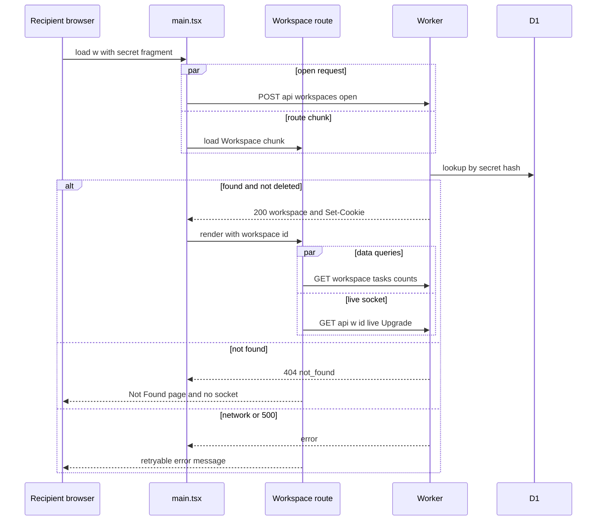

## Implementation
- **No new server code.** Integration tests pin the contract in `apps/api/test/share-join.test.ts`.
- `apps/web/src/routes/Workspace.tsx`: once story 2's open promise resolves, render `<LiveProvider workspaceId>` around the workspace shell. On 404, render Not Found and do not mount `LiveProvider`, so there is no 4404 race.

## Tests
- Integration: TC-J01 to TC-J04.
- E2E: W1 and W2.

## Live event contract and broadcast helper

> Anchor: `live.broadcast`

## Contract
`packages/shared/src/events.ts` exports a zod discriminated union `LiveEvent` on `type`:
```ts
type LiveEvent =
 | { type: 'workspace.updated'; entity: WorkspaceDTO; version: number; originClientId: string | null }
 | { type: 'project.upserted' | 'project.restored'; entity: ProjectDTO; version: number; originClientId: string | null }
 | { type: 'project.deleted'; entity: { id: string }; version: number; originClientId: string | null }
 | { type: 'task.upserted' | 'task.restored'; entity: TaskDTO; version: number; originClientId: string | null }
 | { type: 'task.deleted'; entity: { id: string }; version: number; originClientId: string | null }
 | { type: 'tasks.bulk'; entity: { ids: string[] }; version: number; originClientId: string | null };
```
The DTO schemas for project and task are placeholders here. Stories 5 and 7 fill them in, and the union shape is frozen. Frames larger than `LIVE_MAX_EVENT_BYTES` are rejected by `broadcast` and logged. `tasks.bulk` makes clients refetch instead of patching.

`apps/api/src/live/broadcast.ts`:
```ts
function broadcast(c: AppContext, workspaceId: string, event: Omit<LiveEvent,'originClientId'>): void
```
- Reads `X-Todoodle-Client-Id` (must be a UUID, otherwise `null`) as `originClientId`.
- Validates with `LiveEvent.parse`. Calls `c.executionCtx.waitUntil(env.WORKSPACE_ROOM.get(env.WORKSPACE_ROOM.idFromName(workspaceId)).broadcast(event))`.
- Never throws into the caller. A failing DO call is caught and logged with the request id, and the mutation response is unaffected.

**Rule for stories 5 to 8:** every successful D1 write calls `broadcast` exactly once, after the write commits, with the post-write entity and version. Validation failures and no-op writes never broadcast.

Wired in this story: story 2's `PATCH /api/w/:id` rename broadcasts `workspace.updated`.

**F4 Mutation broadcast**
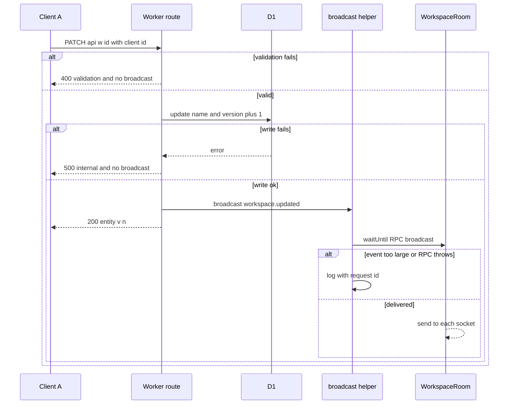

## Implementation
- `packages/shared/src/events.ts`: schemas and types. `packages/shared/src/limits.ts`: new constants from the overview.
- `apps/api/src/live/broadcast.ts`: the helper.
- `apps/api/src/routes/workspaces.ts`: add the `broadcast` call to rename.
- `apps/api/src/env.ts`: add `WORKSPACE_ROOM: DurableObjectNamespace<WorkspaceRoom>`.

## Tests
Unit: TC-E01 to TC-E06. Integration: TC-B01 to TC-B05.

## WorkspaceRoom Durable Object and authenticated live endpoint

> Anchor: `live.room`

## Contract
**Endpoint** `GET /api/w/:id/live`
- Requires `Upgrade: websocket`. Otherwise 426 `upgrade_required`.
- Requires `Origin` equal to the request URL's origin. Otherwise 403 `forbidden_client`, with no upgrade. This check runs before auth so a hostile origin learns nothing about existence.
- `workspace-auth` must pass (cookie entry for `:id`, constant-time hash match, not deleted). Otherwise 404 `not_found`, with the same body as every other 404.
- On success the request is forwarded to `WORKSPACE_ROOM.get(idFromName(id)).fetch(request)`, which returns 101.

**Durable Object `WorkspaceRoom`** (`apps/api/src/live/WorkspaceRoom.ts`, extends `DurableObject`):
- `fetch(req)`: creates a `WebSocketPair` and calls `this.ctx.acceptWebSocket(server)` (Hibernation API). Returns 101.
- Constructor: `this.ctx.setWebSocketAutoResponse(new WebSocketRequestResponsePair('ping','pong'))`, so heartbeats never wake the object.
- `broadcast(event: LiveEvent): Promise<{delivered:number, failed:number}>` (RPC): serialises once and `send`s to each `this.ctx.getWebSockets()`. A socket that throws is closed with 1011 and counted as failed.
- `webSocketMessage`: any non-ping client message is ignored, because clients never write through the socket.
- `webSocketClose` / `webSocketError`: close the socket. There is no other state to clean.
- Capacity target: at least 10 concurrent sockets per room. The DO limit is far higher, so this is not a design constraint.

**Socket lifecycle (DO side)**
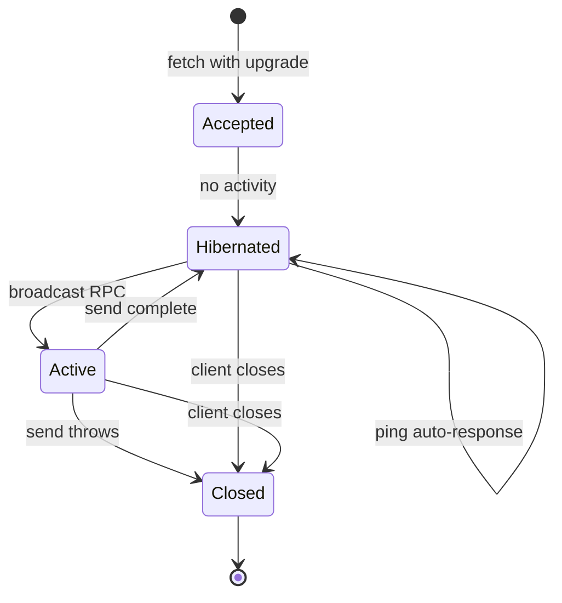

**F3 Live connect**
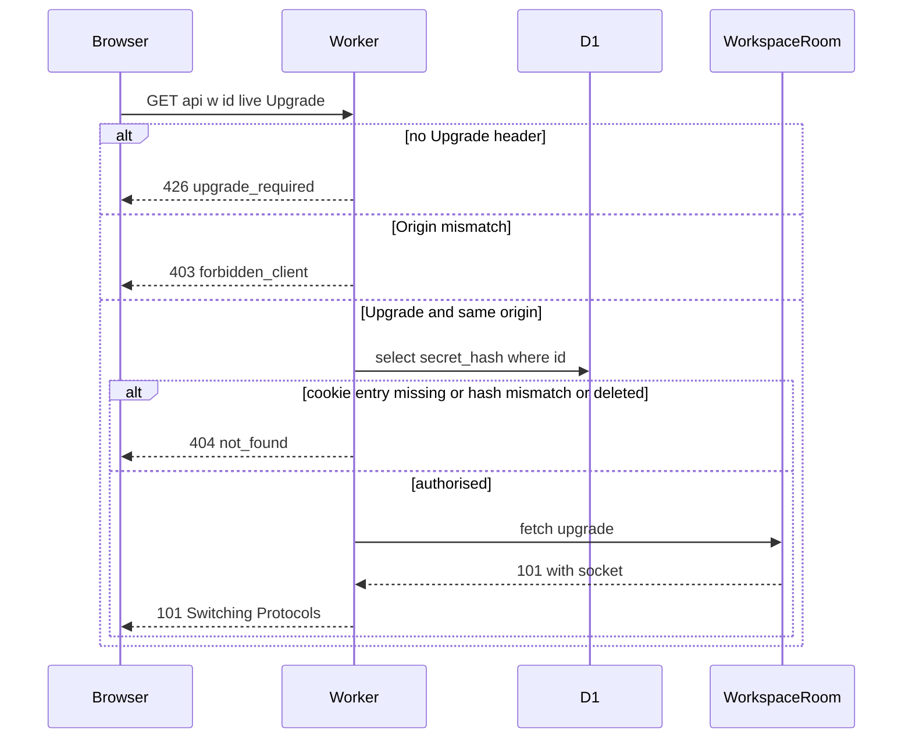

## Implementation
- `apps/api/src/live/WorkspaceRoom.ts`: the class. It is exported from `apps/api/src/index.ts` so wrangler binds it.
- `apps/api/src/routes/live.ts`: Upgrade and Origin checks, then `workspace-auth`, then forward.
- `apps/api/src/middleware/security-headers.ts`: `finalizeResponse` must not rebuild the body or headers of 101 responses, because that would drop `webSocket`. It passes 101 through untouched.
- `wrangler.toml`: `[[durable_objects.bindings]] name = "WORKSPACE_ROOM" class_name = "WorkspaceRoom"` in base, `env.staging` and `env.production`, plus `[[migrations]] tag = "v1" new_sqlite_classes = ["WorkspaceRoom"]`.
- `scripts/deploy.ts`: no change. DO migrations deploy with the Worker.

## Tests
Unit: TC-R01 and TC-R02. Integration: TC-L01 to TC-L10 and TC-R03 to TC-R06.

## Client live sync into query caches

> Anchor: `live.client_sync`

## Contract
**Client identity and connection**
- **`clientId`**: `crypto.randomUUID()`, generated once per tab at module load (advanced-init-once). `api.ts` sends it as `X-Todoodle-Client-Id` on every request.
- **One connection per workspace:** `<LiveProvider workspaceId>` owns exactly one `LiveConnection` for that workspace (client-event-listeners). Remounting its children never opens a second socket.

**Registry** (`features/live/registry.ts`, the single extension point for stories 5–8; architecture §12)
```ts
function registerLiveHandler<T extends LiveEvent['type']>(type: T, fn: (ctx: HandlerCtx, e: Extract<LiveEvent,{type:T}>) => void): () => void
```
- It is backed by `Map<type, Set<fn>>`, so several handlers per type all run (js-set-map-lookups). Registering the same function twice has no extra effect.
- It returns an unregister function that removes only that handler.
- Stories 5–8 register their handlers; nobody edits the dispatcher.
- `HandlerCtx = { queryClient, workspaceId }`.

**Dispatch** `dispatchEvent(ctx, event)`, per event:
1. Frames that fail `LiveEvent.safeParse` are ignored and trigger a `console.warn`.
2. If `event.originClientId === clientId`, the event is ignored as our own echo (the optimistic update already applied it).
3. If the type has no handlers, `invalidateQueries({queryKey:['ws', workspaceId]})` runs.
4. Otherwise every handler runs. Handlers must drop the event if the cached entity version is at least `event.version`, and return whether they applied it.
5. If any handler applied it, `editGuard.notify(event)` (live.conflict_notice) and `announcer.record(event)` run.

**Batching (replaces the old `startTransition` text)**
- **Batching:** `LiveConnection` queues incoming frames and flushes the queue once per animation frame. The flush runs every dispatch inside `notifyManager.batch(...)`, and `queryClient.ts` sets `notifyManager.setScheduler(requestAnimationFrame-or-timeout)`. The effect is that a burst of N events notifies each observer once.
- **Background tabs:** browsers pause `requestAnimationFrame` in hidden tabs, so while `document.visibilityState === 'hidden'` the scheduler falls back to `setTimeout(0)`. This keeps caches, counts and the document title current, meeting the PRD constraint that live updates don't need a focused tab.
- **Large views:** keeping large views responsive during bursts is the view's job, via `useDeferredValue` (stories 5, 7 and 8).

**Handlers registered in this story**
- `workspace.updated` → `setQueryData(['ws', id, 'workspace'])` if the event is newer.
- `tasks.bulk` → `invalidateQueries(['ws', id, 'tasks'])` and `invalidateQueries(['ws', id, 'counts'])`.

**Announcer** (`features/live/announcer.ts`, pure, with an injectable clock; `prd.announce_remote`)
- `record(event)` counts other-origin events that were applied.
- **Leading edge:** if the last announcement was at least `LIVE_ANNOUNCE_THROTTLE_MS` ago, it announces immediately.
- **Otherwise** it schedules one flush at `lastAnnouncedAt + LIVE_ANNOUNCE_THROTTLE_MS`.
- The message is `1 change made by someone else` or `N changes made by someone else`, and the count resets after each announcement.
- `<LiveAnnouncer>` renders a visually hidden `role="status" aria-live="polite"` region with the latest message, subscribed through `useSyncExternalStore`.

**Latency target:** changes appear in other clients within `LIVE_UPDATE_TARGET_MS`.

**F5 Apply incoming events**
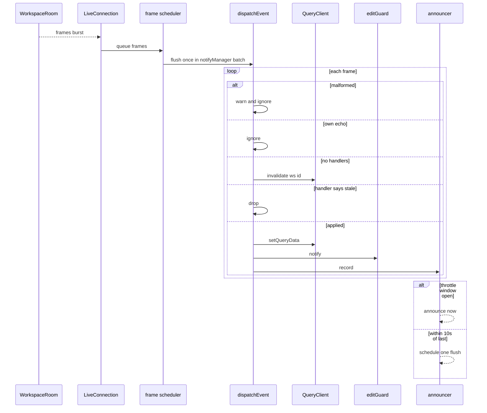

## Implementation
- `apps/web/src/features/live/clientId.ts`
- `apps/web/src/features/live/LiveConnection.ts`: a plain TS class outside React (rerender-use-ref-transient-values). It owns the socket, the frame queue and the visibility-aware scheduler, and exposes `subscribe`/`getSnapshot` for socket status.
- `apps/web/src/features/live/registry.ts` (`registerLiveHandler`) and `dispatch.ts` (`dispatchEvent`). There is no `registerEventApplier` or `applyEvent.ts`: one name only.
- `apps/web/src/features/live/announcer.ts` and `LiveAnnouncer.tsx`. The latter is mounted once in `WorkspaceShell`, with a static hoisted wrapper (rendering-hoist-jsx).
- `apps/web/src/features/live/LiveProvider.tsx`:
  - creates the connection with a lazy `useState` initialiser (rerender-lazy-state-init);
  - connects in an effect keyed on the primitive `workspaceId` (rerender-dependencies);
  - registers this story's handlers once per workspace.
- `apps/web/src/lib/queryClient.ts`: `notifyManager.setScheduler` as above.
- `apps/web/src/lib/queryKeys.ts` (story 2): story 4 uses only `ws(id)` and `workspace(id)`.
- `apps/web/src/lib/api.ts`: adds the client-id header.

## Tests
- Unit: TC-C01 to TC-C08 and TC-C11 to TC-C16.
- UI-component: TC-C09, TC-C10 and TC-C17.
- E2E: W2 and W3.

## Live paused vs offline, reconnect, and edit gating

> Anchor: `live.connection_status`

## Contract
There are two independent sources of state, following architecture §12.

**1. Socket status** (`LiveConnection`): `'connecting' | 'open' | 'reconnecting' | 'not_found'`
- **Backoff:** attempt n (counting from 0) waits `min(LIVE_RECONNECT_BASE_MS * 2^n, LIVE_RECONNECT_MAX_MS)` ±`LIVE_RECONNECT_JITTER`. The attempt count resets on `open`.
- **Heartbeat:** a `ping` goes out every `LIVE_PING_INTERVAL_MS`. If no `pong` arrives within one interval, the socket is closed and the state moves to `reconnecting`.
- **`pausedLong`:** true when the state has been `connecting` or `reconnecting` continuously for at least `LIVE_PAUSED_AFTER_MS`.
- **Not found:** close code `LIVE_CLOSE_NOT_FOUND`, or a 404 on the upgrade, moves to terminal `not_found`. It is never retried, and the route shows Not Found.
- **Heal:** a transition to `open` from `reconnecting` calls `invalidateQueries({queryKey:['ws', id]})` exactly once.

**2. Network status** (`NetworkMonitor`, `features/live/network.ts`): `'online' | 'offline'`
- **Initial state:** `navigator.onLine`. If that is false, it starts `offline` and probes.
- **→ offline:** a window `offline` event, or `api.ts` reporting a network-level failure (a fetch rejection or `TypeError`) on any request. HTTP error statuses (4xx or 5xx) do **not** mean offline.
- **Probing while offline:** `GET /api/health` with `cache: 'no-store'`. It runs immediately on the window `online` event, and otherwise on the backoff schedule above. A failed probe stays offline.
- **→ online:** a successful probe, which also calls `invalidateQueries(['ws', id])` exactly once.

**Derived UI** (`deriveLiveUi(socket, pausedLong, network)`, pure)
- `banner = network === 'offline'`
- `pill = !banner && pausedLong`
- `canEdit = network === 'online' && socket !== 'not_found'`
- **Losing only the socket never disables editing** (`prd.live_paused`).

**canEdit store** (`features/live/canEdit.ts`)
- `subscribe`/`getSnapshot` return the **boolean** `canEdit`, so `useCanEdit()` subscribers re-render only when it flips (rerender-derived-state).
- **Gate:** one `<fieldset disabled={!canEdit} className="contents">` in story 2's `WorkspaceShell` wraps the sidebar and main editing areas. There are no per-control hooks.
- **Outside the fieldset:** the header Share, navigation links and the "Show completed" toggle, because they don't mutate.
- **Typed text is kept:** disabling does not unmount inputs, so text already typed stays (`prd.offline_indicator`).
- **Guard for missed controls:** while `!canEdit`, `api.ts` mutating calls reject with `OfflineError` and send nothing.
- **Mid-flight failures:** a mutation already in flight that fails at network level rejects with `NetworkError`, flips the network to offline, and the caller rolls back. Story 5 keeps the failed text.

**Indicators**
- `<ReconnectingPill>`: a small `role="status"` pill reading "Reconnecting…", shown when `pill` is true.
- `<OfflineBanner>`: a top bar with `role="status" aria-live="polite"` reading "You're offline — changes can't be saved right now", shown when `banner` is true.
- Both render with a ternary (rendering-conditional-render).
- **Background tabs:** the socket and timers are not tied to focus or visibility.

**Socket lifecycle**
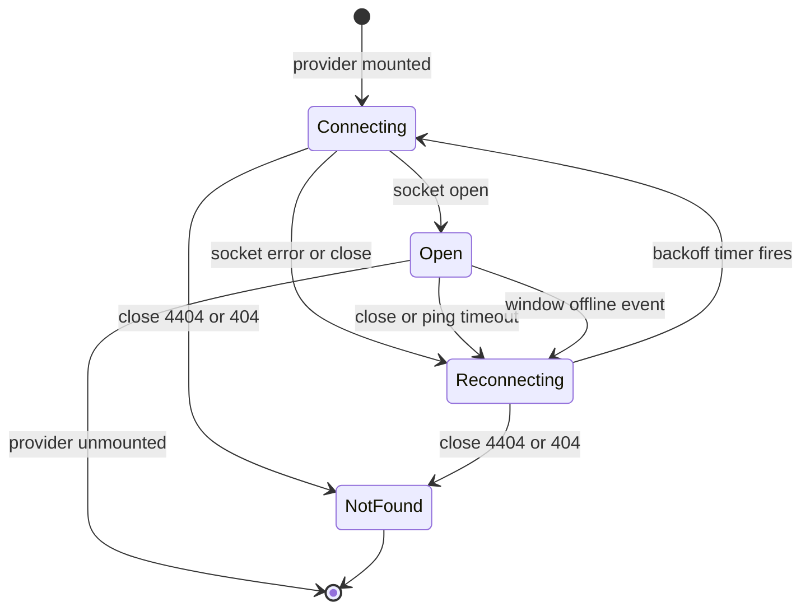
`pausedLong` is a timer overlay on `Connecting` and `Reconnecting`, not a separate state. It is set after `LIVE_PAUSED_AFTER_MS` and cleared on `Open`.

**Network lifecycle**
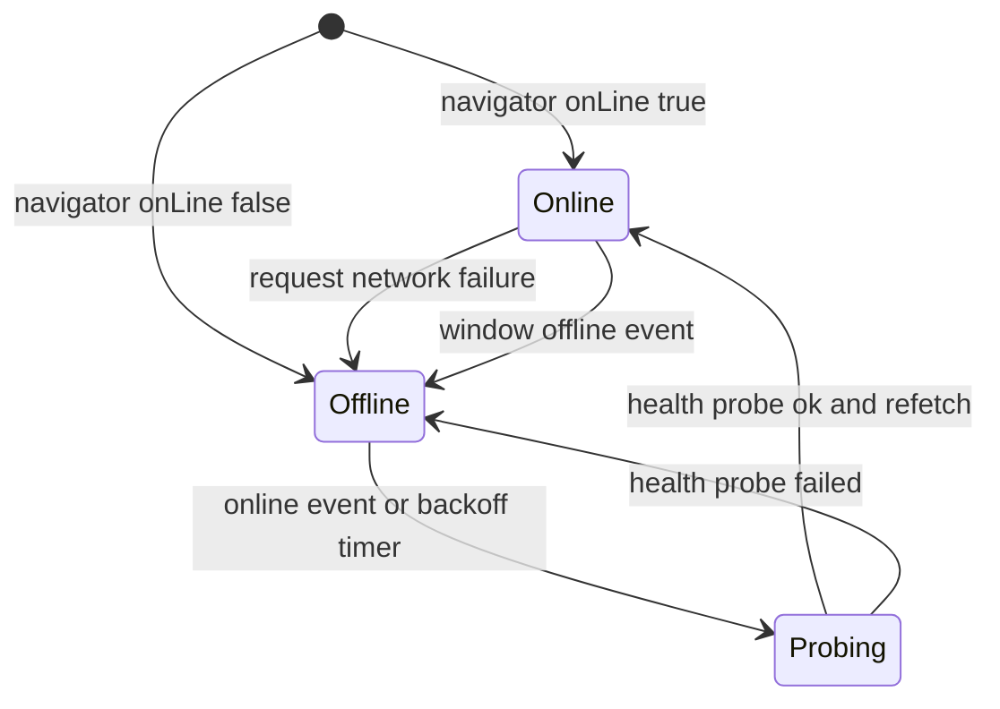

**F6 Socket drop, pause, reconnect**
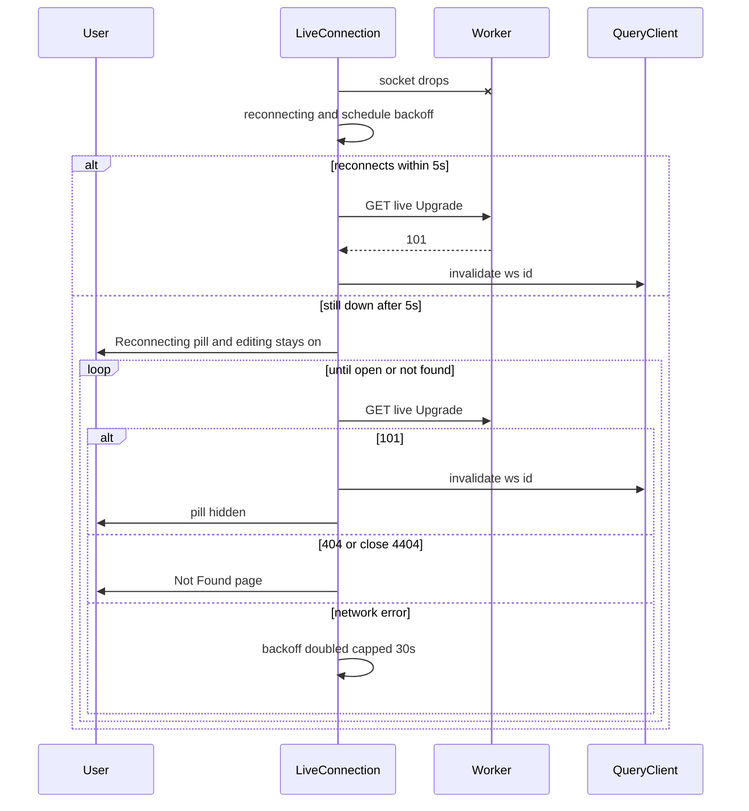

**F8 Offline detection and recovery**
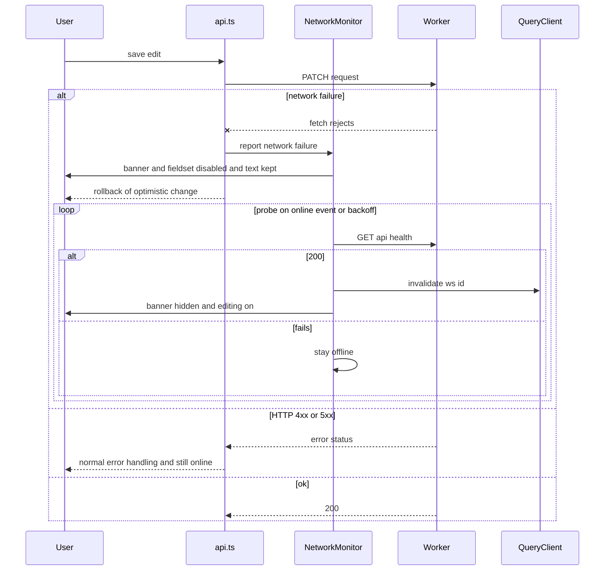

## Implementation
- `apps/web/src/features/live/LiveConnection.ts`: the socket state machine, heartbeat and `pausedLong` timer. `backoff.ts` is pure.
- `apps/web/src/features/live/network.ts`: `NetworkMonitor`, with window `online`/`offline` listeners registered once per app (client-event-listeners) and probing through `api.health()`.
- `apps/web/src/features/live/deriveLiveUi.ts`: pure.
- `apps/web/src/features/live/canEdit.ts`: the boolean store and `useCanEdit()`.
- `apps/web/src/features/live/ReconnectingPill.tsx` and `OfflineBanner.tsx`.
- `apps/web/src/features/workspace/WorkspaceShell.tsx` (story 2): add the `<fieldset disabled>` gate, and move Share and navigation outside it.
- `apps/web/src/lib/api.ts`: classifies `TypeError` as `NetworkError` and notifies `NetworkMonitor`, and adds the `OfflineError` guard.
- `apps/web/src/lib/errors.ts`: `OfflineError` and `NetworkError`.

## Tests
- Unit: TC-O01, TC-O02, TC-O05 to TC-O08, TC-O13 to TC-O17, and TC-M01 to TC-M10.
- UI-component: TC-O09 to TC-O12, TC-O18 and TC-O19.
- E2E: W4 and W8.

## Conflict choice and deleted-while-editing notices

> Anchor: `live.conflict_notice`

## Contract
The server policy is last write wins (architecture §7). This capability is the reusable client mechanism that story 6 uses for tasks and story 7 for projects. The hook name is `useEditGuard`, per architecture §12.

```ts
function useEditGuard<F extends Record<string,string|null>>(opts: {
  key: string                 // 'workspace:<id>' | 'task:<id>' | 'project:<id>'
  fields: F                   // current draft (Editing) or last saved values
  entityLabel: string         // 'workspace' | 'task' | 'project'
  save: (patch: Partial<F>) => Promise<void>   // consumer's normal save
}): {
  arm(): void; disarm(): void; markSaved(saved: F): void
  conflict: null | { mine: Partial<F>; theirs: Partial<F> }   // only changed fields
  useMine(): Promise<void>; keepTheirs(): void
}
```
**Guard states** are Idle, Editing, RecentlySaved and Conflicted. The guard reacts only to events for its `key` whose `originClientId !== clientId`.
- **Idle** ignores every event.
- **Editing** (edit UI open), or **RecentlySaved** (within `CONFLICT_RECENT_EDIT_WINDOW_MS` of our own successful save), then:
  - **an upsert with changed watched fields** moves to **Conflicted**. `mine` holds the draft or saved values of the changed fields, and `theirs` holds the event's values.
  - **an upsert with no field change** stays in the current state.
  - **a deletion** fires the gone path: close the editor, toast `This <label> was deleted`, and go to Idle.
- **Conflicted:**
  - **a newer upsert** updates `theirs` and leaves `mine` unchanged.
  - **a deletion** fires the gone path, discards `mine`, and goes to Idle.
  - **`useMine()`** calls `save(mine)`:
    - **success** moves to RecentlySaved;
    - **`GoneError` (410)** fires the gone path;
    - **network or other error** stays Conflicted, keeping `mine`, and the consumer shows the error.
  - **`keepTheirs()`**, or closing the editor, moves to Idle.

**Presentation**, via `apps/web/src/features/live/ConflictNotice.tsx`:
- **Editor open:** an inline notice with `role="alert"` reading `Someone else changed this just now.` It shows the other person's value, with buttons **Use my version** and **Keep theirs**. The field displays `theirs`, and `mine` is never discarded until the user chooses. The notice persists until a choice is made or the editor closes.
- **Editor closed (RecentlySaved):** a persistent sonner toast (`duration: Infinity`, `id = key`, so a later conflict on the same key replaces it) with the same text and both actions.

**Errors**
- `api.ts` maps HTTP 410 `gone` to `GoneError`.
- `handleMutationError(err, {key, entityLabel})` rolls back the optimistic update, removes the entity from `['ws', id, ...]` caches, and toasts `This <label> was deleted`. The edit is never applied.

**Edit guard lifecycle**
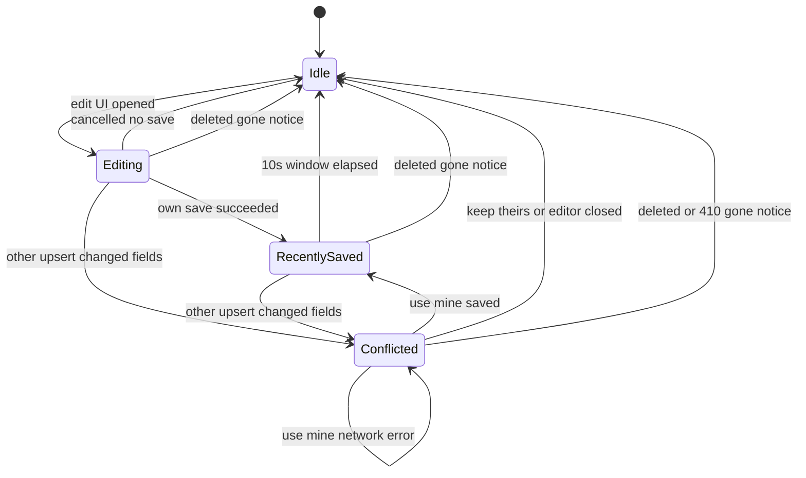

**F7 Conflict choice and gone**
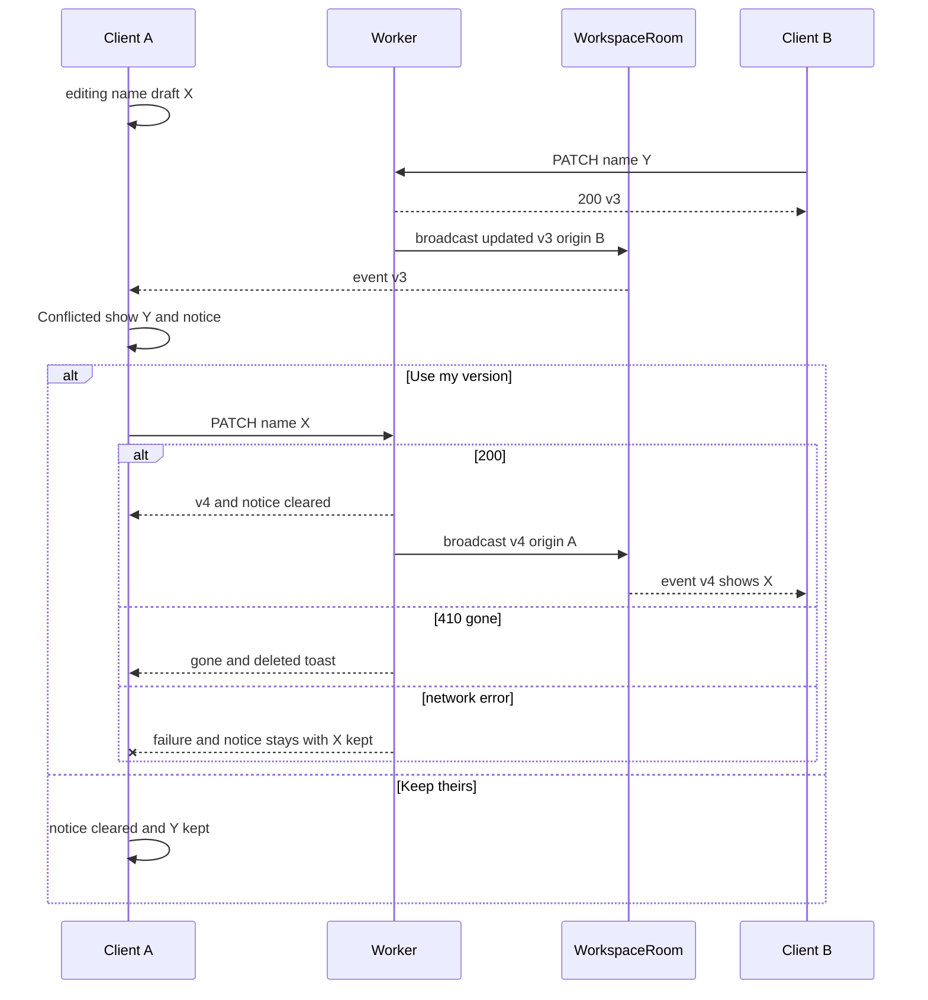
In this story the guard is wired to the workspace rename only, where `onGone` is unreachable because workspaces cannot be deleted in the MVP. The gone paths are exercised with a synthetic `task` key in unit and component tests, and end to end by story 6.

## Implementation
- `apps/web/src/features/live/editGuard.ts`: a pure state machine per key, plus a `Map<key, guard>` registry. `notify(event)` is called from `dispatchEvent`.
- `apps/web/src/features/live/useEditGuard.ts`: holds `save` and the current `fields` in refs (advanced-event-handler-refs), so arming doesn't re-subscribe on every render. It exposes `conflict` through `useSyncExternalStore` per key.
- `apps/web/src/features/live/ConflictNotice.tsx`: inline notice. `showConflictToast.ts` for the editor-closed case.
- `apps/web/src/lib/errors.ts`: `GoneError` and `handleMutationError`.
- `apps/web/src/features/workspace/WorkspaceName.tsx` (story 2): adopts `useEditGuard({key:'workspace:'+id, fields:{name}, entityLabel:'workspace', save})`.

## Tests
- Unit: TC-G01 to TC-G21.
- UI-component: TC-G22 to TC-G27.
- E2E: W5.

## Test Strategy

## Test scopes and boundaries
| Capability | Unit | Integration | UI-component | E2E | Boundary justification |
|---|---|---|---|---|---|
| share.panel | Not required: story 4 adds no logic. The panel is story 2's, and its string and clipboard logic is unit-tested there. | Required: pins story 2's link endpoint behind auth, which the panel depends on | Required: pins the access statement, both link sources and offline availability on the shared component | Required | The route boundary proves nothing leaks without a valid cookie. The browser proves the real panel shows the right link in both entry routes. |
| share.join | Not required: no new logic. The open flow is unit-tested in story 2. | Required: pins the open contract | Not required: no new component. The route render is covered by e2e. | Required | Joining is a cross-browser flow. Only e2e shows two independent cookie jars. |
| live.broadcast | Required | Required | Not applicable: no UI | Not applicable as its own case: exercised through W2, W3 and W5 | Contract errors are request-handling behaviour |
| live.room | Required | Required | Not applicable: server only | Not applicable as its own case: exercised through W2 and W6 | Upgrade, auth and the Durable Object live at the Worker boundary (`SELF.fetch`) |
| live.client_sync | Required | Not applicable: client only | Required | Required | Dispatch, batching and throttling are pure logic. Propagation needs real sockets. |
| live.connection_status | Required | Not applicable: client only. The health probe endpoint is story 1's and integration-tested there. | Required | Required | State machines use fake timers. Real outages use Playwright offline emulation and WebSocket routing. |
| live.conflict_notice | Required | Not applicable: client only | Required | Required | The guard state machine is pure. The notice, the buttons and field replacement need a DOM. |

## Dimensions crossed
- **D1 Auth state:** valid cookie entry / no cookie / cookie for another workspace / tampered secret / workspace soft-deleted.
- **D2 Request shape:** WebSocket upgrade vs plain GET, crossed with Origin same / cross / missing.
- **D3 Event relation:** origin self / other / null, crossed with version older / equal / newer than the cache.
- **D4 Socket state:** connecting / open / reconnecting, each with `pausedLong` false or true, plus not_found.
- **D5 Network state:** online / offline.
- **D6 Guard state × event kind:** {Idle, Editing, RecentlySaved, Conflicted} × {other upsert changed, other upsert same, other deleted, own echo}.
- **D7 Link source:** secret in memory (`/w#secret`) / no secret (`/w/:workspaceId`).
- **D8 Announcement timing:** first event / event within the throttle window / event after the window.

## Equivalence classes
Each dimension's classes are exhaustive and non-overlapping.
- **D1:** the five classes partition every request to `/api/w/:id/*` (TC-L05 to TC-L09, TC-S02 to TC-S05).
- **D3:** 3 origins × 3 version relations = 9 combinations (TC-C01 to TC-C06).
- **D4 × D5:** the effective socket classes are {connecting-short, open, reconnecting-short, paused-long, not_found}, crossed with {online, offline}. That gives 10 combinations, each a row in the derived-UI matrix (TC-M01 to TC-M10).
- **D6:** 16 combinations, each a row in the guard matrix (TC-G01 to TC-G16). Actions on Conflicted are TC-G17 to TC-G21.
- **D7:** the two entry routes (TC-S06/TC-S07, W1/W7).
- **D8:** three timing classes (TC-C14, TC-C15).

## Boundary values
- **Backoff:** attempt 0 → 1 s; 4 → 16 s; 5 → 30 s (the cap); 50 → 30 s; jitter at both ±20% bounds.
- **Paused pill:** 4,999 ms → hidden; 5,000 ms → shown.
- **Recent-edit window:** 9,999 ms → armed; 10,000 ms → Idle.
- **Announce throttle:** event at 9,999 ms after the last announcement → deferred; at 10,000 ms → immediate.
- **Event size:** exactly `LIVE_MAX_EVENT_BYTES` → accepted; one byte more → rejected.
- **Concurrency:** 0, 1 and 10 sockets.
- **Batch:** 1 frame and 50 frames in one animation frame.

## Case table
| Ref | Level | Capability | Given (state before) | When | Then (state after / result) |
|---|---|---|---|---|---|
| TC-S01 | integration | share.panel | Valid cookie for W | GET /api/w/W/link | 200, link `origin/w#<secret>` equals the created secret, Cache-Control no-store |
| TC-S02 | integration | share.panel | No cookie | GET link | 404 not_found, body identical to TC-S03 |
| TC-S03 | integration | share.panel | Cookie for V only | GET W link | 404 not_found |
| TC-S04 | integration | share.panel | W entry with tampered secret | GET link | 404 not_found |
| TC-S05 | integration | share.panel | W soft-deleted via /test seed | GET link | 404 not_found |
| TC-S06 | ui-component | share.panel | Story 2 SharePanel, secret in memory | Open via Share | Link `origin/w#secret`. Statement equals the `copy.ts` access text, including "Access can't be removed yet". Zero requests. |
| TC-S07 | ui-component | share.panel | No secret (`/w/:id`), MSW returns link | Open | Loading, then the link is shown |
| TC-S08 | ui-component | share.panel | canEdit false (offline) | Render header and open Share | Share and Copy enabled (outside the fieldset) |
| TC-J01 | integration | share.join | B has no cookie, W exists | POST open W secret | 200, Set-Cookie has the W entry first |
| TC-J02 | integration | share.join | B cookie holds V then W | POST open W | Exactly one W entry, now first. V retained. |
| TC-J03 | integration | share.join | Unknown secret | POST open | 404, no Set-Cookie |
| TC-J04 | integration | share.join | B has joined W | PATCH rename with B's cookie | 200, D1 name changed |
| TC-E01 | unit | live.broadcast | None | Parse each of the 9 valid variants | All succeed |
| TC-E02 | unit | live.broadcast | None | Parse an unknown type | Fails |
| TC-E03 | unit | live.broadcast | None | Parse without version | Fails |
| TC-E04 | unit | live.broadcast | Header not a UUID | Derive originClientId | null |
| TC-E05 | unit | live.broadcast | Event exactly at max bytes | Size check | Accepted |
| TC-E06 | unit | live.broadcast | Event at max bytes + 1 | Size check | Rejected and logged, no RPC |
| TC-B01 | integration | live.broadcast | Two sockets on W | Rename with client-id X | Both receive workspace.updated with the new version and origin X |
| TC-B02 | integration | live.broadcast | Sockets on W and V | Rename W | V receives nothing |
| TC-B03 | integration | live.broadcast | Socket on W | Rename with empty name | 400, no frame within 500 ms |
| TC-B04 | integration | live.broadcast | DO stub throws | Rename | 200, D1 updated, error logged with request id |
| TC-B05 | integration | live.broadcast | Zero sockets | Rename | 200, no error |
| TC-B06 | integration | live.broadcast | Socket open, name already X | Rename to X | 200, version unchanged, no frame |
| TC-R01 | unit | live.room | 3 fake sockets, one throws | broadcast | delivered 2, failed 1, thrower closed with 1011 |
| TC-R02 | unit | live.room | Socket open | webSocketMessage with arbitrary text | No broadcast, no state change |
| TC-L01 | integration | live.room | Valid cookie, same origin | Upgrade | 101 |
| TC-L02 | integration | live.room | Valid cookie | Plain GET | 426 |
| TC-L03 | integration | live.room | Valid cookie, Origin evil.example | Upgrade | 403, no socket |
| TC-L04 | integration | live.room | Valid cookie, no Origin | Upgrade | 403 |
| TC-L05 | integration | live.room | No cookie | Upgrade | 404, body identical to TC-L06 |
| TC-L06 | integration | live.room | Cookie for V only | Upgrade W | 404 |
| TC-L07 | integration | live.room | Tampered secret | Upgrade | 404 |
| TC-L08 | integration | live.room | W soft-deleted | Upgrade | 404 |
| TC-L09 | integration | live.room | Nonexistent id | Upgrade | 404, same body as TC-L05 |
| TC-L10 | integration | live.room | 101 response | Inspect | `webSocket` present; finalizeResponse passed it through |
| TC-R03 | integration | live.room | 10 sockets | Rename | All 10 receive |
| TC-R04 | integration | live.room | Socket open | Send `ping` | Receives `pong` |
| TC-R05 | integration | live.room | Socket A closed | Rename | Others receive, no error |
| TC-R06 | integration | live.room | Socket on W | Client sends a JSON frame | No echo to others |
| TC-C01 | unit | live.client_sync | Cache `['ws',id,'workspace']` v2 | Other-origin event v3 | Cache v3 with the new name |
| TC-C02 | unit | live.client_sync | Cache v3 | Other-origin v3 | Unchanged |
| TC-C03 | unit | live.client_sync | Cache v3 | Other-origin v2 | Unchanged (stale) |
| TC-C04 | unit | live.client_sync | Cache v2 | Self-origin v1, v2 and v3 | Unchanged, guard and announcer not called |
| TC-C05 | unit | live.client_sync | Cache v2 | Null-origin v3 / v2 / v1 | Applied / ignored / ignored |
| TC-C06 | unit | live.client_sync | Empty cache | Other-origin v1 | Cache set |
| TC-C07 | unit | live.client_sync | No handler for type | Dispatch | `invalidateQueries({queryKey:['ws',id]})` called once |
| TC-C08 | unit | live.client_sync | None | Malformed frame | Ignored, warning, no throw |
| TC-C11 | unit | live.client_sync | Handlers h1 and h2 on task.upserted; h1 registered twice | Dispatch one event, then unregister h1 and dispatch again | First dispatch: h1 once, h2 once. Second: only h2. |
| TC-C12 | unit | live.client_sync | Fake rAF, one cache observer | 50 frames arrive before the frame fires | One `notifyManager.batch` flush; observer notified once; all 50 applied |
| TC-C13 | unit | live.client_sync | `visibilityState` hidden | 3 frames arrive | Applied via the setTimeout path without any rAF tick |
| TC-C14 | unit | live.client_sync | Announcer idle for 10,000 ms or more | One applied other-origin event | Immediately announces `1 change made by someone else` |
| TC-C15 | unit | live.client_sync | Last announcement at t=0 | Events at 1 s, 2 s, 3 s | Nothing at 9,999 ms; `3 changes made by someone else` at 10,000 ms; count reset |
| TC-C16 | unit | live.client_sync | Announcer idle | Own-echo, stale and malformed events | Nothing recorded or announced |
| TC-C09 | ui-component | live.client_sync | Provider mounted, children re-render 5 times | Count sockets | Exactly one constructed |
| TC-C10 | ui-component | live.client_sync | Mock socket emits workspace.updated | Render header | New name displayed |
| TC-C17 | ui-component | live.client_sync | Provider mounted | Announcer emits a message | Visually hidden region has `role=status` and `aria-live=polite` with the message text |
| TC-O01 | unit | live.connection_status | None | backoff(0), (4), (5), (50) | 1 s, 16 s, 30 s, 30 s |
| TC-O02 | unit | live.connection_status | Random at min and max | backoff(2) | 3.2 s and 4.8 s |
| TC-O05 | unit | live.connection_status | Open | No pong within the interval | Socket closed, reconnecting |
| TC-O06 | unit | live.connection_status | Reconnecting, pausedLong | Socket opens | open; `invalidateQueries(['ws',id])` exactly once; attempt count 0; pausedLong false |
| TC-O07 | unit | live.connection_status | Connecting | Close 4404 | not_found; no attempts over 60 s of fake time |
| TC-O08 | unit | live.connection_status | Open, online | Window offline event | Network offline and socket reconnecting |
| TC-O13 | unit | live.connection_status | Online | api fetch rejects with TypeError / returns 500 | Offline / stays online |
| TC-O14 | unit | live.connection_status | Offline | Backoff probes: fail, fail, ok | Offline, offline, then online; invalidate once; probe count 3 |
| TC-O15 | unit | live.connection_status | Offline | Window online event | Probe issued immediately; online on 200 |
| TC-O16 | unit | live.connection_status | `navigator.onLine` false at start | Monitor constructed | Offline, one probe scheduled |
| TC-O17 | unit | live.connection_status | Online, canEdit subscriber | Socket open → reconnecting → open | Subscriber notified zero times (boolean unchanged) |
| TC-M01 | unit | live.connection_status | connecting-short, online | deriveLiveUi | pill no, banner no, canEdit yes |
| TC-M02 | unit | live.connection_status | open, online | deriveLiveUi | pill no, banner no, canEdit yes |
| TC-M03 | unit | live.connection_status | reconnecting-short, online | deriveLiveUi | pill no, banner no, canEdit yes |
| TC-M04 | unit | live.connection_status | paused-long, online | deriveLiveUi | pill yes, banner no, canEdit yes |
| TC-M05 | unit | live.connection_status | not_found, online | deriveLiveUi | pill no, banner no, canEdit no |
| TC-M06 | unit | live.connection_status | connecting-short, offline | deriveLiveUi | pill no, banner yes, canEdit no |
| TC-M07 | unit | live.connection_status | open, offline | deriveLiveUi | pill no, banner yes, canEdit no |
| TC-M08 | unit | live.connection_status | reconnecting-short, offline | deriveLiveUi | pill no, banner yes, canEdit no |
| TC-M09 | unit | live.connection_status | paused-long, offline | deriveLiveUi | pill no (banner takes precedence), banner yes, canEdit no |
| TC-M10 | unit | live.connection_status | not_found, offline | deriveLiveUi | pill no, banner yes, canEdit no |
| TC-O09 | ui-component | live.connection_status | Open, online | Render shell | No pill, no banner, fieldset enabled |
| TC-O10 | ui-component | live.connection_status | Socket paused for 5,000 ms, online | Render; edit rename; save | Pill `Reconnecting…` with role=status; rename editable; PATCH sent (MSW sees 1 request) |
| TC-O11 | ui-component | live.connection_status | Network offline | Render | Banner exact text with role=status; fieldset disabled; rename input disabled; Share enabled |
| TC-O12 | ui-component | live.connection_status | Rename input holds draft `Groceries 2` | Go offline, then back online | Input value `Groceries 2` retained throughout; input never remounted (same DOM node) |
| TC-O18 | ui-component | live.connection_status | Offline | Call api mutate | Rejects with OfflineError; MSW saw zero requests |
| TC-O19 | ui-component | live.connection_status | Online; a `useCanEdit` consumer | Socket status flips 5 times | Consumer render count unchanged |
| TC-G01 | unit | live.conflict_notice | Idle | Other upsert changed | No change, no callback |
| TC-G02 | unit | live.conflict_notice | Idle | Other upsert same | No change |
| TC-G03 | unit | live.conflict_notice | Idle | Other deleted | No change |
| TC-G04 | unit | live.conflict_notice | Idle | Own echo | No change |
| TC-G05 | unit | live.conflict_notice | Editing, draft X | Other upsert name Y | Conflicted `{mine:{name:X}, theirs:{name:Y}}` |
| TC-G06 | unit | live.conflict_notice | Editing | Other upsert same values | Stays Editing |
| TC-G07 | unit | live.conflict_notice | Editing | Other deleted | Gone callback; Idle |
| TC-G08 | unit | live.conflict_notice | Editing | Own echo | Stays Editing |
| TC-G09 | unit | live.conflict_notice | RecentlySaved at 9,999 ms, saved X | Other upsert Y | Conflicted with mine X |
| TC-G10 | unit | live.conflict_notice | RecentlySaved at 10,000 ms | Other upsert Y | Idle (window elapsed); no conflict |
| TC-G11 | unit | live.conflict_notice | RecentlySaved | Other deleted | Gone; Idle |
| TC-G12 | unit | live.conflict_notice | RecentlySaved | Own echo | Stays RecentlySaved |
| TC-G13 | unit | live.conflict_notice | Conflicted mine X, theirs Y | Other upsert Z | Conflicted mine X, theirs Z |
| TC-G14 | unit | live.conflict_notice | Conflicted | Other upsert with the same values as theirs | Unchanged |
| TC-G15 | unit | live.conflict_notice | Conflicted | Other deleted | Gone; Idle; mine discarded |
| TC-G16 | unit | live.conflict_notice | Conflicted | Own echo | Unchanged |
| TC-G17 | unit | live.conflict_notice | Conflicted mine `{name:X}` (description unchanged) | useMine, save resolves | save called once with `{name:X}` only; RecentlySaved |
| TC-G18 | unit | live.conflict_notice | Conflicted | keepTheirs | Idle; save not called |
| TC-G19 | unit | live.conflict_notice | Conflicted | useMine, save rejects GoneError | Gone; Idle |
| TC-G20 | unit | live.conflict_notice | Conflicted mine X | useMine, save rejects NetworkError | Stays Conflicted; mine X kept; error returned |
| TC-G21 | unit | live.conflict_notice | Conflicted | disarm (editor closed) | Idle (keep theirs) |
| TC-G22 | ui-component | live.conflict_notice | Editing workspace name, draft X | Other event name Y | Input shows Y; inline notice `Someone else changed this just now.` with role=alert, showing Y, with Use my version and Keep theirs |
| TC-G23 | ui-component | live.conflict_notice | State as TC-G22 | Click Use my version | PATCH body `{name:X}`; notice removed; input X |
| TC-G24 | ui-component | live.conflict_notice | State as TC-G22 | Press Tab to the buttons, then Enter on Keep theirs | Both buttons are in tab order; notice removed; no PATCH |
| TC-G25 | ui-component | live.conflict_notice | RecentlySaved (editor closed) | Two conflicts on the same key, then 60 s of fake time | One toast (the second replaced the first), still visible, both actions present |
| TC-G26 | ui-component | live.conflict_notice | Synthetic task editor; MSW returns 410 | Save | Rollback; entity removed from `['ws',id,...]` caches; toast `This task was deleted` |
| TC-G27 | ui-component | live.conflict_notice | Editing | Own-echo event | No notice |

## Negative scenarios (explicit)
The system must NOT do the following:
- **Leak a link or socket without valid access:** TC-S02–S05, TC-L03–L09.
- **Propagate to another workspace:** TC-B02.
- **Broadcast on a failed or no-op write:** TC-B03, TC-B06.
- **Fail the write when broadcast fails:** TC-B04.
- **Apply stale or echoed events:** TC-C02–C04.
- **Announce echo, stale or malformed events:** TC-C16.
- **Retry after not_found:** TC-O07.
- **Treat HTTP errors as offline:** TC-O13.
- **Disable editing when only the socket is down:** TC-M01–M04, TC-O10.
- **Send requests while offline:** TC-O18.
- **Discard typed text on going offline:** TC-O12.
- **Re-render gate consumers on unrelated status changes:** TC-O17, TC-O19.
- **Show spurious conflict notices:** TC-G01–G04, TC-G06, TC-G08, TC-G12, TC-G14, TC-G16, TC-G27.
- **Discard the user's version without their choice:** TC-G13, TC-G20.
- **Save when Keep theirs is chosen:** TC-G18, TC-G24.
- **Deliver events without access:** W6.

## Mock vs real
| Store or service | Integration | Unit | UI-component | E2E | Why |
|---|---|---|---|---|---|
| D1 | Real Miniflare D1 with migrations | Not used: pure logic | Not used: HTTP mocked by MSW | Real local D1 | Source of truth for auth and version; never mocked where it is under test |
| WorkspaceRoom DO | Real via binding. TC-B04 overrides it with a throwing stub. | Class with a fake `ctx` | Not used: client tests use mock-socket | Real | Only TC-B04 mocks it, because that failure cannot otherwise be induced |
| WebSocket | Real (`SELF.fetch` upgrade) | Fake socket object | `mock-socket` server | Real. W8 uses `page.routeWebSocket` to drop only the socket. | Unit and component levels test logic, not transport |
| HTTP incl. /api/health probe | Real | Not used: `api.health` injected as a stub returning scripted results | MSW | Real. W4 uses `context.setOffline`. | Probe outcomes must be scripted at unit level to hit each branch |
| Clipboard | Not used: server-side | Not used: no clipboard logic | Not used: story 2 owns the clipboard tests | Real, with permission granted (Chromium) | Story 4 only verifies that the link shown and copied is right |
| Timers, rAF, visibility | Real | Fake timers, fake rAF, stubbed `visibilityState` | Fake timers | Real | Thresholds and batching need exact control |

## E2E workflows (Playwright; independent browser contexts, so separate cookie jars)
| Ref | Workflow | Asserts |
|---|---|---|
| W1 | A creates a workspace, opens Share and copies. B opens the link. | B sees the same workspace with no prompts. B's home page lists it. The clipboard equals A's link. |
| W2 | A and B are in the same workspace. A renames it. | B shows the new name within 5 s without reloading. B's polite live region contains `1 change made by someone else`. |
| W3 | 10 contexts join. One renames. | All 10 update within 5 s |
| W4 | B is `setOffline(true)` for 8 s with a draft typed into rename, while A renames. B comes back online. | During the outage: banner shown, rename disabled, draft retained. After recovery: banner gone, editing on, and B's cache shows A's rename (healed by refetch). |
| W5 | A is editing the name (draft X). B renames to Y. A clicks Use my version. | A sees the notice showing Y. After the click, both A and B show X. |
| W6 | Context C has no cookie and opens `/api/w/<id>/live` from a page script | Refused; no events received |
| W7 | B returns via the remembered list (`/w/:workspaceId`) and opens Share | Same link as A's copy (fetched); copying works |
| W8 | B's WebSocket is dropped via `routeWebSocket` while HTTP still works | After 5 s the pill `Reconnecting…` shows. B renames successfully, and A sees it. When the socket is restored, the pill disappears and the rename A made during the outage appears in B. |

## Fixture realism
- Workspaces are created with the real `POST /api/workspaces`, so secrets and cookies are real 256-bit values.
- The only seeding is a `/test/*` soft delete (TC-S05, TC-L08).
- Event fixtures come from the zod types, with 16-byte hex ids and UUID client ids.
- Names include unicode and a 120-character boundary name.
- Drafts are realistic strings, such as `Groceries 2`.

## Not covered (deliberately)
- **Scale and production behaviour:** more than 10 concurrent clients, and Durable Object behaviour across regions or evictions. Miniflare doesn't model these.
- **Other browsers:** Safari and Firefox WebSocket quirks, since e2e uses Chromium only.
- **Captive portals:** a portal that returns 200 HTML for `/api/health` would count as online. The probe checks only the status.
- **Handlers and gone paths owned by stories 5–8:** their task and project handlers, and the gone path end to end (story 6).
- **Share panel internals owned by story 2:** clipboard fallback, email and bookmark actions. They were moved to story 2 with the panel.
- **Link revocation:** out of PRD scope.

