# Technical Design

Tasks table + idempotent create API + Inbox list/count API, app shell with sidebar, task list, inline quick add with Q shortcut, optimistic create with failed/retry/discard. Follows docs/architecture.md.

## Overview

## Scope
Story 5 introduces tasks. It adds:
- **Worker:** migration `0002_tasks.sql`, an idempotent create endpoint, an Inbox list endpoint and a counts endpoint.
- **SPA:**
  - the workspace app shell: a sidebar on desktop, a drawer plus floating add button on phones, and light/dark tokens;
  - the app-wide keyboard shortcut registry and the `?` shortcuts panel;
  - the Inbox view, and the task list with roving-tabindex navigation, loading skeletons and a failed-load retry;
  - the inline quick-add box with the `Q` shortcut, non-truncating length counters and a destination chip;
  - optimistic creation with failed/retry/discard handling.

Everything follows `docs/architecture.md` (§4 auth, §5 data model, §6 API conventions, §7 live updates, §8 frontend, §9 constants, §10 test levels). **§12, binding frontend conventions, overrides any earlier text in this design.** The revision of 2026-09-25 applies the React best-practices audit and the UX review (`specs/general/UI-IMPROVEMENTS.md`).

## Dependencies (consumed, not built here)
| From | Interface used | Path |
|---|---|---|
| Story 1 | Hono app, `finalizeResponse`, validate middleware, `/test/*` gate, vitest + Playwright harness | `apps/api/src/app.ts`, `apps/api/src/middleware/*`, `e2e/` |
| Story 2 | `workspace-auth` middleware (cookie -> `c.var.workspace`), CSRF header check, workspace route, `api.ts` client, `queryKeys.ts` factory (story 5 adds the `tasks` and `counts` keys), `POST /api/workspaces` for fixtures | `apps/api/src/middleware/workspace-auth.ts`, `apps/web/src/routes/Workspace.tsx`, `apps/web/src/lib/api.ts`, `apps/web/src/lib/queryKeys.ts` |
| Story 4 | `broadcastEvent(env, ctx, workspaceId, event)`; client `registerLiveHandler(type, fn)` (a `Map<type, Set<fn>>` registry that delivers events coalesced per animation frame); `clientId` context; shell-level `<fieldset disabled>` edit gating | `apps/api/src/live/broadcast.ts`, `apps/web/src/features/live/registry.ts` |

## Owned for other stories (architecture §12)
- **`apps/web/src/lib/shortcuts.ts`:** the only global keydown listener in the app. It holds `useGlobalShortcut` and the single `isTypingTarget`. Stories 6 (E/Delete/Space/⌘Z), 7 (M) and 8 (D) register through it, and the `?` panel lists whatever is registered.
- **`useRovingList`:** the list's roving-tabindex hook. Story 6 calls its `focusAfterRemoval(id)` for focus after an action.
- **The mobile shell:** `AppShell`, drawer, floating add button and design tokens, which all later views render inside.

## Forward compatibility (provided for later stories)
- `CreateTaskInput` gains an optional `projectId` in story 7. Today the schema strips unknown keys, and story 7 widens it. A missing `projectId` always means Inbox, so old clients keep working.
- `GET /tasks?list=` accepts `inbox` now; story 7 adds `project:<id>` and story 8 adds `today`. The parameter is an enum that later stories only add values to.
- `GET /counts` returns `{inbox}` now; stories 7 and 8 add `projects` and `today`. The counts query key is `['ws', id, 'counts']` with **no date** (§12). Story 8 makes its `queryFn` read the clock store.
- The `Task` type gains `projectId` (story 7) and `dueDate` (story 8) as nullable fields.
- The sidebar exposes `todaySlot` and `projectsSlot` render props for stories 8 and 7 to fill. Until then they render nothing.
- The quick-add destination chip takes its label from a `target` prop (`{kind:'inbox'}`, later `{kind:'project', name}` and `{kind:'today'}`).
- TaskRow renders the round checkbox as decorative (`aria-hidden`); story 6 makes it interactive.

## Key decision: client-generated task ids (idempotent create)
The client generates each task id (16 random bytes in hex, the same format as server ids) before sending. `POST` is idempotent on that id: a replay in the same workspace returns the existing task with 200 and does not insert or broadcast again.

Why: the failure that matters is "the request reached the server but the response was lost" (mobile networks, timeouts). With server-generated ids, a Retry would create a duplicate and break prd.retry_no_duplicate. A stable id also lets the optimistic row, the server response and the live echo reconcile on one key without swapping temporary ids, which avoids the row re-mounting and flickering.

Cost: the server must validate the id format and reject an id that already exists in another workspace (409 `id_conflict`, architecture §6). Guessing another workspace's task id gains nothing, because task ids are not credentials.

## Structure
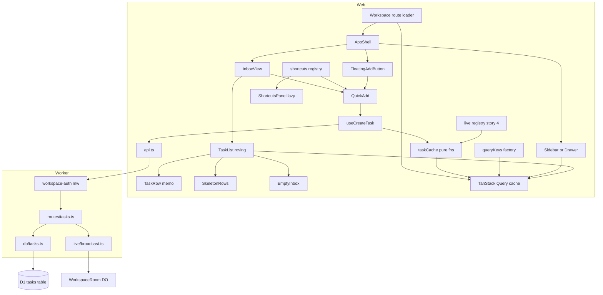

## Persisted state
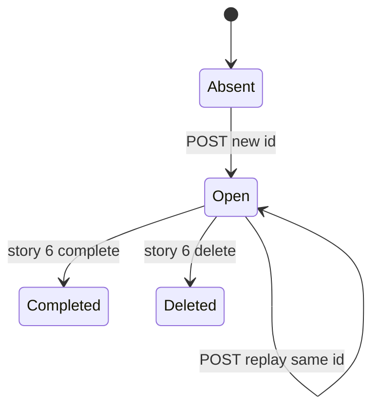
Story 5 only creates the `Absent -> Open` and replay transitions. `Completed` and `Deleted` are shown for context and belong to story 6. A task is Open when `completed_at IS NULL AND deleted = 0`.

## Client optimistic state (per new task)
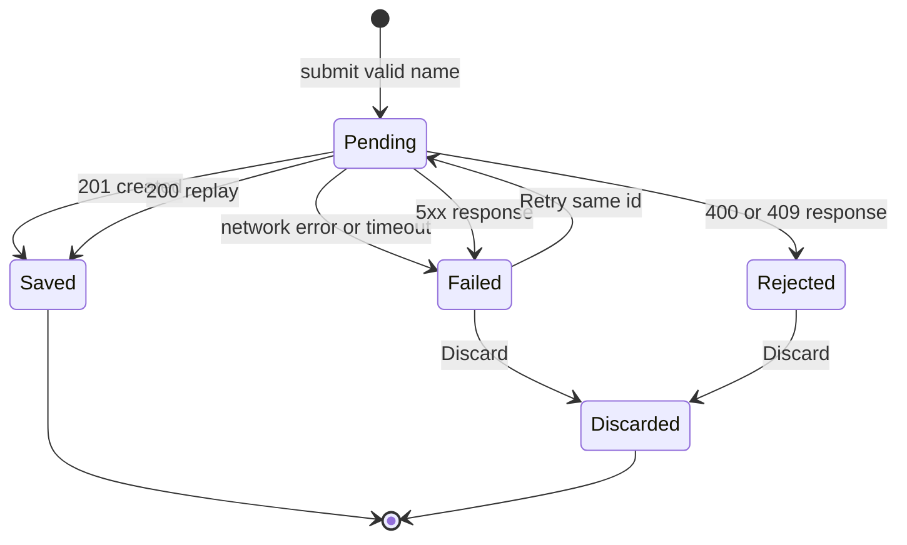
- **Pending** rows carry `aria-busy=true`.
- **Failed** offers Retry and Discard, announced with `role=alert`.
- **Rejected** means the server refused the content, so a retry can't succeed. The text stays visible and selectable, and only Discard is offered.
- **404** (workspace access lost) is handled by story 2's global not-found redirect. The pending row becomes Failed first, so the text is never silently dropped.

## List view state (per list query)
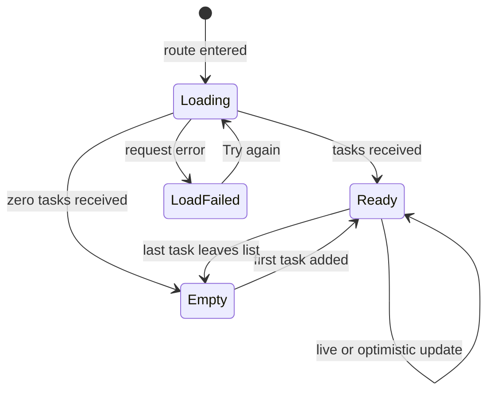
- **Loading:** skeleton rows.
- **LoadFailed:** "Couldn't load your tasks." with Try again, which calls `refetch`.
- The sidebar is independent of these states and is always interactive.

## Quick-add input state (per field)
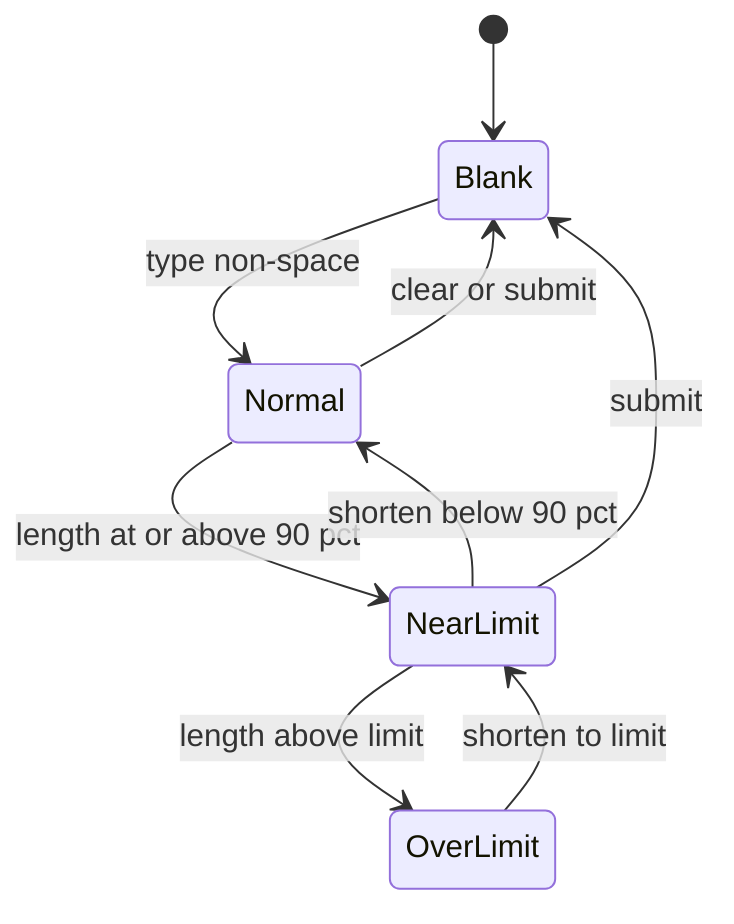
Add is enabled only when the name is non-blank and neither field is OverLimit. Text is never truncated in any state (prd.no_truncation).

## Test Strategy

## Test scopes and boundaries
| Capability | unit | integration | ui-component | e2e | Boundary exercised and why it is enough |
|---|---|---|---|---|---|
| tasks.store | yes | yes | not applicable: no UI | covered through tasks.create_api e2e | SQL runs only against real D1 in Miniflare. The idempotent upsert and MAX+1 ordering are SQL behaviour that mocks cannot prove |
| tasks.create_api | yes (schema) | yes | not applicable: no UI | yes | Integration drives `SELF.fetch` through the real Hono stack, including auth and CSRF middleware, D1 and the DO |
| tasks.list_api | yes (query parse) | yes | not applicable: no UI | yes | Same request-handling boundary as create |
| shell.sidebar | not applicable: loader and selectors are covered through rendering | not applicable: no server code | yes | yes | Rendering boundary plus loader timing with MSW; e2e proves it against real counts |
| shell.mobile | yes (keyboard inset maths) | not applicable: no server code | yes | yes | Layout switching in the DOM at the breakpoint boundary; real touch emulation in the browser for hit-area sizes and dark-mode contrast |
| shell.shortcuts | yes (registry, dispatcher) | not applicable: no server code | yes | yes | Registry logic is pure. Real key events in the DOM and the browser prove the single listener and the guard rules |
| tasks.list_view | yes (roving index maths) | not applicable: no server code | yes | yes | Rendering boundary with MSW-mocked network; a real keyboard in the browser |
| tasks.quick_add | yes (lengthStatus, canSubmit) | not applicable: no server code | yes | yes | Pure validation in unit tests; component behaviour in the DOM; real keyboard and paste in the browser |
| tasks.client_cache | yes (cache fns) | not applicable: no server code | yes | yes | Pure cache transforms in unit tests; hook plus MSW failure injection in the DOM; a real lost response in the browser |

## Dimensions crossed
Each dimension's classes are exhaustive and don't overlap. Every input falls into exactly one class; for D5, every keydown matches the first applicable context in the order listed.

| Dimension | Classes |
|---|---|
| D1 input | name length `{empty, whitespace-only, 1 char, 449, 450, 500, 501, 600 pasted, emoji/astral}`; description `{absent, empty, 4499, 4500, 5000, 5001, multi-line}` |
| D2 prior state of id | `{new, exists same workspace open, exists same workspace soft-deleted, exists other workspace}` |
| D3 caller | `{valid cookie + CSRF header, no cookie, cookie for other workspace, missing CSRF header, body with non-JSON content type}` |
| D4 network outcome (client) | `{success 201, replay 200, 400, 409, 5xx, network error, timeout, response lost after server commit}` |
| D5 key-event context | `{IME composing, modifier mismatch, typing field without allowInFields, typing field with allowInFields, free focus, quick add already open}` |
| D6 viewport and pointer | `{width 767 fine pointer, width 768 fine pointer, width 1280 fine pointer, width 390 coarse pointer (touch), width 1024 coarse pointer (tablet)}` |
| D7 list load state | `{loading, error, ready empty, ready with rows}` |
| D8 colour scheme | `{light, dark}` |

## API cases (tasks.store, tasks.create_api, tasks.list_api)
| TC | Level | D1 input | D2 id state | D3 caller | Expected result | State before -> after |
|---|---|---|---|---|---|---|
| TC-01 | integration | name 'Buy milk', no description | new | valid | 201 `{task}` with name, description '', sortOrder 1, version 1, completedAt null | 0 rows -> 1 row |
| TC-02 | integration | name '  Buy milk  ' | new | valid | 201, stored name 'Buy milk' (trimmed) | 0 -> 1 row, name trimmed |
| TC-03 | integration | name '' | new | valid | 400 `validation`, issue path name | 0 -> 0 rows |
| TC-04 | integration | name of spaces and a tab | new | valid | 400 `validation` | 0 -> 0 rows |
| TC-05 | integration | name 1 char 'x' | new | valid | 201 | 0 -> 1 |
| TC-06 | integration | name exactly 500 chars | new | valid | 201, stored length 500 | 0 -> 1 |
| TC-07 | integration | name 501 chars | new | valid | 400 `validation` | 0 -> 0 |
| TC-08 | integration | description exactly 5000 chars | new | valid | 201 | 0 -> 1 |
| TC-09 | integration | description 5001 chars | new | valid | 400 `validation` | 0 -> 0 |
| TC-10 | integration | name with emoji 'Call Mum 📞' and multi-line description | new | valid | 201, round-trips byte-identical | 0 -> 1 |
| TC-11 | integration | valid | exists same workspace open | valid | 200 existing task, unchanged version | 1 row -> 1 row, version unchanged |
| TC-12 | integration | different name, same id | exists same workspace open | valid | 200 existing task with ORIGINAL name (replay never overwrites) | 1 -> 1, name unchanged |
| TC-13 | integration | valid | exists same workspace soft-deleted | valid | 410 `gone` | row stays deleted |
| TC-14 | integration | valid | exists other workspace | valid | 409 `id_conflict`; other workspace row untouched | other ws 1 -> 1 unchanged; this ws 0 -> 0 |
| TC-15 | integration | id 'ABC' (not 32 lowercase hex) | not applicable: a malformed id is rejected before lookup | valid | 400 `validation` | 0 -> 0 |
| TC-16 | integration | valid | new | no cookie | 404 `not_found` | 0 -> 0 |
| TC-17 | integration | valid | new | cookie for other workspace | 404 `not_found` | 0 -> 0 in both workspaces |
| TC-18 | integration | valid | new | missing X-Todoodle-Client header | 403 `forbidden_client` | 0 -> 0 |
| TC-19 | integration | valid body sent as Content-Type text/plain | new | CSRF header present | 415 `unsupported_media_type` (story 1 rule, architecture §6) | 0 -> 0 |
| TC-20 | integration | three sequential creates A,B,C | new each | valid | sortOrder 1,2,3; GET list returns A,B,C | 0 -> 3 rows |
| TC-21 | integration | 10 concurrent creates via Promise.all | new each | valid | 10 rows, 10 distinct sortOrder values | 0 -> 10 |
| TC-22 | integration | valid | new | valid, WebSocket client connected to room | exactly one `task.upserted` event with originClientId echoed | DO receives 1 message |
| TC-23 | integration | valid replay | exists same workspace | valid, WS connected | NO event broadcast on replay | DO receives 0 messages |
| TC-24 | integration | invalid (TC-03 input) | new | valid, WS connected | NO event broadcast | DO receives 0 messages |
| TC-25 | integration | GET list=inbox with open, completed, soft-deleted tasks and tasks of another workspace | not applicable: read-only request | valid | only this workspace's open non-deleted tasks, ordered by sortOrder | no change |
| TC-26 | integration | GET list=bogus | not applicable: read-only request | valid | 400 `validation` | no change |
| TC-27 | integration | GET list=inbox, empty workspace | not applicable: read-only request | valid | 200 `{tasks: []}` | no change |
| TC-28 | integration | GET counts with 3 open, 1 completed, 1 deleted | not applicable: read-only request | valid | `{inbox: 3}` | no change |
| TC-29 | integration | GET list and counts | not applicable: read-only request | no cookie | 404 `not_found` for both | no change |
| TC-30 | unit | CreateTaskInput schema on each D1 class | not applicable: pure schema | not applicable: pure schema | accept/reject exactly as TC-01..TC-10; unknown key `foo` stripped | not applicable: no state |
| TC-31 | unit | TaskListQuery schema: inbox, missing, bogus | not applicable: pure schema | not applicable: pure schema | inbox ok; missing defaults to inbox; bogus rejected | not applicable: no state |
| TC-32 | integration | migration 0002 applied on top of 0001 | not applicable: schema only | not applicable: no request | tasks table + index exist; `PRAGMA foreign_key_list` references workspaces; no CHECK constraint in SQL text | 0001 schema -> 0001+0002 schema |

## UI cases: shell (shell.sidebar, shell.mobile, shell.shortcuts)
| TC | Level | Context (dimension class) | Action | Expected |
|---|---|---|---|---|
| TC-40 | ui-component | counts `{inbox: 3}` | render Sidebar | Inbox item accessible name 'Inbox, 3 open tasks'; no rename/delete menu on Inbox |
| TC-41 | ui-component | counts `{inbox: 0}` | render Sidebar | count hidden, name 'Inbox' |
| TC-42 | ui-component | counts loading | render Sidebar | Inbox visible immediately, count skeleton; no layout shift after load |
| TC-91 | ui-component | MSW holds both responses open | run workspaceLoader then render | both GET tasks and GET counts requests recorded before either resolves; loader returns without awaiting |
| TC-92 | ui-component | counts cached | read key; invalidate `['ws', wid]` | key equals `['ws', wid, 'counts']` (no date); counts refetched once |
| TC-93 | unit | stubbed visualViewport height 500, innerHeight 800, offsetTop 0; then API absent | compute inset | 300; absent API gives 0 |
| TC-94 | ui-component | D6 width 767 fine pointer vs 768 fine pointer | render AppShell | 767: menu button present, inline sidebar absent; 768: inline sidebar present, menu button absent |
| TC-95 | ui-component | D6 width 390 | open drawer, choose Inbox | drawer closes; route Inbox; focus returns to menu button |
| TC-96 | ui-component | D6 width 390 coarse | tap FAB | QuickAdd opens docked with name focused; FAB hidden while open; visible again after Escape |
| TC-97 | e2e | D6 width 390 coarse (iPhone profile, hasTouch) and width 1024 coarse | measure bounding boxes of every button, link and checkbox in shell, list and quick add | every box at least 44 by 44 |
| TC-98 | e2e | D8 light and dark via `colorScheme` emulation | load Inbox with tasks and quick add open; run axe colour-contrast | background token differs between schemes; zero contrast violations in both |
| TC-46 | unit | isTypingTarget for body, input[type=text], textarea, select, contenteditable, button | call guard | true for input/textarea/select/contenteditable; false for body and button |
| TC-99 | unit | fresh registry | register 5 shortcuts from 5 hooks | `document.addEventListener('keydown')` called exactly once |
| TC-100 | unit | entries A then B for same key | dispatch; unmount B; dispatch | B runs first time; A runs second time |
| TC-101 | unit | entries '?' and 'q' | dispatch Shift+'?'; dispatch Ctrl+q, Meta+q, Alt+q | '?' handler runs; q handler never runs |
| TC-102 | unit | handler replaced on rerender | dispatch | new handler runs; register/unregister count unchanged |
| TC-47 | ui-component | D5 free focus | press q | QuickAdd opens, name focused |
| TC-48 | ui-component | D5 typing field without allowInFields | press q in unrelated input | QuickAdd does NOT open; 'q' typed into that input |
| TC-49 | ui-component | D5 modifier mismatch | press Ctrl+q, Meta+q, Alt+q | QuickAdd does NOT open |
| TC-50 | ui-component | D5 IME composing | keydown q with isComposing | QuickAdd does NOT open |
| TC-103 | ui-component | D5 free focus | press ? then Escape | panel lists 'Add task' (Q) and 'Show keyboard shortcuts' (?); Escape closes; focus back on previously focused element |
| TC-104 | ui-component | D5 typing field (quick add name) | type ? | '?' inserted in the field; panel not opened |
| TC-105 | e2e | real browser, free focus | press ? | panel visible with grouped shortcuts; axe no serious/critical violations |

## UI cases: list and quick add (tasks.list_view, tasks.quick_add)
| TC | Level | Context (dimension class) | Action | Expected |
|---|---|---|---|---|
| TC-43 | ui-component | D7 ready, list [A,B,C] | render TaskList | rows in order A,B,C; description preview only on rows with description |
| TC-44 | ui-component | D7 ready empty | render InboxView | text 'Your Inbox is clear. Press Q to add a task.' |
| TC-45 | ui-component | list [A] then cache update adds B | rerender | row A not re-rendered (memo render counter); B appended |
| TC-106 | unit | useRovingList maths on 3 rows | next from last, prev from first, home, end, focusAfterRemoval(middle), focusAfterRemoval(last), focusAfterRemoval(only) | clamps at ends; next row; previous row; add button |
| TC-107 | ui-component | D7 loading | render | 5 skeleton rows inside region with aria-busy=true and label 'Loading tasks' |
| TC-108 | ui-component | D7 error | click Try again with MSW now succeeding | message 'Couldn't load your tasks.' in role=alert; after click rows render; exactly one refetch |
| TC-109 | ui-component | D7 ready, 5 rows | Tab, ArrowDown, ArrowDown, Tab | first Tab focuses row 1; arrows focus row 3; Tab leaves list to next control |
| TC-110 | ui-component | D7 ready, 5 rows | ArrowDown x3 | memo render counters of all rows unchanged |
| TC-111 | ui-component | focus row 2, Tab away, Shift+Tab back | keyboard | focus returns to row 2 |
| TC-112 | ui-component | 5 rows | j, k, End, Home | same targets as ArrowDown, ArrowUp, last, first |
| TC-113 | ui-component | 3 rows | inspect roles | list role=listbox, rows role=option, exactly one row tabIndex 0 |
| TC-114 | e2e | 20 seeded tasks, keyboard only | Tab into list, End, Home | activeElement is row 20 then row 1 |
| TC-51 | ui-component | QuickAdd open | name empty | Add disabled; Enter creates nothing (no request recorded by MSW) |
| TC-52 | ui-component | QuickAdd open | name of spaces | Add disabled; Enter creates nothing |
| TC-53 | ui-component | QuickAdd open | type 'Buy milk', Enter | one POST; row appears; fields cleared; name focused; box still open |
| TC-54 | ui-component | QuickAdd open via button | Escape with text typed | box closes; no POST; text discarded; focus returns to '+ Add task' button |
| TC-55 | ui-component | D1 name 449 chars | render | no counter shown |
| TC-56 | ui-component | D1 name 450 chars | render | counter '50 characters left' with aria-live polite |
| TC-57 | ui-component | D1 name 500 chars | type one more char | value is 501 chars (nothing blocked); counter '1 character over' with warning icon; Add disabled; Enter creates nothing |
| TC-58 | ui-component | D1 paste 600 chars | paste | value is the full 600 chars (not truncated); counter '100 characters over'; Add disabled |
| TC-59 | ui-component | description focused | Ctrl/Meta+Enter; plain Enter | modifier Enter submits; plain Enter inserts newline and does not submit |
| TC-115 | unit | D1 boundaries | lengthStatus and canSubmit | name 449 normal, 450 near, 500 near, 501 over; description 4499 normal, 4500 near, 5000 near, 5001 over; canSubmit false for blank, 501-name, 5001-description |
| TC-116 | ui-component | name 'Buy', isComposing true | Enter | no POST |
| TC-117 | ui-component | name focused | Tab; Shift+Tab | focus on description; back on name |
| TC-118 | ui-component | target inbox | render QuickAdd | chip text '→ Inbox'; form accessible description contains 'Inbox' |
| TC-119 | ui-component | description 5001 chars | render | textarea aria-invalid=true, aria-describedby points to counter containing warning icon |
| TC-120 | ui-component | opened from FAB (docked) | Escape | focus returns to FAB |

## UI cases: client cache (tasks.client_cache)
| TC | Level | Context | Action | Expected |
|---|---|---|---|---|
| TC-60 | unit | list [A] | appendOptimistic P | [A, P pending]; input list not mutated |
| TC-61 | unit | P pending | markStatus failed | P failed, name/description preserved |
| TC-62 | unit | P pending | replaceWithServer | P replaced in place by server task, no local status |
| TC-63 | unit | [A,P] | removeLocal P | P removed; A same reference |
| TC-64 | unit | cached id at version 2 | applyTaskEvents with version 3, then 2, then new id | replaced; lower/equal ignored; new id inserted at sortOrder position |
| TC-121 | unit | 1,000 cached tasks | applyTaskEvents with update, stale, new | 2 applied, 1 ignored; untouched items keep references |
| TC-122 | unit | cached list | applyTaskEvents with only stale events | identical array reference returned |
| TC-65 | ui-component | MSW network error | submit | row failed; 'Couldn't save this task.' inside role=alert; Retry and Discard; text visible |
| TC-66 | ui-component | MSW 500 then 201 | submit, Retry | second request has SAME id; row saved; exactly one row |
| TC-67 | ui-component | failed row | Discard | row removed; count back to prior value; no request |
| TC-68 | ui-component | MSW 400 | submit | row rejected: text visible, Discard shown, Retry NOT shown |
| TC-69 | ui-component | MSW delays 2s | submit | row visible before response (optimistic); count incremented immediately |
| TC-70 | ui-component | MSW never resolves | submit, advance fake timers past CREATE_TASK_TIMEOUT_MS | row becomes failed |
| TC-71 | ui-component | pending row, count 3 | request fails; then Retry succeeds | count 3 after failure; 4 after success |
| TC-123 | ui-component | MSW delays then fails | submit | pending row aria-busy=true; after failure message inside role=alert |
| TC-124 | ui-component | another test handler registered for task.upserted | mount tasks live handlers; emit event | both handlers called |

## E2E workflows (Playwright, real wrangler dev, fresh local D1)
| TC | Level | Workflow | Asserts |
|---|---|---|---|
| TC-80 | e2e | W1 golden path: create workspace via home page, press Q, type 'Buy milk', Enter | row at bottom, input cleared and focused, box open; reload shows the task; sidebar Inbox count 1 |
| TC-81 | e2e | W2 rapid capture: add 'One','Two','Three' with Enter only | order One,Two,Three before and after reload |
| TC-82 | e2e | W3 lost response: `page.route` forwards first POST via `route.fetch()` then aborts the response; click Retry | exactly ONE 'Buy milk' after reload |
| TC-83 | e2e | W4 discard: first POST aborted before reaching server; click Discard | row gone; still absent after reload; count 0 |
| TC-84 | e2e | W5 shortcut guard: focus workspace rename field (story 2), type 'quiet' | rename field contains 'quiet'; quick add not opened |
| TC-85 | e2e | W6 empty state: new workspace shows empty state; add a task | empty state disappears |
| TC-86 | e2e | W7 limits: paste 600 chars into name | field holds all 600; '100 characters over' shown; Add disabled; delete 100 chars; Add enabled; saved task has 500 chars |
| TC-87 | e2e | W8 escape: open, type, press Escape | closed; reload shows no task |
| TC-88 | e2e | W9 keyboard-only + a11y: complete W1 keyboard only; axe on Inbox with quick add open | no serious/critical axe violations |
| TC-89 | e2e | W10 API bypass: `request.post` with 501-char name using the page's cookie and headers | 400; list unchanged (server-side limit) |
| TC-90 | e2e | W11 optimistic latency: delay POST 1.5 s via route | row visible while request pending |
| TC-97 | e2e | W12 touch targets (see shell table) | all hit areas at least 44 by 44 |
| TC-98 | e2e | W13 dark mode contrast (see shell table) | zero contrast violations in light and dark |
| TC-105 | e2e | W14 shortcuts panel (see shell table) | panel lists shortcuts; axe clean |
| TC-114 | e2e | W15 roving list navigation (see list table) | End and Home move focus correctly |
| TC-125 | e2e | W16 phone capture: iPhone profile; tap FAB; type 'Milk'; Enter; open drawer; tap Inbox | task added; drawer closes on selection; quick add docked at bottom of viewport |

## Negative scenarios (must NOT happen)
| TC | Level | Must not happen |
|---|---|---|
| TC-03, TC-04, TC-07, TC-09 | integration | no row created on invalid input |
| TC-12 | integration | replay never overwrites |
| TC-14 | integration | no cross-workspace write |
| TC-16, TC-17, TC-18, TC-19 | integration | no write without auth, CSRF header, or a JSON body |
| TC-23, TC-24 | integration | no broadcast on replay or rejection |
| TC-25 | integration | no leakage of completed, deleted or foreign tasks |
| TC-48, TC-49, TC-50, TC-104 | ui-component | shortcut never hijacks typing |
| TC-51, TC-52, TC-57, TC-58, TC-116 | ui-component | no request for blank, over-limit, or composing input |
| TC-57, TC-58, TC-86 | ui-component, e2e | text never truncated |
| TC-54, TC-87 | ui-component, e2e | Escape never creates a task |
| TC-66, TC-82 | ui-component, e2e | retry never duplicates |
| TC-67, TC-83 | ui-component, e2e | discard never sends a request |
| TC-99 | unit | never more than one global keydown listener |
| TC-110 | ui-component | arrow navigation never re-renders rows |
| TC-122 | unit | stale events never change the cache |
| TC-124 | ui-component | registering a handler never removes another |

## Mock vs real
| Store/service | unit | integration | ui-component | e2e | Why |
|---|---|---|---|---|---|
| D1 | not used: pure functions only | real Miniflare D1 with migrations applied per test file | not used: network is mocked | real local D1 | Ordering and idempotency are SQL behaviour; mocking the store under test is forbidden (architecture §10) |
| WorkspaceRoom DO | not used: no I/O | real Miniflare DO; the test opens a WebSocket to count broadcasts | not used: live registry is exercised directly | real local DO | Broadcast-count assertions need the real fan-out path |
| HTTP between SPA and Worker | not used: no I/O | not applicable: tests call the Worker directly | MSW handlers in `apps/web/test/msw/tasks.ts` | real; `page.route` only for fault injection (TC-82, TC-83, TC-90) | Fault injection at the browser boundary is the only deterministic way to lose a response after commit |
| matchMedia and visualViewport | stubbed (TC-93) | not applicable: no browser APIs server-side | stubbed via happy-dom `matchMedia` mock and viewport size | real Chromium/WebKit with device profiles | happy-dom has no layout engine; real sizes are asserted only in e2e |
| Clock/timers | fake timers where timeouts matter | real | vitest fake timers (TC-70, counter throttle) | real | Keeps timeout cases fast and deterministic |

## Fixture realism
- **Workspaces** are created through the real `POST /api/workspaces` (story 2) or `/test/seed`, never by raw SQL with invented columns.
- **Task names** come from `apps/api/test/fixtures/tasks.ts`: realistic strings ('Buy milk', 'Email Sam re: invoice #4411', 'Call Mum 📞', 'Book dentist — ask about Tuesday') plus a multi-line description.
- **Length-boundary strings** are built from `TASK_NAME_MAX`, `TASK_DESCRIPTION_MAX` and `LENGTH_WARNING_RATIO` in `packages/shared/src/limits.ts`, so fixtures follow the constants.
- **MSW responses** are produced by the shared zod `TaskSchema.parse` on fixture objects, so mocked shapes can't drift from the real contract.
- **Device profiles** are Playwright's built-in iPhone 13 and iPad profiles.

## Edge cases
- **Astral characters:** limits count UTF-16 code units on both client and server, so an emoji counts as 2 (TC-10, TC-86).
- **Double Enter within one frame:** the submit handler reads and clears state synchronously and generates a new id per submit.
- **Rotating a phone while quick add is docked:** the `visualViewport` resize recomputes `--kb-inset`.
- **Window resized across 768 px with the drawer open:** the drawer unmounts and the inline sidebar renders; focus moves to the main heading.

## Not covered (deliberately)
- **Cross-tab or cross-person propagation of new tasks:** story 4's live-update tests cover it. Only the broadcast count is asserted here.
- **The sub-100 ms constraint:** proved structurally (row visible while the request is pending), not by a wall-clock benchmark.
- **Real screen readers (VoiceOver, NVDA):** only automated axe checks and accessible-name, role and aria-live assertions.
- **Very large lists (5,000 tasks):** performance belongs to story 8's constraint.
- **Real on-screen keyboards on physical phones:** the inset maths is unit-tested (TC-93) and docked placement is checked in device emulation (TC-125), but no test runs on a physical iOS or Android keyboard.

## Tasks table and query module

> Anchor: `tasks.store`

## Contract
- Migration `migrations/0002_tasks.sql` creates `tasks(id TEXT PRIMARY KEY, workspace_id TEXT NOT NULL REFERENCES workspaces(id), name TEXT NOT NULL, description TEXT NOT NULL DEFAULT '', sort_order REAL NOT NULL, completed_at TEXT, version INTEGER NOT NULL DEFAULT 1, created_at TEXT DEFAULT (datetime('now')), updated_at TEXT DEFAULT (datetime('now')), deleted INTEGER NOT NULL DEFAULT 0, deleted_at TEXT)` and index `idx_tasks_ws_open ON tasks(workspace_id, deleted, completed_at, sort_order)`. No CHECK constraints. `id` has no DEFAULT because ids are client-generated (see Overview decision).
- The Inbox is not a row: it is the set of tasks with no project (story 7 adds `project_id`; until then all tasks are Inbox). It therefore cannot be renamed or deleted.
- `insertTaskIdempotent(db, {id, workspaceId, name, description}) -> {status: 'created'|'replayed'|'gone'|'conflict', task?: TaskRow}`
- `listOpenTasks(db, workspaceId, {list: 'inbox'}) -> TaskRow[]` ordered by `sort_order, created_at, id`.
- `countOpenTasks(db, workspaceId) -> {inbox: number}`.
- Errors: D1 failures propagate as thrown errors (mapped to 500 `internal` by the app error handler).
- Side effects: one INSERT when status is `created`; none otherwise.

## Implementation
- `migrations/0002_tasks.sql` as above.
- `apps/api/src/db/tasks.ts`:
  - Insert uses a single statement so ordering is atomic under D1's serialised writes: `INSERT INTO tasks (id, workspace_id, name, description, sort_order) SELECT ?1, ?2, ?3, ?4, COALESCE(MAX(sort_order), 0) + ?5 FROM tasks WHERE workspace_id = ?2 ON CONFLICT(id) DO NOTHING RETURNING *` with `?5 = TASK_SORT_STEP`. Note: SQLite needs a `WHERE` clause before `ON CONFLICT` in `INSERT ... SELECT` to avoid a parse ambiguity; the workspace filter provides it. MAX spans all of the workspace's tasks (incl. completed/deleted) so a reopened task (story 6) keeps its original position without collisions.
  - If RETURNING yields no row, `SELECT * FROM tasks WHERE id = ?`; map: same workspace + deleted=0 -> `replayed`; same workspace + deleted=1 -> `gone`; other workspace -> `conflict`.
  - `rowToTask()` maps snake_case to the shared `Task` type.
- `packages/shared/src/limits.ts`: add `TASK_SORT_STEP = 1`, `TASK_ID_BYTES = 16`.
- `packages/shared/src/schemas.ts`: `TaskSchema` (id, workspaceId, name, description, sortOrder, completedAt, version, createdAt, updatedAt).

## Tests
- integration: TC-01, TC-11, TC-12, TC-13, TC-14, TC-20, TC-21, TC-25, TC-27, TC-28, TC-32 (`apps/api/test/db/tasks.test.ts`, real Miniflare D1).
- unit: `rowToTask` mapping incl. null completed_at (`apps/api/test/db/rowToTask.test.ts`).

## Create task endpoint (idempotent)

> Anchor: `tasks.create_api`

## Contract
`POST /api/w/:workspaceId/tasks`

- **Headers:** cookie `tdl_ws` (workspace-auth), `Content-Type: application/json`, `X-Todoodle-Client: web`, `X-Todoodle-Client-Id: <tab id>`.
- **Body** (`CreateTaskInputSchema`):
  - `id` must match `/^[0-9a-f]{32}$/`.
  - `name`: string, trimmed, 1..TASK_NAME_MAX.
  - `description`: optional string, trimmed, 0..TASK_DESCRIPTION_MAX, default ''.
  - Unknown keys are stripped (story 7 adds `projectId`). Length is `String.length` after trimming.
  - The server is the final guard for length. The client never truncates; it blocks submission while over the limit, so an over-limit body arriving here comes from a bypass (TC-89).
- **Responses:**

  | Status | Code | When |
  |---|---|---|
  | 201 | `{task}` | created |
  | 200 | `{task}` | id already exists in this workspace (replay; stored values win, request values ignored) |
  | 400 | `validation` | bad id, blank name, or too long |
  | 404 | `not_found` | auth failure (middleware) |
  | 403 | `forbidden_client` | missing CSRF header (middleware) |
  | 415 | `unsupported_media_type` | body present but not JSON (story 1 middleware, architecture §6) |
  | 409 | `id_conflict` | id exists in another workspace |
  | 410 | `gone` | id exists here but is soft-deleted |
  | 500 | `internal` | unexpected error |

- **Side effects:** on 201 only, `broadcastEvent(env, ctx, workspaceId, {type: 'task.upserted', entity: task, version: task.version, originClientId})` runs via `ctx.waitUntil`. A broadcast failure is logged (without the body) and never changes the response. Replays, which don't change anything, never broadcast (architecture §7).

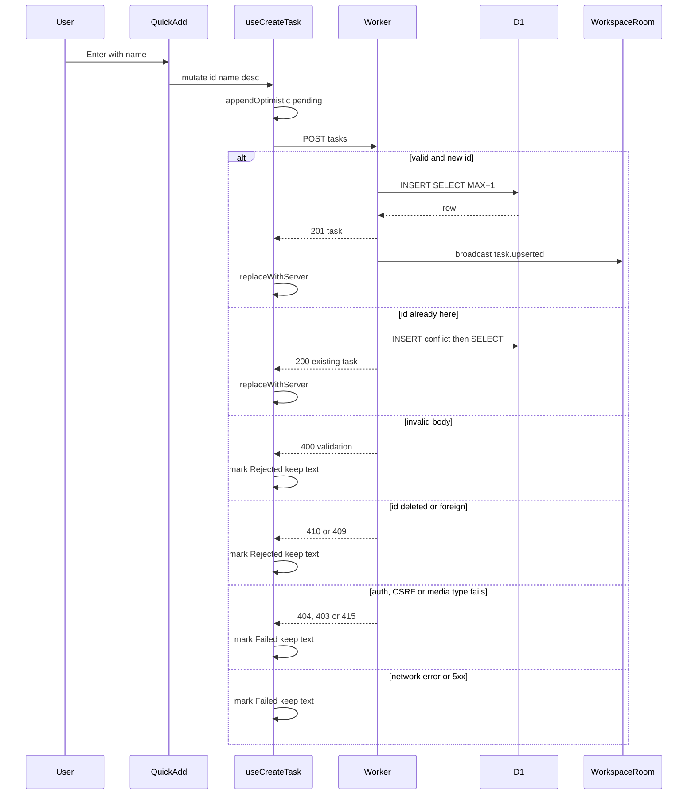

## Implementation
- `packages/shared/src/schemas.ts`: `CreateTaskInputSchema`, `TaskIdSchema`.
- `apps/api/src/routes/tasks.ts`: a Hono sub-router mounted at `/api/w/:workspaceId/tasks`, behind `workspace-auth`. The handler:
  1. parses with the shared schema (400 via the common validation error helper);
  2. calls `insertTaskIdempotent`;
  3. maps the result to 201, 200, 410 or 409;
  4. on `created`, schedules the broadcast.

  It reads `X-Todoodle-Client-Id` (optional; if absent the origin is null).
- `apps/api/src/lib/errors.ts`: `id_conflict` is part of the error-code union (already listed in architecture §6).
- Register the router in `apps/api/src/app.ts`.

## Tests
- **unit:** TC-30 (`packages/shared/test/schemas.test.ts`).
- **integration:** TC-01..TC-19 and TC-22..TC-24 (`apps/api/test/routes/tasks.create.test.ts`, via `SELF.fetch`, real D1 and DO; a WebSocket opened to the room counts broadcasts).
- **e2e:** TC-80, TC-82, TC-86, TC-89.

## Inbox list and counts endpoints

> Anchor: `tasks.list_api`

## Contract
- `GET /api/w/:workspaceId/tasks?list=inbox` -> 200 `{tasks: Task[]}`: open (completed_at null), non-deleted tasks of this workspace ordered by sortOrder, createdAt, id. `list` defaults to `inbox`; any other value -> 400 `validation` (stories 7/8 widen the enum).
- `GET /api/w/:workspaceId/counts` -> 200 `{inbox: number}` (open, non-deleted). Stories 7/8 add fields.
- 404 `not_found` from workspace-auth. 500 `internal` on D1 failure.
- Side effects: none. Responses carry `Cache-Control: no-store` (architecture §6).

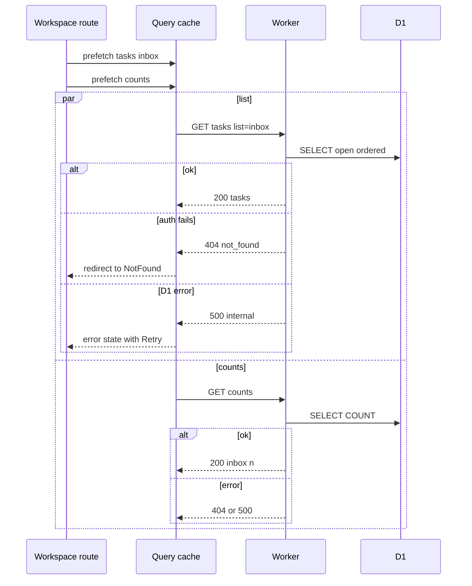

## Implementation
- `packages/shared/src/schemas.ts`: `TaskListQuerySchema = z.object({ list: z.enum(['inbox']).default('inbox') })`, `CountsSchema = z.object({ inbox: z.number().int().nonnegative() })`.
- `apps/api/src/routes/tasks.ts`: `GET /` handler using `listOpenTasks`; `apps/api/src/routes/counts.ts`: `GET /api/w/:workspaceId/counts` using `countOpenTasks`. The two queries run independently (no server-side waterfall; each endpoint is one statement).
- The client issues both requests in parallel on route entry (see shell.sidebar).

## Tests
- unit: TC-31.
- integration: TC-25..TC-29 (`apps/api/test/routes/tasks.list.test.ts`).
- e2e: TC-80, TC-81 (order persists across reload).

## Workspace app shell and sidebar

> Anchor: `shell.sidebar`

## Contract
- **`<AppShell workspaceId>`:** a two-column layout. The left `<Sidebar>` is fixed width at or above `MOBILE_BREAKPOINT_PX`; below it, the drawer from shell.mobile takes its place. The main region is `<main aria-labelledby=view-title>` and renders the active view (Inbox by default).
  - It wraps the view in story 4's shell-level `<fieldset disabled={!canEdit}>`.
- **`<Sidebar>`** lists Inbox (icon, label, open count when > 0), then `todaySlot` and `projectsSlot`. Those are render props, empty in story 5. Inbox has no rename or delete controls.
  - Accessible name of the Inbox link: "Inbox, N open tasks" when N > 0, otherwise "Inbox". The current view has `aria-current=page`.
- **Query keys** (architecture §12) come from `apps/web/src/lib/queryKeys.ts`:
  - `qk.tasks(wid, {list})` = `['ws', wid, 'tasks', {list}]`
  - `qk.counts(wid)` = `['ws', wid, 'counts']`, with no date in the key.
  - Story 4's reconnect invalidation of `['ws', wid]` therefore refreshes both.
- **Route loader:** `workspaceLoader({params})` runs before the route component renders. It starts `queryClient.prefetchQuery(tasksQuery(wid,'inbox'))` and `queryClient.prefetchQuery(countsQuery(wid))` together and **does not await them**. It returns `null`, so rendering starts at once while both requests are already in flight.
- **Errors:**
  - A failed counts request hides the count; it never blocks navigation.
  - While counts load, the badge shows a fixed-width skeleton, so there is no layout shift.

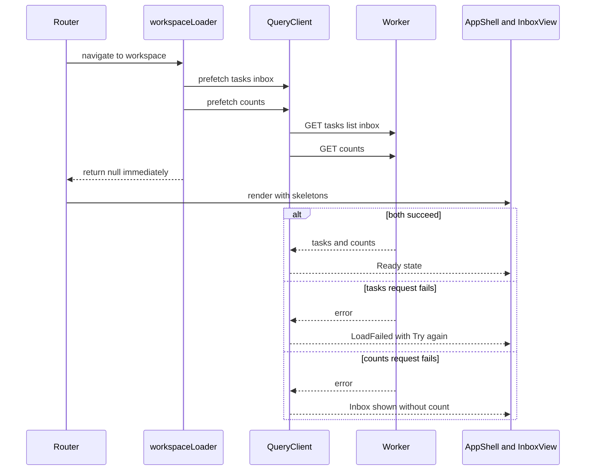

## Implementation
- `apps/web/src/features/workspace/AppShell.tsx`, `Sidebar.tsx`, `SidebarNavItem.tsx`. The nav item is memoised and its props are primitives.
- `apps/web/src/lib/queryKeys.ts`: add `tasks` and `counts` to story 2's factory.
- `apps/web/src/features/tasks/queries.ts`: `tasksQuery(wid, list)` and `countsQuery(wid)` build their query options from `qk`.
- `apps/web/src/routes/workspaceLoader.ts`: the non-blocking prefetch, registered as the `loader` of `/w/:workspaceId` and of the fragment route (`async-parallel`, no waterfall).
  - Story 2's `main.tsx` early `POST open` then leads straight into this loader.
- The Sidebar reads the count with `useQuery({...countsQuery(wid), select: selectInboxCount})`. `selectInboxCount` is hoisted to module level, so the reference is stable and the sidebar re-renders only when the number changes (`rerender-derived-state`).
- **Imports are direct only** (§12): shadcn components by file, lucide icons by per-icon path (e.g. `lucide-react/dist/esm/icons/inbox`, wrapped once in `apps/web/src/components/icons.ts` which re-exports only the icons we use). No feature `index.ts` barrels.
- The count badge reserves its width to avoid layout shift (TC-42).

## Tests
- **ui-component** (`apps/web/test/features/workspace/Sidebar.test.tsx`, `workspaceLoader.test.ts`): TC-40, TC-41, TC-42, TC-91 (loader starts both requests before either resolves), TC-92 (counts key has no date; invalidating `['ws', wid]` refetches it).
- **e2e:** TC-80 (count is 1 after the first add), TC-88 (axe).

## Keyboard shortcut registry and ? panel

> Anchor: `shell.shortcuts`

## Contract
`apps/web/src/lib/shortcuts.ts` is the **only** global keydown listener in the app (architecture §12, `client-event-listeners`). It is attached once, lazily, to `document` when the first shortcut registers.

- **`useGlobalShortcut(key: string, handler: (e: KeyboardEvent) => void, opts: {description: string, group: 'Tasks'|'Navigation'|'General', enabled?: boolean, allowInFields?: boolean, modifiers?: 'none'|'mod'})`**
  - It registers into a module-level `Map<string, Set<Entry>>` keyed by the normalised key and removes the entry on unmount.
  - The handler is kept in a ref that updates each render, so the registration never churns (`advanced-event-handler-refs`).
- **The dispatcher fires only when:**
  1. `!event.isComposing`;
  2. `isTypingTarget(event.target)` is false, unless the entry sets `allowInFields`;
  3. the modifiers match. For `'none'`, no Ctrl, Meta or Alt is held; Shift may be held only when the key is itself a shifted character such as `?`. `'mod'` means Meta on macOS, Ctrl elsewhere.

  It calls `preventDefault` only when a handler runs. When more than one entry matches, the most recently registered enabled entry wins, which lets a view override the global one.
- **`isTypingTarget(el): boolean`:** true for `input` of text-like types, `textarea`, `select`, and `isContentEditable` elements. It is the single implementation in the app; story 6's `keyboard.ts` copy is removed (§12).
- **`listShortcuts(): Array<{key, description, group}>`:** a snapshot of the registered, enabled entries, used by the help panel.
- **`?` help panel:** `useGlobalShortcut('?', openHelp, {description:'Show keyboard shortcuts', group:'General'})`.
  - It opens `<ShortcutsPanel>`, a shadcn Dialog loaded with `React.lazy`. A preload is scheduled with `requestIdleCallback` after first paint, so the first `?` opens instantly (`bundle-dynamic-imports`, `bundle-preload`).
  - It lists the entries grouped, showing keys as `<kbd>`. Escape closes it and focus returns to the element that had it.
  - Story 5 registers: `Q` (Add task), `?` (Show shortcuts), `↑/↓`, `j/k`, `Home/End` (Move between tasks). The last three are not global: they are handled by the list's own `onKeyDown` and are shown in the panel via static `describeShortcut()` entries.
- **Errors:** none. An unknown key simply matches nothing.

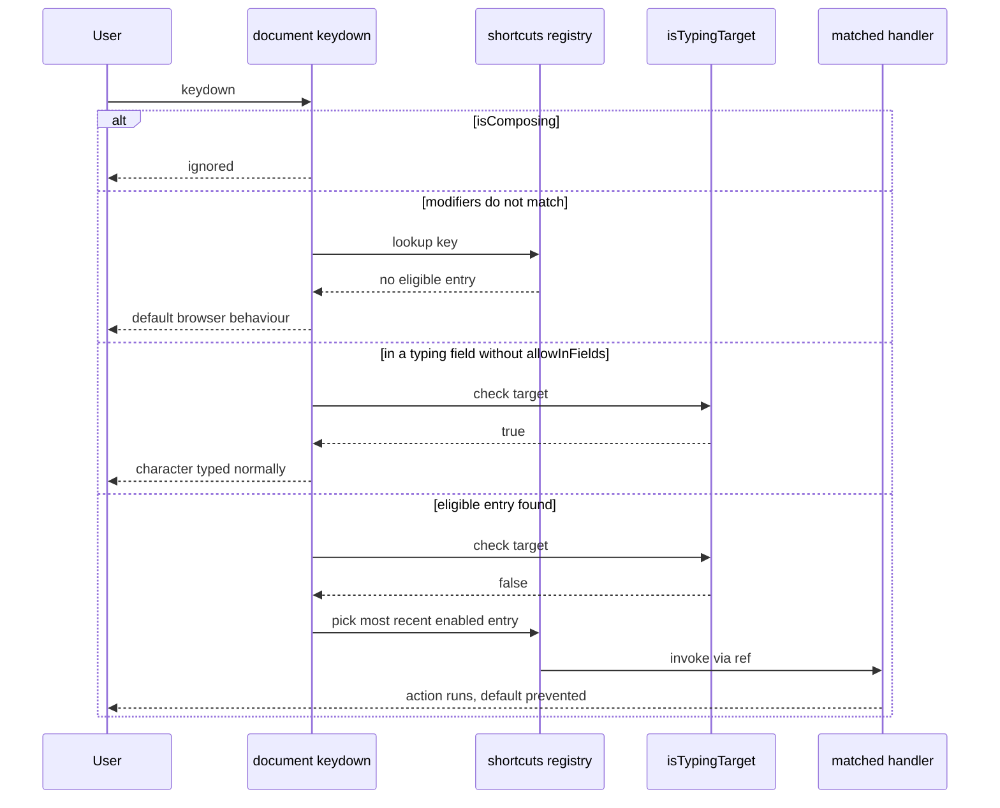

## Implementation
- `apps/web/src/lib/shortcuts.ts`: registry, dispatcher, `useGlobalShortcut`, `isTypingTarget`, `listShortcuts`, `describeShortcut`.
- `apps/web/src/features/shortcuts/ShortcutsPanel.tsx` (lazy), plus `apps/web/src/features/shortcuts/useShortcutsPanel.ts`, which registers `?` and handles the idle preload.
- Replaces the earlier `useGlobalShortcut.ts` and `isTypingTarget.ts` files. There is one module and one listener.
- `packages/shared/src/limits.ts`: `QUICK_ADD_KEY = 'q'`, `SHORTCUT_HELP_KEY = '?'`.

## Tests
- **unit** (`apps/web/test/lib/shortcuts.test.ts`): TC-46 (isTypingTarget classes), TC-99 (exactly one `document` keydown listener after registering 5 shortcuts; spy on `addEventListener`), TC-100 (last registered wins; unregister restores the previous one), TC-101 (the `?` entry fires with Shift held; `q` does not fire with Ctrl, Meta or Alt), TC-102 (a handler replaced between renders is called without re-registering).
- **ui-component:** TC-47..TC-50 (Q guard cases), TC-103 (`?` opens the panel listing Q and ?; Escape closes it and restores focus), TC-104 (`?` typed inside the quick-add name field inserts '?' and does not open the panel).
- **e2e:** TC-105 (press `?` in a real browser; the panel lists shortcuts; axe passes).

## Phone layout, touch targets and light/dark tokens

> Anchor: `shell.mobile`

## Contract
- **Layout mode** comes from `useIsNarrow()`, backed by `matchMedia('(max-width: 767.98px)')`, where 767.98 = `MOBILE_BREAKPOINT_PX` − 0.02. It is a `useSyncExternalStore` subscription that returns a boolean, so components re-render only when the mode flips.
  - Touch capability is CSS-only: `@media (hover: none)`. JS never reads it.
- **Narrow mode:**
  - The header shows a `☰` button (`aria-label="Open navigation"`, `aria-expanded`, `aria-controls=nav-drawer`).
  - The sidebar content renders inside a shadcn `Sheet` (side=left, `id=nav-drawer`), which is a Radix Dialog: focus trap, Escape closes, focus returns to `☰`.
  - Choosing any nav item closes the drawer and navigates.
  - At or above the breakpoint the drawer is not rendered and the sidebar is inline.
- **`<FloatingAddButton onPress>`:** rendered when narrow **or** under `(hover: none)`. It is fixed to the bottom-right with the safe-area inset, and `aria-label="Add task"`.
  - It opens QuickAdd in **docked mode**: a panel fixed to the bottom whose `bottom` offset is `--kb-inset`.
  - `useKeyboardInset()` sets `--kb-inset` = `max(0, innerHeight − visualViewport.height − visualViewport.offsetTop)` on `visualViewport` `resize` and `scroll` events, using passive listeners and a single rAF-throttled write. The panel therefore sits directly above the on-screen keyboard.
  - The button is hidden while QuickAdd is docked open.
- **Touch targets:** under `(hover: none)` every interactive element in the shell, list rows, checkbox hit area, quick add, FAB and drawer items has a minimum hit area of `MIN_TOUCH_TARGET_PX` (44) in both dimensions. Smaller visuals use a transparent `::before` hit-area expansion.
- **Theme tokens:** `apps/web/src/styles/tokens.css` defines shadcn CSS variables for light and dark, using `@media (prefers-color-scheme: dark)`. There is no in-app toggle, and `color-scheme: light dark` is set on `:root`. Every foreground/background pair used by the shell and list meets 4.5:1 (text) or 3:1 (UI boundaries). `prefers-reduced-motion` disables the drawer slide animation.
- **Errors:** none. If `visualViewport` is missing (old browsers), `--kb-inset` stays 0 and the docked panel sits at the bottom edge.

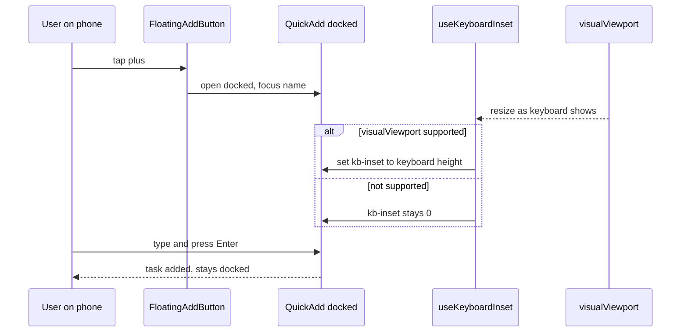

## Implementation
- `apps/web/src/features/workspace/useIsNarrow.ts`, `NavDrawer.tsx` (shadcn `Sheet`, imported by direct path), `FloatingAddButton.tsx`, `apps/web/src/lib/useKeyboardInset.ts`, `apps/web/src/styles/tokens.css`, `apps/web/src/styles/touch.css`.
- `packages/shared/src/limits.ts`: `MOBILE_BREAKPOINT_PX = 768`, `MIN_TOUCH_TARGET_PX = 44`. They are also exported to CSS as custom properties by `apps/web/src/styles/constants.css`, generated from `limits.ts` at build time, so there are no duplicated magic numbers.
- `AppShell` renders `Sidebar` inline or inside `NavDrawer` from the same `SidebarContent` component. There is no duplicate nav markup, and the component is not defined inline (`rerender-no-inline-components`).
- The `visualViewport` listener is registered once per docked open and removed on close (`client-passive-event-listeners`).

## Tests
- **unit:** TC-93 (`useKeyboardInset` computes the inset from a stubbed `visualViewport`; absent API gives 0).
- **ui-component** (`apps/web/test/features/workspace/MobileShell.test.tsx`): TC-94 (width 767 shows `☰` and no inline sidebar; 768 shows inline sidebar and no `☰`), TC-95 (drawer closes on nav selection and focus returns to `☰`), TC-96 (FAB opens docked QuickAdd and FAB hides while open).
- **e2e:** TC-97 (iPhone-sized viewport with touch emulation: every button/link/checkbox in shell, list and quick add has a bounding box of at least 44×44), TC-98 (`colorScheme: 'dark'` renders dark tokens; axe colour-contrast passes in light and dark).

## Extension slots for search (story 11)

Story 11 (Finder search) mounts into the shell. Story 5 only provides the slots and **renders nothing into them**. No search behaviour belongs to story 5.

- `<Sidebar searchSlot?: ReactNode>`: rendered as the first child of `SidebarContent`, above the Inbox entry. That means it appears in both the inline sidebar and the phone `NavDrawer`.
- `<AppShell headerActionsSlot?: ReactNode>`: rendered in the header's trailing action area at every width, beside the ☰ trigger in narrow mode. Story 11 places its 🔍 button there.
- Shortcuts: story 11 registers `/` (modifiers `'none'`) and `k` (modifiers `'mod'`) through the existing `useGlobalShortcut`, so the `?` panel lists them automatically. No registry change is needed.

Both slots are optional props that default to `null`, so they have no effect in this story. The existing sidebar and mobile tests cover the rendering path with the slots empty. TC-126 (ui-component) asserts that a node passed to each slot renders in the documented position, in both inline and drawer modes.

## Inbox view, task list and empty state

> Anchor: `tasks.list_view`

## Contract
- **`<InboxView workspaceId>`:** heading "Inbox" (`id=view-title`), then `<TaskList>` of cached tasks in cache order, then the "+ Add task" button or `<QuickAdd target={{kind:'inbox'}}>` at the bottom. On narrow/touch the inline button is replaced by the shell's floating add button (shell.mobile).
- **`<TaskList tasks status onRetry>`**, where `status` is one of `'loading' | 'error' | 'ready'`:
  - **`loading`:** `SKELETON_ROW_COUNT` (5) `<SkeletonRow>` elements in an `aria-busy=true` region labelled "Loading tasks". Shown only on first load; background refetches keep the old rows (`placeholderData: keepPreviousData`).
  - **`error`:** "Couldn't load your tasks." with a **Try again** button that calls `refetch()`. It uses `role=alert` so the failure is announced.
  - **`ready` + empty** (and no pending rows): `<EmptyInbox>` with "Your Inbox is clear. Press Q to add a task.", or "Tap + to add a task." under `(hover: none)`, switched with CSS.
  - **`ready`:** `<ul role=listbox aria-label="Tasks">`, whose items are `<TaskRow>` elements with `role=option`, `data-task-id` and a `tabIndex` managed by `useRovingList`.
- **`useRovingList(listRef)` returns `{onKeyDown, onFocus, focusAfterRemoval(id)}`:**
  - Exactly one row has `tabIndex=0`: the last focused one, or the first row if that one is gone. All others have `-1`, so the list is **one tab stop**.
  - ↑/k and ↓/j move to the previous/next row, and Home/End to the first/last. At either end, focus stays put (no wrap).
  - The active id lives in a **ref**. Moving focus rewrites `tabIndex` on only two DOM nodes (old and new) and calls `.focus()`. **No row re-renders on navigation**, and there is no `isFocused` prop (§12, audit fix).
  - `focusAfterRemoval(id)` focuses the next row, or the previous one if the removed row was last. With no rows left it focuses the "+ Add task" button. Story 6 calls this after complete/delete.
  - Keys are ignored when the event target is inside a row's interactive child. The focused row shows a visible focus ring meeting 3:1 contrast.
- **`<TaskRow task localStatus?>`:** a decorative round checkbox (`aria-hidden`; story 6 activates it), the name, and a one-line muted description preview when non-empty. Failed and rejected rows render the recovery UI from tasks.client_cache.
- **Errors:** the load error is handled as above. Empty `tasks` together with `status=error` shows the error, not the empty state.

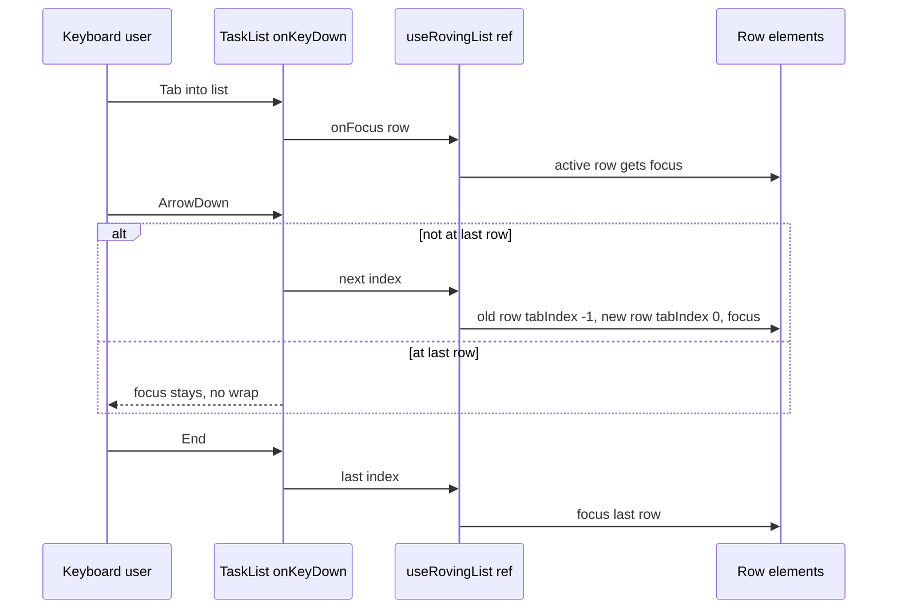

## Implementation
- `apps/web/src/features/tasks/InboxView.tsx`, `TaskList.tsx`, `TaskRow.tsx`, `SkeletonRow.tsx`, `EmptyInbox.tsx`, `useRovingList.ts`.
- `packages/shared/src/limits.ts`: `SKELETON_ROW_COUNT = 5`, `TASK_ROW_INTRINSIC_HEIGHT_PX = 44`.
- **Memoisation:**
  - `TaskRow` is wrapped in `React.memo`, and its props are the task object (whose identity is preserved by taskCache) plus primitives.
  - Row callbacks come from a stable context value built once with `useMemo` over stable mutation functions, not from inline lambdas (`rerender-memo`, TC-45).
- **Per-row** `content-visibility: auto; contain-intrinsic-size: auto 44px`, on each `<li>`, never on the `<ul>` (§12, audit fix). Off-screen rows skip layout and paint.
- The list renders from `useDeferredValue(tasks)`, so bursts of live or optimistic updates don't block typing in quick add (§12).
- The `EmptyInbox` illustration SVG is a module-level constant (`rendering-hoist-jsx`). Conditionals use ternaries (`rendering-conditional-render`).
- `key={task.id}` is stable because ids are client-generated, so an optimistic row does not re-mount when the server response arrives.

## Tests
- **unit:** TC-106 (`useRovingList` index maths: next/prev/home/end clamp at the ends; `focusAfterRemoval` picks the next, else previous, else the add button).
- **ui-component** (`apps/web/test/features/tasks/TaskList.test.tsx`): TC-43, TC-44, TC-45, and:
  - TC-107: loading shows 5 skeleton rows with `aria-busy`.
  - TC-108: error shows the message and Try again; clicking refetches, then rows show.
  - TC-109: Tab lands on the first row; ↓↓ focuses the third; Tab leaves the list.
  - TC-110: ArrowDown re-renders no rows (memo render counter stays constant).
  - TC-111: after navigating to row 2 and tabbing away and back, focus returns to row 2.
  - TC-112: j/k/Home/End mirror the arrows.
  - TC-113: `role=listbox` with `role=option` children; the focused row is exposed as the focused element.
- **e2e:** TC-80, TC-81, TC-85, and TC-114: 20 seeded tasks, keyboard-only; Tab into the list, End, then Home, asserting `document.activeElement` each time.

## Inline quick add and Q shortcut

> Anchor: `tasks.quick_add`

## Contract
- **Opening:**
  - `InboxView` registers `useGlobalShortcut(QUICK_ADD_KEY, open, {description:'Add task', group:'Tasks'})` through shell.shortcuts; this is the registry's only listener, and there is no per-component `document` listener.
  - The "+ Add task" button (desktop) and the FloatingAddButton (phone, shell.mobile) open the same component.
- **`<QuickAdd target mode>`**:
  - `target` is `{kind:'inbox'} | {kind:'project', id, name, color} | {kind:'today'}`; stories 7 and 8 add the last two kinds.
  - `mode` is `'inline' | 'docked'`.
  - It is a form with `aria-label="Add task"` containing, in DOM and Tab order:
    1. a name `<input>` with a visually hidden label "Task name" and placeholder "Task name";
    2. a description `<textarea>` with the label "Description", auto-growing up to 6 lines;
    3. the destination chip;
    4. the Add button and the Cancel button.
  - **No `maxLength` attribute** on either field; nothing is ever truncated (prd.no_truncation).
- **Destination chip**: a non-focusable `` reading "→ Inbox" (or "→ {project name}" with its colour dot, or "→ Today"). The form's `aria-describedby` includes the chip, so screen readers hear "Adding to Inbox".
- **Length feedback**, per field. The limit is `TASK_NAME_MAX` for the name and `TASK_DESCRIPTION_MAX` for the description; the warning threshold is `ceil(limit * LENGTH_WARNING_RATIO)`, which is 450 for the name and 4,500 for the description.
  - **Below the threshold:** no counter.
  - **From the threshold up to the limit:** counter "N characters left", with `aria-live=polite`, throttled to announce at most once per second.
  - **Above the limit:**
    - The counter reads "N characters over" in the destructive colour, with a warning icon (colour is never the only signal).
    - The field gets `aria-invalid=true` and `aria-describedby` pointing to the counter.
    - Add is disabled.
  - Length is measured with `String.length` (UTF-16 code units), matching the server's zod check.
- **Keys:**
  - **Name field:** Enter submits when submission is allowed, otherwise it does nothing. Tab moves to Description.
  - **Description field:** plain Enter inserts a newline. Shift+Tab returns to Name.
  - **Either field:**
    - ⌘+Enter or Ctrl+Enter submits when allowed.
    - Enter while `isComposing` is always ignored (IME).
    - Escape closes the box, discards the typed text, and returns focus to the element that opened it (the "+ Add task" button, the FAB, or the previously focused row).
- **Submission is allowed only when:**
  - `name.trim()` is non-empty; **and**
  - neither field is over its limit.
- **On submit:**
  1. Call `createTask({id: newTaskId(), name: name.trim(), description, target})`.
  2. Clear both fields synchronously.
  3. Refocus the name field. The box stays open (prd.quick_add_stays_open).
- **Docked mode** (phone) renders the same form in a fixed bottom panel above the keyboard, using `--kb-inset` from shell.mobile. All behaviour is identical.
- **Errors:** none are raised by the component; save errors are handled by tasks.client_cache.

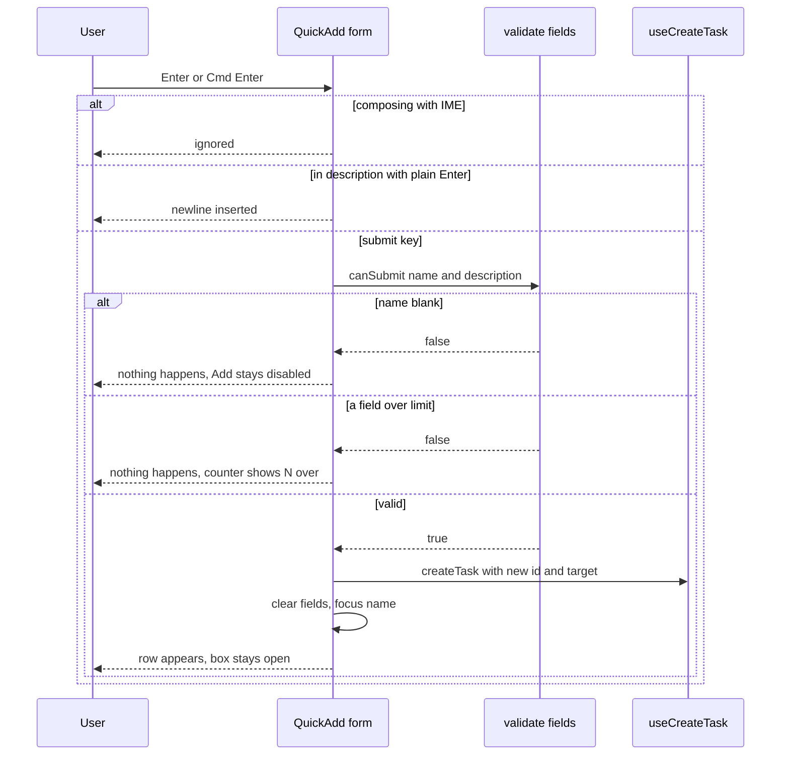

## Implementation
- `apps/web/src/features/tasks/QuickAdd.tsx`, `LengthCounter.tsx`, `DestinationChip.tsx`, `canSubmit.ts` (pure).
- `apps/web/src/lib/ids.ts`: `newTaskId()` returns 16 bytes from `crypto.getRandomValues` as lowercase hex.
- `packages/shared/src/limits.ts`: `LENGTH_WARNING_RATIO = 0.9`, `COUNTER_ANNOUNCE_THROTTLE_MS = 1_000`, `QUICK_ADD_MAX_DESCRIPTION_ROWS = 6`. This **replaces** the earlier `TASK_NAME_COUNTER_THRESHOLD` and `TASK_DESCRIPTION_COUNTER_THRESHOLD` constants.
- `lengthStatus(len, limit) -> 'normal'|'near'|'over'` and `canSubmit(name, description)` are pure functions in `canSubmit.ts`. They are derived during render, never synced through an effect (`rerender-derived-state-no-effect`).
- Submit, clear and refocus all happen in the event handler, not an effect (`rerender-move-effect-to-event`). The field updates use functional setState, and focus goes through a ref.
- The open/closed state and the "return focus to" element ref live in `InboxView`, so the shortcut, the button and the FAB share them.

## Tests
- **unit** (`apps/web/test/features/tasks/canSubmit.test.ts`), TC-115: `lengthStatus` boundaries —
  - name 449 is normal, 450 near, 500 near, 501 over;
  - description 4,499 is normal, 4,500 near, 5,000 near, 5,001 over;
  - `canSubmit` is false for a blank name, a 501-char name, or a 5,001-char description.
- **ui-component** (`apps/web/test/features/tasks/QuickAdd.test.tsx`):
  - Existing: TC-51..TC-54, TC-56 (revised), TC-57 (revised), TC-58 (revised), TC-59.
  - New:
    - TC-116: Enter while `isComposing` does not submit.
    - TC-117: Tab goes from name to description; Shift+Tab goes back.
    - TC-118: chip reads "→ Inbox" and the form's accessible description includes "Inbox".
    - TC-119: over-limit field has `aria-invalid` and the counter has a warning icon.
    - TC-120: Escape returns focus to the FAB when opened from the FAB.
- **e2e:** TC-80, TC-84, TC-86 (revised), TC-87, TC-88.

## Optimistic create, failure recovery and cache updates

> Anchor: `tasks.client_cache`

## Contract
- **`useCreateTask(workspaceId)`** returns `createTask(input)`, `retry(id)` and `discard(id)`.
  - **`createTask`:**
    - In `onMutate`, synchronously appends a local task `{...fields, localStatus: 'pending'}` to `qk.tasks(wid, {list})` and increments the `inbox` field of `qk.counts(wid)`.
    - POSTs with `AbortSignal.timeout(CREATE_TASK_TIMEOUT_MS)`.
    - Cache writes happen only in `onMutate`, `onSuccess` and `onError`, never in render or an effect (§12).
  - **Outcomes of the POST:**

    | Response | Row becomes | Count | Text |
    |---|---|---|---|
    | 201 or 200 | replaced in place by the server task (no `localStatus`) | unchanged | n/a |
    | network error, timeout, 5xx, 403, 404 | `localStatus: 'failed'` | decremented | kept |
    | 400, 409, 410 | `localStatus: 'rejected'` | decremented | kept |

  - **`retry(id)`:** only for `failed` rows. Sets `pending`, increments the count, and re-POSTs the **same** id and body.
  - **`discard(id)`:** removes the local row. No request.
- **Row accessibility:**
  - A pending row has `aria-busy=true`.
  - A failed row shows "Couldn't save this task." in an element with `role=alert` (announced immediately), plus Retry and Discard buttons.
  - A rejected row shows "This task can't be saved." with `role=alert`, and Discard only.
- **Live integration:**
  - Registers `registerLiveHandler('task.upserted', applyTaskEvents)` in story 4's `Map<type, Set<fn>>` registry. It is one handler among several, and never replaces another's.
  - Story 4 delivers events **batched per animation frame**, so `applyTaskEvents(list, events[])` receives the whole batch.
  - It builds **one** `Map<id, index>` over the cached list (O(n + k), `js-index-maps`). Then, per event:
    - replace in place when `event.version > cached.version`;
    - ignore when the version is lower or equal;
    - insert new ids in `sortOrder` position.
  - It returns the same array reference when nothing changed.
  - Events with `originClientId === clientId` are already dropped by story 4's dispatcher.
- **No automatic retry.** The user decides, so a flaky network cannot silently multiply requests.

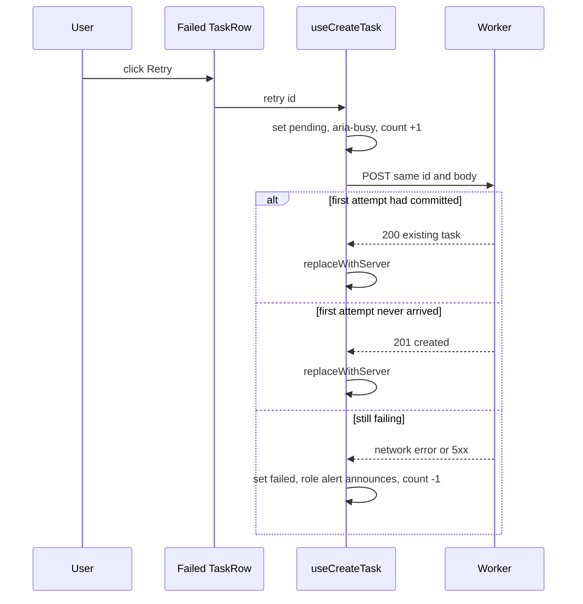
Discard needs no sequence diagram: it is a local cache removal with no network call and no branch (TC-63, TC-67).

## Implementation
- **`apps/web/src/features/tasks/taskCache.ts`:** pure, immutable helpers `appendOptimistic`, `markStatus`, `replaceWithServer`, `removeLocal`, `applyTaskEvents` and `adjustCount`. They return new arrays while keeping the references of untouched items, which the TaskRow memo relies on.
- **`apps/web/src/features/tasks/useCreateTask.ts`:**
  - Uses TanStack `useMutation`, with `onMutate`, `onError` and `onSuccess` calling the helpers through `queryClient.setQueryData(qk.tasks(...))`.
  - Updates counts through `setQueriesData({queryKey: qk.counts(wid)})`, per §12, so it stays correct once story 8 decorates counts.
  - The mutation's `mutationKey` includes the task id, so retries of different tasks don't interfere.
- **`apps/web/src/features/tasks/liveHandlers.ts`:** registers the handler once, at workspace mount.
- **`packages/shared/src/limits.ts`:** `CREATE_TASK_TIMEOUT_MS = 10_000`.
- **`apps/web/src/features/tasks/TaskRow.tsx`:** renders the pending, failed and rejected UI from `localStatus`.
- **`apps/web/test/msw/tasks.ts`:** MSW handlers built from the shared schemas.

## Tests
- **unit** (`apps/web/test/features/tasks/taskCache.test.ts`): TC-60..TC-64, plus:
  - TC-121: `applyTaskEvents` with 3 events (update, stale, new) over 1,000 cached tasks applies 2 and ignores 1. Untouched items keep their references.
  - TC-122: `applyTaskEvents` with only stale events returns the identical array reference.
- **ui-component** (`apps/web/test/features/tasks/useCreateTask.test.tsx`): TC-65..TC-71, plus:
  - TC-123: a pending row has `aria-busy=true` and a failed row's message is inside `role=alert`.
  - TC-124: registering the tasks handler does not remove another handler already registered for `task.upserted`; both are called.
- **e2e:** TC-82, TC-83, TC-90.

