# Technical Design

Complete/reopen/edit/delete/restore task endpoints (soft delete, idempotent no-ops, live broadcasts) plus a React task row, lazy detail sheet, confirmation-free delete with a 10 s pausable undo toast and Cmd/Ctrl+Z, focus management, remembered show-completed toggle, mobile/touch layout and announcements, following architecture.md sections 4-12.

## Overview

## Scope
Story 6 adds the full post-creation lifecycle of a task: complete, reopen, edit name/description, soft delete, restore (undo), viewing completed tasks, and the keyboard, focus, touch and announcement behaviour around them. It builds on:
- Story 1: Worker skeleton, `finalizeResponse`, request validation (JSON Content-Type only when a body is present; `X-Todoodle-Client` always required on mutations; 415 for a non-JSON body), `/test/*` seeding, test runners.
- Story 2: `workspaces` table, `workspace-auth` middleware (cookie `tdl_ws`, 404 on miss), `apps/web/src/lib/queryKeys.ts` factory.
- Story 4: `WorkspaceRoom` DO, `broadcast(event)`, live registry `registerLiveHandler(type, fn)` (`features/live/registry.ts`), `useEditGuard` (conflict and deleted notices), `canEdit` shell fieldset.
- Story 5: `tasks` table (`0002_tasks.sql` already has `completed_at`, `version`, `deleted`, `deleted_at`, `sort_order`), `GET /api/w/:workspaceId/tasks`, `TaskList` with roving tabindex, `TaskRow` shell, `lib/shortcuts.ts` (`useGlobalShortcut`, `isTypingTarget`, `?` panel), quick add.

All decisions follow `docs/architecture.md` sections 4-12; section 12 (frontend conventions) is binding. **No new migration.**

## Owner decisions applied (2026-09-25)
- **Single-task delete has no confirmation dialog.** Undo is the safeguard. The former `DeleteTaskDialog` is removed from this story.
- **`UNDO_WINDOW_MS = 10_000`**, paused while the toast is hovered or focused; Cmd/Ctrl+Z triggers the most recent visible undo.

## Key decisions
1. **Completion does not touch `sort_order`**, so reopen returns the task to its original position (prd.reopen).
2. **Idempotent no-ops.** Completing a completed task, reopening an open task, deleting a deleted task, and restoring a non-deleted task succeed without bumping `version` or broadcasting.
3. **Deleted is terminal for mutations except restore**: complete/reopen/PATCH on a soft-deleted task return 410 `gone`.
4. **Undo is a server inverse, not a delayed commit.** The server applies the change immediately (collaborators see it live); Undo calls `reopen` or `restore`. The 10 s window is UI only; the server accepts `restore` any time.
5. **Blank name keeps the previous name** on server and client; the client also shows a transient hint.
6. **Retention:** no hard delete path; `docs/ops/recover-deleted-task.md` documents operator recovery.
7. **Frontend conventions (architecture 12):** query keys `['ws', id, 'tasks', {list, includeCompleted}]` from `queryKeys.ts`; live handlers registered via `registerLiveHandler`; shortcuts registered via story 5's `useGlobalShortcut` (no second document listener, no second `isTypingTarget`); roving tabindex owned by story 5 (no per-row `isFocused` prop); dates formatted by cached `Intl` formatters in `packages/shared/src/dates.ts` (no `date-fns` here); detail sheet lazy with preload; per-row `content-visibility`.
8. **Completion feedback:** checkbox ticks instantly (optimistic), row removal is delayed by `COMPLETE_ANIMATION_MS = 250` unless `prefers-reduced-motion: reduce`, in which case removal is immediate.

## New constants (`packages/shared/src/limits.ts`)
`UNDO_WINDOW_MS = 10_000` (changed), `COMPLETE_ANIMATION_MS = 250`, `NAME_HINT_MS = 3_000`. `MOBILE_BREAKPOINT_PX` and `MIN_TOUCH_TARGET_PX` come from architecture 12.

## Structure: current (after stories 4 and 5)
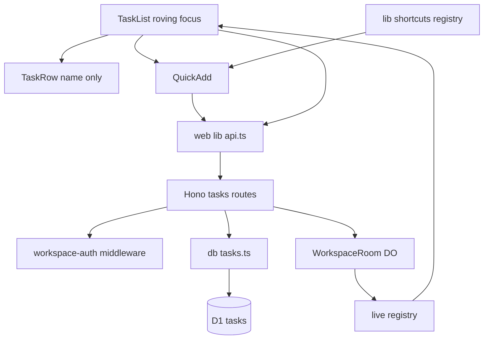

## Structure: target (after story 6)
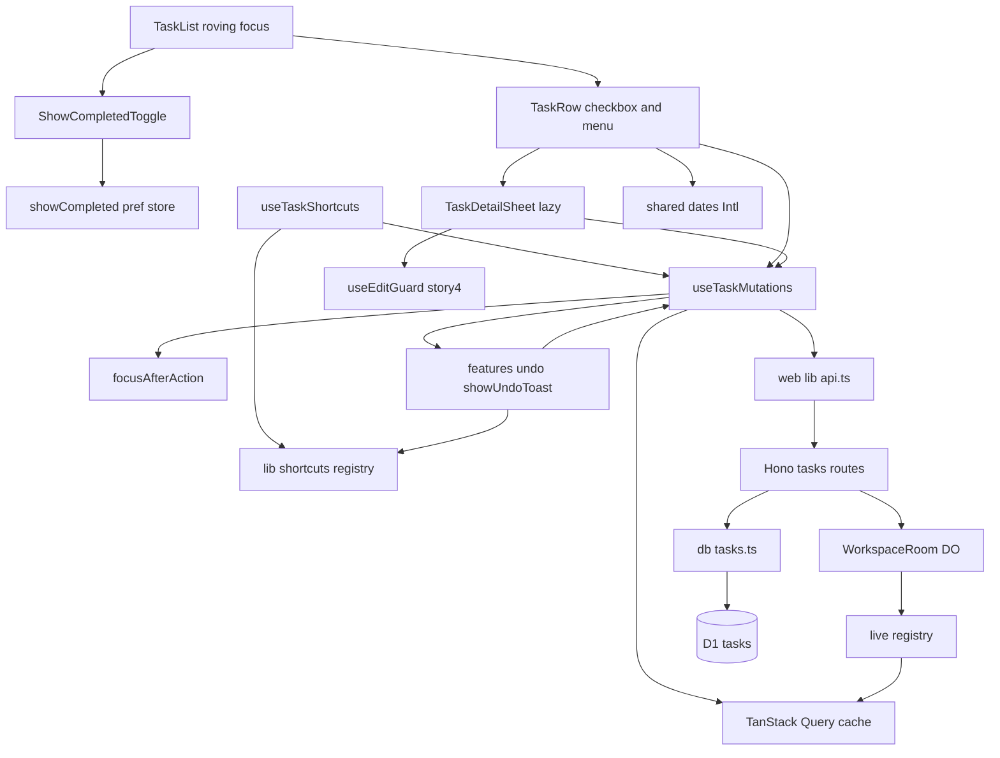
Delta: `DeleteTaskDialog` does not exist; row shortcuts register through the shared registry; undo helper lives in `features/undo`; conflict handling uses `useEditGuard`; focus management is a separate module.

## Task lifecycle state (persisted)
`completed_at` and `deleted` are independent columns, so a deleted task remembers whether it was completed and restore returns it to that state.
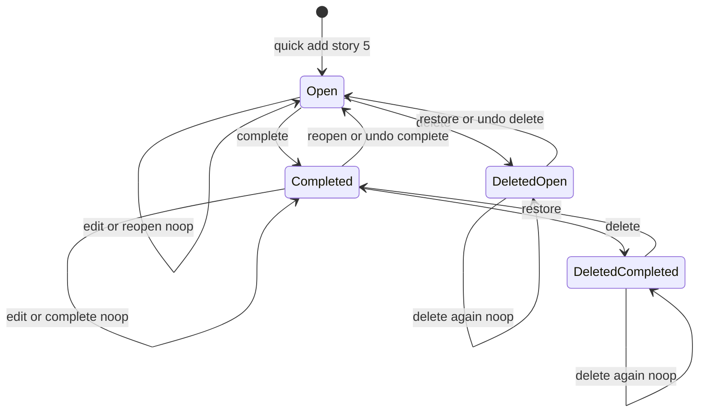
Transitions not drawn are rejected: complete, reopen and edit on DeletedOpen/DeletedCompleted return 410 and change nothing.

## Undo toast state (client, per action, not persisted)
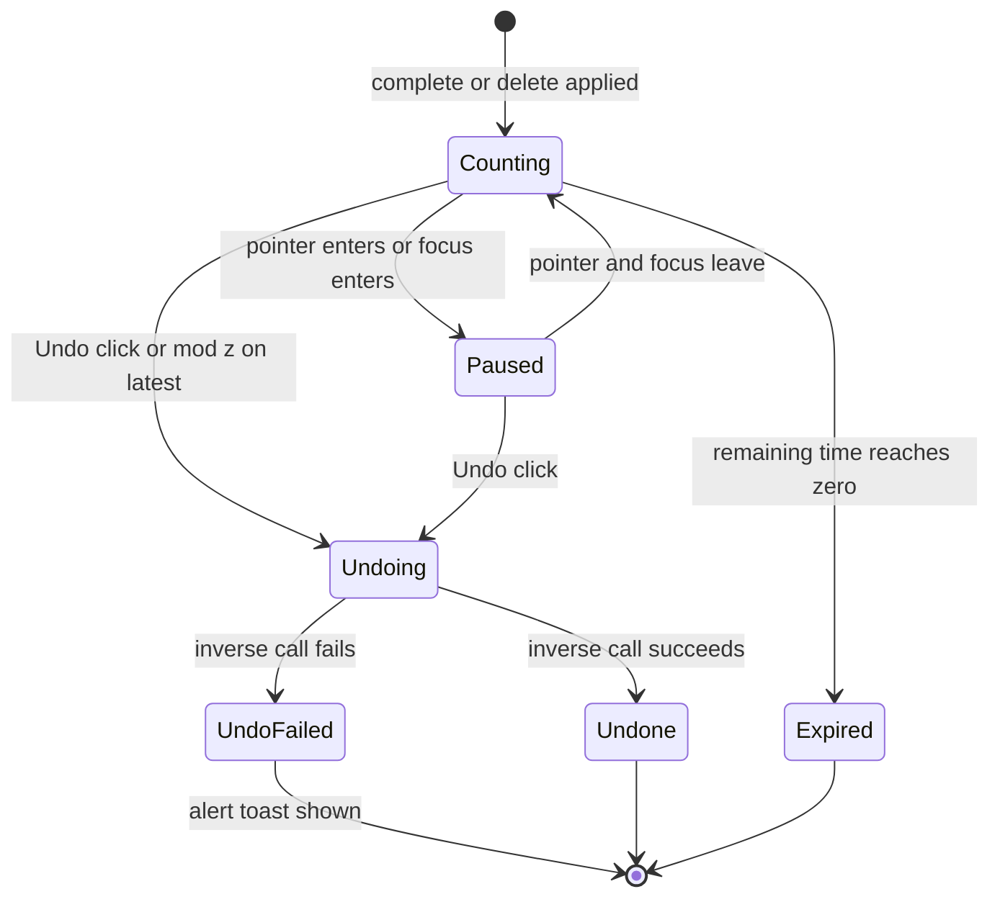
Paused time does not count against `UNDO_WINDOW_MS`. Only the most recent toast in Counting or Paused state responds to Cmd/Ctrl+Z.

## Row presentation state (client)
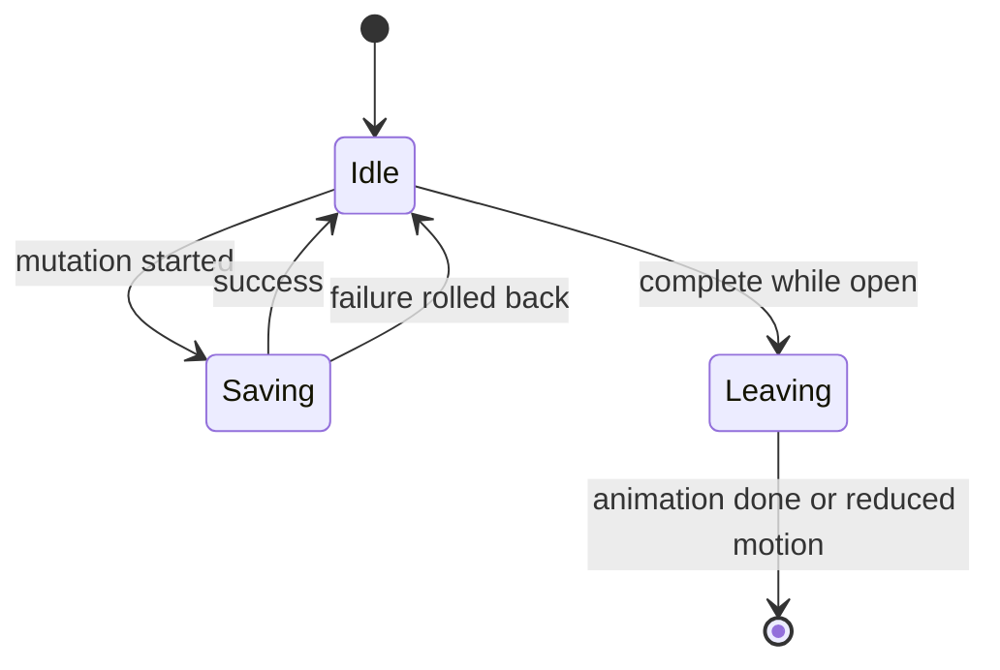
`Saving` sets `aria-busy=true` on the row. `Leaving` lasts `COMPLETE_ANIMATION_MS` (0 under reduced motion) with the checkbox already ticked.

## Flows changed
Six flows change, each with a sequence diagram including error branches: complete + undo (tasks.complete), reopen (tasks.reopen), edit (tasks.edit), delete + undo (tasks.delete; its undo block is the restore flow of tasks.restore), list with completed (tasks.list_completed), keyboard undo (ui.undo). ui.task_actions, ui.task_detail and ui.focus_management are client surfaces of those flows; their only extra behaviour (focus movement) is shown in the ui.focus_management sequence.

## Test Strategy

## Test scopes and boundaries
| Level | Boundary exercised | Why sufficient | Stores |
|---|---|---|---|
| unit | pure functions in `packages/shared` (schemas, blank-name rule, ordering, Intl date helpers) and web pure logic (cache reducers, undo scheduler with pause, undo stack, focus target selection, show-completed preference codec) | these hold the branching logic; no I/O needed | none; localStorage stubbed as a plain object because persistence semantics (not the browser) are under test |
| integration | full Worker request handling via `SELF.fetch` through Hono, auth and validation middleware, db module, real Miniflare D1, real WorkspaceRoom DO (WebSocket client in test) | the structure diagram shows a request-handling boundary; every contract status code, persisted state and broadcast is asserted here | D1 real (store under test, mocking forbidden by architecture 10); DO real so broadcasts are proven end to end |
| ui-component | React components with Testing Library in happy-dom; network mocked with MSW; fake timers; `matchMedia` stubbed for reduced motion, narrow viewport and hover:none | proves optimistic render, rollback, toasts, pause, focus, keyboard, announcements and responsive variants deterministically; server behaviour already proven at integration | network mocked (API not under test here); TanStack Query real; localStorage real happy-dom implementation plus a throwing stub for the failure case |
| e2e | Playwright Chromium against `wrangler dev` with local D1 and DO; one mobile project (390x844, hasTouch) | proves cross-surface workflows (browser to D1 to second browser, real focus, real touch layout) no lower level can | everything real, local only, seeded via `/test/seed` |

## Dimensions crossed
- **Operation**: complete, reopen, edit, delete, restore, list.
- **Prior state**: Open, Completed, DeletedOpen, DeletedCompleted, Missing (no such id or other workspace).
- **Entry surface**: API direct, UI pointer, UI keyboard, UI touch (narrow viewport).
- **Client environment**: default, reduced motion, narrow viewport, hover:none, storage unavailable.

Prior-state classes are exhaustive and non-overlapping: every row is exactly one of Open (deleted=0, completed_at null), Completed (deleted=0, completed_at set), DeletedOpen (deleted=1, completed_at null), DeletedCompleted (deleted=1, completed_at set); any id not in the authenticated workspace is Missing. Removed-row position classes for focus are exhaustive and non-overlapping: only row, first of many, middle, last of many.

## Matrix A: operation x prior state (integration, API surface)
Every row asserts the response AND the D1 row before/after AND whether a live event was received.
| TC | Operation | Prior state | Level | Expected response | State after | version | Broadcast |
|---|---|---|---|---|---|---|---|
| TC-I01 | complete | Open | integration | 200 task with completedAt | Completed, sort_order unchanged | +1 | task.upserted |
| TC-I02 | complete | Completed | integration | 200 unchanged task | Completed, completed_at unchanged | unchanged | none |
| TC-I03 | complete | DeletedOpen | integration | 410 gone | DeletedOpen | unchanged | none |
| TC-I04 | complete | DeletedCompleted | integration | 410 gone | DeletedCompleted | unchanged | none |
| TC-I05 | complete | Missing | integration | 404 not_found | no row affected | not applicable because no row exists | none |
| TC-I06 | reopen | Open | integration | 200 unchanged task | Open | unchanged | none |
| TC-I07 | reopen | Completed | integration | 200 task completedAt null | Open, sort_order unchanged | +1 | task.upserted |
| TC-I08 | reopen | DeletedOpen | integration | 410 gone | DeletedOpen | unchanged | none |
| TC-I09 | reopen | DeletedCompleted | integration | 410 gone | DeletedCompleted | unchanged | none |
| TC-I10 | reopen | Missing | integration | 404 not_found | no row affected | not applicable because no row exists | none |
| TC-I11 | edit name | Open | integration | 200 trimmed name | Open, name updated | +1 | task.upserted |
| TC-I12 | edit name | Completed | integration | 200 trimmed name | Completed, name updated | +1 | task.upserted |
| TC-I13 | edit name | DeletedOpen | integration | 410 gone | unchanged | unchanged | none |
| TC-I14 | edit name | DeletedCompleted | integration | 410 gone | unchanged | unchanged | none |
| TC-I15 | edit name | Missing | integration | 404 not_found | no row affected | not applicable because no row exists | none |
| TC-I16 | delete | Open | integration | 204 | DeletedOpen, deleted_at set, other columns unchanged | +1 | task.deleted |
| TC-I17 | delete | Completed | integration | 204 | DeletedCompleted, completed_at kept | +1 | task.deleted |
| TC-I18 | delete | DeletedOpen | integration | 204 | DeletedOpen, deleted_at unchanged | unchanged | none |
| TC-I19 | delete | DeletedCompleted | integration | 204 | DeletedCompleted, deleted_at unchanged | unchanged | none |
| TC-I20 | delete | Missing | integration | 404 not_found | no row affected | not applicable because no row exists | none |
| TC-I21 | restore | Open | integration | 200 unchanged task | Open | unchanged | none |
| TC-I22 | restore | Completed | integration | 200 unchanged task | Completed | unchanged | none |
| TC-I23 | restore | DeletedOpen | integration | 200 task | Open, deleted_at null, same sort_order | +1 | task.restored |
| TC-I24 | restore | DeletedCompleted | integration | 200 task | Completed, completed_at kept | +1 | task.restored |
| TC-I25 | restore | Missing | integration | 404 not_found | no row affected | not applicable because no row exists | none |
| TC-I26 | list default | mix of all four states | integration | 200 only Open, sort_order asc | read only | not applicable because read only | none |
| TC-I27 | list include_completed=true | mix of all four states | integration | 200 Open by sort_order then Completed by completed_at desc, no deleted | read only | not applicable because read only | none |

## Matrix B: input boundaries and validation
| TC | Case | Level | Expected |
|---|---|---|---|
| TC-I28 | name length 1 | integration | 200 saved |
| TC-I29 | name length TASK_NAME_MAX | integration | 200 saved exactly |
| TC-I30 | name length TASK_NAME_MAX + 1 | integration | 400 validation, row unchanged, no broadcast |
| TC-I31 | name empty string only | integration | 200, name unchanged, version unchanged, no broadcast |
| TC-I32 | name whitespace only | integration | same as TC-I31 |
| TC-I33 | blank name plus valid description | integration | 200, description updated, name unchanged, version +1 |
| TC-I34 | description empty string | integration | 200, description cleared |
| TC-I35 | description length TASK_DESCRIPTION_MAX | integration | 200 saved |
| TC-I36 | description length TASK_DESCRIPTION_MAX + 1 | integration | 400 validation, row unchanged |
| TC-I37 | empty JSON object body | integration | 400 validation |
| TC-I38 | unknown field completedAt in PATCH | integration | 400 validation, lifecycle cannot be tampered with via PATCH |
| TC-I39 | include_completed=yes | integration | 400 validation |
| TC-I40 | name with emoji and RTL text | integration | 200 stored byte-exact |

## Matrix C: access and cross-cutting
| TC | Case | Level | Expected |
|---|---|---|---|
| TC-I41 | task id from workspace B while authenticated for A, each mutating operation | integration | 404 for all five operations, B row unchanged |
| TC-I42 | no `tdl_ws` cookie | integration | 404, nothing changed |
| TC-I43 | mutation without X-Todoodle-Client header | integration | 403 forbidden_client, nothing changed |
| TC-I44 | PATCH with a text/plain body | integration | 415 unsupported_media_type, nothing changed |
| TC-I45 | broadcast carries originClientId from X-Todoodle-Client-Id and new version | integration | event payload matches |
| TC-I46 | reopen position: tasks A,B,C; complete B; reopen B | integration | list order A,B,C |
| TC-I47 | last write wins: client X then client Y PATCH name | integration | final name from Y, version +2, two events in order |
| TC-I48 | retention: delete then read raw D1 row | integration | row exists with deleted=1, deleted_at set, fields intact |
| TC-I49 | undo race: restore called twice concurrently | integration | both 200, version +1 once, one task.restored |
| TC-I50 | bodyless POST complete, reopen, restore and bodyless DELETE with only the client header | integration | accepted (200/204) per Matrix A |

## Matrix D: unit
| TC | Unit | Case | Level | Expected |
|---|---|---|---|---|
| TC-U01 | TaskPatchSchema | name only, description only, both | unit | parse ok |
| TC-U02 | TaskPatchSchema | empty object | unit | refine error, at least one field |
| TC-U03 | TaskPatchSchema | unknown key | unit | strict error |
| TC-U04 | TaskPatchSchema | name TASK_NAME_MAX and +1 | unit | ok and error |
| TC-U05 | resolvePatchedName | blank, whitespace, padded, normal | unit | keep previous, keep previous, trimmed, value |
| TC-U06 | parseIncludeCompleted | absent, true, false, yes | unit | false, true, false, error |
| TC-U07 | orderTasks | open by sort_order then completed by completed_at desc, ties by id | unit | stable order |
| TC-U08 | cache ops complete, reopen, remove, insertBySortOrder with Map index, and rollback | unit | cache deep-equals snapshot after rollback; insert lands at sort_order index |
| TC-U09 | task.restored handler registered via registerLiveHandler | event version lower, equal, higher | unit | ignore, ignore, insert at sort_order |
| TC-U10 | createUndo scheduler, fake timers | undo at 0 ms, UNDO_WINDOW_MS - 1, UNDO_WINDOW_MS | unit | called, called, not called |
| TC-U11 | createUndo pause | pause at 9000 ms, advance 60000 ms, resume, undo at +500 ms; then let 1000 ms pass without pause | unit | first undo called; a fresh toast paused and resumed expires exactly at 10000 ms of unpaused time |
| TC-U12 | undoStack latest | push A then B; B expires; A expires | unit | latest is B, then A, then none |
| TC-U13 | nextFocusTarget(ids, removedIndex) | only row, first of many, middle, last of many | unit | add-task control, next id, next id, previous id |
| TC-U14 | showCompleted preference codec | absent key, stored 1, stored 0, getItem throws, setItem throws, two lists | unit | false, true, false, false without throwing, write ignored without throwing, keys isolated per workspace and list |
| TC-U15 | formatCompletedDate | same year, different year, invalid ISO | unit | short weekday date, date with year, empty string; formatter instance cached (constructed once per locale) |
| TC-U16 | row shortcut table | registered keys and descriptions | unit | e Edit, Delete and Backspace Delete task, Space Complete, mod+z Undo; all descriptions non-empty for the ? panel |

## Matrix E: ui-component (MSW network, fake timers)
| TC | Surface | Environment | Case | Level | Expected |
|---|---|---|---|---|---|
| TC-C01 | pointer | default | click checkbox | ui-component | checkbox aria-checked true at once; row present until COMPLETE_ANIMATION_MS then removed; status toast Task completed with Undo |
| TC-C02 | pointer | default | complete returns 500 | ui-component | row returns at same index, alert toast Couldn't save |
| TC-C03 | pointer | default | click Undo within window | ui-component | POST reopen sent, row back at index |
| TC-C04 | pointer | default | advance UNDO_WINDOW_MS | ui-component | toast gone, no reopen request |
| TC-C05 | pointer | default | click task name | ui-component | detail sheet opens, name focused, description shown |
| TC-C06 | keyboard | default | edit name then Enter | ui-component | PATCH trimmed name, row shows new name immediately |
| TC-C07 | pointer | default | edit description then blur | ui-component | PATCH description |
| TC-C08 | keyboard | default | Escape during edit | ui-component | no PATCH, field reverts; second Escape closes sheet |
| TC-C09 | keyboard | default | clear name then Enter | ui-component | no PATCH for name, previous name shown, hint Name can't be empty visible then gone after NAME_HINT_MS |
| TC-C10 | keyboard | default | type past TASK_NAME_MAX in sheet | ui-component | text kept, over-limit count shown, Enter sends no PATCH |
| TC-C11 | pointer | default | PATCH returns 410 | ui-component | useEditGuard deleted notice, sheet closes, row removed |
| TC-C12 | pointer | default | menu Delete | ui-component | no dialog rendered, DELETE sent, row removed at once, status toast Task deleted with Undo |
| TC-C13 | pointer | default | Delete then Undo | ui-component | POST restore, row back at index |
| TC-C14 | pointer | default | DELETE returns 500 | ui-component | row returns, alert toast |
| TC-C15 | pointer | default | toggle show completed | ui-component | completed rows struck through with Intl-formatted date; checkbox reopens |
| TC-C16 | keyboard | default | focused row press E, Delete, Space | ui-component | detail opens; task deleted with toast and no dialog; task completes |
| TC-C17 | keyboard | default | press E or Delete while typing in quick add | ui-component | ignored by shared isTypingTarget, character typed |
| TC-C18 | pointer | default | accessible names and hints | ui-component | checkbox named Complete NAME or Reopen NAME; menu items show E and Del hints; menu trigger hit area at least MIN_TOUCH_TARGET_PX |
| TC-C19 | live | default | remote task.upserted changes name of task open in sheet | ui-component | useEditGuard conflict notice with Use my version and Keep theirs |
| TC-C20 | pointer | default | show completed with zero completed tasks | ui-component | text No completed tasks |
| TC-C21 | pointer | default | reopen returns 500 from completed group | ui-component | row returns to completed group, alert toast |
| TC-C22 | pointer | default | Undo call returns 500 | ui-component | alert toast Couldn't undo, task stays completed or deleted on screen |
| TC-C23 | pointer | reduced motion | click checkbox | ui-component | row removed immediately, no animation class |
| TC-C24 | pointer and keyboard | default | hover toast for 20000 ms, then leave; separately focus Undo for 20000 ms, then blur | ui-component | toast still visible while hovered or focused; disappears UNDO_WINDOW_MS of unpaused time after leaving |
| TC-C25 | keyboard | default | mod+z with toast visible and focus on a row; mod+z with focus in quick add input | ui-component | first sends inverse request; second sends nothing and does not prevent default |
| TC-C26 | keyboard | default | complete A, delete B, mod+z | ui-component | only B restored; A toast still counting |
| TC-C27 | keyboard | default | complete focused row at positions only, first, middle, last | ui-component | focus on add-task control, next row, next row, previous row |
| TC-C28 | keyboard | default | close sheet by Escape; delete from sheet | ui-component | focus returns to originating row; sheet closes and focus moves to next row |
| TC-C29 | pointer | default and storage throws | toggle on, remount list; slow completed response | ui-component | toggle restored on after remount; previous rows stay rendered while loading (keepPreviousData, no empty state flash); with throwing storage toggle still works, defaults off, no crash |
| TC-C30 | touch | narrow viewport and hover none | open task; inspect row | ui-component | sheet has full-screen layout; menu trigger visible without hover |
| TC-C31 | pointer | default | pending complete; failing edit | ui-component | row aria-busy true while pending, false after; failure toast has role alert; success toast role status |
| TC-C32 | pointer | default | initial render of list | ui-component | TaskDetailSheet chunk not loaded until row hover or focus triggers preload |

## E2E workflows (Playwright, local)
| TC | Workflow | Level | Asserted outcome |
|---|---|---|---|
| TC-E01 | complete then Undo then reload | e2e | task back at original index and still open after reload |
| TC-E02 | complete, wait past UNDO_WINDOW_MS, reload, show completed, reopen, reload again | e2e | completed shown struck through with date; after reopen it sits at original index; show completed still on after reload |
| TC-E03 | open detail, edit name and description, reload | e2e | both persisted |
| TC-E04 | delete then Undo; delete and let expire, then reload | e2e | no confirmation shown; first restored; second gone from UI while `/test/tasks/:id/raw` shows deleted=1 |
| TC-E05 | two contexts A and B on one workspace; A completes; B edits a task A deletes | e2e | B sees completion within LIVE_UPDATE_TARGET_MS; B sees the deleted notice |
| TC-E06 | keyboard only: Tab to list, Down, E, edit, Enter, Escape twice, Delete, mod+z | e2e | name saved; focus returns to row; after delete focus on next row; mod+z restores the task |
| TC-E07 | mobile project 390x844 touch: tap row menu, Delete, Undo; tap name | e2e | menu visible without hover; delete and undo work; detail fills the viewport |
| TC-E08 | hover the undo toast for 15 s then move away | e2e | toast survives while hovered and disappears about 10 s after leaving |

## Negative scenarios (what must NOT happen)
| TC | Must not | Level |
|---|---|---|
| TC-I02, TC-I06, TC-I18, TC-I19, TC-I21, TC-I22, TC-I31 | no-op operations bump version or broadcast | integration |
| TC-I03, TC-I04, TC-I08, TC-I09, TC-I13, TC-I14 | deleted tasks get completed, reopened or edited | integration |
| TC-I30, TC-I36, TC-I37, TC-I38, TC-I39, TC-I44 | invalid input changes anything | integration |
| TC-I41, TC-I42 | any cross-workspace effect | integration |
| TC-I43 | a mutation without the client header succeeds | integration |
| TC-C08, TC-C09, TC-C10 | Escape, blank or over-limit input sends a request | ui-component |
| TC-C12, TC-C16, TC-E04 | a confirmation dialog appears for single-task delete | ui-component and e2e |
| TC-C04, TC-U10 | an expired undo sends a request | ui-component and unit |
| TC-C17, TC-C25 | shortcuts hijack typing or native text undo | ui-component |
| TC-C26 | mod+z undoes anything other than the most recent action | ui-component |
| TC-U14, TC-C29 | unavailable storage crashes the list | unit and ui-component |
| TC-I48 | delete hard-deletes | integration |

## Error path coverage (every contract error has a case)
| Error | Cases | Level |
|---|---|---|
| 400 validation | TC-I30, TC-I36, TC-I37, TC-I38, TC-I39 | integration |
| 403 forbidden_client | TC-I43 | integration |
| 415 unsupported_media_type | TC-I44 | integration |
| 404 not_found | TC-I05, TC-I10, TC-I15, TC-I20, TC-I25, TC-I41, TC-I42 | integration |
| 410 gone | TC-I03, TC-I04, TC-I08, TC-I09, TC-I13, TC-I14, TC-C11, TC-E05 | integration, ui-component, e2e |
| network or 500 rollback | TC-C02, TC-C14, TC-C21, TC-C22 | ui-component |
| storage unavailable | TC-U14, TC-C29 | unit, ui-component |

## Boundary values
- Undo window: 0, UNDO_WINDOW_MS - 1, UNDO_WINDOW_MS, and paused beyond the window (TC-U10, TC-U11, TC-C24, TC-E08).
- Animation: COMPLETE_ANIMATION_MS and 0 under reduced motion (TC-C01, TC-C23).
- Name length: 0, 1, TASK_NAME_MAX, TASK_NAME_MAX + 1 (TC-I28..TC-I31, TC-C10); description TASK_DESCRIPTION_MAX and +1 (TC-I35, TC-I36).
- List position of removed row: only, first, middle, last (TC-U13, TC-C27).
- Viewport: below and at MOBILE_BREAKPOINT_PX (TC-C30, TC-E07).

## Fixture realism
Integration and e2e seed via `/test/seed` a workspace resembling real use: 12 tasks created through the quick-add insert path (real fractional `sort_order`), a name at exactly TASK_NAME_MAX, an emoji and RTL name, multi-line descriptions, 3 completed with distinct `completed_at`, 2 soft-deleted (one per deleted state), plus a second workspace with 3 tasks. Unit and ui-component fixtures are typed with the shared `Task` type so they cannot drift from the API shape; MSW handlers return bodies parsed through the shared zod schemas.

## Not covered (deliberately)
- Performance at the 5,000-task scale (story 8 owns that case; this story only adds per-row `content-visibility`).
- Firefox/WebKit in e2e; the APIs used are standards-only.
- Screen-reader output itself (we assert roles and live-region attributes, not what a specific reader speaks).
- The operator recovery runbook (manual).
- Swipe gestures (out of scope for the product).
- Live transport reliability (reconnect, heartbeat) is owned and tested by story 4; here only event emission and application are tested.

## Complete a task

> Anchor: `tasks.complete`

## Contract
`POST /api/w/:workspaceId/tasks/:taskId/complete`
- Headers: `X-Todoodle-Client: web`, `X-Todoodle-Client-Id: <uuid>`; cookie `tdl_ws`. Body optional; if present it must be JSON `{}`.
- 200 `{ task: Task }`. If Open: sets `completed_at = now`, `version += 1`, `updated_at = now`; broadcasts `task.upserted` with `originClientId`. If already Completed: returns current task unchanged, no broadcast.
- Errors: 404 `not_found` (no cookie, wrong workspace, unknown task); 410 `gone` (soft-deleted); 403 `forbidden_client` (missing client header); 415 `unsupported_media_type` (non-JSON body).
- Side effects: one guarded D1 UPDATE (`WHERE id=? AND workspace_id=? AND deleted=0 AND completed_at IS NULL`); `sort_order` untouched.

```ts
export function completeTask(db: D1Database, workspaceId: string, taskId: string, now: string): Promise<MutationResult<Task>>
type MutationResult<T> = { kind: 'changed'; entity: T } | { kind: 'noop'; entity: T } | { kind: 'gone' } | { kind: 'missing' }
```

## Sequence: complete and undo
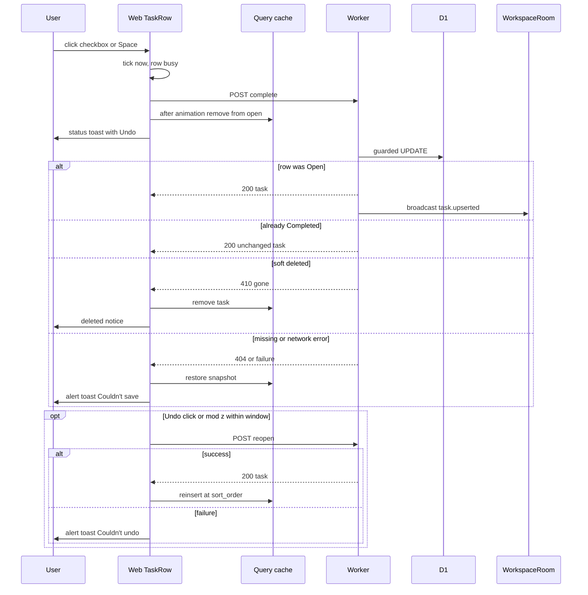

## Implementation
- `packages/shared/src/schemas.ts`: `TaskSchema.completedAt: string | null` (if not already from story 5); optional `EmptyBodySchema`.
- `apps/api/src/db/tasks.ts`: `completeTask` via single `UPDATE ... RETURNING *`; if 0 rows, `SELECT` to classify noop/gone/missing.
- `apps/api/src/routes/tasks.ts`: `lifecycleRoute(fn)` factory maps `MutationResult` to 200/404/410; on `changed` calls `ctx.executionCtx.waitUntil(broadcast(env, workspaceId, event))` (story 4 helper).
- `apps/web/src/features/tasks/useTaskMutations.ts`: `useCompleteTask`: `onMutate` cancels `queryKeys.tasks(wid)` queries, snapshots, applies `completeInCache` via `setQueriesData` to both include-completed variants; `onError` rollback + alert toast; `onSuccess` writes the server entity and opens `showUndoToast` with inverse `reopen`.
- `apps/web/src/features/tasks/cacheOps.ts`: pure `completeInCache`, `reopenInCache`, `removeFromCache`, `insertBySortOrder` (Map index per `js-index-maps`, `toSorted` per `js-tosorted-immutable`).

## Tests
Integration TC-I01..TC-I05, TC-I41..TC-I45, TC-I50; unit TC-U08; ui-component TC-C01, TC-C02, TC-C23, TC-C31; e2e TC-E01, TC-E02, TC-E05.

## Reopen a completed task

> Anchor: `tasks.reopen`

## Contract
`POST /api/w/:workspaceId/tasks/:taskId/reopen` (same headers and optional body rule as complete).
- 200 `{ task }`. If Completed: `completed_at = NULL`, `version += 1`, broadcast `task.upserted`. If already Open: unchanged, no broadcast.
- Errors: 404 `not_found`, 410 `gone`, 403 `forbidden_client`, 415 `unsupported_media_type`.
- Position guarantee: `sort_order` is never modified by complete or reopen, so the task reappears in its original relative position (prd.reopen).

```ts
export function reopenTask(db: D1Database, workspaceId: string, taskId: string, now: string): Promise<MutationResult<Task>>
```

## Sequence: reopen from show completed
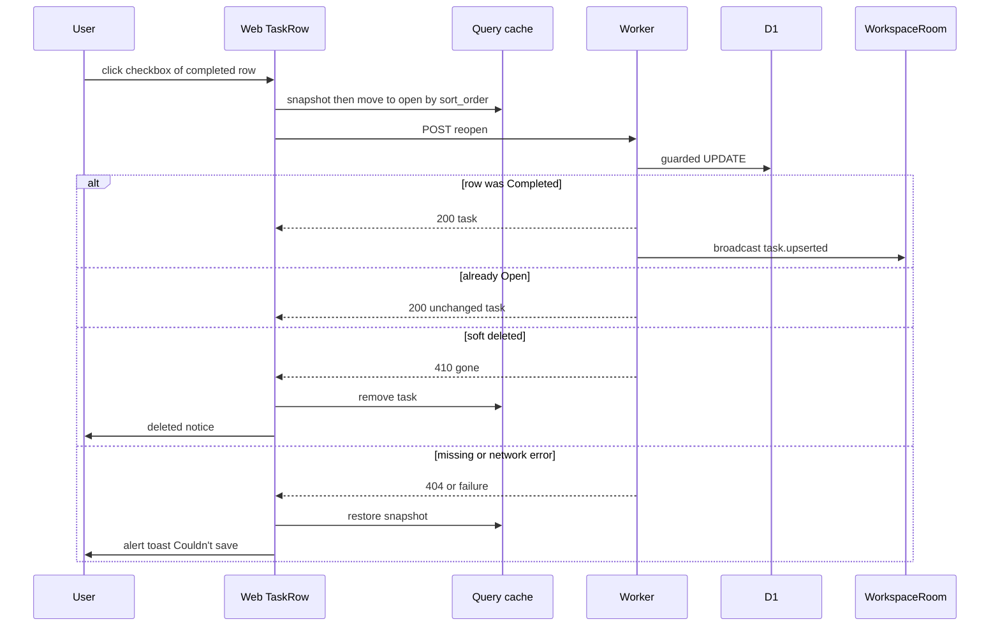

## Implementation
- `apps/api/src/db/tasks.ts`: `reopenTask` guarded by `deleted=0 AND completed_at IS NOT NULL`.
- `apps/api/src/routes/tasks.ts`: via `lifecycleRoute`.
- `apps/web/src/features/tasks/useTaskMutations.ts`: `useReopenTask`, also the inverse for undo of complete.

## Tests
Integration TC-I06..TC-I10, TC-I46, TC-I50; unit TC-U07, TC-U08; ui-component TC-C03, TC-C15, TC-C21; e2e TC-E01, TC-E02.

## List tasks including completed, with a remembered toggle

> Anchor: `tasks.list_completed`

## Contract
Extends story 5's `GET /api/w/:workspaceId/tasks` with `include_completed=true|false` (default false). Composes with story 7's project scoping.
- 200 `{ tasks: Task[] }`: open tasks by `sort_order` asc, then (if include_completed) completed tasks by `completed_at` desc; ties by `id`. Soft-deleted tasks never returned.
- Errors: 400 `validation` for any other value; 404 `not_found` for auth miss. No side effects.

Client preference contract:
```ts
// apps/web/src/features/tasks/showCompletedPref.ts
export function readShowCompleted(storage: Storage | undefined, workspaceId: string, listKey: string): boolean
export function writeShowCompleted(storage: Storage | undefined, workspaceId: string, listKey: string, on: boolean): void
// key: `tdl:showCompleted:${workspaceId}:${listKey}`; every access wrapped in try/catch; failures read as false and writes are dropped
```

## Sequence: toggle show completed
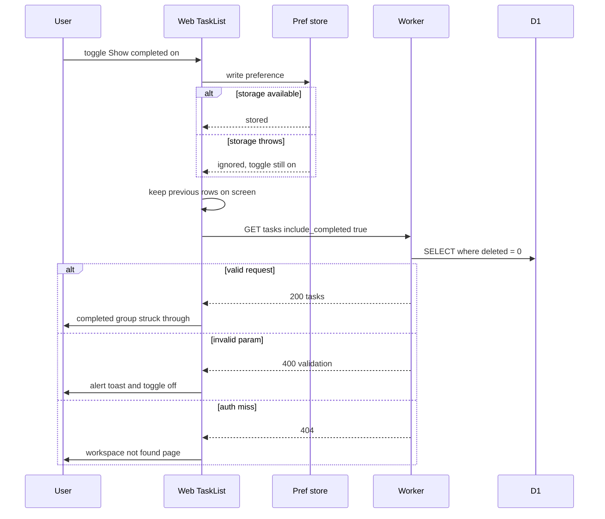

## Implementation
- `packages/shared/src/schemas.ts`: `ListTasksQuerySchema` (`include_completed` as `z.enum(['true','false']).optional()`), `parseIncludeCompleted`.
- `packages/shared/src/dates.ts` (created here, extended by story 8): `formatCompletedDate(iso, locale)` using `Intl.DateTimeFormat` instances cached in a module-level `Map` keyed by locale and options (`js-cache-function-results`); no `date-fns` in this story.
- `apps/api/src/db/tasks.ts`: `listTasks(db, workspaceId, { includeCompleted })` using index `(workspace_id, deleted, completed_at, sort_order)`.
- `apps/web/src/features/tasks/showCompletedPref.ts`: codec above.
- `apps/web/src/features/tasks/ShowCompletedToggle.tsx`: state initialised lazily from `readShowCompleted` (`rerender-lazy-state-init`); writes happen in the click handler (`rerender-move-effect-to-event`), not an effect.
- `apps/web/src/features/tasks/TaskList.tsx` (story 5 file): query key `queryKeys.tasks(wid, { list, includeCompleted })`; `placeholderData: keepPreviousData` so toggling never flashes an empty or loading state; completed group rendered with a ternary (`rendering-conditional-render`); `content-visibility: auto` with `contain-intrinsic-size` on each row, never on the container.
- Empty completed group text: No completed tasks.

## Tests
Integration TC-I26, TC-I27, TC-I39; unit TC-U06, TC-U07, TC-U14, TC-U15; ui-component TC-C15, TC-C20, TC-C29; e2e TC-E02.

## Edit task name and description

> Anchor: `tasks.edit`

## Contract
`PATCH /api/w/:workspaceId/tasks/:taskId` body `TaskPatch = { name?: string; description?: string }` (strict; at least one key).
- `name`: trimmed; if trimmed is empty the field is ignored (previous name kept). Max `TASK_NAME_MAX`.
- `description`: max `TASK_DESCRIPTION_MAX`; empty string clears it.
- 200 `{ task }`. Effective change: `version += 1`, `updated_at = now`, broadcast `task.upserted`. No effective change: unchanged, no broadcast.
- Works on Open and Completed tasks.
- Errors: 400 `validation`, 404 `not_found`, 410 `gone`, 403 `forbidden_client`, 415 `unsupported_media_type`.
- Conflict policy: last write wins (architecture 7); editors learn of other changes via story 4's `useEditGuard`.

```ts
export const TaskPatchSchema: z.ZodType<TaskPatch>
export function resolvePatchedName(input: string | undefined, previous: string): string
export function updateTask(db: D1Database, workspaceId: string, taskId: string, patch: TaskPatch, now: string): Promise<MutationResult<Task>>
```

## Sequence: edit
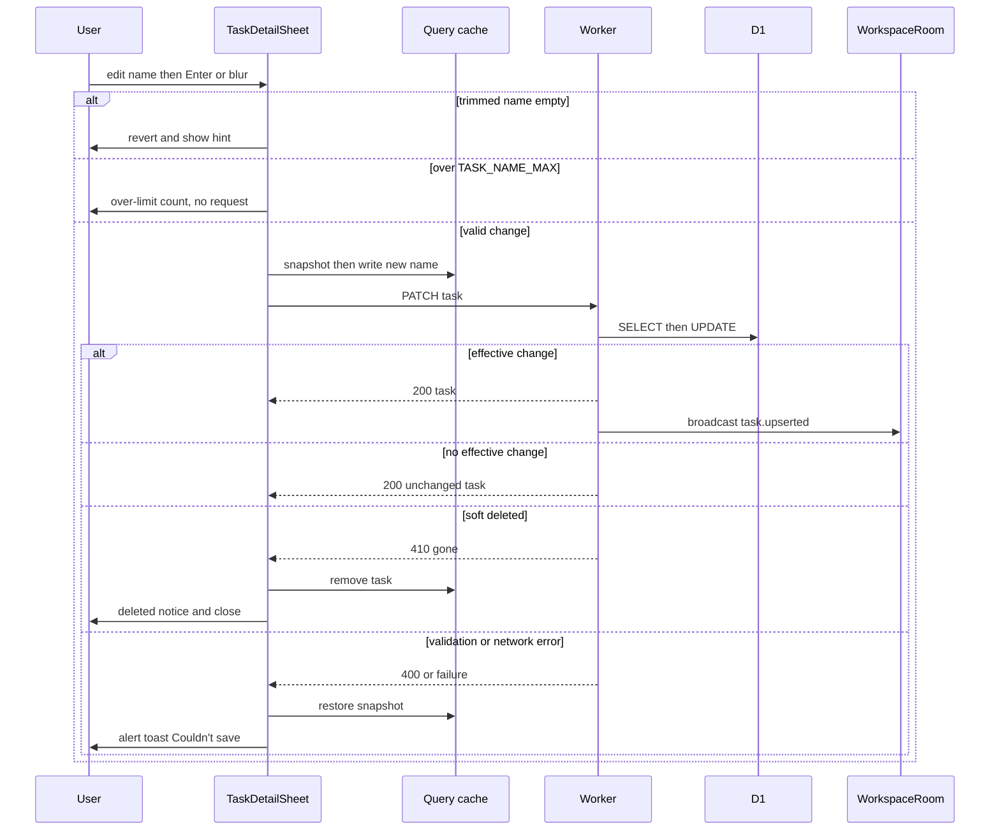

## Implementation
- `packages/shared/src/schemas.ts`: `TaskPatchSchema` (`.strict()`, `.refine` at least one key), `resolvePatchedName`.
- `apps/api/src/db/tasks.ts`: `updateTask` computes the effective patch; `UPDATE ... SET version = version + 1 ... RETURNING *` only if changed.
- `apps/api/src/routes/tasks.ts`: PATCH handler with zod validation.
- `apps/web/src/features/tasks/useTaskMutations.ts`: `useUpdateTask` optimistic with rollback.
- Client editing surface is `ui.task_detail`.

## Tests
Integration TC-I11..TC-I15, TC-I28..TC-I38, TC-I40, TC-I47; unit TC-U01..TC-U05; ui-component TC-C06..TC-C11, TC-C19; e2e TC-E03, TC-E05, TC-E06.

## Delete a task immediately and retain it

> Anchor: `tasks.delete`

## Contract
`DELETE /api/w/:workspaceId/tasks/:taskId` (headers `X-Todoodle-Client`, `X-Todoodle-Client-Id`; no body).
- 204. If not deleted: `deleted = 1`, `deleted_at = now`, `version += 1`, broadcast `task.deleted`; other columns untouched. If already deleted: no change, no broadcast.
- Errors: 404 `not_found`, 403 `forbidden_client`.
- **No confirmation step in any client surface** (owner decision 2026-09-25). Undo via `tasks.restore`.
- Retention: no endpoint, job or migration hard-deletes tasks. Every read filters `deleted = 0`; rows stay in D1. Operator recovery: `docs/ops/recover-deleted-task.md`.

```ts
export function softDeleteTask(db: D1Database, workspaceId: string, taskId: string, now: string): Promise<MutationResult<Task>>
```

## Sequence: delete and undo
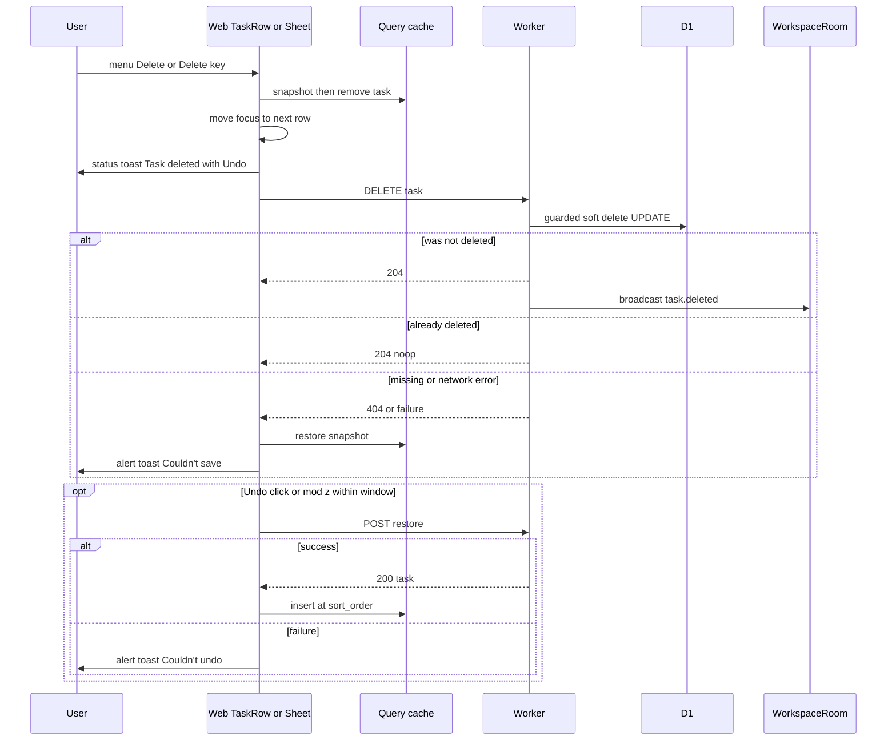

## Implementation
- `apps/api/src/db/tasks.ts`: `softDeleteTask` guarded UPDATE; audit that every query includes `deleted = 0` except `restoreTask` and the test raw read.
- `apps/api/src/routes/tasks.ts`: DELETE handler.
- `apps/api/src/routes/test.ts`: `GET /test/tasks/:id/raw` (non-production only) for e2e retention checks.
- `apps/web/src/features/tasks/useTaskMutations.ts`: `useDeleteTask` optimistic; opens `showUndoToast` with inverse `restore`; calls `focusAfterAction` before removal.
- `docs/ops/recover-deleted-task.md`: runbook.

## Tests
Integration TC-I16..TC-I20, TC-I41, TC-I48, TC-I50; unit TC-U08; ui-component TC-C12..TC-C14, TC-C16; e2e TC-E04, TC-E06, TC-E07.

## Restore a deleted task

> Anchor: `tasks.restore`

## Contract
`POST /api/w/:workspaceId/tasks/:taskId/restore` (optional JSON `{}` body).
- 200 `{ task }`. If deleted: `deleted = 0`, `deleted_at = NULL`, `version += 1`, broadcast `task.restored`; `completed_at` and `sort_order` preserved. If not deleted: unchanged, no broadcast.
- Errors: 404 `not_found`, 403 `forbidden_client`, 415 `unsupported_media_type`.
- Not time-limited on the server; the 10 s limit is the UI undo window only.
- Concurrency: guarded `UPDATE ... WHERE deleted = 1`, so concurrent restores yield one change (TC-I49).

```ts
export function restoreTask(db: D1Database, workspaceId: string, taskId: string, now: string): Promise<MutationResult<Task>>
```

## Sequence
Restore is invoked only via undo in this story; its flow is the `opt Undo click or mod z` block of the tasks.delete sequence, including the failure branch. Remote clients receive `task.restored` through the live registry.

## Implementation
- `apps/api/src/db/tasks.ts`: `restoreTask`.
- `apps/api/src/routes/tasks.ts`: via `lifecycleRoute`.
- `apps/web/src/features/tasks/useTaskMutations.ts`: `useRestoreTask` inserting by `sort_order` on success.
- `apps/web/src/features/tasks/liveHandlers.ts`: `registerLiveHandler('task.restored', ...)` inserting by `sort_order` with the version guard; story 6 never edits story 4's dispatcher.

## Tests
Integration TC-I21..TC-I25, TC-I49, TC-I50; unit TC-U09; ui-component TC-C13, TC-C22; e2e TC-E04.

## Undo toast with pause and keyboard undo

> Anchor: `ui.undo`

## Contract
```ts
// apps/web/src/features/undo/showUndoToast.ts
export function showUndoToast(opts: { message: string; inverse: () => Promise<unknown> }): void
// apps/web/src/features/undo/createUndo.ts (pure, timer-injectable)
export function createUndo(inverse: () => Promise<unknown>, clock: Clock): { undo(): Promise<void>; pause(): void; resume(): void; readonly state: UndoState }
// apps/web/src/features/undo/undoStack.ts
export function latestActiveUndo(): UndoHandle | undefined
```
- Shows a toast with an Undo button for `UNDO_WINDOW_MS` of **unpaused** time. Pointer enter or focus within pauses; leaving both resumes with the remaining time.
- Undo (click, or Cmd/Ctrl+Z on the latest active toast) calls `inverse` once; button disabled while pending; failure shows `role=alert` toast Couldn't undo, try again.
- After expiry `inverse` is never called. Multiple toasts are independent; only the most recent active one answers Cmd/Ctrl+Z.
- Toast container is `role=status` (polite). Messages: Task completed, Task deleted, Task restored (after a successful undo).
- Cmd/Ctrl+Z is registered via story 5's `useGlobalShortcut('mod+z', ..., { description: 'Undo' })`; it does nothing (and does not `preventDefault`) when `isTypingTarget` is true or no toast is active, preserving native text undo.

## Sequence: keyboard undo
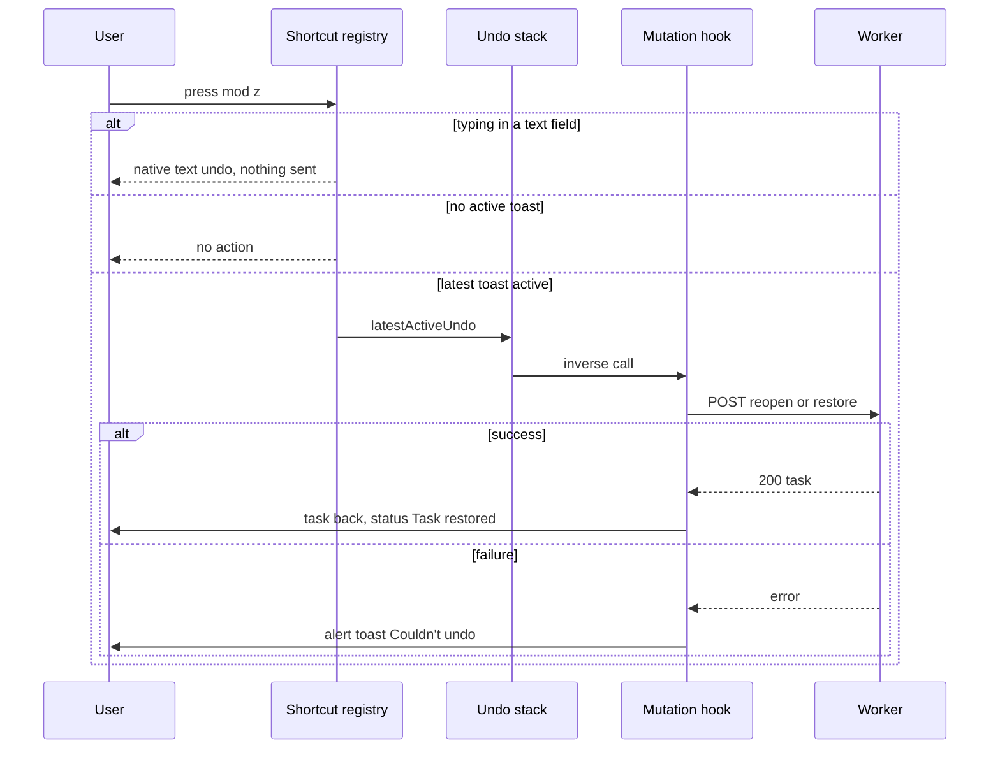

## Implementation
- `apps/web/src/features/undo/showUndoToast.ts`: wraps `sonner` `toast()` with a custom action element; hover and focus handlers call `pause`/`resume` on the `createUndo` handle; `duration: Infinity` on sonner with our own scheduler governing dismissal so pause semantics are exact.
- `apps/web/src/features/undo/createUndo.ts`: pure scheduler (`Clock` injected) tracking remaining time.
- `apps/web/src/features/undo/undoStack.ts`: module-level array of active handles (pushed on show, removed on expiry or undo).
- `apps/web/src/features/undo/useUndoShortcut.ts`: registers `mod+z` once at shell level.
- Inverses are captured from stable refs (`advanced-event-handler-refs`) so toasts never hold stale closures.
- `packages/shared/src/limits.ts`: `UNDO_WINDOW_MS = 10_000`.

## Tests
Unit TC-U10, TC-U11, TC-U12, TC-U16; ui-component TC-C03, TC-C04, TC-C13, TC-C22, TC-C24..TC-C26, TC-C31; e2e TC-E01, TC-E04, TC-E06, TC-E08.

## Task row actions, completion feedback, touch and keyboard

> Anchor: `ui.task_actions`

## Contract
`<TaskRow taskId name description completedAt />` (primitive props only; no `isFocused`; focus is story 5's roving tabindex in the DOM).
- Round checkbox button, hit area at least `MIN_TOUCH_TARGET_PX`: accessible name Complete NAME or Reopen NAME; `aria-checked` flips immediately on click.
- Completion: row enters `Leaving` for `COMPLETE_ANIMATION_MS`, or 0 under `prefers-reduced-motion: reduce`, then is removed.
- Completed rows: struck-through, muted, completion date via `formatCompletedDate`.
- `...` menu (shadcn `DropdownMenu`): Edit (hint E), Delete (hint Del). Delete acts immediately (no dialog). Trigger always visible under `@media (hover: none)`; otherwise visible on row hover or focus-within.
- Row `aria-busy` while any mutation for it is pending.
- Row shortcuts (registered through story 5's `useGlobalShortcut`, active only when focus is on a task row and `isTypingTarget` is false): `e` edit, `Delete`/`Backspace` delete, `Space` complete or reopen.

## Implementation
- `apps/web/src/features/tasks/TaskRow.tsx`: `React.memo` with primitive props (`rerender-memo`); handlers via `useCallback` reading the task id from props; no inline components; `isCompleted` derived in render; `onPointerEnter`/`onFocus` call `preloadTaskDetail()` (`bundle-preload`). Lucide icons imported per icon (`bundle-barrel-imports`).
- `apps/web/src/features/tasks/useTaskShortcuts.ts`: registers the three row shortcuts once at list level via `useGlobalShortcut`; handlers resolve the focused row from `document.activeElement.closest('[data-task-id]')` inside the event (`rerender-move-effect-to-event`), so focus changes never re-render rows. The former `keyboard.ts` (own `isTypingTarget`) is not created.
- `apps/web/src/features/tasks/rowShortcuts.ts`: static shortcut table (key, description) consumed by the registry and the `?` panel.
- `apps/web/src/features/tasks/TaskRow.css` (or Tailwind classes): `motion-safe:` transition for the leaving state; `content-visibility: auto` plus `contain-intrinsic-size` per row.
- Toasts: success `role=status`, failures `role=alert` (via sonner options).
- `apps/web/src/features/tasks/ShowCompletedToggle.tsx`: see tasks.list_completed.

## Tests
Unit TC-U16; ui-component TC-C01, TC-C12, TC-C15..TC-C18, TC-C20, TC-C23, TC-C30, TC-C31; e2e TC-E06, TC-E07.

## Task detail panel

> Anchor: `ui.task_detail`

## Contract
`<TaskDetailSheet taskId returnFocusTo onClose />`
- Right-side shadcn `Sheet`; at widths below `MOBILE_BREAKPOINT_PX` it is full-screen. Contains editable name (single line), description (multi-line), Delete button, close button.
- Name saves on Enter or blur; description on blur; Escape cancels the in-progress edit (first press) and closes (second press).
- Blank name reverts without a request and shows Name can't be empty for `NAME_HINT_MS`.
- Over `TASK_NAME_MAX`: text kept, over-limit count shown in red, no save (architecture 12 length rule).
- Delete button deletes immediately (no dialog), closes the sheet and hands focus to `focusAfterAction`.
- Remote change or 410 handled by story 4's `useEditGuard(taskId, draft)` (conflict notice with Use my version / Keep theirs; deleted notice).
- Focus: name focused on open; on close, focus returns to `returnFocusTo` if that row still exists.

## Implementation
- `apps/web/src/features/tasks/TaskDetailSheet.tsx` (lazy chunk) and `TaskDetailSheet.lazy.ts` exporting the `React.lazy` component and `preloadTaskDetail()` (`bundle-dynamic-imports`, `bundle-preload`).
- Reads the task with `useQuery({ ...queryKeys.tasks(wid, listOpts), select })` where `select` comes from a module-level `selectTaskById(id)` factory memoised per id, so the reference is stable and the sheet re-renders only when that task changes (`rerender-derived-state`).
- Draft state initialised lazily from the task; component keyed by `task.id` so switching tasks resets drafts without an effect (`rerender-lazy-state-init`, `rerender-derived-state-no-effect`).
- Responsive variant chosen by CSS media query classes, not JS width state.

## Tests
ui-component TC-C05..TC-C11, TC-C19, TC-C28, TC-C30, TC-C32; e2e TC-E03, TC-E06, TC-E07.

## Focus management after actions

> Anchor: `ui.focus_management`

## Contract
```ts
// apps/web/src/features/tasks/focusAfterAction.ts
export function nextFocusTarget(orderedIds: readonly string[], removedIndex: number): { kind: 'row'; id: string } | { kind: 'addTask' }
export function focusAfterRemoval(listEl: HTMLElement, removedId: string): void
```
- Removed row was the only row: focus the list's add-task control. Otherwise: next row, or previous row if it was last.
- Called by complete (after the leaving animation) and delete, from row, keyboard or detail sheet.
- Closing the detail sheet without removal returns focus to the originating row (`returnFocusTo`).
- Works with story 5's roving tabindex: the target row receives `tabIndex=0` and `focus()`.

## Sequence: focus after removal
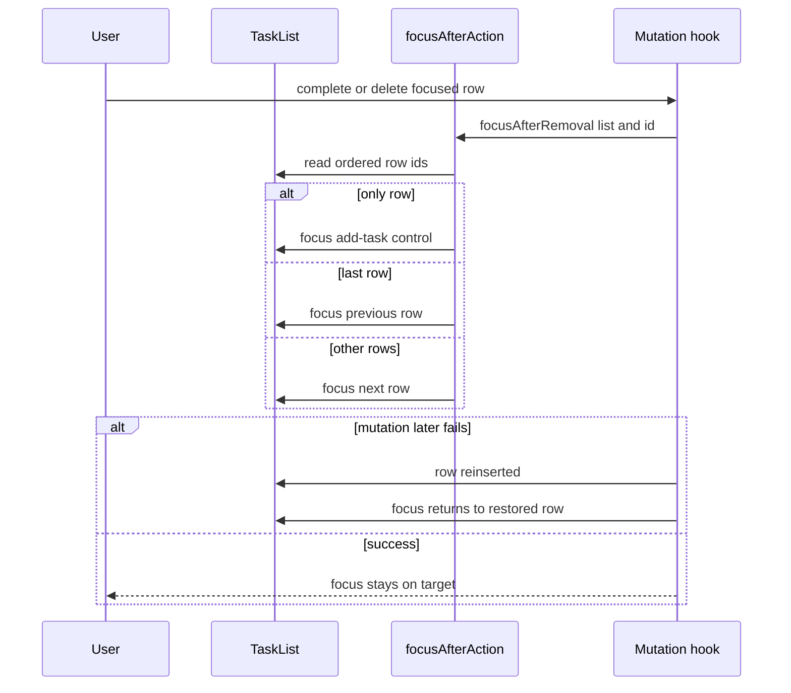

## Implementation
- `apps/web/src/features/tasks/focusAfterAction.ts`: pure `nextFocusTarget` plus DOM helper reading `[data-task-id]` order from the list element (single pass, `js-early-exit`).
- `apps/web/src/features/tasks/useTaskMutations.ts`: calls `focusAfterRemoval` in `onMutate` for delete and after the leaving animation for complete; on rollback refocuses the restored row.
- Integrates with story 5's `TaskList` roving tabindex helper (`setActiveRow(id)`).

## Tests
Unit TC-U13; ui-component TC-C27, TC-C28; e2e TC-E06.

