# Technical Design

Projects: migration 0003, project CRUD + atomic batch delete/restore, scoped task create/list/move, live project events, sidebar/project view/delete-undo/move UI. Follows docs/architecture.md.

## Overview

Adds projects to a workspace. Follows `docs/architecture.md` (single Worker + SPA, cookie workspace auth, D1 source of truth, WorkspaceRoom Durable Object fan-out, TanStack Query optimistic mutations, constants in `packages/shared/src/limits.ts`) including the binding frontend conventions in section 12.

**Depends on:** story 1 (skeleton, middleware, test harness), story 2 (workspaces, `workspace-auth`, open flow, `/w/:workspaceId` route, `apps/web/src/lib/queryKeys.ts`), story 4 (WorkspaceRoom, `registerLiveHandler` in `apps/web/src/features/live/registry.ts`, `useEditGuard`), story 5 (tasks table, idempotent create with client-generated ids, `list=` query, `/counts` endpoint, sidebar shell incl. mobile drawer, quick add, `useGlobalShortcut` in `apps/web/src/lib/shortcuts.ts`, roving-tabindex task list), story 6 (task PATCH, delete/restore, `features/undo/showUndoToast.ts`, focus-after-action helper, `packages/shared/src/dates.ts`).

**Adds / changes**
- Migration `migrations/0003_projects.sql` (owned here per architecture section 5).
- API: `GET/POST /api/w/:wid/projects`, `PATCH/DELETE /api/w/:wid/projects/:pid`, `POST /api/w/:wid/projects/:pid/restore`.
- Extends story 5's `GET /api/w/:wid/counts` from `{inbox}` to `{inbox, projects:{[id]:{open,total}}}` rather than adding a second counts source.
- Extends story 5/6 task contracts: `POST /tasks` accepts optional `projectId`; `GET /tasks?list=project&projectId=`; `PATCH /tasks/:tid` accepts `projectId` (move).
- Error codes added to architecture section 6 (committed): `limit_reached`, `batch_mismatch`, `not_deleted`, `project_not_found`.
- Live events: `project.upserted`, `project.deleted`, `project.restored`, `tasks.bulk`, `task.upserted`.
- SPA: extends story 5's sidebar shell with a Projects section; create/rename/delete/undo; project route; searchable Move to picker with the M shortcut.

**Deliberate decisions**
- Project ids are client-generated and project create is idempotent, the same pattern as story 5 tasks, so optimistic rows keep their id and retries are safe.
- Project deletion and restore are single D1 `batch()` calls (atomic), keyed by a fresh `delete_batch_id` so undo restores exactly the rows that deletion removed and nothing that was deleted separately before.
- Counts are computed server-side in one GROUP BY on the counts endpoint; the client never holds every task of every project.
- Project ordering is creation order (`sort_order = max + 1`); no reordering in MVP.
- Task moves follow story 5's workspace-wide `sort_order` rule (`MAX + TASK_SORT_STEP`), placing the task at the end of its new list.
- Deleted projects do not count toward `MAX_PROJECTS_PER_WORKSPACE`. Duplicate names allowed.
- Moving never changes due date, completion, or name.
- Project-with-tasks delete keeps its confirmation dialog (product-owner decision 2026-09-25); undo uses the shared 10 s toast that pauses on hover/focus (`UNDO_WINDOW_MS = 10_000`).

**Revision 2026-09-25 (React best-practices audit + UX review, `specs/general/UI-IMPROVEMENTS.md`)**
- All query keys come from `queryKeys.ts` under `['ws', wid, ...]`; the counts key carries no date; multi-entry writes use `setQueriesData`, single-key writes `setQueryData(queryKeys.counts(wid))` only.
- Live handlers register through `registerLiveHandler` (a Set per type), never replacing story 5/6/8 handlers.
- `content-visibility:auto` moves from the list container to each `ProjectRow`.
- `ProjectRow` has exactly one count source: a per-row `select` using a module-level selector; the parent no longer passes `openCount`.
- Row hover/focus preloads the ProjectView route chunk as well as prefetching its task list.
- 'Move to…' is now a searchable picker (cmdk `Command`) opened from the task menu or M; it replaces the flat submenu, which does not scale to 300 projects.
- Touch and accessibility: '…' always visible under `@media (hover: none)`, 44 px hit areas, drawer closes on project selection, colour palette checked for 3:1 contrast in light and dark, blank-name hint, no silent truncation of names.

## Structure

Current (after stories 1-6): tasks belong only to the Inbox.

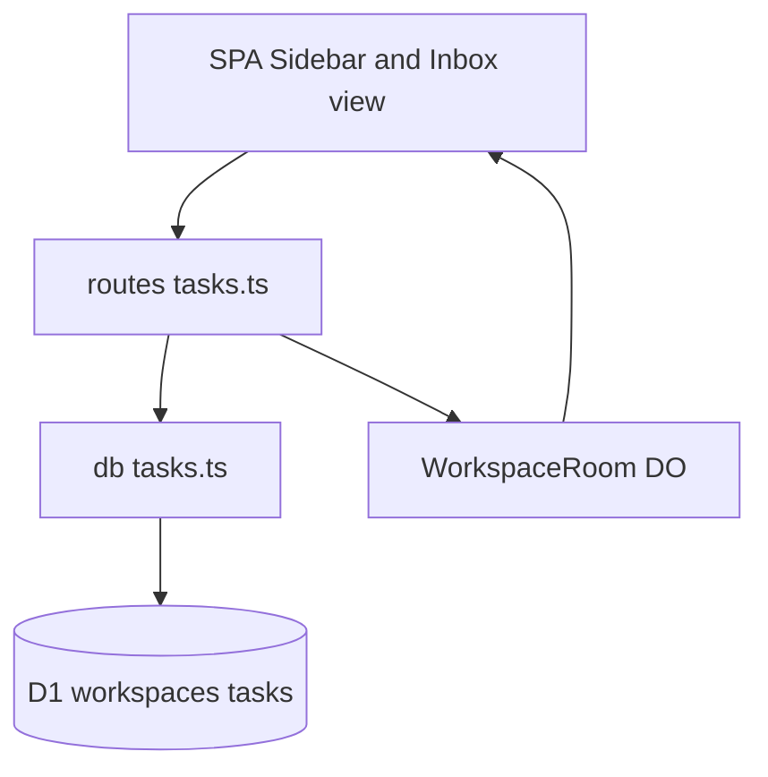
```mermaid
flowchart TD
  SPA[SPA Sidebar and Inbox view]
  TaskRoutes[routes tasks.ts]
  TasksDb[db tasks.ts]
  D1[(D1 workspaces tasks)]
  Room[WorkspaceRoom DO]
  SPA --> TaskRoutes
  TaskRoutes --> TasksDb
  TasksDb --> D1
  TaskRoutes --> Room
  Room --> SPA
```

Target (this story): new project routes and db module, tasks gain project scope, SPA gains project features that plug into shared registries from stories 4 and 5.

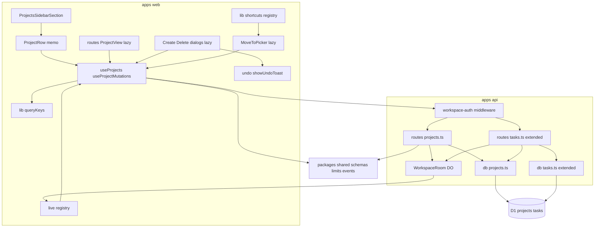
```mermaid
flowchart TD
  subgraph Web[apps web]
    Sidebar[ProjectsSidebarSection]
    Row[ProjectRow memo]
    ProjectView[routes ProjectView lazy]
    Dialogs[Create Delete dialogs lazy]
    Picker[MoveToPicker lazy]
    Hooks[useProjects useProjectMutations]
    Keys[lib queryKeys]
    Shortcuts[lib shortcuts registry]
    LiveReg[live registry]
    Undo[undo showUndoToast]
  end
  subgraph Api[apps api]
    Auth[workspace-auth middleware]
    ProjRoutes[routes projects.ts]
    TaskRoutes[routes tasks.ts extended]
    ProjDb[db projects.ts]
    TasksDb[db tasks.ts extended]
    Room[WorkspaceRoom DO]
  end
  Shared[packages shared schemas limits events]
  D1[(D1 projects tasks)]
  Sidebar --> Row
  Row --> Hooks
  ProjectView --> Hooks
  Dialogs --> Hooks
  Dialogs --> Undo
  Picker --> Hooks
  Shortcuts --> Picker
  Hooks --> Keys
  Hooks --> Auth
  Auth --> ProjRoutes
  Auth --> TaskRoutes
  ProjRoutes --> ProjDb
  TaskRoutes --> TasksDb
  TaskRoutes --> ProjDb
  ProjDb --> D1
  TasksDb --> D1
  ProjRoutes --> Room
  TaskRoutes --> Room
  Room --> LiveReg
  LiveReg --> Hooks
  Hooks --> Shared
  ProjRoutes --> Shared
```

## Persisted State

This story adds persisted lifecycle state for projects and a new deletion cause for tasks.

**Project lifecycle** (`projects.deleted`, `projects.delete_batch_id`):

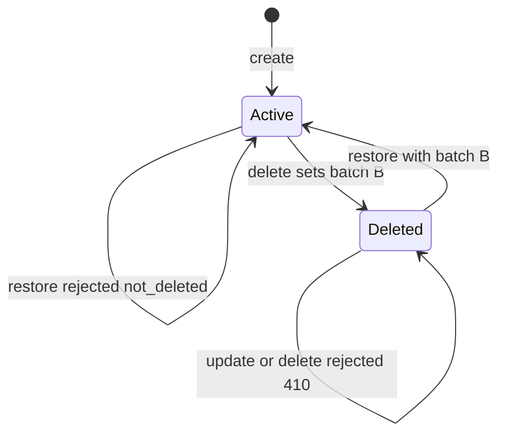
```mermaid
stateDiagram-v2
  [*] --> Active : create
  Active --> Active : rename or recolor
  Active --> Deleted : delete sets batch B
  Deleted --> Active : restore with batch B
  Deleted --> Deleted : restore wrong batch rejected
  Deleted --> Deleted : update or delete rejected 410
  Active --> Active : restore rejected not_deleted
```

**Task lifecycle as affected by this story** (`tasks.deleted`, `tasks.delete_batch_id`, `tasks.completed_at`, `tasks.project_id`):

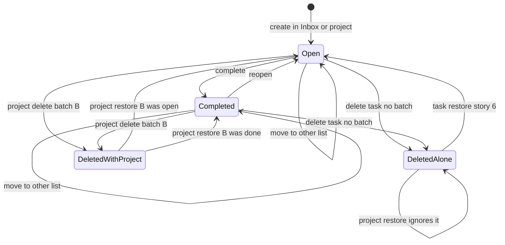
```mermaid
stateDiagram-v2
  [*] --> Open : create in Inbox or project
  Open --> Open : move to other list
  Open --> Completed : complete
  Completed --> Open : reopen
  Completed --> Completed : move to other list
  Open --> DeletedAlone : delete task no batch
  Completed --> DeletedAlone : delete task no batch
  DeletedAlone --> Open : task restore story 6
  Open --> DeletedWithProject : project delete batch B
  Completed --> DeletedWithProject : project delete batch B
  DeletedWithProject --> Open : project restore B was open
  DeletedWithProject --> Completed : project restore B was done
  DeletedAlone --> DeletedAlone : project restore ignores it
```

Restoring a task to Open vs Completed simply leaves `completed_at` untouched: deletion never clears it. `DeletedAlone` rows have `delete_batch_id IS NULL` and are excluded from the batch update both at delete time (`WHERE deleted = 0`) and at restore time (`WHERE delete_batch_id = ?B`).

## SPA Routing Decision

Architecture section 4 (as updated by story 2): links open via `/w#<secret>`; remembered workspaces open via the SPA route `/w/:workspaceId` with no secret (cookie auth). This story adds a child route and keeps whatever fragment is present:

| Route | View | Owner |
|---|---|---|
| `/w/:workspaceId` | Inbox | story 2/5 |
| `/w/:workspaceId/today` | Today | story 8 |
| `/w/:workspaceId/project/:projectId` | Project | this story |

- All in-app navigation uses `useWorkspaceNavigate()` (`apps/web/src/features/workspace/useWorkspaceNavigate.ts`), which carries over `location.hash` if one is present (so a link-opened session keeps a bookmarkable address) and otherwise navigates path-only.
- Reloading `/w/:workspaceId/project/:projectId` works in the browser that remembers the workspace (cookie). In a browser without the cookie, the path alone grants nothing (404 page from story 2), which is the intended security property.
- Project ids are non-secret handles; knowing one grants nothing.
- Unknown or deleted `:projectId` on load: redirect to Inbox with toast 'Project not found'.
- Task creation with `projectId` uses story 5's client-generated task id; retries remain idempotent and `id_conflict` is unchanged.

## Test Strategy

## Test Scopes

| Level | Applies | Why |
|---|---|---|
| unit | yes | zod schemas (name/colour boundaries), pure decision functions, live-event cache reducer, optimistic count adjustment, migration safety scan, destination filtering, name-field state, palette contrast, live registry coexistence |
| integration | yes | every route via `SELF.fetch` through real Hono + workspace-auth + real Miniflare D1 + real WorkspaceRoom; persisted state asserted before/after with direct SQL |
| ui-component | yes | sidebar, dialogs, project view, Move to picker, M shortcut, touch visibility, live handlers with MSW-mocked network |
| e2e | yes | cross-surface flows (create, delete/undo, collaboration across two browser contexts, reload and cookie-less access, keyboard-only, phone viewport) |

## Dimensions crossed

- **D1 Operation**: list projects, counts, create, update, delete, restore, move task, create task in project, list tasks by project
- **D2 Target prior state**: active, soft-deleted, nonexistent, other workspace
- **D3 Project contents**: 0 tasks; N open; N open plus completed; includes a task deleted on its own earlier
- **D4 Input class**: name empty / whitespace / 1 / 107 / 108 / 120 / 121 / padded; colour in palette / not; client id new / replay / deleted / foreign; projectId null / active / deleted / other-workspace / nonexistent; batchId matching / stale / wrong; picker query empty / case-different / accented / no-match / whitespace
- **D5 Active project count**: 0 / 299 / 300 / 300 with one deleted
- **D6 Surface**: API, component, browser
- **D7 Input modality and viewport**: mouse + wide; keyboard only + wide; touch (`hover: none`) + narrow (390 px)

The cross of D1 x D2 is covered for every mutating operation (rows per op below). D3 is crossed with counts, delete and restore. D4 with create/update/move/restore and with the picker. D5 with create (new and replay) and with the picker (0 and 300). D7 is crossed with the sidebar, the picker and delete/undo (see the D7 table).

## Equivalence classes (exhaustive, non-overlapping)

- Project name after trim: {length 0} invalid; {1..PROJECT_NAME_MAX} valid; {> PROJECT_NAME_MAX} invalid. Client-side display state (untrimmed length L, max 120, warn ratio 0.9 -> threshold 108): {L = 0 or only spaces} empty; {1..107} ok; {108..120} near; {> 120} over.
- Colour: {member of PROJECT_COLORS} valid; {anything else incl. missing on create} invalid (missing on update = unchanged).
- Client project id on create: {unused}, {used here, active}, {used here, deleted}, {used in another workspace}, {malformed}.
- Target project: {active in this workspace}, {soft-deleted in this workspace}, {id in another workspace}, {id that exists nowhere}.
- Move destination projectId: {null = Inbox}, {active same workspace}, {deleted same workspace}, {other workspace}, {nonexistent}, {equal to current list}.
- Restore batchId: {equals project.delete_batch_id}, {any other string}; project state {deleted}, {active}.
- Active project count before create: {< MAX}, {= MAX}.
- Browser access to project route: {cookie remembers workspace}, {no cookie}.
- Picker query after trim: {empty} all options; {matches >= 1 name ignoring case/accents} subset; {matches none} empty state.
- M key press context: {task focused, not typing}, {typing in an input/textarea/contenteditable}, {no task focused}.
- Pointer capability: {hover: hover}, {hover: none}.

## Cases

| TC | Capability | D1 op / D2 prior / D4 input | Expected: response and state before -> after | Level |
|---|---|---|---|---|
| TC-01 | projects.schema | migrate 0001-0003 on DB with 2 Inbox tasks | projects table, tasks.project_id, tasks.delete_batch_id, indexes exist; existing tasks project_id NULL (stay Inbox) | integration |
| TC-02 | projects.schema | safety scan of 0003 file | no CHECK, DROP TABLE, MODIFY, ADD CONSTRAINT patterns | unit |
| TC-03 | projects.api_crud | list projects and counts / workspace with 0 projects, 0 tasks | 200 {projects:[]}; 200 {inbox:0, projects:{}} | integration |
| TC-04 | projects.api_crud | counts / P1 has 3 open, 2 completed, 1 deleted-alone; P3 active empty; P2 deleted; Inbox 4 open | projects.P1 {open 3, total 5}; P3 {open 0, total 0}; P2 absent; inbox 4 (project tasks excluded) | integration |
| TC-05 | projects.api_crud | list projects and counts / cookie lacks this workspace | 404 not_found for both, body identical to unknown workspace | integration |
| TC-06 | projects.api_crud | create / unused id, name 'A', colour PROJECT_COLORS[0].key | 201; rows 0 -> 1; sort_order = 1; version 1; project.upserted broadcast | integration |
| TC-07 | projects.api_crud | create / name of exactly 120 chars | 201; stored unchanged | integration |
| TC-08 | projects.api_crud | create / name of 121 chars | 400 validation; row count unchanged | integration |
| TC-09 | projects.api_crud | create / name '' | 400 validation; row count unchanged | integration |
| TC-10 | projects.api_crud | create / name of 3 spaces | 400 validation; row count unchanged | integration |
| TC-11 | projects.api_crud | create / name '  Work  ' | 201; stored 'Work' | integration |
| TC-12 | projects.api_crud | create / colour '#ff0000' not in palette; malformed id 'xyz' | 400 validation for each; unchanged | integration |
| TC-13 | projects.api_crud | create / 299 active projects | 201; count 299 -> 300 | integration |
| TC-14 | projects.api_crud | create / 300 active projects, unused id | 409 limit_reached; count stays 300 | integration |
| TC-15 | projects.api_crud | create / 300 projects of which 1 deleted | 201; active 299 -> 300 | integration |
| TC-16 | projects.api_crud | create / missing X-Todoodle-Client header | 403 forbidden_client; no row | integration |
| TC-17 | projects.api_crud | create / duplicate name 'Work' with two different ids | 201 both; 2 rows | integration |
| TC-18 | projects.api_crud | update / active / new valid name | 200; name changed; version 1 -> 2; updated_at advanced; project.upserted | integration |
| TC-19 | projects.api_crud | update / active / name '' | 400; name and version unchanged | integration |
| TC-20 | projects.api_crud | update / active / colour only | 200; colour changed; name unchanged | integration |
| TC-21 | projects.api_crud | update / soft-deleted | 410 gone; row unchanged | integration |
| TC-22 | projects.api_crud | update / nonexistent | 404 not_found | integration |
| TC-23 | projects.api_crud | update / id from workspace B via workspace A path | 404 not_found; B row unchanged | integration |
| TC-76 | projects.api_crud | create / same id sent twice (retry), second with different name | 1st 201; 2nd 200 with stored name; 1 row; exactly 1 broadcast | integration |
| TC-77 | projects.api_crud | create / id of a soft-deleted project in this workspace | 410 gone; row stays deleted | integration |
| TC-78 | projects.api_crud | create / id already used in workspace B | 409 id_conflict; B row unchanged; no row in A | integration |
| TC-79 | projects.api_crud | create / replay of existing id while at 300 | 200 existing project (limit not applied to replay); count 300 | integration |
| TC-24 | projects.api_delete_restore | delete / active / 0 tasks | 200 {batchId, deletedTaskCount:0}; project deleted=1, delete_batch_id=batchId | integration |
| TC-25 | projects.api_delete_restore | delete / active / 3 open + 2 completed | 200 deletedTaskCount 5; all 5 tasks deleted=1 with same batchId, version +1; Inbox tasks untouched; project.deleted and tasks.bulk broadcast; counts entry removed | integration |
| TC-26 | projects.api_delete_restore | delete / contains task T deleted-alone earlier | T keeps delete_batch_id NULL and original deleted_at | integration |
| TC-27 | projects.api_delete_restore | delete / soft-deleted | 410 gone; delete_batch_id unchanged | integration |
| TC-28 | projects.api_delete_restore | delete / nonexistent and other workspace | 404 not_found; nothing changed in either workspace | integration |
| TC-29 | projects.api_delete_restore | delete / 3 tasks / test trigger aborts project UPDATE | 500 internal; all 3 tasks still deleted=0 (batch atomic) | integration |
| TC-30 | projects.api_delete_restore | restore / deleted / matching batchId | 200 restoredTaskCount 5; project and 5 tasks deleted=0, deleted_at NULL, delete_batch_id NULL, version +1; completed_at preserved; counts restored; project.restored and tasks.bulk | integration |
| TC-31 | projects.api_delete_restore | restore / deleted / contains T deleted-alone | T remains deleted=1 | integration |
| TC-32 | projects.api_delete_restore | restore / deleted / wrong batchId | 409 batch_mismatch; nothing changed | integration |
| TC-33 | projects.api_delete_restore | restore / active | 409 not_deleted; nothing changed | integration |
| TC-34 | projects.api_delete_restore | restore / nonexistent and other workspace | 404 not_found | integration |
| TC-35 | projects.api_delete_restore | delete B1, restore B1, delete B2, restore with B1 then B2 | B1 -> 409 batch_mismatch; B2 -> 200 | integration |
| TC-36 | tasks.project_scope_api | move / Inbox task to active P | 200; project_id P; sort_order = workspace MAX + TASK_SORT_STEP; version +1; task.upserted; counts inbox -1, P open +1 | integration |
| TC-37 | tasks.project_scope_api | move / P task to Inbox (null) | 200; project_id NULL | integration |
| TC-38 | tasks.project_scope_api | move / to its current list | 200; version unchanged; no event broadcast | integration |
| TC-39 | tasks.project_scope_api | move / to soft-deleted project | 404 project_not_found; task unchanged | integration |
| TC-40 | tasks.project_scope_api | move / to other-workspace project | 404 project_not_found; task unchanged | integration |
| TC-41 | tasks.project_scope_api | move / to nonexistent project | 404 project_not_found; task unchanged | integration |
| TC-42 | tasks.project_scope_api | move / task is soft-deleted | 410 gone | integration |
| TC-43 | tasks.project_scope_api | move / completed task | 200; completed_at unchanged | integration |
| TC-44 | tasks.project_scope_api | create task (client id) / projectId active P | 201; task in P at end; counts P open +1 | integration |
| TC-45 | tasks.project_scope_api | create task / projectId deleted P | 404 project_not_found; task count unchanged | integration |
| TC-46 | tasks.project_scope_api | list / list=project&projectId=P vs list=inbox | only P open tasks vs only project_id NULL open tasks | integration |
| TC-47 | tasks.project_scope_api | list / list=project for deleted P; for other-workspace P; without projectId | 410 gone; 404 project_not_found; 400 validation | integration |
| TC-48 | projects.api_crud | zod schema / names 0,1,120,121, whitespace, colour key, id pattern | accepts exactly the valid classes | unit |
| TC-49 | projects.live_events | reducer / event version <= cached, >, deleted, restored | stale ignored; newer replaces; deleted removes; restored inserts in sort order | unit |
| TC-50 | projects.live_events | adjustCounts helper / move, delete, restore | counts adjusted, never negative | unit |
| TC-51 | projects.ui_sidebar | render / 0 projects | hint 'Group tasks by area'; only '+' | ui-component |
| TC-52 | projects.ui_sidebar | render / 2 projects counts 0 and 12; inbox 4 | dot and name for each, count hidden for 0, 12 shown, Inbox 4 | ui-component |
| TC-53 | projects.ui_accessible_controls | create dialog / name '', spaces, 1 char, 108 chars, 120 chars, paste 130 chars | Add disabled + 'Name can't be empty' after touch; same; enabled, no counter; enabled, '12 characters left'; enabled, '0 characters left'; all 130 chars kept, '10 characters over' with icon, Add disabled; 12 swatches with labels, first selected, arrow keys move selection | ui-component |
| TC-54 | projects.ui_sidebar | create / server 500 | optimistic row appears then removed; error toast role=alert | ui-component |
| TC-55 | projects.ui_sidebar | create / 300 in cache; or server 409 limit_reached | limit message shown, Add disabled | ui-component |
| TC-56 | projects.ui_accessible_controls | rename inline / Enter with 'Job'; Escape; Enter with ''; blur with spaces; server 500 | saves; cancels; no request, old name back, 'Name can't be empty' announced (role=status) and hidden after HINT_VISIBLE_MS; same; rolls back plus toast | ui-component |
| TC-57 | projects.ui_delete_undo | delete dialog / total 0, 1, 12 | 'Delete "Work"?'; 'and its 1 task?'; 'and its 12 tasks?'; initial focus on Cancel | ui-component |
| TC-58 | projects.ui_delete_undo | delete confirm then Undo; timer expiry; hover over toast at 9 s then leave | row removed; toast; Undo calls restore with batchId; row back; toast gone at UNDO_WINDOW_MS (10 s, fake timers); while hovered past 10 s the toast stays, then expires after the remaining time | ui-component |
| TC-59 | projects.ui_delete_undo | delete the viewed project, with and without a fragment in the URL | navigates to Inbox; fragment carried over only when it was present | ui-component |
| TC-60 | tasks.ui_move_picker | open via task menu / current list Inbox; type 'wo'; Enter on 'Work'; server 500; reopen, Escape | Inbox first and disabled with check; only 'Work','Woodwork' shown; PATCH {projectId: Work}; task leaves view and focus on next row; failure restores row plus toast; Escape closes and focus returns to the task row | ui-component |
| TC-61 | projects.ui_project_view | project view / empty; quick add | empty text 'No tasks yet. Press Q to add one.'; POST body contains projectId; target chip '→ Work' | ui-component |
| TC-62 | projects.live_events | live project.deleted for viewed project | navigate to Inbox, toast 'This project was deleted' | ui-component |
| TC-63 | projects.live_events | live project.upserted from other client | sidebar row and header name update | ui-component |
| TC-64 | projects.ui_sidebar | count change on P1 | P2 row does not re-render (Profiler commit count); parent passes no count prop | ui-component |
| TC-80 | tasks.ui_move_picker | `filterDestinations` / query '', 'WORK', 'cafe' vs 'Café', 'inb', 'zzz', '  wo  ' | all (Inbox first); Work; Café; Inbox; []; Work+Woodwork | unit |
| TC-81 | tasks.ui_move_picker | `filterDestinations` / 0 projects; 300 projects; current list = P7 | [Inbox]; 301 options in sort order; P7 disabled, all others enabled | unit |
| TC-82 | projects.ui_accessible_controls | row '...' visibility / matchMedia hover:none; hover:hover idle; hover:hover focus-within | visible; hidden; visible. Hit area of row, '+', '...' >= 44 x 44 (computed box) | ui-component |
| TC-83 | projects.ui_accessible_controls | PROJECT_COLORS / each light vs light sidebar and dialog backgrounds; each dark vs dark backgrounds | every ratio >= 3.0; 12 unique keys and labels | unit |
| TC-84 | projects.ui_sidebar | pointerenter then focus on a row | `preloadProjectView` called once; `prefetchQuery` called with queryKeys.tasks(wid,{list:'project',projectId}) | ui-component |
| TC-85 | projects.live_events | optimistic create then live `tasks.bulk` | counts written only under ['ws',wid,'counts'] (no key with a date exists in the cache); invalidation triggers exactly one counts refetch | ui-component |
| TC-86 | projects.ui_accessible_controls | W9 phone viewport | see E2E workflows | e2e |
| TC-87 | tasks.ui_move_picker | W10 keyboard move | see E2E workflows | e2e |
| TC-88 | projects.live_events | registry / story 5 handler and project handler both registered for task.upserted; then unregister project handler | both called once per event; after unregister only story 5 handler called | unit |
| TC-89 | projects.ui_sidebar | render 50 projects | every ProjectRow element has content-visibility:auto and contain-intrinsic-size; the list container has neither | ui-component |
| TC-90 | projects.ui_accessible_controls | `nameFieldState` / L = 0, spaces only, 1, 107, 108, 120, 121 | empty; empty; ok; ok; near (12 left); near (0 left); over (1 over) | unit |
| TC-91 | tasks.ui_move_picker | M key / task focused; focus in quick-add input; no task focused | picker opens for that task; nothing opens and 'm' is typed; nothing opens | ui-component |
| TC-92 | tasks.ui_move_picker | matchMedia narrow (< MOBILE_BREAKPOINT_PX) | picker renders inside the bottom Drawer; each option >= 44 px tall | ui-component |
| TC-65 | projects.ui_project_view | W1 create, add, move | see E2E workflows | e2e |
| TC-66 | projects.ui_delete_undo | W2 delete and undo | see E2E workflows | e2e |
| TC-67 | projects.ui_delete_undo | W3 exact-set undo | see E2E workflows | e2e |
| TC-68 | projects.ui_sidebar | W4 rename persists | see E2E workflows | e2e |
| TC-69 | projects.live_events | W5 two collaborators | see E2E workflows | e2e |
| TC-70 | projects.ui_project_view | W6 reload project route | see E2E workflows | e2e |
| TC-71 | projects.ui_sidebar | W7 keyboard only sidebar | see E2E workflows | e2e |
| TC-72 | projects.ui_project_view | W8 project route without cookie | see E2E workflows | e2e |

## D7 modality x viewport coverage

| TC | Surface | Mouse + wide | Keyboard + wide | Touch + narrow | Level |
|---|---|---|---|---|---|
| TC-D7-1 | Sidebar create/rename/delete | TC-65, TC-66, TC-68 | TC-71 | TC-86 | e2e |
| TC-D7-2 | Move to picker | TC-65 | TC-87 | TC-86 | e2e |
| TC-D7-3 | '...' visibility | TC-82 (hover:hover) | TC-82 (focus-within) | TC-82 (hover:none) | ui-component |
| TC-D7-4 | Undo toast pause | TC-58 (hover) | TC-58 (focus) | not applicable: touch has no hover; the 10 s window alone applies, covered by TC-58 expiry | ui-component |

## Contract errors -> cases

| Error | Operation | TC |
|---|---|---|
| 400 validation | create, update, move, list | TC-08, TC-09, TC-10, TC-12, TC-19, TC-47 |
| 403 forbidden_client | any mutation | TC-16 |
| 404 not_found | list, counts, update, delete, restore | TC-05, TC-22, TC-23, TC-28, TC-34, TC-72 |
| 404 project_not_found | move, create task, list tasks | TC-39, TC-40, TC-41, TC-45, TC-47 |
| 409 limit_reached | create | TC-14, TC-55 |
| 409 id_conflict | create | TC-78 |
| 409 batch_mismatch | restore | TC-32, TC-35 |
| 409 not_deleted | restore | TC-33 |
| 410 gone | update, delete, create replay of deleted id, move deleted task, list deleted project | TC-21, TC-27, TC-77, TC-42, TC-47 |
| 500 internal | delete batch failure; UI rollback | TC-29, TC-54, TC-56, TC-60 |

## Negative scenarios (must NOT happen)

| TC | Must not |
|---|---|
| TC-26, TC-31, TC-67 | Undo must not resurrect a task deleted on its own before the project deletion |
| TC-29 | A failed delete must not leave tasks deleted while the project remains |
| TC-25 | Deleting a project must not touch Inbox tasks or other projects' tasks |
| TC-23, TC-28, TC-34, TC-40, TC-78 | No operation may read or change another workspace's projects |
| TC-72 | A project path without the workspace cookie must not reveal any project data |
| TC-76 | A retried create must not create a second row or broadcast twice |
| TC-38 | Moving to the same list must not bump version or broadcast |
| TC-43 | Moving must not change completion, name, or due date |
| TC-08..TC-12, TC-19 | Invalid input must not change any row |
| TC-32, TC-33 | Rejected restores must not change any row |
| TC-14 | Must not exceed MAX_PROJECTS_PER_WORKSPACE |
| TC-53, TC-90 | Over-long names must not be truncated |
| TC-56 | A blank rename must not send a request |
| TC-60, TC-81 | The picker must not allow choosing the task's current list |
| TC-91 | M must not open the picker while the user is typing |
| TC-88 | Registering project live handlers must not displace other stories' handlers |
| TC-64 | A count change must not re-render unrelated project rows |
| TC-85 | No counts cache entry keyed by date may exist |

## Mock vs real boundaries

| Dependency | Integration | ui-component | e2e | Reason |
|---|---|---|---|---|
| D1 | real (Miniflare) | not reached: network mocked with MSW, components under test do not touch storage | real local D1 | D1 behaviour (batch atomicity, soft delete filters, idempotent insert) is what is under test; mocking it is forbidden |
| WorkspaceRoom DO | real (Miniflare), test WebSocket client asserts broadcasts | replaced by a fake emitter that dispatches through the REAL live registry | real | broadcast wiring verified at integration; component tests only need event inputs, but the registry itself stays real so coexistence is exercised |
| Network / API | real `SELF.fetch` | MSW handlers returning realistic fixtures | real | components tested in isolation from server |
| Clock | real | vitest fake timers for UNDO_WINDOW_MS and HINT_VISIBLE_MS | real | deterministic undo expiry and hint timing |
| matchMedia / pointer capability | not applicable: no UI at API level | stubbed per test (hover:none, narrow width) because happy-dom has no layout engine | real Playwright device emulation (`hasTouch`, 390x844) | the breakpoint logic is ours; real layout is verified in e2e |
| Route chunk loading | not applicable: no UI at API level | `preloadProjectView` / `preloadMoveToPicker` spied | real Vite chunks | proves the preload is triggered; real loading proven in e2e |

## E2E workflows

| W | Steps | Asserts |
|---|---|---|
| W1 (TC-65) | create 'Work' via '+', add 2 tasks with Q, move one to Inbox via the task menu picker | project opens empty; sidebar Work 2 then 1; Inbox +1 |
| W2 (TC-66) | seed project with 2 open + 1 completed, delete, Undo | dialog says '3 tasks'; project gone; after Undo project and 3 tasks back with completion preserved |
| W3 (TC-67) | delete a task alone, then delete project, Undo | the separately deleted task stays gone |
| W4 (TC-68) | rename 'Work' to 'Job', reload | 'Job' persists |
| W5 (TC-69) | context A views P; context B deletes P; B creates Q | A lands on Inbox with notice within LIVE_UPDATE_TARGET_MS; Q appears in A sidebar |
| W6 (TC-70) | in a context that remembers the workspace, reload /w/:id/project/:pid | project view shown directly with its tasks |
| W7 (TC-71) | keyboard only: Tab to '+', type, Enter; menu Rename; menu Delete | all succeed without mouse; focus returns to trigger |
| W8 (TC-72) | fresh context with no cookie opens /w/:id/project/:pid | story 2 not-found page; no project name or task text anywhere in the DOM |
| W9 (TC-86) | Playwright iPhone-size context (390x844, hasTouch): open ☰ drawer, tap '...' on a project (visible without hover), rename by tap, tap project (drawer closes), long list: tap task menu > Move to…, bottom sheet opens, tap Inbox | all controls reachable by tap; '...' visible; bounding boxes >= 44x44; drawer closed after selection; task moved |
| W10 (TC-87) | keyboard only: ↓ to second task, press M, type 'jo', Enter; then M, Escape | task moved to 'Job'; focus on the next row; second picker closes and focus stays on the row |

## Fixture realism

Fixtures are seeded through `/test/seed` using real shapes: 16-byte hex client-generated ids for tasks and projects, ISO UTC timestamps, names with unicode and emoji ('Café ☕ plans'), accented names for filter cases ('Café', 'Woodwork', 'Work'), names at exactly 108, 120 and 130 chars, real PROJECT_COLORS entries, a mix of open/completed/deleted-alone tasks, and a second workspace to prove isolation. The 300-project cases seed 300 rows via one batch insert, not a mocked count.

## Not covered (deliberately)

- Performance at scale (300 projects x thousands of tasks) beyond functional limits; render cost only checked by TC-64 and TC-89, picker responsiveness not timed.
- Simultaneous delete and move race between two clients: behaviour is last-write-wins per architecture section 7 and not asserted.
- Staging/production Cloudflare behaviour (D1 replication, DO placement).
- E2E runs Chromium (desktop and touch emulation) only; WebKit/Firefox and real devices are not exercised.
- Visual regression of colours beyond the computed contrast ratios in TC-83.
- Screen-reader output itself (only ARIA roles/attributes are asserted).

## Test Strategy: cases required by derived test levels

The impact dimensions of each capability derive these required levels: projects.schema {unit, integration}; projects.api_crud, projects.api_delete_restore, tasks.project_scope_api {unit, integration, e2e}; projects.live_events {integration, e2e}; UI capabilities (projects.ui_sidebar, projects.ui_project_view, projects.ui_delete_undo, tasks.ui_move_menu, tasks.ui_move_picker, projects.ui_accessible_controls) {ui-component, e2e}. The main table covers all of them except the three gaps below, which are added here. Each pure function named is extracted from its route handler so the decision logic is testable without I/O; the integration cases above still exercise it through request handling.

| TC | Capability | Input classes | Expected | Level |
|---|---|---|---|---|
| TC-73 | projects.api_delete_restore | `decideRestore(project, batchId)` for {active, any batch}, {deleted, matching}, {deleted, other}, {deleted, empty string} | `not_deleted`; `ok`; `batch_mismatch`; `batch_mismatch` (empty never matches) | unit |
| TC-74 | tasks.project_scope_api | `classifyMove(currentProjectId, destProjectId, destProject)` for {null->null}, {P->P}, {null->P active}, {P->null}, {null->P deleted}, {null->P other workspace}, {null->missing} | `same_list`; `same_list`; `move`; `move`; `project_not_found` x3 | unit |
| TC-75 | projects.live_events | test WebSocket client A (clientId a) and B (clientId b) connected to WorkspaceRoom; B deletes project with 2 tasks, then restores | A receives `project.deleted` {id, batchId, version} and `tasks.bulk` {2 ids, deleted:true}, then `project.restored` and `tasks.bulk` {deleted:false}; every event has originClientId b; a socket for another workspace receives nothing | integration |

Required-level map for the capabilities revised or added on 2026-09-25:

| Capability | ui-component cases | e2e cases | Extra unit cases |
|---|---|---|---|
| tasks.ui_move_menu | TC-60 | TC-65, TC-87 | TC-74 (classifyMove) |
| tasks.ui_move_picker | TC-60, TC-91, TC-92 | TC-86, TC-87 | TC-80, TC-81 |
| projects.ui_accessible_controls | TC-53, TC-56, TC-82 | TC-86 | TC-83, TC-90 |
| projects.ui_sidebar | TC-51..TC-55, TC-64, TC-84, TC-89 | TC-68, TC-71, TC-86 | not required: its logic lives in the capabilities above |
| projects.live_events | TC-62, TC-63, TC-85 | TC-69 | TC-49, TC-50, TC-88 |

Negative in TC-75: events must not be delivered to other workspaces' rooms. The e2e level for the API capabilities is satisfied by W1 (create, move: TC-65), W2/W3 (delete, restore: TC-66, TC-67) and W4 (rename: TC-68), which drive those endpoints through the real browser.

## Projects schema migration

> Anchor: `projects.schema`

## Contract
Inputs: D1 with migrations 0001-0002 applied.
Outputs: `projects` table; `tasks.project_id` (NULL = Inbox), `tasks.delete_batch_id`; indexes.
Errors: migration must fail the deploy safety scan if it contains CHECK/DROP TABLE/MODIFY/ADD CONSTRAINT.
Side effects: none on existing rows (all tasks remain Inbox).

```sql
projects(id TEXT PK DEFAULT hex(randomblob(16)), workspace_id TEXT NOT NULL REFERENCES workspaces(id), name TEXT NOT NULL, color TEXT NOT NULL, sort_order REAL NOT NULL, version INTEGER NOT NULL DEFAULT 1, created_at, updated_at, deleted INTEGER NOT NULL DEFAULT 0, deleted_at TEXT, delete_batch_id TEXT)
```

## Implementation
- `migrations/0003_projects.sql`: create table; `ALTER TABLE tasks ADD COLUMN project_id TEXT REFERENCES projects(id)`; `ALTER TABLE tasks ADD COLUMN delete_batch_id TEXT`; indexes `idx_projects_ws (workspace_id, deleted, sort_order)`, `idx_tasks_project (workspace_id, project_id, deleted, completed_at, sort_order)`, `idx_tasks_batch (delete_batch_id)`.
- No CHECK on colour: validated by zod against `PROJECT_COLORS`.

## Tests
TC-01 (integration: applies cleanly on seeded 0001-0002 DB, existing tasks stay Inbox), TC-02 (unit: safety scan). Boundary exercised: migration runner in Miniflare, which is the same runner used by deploy.

## Project list, create, update API

> Anchor: `projects.api_crud`

## Contract
- `GET /api/w/:wid/projects` -> 200 `{projects:[{id,name,color,sortOrder,version,createdAt,updatedAt}]}` (non-deleted, ordered by sort_order, created_at, id).
- `GET /api/w/:wid/counts` (**owned by story 5**, returns `{inbox}`) is EXTENDED to `{inbox, projects: {[projectId]: {open, total}}}`. `open` = non-deleted, not completed; `total` = non-deleted (open + completed) = exactly the set a project delete removes. Projects with no tasks appear with `{open:0,total:0}`; deleted projects are absent. `inbox` now counts only `project_id IS NULL`.
- `POST /api/w/:wid/projects` body `{id, name, color}`: `id` client-generated (`/^[0-9a-f]{32}$/`, same pattern as story 5 tasks, `TASK_ID_BYTES`-sized); name trimmed 1..PROJECT_NAME_MAX; colour in PROJECT_COLORS. 201 `{project}` created (sort_order = max+1 within workspace); 200 `{project}` replay (id already in this workspace and active; stored values win).
- `PATCH /api/w/:wid/projects/:pid` body `{name?, color?}` (at least one) -> 200 `{project}`; version+1.
Errors: 400 validation; 403 forbidden_client; 404 not_found (unknown workspace/project or other workspace); 409 limit_reached (active count = MAX_PROJECTS_PER_WORKSPACE, not raised on replay); 409 id_conflict (id exists in another workspace); 410 gone (project soft-deleted, incl. create replay of a deleted id).
Side effects: broadcast `project.upserted` with `originClientId` via `ctx.waitUntil` on 201 and on PATCH 200 only.

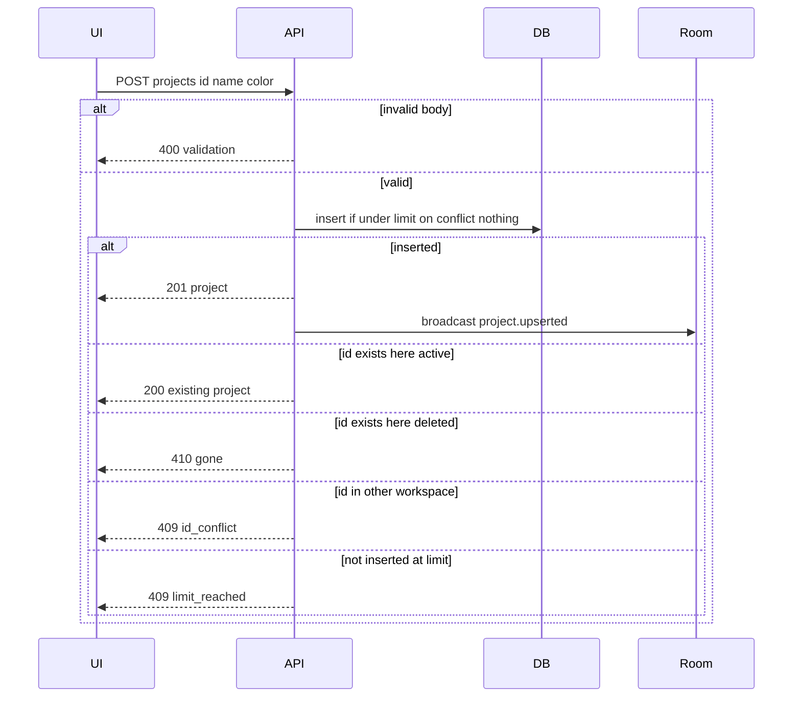
```mermaid
sequenceDiagram
  participant UI
  participant API
  participant DB
  participant Room
  UI->>API: POST projects id name color
  alt invalid body
    API-->>UI: 400 validation
  else valid
    API->>DB: insert if under limit on conflict nothing
    alt inserted
      API-->>UI: 201 project
      API->>Room: broadcast project.upserted
    else id exists here active
      API-->>UI: 200 existing project
    else id exists here deleted
      API-->>UI: 410 gone
    else id in other workspace
      API-->>UI: 409 id_conflict
    else not inserted at limit
      API-->>UI: 409 limit_reached
    end
  end
```

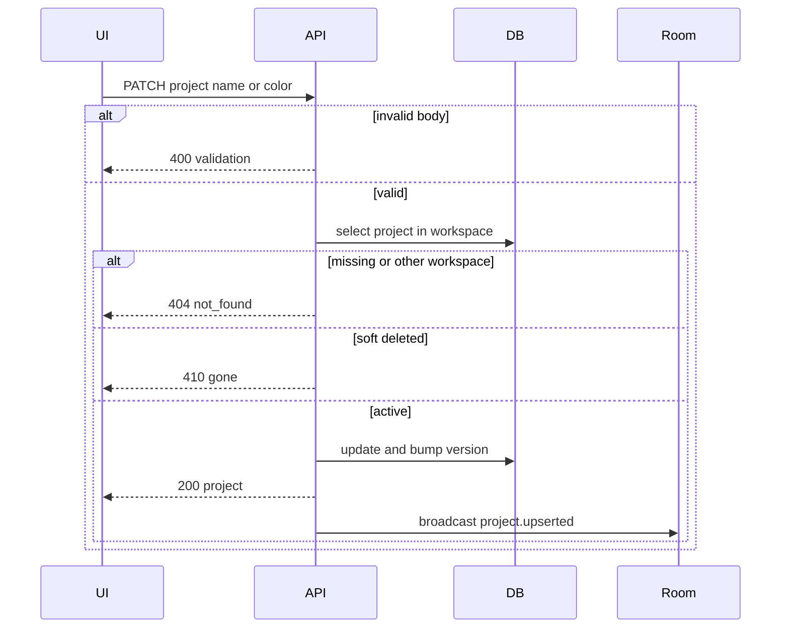
```mermaid
sequenceDiagram
  participant UI
  participant API
  participant DB
  participant Room
  UI->>API: PATCH project name or color
  alt invalid body
    API-->>UI: 400 validation
  else valid
    API->>DB: select project in workspace
    alt missing or other workspace
      API-->>UI: 404 not_found
    else soft deleted
      API-->>UI: 410 gone
    else active
      API->>DB: update and bump version
      API-->>UI: 200 project
      API->>Room: broadcast project.upserted
    end
  end
```

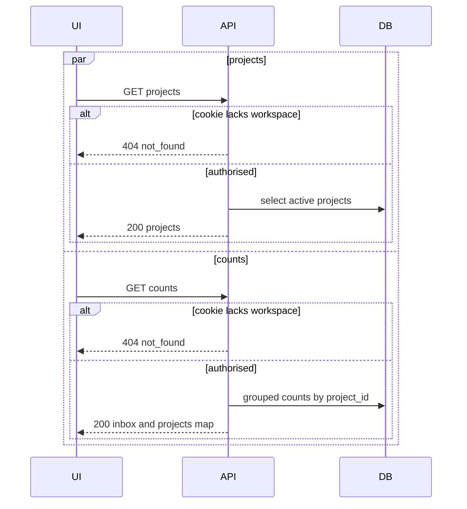
```mermaid
sequenceDiagram
  participant UI
  participant API
  participant DB
  par projects
    UI->>API: GET projects
    alt cookie lacks workspace
      API-->>UI: 404 not_found
    else authorised
      API->>DB: select active projects
      API-->>UI: 200 projects
    end
  and counts
    UI->>API: GET counts
    alt cookie lacks workspace
      API-->>UI: 404 not_found
    else authorised
      API->>DB: grouped counts by project_id
      API-->>UI: 200 inbox and projects map
    end
  end
```

## Implementation
- `packages/shared/src/limits.ts`: confirm `PROJECT_NAME_MAX`, `PROJECT_COLORS`, `MAX_PROJECTS_PER_WORKSPACE`; reuse `TASK_ID_BYTES` for project ids (rename to `CLIENT_ID_BYTES` only if story 5 agrees; otherwise add `PROJECT_ID_BYTES = TASK_ID_BYTES`).
- `packages/shared/src/schemas.ts`: `CreateProjectInputSchema`, `UpdateProjectInputSchema`, `ProjectSchema`, `ProjectListResponseSchema`; widen `CountsSchema` with `projects: z.record(z.object({open, total}))`.
- `apps/api/src/db/projects.ts`: `listProjects`, `insertProjectIdempotent(db, {id, workspaceId, name, color})` -> `created|replayed|gone|conflict|limit` using one statement `INSERT ... SELECT ... WHERE (SELECT COUNT(*) FROM projects WHERE workspace_id=?2 AND deleted=0) < ?max ON CONFLICT(id) DO NOTHING RETURNING *`, then a follow-up SELECT by id to classify (same approach as story 5 `insertTaskIdempotent`); `getProject`, `updateProject`.
- `apps/api/src/db/tasks.ts`: `countOpenTasks` becomes one `GROUP BY project_id` query returning inbox + per-project open/total.
- `apps/api/src/routes/projects.ts`: Hono sub-router under workspace-auth; `apps/api/src/routes/counts.ts` (story 5) returns the widened shape.
- `apps/api/src/lib/errors.ts`: add `limit_reached`.
- `apps/api/src/app.ts`: register router.

## Tests
TC-03..TC-23, TC-48, TC-76..TC-78. Boundary: request handling via `SELF.fetch` (auth, validation, SQL, broadcast), sufficient because this capability is server-side; UI consumption in projects.ui_sidebar.

## Project delete and batch restore API

> Anchor: `projects.api_delete_restore`

## Contract
- `DELETE /api/w/:wid/projects/:pid` -> 200 `{batchId, deletedTaskCount}`. Generates batchId (16-byte hex). In ONE `db.batch`: `UPDATE tasks SET deleted=1, deleted_at=now, delete_batch_id=?B, version=version+1 WHERE workspace_id=? AND project_id=? AND deleted=0`; `UPDATE projects SET deleted=1, deleted_at=now, delete_batch_id=?B, version=version+1 WHERE id=? AND workspace_id=? AND deleted=0`.
- `POST /api/w/:wid/projects/:pid/restore` body `{batchId}` -> 200 `{project, restoredTaskCount}`. In ONE `db.batch`: restore tasks `WHERE delete_batch_id=?B AND project_id=?`; restore project `WHERE id=? AND delete_batch_id=?B`; clears `deleted_at`, `delete_batch_id`; version+1.
- The confirm dialog count uses `taskCount` from the list endpoint (same predicate as the delete UPDATE), so warning and effect agree.
Errors: 400 validation (batchId missing/not hex); 403 forbidden_client; 404 not_found; 410 gone (delete of deleted project); 409 batch_mismatch; 409 not_deleted; 500 internal if batch fails (nothing applied).
Side effects: broadcast `project.deleted {id, batchId, version}` + `tasks.bulk {ids, deleted:true}`; on restore `project.restored` + `tasks.bulk {ids, deleted:false}`.
Server does not enforce UNDO_WINDOW_MS: restore stays valid indefinitely so operators can recover (story 6 prd.retain_deleted); the 5 s window is a UI affordance.

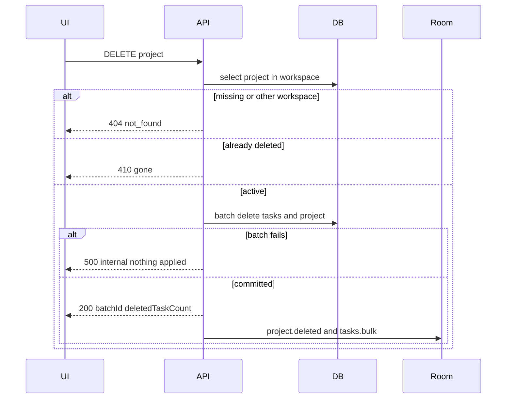
```mermaid
sequenceDiagram
  participant UI
  participant API
  participant DB
  participant Room
  UI->>API: DELETE project
  API->>DB: select project in workspace
  alt missing or other workspace
    API-->>UI: 404 not_found
  else already deleted
    API-->>UI: 410 gone
  else active
    API->>DB: batch delete tasks and project
    alt batch fails
      API-->>UI: 500 internal nothing applied
    else committed
      API-->>UI: 200 batchId deletedTaskCount
      API->>Room: project.deleted and tasks.bulk
    end
  end
```

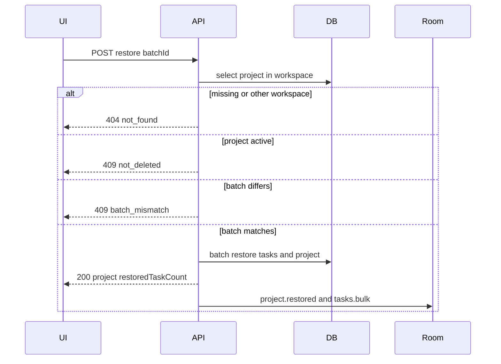
```mermaid
sequenceDiagram
  participant UI
  participant API
  participant DB
  participant Room
  UI->>API: POST restore batchId
  API->>DB: select project in workspace
  alt missing or other workspace
    API-->>UI: 404 not_found
  else project active
    API-->>UI: 409 not_deleted
  else batch differs
    API-->>UI: 409 batch_mismatch
  else batch matches
    API->>DB: batch restore tasks and project
    API-->>UI: 200 project restoredTaskCount
    API->>Room: project.restored and tasks.bulk
  end
```

## Implementation
- `apps/api/src/db/projects.ts`: `deleteProjectBatch(db, wid, pid, batchId)`, `restoreProjectBatch(db, wid, pid, batchId)` returning affected ids via `RETURNING id`.
- `apps/api/src/routes/projects.ts`: DELETE and restore handlers.
- `apps/api/src/lib/crypto.ts`: reuse `randomHexId()`.
- `apps/api/src/routes/test.ts`: `/test/sql` (non-production only) to install/remove an abort trigger for TC-29.

## Tests
TC-24..TC-35. Boundary: request handling with real D1, required because atomicity and the exact-set predicate are D1 behaviours.

## Project-scoped task create, list and move

> Anchor: `tasks.project_scope_api`

## Contract
Extends story 5/6 task routes without changing existing behaviour when no project is involved.
- `GET /api/w/:wid/tasks?list=inbox|project&projectId=<id>`: story 5's `list` enum is widened with `project` (story 8 adds `today`). `list=project` requires `projectId`; `list=inbox` now returns only `project_id IS NULL`.
- `POST /api/w/:wid/tasks` (story 5 `CreateTaskInputSchema`, client-generated id, idempotent) gains optional `projectId`. Validated only when a new row would be inserted; replays return the stored task unchanged.
- `PATCH /api/w/:wid/tasks/:tid` (story 6) gains `projectId: string | null` (move). A move sets `sort_order = MAX(sort_order over the workspace) + TASK_SORT_STEP` (story 5's workspace-wide ordering rule, so the task lands at the end of any list) and version+1. If destination equals the current list: 200, no write, no broadcast.
Errors: 400 validation (incl. `list=project` without projectId); 404 not_found (task); 404 project_not_found (project missing, deleted for create/move, or in another workspace); 410 gone (task soft-deleted; or `list=project` for a soft-deleted project); story 5 create errors (409 id_conflict, 410 gone replay) unchanged.
Side effects: `task.upserted` broadcast on create 201 and on an actual move.

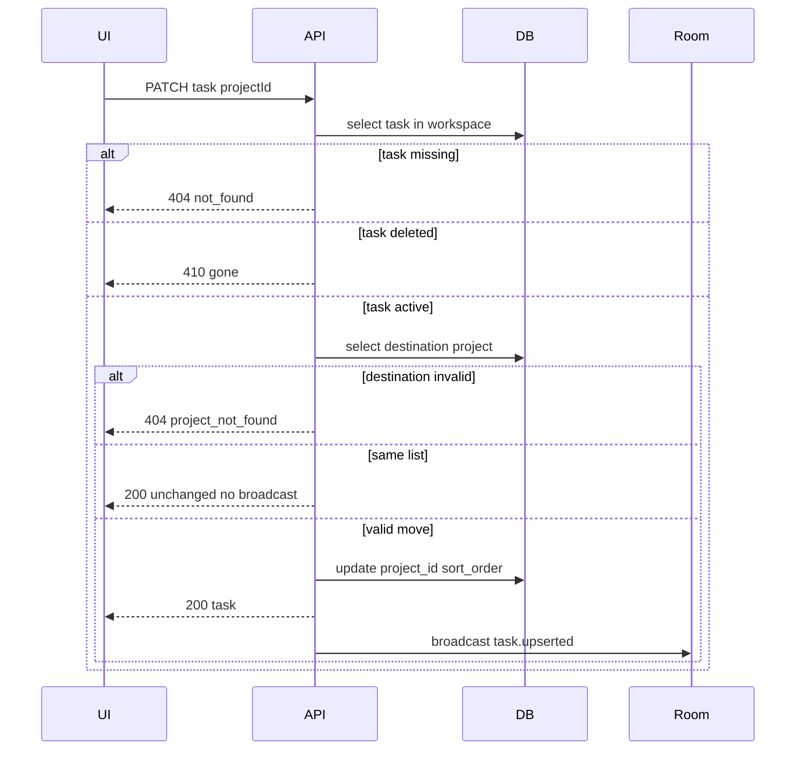
```mermaid
sequenceDiagram
  participant UI
  participant API
  participant DB
  participant Room
  UI->>API: PATCH task projectId
  API->>DB: select task in workspace
  alt task missing
    API-->>UI: 404 not_found
  else task deleted
    API-->>UI: 410 gone
  else task active
    API->>DB: select destination project
    alt destination invalid
      API-->>UI: 404 project_not_found
    else same list
      API-->>UI: 200 unchanged no broadcast
    else valid move
      API->>DB: update project_id sort_order
      API-->>UI: 200 task
      API->>Room: broadcast task.upserted
    end
  end
```

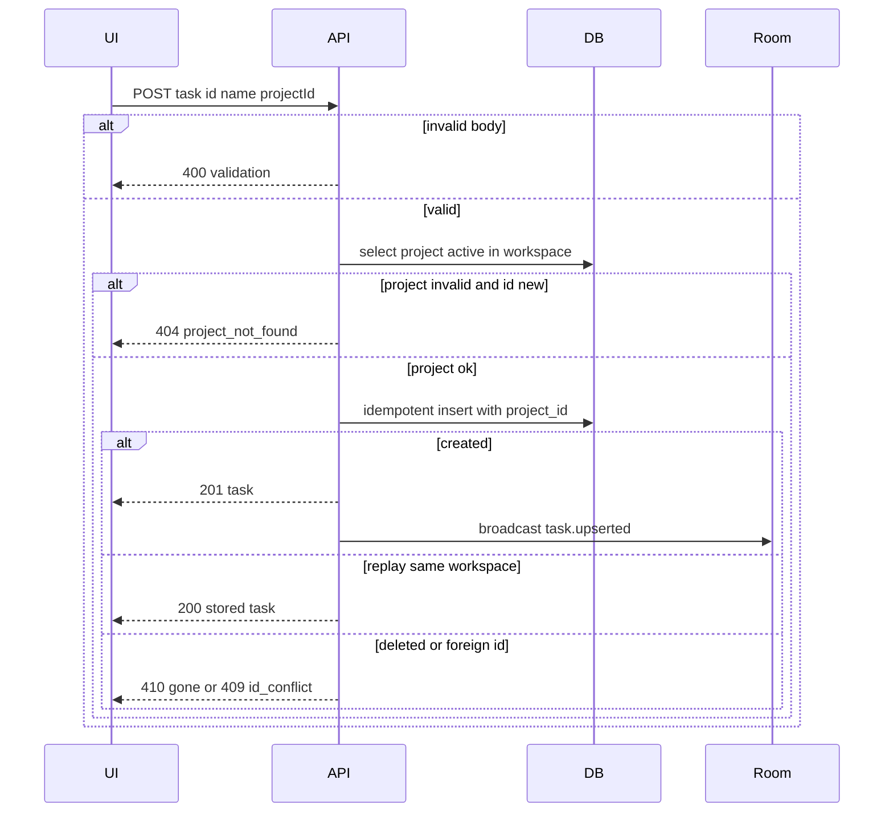
```mermaid
sequenceDiagram
  participant UI
  participant API
  participant DB
  participant Room
  UI->>API: POST task id name projectId
  alt invalid body
    API-->>UI: 400 validation
  else valid
    API->>DB: select project active in workspace
    alt project invalid and id new
      API-->>UI: 404 project_not_found
    else project ok
      API->>DB: idempotent insert with project_id
      alt created
        API-->>UI: 201 task
        API->>Room: broadcast task.upserted
      else replay same workspace
        API-->>UI: 200 stored task
      else deleted or foreign id
        API-->>UI: 410 gone or 409 id_conflict
      end
    end
  end
```

## Implementation
- `packages/shared/src/schemas.ts`: widen `TaskListQuerySchema` (discriminated on `list`), add `projectId` to `CreateTaskInputSchema` and the story 6 update schema.
- `apps/api/src/db/projects.ts`: `getActiveProjectForWorkspace(db, wid, pid)`.
- `apps/api/src/db/tasks.ts`: `listOpenTasks(db, wid, {list, projectId})`, `insertTaskIdempotent` accepts `projectId`, new `moveTask`.
- `apps/api/src/lib/moveRules.ts`: pure `classifyMove(currentProjectId, destProjectId, destProject)` -> `same_list | move | project_not_found`.
- `apps/api/src/routes/tasks.ts`: validate destination, map errors.

## Tests
TC-36..TC-47, TC-74. Boundary: request handling with real D1; UI path in tasks.ui_move_menu and projects.ui_project_view.

## Project live events

> Anchor: `projects.live_events`

## Contract
Inputs: events from WorkspaceRoom (`packages/shared/src/events.ts`): `project.upserted {project}`, `project.deleted {id, batchId, version}`, `project.restored {project}`, `tasks.bulk {ids, deleted}`, `task.upserted {task}`.
Outputs: TanStack Query caches updated, keys only from `apps/web/src/lib/queryKeys.ts`: `queryKeys.projects(wid)` = `['ws', wid, 'projects']`, `queryKeys.counts(wid)` = `['ws', wid, 'counts']` (no date, per architecture section 12), `queryKeys.tasks(wid, {list, projectId})` = `['ws', wid, 'tasks', {...}]`.
Rules: ignore events whose `originClientId` equals own clientId; ignore `version <= cached.version`; on `project.deleted` for the project currently routed -> navigate to Inbox (fragment carried if present) and toast 'This project was deleted'; on `project.deleted/restored`, `tasks.bulk` or `task.upserted` invalidate `queryKeys.counts(wid)` so sidebar numbers refresh. Handlers are ADDED to the registry and coexist with story 5/6/8 handlers for the same event types (story 5 applies `task.upserted` to the Inbox list; this story only adjusts project lists and counts).
Errors: malformed event -> dropped and logged to console (dev only); reconnect gap -> handled by story 4 (`invalidateQueries({queryKey: ['ws', wid]})`, which covers every key above).

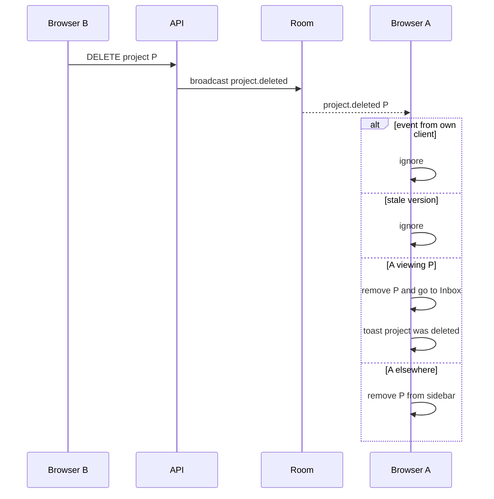
```mermaid
sequenceDiagram
  participant B as Browser B
  participant API
  participant Room
  participant A as Browser A
  B->>API: DELETE project P
  API->>Room: broadcast project.deleted
  Room-->>A: project.deleted P
  alt event from own client
    A->>A: ignore
  else stale version
    A->>A: ignore
  else A viewing P
    A->>A: remove P and go to Inbox
    A->>A: toast project was deleted
  else A elsewhere
    A->>A: remove P from sidebar
  end
```

No persisted state is changed by this capability (it is client cache only), hence no additional state diagram.

## Implementation
- `apps/web/src/features/projects/projectCache.ts`: pure `applyProjectEvent(cache, event)` and `adjustCounts(counts, delta)`; the project cache is kept as an array plus a `Map` by id for O(1) lookups (js-index-maps).
- `apps/web/src/features/projects/registerProjectLiveHandlers.ts`: called once per workspace from the workspace shell; uses `registerLiveHandler(type, fn)` from `apps/web/src/features/live/registry.ts` (story 4, `Map<type, Set<fn>>`) for each project event type and returns the unregister functions. No edits to story 4's dispatcher.
- Bursts are already coalesced per animation frame by story 4's `notifyManager` batching; this story adds no `startTransition` around cache writes (it would have no effect on query updates).
- `apps/api/src/routes/projects.ts` and `tasks.ts`: broadcasts via story 4/5 `broadcastEvent(env, ctx, wid, event)`.
- `packages/shared/src/events.ts`: add project event types and `tasks.bulk` if story 4 has not.

## Tests
TC-49, TC-50, TC-88 (unit), TC-62, TC-63, TC-85 (ui-component with fake emitter through the real registry), TC-75 (integration, real DO sockets), TC-69 (e2e two contexts through real DO). Broadcast-on-mutation assertions also in TC-06, TC-18, TC-25, TC-30, TC-36.

## Sidebar projects section, create and rename

> Anchor: `projects.ui_sidebar`

## Contract
- Fills story 5's `<Sidebar projectsSlot>` (inside story 5's mobile drawer below `MOBILE_BREAKPOINT_PX`): 'Projects' heading with '+' and rows in sort order; each row: colour dot, name (truncate, title attr), open count (hidden when 0), '...' menu (Rename, Delete). Inbox count keeps coming from `counts.inbox` (story 5), which now excludes project tasks.
- `ProjectRow` props are primitives `{wid, id, name, colorKey, isActive}`; the open count is read inside the row from exactly one source: `useQuery({...countsQuery(wid), select})` where `select` is a module-level function bound per id with `useCallback` - the parent never passes a count, so a count change re-renders only the affected row.
- Create dialog: name input (autofocus), 12-swatch radio group (first preselected, arrow-key navigation, aria-labels with colour names), Add disabled while trimmed name empty, over `PROJECT_NAME_MAX`, or at the project limit; generates the project id client-side (`crypto.getRandomValues`, same helper as story 5 task ids); on success navigates to the new project.
- Rename: inline input replaces name; Enter saves, Escape cancels; blank/over-limit behaviour is specified in `projects.ui_accessible_controls`.
- Selecting a project on a narrow screen closes story 5's drawer.
- All mutations optimistic with rollback + toast 'Couldn't save - try again'.
Errors surfaced: 409 limit_reached -> limit message; 400 -> field message; 409 id_conflict -> regenerate id and retry once; 5xx/network -> rollback toast.

## Implementation
Files (direct imports, no barrel `index.ts`; icons imported per icon, e.g. `lucide-react/dist/esm/icons/plus`, per bundle-barrel-imports):
- `apps/web/src/features/projects/queries.ts`: `projectsQuery(wid)` with key `queryKeys.projects(wid)`; reuses story 5's `countsQuery(wid)` with key `queryKeys.counts(wid)` (no date). Optimistic count writes call `setQueryData(queryKeys.counts(wid), ...)` on that single key; no other counts key exists.
- `apps/web/src/routes/Workspace.tsx` (story 2/5): add `prefetchQuery(projectsQuery(id))` to the existing `Promise.all` so projects, counts and the list load in parallel (async-parallel).
- `apps/web/src/features/projects/useProjects.ts`: `useQuery` with a module-level `select` building `{list, byId: Map}` once per data change (js-index-maps).
- `apps/web/src/features/projects/useProjectMutations.ts`: create/update/delete/restore with `onMutate` (cancelQueries, snapshot, setQueryData on projects and counts), `onError` rollback, `onSettled` invalidate counts.
- `apps/web/src/features/projects/ProjectsSidebarSection.tsx`: plain list container (no `content-visibility` on the container); ternary for empty vs list (rendering-conditional-render); static hint JSX hoisted (rendering-hoist-jsx).
- `apps/web/src/features/projects/ProjectRow.tsx`: module-level `memo` component (rerender-memo, rerender-no-inline-components); row element carries `content-visibility:auto; contain-intrinsic-size:auto 44px` so off-screen rows among up to 300 are skipped (rendering-content-visibility on each row); `selectOpenCount` hoisted at module level (rerender-memo-with-default-value, rerender-derived-state); `onPointerEnter`/`onFocus` call `preloadProjectView()` (the route's `import()` thunk, bundle-preload) and `queryClient.prefetchQuery(tasksQuery(wid, {list:'project', projectId:id}))`.
- `apps/web/src/features/projects/CreateProjectDialog.tsx` + `ColorPalette.tsx`: `React.lazy`; the '+' button preloads the chunk on hover/focus (bundle-conditional, bundle-preload).
- `apps/web/src/features/projects/RenameProjectInline.tsx`.
- Limit derived during render from `projects.length >= MAX_PROJECTS_PER_WORKSPACE` (rerender-derived-state-no-effect); no effect syncing.
- Navigation to a project through `useWorkspaceNavigate`; router navigations are already transitions, no extra wrapper.

## Tests
TC-51..TC-56, TC-64, TC-84, TC-89 (ui-component, MSW), TC-68, TC-71, TC-86 (e2e). Boundary: browser rendering in happy-dom with network mocked, sufficient for rendering/interaction logic; server behaviour is covered by integration.

## Project view route and quick add target

> Anchor: `projects.ui_project_view`

## Contract
- Route `/w/:workspaceId/project/:projectId` (architecture section 12) renders header (dot + name) and the task list from `queryKeys.tasks(wid, {list:'project', projectId})` using story 5's list view component (roving tabindex, per-row `content-visibility`, skeleton rows while loading).
- Empty state: 'No tasks yet. Press Q to add one.'
- Quick add (story 5 component) receives `projectId` from route context and includes it in the POST body (client-generated task id unchanged); its target chip reads '→ <project name>'.
- Unknown/deleted project id (404/410 from the list request, or absent from the projects cache after load) -> Inbox + toast 'Project not found'.

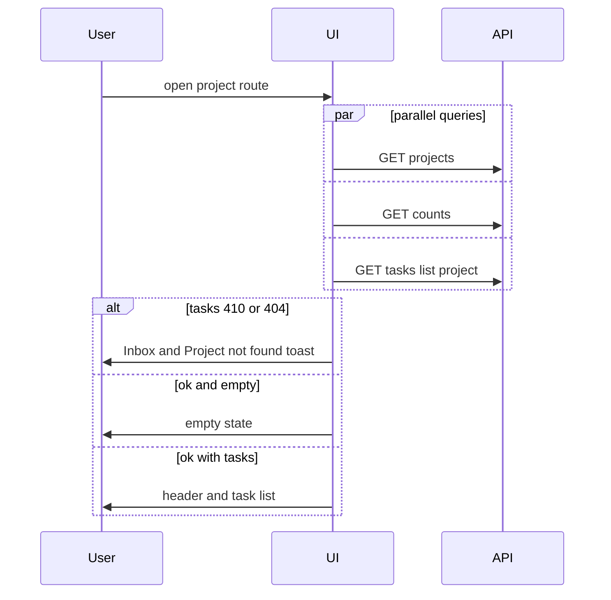
```mermaid
sequenceDiagram
  participant User
  participant UI
  participant API
  User->>UI: open project route
  par parallel queries
    UI->>API: GET projects
  and
    UI->>API: GET counts
  and
    UI->>API: GET tasks list project
  end
  alt tasks 410 or 404
    UI->>User: Inbox and Project not found toast
  else ok and empty
    UI->>User: empty state
  else ok with tasks
    UI->>User: header and task list
  end
```

## Implementation
- `apps/web/src/routes/ProjectView.tsx`: lazy route chunk exported with a `preloadProjectView()` thunk used by sidebar rows; its route entry prefetches `tasksQuery(wid, {list:'project', projectId})` in the same `Promise.all` as projects and counts - the tasks request is NOT gated on the projects response (async-parallel, no waterfall).
- `apps/web/src/App.tsx`: add child route under story 2's `/w/:workspaceId`.
- `apps/web/src/features/tasks/queries.ts` (story 5): `tasksQuery` accepts `{list, projectId}` and builds its key via `queryKeys.tasks`.
- `apps/web/src/features/workspace/useWorkspaceNavigate.ts`: carries `location.hash` when present (see SPA Routing Decision).
- `apps/web/src/features/tasks/QuickAdd.tsx` (story 5): accept `projectId` prop; optimistic insert targets the project list cache and bumps `counts.projects[projectId].open` on `queryKeys.counts(wid)`.
- Document title via React 19 `<title>` in `ProjectView`: '<project name> · <workspace name>'.

## Tests
TC-61 (ui-component), TC-65, TC-70, TC-72 (e2e). Boundary: browser rendering; the project-scoped API contract is proven in tasks.project_scope_api.

## Delete confirmation and undo

> Anchor: `projects.ui_delete_undo`

## Contract
- '...' > Delete opens AlertDialog (kept for projects by product-owner decision 2026-09-25, because one confirm can remove many tasks; single-task delete in story 6 has no confirm). Text: 0 tasks -> 'Delete "<name>"?'; 1 -> 'Delete "<name>" and its 1 task?'; N -> 'and its N tasks?' using `counts.projects[id].total` (same predicate as the server delete, so warning and effect agree). Focus starts on Cancel; on close focus returns to the '...' trigger (or to the Projects heading if the row is gone).
- Confirm: optimistic removal of project row, its count entry and its task list cache; if routed to it, navigate to Inbox; `showUndoToast({message: 'Project deleted', onUndo})` from story 6: visible for `UNDO_WINDOW_MS = 10_000`, timer paused while hovered or focused, announced via `role=status`, and ⌘/Ctrl+Z triggers it while visible (story 6 owns the key binding).
- Undo: POST restore with the batchId from the DELETE response; projects, counts and list caches invalidated; project reappears.
- If Undo is pressed before the DELETE response arrives, the restore call is chained after it.
Errors: DELETE failure -> rollback + toast (`role=alert`); restore failure (409/5xx) -> toast 'Couldn't undo'.

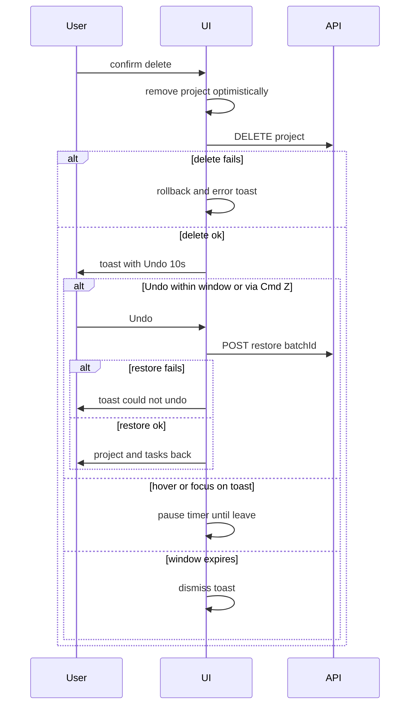
```mermaid
sequenceDiagram
  participant User
  participant UI
  participant API
  User->>UI: confirm delete
  UI->>UI: remove project optimistically
  UI->>API: DELETE project
  alt delete fails
    UI->>UI: rollback and error toast
  else delete ok
    UI->>User: toast with Undo 10s
    alt Undo within window or via Cmd Z
      User->>UI: Undo
      UI->>API: POST restore batchId
      alt restore fails
        UI->>User: toast could not undo
      else restore ok
        UI->>User: project and tasks back
      end
    else hover or focus on toast
      UI->>UI: pause timer until leave
    else window expires
      UI->>UI: dismiss toast
    end
  end
```

## Implementation
- `apps/web/src/features/projects/DeleteProjectDialog.tsx` (lazy, preloaded when the row '...' menu opens).
- `apps/web/src/features/projects/useProjectMutations.ts`: `deleteProject` returns batchId; `restoreProject(batchId)`.
- `apps/web/src/features/undo/showUndoToast.ts` (story 6 helper) reused; no project-specific timer.
- Pluralisation via a module-level cached `Intl.PluralRules` (no library, js-cache-function-results).

## Tests
TC-57..TC-59 (ui-component, fake timers incl. pause on hover), TC-66, TC-67 (e2e). Server-side exact-set behaviour proven in TC-26, TC-31.

## Move to menu

> Anchor: `tasks.ui_move_menu`

## Contract
- Entry points: task '...' menu item 'Move to…  M' and the M shortcut; both open the `tasks.ui_move_picker` picker for that task. The flat Radix submenu is removed (it does not scale to `MAX_PROJECTS_PER_WORKSPACE`).
- `moveTask(taskId, destProjectId | null)`: optimistic removal from the current list cache, insertion at end of destination cache if loaded, counts adjusted on `queryKeys.counts(wid)`; PATCH `{projectId}`; on success focus moves per story 6's focus-after-action rule (next row, else previous).
- Moving to the current list is not offered (disabled in the picker) and, if forced via API, is a no-op (TC-38).
Errors: 404 project_not_found / 410 gone / 5xx -> rollback + toast (`role=alert`); 410 routes through story 4's `useEditGuard` 'This task was deleted' notice.

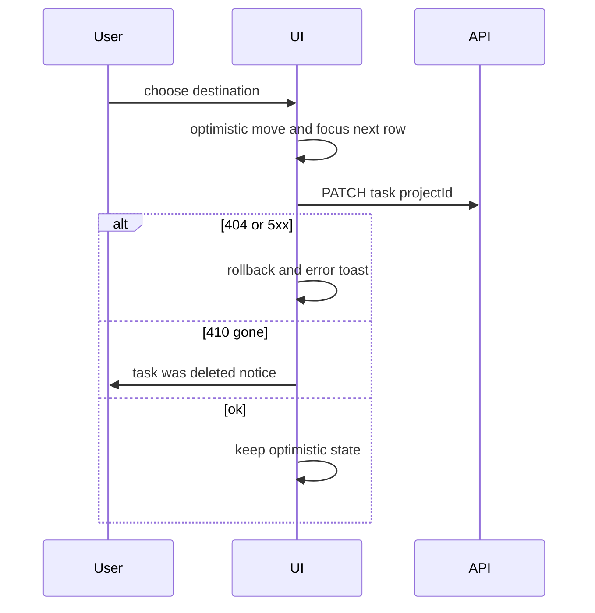
```mermaid
sequenceDiagram
  participant User
  participant UI
  participant API
  User->>UI: choose destination
  UI->>UI: optimistic move and focus next row
  UI->>API: PATCH task projectId
  alt 404 or 5xx
    UI->>UI: rollback and error toast
  else 410 gone
    UI->>User: task was deleted notice
  else ok
    UI->>UI: keep optimistic state
  end
```

## Implementation
- `apps/web/src/features/tasks/useTaskMutations.ts` (story 6): add `moveTask` with `adjustCounts` from `projectCache.ts`.
- `apps/web/src/features/tasks/TaskActionsMenu.tsx` (story 6): add 'Move to…' item showing its shortcut hint; selecting it opens the lazy picker (preloaded when the menu opens, bundle-preload).

## Tests
TC-60 (ui-component), TC-65 (e2e); server contract in TC-36..TC-43.

## Searchable Move to picker and M shortcut

> Anchor: `tasks.ui_move_picker`

## Contract
- `openMovePicker(taskId)`: opens a combobox dialog titled 'Move to…' with a search input (autofocus, placeholder 'Type a project name') and a listbox: 'Inbox' first, then active projects in sort order, each option = colour dot + name (+ check mark and `aria-disabled="true"` for the task's current list).
- Filtering: case- and accent-insensitive substring match on the name (`name.normalize('NFD').replace(diacritics,'').toLowerCase()` computed once per project in the `useProjects` select, not per keystroke); 'Inbox' is matched like any other name; leading/trailing whitespace in the query is ignored. Empty result -> 'No matching projects'. The option list renders from `useDeferredValue(query)` so typing stays responsive with 300 projects.
- Keyboard: ↑/↓ moves the active option (skipping disabled), Enter selects, Escape clears a non-empty query first, then closes. On select -> `moveTask(taskId, projectId|null)` (see `tasks.ui_move_menu`) and close. On close without a move, focus returns to the task row.
- M shortcut: `useGlobalShortcut('m', handler, {description: 'Move task to…'})` from story 5 (`apps/web/src/lib/shortcuts.ts`); handler reads the roving-focused task id from story 5's list ref accessor; ignored when `isTypingTarget` is true or no task is focused.
- Layout: desktop -> anchored popover next to the task; below `MOBILE_BREAKPOINT_PX` -> the same `Command` content inside a bottom sheet (shadcn `Drawer`); options at least `MIN_TOUCH_TARGET_PX` tall.
- Disabled while offline via story 4's shell-level `<fieldset disabled>`.
Errors: none of its own; move errors per `tasks.ui_move_menu`.

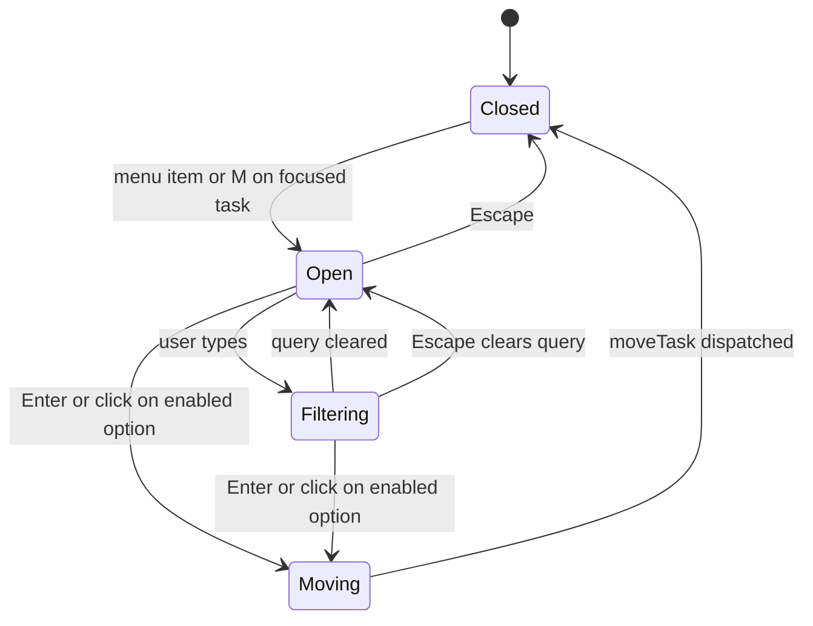
```mermaid
stateDiagram-v2
  [*] --> Closed
  Closed --> Open: menu item or M on focused task
  Open --> Filtering: user types
  Filtering --> Open: query cleared
  Filtering --> Open: Escape clears query
  Open --> Closed: Escape
  Open --> Moving: Enter or click on enabled option
  Filtering --> Moving: Enter or click on enabled option
  Moving --> Closed: moveTask dispatched
```
The picker state is ephemeral UI state (not persisted); the diagram documents its lifecycle because focus return depends on it.

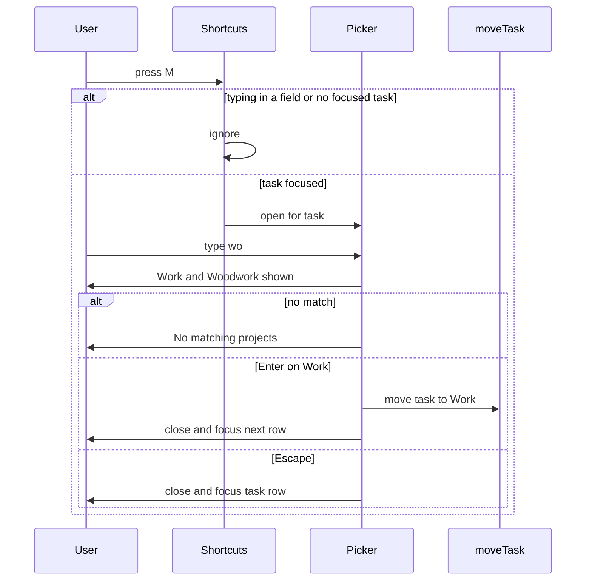
```mermaid
sequenceDiagram
  participant User
  participant Shortcuts
  participant Picker
  participant Mut as moveTask
  User->>Shortcuts: press M
  alt typing in a field or no focused task
    Shortcuts->>Shortcuts: ignore
  else task focused
    Shortcuts->>Picker: open for task
    User->>Picker: type wo
    Picker->>User: Work and Woodwork shown
    alt no match
      Picker->>User: No matching projects
    else Enter on Work
      Picker->>Mut: move task to Work
      Picker->>User: close and focus next row
    else Escape
      Picker->>User: close and focus task row
    end
  end
```

## Implementation
- `apps/web/src/features/tasks/MoveToPicker.tsx`: lazy chunk (`React.lazy`) with `preloadMoveToPicker()` (called when the task '...' menu opens and on first M press); uses shadcn `Command` (cmdk) with `shouldFilter={false}` and our own deferred filter so matching rules are ours and testable; imports `components/ui/command`, `popover`, `drawer` directly (no barrels).
- `apps/web/src/features/tasks/filterDestinations.ts`: pure `filterDestinations(options, query, currentListId)` returning `[{id|null, name, colorKey, disabled}]`, Inbox first.
- `apps/web/src/features/projects/useProjects.ts`: select adds `searchKey` per project.
- `apps/web/src/features/tasks/useMoveShortcut.ts`: registers M via `useGlobalShortcut`; mounted once in the workspace shell.
- `apps/web/src/hooks/useIsNarrow.ts` (story 5's media-query hook) chooses Popover vs Drawer.

## Tests
TC-80, TC-81 (unit `filterDestinations`), TC-60, TC-91, TC-92 (ui-component), TC-87 (e2e keyboard move), TC-86 (e2e mobile). Boundary: pure filtering logic is unit-tested; focus, keyboard and layout need rendered DOM (ui-component) and a real browser (e2e).

## Shared combobox and search normaliser (reused by story 11)

The Move to picker is the first combobox in the app. Its generic parts are built as shared pieces, so story 11's Finder and its switcher migration reuse them instead of duplicating them (architecture §12, Search).

- **`apps/web/src/components/combobox/ResponsiveCommand.tsx`:** the container that `MoveToPicker` uses.
  - Props: `{open, onOpenChange, title, anchor?, children}`.
  - Renders a shadcn `Popover`, or a `Dialog` when there is no `anchor`, at or above `MOBILE_BREAKPOINT_PX`, and a `Drawer` below it (via `useIsNarrow`).
  - Content is `Command` with `shouldFilter={false}`.
  - Returns focus to the trigger on close.
- **`apps/web/src/components/combobox/OptionRow.tsx`:** a memoised option row with a minimum height of `MIN_TOUCH_TARGET_PX`, an optional leading adornment (colour dot or checkbox glyph), and `aria-disabled` support.
- **`apps/web/src/components/combobox/HighlightedText.tsx`:** wraps the matched ranges in `<mark>`, which gives bold weight plus a background token, so the match never relies on colour alone.
- **`packages/shared/src/search.ts` `normaliseForSearch(s: string): string`:** NFKD, strips combining marks, lower-cases with `toLocaleLowerCase('und')`, and collapses whitespace.
  - `useProjects`' `searchKey` and `filterDestinations` call it instead of the inline `normalize` expression.
  - Story 11 uses the same function on the server so client and server matching agree.

`MoveToPicker` behaviour is unchanged. Its existing tests (TC-60, TC-80, TC-81, TC-86, TC-87, TC-91, TC-92) now exercise these shared pieces through the picker. TC-93 (unit) covers `normaliseForSearch`: 'Café' becomes 'cafe'; 'ÅNGSTRÖM' becomes 'angstrom'; internal runs of whitespace collapse to one space; the empty string returns the empty string.

## Touch, colour legibility and name-entry feedback for projects

> Anchor: `projects.ui_accessible_controls`

## Contract
- **Touch**: under `@media (hover: none)` the row '...' button is always visible (opacity 1); otherwise visible on row `:hover` / `:focus-within`. Rows, '+', '...', colour swatches and picker options have a hit area of at least `MIN_TOUCH_TARGET_PX` (44) in both dimensions, achieved with padding/pseudo-element hit areas where the visible glyph is smaller.
- **Colour legibility**: `PROJECT_COLORS` in `packages/shared/src/limits.ts` becomes 12 entries `{key, label, light, dark}`; the dot uses `light` or `dark` according to the active theme (`prefers-color-scheme`, dark mode per architecture section 12). Every value has contrast >= 3:1 against the theme's sidebar and dialog backgrounds (WCAG 1.4.11). Dots are `aria-hidden`; the name text is always rendered beside the dot; swatches in the create dialog have `aria-label` = label (e.g. 'Berry red').
- **Blank name**: create dialog -> Add disabled with helper text 'Name can't be empty' once the field has been touched; inline rename -> on Enter/blur with trimmed-empty value, no request is sent, previous name restored, helper 'Name can't be empty' shown for `HINT_VISIBLE_MS` via `role=status` and `aria-describedby`.
- **Over limit**: no `maxLength` attribute; counter appears when length >= `LENGTH_WARNING_RATIO * PROJECT_NAME_MAX` ('12 characters left'), turns to '3 characters over' (red text + icon, not colour alone) above the limit; Add/Save disabled while over; pasted text is kept intact.
Errors: none (client-only validation mirrors the server zod schema; server 400 still handled by `projects.ui_sidebar`).

No persisted state: this capability is presentation and client-side validation only, so no state diagram is needed. It changes no request flow (it only prevents invalid requests from being sent), so no sequence diagram beyond those of `projects.ui_sidebar`.

## Implementation
- `packages/shared/src/limits.ts`: `PROJECT_COLORS` entries `{key, label, light, dark}`; new `HINT_VISIBLE_MS = 3_000`; uses existing `LENGTH_WARNING_RATIO`, `MIN_TOUCH_TARGET_PX`.
- `packages/shared/src/contrast.ts`: pure `contrastRatio(hexA, hexB)` (WCAG relative luminance) used by the unit test and by nothing at runtime.
- `apps/web/src/features/projects/ProjectRow.tsx` / `ProjectsSidebarSection.tsx`: Tailwind `[@media(hover:none)]:opacity-100`, `min-h-11 min-w-11` hit areas.
- `apps/web/src/components/NameField.tsx` (shared with story 5/6 if they already created it; else created here): counter + hint logic via pure `nameFieldState(value, max)` -> `{status: 'empty'|'ok'|'near'|'over', remaining}`.
- `apps/web/src/features/projects/ColorPalette.tsx`: radiogroup reads `label` for aria.

## Tests
TC-83 (unit palette contrast in both themes and unique labels), TC-90 (unit `nameFieldState` boundaries), TC-82 (ui-component touch visibility with `matchMedia` stubbed), TC-56 and TC-53 (ui-component blank/over-limit), TC-86 (e2e mobile viewport). Boundary: contrast and state logic are pure (unit); visibility and focus rules need the DOM (ui-component); real touch layout needs a real browser (e2e).

