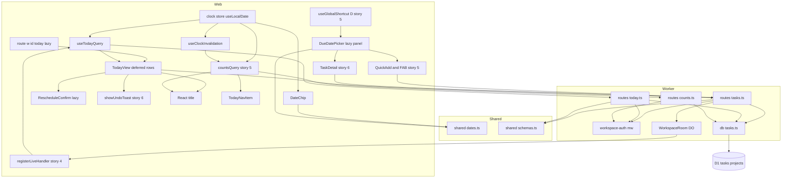
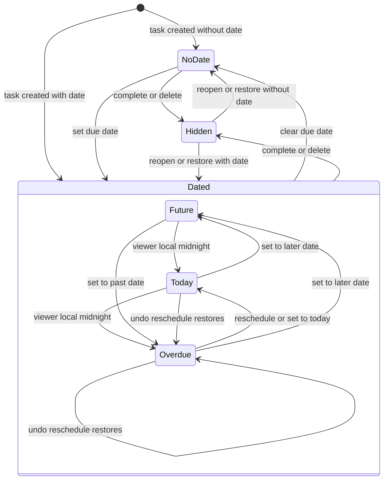
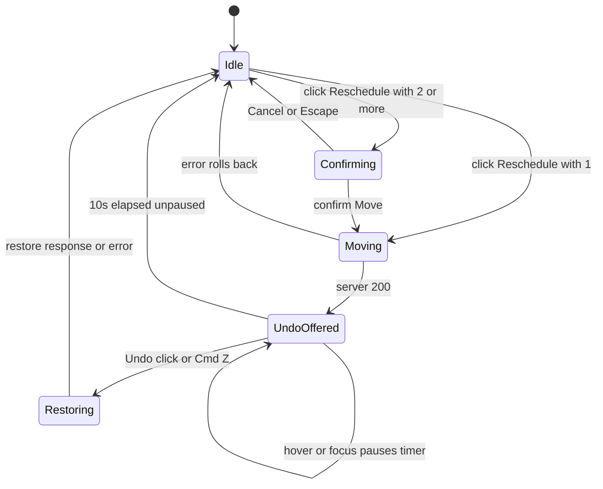
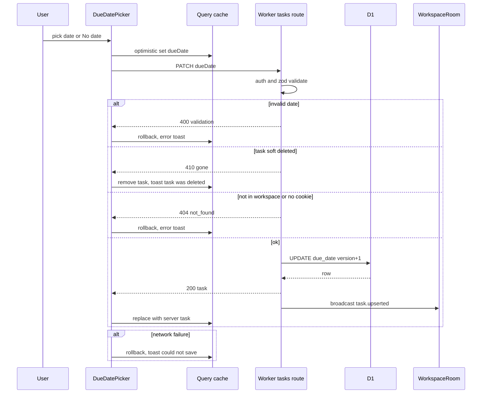
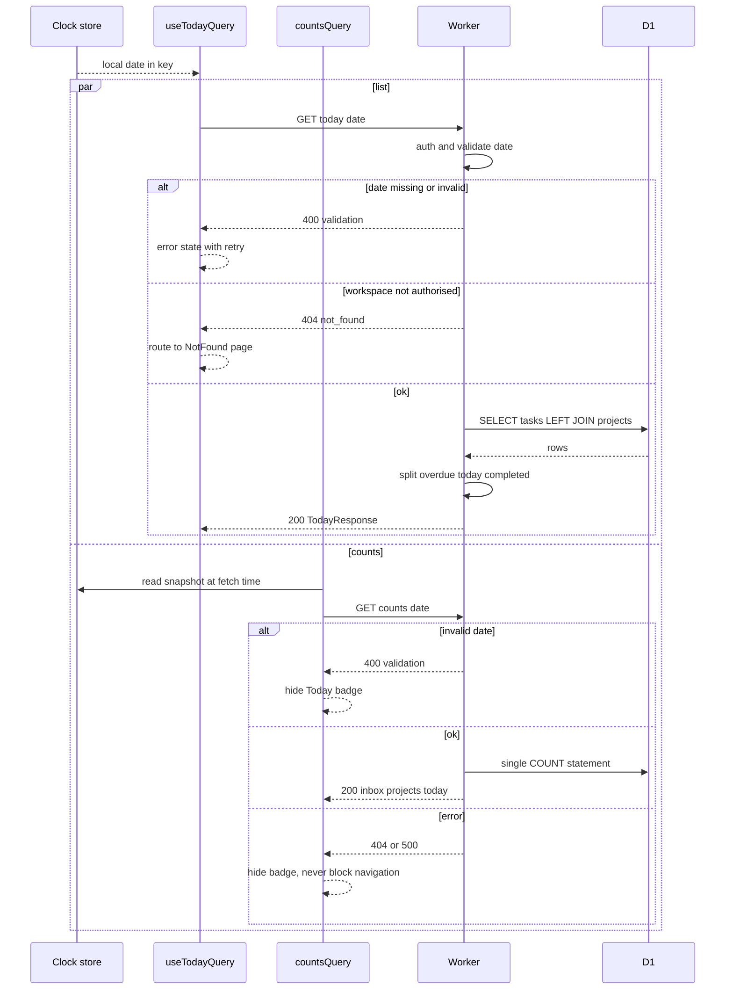
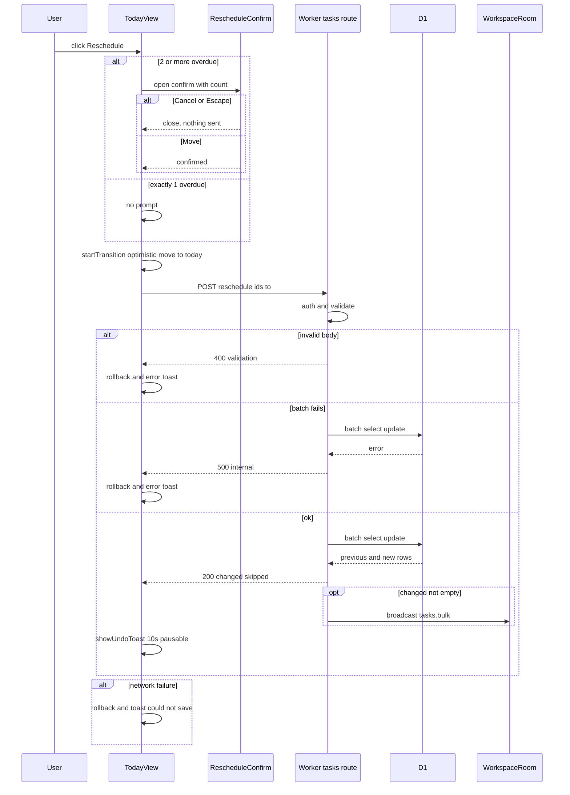
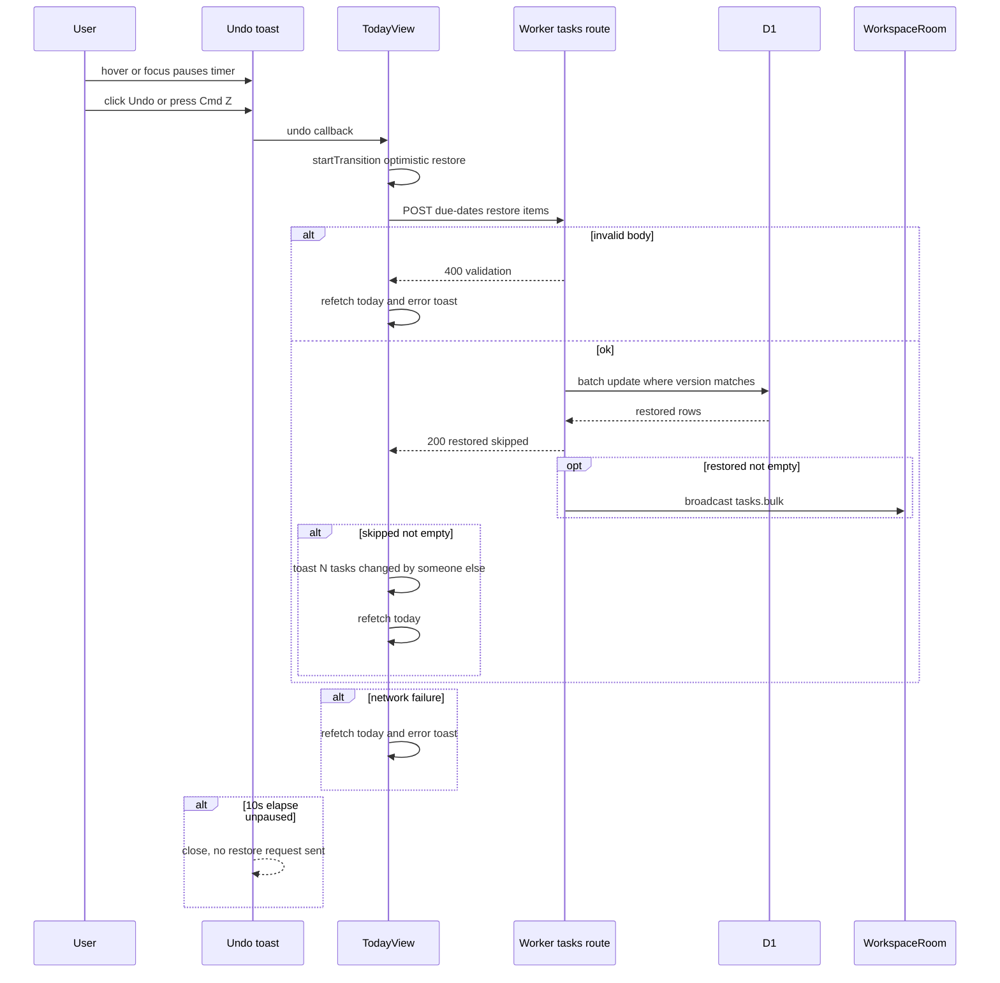
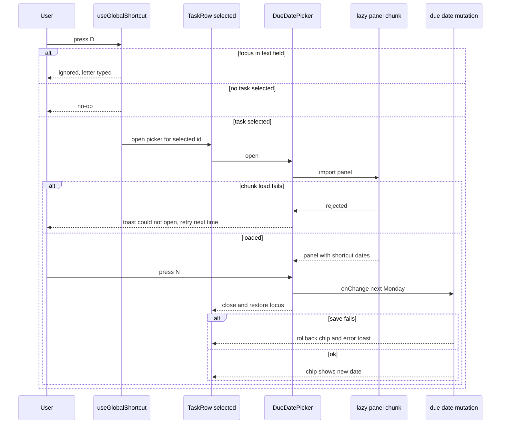
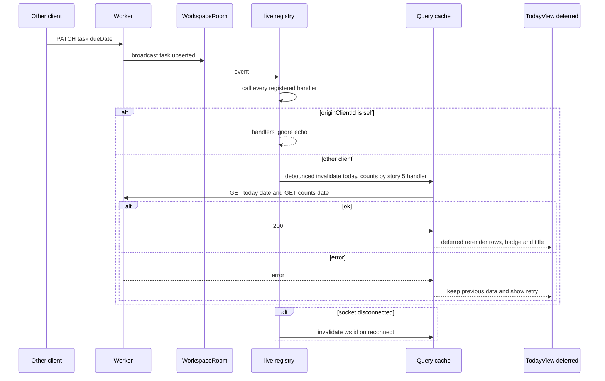
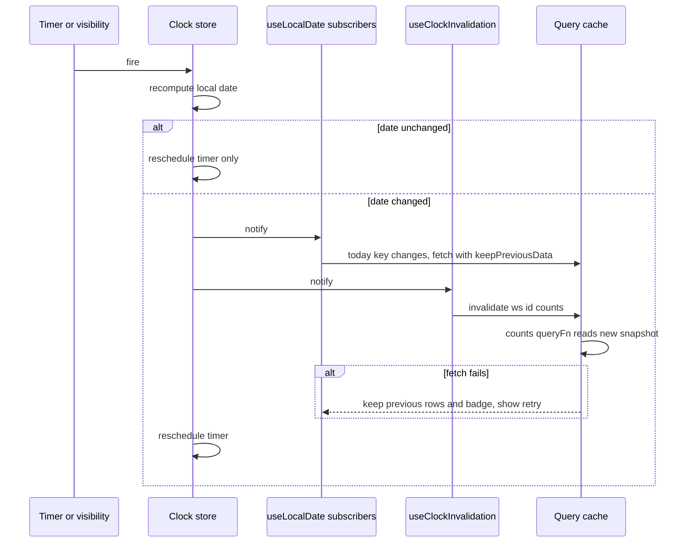

# Technical Design

Calendar-date due dates on tasks (no time, no zone), a client-dated Today query, an id-scoped Reschedule with version-guarded undo, a lazy date picker and relative chips, and a local-midnight clock store. Follows docs/architecture.md.

## Overview

## Scope
Adds due dates to tasks and a Today view (Overdue + Today groups) across the Inbox and all projects. It builds on:
- story 1: Worker, test harness
- story 2: workspace auth, query-key factory
- story 4: live events, `registerLiveHandler`
- story 5: tasks table, quick add, TaskRow, sidebar, `useGlobalShortcut`, roving list focus, mobile "+" button
- story 6: complete, show completed, `showUndoToast`, `packages/shared/src/dates.ts`
- story 7: projects, sidebar

It follows `docs/architecture.md`, and **section 12 (frontend conventions) is binding**. The UX changes come from `specs/general/UI-IMPROVEMENTS.md` (date-shortcut, overdue-colour and reschedule items; owner decisions of 2026-09-25).

## Key decisions
1. **A due date is a calendar date, not an instant.** It is stored as `TEXT 'YYYY-MM-DD'` in `tasks.due_date` (migration `0004_task_due_date.sql`), with no time and no zone. Each viewer works out today or overdue from their own clock (prd.local_dates).
2. **The server never decides what 'today' is.** Every date-relative request carries the viewer's local date: `?date=` on Today and counts, `to` on reschedule. The server only validates it.
3. **Reschedule is scoped to ids.** The client sends the ids it displayed in Overdue, and the server re-checks each one's eligibility (prd.reschedule_scope). With more than one id, the client asks for confirmation first (prd.reschedule_confirm).
4. **Undo is version-guarded.** It restores only rows whose version is unchanged and reports the rest (prd.undo_reschedule). The toast lasts `UNDO_WINDOW_MS = 10_000` and pauses while hovered or focused (story 6's `showUndoToast`).
5. **Local date is one external store** (`useSyncExternalStore`). It schedules a timeout at the next local midnight and re-reads on `visibilitychange`/`focus`.
   - The **Today query key contains the date**, so it refetches on rollover.
   - The **counts key `['ws', id, 'counts']` carries no date** (architecture section 12). Its `queryFn` reads the clock-store snapshot, and a workspace-scoped clock subscription invalidates it at rollover. Stories 5 and 7 call `countsQuery(id)` unchanged.
6. **Keeping the view fast at 5,000 tasks** (prd.today_responsive):
   - `content-visibility: auto` with `contain-intrinsic-size` goes on **each row**, never on a section.
   - TodayView renders from `useDeferredValue(data)`.
   - Reschedule's bulk optimistic update runs inside `startTransition`.
   - Virtualization (`@tanstack/react-virtual`) is a contingency, adopted only if TC-94 or TC-118 fails.
7. **Picker shortcuts are resolved by pure functions** (`shortcutDates`) in `packages/shared/src/dates.ts`:
   - Next week = the next Monday.
   - This weekend = the coming Saturday, or **today** on Saturday or Sunday, because the weekend is already underway.
   - Only the lazy picker chunk imports `date-fns`. Everything else formats with cached `Intl` formatters in `dates.ts`, which story 6 creates.
8. **Overdue is never shown by colour alone.** The chip text reads 'Yesterday' or 'N days overdue', with an icon and a screen-reader label. Tones are CSS tokens with AA contrast verified in light and dark.
9. **Today is a route**, `/w/:workspaceId/today`, lazy-loaded at route level. Its tab title uses the React 19 `<title>`.
10. **Live refresh is registered through `registerLiveHandler`** (story 4 registry, one set of handlers per event type), never by editing the dispatcher.

## Structure

**Before this story**, the structure is the same minus: Clock, ClockSub, Chip, Picker, the D shortcut, the Today route, TodayView, RescheduleConfirm, Title, TodayNavItem, useTodayQuery, `routes/today.ts`, the `due_date` column and the date functions in `dates.ts`. CountsQuery, counts.ts, the Registry, `showUndoToast`, QuickAdd and TaskDetail exist already and are extended. The diagram above is the target.

## Task date classification state
The only new persisted state is `tasks.due_date`. Its user-visible *classification* is derived per viewer:

`Hidden` means excluded from Today (completed or soft-deleted, stories 6 and 7). Classification is computed and never stored, because a stored value would go stale at every viewer's midnight.

## Reschedule UI state

This UI state is transient: it lives in component and toast state and is never persisted.

## Flows changed (one sequence diagram each, in capability sections)
| Flow | Diagram in |
|---|---|
| Set or clear due date (detail and quick add) | dates.due_date_field |
| Open picker by D key, choose with keys, chunk-load failure | ui.date_picker |
| Load Today and sidebar count | today.query |
| Reschedule overdue (with confirm branch) | today.reschedule |
| Undo reschedule | today.reschedule |
| Midnight rollover (today key change and counts invalidation) | ui.midnight_rollover |
| Collaborator change reaches Today | ui.today_view |

No other flows change. Task create, complete and delete (stories 5 and 6) are reused unchanged, apart from the optional `dueDate` field.

## Test Strategy

## Test scopes and boundaries
| Capability | Unit | Integration | UI-component | E2E | Boundary exercised and why sufficient |
|---|---|---|---|---|---|
| dates.local_date_logic | yes | no: pure functions, no I/O to integrate | no: rendered via DateChip and picker tests in ui.date_picker | no: covered through ui flows | inner logic; all date branching (classification, chip labels, shortcuts) lives here |
| dates.due_date_field | yes (zod) | yes | no: no component of its own; picker covers UI | yes | request handling via SELF.fetch against real D1; browser for full round trip |
| today.query (list + counts extension) | yes (row grouping) | yes | yes (counts key and rollover, TC-120) | yes (via TodayView) | request handling + real D1 query plan; client key contract in component tests |
| today.reschedule | yes | yes | yes (confirm, undo) | yes | request handling + D1 batch atomicity; confirm/undo UI in browser rendering |
| ui.date_picker | yes (contrast tokens TC-110) | no: no server of its own | yes | yes | browser rendering with mocked api; axe in e2e |
| ui.today_view | no: grouping is in today.query unit | no: server tested in today.* | yes | yes | browser rendering; e2e for real data, route, performance |
| ui.midnight_rollover | yes (clock store) | no: client-only | yes | yes | fake timers inner; real browser clock in e2e |

## Dimensions crossed
- **D1 viewer timezone:** UTC; Pacific/Kiritimati (UTC+14); Etc/GMT+12 (UTC-12); America/New_York (DST); Europe/London (DST).
- **D2 due position relative to viewer local date:** none; before yesterday; yesterday; today; tomorrow; +2..+6; +7 or more; different year.
- **D3 task state:** open; completed; soft-deleted; in soft-deleted project.
- **D4 location:** Inbox; project.
- **D5 weekday of today (for shortcuts):** Mon; Tue; Wed; Thu; Fri; Sat; Sun.
- **D6 overdue count at Reschedule:** 1; 2 (the `RESCHEDULE_CONFIRM_MIN` threshold); many (up to `RESCHEDULE_MAX_IDS`).
- **D7 input focus when a shortcut key is pressed:** text field; task row selected; nothing selected.

**Equivalence classes**
- D2 is exhaustive and non-overlapping over all integer day offsets plus 'none'.
- D3 is exhaustive over the task lifecycle of stories 5 to 7.
- D5 is exhaustive over the week.
- D6 covers below, at and above the threshold.
- D7 is exhaustive over focus targets.

## Case table: classification and Today membership (D1 x D2 x D3)
| TC | Level | Viewer TZ | Instant (UTC) | due_date | State | Expected class | In Today? | Chip (text, icon) |
|---|---|---|---|---|---|---|---|---|
| TC-01 | unit | UTC | 2026-09-25T12:00Z | none | open | NoDate | no | no chip: undated |
| TC-02 | unit | UTC | 2026-09-25T12:00Z | 2026-09-20 | open | Overdue | yes, Overdue | '5 days overdue', overdue tone, warning icon |
| TC-03 | unit | UTC | 2026-09-25T12:00Z | 2026-09-24 | open | Overdue | yes, Overdue | 'Yesterday', overdue tone, warning icon |
| TC-04 | unit | UTC | 2026-09-25T12:00Z | 2026-09-25 | open | Today | yes, Today | 'Today', today tone, no icon |
| TC-05 | unit | UTC | 2026-09-25T12:00Z | 2026-09-26 | open | Future | no | 'Tomorrow', tomorrow tone, no icon |
| TC-06 | unit | UTC | 2026-09-25T12:00Z | 2026-09-27 | open | Future | no | 'Sunday', neutral |
| TC-07 | unit | UTC | 2026-09-25T12:00Z | 2026-10-01 | open | Future | no | 'Thursday' (+6 boundary) |
| TC-08 | unit | UTC | 2026-09-25T12:00Z | 2026-10-02 | open | Future | no | '2 Oct' (+7 boundary) |
| TC-09 | unit | UTC | 2026-09-25T12:00Z | 2027-01-04 | open | Future | no | '4 Jan 2027' (year shown) |
| TC-10 | unit | Pacific/Kiritimati | 2026-09-25T10:30Z (= 26th 00:30 local) | 2026-09-25 | open | Overdue | yes, Overdue | 'Yesterday', warning icon |
| TC-11 | unit | Etc/GMT+12 | 2026-09-25T11:30Z (= 24th 23:30 local) | 2026-09-25 | open | Future | no | 'Tomorrow' |
| TC-12 | integration | n/a: server takes date param; zone applied by client | date=2026-09-26 | 2026-09-25 | open | Overdue | yes, overdue[] | not rendered at this level: API only |
| TC-13 | integration | same reason as TC-12 | date=2026-09-24 | 2026-09-25 | open | Future | no | not rendered at this level: API only |
| TC-14 | integration | same reason as TC-12 | date=2026-09-25 | 2026-09-25 | completed | Hidden | no (default) | not rendered at this level: API only |
| TC-15 | integration | same reason as TC-12 | date=2026-09-25&includeCompleted=1 | 2026-09-25 | completed | Hidden | yes, completed[] only | not rendered at this level: API only |
| TC-16 | integration | same reason as TC-12 | date=2026-09-25 | 2026-09-25 | soft-deleted | Hidden | no | not rendered at this level: API only |
| TC-17 | integration | same reason as TC-12 | date=2026-09-25 | 2026-09-20 | in deleted project | Hidden | no | not rendered at this level: API only |
| TC-18 | integration | same reason as TC-12 | date=2026-09-25 | 2026-09-25 | open, project Work/red | Today | yes, projectName=Work, projectColor=red | not rendered at this level: API only |
| TC-19 | integration | same reason as TC-12 | date=2026-09-25 | 2026-09-25 | open, Inbox | Today | yes, projectId null | not rendered at this level: API only |
| TC-20 | integration | same reason as TC-12 | date=2026-09-25, other workspace has due task | 2026-09-25 | open, other workspace | Hidden to caller | no (isolation) | not rendered at this level: API only |

## Case table: date validation and boundaries (dates.local_date_logic, dates.due_date_field)
| TC | Level | Input | Expected |
|---|---|---|---|
| TC-21 | unit | isCalendarDate('2028-02-29') | true (leap day) |
| TC-22 | unit | isCalendarDate('2027-02-29') | false |
| TC-23 | unit | isCalendarDate('2026-13-01') | false |
| TC-24 | unit | isCalendarDate('2026-09-31') | false |
| TC-25 | unit | isCalendarDate('2026-9-5') | false (not zero padded) |
| TC-26 | unit | isCalendarDate('2026-09-25T00:00') | false |
| TC-27 | unit | isCalendarDate('') | false (empty) |
| TC-28 | unit | isCalendarDate('1969-12-31') and ('10000-01-01') | false, outside DUE_DATE_MIN_YEAR/MAX_YEAR |
| TC-29 | unit | isCalendarDate('1970-01-01') and ('9999-12-31') | true (min and max bounds) |
| TC-30 | unit | addDays('2026-12-31', 1) | 2027-01-01 (year boundary) |
| TC-31 | unit | addDays('2028-02-28', 1) | 2028-02-29 |
| TC-32 | unit | nextWeek from Fri 2026-09-25 / Mon 2026-09-28 / Sun 2026-09-27 | 2026-09-28 / 2026-10-05 / 2026-09-28 |
| TC-33 | unit | localDateOf(2026-03-08T07:30Z, America/New_York spring forward) | 2026-03-08 |
| TC-34 | unit | msUntilNextLocalMidnight at 2026-03-07T23:00 NY (day before 23h day) | 3,600,000 |
| TC-35 | unit | msUntilNextLocalMidnight at 2026-11-01T00:30 NY (25h day) | 24.5 h in ms |
| TC-36 | integration | PATCH dueDate '2026-10-01' | 200; row before null, after '2026-10-01'; version +1; task.upserted broadcast |
| TC-37 | integration | PATCH dueDate null on dated task | 200; row after null; version +1 |
| TC-38 | integration | PATCH dueDate '2027-02-29' | 400 validation; row unchanged; version unchanged; no broadcast |
| TC-39 | integration | PATCH dueDate 20260925 (number) | 400 validation; row unchanged |
| TC-40 | integration | PATCH on soft-deleted task | 410 gone; row unchanged |
| TC-41 | integration | PATCH on task id from another workspace | 404 not_found; other row unchanged |
| TC-42 | integration | PATCH without workspace cookie | 404 not_found (architecture section 4) |
| TC-43 | integration | POST task with client-generated id and dueDate '2026-09-25' | 201; row due_date set; id equals client id |
| TC-44 | integration | POST task with dueDate 'tomorrow' | 400; no row inserted |
| TC-45 | integration | GET today without date / date=2026-02-30 | 400 validation |
| TC-46 | integration | migration 0004 applied on DB containing story-5 tasks | existing rows due_date null; no data loss |
| TC-100 | integration | POST same client id and same body including dueDate twice (retry) | second call returns existing task; one row; due_date unchanged; story-5 id_conflict rule unaffected |

## Case table: shortcut dates by weekday (D5; dates.local_date_logic)
The week used is Mon 2026-09-21 to Sun 2026-09-27.
| TC | Level | Today | thisWeekend | nextWeek | Tomorrow | Note |
|---|---|---|---|---|---|---|
| TC-101 | unit | Mon 2026-09-21 | Sat 2026-09-26 | Mon 2026-09-28 | Tue 2026-09-22 | Monday: next week is +7 |
| TC-102 | unit | Tue 2026-09-22 | Sat 2026-09-26 | Mon 2026-09-28 | Wed 2026-09-23 | mid-week |
| TC-103 | unit | Wed 2026-09-23 | Sat 2026-09-26 | Mon 2026-09-28 | Thu 2026-09-24 | mid-week |
| TC-104 | unit | Thu 2026-09-24 | Sat 2026-09-26 | Mon 2026-09-28 | Fri 2026-09-25 | mid-week |
| TC-105 | unit | Fri 2026-09-25 | Sat 2026-09-26 | Mon 2026-09-28 | Sat 2026-09-26 | weekend equals tomorrow |
| TC-106 | unit | Sat 2026-09-26 | Sat 2026-09-26 (today) | Mon 2026-09-28 | Sun 2026-09-27 | Saturday: weekend is today |
| TC-107 | unit | Sun 2026-09-27 | Sun 2026-09-27 (today) | Mon 2026-09-28 | Mon 2026-09-28 | Sunday: weekend is today; next week equals tomorrow |
| TC-108 | unit | Fri 2026-12-25 (en-GB) | Sat 2026-12-26 | Mon 2026-12-28 | Sat 2026-12-26 | labels 'Sat 26 Dec', 'Mon 28 Dec' via formatShortcutDate; year boundary not crossed. Also Thu 2026-12-31: tomorrow 2027-01-01 |

## Case table: overdue labelling and contrast (prd.overdue_accessible)
| TC | Level | Input | Expected |
|---|---|---|---|
| TC-109 | unit | chipLabel offsets -1, -2, -30 at 2026-09-25, en-GB | 'Yesterday' / '2 days overdue' / '30 days overdue'; tone overdue; showWarningIcon true; srLabel 'Overdue: due Thursday 24 September' etc. Offset 0 has srLabel 'Due Today' and no icon |
| TC-110 | unit | tokens.css parsed; contrast ratio of each chip token against the light and dark row backgrounds | every ratio >= 4.5 |
| TC-115 | ui-component | render DateChip for offset -3 | text '3 days overdue'; icon present and aria-hidden; accessible name 'Overdue: due Tuesday 22 September'; removing colour classes still leaves the text (colour not sole signal) |

## Case table: counts extension (today.query)
| TC | Level | Setup | Request | Expected |
|---|---|---|---|---|
| TC-97 | integration | 2 overdue + 3 due today open; 1 completed today; 1 deleted today; 1 in deleted project overdue; 2 future; 2 undated | GET counts?date=2026-09-25 | today = 5; inbox and project counts unchanged from story 5/7 semantics |
| TC-98 | integration | same | GET counts (no date) | response has no today field; inbox/project counts present (server clock never used) |
| TC-99 | integration | same | GET counts?date=2026-02-30 | 400 validation |
| TC-120 | ui-component | counts query mounted; fake clock 2026-09-25 23:59:59; advance 2 s | cache key is exactly ['ws', id, 'counts'] (no date); first request has date=2026-09-25; after rollover exactly one new counts request with date=2026-09-26; story-5 setQueryData on ['ws', id, 'counts'] still lands in the same entry |

## Case table: reschedule and undo (today.reschedule)
Dimensions: id eligibility (eligible; completed since; deleted since; no longer overdue; never overdue; other workspace), crossed with undo outcome (unchanged; changed by other; deleted by other), and D6.
| TC | Level | Setup (before) | Action | Expected after |
|---|---|---|---|---|
| TC-47 | integration | A due 09-20, B due 09-24, both open | reschedule ids [A,B] to 09-25 | both 09-25; versions +1; changed[] has previousDueDate 09-20/09-24; one tasks.bulk broadcast |
| TC-48 | integration | A due 09-20; C due 09-19 created by collaborator, not in ids | reschedule [A] to 09-25 | A 09-25; C still 09-19 (scope) |
| TC-49 | integration | A completed after load | reschedule [A] | A unchanged; skipped [A]; no broadcast when changed empty |
| TC-50 | integration | A soft-deleted after load | reschedule [A] | A unchanged; skipped [A] |
| TC-51 | integration | A due 09-30 (future) | reschedule [A] to 09-25 | A unchanged; skipped [A] |
| TC-52 | integration | A due 09-25 (already today) | reschedule [A] to 09-25 | A unchanged (not before to); skipped |
| TC-53 | integration | A in workspace W2 | reschedule from W1 [A] | A unchanged; skipped; no leak of existence |
| TC-54 | integration | ids [] | reschedule | 400 validation |
| TC-55 | integration | ids length RESCHEDULE_MAX_IDS + 1 | reschedule | 400 validation |
| TC-56 | integration | ids length RESCHEDULE_MAX_IDS, all eligible | reschedule | 200; all moved in one atomic batch |
| TC-57 | integration | to = '2026-02-30' | reschedule | 400; nothing changed |
| TC-58 | integration | after TC-47 | restore items with returned versions | A 09-20, B 09-24; versions +1; restored [A,B]; also first proof that json_each works in D1 (fallback path otherwise) |
| TC-59 | integration | after TC-47, collaborator PATCHes B | restore | A restored; B unchanged; skipped [{B, changed}] |
| TC-60 | integration | after TC-47, collaborator deletes A | restore | A unchanged; skipped [{A, gone}] |
| TC-61 | integration | restore items [] or > RESCHEDULE_MAX_IDS | restore | 400 |
| TC-62 | unit | rescheduleResultToUndoItems(changed[]) | maps to {id, dueDate: previousDueDate, expectedVersion: version} |
| TC-63 | integration | D1 batch failure injected via invalid statement in test-only variant | reschedule | 500 internal; no task changed (atomicity) |

## Case table: UI components (mocked api via MSW, real components)
| TC | Level | Component | Scenario | Expected |
|---|---|---|---|---|
| TC-64 | ui-component | DueDatePicker | open, click 'Tomorrow · Sat 26 Sep' at fake now Fri 2026-09-25 | onChange('2026-09-26'); popover closes; focus returns to trigger |
| TC-65 | ui-component | DueDatePicker | choose No date | onChange(null) |
| TC-66 | ui-component | DueDatePicker | keyboard: arrow to 30th, Enter | onChange('2026-09-30'); all shortcuts reachable by Tab; buttons labelled |
| TC-67 | ui-component | DateChip | offsets -3,-1,0,1,3,7, next year | text, tone class and icon per prd.date_chip ('3 days overdue' with icon, 'Yesterday' with icon, 'Today', 'Tomorrow', 'Monday', '2 Oct', '4 Jan 2027') |
| TC-68 | ui-component | TaskDetail with picker | PATCH returns 500 | chip reverts to previous date; error toast shown |
| TC-69 | ui-component | TaskDetail with picker | PATCH returns 410 | 'This task was deleted' toast; detail closes |
| TC-70 | ui-component | TodayView | overdue 2, today 3 | Overdue heading with icon above Today; counts correct; each row shows project name/colour or Inbox |
| TC-71 | ui-component | TodayView | none due | 'All clear for today' empty state; no Overdue heading; no Reschedule button |
| TC-72 | ui-component | TodayView | only today tasks | no Overdue group; no Reschedule |
| TC-73 | ui-component | TodayView Reschedule, 2 overdue | click Reschedule, confirm Move | optimistic: overdue rows move to Today immediately; request body ids = displayed overdue ids, to = local date; Undo toast shown |
| TC-74 | ui-component | TodayView Reschedule | server 500 | rows return to Overdue; error toast |
| TC-75 | ui-component | TodayView Undo | skipped 1 of 3 | toast '1 task was changed by someone else and was not restored' |
| TC-76 | ui-component | TodayView Undo | fake timers advance UNDO_WINDOW_MS (10,000 ms) with no hover or focus | toast gone; no restore request |
| TC-77 | ui-component | QuickAdd in Today | submit 'Pay rent' | POST body has client-generated id, dueDate = local date, projectId null; row appears in Today group |
| TC-78 | ui-component | QuickAdd in Today with picker set to Tomorrow | submit | dueDate tomorrow; row not shown in Today; toast 'Added to Inbox' |
| TC-79 | ui-component | TodayNavItem in Sidebar todaySlot | counts response today=5, then today=0, then counts request fails | badge 5; hidden at 0; hidden on failure without blocking navigation; exactly one counts request (no separate Today count request) |
| TC-80 | ui-component | TodayView | live task.upserted from other client moves task to future | row disappears after debounce; badge decrements after counts refetch |
| TC-111 | ui-component | DueDatePicker at Fri 2026-09-25 | open | five shortcut buttons in order with labels 'Today · Fri 25 Sep', 'Tomorrow · Sat 26 Sep', 'This weekend · Sat 26 Sep', 'Next week · Mon 28 Sep', 'No date'; accessible names include full dates |
| TC-112 | ui-component | DueDatePicker open | press t, m, w, n, 0 (separate renders) | onChange 2026-09-25 / 2026-09-26 / 2026-09-26 / 2026-09-28 / null; each closes the picker once; unrelated key 'x' does nothing |
| TC-113 | ui-component | Task list with row B selected via roving focus (D7) | press d; then focus quick-add input and press d; then clear selection and press d | first: picker opens anchored to B; second: letter 'd' typed, no picker; third: nothing happens. '?' panel lists 'D  Set due date' |
| TC-114 | ui-component | DueDatePicker | lazy import rejects once, then resolves | first open: toast 'Couldn't open the date picker — try again', no crash; second open: panel renders (retry not cached) |
| TC-116 | ui-component | TodayView with exactly 1 overdue (D6 = 1) | click Reschedule | no dialog; request sent immediately; undo toast |
| TC-117 | ui-component | TodayView with 7 overdue (D6 = many) | click Reschedule; Cancel; click again; press Escape; click again; Move | dialog text 'Move 7 overdue tasks to today?'; after Cancel and Escape: zero requests, rows unchanged (state before = after); after Move: one request with 7 ids |
| TC-119 | ui-component | Undo toast after reschedule | hover toast for 15 s of fake time, then unhover 10 s; separately press Cmd+Z while toast shown | toast still open after 15 s hovered; closes 10 s after unhover; Cmd+Z sends exactly one restore request; toast has role=status |
| TC-121 | ui-component | TodayView with 50 rows | inspect DOM | every row element has class row-cv (content-visibility auto); section containers do not |
| TC-122 | ui-component | TodayView, workspace 'My Todoodle', counts today=5, then 0 | render | document.title '(5) Today · My Todoodle', then 'Today · My Todoodle'; title never contains the fragment secret seeded in location.hash |
| TC-124 | ui-component | live registry with story-5 counts handler already registered | Today module registers its handlers; dispatch task.upserted from other client | both the story-5 handler and the today handler run (neither overwritten); own-echo event invokes no invalidation |
| TC-81 | unit | clock store | fake time 23:59:59.000 then advance 1,000 ms | subscribers notified once; date string rolls to next day |
| TC-82 | unit | clock store | tab hidden past midnight (timer never fired), then visibilitychange visible | date re-read and subscribers notified |
| TC-83 | unit | clock store | two subscribers | one timeout and one visibilitychange listener registered (dedupe) |
| TC-84 | unit | clock store | last subscriber unsubscribes | timeout cleared; listeners removed |
| TC-85 | ui-component | TodayView across midnight (fake timers) | task due tomorrow | moves into Today; previous-today task moves to Overdue; new today request with new date key; counts invalidated and refetched once (key unchanged) |

## E2E workflows (Playwright, local wrangler dev, seeded via /test/*)
| TC | Level | Workflow | Asserts |
|---|---|---|---|
| TC-86 | e2e | Set date from task detail then open Today (timezoneId Europe/London, clock 2026-09-25T09:00) | chip Today; task listed in Today with project name; sidebar badge 1 |
| TC-87 | e2e | Quick add from Today | new task in Today, in Inbox with Today chip after navigating to Inbox |
| TC-88 | e2e | Reschedule 3 overdue: confirm dialog, Move, then Undo | confirm shows count 3; three overdue move to Today; Undo returns original dates (checked in project view) |
| TC-89 | e2e | Two browser contexts: London and Pacific/Kiritimati, same workspace, instant 2026-09-25T11:00Z, task due 09-25 | London sees it in Today; Kiritimati sees it in Overdue with 'Yesterday' and icon (per-viewer local) |
| TC-90 | e2e | Midnight rollover (page.clock installed at 23:59:30 local, then runFor 60s) | task due tomorrow now in Today without reload; badge and tab title update |
| TC-91 | e2e | Collaborator clears date in context B | disappears from A's Today within LIVE_UPDATE_TARGET_MS |
| TC-92 | e2e | Clear date via No date | chip removed; task leaves Today |
| TC-123 | e2e | Click Today in sidebar; reload; go to Inbox; browser back | URL is /w/<id>/today; after reload still Today; back returns to Today |
| TC-125 | e2e | axe-core scan of Today view with overdue rows, and with the date picker open | no serious or critical violations (colour contrast, names, roles) |
| TC-126 | e2e | Keyboard only: arrow to a task, press D, press N | picker opens on that row; chip shows 'Monday' (2026-09-28 at Fri 2026-09-25); focus back on the row |

## Performance
| TC | Level | Scenario | Expected |
|---|---|---|---|
| TC-93 | integration | seed 5,000 open tasks (2,000 due <= date across 50 projects, rest future/undated) via /test/seed; GET today and GET counts?date | server p95 over 20 runs < 300 ms each in Miniflare; EXPLAIN QUERY PLAN uses idx_tasks_ws_due |
| TC-94 | e2e | same seed; navigate to Today | Today list interactive < 500 ms after navigation (performance.mark around route render and data) |
| TC-118 | e2e | same seed, 2,000 rows in Today; type 30 characters into quick add while a Reschedule of 500 overdue and a live tasks.bulk from context B are applied | every keystroke's event-timing duration < 100 ms (PerformanceObserver 'event'); failure triggers the virtualization contingency in ui.today_view |

## Negative scenarios (what must NOT happen)
| TC | Level | Must not |
|---|---|---|
| TC-14, TC-16, TC-17, TC-97 | integration | completed, deleted, or deleted-project tasks must not appear in Today or its count |
| TC-48 to TC-53 | integration | reschedule must not touch unseen, completed, deleted, future, already-today, or other-workspace tasks |
| TC-38, TC-44, TC-57 | integration | invalid dates must not mutate rows or broadcast |
| TC-49 | integration | a no-op reschedule must not broadcast |
| TC-59, TC-60 | integration | undo must not overwrite a collaborator's newer change or resurrect deleted tasks |
| TC-95, TC-98 | integration | neither Today nor counts may fall back to the server clock: omitting date is 400 for Today and omits the field for counts |
| TC-79, TC-120 | ui-component | the sidebar must not issue a separate Today count request; the counts key must not contain a date |
| TC-100 | integration | a create retry must not duplicate a dated task |
| TC-96, TC-113 | ui-component | the date picker must not open or steal keys when D or shortcut letters are typed inside inputs |
| TC-117 | ui-component | cancelling the confirm must not send a request or change any row |
| TC-76, TC-119 | ui-component | no restore request after the undo window expires; the window must not expire while hovered or focused |
| TC-115 | ui-component | overdue must not be conveyed by colour alone |
| TC-122 | ui-component | the tab title must not contain the secret |
| TC-124 | ui-component | registering Today handlers must not replace other stories' handlers |

## Mock vs real
| Dependency | Unit | Integration | UI-component | E2E | Why |
|---|---|---|---|---|---|
| D1 | not used: pure | real Miniflare D1 with migrations 0001-0004 | mocked via MSW: component behaviour is under test, server covered by integration | real local D1 | architecture section 10 forbids mocking the store under test |
| WorkspaceRoom DO | not used | real Miniflare DO; test WebSocket client asserts broadcasts | mocked event injection through the real live registry | real | broadcast is part of the contract |
| Clock | vi.useFakeTimers + vi.setSystemTime; TZ set via process.env.TZ per test file | not needed: server takes the date as input | fake timers | Playwright page.clock + timezoneId | midnight and zones must be deterministic |
| Timezone | tests set TZ env for node | not applicable: server is zone-agnostic by design | happy-dom inherits TZ env | Playwright timezoneId per context | proves per-viewer behaviour |
| Lazy chunks | not used | not used | vi.mock of the dynamic import to reject once (TC-114) | real Vite chunks | failure path cannot be produced reliably in a real browser |
| axe-core | not used | not used | not used: happy-dom lacks layout for contrast | real Chromium | contrast needs real rendering |

## Fixture realism
Seed fixtures mirror real data:
- task names such as 'Renew passport' and 'Pay council tax', with descriptions up to TASK_DESCRIPTION_MAX;
- client-generated ids as story 5 produces them;
- a mix of Inbox tasks and 50 coloured projects;
- due dates spread over the past 60 days, today and the next 90 days;
- a share of tasks completed and soft-deleted;
- one project soft-deleted with its tasks (delete_batch_id set), exactly as story 7 produces it.

Fixtures are created through the real API, or through /test/seed, which calls the same db modules. They are not hand-written SQL rows that could drift from the production shape. Weekday tests use the real calendar week of 2026-09-21, not synthetic offsets.

## Not covered (deliberately)
- Visual regression of chip colours beyond class names and contrast ratios (no screenshot diffing in MVP).
- Browsers other than Chromium in e2e; WebKit and Firefox date-picker quirks are untested.
- Zones with historical offset changes other than New York and London DST.
- Load beyond 5,000 open tasks, or concurrency beyond two browser contexts.
- Locales other than en-GB and en-US for shortcut labels, and week-start preferences (Next week is fixed to Monday by decision).
- Recurring dates, times and reminders: out of scope per the PRD.

## Test Strategy: server-clock independence and typing guard

These cases are cited in the capability sections and in the negative-scenario table of the main Test Strategy.

| TC | Level | Capability | Setup | Action | Expected (state before and after) |
|---|---|---|---|---|---|
| TC-95 | integration | today.query | Worker clock faked to 2030-01-01 via a test-only env override; 3 tasks due 2026-09-25 | GET today?date=2026-09-25; then GET today with no date | first: those 3 tasks in today[], proving the server clock is ignored; second: 400 validation; no rows changed by either request |
| TC-96 | ui-component | ui.date_picker | quick-add name input focused, empty; picker closed | type 'Do taxes', including the letters d, t, m, w, n, then '0' | input value is exactly 'Do taxes0'; picker never opens; no onChange; the global shortcut handler is never invoked (the isTypingTarget guard) |

**Level justification:** TC-95 must run at request-handling level against real D1, because the claim is about server behaviour. TC-96 is browser rendering, because the claim is about keyboard focus routing.

## Local date logic (shared)

> Anchor: `dates.local_date_logic`

## Contract
Module `packages/shared/src/dates.ts` is pure, with no I/O, and is used by both api and web. Story 6 creates the file with the cached `Intl` formatter helpers; story 8 extends it.
```ts
type LocalDate = string // 'YYYY-MM-DD'
function isCalendarDate(s: unknown): s is LocalDate
function localDateOf(instant: Date): LocalDate // uses runtime local zone
function addDays(d: LocalDate, n: number): LocalDate
function weekdayOf(d: LocalDate): 0 | 1 | 2 | 3 | 4 | 5 | 6 // 0 = Sunday
function nextWeek(today: LocalDate): LocalDate // next Monday; Monday -> +7
function thisWeekend(today: LocalDate): LocalDate // Mon-Fri -> coming Saturday; Sat or Sun -> today
type ShortcutId = 'today' | 'tomorrow' | 'weekend' | 'nextWeek' | 'none'
function shortcutDates(today: LocalDate): Record<Exclude<ShortcutId, 'none'>, LocalDate>
const SHORTCUT_KEYS: Readonly<Record<string, ShortcutId>> // { t, m, w, n, '0' }
function dayOffset(due: LocalDate, today: LocalDate): number
type DateClass = 'none' | 'overdue' | 'today' | 'future'
function classify(due: LocalDate | null, today: LocalDate): DateClass
type ChipTone = 'overdue' | 'today' | 'tomorrow' | 'neutral'
function chipLabel(due: LocalDate, today: LocalDate, locale: string): { text: string; tone: ChipTone; srLabel: string; showWarningIcon: boolean }
function formatShortcutDate(d: LocalDate, locale: string): string // 'Sat 26 Sep'
function msUntilNextLocalMidnight(now: Date): number
const localDateSchema: z.ZodType<LocalDate>
```
- **Inputs:** strings and `Date` instances.
- **Outputs:** as typed.
- **Errors:** none thrown. `isCalendarDate` returns false for invalid input. Every other function requires a `LocalDate` already validated by `localDateSchema` at the boundary.
- **Side effects:** none.

### Rules
**`isCalendarDate`**
- Accepts only strings matching `^\d{4}-\d{2}-\d{2}$` (RegExp hoisted to module level).
- The components must round-trip through `Date.UTC`.
- The year must be within `DUE_DATE_MIN_YEAR`..`DUE_DATE_MAX_YEAR`.

**Arithmetic** runs on the calendar date in UTC, never on local instants, so a DST change can never shift a day.

**`nextWeek`** (Todoist behaviour): returns the next Monday.
- Monday to Saturday: the coming Monday.
- Sunday: tomorrow.
- Monday itself: Monday + 7.

**`thisWeekend`**:
- Monday to Friday: the coming Saturday.
- Saturday: today.
- Sunday: **today**, because the weekend is still underway. Tomorrow is a weekday, so the next Saturday would be six days away, which is not "this" weekend. This matches the PRD.

**`chipLabel`** (prd.date_chip and prd.overdue_accessible), by day offset from today:

| Offset | text | tone | Warning icon |
|---|---|---|---|
| 0 | 'Today' | today | no |
| 1 | 'Tomorrow' | tomorrow | no |
| -1 | 'Yesterday' | overdue | yes |
| < -1 | '`n` days overdue' (n = abs offset) | overdue | yes |
| 2..`CHIP_WEEKDAY_MAX_OFFSET` | weekday name | neutral | no |
| anything else | short date, year added when it differs from today's year | neutral | no |

`srLabel`:
- Overdue: 'Overdue: due `<weekday d month>`'.
- Otherwise: 'Due `<text>`'.

**Formatting:** `Intl.DateTimeFormat` instances are cached per locale and options in a module-level `Map` (js-cache-function-results). No date library is used here.

**`msUntilNextLocalMidnight`** builds `new Date(y, m, d + 1)` in local time, which is correct across DST. In zones where midnight is skipped this yields 01:00, the first instant of the next day.

## Implementation
- `packages/shared/src/dates.ts`: extend story 6's file with the functions above. `SHORTCUT_KEYS` is a frozen module-level object.
- `packages/shared/src/limits.ts`, add:
  - `DUE_DATE_MIN_YEAR = 1970`
  - `DUE_DATE_MAX_YEAR = 9999`
  - `CHIP_WEEKDAY_MAX_OFFSET = 6`
  - `RESCHEDULE_MAX_IDS = 5_000`
  - `TODAY_INVALIDATE_DEBOUNCE_MS = 250`
  - `RESCHEDULE_CONFIRM_MIN = 2`
  - `WEEKDAY_SATURDAY = 6`
  - `WEEKDAY_SUNDAY = 0`
  - `WEEKDAY_MONDAY = 1`
  - `DAYS_PER_WEEK = 7`
- `packages/shared/src/schemas.ts`: export `localDateSchema = z.string().refine(isCalendarDate)`.
- No date library on the server. On the web, `date-fns` is imported by direct subpath **only inside the lazy picker chunk** (architecture section 12).

## Tests
Unit tests (vitest, node pool) in `packages/shared/test/dates.test.ts`:
- TC-01 to TC-11, TC-21 to TC-35, TC-101 to TC-109.
- Each timezone case runs in its own file with `process.env.TZ` set before import, because V8 reads TZ once per process.

The boundary exercised is inner logic, where all date branching lives.

## Due date on tasks (storage, create, update)

> Anchor: `dates.due_date_field`

## Contract
**Migration** `migrations/0004_task_due_date.sql`: `ALTER TABLE tasks ADD COLUMN due_date TEXT;` and `CREATE INDEX idx_tasks_ws_due ON tasks(workspace_id, deleted, completed_at, due_date);`. No CHECK constraint (architecture section 5). Additive only; passes the story-1 migration safety scan.

**Create** `POST /api/w/:workspaceId/tasks` (story 5; body carries the client-generated task `id`, create is idempotent on retry) gains optional `dueDate: LocalDate | null` (default null). A retry with the same id and same body returns the existing task; the story-5 409 `id_conflict` rule is unchanged and `dueDate` does not alter it.
**Update** `PATCH /api/w/:workspaceId/tasks/:taskId` (story 6) gains optional `dueDate: LocalDate | null`; `null` clears.

Outputs: 201/200 `{ task }` where `task.dueDate: LocalDate | null` and `task.version` incremented on update.
Errors: 400 `validation` (not a real calendar date, wrong type, out of year bounds); 404 `not_found` (no/invalid workspace cookie, or task not in workspace); 409 `id_conflict` (create only, story-5 rule); 410 `gone` (task soft-deleted); 403 `forbidden_client` (missing X-Todoodle-Client or non-JSON body, architecture section 4).
Side effects: row `due_date`, `version`, `updated_at` updated; `ctx.waitUntil(room.broadcast({type:'task.upserted', entity, version, originClientId}))`.


Create-with-date reuses the story-5 create sequence unchanged (including its id_conflict and retry branches); only the body gains `dueDate`, so no separate diagram is drawn.

## Implementation
- `migrations/0004_task_due_date.sql` (new).
- `packages/shared/src/schemas.ts`: extend story-5 `createTaskSchema` (which already requires the client id) and story-6 `updateTaskSchema` with `dueDate: localDateSchema.nullable().optional()`; extend `taskSchema` response with `dueDate`.
- `apps/api/src/db/tasks.ts`: include `due_date` in column list, row mapper (`due_date -> dueDate`), insert and update statements; idempotent-create comparison (story 5) includes `due_date`.
- `apps/api/src/routes/tasks.ts`: no new route; validation flows through existing handlers.
- `apps/api/src/routes/test.ts`: `/test/seed` accepts `dueDate` per task for fixtures.
- Depends on stories 1, 2, 4, 5, 6 being merged (tasks table, PATCH route, broadcast helper).

## Tests
Unit: zod schema accepts/rejects per TC-21 to TC-29 through `createTaskSchema`/`updateTaskSchema` (`packages/shared/test/schemas.test.ts`).
Integration (`apps/api/test/tasks.due-date.test.ts`, SELF.fetch, real D1 and DO): TC-36 to TC-44, TC-46, TC-100, each asserting row state before and after and broadcast presence/absence via a test WebSocket client.
E2E: TC-86, TC-92.

## Today query

> Anchor: `today.query`

## Contract
### Today list
`GET /api/w/:workspaceId/today?date=YYYY-MM-DD[&includeCompleted=1]`

**Inputs**
- `date` (required): the viewer's local date. The server never substitutes its own clock.
- `includeCompleted` (optional flag): story 6's Show completed.

**Output 200**
```ts
type TodayTask = Task & { projectName: string | null; projectColor: string | null }
type TodayResponse = { date: LocalDate; overdue: TodayTask[]; today: TodayTask[]; completed: TodayTask[] }
```
- `overdue`: open, not deleted, `due_date < date`, ordered `due_date ASC, sort_order ASC`.
- `today`: open, not deleted, `due_date = date`, ordered `sort_order ASC`.
- `completed`: completed, not deleted, `due_date = date`, only when `includeCompleted=1`; otherwise `[]`.
- Inbox tasks have `projectId`, `projectName` and `projectColor` set to null.
- Tasks in a soft-deleted project are excluded.

**Errors:** 400 `validation` (date missing or invalid); 404 `not_found` (workspace auth).
**Side effects:** none (read-only).

### Sidebar count (prd.today_count)
This extends story 5's counts endpoint rather than adding a request: `GET /api/w/:workspaceId/counts[?date=YYYY-MM-DD]`.
- When `date` is present, the response gains `today: number`: open, not deleted, `due_date <= date`, excluding tasks in soft-deleted projects.
- When `date` is absent, `today` is omitted. It is never computed from the server clock.
- An invalid `date` returns 400 `validation`.
- The count is computed in the same single statement as the existing counts.

### Client query keys (architecture section 12, binding)
- Today: `queryKeys.today(wsId, { date, includeCompleted })` → `['ws', wsId, 'today', { date, includeCompleted }]`.
- Counts: `queryKeys.counts(wsId)` → `['ws', wsId, 'counts']`, with **no date in the key**. Story 8 changes only the `queryFn`: it appends `?date=${getLocalDateSnapshot()}`, read from the clock store at fetch time. Callers in stories 5 and 7 (`countsQuery(wsId)`, their `setQueryData` writes and prefix invalidations) are unchanged.
- At rollover, `useClockInvalidation` (ui.midnight_rollover) invalidates `['ws', wsId, 'counts']`.



## Implementation
- **`apps/api/src/routes/today.ts`** (new): registered in `apps/api/src/app.ts` under the workspace-auth group.
- **`apps/api/src/routes/counts.ts`** (story 5): accept an optional `date` via `countsQuerySchema`. When `date` is given, add `today` to the single statement in `apps/api/src/db/tasks.ts` `countOpenTasks`.
- **`apps/api/src/db/tasks.ts`**: `listDueOnOrBefore(db, workspaceId, date, includeCompleted)`, a single `SELECT ... LEFT JOIN projects p ON p.id = t.project_id AND p.deleted = 0` filtered on workspace, `deleted = 0` and `due_date <= ?`, excluding tasks in deleted projects. It uses `idx_tasks_ws_due`. Comparing dates as strings is valid because they are zero-padded ISO dates.
- **`apps/api/src/today/split.ts`**: pure `splitToday(rows, date)`, a single pass that splits rows into the three arrays.
- **`packages/shared/src/schemas.ts`**:
  - add `todayQuerySchema` and `todayResponseSchema`;
  - add `today: z.number().int().nonnegative().optional()` to `CountsSchema`;
  - add `countsQuerySchema = z.object({ date: localDateSchema.optional() })`.
- **`apps/web/src/lib/queryKeys.ts`** (story 2 factory): add `today(wsId, params)`.
- **`apps/web/src/features/today/useTodayQuery.ts`**: `placeholderData: keepPreviousData`, so a date change never flashes empty.
- **`apps/web/src/features/tasks/queries.ts`** (story 5): the `countsQuery(wsId)` `queryFn` reads `getLocalDateSnapshot()` from `apps/web/src/features/dates/clockStore.ts`. It stays dateless before story 8 ships (the field is omitted).
- **Prefetch:** the workspace route's parallel prefetch (story 5) is unchanged. The Today route prefetches today and counts together (`Promise.all`, async-parallel).

## Tests
- **Unit:** `splitToday` equivalence classes (overdue, today, completed, excluded) and ordering, in `apps/api/test/unit/split.test.ts`.
- **Integration** (`apps/api/test/today.test.ts`, `apps/api/test/counts.today.test.ts`): TC-12 to TC-20, TC-45, TC-93, TC-95, TC-97 to TC-99.
- **UI-component:** TC-120, the counts key and rollover.
- **E2E:** TC-86, TC-89, TC-94, through TodayView.

The boundary exercised is request handling via `SELF.fetch` against real D1. That is sufficient because all filtering happens in the one query.

## Reschedule overdue and undo

> Anchor: `today.reschedule`

## Contract
### Reschedule
`POST /api/w/:workspaceId/tasks/reschedule`

**Input:** `{ ids: string[] (1..RESCHEDULE_MAX_IDS, unique), to: LocalDate }`, where `to` is the viewer's local date.

The server updates only rows with `id IN ids AND workspace_id = :ws AND deleted = 0 AND completed_at IS NULL AND due_date IS NOT NULL AND due_date < to`.

**Output 200:** `{ changed: { id, previousDueDate, dueDate, version }[], skipped: string[] }`. `skipped` lists ids that weren't eligible, including ids from other workspaces, with no distinction between them so existence isn't leaked.

### Undo
`POST /api/w/:workspaceId/tasks/due-dates/restore`

**Input:** `{ items: { id, dueDate: LocalDate | null, expectedVersion: number }[] (1..RESCHEDULE_MAX_IDS) }`.

The server updates only rows with a matching `id`, the same workspace, `deleted = 0` and `version = expectedVersion`.

**Output 200:** `{ restored: { id, dueDate, version }[], skipped: { id, reason: 'changed' | 'gone' }[] }`.

### Errors (both endpoints)
- 400 `validation`: empty list, too many, duplicate ids, invalid date, non-integer version.
- 404 `not_found`: workspace auth.
- 403 `forbidden_client`.
- 500 `internal`: batch failure, with no partial writes.

### Side effects
Rows' `due_date`, `version` and `updated_at` change. One `tasks.bulk` broadcast carries the changed or restored entities, sent only when at least one row changed.

### Client gate (prd.reschedule_confirm)
The server contract is unchanged. The confirmation is purely client-side, owned by ui.today_view:
- 1 overdue id: the request goes immediately.
- `RESCHEDULE_CONFIRM_MIN` (2) or more: nothing is sent until the user confirms.

### Atomicity
Each endpoint runs one `db.batch([...])`, which is a single D1 transaction.
- **Reschedule:** `SELECT id, due_date, version ... WHERE <eligible>`, then `UPDATE ... WHERE <same eligible predicate> RETURNING id, due_date, version`. Both statements see the same snapshot, so the previous dates are exact.
- **Restore:** one `UPDATE ... FROM json_each(?)` joining the items on id and version, with `RETURNING`, then a `SELECT` over the item ids to classify skipped rows as `changed` or `gone`.
- **Unverified assumption:** D1 support for `json_each`. The first integration test (TC-58) confirms it. If it isn't supported, fall back to chunked `IN (...)` batches of `D1_MAX_BOUND_PARAMS` inside the same `db.batch`.





## Implementation
- **`apps/api/src/routes/tasks.ts`**: add the two handlers. The literal `reschedule` and `due-dates/restore` paths are registered before `/:taskId`.
- **`apps/api/src/db/tasks.ts`**: `rescheduleOverdue(db, ws, ids, to)` and `restoreDueDates(db, ws, items)`.
- **`packages/shared/src/schemas.ts`**: `rescheduleRequestSchema`, `rescheduleResponseSchema`, `restoreDueDatesRequestSchema`, `restoreDueDatesResponseSchema`, with unique ids enforced via `refine`.
- **`packages/shared/src/limits.ts`**: `D1_MAX_BOUND_PARAMS = 100`, used only by the fallback.
- **`packages/shared/src/events.ts`**: reuse `tasks.bulk` (architecture section 7).
- **`apps/web/src/features/today/useReschedule.ts`**:
  - a mutation whose `onMutate` snapshots the today and counts caches for rollback;
  - the optimistic cache write wrapped in `startTransition` (architecture section 12);
  - the pure helper `rescheduleResultToUndoItems`;
  - undo through story 6's `features/undo/showUndoToast.ts` (`UNDO_WINDOW_MS = 10_000`, pausing, ⌘/Ctrl+Z).
- Depends on story 4 (broadcast) and story 6 (`showUndoToast`).

## Tests
- **Unit:** TC-62. Schemas reject duplicate, empty and oversize lists (`packages/shared/test/schemas.test.ts`).
- **Integration** (`apps/api/test/reschedule.test.ts`): TC-47 to TC-61 and TC-63. Each asserts every row before and after, and the broadcast count.
- **UI-component:** TC-73 to TC-76, TC-116, TC-117, TC-119.
- **E2E:** TC-88.

The server boundary is request handling against real D1, which is needed to prove the batch is atomic. The confirmation and undo UI boundary is browser rendering.

## Date picker and date chip

> Anchor: `ui.date_picker`

## Contract
```tsx
function DueDatePicker(props: { value: LocalDate | null; onChange(v: LocalDate | null): void; disabled?: boolean; open?: boolean; onOpenChange?(o: boolean): void }): JSX.Element
function DateChip(props: { due: LocalDate }): JSX.Element // reads today from useLocalDate
function useDateShortcut(): void // registers D via story 5 useGlobalShortcut
```

### Picker
A trigger button (a calendar icon, or the chip when a date is set) opens a shadcn `Popover`. It contains the five shortcuts from `shortcutDates(today)`, in this order:

| Shortcut | Example label | Accessible name |
|---|---|---|
| Today | 'Today · Fri 25 Sep' | 'Today, Friday 25 September' |
| Tomorrow | 'Tomorrow · Sat 26 Sep' | full date form, as above |
| This weekend | 'This weekend · Sat 26 Sep' | full date form |
| Next week | 'Next week · Mon 28 Sep' | full date form |
| No date | 'No date' | 'No date' |

Below the shortcuts is a shadcn `Calendar` month grid.

**Keyboard** (prd.picker_keyboard), handled by the panel's own `onKeyDown`, not the global listener:
- T, M, W, N and 0 (via `SHORTCUT_KEYS`) choose the matching shortcut.
- Arrow keys, PageUp/PageDown and Home/End move within the grid (react-day-picker behaviour).
- Enter picks.
- Escape closes without change.

Choosing any option calls `onChange` once and closes the picker. Focus returns to the trigger, or to the task row when the picker was opened with D.

### D key (prd.date_shortcut_key)
- `useDateShortcut` registers `d` through story 5's `useGlobalShortcut('d', handler, { description: 'Set due date' })`, so it appears in the `?` panel.
- It is ignored while typing (story 5's `isTypingTarget`).
- The handler reads the selected task id from story 5's roving-focus ref and opens that row's picker, which is anchored to the row's chip slot. Choosing a date issues the dates.due_date_field PATCH.
- With no task selected, D does nothing.
- In quick add and task detail, the picker trigger is reached with Tab, because D inside a text field types a letter.

### Chip (prd.date_chip, prd.overdue_accessible)
- Renders `chipLabel(due, today, navigator.language)`, with the `srLabel` as its accessible name.
- Overdue chips add a warning icon (`lucide-react` per-icon import, `aria-hidden`).
- Tone classes use CSS tokens: `--chip-overdue`, `--chip-today`, `--chip-tomorrow` and `--chip-neutral`. They are defined for light and dark (`prefers-color-scheme`) in `apps/web/src/styles/tokens.css`, with values chosen for at least 4.5:1 contrast against the row background in both themes (verified by TC-110).

### Where the picker appears
- **Quick add** (story 5 component, including the mobile "+" button) embeds the picker. On the Today route its initial value is the local date and the target list is the Inbox (prd.today_quick_add_default). If the chosen date is not today, the task is created and a toast says 'Added to Inbox'.
- **Task detail** (story 6) embeds the picker and issues the PATCH.

### Errors
- **Picker chunk fails to load:** the popover shows nothing. Instead a toast says 'Couldn't open the date picker — try again'. The next open retries the import: `lazyWithRetry` clears the cached rejected promise, because plain `React.lazy` caches the failure forever.
- **Save errors** are handled by the owning mutation: rollback plus a toast, and a 410 closes the detail with 'This task was deleted'.

**Side effects:** none beyond `onChange`.



## Implementation
- **`apps/web/src/features/dates/DueDatePicker.tsx`** (new):
  - The trigger loads eagerly. The popover content, `DueDatePickerPanel.tsx`, is loaded via `lazyWithRetry` from `apps/web/src/lib/lazyWithRetry.ts`, so `react-day-picker` and `date-fns` load only on first open (bundle-dynamic-imports, bundle-conditional).
  - The trigger's `onPointerEnter` and `onFocus` preload the chunk (bundle-preload).
  - Shortcut labels come from `shortcutDates` plus `formatShortcutDate`, pure calls during render (rerender-derived-state-no-effect).
- **`apps/web/src/features/dates/useDateShortcut.ts`** (new): mounted once in the workspace shell.
- **`apps/web/src/components/ui/calendar.tsx`, `popover.tsx`**: added with the shadcn CLI, and imported directly (no barrels).
- **`apps/web/src/features/dates/DateChip.tsx`** (new): `memo` with primitive props (rerender-memo). The icon is hoisted as static JSX (rendering-hoist-jsx), and the conditional is a ternary (rendering-conditional-render).
- **`apps/web/src/styles/tokens.css`**: chip tokens for light and dark.
- **`QuickAdd.tsx` and `TaskDetail.tsx`** (stories 5 and 6): add the picker. QuickAdd reads the current route (`/today` match) to choose the default date.
- **`apps/web/src/features/tasks/TaskRow.tsx`** (story 5): render `DateChip` when `dueDate` is set, and expose a chip slot that anchors the D-opened picker.

## Tests
UI-component tests in `apps/web/test/dates/*.test.tsx` (happy-dom, MSW, fake timers at Fri 2026-09-25):
- TC-64 to TC-69, TC-77, TC-78, TC-96, TC-111 to TC-115.

Unit (`apps/web/test/dates/tokens.test.ts`): TC-110.

E2E: TC-86, TC-87, TC-92, TC-125, TC-126.

The boundary is browser rendering with a mocked API. That is sufficient because the date logic is proven by unit tests and persistence by integration tests.

## Today view, sidebar count, live refresh

> Anchor: `ui.today_view`

## Contract
**Route** (prd.today_address): `/w/:workspaceId/today`, lazy-loaded at route level from the React Router config owned by stories 5 and 7. The sidebar's Today item is a `<Link>`, so reload and back/forward return to Today.

**Rendering:** `TodayView` renders `useDeferredValue(useTodayQuery(localDate).data)`.
- **Overdue section**, shown only when non-empty:
  - heading 'Overdue' with the same icon as overdue chips, so colour isn't the only signal;
  - the count;
  - a **Reschedule** button;
  - rows in the order returned.
- **Today section:** heading 'Today · `<weekday> <d> <month>`', its rows, and quick add at the bottom. Quick add defaults to today's date with the Inbox as target, and creates with story 5's client-generated id.
- **Each row:** story 5's memoised `TaskRow`, plus a project tag (colour dot and name, or 'Inbox'). Rows carry the `row-cv` class: `content-visibility: auto; contain-intrinsic-size: auto 44px`. It goes **on each row, never on the section** (architecture section 12).
- **Empty** (both sections empty): 'All clear for today'.
- **Loading:** skeleton rows. **Error:** inline retry.
- **Completing or deleting a row** reuses story 6's mutations. Their optimistic updates patch the today cache, and the counts cache via `setQueriesData`.

**Tab title** (prd.today_tab_title): React 19 `<title>` rendered inside TodayView.
- `(${n}) Today · ${workspaceName}` when n > 0, otherwise `Today · ${workspaceName}`.
- n comes from the counts query's `select: c => c.today`, and the name from `queryKeys.workspace`.
- The secret is never read here.

**Reschedule and Undo UI** (server contract in today.reschedule):
1. On click, it takes the ids currently rendered in the Overdue section.
2. If the count is `RESCHEDULE_CONFIRM_MIN` or more, it opens `RescheduleConfirm`: 'Move `n` overdue tasks to today?' with Move / Cancel. The dialog is a lazy shadcn `AlertDialog`, preloaded when the Reschedule button is hovered or focused. Cancel or Escape sends nothing and changes nothing.
3. It sends `{ids, to: useLocalDate()}` and moves the rows into Today optimistically, inside `startTransition`. On error it rolls back and shows an error toast.
4. On success it calls `showUndoToast('n tasks rescheduled to today', undo)` from story 6. That toast lasts 10 s, pauses on hover or focus, supports ⌘/Ctrl+Z and uses `role=status`.
5. Undo posts the restore items from `rescheduleResultToUndoItems` and optimistically moves the rows back.
6. If some items were skipped, the toast says '`n` task(s) were changed by someone else and were not restored', and Today is refetched.
7. After the window elapses, no restore request is ever sent.

**Sidebar:** `TodayNavItem` renders into story 5's `Sidebar` `todaySlot`, and into the mobile drawer, which is the same component.
- Its badge comes from the shared counts query, `countsQuery(wsId)` with `select: c => c.today`.
- The badge is hidden when the count is 0, or when the field is absent or failed.
- There is no separate request.

**Live updates:** via `registerLiveHandler` from story 4's registry, for `task.upserted`, `task.deleted`, `task.restored`, `tasks.bulk`, `project.deleted` and `project.restored`.
- Each handler ignores its own echoes and invalidates `['ws', wsId, 'today']`, debounced by `TODAY_INVALIDATE_DEBOUNCE_MS`.
- Counts are invalidated by the story 5 and 7 handlers, which the registry keeps because it holds a set of handlers per event type rather than one.
- On reconnect, `['ws', wsId]` is invalidated (story 4).
- Registration happens once, when the Today module loads (advanced-init-once). Handlers check whether a today query is active before invalidating.

**Errors:** a 404 from the query routes to NotFound (story 2). Other errors show an inline retry. Reschedule and undo errors roll back with a toast.


The reschedule and undo sequences are drawn in today.reschedule; this section owns their client-side half. The state of the confirmation, move and undo steps is shown in the overview's Reschedule UI state diagram.

## Implementation
- **`apps/web/src/features/today/TodayView.tsx`** (new): route component loaded with `lazy`.
  - Sections are derived in render from the deferred data, with no state synced through effects (rerender-derived-state-no-effect).
  - Rows use the memoised `TaskRow` with stable ids as keys. The project tag gets primitive props (`projectName`, `projectColor`).
  - Conditionals are ternaries.
- **`OverdueSection.tsx`, `RescheduleButton.tsx`, `RescheduleConfirm.tsx` (lazy), `ProjectTag.tsx`, `TodayTitle.tsx`**: all in `apps/web/src/features/today/`, all defined at module level (rerender-no-inline-components), all imported directly with no barrel.
- **`apps/web/src/features/today/useReschedule.ts`**: the reschedule and undo mutations, cache snapshots, `startTransition` and `showUndoToast` wiring.
- **`apps/web/src/features/today/registerTodayHandlers.ts`**: the `registerLiveHandler` calls.
- **`apps/web/src/features/today/TodayNavItem.tsx`**: a React Router `<Link>` to `/w/:id/today`. Hover or focus preloads the TodayView chunk and prefetches today and counts in parallel (bundle-preload, async-parallel).
- **`apps/web/src/styles/rows.css`**: the `row-cv` utility, used by story 5's TaskRow.
- **Virtualization contingency:** if TC-94 or TC-118 fails, `@tanstack/react-virtual` replaces the row mapping in both sections, keeping roving focus via `scrollToIndex`. It is not added up front, because it complicates find-in-page and focus.

## Tests
- **UI-component** (`apps/web/test/today/*.test.tsx`): TC-70 to TC-80, TC-85, TC-116, TC-117, TC-119, TC-121, TC-122, TC-124.
- **E2E:** TC-86 to TC-91, TC-94, TC-118, TC-123, TC-125.

The boundary is browser rendering. E2E proves the real route, clock and data.

## Local date clock and midnight rollover

> Anchor: `ui.midnight_rollover`

## Contract
```ts
function useLocalDate(): LocalDate
function getLocalDateSnapshot(): LocalDate // for queryFns, outside React
function subscribe(listener: () => void): () => void
function useClockInvalidation(workspaceId: string): void // invalidates ['ws', id, 'counts'] on change
```
- **`useLocalDate`** returns the viewer's current local date, and re-renders its subscribers exactly when that date changes.
- **Change detection** has three triggers:
  - a timeout scheduled for `msUntilNextLocalMidnight(now) + MIDNIGHT_SLACK_MS`;
  - `visibilitychange` to visible;
  - window `focus`.

  On each trigger the store recomputes `localDateOf(new Date())`, notifies subscribers only if the date changed, and reschedules the timeout.
- **`useClockInvalidation`** is mounted once in the workspace shell. It subscribes to the store and, when the date changes, calls `queryClient.invalidateQueries({ queryKey: queryKeys.counts(workspaceId) })`. The counts key carries no date (architecture section 12), so this invalidation is the only thing that refreshes the badge and title at midnight. The today key contains the date, so Today refetches by itself.

**Errors:** none.

**Side effects:** while at least one subscriber exists, there is at most one timeout and one listener pair. All are removed when the last subscriber unsubscribes.



## Implementation
- **`apps/web/src/features/dates/clockStore.ts`** (new): a module-level store for `useSyncExternalStore`.
  - One deduplicated timeout and one set of listeners (client-event-listeners).
  - The snapshot is a primitive string, so consumers can compare it cheaply (rerender-dependencies).
  - `getLocalDateSnapshot` is exported for `queryFn`s.
- **`apps/web/src/features/dates/useLocalDate.ts`** (new): `useSyncExternalStore(subscribe, getSnapshot)`.
- **`apps/web/src/features/dates/useClockInvalidation.ts`** (new): an effect whose only job is to set up and tear down the external subscription. It depends on the primitive `workspaceId`.
- **`packages/shared/src/limits.ts`**: `MIDNIGHT_SLACK_MS = 1_000`, which guards against timers firing a few milliseconds early.
- **Consumers:** `DateChip`, `useTodayQuery`, the counts `queryFn`, the QuickAdd default date, `RescheduleButton` (`to`), and the `DueDatePicker` shortcut labels.

## Tests
- **Unit** (`apps/web/test/dates/clockStore.test.ts`, fake timers): TC-81 to TC-84, plus TC-34 and TC-35 through the shared function.
- **UI-component:** TC-85, TC-120.
- **E2E:** TC-90.

The boundary is inner logic with fake timers, plus the real browser clock in e2e (Playwright `page.clock`).

