# Technical Design

Comment threads stored in the board Y.Doc under a comments Y.Map (anchor to an object via relative fractions plus a fallback point, or to a world point; author name snapshots). A pure comments module owns validated LOCAL_ORIGIN mutations; sync and persistence reuse stories 3-4 unchanged; story 8's UndoManager gains the comments scope with a guard against undoing threads others replied to. Client adds a Comment tool, screen-space markers, a thread popover and a comments panel.

## Overview

## Context
Builds on: story 1 camera (`src/client/canvas/camera.ts`), stories 2–4 Y.Doc model, sync and persistence (`src/shared/board-model.ts`, `src/worker/board-room.ts`, `src/worker/board-store.ts`), story 4 `canEdit`, story 7 object registry and hit testing (`src/client/objects/registry.tsx`), story 8 undo (`Y.UndoManager` with `trackedOrigins = {LOCAL_ORIGIN}`), and identity (`src/client/identity/useIdentity.ts`, stories 6/14). Because comments live in the board Y.Doc, live delivery (story 3), saving (story 4) and offline editing (story 13) need **no server changes**.

## Files
| Path | Change | Purpose |
|---|---|---|
| `src/shared/comments.ts` | added | schema, validated mutations, anchor resolution, listing |
| `src/shared/board-model.ts` | modified | `initDoc` ensures the `comments` map exists (no write when already present) |
| `src/shared/config.ts` | modified | settings below |
| `src/client/comments/CommentLayer.tsx` | added | Comment tool click handling, screen-space markers |
| `src/client/comments/ThreadPopover.tsx` | added | draft, messages, reply, resolve/reopen, edit/delete own |
| `src/client/comments/CommentsPanel.tsx` | added | Open/Resolved list, open count, navigate |
| `src/client/comments/useThreads.ts` | added | `useSyncExternalStore` over `comments.observeDeep` |
| `src/client/undo/useUndo.ts` (story 8) | modified | UndoManager scope adds `comments`; stack-item meta + guard |
| `src/client/board/Toolbar.tsx` | modified | Comment tool (C) |
| `src/client/App.tsx` | modified | tool state, panel button, Escape handling |
| `tests/fixtures/comments.ts` | added | realistic threads for tests |

## Named settings
```ts
export const COMMENT_BODY_MAX_CHARS = 2000;
export const COMMENT_MARKER_SIZE_PX = 28;
export const COMMENT_PANEL_WIDTH_PX = 320;
export const COMMENT_NOTICE_MS = 3000;          // "This comment was deleted" / "Can't undo" notices
export const COMMENT_PREVIEW_CHARS = 80;         // first-line preview in panel
```

## Document schema (additive; `meta.schemaVersion` stays 1)
```
comments: Y.Map<threadId, Y.Map {
  anchor: { kind: 'object', objectId, relX, relY, fallbackX, fallbackY }   // relX/relY in [0,1]
        | { kind: 'point', x, y }
  createdAt: number
  resolved: boolean
  resolvedBy: { id, name } | null
  messages: Y.Array<Y.Map { id, authorId, authorName, body, createdAt, editedAt: number|null, deleted: boolean }>
}>
```
- Anchor is written once (plain JSON value) and never mutated. `relX/relY` are fractions of the object's width/height, so markers follow moves **and** resizes; `fallbackX/Y` is the world point at creation, used while the object is absent. Restoring an object (undo, story 8) re-attaches automatically because its id is unchanged.
- `authorName` is a snapshot at write time (comment.author_name).
- `messages[0]` is the thread's first message; the rest are replies.

## Key decisions
1. **Detached, not deleted:** deleting a board object never deletes its comments (the discussion may still matter); the thread shows at the fallback point with a notice.
2. **Delete semantics:** reply → removed; first message with no replies → thread removed; first message with replies → `deleted: true`, body cleared, placeholder shown.
3. **Concurrent delete vs reply:** Yjs map deletion wins; a reply posted concurrently to a thread whose last remaining message was deleted is lost. Accepted: rare, and the replier sees the thread close with a notice.
4. **Undo guard:** undoing the creation of a thread removes the whole map entry, which would also remove other people's replies. Each undo stack item records `threadIds` it created in `stackItem.meta`; before `undo()`, if any such thread now contains a message by another author, that stack item is dropped and a "Can't undo: others have replied" notice is shown (comment.undo: never undo someone else's work).
5. **Validation lives in the shared model** so every entry point (popover, panel, keyboard) gets identical rules; UI limits (textarea `maxLength`, disabled Post) are conveniences on top.
6. **No connection-state changes:** this story adds no connection states; the connection, reconnect, load-failed and offline states of stories 3, 4 and 13 apply to comments unchanged (comments are part of the same document), so no new connection state diagram is needed.

## Structure: current (after stories 1–15)
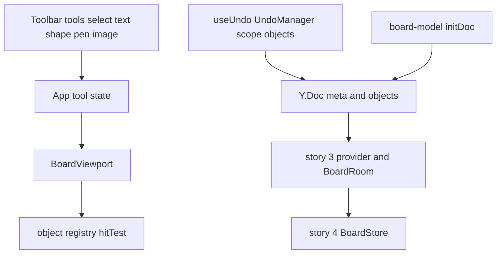

## Structure: target (this story)
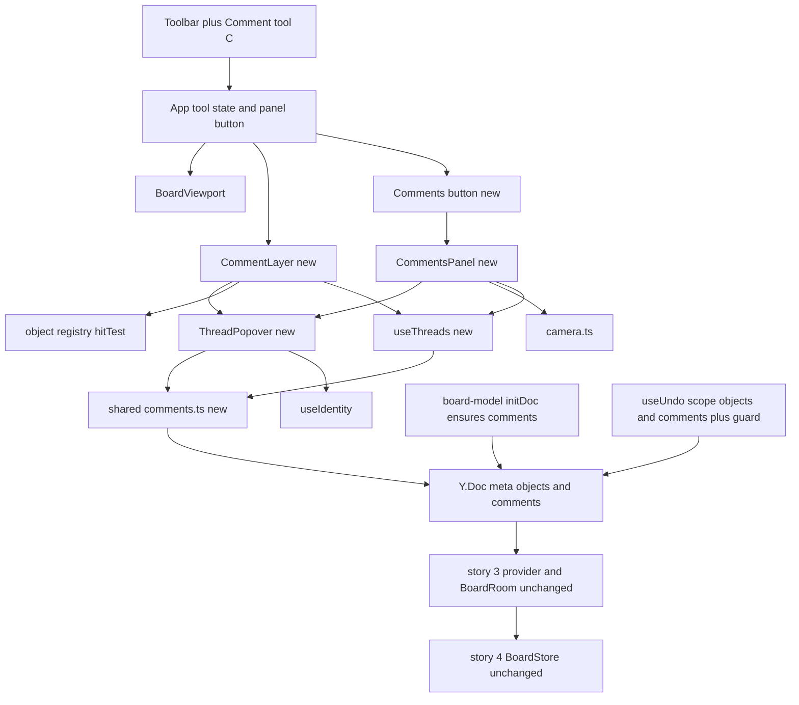
Delta: the Comment tool, layer, popover, panel, `useThreads` and `comments.ts` are new; `initDoc` also ensures the `comments` map; the UndoManager scope gains `comments` with the foreign-reply guard; the Y.Doc gains a `comments` root map. Sync and storage are unchanged.

## State diagrams
Thread lifecycle (persisted):
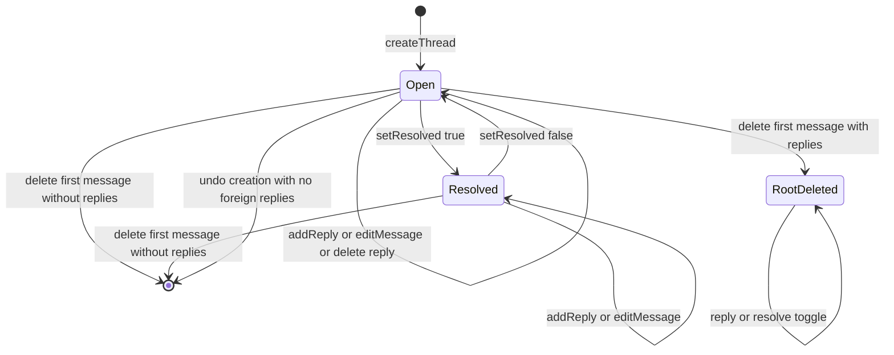
Message lifecycle (persisted):
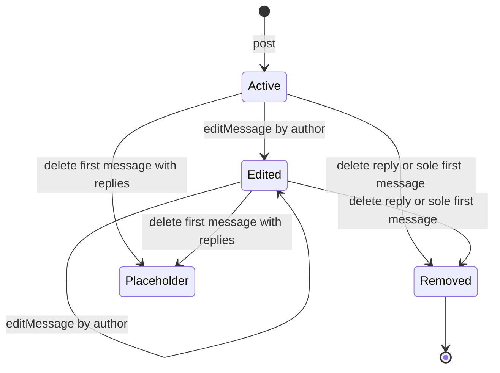
Anchor attachment (derived each render, not stored):
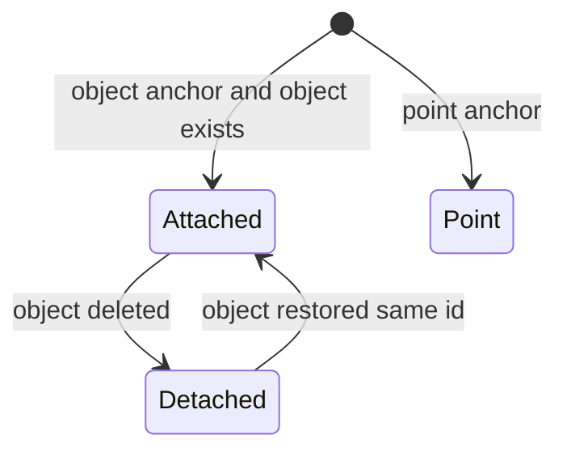
Undo of a comment action (client, not persisted):
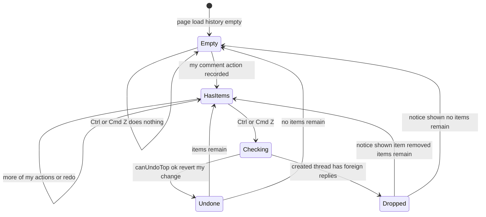
Thread popover (client, not persisted):
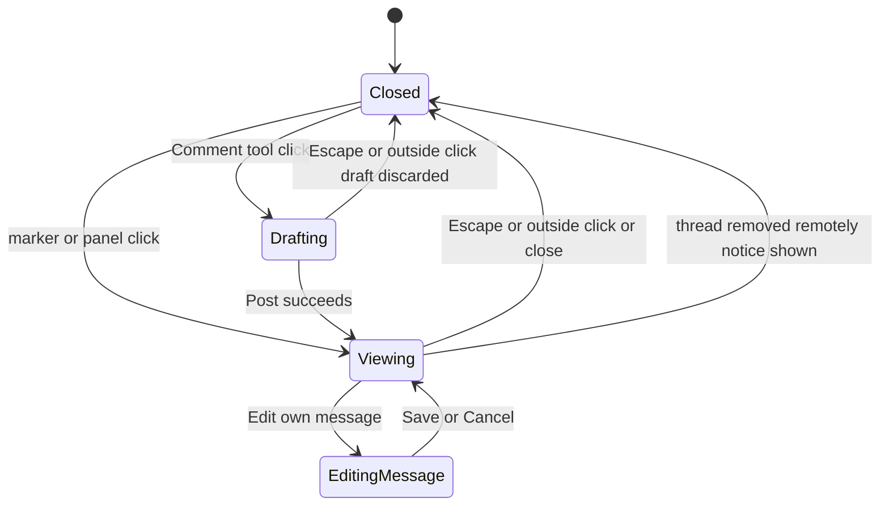

## Sequence: create a thread
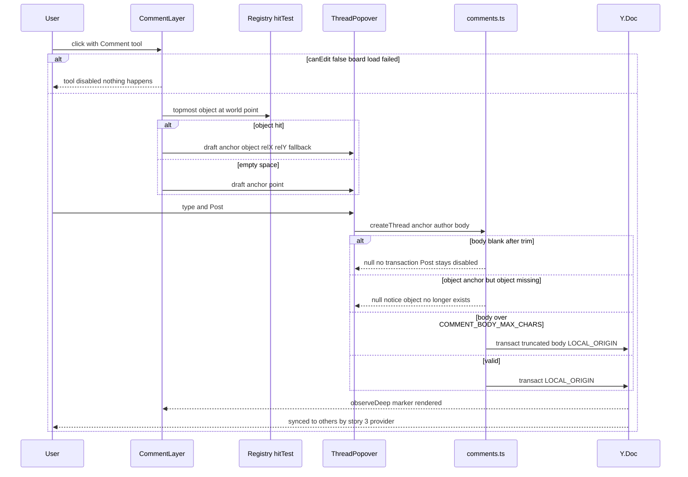

## Sequence: reply and remote changes while viewing
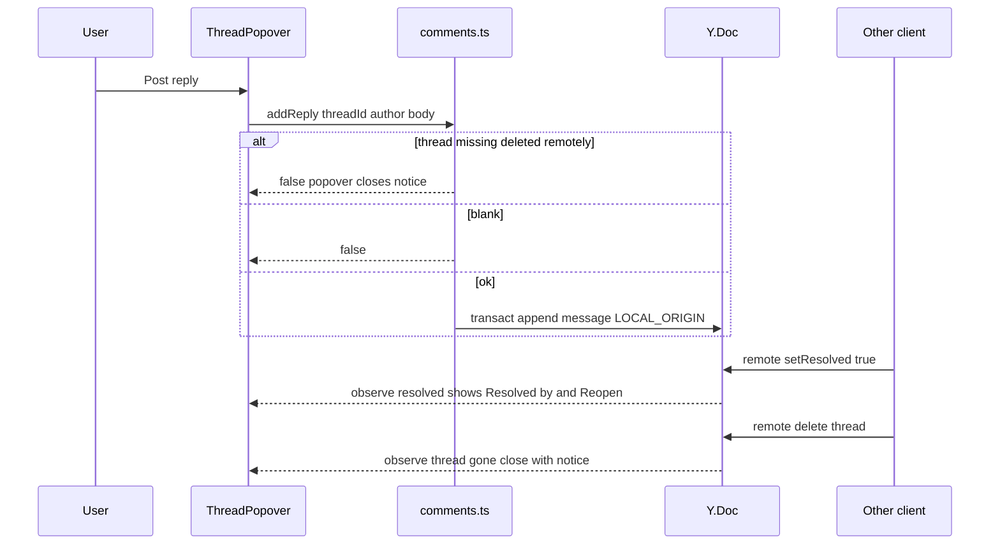

## Sequence: resolve, reopen, edit, delete
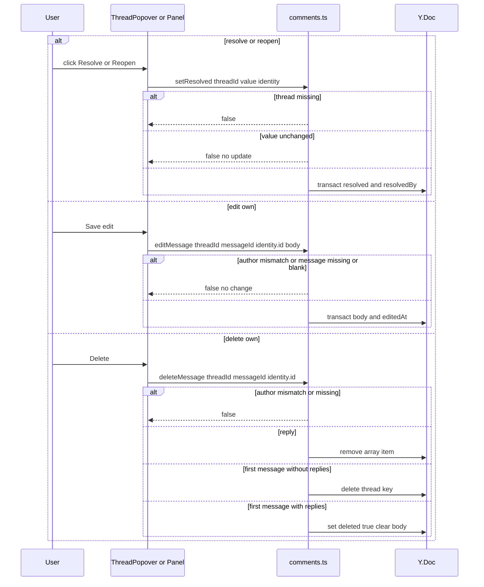

## Sequence: navigate from panel
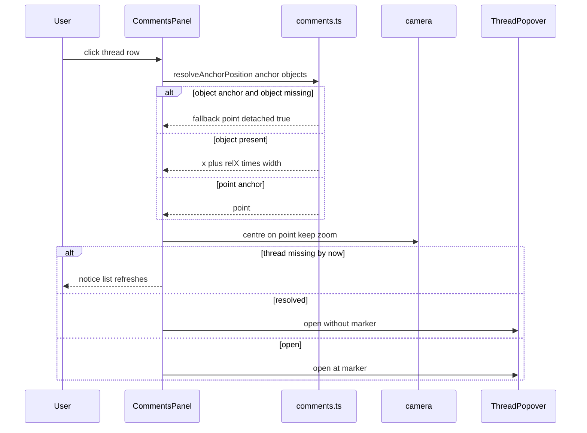

## Sequence: undo a comment action
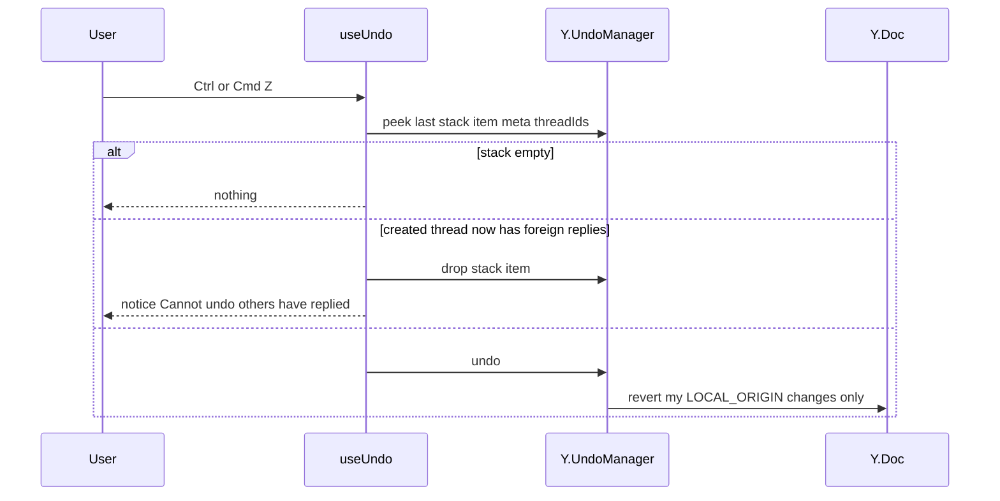

## Flow needing no new diagram
Marker repositioning when an object moves/resizes is a pure re-render: `useThreads` recomputes `resolveAnchorPosition` on `objects.observeDeep`; the anchor state diagram covers attached/detached transitions.

## Test Strategy

## Test scopes and boundaries
| Capability | Levels | Boundary exercised | Why sufficient |
|---|---|---|---|
| comments.model | unit | inner logic on a real Y.Doc | all validation, anchoring and delete rules live in `comments.ts` |
| comments.sync_persist | integration | real Worker + BoardRoom + SQLite via vitest-pool-workers | proves comments converge and persist through the unchanged server path |
| comments.undo | unit, ui-component | real UndoManager on two synced docs; keyboard wiring in jsdom | guard logic is pure; keyboard path is DOM |
| comments.board_ui | ui-component, e2e | components in jsdom; real browsers on `wrangler dev` | marker placement, zoom-independent size and live delivery need real layout/sync |
| comments.panel_ui | ui-component, e2e | component in jsdom; real camera movement in browser | list rules in jsdom, centring verified with real layout |

Timing policy: e2e tests wait up to E2E_EVENTUAL_TIMEOUT_MS (story 3) for remote changes to appear and log the measured delivery time against LIVE_UPDATE_LATENCY_BUDGET_MS; the budget is reported, not asserted, because the model, browsers and server share one machine.

## Dimensions crossed
- **D1 Operation:** create, reply, resolve/reopen, edit, delete, navigate, undo.
- **D2 Anchor:** object present, object deleted, point.
- **D3 Actor vs author:** same identity, different identity.
- **D4 Thread state before:** open, resolved, first message deleted (placeholder), missing.
- **D5 Body:** blank (empty, spaces, line breaks only), 1..COMMENT_BODY_MAX_CHARS, over COMMENT_BODY_MAX_CHARS.

Classes are exhaustive and non-overlapping within each dimension. Every case below, including UI and negative cases, is placed in one class per dimension. TC numbers are stable.

## Coverage table
| TC | Capability | D1 | D2 | D3 | D4 | D5 | Action | Expected before → after | Level |
|---|---|---|---|---|---|---|---|---|---|
| TC-01 | comments.model | create | object present | same | missing | 1..max | createThread click at 75%,25% of 200x200 sticky | threads 0 → 1; anchor relX 0.75 relY 0.25 fallback = click point; 1 message with authorName snapshot; 1 update | unit |
| TC-02 | comments.model | create | point | same | missing | 1..max | createThread point (−300, 40) | point anchor stored exactly | unit |
| TC-04 | comments.model | create | point | same | missing | 1..max, over max | body lengths 1, COMMENT_BODY_MAX_CHARS, COMMENT_BODY_MAX_CHARS + 1 | stored 1, 2000, truncated 2000 | unit |
| TC-06 | comments.model | reply | point | different | open / missing | 1..max / blank | addReply | messages 1 → 2 in order ; false ; blank false 0 updates | unit |
| TC-07 | comments.model | navigate | object present | not applicable: read-only | open | not applicable: no body | resolveAnchorPosition at relX/relY 0,0 and 1,1 after object moved +500 and doubled | corners track object exactly | unit |
| TC-08 | comments.model | navigate | object deleted → restored | not applicable: read-only | open | not applicable: no body | resolveAnchorPosition | detached at fallback → attached | unit |
| TC-09 | comments.model | resolve/reopen | point | different | open / resolved / missing | not applicable: no body | setResolved true on open; false on resolved; true on missing | resolvedBy set ; cleared ; false | unit |
| TC-10 | comments.model | edit | point | same | open | 1..max / blank | editMessage by author | body+editedAt set ; blank false | unit |
| TC-11 | comments.model | delete | point | same | open / first message deleted | not applicable: no body | delete reply; delete root without replies; delete root with replies | reply removed ; thread removed ; deleted true body '' replies kept | unit |
| TC-13 | comments.model | navigate | point | not applicable: read-only | open and resolved | not applicable: no body | listThreads open/resolved and openCount | only matching filter; newest latest-message first | unit |
| TC-14 | comments.model | create, reply | point | same | open | 1..max | identity renamed after posting, then reply | first message keeps old name; reply shows new name | unit |
| TC-15 | comments.undo | undo | point | same | missing | 1..max | post then undo, then redo | thread removed then restored | unit |
| TC-17 | comments.undo | undo | point | same | resolved | not applicable: no body | A resolves; remote user edits own message; A undo | thread reopened; remote edit untouched | unit |
| TC-18 | comments.sync_persist | create, reply | point | different | missing | 1..max | two WebSocket clients: A creates, B replies | both docs identical | integration |
| TC-19 | comments.sync_persist | resolve/reopen, reply | point | different | open | 1..max | A resolves while B replies concurrently | converge: resolved true, reply present | integration |
| TC-20 | comments.sync_persist | delete, reply | point | different | open | 1..max | A deletes sole first message while B replies concurrently | converge: thread absent on both; no exception | integration |
| TC-21 | comments.sync_persist | create, edit, resolve/reopen | object present | same | missing | 1..max | all clients leave; room reloads from storage | threads, edits, resolved state identical | integration |
| TC-23 | comments.board_ui | create | object present / point | same | missing | not applicable: draft only | Comment tool click on sticky vs empty board | draft popover with object anchor fractions vs point anchor | ui-component |
| TC-24 | comments.board_ui | create | point | same | missing | blank / 1..max | Post disabled when blank; Enter newline; Ctrl/Cmd+Enter posts | disabled/enabled states; newline inserted; createThread called | ui-component |
| TC-25 | comments.board_ui | create | point | same | missing | over max | paste 2,100 chars | textarea holds COMMENT_BODY_MAX_CHARS | ui-component |
| TC-26 | comments.board_ui | navigate | object present | not applicable: display | open | not applicable: no body | marker at zoom 0.1 and 4.0 with 3 messages | size COMMENT_MARKER_SIZE_PX both; badge "3"; accessible label | ui-component |
| TC-27 | comments.board_ui | navigate | object deleted / point | not applicable: display | resolved / open | not applicable: no body | resolved thread; detached thread | no marker; detached notice text | ui-component |
| TC-28 | comments.board_ui | edit, delete | point | same | open / first message deleted | not applicable: display | own message edited; root deleted with replies | ⋯ menu on own message; "(edited)"; "This comment was deleted" above kept replies | ui-component |
| TC-29 | comments.board_ui | delete, resolve/reopen | point | different | open | not applicable: no body | remote delete while open; remote resolve while open | closes with notice; shows "Resolved by Mira" + Reopen | ui-component |
| TC-30 | comments.board_ui | create | not applicable: no click | same | missing | not applicable: no body | Escape in Comment tool with no popover open | tool returns to Select | ui-component |
| TC-31 | comments.undo | undo | point | same | resolved | not applicable: no body | Ctrl/Cmd+Z after resolve in App | thread open again | ui-component |
| TC-32 | comments.panel_ui | navigate | not applicable: no threads | not applicable: display | missing | not applicable: no body | empty Open and Resolved tabs | exact empty-state texts | ui-component |
| TC-33 | comments.panel_ui | navigate | point | not applicable: display | open / resolved / first message deleted | not applicable: display | 3 threads mixed states | order newest first; preview COMMENT_PREVIEW_CHARS; author; reply count; open count on button | ui-component |
| TC-34 | comments.panel_ui | navigate | object present / object deleted / point | not applicable: display | open / resolved | not applicable: no body | click open, resolved, detached thread | camera centred zoom unchanged; popover opens; no marker for resolved; fallback used for detached | ui-component |
| TC-35 | comments.board_ui | create, reply, resolve/reopen | object present | different | missing → open → resolved → open | 1..max | two contexts: create on note, reply, move+resize note, resolve, reopen via panel | marker appears for the other person (delivery time logged against LIVE_UPDATE_LATENCY_BUDGET_MS, not asserted); marker follows the note; hidden then shown | e2e |
| TC-36 | comments.board_ui | navigate | object present | not applicable: display | open / resolved | not applicable: display | reload after everyone leaves | threads, (edited), resolved identical | e2e |
| TC-37 | comments.panel_ui | navigate | point | not applicable: display | open | not applicable: no body | zoom 10% and 400%, navigate from panel to far thread | marker size ±1px constant; marker centred ±1px | e2e |

## Negative scenarios
| TC | Capability | D1 | D2 | D3 | D4 | D5 | Case | Must not happen | Level |
|---|---|---|---|---|---|---|---|---|---|
| TC-03 | comments.model | create | point | same | missing | blank | createThread with bodies '', '   ', line breaks only | a blank comment is posted (returns null; 0 updates) | unit |
| TC-05 | comments.model | create | object deleted | same | missing | 1..max | createThread with objectId absent from objects | a thread is attached to a non-existent object (returns null; 0 updates) | unit |
| TC-12 | comments.model | delete | point | different | open | not applicable: no body | deleteMessage by someone other than the author | another person's message is deleted (returns false; 0 updates) | unit |
| TC-16 | comments.undo | undo | point | different | open | 1..max | two synced docs: A posts, B replies, A undoes | undo removes B's reply (stack item dropped; notice shown) | unit |
| TC-22 | comments.sync_persist | navigate | not applicable: no anchor | not applicable: no actor | open | not applicable: no body | initDoc on a doc that already has comments | opening a board writes to the doc (0 updates) | integration |
| TC-38 | comments.model | resolve/reopen | point | different | resolved | not applicable: no body | setResolved(true) on an already-resolved thread | an update is emitted (returns false; 0 updates) | unit |
| TC-39 | comments.model | edit | point | different | open | 1..max | editMessage by someone other than the author | another person's message is edited (returns false; 0 updates) | unit |
| TC-40 | comments.board_ui | edit, delete | point | different | open | not applicable: display | thread with messages by another identity | Edit/Delete is offered on someone else's message (no ⋯ menu rendered) | ui-component |
| TC-41 | comments.board_ui | create | point | same | missing | 1..max | type a draft then press Escape | a discarded draft is saved (0 doc updates) | ui-component |
| TC-42 | comments.board_ui | create | point | same | missing | not applicable: no body | board in load_failed, click with Comment tool | a comment is started or posted while the board cannot be edited (tool disabled; 0 updates) | ui-component |
| TC-43 | comments.undo | undo | not applicable: no thread | same | missing | not applicable: no body | Ctrl/Cmd+Z with an empty undo history | any transaction or error (canUndoTop returns `empty`; 0 updates; no notice) | unit |
| TC-44 | comments.sync_persist | reply | point | different | missing | 1..max | B's reply update is delivered to the room after A's delete of the whole thread was stored | the deleted thread reappears (thread absent on A, B and after reload) | integration |

## Boundary values
- Body length: 0 (blank, TC-03), 1 and exactly COMMENT_BODY_MAX_CHARS (TC-04), COMMENT_BODY_MAX_CHARS + 1 (TC-04, TC-25).
- Anchor fractions: relX/relY exactly 0 and exactly 1 (TC-07).
- Zoom: ZOOM_MIN and ZOOM_MAX (TC-26, TC-37).
- Replies on a deleted root: 0 and 1 (TC-11).
- Undo history: empty and one item (TC-43, TC-15).

## Error paths
| Contract error | TC |
|---|---|
| blank body | TC-03, TC-06, TC-10 |
| over limit | TC-04 |
| missing object for object anchor | TC-05 |
| missing thread/message | TC-06, TC-09 |
| author mismatch | TC-12, TC-39 |
| no-op resolve | TC-38 |
| thread removed while viewing | TC-29 |
| undo blocked by foreign replies | TC-16 |
| undo with empty history | TC-43 |
| reply arriving after thread deletion | TC-20, TC-44 |

## Mock vs real
| Dependency | Choice | Reason |
|---|---|---|
| Y.Doc / UndoManager | real everywhere | behaviour under test |
| Worker, BoardRoom, SQLite | real in integration (vitest-pool-workers) and e2e (`wrangler dev`) | proves unchanged server path handles comments |
| Identity | fixed fixture identities injected into `useIdentity` | deterministic author ids and names |
| Object registry hitTest | real registry with sticky fixtures | anchor fractions depend on real bounds |
| Clock | fake timers for relative time and notices | deterministic text |

## E2E workflows
1. **Discussion on a note** (TC-35): asserts live marker delivery, marker following its object, resolve/reopen.
2. **Come back tomorrow** (TC-36): asserts persistence of threads and states.
3. **Zoomed navigation** (TC-37): asserts constant marker size and panel centring.

## Fixtures
`tests/fixtures/comments.ts`: identities guest "Curious Otter" (`g_…`) and signed-in "Mira" (`u_…`); realistic threads ("Is this in scope for Q3?", 3-reply pricing debate, one resolved, one detached, one with deleted root).

## Not covered
Deliberately not covered by automated tests:
- Offline comment creation (covered generically by story 13's doc persistence tests).
- Screen-reader announcement quality (manual accessibility pass).
- Wall-clock delivery time as a pass/fail criterion: on a shared machine it is logged (TC-35), not asserted.

## Comments model

> Anchor: `comments.model`

## Contract
```ts
// src/shared/comments.ts
export type Anchor =
  | { kind: 'object'; objectId: string; relX: number; relY: number; fallbackX: number; fallbackY: number }
  | { kind: 'point'; x: number; y: number };
export interface Author { id: string; name: string }
export function anchorForClick(obj: { id: string; x: number; y: number; width: number; height: number } | null, world: { x: number; y: number }): Anchor;
export function createThread(doc: Y.Doc, anchor: Anchor, author: Author, body: string): string | null;
export function addReply(doc: Y.Doc, threadId: string, author: Author, body: string): boolean;
export function setResolved(doc: Y.Doc, threadId: string, resolved: boolean, by: Author): boolean;
export function editMessage(doc: Y.Doc, threadId: string, messageId: string, actorId: string, body: string): boolean;
export function deleteMessage(doc: Y.Doc, threadId: string, messageId: string, actorId: string): boolean;
export function resolveAnchorPosition(anchor: Anchor, objects: ReadonlyMap<string, { x: number; y: number; width: number; height: number }>): { x: number; y: number; detached: boolean };
export function listThreads(doc: Y.Doc, filter: 'open' | 'resolved'): ThreadSnapshot[];
export function openCount(doc: Y.Doc): number;
```
- **Inputs:** doc, identity snapshot, body, anchor.
- **Outputs:** thread id / booleans; snapshots sorted by latest message `createdAt` desc.
- **Errors:** blank body, missing thread/message, author mismatch, object anchor to missing object, no-op resolve → `null`/`false` with **no transaction**; body over COMMENT_BODY_MAX_CHARS (2,000) truncated.
- **Side effects:** exactly one `doc.transact(fn, LOCAL_ORIGIN)` per successful mutation.

## Implementation
Owns: comment.blank, comment.length, comment.author_name, comment.follow_item, comment.edit_own, comment.delete_own.

- **Blank comments (comment.blank):** `createThread`, `addReply` and `editMessage` trim the text; if nothing remains (empty, only spaces, or only line breaks) they return `null`/`false` and write nothing, so no blank comment or reply is ever posted. The popover's Post button uses the same trim check and stays disabled while the text is blank.
- **Length limit (comment.length):** the textarea's `maxLength` (COMMENT_BODY_MAX_CHARS, 2,000) stops typing and pasting beyond 2,000 characters; the model additionally cuts any longer body to its first 2,000 characters, so characters beyond 2,000 are never added.
- **Names as written (comment.author_name):** each message stores `authorName` copied from the writer's identity at the moment of writing and it is never rewritten; when the writer later renames themselves, their earlier messages keep the old name and only new messages show the new one.
- **Comments follow their object (comment.follow_item):** an object anchor stores `relX/relY` as fractions (0–1) of the object's width and height. `resolveAnchorPosition` returns `object.x + relX × width, object.y + relY × height`, so after the object is moved or resized every attached marker is at the same relative spot (e.g. a marker at the top-right corner stays at the top-right corner after moving the object 500 units and doubling its size).
- **Edit my own message (comment.edit_own):** `editMessage` succeeds only when `actorId` equals the message's `authorId`; it replaces `body` for everyone and sets `editedAt`, which is shown as "(edited)".
- **Delete my own message (comment.delete_own):** `deleteMessage` succeeds only for the author and applies exactly one of three outcomes: (1) the message is a reply → it is removed; (2) it is the first message and the thread has no replies → the whole thread is removed; (3) it is the first message and there are replies → it is replaced by "This comment was deleted" (`deleted: true`, body cleared) and the replies are kept.
- **Attached object deleted:** deleting a board object never touches `comments`; `resolveAnchorPosition` returns the anchor's fallback point with `detached: true` while the object is absent, and the relative spot again once the object is restored with the same id (rendering in comments.board_ui).
- `anchorForClick` clamps relX/relY to [0,1]; fallback = click world point. Framework-free so tests and any future server validation can import it.

## Tests
unit: TC-01 to TC-14, TC-38, TC-39 in `tests/unit/comments.test.ts` (blank TC-03, length TC-04, follow TC-07, detached TC-08, edit TC-10/TC-39, delete TC-11/TC-12, names TC-14).

## Comments sync and persistence

> Anchor: `comments.sync_persist`

## Contract
```ts
// src/shared/board-model.ts (modified)
export function initDoc(doc: Y.Doc): void; // now also ensures doc.getMap('comments'); emits no update when meta and comments already exist
```
- **Inputs:** Yjs updates for the `comments` map arriving over story 3's WebSocket protocol.
- **Outputs:** identical `comments` state on every client within LIVE_UPDATE_LATENCY_BUDGET_MS (1 second); persisted by story 4's BoardStore with no schema or server code changes.
- **Errors:** none new; malformed updates handled by story 3/4 rules.
- **Side effects:** none beyond existing append/broadcast.

## Implementation
Owns: comment.persist.

- `doc.getMap('comments')` is a root type, so Yjs creates it without an update; `initDoc` touches it so observers can attach before content arrives. BoardRoom and BoardStore are unchanged: they operate on whole-doc updates regardless of root type.
- **Comments are kept with the board (comment.persist):** every comment action (post, reply, edit, delete, resolve, reopen) is a normal document update, which story 4 appends to storage before broadcasting. When a person opens the board after everyone has left, the room reloads the document from storage, so every thread, reply, resolved state and "(edited)" marker appears exactly as it was left.
- Live delivery of the same updates to connected people (within 1 second) is the story 3 path; how each action looks on screen is specified in comments.board_ui and comments.panel_ui.
- Concurrent semantics: map-key delete wins over nested reply (Overview decision 3).

## Tests
integration: TC-18 to TC-22, TC-44 in `tests/integration/comments-sync.test.ts` using the story 3 `ws-client` helper and story 4 reload path. e2e: TC-36 (reload).

## Undo for comment actions

> Anchor: `comments.undo`

## Contract
```ts
// src/client/undo/useUndo.ts (story 8, modified)
// UndoManager scope: [doc.getMap('objects'), doc.getMap('comments')], trackedOrigins {LOCAL_ORIGIN}
export function recordCreatedThreads(stackItem: StackItem, threadIds: string[]): void; // on 'stack-item-added'
export function canUndoTop(um: Y.UndoManager, doc: Y.Doc, actorId: string): { ok: true } | { ok: false; reason: 'foreign-replies' | 'empty' };
```
- **Inputs:** Ctrl/Cmd+Z / Shift+Ctrl/Cmd+Z; stack items with `meta.threadIds`.
- **Outputs:** reversal of the actor's own last comment action (post, reply, edit, delete, resolve, reopen).
- **Errors:** top item created a thread that now contains messages by another author → item dropped, notice "Can't undo: others have replied" for COMMENT_NOTICE_MS.
- **Side effects:** LOCAL_ORIGIN undo transactions; remote changes never tracked.

## Implementation
Owns: comment.undo.

- **Only my own actions (comment.undo):** story 8's UndoManager tracks only `LOCAL_ORIGIN`, so its stack holds only this person's post, reply, edit, delete, resolve and reopen transactions; changes arriving from other people use the provider origin and are never on the stack. Undo therefore reverses this person's most recent comment action and never someone else's, even if another person's action happened more recently.
- **Guard:** on `stack-item-added`, record inserted `comments` keys in `stackItem.meta.threadIds`. Before `undo()`, `canUndoTop` checks those threads; if undoing would remove another author's reply, the item is dropped with the notice instead. The exact `StackItem.meta` and event payload shape must be confirmed against the pinned Yjs version during implementation.

## Tests
unit: TC-15 to TC-17, TC-43 (`tests/unit/comments-undo.test.ts`). ui-component: TC-31.

## Comment tool, markers and thread popover

> Anchor: `comments.board_ui`

## Contract
```tsx
// src/client/comments/CommentLayer.tsx
export function CommentLayer(props: { doc: Y.Doc; camera: Camera; toolActive: boolean; canEdit: boolean; onOpen(t: { threadId?: string; draft?: Anchor }): void }): JSX.Element;
// src/client/comments/ThreadPopover.tsx
export function ThreadPopover(props: { doc: Y.Doc; threadId: string | null; draftAnchor?: Anchor; identity: Identity; camera: Camera; onClose(): void }): JSX.Element | null;
```
- **Inputs:** clicks while the Comment tool (C) is active, marker clicks, popover actions, Escape.
- **Outputs:** markers as `button[aria-label="Comment thread by <name>, <n> messages"]` in a screen-space layer; popover with messages, textarea `maxLength=COMMENT_BODY_MAX_CHARS`, Post, Resolve/Reopen, ⋯ Edit/Delete.
- **Errors:** thread removed remotely → close + notice; model returns false → no UI change; `canEdit` false → tool disabled.
- **Side effects:** calls comments.model; tool returns to Select after posting; drafts never written until Post.

## Implementation
Owns: comment.create_on_item, comment.create_on_board, comment.post, comment.reply, comment.item_deleted, comment.resolve, comment.reopen, comment.not_others, comment.marker_size.

- **Comment on an object (comment.create_on_item):** with the Comment tool active, a click is hit-tested against the story 7 registry; if it lands on a board object, `anchorForClick(object, worldPoint)` builds an object anchor at the clicked spot (fractions of the object's size) and a new, empty comment box opens next to that spot, attached to the object.
- **Comment on an empty spot (comment.create_on_board):** if the click hits no object, `anchorForClick(null, worldPoint)` builds a point anchor at that exact board location — the thread is attached to the board, not to any object — and a new, empty comment box opens there.
- **Post (comment.post):** Post (or Ctrl/Cmd+Enter) with non-blank text calls `createThread` with the writer's current identity; the marker and the message (writer's name and "just now") appear immediately for the writer and, through story 3 sync, on every other connected screen within LIVE_UPDATE_LATENCY_BUDGET_MS (1 second). The tool returns to Select.
- **Reply (comment.reply):** the reply field calls `addReply`; for everyone connected, the reply appears below the earlier messages in time order and the marker's badge shows the new message count.
- **Attached object deleted (comment.item_deleted):** when `resolveAnchorPosition` reports `detached: true`, the marker is drawn at the fallback point where the thread was first attached and the popover shows "The item this comment was attached to was deleted."; when the object is restored the marker returns to its spot on the object and the notice disappears.
- **Resolve (comment.resolve):** Resolve calls `setResolved(true, identity)`; the marker is removed from the board for everyone and the thread is listed under Resolved in the comments panel together with who resolved it (comments.panel_ui). A person who has the thread open keeps it open, now showing "Resolved by …" and Reopen.
- **Reopen (comment.reopen):** Reopen (in the popover or the Resolved tab) calls `setResolved(false)`; the marker is shown on the board again for everyone and the thread is listed under Open again.
- **Others' messages (comment.not_others):** the ⋯ menu with Edit and Delete is rendered only for messages whose `authorId` equals the viewer's identity id; messages written by someone else offer neither Edit nor Delete.
- **Marker size (comment.marker_size):** markers are positioned with `worldToScreen` but drawn in a screen-space layer at COMMENT_MARKER_SIZE_PX, so they are the same on-screen size at every zoom level from ZOOM_MIN to ZOOM_MAX.
- **Deleting my own message:** the popover reflects `deleteMessage`'s outcome — a reply disappears; a sole first message removes the thread (popover closes, marker gone); a first message with replies shows "This comment was deleted" above the kept replies.

## Tests
ui-component: TC-23 to TC-30, TC-40 to TC-42 (create on object vs empty TC-23, post TC-24, marker size TC-26, resolved/detached TC-27, own-message menu TC-28/TC-40, remote resolve TC-29). e2e: TC-35, TC-36.

## Comments panel and navigation

> Anchor: `comments.panel_ui`

## Contract
```tsx
// src/client/comments/CommentsPanel.tsx
export function CommentsPanel(props: { doc: Y.Doc; objects: ReadonlyMap<string, Bounds>; viewport: Size; camera: Camera; onCameraChange(c: Camera): void; onOpenThread(id: string): void }): JSX.Element;
export function centreCameraOn(camera: Camera, viewport: Size, world: Point): Camera; // zoom unchanged
```
- **Inputs:** Comments button toggle, tab clicks, row clicks.
- **Outputs:** right panel COMMENT_PANEL_WIDTH_PX wide; tabs Open/Resolved; rows; open count on the button; exact empty-state texts; navigation.
- **Errors:** thread deleted between render and click → notice, list refresh.
- **Side effects:** camera change; popover open.

## Implementation
Owns: comment.panel, comment.navigate.

- **Panel list (comment.panel):** the panel lists every thread matching the selected filter tab (Open or Resolved) using `listThreads(doc, filter)`, ordered newest activity first. Each row shows the first line of the thread's first message (up to COMMENT_PREVIEW_CHARS, or "This comment was deleted" for a deleted root), that message's author, the reply count and the time of latest activity; resolved rows also show who resolved them and offer Reopen. The Comments button always shows the number of open threads (`openCount(doc)`), updating live as threads are posted, resolved and reopened. Empty tabs show "No open comments. Use the Comment tool (C) to start a discussion." / "No resolved comments."
- **Jump to a thread (comment.navigate):** clicking a row computes the thread's location with `resolveAnchorPosition` (fallback point when detached) and moves the board view with `centreCameraOn` = `{ x: world.x - viewport.width/(2*zoom), y: world.y - viewport.height/(2*zoom), zoom }`, so the location is centred and the zoom level does not change; the thread then opens there. If the thread is resolved, it opens at its location without showing a marker on the board.

## Tests
ui-component: TC-32 to TC-34. e2e: TC-37.

