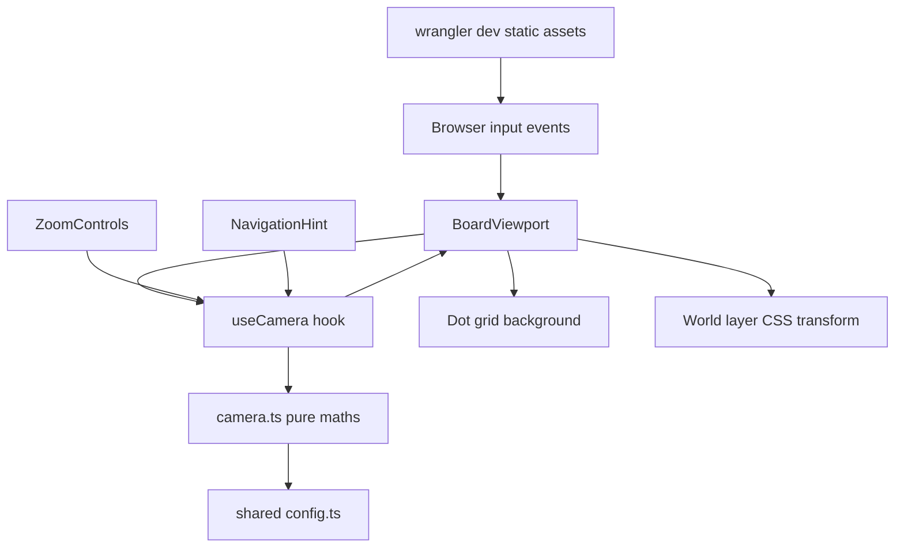
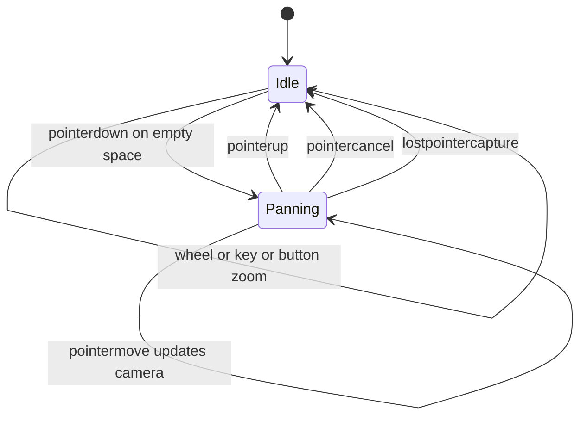
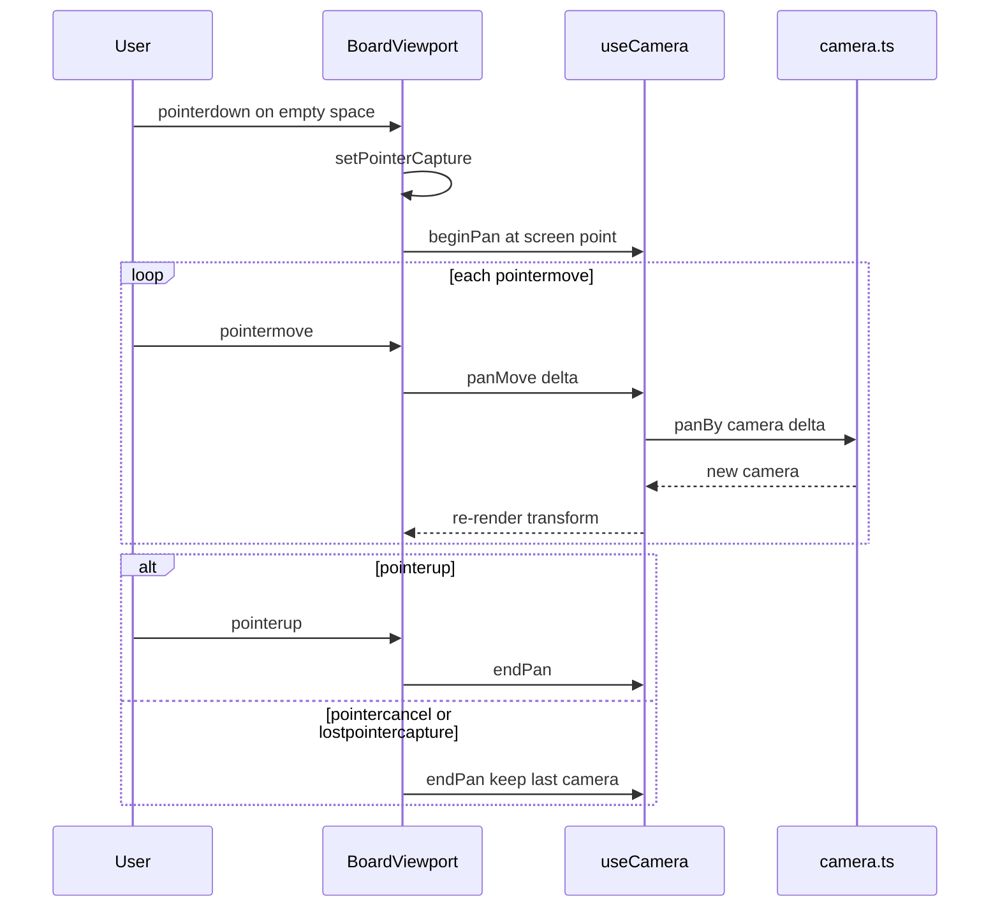
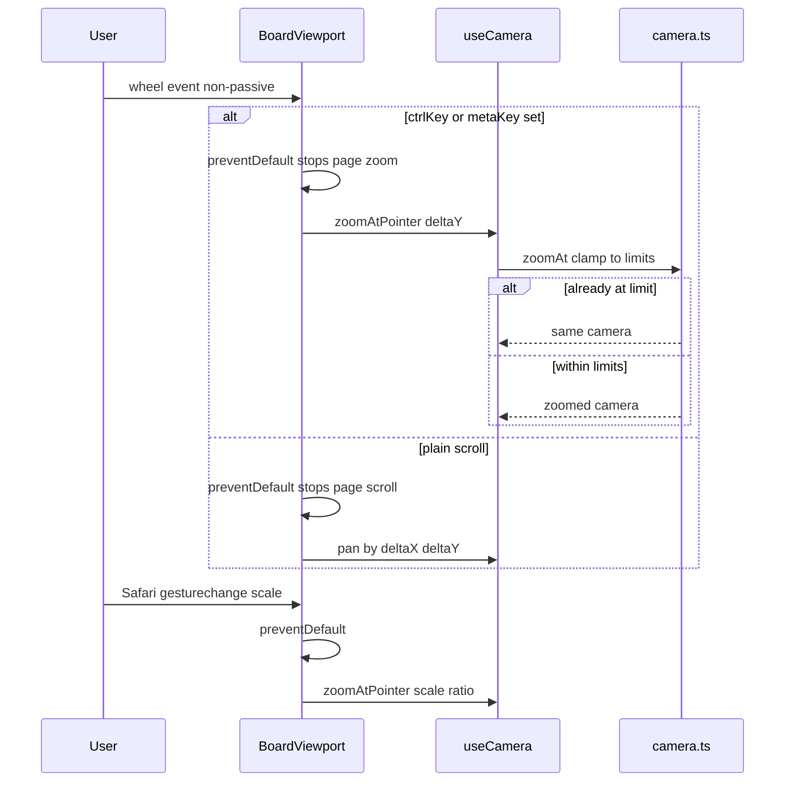
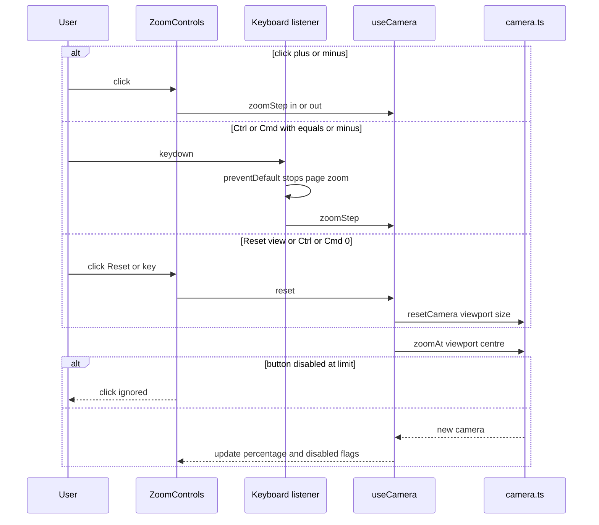

# Technical Design

Client-only infinite canvas: a pure camera module (world<->screen transforms, pan, zoom-at-point, clamping) drives a DOM viewport whose world layer and dot grid are positioned with CSS transforms. Input handling (pointer drag, wheel, Safari gesture, keyboard) and zoom controls are React components. Establishes the repo skeleton (Vite + React + TypeScript served as static assets by a Cloudflare Worker) used by stories 2-5.", "sections": []

## Overview

## Context
The repository is empty (only README.md). This story creates the application skeleton that stories 2–5 build on, and delivers client-only board navigation. Stack decisions (recorded 2026-09-17): Yjs for sync (from story 2), DOM/SVG rendering, Cloudflare Workers + Durable Objects (from story 3).

## Planned repository layout (created by this story)
| Path | Purpose |
|---|---|
| `package.json`, `tsconfig.json`, `vite.config.ts` | Vite + React 19 + TypeScript client build |
| `wrangler.jsonc` | Worker config; `assets.directory` = `dist/client` so `wrangler dev` serves the client (Worker code added in story 3) |
| `src/shared/config.ts` | All named settings (zoom limits, step, grid spacing). Stories 2–5 add to this file |
| `src/client/main.tsx`, `src/client/App.tsx` | Entry + top-level layout |
| `src/client/canvas/camera.ts` | Pure camera maths |
| `src/client/canvas/useCamera.ts` | React hook: camera state + input handlers |
| `src/client/canvas/BoardViewport.tsx` | Input surface, dot grid, world layer |
| `src/client/canvas/ZoomControls.tsx` | − / % / + / Reset view |
| `src/client/canvas/NavigationHint.tsx` | First-use hint |
| `tests/unit/`, `tests/component/`, `tests/e2e/` | Vitest unit, Vitest + Testing Library (jsdom), Playwright |

## Named settings (`src/shared/config.ts`)
```ts
export const ZOOM_MIN = 0.1;
export const ZOOM_MAX = 4;
export const ZOOM_STEP_FACTOR = 1.25;
export const WHEEL_ZOOM_SENSITIVITY = 0.01; // zoom factor = exp(-deltaY * sensitivity)
export const GRID_SPACING_WORLD = 24;
export const UNBOUNDED_PAN_TESTED_EXTENT = 1_000_000;
```

## Coordinate model
- **World units**: board coordinates; origin (0,0) is the board's starting point.
- **Camera** `{ x, y, zoom }`: `x, y` is the world coordinate shown at the top-left of the viewport; `zoom` is screen pixels per world unit.
- `screen = (world - camera.xy) * zoom`; `world = screen / zoom + camera.xy`.
- Doubles give sub-pixel precision far beyond ±1,000,000 world units at `ZOOM_MAX`, so no re-basing is needed for the tested extent.

## Structure diagram


## State diagram
Nothing is persisted in this story: the camera lives only in React state and is discarded on reload. The only long-lived state is the viewport's interaction mode during a gesture:

The hint has its own two-state lifecycle (`Visible -> Dismissed` on first camera change; reset only by page reload), held in component state.

## Sequence: drag to pan


## Sequence: wheel and gesture input


## Sequence: buttons, keys and reset


## Flows not needing a separate sequence diagram
- **Window resize**: camera `x, y` (top-left) is unchanged by design, so resize only changes viewport size; covered by TC-07 and needs no interaction sequence.
- **Hint dismissal**: a side effect of any camera change shown above.

## Test Strategy

## Test scopes and boundaries
| Capability | Levels | Boundary exercised | Why sufficient |
|---|---|---|---|
| camera.math | unit | Inner logic (pure functions) | All geometry and clamping lives here; no DOM needed |
| viewport.input | ui-component, e2e | Component event handling in jsdom; real browser input in Playwright | jsdom proves handler wiring and preventDefault; only a real browser proves page zoom is not triggered and pixels line up |
| zoom.controls | ui-component, e2e | Rendered controls in jsdom; real clicks in Playwright | Disabled states and labels are DOM facts; e2e confirms end-to-end with real layout |
| nav.hint_display | ui-component, e2e | Component state | Simple visibility logic |

There is no request-handling boundary in this story (no server code), so no integration tests apply; stated deliberately.

## Dimensions crossed
- **D1 Input method**: drag, plain wheel, Ctrl/Cmd wheel, Safari gesture, button, keyboard shortcut.
- **D2 Zoom state before action**: mid-range (100%), at ZOOM_MIN, at ZOOM_MAX.
- **D3 Camera position**: at origin, far away (UNBOUNDED_PAN_TESTED_EXTENT).

Equivalence classes for D2 are exhaustive and non-overlapping: `zoom == ZOOM_MIN`, `ZOOM_MIN < zoom < ZOOM_MAX`, `zoom == ZOOM_MAX` (values outside the range are unreachable because every mutation clamps; TC-12 asserts that).

## Coverage table
| TC | Capability | D1 input | D2 zoom before | D3 position | Action | Expected before → after | Level |
|---|---|---|---|---|---|---|---|
| TC-01 | camera.math | drag (panBy) | mid 1.0 | origin | panBy(+200,+100) screen px | camera x,y at 0 → (-200,-100); world point (0,0) screen pos (0,0) → (200,100) | unit |
| TC-02 | camera.math | drag (panBy) | at max 4.0 | far 1e6 | panBy(+200,+100) | camera shifts by (-50,-25) world units; exact within 1e-6 | unit |
| TC-03 | camera.math | Ctrl wheel (zoomAt) | mid 1.0 | origin | zoomAt(point 300,200, factor 2) | zoom 1 → 2; screenToWorld(300,200) identical before and after | unit |
| TC-04 | camera.math | Ctrl wheel (zoomAt) | mid 1.0 | far 1e6 | zoomAt(point, 1.5) | pointer world point invariant within 1e-6 | unit |
| TC-05 | camera.math | button (zoomAt centre) | at min 0.1 | origin | zoomAt(centre, 1/ZOOM_STEP_FACTOR) | zoom stays 0.1; camera unchanged (object equality of x,y) | unit |
| TC-06 | camera.math | button (zoomAt centre) | at max 4.0 | origin | zoomAt(centre, ZOOM_STEP_FACTOR) | zoom stays 4.0; camera unchanged | unit |
| TC-07 | camera.math | not applicable: resize is not user input to camera | mid 1.0 | origin | viewport size change | camera x,y,zoom unchanged | unit |
| TC-08 | camera.math | reset | at max 4.0 | far 1e6 | resetCamera(1200x800) | zoom 4 → 1; camera (x,y) → (-600,-400) so origin at centre | unit |
| TC-09 | camera.math | button step sequence | mid 1.0 | origin | 1 step in then 1 step out | 1.0 → 1.25 → 1.0 exactly (percent label 100) | unit |
| TC-10 | camera.math | button step to limit | mid 1.0 | origin | 20 steps in | zoom reaches 4.0 and stops; canZoomIn false | unit |
| TC-11 | camera.math | Ctrl wheel large delta | mid 1.0 | origin | factor 1000 | zoom clamps to 4.0 and pointer invariance still holds for clamped factor | unit |
| TC-12 | camera.math | invalid factor | mid 1.0 | origin | factor 0, negative, NaN, Infinity | camera returned unchanged; no NaN in output | unit |
| TC-13 | viewport.input | drag | mid 1.0 | origin | pointerdown/move(200,100)/up on viewport | world layer transform translate matches camera; state Idle→Panning→Idle | ui-component |
| TC-14 | viewport.input | drag interrupted | mid 1.0 | origin | pointerdown, move, pointercancel, further move | camera equals value at cancel; later moves ignored | ui-component |
| TC-15 | viewport.input | plain wheel | mid 1.0 | origin | wheel deltaY=+100 | camera y increases by 100/zoom; event.defaultPrevented true | ui-component |
| TC-16 | viewport.input | Ctrl wheel | mid 1.0 | origin | wheel ctrlKey deltaY=-100 at (300,200) | zoom increases; defaultPrevented true | ui-component |
| TC-17 | viewport.input | Safari gesture | mid 1.0 | origin | gesturechange scale 2 | zoom doubles (clamped); defaultPrevented true | ui-component |
| TC-18 | viewport.input | keyboard | mid 1.0 | origin | Ctrl+= , Ctrl+- , Ctrl+0 | 1.0→1.25→1.0→reset; defaultPrevented true each | ui-component |
| TC-19 | zoom.controls | button | at min 0.1 | origin | render | Zoom out disabled, Zoom in enabled, label 10% | ui-component |
| TC-20 | zoom.controls | button | at max 4.0 | origin | render | Zoom in disabled, label 400% | ui-component |
| TC-21 | zoom.controls | button | mid 1.5625 | origin | render | label 156% (rounded) | ui-component |
| TC-22 | nav.hint_display | drag | mid 1.0 | origin | initial render then one camera change then another | visible → hidden → hidden | ui-component |
| TC-23 | viewport.input | drag | mid 1.0 | origin | Playwright mouse drag 200,100 | grid dot and origin marker move exactly 200,100 px (±1) | e2e |
| TC-24 | viewport.input | Ctrl wheel | mid 1.0 | origin | Playwright wheel with Control held over a dot | dot stays under pointer (±1 px); window.visualViewport.scale stays 1 | e2e |
| TC-25 | zoom.controls | button | mid → max | origin | click + until disabled | label sequence ends at 400%, + has disabled attribute | e2e |
| TC-26 | zoom.controls | reset | max 4.0 | far 1e6 (via test hook) | click Reset view | label 100%; origin marker at viewport centre (±1 px) | e2e |
| TC-27 | viewport.input | drag | mid 1.0 | far 1e6 (via test hook) | drag 200,100 | grid spacing still GRID_SPACING_WORLD*zoom px; movement exact | e2e |
| TC-28 | nav.hint_display | drag | mid 1.0 | origin | load, see hint, drag | hint visible then removed | e2e |

## Boundary values
- Zoom: exactly ZOOM_MIN, exactly ZOOM_MAX, one step inside each limit (TC-05, TC-06, TC-10, TC-19, TC-20).
- Zoom factors: 0, negative, NaN, Infinity, huge (TC-11, TC-12).
- Pan delta: zero-length drag (pointerdown/up with no move) leaves camera unchanged — TC-29 below.
- Position: origin and UNBOUNDED_PAN_TESTED_EXTENT (TC-02, TC-04, TC-26, TC-27).

## Negative scenarios
| TC | Scenario | Expected | Level |
|---|---|---|---|
| TC-29 | Click without moving on empty space | camera unchanged; hint not dismissed | ui-component |
| TC-30 | Ctrl/Cmd wheel over the zoom control (outside board) | no board zoom; browser default not suppressed there | ui-component |
| TC-31 | Zoom gestures over board in real browser | page zoom (visualViewport.scale and devicePixelRatio) unchanged | e2e |
| TC-32 | Clicking a disabled zoom button | camera unchanged | ui-component |
| TC-33 | Keyboard shortcuts while focus is in the browser address bar | not applicable in-page: the page cannot receive these events, so no test; documented as not covered |

## Error paths
The camera contract names one error class: invalid zoom factor (non-finite or ≤ 0). Covered by TC-12. No other errors exist in this story.

## Mock vs real boundaries
| Dependency | Mocked? | Reason |
|---|---|---|
| DOM / pointer events (component tests) | jsdom simulated | Fast, deterministic handler checks; real layout verified in e2e |
| Browser zoom / layout (e2e) | Real Chromium, WebKit, Firefox via Playwright | Page-zoom suppression and pixel alignment only exist in real engines |
| Server | None exists | Static assets served by `wrangler dev` in e2e so the same serving path is used from day one |
| Data stores | None exist | Story has no persistence |

## E2E workflows
1. **First visit navigation** (TC-28 → TC-23 → TC-24): hint shows, drag moves board exactly, pointer zoom keeps point fixed, hint gone. Asserts the golden path.
2. **Limits and recovery** (TC-25 → TC-26): zoom to maximum, button disables, reset returns to 100% centred.
3. **Far travel** (TC-27): at 1,000,000 units the board still pans exactly.

## Fixtures
- Viewport sizes 1280x800 (default laptop) and 1920x1080.
- A test-only `window.__vidi6.setCamera()` hook enabled only when `import.meta.env.MODE === 'test'`, used to jump far away (dragging a million pixels in e2e is impractical). The hook is excluded from production builds.
- An origin marker element (small crosshair at world 0,0) rendered in all builds, giving e2e a stable pixel target.

## Not covered
- Smoothness / frame rate: manual check only.
- Trackpad hardware differences (inertia, delta scaling across OSes): only synthetic wheel events are tested.
- Safari pinch in e2e: Playwright WebKit cannot synthesise GestureEvent; TC-17 covers handler logic, real Safari pinch is a manual check.
- Touch input: out of scope.

## Camera maths

> Anchor: `camera.math`

## Contract
```ts
// src/client/canvas/camera.ts
export interface Camera { readonly x: number; readonly y: number; readonly zoom: number }
export interface Point { readonly x: number; readonly y: number }
export interface Size { readonly width: number; readonly height: number }

export function screenToWorld(cam: Camera, p: Point): Point;
export function worldToScreen(cam: Camera, p: Point): Point;
export function panBy(cam: Camera, screenDx: number, screenDy: number): Camera;
export function zoomAt(cam: Camera, screenPoint: Point, factor: number): Camera;
export function zoomStep(cam: Camera, viewport: Size, direction: 'in' | 'out'): Camera;
export function resetCamera(viewport: Size): Camera;
export function canZoomIn(cam: Camera): boolean;
export function canZoomOut(cam: Camera): boolean;
export function zoomPercent(cam: Camera): number; // Math.round(zoom * 100)
```
- **Inputs**: current camera, screen-space points/deltas in CSS pixels, factor > 0.
- **Outputs**: a new immutable Camera. If the result would be identical (limit reached, zero delta), the *same object* is returned so React can skip re-render.
- **Errors**: invalid factor (≤ 0, NaN, ±Infinity) → returns input camera unchanged (no throw; input handlers must never crash the board).
- **Side effects**: none.

## Implementation
- `panBy`: `x - dx/zoom, y - dy/zoom`.
- `zoomAt`: `newZoom = clamp(zoom*factor, ZOOM_MIN, ZOOM_MAX)`; world point under pointer `w = screenToWorld(cam,p)`; new `x = w.x - p.x/newZoom` (same for y). If `newZoom === zoom` return `cam`.
- `zoomStep`: `zoomAt(cam, centre(viewport), ZOOM_STEP_FACTOR or its inverse)`. To avoid float drift (1.25 then 0.8 must return exactly 1.0), step zoom snaps to the nearest value of `ZOOM_STEP_FACTOR^n` when within 1e-9.
- `resetCamera`: `{ x: -width/2, y: -height/2, zoom: 1 }`.

## Tests
Unit (Vitest): TC-01 to TC-12 in `tests/unit/camera.test.ts`. Property-style check: for 1,000 random cameras/points/factors within limits, pointer world point is invariant under `zoomAt` within 1e-6.

## Viewport input and rendering

> Anchor: `viewport.input`

## Contract
```tsx
// src/client/canvas/useCamera.ts
export function useCamera(viewport: Size): {
  camera: Camera;
  hasNavigated: boolean;
  beginPan(p: Point): void; panMove(p: Point): void; endPan(): void;
  wheel(e: { deltaX: number; deltaY: number; ctrlOrMeta: boolean; point: Point }): void;
  zoomStep(dir: 'in' | 'out'): void; reset(): void;
};
// src/client/canvas/BoardViewport.tsx
export function BoardViewport(props: { children?: React.ReactNode }): JSX.Element;
```
- **Inputs**: pointer events on the viewport element, non-passive `wheel`, `gesturestart/gesturechange` (Safari), `keydown` on window for Ctrl/Cmd + `=`, `-`, `0`.
- **Outputs**: rendered DOM — viewport `div` with `background-image` radial-gradient dot grid (`background-size = GRID_SPACING_WORLD*zoom`, `background-position = -x*zoom mod spacing`), world layer `div` with `transform: scale(zoom) translate(-x px, -y px)` and `transform-origin: 0 0`, and `children` rendered in world coordinates.
- **Errors**: none surfaced; invalid gesture values are ignored by camera.math.
- **Side effects**: `preventDefault` on wheel (always, over board), on gesture events, and on the three shortcuts; pointer capture during drag.

## Implementation
- Wheel listener attached with `addEventListener('wheel', h, { passive: false })` in an effect (React's `onWheel` is passive and cannot prevent page zoom).
- `ctrlKey || metaKey` → `zoomAt(point, Math.exp(-deltaY * WHEEL_ZOOM_SENSITIVITY))`; otherwise `panBy(-deltaX, -deltaY)` (content moves opposite to scroll direction, matching native scrolling). `deltaMode` LINE/PAGE converted to pixels.
- Drag only starts when the pointerdown target is the viewport or grid itself (so later object stories can stop propagation). Uses `setPointerCapture`; state machine Idle/Panning as in the overview diagram.
- Camera updates are batched with `requestAnimationFrame` to at most one render per frame.
- Viewport size from a `ResizeObserver`.
- Test hook `window.__vidi6` only in test mode (see Fixtures).

## Tests
ui-component: TC-13 to TC-18, TC-29, TC-30 in `tests/component/BoardViewport.test.tsx`.
e2e: TC-23, TC-24, TC-27, TC-31 in `tests/e2e/navigation.spec.ts`, run against `wrangler dev` in Chromium, Firefox and WebKit.

## Zoom controls

> Anchor: `zoom.controls`

## Contract
```tsx
// src/client/canvas/ZoomControls.tsx
export function ZoomControls(props: {
  zoomPercent: number; canZoomIn: boolean; canZoomOut: boolean;
  onZoomIn(): void; onZoomOut(): void; onReset(): void;
}): JSX.Element;
```
- **Inputs**: props derived from camera.
- **Outputs**: `button[aria-label="Zoom out"]` (disabled when `!canZoomOut`), `output[aria-live="polite"]` showing `${zoomPercent}%`, `button[aria-label="Zoom in"]` (disabled when `!canZoomIn`), `button` "Reset view".
- **Errors**: none.
- **Side effects**: calls callbacks only when the button is enabled; stops wheel propagation so Ctrl-wheel over controls does not zoom the board (TC-30).

## Implementation
Stateless presentational component positioned `fixed` bottom-right; wired in `App.tsx` to `useCamera`.

## Tests
ui-component: TC-19, TC-20, TC-21, TC-32 in `tests/component/ZoomControls.test.tsx`.
e2e: TC-25, TC-26 in `tests/e2e/navigation.spec.ts`.

## First-use navigation hint

> Anchor: `nav.hint_display`

## Contract
```tsx
// src/client/canvas/NavigationHint.tsx
export function NavigationHint(props: { visible: boolean }): JSX.Element | null;
```
- **Inputs**: `visible = !hasNavigated` from `useCamera` (latches true on the first camera change that returns a different object).
- **Outputs**: hint text "Drag to move around · Ctrl/Cmd + scroll or pinch to zoom" or nothing.
- **Errors**: none.
- **Side effects**: none; not persisted (reload shows it again, per PRD).

## Implementation
`hasNavigated` is a `useRef`-backed latch in `useCamera`; a no-op camera update (same object) does not trip it, satisfying TC-29.

## Tests
ui-component: TC-22, TC-29. e2e: TC-28.

