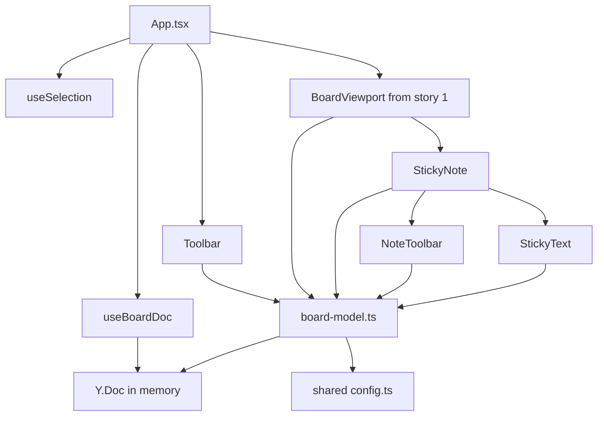
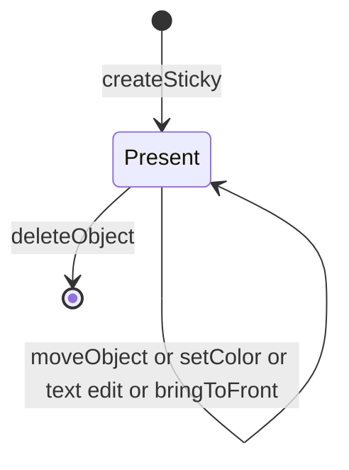
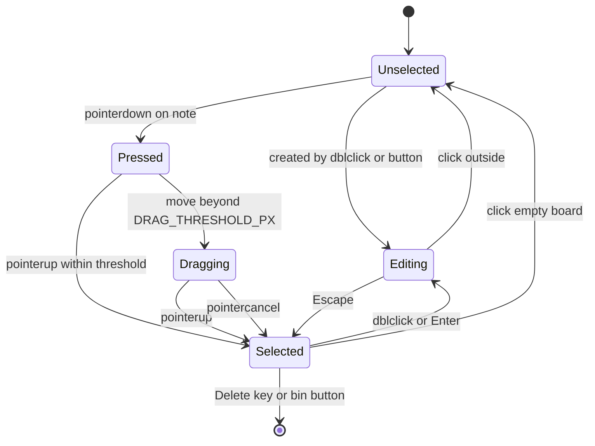
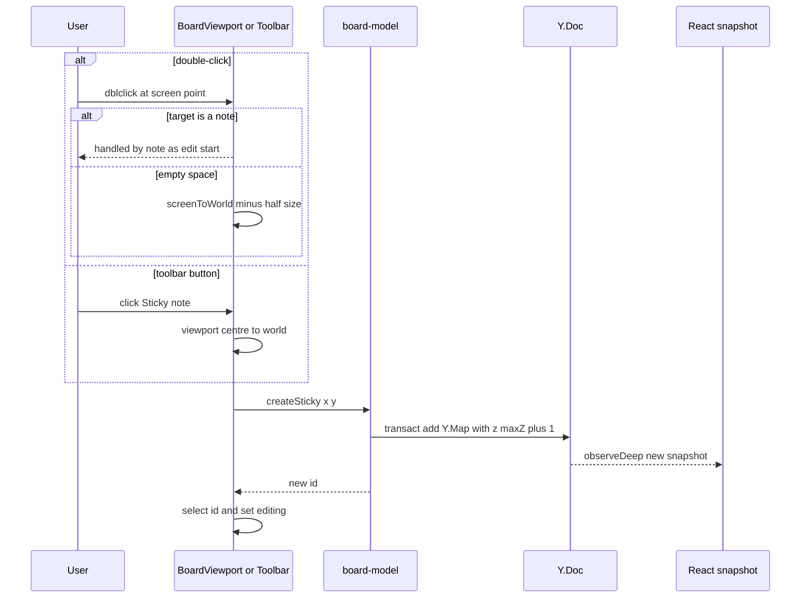
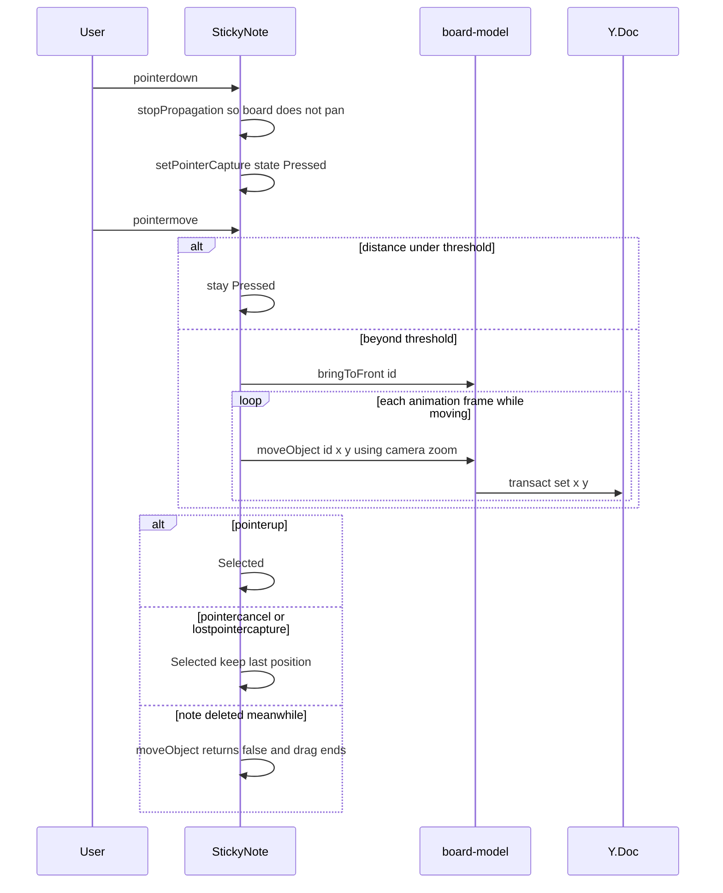
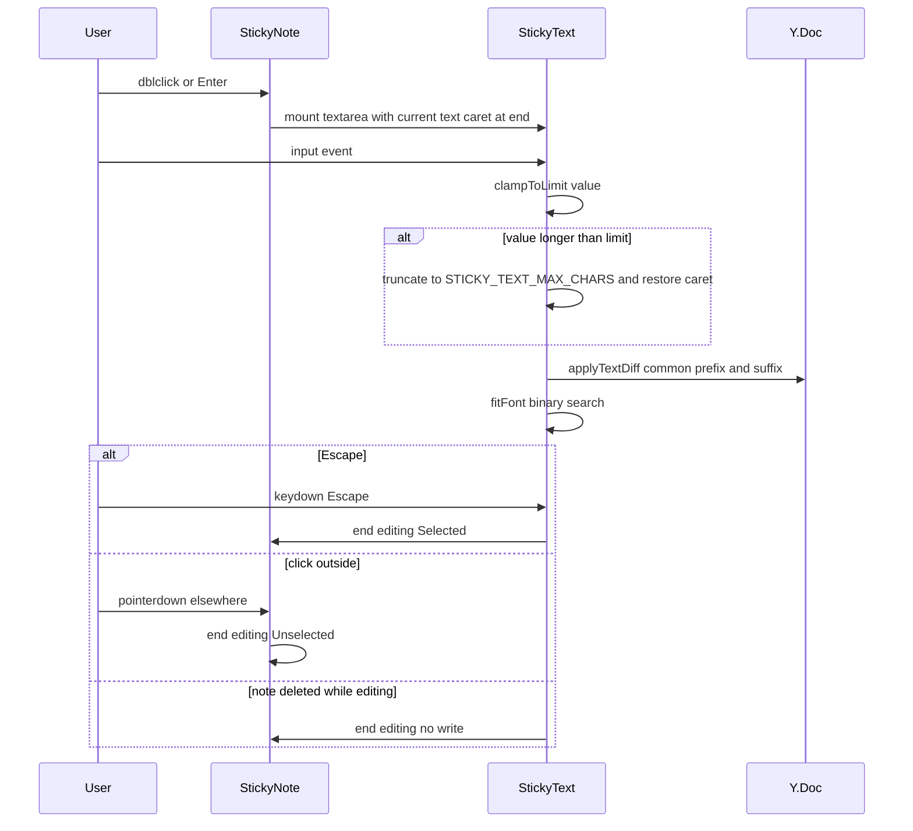
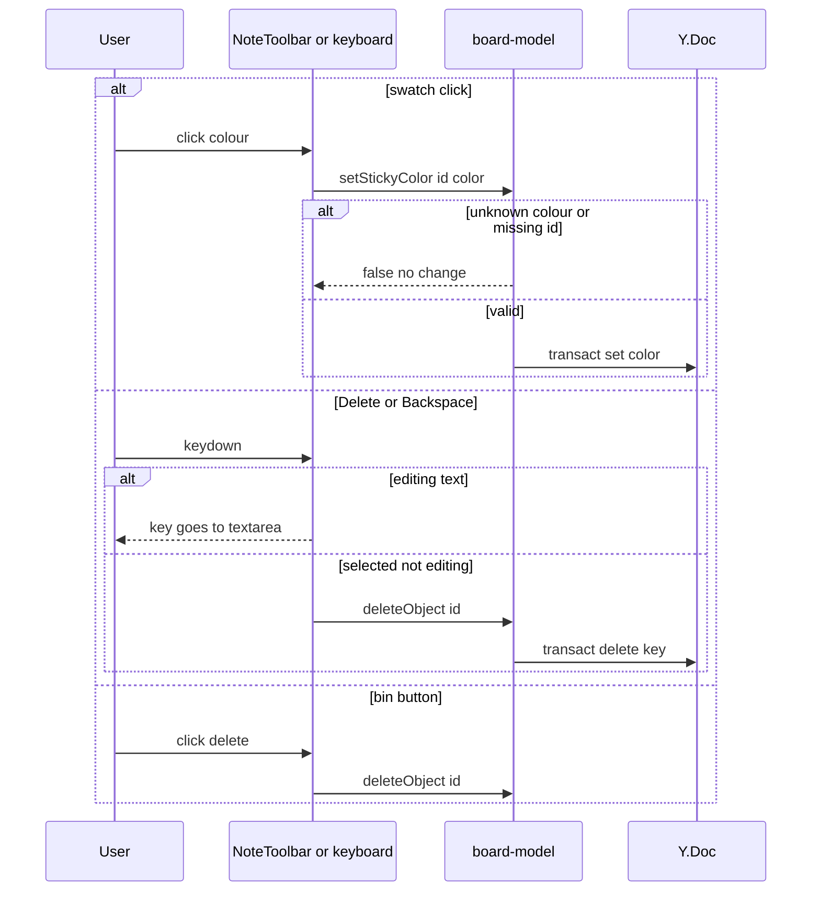

# Technical Design

Sticky notes stored in a local Yjs document (the same document stories 3-4 will sync and persist). A pure board-model module owns all mutations; React renders a snapshot via useSyncExternalStore. DOM sticky components handle select, drag, text editing (textarea diffed into Y.Text), colour and delete; text auto-fit by measurement.

## Overview

## Context
Builds on story 1 (`src/client/canvas/*`, `src/shared/config.ts`). Notes are stored in a **Yjs `Y.Doc` from day one** so that story 3 only attaches a network provider and story 4 only persists the same document. No network or storage in this story.

## Files
| Path | Change | Purpose |
|---|---|---|
| `package.json` | modified | add `yjs` dependency |
| `src/shared/config.ts` | modified | sticky settings below |
| `src/shared/board-model.ts` | added | Yjs schema + all mutations (shared by client now, by the Durable Object from story 4) |
| `src/client/board/useBoardDoc.ts` | added | owns the `Y.Doc`, exposes immutable snapshot via `useSyncExternalStore` |
| `src/client/board/useSelection.ts` | added | local selection + editing state (never stored in the doc) |
| `src/client/board/Toolbar.tsx` | added | left toolbar with Sticky note button |
| `src/client/objects/StickyNote.tsx` | added | render, select, drag, edit |
| `src/client/objects/StickyText.ts` | added | textarea→Y.Text diff, length clamp, font fit |
| `src/client/objects/NoteToolbar.tsx` | added | colour swatches + delete |
| `src/client/canvas/BoardViewport.tsx` | modified | double-click on empty space → create; empty click → clear selection; renders objects as children |
| `src/client/App.tsx` | modified | wire doc, selection, toolbars, Delete/Enter keys |

## Named settings added to `src/shared/config.ts`
```ts
export const STICKY_SIZE_WORLD = 200;
export const STICKY_TEXT_MAX_CHARS = 1000;
export const STICKY_COUNTER_THRESHOLD_CHARS = 50; // counter shows when remaining <= this
export const STICKY_FONT_MAX_PX = 24;
export const STICKY_FONT_MIN_PX = 10;
export const DRAG_THRESHOLD_PX = 3;
export const STICKY_COLORS = {
  yellow: '#FFF59D', orange: '#FFCC80', green: '#C5E1A5',
  blue: '#90CAF9', pink: '#F48FB1', violet: '#CE93D8',
} as const;
export type StickyColor = keyof typeof STICKY_COLORS;
export const DEFAULT_STICKY_COLOR: StickyColor = 'yellow';
```

## Document schema (the future persisted and wire contract)
```
Y.Doc
  meta: Y.Map { schemaVersion: 1 }
  objects: Y.Map<string /* id */, Y.Map>
    <id>: Y.Map {
      type: 'sticky'
      x: number, y: number        // top-left, world units
      color: StickyColor
      text: Y.Text
      z: number                   // stacking; higher is on top
      createdAt: number           // epoch ms
    }
```
- Ids: `crypto.randomUUID()`.
- Stacking: `z = maxZ + 1`; render order sorts by `(z, id)` so concurrent equal `z` values (possible once story 3 syncs) still give every client the same order.
- Unknown `type` values are skipped by the renderer (forward compatibility for stories 9–12).

## Structure diagram


## State diagrams
Note lifecycle in the document (in memory only in this story; persisted from story 4):

Per-client interaction state for one note (never stored in the document):


## Sequence: create note


## Sequence: select and drag


## Sequence: edit text


## Sequence: colour and delete


## Test Strategy

## Test scopes and boundaries
| Capability | Levels | Boundary | Why sufficient |
|---|---|---|---|
| board.model | unit | Inner logic against a **real** `Y.Doc` | All mutation rules live here; Yjs is deterministic in-process |
| sticky.interaction | ui-component, e2e | Components in jsdom; real browser | jsdom proves state machine and keyboard rules; layout, pointer capture and zoom-accurate drag need a real browser |
| sticky.text | unit, ui-component, e2e | Pure diff/clamp logic; textarea behaviour; real font measurement | Font fit depends on real text layout, which jsdom lacks, so fit is e2e |
| sticky.toolbar | ui-component, e2e | Toolbar + creation wiring | Simple UI, plus e2e golden path |

No request-handling boundary exists in this story (no server code), so there are no integration tests; stated deliberately.

## Dimensions crossed
- **D1 Operation**: create (dblclick / button), select, move, edit text, colour, delete.
- **D2 Prior state of target**: no notes; note Unselected; note Selected; note Editing; note already deleted (stale id).
- **D3 Zoom**: 100%, 50%, 200% (for geometry-dependent operations only).

D2 classes are exhaustive and non-overlapping for a given note id.

## Coverage table
| TC | Capability | D1 | D2 before | D3 | Action | Expected before → after | Level |
|---|---|---|---|---|---|---|---|
| TC-01 | board.model | create | no notes | not applicable: model is zoom-independent | createSticky(0,0) | objects.size 0 → 1; type sticky, color yellow, text '', z 1 | unit |
| TC-02 | board.model | create | 2 notes z 1,2 | not applicable: zoom-independent | createSticky | new z = 3 | unit |
| TC-03 | board.model | move | Unselected | not applicable: model takes world coords | moveObject(id, 10, -20) | x,y (0,0) → (10,-20); other fields unchanged | unit |
| TC-04 | board.model | move | stale id | not applicable: zoom-independent | moveObject(missing) | returns false; doc update count unchanged | unit |
| TC-05 | board.model | colour | Selected | not applicable: zoom-independent | setStickyColor(id,'green') | yellow → green | unit |
| TC-06 | board.model | colour | Selected | not applicable: zoom-independent | setStickyColor(id,'teal') | returns false; still yellow; no update emitted | unit |
| TC-07 | board.model | delete | Selected | not applicable: zoom-independent | deleteObject(id) | size 1 → 0 | unit |
| TC-08 | board.model | delete | stale id | not applicable: zoom-independent | deleteObject(missing) | returns false; no update | unit |
| TC-09 | board.model | move | Selected z 1 of 3 | not applicable: zoom-independent | bringToFront(id) | z 1 → 4 | unit |
| TC-10 | board.model | move | top note already max z | not applicable: zoom-independent | bringToFront(id) | z unchanged; no update emitted | unit |
| TC-11 | board.model | render order | two notes equal z | not applicable: zoom-independent | sortedObjects() | ordered by id as tie-break, stable across calls | unit |
| TC-12 | board.model | read | doc with unknown type 'shape' | not applicable: zoom-independent | snapshot() | unknown object skipped, no throw | unit |
| TC-13 | sticky.text | edit | Editing text 'abc' | not applicable: pure text logic | applyTextDiff('abc'→'abXc') | Y.Text ops: single insert 'X' at 2 (not delete+insert all) | unit |
| TC-14 | sticky.text | edit | Editing empty | not applicable: pure text logic | clamp 1,200 chars | 1,000 chars kept | unit |
| TC-15 | sticky.text | edit | Editing 999 chars | not applicable: pure text logic | insert 1 char | 1,000 accepted | unit |
| TC-16 | sticky.text | edit | Editing 1,000 chars | not applicable: pure text logic | insert 1 char | rejected; still 1,000 | unit |
| TC-17 | sticky.text | edit | Editing 949 / 950 / 951 chars | not applicable: pure text logic | counterVisible() | false / true / true (remaining 51 / 50 / 49) | unit |
| TC-18 | sticky.interaction | select | Unselected | 100% | pointerdown+up no move | Selected; outline and NoteToolbar rendered | ui-component |
| TC-19 | sticky.interaction | move | Unselected | 100% | pointerdown, move 2px, up | Selected; moveObject not called (below DRAG_THRESHOLD_PX) | ui-component |
| TC-20 | sticky.interaction | move | Selected | 100% | pointerdown, move 3px | Dragging; board camera unchanged (stopPropagation) | ui-component |
| TC-21 | sticky.interaction | move | Dragging | 100% | pointercancel | Selected; position = last applied | ui-component |
| TC-22 | sticky.interaction | select | Selected | 100% | click empty board | Unselected; toolbar gone | ui-component |
| TC-23 | sticky.interaction | edit | Selected | 100% | press Enter | Editing; textarea focused caret at end | ui-component |
| TC-24 | sticky.interaction | edit | Editing | 100% | press Escape | Selected; text preserved | ui-component |
| TC-25 | sticky.interaction | delete | Selected | 100% | press Delete; press Backspace (separate runs) | note removed | ui-component |
| TC-26 | sticky.interaction | delete | Editing 'ab' | 100% | press Backspace | note present; text 'a' | ui-component |
| TC-27 | sticky.toolbar | colour | Selected | 100% | click Pink swatch | model color pink; selection kept | ui-component |
| TC-28 | sticky.toolbar | create | no notes | 100% | click Sticky note button | 1 note centred on viewport centre; Editing | ui-component |
| TC-29 | sticky.toolbar | delete | Selected | 100% | click bin button | note removed; selection cleared | ui-component |
| TC-30 | sticky.interaction | create | no notes | 100% | real dblclick at (400,300) then type 'Hello' | note centre at (400,300) ±1px; text Hello | e2e |
| TC-31 | sticky.interaction | move | Selected | 50% | real drag by (100,50) screen px | grabbed point stays under pointer ±1px; world x,y +200,+100 | e2e |
| TC-32 | sticky.interaction | move | Selected | 200% | real drag by (100,50) | world x,y +50,+25; note drawn above overlapped note | e2e |
| TC-33 | sticky.text | edit | Editing | 100% | type one word; then paste 1,000 chars | computed font-size 24px; then ≥ 10px and scrollHeight clipped with fade class present | e2e |
| TC-34 | sticky.toolbar | create | panned far away | 100% | click Sticky note | note visible at centre of screen | e2e |

## Boundary values
- Text length: 0, 1, 949/950/951 (counter threshold), 999, 1,000, 1,001, 1,200 pasted (TC-14..17, TC-33).
- Drag distance: 2px (below threshold) and exactly 3px (at threshold) (TC-19, TC-20).
- Zoom for drag geometry: 50%, 100%, 200% (TC-31, TC-32).
- Number of notes: 0, 1, 3, equal z (TC-01, TC-02, TC-09, TC-11).
- Font fit: shortest (one word → max 24px) and longest (1,000 chars → min 10px with overflow) (TC-33).

## Negative scenarios
| TC | Scenario | Expected | Level |
|---|---|---|---|
| TC-04 / TC-08 | mutate a stale id | returns false; no Yjs update emitted | unit |
| TC-06 | invalid colour | rejected; no update | unit |
| TC-10 | bringToFront on topmost | no update emitted (avoids pointless sync traffic in story 3) | unit |
| TC-16 | exceed text limit | extra characters not added | unit |
| TC-20 | drag on note | camera unchanged | ui-component |
| TC-26 | Backspace while editing | note not deleted | ui-component |
| TC-35 | dblclick on an existing note | no new note created; edits existing | ui-component |
| TC-36 | Enter while nothing selected | no note created, nothing happens | ui-component |

## Error paths
Contract errors: stale id (TC-04, TC-08, plus drag/edit on deleted note TC-37), invalid colour (TC-06), text over limit (TC-16).
| TC | Scenario | Expected | Level |
|---|---|---|---|
| TC-37 | note deleted (via model call in test) while Dragging or Editing | interaction ends; no exception; no re-creation of the note | ui-component |

## Mock vs real boundaries
| Dependency | Mocked? | Reason |
|---|---|---|
| Yjs `Y.Doc` | Real in all levels | It is the store under test; in-process and deterministic, so mocking would hide real merge/observe behaviour |
| DOM layout / fonts | jsdom (no layout) in component tests; real in e2e | Font fit and pixel-accurate drag verified only in e2e |
| Network / storage | None exist in this story | Added in stories 3 and 4 |

## E2E workflows
1. **Brainstorm golden path** (TC-30 → TC-31 → colour → delete): create by double-click, type, move at 50% zoom, recolour, delete. Asserts the board ends with the expected notes, colours and positions.
2. **Create while far away** (TC-34): toolbar creation is always visible.
3. **Long text** (TC-33): text fits then clips at minimum size.

## Fixtures
- Realistic note texts: short ("Faster onboarding"), multi-line retro item (3 lines, ~120 chars), and a 1,000 character paragraph of English prose (not repeated single characters, which lay out unrealistically).
- Board fixture of 500 notes in a 25×20 grid with mixed colours and realistic texts for the manual performance run.

## Not covered
- Performance with 500 notes: scripted manual run, not a CI gate.
- IME/composition input (e.g. Japanese): textarea diff runs on `input` after composition end; manual check only.
- Concurrent edits by multiple users: story 3.
- Persistence: story 4.

## Board document model

> Anchor: `board.model`

## Contract
```ts
// src/shared/board-model.ts
export const LOCAL_ORIGIN: unique symbol;
export interface StickySnapshot { id: string; type: 'sticky'; x: number; y: number; color: StickyColor; text: string; z: number; createdAt: number }
export function initDoc(doc: Y.Doc): void;                       // sets meta.schemaVersion if absent
export function createSticky(doc: Y.Doc, at: { x: number; y: number }, color?: StickyColor): string;
export function moveObject(doc: Y.Doc, id: string, x: number, y: number): boolean;
export function bringToFront(doc: Y.Doc, id: string): boolean;
export function setStickyColor(doc: Y.Doc, id: string, color: string): boolean;
export function deleteObject(doc: Y.Doc, id: string): boolean;
export function getStickyText(doc: Y.Doc, id: string): Y.Text | undefined;
export function snapshot(doc: Y.Doc): readonly StickySnapshot[]; // sorted by (z, id), unknown types skipped
```
- **Inputs**: doc, ids, world coordinates (finite numbers), colour names.
- **Outputs**: new id, or `true` when a change was applied / `false` when rejected or a no-op.
- **Errors**: stale id, unknown colour, non-finite coordinates → `false`, no transaction. Never throws for user-driven input.
- **Side effects**: one `doc.transact(fn, LOCAL_ORIGIN)` per successful call (origin used by story 8 undo and story 3 to avoid echo).

## Implementation
- The module is framework-free so the Durable Object (story 4) can import it for validation/migration.
- `snapshot` is memoised by `useBoardDoc` and recomputed on `objects.observeDeep`.
- Coordinates are the note's top-left; creation subtracts `STICKY_SIZE_WORLD / 2` so the note is centred on the click.
- Low reversibility: this schema becomes the persisted format in story 4 and the wire format in story 3, hence `meta.schemaVersion`.

## Tests
Unit (Vitest, real Y.Doc): TC-01 to TC-12 in `tests/unit/board-model.test.ts`; each mutation test also asserts the number of `update` events emitted (1 for success, 0 for rejection).

## Sticky note interaction

> Anchor: `sticky.interaction`

## Contract
```tsx
// src/client/objects/StickyNote.tsx
export function StickyNote(props: {
  note: StickySnapshot; doc: Y.Doc; zoom: number;
  selected: boolean; editing: boolean;
  onSelect(id: string): void; onStartEdit(id: string): void; onEndEdit(next: 'selected' | 'unselected'): void;
}): JSX.Element;
// src/client/board/useSelection.ts
export function useSelection(): { selectedId: string | null; editingId: string | null; select(id: string | null): void; startEdit(id: string): void; endEdit(next: 'selected' | 'unselected'): void };
```
- **Inputs**: pointer, dblclick and keyboard events on a note; window keydown for Enter/Delete/Backspace in `App.tsx`.
- **Outputs**: absolutely positioned `div[role="group"][aria-label="Sticky note"]` at world `(x,y)` inside the world layer, width/height `STICKY_SIZE_WORLD`, background from `STICKY_COLORS`, `data-selected` attribute, blue outline when selected.
- **Errors**: target note disappears mid-interaction (stale id) → interaction ends silently (TC-37).
- **Side effects**: calls board-model mutations; `stopPropagation` on pointerdown/dblclick so the viewport neither pans nor creates a note.

## Implementation
- Drag delta converted to world units by dividing by camera zoom; updates throttled with `requestAnimationFrame`; `bringToFront` once when the drag starts.
- `BoardViewport` handles `dblclick` only when `event.target` is the viewport/grid, and clears selection on empty-space pointerup without drag.
- Selection and editing are **local component state**, never written to the Y.Doc (other users must not see my selection as data; presence of selection is a later story).
- Keyboard handler ignores Delete/Backspace when `editingId !== null` or when focus is in any input.

## Tests
ui-component: TC-18 to TC-26, TC-35 to TC-37 in `tests/component/StickyNote.test.tsx`.
e2e: TC-30 to TC-32 in `tests/e2e/sticky-notes.spec.ts`.

## Sticky note text editing and fit

> Anchor: `sticky.text`

## Contract
```ts
// src/client/objects/StickyText.ts
export function clampToLimit(next: string, max?: number): string;           // default STICKY_TEXT_MAX_CHARS
export function applyTextDiff(ytext: Y.Text, next: string, origin: unknown): void; // minimal insert/delete
export function counterVisible(length: number): boolean;                      // remaining <= STICKY_COUNTER_THRESHOLD_CHARS
export function fitFontSize(el: HTMLElement, box: number): { fontPx: number; overflow: boolean };
// src/client/objects/StickyTextEditor.tsx
export function StickyTextEditor(props: { ytext: Y.Text; fontPx: number; onEnd(next: 'selected' | 'unselected'): void }): JSX.Element;
```
- **Inputs**: textarea value after each `input` event (not during IME composition); `keydown` Escape; the editor's blur caused by a pointerdown outside the note; note element for measurement.
- **Outputs**: Y.Text updated with the minimal change; font size in `[STICKY_FONT_MIN_PX, STICKY_FONT_MAX_PX]`; `overflow` flag toggles a bottom fade class.
- **Errors**: over-limit input → clamped (characters beyond the limit dropped, caret restored to end of kept text).
- **Side effects**: one Yjs transaction per input event; `onEnd` callback on Escape or outside click.

## Implementation
- **Starting editing** (`sticky.edit_start`): `StickyNote` enters Editing on `dblclick`, and `App.tsx` enters Editing for the selected note on `Enter` (when no note is already being edited and focus is not in an input). On mount, `StickyTextEditor` sets the textarea value from `ytext.toString()`, calls `focus()`, then `setSelectionRange(len, len)` so the caret is at the end of the text.
- **Ending editing** (`sticky.edit_end`): `keydown` Escape → `preventDefault`, `onEnd('selected')`. A pointerdown anywhere outside the note (captured by `BoardViewport`/other notes before focus moves) → `onEnd('unselected')`. Because every `input` event has already been written to Y.Text via `applyTextDiff`, ending editing performs **no additional write** — text typed so far is already in the document and is kept; unmounting the textarea cannot lose characters. The component also flushes any pending (uncommitted) value in `onBlur` defensively, guarded by `compositionend` for IME.
- Minimal diff (common prefix + common suffix) is required, not a full replace: a full replace would destroy concurrent typing by others once story 3 ships.
- Font fit: binary search over integer px sizes between min and max measuring `scrollHeight <= box`; run on text change and on mount, not on zoom (font is in world units so zoom scales it uniformly).
- Display mode renders `white-space: pre-wrap` text; editing mode swaps in a transparent `textarea` with the same font size and padding; Enter inside the textarea inserts a newline (not intercepted).

## Tests
unit: TC-13 to TC-17 in `tests/unit/sticky-text.test.ts`.
ui-component: TC-23 (Enter starts editing, caret at end), TC-24 (Escape ends editing, text preserved), TC-26 (Backspace edits text) in `tests/component/StickyTextEditor.test.tsx`; TC-38: type 'abc' then click outside → editor unmounted, Y.Text is 'abc', state Unselected.
e2e: TC-30 (dblclick then type), TC-33 (real font layout).

## Toolbars: create, colour, delete

> Anchor: `sticky.toolbar`

## Contract
```tsx
// src/client/board/Toolbar.tsx
export function Toolbar(props: { onCreateSticky(): void }): JSX.Element;
// src/client/objects/NoteToolbar.tsx
export function NoteToolbar(props: { color: StickyColor; onColor(c: StickyColor): void; onDelete(): void }): JSX.Element;
```
- **Inputs**: clicks.
- **Outputs**: `button[aria-label="Sticky note"]` in a fixed left toolbar; for the selected note (hidden while Dragging or Editing), six `button[aria-label="<Colour> colour"][aria-pressed]` swatches and `button[aria-label="Delete note"]`, positioned above the note in screen space so it does not scale with zoom.
- **Errors**: none beyond model rejections (ignored).
- **Side effects**: `onCreateSticky` computes the world centre of the viewport via `screenToWorld` and calls `createSticky`, then selects and starts editing the new id.

## Implementation
Toolbars stop pointer propagation so clicks never reach the viewport (which would clear selection).

## Tests
ui-component: TC-27 to TC-29. e2e: TC-34 and the golden-path workflow.

