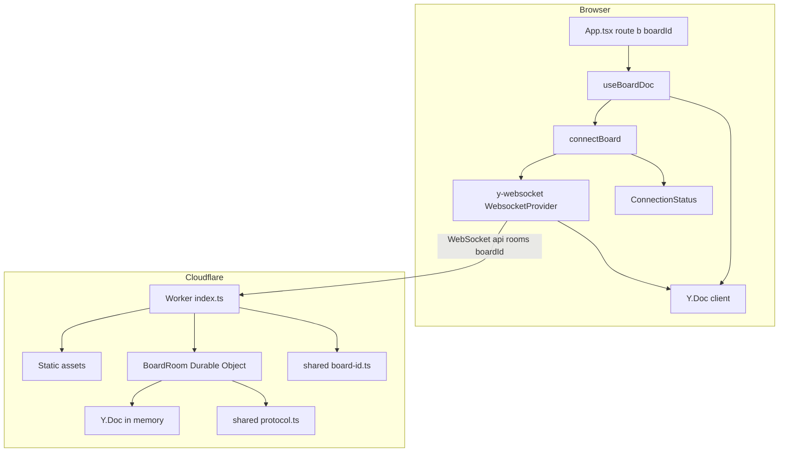
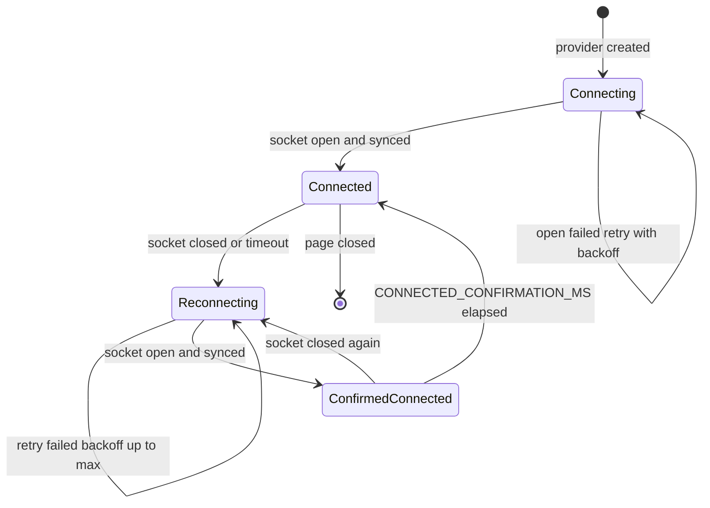
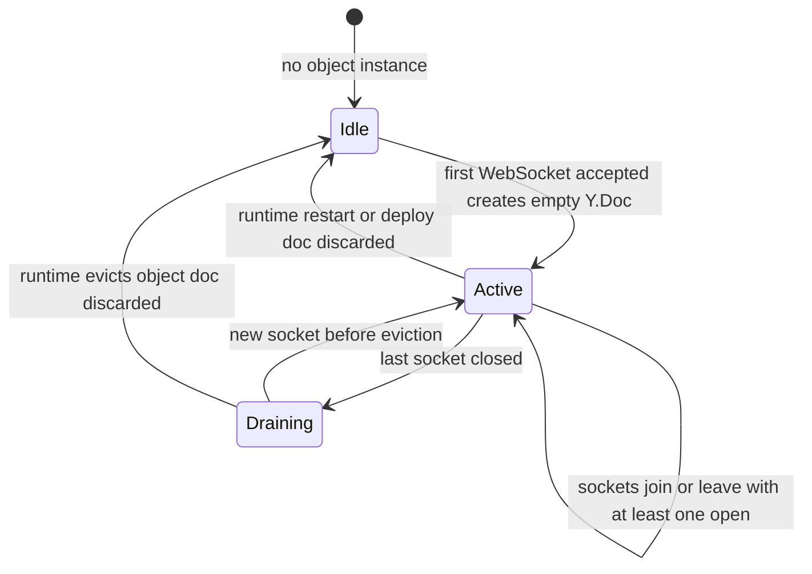
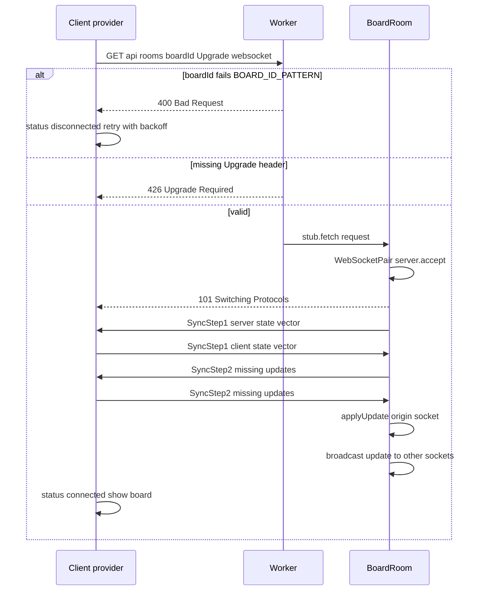
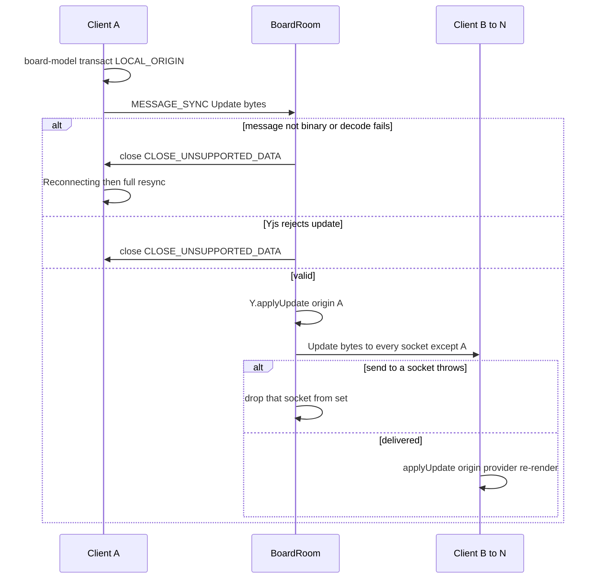
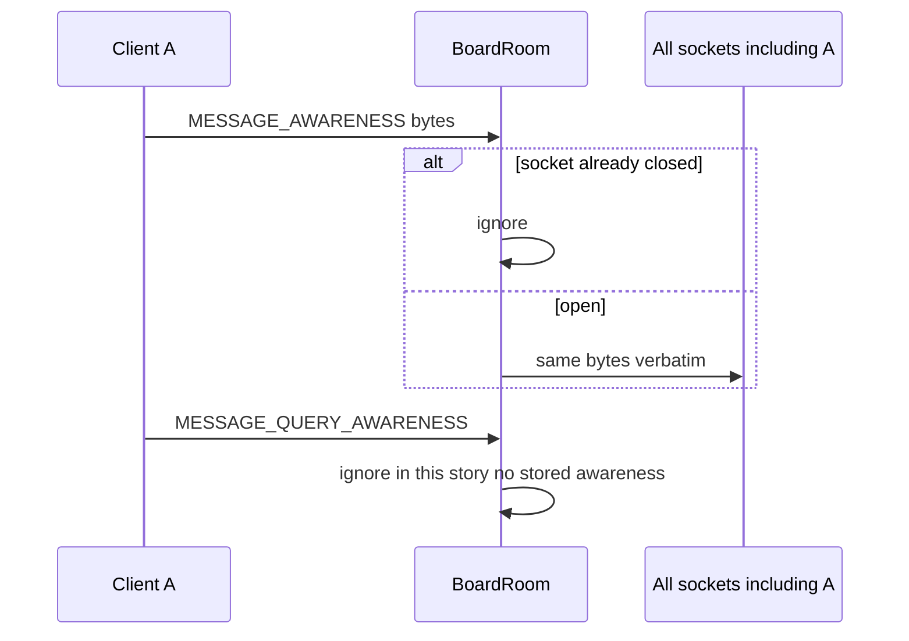
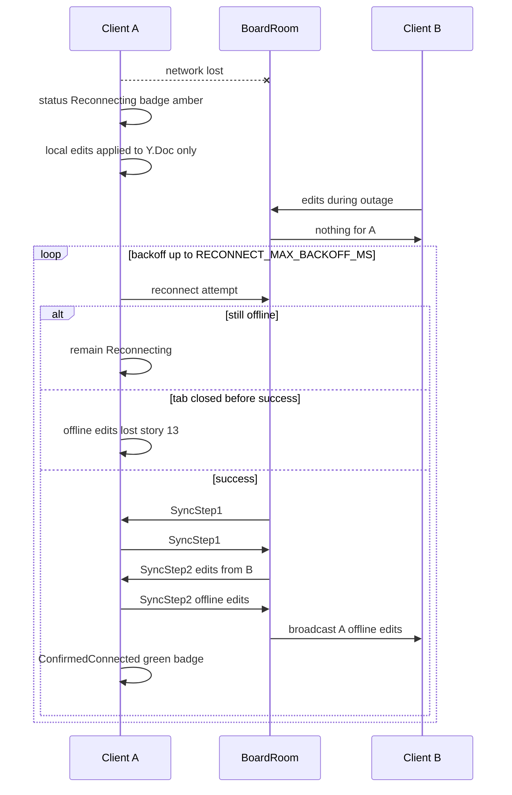
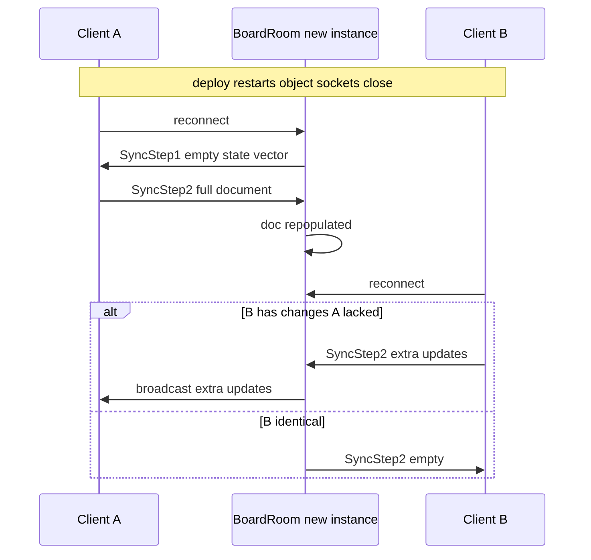

# Technical Design

One BoardRoom Durable Object per board holds the board's Y.Doc in memory and relays Yjs sync and awareness messages over WebSockets. The browser uses the y-websocket client provider against the Worker route /api/rooms/:boardId. Merging is Yjs CRDT semantics; status badge derives from provider status. Capacity is the named setting MAX_CONCURRENT_EDITORS (soft, not enforced) and drives tests.

## Overview

## Context
Builds on story 1 (skeleton, `wrangler.jsonc` serving assets) and story 2 (`src/shared/board-model.ts`, `useBoardDoc`). Story 2 already stores notes in a `Y.Doc` and uses minimal text diffs, so this story adds transport only. No persistence (story 4), no board creation/validation of existence (story 5), no presence UI (story 6).

## Files
| Path | Change | Purpose |
|---|---|---|
| `package.json` | modified | add `y-websocket` (client provider), `y-protocols`, `lib0`; dev: `@cloudflare/vitest-pool-workers`, `@playwright/test` |
| `wrangler.jsonc` | modified | `main: src/worker/index.ts`; `durable_objects.bindings: [{ name: BOARD_ROOM, class_name: BoardRoom }]`; `migrations: [{ tag: v1, new_sqlite_classes: [BoardRoom] }]` (SQLite-backed now so story 4 needs no class migration); `assets.not_found_handling: single-page-application` |
| `src/worker/index.ts` | added | Worker entry: route `/api/rooms/:boardId` to the room, everything else to static assets |
| `src/worker/board-room.ts` | added | `BoardRoom` Durable Object |
| `src/shared/protocol.ts` | added | message type constants, encode/decode helpers shared by tests |
| `src/shared/board-id.ts` | added | `BOARD_ID_PATTERN`, `isValidBoardId`, `newBoardId` |
| `src/shared/config.ts` | modified | settings below |
| `src/client/sync/connectBoard.ts` | added | creates `WebsocketProvider`, maps status |
| `src/client/sync/ConnectionStatus.tsx` | added | status badge |
| `src/client/board/useBoardDoc.ts` | modified | accepts `boardId`, attaches provider, destroys on unmount |
| `src/client/App.tsx` | modified | reads `/b/:boardId`; `/` redirects to `/b/<newBoardId()>` (replaced by server-side creation in story 5) |

## Named settings added
```ts
export const MAX_CONCURRENT_EDITORS = 5;            // soft capacity: design + test target, never enforced
export const LIVE_UPDATE_LATENCY_BUDGET_MS = 1000;   // PRD live.propagate
export const RECONNECT_MAX_BACKOFF_MS = 10_000;      // passed to WebsocketProvider maxBackoffTime
export const CONNECTED_CONFIRMATION_MS = 2000;       // green badge duration after reconnect
export const CATCH_UP_TEST_OUTAGE_MS = 30_000;       // PRD live.catch_up verification outage
```
```ts
// src/shared/protocol.ts — y-websocket framing
export const MESSAGE_SYNC = 0;
export const MESSAGE_AWARENESS = 1;
export const MESSAGE_QUERY_AWARENESS = 3;
export const CLOSE_UNSUPPORTED_DATA = 1003;
// src/shared/board-id.ts
export const BOARD_ID_BYTES = 16;                     // 128 bits of randomness
export const BOARD_ID_PATTERN = /^[A-Za-z0-9_-]{22}$/; // base64url of 16 bytes, no padding
```

## Why these choices
- **Merging = Yjs semantics**: concurrent text inserts are all kept (live.concurrent_text); concurrent `Y.Map` sets on `x`/`y`/`color` resolve to one deterministic winner on every replica (live.converge); deleting a note's `Y.Map` entry discards concurrent edits inside it and cannot be resurrected by them (live.delete_during_edit).
- **Non-hibernating WebSockets in this story** (`server.accept()`, not `ctx.acceptWebSocket`): the room's `Y.Doc` exists only in memory until story 4. Hibernation would evict the object while sockets stay open and silently drop the document. An open, accepted socket keeps the object alive. Story 4 switches to the hibernation API once the doc can be reloaded from storage.
- **Restart safety without storage**: on every (re)connection the server sends its own SyncStep1; each client answers with SyncStep2 containing everything the server lacks. After a restart the first reconnecting client repopulates the room (constraint: no loss while one person keeps the board open).
- **Awareness relayed, not interpreted**: the y-websocket client closes a connection that receives no message within its reconnect timeout. Clients renew awareness periodically; the room relays every awareness message to **all** sockets including the sender, so idle clients keep receiving traffic. Interpreting awareness (who is here, cleanup on leave) is story 6.
- **BroadcastChannel disabled** (`disableBc: true`): otherwise tabs in the same browser sync without the server, which would make tests pass while the server path is broken.

## Structure diagram


## State diagrams
Client connection state (per tab; nothing persisted):

Room lifecycle (in memory only in this story):

The `Active --> Idle` restart edge is why clients re-send state on reconnection.

## Sequence: connect and initial sync


## Sequence: local edit propagates


## Sequence: awareness relay


## Sequence: disconnect, offline edits, catch-up


## Sequence: room restart


## Test Strategy

## Test scopes and boundaries
| Capability | Levels | Boundary exercised | Why sufficient |
|---|---|---|---|
| sync.worker_entry | unit, integration | Pure id validation; real Worker request handling in workerd | Routing and status codes are request-handling facts, so integration hits the real `fetch` handler via `SELF.fetch` |
| sync.room | unit, integration | Pure message decode; real Durable Object with real WebSockets in workerd | Merge, broadcast and error closes only exist with a real object and sockets |
| sync.client | ui-component, e2e | Badge rendering; real browsers against `wrangler dev` | Latency, reconnection and multi-user merging must be observed through real browsers and the real server path |

## Dimensions crossed
- **D1 Operation kind**: create, move, recolour, text insert, delete.
- **D2 Concurrency**: single writer; two writers different notes; two writers same note same property; writer vs deleter.
- **D3 Participants**: 1, 2, `MAX_CONCURRENT_EDITORS`, `MAX_CONCURRENT_EDITORS + 1`.
- **D4 Connection condition**: steady; client outage with page open; room restart; malformed traffic.

Classes in each dimension are exhaustive for this story's scope and non-overlapping.

## Coverage table — unit and integration
| TC | Capability | D1 | D2 | D3 | D4 | Action | Expected before → after | Level |
|---|---|---|---|---|---|---|---|---|
| TC-01 | sync.worker_entry | not applicable: id validation precedes operations | not applicable: no concurrency in validation | 1 | steady | isValidBoardId on 22-char base64url, 21, 23, '+' char, '../x', empty | true, false, false, false, false, false | unit |
| TC-02 | sync.worker_entry | not applicable: generator only | not applicable: no concurrency | 1 | steady | newBoardId() x 10,000 | all match pattern; no duplicates | unit |
| TC-03 | sync.room | text insert | single writer | 1 | steady | decodeMessage for sync/awareness/query/unknown type 9/truncated bytes | typed result for known; error result for unknown and truncated | unit |
| TC-04 | sync.worker_entry | not applicable: routing | not applicable: routing | 1 | steady | GET /api/rooms/bad!id with Upgrade | 400; no object instance created (no stub call) | integration |
| TC-05 | sync.worker_entry | not applicable: routing | not applicable: routing | 1 | steady | GET /api/rooms/<valid> without Upgrade | 426 | integration |
| TC-06 | sync.worker_entry | not applicable: routing | not applicable: routing | 1 | steady | GET /b/<valid> | 200 index.html (SPA fallback) | integration |
| TC-07 | sync.room | create | single writer | 2 | steady | client A creates sticky via board-model | client B doc snapshot equals A snapshot; B received exactly one update message | integration |
| TC-08 | sync.room | move, recolour, text insert, delete (one test per kind) | single writer | 2 | steady | A mutates | B snapshot equals A after each; A receives no echo of its own update | integration |
| TC-09 | sync.room | text insert | same note same property | 2 | steady | A inserts 'red ' at 0 and B inserts ' blue' at end of 'green' before exchanging | both converge to 'red green blue' | integration |
| TC-10 | sync.room | move | same note same property | 2 | steady | A sets x=100, B sets x=300 concurrently | both converge to the same x (either value), equal on both | integration |
| TC-11 | sync.room | delete | writer vs deleter | 2 | steady | A deletes note while B inserts text into its Y.Text concurrently | note absent on both; B's text not present anywhere; no exception | integration |
| TC-12 | sync.room | create | two writers different notes | `MAX_CONCURRENT_EDITORS` | steady | each client performs 200 random ops (seeded) | all snapshots identical; every created note present unless deleted | integration |
| TC-13 | sync.room | create | single writer | `MAX_CONCURRENT_EDITORS + 1` | steady | open one more socket and create note | 101 accepted; note reaches all others | integration |
| TC-14 | sync.room | create | single writer | 3 (2 existing + late joiner) | steady | A and B create 20 notes, C connects | C snapshot equals A after initial sync | integration |
| TC-15 | sync.room | not applicable: malformed traffic carries no operation | not applicable | 2 | malformed | A sends text frame, truncated bytes, unknown type, invalid Yjs update (4 runs) | A closed with CLOSE_UNSUPPORTED_DATA; B still open and still receives updates; room doc unchanged | integration |
| TC-16 | sync.room | not applicable: awareness | not applicable | 2 | steady | A sends awareness bytes | A and B both receive identical bytes | integration |
| TC-17 | sync.room | create | single writer | 2 | steady | two rooms: A in room1 creates, B in room2 | B receives nothing; room2 doc empty | integration |
| TC-18 | sync.room | create | single writer | 2 | room restart simulated: all sockets closed and a new object id used as fresh instance | A reconnects to fresh room first, then B | fresh room doc equals A's doc; B converges | integration |

## Coverage table — ui-component and e2e
| TC | Capability | D1 | D2 | D3 | D4 | Action | Expected | Level |
|---|---|---|---|---|---|---|---|---|
| TC-19 | sync.client | not applicable: badge only | not applicable | 1 | status transitions | feed statuses connecting → connected | 'Connecting…' then hidden | ui-component |
| TC-20 | sync.client | not applicable: badge only | not applicable | 1 | outage | connected → disconnected → connected; advance fake timers by CONNECTED_CONFIRMATION_MS - 1 then +1 | 'Reconnecting…' → 'Connected' still visible → hidden | ui-component |
| TC-21 | sync.client | not applicable: badge only | not applicable | 1 | outage | disconnect again during confirmation | 'Reconnecting…' immediately | ui-component |
| TC-22 | sync.client | create, move, recolour, text, delete | single writer | 2 browser contexts | steady | Alex performs each op | each appears for Sam within LIVE_UPDATE_LATENCY_BUDGET_MS (expect.poll timeout) | e2e |
| TC-23 | sync.client | text insert | same note | 2 | steady | both type simultaneously via Promise.all keyboard.type | both pages show identical text containing every typed character | e2e |
| TC-24 | sync.client | move | same note | 2 | steady | both drag same note to different spots simultaneously | both pages settle to identical position within budget | e2e |
| TC-25 | sync.client | delete | writer vs deleter | 2 | steady | Sam editing note; Alex deletes | Sam's note disappears; editor gone; no error dialog or console error | e2e |
| TC-26 | sync.client | create, move | two writers different notes | `MAX_CONCURRENT_EDITORS` contexts | steady | each context creates 5 notes and moves 5 notes | every change seen by all other contexts within budget; final DOM snapshots identical | e2e |
| TC-27 | sync.client | create | single writer | 2 | outage page open | `context.setOffline(true)` for Alex for CATCH_UP_TEST_OUTAGE_MS; each adds 3 notes; back online | badge Reconnecting then Connected; both pages show 6 notes | e2e |
| TC-28 | sync.client | not applicable: selection | not applicable | 2 | steady | Alex selects and starts editing a note | Sam's page: no selection outline, no editor | e2e |
| TC-29 | sync.client | not applicable: idle | not applicable | 2 | steady idle 45 s | no user activity | badge never shows Reconnecting (awareness relay keeps connection alive) | e2e (nightly) |
| TC-30 | sync.client | create, move, text | two writers different notes | `MAX_CONCURRENT_EDITORS` | steady | capacity soak: continuous random edits for 60 s | all per-change latencies ≤ budget; final snapshots identical | e2e (nightly) |

## Boundary values
- Participants: 1, 2, `MAX_CONCURRENT_EDITORS`, `MAX_CONCURRENT_EDITORS + 1` (TC-12, TC-13, TC-26, TC-30).
- Board id length: 21 / 22 / 23 (TC-01).
- Badge timing: CONNECTED_CONFIRMATION_MS - 1 and exactly CONNECTED_CONFIRMATION_MS (TC-20).
- Latency: assertion timeout equals LIVE_UPDATE_LATENCY_BUDGET_MS exactly.
- Outage: CATCH_UP_TEST_OUTAGE_MS (TC-27); zero-length outage covered by TC-18 reconnect.

## Negative scenarios
| TC | Must not happen | Level |
|---|---|---|
| TC-04 | invalid id must not create an object instance | integration |
| TC-08 | sender must not receive an echo of its own update | integration |
| TC-11 / TC-25 | deleted note must not reappear due to concurrent edits | integration, e2e |
| TC-13 | 6th participant must not be refused | integration |
| TC-15 | malformed traffic from one client must not disconnect others or corrupt the doc | integration |
| TC-17 | updates must not cross boards | integration |
| TC-28 | selection/editing must not propagate | e2e |

## Error paths (every contract error has a case)
| Contract error | TC |
|---|---|
| invalid board id → 400 | TC-04 |
| missing Upgrade → 426 | TC-05 |
| non-binary / undecodable / unknown type / invalid Yjs update → close 1003 | TC-15 |
| send to dead socket → socket dropped from set | TC-31: close B's socket abruptly, A sends update; room does not throw and later sockets still receive (integration) |
| client network failure → Reconnecting + backoff | TC-20, TC-27 |

## Mock vs real boundaries
| Dependency | Mocked? | Reason |
|---|---|---|
| Worker + Durable Object runtime | Real (workerd via `@cloudflare/vitest-pool-workers` in integration; `wrangler dev` in e2e) | The room is the unit under test; mocking it would test nothing |
| WebSockets | Real | Framing, close codes and ordering are the behaviour under test |
| Yjs | Real | Merge semantics are the requirement |
| Network outage | Simulated with Playwright `context.setOffline` | Only practical way to cut one participant's network deterministically |
| Timers in badge component test | Fake timers | Deterministic confirmation timing |
| Real internet latency | Not simulated | See Not covered |

## E2E workflows
1. **Two-person workshop** (TC-22 → TC-23 → TC-24 → TC-25): asserts every change type propagates within budget, merges keep all text, positions converge, delete wins cleanly.
2. **Full-capacity session** (TC-26, nightly TC-30): `MAX_CONCURRENT_EDITORS` contexts, asserts latency for every change and identical end state.
3. **Flaky Wi-Fi** (TC-27): asserts status badge sequence and catch-up of edits in both directions.

## Fixtures
- Seeded random operation generator producing realistic mixes (40% text typing of real words, 30% moves, 10% creates, 10% recolours, 10% deletes), seeds logged for replay.
- Integration clients are real `Y.Doc` instances speaking `y-protocols` over `WebSocket`s obtained from `SELF.fetch` upgrade responses — the same framing as the browser provider.
- Board ids generated with `newBoardId()`, never hand-written strings (except invalid-id cases).

## Not covered
- Real-world latency over the internet: tests run locally or in CI, so they prove the system adds under 1 s of its own delay, not that every network meets it.
- True Cloudflare production restart/eviction: TC-18 simulates with a fresh instance; production behaviour verified manually after first deploy.
- More than `MAX_CONCURRENT_EDITORS + 1` participants or load testing.
- Offline edits surviving tab closure (story 13), persistence (story 4), presence semantics (story 6).

## Worker entry and routing

> Anchor: `sync.worker_entry`

## Contract
```ts
// src/worker/index.ts
export interface Env { BOARD_ROOM: DurableObjectNamespace<BoardRoom>; ASSETS: Fetcher }
export default { fetch(req: Request, env: Env): Promise<Response> };
export { BoardRoom } from './board-room';
// src/shared/board-id.ts
export function isValidBoardId(id: string): boolean;
export function newBoardId(): string; // 16 bytes crypto.getRandomValues -> base64url, 22 chars
```
- **Inputs**: HTTP requests.
- **Outputs**: `/api/rooms/:boardId` with valid id and `Upgrade: websocket` → response from `env.BOARD_ROOM.get(env.BOARD_ROOM.idFromName(boardId)).fetch(req)`; all other paths → `env.ASSETS.fetch(req)`.
- **Errors**: invalid id → `400`; valid id without upgrade header → `426`.
- **Side effects**: none besides forwarding; no participant counting (soft capacity).

## Implementation
`idFromName(boardId)` gives each board its own object, which is what isolates boards (live.isolation). There is deliberately no connection limit check (live.over_capacity).

## Tests
unit: TC-01, TC-02 (`tests/unit/board-id.test.ts`). integration: TC-04 to TC-06, TC-13, TC-17 (`tests/integration/worker.test.ts`).

## BoardRoom Durable Object

> Anchor: `sync.room`

## Contract
```ts
// src/worker/board-room.ts
import { DurableObject } from 'cloudflare:workers';
export class BoardRoom extends DurableObject<Env> {
  fetch(req: Request): Promise<Response>;   // WebSocket upgrade only
}
// src/shared/protocol.ts
export type Decoded =
  | { kind: 'sync'; payload: Uint8Array }
  | { kind: 'awareness'; payload: Uint8Array }
  | { kind: 'query-awareness' }
  | { kind: 'invalid'; reason: string };
export function decodeMessage(data: ArrayBuffer | string): Decoded;
```
- **Inputs**: WebSocket messages framed as y-websocket messages.
- **Outputs**: on accept, a SyncStep1 to the new socket; sync replies per `y-protocols/sync.readSyncMessage`; document updates broadcast to every other open socket; awareness bytes relayed verbatim to all open sockets including sender.
- **Errors**: string frame, undecodable bytes, unknown type, or `applyUpdate` throwing → `ws.close(CLOSE_UNSUPPORTED_DATA)` for that socket only; a `send` that throws → socket removed from the set.
- **Side effects**: mutates the in-memory `Y.Doc`; no storage writes in this story.

## Implementation
- Sockets held in a `Set<WebSocket>`; accepted with `server.accept()` (non-hibernating, see Overview for why).
- `doc.on('update', (update, origin) => broadcast(update, except = origin))` where `origin` is the socket passed to `readSyncMessage`.
- `close` / `error` listeners remove the socket. No awareness state is kept.
- The doc is created lazily on first accept and never discarded explicitly; the runtime discards it when the object is evicted.

## Tests
unit: TC-03 (`tests/unit/protocol.test.ts`). integration: TC-07 to TC-18, TC-31 (`tests/integration/board-room.test.ts`).

## Client connection and status

> Anchor: `sync.client`

## Contract
```ts
// src/client/sync/connectBoard.ts
export type ConnectionState = 'connecting' | 'connected' | 'reconnecting' | 'confirmed';
export function connectBoard(doc: Y.Doc, boardId: string, onState: (s: ConnectionState) => void): { destroy(): void };
// src/client/sync/ConnectionStatus.tsx
export function ConnectionStatus(props: { state: ConnectionState }): JSX.Element | null;
```
- **Inputs**: `Y.Doc` from `useBoardDoc`, `boardId` from `/b/:boardId`.
- **Outputs**: `new WebsocketProvider(`${wsOrigin}/api/rooms`, boardId, doc, { maxBackoffTime: RECONNECT_MAX_BACKOFF_MS, disableBc: true })`; state mapping: provider `connecting` before first sync → `connecting`; `connected` + `sync(true)` → `connected`; `disconnected` after having connected → `reconnecting`; reconnect after `reconnecting` → `confirmed` for CONNECTED_CONFIRMATION_MS then `connected`. Badge: `role="status"`, text per state, hidden for `connected`.
- **Errors**: server unreachable / 400 / close codes → provider retries with backoff; UI stays editable.
- **Side effects**: network traffic; `destroy()` on unmount or board change.

## Implementation
- Selection and editing remain local React state from story 2 and are never written to the doc (live.local_selection).
- Deleted-note handling on the receiving side reuses story 2's stale-id behaviour: when an observed deletion removes the note being edited or dragged, `useSelection` clears `editingId`/`selectedId` and the drag ends (live.delete_during_edit).
- Remote updates arrive with the provider as origin; `useBoardDoc` re-renders from `observeDeep` exactly as for local changes.

## Tests
ui-component: TC-19 to TC-21 (`tests/component/ConnectionStatus.test.tsx`). e2e: TC-22 to TC-30 (`tests/e2e/live-collaboration.spec.ts`), run against `wrangler dev` with separate browser contexts per participant.

