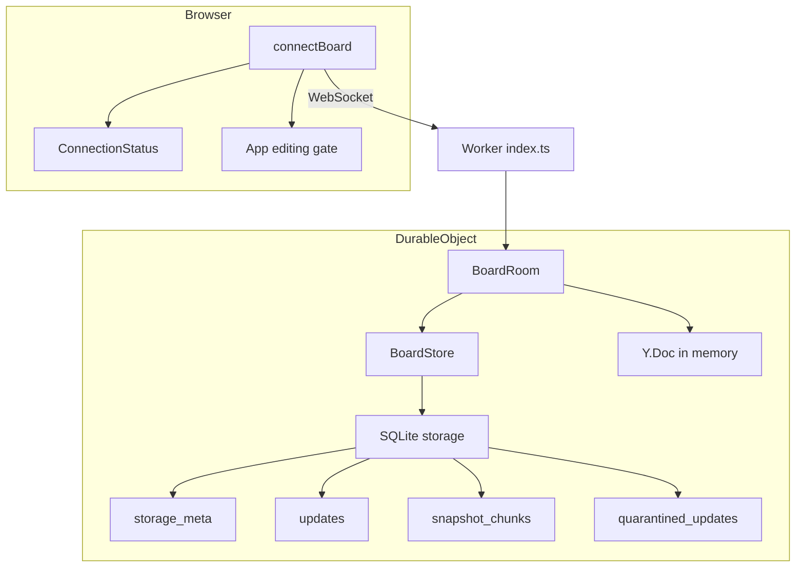
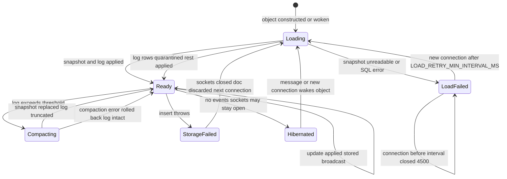
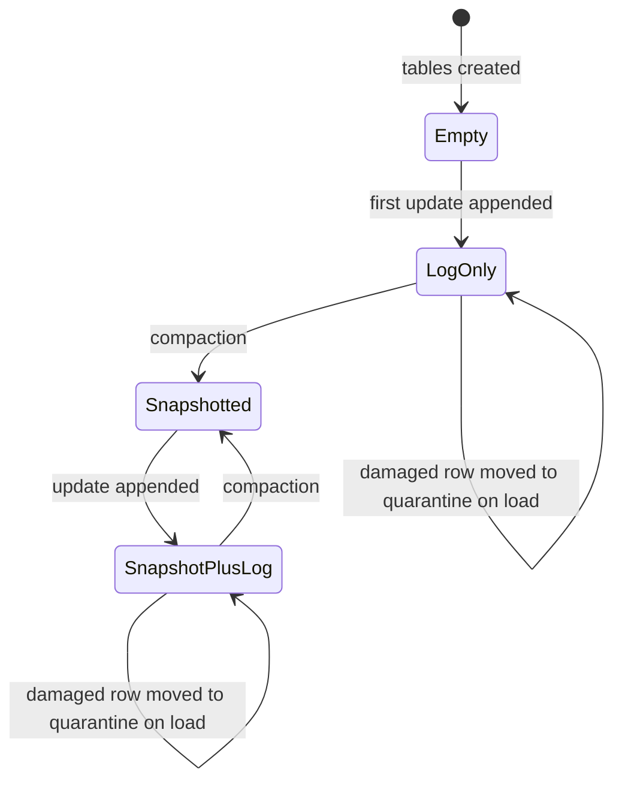
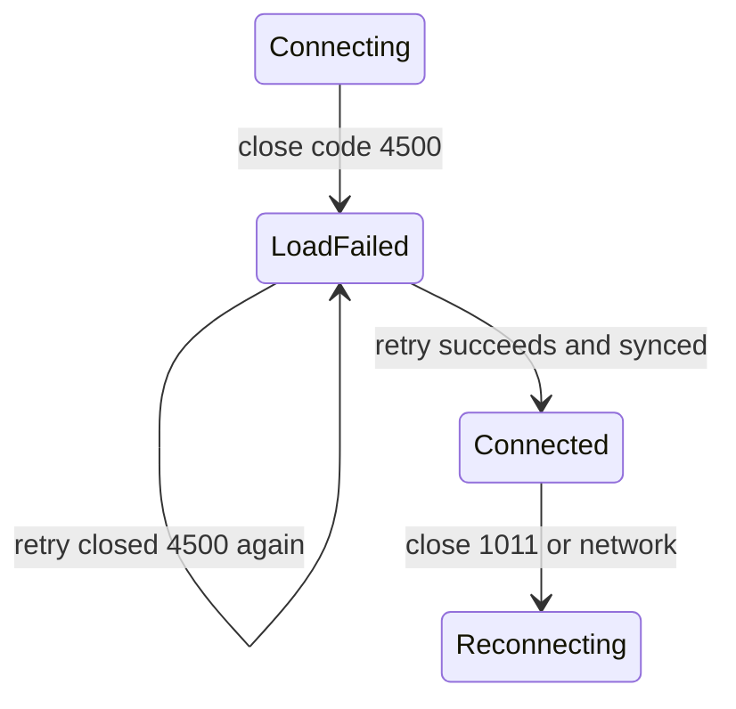
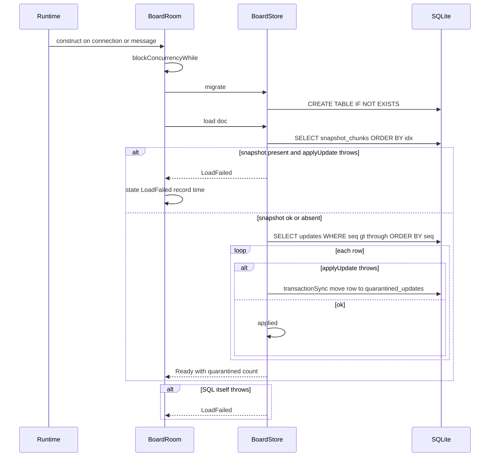
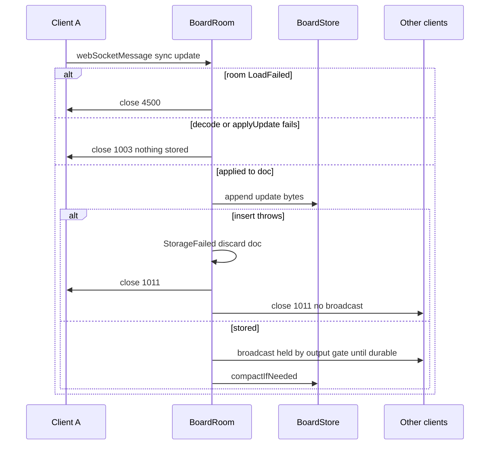
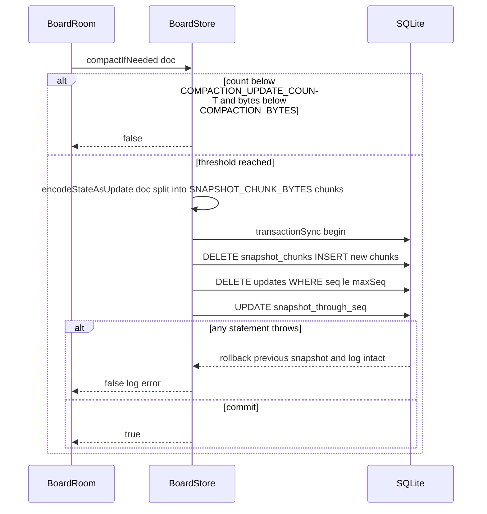
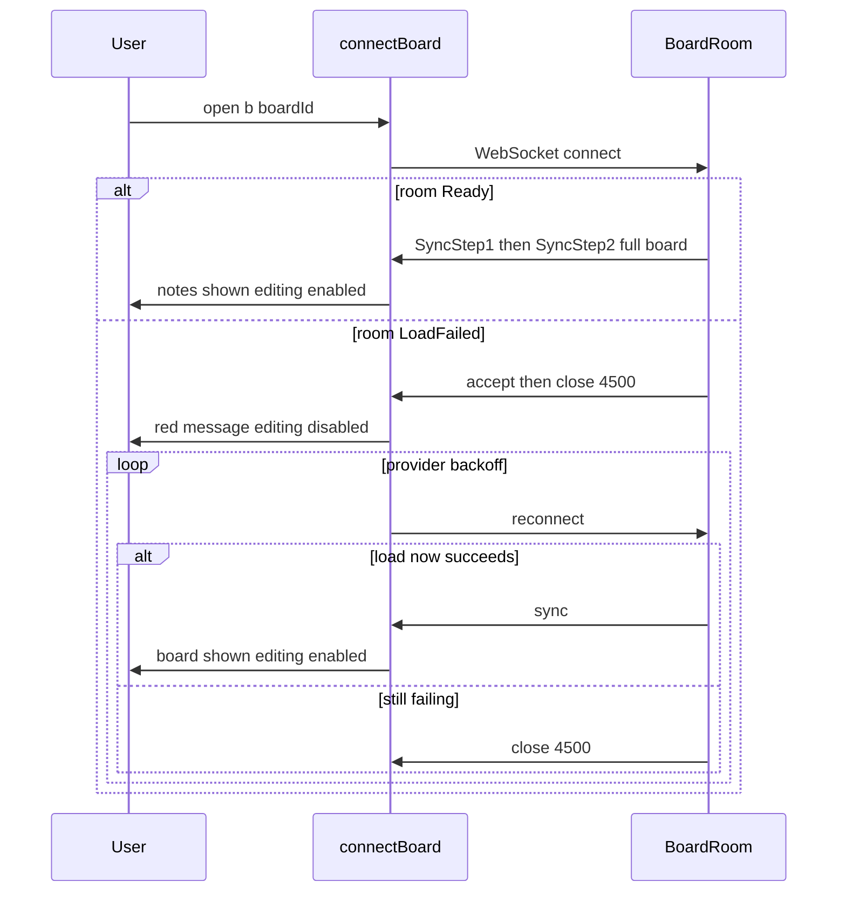

# Technical Design

BoardRoom persists every Yjs update to its SQLite-backed Durable Object storage before broadcasting it, compacts the update log into a chunked snapshot, reloads on wake, and switches to the WebSocket hibernation API so idle boards cost no compute. Damaged update rows are quarantined; an unreadable snapshot puts the room into LoadFailed, signalled to clients with a dedicated close code.

## Overview

## Context
Builds on story 3: `src/worker/board-room.ts` (in-memory `Y.Doc`, non-hibernating sockets), `src/shared/protocol.ts`, `src/client/sync/connectBoard.ts`. The class was already declared with `new_sqlite_classes` in story 3, so no Durable Object class migration is needed here.

## Files
| Path | Change | Purpose |
|---|---|---|
| `src/worker/board-store.ts` | added | SQL schema, append, load (with quarantine), compaction |
| `src/worker/board-room.ts` | modified | load on construct, write-before-broadcast, hibernation API, LoadFailed and storage-failure handling |
| `src/shared/protocol.ts` | modified | `CLOSE_BOARD_LOAD_FAILED = 4500`, `CLOSE_STORAGE_FAILURE = 1011` |
| `src/shared/config.ts` | modified | settings below |
| `src/client/sync/connectBoard.ts` | modified | map close code 4500 to `load_failed` state |
| `src/client/sync/ConnectionStatus.tsx` | modified | red load-failed message |
| `src/client/App.tsx` | modified | disable editing while `load_failed` |
| `tests/fixtures/boards.ts` | added | realistic board generators (25 and `PERSIST_TESTED_NOTES` notes) |

## Named settings added
```ts
export const COMPACTION_UPDATE_COUNT = 500;          // compact when this many log rows exist
export const COMPACTION_BYTES = 4 * 1024 * 1024;     // or when log bytes reach this
export const SNAPSHOT_CHUNK_BYTES = 512 * 1024;      // keeps every row well under the platform per-row size limit
export const LOAD_RETRY_MIN_INTERVAL_MS = 5000;      // LoadFailed room retries load at most this often
export const PERSIST_TESTED_NOTES = 2000;            // PRD persist.large_board
export const BOARD_LOAD_BUDGET_MS = 3000;            // PRD persist.large_board
export const STORAGE_SCHEMA_VERSION = 1;
```
The per-row limit of SQLite-backed Durable Objects must be re-checked against current Cloudflare documentation during implementation; `SNAPSHOT_CHUNK_BYTES` is chosen far below any documented limit known at design time.

## Storage schema (Durable Object SQLite, one database per board)
```sql
CREATE TABLE IF NOT EXISTS storage_meta (key TEXT PRIMARY KEY, value TEXT NOT NULL);
-- keys: storage_schema_version, snapshot_through_seq
CREATE TABLE IF NOT EXISTS updates (seq INTEGER PRIMARY KEY AUTOINCREMENT, data BLOB NOT NULL, bytes INTEGER NOT NULL);
CREATE TABLE IF NOT EXISTS snapshot_chunks (idx INTEGER PRIMARY KEY, data BLOB NOT NULL);
CREATE TABLE IF NOT EXISTS quarantined_updates (seq INTEGER PRIMARY KEY, data BLOB NOT NULL, error TEXT NOT NULL, quarantined_at INTEGER NOT NULL);
```
The Yjs document schema (story 2, `meta.schemaVersion`) is unchanged; `storage_schema_version` versions the tables.

## Key decisions
1. **Write before broadcast, relying on output gates.** The SQL API is synchronous; the row is inserted in the same turn in which the update was applied, and broadcasts are sent after the insert. Durable Objects hold outgoing messages until pending storage writes are confirmed, so no other client can see a change that is not durably written (persist.seen_is_saved). This platform guarantee is relied upon, not reimplemented; see Not covered.
2. **Validate by applying first.** An update is applied to the in-memory doc before it is stored, so garbage that Yjs rejects is never written. If Yjs accepts bytes that later fail to load, the loader quarantines that row (persist.partial_damage).
3. **Storage failure resets the room.** If an insert throws, the change is not broadcast, every socket is closed with 1011, and the in-memory doc is discarded. Reconnecting clients re-send what the server lacks through the story 3 SyncStep1/SyncStep2 exchange, so unsaved changes are retried from open pages (persist.save_failure).
4. **Hibernation.** Sockets are now accepted with `ctx.acceptWebSocket(server)`; handlers move to `webSocketMessage/Close/Error`; broadcast iterates `ctx.getWebSockets()`. On wake the constructor reloads the doc inside `ctx.blockConcurrencyWhile`. Idle boards consume no compute (cost constraint). Periodic awareness relays (story 3) still wake the object while people are connected.
5. **Snapshot damage is fatal, log damage is not.** An unreadable snapshot means most of the board is unreadable, so the room refuses to serve an empty doc (persist.load_failure).

## Structure diagram


## State diagrams
Room lifecycle (replaces story 3's in-memory lifecycle):

Persisted storage state:

Client connection state gains `load_failed`:


## Sequence: object wakes and loads


## Sequence: update stored then broadcast


## Sequence: compaction


## Sequence: client opens a board that fails to load


## Test Strategy

## Test scopes and boundaries
| Capability | Levels | Boundary exercised | Why sufficient |
|---|---|---|---|
| persist.board_store | unit, integration | Chunking maths in isolation; real SQLite storage inside a real Durable Object | Storage behaviour (transactions, blobs, ordering) must be exercised against the real engine |
| persist.room | unit, integration, e2e | Real object + storage in workerd; real process restart in e2e | Only a real restart of `wrangler dev` with persisted local state proves data survives a process that forgets memory |
| persist.client_status | ui-component, e2e | Badge and edit gate; real close code path | Real browser proves users see the message and cannot edit |

## Dimensions crossed
- **D1 Stored state before operation**: Empty, LogOnly, Snapshotted, SnapshotPlusLog.
- **D2 Damage**: none, one damaged log row, damaged snapshot, SQL error on read, SQL error on write.
- **D3 Trigger**: load (wake/construct), append, compaction, client open.
- **D4 Size**: 0 notes, 1 note, 25 notes, `PERSIST_TESTED_NOTES`.

D1 and D2 classes are exhaustive and non-overlapping for this story.

## Coverage table
| TC | Capability | D1 | D2 | D3 | D4 | Action | Expected before → after | Level |
|---|---|---|---|---|---|---|---|---|
| TC-01 | persist.board_store | not applicable: pure chunk function | none | compaction | not applicable: byte arrays | chunk(0 bytes), chunk(1), chunk(SNAPSHOT_CHUNK_BYTES), chunk(SNAPSHOT_CHUNK_BYTES+1), then join | 0,1,1,2 chunks; join equals input | unit |
| TC-02 | persist.board_store | not applicable: pure threshold function | none | compaction | not applicable | shouldCompact at count 499/500 and bytes COMPACTION_BYTES-1/exactly | false/true, false/true | unit |
| TC-03 | persist.board_store | Empty | none | load | 0 notes | migrate then load into fresh doc | tables exist; doc empty; storage_schema_version = 1 | integration |
| TC-04 | persist.board_store | Empty | none | append | 1 note | append update | updates rows 0 → 1; bytes column equals length | integration |
| TC-05 | persist.board_store | LogOnly | none | load | 25 notes | load into fresh doc | snapshot(doc) equals original snapshot | integration |
| TC-06 | persist.board_store | LogOnly | none | compaction | 25 notes at COMPACTION_UPDATE_COUNT rows | compactIfNeeded | updates rows 500 → 0; snapshot_chunks ≥ 1; through_seq = max seq; reload equals original | integration |
| TC-07 | persist.board_store | SnapshotPlusLog | none | load | 25 notes | 3 more updates after compaction, load | reload equals original plus 3 changes; only rows with seq > through_seq applied | integration |
| TC-08 | persist.board_store | Snapshotted | none | compaction | `PERSIST_TESTED_NOTES` | compact large doc | chunks > 1 when encoded size > SNAPSHOT_CHUNK_BYTES; reload equal | integration |
| TC-09 | persist.board_store | LogOnly | one damaged log row | load | 25 notes | overwrite row 7 data with truncated bytes, load | row 7 moved to quarantined_updates with error text; updates count -1; all other notes present | integration |
| TC-10 | persist.board_store | Snapshotted | damaged snapshot | load | 25 notes | corrupt chunk 0, load | result LoadFailed; no rows deleted or quarantined | integration |
| TC-11 | persist.board_store | SnapshotPlusLog | SQL error on write during compaction | compaction | 25 notes | inject failing statement after DELETE snapshot_chunks | transaction rolled back: previous chunks and log rows unchanged | integration |
| TC-12 | persist.room | Empty | none | append | 1 note | client A creates note; client B receives it; then close both sockets and read storage via runInDurableObject | updates row exists before B's receipt is observed; fresh doc from storage contains note | integration |
| TC-13 | persist.room | LogOnly | none | load | 25 notes | all clients disconnect; new client connects to a new room instance over the same storage | new client snapshot equals original | integration |
| TC-14 | persist.room | LogOnly | SQL error on write | append | 1 note | stub store.append to throw once; A sends update | A and B closed 1011; B never received update; after reconnect of A (which still holds change) storage contains it and B receives it | integration |
| TC-15 | persist.room | Snapshotted | damaged snapshot | client open | 25 notes | client connects | closed with 4500; no updates stored if client sends SyncStep2 before close | integration |
| TC-16 | persist.room | Snapshotted | damaged snapshot then repaired | client open | 25 notes | connect before LOAD_RETRY_MIN_INTERVAL_MS (closed 4500 without reload attempt), repair storage, connect after interval | second attempt loads and syncs | integration |
| TC-17 | persist.room | Empty | none | append | 1 note | client sends garbage update | closed 1003; updates row count unchanged | integration |
| TC-18 | persist.room | LogOnly | none | load | 25 notes | hibernation path: handlers invoked via ctx.getWebSockets after reconstruct | broadcast reaches sockets accepted before reconstruct | integration |
| TC-19 | persist.room | LogOnly | none | load | 25 notes | real `wrangler dev --persist-to` process: create notes in browser, close browser, kill and restart process, reopen | 25 notes identical (text, colour, position, stacking) | e2e |
| TC-20 | persist.room | Empty | none | append | 1 note | Alex creates note; poll until visible to Sam; within 1 s close both contexts and kill process; restart; reopen | note present | e2e |
| TC-21 | persist.room | Snapshotted | none | client open | `PERSIST_TESTED_NOTES` | seed board, open fresh context, measure navigation start → all note elements rendered | ≤ BOARD_LOAD_BUDGET_MS (local) | e2e |
| TC-22 | persist.client_status | not applicable: component | not applicable: component | client open | not applicable | render with state load_failed | red text "This board couldn't be loaded. Retrying…"; role status | ui-component |
| TC-23 | persist.client_status | not applicable: component | not applicable: component | client open | not applicable | App in load_failed: dblclick board, click Sticky note button, press Delete on a note | no model mutation calls | ui-component |
| TC-24 | persist.client_status | Snapshotted | damaged snapshot | client open | 25 notes | e2e with test-only storage corruption endpoint enabled in test build | red message visible; board not editable; after repair endpoint, board loads without reload | e2e |

## Boundary values
- Compaction thresholds: COMPACTION_UPDATE_COUNT - 1 / exactly; COMPACTION_BYTES - 1 / exactly (TC-02, TC-06).
- Chunking: 0, 1, SNAPSHOT_CHUNK_BYTES, SNAPSHOT_CHUNK_BYTES + 1 bytes (TC-01).
- Board size: 0, 1, 25, `PERSIST_TESTED_NOTES` notes (TC-03, TC-04, TC-05, TC-08, TC-21).
- Load retry: before and after LOAD_RETRY_MIN_INTERVAL_MS (TC-16).

## Negative scenarios
| TC | Must not happen | Level |
|---|---|---|
| TC-10 | damaged snapshot must not cause deletion or quarantine of anything | integration |
| TC-11 | failed compaction must not lose snapshot or log | integration |
| TC-14 | unsaved change must not be broadcast | integration |
| TC-15 | LoadFailed room must not store incoming updates or serve an empty doc | integration |
| TC-17 | rejected garbage must not be stored | integration |
| TC-23 | load_failed board must not be editable | ui-component |
| TC-25 | a never-edited board must not create storage rows just by being opened (only tables) | integration |

## Error paths (every contract error has a case)
| Contract error | TC |
|---|---|
| damaged log row → quarantine | TC-09 |
| damaged snapshot → LoadFailed | TC-10, TC-15 |
| SQL error on read → LoadFailed | TC-26: make SELECT throw via injected store; room closes 4500 (integration) |
| SQL error on insert → StorageFailed, close 1011 | TC-14 |
| compaction error → rollback | TC-11 |
| garbage update → close 1003, not stored | TC-17 |

## Mock vs real boundaries
| Dependency | Mocked? | Reason |
|---|---|---|
| Durable Object SQLite storage | Real in all integration tests (isolated per test by the pool) | It is the store under test |
| Storage failures | Injected by wrapping `BoardStore` methods to throw (TC-11, TC-14, TC-26) | Real disk failures cannot be produced on demand; the wrapper sits outside SQLite so real transaction semantics still apply |
| Damaged data | Real bytes overwritten in real tables via `runInDurableObject` | Exercises the real load path |
| Process restart | Real `wrangler dev` restart with `--persist-to` (e2e) | Only way to prove memory loss does not lose data locally |
| Output gate | Not mocked, not directly asserted | Platform guarantee; see Not covered |

## E2E workflows
1. **Overnight return** (TC-19): work, leave, restart, return; asserts identical board.
2. **Leave immediately** (TC-20): change seen by another person survives immediate exit and restart.
3. **Big board open** (TC-21): large realistic board opens within budget.
4. **Broken board** (TC-24): honest failure message, editing blocked, recovery without reload.

## Fixtures
- `tests/fixtures/boards.ts` generates boards via the real `board-model` functions (so bytes are real Yjs updates): 25-note retro board with mixed colours, multi-line texts, overlapping stacking; `PERSIST_TESTED_NOTES`-note board with realistic English phrases (10–300 chars) laid out in clusters.
- Damaged data fixtures: truncated update (last 10 bytes removed) and random bytes of the same length, both used in TC-09/TC-10.
- Test-only storage corruption/repair endpoint compiled only when `env.TEST_HOOKS === '1'` (never set in production config).

## Not covered
- Output-gate ordering (that broadcasts are held until writes are durable) is a platform guarantee; TC-12 shows the row exists by the time another client observes the change but cannot prove ordering under real disk latency.
- Production eviction/hibernation timing and real Cloudflare restarts: verified manually after first deploy.
- Storage quota exhaustion at production limits.
- Load time over real internet latency (TC-21 is local).
- Boards larger than `PERSIST_TESTED_NOTES`.

## Board storage

> Anchor: `persist.board_store`

## Contract
```ts
// src/worker/board-store.ts
export type LoadResult =
  | { ok: true; quarantined: number }
  | { ok: false; reason: 'snapshot-unreadable' | 'sql-error'; error: string };
export function chunkBytes(data: Uint8Array, size?: number): Uint8Array[];
export function joinChunks(chunks: Uint8Array[]): Uint8Array;
export function shouldCompact(count: number, bytes: number): boolean;
export class BoardStore {
  constructor(storage: DurableObjectStorage);
  migrate(): void;
  append(update: Uint8Array): void;              // throws on SQL failure
  load(doc: Y.Doc): LoadResult;
  compactIfNeeded(doc: Y.Doc): boolean;          // never throws; false on no-op or rolled-back failure
}
```
- **Inputs**: Durable Object storage (`storage.sql`, `storage.transactionSync`), Yjs update bytes, a `Y.Doc`.
- **Outputs**: rows as in the Overview schema; populated doc; load result.
- **Errors**: `append` rethrows SQL errors (caller resets room); `load` converts snapshot apply errors and SQL errors to `ok:false`; damaged log rows are quarantined and counted; `compactIfNeeded` swallows and logs errors after rollback.
- **Side effects**: SQL writes; `console.error` structured logs for quarantine and compaction failure.

## Implementation
- `migrate` runs `CREATE TABLE IF NOT EXISTS` statements and sets `storage_schema_version` if absent; it writes no update rows (TC-25).
- Row counts and byte totals are tracked in memory after load to avoid `COUNT(*)` per write.
- Compaction uses `Y.encodeStateAsUpdate(doc)` (the in-memory doc already contains snapshot + log) inside a single `transactionSync`.

## Tests
unit: TC-01, TC-02 (`tests/unit/board-store-chunks.test.ts`). integration: TC-03 to TC-11, TC-25 (`tests/integration/board-store.test.ts`).

## Persistent, hibernating board room

> Anchor: `persist.room`

## Contract
```ts
// src/worker/board-room.ts
export class BoardRoom extends DurableObject<Env> {
  constructor(ctx: DurableObjectState, env: Env);       // blockConcurrencyWhile(load)
  fetch(req: Request): Promise<Response>;               // ctx.acceptWebSocket(server)
  webSocketMessage(ws: WebSocket, msg: ArrayBuffer | string): void;
  webSocketClose(ws: WebSocket, code: number, reason: string, wasClean: boolean): void;
  webSocketError(ws: WebSocket, err: unknown): void;
}
type RoomState = 'ready' | 'load-failed' | 'storage-failed';
```
- **Inputs**: WebSocket upgrade requests and messages (story 3 framing).
- **Outputs**: as story 3, plus: every applied update is appended to storage before any broadcast; `LoadFailed` rooms accept then immediately close with `CLOSE_BOARD_LOAD_FAILED`.
- **Errors**: load failure → `load-failed` (retry on a new connection only after `LOAD_RETRY_MIN_INTERVAL_MS`); append failure → `storage-failed`: close all sockets with `CLOSE_STORAGE_FAILURE`, discard doc, next connection reloads; decode/apply failure → close 1003 (story 3).
- **Side effects**: storage writes; compaction after successful appends.

## Implementation
- The `doc.on('update')` handler used for broadcasting in story 3 becomes: `try { store.append(update) } catch { resetRoom(); return }` then broadcast to `ctx.getWebSockets()` except origin, then `store.compactIfNeeded(doc)`.
- Updates originating from load (`origin === LOAD_ORIGIN`) are neither stored nor broadcast.
- Story 3's non-hibernating `Set<WebSocket>` is removed; `ctx.getWebSockets()` is the source of truth so sockets survive hibernation.
- `webSocketMessage` checks `state` first: `load-failed` → close 4500; `storage-failed` (transient until doc reload) → close 1011.

### Large boards open within budget (persist.large_board)
The time to show a board of `PERSIST_TESTED_NOTES` notes within `BOARD_LOAD_BUDGET_MS` is spent in three places; the design bounds each:
1. **Server load on wake**: compaction keeps the replay work bounded — at most one snapshot (read as `ceil(size / SNAPSHOT_CHUNK_BYTES)` sequential chunk rows, concatenated once) plus fewer than `COMPACTION_UPDATE_COUNT` log rows. Without compaction a long-lived board would replay every keystroke and drag frame ever made, growing without limit. Yjs garbage-collects deleted content (`gc: true`, the default) so the encoded snapshot tracks current board content, not history.
2. **Transfer**: a joining client receives the whole board in one SyncStep2 message (story 3 handshake), not one message per note. The same encoded state is sent regardless of how the log is laid out.
3. **Client render**: `useBoardDoc` (story 2) computes one snapshot per `observeDeep` batch, and a single SyncStep2 applies in one transaction, so a large board triggers one React render, not 2,000.
If TC-21 exceeds the budget, the first escalation is lowering `COMPACTION_UPDATE_COUNT` (less replay) and the second is virtualising off-screen notes in the client; both are settings/client changes, not storage format changes.

## Tests
integration: TC-12 to TC-18, TC-26 (`tests/integration/board-room-persistence.test.ts`); TC-08 proves compaction of a `PERSIST_TESTED_NOTES` board produces chunked snapshots that reload equal. e2e: TC-19 to TC-21 (`tests/e2e/persistence.spec.ts`, which controls the `wrangler dev` process lifecycle; TC-21 asserts `BOARD_LOAD_BUDGET_MS`). unit: room state transition function `nextRoomState(state, event)` tested for every edge in the room state diagram (`tests/unit/room-state.test.ts`, TC-27).

## Client load-failure status

> Anchor: `persist.client_status`

## Contract
```ts
// src/client/sync/connectBoard.ts
export type ConnectionState = 'connecting' | 'connected' | 'reconnecting' | 'confirmed' | 'load_failed';
// src/client/sync/ConnectionStatus.tsx — adds load_failed rendering
// src/client/App.tsx
export function canEdit(state: ConnectionState): boolean; // false only for load_failed
```
- **Inputs**: provider `connection-close` events (close code), status and sync events.
- **Outputs**: `load_failed` when the last close code was `CLOSE_BOARD_LOAD_FAILED`; badge text "This board couldn't be loaded. Retrying…" in red; board editing handlers (create, drag, edit, colour, delete) are no-ops and the Sticky note button is disabled while `!canEdit`.
- **Errors**: close 1011 (storage failure) maps to `reconnecting`, not `load_failed`, because the board is readable and changes are retried on reconnection (persist.save_failure).
- **Side effects**: none beyond UI.

## Implementation
The provider keeps retrying with story 3's backoff; the first successful sync switches back to `connected` and re-enables editing without a page reload.

## Tests
ui-component: TC-22, TC-23. e2e: TC-24.

