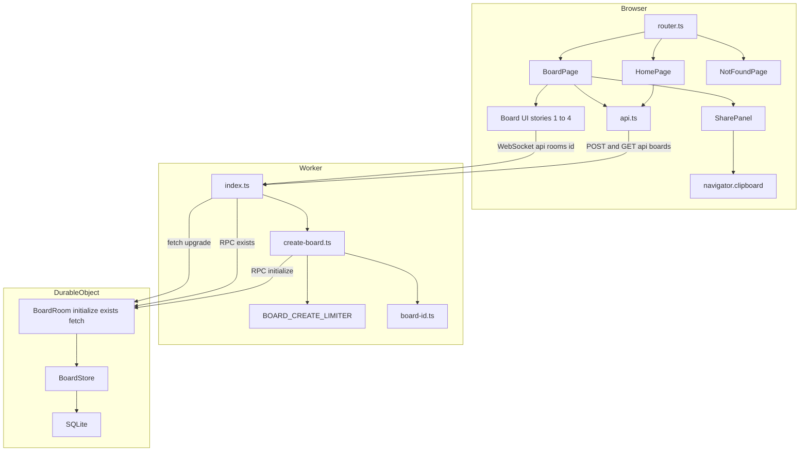
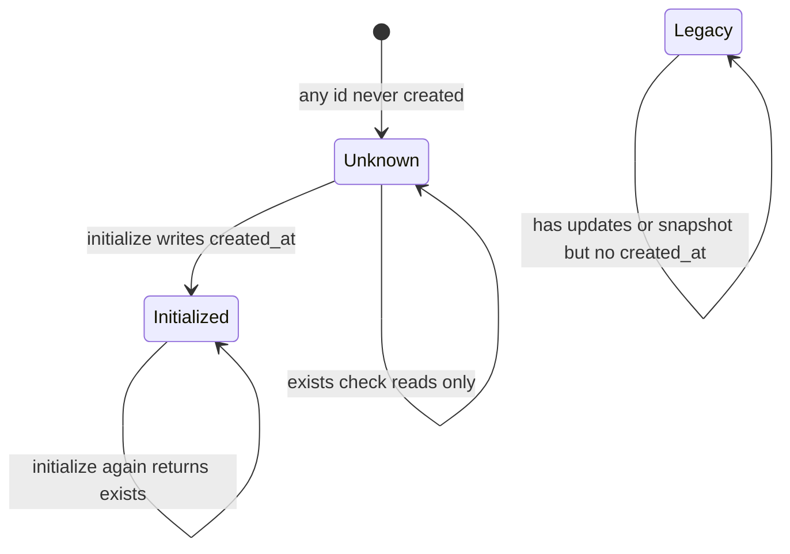
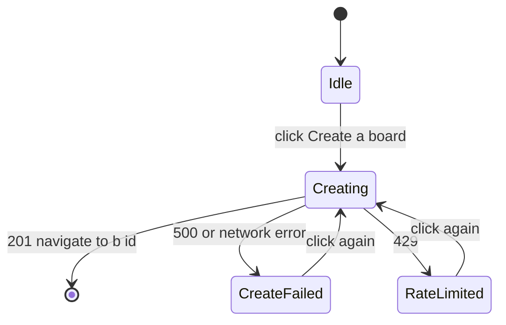
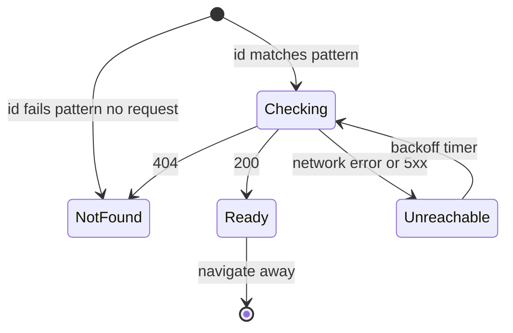
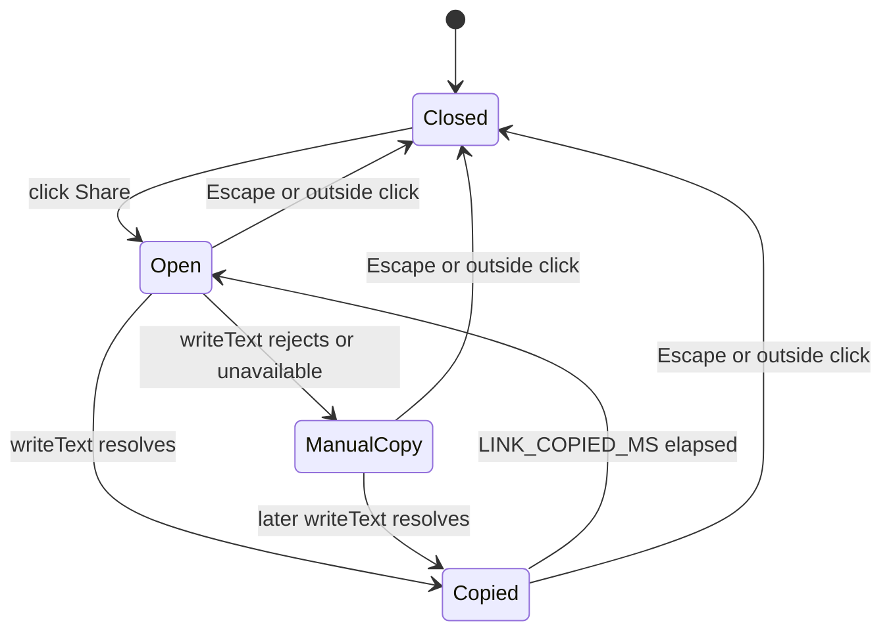
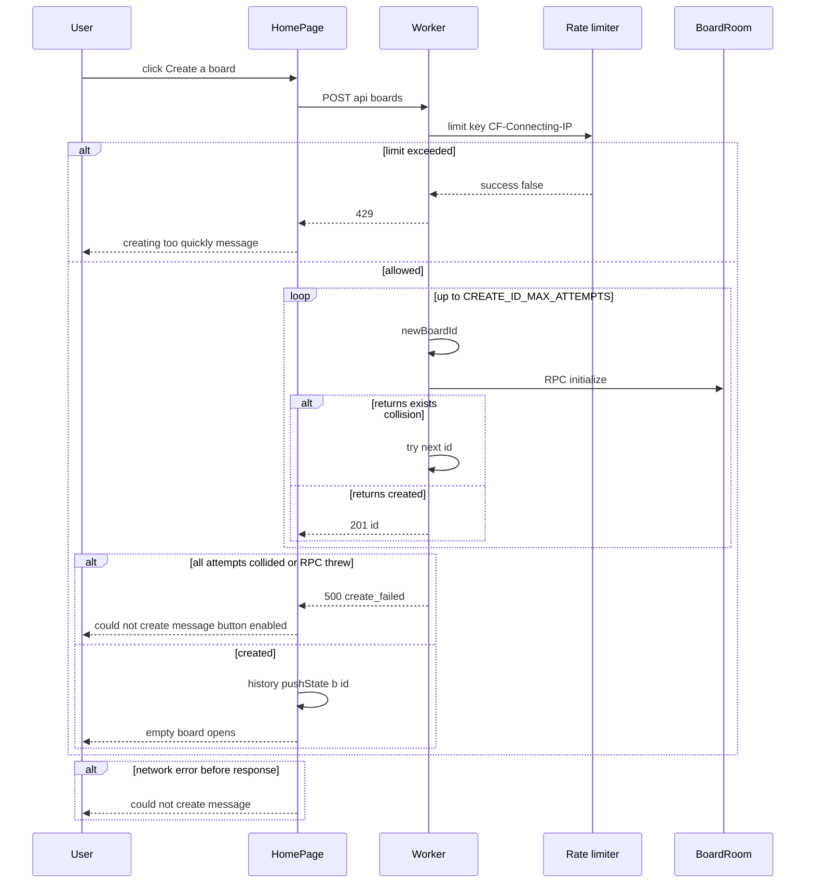
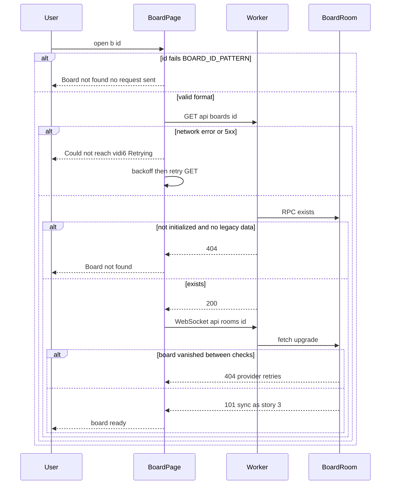
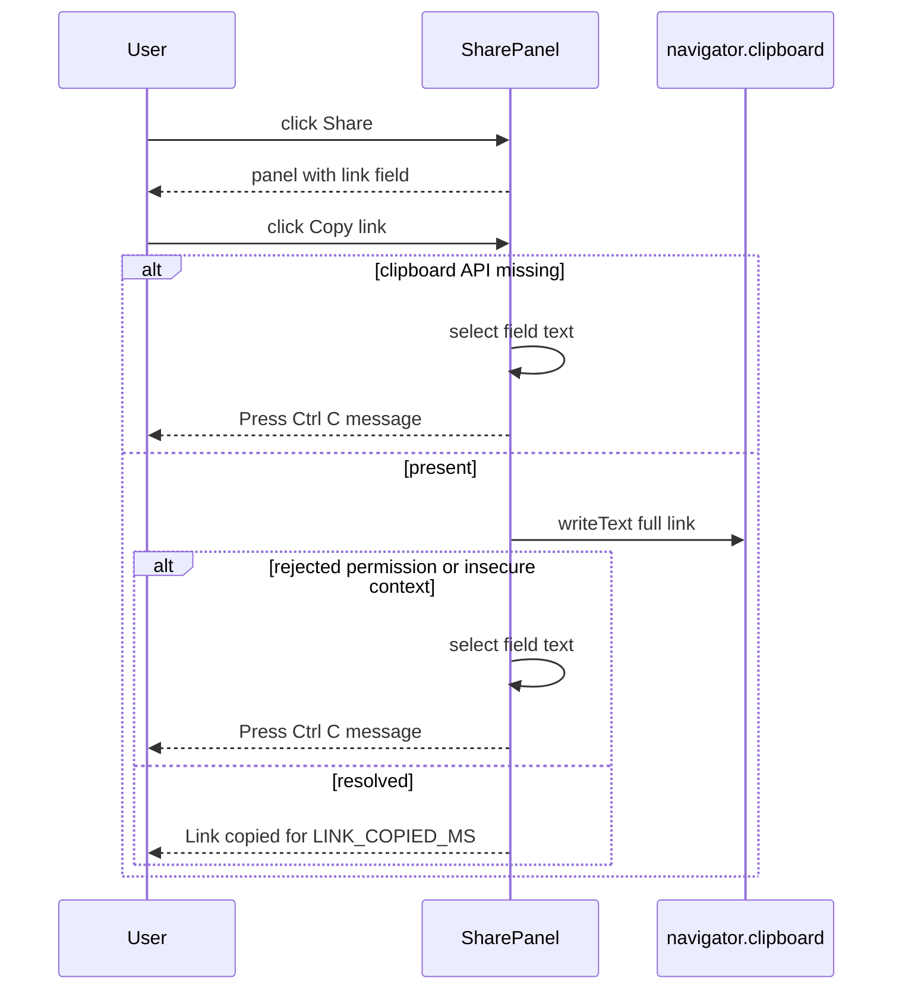

# Technical Design

Board creation moves server-side: POST /api/boards generates a 128-bit id, initialises the board's Durable Object via RPC (retrying on collision) behind a Workers rate limiter. GET /api/boards/:id and the WebSocket route reject unknown boards with 404 without writing storage; legacy boards with saved content count as existing. Client gains a tiny router with Home, Board (existence check with retry) and Board not found pages, plus a Share panel with clipboard fallback.

## Overview

## Context
Builds on story 3 (`src/worker/index.ts`, `src/shared/board-id.ts` with 16-byte base64url ids, `/` redirecting to a client-generated id) and story 4 (`src/worker/board-store.ts`, `BoardRoom` loading from SQLite). This story removes client-side board creation and makes board existence explicit.

## Files
| Path | Change | Purpose |
|---|---|---|
| `src/worker/index.ts` | modified | `POST /api/boards`, `GET /api/boards/:id`, 404 for unknown boards on `/api/rooms/:id` |
| `src/worker/create-board.ts` | added | `createBoard` with collision retries and rate limiting |
| `src/worker/board-room.ts` | modified | RPC methods `initialize()` and `exists()`; `fetch` rejects non-existent boards before accepting |
| `src/worker/board-store.ts` | modified | read-only existence query; `migrate()` no longer runs on construct, only on `initialize()` or first `append()` |
| `wrangler.jsonc` | modified | `ratelimits` binding `BOARD_CREATE_LIMITER` (limit and period mirror the named settings); `compatibility_date` at or after the date Durable Object RPC requires |
| `src/shared/config.ts` | modified | settings below |
| `src/client/router.ts` | added | minimal pathname router (`/`, `/b/:id`, anything else → not found) using History API |
| `src/client/pages/HomePage.tsx` | added | Create a board |
| `src/client/pages/BoardPage.tsx` | added | existence check → board (stories 1–4 UI) / not found / unreachable |
| `src/client/pages/NotFoundPage.tsx` | added | Board not found |
| `src/client/share/SharePanel.tsx` | added | Share button + panel + copy |
| `src/client/api.ts` | added | typed fetch wrappers for board API |
| `index.html` | modified | `<meta name="referrer" content="no-referrer">` (privacy constraint) |
| `src/client/App.tsx` | modified | renders router; story 3 redirect removed |

## Named settings added
```ts
export const BOARD_CREATE_LIMIT = 10;              // per visitor
export const BOARD_CREATE_PERIOD_SECONDS = 60;     // must match wrangler.jsonc ratelimits (test TC-03 asserts equality)
export const CREATE_ID_MAX_ATTEMPTS = 3;
export const CREATE_BUDGET_MS = 2000;              // PRD share.create
export const LINK_COPIED_MS = 2000;
export const BOARD_CHECK_RETRY_BASE_MS = 1000;     // backoff doubles up to RECONNECT_MAX_BACKOFF_MS (story 3)
```
`BOARD_ID_BYTES = 16` from story 3 already satisfies the 128-bit requirement.

## HTTP contract
| Method + path | Success | Errors |
|---|---|---|
| `POST /api/boards` | `201 {"id": string}` | `429 {"error":"rate_limited"}`; `500 {"error":"create_failed"}` |
| `GET /api/boards/:id` | `200 {"id": string}` | `404 {"error":"not_found"}` for unknown **and** malformed ids (no distinction, nothing leaked) |
| `GET /api/rooms/:id` (WebSocket) | `101` as story 3 | `404` for unknown or malformed id (story 3's 400 for malformed becomes 404); `426` without upgrade |
| other methods on `/api/boards` | — | `405` |

## Existence rule
A board exists if its storage has `storage_meta.created_at`, **or** (legacy, share.legacy_boards) it has at least one row in `updates` or `snapshot_chunks`. The check only reads; for an unknown id no tables exist and nothing is written, so probing links leaves no storage behind.

## Structure diagram


## State diagrams
Board existence (persisted):

Home page (client, not persisted):

Board page (client, not persisted):

Share panel (client, not persisted):


## Sequence: create a board


## Sequence: open a board link


## Sequence: copy link


## Test Strategy

## Test scopes and boundaries
| Capability | Levels | Boundary exercised | Why sufficient |
|---|---|---|---|
| share.board_api | unit, integration, e2e | Pure retry/id logic; real Worker request handling + real Durable Object RPC and SQLite; real browser flows | Status codes, collision handling and "no storage written" are request-handling and storage facts |
| share.pages | ui-component, e2e | Page state machines with mocked `api.ts`; real API in e2e | Components prove every UI state; e2e proves wiring to the real service |
| share.share_panel | ui-component, e2e | Clipboard success and rejection with stubbed clipboard; real clipboard in Chromium e2e | Clipboard permission behaviour varies by engine, so both paths are forced deterministically |

## Dimensions crossed
- **D1 Entry**: home create, open link, share copy, WebSocket connect.
- **D2 Board state**: unknown valid id, malformed id, initialized, legacy (data but no created_at).
- **D3 Service condition**: healthy, rate limited, id collision, RPC failure, unreachable.
- **D4 Clipboard**: allowed, rejected, missing API (share entry only).

Classes are exhaustive and non-overlapping within each dimension.

## Coverage table
| TC | Capability | D1 | D2 | D3 | D4 | Action | Expected before → after | Level |
|---|---|---|---|---|---|---|---|---|
| TC-01 | share.board_api | home create | not applicable: pure function | id collision | not applicable: server | createWithRetries(generator yields taken, taken, free) | returns third id; 3 initialize calls | unit |
| TC-02 | share.board_api | home create | not applicable: pure function | id collision | not applicable: server | generator yields taken CREATE_ID_MAX_ATTEMPTS times | returns failure after exactly CREATE_ID_MAX_ATTEMPTS attempts | unit |
| TC-03 | share.board_api | home create | not applicable: config | healthy | not applicable: server | parse wrangler.jsonc ratelimits | limit == BOARD_CREATE_LIMIT and period == BOARD_CREATE_PERIOD_SECONDS | unit |
| TC-04 | share.board_api | home create | not applicable: generator | healthy | not applicable: server | 10,000 newBoardId(); first-4-char prefix counts | all unique; all 22 chars; max prefix bucket within chi-square bound (p > 0.001) | unit |
| TC-05 | share.board_api | home create | unknown valid id | healthy | not applicable: server | POST /api/boards | 201 with id matching pattern; GET that id 200; storage created_at set | integration |
| TC-06 | share.board_api | open link | unknown valid id | healthy | not applicable: server | GET /api/boards/<fresh id> | 404; runInDurableObject shows no tables in sqlite_master | integration |
| TC-07 | share.board_api | open link | malformed id | healthy | not applicable: server | GET /api/boards/abc and /api/boards/<23 chars> | 404 each; no RPC call made | integration |
| TC-08 | share.board_api | open link | legacy | healthy | not applicable: server | seed updates row without created_at; GET | 200 | integration |
| TC-09 | share.board_api | WebSocket connect | unknown valid id | healthy | not applicable: server | upgrade /api/rooms/<fresh id> | 404; no socket accepted; no tables created | integration |
| TC-10 | share.board_api | WebSocket connect | initialized | healthy | not applicable: server | upgrade after POST | 101 and story 3 sync works | integration |
| TC-11 | share.board_api | home create | initialized | id collision | not applicable: server | inject generator returning an existing id then a fresh one | 201 with the fresh id; existing board's created_at unchanged | integration |
| TC-12 | share.board_api | home create | not applicable: no board | RPC failure | not applicable: server | inject initialize throwing | 500 create_failed | integration |
| TC-13 | share.board_api | home create | not applicable: no board | rate limited | not applicable: server | BOARD_CREATE_LIMIT + 1 POSTs from same CF-Connecting-IP within period | first BOARD_CREATE_LIMIT → 201; next → 429; a different IP still 201 | integration |
| TC-14 | share.board_api | home create | not applicable | healthy | not applicable: server | PUT /api/boards | 405 | integration |
| TC-15 | share.board_api | home create | initialized | healthy | not applicable: server | initialize() twice on same object | first created, second exists; created_at unchanged | integration |
| TC-16 | share.pages | home create | not applicable: mocked api | healthy | not applicable: page | click Create a board (api resolves id) | button shows Creating… and is disabled; then navigate to /b/id | ui-component |
| TC-17 | share.pages | home create | not applicable: mocked api | RPC failure (500) and network error (2 runs) | not applicable: page | click | message "Couldn't create a board. Please try again."; button enabled; route still / | ui-component |
| TC-18 | share.pages | home create | not applicable: mocked api | rate limited | not applicable: page | click | rate-limit message; button enabled | ui-component |
| TC-19 | share.pages | open link | malformed id | healthy | not applicable: page | render /b/bad | NotFoundPage; api.getBoard not called | ui-component |
| TC-20 | share.pages | open link | unknown valid id | healthy | not applicable: page | api returns 404 | "Opening board…" then NotFoundPage with Create a new board button | ui-component |
| TC-21 | share.pages | open link | initialized | unreachable then healthy | not applicable: page | api rejects twice then 200; fake timers advance BOARD_CHECK_RETRY_BASE_MS then 2x | "Couldn't reach vidi6. Retrying…" → board rendered; 3 calls | ui-component |
| TC-22 | share.share_panel | share copy | initialized | healthy | allowed | click Share, Copy link; advance LINK_COPIED_MS - 1 then 1 | writeText called with full https link; "Link copied" visible then reverts | ui-component |
| TC-23 | share.share_panel | share copy | initialized | healthy | rejected | writeText rejects | field text fully selected; manual-copy message | ui-component |
| TC-24 | share.share_panel | share copy | initialized | healthy | missing API | navigator.clipboard undefined | same as TC-23 | ui-component |
| TC-25 | share.share_panel | share copy | initialized | healthy | not applicable: close behaviour | open then Escape; open then outside click | panel closed both times | ui-component |
| TC-26 | share.pages | home create + open link | initialized | healthy | allowed (Chromium clipboard-read/write granted) | Maya: create board, add note, copy link; Sam: new context opens clipboard text | board opens within CREATE_BUDGET_MS of click; Sam sees note and can edit it (Maya sees Sam's edit) | e2e |
| TC-27 | share.pages | open link | unknown valid id | healthy | not applicable | open /b/<newBoardId()> never created | Board not found; click Create a new board → new empty board | e2e |
| TC-28 | share.pages | open link | initialized | unreachable then healthy | not applicable | page.route abort /api/boards/* then unroute | retry message then board opens without reload | e2e |
| TC-29 | share.share_panel | share copy | initialized | healthy | rejected (init script stubs writeText to reject) | click Copy link | manual-copy message; selection equals full link | e2e |
| TC-30 | share.pages | home create | not applicable | rate limited | not applicable | click Create BOARD_CREATE_LIMIT + 1 times (navigating back each time) | last attempt shows rate-limit message | e2e |
| TC-31 | share.pages | open link | legacy | healthy | not applicable | seed legacy board via test hook; open its link | board with seeded notes, not Board not found | e2e |

## Boundary values
- Rate limit: exactly BOARD_CREATE_LIMIT allowed, BOARD_CREATE_LIMIT + 1 rejected (TC-13, TC-30).
- Collision attempts: success on last allowed attempt, failure after CREATE_ID_MAX_ATTEMPTS (TC-01, TC-02).
- Id length: 21, 22, 23 characters (TC-07 plus story 3 TC-01).
- Copied confirmation: LINK_COPIED_MS - 1 and exactly LINK_COPIED_MS (TC-22).
- Retry: first and second backoff intervals (TC-21).

## Negative scenarios
| TC | Must not happen | Level |
|---|---|---|
| TC-06, TC-09 | probing an unknown link must not create storage or a board | integration |
| TC-07, TC-19 | malformed ids must not reach the Durable Object | integration, ui-component |
| TC-11, TC-15 | an existing board must never be re-initialised or handed out as new | integration |
| TC-13 | rate-limited requests must not create boards | integration |
| TC-17 | failed creation must not navigate away | ui-component |
| TC-32 | board page must not send the board link as a Referer to external origins: assert meta referrer no-referrer present in served index.html | integration |

## Error paths (every contract error has a case)
| Contract error | TC |
|---|---|
| 429 rate_limited | TC-13, TC-18, TC-30 |
| 500 create_failed (RPC throws / collisions exhausted) | TC-12, TC-02, TC-17 |
| 404 unknown or malformed id (HTTP and WebSocket) | TC-06, TC-07, TC-09, TC-20, TC-27 |
| 405 wrong method | TC-14 |
| clipboard rejected / missing | TC-23, TC-24, TC-29 |
| network unreachable on check | TC-21, TC-28 |

## Mock vs real boundaries
| Dependency | Mocked? | Reason |
|---|---|---|
| Durable Object RPC + SQLite | Real in integration and e2e | Existence rule and no-write guarantee depend on real storage |
| Id generator | Injected deterministic generator only in collision tests (TC-01, TC-02, TC-11) | Real 128-bit collisions cannot be produced |
| RPC failure | Injected throwing stub (TC-12) | Cannot force real RPC failure on demand |
| Rate limiter binding | Real binding if the pinned local runtime supports it; otherwise a fake implementing the same `limit({key})` interface, documented in the test file | Keeps the worker logic identical; local runtime support is verified at implementation time |
| `api.ts` in ui-component tests | Mocked | Page state machines are under test, not the network |
| Clipboard | Stubbed in ui-component and TC-29; real (granted) in TC-26 Chromium | Permission behaviour is engine-specific |
| Network outage | Playwright request routing abort (TC-28) | Deterministic |

## E2E workflows
1. **Create, share, join** (TC-26): asserts board creation within budget, correct copied link, second person joins and both edit live.
2. **Bad link recovery** (TC-27): not found page, then create a fresh board from it.
3. **Flaky service on open** (TC-28): retry message then board opens without reload.
4. **Clipboard blocked** (TC-29): manual copy fallback.
5. **Abuse guard** (TC-30): creation limit message.
6. **Pre-existing board** (TC-31): legacy board still opens.

## Fixtures
- Ids always from `newBoardId()` except explicit malformed cases (`abc`, 21 and 23 character strings, a string containing `/`).
- Legacy board fixture: real Yjs updates from `tests/fixtures/boards.ts` (story 4) written as `updates` rows with no `created_at`.
- Distinct `CF-Connecting-IP` header values per simulated visitor in integration tests.

## Not covered
- Production rate limiter accuracy and cross-location consistency (platform behaviour).
- Clipboard behaviour in real Safari and Firefox (manual check; e2e forces the fallback path deterministically instead).
- Brute-force probing of the id space: made infeasible by 128-bit ids, not tested.
- Chat-app link rendering (manual check that links survive Slack and email unchanged).

## Board creation and existence API

> Anchor: `share.board_api`

## Contract
```ts
// src/worker/create-board.ts
export interface Limiter { limit(opts: { key: string }): Promise<{ success: boolean }> }
export type CreateResult = { ok: true; id: string } | { ok: false; reason: 'rate_limited' | 'create_failed' };
export async function createWithRetries(
  generate: () => string,
  tryInitialize: (id: string) => Promise<'created' | 'exists'>,
  maxAttempts?: number,          // default CREATE_ID_MAX_ATTEMPTS
): Promise<{ ok: true; id: string } | { ok: false }>;
export async function createBoard(env: Env, visitorKey: string): Promise<CreateResult>;
// src/worker/board-room.ts (RPC, callable on the stub)
initialize(): Promise<'created' | 'exists'>;   // migrate + set created_at if absent
exists(): Promise<boolean>;                     // read-only: created_at, or any updates/snapshot rows
// src/worker/board-store.ts
existsReadOnly(): boolean;                      // queries sqlite_master first; never creates tables
```
- **Inputs**: HTTP requests per the Overview contract; `CF-Connecting-IP` as the visitor key.
- **Outputs**: responses per the HTTP contract; `created_at` (epoch ms) written once per board.
- **Errors**: limiter rejects → 429; collisions exhausted or RPC throws → 500; unknown/malformed id → 404 on GET and on WebSocket upgrade.
- **Side effects**: storage writes only in `initialize()`; none for GET or rejected WebSocket.

## Implementation
- `index.ts` validates the id with `isValidBoardId` before touching the namespace, so malformed ids never instantiate an object (TC-07).
- `BoardRoom.fetch` calls `this.store.existsReadOnly()` before accepting; unknown boards return 404, so story 3/4 rooms can no longer be created implicitly by connecting.
- Story 4 change: `BoardStore.load()` treats missing tables as an empty board without creating them; `migrate()` runs inside `initialize()` and lazily before the first `append()` (legacy boards already have tables).
- Link unguessability relies on story 3's `newBoardId()` (16 bytes from `crypto.getRandomValues`, base64url); ids are never derived from time, counters or other ids.
- The story 3 client redirect from `/` to a random id is deleted.

## Tests
unit: TC-01 to TC-04 (`tests/unit/create-board.test.ts`). integration: TC-05 to TC-15, TC-32 (`tests/integration/board-api.test.ts`). e2e: TC-26, TC-27, TC-30, TC-31.

## Home, board and not-found pages

> Anchor: `share.pages`

## Contract
```ts
// src/client/api.ts
export type CreateResponse = { kind: 'created'; id: string } | { kind: 'rate_limited' } | { kind: 'failed' };
export type CheckResponse = { kind: 'exists' } | { kind: 'not_found' } | { kind: 'unreachable' };
export function createBoardRequest(): Promise<CreateResponse>;   // network errors -> failed
export function checkBoard(id: string): Promise<CheckResponse>;  // network errors and 5xx -> unreachable
// src/client/router.ts
export type Route = { name: 'home' } | { name: 'board'; id: string } | { name: 'not_found' };
export function useRoute(): Route; export function navigate(path: string): void;
// src/client/pages/*.tsx
export function HomePage(): JSX.Element;
export function BoardPage(props: { id: string }): JSX.Element;
export function NotFoundPage(): JSX.Element;
```
- **Inputs**: pathname; API responses.
- **Outputs**: page states per the Overview state diagrams, with the exact PRD copy for each message; `BoardPage` mounts the stories 1–4 board (and its `connectBoard`) only in `Ready`.
- **Errors**: create failure / rate limit / unreachable handled as page states, never thrown to the user.
- **Side effects**: `history.pushState` on successful create; retry timers cleared on unmount.

## Implementation
- `BoardPage` checks `isValidBoardId` first (no request for malformed ids), then `checkBoard` with exponential backoff from `BOARD_CHECK_RETRY_BASE_MS` capped at `RECONNECT_MAX_BACKOFF_MS`.
- The Create a new board button on `NotFoundPage` reuses `HomePage`'s create action.
- No router library: three routes do not justify a dependency.

## Tests
ui-component: TC-16 to TC-21 (`tests/component/pages.test.tsx`). e2e: TC-26 to TC-28, TC-30, TC-31 (`tests/e2e/share.spec.ts`).

## Share panel

> Anchor: `share.share_panel`

## Contract
```tsx
// src/client/share/SharePanel.tsx
export function boardLink(origin: string, id: string): string;   // `${origin}/b/${id}`
export function SharePanel(props: { boardId: string }): JSX.Element;
```
- **Inputs**: board id, `window.location.origin`, clicks and Escape.
- **Outputs**: `button` "Share" (top-right); panel `role="dialog"` `aria-label="Share board"` containing `input[readonly]` with the full link, `button` "Copy link" (text becomes "Link copied" for `LINK_COPIED_MS`), note "Anyone with this link can view and edit this board.", and in manual-copy state the text "Press Ctrl+C (Cmd+C on Mac) to copy".
- **Errors**: `navigator.clipboard` missing or `writeText` rejecting → ManualCopy state (select entire input value, focus input).
- **Side effects**: clipboard write; focus management (focus returns to Share button on close).

## Implementation
Clicking the input selects all text (`input.select()`), satisfying the PRD field behaviour. The panel closes on Escape and outside pointerdown. Opening the copied link lands on `BoardPage`, completing share.open_link with no extra step.

## Tests
ui-component: TC-22 to TC-25 (`tests/component/SharePanel.test.tsx`). e2e: TC-26, TC-29.

