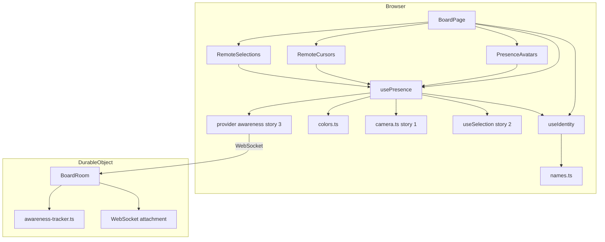
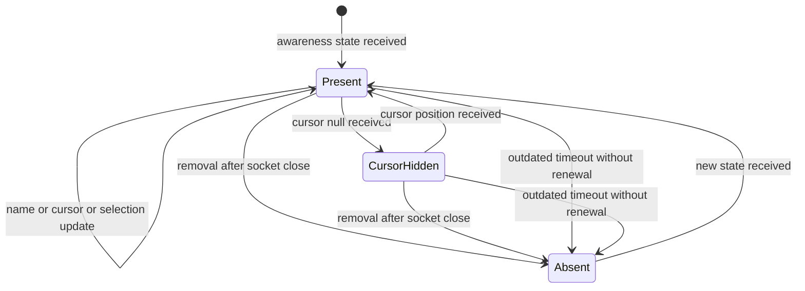
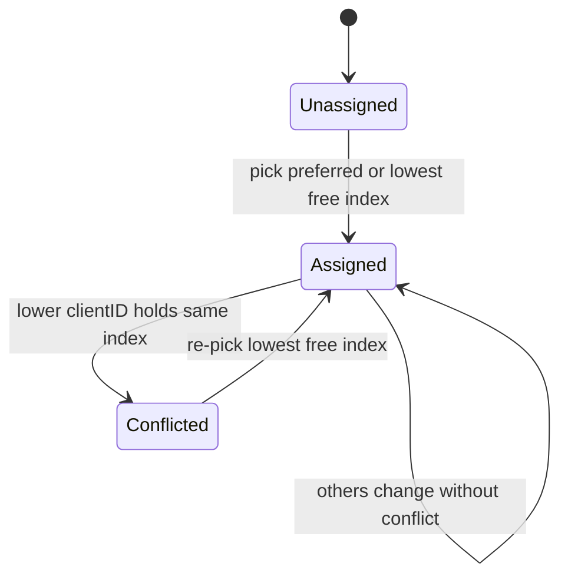
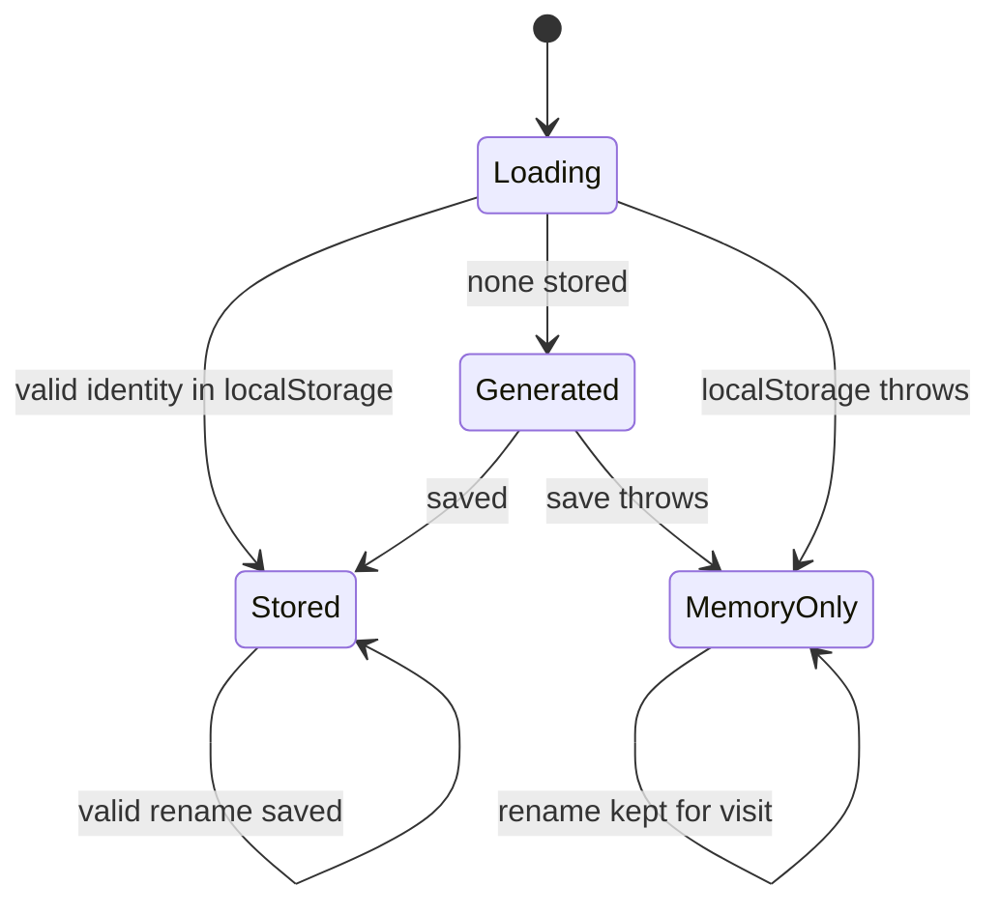
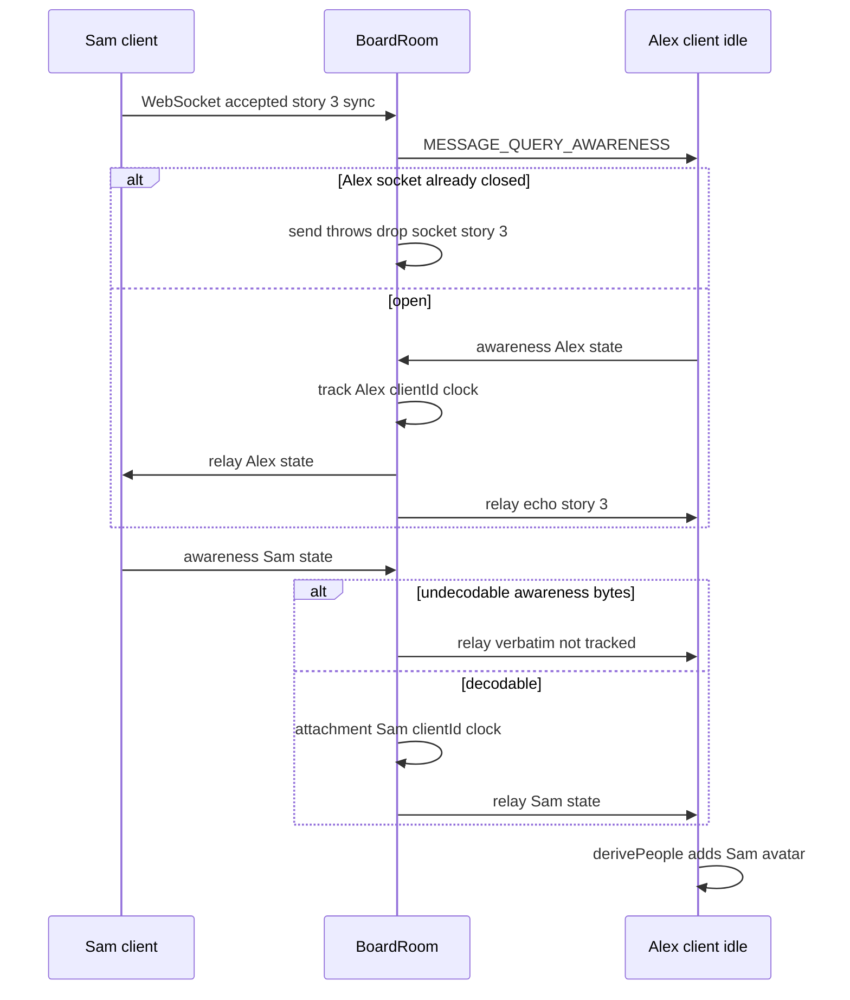
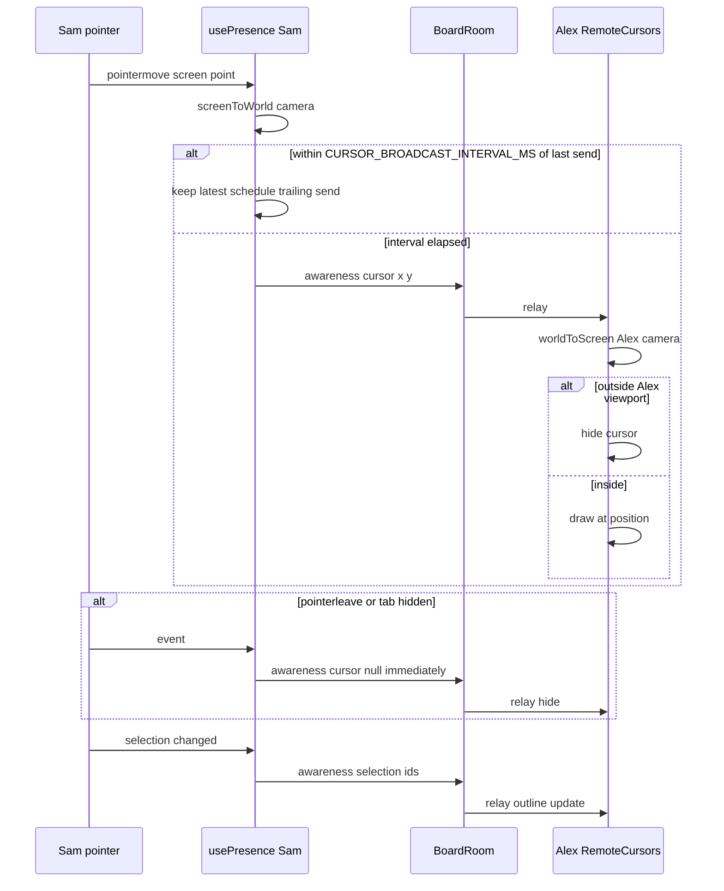
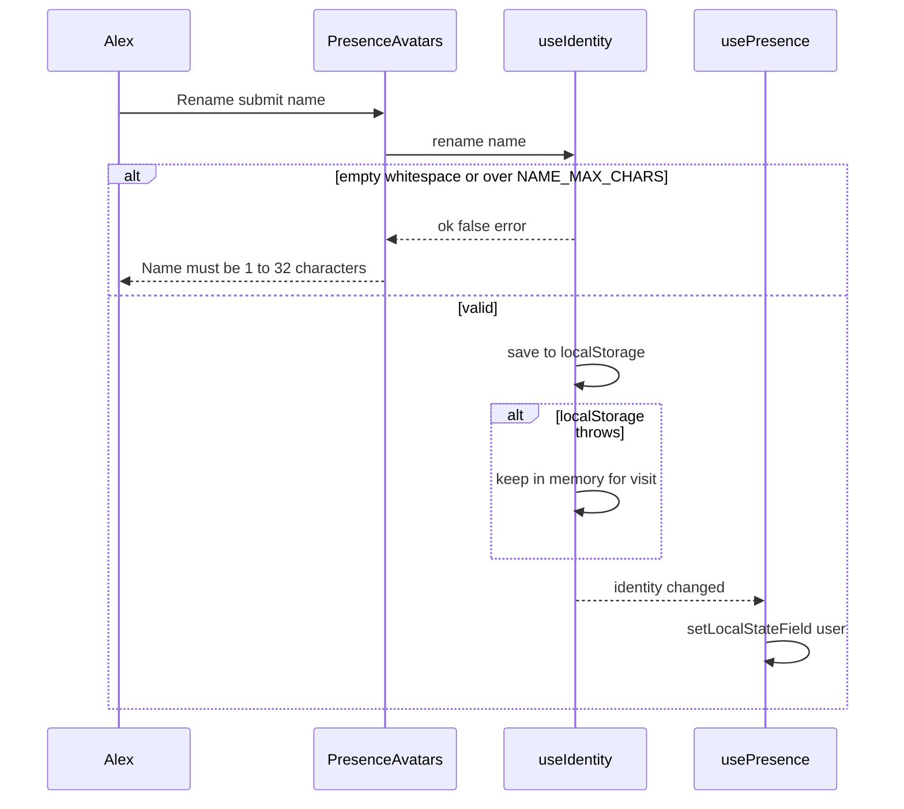
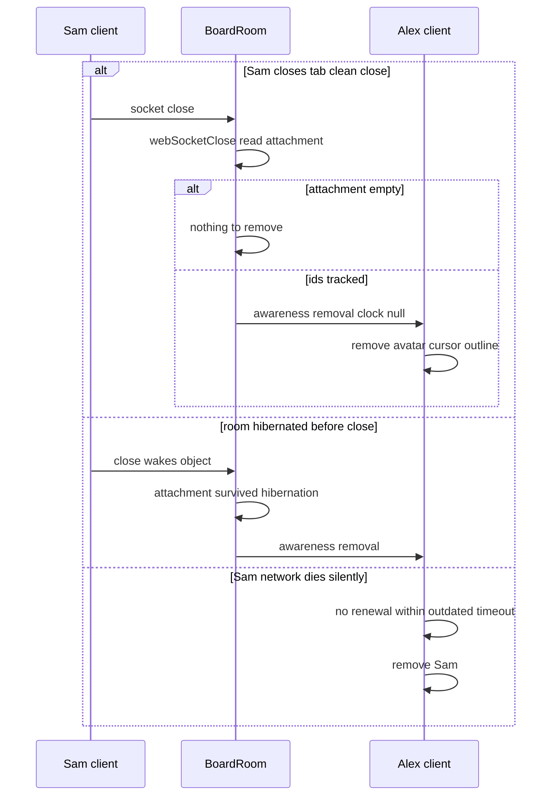

# Technical Design

Presence built on Yjs awareness through the existing y-websocket provider. The BoardRoom tracks awareness client ids and clocks per socket in hibernation-safe WebSocket attachments, broadcasts removals on close and queries existing clients when someone joins. The client has a guest identity module, a pure distinct-colour assignment with deterministic conflict resolution, a throttled awareness publisher with people derivation (dedupe, self exclusion), and UI for avatars, remote cursors and remote selection outlines.

## Overview

## Context
Builds on story 1 (`camera.ts` worldToScreen/screenToWorld), story 2 (`useSelection`), story 3 (`connectBoard` WebsocketProvider, BoardRoom relaying awareness verbatim to all sockets including sender), story 4 (hibernating BoardRoom using `ctx.acceptWebSocket` and `ctx.getWebSockets()`), story 5 (`BoardPage`, Share button top-right). Conventions: identity (5), awareness state shape `{user:{id,name,color}, cursor:{x,y}|null, selection:string[]}`, all numbers in `config.ts` (12). When story 7 lands, `selection` is the multi-select id set; before that it is zero or one id.

## Files
| Path | Change | Purpose |
|---|---|---|
| `src/shared/config.ts` | modified | presence settings below |
| `src/shared/protocol.ts` | modified | export awareness message helpers used by worker and tests |
| `src/worker/awareness-tracker.ts` | added | decode awareness update → clientId/clock map; encode removal update |
| `src/worker/board-room.ts` | modified | per-socket awareness ids in WebSocket attachment; removal broadcast on close/error; query-awareness to others on join |
| `src/client/identity/names.ts` | added | adjective and animal word lists, `randomGuestName()` |
| `src/client/identity/useIdentity.ts` | added | guest identity per convention 5, persistence, rename, validation |
| `src/client/presence/colors.ts` | added | pure distinct-colour assignment and conflict resolution |
| `src/client/presence/usePresence.ts` | added | publish local awareness (user, throttled cursor, selection); subscribe; `derivePeople` |
| `src/client/presence/PresenceAvatars.tsx` | added | avatar stack, overflow list, own avatar rename |
| `src/client/presence/RemoteCursors.tsx` | added | cursors in screen space |
| `src/client/presence/RemoteSelections.tsx` | added | outlines + name tags in world layer |
| `src/client/pages/BoardPage.tsx` | modified | mount presence components next to Share |

## Named settings added
```ts
export const PRESENCE_COLORS = ['#E53935', '#1E88E5', '#43A047', '#FB8C00', '#8E24AA', '#00897B', '#F4511E', '#3949AB'] as const;
// invariant (unit-tested): PRESENCE_COLORS.length >= MAX_CONCURRENT_EDITORS
export const MAX_AVATARS_SHOWN = MAX_CONCURRENT_EDITORS;
export const CURSOR_BROADCAST_INTERVAL_MS = 50;
export const CURSOR_LATENCY_BUDGET_MS = 500;
export const CURSOR_POSITION_TOLERANCE_PX = 2;
export const PRESENCE_JOIN_BUDGET_MS = 1000;          // newcomer visible to others
export const PRESENCE_EXISTING_VISIBLE_BUDGET_MS = 2000; // idle people visible to newcomer
export const PRESENCE_CLOSE_REMOVAL_BUDGET_MS = 3000;
export const PRESENCE_STALE_REMOVAL_BUDGET_MS = 35_000; // y-protocols outdated timeout (30 s) + margin
export const NAME_MAX_CHARS = 32;
export const IDENTITY_STORAGE_KEY = 'vidi6.identity';
```

## Product and technical decisions
1. **Colours are per session, not per identity.** The identity's stored colour is a *preference*; the displayed colour is the lowest free palette index, choosing the preference if free. Conflicts (two clients picking the same index before seeing each other) resolve deterministically: the client with the higher awareness clientID re-picks on the next awareness change. All clients converge without server coordination. Beyond `PRESENCE_COLORS.length` or capacity, indices repeat (colour = index modulo palette length).
2. **Server stores no awareness states.** They would be lost on hibernation anyway. It keeps only `{clientId: lastClock}` per socket inside `ws.serializeAttachment`, which survives hibernation, so removal on close still works.
3. **Newcomers see idle people** because the room sends `MESSAGE_QUERY_AWARENESS` to all other sockets when a socket is accepted; the y-websocket client answers with its current state, which the room relays (story 3 relay unchanged).
4. **Removal encoding**: an awareness update entry with the last seen clock and JSON `null` state; y-protocols applies a null state at an equal clock when the state exists.
5. **Remote cursors are screen-space overlays**, positioned with `worldToScreen(camera, cursor)`, constant size, hidden when off-screen; outlines live in the world layer so they scale with objects.
6. **Dedupe by `user.id`** for avatars (two tabs of the same person); cursors are per tab but only the most recently updated tab's cursor is drawn per `user.id`.
7. **Hidden tab / pointer leave** publish `cursor: null` immediately (not throttled) so hiding is prompt.

## Structure diagram


## State diagrams
A remote person as seen by one viewer (in-memory awareness only; nothing persisted except the socket attachment on the server):

Colour assignment for the local client:

Local identity persistence:

Server per-socket attachment: `{ awareness: Record<clientId, clock> }`, updated on each decodable awareness message and cleared when the socket closes.

## Sequence: join and initial presence


## Sequence: cursor and selection publishing


## Sequence: rename


## Sequence: leave


## Test Strategy

## Test scopes and boundaries
| Capability | Levels | Boundary exercised | Why sufficient |
|---|---|---|---|
| presence.room_tracking | unit, integration | Pure awareness encode/decode; real Durable Object sockets and attachments in workerd | Removal after close and hibernation depends on real attachments and socket events |
| presence.identity | unit, ui-component, e2e | Pure generation/validation; rename UI in jsdom; real localStorage in browsers | Persistence across visits only provable in a real browser |
| presence.colors | unit | Pure assignment | Deterministic logic; convergence checked by simulation |
| presence.awareness_client | unit, e2e | Pure `derivePeople` and throttle; real provider in browsers | Latency and cross-zoom positioning require real browsers and server |
| presence.ui | ui-component, e2e | Components with synthetic people; real rendering | Layout, overflow and outlines are DOM facts; e2e checks pixels |

## Dimensions crossed
- **D1 Participants**: 1, 2, `MAX_CONCURRENT_EDITORS`, `MAX_CONCURRENT_EDITORS + 1`.
- **D2 Event**: join, cursor move, pointer leave/tab hidden, selection change, rename, clean close, silent drop, room hibernated then close.
- **D3 Identity situation**: fresh browser, returning browser, same identity in two tabs, localStorage unavailable.
- **D4 Viewer camera**: same zoom as sender, different zoom (50% vs 200%), sender cursor outside viewer's viewport.

Classes within each dimension are exhaustive for this story and non-overlapping.

## Coverage table
| TC | Capability | D1 | D2 | D3 | D4 | Action | Expected before → after | Level |
|---|---|---|---|---|---|---|---|---|
| TC-01 | presence.room_tracking | 2 | join | fresh browser | not applicable: server-side bytes | readAwarenessClients on real y-protocols update with 2 clients | map {id1:clock1, id2:clock2} | unit |
| TC-02 | presence.room_tracking | 2 | clean close | fresh browser | not applicable: server-side bytes | encodeAwarenessRemoval then applyAwarenessUpdate on real Awareness | states for those ids removed; others untouched | unit |
| TC-03 | presence.room_tracking | 1 | join | not applicable: bytes only | not applicable | truncated bytes, empty array, unknown JSON | returns null; no throw | unit |
| TC-04 | presence.room_tracking | 2 | clean close | fresh browser | not applicable: integration clients | B closes | A receives removal for B within PRESENCE_CLOSE_REMOVAL_BUDGET_MS; A's Awareness lacks B | integration |
| TC-05 | presence.room_tracking | 2 | room hibernated then close | fresh browser | not applicable | reconstruct room instance with sockets kept, then B closes | removal broadcast from attachment | integration |
| TC-06 | presence.room_tracking | 3 | join | fresh browser | not applicable | A and B idle; C connects | A and B receive MESSAGE_QUERY_AWARENESS; C has A and B states within PRESENCE_EXISTING_VISIBLE_BUDGET_MS | integration |
| TC-07 | presence.room_tracking | 2 | join | not applicable: malformed | not applicable | A sends undecodable awareness bytes | bytes relayed to B; attachment unchanged; socket stays open | integration |
| TC-08 | presence.room_tracking | 2 | clean close | fresh browser | not applicable | B closes before sending any awareness | no removal broadcast; no error | integration |
| TC-09 | presence.identity | 1 | join | fresh browser | not applicable: pure | randomGuestName 1,000 times | every name matches /^[A-Z][a-z]+ [A-Z][a-z]+$/, length ≤ NAME_MAX_CHARS | unit |
| TC-10 | presence.identity | 1 | rename | returning browser | not applicable: pure | validateName '', '   ', 1 char, NAME_MAX_CHARS chars, NAME_MAX_CHARS+1 chars, ' Alex ' | false, false, true, true, false, true (trimmed to 'Alex') | unit |
| TC-11 | presence.identity | 1 | join | localStorage unavailable | not applicable: pure | load with throwing storage | identity generated, MemoryOnly, no throw | unit |
| TC-12 | presence.colors | `MAX_CONCURRENT_EDITORS` | join | fresh browser | not applicable: pure | simulate clients joining in random order with simultaneous picks (seeded, 500 runs) | after resolution all indices distinct in every run | unit |
| TC-13 | presence.colors | `MAX_CONCURRENT_EDITORS + 1` | join | fresh browser | not applicable: pure | assign | every client has an index; exactly the overflow client reuses an index | unit |
| TC-14 | presence.colors | 2 | join | returning browser | not applicable: pure | preferred colour free vs taken | free → preferred used; taken → lowest free | unit |
| TC-15 | presence.colors | not applicable: config | not applicable | not applicable | not applicable | assert PRESENCE_COLORS.length >= MAX_CONCURRENT_EDITORS | true | unit |
| TC-16 | presence.awareness_client | 3 | join | same identity in two tabs | not applicable: pure | derivePeople with 2 clientIDs same user.id + own clientID | avatars: one per user.id, own first; cursors exclude own clientID; newest tab's cursor per user.id | unit |
| TC-17 | presence.awareness_client | 2 | cursor move | fresh browser | not applicable: fake timers | 20 pointermoves within CURSOR_BROADCAST_INTERVAL_MS | at most 1 immediate + 1 trailing publish; trailing carries latest position | unit |
| TC-18 | presence.awareness_client | 2 | pointer leave/tab hidden | fresh browser | not applicable: fake timers | pointerleave mid-interval | cursor null published immediately; pending trailing move cancelled | unit |
| TC-19 | presence.ui | `MAX_AVATARS_SHOWN + 2` | join | fresh browser | not applicable: component | render PresenceAvatars | own avatar first marked you; MAX_AVATARS_SHOWN avatars; "+2"; list shows all names and colours | ui-component |
| TC-20 | presence.ui | 1 | join | fresh browser | not applicable: component | alone | only own avatar; no cursors rendered | ui-component |
| TC-21 | presence.identity | 1 | rename | returning browser | not applicable: component | submit NAME_MAX_CHARS+1 chars; then valid name | error text, name unchanged; then label updated and rename called once | ui-component |
| TC-22 | presence.ui | 2 | cursor move | fresh browser | sender cursor outside viewer's viewport | render RemoteCursors with camera excluding point | cursor not rendered; aria-hidden on container | ui-component |
| TC-23 | presence.ui | 2 | selection change | fresh browser | same zoom | render RemoteSelections for remote selection of a note | outline in remote colour + name tag; local useSelection untouched | ui-component |
| TC-24 | presence.awareness_client | 2 | cursor move | fresh browser | different zoom 50% vs 200% | Sam points at a note corner | on Alex, cursor tip within CURSOR_POSITION_TOLERANCE_PX of corner within CURSOR_LATENCY_BUDGET_MS | e2e |
| TC-25 | presence.awareness_client | 2 | pointer leave/tab hidden | fresh browser | same zoom | Sam's mouse leaves board | Sam's cursor gone on Alex within CURSOR_LATENCY_BUDGET_MS; returns on re-entry | e2e |
| TC-26 | presence.ui | `MAX_CONCURRENT_EDITORS` | join | fresh browser | same zoom | contexts join sequentially | each screen shows MAX_CONCURRENT_EDITORS avatars, all colours distinct; newcomer visible to others within PRESENCE_JOIN_BUDGET_MS | e2e |
| TC-27 | presence.ui | `MAX_CONCURRENT_EDITORS + 1` | join | fresh browser | same zoom | one more context joins | overflow "+1" shown; every person has colour and name; nobody refused | e2e |
| TC-28 | presence.ui | 2 | selection change | fresh browser | same zoom | Sam selects a note while Alex has another selected | Alex sees Sam's outline in Sam's colour; Alex's selection unchanged; Alex can still edit Sam's note | e2e |
| TC-29 | presence.identity | 2 | rename | returning browser | same zoom | Alex renames; reloads page | Sam sees new name within PRESENCE_JOIN_BUDGET_MS; after reload Alex keeps new name | e2e |
| TC-30 | presence.awareness_client | 2 | clean close | fresh browser | same zoom | Sam's context closes | avatar, cursor, outline gone on Alex within PRESENCE_CLOSE_REMOVAL_BUDGET_MS | e2e |
| TC-31 | presence.awareness_client | 2 | join | same identity in two tabs | same zoom | Alex opens a second tab | Sam still sees one Alex avatar; Alex's second tab shows no remote cursor for Alex's first tab... except as other tab of same user is drawn once as remote | e2e |

Note on TC-31: the same person's other tab is a different clientID; it is shown as one avatar (dedupe) and its cursor is drawn as a remote cursor only on *other* people's screens; on the person's own tabs, cursors whose `user.id` equals own identity are excluded (presence.self extends to same-identity tabs).

## Boundary values
- Participants: 1, 2, `MAX_CONCURRENT_EDITORS`, `MAX_CONCURRENT_EDITORS + 1`, `MAX_AVATARS_SHOWN + 2` (TC-19, TC-20, TC-26, TC-27).
- Name length: 0, whitespace, 1, `NAME_MAX_CHARS`, `NAME_MAX_CHARS + 1` (TC-10, TC-21).
- Throttle: moves within one interval; leave mid-interval (TC-17, TC-18).
- Timing budgets asserted at exactly the named value (TC-04, TC-06, TC-24, TC-25, TC-26, TC-30).

## Negative scenarios
| TC | Must not happen | Level |
|---|---|---|
| TC-07 | undecodable awareness must not close the socket or corrupt tracking | integration |
| TC-08 | close without awareness must not broadcast a removal | integration |
| TC-16, TC-31 | own cursor/selection must not be drawn as remote; same person must not appear twice | unit, e2e |
| TC-21 | invalid name must not replace the current name | ui-component |
| TC-23, TC-28 | remote selection must not alter local selection or block editing | ui-component, e2e |
| TC-27 | person beyond capacity must not be refused | e2e |

## Error paths (every contract error has a case)
| Contract error | TC |
|---|---|
| undecodable awareness update (server) | TC-03, TC-07 |
| send to closed socket during query | covered by story 3 TC-31 behaviour; TC-06 runs with one socket closing concurrently (integration) |
| invalid rename | TC-10, TC-21 |
| localStorage throws | TC-11 |
| colour conflict | TC-12 |

## Mock vs real boundaries
| Dependency | Mocked? | Reason |
|---|---|---|
| Durable Object, WebSockets, attachments | Real (workerd via vitest-pool-workers) | Tracking and hibernation-safe removal are the behaviour under test |
| y-protocols Awareness | Real everywhere | Encoded bytes must match what the y-websocket client produces |
| Provider awareness in component tests | Synthetic `RemotePerson[]` props | Components render from derived data; derivation tested separately |
| localStorage | jsdom storage (and a throwing stub for TC-11); real in e2e | Deterministic; real persistence in e2e |
| Timers | Fake in TC-17/18 | Deterministic throttle |

## E2E workflows
1. **Pointing at a note** (TC-24 → TC-25): cursor lands at the right board location across zoom levels and hides when leaving.
2. **Full room** (TC-26 → TC-27): distinct colours at capacity; graceful overflow beyond.
3. **Who's working on what** (TC-28): remote outlines without interference.
4. **Becoming Alex** (TC-29): rename propagates and persists.
5. **Leaving** (TC-30) and **two tabs** (TC-31).

## Fixtures
- Identities from `randomGuestName()` seeded per context; boards created via `POST /api/boards` with 10 realistic notes from story 4 fixtures so outlines have targets.
- Integration awareness clients use real `Awareness` instances with realistic states `{user:{id:'g_…',name:'Brave Heron',color:'#1E88E5'}, cursor:{x:120.5,y:-40}, selection:['<uuid>']}`.

## Not covered
- Silent network death removal within PRESENCE_STALE_REMOVAL_BUDGET_MS (35 s) is not automated; manual check by disabling Wi-Fi on one device.
- Smoothness/perceived jitter of cursors and performance with 5 moving cursors: manual.
- Production hibernation timing: TC-05 simulates reconstruction only.
- Screen reader announcements for presence changes (none are made by design).

## Room awareness tracking

> Anchor: `presence.room_tracking`

## Contract
```ts
// src/worker/awareness-tracker.ts
export function readAwarenessClients(update: Uint8Array): Map<number, number> | null; // clientId -> clock; null if undecodable
export function encodeAwarenessRemoval(clients: Map<number, number>): Uint8Array;     // entries with same clock and null state
export function mergeTracked(prev: Record<string, number>, next: Map<number, number>): Record<string, number>; // keeps max clock per id; null-state entries removed
```
- **Inputs**: awareness payloads per socket; socket accept, close and error events.
- **Outputs**: unchanged verbatim relay (story 3); on accept, `MESSAGE_QUERY_AWARENESS` to every other open socket; on close/error, `MESSAGE_AWARENESS` removal for the socket's tracked ids to remaining sockets.
- **Errors**: undecodable awareness → relayed but not tracked; sending to a closed socket → socket dropped (story 3 rule).
- **Side effects**: `ws.serializeAttachment({ awareness })` after each decodable awareness message (modification of story 4 BoardRoom `webSocketMessage`, `webSocketClose`, `webSocketError`, `fetch`).

## Implementation
- Attachment survives hibernation, so `webSocketClose` on a freshly woken object still knows which clients to remove (presence.leave).
- Query on join makes idle clients re-announce; relaying their answers reaches the newcomer within PRESENCE_EXISTING_VISIBLE_BUDGET_MS (presence.join).
- Awareness traffic still wakes the object while people are connected; with nobody connected no traffic exists, satisfying the cost constraint.

## Tests
unit: TC-01 to TC-03 (`tests/unit/awareness-tracker.test.ts`). integration: TC-04 to TC-08 (`tests/integration/presence-room.test.ts`).

## Guest identity and rename

> Anchor: `presence.identity`

## Contract
```ts
// src/client/identity/names.ts
export function randomGuestName(rng?: () => number): string; // "Adjective Animal"
// src/client/identity/useIdentity.ts
export interface Identity { id: string; name: string; color: string }
export function validateName(raw: string): { ok: true; name: string } | { ok: false; error: 'Name must be 1–32 characters' };
export function loadIdentity(storage: Storage | null): { identity: Identity; persisted: boolean };
export function useIdentity(): { identity: Identity; persisted: boolean; rename(raw: string): { ok: boolean; error?: string } };
```
- **Inputs**: localStorage key `IDENTITY_STORAGE_KEY`; rename input.
- **Outputs**: guest `{ id: 'g_' + 16 random bytes base64url, name, color: PRESENCE_COLORS[random] }` persisted when possible; renamed identity propagated to `usePresence`.
- **Errors**: invalid name → error result, identity unchanged (presence.name_validation); storage throws → `persisted: false`, identity kept in memory for the visit.
- **Side effects**: localStorage write on create and valid rename.

## Implementation
`validateName` trims, then checks `1 <= length <= NAME_MAX_CHARS`. Word lists contain only ASCII words short enough that every combination fits NAME_MAX_CHARS (TC-09). Story 14 later replaces guest identity with signed-in identity using the same `Identity` shape (convention 5).

## Tests
unit: TC-09 to TC-11. ui-component: TC-21. e2e: TC-29.

## Distinct colour assignment

> Anchor: `presence.colors`

## Contract
```ts
// src/client/presence/colors.ts
export interface ColorClaim { clientId: number; colorIndex: number | undefined }
export function assignColorIndex(ownClientId: number, preferredIndex: number, others: ColorClaim[]): number;
export function colorFor(index: number): string; // PRESENCE_COLORS[index % length]
```
- **Inputs**: own clientID, preferred palette index from identity colour, other clients' published `colorIndex` (awareness `user.colorIndex`).
- **Outputs**: palette index to publish.
- **Errors**: none; malformed or missing indices from others are ignored.
- **Side effects**: none (pure).

## Implementation
If own current index is claimed by a client with a *lower* clientID, re-pick. Pick = preferred index if unclaimed, else lowest unclaimed index in `[0, PRESENCE_COLORS.length)`, else (palette exhausted) `ownClientId % PRESENCE_COLORS.length`. With at most `MAX_CONCURRENT_EDITORS ≤ PRESENCE_COLORS.length` clients this converges to distinct indices; beyond it colours repeat gracefully (presence.colors).

## Tests
unit: TC-12 to TC-15 (`tests/unit/presence-colors.test.ts`).

## Awareness publishing and people derivation

> Anchor: `presence.awareness_client`

## Contract
```ts
// src/client/presence/usePresence.ts
export interface RemotePerson { clientId: number; user: { id: string; name: string; color: string }; cursor: { x: number; y: number } | null; selection: string[]; updatedAt: number }
export function derivePeople(states: Map<number, unknown>, ownClientId: number, ownUserId: string): { avatars: RemotePerson[]; cursors: RemotePerson[]; selections: RemotePerson[] };
export function createCursorPublisher(publish: (c: { x: number; y: number } | null) => void, now: () => number): { move(p: { x: number; y: number }): void; hide(): void; dispose(): void };
export function usePresence(provider: WebsocketProvider, camera: Camera, selection: ReadonlySet<string> | string | null, identity: Identity): { avatars: RemotePerson[]; cursors: RemotePerson[]; selections: RemotePerson[]; self: RemotePerson };
```
- **Inputs**: provider awareness change events; pointer events over the board; `visibilitychange`; selection; identity.
- **Outputs**: local awareness fields `user` (with colorIndex), `cursor` (world units or null), `selection` (string[]); derived lists for UI.
- **Errors**: malformed remote states (missing user, non-finite cursor) are skipped, never thrown.
- **Side effects**: awareness publishes over the existing provider.

## Implementation
- Cursor publisher: leading publish then at most one trailing publish per `CURSOR_BROADCAST_INTERVAL_MS`; `hide()` publishes null immediately and cancels the trailing publish (presence.cursors, presence.cursor_hide).
- `derivePeople`: avatars deduped by `user.id` (newest `updatedAt` wins) with self first (presence.dedupe, presence.avatars data); cursors and selections exclude own clientID and any state with `user.id === ownUserId` (presence.self); states removed by the provider disappear (presence.leave); new states appear on change events (presence.join).
- Selection publish on every local selection change; remote selections never write to `useSelection` (presence.selection).
- Rename updates the `user` field (presence.names propagation).

## Tests
unit: TC-16 to TC-18 (`tests/unit/presence-derive.test.ts`). e2e: TC-24, TC-25, TC-30, TC-31 (`tests/e2e/presence.spec.ts`).

## Presence UI: avatars, cursors, selection outlines

> Anchor: `presence.ui`

## Contract
```tsx
// src/client/presence/PresenceAvatars.tsx
export function PresenceAvatars(props: { self: RemotePerson; others: RemotePerson[]; onRename(raw: string): { ok: boolean; error?: string } }): JSX.Element;
// src/client/presence/RemoteCursors.tsx
export function RemoteCursors(props: { cursors: RemotePerson[]; camera: Camera; viewport: Size }): JSX.Element;
// src/client/presence/RemoteSelections.tsx
export function RemoteSelections(props: { selections: RemotePerson[]; objects: ReadonlyMap<string, { x: number; y: number; width: number; height: number }> }): JSX.Element;
```
- **Outputs**: avatar buttons with accessible names ("Brave Heron", "Curious Otter, you"), initials, colour; first `MAX_AVATARS_SHOWN` (self first) then `+N` button opening a list; own avatar menu with Rename field; cursors as absolutely positioned SVG arrows + name label at `worldToScreen`, container `aria-hidden`, skipped when off-screen; outlines as world-layer rectangles (2 screen px via `vector-effect`/inverse zoom) with name tag, ignoring ids no longer present.
- **Errors**: rename errors rendered inline; selections referencing deleted objects render nothing.
- **Side effects**: none beyond rendering.

## Implementation
Avatars sit left of the story 5 Share button. Names always accompany colours (accessibility). Outlines use `pointer-events: none` so they never intercept editing (presence.selection).

## Tests
ui-component: TC-19, TC-20, TC-22, TC-23 (`tests/component/presence-ui.test.tsx`). e2e: TC-26 to TC-28.

