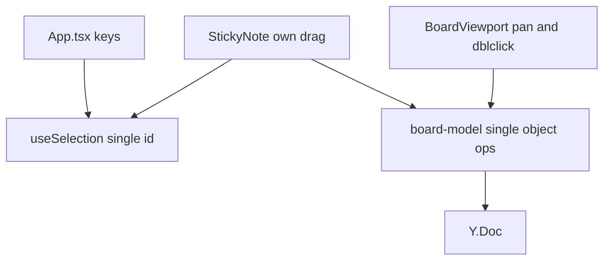
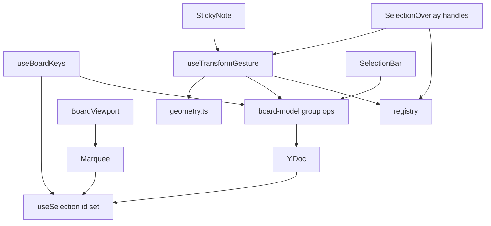
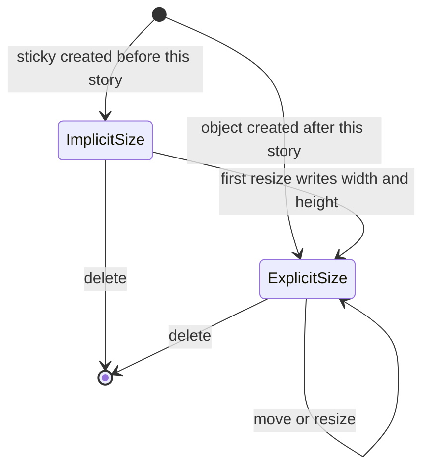
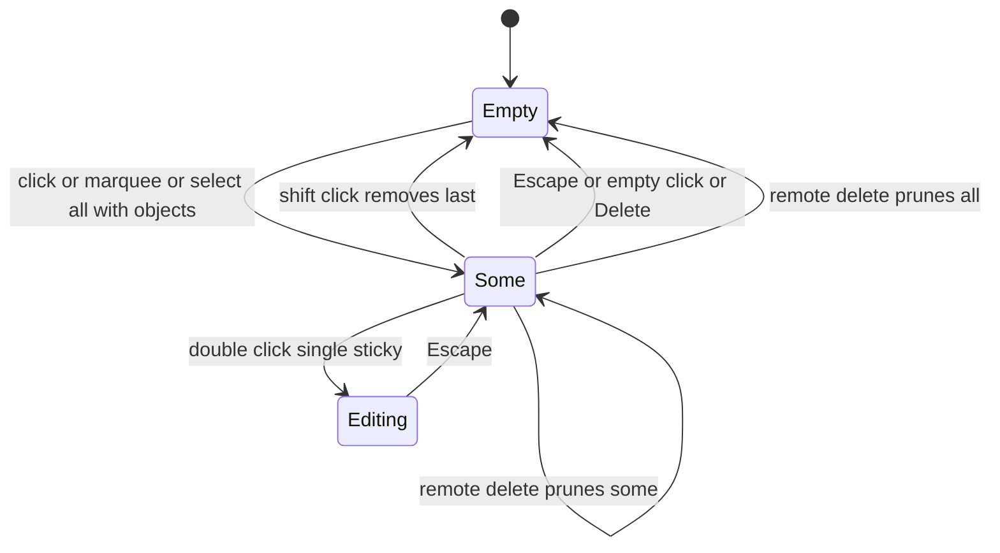
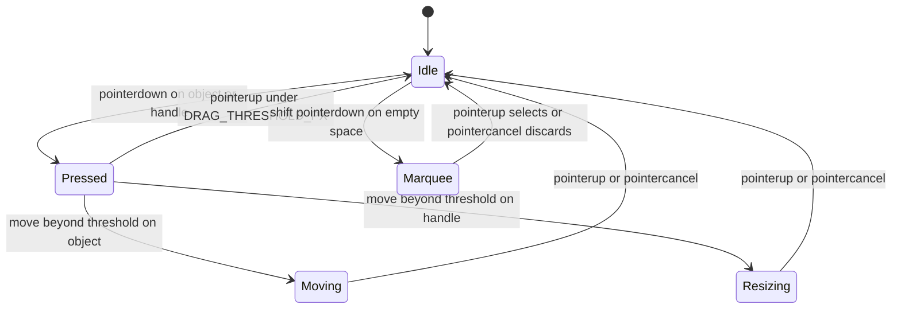
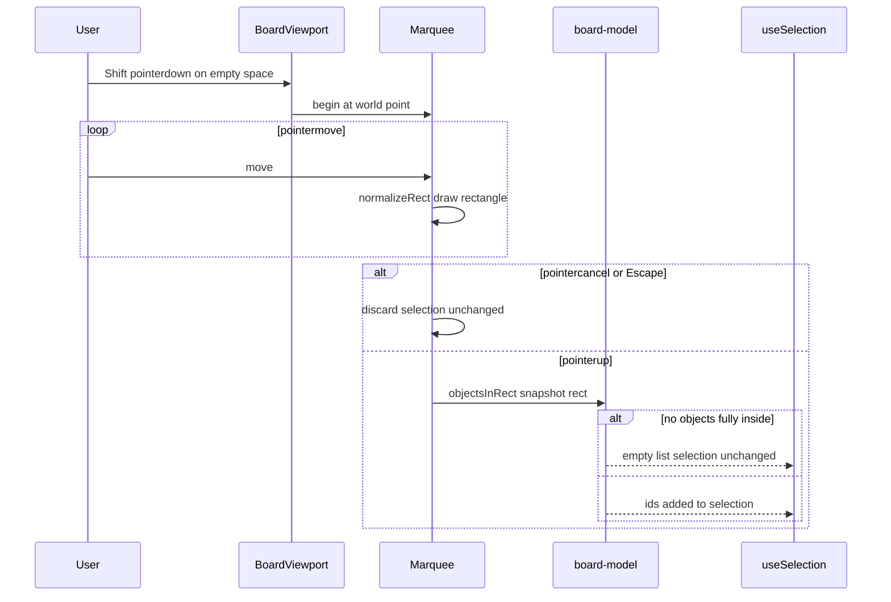
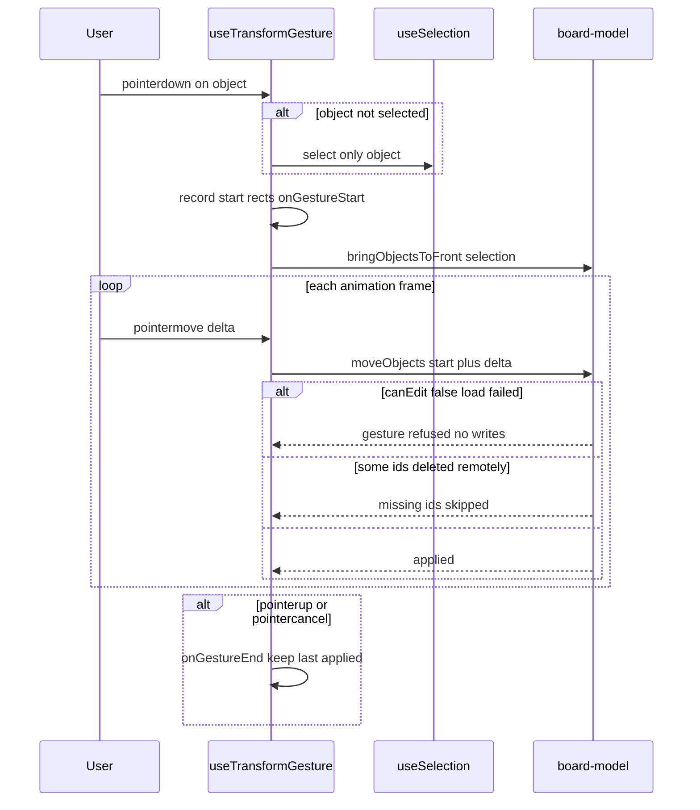
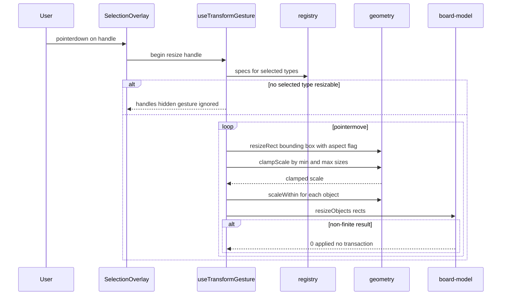
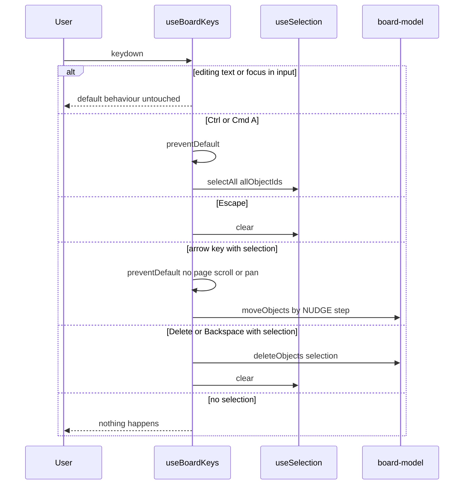
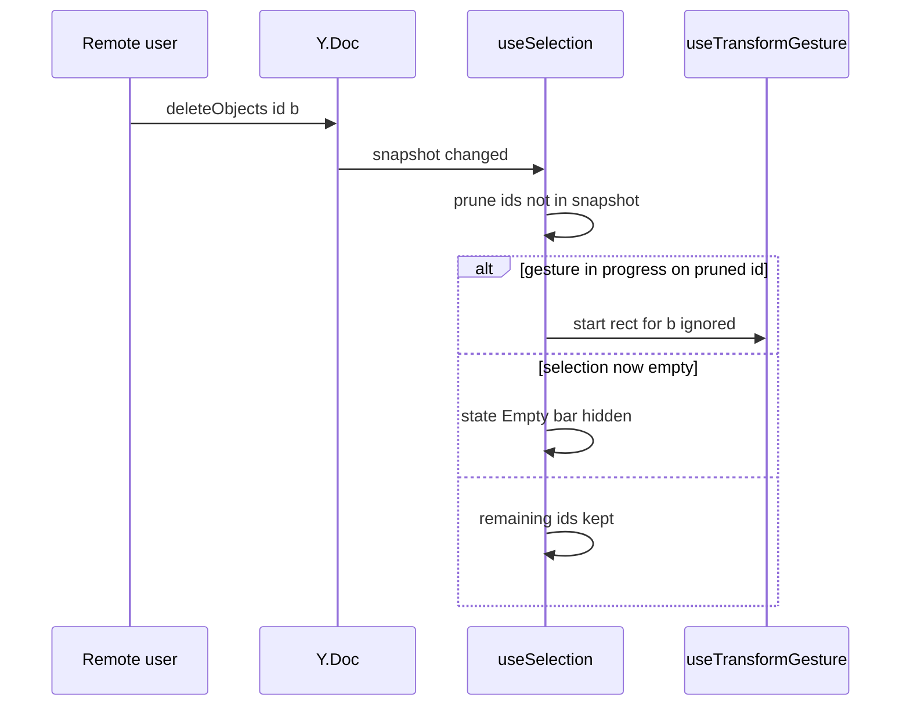

# Technical Design

Pure geometry and generic group ops in board-model, an object-type registry declaring per-type resize rules, a Set-based per-client selection, a Shift+drag marquee, a generic transform gesture with bounding-box handles, and keyboard select-all/clear/nudge/delete. Sticky notes gain persisted width/height and move onto the generic machinery.

## Overview

## Context
Builds on story 1 (`camera.ts`, `BoardViewport`), story 2 (`board-model.ts`, `StickyNote`, `useSelection` single id, `NoteToolbar`), story 3 (live sync; selection is local), story 4 (`canEdit` gate). Introduces the object registry and generic group operations that stories 9–12 plug into.

## Files
| Path | Change | Purpose |
|---|---|---|
| `src/shared/geometry.ts` | added | `Rect`, `rectContains`, `unionRects`, `normalizeRect`, `resizeRect`, `scaleWithin`, `clampScale` |
| `src/shared/board-model.ts` | modified | `objectBounds`, `moveObjects`, `resizeObjects`, `deleteObjects`, `bringObjectsToFront`, `objectsInRect`, `allObjectIds`; `width/height` read with STICKY_SIZE_WORLD fallback; story 2 single-object functions become thin wrappers |
| `src/client/objects/registry.tsx` | added | `ObjectTypeSpec` registry; registers `sticky` |
| `src/client/board/useSelection.ts` | modified | single id → `ReadonlySet<string>` with select/toggle/setMany/selectAll/clear, editingId, pruning |
| `src/client/board/SelectionOverlay.tsx` | added | per-object outlines, bounding box, 8 handles in screen space |
| `src/client/board/SelectionBar.tsx` | added | "N selected" + Delete, or NoteToolbar for one sticky |
| `src/client/board/useTransformGesture.ts` | added | group move and handle resize; `onGestureStart/End` hooks (story 8 undo boundaries) |
| `src/client/board/Marquee.tsx` | added | Shift+drag rectangle rendering |
| `src/client/board/useBoardKeys.ts` | added | Ctrl/Cmd+A, Escape, arrows, Delete/Backspace (moved out of `App.tsx`) |
| `src/client/canvas/BoardViewport.tsx` | modified | Shift+pointerdown on empty space starts marquee instead of pan |
| `src/client/objects/StickyNote.tsx` | modified | own drag code removed; pointerdown delegates to `useTransformGesture`; renders `width/height`; text fit uses width |
| `src/client/App.tsx` | modified | wires overlay, bar, keys |

## Named settings added (`src/shared/config.ts`)
```ts
export const HANDLE_SIZE_PX = 8;
export const STICKY_MIN_SIZE_WORLD = 50;
export const MAX_OBJECT_SIZE_WORLD = 20_000;
export const NUDGE_STEP_WORLD = 1;
export const NUDGE_LARGE_STEP_WORLD = 10;
```

## Key decisions
1. **Absolute writes from gesture start.** A move/resize gesture records every selected object's start rect and each frame writes `start + delta` (or the scaled rect). Accumulating per-frame deltas would drift when a remote user moves the same object concurrently; absolute writes converge to the last writer, identical on every screen.
2. **Group resize scale is clamped once.** The bounding-box scale factor is clamped so that no object crosses its type's `minSize` or MAX_OBJECT_SIZE_WORLD, then applied uniformly; otherwise objects would stop at different times and the layout would distort.
3. **Aspect lock is a selection property.** If any selected type is `aspectLocked` (sticky) or Shift is held, the bounding box keeps its ratio.
4. **Stacking.** A group move raises the whole selection above all unselected objects while preserving relative z among selected objects (reassign `z = maxUnselectedZ + rank`).
5. **Width/height additive.** Stickies without `width/height` render at STICKY_SIZE_WORLD; the first resize writes both fields. No migration.

## Structure: current (after story 2)


## Structure: target

Delta: selection becomes a set fed by clicks, marquee and keys; drag leaves StickyNote for a generic gesture; geometry, registry, overlay, bar and keys are new.

## State diagrams
Persisted object state (additive field, no new lifecycle):

Per-client selection (not persisted):

Per-client gesture (not persisted):


## Sequence: marquee select


## Sequence: group move


## Sequence: resize by handle


## Sequence: keyboard


## Sequence: remote delete prunes selection


## Test Strategy

## Test scopes and boundaries
| Capability | Levels | Boundary exercised | Why sufficient |
|---|---|---|---|
| sel.geometry_ops | unit | pure geometry + real Y.Doc | all maths and write rules live here |
| sel.registry | unit | registry lookups | declarative data |
| sel.interaction | unit, ui-component, e2e | reducer; rendered bar/outlines; real browser multi-user | selection logic is pure; rendering and live pruning need DOM and the real sync path |
| sel.marquee_ui | ui-component, e2e | viewport event handling; real pointer | real layout decides containment in pixels |
| sel.transform | ui-component, e2e | gesture hook with jsdom events; real drag | pixel-accurate resize needs real layout |
| sel.keyboard | ui-component, e2e | key handling; real browser scroll | only a browser proves arrows do not scroll |

No server code changes, so no integration tests; convergence is proven via e2e against the real server.

## Dimensions crossed
- **D1 Operation:** click, shift-click, marquee, select all, clear, move, resize, nudge, delete.
- **D2 Selection size before:** 0, 1, many.
- **D3 Type mix:** sticky only (aspect locked), registered non-locked test type, unknown type present in doc.
- **D4 Target state:** present, deleted remotely.
- **D5 Edit state:** not editing, editing text, load failed.
Classes in each dimension are exhaustive and non-overlapping.

## Coverage table
| TC | Capability | D1 | D2 | D3 | D4 | D5 | Expected before → after | Level |
|---|---|---|---|---|---|---|---|---|
| TC-01 | sel.geometry_ops | resize | 1 | sticky | present | not editing | resizeRect corner, aspectLocked: 200×200 → 300×300 | unit |
| TC-02 | sel.geometry_ops | resize | 1 | sticky | present | not editing | shrink to STICKY_MIN_SIZE_WORLD − 1 → clamped 50×50 | unit |
| TC-03 | sel.geometry_ops | resize | many | mixed | present | not editing | clampScale stops all when first hits MAX_OBJECT_SIZE_WORLD; relative layout preserved | unit |
| TC-04 | sel.geometry_ops | resize | many | sticky | present | not editing | 2 notes 100 apart, box width ×2 → 400 wide, gap 200 | unit |
| TC-05 | sel.geometry_ops | move | many | sticky | 1 of 3 deleted remotely | not editing | moveObjects → returns 2; one update event | unit |
| TC-06 | sel.geometry_ops | move | many | sticky | present | not editing | bringObjectsToFront 3 overlapping → above unselected, relative z preserved | unit |
| TC-07 | sel.geometry_ops | marquee | 0 | sticky | present | not editing | objectsInRect fully / partly / outside → [A] | unit |
| TC-08 | sel.geometry_ops | select all | 0 | unknown type present | present | not editing | allObjectIds excludes unknown type | unit |
| TC-09 | sel.geometry_ops | move | 1 | sticky | present | not editing | NaN / Infinity position → 0 applied, no transaction (error path) | unit |
| TC-10 | sel.geometry_ops | resize | 1 | sticky without width/height | present | not editing | objectBounds reads STICKY_SIZE_WORLD; first resize writes both fields | unit |
| TC-11 | sel.registry | resize | 1 | sticky | present | not editing | spec {resizable true, aspectLocked true, minSize STICKY_MIN_SIZE_WORLD} | unit |
| TC-12 | sel.registry | resize | 1 | unknown | present | not editing | getObjectType undefined | unit |
| TC-13 | sel.interaction | click / shift-click | 0 → many | sticky | present | not editing | reducer: {} → {a} → {a,b} → {b} (click b alone) | unit |
| TC-14 | sel.interaction | shift-click | 1 | sticky | present | not editing | removing last → Empty | unit |
| TC-15 | sel.interaction | prune | many | sticky | 1 deleted remotely | not editing | {a,b,c} → {a,c} | unit |
| TC-16 | sel.interaction | prune | many | sticky | all deleted | not editing | → Empty, bar hidden | ui-component |
| TC-17 | sel.interaction | bar | 2 | sticky | present | not editing | "2 selected" + Delete; aria-live announcement | ui-component |
| TC-18 | sel.interaction | bar | 1 | sticky | present | not editing | NoteToolbar shown instead of bar | ui-component |
| TC-19 | sel.interaction | clear | many | sticky | present | not editing | empty-space click without drag → Empty | ui-component |
| TC-20 | sel.marquee_ui | marquee | 1 | sticky | present | not editing | Shift+drag adds fully-inside ids to existing selection | ui-component |
| TC-21 | sel.marquee_ui | marquee | 0 | sticky | present | not editing | plain drag (no Shift) pans; no marquee (negative) | ui-component |
| TC-22 | sel.marquee_ui | marquee | 0 | sticky | present | not editing | pointercancel mid-marquee → selection unchanged | ui-component |
| TC-23 | sel.transform | move | 0 | sticky | present | not editing | drag unselected b while {a} selected → selection {b}; only b moves | ui-component |
| TC-24 | sel.transform | resize | many | registered non-locked type | present | not editing | edge handle changes width only; Shift keeps ratio | ui-component |
| TC-25 | sel.transform | move | many | sticky | present | load failed | gesture refused; no writes (negative) | ui-component |
| TC-26 | sel.transform | move | many | sticky | present | not editing | onGestureStart and onGestureEnd each called once per drag | ui-component |
| TC-27 | sel.keyboard | select all | 0 | sticky | present | not editing | Ctrl/Cmd+A selects all; preventDefault; no page text selected | ui-component |
| TC-28 | sel.keyboard | select all | 0 | none (empty board) | present | not editing | Ctrl/Cmd+A → Empty, no error (boundary) | ui-component |
| TC-29 | sel.keyboard | nudge | many | sticky | present | not editing | ArrowRight → x+NUDGE_STEP_WORLD; Shift+ArrowUp → y−NUDGE_LARGE_STEP_WORLD; preventDefault | ui-component |
| TC-30 | sel.keyboard | delete | many | sticky | present | editing text | Backspace edits text; objects kept (negative) | ui-component |
| TC-31 | sel.keyboard | delete | many | sticky | present | not editing | Delete removes all selected, selection Empty | ui-component |
| TC-32 | sel.marquee_ui + sel.interaction | marquee | 0 | sticky | present | not editing | e2e: A inside, B half inside, C outside → only A selected | e2e |
| TC-33 | sel.transform | move + resize | many | sticky | present | not editing | e2e: 6 notes move 300 units together above a 4th note; corner resize scales sizes and gaps; notes square | e2e |
| TC-34 | sel.keyboard | nudge + delete | many | sticky | present | not editing | e2e: arrows move selection without page scroll or board pan; Delete removes all | e2e |
| TC-35 | sel.interaction | prune | many | sticky | deleted remotely | not editing | e2e 2 contexts: Sam deletes one of Lee's selected notes → Lee's selection count drops by 1 | e2e |
| TC-36 | sel.transform | move | many | sticky | present | not editing | e2e MAX_CONCURRENT_EDITORS contexts move different selections simultaneously → identical final positions | e2e |

## Boundary values
- Size: STICKY_MIN_SIZE_WORLD − 1 / exactly; MAX_OBJECT_SIZE_WORLD + 1 (TC-02, TC-03).
- Drag threshold: DRAG_THRESHOLD_PX − 1 (click) vs exactly (gesture) (reuses story 2 rule; TC-23).
- Selection size: 0, 1, many; removing last member (TC-14, TC-28).
- Nudge: NUDGE_STEP_WORLD and NUDGE_LARGE_STEP_WORLD (TC-29).
- Participants: MAX_CONCURRENT_EDITORS (TC-36).

## Negative scenarios
| TC | Must not happen |
|---|---|
| TC-07 / TC-32 | partly-inside objects must not be selected |
| TC-21 | plain drag must not start a marquee |
| TC-25 | load-failed board must not accept moves |
| TC-30 | Backspace while editing must not delete objects |
| TC-34 | arrows must not scroll the page or pan the board |
| TC-09 | invalid values must not be written |

## Error paths
| Contract error | TC |
|---|---|
| non-finite rect or position → 0 applied | TC-09 |
| missing id in group op → skipped | TC-05 |
| unknown type → not selectable/resizable | TC-08, TC-12 |
| gesture cancelled → last applied kept | TC-22 (marquee), TC-26 path |

## Mock vs real boundaries
| Dependency | Mocked? | Reason |
|---|---|---|
| Y.Doc | Real in all levels | it is the store under test |
| DOM layout | jsdom (no layout) in component tests; real in e2e | handle hit-areas and pixel geometry need real layout |
| Registry | Real, plus a test-only registered non-locked type | proves generic behaviour before stories 9–12 add real types |
| Sync server | Real `wrangler dev` in e2e | convergence and pruning must use real remote updates |

## E2E workflows
1. **Reorganise a cluster** (TC-32 → TC-33 → TC-34): box-select, move, resize, nudge, delete.
2. **Colleague deletes while I select** (TC-35).
3. **Full-capacity reorganisation** (TC-36).

## Fixtures
20-note retro board in two clusters with realistic texts and overlapping stacking; a test-only `testbox` type registered in test builds (resizable, not aspect-locked, minSize 10).

## Not covered
- 200-object performance (manual scripted run).
- Touch input.
- Behaviour for types from stories 9–12 (their stories add registry cases).

## Geometry and group operations

> Anchor: `sel.geometry_ops`

## Contract
```ts
// src/shared/geometry.ts
export interface Rect { x: number; y: number; width: number; height: number }
export type Handle = 'n'|'ne'|'e'|'se'|'s'|'sw'|'w'|'nw';
export function rectContains(outer: Rect, inner: Rect): boolean;
export function unionRects(rects: Rect[]): Rect | null;
export function normalizeRect(a: Point, b: Point): Rect;
export function resizeRect(start: Rect, handle: Handle, delta: Point, aspectLocked: boolean): Rect;
export function clampScale(scale: Point, rects: Rect[], minSizes: number[], maxSize: number): Point;
export function scaleWithin(child: Rect, from: Rect, to: Rect): Rect;
// src/shared/board-model.ts
export function objectBounds(obj: ObjectSnapshot): Rect;
export function objectsInRect(snapshot: readonly ObjectSnapshot[], rect: Rect): string[];
export function allObjectIds(snapshot: readonly ObjectSnapshot[]): string[];
export function moveObjects(doc: Y.Doc, positions: ReadonlyMap<string, Point>): number;
export function resizeObjects(doc: Y.Doc, rects: ReadonlyMap<string, Rect>): number;
export function bringObjectsToFront(doc: Y.Doc, ids: readonly string[]): number;
export function deleteObjects(doc: Y.Doc, ids: readonly string[]): number;
```
- **Inputs:** world-unit rects/points, snapshots, ids.
- **Outputs:** new rects; count of objects changed.
- **Errors:** non-finite values → 0, no transaction; missing ids skipped; empty id list → 0, no transaction.
- **Side effects:** one LOCAL_ORIGIN transaction per mutating call.

## Implementation
- Marquee and select-all are computed here (`objectsInRect` fully-inside rule; `allObjectIds` excludes unregistered types) and handed to `useSelection`.
- Nudge reuses `moveObjects` with NUDGE_STEP_WORLD / NUDGE_LARGE_STEP_WORLD offsets.
- Group resize: `resizeRect` on the bounding box (aspect when any type is aspectLocked or Shift), then `clampScale` against each type's minSize and MAX_OBJECT_SIZE_WORLD, then `scaleWithin` per object.
- Low reversibility: `width`/`height` become persisted fields read by every later object type.

## Tests
Unit TC-01 to TC-10 (`tests/unit/geometry.test.ts`, `tests/unit/board-model-group.test.ts`).

## Object type registry

> Anchor: `sel.registry`

## Contract
```tsx
// src/client/objects/registry.tsx
export interface ObjectTypeSpec {
  Component: React.ComponentType<ObjectProps>;
  resizable: boolean; aspectLocked: boolean; minSize: number;
  editableText: boolean;
  hitTest(obj: ObjectSnapshot, worldPoint: Point): boolean;
}
export function registerObjectType(type: string, spec: ObjectTypeSpec): void; // throws on duplicate registration
export function getObjectType(type: string): ObjectTypeSpec | undefined;
```
- **Errors:** duplicate registration throws at module load (programming error, caught by TC).
- **Side effects:** module-level map populated at import.

## Implementation
Registers `sticky` = { StickyNote, resizable: true, aspectLocked: true, minSize: STICKY_MIN_SIZE_WORLD, editableText: true, hitTest: bounds contain }. Stories 9–12 call `registerObjectType` and must not add their own selection or transform code (sel.all_types). Low reversibility: the spec shape is a contract for four later stories.

## Tests
Unit TC-11, TC-12, plus duplicate registration throws (`tests/unit/registry.test.ts`).

## Selection state and selection bar

> Anchor: `sel.interaction`

## Contract
```ts
// src/client/board/useSelection.ts
export type SelectionAction =
  | { type: 'click'; id: string } | { type: 'toggle'; id: string }
  | { type: 'setMany'; ids: string[]; additive: boolean } | { type: 'clear' }
  | { type: 'prune'; presentIds: ReadonlySet<string> } | { type: 'edit'; id: string | null };
export function selectionReducer(state: SelectionState, action: SelectionAction): SelectionState;
export function useSelection(snapshot: readonly ObjectSnapshot[]): {
  ids: ReadonlySet<string>; editingId: string | null;
  click(id: string): void; toggle(id: string): void; setMany(ids: string[], additive: boolean): void;
  clear(): void; startEdit(id: string): void; endEdit(): void;
};
// src/client/board/SelectionBar.tsx
export function SelectionBar(props: { ids: ReadonlySet<string>; snapshot: readonly ObjectSnapshot[]; onDelete(): void }): JSX.Element | null;
```
- **Outputs:** per-object outline via `data-selected`; bar "N selected" + `button[aria-label="Delete selection"]` when size ≥ 2; story 2 `NoteToolbar` when exactly one sticky; `aria-live="polite"` region announcing the count.
- **Errors:** actions referring to absent ids are ignored.
- **Side effects:** none (local state only; never written to the doc).

## Implementation
- `click` replaces the set; `toggle` adds/removes; empty-space click without drag dispatches `clear`.
- A snapshot change dispatches `prune` so remotely deleted ids leave the selection; if `editingId` is pruned, editing ends.
- Dragging an unselected object dispatches `click` before the gesture starts (sel.drag_unselected; gesture in sel.transform).

## Tests
Unit TC-13 to TC-15; component TC-16 to TC-19; e2e TC-35.

## Marquee selection

> Anchor: `sel.marquee_ui`

## Contract
```tsx
// src/client/board/Marquee.tsx
export function useMarquee(camera: Camera, snapshot: readonly ObjectSnapshot[], onSelect: (ids: string[]) => void): {
  rect: Rect | null; begin(screen: Point): void; move(screen: Point): void; end(): void; cancel(): void;
};
export function MarqueeRect(props: { rect: Rect | null; camera: Camera }): JSX.Element | null;
```
- **Inputs:** Shift+pointerdown on empty viewport space (story 1 pan path unchanged without Shift).
- **Outputs:** translucent rectangle while dragging; on `end`, `objectsInRect` ids passed to `setMany(ids, additive=true)`.
- **Errors:** pointercancel/Escape → `cancel()`, selection unchanged.
- **Side effects:** pointer capture during marquee.

## Implementation
`BoardViewport` checks `event.shiftKey` on empty-space pointerdown: true → marquee, false → story 1 pan. Rect stored in world units so zoom changes during drag are harmless.

## Tests
Component TC-20 to TC-22; e2e TC-32.

## Transform gesture and handles

> Anchor: `sel.transform`

## Contract
```tsx
// src/client/board/useTransformGesture.ts
export function useTransformGesture(opts: {
  doc: Y.Doc; camera: Camera; selection: ReturnType<typeof useSelection>;
  snapshot: readonly ObjectSnapshot[]; canEdit: boolean;
  onGestureStart?(): void; onGestureEnd?(): void;
}): { onObjectPointerDown(e: PointerEvent, id: string): void; onHandlePointerDown(e: PointerEvent, handle: Handle): void };
// src/client/board/SelectionOverlay.tsx
export function SelectionOverlay(props: { ids: ReadonlySet<string>; snapshot: readonly ObjectSnapshot[]; camera: Camera; onHandlePointerDown(e: PointerEvent, h: Handle): void }): JSX.Element | null;
```
- **Outputs:** bounding box and 8 handles of HANDLE_SIZE_PX in screen space with `aria-label="Resize <position>"`; handles hidden when no selected type is resizable.
- **Errors:** `canEdit === false` → gesture ignored; objects pruned mid-gesture skipped.
- **Side effects:** rAF-throttled `moveObjects` / `resizeObjects`; `bringObjectsToFront` at move start; `onGestureStart/End` exactly once per gesture.

## Implementation
- Start rects captured at threshold crossing; each frame writes absolute rects (Key decision 1).
- Aspect locked when any selected spec is `aspectLocked` or Shift is held; scale clamped via `clampScale` (Key decision 2).
- `StickyNote` delegates pointerdown to `onObjectPointerDown`; new object types do the same via the registry component props (sel.all_types).

## Tests
Component TC-23 to TC-26; e2e TC-33, TC-36.

## Selection keyboard commands

> Anchor: `sel.keyboard`

## Contract
```ts
// src/client/board/useBoardKeys.ts
export function useBoardKeys(opts: {
  doc: Y.Doc; selection: ReturnType<typeof useSelection>;
  snapshot: readonly ObjectSnapshot[]; canEdit: boolean;
}): void;
```
- **Inputs:** window keydown.
- **Outputs:** Ctrl/Cmd+A → `setMany(allObjectIds, false)`; Escape → `clear`; arrows → `moveObjects` by NUDGE_STEP_WORLD (Shift: NUDGE_LARGE_STEP_WORLD); Delete/Backspace → `deleteObjects(selection)` then `clear`.
- **Errors:** none; ignored when `editingId` set, focus is in an input/textarea, or (for mutating keys) `canEdit` is false.
- **Side effects:** `preventDefault` for handled keys (no page text selection, no page scroll, no board pan).

## Implementation
Replaces story 2's Delete/Enter handling in `App.tsx`; Enter-to-edit is kept for a single selected sticky.

## Tests
Component TC-27 to TC-31; e2e TC-34.

