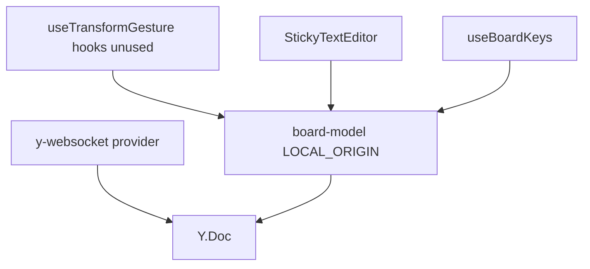
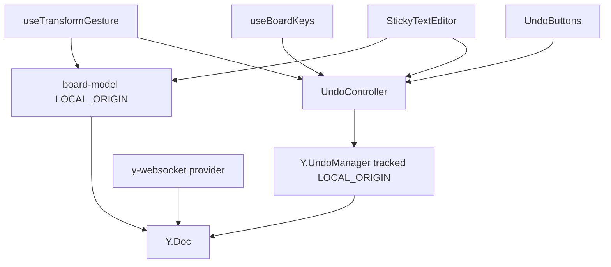
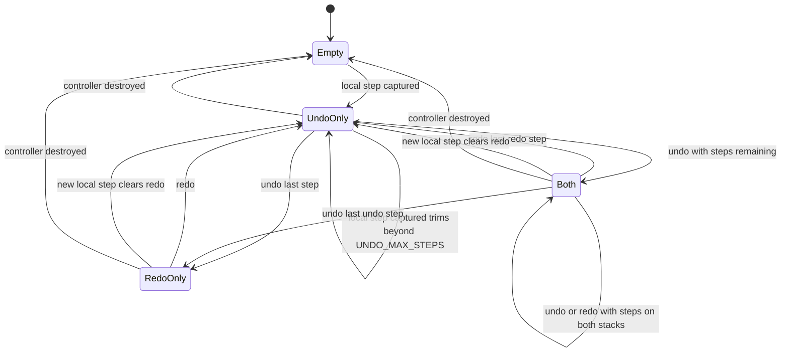
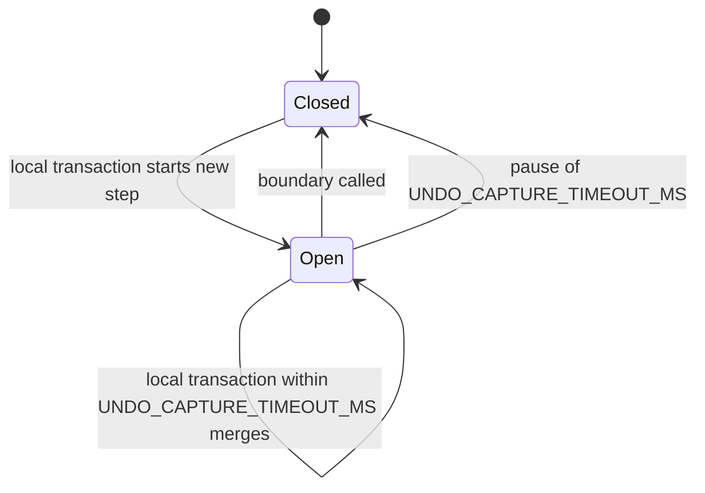
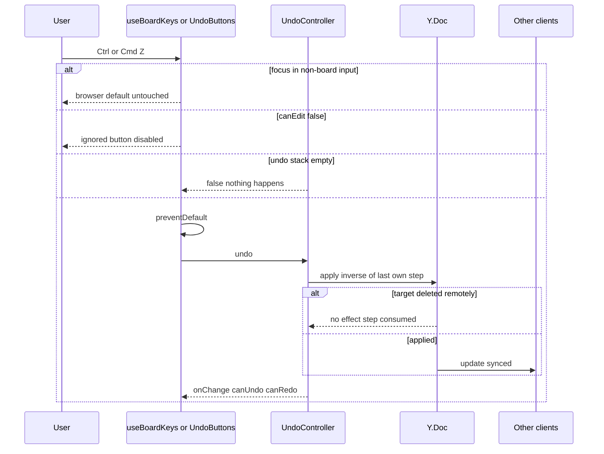
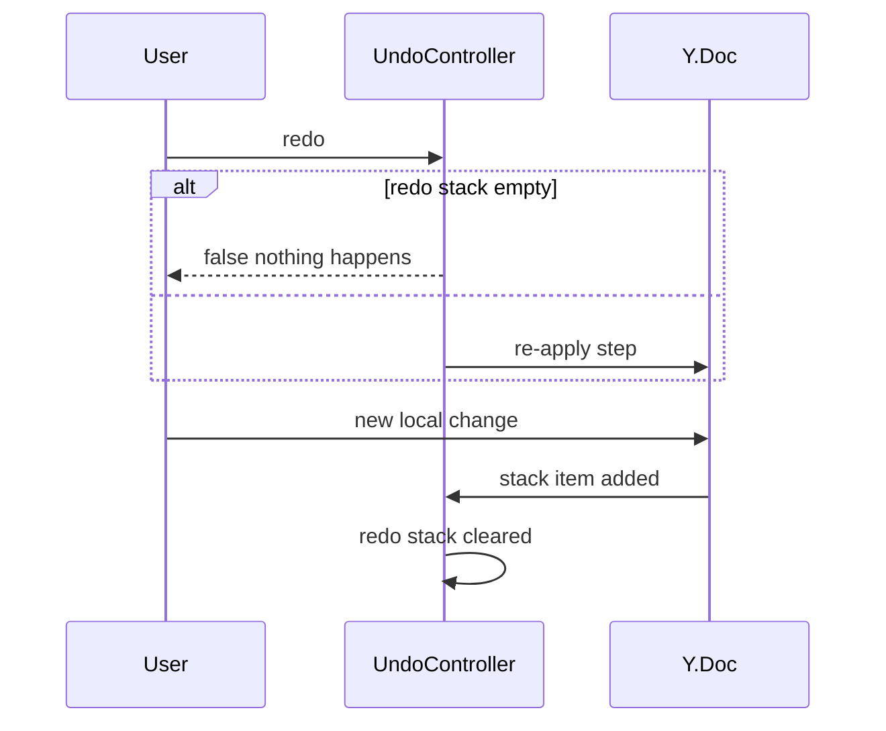
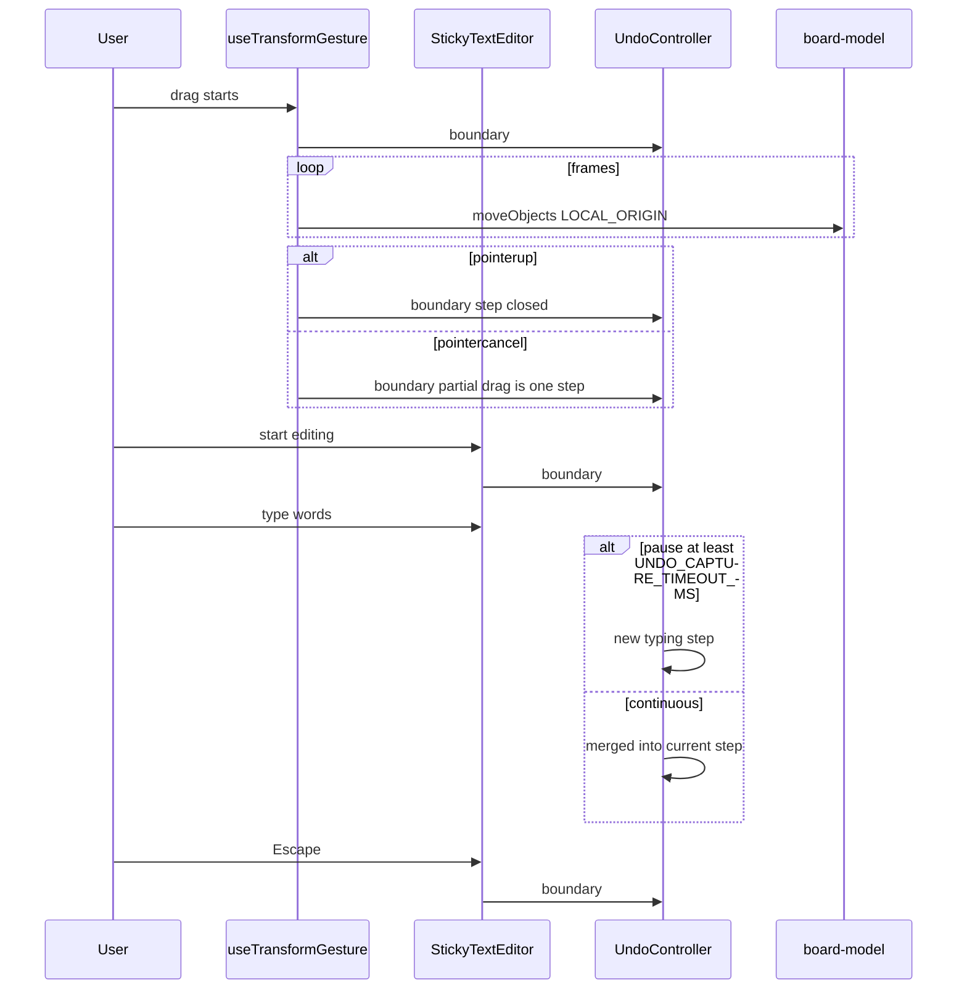

# Technical Design

A per-client UndoController wraps Y.UndoManager over the objects map, tracking only LOCAL_ORIGIN transactions so remote changes are never captured. Gesture and editing boundaries (story 7 transform hooks, text editor) make each action one step; typing bursts group by a named capture timeout. Shortcuts and toolbar buttons expose undo/redo and respect the story 4 edit lock.

## Overview

## Context
Story 2 made every local mutation a `doc.transact(fn, LOCAL_ORIGIN)`; story 3 applies remote updates with the provider as origin; story 7 added `useTransformGesture` with `onGestureStart/End` and group operations that each run in one transaction; story 4 added `canEdit`. This story only observes those transactions.

## Files
| Path | Change | Purpose |
|---|---|---|
| `src/client/board/undo.ts` | added | `createUndo(doc, opts)` → `UndoController` over `Y.UndoManager` |
| `src/client/board/useUndo.ts` | added | React binding: canUndo, canRedo, undo, redo, boundary |
| `src/client/board/UndoButtons.tsx` | added | toolbar buttons |
| `src/client/board/useTransformGesture.ts` | modified | story 7 hooks call `boundary()` |
| `src/client/objects/StickyTextEditor.tsx` | modified | `boundary()` on edit start and end |
| `src/client/board/useBoardKeys.ts` | modified | undo/redo shortcuts |
| `src/client/board/Toolbar.tsx` | modified | renders `UndoButtons` |
| `src/client/App.tsx` | modified | creates one controller per board doc; destroys on board change |
| `src/shared/config.ts` | modified | settings below |

## Named settings
```ts
export const UNDO_CAPTURE_TIMEOUT_MS = 500;   // typing pause that ends a burst
export const UNDO_MAX_STEPS = 200;
```

## Key decisions
1. **Origin filtering, not user filtering.** `trackedOrigins = new Set([LOCAL_ORIGIN])`. Only this tab's own transactions enter the stacks; remote updates (provider origin) and story 4 load updates are ignored. Undo applies inverse operations as a new LOCAL_ORIGIN-free transaction that syncs like any change.
2. **Explicit boundaries.** `captureTimeout` merges transactions within UNDO_CAPTURE_TIMEOUT_MS, which is right for typing but would merge unrelated clicks. `boundary()` (`stopCapturing()`) is called at gesture start and end and at edit start and end, so drags and edits never merge with neighbours, while rAF frames inside one drag do merge.
3. **Delete-wins safety comes from Yjs.** Undoing a move of an object deleted remotely targets a deleted item; Yjs applies nothing. Undoing my own delete restores the item's content as of my delete.
4. **Scope is the objects map now**; story 16 adds `comments` to the scope via `UndoController.addScope`. New object types need no undo code.
5. **One controller per board doc**, created in `App.tsx`, destroyed on board change or unmount (history is session-only).

## Structure: current (after story 7)


## Structure: target

Delta: a controller observes the doc; gestures, editor, keys and buttons talk to it.

## State diagrams
Undo history (per tab, memory only, discarded on reload or board change):

Capture window (per tab):

No persisted state changes: the Y.Doc schema is untouched.

## Sequence: undo


## Sequence: redo and redo clearing


## Sequence: gesture and typing boundaries


## Test Strategy

## Test scopes and boundaries
| Capability | Levels | Boundary exercised | Why sufficient |
|---|---|---|---|
| undo.history | unit | controller over real Y.Docs | undo semantics live entirely in Yjs + controller |
| undo.boundaries | unit, ui-component | capture timing with fake clock; real hook/editor wiring in jsdom | proves steps map to user actions |
| undo.controls | ui-component, e2e | key/button handling; real multi-user browsers | only e2e proves remote changes stay intact through the real provider |

No server changes; no integration tests.

## Dimensions crossed
- **D1 Change origin:** local, remote, load (story 4).
- **D2 Step kind:** move gesture, resize gesture, delete, colour, create, typing.
- **D3 Target state at undo:** present, deleted remotely, edited remotely.
- **D4 Stack state:** empty, some, at UNDO_MAX_STEPS.
- **D5 Edit lock:** editable, load failed.

## Coverage table
| TC | Capability | D1 | D2 | D3 | D4 | D5 | Expected before → after | Level |
|---|---|---|---|---|---|---|---|---|
| TC-01 | undo.history | local + remote | move | present | some | editable | A moves X; peer creates Y, recolours Z; A undo → X restored, Y exists, Z keeps peer colour | unit |
| TC-02 | undo.history | remote only | create | present | empty | editable | peer changes only → canUndo false | unit |
| TC-03 | undo.history | load | create | present | empty | editable | updates applied with LOAD origin → canUndo false | unit |
| TC-04 | undo.history | local | delete | present | some | editable | delete 8 notes, undo → 8 restored with text, colour, size, position | unit |
| TC-05 | undo.history | local | move | present | some | editable | undo then redo → position re-applied | unit |
| TC-06 | undo.history | local | colour | present | some | editable | undo, then new change → canRedo false | unit |
| TC-07 | undo.history | local + remote | move | deleted remotely | some | editable | undo → no throw, object stays deleted, next undo works | unit |
| TC-08 | undo.history | local + remote | delete | edited remotely before my delete | some | editable | undo my delete → object restored with content at time of delete | unit |
| TC-09 | undo.history | local | create | present | UNDO_MAX_STEPS | editable | add 1 step → length stays UNDO_MAX_STEPS; oldest gone | unit |
| TC-10 | undo.history | local | create | present | UNDO_MAX_STEPS − 1 | editable | add 1 → length UNDO_MAX_STEPS, nothing dropped | unit |
| TC-11 | undo.history | local | create | present | some | editable | destroy controller and create new (reload) → canUndo false | unit |
| TC-12 | undo.boundaries | local | typing | present | some | editable | keystrokes 100 ms apart → one step | unit |
| TC-13 | undo.boundaries | local | typing | present | some | editable | pause exactly UNDO_CAPTURE_TIMEOUT_MS → two steps; pause − 1 ms → one | unit |
| TC-14 | undo.boundaries | local | move gesture | present | some | editable | 30-frame drag via useTransformGesture → one step restoring start | ui-component |
| TC-15 | undo.boundaries | local | move then colour within 200 ms | present | some | editable | two separate steps (boundary at gesture end) | ui-component |
| TC-16 | undo.boundaries | local | typing | present | some | editable | edit note, type, Ctrl+Z inside editor → typing undone, earlier move not undone | ui-component |
| TC-17 | undo.boundaries | local | move gesture cancelled | present | some | editable | pointercancel mid-drag → one step restoring start | ui-component |
| TC-18 | undo.controls | local | any | present | empty | editable | Undo and Redo buttons disabled; aria-disabled | ui-component |
| TC-19 | undo.controls | local | any | present | some | editable | Ctrl+Z, Cmd+Z, Ctrl+Shift+Z, Cmd+Shift+Z, Ctrl+Y call controller with preventDefault | ui-component |
| TC-20 | undo.controls | local | any | present | some | load failed | shortcuts ignored; buttons disabled (negative) | ui-component |
| TC-21 | undo.controls | local | any | present | some | editable | Ctrl+Z with focus in a non-board input (e.g. share link field) → controller not called (negative) | ui-component |
| TC-22 | undo.controls | local + remote | delete | present | some | editable | e2e: Mia deletes 8, Raj adds note, Mia Ctrl+Z → 8 back on both screens, Raj's note remains; Redo removes 8 again | e2e |
| TC-23 | undo.controls | local + remote | move | deleted remotely | some | editable | e2e: Mia moves note, Raj deletes it, Mia undoes → no error, note absent on both | e2e |
| TC-24 | undo.controls | local | move + typing | present | some | editable | e2e MAX_CONCURRENT_EDITORS contexts each make and undo own changes concurrently → identical final boards, each own change reverted | e2e |

## Boundary values
- History length: UNDO_MAX_STEPS − 1, exactly (TC-09, TC-10).
- Typing pause: UNDO_CAPTURE_TIMEOUT_MS − 1 ms vs exactly (TC-13).
- Stack empty (TC-02, TC-18).
- Participants: MAX_CONCURRENT_EDITORS (TC-24).

## Negative scenarios
| TC | Must not happen |
|---|---|
| TC-01, TC-22 | other people's changes reversed |
| TC-02, TC-03 | remote or load updates captured |
| TC-07, TC-23 | deleted objects recreated by undoing a move; errors shown |
| TC-20 | undo on a load-failed board |
| TC-21 | hijacking undo inside ordinary inputs |

## Error paths
| Contract error | TC |
|---|---|
| undo/redo on empty stack → false | TC-02, TC-18 |
| inverse targets deleted item → no effect | TC-07, TC-23 |
| gesture cancelled → still one step | TC-17 |

## Mock vs real boundaries
| Dependency | Mocked? | Reason |
|---|---|---|
| Y.Doc and Y.UndoManager | Real | behaviour under test |
| Remote peer (unit) | Second real Y.Doc exchanging updates with a non-local origin | deterministic remote changes without a server |
| Clock (TC-12, TC-13) | Fake system time (`vi.setSystemTime`) | capture timeout must be tested exactly |
| Server (e2e) | Real wrangler dev | proves provider origin is not tracked |

## E2E workflows
1. **Recover an accidental delete while a colleague works** (TC-22).
2. **Undo after a colleague deleted my object** (TC-23).
3. **Everyone undoing at once** (TC-24).

## Fixtures
Retro board with 12 notes in varied colours and sizes; 8 of them in one cluster for the delete scenario.

## Not covered
- Undo for object types from stories 9–12 and comments (story 16): covered by those stories' tests using this controller.
- IME composition interaction with capture timeout (manual).

## Per-user undo history

> Anchor: `undo.history`

## Contract
```ts
// src/client/board/undo.ts
export interface UndoController {
  undo(): boolean;                 // false when stack empty
  redo(): boolean;                 // false when stack empty
  boundary(): void;                // close the current capture window
  canUndo(): boolean; canRedo(): boolean;
  addScope(type: Y.AbstractType<unknown>): void; // story 16 adds comments
  onChange(cb: () => void): () => void;
  destroy(): void;
}
export function createUndo(doc: Y.Doc, opts?: { captureTimeoutMs?: number; maxSteps?: number }): UndoController;
```
- **Inputs:** board doc; defaults UNDO_CAPTURE_TIMEOUT_MS, UNDO_MAX_STEPS.
- **Outputs:** inverse changes applied to the doc and synced; stack state.
- **Errors:** none thrown; empty stacks return false; inverses on remotely deleted items have no effect.
- **Side effects:** listens to `stack-item-added` / `stack-item-popped`; trims the undo stack to `maxSteps` on add.

## Implementation
`new Y.UndoManager(doc.getMap('objects'), { trackedOrigins: new Set([LOCAL_ORIGIN]), captureTimeout })`. Redo clearing on new local steps is UndoManager's default behaviour. Trimming removes `undoStack[0]` while length exceeds `maxSteps`. `destroy()` disposes the manager; a fresh controller after reload starts empty (undo.session_only).

## Tests
Unit TC-01 to TC-11 (`tests/unit/undo-history.test.ts`).

## Undo step boundaries

> Anchor: `undo.boundaries`

## Contract
- `useTransformGesture` (story 7): `onGestureStart = undo.boundary`, `onGestureEnd = undo.boundary` (also on pointercancel).
- `StickyTextEditor` (story 2): calls `undo.boundary()` on mount (edit start) and on end (Escape/outside click); Ctrl/Cmd+Z inside the textarea calls `undo.undo()` with `preventDefault` so the browser's native textarea undo does not diverge from the Y.Text.
- Group operations from story 7 (`deleteObjects`, `setStickyColor`, `createSticky`) already run one transaction each; `useBoardKeys` and toolbars call `boundary()` before and after invoking them.
- **Errors:** none; boundary on an empty stack is a no-op.

## Implementation
Within a gesture, per-frame `moveObjects` transactions fall inside one capture window because no boundary is called until the gesture ends and frames are < UNDO_CAPTURE_TIMEOUT_MS apart. Typing relies on the capture timeout alone between edit start and end.

## Tests
Unit TC-12, TC-13 (`tests/unit/undo-boundaries.test.ts`); component TC-14 to TC-17 (`tests/component/UndoBoundaries.test.tsx`).

## Undo shortcuts and buttons

> Anchor: `undo.controls`

## Contract
```tsx
// src/client/board/useUndo.ts
export function useUndo(controller: UndoController, canEdit: boolean): { canUndo: boolean; canRedo: boolean; undo(): void; redo(): void };
// src/client/board/UndoButtons.tsx
export function UndoButtons(props: ReturnType<typeof useUndo>): JSX.Element;
```
- **Inputs:** keydown via `useBoardKeys`; button clicks.
- **Outputs:** Ctrl/Cmd+Z → undo; Ctrl/Cmd+Shift+Z and Ctrl+Y → redo, each with `preventDefault`; `button[aria-label="Undo"]`, `button[aria-label="Redo"]` with tooltips showing shortcuts, disabled when the stack is empty or `canEdit` is false.
- **Errors:** shortcuts ignored when focus is in a non-board input or `canEdit` is false.
- **Side effects:** `onChange` subscription re-renders button state.

## Implementation
- **Personal scope (undo.own, undo.redo):** the shortcuts and buttons only ever call the `UndoController` created in this tab by `App.tsx` for this board. That controller's `Y.UndoManager` tracks `LOCAL_ORIGIN` only, so its undo and redo stacks contain exclusively this person's own transactions; other people's changes arrive with the provider origin and never enter these stacks. Each participant's tab has its own independent controller, so five simultaneous editors each undo and redo their own work without affecting anyone else's stacks or changes. There is no shared or server-side history.
- While a sticky is being edited, the editor handles Ctrl/Cmd+Z itself (undo.boundaries) and `useBoardKeys` ignores the event, avoiding double undo.

## Tests
Component TC-18 to TC-21 (`tests/component/UndoControls.test.tsx`); e2e TC-22 (other person's changes intact after my undo/redo), TC-23, TC-24 (each of MAX_CONCURRENT_EDITORS undoes only own changes) in `tests/e2e/undo.spec.ts`.

