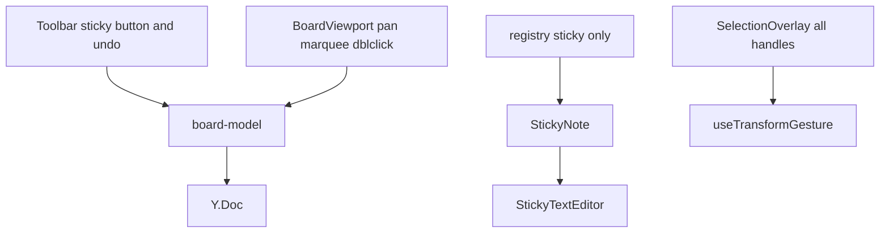
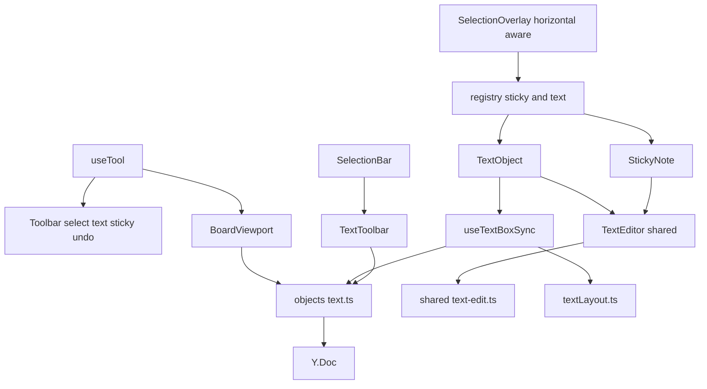
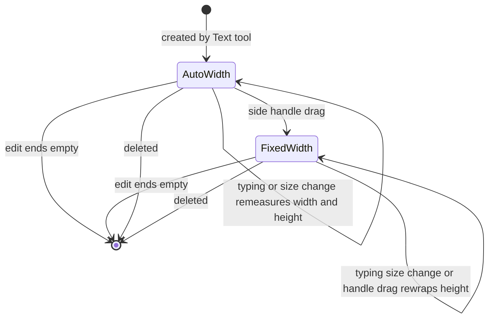
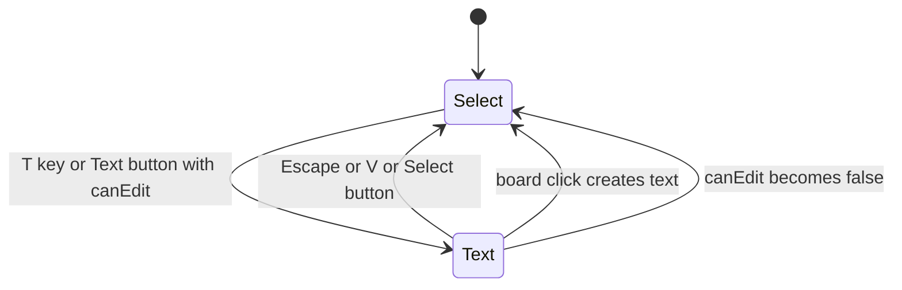
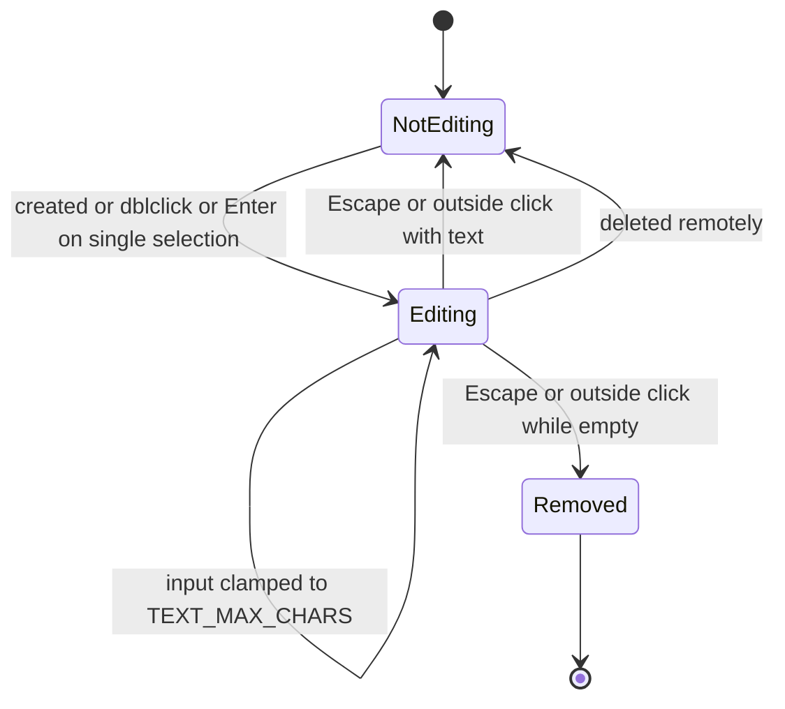
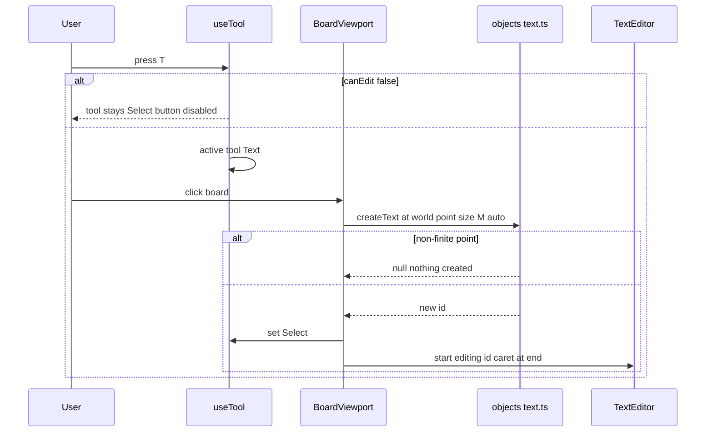
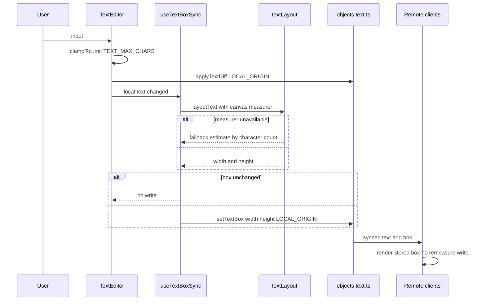
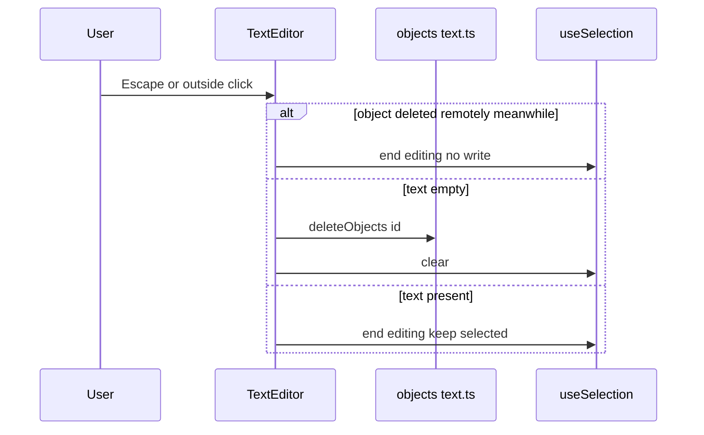
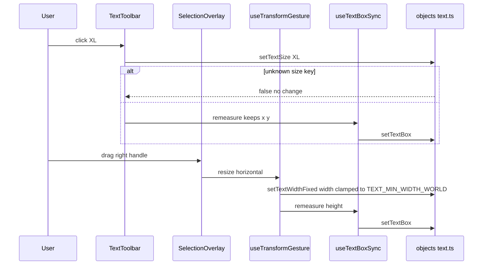

# Technical Design

Adds a `text` object type (Y.Text, size preset, auto/fixed width mode, stored width/height) in src/shared/objects/text.ts, a pure text layout function with a canvas measurer, a tool-mode hook with V/T/N/Escape shortcuts, and a TextObject component registered with horizontal-only handles. Selection, move, delete and undo come from stories 7 and 8 unchanged.

## Overview

## Context
Builds on story 2 (`StickyText.ts` clamp/diff, `StickyTextEditor`), story 3 (sync, delete-while-editing), story 4 (`canEdit`), story 6 (`useIdentity` for `createdBy`), story 7 (registry, selection, transform gesture, group ops), story 8 (undo boundaries). Text is the first object type added purely through the registry.

## Files
| Path | Change | Purpose |
|---|---|---|
| `src/shared/objects/text.ts` | added | text schema helpers: create, set size, set width mode, set box, empty check |
| `src/shared/text-edit.ts` | added | `clampToLimit(next, max)`, `applyTextDiff` moved from `src/client/objects/StickyText.ts` (story 2) so both types share them; `StickyText.ts` re-exports |
| `src/client/objects/textLayout.ts` | added | pure `layoutText`, `createCanvasMeasurer` |
| `src/client/objects/useTextBoxSync.ts` | added | writes measured width/height after local text or size changes |
| `src/client/objects/TextEditor.tsx` | added | generalised from `StickyTextEditor` (limit, font, onEnd); `StickyTextEditor` becomes a thin wrapper |
| `src/client/objects/TextObject.tsx` | added | render + edit text objects |
| `src/client/objects/TextToolbar.tsx` | added | S/M/L/XL + Delete |
| `src/client/objects/registry.tsx` | modified | `ObjectTypeSpec.handles?: 'all' \| 'horizontal'` (default 'all'); registers `text` |
| `src/client/board/SelectionOverlay.tsx` | modified | shows only e/w handles when every selected spec is horizontal |
| `src/client/board/useTool.ts` | added | active tool state `select \| text`, shortcuts |
| `src/client/board/Toolbar.tsx` | modified | Select and Text tool buttons, pressed state |
| `src/client/canvas/BoardViewport.tsx` | modified | text cursor and click-to-create when Text tool active |
| `src/client/board/SelectionBar.tsx` | modified | TextToolbar when exactly one text selected |

## Named settings added
```ts
export const TEXT_MAX_AUTO_WIDTH_WORLD = 600;
export const TEXT_MIN_WIDTH_WORLD = 40;
export const TEXT_MAX_CHARS = 5000;
export const TEXT_SIZES = { S: 14, M: 20, L: 32, XL: 56 } as const;
export type TextSize = keyof typeof TEXT_SIZES;
export const DEFAULT_TEXT_SIZE: TextSize = 'M';
export const TEXT_LINE_HEIGHT = 1.3;
export const TEXT_FONT_FAMILY = 'Inter, system-ui, sans-serif';
```

## Document schema addition
```
objects/<id>: Y.Map {
  type: 'text', x, y, width, height, z, createdAt, createdBy,
  text: Y.Text,
  size: TextSize,
  widthMode: 'auto' | 'fixed'
}
```

## Key decisions
1. **Stored box, measured by the editor.** Selection bounds, marquee and export need `width/height` without measuring on every client. The client that made the local change (typing, size change, fixed-width drag) measures and writes `width/height` in the same capture window, so undo reverts text and box together. Remote clients render using the stored box; they never write dimensions, avoiding write storms from five clients re-measuring the same change.
2. **Horizontal-only handles.** Height is derived; the registry gains `handles: 'horizontal'`. In a mixed selection (text + stickies) the group bounding box shows all handles; text objects are repositioned proportionally and, if `widthMode === 'fixed'`, their width scales; font size never changes via handles.
3. **Empty text removal happens on edit end** in the same transaction window as the last edit so one undo restores the text.
4. **Tool mode.** A minimal `useTool` with `select` and `text`; stories 10–12 add their tools. `N` keeps story 2's immediate sticky creation (documented shortcut only).

## Structure: current (after stories 7 and 8)


## Structure: target

Delta: tool state is new; text model, layout, box sync, editor generalisation and text toolbar are new; registry and overlay learn horizontal handles.

## State diagrams
Persisted text object lifecycle:

Per-client tool state (not persisted):

Per-client text editing state (not persisted):


## Sequence: create text with the tool


## Sequence: typing and box sync


## Sequence: end editing


## Sequence: size change and fixed width


## Test Strategy

## Test scopes and boundaries
| Capability | Levels | Boundary exercised | Why sufficient |
|---|---|---|---|
| text.model | unit | real Y.Doc | schema rules and validation |
| text.layout | unit, ui-component | pure layout with fake measurer; hook writing box in jsdom | layout maths is pure; write-on-local-only needs the hook |
| text.tool | ui-component, e2e | tool hook and toolbar; real browser keys and clicks | shortcut conflicts and cursor only real in browser |
| text.object | ui-component, e2e | rendering, editor, toolbar; real font layout and multi-user | real fonts decide wrapping; live merge needs server |

No server changes; no integration tests.

## Dimensions crossed
- **D1 Operation:** activate tool, create, type, paste, end edit, size change, handle drag, select/move/delete/undo.
- **D2 Width mode:** auto, fixed.
- **D3 Content length:** 0, short line, line longer than max auto width, TEXT_MAX_CHARS.
- **D4 Editability:** editable, load failed.
- **D5 Concurrency:** single user, two users same text, delete while editing.

## Coverage table
| TC | Capability | D1 | D2 | D3 | D4 | D5 | Expected before → after | Level |
|---|---|---|---|---|---|---|---|---|
| TC-01 | text.model | create | auto | 0 | editable | single | createText(100,50) → type text, size M, widthMode auto, empty Y.Text, z top, createdBy set | unit |
| TC-02 | text.model | size change | auto | short | editable | single | setTextSize XL → size XL; 'XXL' → false, no update (error path) | unit |
| TC-03 | text.model | handle drag | fixed | short | editable | single | setTextWidthFixed 30 → clamped TEXT_MIN_WIDTH_WORLD, widthMode fixed | unit |
| TC-04 | text.model | end edit | auto | 0 | editable | single | isEmptyText true → deleteIfEmpty removes; with '  ' whitespace-only kept (decision: only zero characters counts as empty) | unit |
| TC-05 | text.model | paste | auto | TEXT_MAX_CHARS | editable | single | clampToLimit 5,001 → 5,000; 4,999 + 1 accepted (boundaries) | unit |
| TC-06 | text.model | create | auto | 0 | editable | single | non-finite point → null, no transaction | unit |
| TC-07 | text.layout | type | auto | short | editable | single | layoutText 'Went well' measured 90 at M → width 90 + padding, height one line | unit |
| TC-08 | text.layout | type | auto | longer than max | editable | single | line 900 wide → width TEXT_MAX_AUTO_WIDTH_WORLD, wraps to 2 lines, height 2 lines | unit |
| TC-09 | text.layout | type | auto | exactly max | editable | single | line exactly 600 → one line, width 600 (boundary) | unit |
| TC-10 | text.layout | handle drag | fixed | short | editable | single | fixed 40 with 3 words → wraps per word; height grows | unit |
| TC-11 | text.layout | type | auto | multi-line with Enter | editable | single | width = longest line; height = lines × size × TEXT_LINE_HEIGHT | unit |
| TC-12 | text.layout | type | auto | short | editable | two users | useTextBoxSync: remote text change → no write; local change → one setTextBox | ui-component |
| TC-13 | text.layout | size change | auto | short | editable | single | box unchanged after remeasure → no write (negative) | ui-component |
| TC-14 | text.tool | activate | auto | 0 | editable | single | T → Text active, button pressed; Escape → Select; V → Select | ui-component |
| TC-15 | text.tool | activate | auto | 0 | load failed | single | T ignored; Text button disabled (negative) | ui-component |
| TC-16 | text.tool | activate | auto | 0 | editable | single | T while editing a note types 't', tool unchanged (negative) | ui-component |
| TC-17 | text.tool | create | auto | 0 | editable | single | Text active, click board → createText at world point; tool back to Select; editing started | ui-component |
| TC-18 | text.tool | create | auto | 0 | editable | single | N still creates sticky at view centre (regression) | ui-component |
| TC-19 | text.object | type | auto | short | editable | single | editor caret at end; Enter inserts newline; Escape ends and keeps text selected | ui-component |
| TC-20 | text.object | end edit | auto | 0 | editable | single | Escape with no characters → object removed, selection cleared | ui-component |
| TC-21 | text.object | size change | auto | short | editable | single | TextToolbar shows S M L XL with M pressed; click XL → setTextSize XL, x/y unchanged | ui-component |
| TC-22 | text.object | handle drag | auto | short | editable | single | selecting one text shows only e and w handles | ui-component |
| TC-23 | text.object | select/move | auto | short | editable | single | text + sticky selection shows all handles; resize moves text proportionally, font size unchanged | ui-component |
| TC-24 | text.object | end edit | auto | short | editable | delete while editing | remote delete during edit → editor unmounts, no error, no recreation | ui-component |
| TC-25 | text.object | undo | auto | short | editable | single | type then Ctrl+Z → text and stored box revert together in one step | ui-component |
| TC-26 | text.object | create + type | auto | longer than max | editable | single | e2e: T, click, type 300-char sentence → box width 600 ±2, multiple lines rendered | e2e |
| TC-27 | text.object | handle drag | fixed | short | editable | single | e2e: drag right handle narrower → words wrap, height grows, no top/bottom handles | e2e |
| TC-28 | text.object | size change + move + delete + undo | auto | short | editable | single | e2e golden path: XL heading, drag, Delete, Ctrl+Z restores | e2e |
| TC-29 | text.object | type | auto | short | editable | two users same text | e2e: both type into one text simultaneously → identical text with all characters | e2e |
| TC-30 | text.tool | create | auto | 0 | editable | MAX_CONCURRENT_EDITORS | e2e: each context creates a heading at once → all headings visible on all screens | e2e |
| TC-31 | text.object | end edit | auto | 0 | editable | single | e2e: T, click, Escape without typing → no object in doc (marquee over area selects nothing) | e2e |

## Boundary values
- Auto width: just under, exactly and over TEXT_MAX_AUTO_WIDTH_WORLD (TC-07, TC-09, TC-08).
- Fixed width: below and at TEXT_MIN_WIDTH_WORLD (TC-03, TC-10).
- Length: 0, 4,999 + 1, 5,001 (TC-04, TC-05).
- Participants: MAX_CONCURRENT_EDITORS (TC-30).

## Negative scenarios
| TC | Must not happen |
|---|---|
| TC-13 | redundant box writes |
| TC-12 | remote clients writing dimensions |
| TC-15 | text tool on a load-failed board |
| TC-16 | T shortcut hijacking typing |
| TC-20, TC-31 | invisible empty text left on the board |
| TC-24 | deleted text recreated |

## Error paths
| Contract error | TC |
|---|---|
| unknown size key → false | TC-02 |
| non-finite create point → null | TC-06 |
| over-length input → clamped | TC-05 |
| measurer unavailable → estimate fallback | TC-32: jsdom without canvas → layoutText uses character-count estimate, no throw (unit) |
| target deleted during edit → edit ends | TC-24 |

## Mock vs real boundaries
| Dependency | Mocked? | Reason |
|---|---|---|
| Y.Doc, UndoManager | Real | store and undo semantics under test |
| Text measurement | Fake measurer (fixed px per character) in unit; real canvas + fonts in e2e | deterministic maths vs real wrapping |
| Sync server | Real wrangler dev in e2e | concurrent typing merge |

## E2E workflows
1. **Title a retro section** (TC-28).
2. **Long annotation** (TC-26 → TC-27).
3. **Two people edit one heading** (TC-29); **everyone adds headings** (TC-30).
4. **Abandoned text** (TC-31).

## Fixtures
Retro board with two clusters of notes; headings "Went well", "To improve"; a 300-character English annotation; 5,001-character pasted paragraph.

## Not covered
- Font loading flashes (manual).
- IME composition in text objects (shares story 2's editor handling; manual).
- Right-to-left text layout.

## Text object model

> Anchor: `text.model`

## Contract
```ts
// src/shared/objects/text.ts
export interface TextSnapshot extends ObjectSnapshot { type: 'text'; text: string; size: TextSize; widthMode: 'auto' | 'fixed' }
export function createText(doc: Y.Doc, at: Point, createdBy: string): string | null;
export function setTextSize(doc: Y.Doc, id: string, size: string): boolean;
export function setTextWidthFixed(doc: Y.Doc, id: string, width: number): boolean; // clamps to TEXT_MIN_WIDTH_WORLD
export function setTextBox(doc: Y.Doc, id: string, box: { width: number; height: number }): boolean;
export function getTextContent(doc: Y.Doc, id: string): Y.Text | undefined;
export function isEmptyText(doc: Y.Doc, id: string): boolean;          // zero characters
export function deleteIfEmpty(doc: Y.Doc, id: string): boolean;
// src/shared/text-edit.ts
export function clampToLimit(next: string, max: number): string;
export function applyTextDiff(ytext: Y.Text, next: string, origin: unknown): void;
```
- **Errors:** stale id, unknown size, non-finite numbers → false/null, no transaction.
- **Side effects:** LOCAL_ORIGIN transactions; `createText` sets z above all objects and `createdBy` from identity.

## Implementation
Text objects use story 7's generic `moveObjects`, `deleteObjects` and selection; nothing text-specific is added to those (text.consistent). Low reversibility: `size` stored as preset key and `widthMode` are persisted schema. `StickyText.ts` re-exports `clampToLimit`/`applyTextDiff` from `text-edit.ts` with STICKY_TEXT_MAX_CHARS so story 2 callers are unchanged.

## Tests
Unit TC-01 to TC-06 (`tests/unit/text-model.test.ts`).

## Text layout and box sync

> Anchor: `text.layout`

## Contract
```ts
// src/client/objects/textLayout.ts
export type Measurer = (text: string, fontPx: number) => number; // width in world units
export function createCanvasMeasurer(fontFamily?: string): Measurer; // falls back to estimate without canvas
export function layoutText(text: string, size: TextSize, mode: 'auto' | 'fixed', fixedWidth: number | null, measure: Measurer):
  { width: number; height: number; lines: string[] };
// src/client/objects/useTextBoxSync.ts
export function useTextBoxSync(doc: Y.Doc, id: string, measure: Measurer): { remeasureAfterLocalChange(): void };
```
- **Outputs:** auto mode → width = min(longest line, TEXT_MAX_AUTO_WIDTH_WORLD) with greedy word wrap beyond; fixed mode → width = fixedWidth; height = lines × TEXT_SIZES[size] × TEXT_LINE_HEIGHT; explicit newlines respected.
- **Errors:** measurer unavailable → estimate (average glyph width constant), never throws.
- **Side effects:** `setTextBox` only when the computed box differs and only after a local change.

## Implementation
`TextEditor` input, `TextToolbar` size change and the fixed-width handle gesture call `remeasureAfterLocalChange`; remote updates never trigger writes (Key decision 1). The editor's typing and the box write fall in the same undo capture window.

## Tests
Unit TC-07 to TC-11, TC-32 (`tests/unit/text-layout.test.ts`); component TC-12, TC-13 (`tests/component/TextBoxSync.test.tsx`).

## Tool mode and Text tool

> Anchor: `text.tool_ui`

## Contract
```ts
// src/client/board/useTool.ts
export type Tool = 'select' | 'text';   // stories 10-12 extend
export function useTool(canEdit: boolean): { tool: Tool; setTool(t: Tool): void };
```
- **Inputs:** keydown V, T, N, Escape (ignored while editing text or focus in inputs); Toolbar clicks; board click in `BoardViewport`.
- **Outputs:** Toolbar `button[aria-label="Select (V)"]` and `button[aria-label="Text (T)"]` with `aria-pressed`; `cursor: text` over the board while Text active; board click with Text active → `createText(screenToWorld(point), identity.id)`, `setTool('select')`, start editing the new id. N keeps story 2 behaviour (create sticky at view centre).
- **Errors:** `canEdit` false → Text button disabled, T ignored, active Text reverts to Select.
- **Side effects:** none persisted.

## Implementation
While Text is active, empty-space pointerdown does not pan or marquee; clicking on an existing object still creates text on top at that point.

## Tests
Component TC-14 to TC-18 (`tests/component/Tool.test.tsx`); e2e TC-30 and golden path TC-28.

## Text object rendering, editing and toolbar

> Anchor: `text.object`

## Contract
```tsx
// src/client/objects/TextObject.tsx
export function TextObject(props: ObjectProps & { note: TextSnapshot }): JSX.Element;
// src/client/objects/TextEditor.tsx (generalised from story 2)
export function TextEditor(props: { ytext: Y.Text; maxChars: number; fontPx: number; width: number | 'auto'; onInput(): void; onEnd(next: 'selected' | 'unselected'): void; undo: UndoController }): JSX.Element;
// src/client/objects/TextToolbar.tsx
export function TextToolbar(props: { size: TextSize; onSize(s: TextSize): void; onDelete(): void }): JSX.Element;
// registry registration
registerObjectType('text', { Component: TextObject, resizable: true, aspectLocked: false, minSize: TEXT_MIN_WIDTH_WORLD, editableText: true, handles: 'horizontal', hitTest });
```
- **Outputs:** absolutely positioned plain text (no fill) at x/y with stored width/height, `white-space: pre-wrap`, font TEXT_SIZES[size]; editor as story 2 (caret at end, Enter newline, Escape/outside click ends, minimal Y.Text diff, clamp to TEXT_MAX_CHARS); TextToolbar size buttons `aria-pressed`, Delete.
- **Errors:** remote deletion during editing ends editing silently; `canEdit` false prevents entering edit mode.
- **Side effects:** edit end calls `deleteIfEmpty`; size change and handle drag call `remeasureAfterLocalChange`; undo boundaries on edit start/end (story 8).

## Implementation
- Selection, move, nudge, delete, marquee and undo come unchanged from stories 7 and 8 via the registry (text.consistent).
- `SelectionOverlay` shows only e/w handles when all selected specs are `handles: 'horizontal'`; a horizontal handle drag on a single text calls `setTextWidthFixed`. In mixed selections text is repositioned proportionally, fixed widths scale, font size never changes.
- Concurrent typing merges via Y.Text minimal diffs (text.concurrent).

## Tests
Component TC-19 to TC-25 (`tests/component/TextObject.test.tsx`); e2e TC-26 to TC-29, TC-31 (`tests/e2e/text.spec.ts`).

