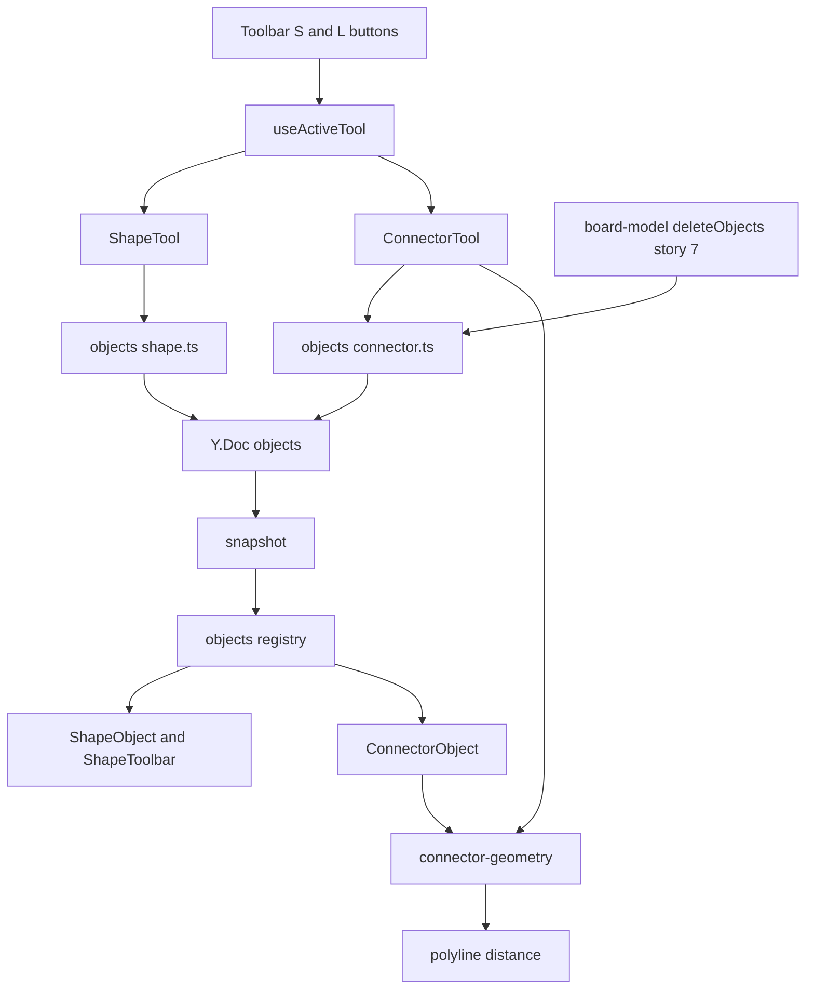
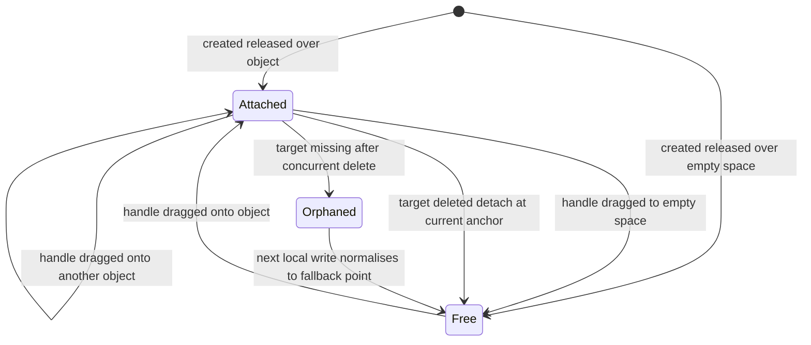
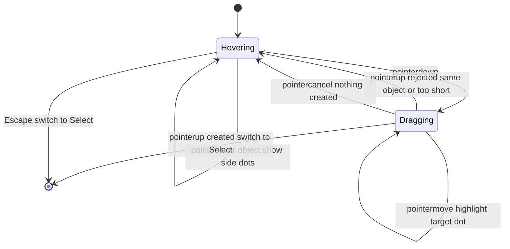
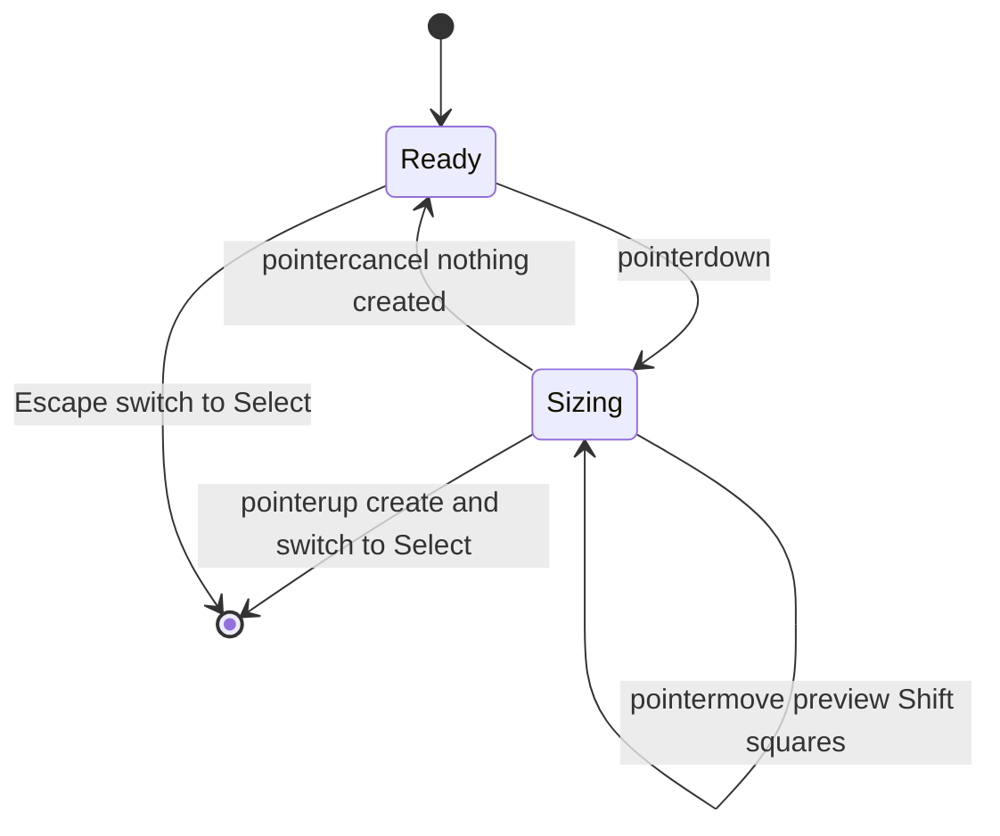
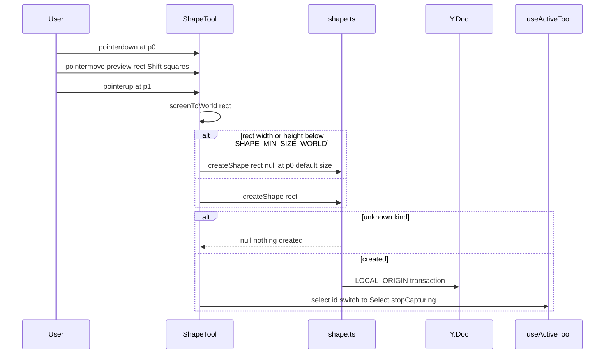
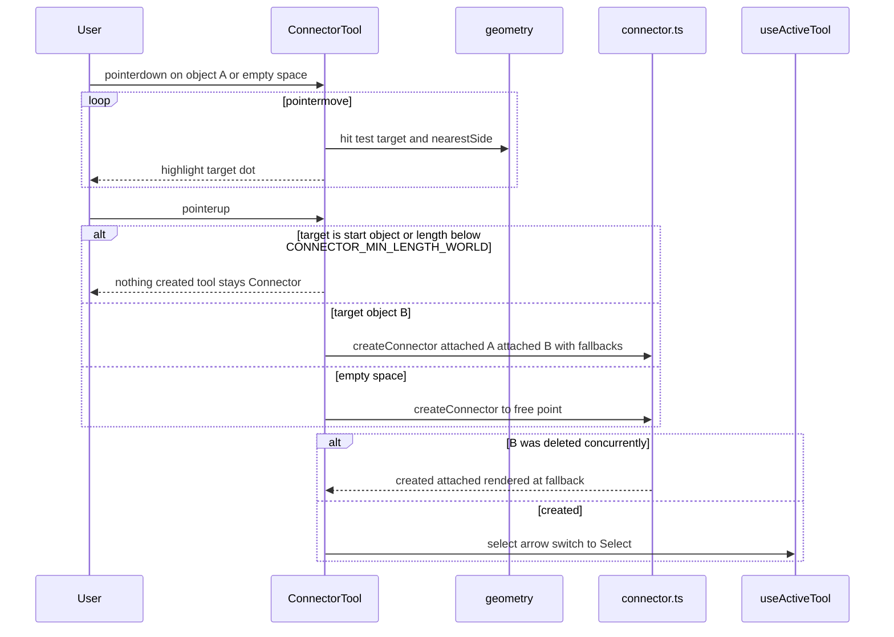
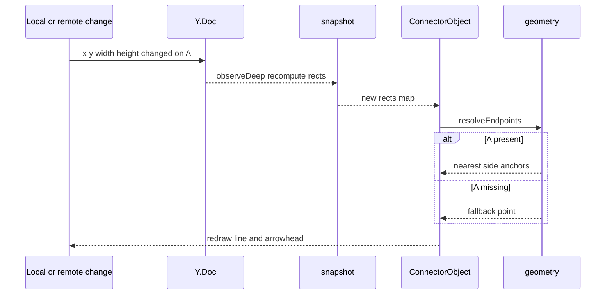
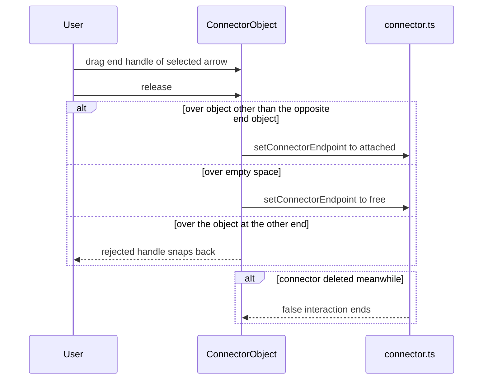
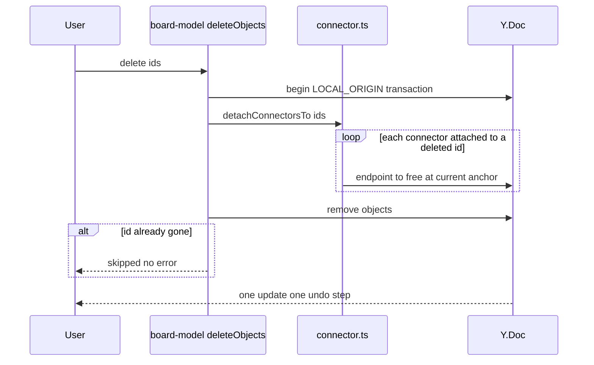

# Technical Design

Adds shape and connector object types to the Yjs board model with pure geometry for side anchors, nearest-side selection and line hit-testing. ShapeObject and ConnectorObject register in the story 7 object registry; Shape and Connector tools (with an active-tool hook shared by stories 9-12) create them. Connector endpoints resolve at render time from live object rectangles, so moves by anyone redraw arrows; deletions detach ends inside the same transaction.

## Overview

## Context
Builds on story 1 (`camera.ts`, `BoardViewport`), story 2 (`src/shared/board-model.ts`, Y.Doc `objects`, `StickyText` editor), story 3 (live sync — no server change needed here), and the cross-story conventions for story 7 (object registry, `Set` selection, generic `moveObjects/resizeObject/deleteObjects`) and story 8 (every local mutation is a `LOCAL_ORIGIN` transaction; gesture end calls `undoManager.stopCapturing()`).

## Files
| Path | Change | Purpose |
|---|---|---|
| `src/shared/objects/shape.ts` | added | shape schema, `createShape`, `setShapeStyle`, `getShapeLabel` |
| `src/shared/objects/connector.ts` | added | connector schema, `createConnector`, `setConnectorEndpoint`, `detachConnectorsTo` |
| `src/shared/geometry/connector-geometry.ts` | added | `sideAnchor`, `nearestSide`, `resolveEndpoints`, `connectorBBox` |
| `src/shared/geometry/polyline.ts` | added | `distanceToPolyline` (reused by story 11) |
| `src/shared/board-model.ts` | modified | story 7's `deleteObjects` calls `detachConnectorsTo(doc, ids)` inside its transaction; `snapshot` derives connector bbox |
| `src/shared/config.ts` | modified | settings below |
| `src/client/tools/useActiveTool.ts` | added if absent, else extended | active tool id, shortcuts (S, L, V, Escape), return-to-select |
| `src/client/tools/ShapeTool.tsx` | added | drag/click creation with preview |
| `src/client/tools/ConnectorTool.tsx` | added | hover dots, drag preview, creation |
| `src/client/objects/ShapeObject.tsx` | added | SVG shape + centred wrapping label |
| `src/client/objects/ShapeToolbar.tsx` | added | fill and outline swatches |
| `src/client/objects/ConnectorObject.tsx` | added | SVG line, arrowhead, end handles for re-attach |
| `src/client/objects/registry.tsx` | modified | register `shape` and `connector` |
| `src/client/board/Toolbar.tsx` | modified | Shape button with kind menu, Connector button |

## Named settings added
```ts
export const SHAPE_KINDS = ['rect', 'ellipse', 'diamond'] as const;
export const SHAPE_DEFAULT_SIZE_WORLD = 160;
export const SHAPE_MIN_SIZE_WORLD = 20;
export const SHAPE_LABEL_MAX_CHARS = 500;
export const SHAPE_STROKE_WIDTH_WORLD = 2;
export const SHAPE_FILL_COLORS = { none: 'transparent', white: '#FFFFFF', blue: '#BBDEFB', green: '#C8E6C9', yellow: '#FFF9C4', pink: '#F8BBD0', grey: '#E0E0E0' } as const;
export const SHAPE_STROKE_COLORS = { dark: '#263238', blue: '#1E88E5', green: '#43A047', orange: '#FB8C00', red: '#E53935', grey: '#9E9E9E' } as const;
export const DEFAULT_SHAPE_FILL = 'white';
export const DEFAULT_SHAPE_STROKE = 'dark';
export const CONNECTOR_MIN_LENGTH_WORLD = 8;
export const CONNECTOR_HIT_TOLERANCE_PX = 6;
export const CONNECTOR_STROKE_WIDTH_WORLD = 2;
export const CONNECTOR_ARROWHEAD_SIZE_WORLD = 10;
export const CONNECTOR_DOT_RADIUS_PX = 4;
```

## Schema additions (additive; `meta.schemaVersion` stays 1)
```
shape:     common fields + kind: ShapeKind, fill: FillColor, stroke: StrokeColor, label: Y.Text
connector: common fields (x, y, width, height stored as 0, derived in snapshot)
           + from: Endpoint, to: Endpoint
Endpoint = { kind: 'attached', objectId: string, fallback: { x, y } }
         | { kind: 'free', x: number, y: number }
```
Decision: attached endpoints store no side. The side is recomputed from current rectangles every render (`nearestSide`), which is what makes arrows switch sides as objects move and follow remote moves without writes. `fallback` is the anchor point at attach time, used only if the target vanished concurrently (connector.target_deleted race).

## Structure diagram


## State diagrams
Connector endpoint (persisted in the doc):

Orphaned is a render-time condition (target id absent from snapshot) drawn at `fallback`.

Connector tool gesture (local, not persisted):


Shape tool gesture (local):


## Sequence: create shape


## Sequence: create connector


## Sequence: object moved or resized by anyone


## Sequence: re-attach an end handle


## Sequence: delete connected object


## Test Strategy

## Test scopes and boundaries
| Capability | Levels | Boundary exercised | Why sufficient |
|---|---|---|---|
| shape.model | unit | pure model on a real Y.Doc | creation sizing, clamping and style validation are deterministic |
| connector.model | unit | pure model and geometry on a real Y.Doc | endpoint rules, side choice, detach and hit distance are deterministic |
| shape.ui | ui-component, e2e | jsdom components; real browser | gestures and label editing need events; exact geometry needs real layout |
| connector.ui | ui-component, e2e | jsdom; real browser with two contexts | hover dots and handles are DOM; follow-on-remote-move needs the real sync path |
| tools.active_tool | ui-component | hook + toolbar in jsdom | shortcut and return-to-select logic is pure UI state |

No server code changes, so no integration tests; sync correctness is proven in story 3 and exercised here only in e2e.

## Dimensions crossed
- **D1 Operation**: create shape (drag, click, Shift), label, style, create connector, re-attach, follow, delete target, select arrow.
- **D2 Endpoint kind**: attached, free, orphaned (target missing).
- **D3 Zoom**: 100%, 50%, 200% (geometry-dependent cases).
- **D4 Actor**: local user, remote user.

D2 classes are exhaustive and non-overlapping for a given endpoint.

## Coverage table
| TC | Capability | D1 | D2 | D3 | D4 | Action | Expected before → after | Level |
|---|---|---|---|---|---|---|---|---|
| TC-01 | shape.model | create drag | not applicable: shapes have no endpoints | not applicable: world units | local | createShape rect 200x120 | objects 0→1; width 200 height 120; fill white stroke dark; label '' | unit |
| TC-02 | shape.model | create click | not applicable: no endpoints | not applicable: world units | local | rect 19x200; rect null | default 160x160 centred at point for both | unit |
| TC-03 | shape.model | create drag boundary | not applicable: no endpoints | not applicable: world units | local | rect exactly 20x20 | kept 20x20 | unit |
| TC-04 | shape.model | create Shift | not applicable: no endpoints | not applicable: world units | local | rect 200x120 square true | 200x200 | unit |
| TC-05 | shape.model | style | not applicable: no endpoints | not applicable: world units | local | setShapeStyle fill blue; fill 'teal' | blue applied one update; teal false zero updates | unit |
| TC-06 | shape.model | create | not applicable: no endpoints | not applicable: world units | local | kind 'triangle'; non-finite rect | null; zero updates | unit |
| TC-07 | connector.model | create connector | attached to attached | not applicable: world units | local | A and B 300 apart | from A to B stored with fallbacks; one update | unit |
| TC-08 | connector.model | create connector | attached to same object | not applicable: world units | local | createConnector A to A | null zero updates | unit |
| TC-09 | connector.model | create connector | free to free | not applicable: world units | local | length 7.9; length 8 | null; created | unit |
| TC-10 | connector.model | follow | attached | not applicable: world units | local | nearestSide as B orbits A at 0, 44, 46, 90 degrees | right, right, top, top switch at diagonal | unit |
| TC-11 | connector.model | follow | orphaned | not applicable: world units | remote | resolveEndpoints with B absent | end at fallback; no throw | unit |
| TC-12 | connector.model | re-attach | attached to free | not applicable: world units | local | setConnectorEndpoint to free; to attached; to opposite end's object | updated; updated; false zero updates | unit |
| TC-13 | connector.model | delete target | attached | not applicable: world units | local | deleteObjects [A] | connector from becomes free at A's anchor; A removed; exactly one update | unit |
| TC-14 | connector.model | select arrow | free | not applicable: world units | local | distanceToPolyline at 0, 5.99, 6.01 units | 0, 5.99, 6.01 | unit |
| TC-15 | shape.ui | create drag | not applicable: no endpoints | 100% | local | S tool pointerdown/move/up | preview then createShape called once; selection = new id | ui-component |
| TC-16 | shape.ui | label | not applicable: no endpoints | 100% | local | dblclick, type 600 chars | editor open; label length 500 | ui-component |
| TC-17 | shape.ui | style | not applicable: no endpoints | 100% | local | click blue fill and red outline swatches | fill blue stroke red; label and selection unchanged | ui-component |
| TC-18 | connector.ui | create connector | attached | 100% | local | hover shape with L tool | four dots at side midpoints | ui-component |
| TC-19 | connector.ui | create connector | attached | 100% | local | drag from A over B | B's nearest dot highlighted; release creates attached arrow | ui-component |
| TC-20 | connector.ui | select arrow | free | 50% and 200% | local | click 5 px and 7 px from line (screen) | selected; not selected at both zooms | ui-component |
| TC-21 | connector.ui | re-attach | attached | 100% | local | drag selected arrow end handle onto C; onto empty space | end attached to C; end free at release point | ui-component |
| TC-22 | tools.active_tool | create | not applicable: tool state | not applicable: tool state | local | S then create; L then create; S then Escape; L then Escape | Select active after each; Escape creates nothing | ui-component |
| TC-23 | shape.ui | create drag | not applicable: no endpoints | 100% | local | real drag (100,100)→(300,220) | shape 200x120 at that position ±1px | e2e |
| TC-24 | shape.ui | create click and label | not applicable: no endpoints | 200% | local | Diamond click, type label longer than width, resize via handle | 160x160 centred; label wraps and stays centred after resize | e2e |
| TC-25 | connector.ui | follow | attached | 100% | remote | Dana connects A to B, drags B past A; Sam's context | arrow stays attached and switches side on both screens within LIVE_UPDATE_LATENCY_BUDGET_MS | e2e |
| TC-26 | connector.ui | delete target | attached | 100% | remote | Sam deletes B | arrow remains, end free where B's side was, on both screens | e2e |
| TC-27 | connector.ui | create connector | orphaned | 100% | remote | Dana drags arrow to B while Sam deletes B (route delay to force overlap) | Dana's arrow visible with end at fallback; no console errors | e2e |

## Boundary values
- Shape min size: 19 / 20 units (TC-02, TC-03).
- Label: 500 / 600 characters (TC-16).
- Connector min length: 7.9 / 8 units (TC-09).
- Hit tolerance: 5 / 7 px on screen at two zoom levels (TC-14, TC-20).
- Side switch at the 45° diagonal (TC-10).

## Negative scenarios
| TC | Must not happen | Level |
|---|---|---|
| TC-05, TC-06 | invalid colour or kind must not write | unit |
| TC-08 | self-connection must not be created | unit |
| TC-12 | end must not attach to the object at the other end | unit |
| TC-20 | far click must not select an arrow | ui-component |
| TC-22 | Escape must not create anything | ui-component |
| TC-28 | dragging from an object with the Shape tool must not move that object (tool owns the gesture) | ui-component |

## Error paths
| Contract error | TC |
|---|---|
| unknown kind / non-finite rect | TC-06 |
| unknown colour | TC-05 |
| self or too-short connector | TC-08, TC-09 |
| endpoint to opposite object / stale connector id | TC-12, TC-29: setConnectorEndpoint on deleted connector returns false (unit) |
| missing target at render | TC-11, TC-27 |

## Mock vs real boundaries
| Dependency | Mocked? | Reason |
|---|---|---|
| Y.Doc | real in all levels | the store under test; deterministic in-process |
| Story 7 registry/selection | real modules | shapes must behave like other objects |
| Sync server | real `wrangler dev` in e2e | proves remote follow and delete |
| Timing of concurrent delete | Playwright route delay on Sam's socket traffic | only way to force the race deterministically |

## E2E workflows
1. **Draw a flow** (TC-23 → TC-24): shapes by drag and click, labels wrap.
2. **Collaborative rearrange** (TC-25 → TC-26): arrows follow remote moves and survive deletes.
3. **Delete race** (TC-27): orphaned arrow renders safely.

## Fixtures
Checkout-flow board built with real model calls: 4 labelled shapes (rect, diamond, ellipse, rect), 3 attached connectors, 1 free-ended connector.

## Not covered
- Smoothness with 300 shapes and 300 arrows (manual).
- Story 7 resize handle internals (tested in story 7).
- Screen-reader announcement wording (manual).

## Shape model

> Anchor: `shape.model`

## Contract
```ts
// src/shared/objects/shape.ts
export type ShapeKind = typeof SHAPE_KINDS[number];
export interface ShapeSnap extends ObjectSnap { type: 'shape'; kind: ShapeKind; fill: FillColor; stroke: StrokeColor; label: string }
export function createShape(doc: Y.Doc, a: { kind: ShapeKind; rect: Rect | null; at: Point; square?: boolean }, by: string): string | null;
export function setShapeStyle(doc: Y.Doc, id: string, s: { fill?: string; stroke?: string }): boolean;
export function getShapeLabel(doc: Y.Doc, id: string): Y.Text | undefined;
```
- **Inputs**: world-space rect (or null for a click), click point, Shift flag, identity id.
- **Outputs**: new id; `ShapeSnap` in `snapshot()`.
- **Errors**: unknown kind, non-finite rect/point → null; unknown colour or stale id → false. No transaction on error.
- **Side effects**: one `LOCAL_ORIGIN` transaction per success.

## Implementation
- Drag creation (shape.create_drag) uses the rect as-is; rect null or smaller than `SHAPE_MIN_SIZE_WORLD` in either dimension becomes `SHAPE_DEFAULT_SIZE_WORLD` centred at `at` (shape.create_click).
- `square` sets both sides to the larger dimension anchored at the drag origin (shape.constrain).
- Label is a `Y.Text` edited with story 2's `StickyTextEditor`/`clampToLimit` using `SHAPE_LABEL_MAX_CHARS` (shape.label).
- `setShapeStyle` validates against `SHAPE_FILL_COLORS`/`SHAPE_STROKE_COLORS` and touches only colour keys (shape.style).
- z = maxZ + 1, `createdBy` = identity id, `createdAt` epoch ms.

## Tests
unit: TC-01 to TC-06 in `tests/unit/shape-model.test.ts`.

## Connector model and geometry

> Anchor: `connector.model`

## Contract
```ts
// src/shared/objects/connector.ts
export type Endpoint = { kind: 'attached'; objectId: string; fallback: Point } | { kind: 'free'; x: number; y: number };
export function createConnector(doc: Y.Doc, from: Endpoint, to: Endpoint, by: string): string | null;
export function setConnectorEndpoint(doc: Y.Doc, id: string, end: 'from' | 'to', e: Endpoint): boolean;
export function detachConnectorsTo(doc: Y.Doc, deletedIds: string[]): void; // call inside an open transaction
// src/shared/geometry/connector-geometry.ts
export type Side = 'top' | 'right' | 'bottom' | 'left';
export function sideAnchor(r: Rect, s: Side): Point;
export function nearestSide(r: Rect, toward: Point): Side;
export function resolveEndpoints(c: ConnectorSnap, rects: ReadonlyMap<string, Rect>): { from: Point; to: Point };
export function connectorBBox(from: Point, to: Point): Rect;
// src/shared/geometry/polyline.ts
export function distanceToPolyline(pts: readonly Point[], p: Point): number;
```
- **Errors**: `createConnector` returns null when both ends attach to the same object or resolved length < `CONNECTOR_MIN_LENGTH_WORLD`; `setConnectorEndpoint` returns false for stale id, attaching to the object at the opposite end, or non-finite points.
- **Side effects**: one `LOCAL_ORIGIN` transaction per success; `detachConnectorsTo` writes inside the caller's transaction.

## Implementation
- Attached/free creation (connector.create_attached, connector.create_free) stores endpoints with `fallback = sideAnchor(rect, nearestSide(rect, otherEnd))` at creation.
- Rejection rules (connector.no_accidental) are evaluated before any write.
- `resolveEndpoints` recomputes sides from current rects every snapshot, so local or remote moves redraw without writes (connector.follow); a missing target uses `fallback`.
- `setConnectorEndpoint` implements handle re-attach/detach (connector.reattach).
- Story 7's `deleteObjects` is modified to call `detachConnectorsTo` inside its transaction, converting ends to `free` at the current anchor (connector.target_deleted).
- `nearestSide` compares the direction vector against the rect's diagonals; side anchors are side midpoints, which lie on the boundary of rect, ellipse and diamond alike.
- `distanceToPolyline` backs the registry hit test (connector.select).

## Tests
unit: TC-07 to TC-14, TC-29 in `tests/unit/connector-model.test.ts`.

## Shape tool, shape object and toolbar

> Anchor: `shape.ui`

## Contract
```tsx
// src/client/tools/ShapeTool.tsx
export function ShapeTool(props: { kind: ShapeKind; camera: Camera; onCreated(id: string): void }): JSX.Element;
// src/client/objects/ShapeObject.tsx
export function ShapeObject(props: { shape: ShapeSnap; doc: Y.Doc; selected: boolean; editing: boolean; onEndEdit(): void }): JSX.Element;
// src/client/objects/ShapeToolbar.tsx
export function ShapeToolbar(props: { fill: FillColor; stroke: StrokeColor; onFill(c: FillColor): void; onStroke(c: StrokeColor): void }): JSX.Element;
```
- **Inputs**: pointer gesture in Shape tool (Shift state read on every move), dblclick on a shape, swatch clicks.
- **Outputs**: screen-space dashed preview during drag; SVG `rect`/`ellipse`/`polygon` sized to the object with `SHAPE_STROKE_WIDTH_WORLD`; centred label in a `foreignObject` using story 2's text editor and font fit; toolbar with `button[aria-label="<colour> fill"]` and `button[aria-label="<colour> outline"]`; registry entry `{ Component: ShapeObject, resizable: true, aspectLocked: false, minSize: SHAPE_MIN_SIZE_WORLD, editableText: true, hitTest: bbox }`.
- **Errors**: model rejections leave the tool active and create nothing.
- **Side effects**: `createShape` once on pointerup; `undoManager.stopCapturing()`; `onCreated` selects the id and switches to Select (tools.return_to_select).

## Implementation
The tool captures the pointer so drags starting over existing objects never move them (TC-28). Label re-wrap on resize comes for free because the label box is the object's width/height.

## Tests
ui-component: TC-15 to TC-17, TC-28 in `tests/component/ShapeTool.test.tsx`. e2e: TC-23, TC-24 in `tests/e2e/shapes.spec.ts`.

## Connector tool and connector object

> Anchor: `connector.ui`

## Contract
```tsx
// src/client/tools/ConnectorTool.tsx
export function ConnectorTool(props: { camera: Camera; snapshot: readonly ObjectSnap[]; onCreated(id: string): void }): JSX.Element;
// src/client/objects/ConnectorObject.tsx
export function ConnectorObject(props: { connector: ConnectorSnap; rects: ReadonlyMap<string, Rect>; doc: Y.Doc; selected: boolean; zoom: number }): JSX.Element;
```
- **Inputs**: pointer over objects (hover), drag from object or empty space, end-handle drags on a selected arrow, snapshot rects.
- **Outputs**: four `CONNECTOR_DOT_RADIUS_PX` dots at side midpoints of the hovered object; highlighted target dot during drag (connector.hover_points); SVG line with arrowhead marker sized `CONNECTOR_ARROWHEAD_SIZE_WORLD`; two end handles when selected; registry entry `{ Component: ConnectorObject, resizable: false, aspectLocked: false, editableText: false, hitTest: (p, zoom) => distanceToPolyline(ends, p) <= CONNECTOR_HIT_TOLERANCE_PX / zoom }` (connector.select).
- **Errors**: rejected creation (connector.no_accidental) keeps the tool active; handle release on the opposite object snaps back; stale connector ends the interaction.
- **Side effects**: `createConnector` / `setConnectorEndpoint`; `stopCapturing()`; `onCreated` selects the arrow and switches to Select (tools.return_to_select).

## Implementation
- Creation releases over an object attach, over empty space leave a free end (connector.create_attached, connector.create_free).
- `ConnectorObject` re-renders on every snapshot, so moves/resizes by anyone redraw attachments (connector.follow) and detached or orphaned ends draw at their stored points (connector.target_deleted).
- Handle drags implement connector.reattach.

## Tests
ui-component: TC-18 to TC-21 in `tests/component/Connector.test.tsx`. e2e: TC-25 to TC-27 in `tests/e2e/connectors.spec.ts`.

## Active tool and return to Select

> Anchor: `tools.active_tool`

## Contract
```ts
// src/client/tools/useActiveTool.ts
export type ToolId = 'select' | 'sticky' | 'text' | 'shape' | 'connector' | 'pen' | 'image' | 'comment';
export const TOOL_SHORTCUTS: Record<string, ToolId>; // v select, n sticky, t text, s shape, l connector, p pen, i image, c comment
export function useActiveTool(): { tool: ToolId; shapeKind: ShapeKind; setTool(t: ToolId): void; setShapeKind(k: ShapeKind): void; toolCreated(id: string): void };
```
- **Inputs**: toolbar clicks, single-letter shortcuts (ignored while typing in an editor or input), Escape.
- **Outputs**: active tool id; `toolCreated(id)` selects the id and sets tool to `select`.
- **Errors**: unknown shortcut ignored.
- **Side effects**: none persisted.

## Implementation
Created here if no earlier story (9–12) has added it; otherwise story 10 only adds `shape` and `connector` entries and `shapeKind`. Escape from Shape or Connector returns to Select without creating (tools.return_to_select).

## Tests
ui-component: TC-22 in `tests/component/useActiveTool.test.tsx`.

