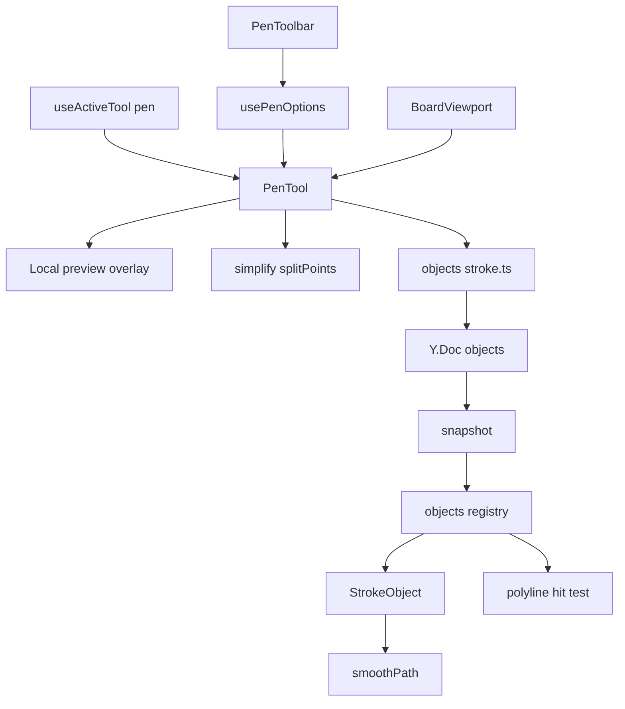
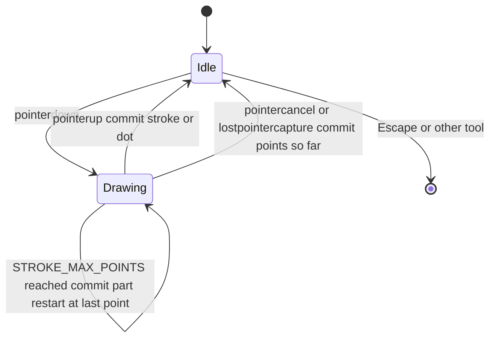
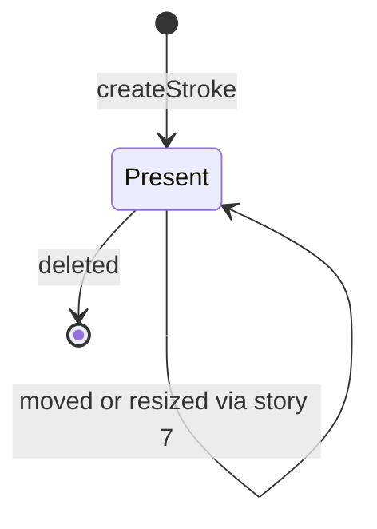
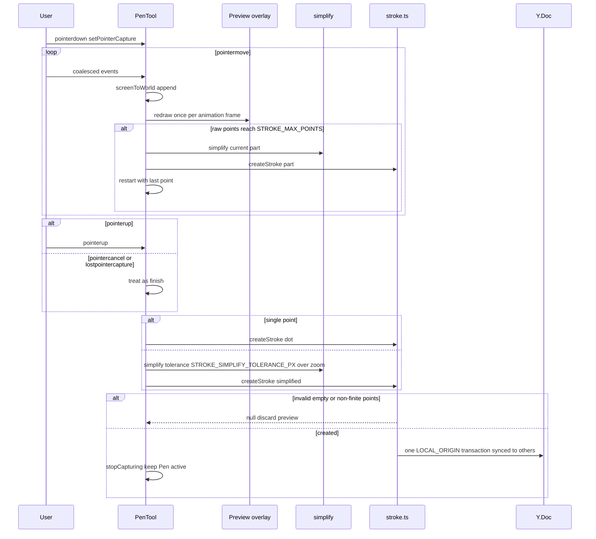
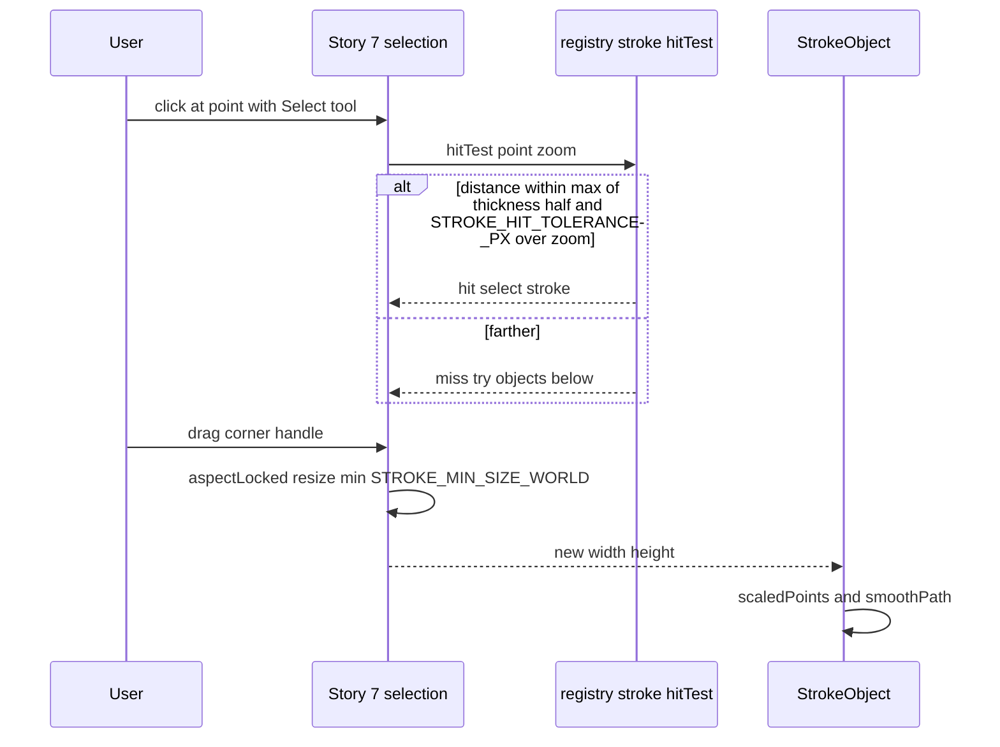
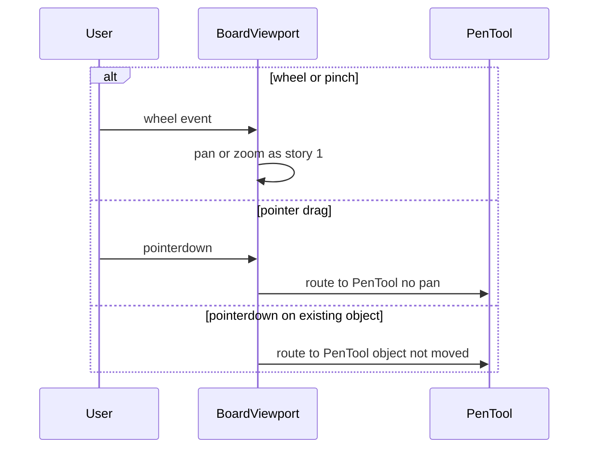

# Technical Design

The Pen tool captures coalesced pointer points into a local, never-synced preview; on release (or cancel, or reaching STROKE_MAX_POINTS) it simplifies the points with Ramer-Douglas-Peucker at a zoom-scaled tolerance and commits one stroke object (points relative to the bbox plus base size) in a single LOCAL_ORIGIN transaction. StrokeObject renders a smoothed SVG path scaled to the current width/height and registers a line-distance hit test and aspect-locked resize in the story 7 registry.

## Overview

## Context
Builds on story 1 (`camera.ts`, `BoardViewport` wheel/pinch navigation), story 2 (`board-model.ts`, `snapshot`), story 3 (sync; no server change), story 10 (`src/shared/geometry/polyline.ts` `distanceToPolyline`, `src/client/tools/useActiveTool.ts`), and cross-story conventions for story 7 (registry, generic move/resize/delete) and story 8 (LOCAL_ORIGIN, `stopCapturing()`).

## Files
| Path | Change | Purpose |
|---|---|---|
| `src/shared/objects/stroke.ts` | added | stroke schema, `createStroke`, `scaledPoints`, validation |
| `src/shared/geometry/simplify.ts` | added | `simplify` (RDP), `splitPoints`, `smoothPath` |
| `src/shared/geometry/polyline.ts` | reused (story 10) | `distanceToPolyline` |
| `src/shared/config.ts` | modified | settings below |
| `src/client/tools/PenTool.tsx` | added | capture, preview overlay, commit |
| `src/client/tools/PenToolbar.tsx` | added | colours and thickness |
| `src/client/tools/usePenOptions.ts` | added | session-only colour/thickness state |
| `src/client/objects/StrokeObject.tsx` | added | SVG path rendering |
| `src/client/objects/registry.tsx` | modified | register `stroke` |
| `src/client/tools/useActiveTool.ts` | modified | `pen` tool; pen stays active after commit |
| `src/client/canvas/BoardViewport.tsx` | modified | while Pen is active, pointer drags go to PenTool instead of panning; wheel handling unchanged |

## Named settings added
```ts
export const PEN_COLORS = { black: '#212121', blue: '#1E88E5', red: '#E53935', green: '#43A047', orange: '#FB8C00', purple: '#8E24AA' } as const;
export const PEN_THICKNESS_WORLD = { thin: 2, medium: 4, thick: 8 } as const;
export const DEFAULT_PEN_COLOR = 'black';
export const DEFAULT_PEN_THICKNESS = 'medium';
export const STROKE_SIMPLIFY_TOLERANCE_PX = 1;
export const STROKE_MAX_POINTS = 5000;
export const STROKE_HIT_TOLERANCE_PX = 6;
export const STROKE_MIN_SIZE_WORLD = 4;
```

## Schema addition (additive)
```
stroke: common fields (x, y, width, height = bbox padded by thickness/2)
        + points: number[]      // flattened [x0, y0, x1, y1, ...] relative to bbox origin, at creation size
        + baseWidth, baseHeight // bbox size at creation; render scale = width/baseWidth, height/baseHeight
        + color: PenColor, thickness: PenThickness
```
Decision: points are stored as a plain number array inside the object's Y.Map (replaced atomically, never edited point-by-point) because strokes are immutable after creation; only generic x/y/width/height change on move/resize.

## Structure diagram


## State diagrams
Pen gesture (local only; nothing is persisted until commit):

Stroke object (persisted):


## Sequence: draw and commit


## Sequence: select and resize a stroke


## Sequence: navigation while Pen is active


## Test Strategy

## Test scopes and boundaries
| Capability | Levels | Boundary exercised | Why sufficient |
|---|---|---|---|
| stroke.model | unit | pure geometry and model on a real Y.Doc | simplification, splitting, scaling, validation and hit distance are deterministic maths |
| pen.tool | ui-component, e2e | PenTool/PenToolbar in jsdom with synthetic pointer events; real browser | gesture state machine and options are DOM logic; real pointer capture, frame-rate preview and sharing need a browser and the sync path |
| stroke.object | ui-component, e2e | StrokeObject render and registry hit test in jsdom; real browser | path output and hit-test are DOM/maths; proportional resize via story 7 handles needs real layout |

No server change, so no integration tests.

## Dimensions crossed
- **D1 Gesture**: click, short drag, drag reaching STROKE_MAX_POINTS, interrupted drag.
- **D2 Zoom while drawing**: 50%, 100%, 200%.
- **D3 Viewer**: drawer, other participant.
- **D4 Post-creation operation**: none, select by line, move, resize, delete.

D1 classes are exhaustive and non-overlapping.

## Coverage table
| TC | Capability | D1 | D2 | D3 | D4 | Action | Expected before → after | Level |
|---|---|---|---|---|---|---|---|---|
| TC-01 | stroke.model | short drag | 100% | not applicable: pure function | none | simplify recorded handwritten loop fixture, tolerance 1 | every raw point within 1 unit of result; result has fewer points | unit |
| TC-02 | stroke.model | short drag | 200% | not applicable: pure function | none | simplify with tolerance 1/zoom = 0.5 | every raw point within 0.5 units | unit |
| TC-03 | stroke.model | long drag | not applicable: count-based | not applicable: pure function | none | splitPoints at STROKE_MAX_POINTS - 1, exactly, + 1 | 1, 1, 2 parts; part 2 starts with part 1's last point | unit |
| TC-04 | stroke.model | click | 100% | drawer | none | createStroke with one point, thickness thick | object bbox = thickness square; points length 2 | unit |
| TC-05 | stroke.model | short drag | not applicable: model | drawer | none | createStroke empty points; NaN point; colour 'pink'; thickness 'huge' | null each; zero updates | unit |
| TC-06 | stroke.model | short drag | not applicable: model | drawer | resize | scaledPoints after width 2x and height 2x | coordinates doubled; thickness unchanged | unit |
| TC-07 | stroke.model | short drag | not applicable: model | drawer | select by line | distanceToPolyline on scaledPoints at 0, 5.9, 6.1 units | within / within / outside tolerance at zoom 1 | unit |
| TC-08 | stroke.model | short drag | not applicable: model | drawer | none | smoothPath of 3 points | SVG path starts with M and uses Q segments; deterministic | unit |
| TC-09 | pen.tool | short drag | 100% | drawer | none | pointerdown/moves/up with red + thick selected | createStroke called once with red/thick; tool still pen | ui-component |
| TC-10 | pen.tool | click | 100% | drawer | none | pointerdown/up no move | createStroke called with single point | ui-component |
| TC-11 | pen.tool | interrupted | 100% | drawer | none | pointerdown, moves, pointercancel | stroke committed with points so far | ui-component |
| TC-12 | pen.tool | long drag | 100% | drawer | none | synthetic STROKE_MAX_POINTS + 10 moves | two createStroke calls; second starts at first's last point | ui-component |
| TC-13 | pen.tool | short drag | 100% | drawer | none | Escape; press V | tool becomes select; no stroke created | ui-component |
| TC-14 | pen.tool | short drag | 100% | drawer | none | change colour after a stroke exists | existing stroke colour unchanged; next stroke uses new colour | ui-component |
| TC-15 | stroke.object | short drag | 50% and 200% | drawer | select by line | registry hitTest at 5 px and 7 px screen distance | hit / miss at both zooms | ui-component |
| TC-16 | stroke.object | short drag | 100% | drawer | select by line | click inside bbox far from line over a sticky note | sticky selected, stroke not selected | ui-component |
| TC-17 | pen.tool | short drag | 100% | drawer | none | real drag drawing a loop; measure preview updates | preview path present during drag; stroke persists after release | e2e |
| TC-18 | pen.tool | short drag | 100% | other participant | none | Priya draws while Sam watches | Sam sees nothing during drag; stroke visible within LIVE_UPDATE_LATENCY_BUDGET_MS of release | e2e |
| TC-19 | pen.tool | short drag | 100% | drawer | none | wheel while Pen active, then drag starting on a sticky | board pans; sticky not moved; stroke created | e2e |
| TC-20 | stroke.object | short drag | 100% | drawer | resize, move, delete | V, click line, drag corner handle, drag body, Delete | aspect ratio preserved ±1%; moved; removed on both screens | e2e |

## Boundary values
- Point limit: STROKE_MAX_POINTS - 1, exactly, + 1 (TC-03, TC-12).
- Smoothing tolerance at zoom 1 and 2 (TC-01, TC-02).
- Hit tolerance 5/7 px screen at two zooms; 5.9/6.1 units (TC-07, TC-15).
- Minimum points: 0 and 1 (TC-05, TC-04).

## Negative scenarios
| TC | Must not happen | Level |
|---|---|---|
| TC-05 | invalid input must not create a stroke | unit |
| TC-13 | Escape must not create a stroke | ui-component |
| TC-14 | changing options must not restyle existing strokes | ui-component |
| TC-16 | clicking empty space inside a stroke's bbox must not select it | ui-component |
| TC-18 | in-progress strokes must not be sent to others | e2e |
| TC-19 | Pen drags must not pan or move objects | e2e |

## Error paths
| Contract error | TC |
|---|---|
| empty / non-finite points | TC-05 |
| unknown colour / thickness | TC-05 |
| pointer capture lost / cancelled | TC-11 |
| stroke deleted by another person while selected | TC-21: remote delete while Priya has it selected → selection cleared, no error (ui-component) |

## Mock vs real boundaries
| Dependency | Mocked? | Reason |
|---|---|---|
| Y.Doc | real | store under test |
| Pointer events in component tests | synthetic via Testing Library | deterministic point sequences |
| requestAnimationFrame | fake timers in component tests | deterministic preview updates |
| Sync server | real `wrangler dev` in e2e | sharing requirement |

## E2E workflows
1. **Annotate a cluster** (TC-17 → TC-19): draw, navigate, draw over objects.
2. **Shared sketch** (TC-18): others see finished strokes only.
3. **Tidy up** (TC-20): select by line, resize proportionally, move, delete.

## Fixtures
- `tests/fixtures/pen-paths.ts`: recorded realistic pointer paths (handwritten loop ~400 points with jitter, underline ~120 points, synthetic 5,010-point spiral).

## Not covered
- Drawing latency on low-end hardware (manual).
- Stylus pressure/palm rejection (out of scope).
- Typical compression ratio of simplification (measured manually, not asserted).

## Stroke model and geometry

> Anchor: `stroke.model`

## Contract
```ts
// src/shared/geometry/simplify.ts
export function simplify(points: readonly Point[], tolerance: number): Point[];      // Ramer-Douglas-Peucker; keeps first and last
export function splitPoints(points: readonly Point[], max?: number): Point[][];      // default STROKE_MAX_POINTS; parts share join point
export function smoothPath(points: readonly Point[]): string;                        // SVG path using quadratic midpoints
// src/shared/objects/stroke.ts
export type PenColor = keyof typeof PEN_COLORS; export type PenThickness = keyof typeof PEN_THICKNESS_WORLD;
export interface StrokeSnap extends ObjectSnap { type: 'stroke'; points: readonly number[]; baseWidth: number; baseHeight: number; color: PenColor; thickness: PenThickness }
export function createStroke(doc: Y.Doc, a: { points: readonly Point[]; color: PenColor; thickness: PenThickness }, by: string): string | null;
export function scaledPoints(s: StrokeSnap): Point[];
```
- **Inputs**: world-space points, colour and thickness names, identity id.
- **Outputs**: new id; `StrokeSnap` in `snapshot()`; scaled world points for rendering and hit testing.
- **Errors**: empty points, any non-finite coordinate, unknown colour or thickness → null, no transaction.
- **Side effects**: one `LOCAL_ORIGIN` transaction per stroke.

## Implementation
- `simplify` guarantees every input point is within `tolerance` of the output polyline (pen.smooth); PenTool passes `STROKE_SIMPLIFY_TOLERANCE_PX / zoom`. `smoothPath` renders midpoint quadratic curves through the simplified points (pen.draw).
- One point → dot: bbox = thickness square, stored as a single point, rendered as a round-capped zero-length path (pen.dot).
- Colour/thickness validated against `PEN_COLORS` / `PEN_THICKNESS_WORLD` (pen.options).
- `splitPoints` implements the STROKE_MAX_POINTS split with shared join point (pen.long_stroke).
- Points stored relative to bbox origin with `baseWidth/baseHeight`; `scaledPoints` multiplies by current width/baseWidth so proportional resize via story 7 changes geometry without rewriting points; thickness is not scaled (pen.resize).
- `distanceToPolyline(scaledPoints)` from story 10 backs the hit test (pen.select).

## Tests
unit: TC-01 to TC-08 in `tests/unit/stroke.test.ts`.

## Pen tool and options

> Anchor: `pen.tool`

## Contract
```tsx
// src/client/tools/usePenOptions.ts
export function usePenOptions(): { color: PenColor; thickness: PenThickness; setColor(c: PenColor): void; setThickness(t: PenThickness): void };
// src/client/tools/PenToolbar.tsx
export function PenToolbar(props: { color: PenColor; thickness: PenThickness; onColor(c: PenColor): void; onThickness(t: PenThickness): void }): JSX.Element;
// src/client/tools/PenTool.tsx
export function PenTool(props: { camera: Camera; color: PenColor; thickness: PenThickness; doc: Y.Doc; identityId: string }): JSX.Element;
```
- **Inputs**: pointer events routed from BoardViewport while tool is `pen` (including events starting over objects); coalesced events via `getCoalescedEvents()` when available; P / Escape / other shortcuts.
- **Outputs**: screen-space SVG preview path redrawn once per animation frame (never written to the doc, so others don't see in-progress strokes — pen.share); round cursor sized `thickness * zoom`; on finish `createStroke` via `simplify`; toolbar `button[aria-label="<colour> pen"][aria-pressed]` and `button[aria-label="Thin|Medium|Thick"]`.
- **Errors**: rejected stroke clears the preview silently; `pointercancel`/`lostpointercapture` finish with points so far (pen.interrupted).
- **Side effects**: `createStroke` per finished stroke or part; `undoManager.stopCapturing()` after each commit; tool remains `pen` (pen.stay_active); options held in session state only (pen.options).

## Implementation
- Commits on reaching STROKE_MAX_POINTS raw points and continues from the last point (pen.long_stroke).
- Click without movement (distance < DRAG_THRESHOLD_PX) commits a single point (pen.dot).
- BoardViewport change: while Pen is active, pointerdown is routed to PenTool and does not start panning or object drags; wheel/pinch handlers are untouched so navigation works (pen.navigation).
- Finished strokes reach others through the normal doc sync (pen.share).

## Tests
ui-component: TC-09 to TC-14 in `tests/component/PenTool.test.tsx`. e2e: TC-17 to TC-19 in `tests/e2e/pen.spec.ts`.

## Stroke object rendering and selection

> Anchor: `stroke.object`

## Contract
```tsx
// src/client/objects/StrokeObject.tsx
export function StrokeObject(props: { stroke: StrokeSnap; selected: boolean }): JSX.Element;
// registry entry
stroke: { Component: StrokeObject, resizable: true, aspectLocked: true, minSize: STROKE_MIN_SIZE_WORLD, editableText: false,
          hitTest: (s, p, zoom) => distanceToPolyline(scaledPoints(s), p) <= Math.max(PEN_THICKNESS_WORLD[s.thickness] / 2, STROKE_HIT_TOLERANCE_PX / zoom) }
```
- **Inputs**: `StrokeSnap` from snapshot (local or remote).
- **Outputs**: SVG `path` with `d = smoothPath(scaledPoints)`, `stroke-linecap/linejoin: round`, `stroke-width` = thickness in world units, colour from PEN_COLORS, `aria-label="Drawing"`.
- **Errors**: stroke removed while selected (remote delete) → selection cleared by story 7 stale-id handling, no error (TC-21).
- **Side effects**: none (rendering only).

## Implementation
Line-distance hit test means clicks inside the bbox but away from the line fall through to objects below (pen.select). `aspectLocked: true` with `scaledPoints` gives proportional resize with constant thickness (pen.resize). Remote strokes render identically as soon as the snapshot updates (pen.share).

## Tests
ui-component: TC-15, TC-16, TC-21 in `tests/component/StrokeObject.test.tsx`. e2e: TC-18, TC-20 in `tests/e2e/pen.spec.ts`.

