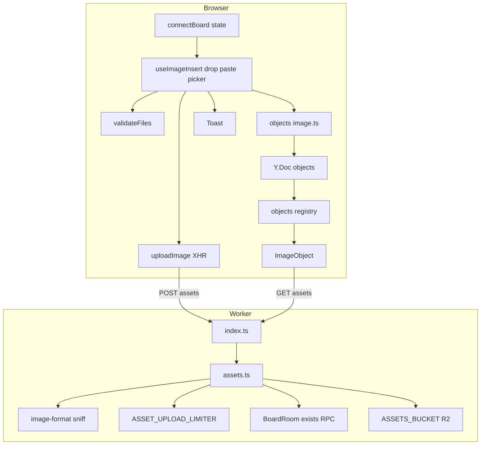
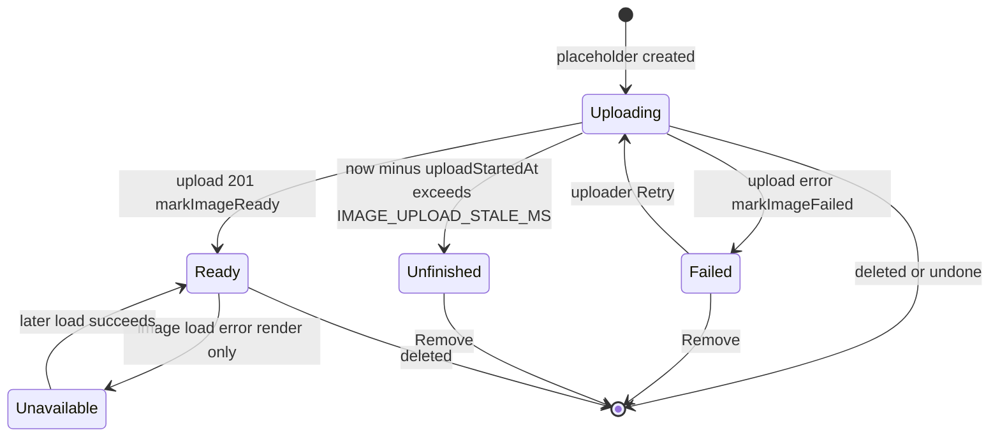
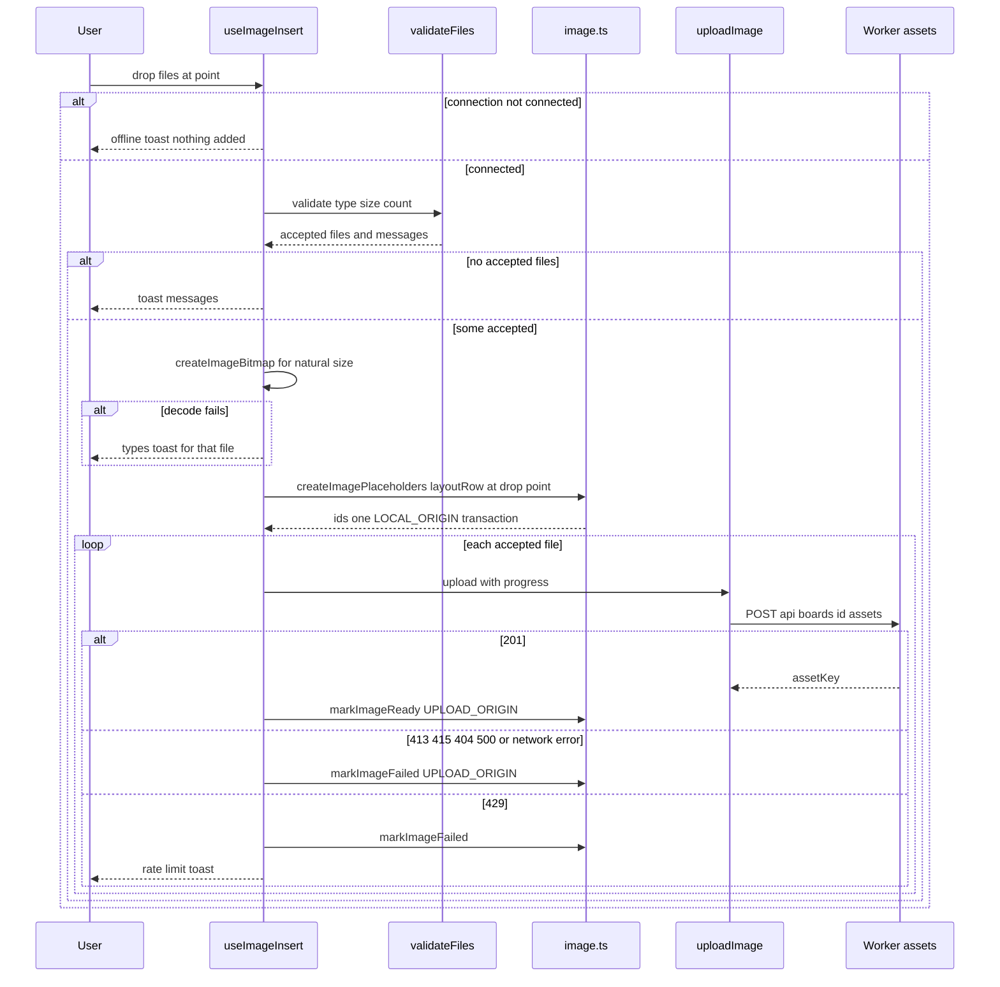
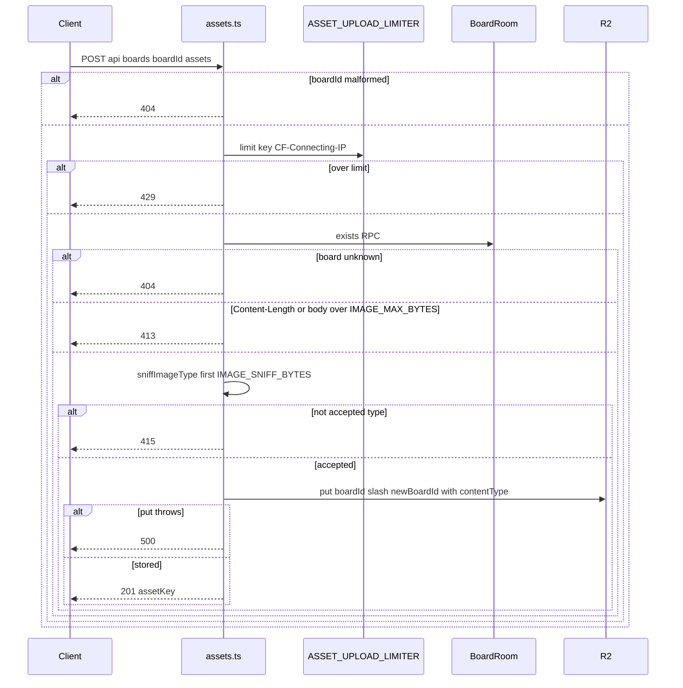
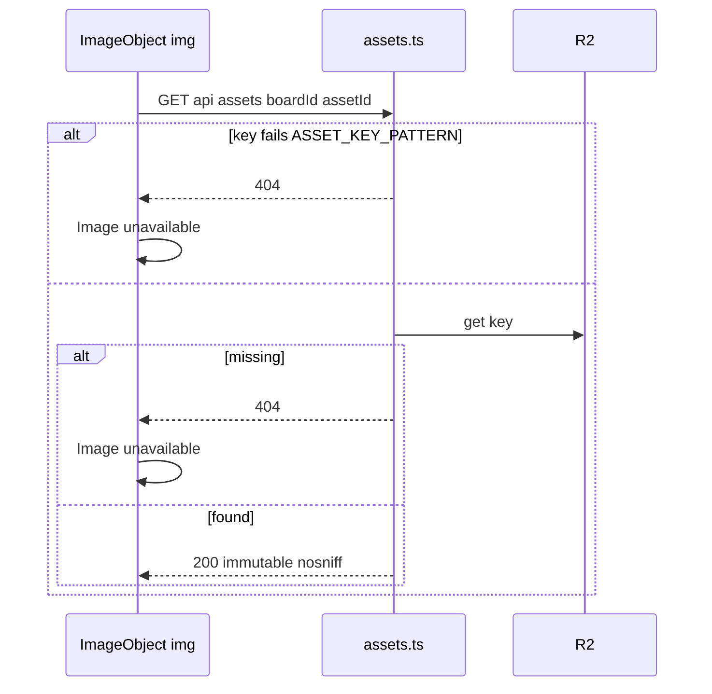
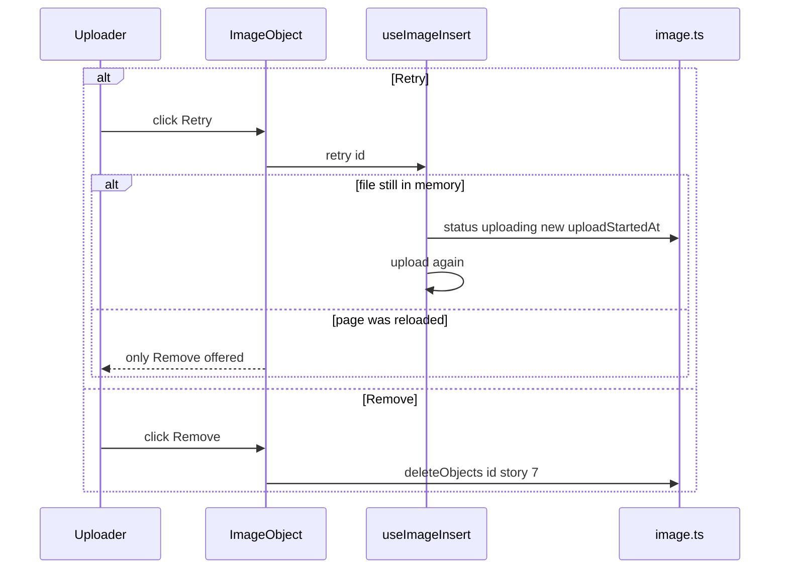
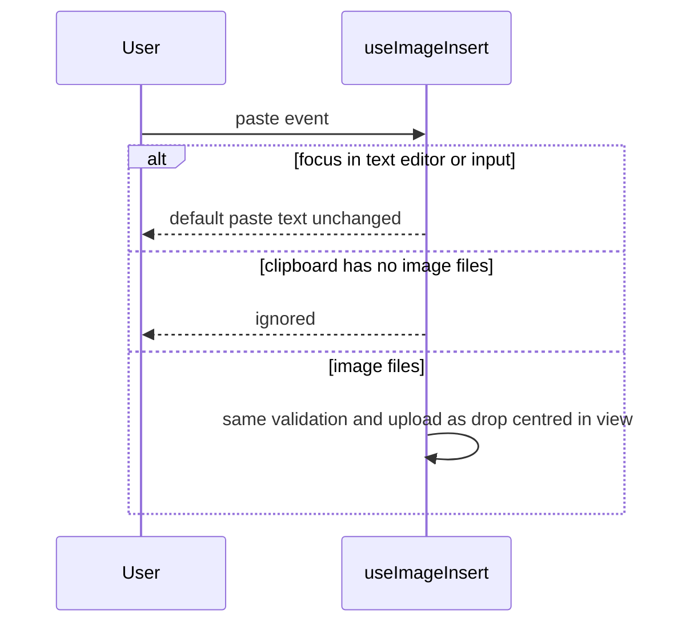

# Technical Design

Images are stored in R2 via Worker routes POST /api/boards/:id/assets (board must exist, magic-byte type sniffing, 10 MB limit, per-IP rate limit, unguessable keys) and GET /api/assets/:boardId/:assetId (immutable caching, nosniff). The client validates files, measures dimensions, creates an image placeholder object in the Y.Doc (one undo step), uploads with XHR progress, then sets ready/failed status with an untracked origin. ImageObject renders uploading, ready, failed, unfinished and unavailable states and registers an aspect-locked resize.

## Overview

## Context
Builds on story 3 (`src/worker/index.ts`, `connectBoard` ConnectionState), story 4 (Durable Object storage), story 5 (`BoardRoom.exists()` RPC, `newBoardId()`, `ratelimits` pattern, `api.ts`), story 10 (`useActiveTool`), and conventions for story 7 (registry, generic move/resize/delete, aspect-locked resize) and story 8 (LOCAL_ORIGIN tracked by `Y.UndoManager`). Story 17 will read images from the same GET route to embed them.

## Files
| Path | Change | Purpose |
|---|---|---|
| `wrangler.jsonc` | modified | `r2_buckets: [{ binding: ASSETS_BUCKET, bucket_name: vidi6-assets }]`; `ratelimits` binding `ASSET_UPLOAD_LIMITER` |
| `src/worker/assets.ts` | added | upload and serve handlers |
| `src/worker/index.ts` | modified | route `POST /api/boards/:id/assets`, `GET /api/assets/:boardId/:assetId` |
| `src/shared/image-format.ts` | added | `sniffImageType` magic bytes, `ASSET_KEY_PATTERN`, `assetKeyFor` |
| `src/shared/objects/image.ts` | added | image schema, `createImagePlaceholders`, `markImageReady`, `markImageFailed`, `placementSize`, `layoutRow`, `displayStatus` |
| `src/shared/config.ts` | modified | settings below |
| `src/client/images/validateFiles.ts` | added | client-side type/size/count validation and messages |
| `src/client/images/uploadImage.ts` | added | XHR upload with progress, response mapping |
| `src/client/images/useImageInsert.ts` | added | drop, paste and picker flows, in-memory retry map |
| `src/client/images/DropHighlight.tsx` | added | drag-over outline |
| `src/client/objects/ImageObject.tsx` | added | render states, Retry/Remove |
| `src/client/objects/registry.tsx` | modified | register `image` |
| `src/client/tools/useActiveTool.ts`, `src/client/board/Toolbar.tsx` | modified | Image button and I shortcut open picker then return to Select |
| `src/client/ui/Toast.tsx` | added | bottom toast with `role=status` |

## Named settings added
```ts
export const IMAGE_ACCEPTED_TYPES = ['image/png', 'image/jpeg', 'image/gif', 'image/webp'] as const;
export const IMAGE_MAX_BYTES = 10 * 1024 * 1024;
export const IMAGE_MAX_FILES_PER_ADD = 20;
export const IMAGE_MAX_PLACE_SIZE_WORLD = 800;
export const IMAGE_MIN_SIZE_WORLD = 16;
export const IMAGE_LAYOUT_GAP_WORLD = 24;
export const IMAGE_UPLOAD_STALE_MS = 5 * 60 * 1000;
export const IMAGE_UPLOAD_LIMIT = 60;
export const IMAGE_UPLOAD_PERIOD_SECONDS = 60;
export const ASSET_CACHE_MAX_AGE_SECONDS = 31_536_000;
export const IMAGE_SNIFF_BYTES = 12;
```

## HTTP contract
| Method + path | Success | Errors |
|---|---|---|
| `POST /api/boards/:boardId/assets` (raw body, `Content-Type` ignored for decisions) | `201 {"assetKey": "<boardId>/<assetId>", "contentType": "image/png"}` | `404` board unknown/malformed; `413` body > IMAGE_MAX_BYTES; `415` sniffed type not accepted; `429` rate limited; `500` storage failure |
| `GET /api/assets/:boardId/:assetId` | `200` bytes, `Content-Type` from stored metadata, `Cache-Control: public, max-age=ASSET_CACHE_MAX_AGE_SECONDS, immutable`, `X-Content-Type-Options: nosniff`, `Content-Security-Policy: default-src 'none'` | `404` malformed key or missing object |

Asset ids use story 5's `newBoardId()` (128 bits), so keys are unguessable. Decision: bodies are read fully into memory (≤ 10 MB) so type sniffing happens before anything is written; the size check uses `Content-Length` first and the actual byte length second.

## Schema addition (additive)
```
image: common fields + assetKey: string | null, contentType: string,
       naturalWidth: number, naturalHeight: number,
       status: 'uploading' | 'ready' | 'failed', uploadStartedAt: number, uploaderId: string
```
Decision on undo: placeholder creation is a LOCAL_ORIGIN transaction (the undo step). `markImageReady`/`markImageFailed` use `UPLOAD_ORIGIN`, which is not in the UndoManager's tracked origins, so upload completion never becomes its own undo step.

## Structure diagram


## State diagram
Image object status (persisted in the doc; `unfinished` is derived at render time):


## Sequence: add images by drop


## Sequence: upload handler


## Sequence: serve image


## Sequence: retry and remove


## Sequence: paste


## Test Strategy

## Test scopes and boundaries
| Capability | Levels | Boundary exercised | Why sufficient |
|---|---|---|---|
| assets.api | unit, integration, e2e | pure sniff/key logic; real Worker request handling with real R2 (Miniflare) and real BoardRoom RPC; real browser upload | status codes, headers and stored objects are request-handling and storage facts |
| image.model | unit | pure placement/layout/status on a real Y.Doc | sizing, layout and status transitions are deterministic |
| image.insert | unit, ui-component, e2e | pure validation; hook with mocked upload in jsdom; real drop/paste/picker in browser | validation rules are pure; flows need DOM events; real file transfer needs a browser |
| image.object | ui-component, e2e | render states in jsdom; real image loading | states are DOM; load errors and aspect resize need real layout |

## Dimensions crossed
- **D1 Entry**: drop, paste, picker.
- **D2 File class**: valid small, valid at limit, over limit, wrong type by content (renamed), SVG, corrupt image.
- **D3 Service outcome**: 201, 404, 413, 415, 429, 500, network error, offline before start.
- **D4 Viewer**: uploader, other participant, later visitor.
- **D5 Time**: before and after IMAGE_UPLOAD_STALE_MS.

D2 and D3 classes are exhaustive and non-overlapping.

## Coverage table
| TC | Capability | D1 | D2 | D3 | D4 | Action | Expected before → after | Level |
|---|---|---|---|---|---|---|---|---|
| TC-01 | assets.api | not applicable: pure function | valid small, SVG, corrupt, renamed PDF | not applicable: no request | not applicable | sniffImageType on PNG, JPEG, GIF87a, GIF89a, WebP, SVG text, PDF renamed .png, 3 random bytes | png, jpeg, gif, gif, webp, null, null, null | unit |
| TC-02 | assets.api | not applicable: pure function | not applicable | not applicable | not applicable | ASSET_KEY_PATTERN on valid, missing part, '../', 23-char id | true, false, false, false | unit |
| TC-03 | image.model | not applicable: pure function | valid small | not applicable | uploader | placementSize 400x300, 1600x1200, 300x3200, 800x800 | 400x300, 800x600, 75x800, 800x800 | unit |
| TC-04 | image.model | drop | valid small | not applicable | uploader | layoutRow 3 sizes at point | x positions separated by IMAGE_LAYOUT_GAP_WORLD, tops aligned at point | unit |
| TC-05 | image.model | drop | valid small | 201 | uploader | createImagePlaceholders 3 then markImageReady one | 3 objects status uploading in one update; one becomes ready with assetKey; UndoManager stack length 1 | unit |
| TC-06 | image.model | drop | valid small | 500 | other participant | displayStatus uploading at IMAGE_UPLOAD_STALE_MS - 1 and + 1; failed; ready | uploading, unfinished, failed, ready | unit |
| TC-07 | image.model | drop | valid small | not applicable | uploader | markImageReady on deleted id | false, no update | unit |
| TC-08 | image.insert | drop | valid at limit, over limit | not applicable: pre-upload | uploader | validateFiles sizes IMAGE_MAX_BYTES and IMAGE_MAX_BYTES + 1 | accepted; rejected with size message | unit |
| TC-09 | image.insert | picker | valid small | not applicable: pre-upload | uploader | validateFiles 21 valid files; mix of PDF and PNG | first 20 accepted + count message; PNG accepted + type message | unit |
| TC-10 | assets.api | not applicable: direct request | valid small | 201 | uploader | POST real PNG to existing board | 201; R2 object exists with contentType image/png; key matches pattern | integration |
| TC-11 | assets.api | not applicable: direct request | valid small | 404 | uploader | POST to never-created board id; malformed id | 404; nothing in R2 | integration |
| TC-12 | assets.api | not applicable: direct request | over limit | 413 | uploader | POST IMAGE_MAX_BYTES + 1 bytes; exactly IMAGE_MAX_BYTES valid JPEG | 413 nothing stored; 201 | integration |
| TC-13 | assets.api | not applicable: direct request | wrong type by content and SVG | 415 | uploader | POST PDF with Content-Type image/png; POST SVG | 415 both; nothing stored | integration |
| TC-14 | assets.api | not applicable: direct request | valid small | 429 | uploader | IMAGE_UPLOAD_LIMIT + 1 uploads same IP | last 429; different IP 201 | integration |
| TC-15 | assets.api | not applicable: direct request | valid small | 500 | uploader | R2 put wrapped to throw | 500 | integration |
| TC-16 | assets.api | not applicable: direct request | valid small | 201 | later visitor | GET stored key; GET missing key; GET '../x' | 200 with Content-Type, immutable Cache-Control, nosniff, CSP; 404; 404 | integration |
| TC-17 | image.insert | drop | valid small | 201 | uploader | drop 3 files with mocked uploadImage emitting progress | 3 placeholders in a row; progress text updates; ready after resolve | ui-component |
| TC-18 | image.insert | paste | valid small | not applicable | uploader | paste image while editing sticky text; paste while board focused | no image created; image created centred in view | ui-component |
| TC-19 | image.insert | drop | valid small | offline before start | uploader | ConnectionState reconnecting then drop | offline toast; no objects; upload not called | ui-component |
| TC-20 | image.insert | picker | valid small | 429 | uploader | mocked upload returns rate_limited | object failed; rate toast shown | ui-component |
| TC-21 | image.object | not applicable: render | valid small | 500 | uploader and other participant | render failed object as uploader and as other identity | Retry and Remove vs Image unavailable | ui-component |
| TC-22 | image.object | not applicable: render | valid small | not applicable | other participant | uploading with uploadStartedAt older than IMAGE_UPLOAD_STALE_MS | Image upload didn't finish + Remove; Remove deletes | ui-component |
| TC-23 | image.object | not applicable: render | corrupt | not applicable | later visitor | img error event | Image unavailable box same size | ui-component |
| TC-24 | image.object | not applicable: render | valid small | 500 | uploader | Retry after failure with file in memory; Retry after simulated reload | status uploading and upload called again; Retry hidden only Remove | ui-component |
| TC-25 | image.insert | drop | valid small x3 | 201 | uploader and other participant | real drag-and-drop via DataTransfer of fixture images; Sam's context | Sam sees Uploading placeholders then images within LIVE_UPDATE_LATENCY_BUDGET_MS plus load | e2e |
| TC-26 | image.insert | picker | valid small + renamed PDF + 11 MB | mixed | uploader | press I, setInputFiles | one image added; type and size toasts | e2e |
| TC-27 | image.object | picker | valid small | 201 | later visitor | resize corner; reload in new context | aspect ratio preserved ±1%, min IMAGE_MIN_SIZE_WORLD enforced; image present after reload | e2e |
| TC-28 | image.object | drop | valid small | network error | uploader | route abort POST assets, then Retry with route restored | Upload failed then image ready | e2e |

## Boundary values
- Size: IMAGE_MAX_BYTES and + 1 (TC-08, TC-12).
- Count: IMAGE_MAX_FILES_PER_ADD and + 1 (TC-09).
- Placement: longest side below, at and above IMAGE_MAX_PLACE_SIZE_WORLD, portrait and landscape (TC-03).
- Stale timeout: IMAGE_UPLOAD_STALE_MS ± 1 ms (TC-06).
- Rate limit: IMAGE_UPLOAD_LIMIT + 1 (TC-14).
- Minimum size on resize (TC-27).

## Negative scenarios
| TC | Must not happen | Level |
|---|---|---|
| TC-11 | uploads to non-existent boards must not be stored | integration |
| TC-13 | disguised or SVG files must not be stored or served | integration |
| TC-16 | served assets must not be sniffed or executed as documents | integration |
| TC-18 | pasting while editing text must not add an image | ui-component |
| TC-19 | offline adds must not create placeholders | ui-component |
| TC-05 | upload completion must not create a separate undo step | unit |

## Error paths
| Contract error | TC |
|---|---|
| 404 board unknown / malformed | TC-11 |
| 413 too large | TC-12, TC-08 |
| 415 wrong type | TC-13, TC-01, TC-26 |
| 429 rate limited | TC-14, TC-20 |
| 500 storage failure | TC-15 |
| network error | TC-28 |
| image decode failure on client | TC-29: createImageBitmap rejects for corrupt file → type toast, no placeholder (ui-component) |
| GET missing / malformed | TC-16, TC-23 |
| stale id on status update | TC-07 |

## Mock vs real boundaries
| Dependency | Mocked? | Reason |
|---|---|---|
| R2 bucket | real Miniflare R2 in integration; local R2 in e2e | storage is part of the contract |
| BoardRoom exists RPC | real | existence rule from story 5 |
| Rate limiter | real binding if supported locally, otherwise fake with same `limit({key})` interface (documented in test file) | local runtime support to be verified |
| R2 put failure | wrapped bucket throwing (TC-15) | cannot force real failure |
| uploadImage in ui-component tests | mocked with controllable progress | flows under test, not network |
| createImageBitmap in jsdom | stubbed returning fixture dimensions | jsdom lacks image decoding |
| Y.Doc and UndoManager | real | undo step behaviour is asserted |

## E2E workflows
1. **Moodboard with a colleague** (TC-25): drop three screenshots, colleague sees placeholders then images.
2. **Mixed picker batch** (TC-26): refused files explained, valid file added.
3. **Resize and revisit** (TC-27): proportional resize persists after reload.
4. **Flaky upload** (TC-28): failure then retry succeeds.

## Fixtures
- `tests/fixtures/images/`: real PNG screenshot (1440x900), JPEG photo (4032x3024, ~3 MB), animated GIF, WebP, SVG with script tag, PDF renamed to .png, corrupt PNG (truncated), generated 10 MB JPEG and 10 MB + 1 byte file.

## Not covered
- Performance of boards with 100 images (manual).
- Real R2 production latency and CDN caching behaviour.
- Clipboard image paste in Firefox/WebKit e2e (Chromium only; manual elsewhere).
- Redo restoring the final `ready` state after undoing an insertion is asserted in TC-05's unit test only; UndoManager behaviour with untracked-origin updates must be confirmed during implementation.

## Asset upload and serving API

> Anchor: `assets.api`

## Contract
```ts
// src/shared/image-format.ts
export type AcceptedImageType = typeof IMAGE_ACCEPTED_TYPES[number];
export function sniffImageType(head: Uint8Array): AcceptedImageType | null;   // PNG 89504E47, JPEG FFD8FF, GIF87a/GIF89a, WebP RIFF....WEBP
export const ASSET_KEY_PATTERN: RegExp;                                       // ^[A-Za-z0-9_-]{22}/[A-Za-z0-9_-]{22}$
export function assetKeyFor(boardId: string, assetId: string): string;
// src/worker/assets.ts
export function handleUpload(req: Request, env: Env, boardId: string): Promise<Response>;
export function handleServe(env: Env, key: string): Promise<Response>;
```
- **Inputs**: raw request body; board id; `CF-Connecting-IP`; asset key.
- **Outputs**: per the HTTP contract table in the Overview; R2 object with `httpMetadata.contentType` = sniffed type.
- **Errors**: 404 unknown/malformed board or key; 413 over IMAGE_MAX_BYTES; 415 unsupported sniffed type (including SVG and disguised files); 429 rate limited; 500 R2 failure.
- **Side effects**: one R2 put per accepted upload; nothing written on any error.

## Implementation
- Order of checks: id pattern → rate limit → `exists()` RPC → `Content-Length` > limit → read body → byte length > limit → sniff → put (image.size_limit, image.types, image.rate_limit).
- Type is decided from content only, never from the client header (image.types).
- Serving adds `nosniff` and `Content-Security-Policy: default-src 'none'` so a stored file can never execute; immutable caching because keys never change (image.shared).
- 404 on serve lets the client show "Image unavailable" (image.unavailable); upload errors map to the failed state on the client (image.upload_failure).

## Tests
unit: TC-01, TC-02 in `tests/unit/image-format.test.ts`. integration: TC-10 to TC-16 in `tests/integration/assets.test.ts`. e2e: TC-25, TC-26, TC-28.

## Image object model

> Anchor: `image.model`

## Contract
```ts
// src/shared/objects/image.ts
export const UPLOAD_ORIGIN: unique symbol;   // not tracked by the UndoManager
export type ImageStatus = 'uploading' | 'ready' | 'failed';
export type DisplayStatus = ImageStatus | 'unfinished';
export function placementSize(naturalWidth: number, naturalHeight: number): { width: number; height: number };
export function layoutRow(sizes: readonly Size[], start: Point, anchor: 'top-left' | 'centre'): Rect[];
export function createImagePlaceholders(doc: Y.Doc, items: readonly { rect: Rect; naturalWidth: number; naturalHeight: number; contentType: string }[], uploaderId: string, now: number): string[];
export function markImageReady(doc: Y.Doc, id: string, assetKey: string): boolean;
export function markImageFailed(doc: Y.Doc, id: string): boolean;
export function markImageRetrying(doc: Y.Doc, id: string, now: number): boolean;
export function displayStatus(img: ImageSnap, now: number): DisplayStatus;
```
- **Errors**: stale id → false; non-finite sizes → placeholder skipped.
- **Side effects**: `createImagePlaceholders` = one LOCAL_ORIGIN transaction for the whole add action (one undo step); status updates use UPLOAD_ORIGIN (no extra undo step).

## Implementation
- `placementSize` scales so the longest side ≤ IMAGE_MAX_PLACE_SIZE_WORLD, never upscales (image.placement_size).
- `layoutRow` places left to right with IMAGE_LAYOUT_GAP_WORLD; `top-left` anchor for drops (image.drop), `centre` anchor on the visible area centre for picker and paste (image.pick, image.paste).
- Placeholder objects carry `status: 'uploading'`, `uploadStartedAt`, `uploaderId`, so every participant can render the uploading state (image.uploading); `markImageReady` sets `assetKey` for everyone (image.shared).
- `displayStatus` derives `unfinished` when uploading longer than IMAGE_UPLOAD_STALE_MS (image.unfinished); `markImageFailed`/`markImageRetrying` back failure handling (image.upload_failure).

## Tests
unit: TC-03 to TC-07 in `tests/unit/image-model.test.ts`.

## Adding images: drop, paste, picker, validation, upload

> Anchor: `image.insert`

## Contract
```ts
// src/client/images/validateFiles.ts
export type FileRejection = 'type' | 'size' | 'count';
export function validateFiles(files: readonly File[]): { accepted: File[]; rejections: Set<FileRejection> };
export const REJECTION_MESSAGES: Record<FileRejection | 'offline' | 'rate', string>;
// src/client/images/uploadImage.ts
export type UploadResult = { kind: 'ok'; assetKey: string } | { kind: 'rate_limited' } | { kind: 'failed'; status?: number };
export function uploadImage(boardId: string, file: File, onProgress: (fraction: number) => void): { promise: Promise<UploadResult>; abort(): void };
// src/client/images/useImageInsert.ts
export function useImageInsert(a: { doc: Y.Doc; boardId: string; camera: Camera; connection: ConnectionState; identityId: string }): {
  onDragOver(e: DragEvent): void; onDrop(e: DragEvent): void; onPaste(e: ClipboardEvent): void; openPicker(): void;
  progress: ReadonlyMap<string, number>; retry(id: string): boolean; canRetry(id: string): boolean;
};
```
- **Inputs**: DataTransfer files on drop, clipboard files on paste (ignored while focus is in a text editor/input), `<input type=file accept=IMAGE_ACCEPTED_TYPES multiple>` for the picker (I key / Image button), connection state from story 3.
- **Outputs**: toasts with exact PRD messages; placeholders via image.model; progress map (uploader only); ready/failed status updates.
- **Errors**: invalid type (by `File.type` plus server sniff), size, count, decode failure, offline, 429, other failures — all surfaced as messages or failed state; never thrown.
- **Side effects**: XHR uploads (fetch lacks upload progress); in-memory map id → File for Retry (lost on reload).

## Implementation
- Offline gate first: if connection is not `connected`/`confirmed`, show offline toast and stop (image.offline).
- `validateFiles` applies count (first IMAGE_MAX_FILES_PER_ADD), type and size (image.types, image.size_limit, image.count_limit); dimensions from `createImageBitmap` (decode failure → type message).
- Placeholders created in one transaction; uploads start in parallel with progress feeding `progress` (image.uploading).
- Result mapping: ok → `markImageReady`; rate_limited → failed + rate toast (image.rate_limit); failed → `markImageFailed` (image.upload_failure). Retry uses `markImageRetrying` then re-uploads the kept File.
- Drop highlight shown between `dragenter` and `dragleave/drop` for file drags only (image.drop); paste and picker centre in view (image.paste, image.pick).

## Tests
unit: TC-08, TC-09 in `tests/unit/validate-files.test.ts`. ui-component: TC-17 to TC-20, TC-29 in `tests/component/useImageInsert.test.tsx`. e2e: TC-25, TC-26, TC-28 in `tests/e2e/images.spec.ts`.

## Image object rendering and states

> Anchor: `image.object`

## Contract
```tsx
// src/client/objects/ImageObject.tsx
export function ImageObject(props: { image: ImageSnap; isUploader: boolean; progress?: number; canRetry: boolean; now: number; onRetry(): void; onRemove(): void }): JSX.Element;
// registry entry
image: { Component: ImageObject, resizable: true, aspectLocked: true, minSize: IMAGE_MIN_SIZE_WORLD, editableText: false, hitTest: bbox }
```
- **Inputs**: ImageSnap, identity (uploader or not), progress, clock tick (re-render every 30 s while any image is uploading so `unfinished` appears).
- **Outputs**: per `displayStatus`: uploading → grey box with progress % (uploader) or "Uploading…" (others); ready → `" draggable=false decoding=async loading=lazy alt="Image">` sized to the object; failed → uploader "Upload failed" + Retry (if `canRetry`) + Remove, others "Image unavailable"; unfinished → "Image upload didn't finish" + Remove; `img` error event → "Image unavailable" box.
- **Errors**: image load error handled locally, never propagates.
- **Side effects**: Remove calls story 7 `deleteObjects`; Retry calls `useImageInsert.retry`.

## Implementation
`aspectLocked: true` and `minSize: IMAGE_MIN_SIZE_WORLD` make story 7 resize proportional with a floor (image.aspect_resize). Remote placeholders render the uploading state from doc fields alone (image.uploading) and switch to the image as soon as `assetKey` arrives (image.shared). Failure, unfinished and unavailable states implement image.upload_failure, image.unfinished and image.unavailable.

## Tests
ui-component: TC-21 to TC-24 in `tests/component/ImageObject.test.tsx`. e2e: TC-25, TC-27, TC-28.

