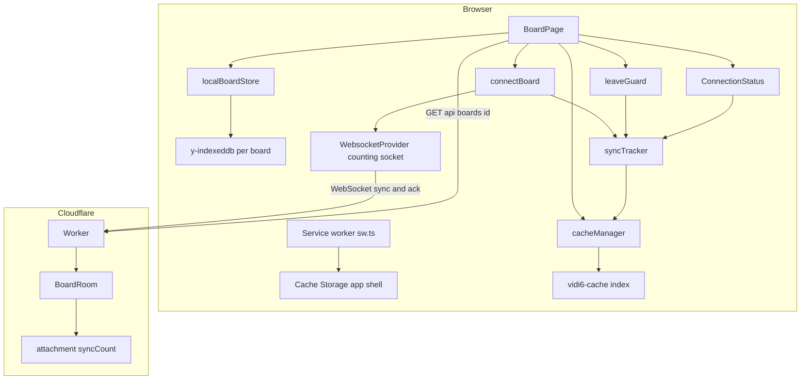
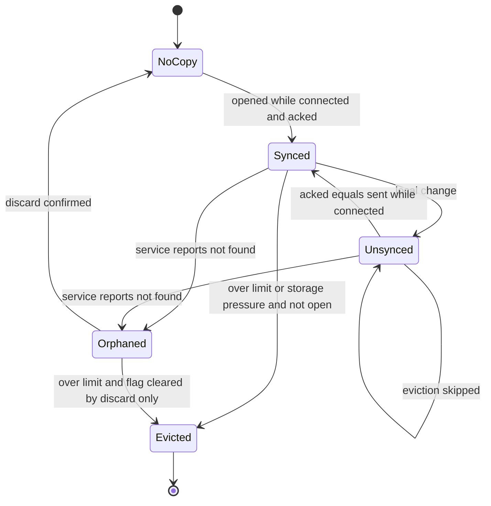
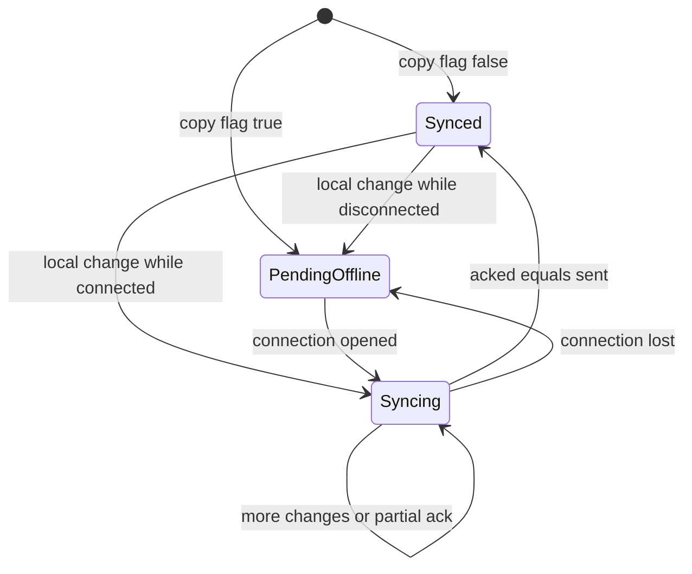
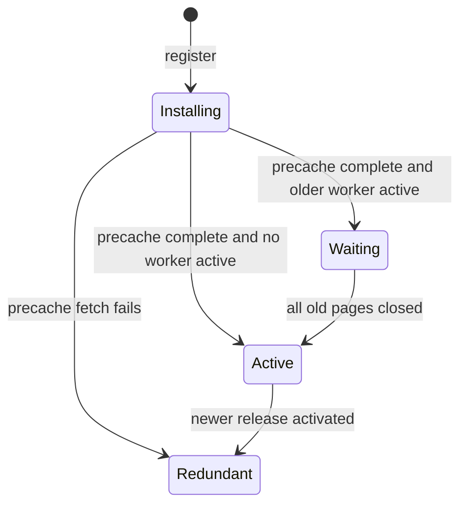
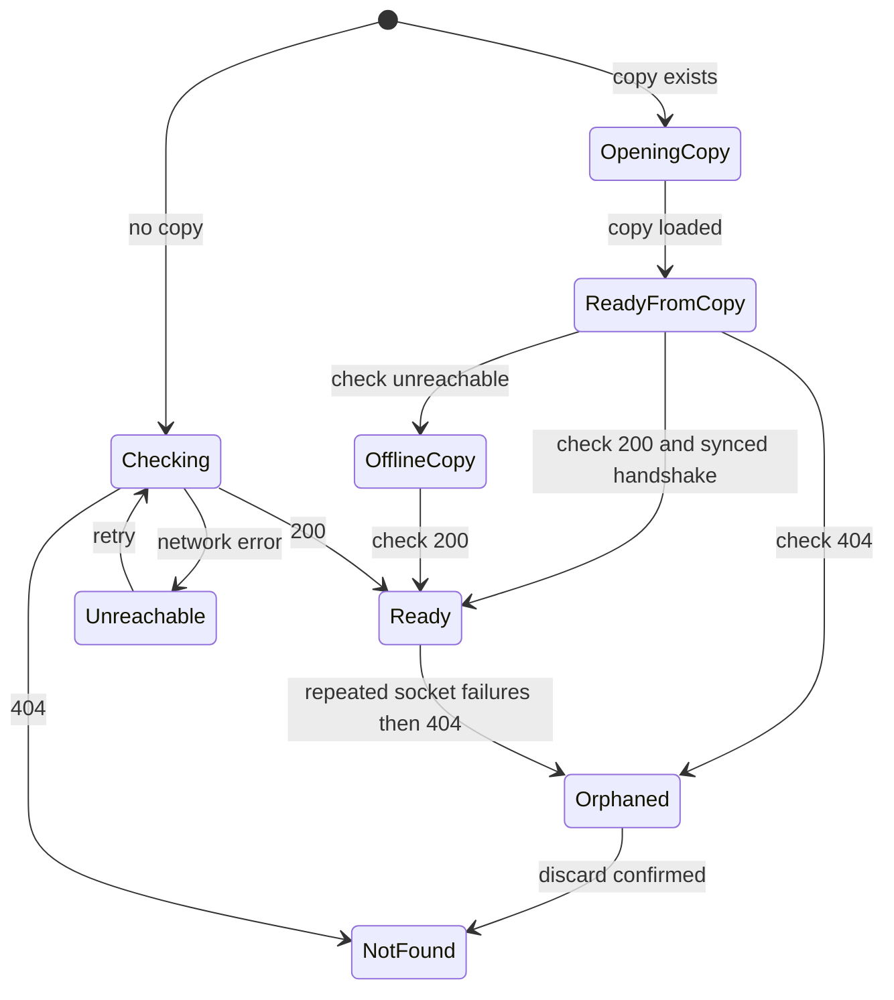
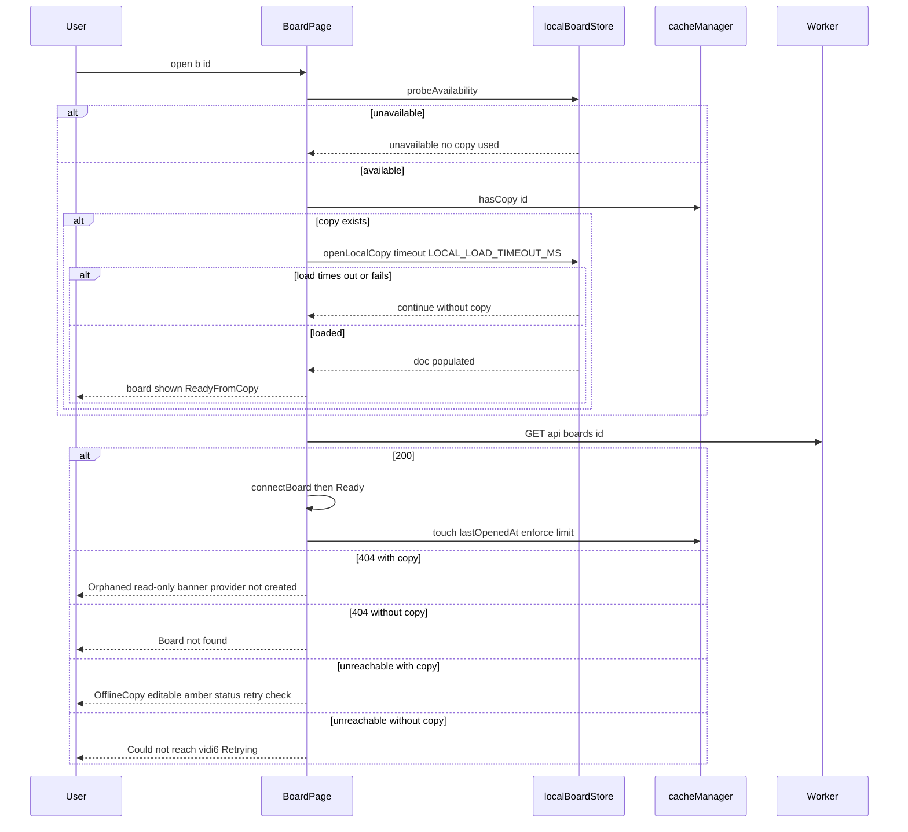
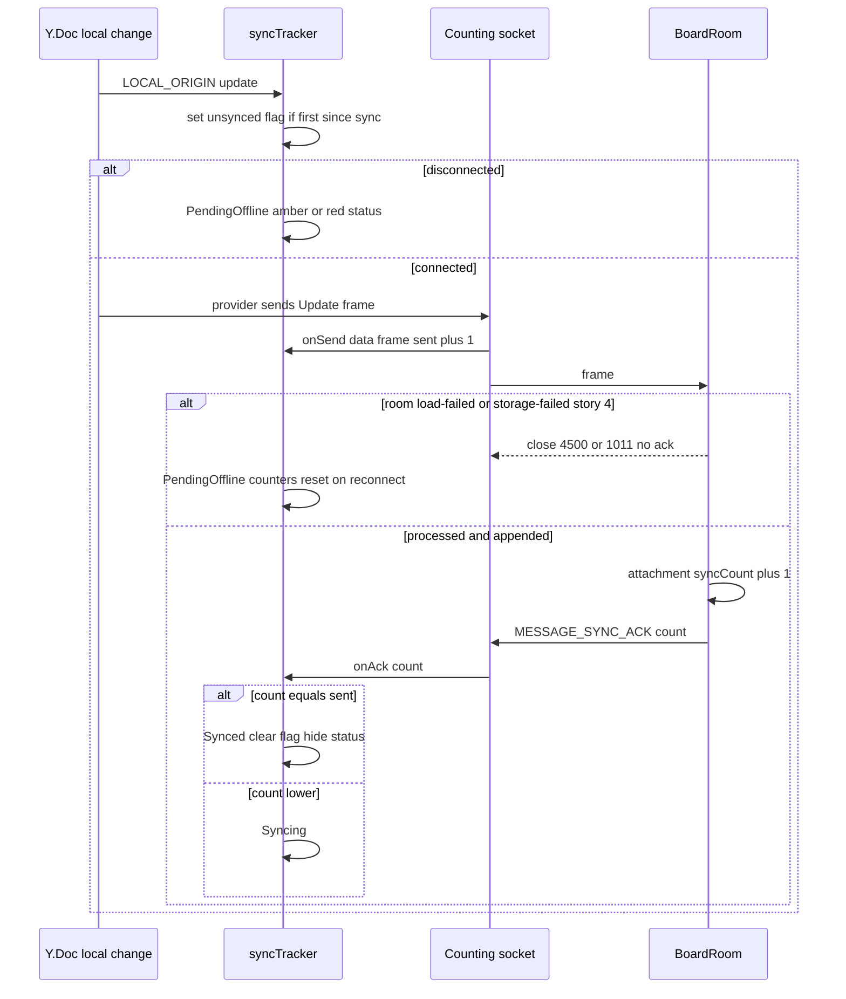
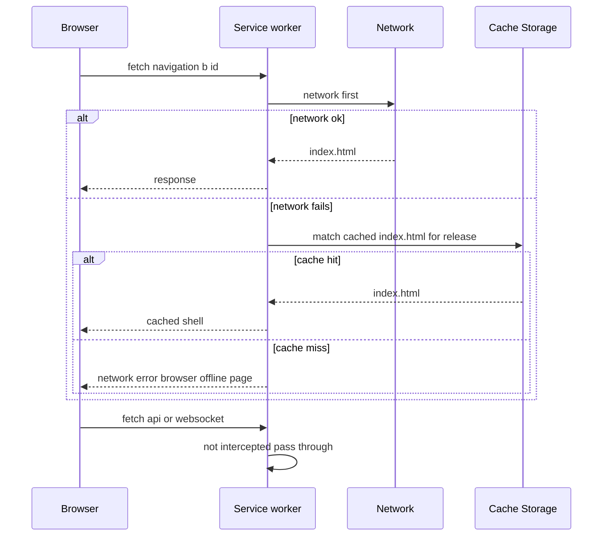
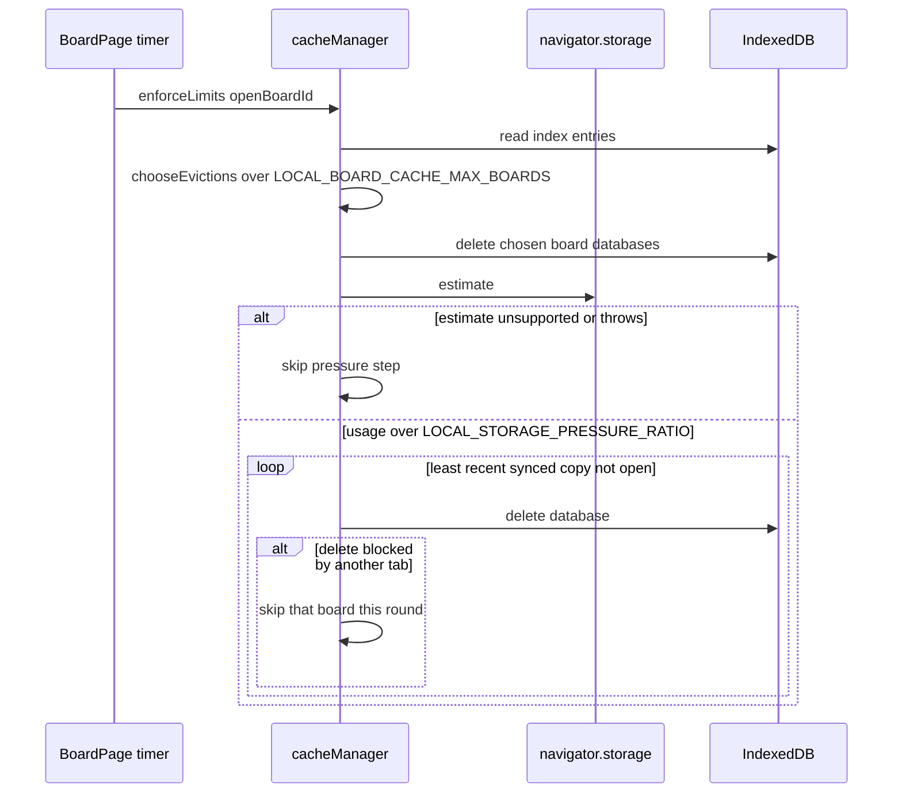
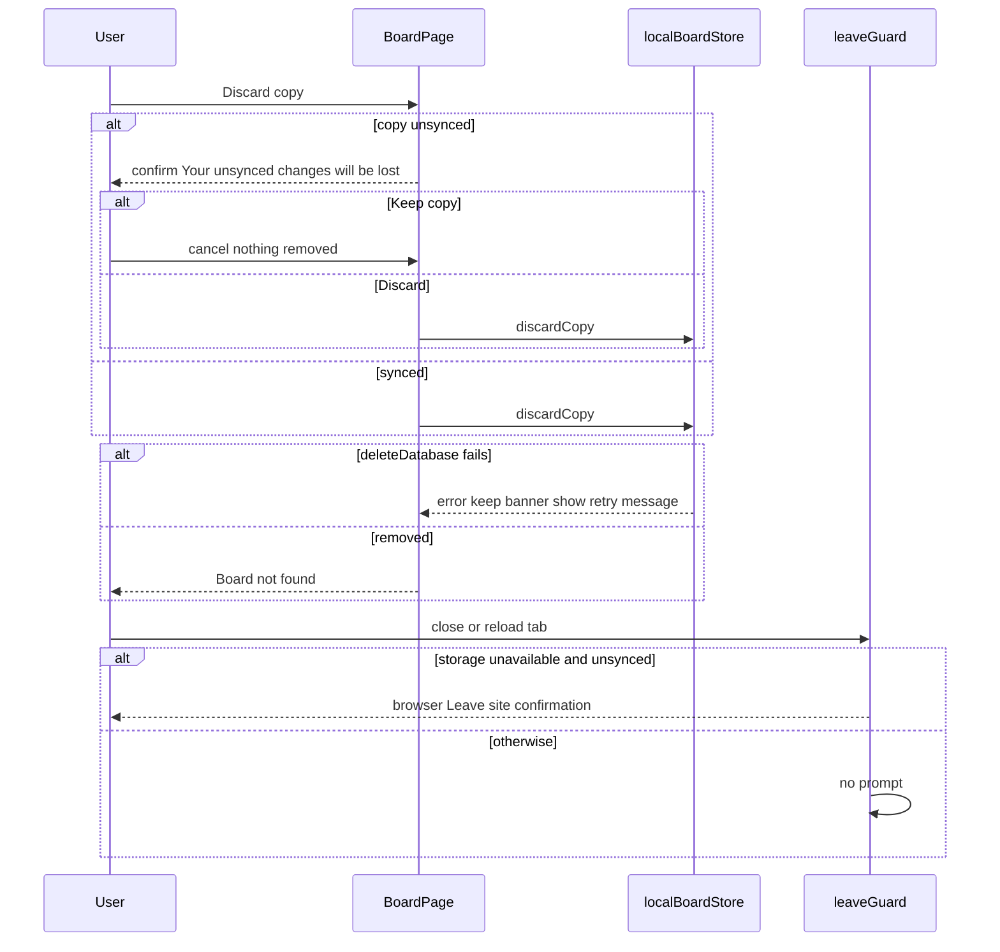

# Technical Design

Offline resilience in six parts: a release-scoped service worker caching the app shell; a y-indexeddb device copy per board with availability probing; a cache manager bounding copies (50, storage pressure) without evicting unsynced ones; a sync acknowledgement protocol (room acks each processed data frame after storage) with a persisted unsynced flag; local-first BoardPage flows including read-only orphaned copies and discard; and status badge states plus a beforeunload guard when the device cannot store changes.

## Overview

## Context
Modifies story 3 (`connectBoard`, `ConnectionStatus`), story 4 (`BoardRoom.webSocketMessage` after `store.append`, `canEdit` gate), story 5 (`BoardPage` existence check states, `checkBoard`) and shares the WebSocket attachment object with story 6 (`awareness` field). Convention 7: `y-indexeddb` per board. Yjs merge rules from story 3 apply unchanged to reconnection.

## Files
| Path | Change | Purpose |
|---|---|---|
| `src/client/sw/sw.ts` | added | service worker: precache current release app shell, navigation fallback, never cache `/api/*` |
| `src/client/sw/registerSw.ts` | added | registration from `main.tsx` |
| `build/vite-sw-manifest.ts` | added | Vite plugin injecting hashed asset list + release id into `sw.js` |
| `public/_headers` | added | `Cache-Control: no-cache` for `/sw.js` |
| `src/client/offline/localBoardStore.ts` | added | availability probe, open device copy (y-indexeddb), discard |
| `src/client/offline/cacheManager.ts` | added | cache index DB, `chooseEvictions`, storage-pressure eviction |
| `src/client/offline/syncTracker.ts` | added | frame classification, sent/acked counters, unsynced flag |
| `src/client/offline/leaveGuard.ts` | added | `beforeunload` guard |
| `src/client/sync/connectBoard.ts` | modified | counting WebSocket wrapper, ack handler registration, `offline`/`online` events |
| `src/client/sync/ConnectionStatus.tsx` | modified | new states |
| `src/client/pages/BoardPage.tsx` | modified | local-first open, offline copy, orphaned copy, discard |
| `src/worker/board-room.ts` | modified | ack after processing data frames; `syncCount` in attachment |
| `src/shared/protocol.ts` | modified | `MESSAGE_SYNC_ACK` |
| `src/shared/config.ts` | modified | settings below |
| `vitest.config.ts` | modified | `browser` project (Vitest browser mode, Playwright Chromium) for real IndexedDB integration tests |

## Named settings added
```ts
export const LOCAL_BOARD_CACHE_MAX_BOARDS = 50;
export const LOCAL_STORAGE_PRESSURE_RATIO = 0.9;
export const STORAGE_CHECK_INTERVAL_MS = 60_000;
export const OFFLINE_STATUS_BUDGET_MS = 2000;
export const OFFLINE_OPEN_BUDGET_MS = 1000;
export const LOCAL_LOAD_TIMEOUT_MS = 2000;       // stop waiting for IndexedDB and continue connected-only
export const ORPHAN_RECHECK_AFTER_FAILURES = 3;  // WebSocket failures before re-checking existence
export const LOCAL_COPY_FORMAT_VERSION = 1;
export const LOCAL_DB_PREFIX = 'vidi6-board-';
export const CACHE_INDEX_DB = 'vidi6-cache';
export const APP_SHELL_CACHE_PREFIX = 'vidi6-shell-';
// src/shared/protocol.ts
export const MESSAGE_SYNC_ACK = 64;
```

## Product and technical decisions
1. **App shell is cached by a release-scoped service worker** so a board address opens after a full browser restart offline. New releases install in the background and take over on the next navigation (no `skipWaiting`), avoiding mixed-version pages. `/api/*` and WebSockets are never intercepted.
2. **Local-first open**: the device copy loads (bounded by LOCAL_LOAD_TIMEOUT_MS) *before* the provider connects, so the provider's first SyncStep1/SyncStep2 exchange carries offline changes (story 3 handshake) and merges them.
3. **Confirmation protocol**: y-websocket has no delivery acknowledgement. The room sends `MESSAGE_SYNC_ACK` + cumulative count after processing each sync *data* frame (SyncStep2 or Update), after story 4's durable append; the client counts the same frames via a WebSocket wrapper (`WebSocketPolyfill` option) and registers `provider.messageHandlers[MESSAGE_SYNC_ACK]`. Counts reset per connection. Unknown message types are otherwise ignored by y-websocket.
4. **Unsynced flag** lives in the cache index (`vidi6-cache`), set true on the first local change after a confirmed sync and false when acked == sent while connected. It drives eviction safety, the syncing status and the leave guard.
5. **Availability** = probe (open/put/get/delete in a probe store) succeeds and no `QuotaExceededError` has been observed. Quota errors from y-indexeddb writes are detected via `unhandledrejection` events whose reason is a `DOMException` named `QuotaExceededError`, switching availability to unavailable for the session.
6. **Orphaned copy**: story 5 `checkBoard` returns not_found while a copy exists → read-only, provider never created. During a session, after ORPHAN_RECHECK_AFTER_FAILURES consecutive WebSocket failures the page re-runs `checkBoard`; not_found → orphaned.
7. **Offline detection** uses provider close events and `window` `offline` events so the offline status appears within OFFLINE_STATUS_BUDGET_MS when the OS reports loss.

## Structure diagram


## State diagrams
Device copy of one board (persisted in IndexedDB):

Client sync tracker (in memory; flag mirrored to IndexedDB):

Service worker (per release):

BoardPage (story 5 states extended):


## Sequence: open a board local-first


## Sequence: change confirmation


## Sequence: service worker navigation


## Sequence: storage pressure and limit eviction


## Sequence: discard and leave guard


## Test Strategy

## Test scopes and boundaries
| Capability | Levels | Boundary exercised | Why sufficient |
|---|---|---|---|
| offline.app_shell | unit, e2e | Pure request classification; real service worker in Chromium | Offline navigation after restart exists only with a real worker and Cache Storage |
| offline.local_store | unit, integration, e2e | Pure helpers; real IndexedDB in Vitest browser mode; real reload/restart flows | IndexedDB semantics (persistence, failures) require a real engine |
| offline.cache_manager | unit, integration | Pure eviction choice; real IndexedDB databases and deletion | Deletion and index consistency need a real engine |
| offline.sync_ack | unit, integration | Pure frame classification/counters; real Durable Object sockets | Ack-after-append ordering is request-handling behaviour |
| offline.board_open | ui-component, e2e | Page state machine with mocked store/api; real browser offline | User-visible flows need real network and storage |
| offline.status_ui | ui-component, e2e | Badge + guard in jsdom; real `beforeunload` dialog | Browser dialog only observable in e2e |

## Dimensions crossed
- **D1 Device copy**: none, synced, unsynced, orphaned.
- **D2 Service answer**: 200, 404, unreachable.
- **D3 Device storage**: available, unavailable (probe fails), quota exceeded mid-session.
- **D4 Page lifecycle**: stays open, reload, full browser restart, second tab.

## Coverage table
| TC | Capability | D1 | D2 | D3 | D4 | Action | Expected before → after | Level |
|---|---|---|---|---|---|---|---|---|
| TC-01 | offline.app_shell | not applicable: request routing | not applicable | not applicable | not applicable | classifyRequest for navigation /b/x, hashed asset, /api/boards, /api/rooms ws, /sw.js | shell, asset, passthrough, passthrough, passthrough | unit |
| TC-02 | offline.app_shell | not applicable | not applicable | not applicable | release change | cachesToDelete(['vidi6-shell-a','vidi6-shell-b','other'], current 'b') | ['vidi6-shell-a'] only | unit |
| TC-03 | offline.local_store | synced | not applicable: pure | available | not applicable | localDbName(id) and format version check | 'vidi6-board-<id>'; version mismatch → treated as no copy | unit |
| TC-04 | offline.cache_manager | synced | not applicable: pure | available | not applicable | chooseEvictions with LOCAL_BOARD_CACHE_MAX_BOARDS+1 entries, oldest synced | evicts exactly the oldest | unit |
| TC-05 | offline.cache_manager | unsynced | not applicable: pure | available | not applicable | same but oldest unsynced | evicts oldest synced instead | unit |
| TC-06 | offline.cache_manager | unsynced | not applicable: pure | available | not applicable | all over-limit entries unsynced | evicts nothing | unit |
| TC-07 | offline.cache_manager | synced | not applicable: pure | available | not applicable | open board is least recent | never chosen | unit |
| TC-08 | offline.sync_ack | unsynced | 200 | available | stays open | classifyFrame for SyncStep1, SyncStep2, Update, awareness, ack | data only for SyncStep2 and Update | unit |
| TC-09 | offline.sync_ack | unsynced | 200 | available | stays open | tracker: 3 sends, acks 1,2 then 3; disconnect after 2 | Syncing, Syncing, Synced; disconnect → PendingOffline and counters reset | unit |
| TC-10 | offline.local_store | none | not applicable | available | reload | openLocalCopy, apply 3 note updates, destroy, reopen new doc | 3 notes present (real IndexedDB) | integration |
| TC-11 | offline.local_store | none | not applicable | unavailable | stays open | probe with IndexedDB open rejected (stubbed factory in browser mode) | 'unavailable', no throw | integration |
| TC-12 | offline.local_store | unsynced | not applicable | available | second tab | two docs on same db apply different updates, reopen third doc | contains both tabs' updates | integration |
| TC-13 | offline.local_store | orphaned | not applicable | available | stays open | discardCopy | database gone; index entry removed | integration |
| TC-14 | offline.cache_manager | synced | not applicable | available | not applicable | create LOCAL_BOARD_CACHE_MAX_BOARDS+1 real copies, enforceLimits | oldest database deleted, index size equals max | integration |
| TC-15 | offline.cache_manager | synced | not applicable | quota exceeded mid-session | not applicable | stub estimate usage above ratio, 3 synced + 1 unsynced + open board | synced non-open copies deleted oldest first; unsynced and open kept | integration |
| TC-16 | offline.sync_ack | unsynced | 200 | available | stays open | client sends 3 Update frames | receives acks 1,2,3; each after updates row exists | integration |
| TC-17 | offline.sync_ack | unsynced | 200 | available | stays open | store.append throws once (story 4 injection) | no ack for that frame; socket closed 1011 | integration |
| TC-18 | offline.sync_ack | synced | 200 | available | stays open | client sends SyncStep1 and awareness only | no ack sent | integration |
| TC-19 | offline.sync_ack | unsynced | 200 | available | reload | reconnect with attachment syncCount from previous socket | new socket count starts at 0 | integration |
| TC-20 | offline.board_open | synced | 404 | available | stays open | mocked copy exists, checkBoard not_found | Orphaned: banner, editing disabled, connectBoard never called | ui-component |
| TC-21 | offline.board_open | none | unreachable | available | stays open | no copy | Unreachable retry message; board not rendered | ui-component |
| TC-22 | offline.board_open | unsynced | 404 | available | stays open | Discard copy then Keep copy; then Discard confirmed | first: copy kept, no discard call; second: discardCopy called, NotFound shown | ui-component |
| TC-23 | offline.board_open | synced | 404 | available | stays open | Discard copy | no confirmation; discardCopy called | ui-component |
| TC-24 | offline.status_ui | unsynced | unreachable | available | stays open | tracker PendingOffline | amber "Offline — changes saved on this device" | ui-component |
| TC-25 | offline.status_ui | unsynced | 200 | available | stays open | tracker Syncing then Synced | "Syncing…" then hidden | ui-component |
| TC-26 | offline.status_ui | unsynced | unreachable | unavailable | stays open | availability unavailable while offline; then connected unsynced | offline red text; connected red "until they sync" text | ui-component |
| TC-27 | offline.status_ui | synced | 200 | unavailable | reload | leaveGuard with unsynced false; then true with available storage; then true with unavailable | no preventDefault, no preventDefault, preventDefault + returnValue set | ui-component |
| TC-28 | offline.local_store | unsynced | unreachable | available | full browser restart | e2e: go offline, add 3 notes, close browser context (persistent context dir), relaunch offline, open board URL | shell served by service worker; 3 notes shown within OFFLINE_OPEN_BUDGET_MS; amber status | e2e |
| TC-29 | offline.board_open | unsynced | 200 | available | full browser restart | continue TC-28: go online | Syncing then hidden; second participant sees 3 notes within LIVE_UPDATE_LATENCY_BUDGET_MS | e2e |
| TC-30 | offline.board_open | none | unreachable | available | stays open | open never-opened board offline | retry message, no board | e2e |
| TC-31 | offline.status_ui | unsynced | unreachable | unavailable | reload | IndexedDB disabled via init script; offline; add note; reload | red warning visible; `beforeunload` dialog event fired and dismissed | e2e |
| TC-32 | offline.board_open | synced | 404 | available | stays open | open board, then delete board server-side via TEST_HOOKS route, reload page | read-only copy with banner; no WebSocket to /api/rooms opened; discard → Board not found | e2e |
| TC-33 | offline.app_shell | none | unreachable | available | full browser restart | load app once online, restart browser offline, open /b/<id> | app shell loads from cache (then TC-30 message since no copy) | e2e |
| TC-34 | offline.local_store | unsynced | 200 | available | second tab | two contexts sharing a profile? not supported → two pages in one context, both offline, edit different notes, go online | all changes on both pages and on a third participant | e2e |
| TC-35 | offline.status_ui | synced | unreachable | available | stays open | context.setOffline(true) | amber status within OFFLINE_STATUS_BUDGET_MS | e2e |

## Boundary values
- Cache limit: LOCAL_BOARD_CACHE_MAX_BOARDS and +1 (TC-04, TC-14).
- Storage pressure: usage exactly at and just above LOCAL_STORAGE_PRESSURE_RATIO (TC-15 variants).
- Ack counts: partial, equal, reset on new connection (TC-09, TC-19).
- Timing budgets at named values: OFFLINE_STATUS_BUDGET_MS, OFFLINE_OPEN_BUDGET_MS (TC-28, TC-35).
- Local load timeout at LOCAL_LOAD_TIMEOUT_MS (TC-36: stub y-indexeddb `whenSynced` never resolving → page continues to connect after timeout; integration).

## Negative scenarios
| TC | Must not happen | Level |
|---|---|---|
| TC-05, TC-06, TC-07, TC-15 | unsynced or open copies must not be evicted | unit, integration |
| TC-17, TC-18 | ack must not be sent for unstored or non-data frames | integration |
| TC-20, TC-32 | orphaned copy must not be sent to the service or be editable | ui-component, e2e |
| TC-21, TC-30 | no empty editable board without a copy | ui-component, e2e |
| TC-22 | unsynced copy must not be discarded without confirmation | ui-component |
| TC-27 | no leave prompt when storage works or nothing is unsynced | ui-component |
| TC-01 | API and WebSocket requests must not be served from cache | unit |

## Error paths (every contract error has a case)
| Contract error | TC |
|---|---|
| IndexedDB unavailable / probe fails | TC-11, TC-31 |
| QuotaExceededError observed | TC-37: dispatch unhandledrejection with DOMException QuotaExceededError → availability unavailable, status red (ui-component) |
| local load timeout | TC-36 |
| precache fetch fails (service worker Redundant) | TC-38: install with one asset returning 500 → previous release remains active; app still works online (e2e) |
| deleteDatabase blocked by another tab | TC-39: open second connection to a board db, run pressure eviction → board skipped, others evicted, no throw (integration) |
| room load-failed/storage-failed → no ack | TC-17 |
| discard deletion fails | TC-40: discardCopy rejects → banner kept with "Couldn't discard the copy. Try again." (ui-component) |

## Mock vs real boundaries
| Dependency | Mocked? | Reason |
|---|---|---|
| IndexedDB | Real (Vitest browser mode Chromium; Playwright e2e) | Store under test; fake-indexeddb would hide engine behaviour |
| IndexedDB failure | Stubbed `indexedDB.open` rejection in browser mode and init script in e2e | Private-mode behaviour cannot be launched deterministically in CI |
| `navigator.storage.estimate` | Stubbed values | Real quota cannot be filled in CI |
| Service worker + Cache Storage | Real in Chromium e2e | Only real worker proves offline shell |
| Durable Object + storage | Real (workerd) | Ack ordering after append |
| localBoardStore / api in component tests | Mocked | Page state machine under test |
| Network | Playwright `setOffline` and route abort | Deterministic outages |

## E2E workflows
1. **Train journey** (TC-35 → TC-28 → TC-29): offline status, full restart offline, changes still there, sync and delivery on reconnect.
2. **Plane without a copy** (TC-33 → TC-30): shell loads offline; honest retry message.
3. **Private mode** (TC-31): red warning and leave prompt.
4. **Board gone** (TC-32): orphaned read-only copy, no re-upload, discard.
5. **Two tabs offline** (TC-34): merge.
6. **Broken release precache** (TC-38).

## Fixtures
- Boards created via `POST /api/boards` and filled with story 4's 25-note retro fixture; large-copy timing uses the `PERSIST_TESTED_NOTES` fixture.
- Persistent Chromium profile directory per test for restart scenarios.
- TEST_HOOKS-only route `DELETE /__test/boards/:id` (story 4 hook module) to simulate a board missing on the service.

## Not covered
- Real private browsing modes in Safari and Firefox (manual).
- Real disk-full conditions (stubbed estimate and injected errors only).
- OS tab discarding (restart and reload used as proxies).
- Silent network hangs where the OS does not report offline: detection then relies on story 3's reconnect timeout, not OFFLINE_STATUS_BUDGET_MS.
- The small window where a tab is killed after y-indexeddb stored a change but before the unsynced flag write completed; the change is still resent on next open, but that board's copy could be evicted while flagged synced.
- Service worker behaviour in Firefox and WebKit e2e (Chromium only); manual check.

## Offline application shell

> Anchor: `offline.app_shell`

## Contract
```ts
// src/client/sw/sw.ts
export type RequestKind = 'shell' | 'asset' | 'passthrough';
export function classifyRequest(req: { mode: string; url: string; method: string }): RequestKind;
export function cachesToDelete(existing: string[], currentRelease: string): string[];
// src/client/sw/registerSw.ts
export function registerServiceWorker(): Promise<void>; // no-op when unsupported or in test mode for unit/component suites
```
- **Inputs**: fetch events; install/activate events; injected `RELEASE_ID` and `ASSET_MANIFEST` from `build/vite-sw-manifest.ts`.
- **Outputs**: on install, cache `index.html` + manifest assets in `APP_SHELL_CACHE_PREFIX + RELEASE_ID`; navigations network-first with cached `index.html` fallback; hashed assets cache-first; `/api/*`, WebSocket upgrades, non-GET and `/sw.js` pass through.
- **Errors**: precache failure → install fails, previous worker stays active; cache miss offline → browser's normal network error.
- **Side effects**: Cache Storage writes; old release caches deleted on activate.

## Implementation
No `skipWaiting`/`clients.claim`, so a page never mixes releases. `public/_headers` serves `/sw.js` with `Cache-Control: no-cache` so updates are found (Workers static assets `_headers` support to be confirmed during implementation). Satisfies reopening after full restart offline (offline.survive_reload, offline.open_offline); with no device copy the cached shell shows story 5's retry message (offline.no_copy_offline).

## Tests
unit: TC-01, TC-02 (`tests/unit/sw.test.ts`). e2e: TC-28, TC-33, TC-38.

## Device copy store

> Anchor: `offline.local_store`

## Contract
```ts
// src/client/offline/localBoardStore.ts
export type Availability = 'available' | 'unavailable';
export function localDbName(boardId: string): string;               // LOCAL_DB_PREFIX + id
export function probeAvailability(factory?: IDBFactory): Promise<Availability>;
export function openLocalCopy(boardId: string, doc: Y.Doc, timeoutMs?: number): Promise<{ loaded: boolean; timedOut: boolean; persistence: IndexeddbPersistence | null }>;
export function discardCopy(boardId: string): Promise<void>;         // rejects on deleteDatabase error
export function onQuotaExceeded(listener: () => void): () => void;   // unhandledrejection watcher
```
- **Inputs**: board id, Y.Doc, IndexedDB.
- **Outputs**: doc populated from the device copy; every subsequent doc update persisted by y-indexeddb; format version stored in the copy's meta store (`LOCAL_COPY_FORMAT_VERSION`), mismatches treated as no copy.
- **Errors**: probe failure → `unavailable`; `whenSynced` exceeding timeout → `{loaded:false, timedOut:true}` and the page continues connected-only; `QuotaExceededError` → listener fires; `discardCopy` failure rejects.
- **Side effects**: IndexedDB databases per board.

## Implementation
- `IndexeddbPersistence(localDbName(id), doc)` created before `connectBoard`, so offline changes are present in the first sync exchange and merge by Yjs rules (offline.merge, offline.survive_reload).
- Two tabs share the same database; each tab's updates are stored and both are included when either reopens or syncs (offline.merge).
- Availability result feeds status and guard (offline.storage_unavailable).
- `discardCopy` destroys persistence, deletes the database and removes the index entry via cacheManager (offline.discard).
- Opening an existing copy satisfies offline.open_offline within OFFLINE_OPEN_BUDGET_MS for boards up to the story 4 tested size.

## Tests
unit: TC-03. integration: TC-10 to TC-13, TC-36 (`tests/browser/local-board-store.test.ts`). e2e: TC-28, TC-34.

## Device copy limits and storage pressure

> Anchor: `offline.cache_manager`

## Contract
```ts
// src/client/offline/cacheManager.ts
export interface CacheEntry { boardId: string; lastOpenedAt: number; unsynced: boolean; formatVersion: number }
export function chooseEvictions(entries: CacheEntry[], openBoardId: string, max?: number): string[];
export function choosePressureEvictions(entries: CacheEntry[], openBoardId: string): string[]; // synced, not open, oldest first
export function touch(boardId: string): Promise<void>;
export function setUnsynced(boardId: string, unsynced: boolean): Promise<void>;
export function hasCopy(boardId: string): Promise<boolean>;
export function enforceLimits(openBoardId: string, estimate?: () => Promise<StorageEstimate>): Promise<{ evicted: string[]; skipped: string[] }>;
```
- **Inputs**: cache index DB `CACHE_INDEX_DB`; `navigator.storage.estimate`.
- **Outputs**: evicted board databases and index entries.
- **Errors**: `estimate` unsupported/throws → pressure step skipped; `deleteDatabase` blocked (another tab open) → board added to `skipped`, retried next round; never throws.
- **Side effects**: IndexedDB deletions.

## Implementation
`chooseEvictions` sorts by `lastOpenedAt` and removes the oldest entries that are neither unsynced nor open until at most `max` remain (offline.cache_limit). `enforceLimits` runs on board open and every STORAGE_CHECK_INTERVAL_MS; when `usage / quota > LOCAL_STORAGE_PRESSURE_RATIO` it deletes `choosePressureEvictions` one at a time, re-estimating after each (offline.storage_pressure).

## Tests
unit: TC-04 to TC-07 (`tests/unit/cache-manager.test.ts`). integration: TC-14, TC-15, TC-39 (`tests/browser/cache-manager.test.ts`).

## Sync acknowledgement and unsynced tracking

> Anchor: `offline.sync_ack`

## Contract
```ts
// src/client/offline/syncTracker.ts
export type TrackerState = 'synced' | 'pending_offline' | 'syncing';
export function classifyFrame(data: ArrayBufferLike | string): 'data' | 'other';
export function createSyncTracker(opts: { boardId: string; initiallyUnsynced: boolean; persistFlag(unsynced: boolean): Promise<void> }): {
  onLocalChange(): void; onConnected(): void; onDisconnected(): void;
  onSend(frame: ArrayBufferLike | string): void; onAck(count: number): void;
  state(): TrackerState; subscribe(fn: (s: TrackerState) => void): () => void; hasUnsynced(): boolean;
};
// server (src/worker/board-room.ts, modification): after processing a data frame and story 4 append
// ws.serializeAttachment({ ...att, syncCount: (att.syncCount ?? 0) + 1 }); ws.send(encodeAck(syncCount))
```
- **Inputs**: local LOCAL_ORIGIN updates, provider status events, outgoing frames via counting WebSocket subclass passed as `WebSocketPolyfill`, `MESSAGE_SYNC_ACK` frames via `provider.messageHandlers[MESSAGE_SYNC_ACK]`.
- **Outputs**: tracker state for status and guard; unsynced flag persisted through cacheManager.
- **Errors**: close without ack (story 4 4500/1011) → remains unsynced; acks higher than sent (stale) are clamped and logged.
- **Side effects**: one small server message per data frame.

## Implementation
On reconnect the provider's handshake (story 3) sends a SyncStep2 containing all device-held changes, including those from before reload (offline.sync_after_reopen); it is counted and acked like any update, so "Syncing…" hides only after the service stored it (offline.status_syncing). Concurrent offline work from others merges through the same exchange (offline.merge). `hasUnsynced()` feeds `leaveGuard` (offline.leave_guard). Room acks only after successful append, so an ack implies durability.

## Tests
unit: TC-08, TC-09 (`tests/unit/sync-tracker.test.ts`). integration: TC-16 to TC-19 (`tests/integration/sync-ack.test.ts`).

## Local-first board opening, orphaned copies and discard

> Anchor: `offline.board_open`

## Contract
```tsx
// src/client/pages/BoardPage.tsx (modified)
type BoardPageState = 'opening_copy' | 'ready_from_copy' | 'ready' | 'offline_copy' | 'orphaned' | 'checking' | 'not_found' | 'unreachable';
export function BoardPage(props: { id: string; deps?: { store: typeof localBoardStore; cache: typeof cacheManager; api: typeof api } }): JSX.Element;
export function OrphanedBanner(props: { unsynced: boolean; onDiscard(): Promise<void> }): JSX.Element;
```
- **Inputs**: device copy presence, `checkBoard` results, WebSocket failure count, discard clicks.
- **Outputs**: state transitions per the BoardPage state diagram; `offline_copy` renders the editable board with retrying `checkBoard` and a `connectBoard` attempt once reachable; `orphaned` renders read-only (story 4 `canEdit` false) with banner "This board no longer exists. You're viewing the copy saved on this device." and Discard copy; `not_found`/`unreachable` as story 5 when no copy.
- **Errors**: discard failure → banner stays with "Couldn't discard the copy. Try again."
- **Side effects**: `connectBoard` is never called in `orphaned` (offline.orphaned_copy); `touch` on successful open.

## Implementation
Discard with unsynced flag shows confirmation "Discard this copy? Your unsynced changes will be lost." with Discard and Keep copy (offline.discard). No-copy offline keeps story 5 message (offline.no_copy_offline). Transition to `ready` after reconnect lets the handshake deliver device changes (offline.sync_after_reopen). ORPHAN_RECHECK_AFTER_FAILURES consecutive socket failures trigger a re-check that can move `ready` to `orphaned`.

## Tests
ui-component: TC-20 to TC-23, TC-40 (`tests/component/board-page-offline.test.tsx`). e2e: TC-29, TC-30, TC-32.

## Offline status badge and leave guard

> Anchor: `offline.status_ui`

## Contract
```tsx
// src/client/sync/ConnectionStatus.tsx (modified)
export type OfflineBadge = 'hidden' | 'offline_saved' | 'syncing' | 'offline_unsaved' | 'connected_unsaved';
export function deriveBadge(input: { connected: boolean; tracker: TrackerState; availability: Availability }): OfflineBadge;
// src/client/offline/leaveGuard.ts
export function shouldGuard(input: { availability: Availability; unsynced: boolean }): boolean;
export function installLeaveGuard(get: () => { availability: Availability; unsynced: boolean }): () => void;
```
- **Inputs**: connection state (story 3/4 plus `window` offline/online events), tracker state, availability, quota listener.
- **Outputs**: badge texts — offline_saved amber "Offline — changes saved on this device"; syncing grey "Syncing…"; offline_unsaved red "Offline — changes can't be saved on this device. Don't close this tab."; connected_unsaved red "Changes can't be saved on this device until they sync."; story 3/4 states (Connecting, load failed) keep precedence rules defined in story 4.
- **Errors**: none; guard never throws.
- **Side effects**: `beforeunload` listener calls `preventDefault()` and sets `returnValue` only when `shouldGuard` is true.

## Implementation
Offline badge shown immediately on `offline` event or provider disconnect, meeting OFFLINE_STATUS_BUDGET_MS (offline.status_offline); hidden only when tracker is `synced` (offline.status_syncing); unavailability from probe or quota listener selects red variants (offline.storage_unavailable); guard only for unavailable + unsynced (offline.leave_guard).

## Tests
ui-component: TC-24 to TC-27, TC-37 (`tests/component/offline-status.test.tsx`). e2e: TC-31, TC-35.

