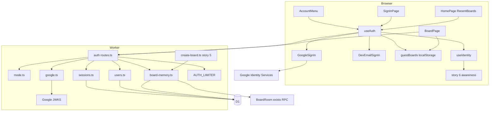
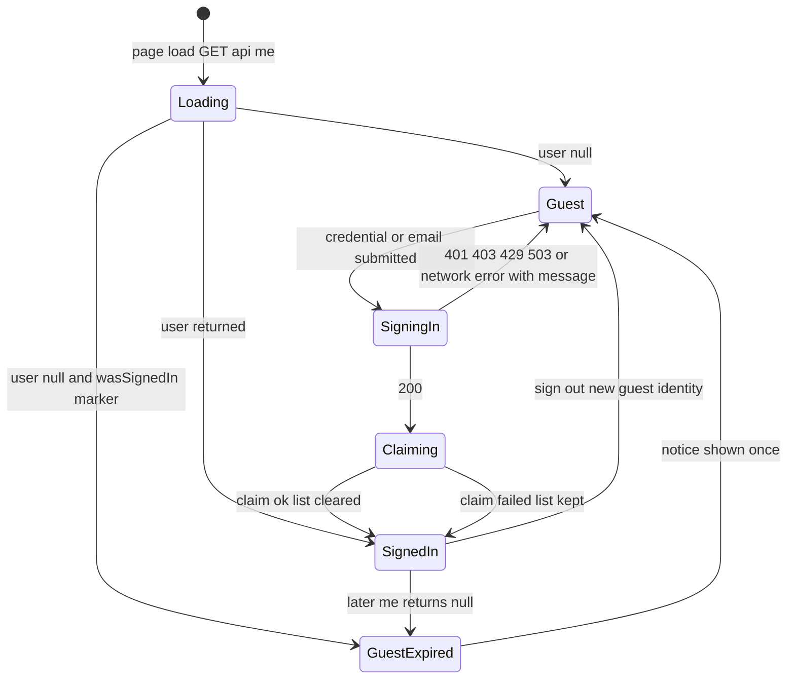
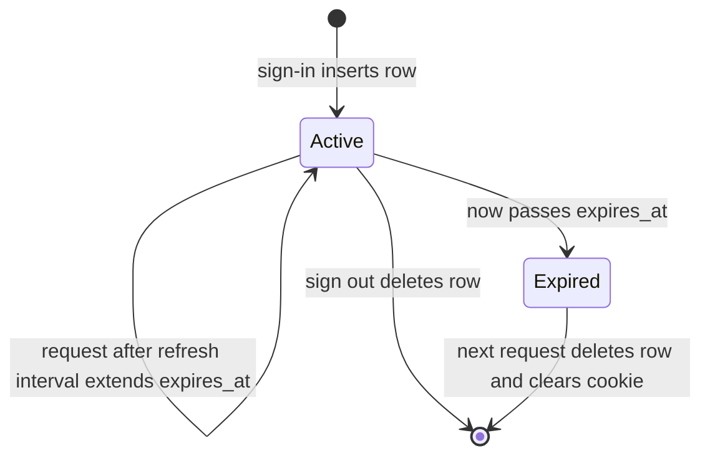
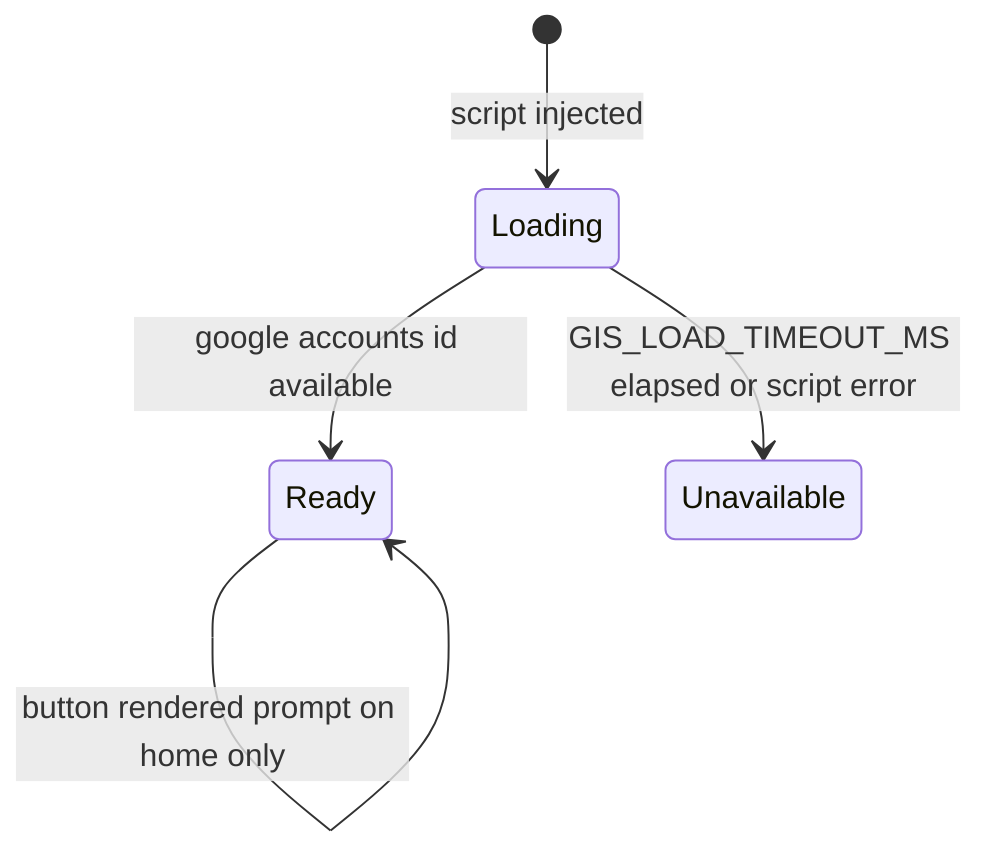
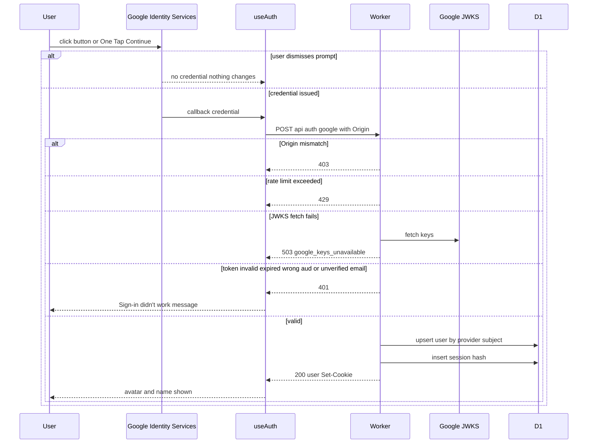
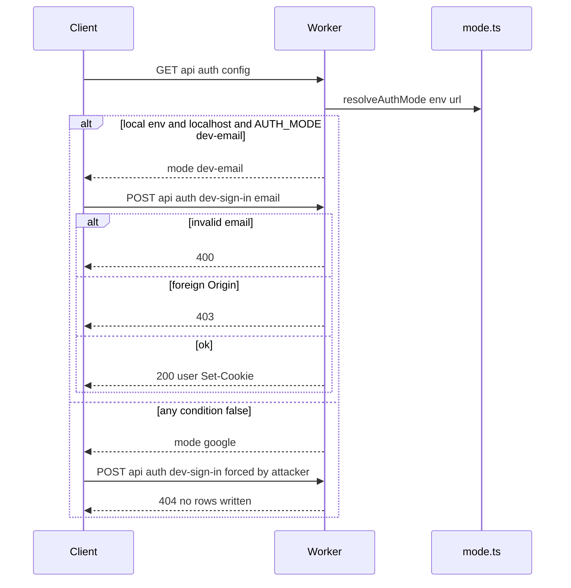
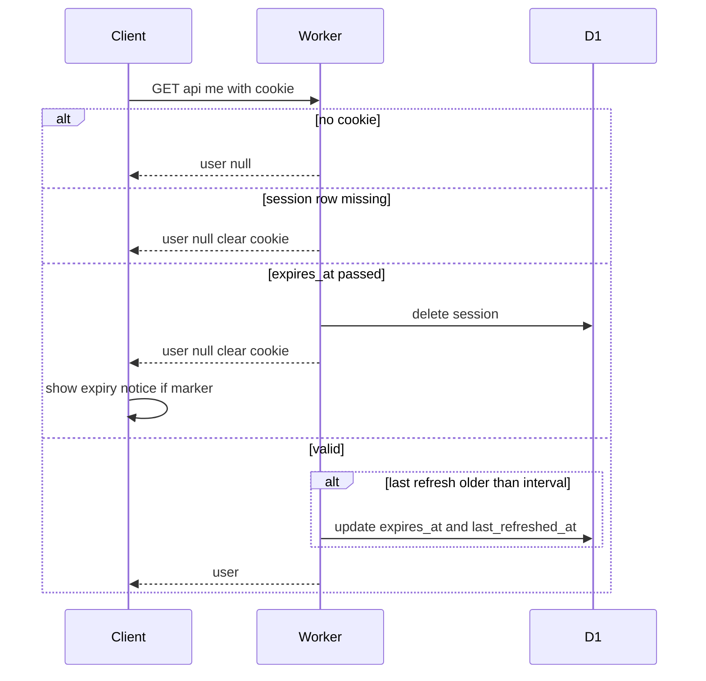
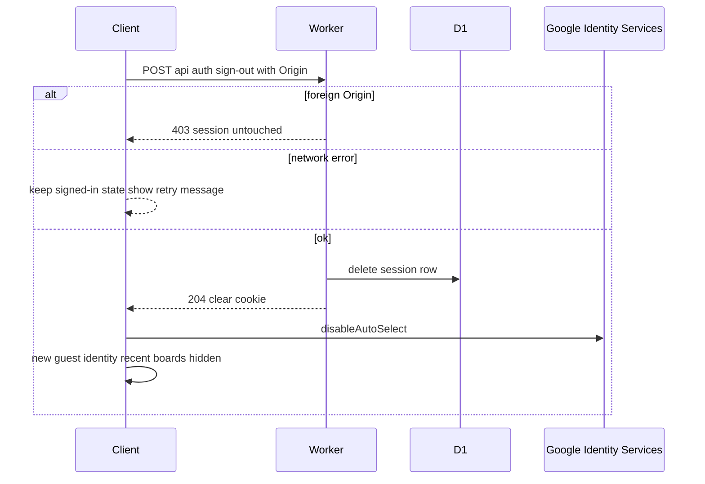
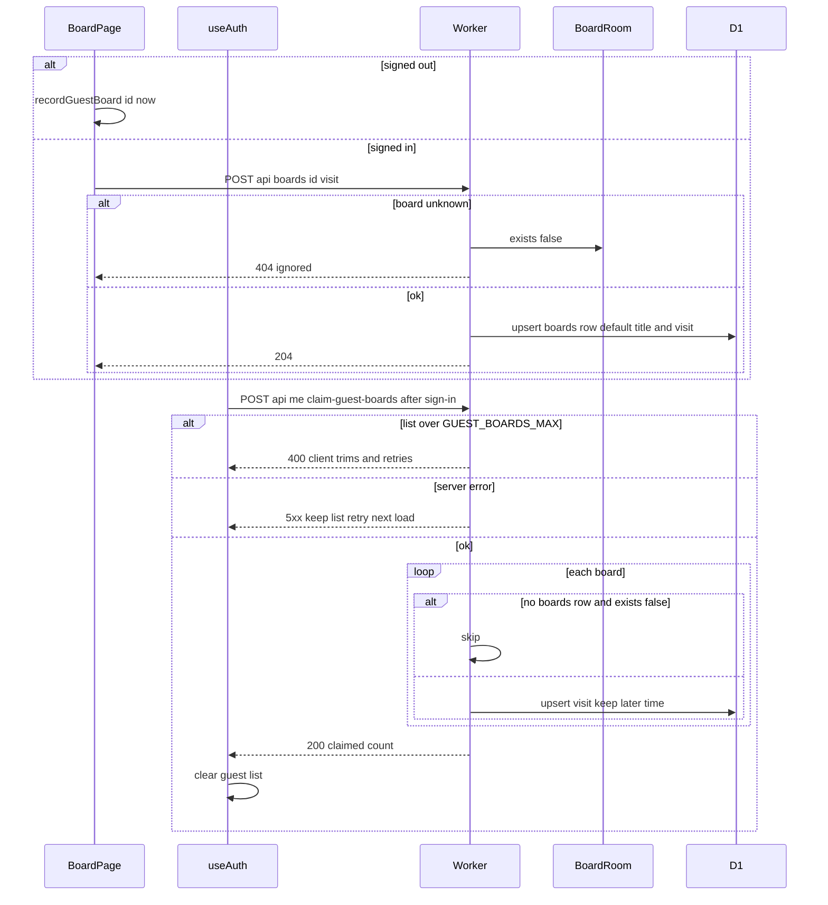
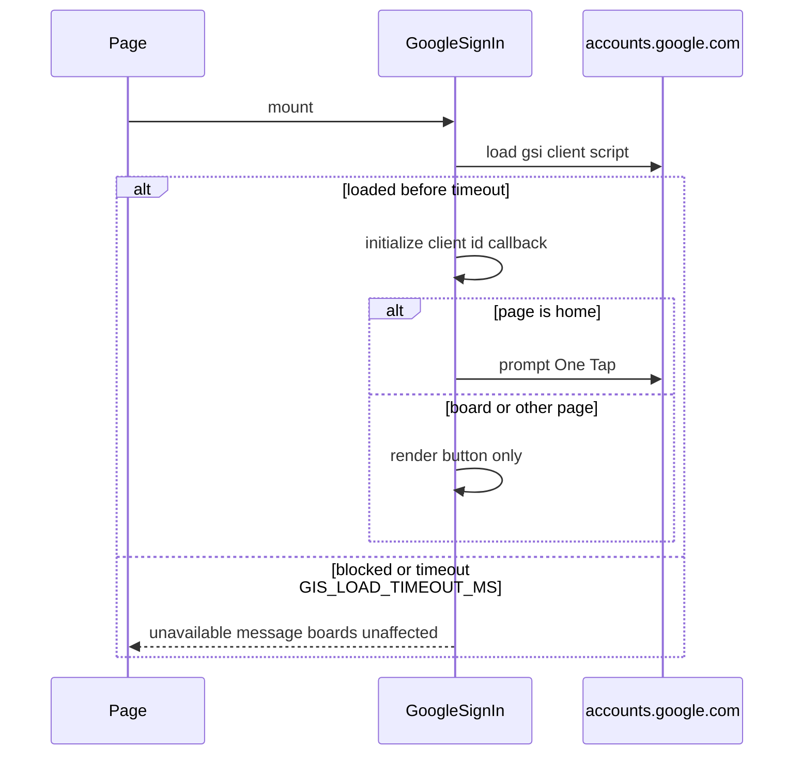

# Technical Design

Sign-in via Google Identity Services (button everywhere, One Tap on the home page) with ID tokens verified in the Worker, or an email-only form that exists only when the local wrangler env on localhost enables it. Sessions are hashed tokens in D1 behind HttpOnly SameSite=Lax cookies with sliding 30-day expiry and Origin checks on every state-changing POST. Board visits and boards rows live in D1; guest boards remembered in localStorage are claimed at sign-in; signed-in identity replaces the guest identity in presence.

## Overview

## Context
Builds on story 5 (`src/worker/index.ts`, `src/worker/create-board.ts`, `src/client/router.ts`, `src/client/pages/HomePage.tsx`, `src/client/pages/BoardPage.tsx`, `src/client/api.ts`) and story 6 (`src/client/identity/useIdentity.ts`, awareness `user` field). Board and room routes stay unauthenticated (auth.link_access_unchanged).

## Files
| Path | Change | Purpose |
|---|---|---|
| `migrations/0001_auth.sql` | added | D1 tables `users`, `sessions`, `boards`, `board_visits` |
| `wrangler.jsonc` | modified | D1 binding `DB`; `ratelimits` binding `AUTH_LIMITER`; top-level vars `AUTH_MODE=google`, `ENVIRONMENT=production`, `GOOGLE_CLIENT_ID`; `env.local.vars` `AUTH_MODE=dev-email`, `ENVIRONMENT=local` (used by `wrangler dev --env local`) |
| `src/worker/auth/mode.ts` | added | `resolveAuthMode` guard |
| `src/worker/auth/google.ts` | added | Google ID token verification |
| `src/worker/auth/sessions.ts` | added | session tokens, cookies, Origin check, sliding expiry |
| `src/worker/auth/users.ts` | added | user upsert |
| `src/worker/auth/board-memory.ts` | added | visits, claims, recent boards queries |
| `src/worker/auth/routes.ts` | added | `/api/auth/*`, `/api/me*`, `/api/boards/:id/visit` |
| `src/worker/index.ts` | modified | mount auth routes |
| `src/worker/create-board.ts` | modified (story 5) | insert `boards` row, record creator visit |
| `src/client/auth/useAuth.ts` | added | auth state machine |
| `src/client/auth/GoogleSignIn.tsx` | added | GIS script loading, button, One Tap |
| `src/client/auth/DevEmailSignIn.tsx` | added | local-build email form |
| `src/client/auth/AccountMenu.tsx` | added | top-right menu |
| `src/client/auth/RecentBoards.tsx` | added | home page recent boards list |
| `src/client/pages/SignInPage.tsx` | added | `/sign-in` page, returns to stored path |
| `src/client/identity/guestBoards.ts` | added | localStorage guest board list |
| `src/client/identity/useIdentity.ts` | modified (story 6) | signed-in identity overrides guest; new guest id on sign-out |
| `src/client/pages/HomePage.tsx` | modified (story 5) | Your recent boards, One Tap host |
| `src/client/pages/BoardPage.tsx` | modified (story 5) | record visit or guest board; inline sign-in in AccountMenu |
| `src/client/router.ts` | modified (story 5) | `/sign-in` route |

## Named settings (`src/shared/config.ts`)
```ts
export const SESSION_TTL_DAYS = 30;
export const SESSION_REFRESH_INTERVAL_HOURS = 24;
export const SESSION_TOKEN_BYTES = 32;
export const SESSION_COOKIE = 'vidi6_session';
export const RECENT_BOARDS_LIMIT = 10;
export const GUEST_BOARDS_MAX = 200;
export const GIS_LOAD_TIMEOUT_MS = 8000;
export const SIGN_IN_BUDGET_MS = 3000;
export const IDENTITY_PROPAGATION_BUDGET_MS = 2000;
export const AUTH_ATTEMPT_LIMIT = 20;              // per visitor, mirrors wrangler ratelimits
export const AUTH_ATTEMPT_PERIOD_SECONDS = 60;
export const TOKEN_CLOCK_SKEW_SECONDS = 60;
export const DEFAULT_BOARD_TITLE = 'Untitled board';
export const GOOGLE_ISSUERS = ['accounts.google.com', 'https://accounts.google.com'] as const;
```

## D1 schema (`migrations/0001_auth.sql`)
```sql
CREATE TABLE users (id TEXT PRIMARY KEY, provider TEXT NOT NULL CHECK (provider IN ('google','dev')), provider_subject TEXT NOT NULL, email TEXT NOT NULL, name TEXT NOT NULL, avatar_url TEXT, created_at INTEGER NOT NULL, updated_at INTEGER NOT NULL, UNIQUE (provider, provider_subject));
CREATE TABLE sessions (token_hash TEXT PRIMARY KEY, user_id TEXT NOT NULL REFERENCES users(id), created_at INTEGER NOT NULL, expires_at INTEGER NOT NULL, last_refreshed_at INTEGER NOT NULL);
CREATE TABLE boards (id TEXT PRIMARY KEY, title TEXT NOT NULL, created_by TEXT REFERENCES users(id), created_at INTEGER NOT NULL, updated_at INTEGER NOT NULL);
CREATE TABLE board_visits (user_id TEXT NOT NULL REFERENCES users(id), board_id TEXT NOT NULL REFERENCES boards(id), last_opened_at INTEGER NOT NULL, PRIMARY KEY (user_id, board_id));
CREATE INDEX board_visits_recent ON board_visits (user_id, last_opened_at DESC);
```

## Decisions
1. **Dev mode can never be live in production.** `resolveAuthMode(env, url)` returns `dev-email` only if `env.AUTH_MODE === 'dev-email'` AND `env.ENVIRONMENT === 'local'` AND `url.hostname` is `localhost` or `127.0.0.1`. Three independent conditions: a mistaken var on a deployed Worker still fails the hostname and environment checks. `/api/auth/dev-sign-in` responds 404 (indistinguishable from a missing route) whenever the mode is not `dev-email`; `/api/auth/config` then reports `google`, so the client never renders the email form.
2. **Google verification.** `jose` `jwtVerify` with a `JwksProvider` wrapping `createRemoteJWKSet('https://www.googleapis.com/oauth2/v3/certs')`; checks RS256 signature, `iss` in `GOOGLE_ISSUERS`, `aud === GOOGLE_CLIENT_ID`, `exp` with `TOKEN_CLOCK_SKEW_SECONDS`, `email_verified === true`. Button and One Tap both deliver the same `credential` to one callback, so the server path is identical.
3. **Sessions.** Token = `SESSION_TOKEN_BYTES` random bytes (base64url) in cookie `SESSION_COOKIE` (`HttpOnly; SameSite=Lax; Path=/; Max-Age=TTL`, `Secure` when the request is https). D1 stores only SHA-256 of the token. Sliding expiry: every authenticated request refreshes `expires_at` when `last_refreshed_at` is older than `SESSION_REFRESH_INTERVAL_HOURS`. Expired sessions are deleted on sight and the cookie cleared.
4. **CSRF.** SameSite=Lax blocks cross-site cookie POSTs in current browsers; as defence in depth every state-changing request under `/api/auth/*`, `/api/me/*` and `POST /api/boards/:id/visit` requires an `Origin` header exactly equal to the request's origin, else 403 before any work. The Google callback posts via `fetch` (JS callback mode), not a form redirect, so no Google `g_csrf_token` handling is needed.
5. **Guest board claiming.** While signed out, `BoardPage` calls `recordGuestBoard(boardId, now)` (list capped at `GUEST_BOARDS_MAX`, oldest dropped). Immediately after sign-in the client posts the list to `/api/me/claim-guest-boards`; the server keeps the later `last_opened_at` per board and skips ids that do not exist (story 5 `exists()` RPC); on success the client clears the list; on failure it keeps it and retries at next page load.
6. **Sign-out.** Deletes the session row, clears the cookie, calls `google.accounts.id.disableAutoSelect()` so One Tap does not auto sign-in again, and `useIdentity` issues a *new* guest identity (the pre-sign-in guest id is retired so the signed-out person is not linkable to the account).
7. **Google blocked/unavailable.** The GIS script is injected once; if `window.google.accounts.id` is not available within `GIS_LOAD_TIMEOUT_MS`, the account area shows the unavailable message. Nothing else depends on Google.
8. **Session expiry notice.** The client stores a non-secret marker `vidi6.wasSignedIn` while signed in; if `/api/me` returns `null` while the marker exists, the expiry message is shown once and the marker removed.
9. **Privacy.** Story 5's `no-referrer` policy prevents board URLs reaching Google. `/sign-in` keeps the return path in `sessionStorage` (`vidi6.returnTo`), not in the URL. Avatars rendered with `referrerpolicy="no-referrer"`.
10. **Identity propagation.** `useIdentity` returns `{id:'u_'+user.id, name, email, avatarUrl, color}` (colour derived deterministically from the id, since story 6 awareness needs one); story 6's awareness sync calls `awareness.setLocalStateField('user', ...)` on change, so others see the new name via the existing relay without reloading.

## Structure diagram


## State diagrams
Client auth state:

Persisted session row lifecycle:

Google script state:


## Sequence: Google sign-in (button or One Tap)


## Sequence: local email sign-in and guard


## Sequence: page load, refresh and expiry


## Sequence: sign-out


## Sequence: visits and guest claiming


## Sequence: Google script unavailable


## Test Strategy

## Test levels and boundary justification
| Capability | Levels | Boundary exercised | Why sufficient |
|---|---|---|---|
| auth.mode_guard | unit, integration, e2e | Pure guard; real Worker request handling; real browser against production-like and local configs | The requirement is about what a deployed service accepts, so request handling and served UI must both be exercised |
| auth.google_verify | unit, integration | Claim checks with locally signed tokens; real route + D1 with fake JWKS | Real Google cannot mint tokens in CI; signature, claims and persistence are fully exercised with test keys |
| auth.sessions | unit, integration | Cookie/Origin/refresh logic; real route + D1 | Expiry, deletion and CSRF refusals are request and storage facts |
| auth.board_memory | unit, integration, e2e | Claim merge logic; real routes + D1 + BoardRoom RPC; real browsers across contexts | Cross-device and claim outcomes only observable with real storage and two sessions |
| auth.client | unit, ui-component, e2e | localStorage list; components with stubbed GIS; real browser in dev-email mode | GIS stubbed deterministically; dev mode drives the same client flows end to end |

## Dimensions crossed
- **D1 Auth mode config:** AUTH_MODE {google, dev-email} × ENVIRONMENT {local, production} × host {localhost, 127.0.0.1, public host}.
- **D2 Session state:** none; valid fresh; valid needing refresh; expired; row deleted server-side.
- **D3 Request origin:** same; foreign; missing; literal `null`.
- **D4 Token validity:** valid; expired beyond skew; expired within skew; wrong iss; wrong aud; unverified email; bad signature; `alg: none`.
- **D5 Page:** home; board; sign-in page.

Each dimension's classes are exhaustive for this story and non-overlapping.

## Coverage table — unit
| TC | Capability | Dimensions | Case | Expected | Level |
|---|---|---|---|---|---|
| TC-01 | auth.mode_guard | D1 all 12 combinations | resolveAuthMode | `dev-email` only for dev-email + local + (localhost or 127.0.0.1); all 10 others `google` | unit |
| TC-02 | auth.mode_guard | D1 config files | parse wrangler.jsonc | top-level vars AUTH_MODE google and ENVIRONMENT production; only `env.local` contains dev-email; no other env contains it | unit |
| TC-03 | auth.google_verify | D4 all 8 classes | verifyGoogleToken with test RSA keys | valid and within-skew accepted; other 6 throw AuthError with distinct reasons | unit |
| TC-04 | auth.sessions | D3 all 4 | isSameOrigin | only same true | unit |
| TC-05 | auth.sessions | D2 refresh boundary | needsRefresh at SESSION_REFRESH_INTERVAL_HOURS minus 1 min / plus 1 min | false / true | unit |
| TC-06 | auth.sessions | not applicable: serialisation only | sessionCookie for http and https; clearCookie | HttpOnly, SameSite=Lax, Path=/, Max-Age = SESSION_TTL_DAYS in seconds; Secure only on https; clear sets Max-Age=0 | unit |
| TC-07 | auth.board_memory | not applicable: pure merge | mergeClaims: duplicate ids, malformed id, GUEST_BOARDS_MAX and +1 items | duplicates keep later time; malformed dropped; max accepted; max+1 rejected | unit |
| TC-08 | auth.client | not applicable: storage | guestBoards: record new, re-record, exceed GUEST_BOARDS_MAX, corrupt JSON, localStorage throws | newest first; re-record moves to top; oldest dropped; corrupt resets to empty; throws swallowed returns empty | unit |

## Coverage table — integration (real Worker + D1 via vitest-pool-workers, migrations applied)
| TC | Capability | D1 | D2 | D3 | Case | Expected before → after | Level |
|---|---|---|---|---|---|---|---|
| TC-09 | auth.mode_guard | dev-email, local, localhost | none | same | POST dev-sign-in `alex@example.com` | 200; users 0 → 1 (provider dev, name alex); session row; cookie set | integration |
| TC-10 | auth.mode_guard | dev-email, production, localhost | none | same | GET config; POST dev-sign-in | config mode google; 404; users and sessions unchanged | integration |
| TC-11 | auth.mode_guard | dev-email, local, public host | none | same | POST dev-sign-in | 404; no rows | integration |
| TC-12 | auth.mode_guard | dev-email, local, localhost | none | same | POST dev-sign-in `not-an-email` | 400; no rows | integration |
| TC-13 | auth.google_verify | google, production | none | same | POST google valid token | 200; user row provider google; session stored as hash (raw token absent from DB) | integration |
| TC-14 | auth.google_verify | google, production | valid | same | second sign-in same subject, new name and picture | same user id; name and avatar_url updated | integration |
| TC-15 | auth.google_verify | google, production | none | same | expired, wrong aud, unverified email tokens | 401 each; sessions unchanged | integration |
| TC-16 | auth.google_verify | google, production | none | same | JwksProvider throws | 503 google_keys_unavailable; no session | integration |
| TC-17 | auth.google_verify | google, production | none | same | AUTH_ATTEMPT_LIMIT + 1 posts same CF-Connecting-IP | first AUTH_ATTEMPT_LIMIT processed; next 429 | integration |
| TC-18 | auth.sessions | google | valid fresh / expired | same | GET me | user / null with cookie cleared and row deleted | integration |
| TC-19 | auth.sessions | google | valid needing refresh | same | GET me | expires_at extended by SESSION_TTL_DAYS from now; last_refreshed_at updated | integration |
| TC-20 | auth.sessions | google | valid | same | POST sign-out then GET me | 204; row deleted; me null | integration |
| TC-21 | auth.sessions | google | valid | foreign, missing, null | POST sign-out, POST google, POST claim, POST visit | 403 each before any state change (session row, visits unchanged) | integration |
| TC-22 | auth.board_memory | google | valid | same | POST visit on existing board without boards row, then again later | boards row with DEFAULT_BOARD_TITLE; visit last_opened_at updated to later time | integration |
| TC-23 | auth.board_memory | google | none / valid | same | POST visit signed out; POST visit unknown board | 401; 404 | integration |
| TC-24 | auth.board_memory | google | valid | same | claim 3 boards: one unknown, one already visited later on server | claimed 2; unknown skipped; server's later time kept | integration |
| TC-25 | auth.board_memory | google | valid | same | claim GUEST_BOARDS_MAX + 1 | 400; no visits written | integration |
| TC-26 | auth.board_memory | google | valid | same | 12 visits for user A, 3 for user B; GET me boards | A gets RECENT_BOARDS_LIMIT newest first; none of B's | integration |
| TC-27 | auth.board_memory | google | valid / none | same | POST api boards signed in and signed out; then GET board and WebSocket upgrade with no cookie | created_by user + visit / created_by null no visit; board and room routes 200/101 without cookie | integration |

## Coverage table — ui-component (jsdom, stubbed `window.google`, mocked api)
| TC | Capability | D5 | Case | Expected | Level |
|---|---|---|---|---|---|
| TC-28 | auth.client | home | GIS ready | `initialize` called with client id and callback; `prompt` called once; button rendered | ui-component |
| TC-29 | auth.client | board | GIS ready | `prompt` never called; button rendered in AccountMenu | ui-component |
| TC-30 | auth.client | home | script never becomes ready; fake timers GIS_LOAD_TIMEOUT_MS minus 1 then 1 | no message then unavailable message; Create a board still enabled | ui-component |
| TC-31 | auth.client | home | callback credential, api returns 401 / 503 / network error | "Sign-in didn't work. Please try again." each time; state guest | ui-component |
| TC-32 | auth.client | home | config mode dev-email; submit invalid then valid email | validation message, no request; then signInWithEmail called; note text visible | ui-component |
| TC-33 | auth.client | board | signed in; open AccountMenu; Sign out | avatar, name, email shown; signOut and disableAutoSelect called; menu shows sign-in button | ui-component |
| TC-34 | auth.client | home | recent boards: empty; 3 boards; api error then Retry success | empty text; titles with relative times newest first; error text then list | ui-component |
| TC-35 | auth.client | home | me null with wasSignedIn marker, then rerender | expiry notice once; marker removed; not shown after rerender | ui-component |
| TC-36 | auth.client | board | useIdentity guest → sign in → sign out | guest id g_1 → u_id with account name → new guest id g_2 ≠ g_1; awareness user field set each time | ui-component |

## Coverage table — e2e (Playwright; local config via `wrangler dev --env local`, production-like config via top-level vars)
| TC | Capability | Workflow | Expected | Level |
|---|---|---|---|---|
| TC-37 | auth.board_memory, auth.client | Guest creates board A, opens board B from a link, signs in by email | recent boards list shows B then A; guest list in localStorage cleared | e2e |
| TC-38 | auth.board_memory | Contexts X and Y signed in as same email; X opens board C; Y reloads home | C first in Y's recent boards | e2e |
| TC-39 | auth.client | Sam (guest) and Lena on same board; Lena signs in via AccountMenu without navigating | Sam's presence shows lena within IDENTITY_PROPAGATION_BUDGET_MS; Lena's page not reloaded (board DOM node identity preserved) | e2e |
| TC-40 | auth.client | Signed-in user signs out on home, then creates and edits a board | recent list hidden; guest name shown; board creation and editing work | e2e |
| TC-41 | auth.mode_guard | Start wrangler dev with production-like vars (no --env local) on localhost | account menu shows only Google button area; POST dev-sign-in 404 | e2e |
| TC-42 | auth.client | Sign in via email; measure submit to avatar visible | ≤ SIGN_IN_BUDGET_MS | e2e |

## Boundary values
- Session refresh interval ±1 minute (TC-05, TC-19); session TTL expiry (TC-18).
- Token expiry at and beyond TOKEN_CLOCK_SKEW_SECONDS (TC-03).
- Guest list GUEST_BOARDS_MAX and +1 (TC-07, TC-08, TC-25).
- Recent boards exactly RECENT_BOARDS_LIMIT when more exist (TC-26).
- Auth attempts AUTH_ATTEMPT_LIMIT and +1 (TC-17).
- GIS load timeout −1 ms / exactly (TC-30).

## Negative scenarios
| TC | Must not happen | Level |
|---|---|---|
| TC-10, TC-11, TC-41 | email-only sign-in must not work outside local builds even with the flag set | integration, e2e |
| TC-15, TC-16 | invalid tokens or unreachable Google keys must not create sessions | integration |
| TC-21 | foreign or missing Origin must not change any state | integration |
| TC-27, TC-40 | lack of sign-in must not block board access or editing | integration, e2e |
| TC-29 | One Tap must not prompt on board pages | ui-component |
| TC-36 | signed-out person must not reuse the pre-sign-in guest id | ui-component |

## Error paths (every contract error has a case)
| Contract error | TC |
|---|---|
| 400 invalid email / oversized claim | TC-12, TC-25 |
| 401 invalid token / signed-out visit | TC-15, TC-23 |
| 403 foreign Origin | TC-21 |
| 404 dev route outside local / unknown board visit | TC-10, TC-11, TC-23 |
| 429 rate limited | TC-17 |
| 503 JWKS unavailable | TC-16, TC-31 |
| GIS script unavailable | TC-30 |
| expired session | TC-18, TC-35 |
| sign-out network failure | TC-43: signOut rejects → state stays signedIn with retry message (ui-component) |

## Mock vs real boundaries
| Dependency | Mocked? | Reason |
|---|---|---|
| D1 | Real (vitest-pool-workers with migrations; local D1 in e2e) | It is the store under test |
| BoardRoom `exists` RPC | Real | Claim skipping depends on real existence rule |
| Google JWKS | Fake `JwksProvider` serving test public keys | Real Google cannot issue tokens for tests |
| Google Identity Services script | Stubbed `window.google.accounts.id` in component tests; not loaded in e2e (dev-email mode) | Third-party script is non-deterministic and needs registered origins |
| Rate limiter | Real binding if supported locally, else fake with the same interface (as story 5) | Keeps route logic identical |
| Clock | Injected `now()` in unit and integration tests | Deterministic expiry and refresh |

## E2E workflows
1. **Guest to account** (TC-37): boards made as guest are claimed.
2. **Second device** (TC-38): boards follow the account.
3. **Name change during a workshop** (TC-39): others see the real name without interruption.
4. **Sign out and keep working** (TC-40): no lockout.
5. **Production config refuses dev sign-in** (TC-41).
6. **Sign-in speed** (TC-42).

## Fixtures
- Test RSA key pair generated per run; token factory producing Google-shaped claims (`sub`, `email`, `email_verified`, `name`, `picture`, `iss`, `aud`, `exp`, `iat`).
- Realistic users: Lena Park (lena.park@example.com), Alex Chen, Sam Okafor.
- Boards created through story 5's API so `boards` rows and Durable Objects are real.

## Not covered
- Real Google sign-in, One Tap/FedCM suppression rules and cooldowns: manual check on staging with a registered client id.
- Secure cookie behaviour on http://localhost across all browsers.
- Session theft scenarios beyond HttpOnly and server-side deletion.
- Load and abuse beyond the per-visitor rate limit.

## Auth mode guard and local email sign-in

> Anchor: `auth.mode_guard`

## Contract
```ts
// src/worker/auth/mode.ts
export type AuthMode = 'google' | 'dev-email';
export function resolveAuthMode(env: Pick<Env, 'AUTH_MODE' | 'ENVIRONMENT'>, url: URL): AuthMode;
// routes
GET  /api/auth/config                 -> 200 { mode: 'google', googleClientId } | { mode: 'dev-email' }
POST /api/auth/dev-sign-in { email }  -> 200 { user } + Set-Cookie | 400 invalid_email | 403 foreign origin | 404 not found when mode !== 'dev-email'
```
- **Inputs:** env vars, request URL, JSON body.
- **Outputs:** mode; for dev sign-in a `users` row (provider `dev`, subject lowercased email, name = local part, avatar null) and a session (via auth.sessions).
- **Errors:** 404 whenever not dev mode (checked first, before parsing the body); 400 for invalid email; 403 foreign Origin.
- **Side effects:** D1 writes only on success.

## Implementation
- Three-condition guard from Overview decision 1 (auth.dev_email_never_production). The route handler calls `resolveAuthMode` itself rather than trusting config returned earlier.
- `wrangler.jsonc` keeps dev-email only under `env.local`; `npm run dev` uses `--env local`; deploy scripts never pass `--env local` (TC-02 asserts the file).
- Client form shown only when `/api/auth/config` says `dev-email`, with the note "Local build only — no verification" (auth.dev_email).

## Tests
unit: TC-01, TC-02. integration: TC-09 to TC-12. e2e: TC-41.

## Google ID token verification and user upsert

> Anchor: `auth.google_verify`

## Contract
```ts
// src/worker/auth/google.ts
export interface JwksProvider { getKey(header: JWSHeaderParameters): Promise<CryptoKey> }
export interface GoogleClaims { sub: string; email: string; name: string; picture?: string }
export class AuthError extends Error { reason: 'invalid_signature' | 'expired' | 'bad_issuer' | 'bad_audience' | 'email_unverified' | 'keys_unavailable' }
export function verifyGoogleToken(token: string, jwks: JwksProvider, clientId: string, now: number): Promise<GoogleClaims>;
// src/worker/auth/users.ts
export function upsertUser(db: D1Database, provider: 'google' | 'dev', subject: string, profile: { email: string; name: string; avatarUrl?: string }, now: number): Promise<User>;
// route
POST /api/auth/google { credential } -> 200 { user } + Set-Cookie | 401 { error: 'sign_in_failed' } | 403 | 429 | 503 { error: 'google_keys_unavailable' }
```
- **Inputs:** Google credential JWT from either the button or One Tap (same callback; auth.one_tap and auth.google_sign_in share this path).
- **Outputs:** user (stable id per Google `sub`, name/avatar refreshed on each sign-in) and a session.
- **Errors:** any claim or signature failure → 401 with a single generic error (auth.failure: the person stays signed out; details only in server logs); JWKS fetch failure → 503; rate limit → 429.
- **Side effects:** user upsert, session insert.

## Implementation
`jose` `jwtVerify(token, jwks.getKey, { issuer: GOOGLE_ISSUERS, audience: clientId, clockTolerance: TOKEN_CLOCK_SKEW_SECONDS, algorithms: ['RS256'] })` then `email_verified === true`. Production `JwksProvider` wraps `createRemoteJWKSet` (key caching per Google cache headers). Rate limiting by `CF-Connecting-IP` via `AUTH_LIMITER` before verification. Response time within SIGN_IN_BUDGET_MS is dominated by one cached JWKS lookup and two D1 writes.

## Tests
unit: TC-03. integration: TC-13 to TC-17.

## Sessions, sign-out, expiry and cross-site protection

> Anchor: `auth.sessions`

## Contract
```ts
// src/worker/auth/sessions.ts
export function createSession(db: D1Database, userId: string, now: number): Promise<{ token: string; cookie: string }>;
export function readSession(db: D1Database, req: Request, now: number): Promise<{ user: User | null; setCookie?: string }>; // deletes expired, refreshes when due
export function deleteSession(db: D1Database, req: Request): Promise<string /* clearing cookie */>;
export function isSameOrigin(req: Request): boolean;
export function needsRefresh(lastRefreshedAt: number, now: number): boolean;
export function sessionCookie(token: string, secure: boolean): string; export function clearCookie(secure: boolean): string;
// routes
GET  /api/me             -> 200 { user | null } (+ clearing or refreshed cookie)
POST /api/auth/sign-out  -> 204 + clearing cookie | 403 foreign origin
```
- **Inputs:** cookie `SESSION_COOKIE`, `Origin` header, injected clock.
- **Outputs:** current user or null; cookies per Overview decision 3.
- **Errors:** foreign, missing or `null` Origin on any state-changing route → 403 before work (auth.cross_site); unknown/expired token → treated as signed out.
- **Side effects:** session delete on sign-out (auth.sign_out) and on expiry (auth.session_expiry); `expires_at` extension on refresh.

## Implementation
Token hashing with `crypto.subtle.digest('SHA-256')`. A shared `requireSameOrigin` middleware wraps every POST in `/api/auth/*`, `/api/me/*` and `/api/boards/:id/visit`. Expiry = last use + `SESSION_TTL_DAYS` via sliding refresh every `SESSION_REFRESH_INTERVAL_HOURS`.

## Tests
unit: TC-04 to TC-06. integration: TC-18 to TC-21.

## Board visits, guest claiming and recent boards

> Anchor: `auth.board_memory`

## Contract
```ts
// src/worker/auth/board-memory.ts
export interface ClaimItem { boardId: string; lastOpenedAt: number }
export function mergeClaims(items: ClaimItem[]): ClaimItem[] | 'too_many'; // dedupe keep later, drop malformed ids
export function recordVisit(db: D1Database, userId: string, boardId: string, at: number): Promise<void>;
export function claimGuestBoards(db: D1Database, rooms: DurableObjectNamespace, userId: string, items: ClaimItem[]): Promise<number>;
export function recentBoards(db: D1Database, userId: string, limit: number): Promise<{ id: string; title: string; lastOpenedAt: number }[]>;
// routes
POST /api/boards/:id/visit                       -> 204 | 401 signed out | 404 unknown board | 403 foreign origin
POST /api/me/claim-guest-boards { boards }       -> 200 { claimed } | 400 too_many | 401 | 403
GET  /api/me/boards?limit=RECENT_BOARDS_LIMIT    -> 200 { boards } | 401
```
- **Inputs:** session user, board ids, timestamps.
- **Outputs:** `boards` rows (lazily created with DEFAULT_BOARD_TITLE for boards made before this story), `board_visits` upserts keeping the later time; recent list newest first, only the requesting user's visits.
- **Errors:** as listed; unknown boards skipped in claims rather than failing the claim.
- **Side effects:** D1 writes.

## Implementation
- **Cross-device (auth.cross_device):** visits are stored server-side per user, so any device reading `/api/me/boards` with a session for the same user sees them on next load.
- **Recent boards (auth.recent_boards):** `board_visits JOIN boards WHERE user_id = ? ORDER BY last_opened_at DESC LIMIT RECENT_BOARDS_LIMIT` using index `board_visits_recent`.
- **Claiming (auth.claim_guest):** `mergeClaims` then per-board existence (`boards` row or `BoardRoom.exists()` RPC) and `INSERT ... ON CONFLICT DO UPDATE SET last_opened_at = max(...)`.
- **Story 5 modification:** `createBoard` inserts the `boards` row (`created_by` = session user or null) and, when signed in, a visit; failure of the D1 insert is logged but does not fail creation (the row is created lazily on first visit).
- **Links unchanged (auth.link_access_unchanged):** no board, room or create route reads the session to allow or deny access; guests can open, create and edit exactly as in story 5. The session only adds records. TC-27 asserts access without a cookie.

## Tests
unit: TC-07. integration: TC-22 to TC-27. e2e: TC-37, TC-38.

## Client sign-in, account menu, identity and recent boards

> Anchor: `auth.client`

## Contract
```ts
// src/client/auth/useAuth.ts
export type AuthState = 'loading' | 'guest' | 'signingIn' | 'claiming' | 'signedIn';
export function useAuth(): {
  state: AuthState; user?: User; mode: 'google' | 'dev-email';
  notice?: 'signed_out_expired'; error?: 'sign_in_failed' | 'google_unavailable' | 'sign_out_failed';
  signInWithGoogle(credential: string): Promise<void>; signInWithEmail(email: string): Promise<void>; signOut(): Promise<void>;
};
// src/client/identity/guestBoards.ts
export function recordGuestBoard(boardId: string, at: number): void;
export function readGuestBoards(): { boardId: string; lastOpenedAt: number }[];
export function clearGuestBoards(): void;
// components
GoogleSignIn({ page: 'home' | 'board' | 'sign-in' }); DevEmailSignIn(); AccountMenu(); SignInPage(); RecentBoards();
```
- **Inputs:** `/api/auth/config`, `/api/me`, GIS callback credential, email form, route.
- **Outputs and behaviour per requirement:**
  - auth.google_sign_in / auth.failure: callback posts credential; success shows avatar + name; 401/503/network shows "Sign-in didn't work. Please try again." and stays guest.
  - auth.one_tap / auth.no_prompt_on_board: `GoogleSignIn` calls `google.accounts.id.prompt()` only when `page === 'home'`; on board and sign-in pages it only renders the button.
  - auth.google_unavailable: unavailable message if GIS not ready within GIS_LOAD_TIMEOUT_MS; nothing else disabled.
  - auth.dev_email: `DevEmailSignIn` form with note, shown only in dev-email mode.
  - auth.recent_boards: `RecentBoards` on HomePage when signed in — empty text, list (title, relative last opened), error + Retry.
  - auth.claim_guest: `BoardPage` records guest boards while signed out; `useAuth` posts them in `claiming` state then clears on success.
  - auth.identity: `useIdentity` switches to signed-in identity; story 6 awareness `user` field updates without reload; sign-in on board pages happens inline in AccountMenu (no navigation).
  - auth.sign_out: calls route, `disableAutoSelect()`, new guest identity, hides recent boards.
  - auth.session_expiry: `wasSignedIn` marker notice shown once.
  - auth.link_access_unchanged: no client route or editing handler checks auth `state`; guest and signed-in board pages are identical apart from AccountMenu.
- **Errors:** listed above; sign-out network failure keeps signed-in state with a retry message.
- **Side effects:** localStorage (`vidi6.guestBoards`, `vidi6.wasSignedIn`), sessionStorage (`vidi6.returnTo`), GIS script injection.

## Implementation
`SignInPage` (for deep links from other pages) stores the return path in sessionStorage and navigates back after sign-in. GIS initialised once per page load with `{ client_id, callback, auto_select: false, cancel_on_tap_outside: true }`.

## Tests
unit: TC-08. ui-component: TC-28 to TC-36, TC-43. e2e: TC-37, TC-39, TC-40, TC-42.

