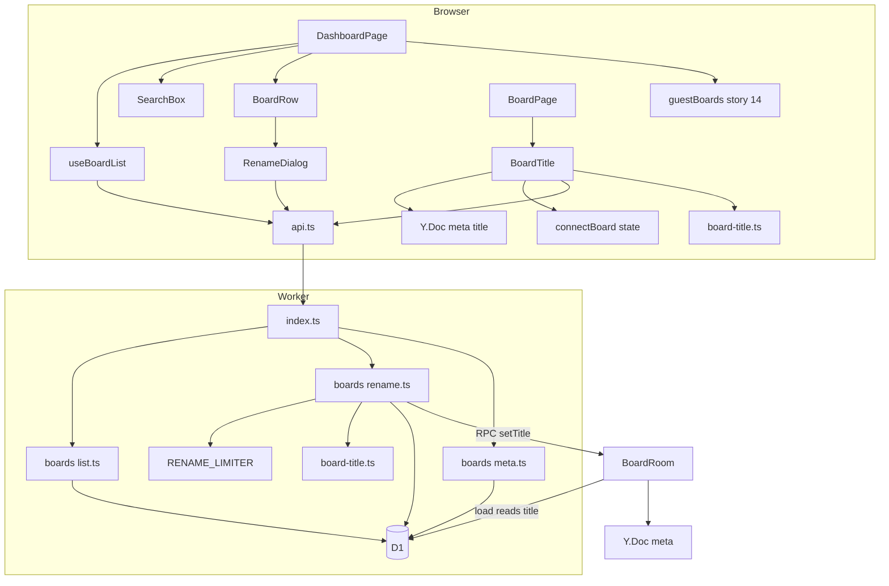
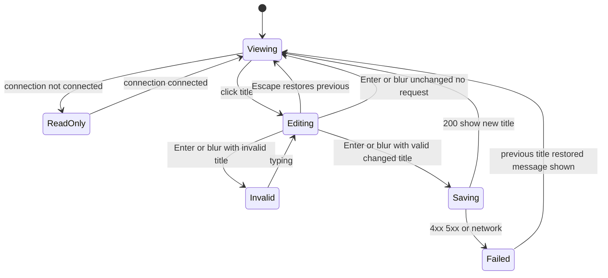
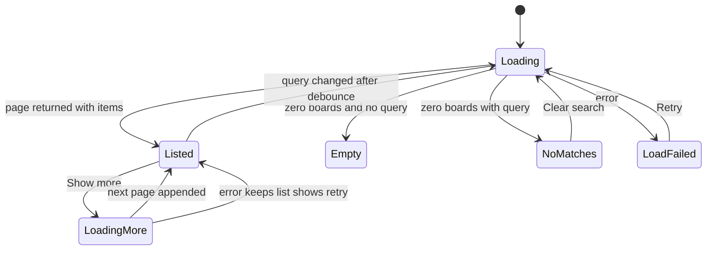
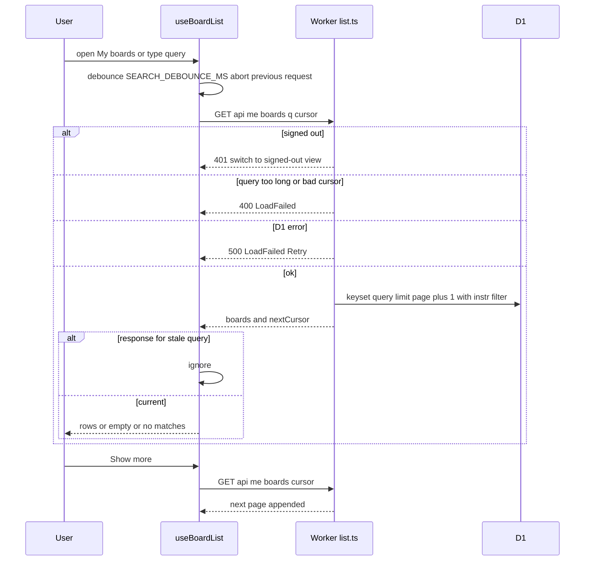
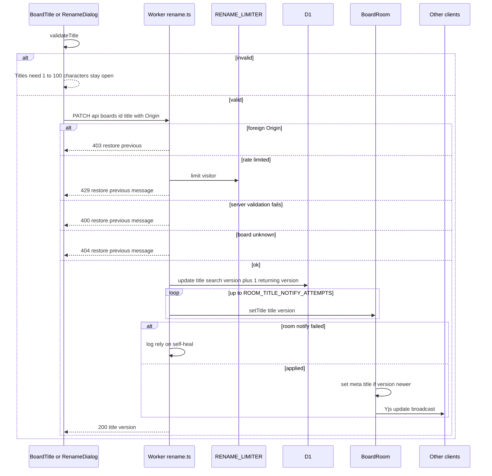
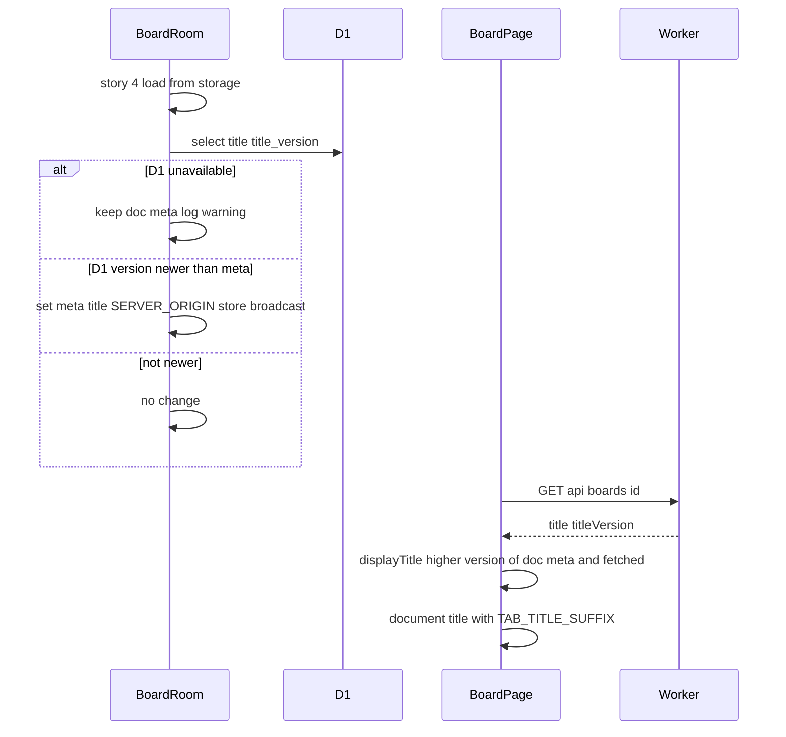
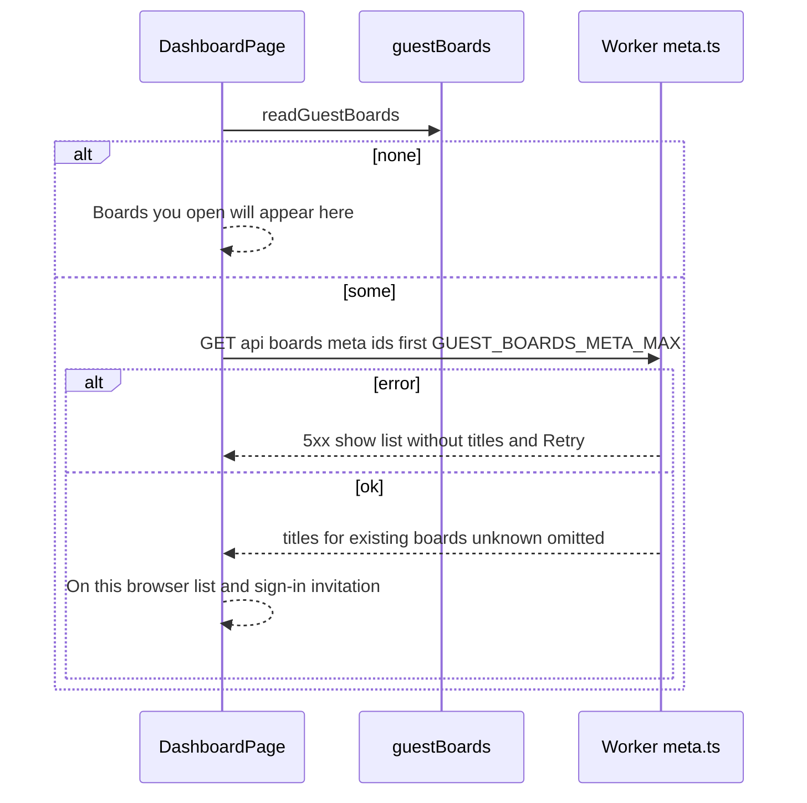

# Technical Design

D1 boards gain a normalised search column and a monotonically increasing title_version. GET /api/me/boards serves keyset-paginated, searchable lists; PATCH /api/boards/:id renames without authentication (link model), rate limited and Origin-checked, then pushes (title, version) to the BoardRoom which writes meta.title into the Y.Doc so everyone sees it live; rooms self-heal from D1 on load. Client adds the My boards dashboard, inline board title editing, rename dialog, search with debounce and a signed-out view built from the browser's board list.

## Overview

## Context
Builds on story 14 (D1 `boards`, `board_visits`, `src/worker/auth/*`, `src/client/auth/*`, `src/client/identity/guestBoards.ts`), story 5 (`src/worker/index.ts`, `create-board.ts`, `src/client/router.ts`, `pages/*`, `api.ts`), story 4 (`src/worker/board-room.ts` load path) and story 3 (`connectBoard` connection state).

## Files
| Path | Change | Purpose |
|---|---|---|
| `migrations/0002_board_titles.sql` | added | `title_search`, `title_version` columns, backfill, search index |
| `src/shared/board-title.ts` | added | `validateTitle`, `normaliseForSearch`, `displayTitle` (shared client/worker) |
| `src/shared/config.ts` | modified | settings below |
| `src/worker/boards/list.ts` | added | keyset pagination, search, cursor codec |
| `src/worker/boards/rename.ts` | added | PATCH handler, D1 update, room notification |
| `src/worker/boards/meta.ts` | added | `GET /api/boards/meta` |
| `src/worker/index.ts` | modified (story 5) | routes; `GET /api/boards/:id` returns `title`, `titleVersion` |
| `src/worker/board-room.ts` | modified (stories 3–5) | RPC `setTitle(title, version)`; on load apply newer D1 title |
| `src/worker/auth/board-memory.ts` | modified (story 14) | `recentBoards` delegates to `list.ts` |
| `wrangler.jsonc` | modified | `ratelimits` binding `RENAME_LIMITER` |
| `src/client/pages/DashboardPage.tsx` | added | `/boards` |
| `src/client/dashboard/BoardList.tsx`, `BoardRow.tsx`, `RenameDialog.tsx`, `SearchBox.tsx`, `useBoardList.ts` | added | dashboard components and data hook |
| `src/client/board/BoardTitle.tsx` | added | inline title + document.title |
| `src/client/router.ts` | modified (story 5) | `/boards` route |
| `src/client/api.ts` | modified (story 5) | `listMyBoards`, `renameBoard`, `boardsMeta` |
| `src/client/auth/RecentBoards.tsx` | modified (story 14) | "See all boards" link |
| `src/client/pages/BoardPage.tsx` | modified | mounts `BoardTitle` |

## Named settings
```ts
export const DASHBOARD_PAGE_SIZE = 50;
export const BOARD_TITLE_MIN_CHARS = 1;
export const BOARD_TITLE_MAX_CHARS = 100;
export const SEARCH_DEBOUNCE_MS = 250;
export const SEARCH_RESULT_BUDGET_MS = 1000;
export const SEARCH_QUERY_MAX_CHARS = 100;
export const DASHBOARD_LOAD_BUDGET_MS = 2000;
export const TITLE_LIVE_BUDGET_MS = 1000;
export const RENAME_LIMIT = 30;                 // per visitor, mirrors wrangler ratelimits
export const RENAME_PERIOD_SECONDS = 60;
export const GUEST_BOARDS_META_MAX = 50;
export const ROOM_TITLE_NOTIFY_ATTEMPTS = 2;
export const TAB_TITLE_SUFFIX = ' – vidi6';
```

## D1 migration (`0002_board_titles.sql`)
```sql
ALTER TABLE boards ADD COLUMN title_search TEXT NOT NULL DEFAULT '';
ALTER TABLE boards ADD COLUMN title_version INTEGER NOT NULL DEFAULT 0;
UPDATE boards SET title_search = lower(title);   -- existing titles are the ASCII default
CREATE INDEX board_visits_page ON board_visits (user_id, last_opened_at DESC, board_id);
```

## Decisions
1. **Rename is unauthenticated** (dash.rename_anyone): `PATCH /api/boards/:id` never reads the session. Abuse is limited by `RENAME_LIMITER` per `CF-Connecting-IP` and an `Origin` check (403) so other websites cannot rename via a visitor's browser.
2. **D1 is the source of truth; the Y.Doc carries the live copy.** `UPDATE boards SET title=?, title_search=?, title_version = title_version + 1, updated_at=? WHERE id=? RETURNING title_version`. D1 serialises writes, so versions increase in commit order. The Worker then calls `BoardRoom.setTitle(title, version)` (up to `ROOM_TITLE_NOTIFY_ATTEMPTS`), which writes `meta.title` and `meta.titleVersion` in the doc with `SERVER_ORIGIN` only if `version > meta.titleVersion`. Story 4 stores and broadcasts it like any update, so every connected client sees it (dash.title_live). Concurrent renames converge because both stores keep the highest version.
3. **Self-healing.** If the room notification fails, the PATCH still returns 200 (D1 saved). On every room load (story 4 construct) the room reads `title, title_version` from D1 and applies them if newer. Clients display `displayTitle(docMeta, fetched)` = the higher version, so a stale doc never wins.
4. **Renames are not undoable.** `SERVER_ORIGIN` is not in story 8's `trackedOrigins`; clients never write `meta.title` themselves.
5. **Search** (dash.search): `normaliseForSearch(s) = s.normalize('NFKC').toLocaleLowerCase('und').trim()` computed in JS on write (`title_search`) and on the query; SQL uses `instr(b.title_search, ?) > 0`, avoiding LIKE escaping and SQLite's ASCII-only case folding (international text constraint).
6. **Pagination** (dash.paginate): keyset on `(last_opened_at DESC, board_id ASC)`; cursor = base64url JSON `{t, b}`; fetch `DASHBOARD_PAGE_SIZE + 1` rows to decide `nextCursor`. No offsets, so visits recorded meanwhile don't create duplicates.
7. **Signed-out view** (dash.signed_out): story 14's guest board list (localStorage) + `GET /api/boards/meta?ids=` (public; ids are unguessable and the title is visible to anyone with the link anyway), capped at `GUEST_BOARDS_META_MAX`.
8. **Offline** (dash.rename_failure): `BoardTitle` is read-only unless story 3's connection state is `connected`.
9. **Deletion flagged, not added:** removal from My boards is listed as a product-review item in the PRD out-of-scope.

## Structure diagram


## State diagrams
Persisted title (D1 row and doc meta):
```mermaid
stateDiagram-v2
    [*] --> Default : board row created title Untitled board version 0
    Default --> Renamed : PATCH ok version plus 1
    Renamed --> Renamed : PATCH ok version plus 1
    Renamed --> DocBehind : room notify failed
    DocBehind --> Renamed : room load applies newer D1 title
    DocBehind --> Renamed : later rename notifies room
```
Board title editor (client):

Dashboard list (client):


## Sequence: load, search and paginate


## Sequence: rename


## Sequence: room load self-heal and title display


## Sequence: signed-out dashboard


## Test Strategy

## Test levels and boundary justification
| Capability | Levels | Boundary exercised | Why sufficient |
|---|---|---|---|
| dash.boards_api | unit, integration | Pure cursor and normalisation; real Worker routes with real D1 | Ordering, paging and search correctness are SQL facts that need the real engine |
| dash.rename | unit, integration, e2e | Pure validation and version rule; real routes + D1 + real BoardRoom + WebSocket clients; real browsers | Live propagation and convergence across D1 and the room are only observable end to end |
| dash.pages | unit, ui-component, e2e | Display-title rule; components with mocked api and fake timers; real browsers | Debounce, stale responses and editor states are deterministic in jsdom; wiring verified in browsers |

## Dimensions crossed
- **D1 List size:** 0; 1; exactly DASHBOARD_PAGE_SIZE; DASHBOARD_PAGE_SIZE + 1; 2.4 × DASHBOARD_PAGE_SIZE.
- **D2 Query:** none; ASCII match; case-different match; accented / full-width match; no match; too long.
- **D3 Actor:** signed-in creator; signed-in non-creator; signed-out guest; foreign website.
- **D4 Title input:** valid; unchanged; empty or whitespace; exactly max; max + 1; contains control characters.
- **D5 Room notification:** succeeds; fails; arrives out of order.
- **D6 Connection:** connected; offline.

Classes in each dimension are exhaustive for this story and non-overlapping.

## Coverage table — unit
| TC | Capability | Dimensions | Case | Expected | Level |
|---|---|---|---|---|---|
| TC-01 | dash.boards_api | D2 case, accented, full-width | normaliseForSearch('  Q3 RETRO '), ('Équipe'), ('ＲＥＴＲＯ') | 'q3 retro', 'équipe', 'retro' | unit |
| TC-02 | dash.rename | D4 all classes | validateTitle('', '   ', 'a', 100 chars, 101 chars, '  ' + 100 chars + '  ', 'ab') | invalid, invalid, ok, ok, invalid, ok trimmed, invalid | unit |
| TC-03 | dash.boards_api | not applicable: codec | encodeCursor/decodeCursor round trip; tampered string; wrong shape JSON | equal; null; null | unit |
| TC-04 | dash.pages | D5 | displayTitle(meta v3, fetched v5); (v5, v5); (none, v2); (v7, v2) | fetched; meta; fetched; meta | unit |
| TC-05 | dash.rename | D5 out of order | applyTitleIfNewer(meta v4, incoming v3 / v4 / v5) | ignore / ignore / apply | unit |

## Coverage table — integration (real Worker + D1 + BoardRoom)
| TC | Capability | D1 | D2 | D3 | Case | Expected before → after | Level |
|---|---|---|---|---|---|---|---|
| TC-06 | dash.boards_api | 0 | none | signed-in | GET me boards | [] and nextCursor null | integration |
| TC-07 | dash.boards_api | 2.4 × page (120) incl. 10 equal last_opened_at | none | signed-in | page through with cursors | 50, 50, 20; union equals all 120 once; order by time desc then id asc | integration |
| TC-08 | dash.boards_api | exactly page and page + 1 | none | signed-in | first page | nextCursor null for 50; present for 51 | integration |
| TC-09 | dash.boards_api | 60 | ASCII, case, accented | signed-in | q=RETRO, q=équipe, plus cursor on q results | only matching titles, same order; cursor pages filtered results | integration |
| TC-10 | dash.boards_api | 5 | too long / bad cursor | signed-in and signed-out | q of SEARCH_QUERY_MAX_CHARS + 1; cursor garbage; no cookie | 400; 400; 401 | integration |
| TC-11 | dash.boards_api | 5 per user | none | two signed-in users | GET me boards for A | only A's visits; createdByMe true only where created_by = A | integration |
| TC-12 | dash.boards_api | not applicable: meta lookup | none | signed-out | meta ids: existing, legacy without row, unknown, malformed; then GUEST_BOARDS_META_MAX + 1 ids | existing and legacy returned (legacy with default title), unknown and malformed omitted; 400 | integration |
| TC-13 | dash.boards_api | not applicable: single board | none | signed-out | GET api boards id after rename | title and titleVersion returned | integration |
| TC-14 | dash.rename | not applicable | not applicable | signed-out guest | PATCH valid title with no cookie while a WebSocket client is connected | 200; D1 title, title_search normalised, version 0 → 1; client doc meta.title updated within TITLE_LIVE_BUDGET_MS | integration |
| TC-15 | dash.rename | not applicable | not applicable | signed-in non-creator | PATCH '', max + 1, control chars | 400 each; D1 row unchanged | integration |
| TC-16 | dash.rename | not applicable | not applicable | foreign website, signed-in | PATCH unknown board; foreign Origin; RENAME_LIMIT + 1 from same IP | 404; 403 with no change; last 429 | integration |
| TC-17 | dash.rename | not applicable | not applicable | two guests | concurrent PATCH 'Alpha' and 'Beta' | D1 final title has highest version; room meta equals D1; both WebSocket clients show that title | integration |
| TC-18 | dash.rename | not applicable | not applicable | signed-in | inject setTitle RPC failure for all attempts; then reconstruct room | PATCH 200 and D1 updated; after room load doc meta equals D1 (self-heal) | integration |
| TC-19 | dash.rename | not applicable | not applicable | not applicable: RPC direct | call setTitle(v2) after setTitle(v3) | meta stays v3; no update broadcast | integration |

## Coverage table — ui-component (jsdom, mocked api, fake timers)
| TC | Capability | Dimensions | Case | Expected | Level |
|---|---|---|---|---|---|
| TC-20 | dash.pages | D1 = 3 | render list | rows show title link, relative last opened, "Created by you" only when flagged, in given order | ui-component |
| TC-21 | dash.pages | D1 = page + 1 | Show more click | second page appended; button hidden when nextCursor null; failure keeps rows and shows retry | ui-component |
| TC-22 | dash.pages | D1 = 0 | render | "No boards yet" and New board button | ui-component |
| TC-23 | dash.pages | D2 | type 'ret' then 'retro' within SEARCH_DEBOUNCE_MS; resolve responses out of order; no-match response; Clear search | one request for 'retro' after debounce; stale response ignored; "No boards match “retro”"; full list restored | ui-component |
| TC-24 | dash.pages | not applicable | api error on load | "Couldn't load your boards." with Retry; New board enabled; Retry reloads | ui-component |
| TC-25 | dash.pages | D4, D6 | BoardTitle: click, Enter valid; Escape; blur valid; blur unchanged; invalid; api 429; offline | saving then new title; previous restored no request; saved; no request; message and stays open; previous restored with failure message; not editable with "Renaming needs a connection." | ui-component |
| TC-26 | dash.pages | D4 | RenameDialog: opens with title selected; Save; Cancel; api 500 | row shows new title; no call; failure message and dialog stays with previous row title | ui-component |
| TC-27 | dash.pages | D5 | doc meta.title changes remotely | BoardTitle text and document.title "<title> – vidi6" update | ui-component |
| TC-28 | dash.pages | D3 signed-out | guest list with 2 boards; guest list empty; meta error | "On this browser" rows with titles and sign-in invitation; empty text; rows without titles and Retry | ui-component |
| TC-29 | dash.pages | not applicable | New board click | story 5 create action called, navigates to board | ui-component |

## Coverage table — e2e (Playwright, `wrangler dev --env local`, dev-email sign-in)
| TC | Capability | Workflow | Expected | Level |
|---|---|---|---|---|
| TC-30 | dash.pages, dash.rename | Find and rename: sign in, create 3 boards, rename them "Q3 retro", "Retro – onboarding", "Roadmap"; search "retro"; open "Q3 retro"; rename on board to "Q3 retro – actions"; back to My boards | 2 results within SEARCH_RESULT_BUDGET_MS; renamed board first with new title | e2e |
| TC-31 | dash.rename | Live rename by non-creator: Alex (signed in, creator) and Sam (guest) on the board; Sam renames | Alex's board title and tab title update within TITLE_LIVE_BUDGET_MS | e2e |
| TC-32 | dash.pages | Seed DASHBOARD_PAGE_SIZE + 5 visits via test hook; open My boards; Show more | 50 rows within DASHBOARD_LOAD_BUDGET_MS; 55 after Show more; no duplicates | e2e |
| TC-33 | dash.pages | New board from dashboard; return to My boards | new board opened; first row "Untitled board" | e2e |
| TC-34 | dash.pages | Board page with `context.setOffline(true)` | title not editable; hover text "Renaming needs a connection." | e2e |
| TC-35 | dash.pages | Signed-out: open a board renamed "Design crit" from a link; visit My boards | "On this browser" lists "Design crit" with sign-in invitation | e2e |

## Boundary values
- Page size: 0, 1, DASHBOARD_PAGE_SIZE, DASHBOARD_PAGE_SIZE + 1, 120 (TC-06 to TC-08, TC-21, TC-32).
- Title length: 0, 1, BOARD_TITLE_MAX_CHARS, BOARD_TITLE_MAX_CHARS + 1, trimmed to max (TC-02, TC-15).
- Query length SEARCH_QUERY_MAX_CHARS + 1 (TC-10).
- Debounce SEARCH_DEBOUNCE_MS (TC-23).
- Rename rate RENAME_LIMIT and + 1 (TC-16).
- Meta ids GUEST_BOARDS_META_MAX + 1 (TC-12).
- Equal `last_opened_at` tie-break (TC-07).

## Negative scenarios
| TC | Must not happen | Level |
|---|---|---|
| TC-11 | another user's boards must not appear | integration |
| TC-14, TC-31 | renaming must not require sign-in or creator status | integration, e2e |
| TC-15 | invalid titles must not be saved | integration |
| TC-16 | foreign websites must not rename | integration |
| TC-19 | an older rename must not overwrite a newer one | integration |
| TC-23 | stale search responses must not replace current results | ui-component |
| TC-25, TC-34 | failed or offline renames must not show the new title as saved | ui-component, e2e |

## Error paths (every contract error has a case)
| Contract error | TC |
|---|---|
| 400 bad query / cursor / title / too many meta ids | TC-10, TC-15, TC-12 |
| 401 list while signed out | TC-10 |
| 403 foreign Origin on rename | TC-16 |
| 404 unknown board on rename | TC-16 |
| 429 rename rate limit | TC-16, TC-25 |
| 500 list or rename failure | TC-24, TC-26 |
| room notification failure | TC-18 |
| offline editing | TC-25, TC-34 |

## Mock vs real boundaries
| Dependency | Mocked? | Reason |
|---|---|---|
| D1 | Real (migrations 0001 and 0002 applied) | Paging, search and versioning are the behaviour under test |
| BoardRoom + WebSockets | Real | Live title propagation and self-heal require the real room |
| Room RPC failure | Injected throwing stub (TC-18) | Real RPC failures cannot be produced on demand |
| Rate limiter | Real binding if supported locally, else same-interface fake (as story 5) | Keeps handler logic identical |
| api.ts in component tests | Mocked | Page state machines under test |
| Timers | Fake in component tests | Debounce determinism |

## E2E workflows
1. **Find and rename** (TC-30). 2. **Live rename by a guest** (TC-31). 3. **Long list** (TC-32). 4. **New board from dashboard** (TC-33). 5. **Offline title** (TC-34). 6. **Signed-out dashboard** (TC-35).

## Fixtures
- Realistic titles: "Q3 retro", "Retro – onboarding squad", "Roadmap 2027", "Équipe design", "Design crit", "Sprint 42 planning"; 120-board seed with mixed titles and timestamps, 10 sharing one `last_opened_at`.
- Boards created through story 5's API; visits through story 14's routes; seed test hook only under `TEST_HOOKS=1`.

## Not covered
- Search performance beyond a few thousand boards per person.
- Locale-specific case rules beyond Unicode default lower-casing (e.g. Turkish dotless i).
- Vandalism beyond the per-visitor rename rate limit.
- Deleting or hiding boards (out of scope, flagged).

## Board list, search and title lookup API

> Anchor: `dash.boards_api`

## Contract
```ts
// src/shared/board-title.ts
export function normaliseForSearch(s: string): string;
// src/worker/boards/list.ts
export interface Cursor { t: number; b: string }
export function encodeCursor(c: Cursor): string; export function decodeCursor(s: string): Cursor | null;
export function listBoards(db: D1Database, userId: string, opts: { q?: string; cursor?: Cursor; limit: number }): Promise<{ boards: BoardListItem[]; nextCursor: string | null }>;
export interface BoardListItem { id: string; title: string; lastOpenedAt: number; createdByMe: boolean }
// routes
GET /api/me/boards?q=&cursor=              -> 200 { boards, nextCursor } | 400 bad_query | 400 bad_cursor | 401 | 500
GET /api/boards/meta?ids=a,b,c             -> 200 { boards: { id, title }[] } | 400 too_many
GET /api/boards/:id                         -> 200 { id, title, titleVersion } (story 5 response extended) | 404
```
- **Inputs:** session user (list only), query, cursor, ids.
- **Outputs:** pages of `DASHBOARD_PAGE_SIZE` ordered by `last_opened_at DESC, board_id ASC` (dash.list, dash.paginate); empty array for no boards (dash.empty) or no matches (dash.search_no_results); titles for the signed-out view (dash.signed_out) and board page (dash.title_shown).
- **Errors:** as listed; any D1 failure → 500 so the client shows its load failure state (dash.load_failure).
- **Side effects:** none (read-only).

## Implementation
- Keyset SQL: `SELECT ... FROM board_visits v JOIN boards b ON b.id = v.board_id WHERE v.user_id = ? AND (? IS NULL OR v.last_opened_at < ? OR (v.last_opened_at = ? AND v.board_id > ?)) AND (? = '' OR instr(b.title_search, ?) > 0) ORDER BY v.last_opened_at DESC, v.board_id ASC LIMIT page + 1`.
- Search (dash.search): query normalised with `normaliseForSearch`, length checked after normalisation.
- Meta: ids validated with `isValidBoardId`; rows without a `boards` entry but existing per `BoardRoom.exists()` get DEFAULT_BOARD_TITLE; unknown omitted.
- story 14's `recentBoards` becomes `listBoards` with `limit = RECENT_BOARDS_LIMIT`.

## Tests
unit: TC-01, TC-03. integration: TC-06 to TC-13.

## Rename with live propagation

> Anchor: `dash.rename`

## Contract
```ts
// src/shared/board-title.ts
export type TitleCheck = { ok: true; title: string } | { ok: false; reason: 'length' | 'control_chars' };
export function validateTitle(raw: string): TitleCheck;       // trims, BOARD_TITLE_MIN_CHARS..BOARD_TITLE_MAX_CHARS
// src/worker/boards/rename.ts
PATCH /api/boards/:id { title } -> 200 { id, title, titleVersion } | 400 invalid_title | 403 foreign origin | 404 | 429 | 500
// src/worker/board-room.ts (RPC)
setTitle(title: string, version: number): Promise<'applied' | 'ignored'>;
export function applyTitleIfNewer(meta: Y.Map<unknown>, title: string, version: number): boolean;
```
- **Inputs:** raw title, board id, `Origin`, `CF-Connecting-IP`. No session is read (dash.rename_anyone).
- **Outputs:** D1 row updated (title, title_search, title_version + 1, updated_at); room doc `meta.title`/`meta.titleVersion` updated with `SERVER_ORIGIN` and broadcast to everyone on the board (dash.title_live).
- **Errors:** invalid → 400 (dash.title_rules: client also validates first and keeps the field open); foreign Origin → 403; unknown → 404; rate limit → 429; D1 failure → 500. Every non-200 means the client restores the previous title with a message (dash.rename_failure). Room notification failure is not an error to the caller (self-heal decision 3).
- **Side effects:** D1 write; Yjs update stored and broadcast by story 4's room.

## Implementation
- Handler order: Origin → rate limit → `validateTitle` → existence (`boards` row or `exists()` RPC, inserting a row for legacy boards) → `UPDATE ... RETURNING title_version` → `setTitle` up to `ROOM_TITLE_NOTIFY_ATTEMPTS`.
- Room load (story 4 modification) reads `title, title_version` from `env.DB` after storage load and calls `applyTitleIfNewer`.
- Both entry points — inline board title (dash.rename_on_board) and dashboard dialog (dash.rename_from_dashboard) — call the same `api.renameBoard`.
- Concurrency: highest D1 version wins in both D1 and doc (TC-17, TC-19).

## Tests
unit: TC-02, TC-05. integration: TC-14 to TC-19. e2e: TC-30, TC-31.

## Dashboard, board title and signed-out view

> Anchor: `dash.pages`

## Contract
```ts
// src/shared/board-title.ts
export function displayTitle(meta: { title?: string; titleVersion?: number }, fetched: { title: string; titleVersion: number }): string;
// src/client/dashboard/useBoardList.ts
export function useBoardList(): {
  state: 'loading' | 'listed' | 'empty' | 'no_matches' | 'load_failed' | 'signed_out';
  boards: BoardListItem[]; query: string; setQuery(q: string): void; hasMore: boolean; loadMore(): void; retry(): void;
};
// components
DashboardPage(); BoardList(); BoardRow({ board, onRename }); RenameDialog({ board, onClose }); SearchBox({ value, onChange });
BoardTitle({ boardId, doc, connection });
```
- **Outputs and behaviour per requirement:**
  - dash.list / dash.paginate / dash.empty: `BoardList` rows (title link, relative time, "Created by you"), Show more when `hasMore`, "No boards yet" with New board.
  - dash.create: New board reuses story 5's create action and navigates to the board.
  - dash.search / dash.search_no_results: `SearchBox` → `setQuery` debounced by SEARCH_DEBOUNCE_MS with request abort and sequence check; no-match message with Clear search.
  - dash.load_failure: load error message, Retry, New board enabled.
  - dash.signed_out: on 401 or signed-out auth state, show "On this browser" from story 14 guest list + meta titles, with the Google sign-in invitation.
  - dash.rename_on_board / dash.title_rules / dash.rename_failure: `BoardTitle` state machine (Viewing, ReadOnly, Editing, Invalid, Saving, Failed); validates with `validateTitle`; Escape restores; failure restores previous title with message; ReadOnly with "Renaming needs a connection." unless connection is `connected`.
  - dash.rename_from_dashboard: `RenameDialog` with selected title, Save/Cancel, failure message.
  - dash.title_shown / dash.title_live: `BoardTitle` observes `meta` in the Y.Doc and sets `document.title = title + TAB_TITLE_SUFFIX` using `displayTitle` against the fetched title.
- **Errors:** api failures map to the states above; nothing throws to the page.
- **Side effects:** network requests; `document.title`.

## Implementation
`/boards` route added; top bar shows My boards next to AccountMenu; story 14's RecentBoards gains "See all boards".

## Tests
unit: TC-04. ui-component: TC-20 to TC-29. e2e: TC-30, TC-32 to TC-35.

