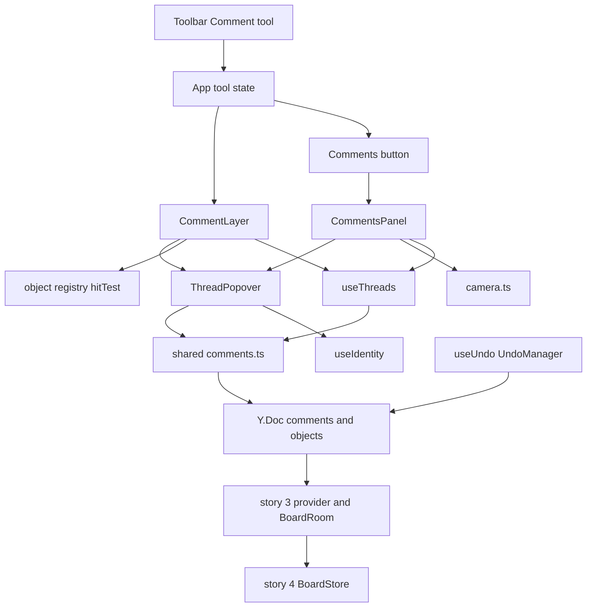
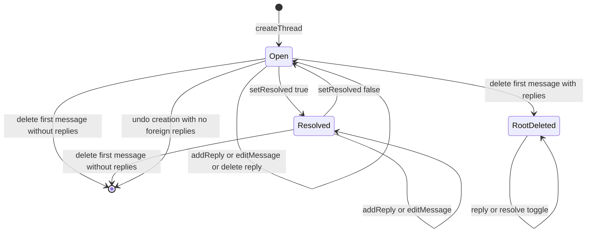
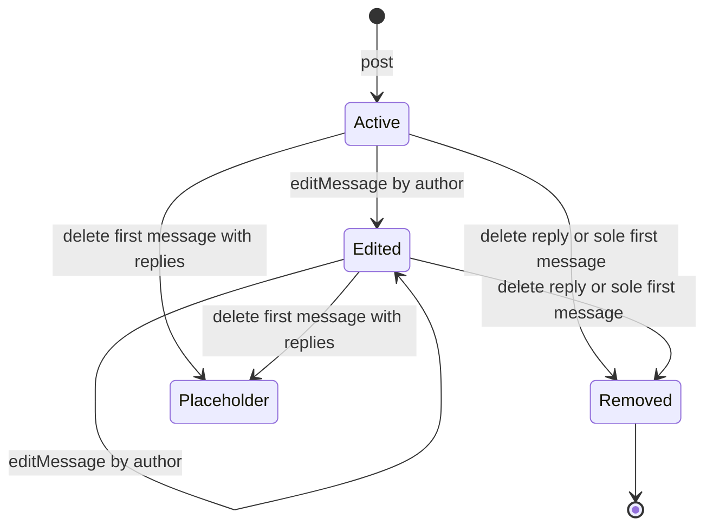
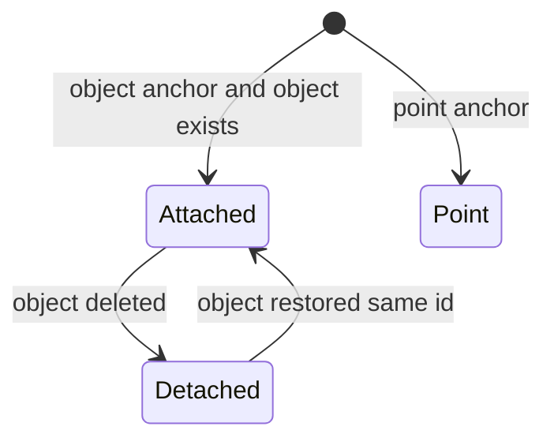
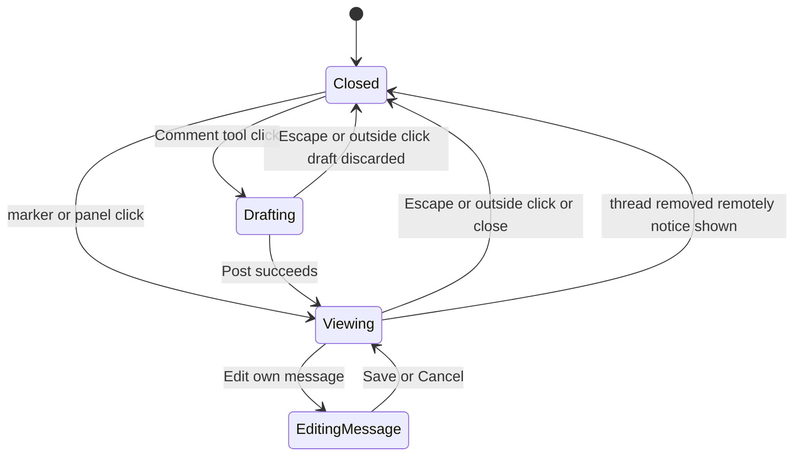
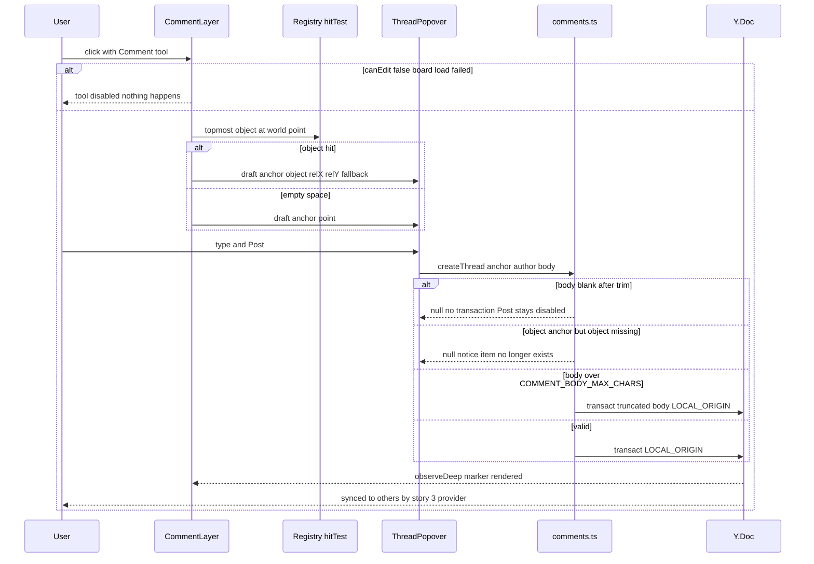
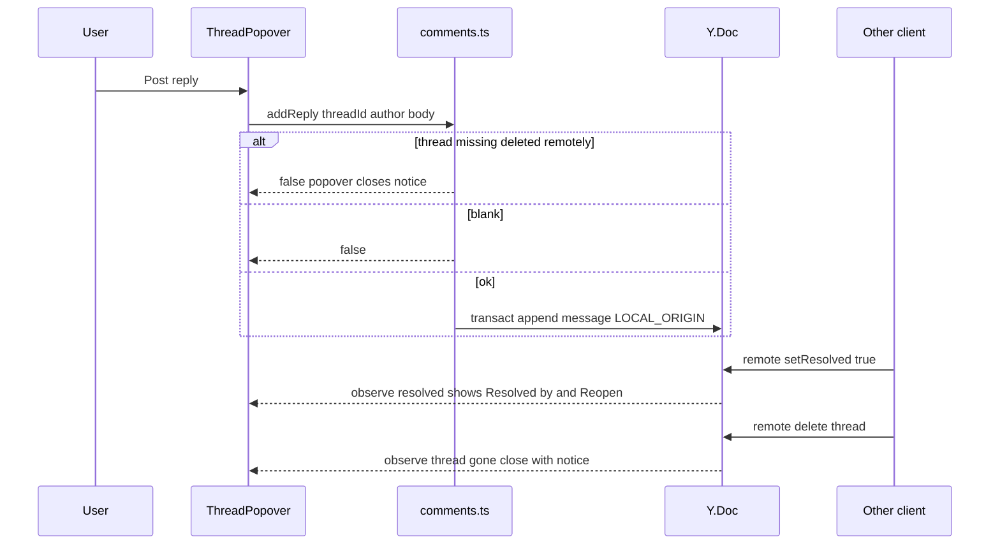
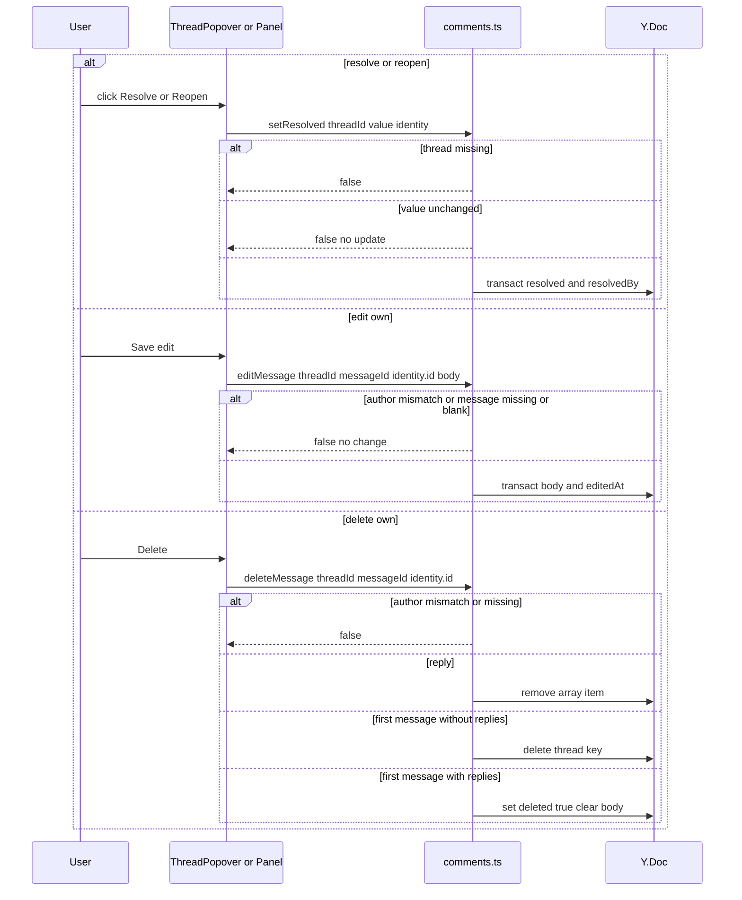
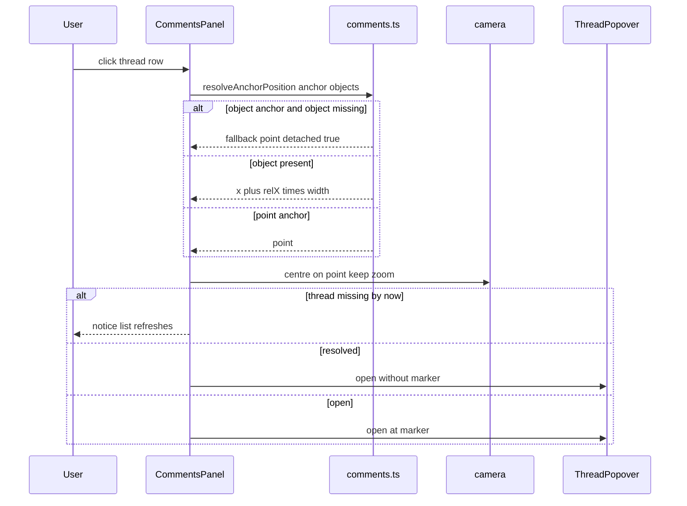
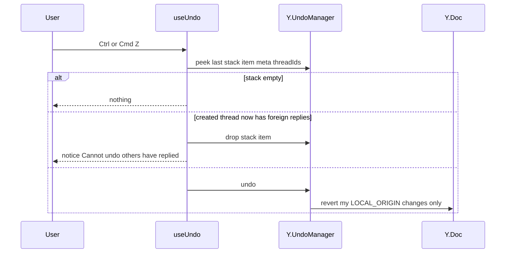

# Technical Design

Comment threads stored in the board Y.Doc under a comments Y.Map (anchor to an object via relative fractions plus a fallback point, or to a world point; author name snapshots). A pure comments module owns validated LOCAL_ORIGIN mutations; sync and persistence reuse stories 3-4 unchanged; story 8's UndoManager gains the comments scope with a guard against undoing threads others replied to. Client adds a Comment tool, screen-space markers, a thread popover and a comments panel.

## Overview

## Context
Builds on: story 1 camera (`src/client/canvas/camera.ts`), stories 2–4 Y.Doc model, sync and persistence (`src/shared/board-model.ts`, `src/worker/board-room.ts`, `src/worker/board-store.ts`), story 4 `canEdit`, story 7 object registry and hit testing (`src/client/objects/registry.tsx`), story 8 undo (`Y.UndoManager` with `trackedOrigins = {LOCAL_ORIGIN}`), and identity (`src/client/identity/useIdentity.ts`, stories 6/14). Because comments live in the board Y.Doc, live delivery (story 3), saving (story 4) and offline editing (story 13) need **no server changes**.

## Files
| Path | Change | Purpose |
|---|---|---|
| `src/shared/comments.ts` | added | schema, validated mutations, anchor resolution, listing |
| `src/shared/board-model.ts` | modified | `initDoc` ensures the `comments` map exists (no write when already present) |
| `src/shared/config.ts` | modified | settings below |
| `src/client/comments/CommentLayer.tsx` | added | Comment tool click handling, screen-space markers |
| `src/client/comments/ThreadPopover.tsx` | added | draft, messages, reply, resolve/reopen, edit/delete own |
| `src/client/comments/CommentsPanel.tsx` | added | Open/Resolved list, open count, navigate |
| `src/client/comments/useThreads.ts` | added | `useSyncExternalStore` over `comments.observeDeep` |
| `src/client/undo/useUndo.ts` (story 8) | modified | UndoManager scope adds `comments`; stack-item meta + guard |
| `src/client/board/Toolbar.tsx` | modified | Comment tool (C) |
| `src/client/App.tsx` | modified | tool state, panel button, Escape handling |
| `tests/fixtures/comments.ts` | added | realistic threads for tests |

## Named settings
```ts
export const COMMENT_BODY_MAX_CHARS = 2000;
export const COMMENT_MARKER_SIZE_PX = 28;
export const COMMENT_PANEL_WIDTH_PX = 320;
export const COMMENT_TESTED_THREADS = 200;
export const COMMENT_TESTED_MESSAGES = 2000;
export const COMMENT_NOTICE_MS = 3000;          // "This comment was deleted" / "Can't undo" notices
export const COMMENT_PREVIEW_CHARS = 80;         // first-line preview in panel
```

## Document schema (additive; `meta.schemaVersion` stays 1)
```
comments: Y.Map<threadId, Y.Map {
  anchor: { kind: 'object', objectId, relX, relY, fallbackX, fallbackY }   // relX/relY in [0,1]
        | { kind: 'point', x, y }
  createdAt: number
  resolved: boolean
  resolvedBy: { id, name } | null
  messages: Y.Array<Y.Map { id, authorId, authorName, body, createdAt, editedAt: number|null, deleted: boolean }>
}>
```
- Anchor is written once (plain JSON value) and never mutated. `relX/relY` are fractions of the object's width/height, so markers follow moves **and** resizes; `fallbackX/Y` is the world point at creation, used while the object is absent. Restoring an object (undo, story 8) re-attaches automatically because its id is unchanged.
- `authorName` is a snapshot at write time (comment.author_name).
- `messages[0]` is the thread's first message; the rest are replies.

## Key decisions
1. **Detached, not deleted:** deleting an item never deletes its comments (the discussion may still matter); the thread shows at the fallback point with a notice.
2. **Delete semantics:** reply → removed; first message with no replies → thread removed; first message with replies → `deleted: true`, body cleared, placeholder shown.
3. **Concurrent delete vs reply:** Yjs map deletion wins; a reply posted concurrently to a thread whose last remaining message was deleted is lost. Accepted: rare, and the replier sees the thread close with a notice.
4. **Undo guard:** undoing the creation of a thread removes the whole map entry, which would also remove other people's replies. Each undo stack item records `threadIds` it created in `stackItem.meta`; before `undo()`, if any such thread now contains a message by another author, that stack item is dropped and a "Can't undo: others have replied" notice is shown (comment.undo: never undo someone else's work).
5. **Validation lives in the shared model** so every entry point (popover, panel, keyboard) gets identical rules; UI limits (textarea `maxLength`, disabled Post) are conveniences on top.

## Structure diagram


## State diagrams
Thread lifecycle (persisted):

Message lifecycle (persisted):

Anchor attachment (derived each render, not stored):

Thread popover (client, not persisted):


## Sequence: create a thread


## Sequence: reply and remote changes while viewing


## Sequence: resolve, reopen, edit, delete


## Sequence: navigate from panel


## Sequence: undo a comment action


## Flow needing no new diagram
Marker repositioning when an object moves/resizes is a pure re-render: `useThreads` recomputes `resolveAnchorPosition` on `objects.observeDeep`; the anchor state diagram covers attached/detached transitions.

## Test Strategy

## Test scopes and boundaries
| Capability | Levels | Boundary exercised | Why sufficient |
|---|---|---|---|
| comments.model | unit | inner logic on a real Y.Doc | all validation, anchoring and delete rules live in `comments.ts` |
| comments.sync_persist | integration | real Worker + BoardRoom + SQLite via vitest-pool-workers | proves comments converge and persist through the unchanged server path |
| comments.undo | unit, ui-component | real UndoManager on two synced docs; keyboard wiring in jsdom | guard logic is pure; keyboard path is DOM |
| comments.board_ui | ui-component, e2e | components in jsdom; real browsers on `wrangler dev` | marker placement, zoom-independent size and live delivery need real layout/sync |
| comments.panel_ui | ui-component, e2e | component in jsdom; real camera movement in browser | list rules in jsdom, centring verified with real layout |

## Dimensions crossed
- **D1 Operation:** create, reply, resolve/reopen, edit, delete, navigate, undo.
- **D2 Anchor:** object present, object deleted, point.
- **D3 Actor vs author:** same identity, different identity.
- **D4 Thread state before:** open, resolved, first message deleted (placeholder), missing.
- **D5 Body:** blank, 1..COMMENT_BODY_MAX_CHARS, over limit.

Each dimension's classes are exhaustive and non-overlapping.

## Coverage table — model, undo, sync
| TC | Capability | D1 | D2 | D3 | D4 | D5 | Action | Expected before → after | Level |
|---|---|---|---|---|---|---|---|---|---|
| TC-01 | comments.model | create | object present | same | missing | valid | createThread click at 75%,25% of 200x200 sticky | threads 0 → 1; anchor relX 0.75 relY 0.25 fallback = click point; 1 message with authorName snapshot; 1 update | unit |
| TC-02 | comments.model | create | point | same | missing | valid | createThread point (−300, 40) | point anchor stored exactly | unit |
| TC-03 | comments.model | create | point | same | missing | blank | bodies '', '   ', '
	' | null; 0 updates | unit |
| TC-04 | comments.model | create | point | same | missing | boundaries | body lengths 1, COMMENT_BODY_MAX_CHARS, COMMENT_BODY_MAX_CHARS + 1 | stored 1, 2000, truncated 2000 | unit |
| TC-05 | comments.model | create | object deleted | same | missing | valid | createThread with objectId absent from objects | null; 0 updates | unit |
| TC-06 | comments.model | reply | point | different | open / missing | valid / blank | addReply | messages 1 → 2 in order ; false ; blank false 0 updates | unit |
| TC-07 | comments.model | navigate | object present | not applicable: read-only | open | not applicable: no body | resolveAnchorPosition at relX/relY 0,0 and 1,1 after object moved +500 and doubled | corners track object exactly | unit |
| TC-08 | comments.model | navigate | object deleted → restored | not applicable: read-only | open | not applicable: no body | resolveAnchorPosition | detached at fallback → attached | unit |
| TC-09 | comments.model | resolve | point | different | open / resolved / missing | not applicable: no body | setResolved true, true again, false, on missing | resolvedBy set ; no update ; cleared ; false | unit |
| TC-10 | comments.model | edit | point | same / different | open | valid / blank | editMessage | body+editedAt set ; false 0 updates ; blank false | unit |
| TC-11 | comments.model | delete | point | same | open | not applicable: no body | delete reply; delete root without replies; delete root with replies | reply removed ; thread removed ; deleted true body '' replies kept | unit |
| TC-12 | comments.model | delete | point | different | open | not applicable: no body | deleteMessage by other | false; 0 updates | unit |
| TC-13 | comments.model | navigate | point | not applicable: read-only | open and resolved mix | not applicable: no body | listThreads open/resolved and openCount | only matching filter; newest latest-message first | unit |
| TC-14 | comments.model | create | point | same | open | valid | identity renamed after posting, then reply | first message keeps old name; reply shows new name | unit |
| TC-15 | comments.undo | undo | point | same | missing | valid | post then undo, then redo | thread removed then restored | unit |
| TC-16 | comments.undo | undo | point | different | open | valid | two synced docs: A posts, B replies, A undo | stack item dropped; thread and B's reply intact; notice emitted | unit |
| TC-17 | comments.undo | undo | point | same | resolved | not applicable: no body | A resolves; remote user edits own message; A undo | thread reopened; remote edit untouched | unit |
| TC-18 | comments.sync_persist | create, reply | point | different | missing | valid | two WebSocket clients: A creates, B replies | both docs identical | integration |
| TC-19 | comments.sync_persist | resolve vs reply | point | different | open | valid | A resolves while B replies concurrently | converge: resolved true, reply present | integration |
| TC-20 | comments.sync_persist | delete vs reply | point | different | open | valid | A deletes sole first message while B replies concurrently | converge: thread absent on both; no exception | integration |
| TC-21 | comments.sync_persist | create, edit, resolve | object present | same | missing | valid | all clients leave; room reloads from storage | threads, edits, resolved state identical | integration |
| TC-22 | comments.sync_persist | not applicable: open board | not applicable: no anchor | not applicable: no actor | missing | not applicable: no body | initDoc on a doc that already has comments | no update emitted | integration |

## Coverage table — UI
| TC | Capability | Case | Expected | Level |
|---|---|---|---|---|
| TC-23 | comments.board_ui | Comment tool click on sticky vs empty board | draft popover with object anchor fractions vs point anchor | ui-component |
| TC-24 | comments.board_ui | Post disabled when blank; Enter newline; Ctrl/Cmd+Enter posts | disabled/enabled states; newline inserted; createThread called | ui-component |
| TC-25 | comments.board_ui | paste 2,100 chars | textarea holds COMMENT_BODY_MAX_CHARS | ui-component |
| TC-26 | comments.board_ui | marker at zoom 0.1 and 4.0 with 3 messages | size COMMENT_MARKER_SIZE_PX both; badge "3"; accessible label | ui-component |
| TC-27 | comments.board_ui | resolved thread; detached thread | no marker; detached notice text | ui-component |
| TC-28 | comments.board_ui | own vs others' messages; edited; root deleted with replies | menu only on own; "(edited)"; "This comment was deleted" | ui-component |
| TC-29 | comments.board_ui | remote delete while open; remote resolve while open | closes with notice; shows "Resolved by Mira" + Reopen | ui-component |
| TC-30 | comments.board_ui | Escape with draft; Escape in tool with no popover; board load_failed | draft discarded 0 updates; tool returns to select; tool disabled | ui-component |
| TC-31 | comments.undo | Ctrl/Cmd+Z after resolve in App | thread open again | ui-component |
| TC-32 | comments.panel_ui | empty Open and Resolved tabs | exact empty-state texts | ui-component |
| TC-33 | comments.panel_ui | 3 threads mixed states | order newest first; preview COMMENT_PREVIEW_CHARS; author; reply count; open count on button | ui-component |
| TC-34 | comments.panel_ui | click open, resolved, detached thread | camera centred zoom unchanged; popover opens; no marker for resolved; fallback used for detached | ui-component |
| TC-35 | comments.board_ui | two contexts: create on note, reply, move+resize note, resolve, reopen via panel | marker within LIVE_UPDATE_LATENCY_BUDGET_MS; follows item; hidden then shown | e2e |
| TC-36 | comments.board_ui | reload after everyone leaves | threads, (edited), resolved identical | e2e |
| TC-37 | comments.panel_ui | zoom 10% and 400%, navigate from panel to far thread | marker size ±1px constant; marker centred ±1px | e2e |

## Boundary values
Body length 0/1/2000/2001 (TC-03, TC-04, TC-25); relX/relY 0 and 1 (TC-07); zoom ZOOM_MIN and ZOOM_MAX (TC-26, TC-37); root with 0 and 1 replies (TC-11).

## Negative scenarios
| TC | Must not happen |
|---|---|
| TC-03 | blank comments posted |
| TC-05 | thread attached to a non-existent object |
| TC-09 | update emitted when resolving an already-resolved thread |
| TC-12, TC-28 | editing/deleting others' messages |
| TC-16 | undo removing someone else's reply |
| TC-22 | opening a board writing to the doc |
| TC-30 | discarded drafts saved; commenting while board load failed |

## Error paths
| Contract error | TC |
|---|---|
| blank body | TC-03, TC-06, TC-10 |
| over limit | TC-04 |
| missing object for object anchor | TC-05 |
| missing thread/message | TC-06, TC-09 |
| author mismatch | TC-10, TC-12 |
| thread removed while viewing | TC-29 |
| undo blocked by foreign replies | TC-16 |

## Mock vs real
| Dependency | Choice | Reason |
|---|---|---|
| Y.Doc / UndoManager | real everywhere | behaviour under test |
| Worker, BoardRoom, SQLite | real in integration (vitest-pool-workers) and e2e (`wrangler dev`) | proves unchanged server path handles comments |
| Identity | fixed fixture identities injected into `useIdentity` | deterministic author ids and names |
| Object registry hitTest | real registry with sticky fixtures | anchor fractions depend on real bounds |
| Clock | fake timers for relative time and notices | deterministic text |

## E2E workflows
1. **Discussion on a note** (TC-35): asserts live marker delivery, following item, resolve/reopen.
2. **Come back tomorrow** (TC-36): asserts persistence of threads and states.
3. **Zoomed navigation** (TC-37): asserts constant marker size and panel centring.

## Fixtures
`tests/fixtures/comments.ts`: identities guest "Curious Otter" (`g_…`) and signed-in "Mira" (`u_…`); realistic threads ("Is this in scope for Q3?", 3-reply pricing debate, one resolved, one detached, one with deleted root); a COMMENT_TESTED_THREADS/COMMENT_TESTED_MESSAGES board for manual performance.

## Not covered
- Panel responsiveness at COMMENT_TESTED_THREADS (manual).
- Offline comment creation (covered generically by story 13's doc persistence tests).
- Screen-reader announcement quality (manual accessibility pass).

## Comments model

> Anchor: `comments.model`

## Contract
```ts
// src/shared/comments.ts
export type Anchor =
  | { kind: 'object'; objectId: string; relX: number; relY: number; fallbackX: number; fallbackY: number }
  | { kind: 'point'; x: number; y: number };
export interface Author { id: string; name: string }
export function anchorForClick(obj: { id: string; x: number; y: number; width: number; height: number } | null, world: { x: number; y: number }): Anchor;
export function createThread(doc: Y.Doc, anchor: Anchor, author: Author, body: string): string | null;
export function addReply(doc: Y.Doc, threadId: string, author: Author, body: string): boolean;
export function setResolved(doc: Y.Doc, threadId: string, resolved: boolean, by: Author): boolean;
export function editMessage(doc: Y.Doc, threadId: string, messageId: string, actorId: string, body: string): boolean;
export function deleteMessage(doc: Y.Doc, threadId: string, messageId: string, actorId: string): boolean;
export function resolveAnchorPosition(anchor: Anchor, objects: ReadonlyMap<string, { x: number; y: number; width: number; height: number }>): { x: number; y: number; detached: boolean };
export function listThreads(doc: Y.Doc, filter: 'open' | 'resolved'): ThreadSnapshot[];
export function openCount(doc: Y.Doc): number;
```
- **Inputs:** doc, identity snapshot, body, anchor.
- **Outputs:** thread id / booleans; snapshots sorted by latest message `createdAt` desc.
- **Errors:** blank body, missing thread/message, author mismatch, object anchor to missing object, no-op resolve → `null`/`false` with **no transaction**; body over COMMENT_BODY_MAX_CHARS (2,000) truncated.
- **Side effects:** exactly one `doc.transact(fn, LOCAL_ORIGIN)` per successful mutation.

## Implementation
- `anchorForClick` clamps relX/relY to [0,1]; fallback = click world point.
- Delete rules per Overview decision 2; `authorName` is a snapshot at write time and never rewritten.
- Framework-free so tests and any future server validation can import it.

## Tests
unit: TC-01 to TC-14 in `tests/unit/comments.test.ts`.

## Comments sync and persistence

> Anchor: `comments.sync_persist`

## Contract
```ts
// src/shared/board-model.ts (modified)
export function initDoc(doc: Y.Doc): void; // now also ensures doc.getMap('comments'); emits no update when meta and comments already exist
```
- **Inputs:** Yjs updates for the `comments` map arriving over story 3's WebSocket protocol.
- **Outputs:** identical `comments` state on every client within LIVE_UPDATE_LATENCY_BUDGET_MS; persisted by story 4's BoardStore with no schema or server code changes.
- **Errors:** none new; malformed updates handled by story 3/4 rules.
- **Side effects:** none beyond existing append/broadcast.

## Implementation
`doc.getMap('comments')` is a root type, so Yjs creates it without an update; `initDoc` touches it so observers can attach before content arrives. BoardRoom and BoardStore are unchanged: they operate on whole-doc updates regardless of root type. Concurrent semantics: map-key delete wins over nested reply (Overview decision 3).

## Tests
integration: TC-18 to TC-22 in `tests/integration/comments-sync.test.ts` using the story 3 `ws-client` helper and story 4 reload path.

## Undo for comment actions

> Anchor: `comments.undo`

## Contract
```ts
// src/client/undo/useUndo.ts (story 8, modified)
// UndoManager scope: [doc.getMap('objects'), doc.getMap('comments')], trackedOrigins {LOCAL_ORIGIN}
export function recordCreatedThreads(stackItem: StackItem, threadIds: string[]): void; // on 'stack-item-added'
export function canUndoTop(um: Y.UndoManager, doc: Y.Doc, actorId: string): { ok: true } | { ok: false; reason: 'foreign-replies' | 'empty' };
```
- **Inputs:** Ctrl/Cmd+Z / Shift+Ctrl/Cmd+Z; stack items with `meta.threadIds`.
- **Outputs:** reversal of the actor's own last comment action (post, reply, edit, delete, resolve, reopen).
- **Errors:** top item created a thread that now contains messages by another author → item dropped, notice "Can't undo: others have replied" for COMMENT_NOTICE_MS.
- **Side effects:** LOCAL_ORIGIN undo transactions; remote changes never tracked.

## Implementation
On `stack-item-added`, record inserted `comments` keys in `stackItem.meta.threadIds`. Before `undo()`, `canUndoTop` checks those threads. The exact `StackItem.meta` and event payload shape must be confirmed against the pinned Yjs version during implementation.

## Tests
unit: TC-15 to TC-17 (`tests/unit/comments-undo.test.ts`). ui-component: TC-31.

## Comment tool, markers and thread popover

> Anchor: `comments.board_ui`

## Contract
```tsx
// src/client/comments/CommentLayer.tsx
export function CommentLayer(props: { doc: Y.Doc; camera: Camera; toolActive: boolean; canEdit: boolean; onOpen(t: { threadId?: string; draft?: Anchor }): void }): JSX.Element;
// src/client/comments/ThreadPopover.tsx
export function ThreadPopover(props: { doc: Y.Doc; threadId: string | null; draftAnchor?: Anchor; identity: Identity; camera: Camera; onClose(): void }): JSX.Element | null;
```
- **Inputs:** clicks while the Comment tool (C) is active, marker clicks, popover actions, Escape.
- **Outputs:** markers as `button[aria-label="Comment thread by <name>, <n> messages"]` in a screen-space layer, COMMENT_MARKER_SIZE_PX at every zoom, positioned at `worldToScreen(resolveAnchorPosition(...))`, hidden when resolved; popover showing messages (authorName snapshot, relative time, "(edited)", placeholder for deleted root), textarea `maxLength=COMMENT_BODY_MAX_CHARS` (2,000), Post disabled when blank, Enter newline, Ctrl/Cmd+Enter posts, Resolve/Reopen with "Resolved by", ⋯ Edit/Delete only when `authorId === identity.id`, detached notice.
- **Errors:** thread removed remotely → close + notice; model returns false → no UI change; `canEdit` false → tool disabled.
- **Side effects:** calls comments.model; tool returns to Select after posting; drafts never written until Post.

## Implementation
Hit testing uses the story 7 registry to find the topmost object; `anchorForClick` builds the anchor. Positions recompute on `objects` and `comments` observe events and on camera change.

## Tests
ui-component: TC-23 to TC-30. e2e: TC-35, TC-36.

## Comments panel and navigation

> Anchor: `comments.panel_ui`

## Contract
```tsx
// src/client/comments/CommentsPanel.tsx
export function CommentsPanel(props: { doc: Y.Doc; objects: ReadonlyMap<string, Bounds>; viewport: Size; camera: Camera; onCameraChange(c: Camera): void; onOpenThread(id: string): void }): JSX.Element;
export function centreCameraOn(camera: Camera, viewport: Size, world: Point): Camera; // zoom unchanged
```
- **Inputs:** Comments button toggle, tab clicks, row clicks.
- **Outputs:** right panel COMMENT_PANEL_WIDTH_PX wide; tabs Open/Resolved; rows with preview (first COMMENT_PREVIEW_CHARS of first line, or placeholder), author, reply count, latest activity; open count on the button; exact empty-state texts; row click centres camera (zoom unchanged) and opens the thread (resolved: opens without marker; detached: fallback point); Reopen available from resolved threads.
- **Errors:** thread deleted between render and click → notice, list refresh.
- **Side effects:** camera change; popover open.

## Implementation
`centreCameraOn` = `{ x: world.x - viewport.width/(2*zoom), y: world.y - viewport.height/(2*zoom), zoom }`, built on story 1 camera conventions.

## Tests
ui-component: TC-32 to TC-34. e2e: TC-37.

