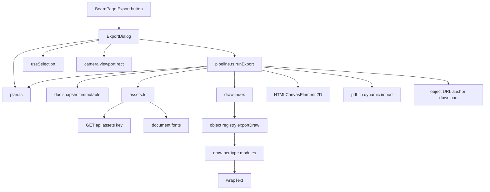
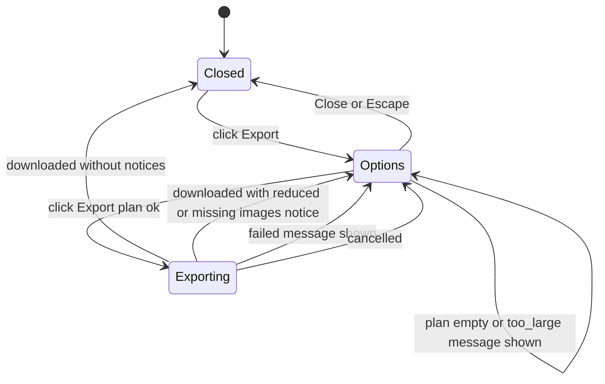
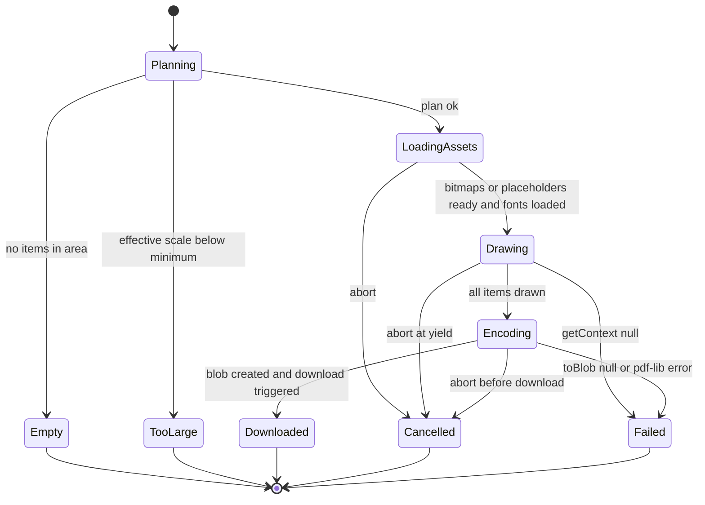
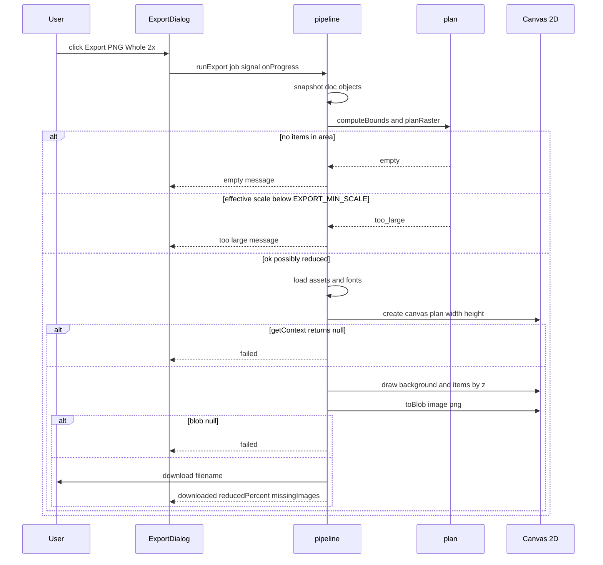
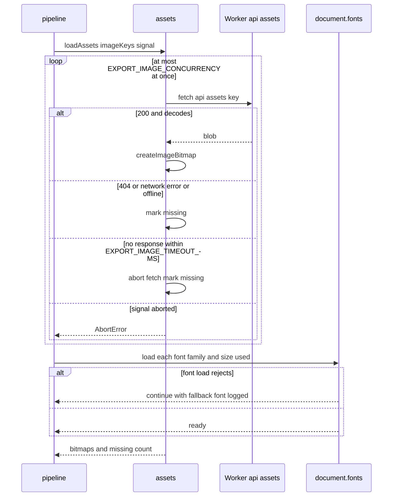
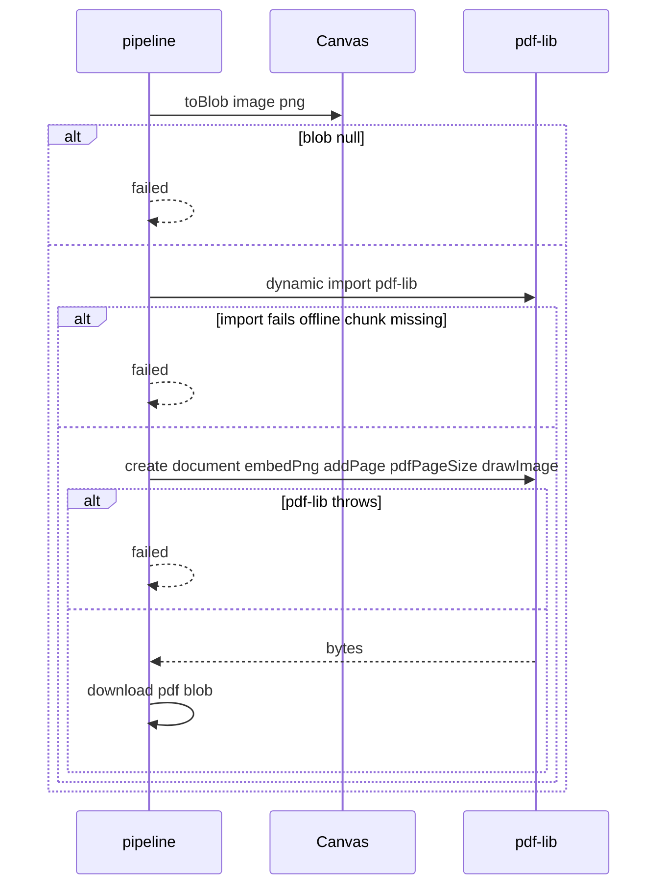
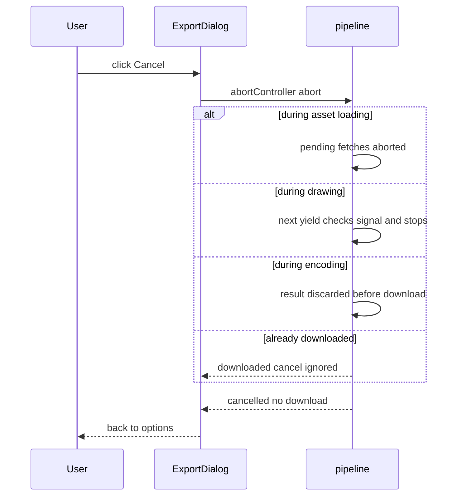

# Technical Design

Client-side export pipeline: pure planning (area bounds, raster size with clamping, filename, PDF page size) → asset loading (images as ImageBitmaps with timeout, concurrency and placeholders; fonts awaited) → Canvas2D drawing of an immutable doc snapshot via per-type exportDraw functions added to the story 7 registry → encoding (PNG via canvas.toBlob, single-page PDF via pdf-lib) → download. An Export dialog drives the job with progress and AbortSignal cancellation. Nothing is written to the doc or server.

## Overview

## Context
Builds on: story 1 camera (`src/client/canvas/camera.ts`), story 2 snapshot/model (`src/shared/board-model.ts`, `STICKY_COLORS`), story 5 top bar (`SharePanel` placement in `BoardPage`), story 7 object registry and selection (`src/client/objects/registry.tsx`, `useSelection`), object types from stories 9–12 (`src/shared/objects/<type>.ts`), story 12 assets (`GET /api/assets/:key`), story 15 board name. Export runs entirely in the browser; **no server changes**.

## Decision: Canvas2D rasterisation, not SVG-to-canvas
The convention says export renders "from the doc via the registry" with images embedded. Two browser techniques were considered: (a) build an SVG with images as data URLs and draw it onto a canvas; (b) draw directly onto a Canvas2D context from the doc snapshot. **(b) is chosen**: it avoids browser differences in rasterising SVG with embedded images and `foreignObject` text (a known source of tainted or blank canvases), keeps text wrapping under our control via `measureText`, and lets the pipeline yield between items for progress and cancellation. Images are still embedded in the output: they are fetched same-origin from `/api/assets/:key` and decoded to `ImageBitmap` (no data URL round-trip needed because the canvas is never tainted by same-origin blobs). PDF embeds the same PNG raster.

## Files
| Path | Change | Purpose |
|---|---|---|
| `src/client/export/plan.ts` | added | area bounds, raster plan, filename, PDF page size (pure) |
| `src/client/export/assets.ts` | added | image loading with concurrency/timeout/abort, font readiness |
| `src/client/export/draw/index.ts` | added | background, z-ordered item loop, yield/progress |
| `src/client/export/draw/{sticky,text,shape,connector,stroke,image}.ts` | added | per-type `exportDraw` |
| `src/client/export/draw/wrapText.ts` | added | line breaking with `measureText` |
| `src/client/export/pipeline.ts` | added | `runExport` orchestration, encoding, download |
| `src/client/export/ExportDialog.tsx` | added | dialog UI and job state |
| `src/client/objects/registry.tsx` (story 7) | modified | entry contract gains `exportDraw` |
| `src/client/pages/BoardPage.tsx` (story 5) | modified | Export button next to Share |
| `src/shared/config.ts` | modified | settings below |
| `package.json` | modified | add `pdf-lib` (loaded by dynamic import only for PDF) |
| `tests/fixtures/export-boards.ts` | added | realistic mixed-type boards |

## Named settings
```ts
export const EXPORT_SCALES = [1, 2] as const;
export const EXPORT_DEFAULT_SCALE = 2;
export const EXPORT_MAX_SIDE_PX = 8192;
export const EXPORT_MAX_AREA_PX = 16_777_216;      // conservative cross-browser canvas area
export const EXPORT_MIN_SCALE = 0.25;              // below this, refuse (too_large)
export const EXPORT_MARGIN_WORLD = 40;
export const EXPORT_IMAGE_TIMEOUT_MS = 15_000;
export const EXPORT_IMAGE_CONCURRENCY = 4;
export const EXPORT_BACKGROUND_COLOR = '#FFFFFF';
export const EXPORT_PLACEHOLDER_FILL = '#E0E0E0';
export const EXPORT_FILENAME_FALLBACK = 'vidi6-board';
export const EXPORT_PDF_POINTS_PER_PX = 0.75;      // 72 pt per inch / 96 px per inch
export const EXPORT_PDF_MAX_PAGE_PT = 14_400;
export const EXPORT_YIELD_EVERY_ITEMS = 50;
export const EXPORT_TESTED_ITEMS = 500;
export const EXPORT_BUDGET_MS = 10_000;
```
Canvas size limits differ between browsers and are not specified by a standard; `EXPORT_MAX_SIDE_PX` and `EXPORT_MAX_AREA_PX` are deliberately conservative and must be re-checked in each supported browser during implementation. `EXPORT_PDF_MAX_PAGE_PT` reflects a commonly cited PDF viewer page-size limit and must also be verified.

## Raster plan maths
`bounds` (world rect) → `w = ceil(bounds.width * scale)`, `h = ceil(bounds.height * scale)`; `fit = min(1, MAX_SIDE/w, MAX_SIDE/h, sqrt(MAX_AREA/(w*h)))`; `effective = scale * fit`; `effective < EXPORT_MIN_SCALE` → `too_large`; `fit < 1` → `reducedPercent = floor(fit * 100)`.

## Structure diagram


## State diagrams
Nothing in this story is persisted; the export job and dialog are per-tab client state.

Dialog:

Export job stages:


## Sequence: PNG export golden path with plan outcomes


## Sequence: loading images and fonts


## Sequence: PDF encoding


## Sequence: cancel


## Test Strategy

## Test scopes and boundaries
| Capability | Levels | Boundary exercised | Why sufficient |
|---|---|---|---|
| export.plan | unit | pure functions | all geometry, clamping and naming rules are pure |
| export.assets | unit, e2e | fetch/font APIs injected in unit; real `/api/assets` and offline in e2e | timeouts/concurrency need deterministic control; real network proves integration with story 12 route |
| export.draw | unit, e2e | recording fake 2D context; real canvas pixels in browser | primitives and order in unit; actual pixels only in real engines |
| export.pipeline | unit, e2e | injected canvas factory + real pdf-lib; real downloads | failure branches forced in unit; real encoders and download in e2e |
| export.dialog | ui-component, e2e | component state machine in jsdom; real flow | UI states in jsdom; user-visible outcome in browser |

No request-handling code is added (the asset route belongs to story 12), so no integration-level tests; stated deliberately.

## Dimensions crossed
- **D1 Area:** whole, view, selection.
- **D2 Format:** PNG, PDF.
- **D3 Size class:** fits, needs reduction, too large, empty.
- **D4 Asset condition:** all load, 404, network error/offline, timeout, none present.
- **D5 Outcome path:** success, browser failure, cancel.

Classes in each dimension are exhaustive and non-overlapping.

## Coverage table — unit
| TC | Capability | D1 | D2 | D3 | D4 | D5 | Action | Expected | Level |
|---|---|---|---|---|---|---|---|---|---|
| TC-01 | export.plan | whole | not applicable: format-independent | fits | not applicable: no assets | success | computeBounds for 3 items at mixed positions | union + EXPORT_MARGIN_WORLD each side | unit |
| TC-02 | export.plan | view | not applicable: format-independent | fits | not applicable | success | camera zoom 0.5 viewport 1280x800 with an item crossing the edge | exact viewport world rect; item included | unit |
| TC-03 | export.plan | selection | not applicable: format-independent | fits | not applicable | success | 2 of 4 items selected | union of selected + margin; ids list only selected | unit |
| TC-04 | export.plan | whole, view, selection | not applicable: format-independent | empty | not applicable | success | empty board; view with no intersecting items; empty selection | kind empty each | unit |
| TC-05 | export.plan | whole | PNG | fits | not applicable | success | planRaster scale 1 and 2 | 2x dims exactly double 1x (ceil) | unit |
| TC-06 | export.plan | whole | PNG | needs reduction | not applicable | success | width EXPORT_MAX_SIDE_PX + 1; area EXPORT_MAX_AREA_PX + 1 | fit < 1; sides ≤ max; area ≤ max; reducedPercent floor | unit |
| TC-07 | export.plan | whole | PNG | too large | not applicable | success | effective exactly EXPORT_MIN_SCALE; just below | allowed ; too_large | unit |
| TC-08 | export.plan | not applicable: naming | PNG, PDF | not applicable: naming | not applicable | success | names 'Q3/planning: v2', '', undefined; fake date 2026-09-17 local | 'Q3-planning- v2-2026-09-17.png', fallback names, .pdf | unit |
| TC-09 | export.plan | not applicable: page maths | PDF | fits / needs reduction | not applicable | success | pdfPageSize 1000x500 px; 40000x100 px | 750x375 pt ; longest side EXPORT_PDF_MAX_PAGE_PT, ratio kept | unit |
| TC-10 | export.assets | whole | not applicable: format-independent | fits | all load | success | 10 image keys with deferred fetch | max 4 (EXPORT_IMAGE_CONCURRENCY) in flight; 10 bitmaps | unit |
| TC-11 | export.assets | whole | not applicable | fits | 404, network error, timeout | success | fake timers 14,999 ms pending; 15,000 ms timed out | missing count 3; placeholders | unit |
| TC-12 | export.assets | whole | not applicable | fits | all load | cancel | abort while 4 pending | all fetch signals aborted; AbortError | unit |
| TC-13 | export.assets | whole | not applicable | fits | none present | success | items use 2 families and 3 sizes; one load rejects | `fonts.load` called for each combination; resolves anyway | unit |
| TC-14 | export.draw | whole | not applicable | fits | all load | success | 3 overlapping items z 1,3,2 equal-z tie | first call fills background EXPORT_BACKGROUND_COLOR; draw order by (z,id) | unit |
| TC-15 | export.draw | whole | not applicable | fits | all load | success | one of each type sticky, text, shape ellipse, connector, stroke, image | expected primitives per type (fillRect colour, fillText lines, ellipse path, path + arrowhead, polyline round joins, drawImage rect) | unit |
| TC-16 | export.draw | not applicable: text layout | not applicable | not applicable | not applicable | success | wrapText: empty, explicit newlines, word longer than width, width exactly fits | [], split lines, hard-broken word, single line | unit |
| TC-17 | export.draw | whole | not applicable | fits | 404 | success | unknown type 'widget'; image with missing bitmap | unknown skipped no throw; placeholder rect EXPORT_PLACEHOLDER_FILL + label | unit |
| TC-18 | export.draw | whole | not applicable | fits | none present | success | doc with comments and awareness state present | only `objects` read; no comment/marker primitives | unit |
| TC-19 | export.pipeline | whole | PNG | fits | all load | success | fake canvas factory returns blob | result downloaded with filename; doc update events 0 | unit |
| TC-20 | export.pipeline | selection | PDF | fits | all load | success | real pdf-lib | bytes parse as PDF with 1 page of pdfPageSize | unit |
| TC-21 | export.pipeline | whole | PNG, PDF | fits | all load | browser failure | getContext null; toBlob null; pdf-lib throws; pdf-lib import rejects | failed each; download never called | unit |
| TC-22 | export.pipeline | whole | PNG | fits | all load | cancel | abort during assets; after EXPORT_YIELD_EVERY_ITEMS items drawn; before download | cancelled; download never called | unit |
| TC-23 | export.pipeline | whole | PNG | needs reduction | 404 | success | reduced plan + 1 missing image | downloaded with reducedPercent and missingImages 1 | unit |

## Coverage table — ui-component and e2e
| TC | Capability | Case | Expected | Level |
|---|---|---|---|---|
| TC-24 | export.dialog | open with nothing selected; switch to PDF | defaults PNG/Whole/2x; size hint text; Selection disabled with hint; Resolution hidden for PDF | ui-component |
| TC-25 | export.dialog | plan empty | "Nothing to export — this area is empty."; Export disabled | ui-component |
| TC-26 | export.dialog | plan too_large | too-large message; runExport not called | ui-component |
| TC-27 | export.dialog | exporting then Cancel | progress bar + Cancel shown; abort called; returns to Options | ui-component |
| TC-28 | export.dialog | results: downloaded clean / reduced / missing images / failed | closes ; "Reduced to 63%…" ; "2 images couldn't be included." ; failure text, stays open | ui-component |
| TC-29 | export.dialog | selection changes after dialog opened | job uses selection at Export click | ui-component |
| TC-30 | export.dialog | Escape while Options; Escape while Exporting | closes ; ignored (Cancel required) | ui-component |
| TC-31 | export.draw | e2e PNG whole 2x on fixture board | PNG signature; dims = plan; sticky centre pixel = STICKY_COLORS.yellow ±2; grid and comment marker locations white | e2e |
| TC-32 | export.plan | e2e current view and selection | dims match plan; unselected item region white | e2e |
| TC-33 | export.pipeline | e2e PDF | `%PDF-` header; 1 page; aspect ratio equals PNG ±0.5% | e2e |
| TC-34 | export.assets | e2e image route aborted via page.route | placeholder grey pixel; notice 1 image | e2e |
| TC-35 | export.assets | e2e offline (`context.setOffline`) | download still happens; uncached images placeholders | e2e |
| TC-36 | export.dialog | e2e far-apart fixture needing reduction; extreme fixture | reduced notice with percent; too-large message and no download event | e2e |
| TC-37 | export.pipeline | e2e read-only: second context watching; exporter camera and selection before/after | no updates received; camera and selection identical | e2e |
| TC-38 | export.pipeline | nightly: EXPORT_TESTED_ITEMS mixed board PNG 2x | duration ≤ EXPORT_BUDGET_MS logged | e2e |

## Boundary values
Scale EXPORT_MIN_SCALE exactly and just below (TC-07); side and area limits +1 (TC-06); timeout 14,999/15,000 ms (TC-11); concurrency exactly EXPORT_IMAGE_CONCURRENCY (TC-10); PDF page limit (TC-09); wrap width exact fit (TC-16); yield after EXPORT_YIELD_EVERY_ITEMS items (TC-22).

## Negative scenarios
| TC | Must not happen |
|---|---|
| TC-04, TC-25 | download for an empty area |
| TC-07, TC-26, TC-36 | export below minimum resolution |
| TC-18, TC-31 | grid, markers, cursors or selection outlines in output |
| TC-19, TC-37 | any doc update, camera or selection change |
| TC-21, TC-22 | download after failure or cancel |
| TC-17 | crash on unknown item type |

## Error paths
| Contract error | TC |
|---|---|
| image 404 / network / offline / timeout | TC-11, TC-34, TC-35 |
| font load rejection | TC-13 |
| getContext null | TC-21 |
| toBlob null | TC-21 |
| pdf-lib throws / import fails | TC-21 |
| abort | TC-12, TC-22, TC-27 |
| empty / too large | TC-04, TC-07, TC-25, TC-26 |

## Mock vs real
| Dependency | Choice | Reason |
|---|---|---|
| Y.Doc snapshot | real | read path under test |
| Canvas 2D (unit) | recording fake context implementing used methods | jsdom has no canvas; fake asserts primitives and order |
| Canvas (e2e) | real | pixels and size limits are engine behaviour |
| fetch / createImageBitmap (unit) | injected fakes with deferred promises | deterministic concurrency and timeout |
| `/api/assets` (e2e) | real story 12 route; aborted via Playwright routing for failures | integration and deterministic failures |
| pdf-lib | real in unit and e2e | encoder correctness is the requirement |
| document.fonts | fake FontFaceSet in unit; real in e2e | control rejection path |
| Clock | fake for filename date | deterministic names |

## E2E workflows
1. **Slide-ready PNG** (TC-31): asserts faithful, clean 2x whole-board image.
2. **Focused exports** (TC-32, TC-33): view/selection PNG and PDF match plan.
3. **Unreliable images** (TC-34, TC-35): placeholders and notice, offline still works.
4. **Huge board** (TC-36): reduction notice and refusal message.
5. **Nobody notices** (TC-37): export has no side effects.

## Fixtures
`tests/fixtures/export-boards.ts`: realistic retro board (12 stickies in 3 colours, 2 text blocks, 3 shapes with labels, 4 connectors, 2 pen strokes, 2 images from real small PNG assets); far-apart board (items 20,000 units apart) needing reduction; extreme board (items 400,000 units apart) too large; EXPORT_TESTED_ITEMS mixed board for nightly timing.

## Not covered
- Exact canvas size limits per browser (settings are conservative; manual check per browser).
- Sub-pixel text rendering differences between DOM and canvas (tolerance-based pixel checks only).
- Opening PDFs in third-party viewers beyond pdf-lib parsing (manual check in one viewer).
- Mobile browsers (out of scope for the product).

## Export planning

> Anchor: `export.plan`

## Contract
```ts
// src/client/export/plan.ts
export type Area = { kind: 'whole' } | { kind: 'view'; camera: Camera; viewport: Size } | { kind: 'selection'; ids: ReadonlySet<string> };
export type BoundsResult = { kind: 'empty' } | { kind: 'ok'; rect: Rect; itemIds: string[] };
export function computeBounds(items: readonly ObjectSnapshot[], area: Area): BoundsResult;
export type RasterPlan = { kind: 'too_large' } | { kind: 'ok'; widthPx: number; heightPx: number; effectiveScale: number; reducedPercent: number | null };
export function planRaster(rect: Rect, scale: (typeof EXPORT_SCALES)[number]): RasterPlan;
export function exportFilename(boardName: string | undefined, format: 'png' | 'pdf', now: Date): string;
export function pdfPageSize(widthPx: number, heightPx: number): { widthPt: number; heightPt: number };
```
- **Inputs:** immutable item snapshots with `x,y,width,height` (connector bbox derived per convention), area choice, scale, board name, clock.
- **Outputs:** world rect + item ids, raster plan, sanitised filename, PDF page size.
- **Errors:** no items → `empty`; effective scale < EXPORT_MIN_SCALE → `too_large`; non-finite rect → `empty`.
- **Side effects:** none.

## Implementation
Whole/selection add EXPORT_MARGIN_WORLD; view uses exact `screenToWorld` of viewport corners and includes intersecting items. Filename replaces `/\:*?"<>|` with `-`, trims, falls back to EXPORT_FILENAME_FALLBACK, appends local `YYYY-MM-DD`. Maths per Overview. The dialog's size hint (export.open) uses `planRaster` output.

## Tests
unit: TC-01 to TC-09 (`tests/unit/export-plan.test.ts`). e2e: TC-32.

## Export asset and font loading

> Anchor: `export.assets`

## Contract
```ts
// src/client/export/assets.ts
export interface AssetDeps { fetch: typeof fetch; decode(blob: Blob): Promise<ImageBitmap>; fonts: Pick<FontFaceSet, 'load'>; setTimeout: typeof setTimeout }
export type LoadedAssets = { bitmaps: Map<string, ImageBitmap>; missing: Set<string> };
export function loadAssets(assetKeys: readonly string[], signal: AbortSignal, deps: AssetDeps): Promise<LoadedAssets>;
export function ensureFonts(fontSpecs: readonly string[], deps: AssetDeps): Promise<void>; // never rejects
```
- **Inputs:** asset keys from `image` items in the export area, font specs (`<size>px <family>`) derived from text-bearing items.
- **Outputs:** decoded bitmaps; set of missing keys.
- **Errors:** non-2xx, network error (including offline), decode failure, or no response within EXPORT_IMAGE_TIMEOUT_MS → key added to `missing` (not thrown); `signal` aborted → all in-flight fetches aborted and `AbortError` thrown; font load rejection → logged, fallback font used.
- **Side effects:** same-origin GETs to `/api/assets/:key` (story 12); at most EXPORT_IMAGE_CONCURRENCY in flight.

## Implementation
Promise pool with per-request `AbortController` linked to the job signal and a timeout. `decode` defaults to `createImageBitmap`, falling back to `HTMLImageElement.decode()` where unsupported. Same-origin blobs keep the canvas untainted so `toBlob` succeeds.

## Tests
unit: TC-10 to TC-13 (`tests/unit/export-assets.test.ts`). e2e: TC-34, TC-35.

## Export drawing

> Anchor: `export.draw`

## Contract
```ts
// src/client/objects/registry.tsx (story 7, modified): each entry gains
exportDraw(ctx: CanvasRenderingContext2D, item: ObjectSnapshot, env: DrawEnv): void;
// src/client/export/draw/index.ts
export interface DrawEnv { assets: LoadedAssets; resolveObject(id: string): ObjectSnapshot | undefined; measure: CanvasRenderingContext2D }
export function drawExport(ctx: CanvasRenderingContext2D, items: readonly ObjectSnapshot[], rect: Rect, scale: number, env: DrawEnv, signal: AbortSignal, onProgress: (done: number, total: number) => void): Promise<void>;
// src/client/export/draw/wrapText.ts
export function wrapText(measure: (s: string) => number, text: string, maxWidth: number): string[];
```
- **Inputs:** items (from the doc `objects` map only), world rect, effective scale, loaded assets.
- **Outputs:** pixels on the canvas: background EXPORT_BACKGROUND_COLOR, then items sorted by `(z, id)` transformed by `scale` and `-rect.origin`.
- **Errors:** unknown `type` → skipped (counted in a debug log); image with missing bitmap → placeholder (EXPORT_PLACEHOLDER_FILL rect, image icon, "Image unavailable"); abort → throws at next yield.
- **Side effects:** yields to the event loop every EXPORT_YIELD_EVERY_ITEMS items and reports progress.

## Implementation
Per type: sticky (fill colour from STICKY_COLORS, text fitted with the same min/max font sizes as story 2 using `measureText`); text (Y.Text string, fontSize, wrap to width); shape (rect/ellipse/diamond path, fill, stroke, centred label); connector (endpoints resolved via `src/shared/objects/connector.ts` from connected objects' side anchors, path + arrowhead); stroke (flattened points as polyline, round joins/caps, colour, thickness); image (`drawImage` bitmap into rect). Grid, cursors, selection outlines and comments are never inputs, so they cannot appear (export.excludes).

## Tests
unit: TC-14 to TC-18 (`tests/unit/export-draw.test.ts`). e2e: TC-31.

## Export pipeline, encoding and download

> Anchor: `export.pipeline`

## Contract
```ts
// src/client/export/pipeline.ts
export interface ExportJob { format: 'png' | 'pdf'; area: Area; scale: (typeof EXPORT_SCALES)[number]; boardName?: string }
export type ExportResult =
  | { kind: 'downloaded'; filename: string; reducedPercent: number | null; missingImages: number }
  | { kind: 'empty' } | { kind: 'too_large' } | { kind: 'cancelled' }
  | { kind: 'failed'; reason: 'no-context' | 'encode-failed' | 'pdf-failed' };
export interface PipelineDeps { createCanvas(w: number, h: number): HTMLCanvasElement; download(blob: Blob, filename: string): void; loadPdfLib(): Promise<typeof import('pdf-lib')>; assets: AssetDeps; now(): Date }
export function runExport(doc: Y.Doc, job: ExportJob, deps: PipelineDeps, signal: AbortSignal, onProgress: (fraction: number) => void): Promise<ExportResult>;
```
- **Inputs:** doc, job, dependencies, abort signal.
- **Outputs:** one download (PNG `image/png` blob, or PDF from pdf-lib: `PDFDocument.create`, `embedPng`, one page sized by `pdfPageSize`, image drawn full-page) and a result.
- **Errors:** `getContext('2d')` null → `no-context`; `toBlob` yields null or throws → `encode-failed`; pdf-lib import or encoding throws → `pdf-failed`; abort at any stage → `cancelled`; plan empty/too_large returned before any canvas is created.
- **Side effects:** download via object URL (revoked after click); **no doc transactions, camera or selection changes**; snapshot taken at start so concurrent remote edits do not alter the export.

## Implementation
Stages Planning → LoadingAssets → Drawing → Encoding → Downloaded per state diagram; progress weights 20% assets, 70% drawing, 10% encoding. The module is loaded by dynamic import from the dialog; pdf-lib is imported only for PDF. Works offline because nothing but asset fetches touches the network.

## Tests
unit: TC-19 to TC-23 (`tests/unit/export-pipeline.test.ts`). e2e: TC-33, TC-37, TC-38.

## Export dialog

> Anchor: `export.dialog`

## Contract
```tsx
// src/client/export/ExportDialog.tsx
export function ExportDialog(props: { doc: Y.Doc; open: boolean; onClose(): void; selection: ReadonlySet<string>; camera: Camera; viewport: Size; boardName?: string; run?: typeof runExport }): JSX.Element | null;
```
- **Inputs:** Export button click (BoardPage top bar), option changes, Export, Cancel, Close, Escape.
- **Outputs:** `role=dialog aria-label="Export board"`; Format radios (PNG default), Area radios (Whole default; Selection disabled with hint "Select items first" when selection empty), Resolution radios (2× default, hidden for PDF), size hint from `planRaster` ("About W × H pixels"); during export: `progressbar` and Cancel; messages (`role=status`): empty, too large, "Reduced to N% to fit the maximum image size.", "N images couldn't be included.", failure text — exact PRD copy.
- **Errors:** result `failed` → message, stays open; `empty`/`too_large` → message, Export disabled for that option set.
- **Side effects:** creates an `AbortController` per job; captures the selection at Export click.

## Implementation
State machine per Overview dialog diagram; clean success closes the dialog; results with notices return to Options with the notice visible. Escape closes only in Options.

## Tests
ui-component: TC-24 to TC-30 (`tests/component/ExportDialog.test.tsx`). e2e: TC-36.

