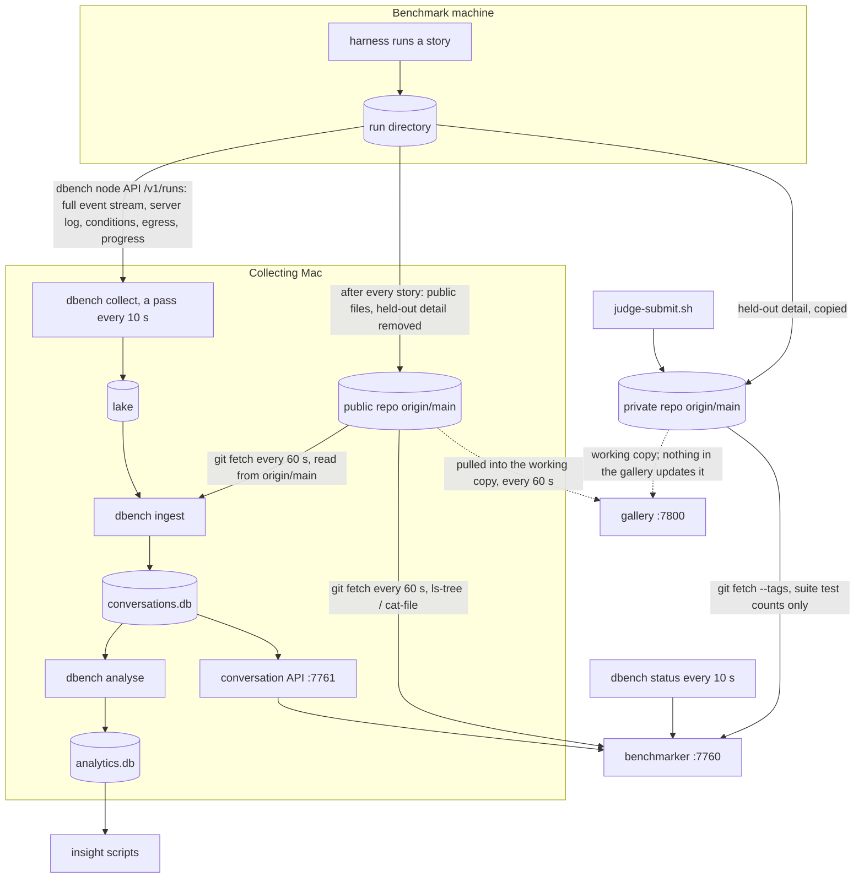

# Data provenance and flow

Where each piece of benchmark data is made, where it is copied to, what reads it, and how old
it can be when it gets there. Written from the code (file and function named beside each
claim), not from other documents. What was not traced is listed at the end; read that section
before relying on this one.

## The stores

| Store | Where it lives | Written by | Holds |
|---|---|---|---|
| **Run directory** | the benchmark machine's disk | the harness (`benchmarks/spec-bench/harness`) | everything a run produces |
| **Public repo, `origin/main`** | GitHub | the harness, after every story (`drive.record_story`, `drive.push_with_rebase`) | the published record of each run |
| **Private repo, `origin/main`** | GitHub | the harness (`drive.record_private`), `judge-submit.sh` | held-out detail, audits, judge results |
| **Lake** | `<store>/<node>/<run path>/` on the collecting Mac | `dbench collect` (`tools/dbench/src/collector.rs`) | byte-for-byte copies of files git never carries, plus `collection.json` |
| **Warehouse** | `conversations.db` on the collecting Mac | `dbench ingest`, run by the collector after each pass | conversations: story runs, calls, tool calls, timings |
| **Analytics** | `analytics.db`, beside the warehouse | `dbench analyse`, run by the collector after an ingest (`analytics::after_ingest`) | derived thinking tables; the insight scripts add `theme*` tables |

## The flow

## Provenance, by kind of data

### 1. The published record (public repo)

- **Made by** the harness. `drive.record_story` commits exactly the run's directory and pushes
  to `origin` after every story. A failed push is reported, never fatal; the record stays
  committed locally and the next story's push carries the backlog.
- **Contains** `metrics.json`, `run.json`, `run-status.json`, `summary.md`, `finalize.json`,
  per-story `gate.json`, `prompt.md`, `base-commit`, `accept-summary.json` (counts only), the
  agent's workspace, and `workspace.bundle`.
- **Also contains the agent's conversation, deliberately:** `AGENT_OWN_FILES` in
  `publicise.py` lists `agent-events.compact.jsonl.gz` as the agent's own record, which is
  published. The full `agent-events.jsonl` is not.
- **Removed before commit** (`publicise.is_private`): held-out results (`accept.json`,
  `accept-report.json`, `accept-final.json`), audits (`audit.jsonl`, `AUDIT.md`), and the
  `artifacts/`, `screenshots/` and `scoring-N` directories under a story. Each result keeps a
  public summary with counts only. Credentials are replaced by a marker and counted. A commit
  is refused if a staged file contains a held-out test title.
- **Read by** the benchmarker (from `origin/main`), the warehouse ingest (from `origin/main`),
  and the gallery (from its working copy).

### 2. Held-out detail (private repo)

- **Made by** the harness. `drive.record_private` copies the run's private files (see above)
  to `<private>/runs/<run path>/` and pushes a commit built with git plumbing on the remote's
  `main`, never on the checkout's HEAD.
- **Judge results** go to `gradings/<package>/results/<judge>/` by `judge-submit.sh`, which
  pushes from a temporary checkout. `judge_collect.py` reads them from the private
  `origin/main`, fetched first.
- **Read by** the benchmarker (`git fetch --tags`, then test counts per story at a suite
  version tag) and by the gallery (working copy: `audit.jsonl`, `gradings/`, and the scope
  file).

### 3. Files git never carries (lake)

- **Made by** the harness on the node: `agent-events.jsonl` (full stream), `server.log`,
  `proxy.log`, `conditions.jsonl` per story, the egress log, `progress.json`.
- **Moved by** `dbench collect`. Each pass lists every node's runs (`GET /v1/runs`), then
  each run's files (`/v1/runs/files`), then pulls what it does not hold (`/v1/runs/file`).
  An append-only file resumes from its local length, after a prefix check of the last
  4096 bytes; a file the node rewrote is fetched again from 0. `progress.json` is pulled
  whole.
- **Not pulled:** reference-model runs (`benchmarks/reference/...`) and archived runs
  (`collector::wanted`). A reference run's raw files never enter the lake.
- **`collection.json`** records bytes, times and completeness only. A run is complete once its
  `run-status.json` is final, its job has ended, every file is held to its end, and a further
  look 60 s later shows no change. A complete run is looked at again every hour.

### 4. The warehouse, `conversations.db`

- **Inputs:** the compact log and published records from `origin/main` (`GitSource`,
  `git fetch` first, never the working copy), and the full stream, server log and conditions
  from the lake.
- **When:** after a pass in which any file changed, or on the 60 s fetch tick
  (`DEFAULT_FETCH_EVERY_MS`). Only stories whose input digest changed are re-ingested.
- **Reference-model conversations are left out** of the warehouse.
- **Read by** the conversation API (`127.0.0.1:7761`), which the benchmarker proxies.

### 5. Analytics, `analytics.db`

- **Made from** the warehouse, read-only, right after each ingest. A pass that ingested
  nothing skips it if the file exists. A story run is recomputed only when its warehouse inputs
  or the analytics code changed.
- **Its failure never stops collection:** it prints one line to stderr and the loop carries
  on. The file can therefore fall behind the warehouse without anything upstream noticing.
- **Read by** the insight scripts in `benchmarks/docs/insights/thinking/`, and a dbench test.
  Neither the benchmarker nor the gallery reads it.

## The three readers and how old their data can be

| Reader | Reads | Refresh | Reads the working copy? |
|---|---|---|---|
| **Benchmarker** `tools/benchmarker/server/sources.ts` | public `origin/main` via `git ls-tree` and `git cat-file`; `dbench status`; the conversation API | repo every 60 s; dbench every 10 s; page every 5 s | No |
| **Collector, ingest** `tools/dbench/src/ingest/inputs.rs` | public `origin/main`; the lake | pass every 10 s; fetch every 60 s | No |
| **Gallery** `tools/vidi-gallery/src/runs.rs`, `sync.rs` | public working copy; private working copy | public: `git pull --ff-only` every 60 s, since commit `c7dd88f3f`; private: never | **Yes** |

The gallery was the only reader of a working copy, which is how a finished run could be
missing from it. A local edit that conflicts with the pull makes git refuse; the checkout is
left as it was and the reason goes to the gallery's stderr.

## What was not traced

- What updates the private working copy on the Mac that runs the gallery. The harness pushes
  to the private `origin/main`, but nothing in the gallery pulls it.
- Whether `analytics.db` is actually level with `conversations.db` right now.
- The contents of the 84 tracked `agent-events.compact.jsonl.gz` files under
  `benchmarks/reference/vidi/`: how much of a Claude reference run's conversation they hold.
  The lake and the warehouse exclude reference runs; git does not.
- Whether the Mac's `state/` folder, which holds the lake and both databases, is itself
  private.
- Harness-side details beyond the two functions named above: how `finalize.json` and rescore
  records are produced and pushed.
